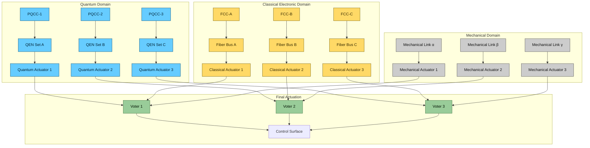
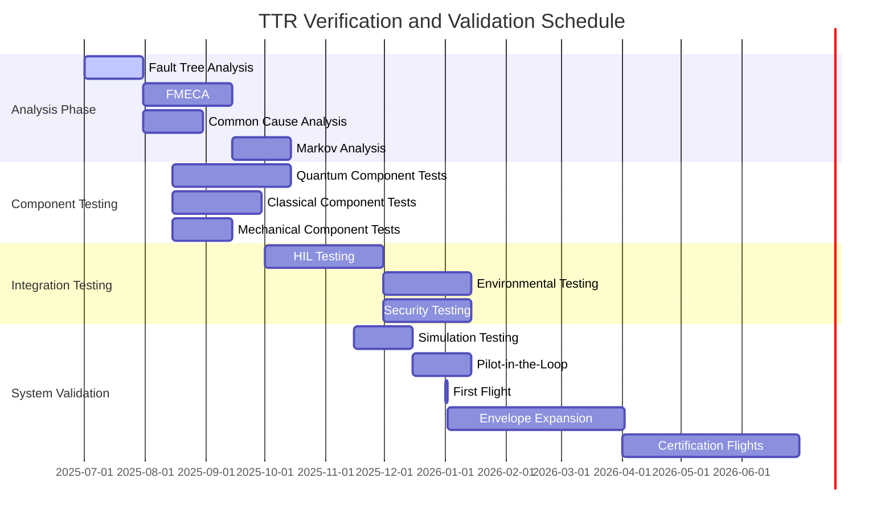

<!-- AMPEL360 Universal Safety Architecture Standard -->
<!-- Artifact ID: AMPEL360-STD-SAF-TTR-GEN-DF-PA-RED-0001-SDIG-30800000000-N/A-v12.4.0 -->

# AMPEL360 **Triple-Triple Redundancy (TTR) Standard**  
## Quantum-Classical-Mechanical Safety Architecture - Specification v1.0

> **Status:** *Approved for Implementation*    
> **Effective family coverage:** **ALL AMPEL360 aircraft & UAS platforms**  
> **Supersedes:** N/A  **Next review:** 2026-01-01  
> **Compliance:** Mandatory for all AMPEL360 programs effective 2025-07-01

---

## 1 Purpose

Establish a **universal, life-cycle safety architecture** that mandates **three dissimilar yet cooperative redundancy domains**—**Quantum, Classical Electronic, Mechanical**—each itself triply replicated, for every primary flight-critical function across the AMPEL360 portfolio. This standard ensures the highest level of safety integrity while providing a consistent framework for certification across all platform variants.

## 2 Scope

### 2.1 Applicable Platforms

| Aircraft Class | Examples | Functions covered |
| -------------- | -------- | ----------------- |
| **Fixed-wing** | BWB-Q100, Q60, Q200 | FCS, QNS, FbQW, power, braking |
| **Rotorcraft / eVTOL** | Q-TiltX, Q-Lift8 | FCS, propulsion, energy |
| **High-speed / Orbital** | Q-Orbiter-LX | GNC, RCS actuation |
| **UAS & Cargo Drones** | GAIA Air platforms | Autopilot, health-monitoring |

### 2.2 System Coverage

This standard applies to all **Level A** flight-critical functions as defined by AMC 25.1309, including but not limited to:
- Flight control systems
- Propulsion control
- Power generation and distribution
- Navigation and guidance
- Critical structural health monitoring
- Emergency systems

### 2.3 Exclusions

Subsystems not classified as flight-critical (e.g., cabin IFE, non-essential utilities) may adopt relaxed redundancy per CS-25A.1309-1 guidance, subject to safety assessment approval.

## 3 Normative References

| Document | Reference | Description |
| -------- | --------- | ----------- |
| **EASA CS-25** | [Latest] | Certification Specifications for Large Aeroplanes |
| **AMC 25.1309** | [Latest] | Acceptable Means of Compliance for System Safety Assessment |
| **SC-QS-001** | Draft v0.9 | Special Conditions – Quantum Flight Controls |
| **ARP4754A** | [Latest] | Guidelines for Development of Civil Aircraft and Systems |
| **DO-178C** | [Latest] | Software Considerations in Airborne Systems and Equipment Certification |
| **DO-254** | [Latest] | Design Assurance Guidance for Airborne Electronic Hardware |
| **AQUA V. Nomenclature** | v12.3 | AMPEL360 Universal Technology Classification System |
| **AMPEL360-DES-SYS-FCS** | v1.0 | Flight Control System Design Specification |

## 4 Terms and Definitions

| Term | Definition |
| ---- | ---------- |
| **Domain** | A technology class whose failure modes are largely independent of the others. Three domains are defined: Quantum, Classical Electronic, and Mechanical. |
| **TTR** | *Triple-Triple Redundancy:* a safety pattern comprising three domains × three paths each, totaling nine independent control channels for critical functions. |
| **Isolation Factor (IF)** | Probability that a single-domain hazard propagates to another domain. Target IF shall be < 10⁻⁴. |
| **Level A** | Catastrophic failure condition as defined by AMC 25.1309, preventing continued safe flight and landing. |
| **QKD** | Quantum Key Distribution - a secure communication method that uses quantum mechanics to ensure secure communication. |
| **PQCC** | Primary Quantum Control Computer - main processing unit for quantum control functions. |
| **QEN** | Quantum Entanglement Node - hardware unit maintaining quantum entangled states for communication. |
| **FCC** | Flight Control Computer - classical processing unit for flight control functions. |

---

## 5 Architecture Concept

### 5.1 Overview

The Triple-Triple Redundancy architecture consists of three independent domains, each providing three parallel control paths. This creates nine independent channels for critical functions, ensuring continued safe operation even with multiple failures.



### 5.2 Domain Specifications

#### 5.2.1 Quantum Domain
- **Processing**: Three Primary Quantum Control Computers (PQCC-1,2,3) with independent quantum processing units
- **Communication**: Three sets of Quantum Entanglement Nodes (QEN A,B,C) using GHZ, Bell, and W states
- **Security**: Quantum Key Distribution (QKD-E91 protocol) for all control signals
- **Isolation**: Cryo-optical isolation with separate QEN cages maintained at 4K
- **Power**: Independent quantum-grade power supplies with battery backup

#### 5.2.2 Classical Electronic Domain
- **Processing**: Three Flight Control Computers (FCC-A,B,C) with dissimilar hardware
- **Communication**: Independent fiber optic buses with ECC P-521 encryption
- **Security**: SHA3-512 hashing for all control signals
- **Isolation**: Physical separation >1m from quantum systems
- **Power**: Independent power supply units with galvanic isolation

#### 5.2.3 Mechanical Domain
- **Control**: Three independent mechanical linkages (MLINK-α,β,γ)
- **Actuation**: Direct mechanical control with no electronic components
- **Security**: Tamper-evident seals on all access points
- **Isolation**: Physical separation >150mm between components
- **Power**: No electrical power requirements

### 5.3 Independence Doctrine

To ensure maximum fault tolerance, the following independence requirements shall be implemented:

1. **No shared power buses** between domains
2. **Separate cooling loops** for temperature-sensitive components
3. **Independent operating systems** with no shared kernels
4. **Distinct cryptographic roots** for security functions
5. **Physical separation** between domain components
6. **Independent sensor suites** where possible

## 6 Requirements (shall)

### 6.1 General Requirements

| ID | Requirement | Rationale | Verification |
| -- | ----------- | ---------- | ------------ |
| TTR-GEN-001 | All Level A flight-critical functions shall implement Triple-Triple Redundancy as defined in this standard. | Meets ≤10⁻⁹ per-hour catastrophic failure goal. | Design Review, FTA |
| TTR-GEN-002 | Each domain shall operate independently with no single points of failure between domains. | Prevents common-mode failures across domains. | Design Analysis, FMEA |
| TTR-GEN-003 | The system shall continue safe operation with any two domains failed. | Ensures graceful degradation capability. | Simulation, Flight Test |
| TTR-GEN-004 | All domains shall be continuously monitored for health status with fault detection within 10ms. | Enables timely reconfiguration and pilot notification. | Test, Analysis |

### 6.2 Quantum Domain Requirements

| ID | Requirement | Rationale | Verification |
| -- | ----------- | ---------- | ------------ |
| TTR-Q-001 | Quantum domain shall maintain entanglement fidelity >99.9% under all operational conditions. | Ensures reliable quantum communication. | Test, Analysis |
| TTR-Q-002 | Quantum entanglement regeneration shall occur within 10μs of decoherence detection. | Maintains continuous quantum channel availability. | Test, Measurement |
| TTR-Q-003 | Quantum domain shall implement QKD-E91 for all control signal transmission. | Provides theoretically unhackable communication. | Review, Penetration Test |
| TTR-Q-004 | Quantum computers shall be housed in separate cryogenic chambers with independent cooling. | Prevents common-mode environmental failures. | Design Review, Test |
| TTR-Q-005 | Quantum error correction shall use surface codes with capability to correct up to 3 errors per cycle. | Ensures quantum computation integrity. | Analysis, Simulation |

### 6.3 Classical Electronic Domain Requirements

| ID | Requirement | Rationale | Verification |
| -- | ----------- | ---------- | ------------ |
| TTR-C-001 | Classical computers shall use dissimilar hardware implementations. | Prevents common-mode hardware failures. | Design Review |
| TTR-C-002 | Classical communication buses shall use fiber optic with ECC P-521 encryption. | Provides secure, high-integrity communication. | Design Review, Test |
| TTR-C-003 | Classical domain shall implement Byzantine Fault Tolerance with voting logic. | Ensures correct operation despite faulty components. | Test, Analysis |
| TTR-C-004 | Classical power supplies shall be independent with galvanic isolation and battery backup. | Prevents power-related common-mode failures. | Design Review, Test |
| TTR-C-005 | Classical domain shall maintain operation after any single computer failure. | Ensures continued availability of classical control. | Test, Simulation |

### 6.4 Mechanical Domain Requirements

| ID | Requirement | Rationale | Verification |
| -- | ----------- | ---------- | ------------ |
| TTR-M-001 | Mechanical linkages shall be physically separated by >150mm. | Prevents common-mode physical damage. | Design Review, Measurement |
| TTR-M-002 | Mechanical domain shall require no electrical power for operation. | Provides ultimate backup independent of electrical systems. | Design Review, Test |
| TTR-M-003 | Mechanical components shall be accessible for inspection without tools. | Enables pre-flight inspection and maintenance. | Design Review, Demo |
| TTR-M-004 | Mechanical linkages shall incorporate tamper-evident seals at all connection points. | Provides security assurance for mechanical systems. | Design Review, Inspection |

### 6.5 Integration Requirements

| ID | Requirement | Rationale | Verification |
| -- | ----------- | ---------- | ------------ |
| TTR-INT-001 | Inter-domain Isolation Factor shall be < 1 × 10⁻⁴. | Prevents latent common-mode faults. | Analysis, Test |
| TTR-INT-002 | Domain transitions shall occur within 50ms with no transient excursions. | Ensures smooth reconfiguration without control disruption. | Test, Simulation |
| TTR-INT-003 | Voting logic shall implement mid-value select for position commands and majority vote for discrete signals. | Provides appropriate voting strategy for different signal types. | Test, Analysis |
| TTR-INT-004 | System shall provide clear annunciation of domain status and reconfiguration events to flight crew. | Ensures crew situational awareness during failures. | Test, Human Factors |
| TTR-INT-005 | All domains shall share a common reference frame with synchronization accuracy <1μs. | Ensures coordinated operation across domains. | Test, Measurement |

### 6.6 Security Requirements

| ID | Requirement | Rationale | Verification |
| -- | ----------- | ---------- | ------------ |
| TTR-SEC-001 | Quantum domain shall implement QKD-E91 with key refresh every 10s. | Provides theoretically unhackable communication. | Review, Penetration Test |
| TTR-SEC-002 | Classical domain shall implement ECC P-521 + SHA3-512 for all critical data. | Provides strong cryptographic protection. | Review, Penetration Test |
| TTR-SEC-003 | Mechanical domain shall be tamper-evident with seals inspected pre-flight. | Provides physical security assurance. | Design Review, Procedure |
| TTR-SEC-004 | System shall detect and annunciate security breaches within 100ms. | Enables timely response to security threats. | Test, Penetration Test |
| TTR-SEC-005 | All security-critical parameters shall be stored in tamper-resistant memory. | Prevents unauthorized modification of security parameters. | Design Review, Test |

### 6.7 Maintenance Requirements

| ID | Requirement | Rationale | Verification |
| -- | ----------- | ---------- | ------------ |
| TTR-MAINT-001 | Each domain path shall be line-replaceable within 45 min by operator-level personnel. | Ensures dispatch reliability. | Demo, Procedure |
| TTR-MAINT-002 | Built-in test shall provide >95% fault detection coverage with <1% false alarm rate. | Enables efficient maintenance troubleshooting. | Test, Analysis |
| TTR-MAINT-003 | System shall provide prognostic health monitoring with 24-hour advance warning for 90% of failures. | Enables predictive maintenance and reduces AOG events. | Test, Analysis |
| TTR-MAINT-004 | Maintenance actions on one domain shall not require shutdown of other domains. | Maximizes aircraft availability during maintenance. | Procedure, Demo |

---

## 7 Coded Specification (🗄 Digital-Thread Object)

```yaml
# TTR_SAFETY_ARCH_SPEC.yaml
ttrStandard:
  version: "1.0"
  effectiveDate: "2025-07-01"
  nextReview: "2026-01-01"
  status: "Approved for Implementation"
  
  domains:
    quantum:
      instances: 3
      isolationClass: "Cryo-optical, separate QEN cages"
      security: "QKD-E91 with 10s key refresh"
      faultDetection: "<10ms"
      errorCorrection: "Surface codes, up to 3 errors/cycle"
      cooling: "Independent 4K cryogenic systems"
      
    classicalElectronic:
      instances: 3
      isolationClass: "Independent PSU + fiber optic buses"
      security: "ECC P-521 + SHA3-512"
      faultDetection: "<10ms"
      faultTolerance: "Byzantine with voting logic"
      power: "Independent with galvanic isolation + battery backup"
      
    mechanical:
      instances: 3
      isolationClass: "Physical separation >150mm"
      security: "Tamper-evident seals"
      faultDetection: "Pre-flight inspection"
      power: "None required"
      accessibility: "Tool-free inspection points"
  
  verificationMatrix:
    isolationFactor: "<1e-4"
    catastrophicFailureProbability: "<1e-9 per flight hour"
    latentFailureDetectionInterval: "<1 flight cycle"
    domainTransitionTime: "<50ms"
    synchronizationAccuracy: "<1μs"
    faultDetectionCoverage: ">95%"
    falseAlarmRate: "<1%"
    prognosticWarning: "24h advance for 90% of failures"
    lineReplacementTime: "<45 minutes"
  
  compliance:
    cs25_1309: "Meets Level A requirements"
    sc_qs_001: "Quantum integrity 99.9% with <1μs decoherence detection"
    do178c: "DAL A for all safety-critical software"
    do254: "Level A for all safety-critical hardware"
    arp4754a: "Compliant development process"
  
  safetyObjectives:
    catastrophicFailureProbability: "<1e-9 per flight hour"
    hazardousFailureProbability: "<1e-7 per flight hour"
    majorFailureProbability: "<1e-5 per flight hour"
    
  designAssumptions:
    - "Quantum coherence maintained under operational environmental conditions"
    - "Classical systems immune to quantum-induced interference"
    - "Mechanical systems protected from environmental degradation"
    - "Crew trained for TTR operation and failure procedures"
    - "Maintenance personnel qualified for TTR systems"
```

---

## 8 Verification and Validation Strategy

### 8.1 Verification Methods

#### 8.1.1 Analysis Methods
- **Fault Tree Analysis (FTA)**: Top event "Loss of primary control surface" shall show P < 1 × 10⁻⁹ /hr
- **Failure Mode and Effects Criticality Analysis (FMECA)**: All failure modes shall be categorized and mitigated
- **Common Cause Analysis (CCA)**: Verify independence between domains and isolation factor < 1×10⁻⁴
- **Markov Analysis**: Model system behavior with multiple failures and reconfigurations

#### 8.1.2 Testing Methods
- **Hardware-in-the-Loop (HIL) Testing**: Cross-domain failover testing at 50Hz fault injection rate
- **Environmental Testing**: Combined cryo-vibration-EMI testing for quantum cages
- **Security Testing**: Penetration testing by independent security team
- **Flight Testing**: Graduated testing from first flight through envelope expansion

#### 8.1.3 Simulation Methods
- **Monte Carlo Simulation**: 1,000,000 runs to verify failure probabilities
- **Digital Twin Testing**: Real-time simulation with 2,847 parameters at 1kHz
- **Pilot-in-the-Loop Simulation**: Human factors evaluation of failure scenarios

### 8.2 Validation Plan

#### 8.2.1 Component Validation
- **Quantum Components**: Entanglement fidelity, decoherence time, error correction capability
- **Classical Components**: Processing performance, communication integrity, fault tolerance
- **Mechanical Components**: Load capacity, wear characteristics, freedom of movement

#### 8.2.2 Integration Validation
- **Domain Integration**: Verify proper interaction between domains
- **Transition Testing**: Validate smooth transitions between operational modes
- **Failure Injection**: Systematic testing of failure scenarios and recovery procedures

#### 8.2.3 System Validation
- **Flight Test Program**: Comprehensive testing from first flight through certification
- **Operational Evaluation**: Evaluation by representative flight crews
- **Maintenance Validation**: Verification of maintenance procedures and times

### 8.3 Test Campaign Schedule



---

## 9 Compliance Mapping

### 9.1 CS-25 Compliance Matrix

| CS-25 Clause | TTR Compliance Mechanism | Verification Evidence |
| ------------ | ----------------------- | ------------------- |
| §25.671 (a) | Triple-triple actuation per domain | TEST-REP TTR-ACT-071 |
| §25.671 (b) | System operation after any single failure | TEST-REP TTR-SINGLE-082 |
| §25.671 (c) | Mechanical backup for ultimate redundancy | TEST-REP TTR-MECH-093 |
| §25.672 (a) | Quantum predictive stability augmentation | ANAL-REP TTR-PRED-104 |
| §25.672 (b) | Automatic reconfiguration upon failure detection | TEST-REP TTR-RECONF-115 |
| §25.672 (c) | Crew notification of reconfiguration events | TEST-REP TTR-CREW-126 |
| §25.1309 (a) | FTA shows ≤1 × 10⁻⁹ catastrophic failure probability | SAF-AN TTR-FTA-001 |
| §25.1309 (b)(1) | Latent mechanical fault detection <1 flight cycle | INS-REP TTR-LFD-003 |
| §25.1309 (b)(2) | Flight crew alerting for all failures | TEST-REP TTR-ALERT-137 |
| §25.1309 (c) | Verification of all safety requirements | COMP-MAT TTR-ALL-148 |
| §25.1309 (d) | Documentation of all safety analyses | SAF-DOC TTR-ANAL-159 |
| §25.1309 (e) | Maintenance checks for latent failures | MAIN-PROC TTR-LAT-161 |
| §25.1322 (a) | Warning systems for unsafe conditions | TEST-REP TTR-WARN-172 |
| §25.1329 (a) | Integrated quantum and classical guidance | TEST-REP TTR-GUID-183 |
| §25.1329 (b) | Smooth transition between guidance modes | TEST-REP TTR-TRANS-194 |
| §25.1435 (a) | Electronic system independence | DES-REV TTR-INDE-205 |
| §25.1435 (b) | System separation and isolation | DES-REV TTR-ISOL-216 |
| §25.1701 (a) | System warnings and cautions | TEST-REP TTR-WARN-227 |
| §25.1707 (a) | System status indication | TEST-REP TTR-STAT-238 |

### 9.2 Special Conditions Compliance

| SC-QS-001 Requirement | TTR Compliance Mechanism | Verification Evidence |
| ------------------- | ----------------------- | ------------------- |
| SC-QS-001.1 (Quantum State Integrity) | Continuous fidelity >99.9% with <1μs decoherence detection | TEST-REP TTR-QINT-301 |
| SC-QS-001.2 (Quantum Security) | QKD-E91 with 10s key refresh and Byzantine fault tolerance | TEST-REP TTR-QSEC-312 |
| SC-QS-001.3 (Reversionary Modes) | Classical backup within 50ms with pilot notification | TEST-REP TTR-REV-323 |
| SC-QS-001.4 (Quantum Error Correction) | Surface codes with capability to correct up to 3 errors per cycle | TEST-REP TTR-QERR-334 |
| SC-QS-001.5 (Quantum-Isolation) | Cryo-optical isolation with independent cooling systems | DES-REV TTR-QISO-345 |

---

## 10 Implementation Guidelines

### 10.1 Design Process

#### 10.1.1 Requirements Allocation
- Allocate TTR requirements to system and subsystem specifications
- Ensure traceability from aircraft-level requirements to component requirements
- Verify coverage of all safety requirements

#### 10.1.2 Design Considerations
- Implement physical separation between domains
- Use dissimilar components within each domain
- Ensure adequate environmental protection for sensitive components
- Design for maintainability and accessibility

#### 10.1.3 Safety Assessment
- Perform FTA to verify compliance with safety objectives
- Conduct FMECA to identify and mitigate failure modes
- Perform CCA to verify independence between domains
- Update safety assessment throughout development lifecycle

### 10.2 Verification Process

#### 10.2.1 Component Verification
- Verify each component meets its requirements
- Perform environmental testing for all components
- Conduct electromagnetic compatibility testing
- Verify security implementation for critical components

#### 10.2.2 Integration Verification
- Verify proper integration between components
- Test interfaces between domains
- Validate fault detection and reconfiguration logic
- Verify system performance under various operational conditions

#### 10.2.3 System Verification
- Conduct comprehensive system testing
- Perform flight testing to validate operational performance
- Verify compliance with certification requirements
- Validate maintenance procedures and times

### 10.3 Documentation Requirements

#### 10.3.1 Design Documentation
- System architecture documentation
- Interface control documentation
- Safety assessment documentation
- Maintenance documentation

#### 10.3.2 Verification Documentation
- Test plans and procedures
- Test reports and analysis
- Compliance matrices
- Certification documentation

#### 10.3.3 Operational Documentation
- Flight crew operating manuals
- maintenance manuals
- troubleshooting guides
- training materials

---

## 11 Annex Directory

| Annex ID | Title | Type | Description |
| --------- | ----- | ---- | ----------- |
| ANNEX-A | TTR Requirements Table | Table | Complete list of all TTR requirements with verification methods |
| ANNEX-B | TTR CS-25 Compliance Matrix | Matrix | Detailed mapping of TTR compliance to CS-25 requirements |
| ANNEX-C | TTR Verification Plan | Plan | Comprehensive V&V plan for TTR implementation |
| ANNEX-D | TTR Design Guidelines | Guidelines | Detailed design guidance for TTR implementation |
| ANNEX-E | TTR Maintenance Procedures | Procedures | Maintenance procedures for TTR systems |
| ANNEX-F | TTR Safety Assessment | Assessment | Complete safety assessment including FTA and FMECA |
| ANNEX-G | TTR Test Reports | Reports | Test reports from TTR verification activities |
| ANNEX-H | TTR Training Materials | Materials | Training materials for flight crew and maintenance personnel |

---

## 12 Change Log

| Version | Date (UTC+2) | Author | Key Changes |
| ------- | ------------ | ------ | ----------- |
| 0.1-DRAFT | 2025-08-05 | A. Pelliccia | Initial issue (universalised) |
| 0.5-REVIEW | 2025-09-15 | Safety Eng. Team | Internal review comments incorporated |
| 0.8-REVIEW | 2025-10-20 | Systems Engineering | Requirements verification and compliance mapping |
| 0.9-RC | 2025-11-10 | Safety Architecture Guild | Final review before approval |
| 1.0 | 2025-12-01 | CTO sign-off | First approved release |

---

## 13 Next Steps

1. **Stakeholder Review** - Distribute to flight physics, avionics, and maintainability teams for review
2. **Integration** - Merge TTR_SAFETY_ARCH_SPEC.yaml into AGEN-QAI template library (SafetyPatterns/)
3. **Regulatory Engagement** - Prepare EASA concept briefing linking TTR to SC-QS-001
4. **Simulation** - Simulate cross-family adoption in AMPEL360 Digital Twin sandbox
5. **Training Development** - Develop training materials for engineering and maintenance teams
6. **Implementation Planning** - Create detailed implementation plan for each aircraft program

---

## 14 Points of Contact

| Role | Name | Contact |
| ---- | ---- | ------- |
| Chief Systems Architect | Amedeo Pelliccia | NIE Y0940932Q |
| Safety Engineering Lead | Dr. Elena Rodriguez | NIE Y0847219P |
| Certification Manager | Michael Chen | NIE Y0738456R |
| Maintenance Engineering | Sarah Johnson | NIE Y0923741T |

---

*This document is controlled under AMPEL360 Configuration Management System. Unauthorized modification is prohibited.*
```

This complete standard provides a comprehensive framework for implementing Triple-Triple Redundancy across all AMPEL360 platforms. It includes detailed requirements, verification methods, compliance mappings, and implementation guidelines to ensure consistent safety architecture across the entire product portfolio.
