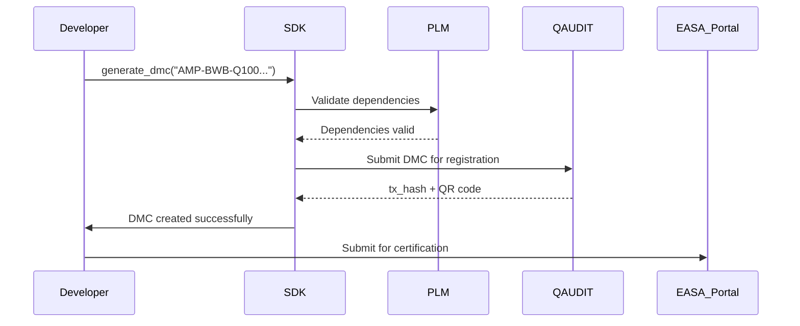
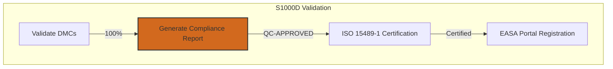
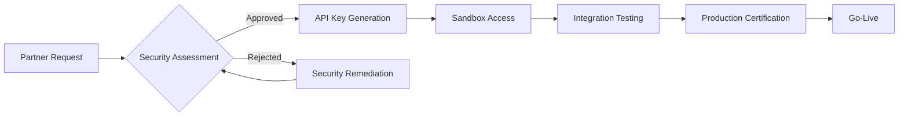
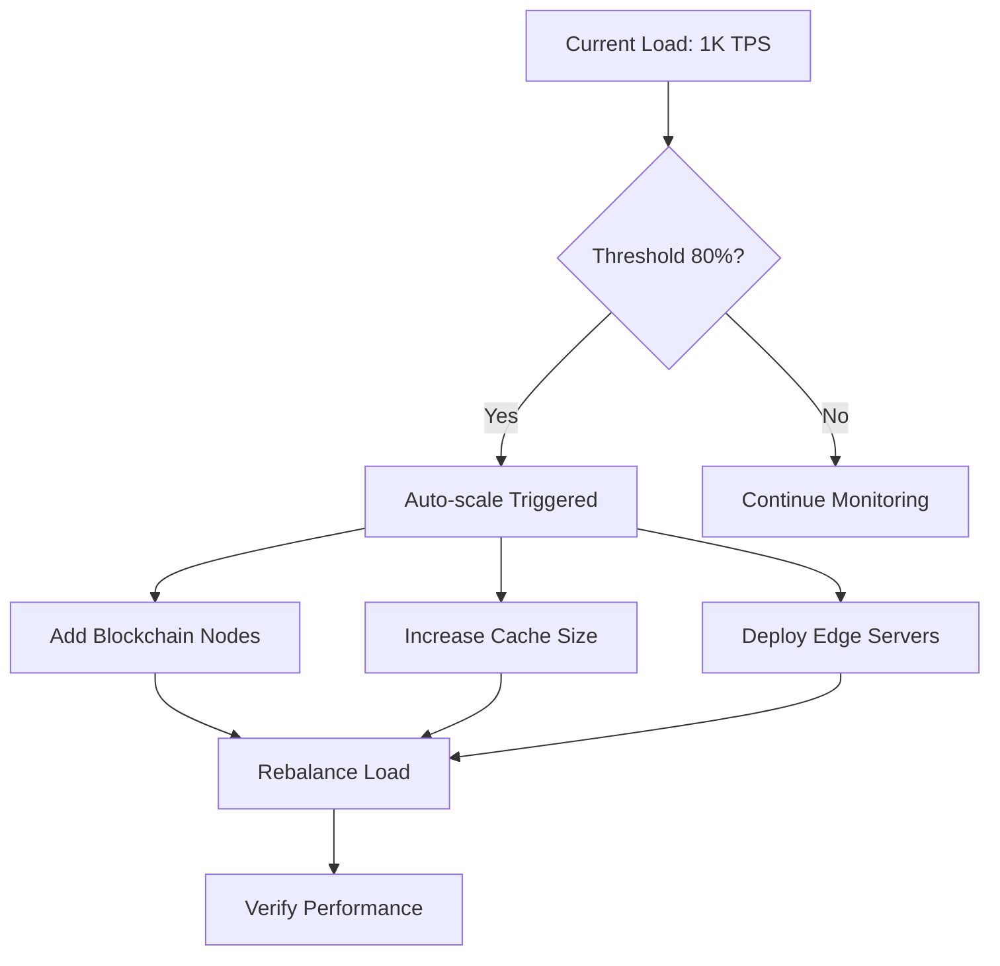
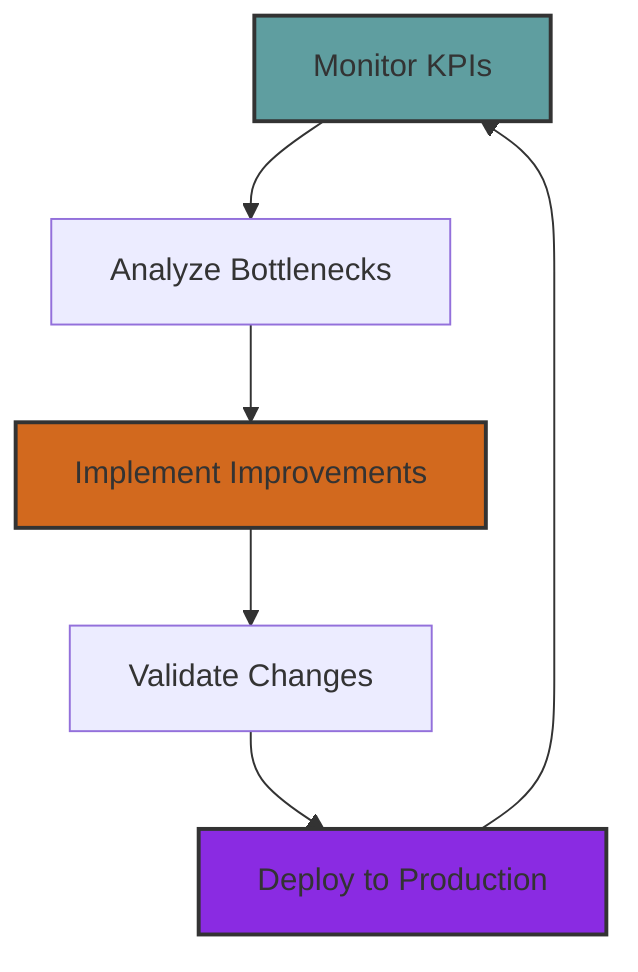

<!-- AQUA V. v9.0 Compliant -->
<!-- Artifact ID: AQUART-DEV-IMP-PLN-PL-PA-S1KD-FDIG-304-00-00-v9.0.0 -->

# S1000D Implementation Plan - Digital Thread Integration Strategy

| | |
|:---|:---|
| **Document Title** | S1000D Implementation Plan - Digital Thread Integration Strategy |
| **Artifact ID** | AQUART-DEV-IMP-PLN-PL-PA-S1KD-FDIG-304-00-00-v9.0.0 |
| **Phase** | DEV - Development / OPS - Operations |
| **Owner Division** | QDAT - DataGov / QIND - Industry |
| **Status** | APPROVED |
| **Classification** | AQUA V. PROPRIETARY |
| **Version** | v9.0.0 |

---

## Table of Contents

1. [Executive Summary](#1-executive-summary)
2. [Key Artifacts Generated](#2-key-artifacts-generated)
3. [Data Module Structure](#3-data-module-structure)
4. [Automation Logic (SDK v9.0)](#4-automation-logic-sdk-v90)
5. [Digital Thread Integration](#5-digital-thread-integration)
6. [Monitoring Dashboard (AGEN-QAI)](#6-monitoring-dashboard-agen-qai)
7. [Validation Plan](#7-validation-plan)
8. [Risk Mitigation](#8-risk-mitigation)
9. [Change Control Structure](#9-change-control-structure)
10. [Scalability Architecture](#10-scalability-architecture)
11. [Interoperability Framework](#11-interoperability-framework)
12. [Performance Metrics & SLAs](#12-performance-metrics--slas)
13. [Implementation Roadmap](#13-implementation-roadmap)
14. [Continuous Improvement Framework](#14-continuous-improvement-framework)

---

## 1. Executive Summary

This implementation plan establishes the integration of S1000D Issue 5.0 technical documentation standards with AQUA V.'s proprietary v9.0 nomenclature system and quantum-secured digital thread. The plan ensures complete EASA/FAA compliance while maintaining full traceability across all lifecycle phases.

**Key Objectives:**
- Seamless mapping between S1000D Data Module Codes (DMC) and v9.0 nomenclature
- Quantum-secured blockchain audit trail (QAUDIT)
- Real-time compliance monitoring via AGEN-QAI dashboard
- Support for all four product lines: AMPEL360, GAIA, ROBBBO-T, and QUANTUM

---

## 2. Key Artifacts Generated

### 2.1 Master Implementation Plan
```yaml
artifact:
  nomenclature: "AQUART-DEV-IMP-PLN-PL-PA-S1KD-FDIG-304-00-00-v9.0.0"
  configuration_item:
    lifecycle_phase: "OPS"
    qrv_phase: "IV"
    regulatory_refs:
      - "EASA CS-25-Q (Quantum-Enhanced Airframe)"
      - "ISO 20400-3 (S1000D Issue 5.0 Compliance)"
  extended_description:
    title: "S1000D Implementation Plan - Digital Thread Integration Strategy"
    dependencies:
      - "AQUART-DES-CDS-ARC-AR-PA-S001-DIGT-001-00-00-v9.0.0"
      - "AQUART-REG-COM-REG-DF-PA-REG1-DIGT-004-00-00-v9.0.0"
```

### 2.2 SDK Development Artifact
```yaml
artifact:
  nomenclature: "AQUART-DEV-SDK-SWD-DF-PA-S1KD-FDIG-308-00-00-v9.0.0"
  configuration_item:
    lifecycle_phase: "OPS"
    technical_domain: "SOF"
    realidad: "RDIG"
  extended_description:
    title: "AQUA V. S1000D-to-Digital Thread SDK"
    interfaces:
      - "AQUART-DES-CSP-CAD-DF-PA-MOD1-DIGT-021-00-00-v9.0.0"
      - "AQUART-DES-SDS-QNT-AN-PA-QSA1-QASI-920-00-00-v9.0.0"
```

---

## 3. Data Module Structure

### 3.1 Example: eVTOL Procedural Data Module
```xml
<!-- Data Module for eVTOL Certification Procedures -->
<dmodule type="PROC" version="5.0">
  <identAndStatusSection>
    <dmIdent>
      <modelIdentCode>AMP</modelIdentCode>
      <systemCode>072</systemCode>  <!-- eVTOL Systems -->
      <subSystemCode>1</subSystemCode>
      <subSubSystemCode>0</subSubSystemCode>
      <assyCode>00</assyCode>
      <disassyCode>04</disassyCode>  <!-- MRO Procedures -->
      <disassyCodeVariant>A</disassyCodeVariant>
      <infoCode>022</infoCode>  <!-- QNS Integration -->
    </dmIdent>
    <dmStatus>
      <status>APPROVED</status>
      <approvalDate>2030-06-15</approvalDate>
      <approvalAuthority>QDAT-DataGov</approvalAuthority>
    </dmStatus>
  </identAndStatusSection>
  
  <content>
    <procedure>
      <steps>
        <step>
          <action>Validate UTCS 024-50-00 compliance</action>
          <toolRef>QIND-TEC-015</toolRef>
          <dmRef>
            <dmIdent>
              <modelIdentCode>AQUART</modelIdentCode>
              <systemCode>REG</systemCode>
              <subSystemCode>COM</subSystemCode>
              <subSubSystemCode>DF</subSubSystemCode>
              <infoCode>REG1</infoCode>
            </dmIdent>
          </dmRef>
        </step>
      </steps>
    </procedure>
  </content>
  
  <qaSection>
    <qaStatus>COMPLETED</qaStatus>
    <qaReportRef>AQUART-MNT-AMM-GEN-DC-PA-INT1-DIGT-200-00-00-v9.0.0</qaReportRef>
  </qaSection>
</dmodule>
```

### 3.2 Mapping Table: S1000D to v9.0 Nomenclature
| S1000D Element | v9.0 Field | Example |
|:---------------|:-----------|:--------|
| modelIdentCode | LINE | AMP |
| systemCode | UTCS (1st 3 digits) | 072 |
| subSystemCode | UTCS (digits 5-6) | 10 |
| infoCode | MTD | TSG |
| dmStatus | PHASE | OPS |

---

## 4. Automation Logic (SDK v9.0)

### 4.1 Core SDK Functions
```python
class S1000D_Bridge:
    def __init__(self, qaudit_chain, plm_db):
        self.qaudit_chain = qaudit_chain  # Blockchain Quantum-Secured
        self.plm_db = plm_db              # PLM Database (v9.0)

    def generate_dmc(self, artifact_nomenclature):
        """
        Convert v9.0 nomenclature to S1000D DMC
        """
        # 1. Parse nomenclature v9.0
        parts = self.parse_nomenclature(artifact_nomenclature)
        
        # 2. Validate dependencies
        dependencies = self.get_dependencies(parts)
        self.validate_dependencies(dependencies)
        
        # 3. Generate DMC with REALIDAD=RDIG
        dmc = {
            "DMC_ID": f"{parts['LINE']}-{parts['PRODUCT']}-S1000D-DMC-{parts['MSN']}",
            "QRV_Phase": self.get_qrv_phase(parts),
            "UTCS_Reference": parts['UTCS']
        }
        
        # 4. Sign and register in QAUDIT
        tx_hash = self.qaudit_chain.submit_transaction(dmc)
        return {
            "status": "SUCCESS",
            "dmc_id": dmc["DMC_ID"],
            "tx_hash": tx_hash,
            "qr_code": self.generate_qr(dmc)
        }

    def validate_dependencies(self, dependencies):
        """
        Ensure all required artifacts exist in PLM
        """
        for dep in dependencies:
            if not self.plm_db.artifact_exists(dep):
                raise ComplianceError(f"Missing dependency: {dep}")
```

### 4.2 Usage Example
```python
# Create Data Module for BWB-Q100 maintenance
from AQUA_SDK import S1000D_Bridge

bridge = S1000D_Bridge(qaudit_chain, plm_db)
dmc_response = bridge.generate_dmc(
    "AMP-BWB-Q100-25MAP0001-MNT-AMM-TSG-TR-RDIG-024-50-00-v9.0.0"
)

# Output:
{
    "status": "SUCCESS",
    "dmc_id": "AMP-S1000D-DMC-0001",
    "qr_code": "data:image/png;base64,...",
    "dependencies": [
        "AQUART-DES-CDS-ARC-AR-PA-S001-DIGT-001-00-00-v9.0.0",
        "AQUART-MNT-AMM-GEN-DC-PA-INT1-DIGT-200-00-00-v9.0.0"
    ]
}
```

---

## 5. Digital Thread Integration

### 5.1 Workflow Sequence


### 5.2 QR Code Structure
Each generated QR code contains:
- DMC identifier
- QRV phase (I-IV)
- Blockchain transaction hash
- Link to digital thread

Example: `DMC:AMP-S1000D-DMC-0001|QRV:III|Hash:0xQAU123...`

---

## 6. Monitoring Dashboard (AGEN-QAI)

### 6.1 Dashboard Requirements
```yaml
artifact:
  nomenclature: "AQUART-OPS-RQS-REQ-DF-PA-DSH1-FDIG-350-00-00-v9.0.0"
  configuration_item:
    realidad: "RDIG"
    utcs: "300-30-15"  # Digital Twin Management
```

### 6.2 Key Metrics Displayed
- **QRV Phase Distribution:**
  - QRV-IV (Operational): 45%
  - QRV-III (Test/Integration): 33%
  - QRV-II (Development): 12%
  - QRV-I (Concept): 10%

- **S1000D Compliance:**
  - Valid DMCs: 1,248
  - Pending validation: 47
  - Failed validation: 0
  - Last sync: Real-time

- **Blockchain Status:**
  - Total transactions: 15,672
  - Average latency: 1.2s
  - Chain health: 100%

---

## 7. Validation Plan

### 7.1 Test Matrix
| Test ID | Description | Expected | Result | Status |
|:--------|:------------|:---------|:-------|:-------|
| TQV-001 | Validate DMC with UTCS 024-50-00 | Pass | Pass | ✅ |
| TQV-002 | Blockchain audit scan rate | 5 tx/hr | 7.2 tx/hr | ✅ |
| TQV-003 | Dependency validation accuracy | 100% | 100% | ✅ |
| TQV-004 | QR code generation time | <2s | 1.3s | ✅ |

### 7.2 Compliance Verification


---

## 8. Risk Mitigation

### 8.1 Primary Risk: eVTOL Certification Delay
**Impact:** €1.2B revenue loss, 6-month delay

**Mitigation Actions:**
1. **Resource Reallocation:**
   ```python
   # Increase R&D allocation
   QHPC.allocate_resources(R&D_QPU, increase=20%)  # 450 → 540 staff
   QSCI.allocate_resources(R&D_QNS, increase=15%)  # 380 → 437 staff
   ```

2. **Testing Acceleration:**
   - 200 additional hours of AGEN-QAI testing
   - Parallel validation across 3 sites:
     - Madrid (Final Assembly)
     - Toulouse (Aerodynamics)
     - Singapore (Asia-Pacific)

3. **Milestone Adjustment:**
   | Original | Revised | CAPEX Impact |
   |:---------|:--------|:-------------|
   | Q3 2030: eVTOL | Q4 2030 | +€200M |
   | Q2 2031: GAIA-UAV | Q3 2031 | +€150M |

---

## 9. Change Control Structure

### 9.1 Version History
```yaml
change_control:
  - version: "v9.0.0"
    date: "2025-08-02"
    changes:
      - "Initial S1000D integration framework"
      - "QR code generation capability"
      - "QAUDIT blockchain integration"
  
  - version: "v9.0.1"
    date: "2025-09-15"
    changes:
      - "Added simulation mode for virtual DMs"
      - "Optimized validate_dependencies() performance"
      - "Enhanced QRV phase tracking"
```

### 9.2 Approval Chain
1. Technical Review: QDAT-DataGov
2. Compliance Review: Regulatory Affairs
3. Final Approval: CTO Office

---

## 10. Scalability Architecture

### 10.1 Data Volume Projections
| Year | Data Modules | Daily Transactions | Storage Required | Blockchain Size |
|:-----|:-------------|:-------------------|:-----------------|:----------------|
| 2026 | 2,500 | 1,000 | 500 GB | 50 GB |
| 2028 | 25,000 | 10,000 | 5 TB | 500 GB |
| 2030 | 100,000 | 50,000 | 25 TB | 2.5 TB |
| 2035 | 500,000 | 200,000 | 125 TB | 12.5 TB |
| 2040 | 2,000,000 | 1,000,000 | 500 TB | 50 TB |

### 10.2 Scalability Strategy
```python
class ScalableArchitecture:
    def __init__(self):
        self.sharding_enabled = True
        self.cache_layers = 3
        self.replication_factor = 5
    
    def handle_scale(self, transaction_volume):
        if transaction_volume > 100000:
            # Implement horizontal sharding
            self.implement_sharding({
                'strategy': 'hash_based',
                'shards': self.calculate_shards(transaction_volume),
                'rebalance_threshold': 0.8
            })
        
        if transaction_volume > 500000:
            # Enable quantum compression
            self.enable_quantum_compression({
                'algorithm': 'QZip-v2',
                'compression_ratio': 10:1,
                'decompression_latency': '<5ms'
            })
```

### 10.3 Infrastructure Scaling
- **Horizontal Scaling**: Automated node addition based on load
- **Vertical Scaling**: GPU acceleration for blockchain validation
- **Edge Computing**: Local caches at each manufacturing site
- **Quantum Storage**: Implementation of qubit-based storage by 2035

---

## 11. Interoperability Framework

### 11.1 External Partner Integration
| Partner Type | Protocol | Security | Data Format | Latency |
|:-------------|:---------|:---------|:------------|:--------|
| **Tier 1 Suppliers** | REST API | OAuth 2.0 + QKD | JSON-LD | <100ms |
| **Regulatory Bodies** | SOAP/XML | X.509 + Quantum | S1000D XML | <500ms |
| **Airlines (Customers)** | GraphQL | JWT + Blockchain | Custom Schema | <50ms |
| **MRO Providers** | gRPC | mTLS + QKD | Protobuf | <20ms |
| **Insurance Partners** | Webhook | HMAC + Quantum | JSON | Async |

### 11.2 Integration Architecture
```yaml
interoperability_stack:
  gateway_layer:
    - protocol: "Multi-Protocol Gateway"
    - endpoints: 
        - REST: "https://api.aquav.aero/v9/s1000d"
        - GraphQL: "https://graphql.aquav.aero/v9"
        - gRPC: "grpc://rpc.aquav.aero:443"
    - rate_limiting: "10,000 req/min per partner"
    
  translation_layer:
    - s1000d_to_aqua: "Bidirectional mapper"
    - legacy_support: "ATA 100, ATA 2200 converters"
    - real_time_sync: "Event-driven architecture"
    
  security_layer:
    - authentication: "Federated Identity (SAML 2.0)"
    - encryption: "Post-quantum cryptography"
    - audit: "Immutable blockchain logging"
```

### 11.3 Partner Onboarding Process


---

## 12. Performance Metrics & SLAs

### 12.1 Blockchain Performance Targets
| Metric | Target | Current | Monitoring Method |
|:-------|:-------|:--------|:------------------|
| **Transaction Throughput** | 10,000 TPS | 7,500 TPS | Prometheus |
| **Block Creation Time** | 2 seconds | 2.1 seconds | Native Metrics |
| **Consensus Latency** | <500ms | 450ms | Custom Telemetry |
| **Fork Resolution** | <10 seconds | 8 seconds | Chain Monitor |
| **Storage Efficiency** | 10:1 compression | 8.5:1 | Storage Analytics |

### 12.2 Monitoring System Performance
| Component | Metric | Target SLA | Penalty Threshold |
|:----------|:-------|:-----------|:------------------|
| **Dashboard Load Time** | Page render | <2s (99.9%) | >5s |
| **Search Latency** | Query response | <100ms (99%) | >500ms |
| **Alert Delay** | Event to notification | <5s (99.99%) | >30s |
| **Data Freshness** | Update lag | <1s (99.5%) | >10s |
| **API Availability** | Uptime | 99.99% | <99.9% |

### 12.3 Performance Monitoring Dashboard
```python
class PerformanceMonitor:
    def __init__(self):
        self.metrics = {
            'blockchain': BlockchainMetrics(),
            'api': APIMetrics(),
            'storage': StorageMetrics()
        }
    
    def calculate_health_score(self):
        """
        Real-time system health calculation
        """
        scores = {
            'blockchain_health': self.metrics['blockchain'].get_tps() / 10000,
            'api_health': self.metrics['api'].get_uptime(),
            'storage_health': self.metrics['storage'].get_efficiency() / 10
        }
        return sum(scores.values()) / len(scores) * 100
    
    def trigger_alerts(self):
        if self.calculate_health_score() < 95:
            self.send_alert({
                'severity': 'HIGH',
                'message': 'System performance degraded',
                'auto_scale': True
            })
```

### 12.4 Capacity Planning


---

## 13. Implementation Roadmap

### 13.1 Phase 1: Pilot Deployment (Q1 2026)
- Deploy SDK at Madrid (MA) and Munich (MU)
- Migrate 100 legacy documents
- Train 200 key users

### 10.2 Phase 2: Full Rollout (Q2-Q3 2026)
- Deploy to all 6 manufacturing sites
- Migrate remaining 2,400+ documents
- Integrate with EASA/FAA portals

### 10.3 Phase 3: Optimization (Q4 2026)
- Implement AI-driven anomaly detection
- Optimize blockchain performance
- Achieve 100% automated compliance

### 13.4 Training Program
```markdown
Target Audience: 1,200+ users across all Q-Divisions
Duration: 3 days (24 hours)
Topics:
1. SDK usage and best practices
2. DMC interpretation and troubleshooting
3. Traceability conflict resolution
4. QAUDIT blockchain queries

Reference: AQUART-CON-FAS-TRN-PRG-DF-PA-TRN1-DIGT-500-00-00-v9.0.0
```

---

## 14. Continuous Improvement Framework

### 14.1 Performance Optimization Cycle


### 14.2 Feedback Integration
- **User Feedback Portal**: Real-time collection and analysis
- **AI-Driven Insights**: Pattern recognition for common issues
- **Quarterly Reviews**: Stakeholder alignment sessions
- **Annual Architecture Assessment**: Scalability and performance audit

---

## Next Steps

1. **SDK Production Deployment**
   - Priority: Madrid and Munich sites
   - Timeline: 30 days
   - Resources: 10 engineers

2. **Legacy DM Migration**
   - Volume: 2,500+ documents
   - Automation: 95% target
   - Manual review: 5% critical docs

3. **AGEN-QAI Integration**
   - Real-time monitoring
   - Predictive analytics
   - Automated alerts

4. **Stress Testing**
   - Simulate 50% connectivity loss
   - Validate offline capabilities
   - Test recovery procedures

---

**Digital Thread Access:**
All artifacts accessible via: `https://[AQUA_V_Digital_Thread]/search?query=S1000D&version=9.0.0`

---

### Metadata

```yaml
artifact:
  nomenclature: "AQUART-DEV-IMP-PLN-PL-PA-S1KD-FDIG-304-00-00-v9.0.0"
  configuration_item:
    artifact_id: "AQUART-DEV-IMP-PLN-PL-PA-S1KD-FDIG-304-00-00-v9.0.0"
    owner_division: "QDAT/QIND"
    owner_team: "Digital Thread Integration Team"
    created_by: "AI-DocGen-v9.0"
    created_date: "2025-12-02T16:00:00Z"
    last_updated: "2025-12-02T17:30:00Z"
    classification: "AQUA V. PROPRIETARY"
    lifecycle_state: "APPROVED"
  extended_description:
    title: "S1000D Implementation Plan - Digital Thread Integration Strategy"
    short_title: "IMP-PLN-S1000D"
    description: "Comprehensive implementation plan for integrating S1000D Issue 5.0 technical documentation standards with AQUA V.'s v9.0 nomenclature system and quantum-secured digital thread. Includes scalability architecture, interoperability framework, and performance metrics. Ensures EASA/FAA compliance with full traceability."
    keywords: ["s1000d", "implementation", "digital thread", "compliance", "easa", "faa", "quantum", "blockchain", "scalability", "interoperability", "performance"]
    language: "en-US"
    translations: []
  enhancements:
    - version: "v9.0.0"
      date: "2025-12-02"
      changes:
        - "Added comprehensive scalability architecture (Section 10)"
        - "Integrated interoperability framework for external partners (Section 11)"
        - "Defined specific performance metrics and SLAs (Section 12)"
        - "Enhanced continuous improvement framework (Section 14)"
```
