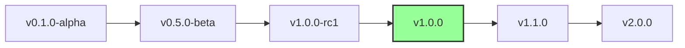
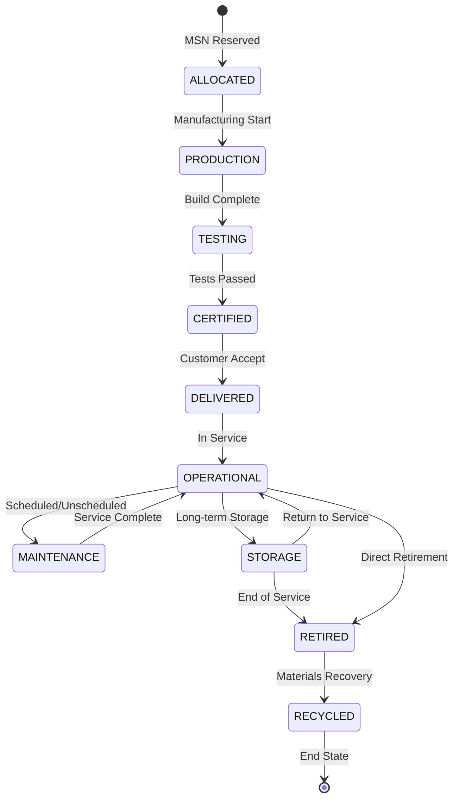

Here's the content for the `README.md` file that would reside in your `A.Q.U.A.-V./DOCUMENTACION_MASTER/NOMENCLATURE_v3.1/` directory. This file serves as the definitive reference for AQUA V.'s Official Nomenclature System, which is Annex D v3.1.

-----

# 📋 ANNEX D: Official Nomenclature System v3.1

## AQUA V. Complete Naming Convention & Digital Thread Architecture

This document establishes the mandatory naming conventions for all artifacts within the AQUA V. €40 billion quantum aerospace program. Adhering to this system is crucial for ensuring **unprecedented traceability, consistency, and digital thread integrity** across all phases and product lines.

-----

## 📑 Table of Contents

  * [D.1 General Nomenclature Rule](https://www.google.com/search?q=%23d1-general-nomenclature-rule)
  * [D.2 Field Definitions](https://www.google.com/search?q=%23d2-field-definitions)
  * [D.3 Examples by Product Line](https://www.google.com/search?q=%23d3-examples-by-product-line)
  * [D.4 Technical Document Types](https://www.google.com/search?q=%23d4-technical-document-types)
  * [D.5 Version Control System](https://www.google.com/search?q=%23d5-version-control-system)
  * [D.6 Digital Thread Integration](https://www.google.com/search?q=%23d6-digital-thread-integration)
  * [D.7 MSN Management System](https://www.google.com/search?q=%23d7-msn-management-system)
  * [D.8 Implementation Guidelines](https://www.google.com/search?q=%23d8-implementation-guidelines)
  * [D.9 Automated Tools & APIs](https://www.google.com/search?q=%23d9-automated-tools--apis)
  * [D.10 Compliance & Validation](https://www.google.com/search?q=%23d10-compliance--validation)
  * [D.11 Quick Reference Guide](https://www.google.com/search?q=%23d11-quick-reference-guide)

-----

## D.1 General Nomenclature Rule

### 🔷 Complete Nomenclature Format v3.1

```
[LÍNEA]-[PRODUCTO]-[MSN]-[FASE]-[ALI/BOB]-[ARTIFACT]-[TYPE]-[UTCS]-[CÓDIGO]-[TEMPLATE]-[QD]-[VERSIÓN]
```

### 📊 Field Position Reference

| Position | Field        | Length      | Type     | Required | New in v3.1 |
| :------- | :----------- | :---------- | :------- | :------- | :---------- |
| 1        | LÍNEA        | 3           | Alpha    | ✓        |             |
| 2        | PRODUCTO     | 5           | AlphaNum | ✓        |             |
| 3        | MSN          | 8           | AlphaNum | ✓        |             |
| 4        | FASE         | 3           | Alpha    | ✓        |             |
| 5        | ALI/BOB      | 3           | Alpha    | ✓        |             |
| 6        | ARTIFACT     | 3           | Alpha    | ✓        | ✅ NEW      |
| 7        | TYPE         | 2           | Alpha    | ✓        | ✅ EXPANDED |
| 8        | UTCS         | 3-6         | Alpha    | ✓        |             |
| 9        | CÓDIGO       | 9           | NumDash  | ✓        |             |
| 10       | TEMPLATE     | 12          | AlphaNumDash | ✓        |             |
| 11       | QD           | 4           | Alpha    | ✓        |             |
| 12       | VERSIÓN      | 6+          | SemVer   | ✓        |             |

### 🔹 Nomenclature Decomposition Example

```
AMP-BWB01-25MAP0001-DES-BOB-TEC-TD-ATA-053-00-01-TPL-DES-012-QSTR-v3.1.0
 │    │        │       │   │   │   │  │      │         │        │      │
 │    │        │       │   │   │   │  │      │         │        │      └─ Version (Semantic)
 │    │        │       │   │   │   │  │      │         │        └─────── Q-Division Owner
 │    │        │       │   │   │   │  │      │         └──────────────── Template ID
 │    │        │       │   │   │   │  │      └────────────────────────── UTCS Code
 │    │        │       │   │   │   │  └───────────────────────────────── UTCS Category
 │    │        │       │   │   │   └──────────────────────────────────── Document Type
 │    │        │       │   │   └──────────────────────────────────────── Artifact Category
 │    │        │       │   └──────────────────────────────────────────── Digital Entity
 │    │        │       └──────────────────────────────────────────────── Lifecycle Phase
 │    │        └──────────────────────────────────────────────────────── Manufacturer Serial Number
 │    └───────────────────────────────────────────────────────────────── Product Code
 └────────────────────────────────────────────────────────────────────── Product Line
```

-----

## D.2 Field Definitions

### 📋 Complete Field Specifications

**LÍNEA - Product Line Codes (4 Lines)**

| Code | Full Name            | Products              | Annual Capacity  |
| :--- | :------------------- | :-------------------- | :--------------- |
| AMP  | AMPEL360             | Passenger aircraft    | 100 aircraft     |
| GAI  | GAIA AIR & SPACE     | Unmanned systems      | 500 units        |
| ROB  | ROBBBO-T             | Robotic systems       | 300 units        |
| QUA  | QUANTUM              | Quantum technologies  | 200 systems      |

**PRODUCTO - Product Codes**

  * **AMPEL360\_Aircraft:** BWB01, BWB02, EVTOL, HYB01, SUB01, ORB01
  * **GAIA\_Systems:** UAV01-05, SAT01-05, ROV01-05, CRG01-04
  * **ROBBBO\_Robots:** FAL01-05, MRO01-05, SPC01-04, EXP01-04
  * **QUANTUM\_Systems:** QNS01, QDS01, QSM01, QPU01, QKD01, QRS01, QGR01, QMG01, QCN01, QAI01

**MSN - Manufacturer Serial Number**

Format: `YYSSTNNNN` (YY=Year, SS=Site Code, T=Type Code, NNNN=Sequential)

  * **Type Codes (T):** `P` (Prototype), `D` (Development/Test), `S` (Series Production), `C` (Customer Specific), `Q` (Quantum-Enhanced), `R` (Retrofit/Upgrade), `X` (Experimental).

**Manufacturing Sites (6 Strategic Locations)**

| Code | Location        | Country     | Specialization              | Example MSN |
| :--- | :-------------- | :---------- | :-------------------------- | :---------- |
| MA   | Madrid          | Spain       | HQ & Final Assembly         | 25MAP0001   |
| TO   | Toulouse        | France      | Aero & Certification        | 25TOD0001   |
| MU   | Munich          | Germany     | Propulsion & Quantum        | 25MUS0001   |
| NA   | Naples          | Italy       | Composites & Materials      | 25NAP0001   |
| SG   | Singapore       | Asia        | Asia Hub & Production       | 25SGS0001   |
| SV   | Silicon Valley  | USA         | Software & Quantum          | 25SVQ0001   |

**FASE - Lifecycle Phase Codes**

| Code | Phase        | Duration         | Documents Generated  |
| :--- | :----------- | :--------------- | :------------------- |
| CON  | Conceptual   | 6-12 months      | 50-100               |
| DES  | Design       | 12-24 months     | 500-1,000            |
| DEV  | Development  | 18-36 months     | 1,000-2,000          |
| TST  | Testing      | 12-24 months     | 2,000-5,000          |
| INT  | Integration  | 6-12 months      | 500-1,000            |
| CRT  | Certification| 12-18 months     | 1,000-2,000          |
| PRD  | Production   | Ongoing          | 5,000-10,000         |
| MNT  | Maintenance  | Aircraft life    | Continuous           |
| OPS  | Operations   | Aircraft life    | Continuous           |
| REP  | Repair       | As needed        | Variable             |
| RET  | Retirement   | 6-12 months      | 100-500              |

**ALI/BOB - Digital Entity Types**

| Code | System | Description             | Examples                      |
| :--- | :----- | :---------------------- | :---------------------------- |
| ALI  | ALICE  | Physical System         | Hardware, components, modules |
| BOB  | BOB    | Digital/Virtual System  | Digital twins, simulations    |

**ARTIFACT - Master Artifact Categories (NEW in v3.1)**

| Code | Category                     | Description                         | Document Count |
| :--- | :--------------------------- | :---------------------------------- | :------------- |
| TEC  | Technical Artifacts          | Engineering specs, designs          | 50,000+        |
| ORG  | Organizational Artifacts     | HR, governance, training            | 10,000+        |
| FIN  | Financial Artifacts          | Budgets, reports, models            | 5,000+         |
| FUN  | Functional Artifacts         | Procedures, operations              | 15,000+        |
| R\&I  | Research & Innovation        | Studies, papers, patents            | 20,000+        |
| REG  | Regulatory & Certification   | Certification, compliance           | 25,000+        |
| IND  | Industrial Artifacts         | Manufacturing, production           | 30,000+        |
| CES  | Circular & Sustainability    | Environmental, ESG                  | 8,000+         |
| MRO  | Maintenance & Repair         | Service, overhaul                   | 40,000+        |
| MBE  | Marketing & Brand            | Communications, PR                  | 3,000+         |
| S\&L  | Stakeholder & Legal          | Contracts, agreements               | 5,000+         |
| CDG  | Cyber & Data Gov             | Security, data mgmt                 | 15,000+        |

**TYPE - Document/Module Types (EXPANDED in v3.1)**

| Code | Type              | Description                   | Format           | New in v3.1 |
| :--- | :---------------- | :---------------------------- | :--------------- | :---------- |
| TD   | Technical Document | Written documentation         | PDF/XML/JSON     |             |
| DT   | Digital Twin      | Virtual models                | 3D/Binary/RT     |             |
| SM   | Software Module   | Code, algorithms              | Source/Binary    |             |
| HM   | Hardware Module   | Physical specs                | CAD/STEP         |             |
| IR   | Internal Report   | Internal analysis             | PDF/DOCX         | ✅          |
| PM   | Publication Module | External publications         | PDF/LaTeX/EPUB   | ✅          |

**UTCS Categories**

| Code  | Architecture              | Range     | Focus           |
| :---- | :------------------------ | :-------- | :-------------- |
| ATA   | Aerospace Technology      | 000-099   | Aircraft systems |
| STA   | Space Technology          | 100-199   | Space ops       |
| DTTA  | Defence Technology        | 200-299   | Defense         |
| DTCEC | Digital Twin/Cloud        | 300-399   | Digital         |
| EPTA  | Energy & Propulsion       | 400-499   | Power           |
| AMTA  | Advanced Materials        | 500-599   | Materials       |
| OGATA | Ground Automation         | 600-699   | Ground ops      |
| ACV   | Aerial City Viability     | 700-799   | Urban air       |
| CYB   | Cybersecurity             | 800-899   | Security        |
| QCSAA | Quantum Computing         | 900-999   | Quantum         |

**Q-Division Codes**

| Code  | Division        | Focus               | Staff |
| :---- | :-------------- | :------------------ | :---- |
| QSTR  | Q-Structures    | Airframe & materials | 450   |
| QAIR  | Q-Air           | Aerodynamics        | 380   |
| QGRE  | Q-GreenTech     | Sustainability      | 220   |
| QMEC  | Q-Mechanics     | Systems             | 340   |
| QPOW  | Q-PowerSense    | Propulsion          | 420   |
| QSPA  | Q-Space         | Space ops           | 280   |
| QIND  | Q-Industry      | Manufacturing       | 510   |
| QGRO  | Q-Ground        | Infrastructure      | 190   |
| QDAT  | Q-DataGov       | Data & security     | 260   |
| QHPC  | Q-HPC           | Computing           | 310   |
| QCOM  | Q-Comm          | Communications      | 240   |
| QSCI  | Q-SciRes        | Research            | 180   |

-----

## D.3 Examples by Product Line

### 🛩️ AMPEL360 Examples

**PHYSICAL AIRCRAFT COMPONENT:**
`AMP-BWB01-25MAP0001-PRD-ALI-TEC-HM-ATA-053-00-01-TPL-PRD-003-QSTR-v3.1.0`

**DIGITAL DESIGN DOCUMENT:**
`AMP-BWB01-25MAP0001-DES-BOB-TEC-TD-ATA-053-00-01-TPL-DES-012-QSTR-v3.1.0`

**CERTIFICATION REPORT:**
`AMP-BWB01-25TOD0001-CRT-BOB-REG-TD-ATA-000-00-03-TPL-CRT-001-QAIR-v1.0.0`

**INTERNAL ANALYSIS:**
`AMP-BWB01-25MAP0001-CON-BOB-R&I-IR-DTCEC-380-00-01-TPL-CON-014-QSCI-v2.0.0`

### 🛸 GAIA AIR & SPACE Examples

**UAV QUANTUM NAVIGATION:**
`GAI-UAV01-25SGS0001-TST-ALI-TEC-SM-QCSAA-920-15-03-TPL-TST-009-QCOM-v1.2.0`

**SATELLITE PUBLICATION:**
`GAI-SAT01-25SVP0001-RES-BOB-R&I-PM-STA-160-00-01-TPL-QSCI-002-QSCI-v1.0.0`

**ROVER MAINTENANCE MANUAL:**
`GAI-ROV03-25MAP0001-MNT-BOB-MRO-TD-STA-141-00-01-TPL-MNT-008-QSPA-v2.0.0`

### 🤖 ROBBBO-T Examples

**FACTORY ROBOT HARDWARE:**
`ROB-FAL01-25MIS0001-PRD-ALI-IND-HM-OGATA-600-10-01-TPL-PRD-003-QIND-v2.0.0`

**AI VISION SOFTWARE:**
`ROB-FAL01-25SVD0001-DEV-BOB-TEC-SM-DTCEC-320-50-01-TPL-DEV-009-QHPC-v1.8.0`

### ⚛️ QUANTUM Examples

**QPU HARDWARE MODULE:**
`QUA-QPU01-25MUQ0001-PRD-ALI-TEC-HM-QCSAA-900-00-01-TPL-PRD-016-QHPC-v1.0.0`

**QUANTUM ALGORITHM:**
`QUA-QNS01-25SVD0001-DEV-BOB-TEC-SM-QCSAA-920-10-01-TPL-DEV-016-QHPC-v2.3.0`

-----

## D.4 Technical Document Types

### 📄 Document Type Usage Matrix

| Type | Physical (ALI) | Digital (BOB) | Artifact Categories                     |
| :--- | :------------- | :------------ | :-------------------------------------- |
| TD   | ❌             | ✅            | All categories                          |
| DT   | ❌             | ✅            | TEC, FUN, IND, MRO                      |
| SM   | ✅             | ✅            | TEC, FUN, CDG                           |
| HM   | ✅             | ❌            | TEC, IND, MRO                           |
| IR   | ❌             | ✅            | All categories                          |
| PM   | ❌             | ✅            | R\&I, CES, MBE                           |

### Document Type Specifications

  * **TD\_Technical\_Document:** Purpose, formats, examples.
  * **DT\_Digital\_Twin:** Purpose, formats, examples.
  * **SM\_Software\_Module:** Purpose, formats, examples.
  * **HM\_Hardware\_Module:** Purpose, formats, examples.
  * **IR\_Internal\_Report:** Purpose, formats, examples.
  * **PM\_Publication\_Module:** Purpose, formats, examples.

-----

## D.5 Version Control System

### 📊 Semantic Versioning Rules

Format: `vMAJOR.MINOR.PATCH[-PRERELEASE][+BUILD]`

  * **MAJOR:** Breaking changes, new variants
  * **MINOR:** New features, backwards compatible
  * **PATCH:** Bug fixes, minor updates
  * **PRERELEASE:** alpha, beta, rc1, rc2
  * **BUILD:** Build metadata

### Version Lifecycle



**Version Rules by Phase:** CON (v0.0.x-v0.9.x), DES (v1.0.0-v1.9.x), DEV (v2.0.0-v2.9.x), TST (v3.0.0-v3.9.x), CRT (v4.0.0-v4.9.x), PRD (v5.0.0+).

-----

## D.6 Digital Thread Integration

### 🔗 Digital Thread Architecture

```yaml
digital_thread:
  unique_id: "Full nomenclature string"
  blockchain:
    algorithm: "SHA-256"
    network: "Permissioned consortium"
    nodes: ["Madrid", "Toulouse", "Munich", "Naples", "Singapore", "SiliconValley"]
  
  quantum_security:
    signature: "QKD-YYYY-MM-DD-SS-NNNN"
    encryption: "Post-quantum lattice-based"
    key_rotation: "Daily"
  
  metadata:
    created: "ISO 8601 timestamp"
    author: "employee@aqua-v.aero"
    location: "Site code"
    classification: ["PUBLIC", "INTERNAL", "CONFIDENTIAL", "SECRET", "QUANTUM-SECRET"]
    
  relationships:
    parents: ["Array of parent IDs"]
    children: ["Array of child IDs"]
    interfaces: ["Related documents"]
    standards: ["Applicable regulations"]
```

### Digital Thread Example

```json
{
  "document_id": "AMP-BWB01-25MAP0001-DES-BOB-TEC-TD-ATA-053-00-01-TPL-DES-012-QSTR-v3.1.0",
  "blockchain": {
    "hash": "7d865e959b2466918c9863afca942d0fb89d7c9ac0c99bafc3749504ded97730",
    "previous_hash": "6c754f8a8b2e5d1c9f3a7e0b4d2c8f1a5e9d3b7c6a4f8e2d1c9b3a7e0f4d2c8f",
    "timestamp": "2025-07-27T10:30:00.000Z",
    "node": "madrid-blockchain-01"
  },
  "quantum_signature": {
    "signature": "QKD-2025-07-27-MA-0001",
    "algorithm": "Lattice-CRYSTALS-Dilithium",
    "valid_until": "2025-07-28T10:30:00.000Z"
  },
  "physical_digital_link": {
    "physical_twin": "AMP-BWB01-25MAP0001-PRD-ALI-TEC-HM-ATA-053-00-01",
    "sync_status": "real-time",
    "last_sync": "2025-07-27T10:29:45.000Z"
  }
}
```

-----

## D.7 MSN Management System

### 📊 MSN Lifecycle States



### MSN Allocation Strategy

  * **prototype\_range:** P0001-P0099
  * **development\_range:** D0001-D0999
  * **series\_production:** S0001-S9999
  * **special\_allocations:** Q0001-Q0099, C0001-C0999, X0001-X0099, R0001-R0999
  * **site\_blocks:** Madrid (MA), Munich (MU), Naples (NA) focus.

### MSN Database Schema

```sql
CREATE TABLE msn_master (
    msn VARCHAR(8) PRIMARY KEY,
    year CHAR(2) NOT NULL,
    site_code CHAR(2) NOT NULL,
    type_code CHAR(1) NOT NULL,
    sequential_number INT NOT NULL,
    product_line VARCHAR(3) NOT NULL,
    product_code VARCHAR(5) NOT NULL,
    current_status VARCHAR(20) NOT NULL,
    blockchain_genesis VARCHAR(64) UNIQUE
);
```

-----

## D.8 Implementation Guidelines

### 🚀 Phased Implementation

**Phase 1: Foundation (Q3 2025)**

  * Objectives: Deploy database, train personnel, implement APIs, create initial documents.
  * Deliverables: Nomenclature service v1.0, training, API docs, initial corpus.

**Phase 2: Integration (Q4 2025)**

  * Objectives: PLM integration, blockchain deployment, quantum security.
  * Deliverables: Integrated PLM-nomenclature, blockchain verification, QKD.

**Phase 3: Optimization (Q1 2026)**

  * Objectives: AI-powered suggestions, performance optimization, advanced analytics.
  * Deliverables: ML nomenclature assistant, sub-second validation, analytics dashboard.

### 🔧 Best Practices

  * **naming\_conventions:** Consistency (uppercase, dashes, exact lengths, UTF-8), Validation (real-time, semantic, duplicate prevention), Security (quantum-resistant, role-based, audit, annual review).

-----

## D.9 Automated Tools & APIs

### 🔧 Nomenclature Service API v3.1

**REST API Endpoints:** `https://api.aqua-v.aero/nomenclature/v3`

  * `POST /generate`: Generate new nomenclature.
  * `POST /validate`: Validate nomenclature string.
  * `GET /decode/{nomenclature}`: Decode into components.
  * `GET /search`: Search by components.
  * `POST /msn/allocate`, `GET /msn/{msn}/status`, `PUT /msn/{msn}/transition`: MSN management.
  * `GET /artifact/categories`, `GET /artifact/{category}/templates`: Artifact category/template lookup.
  * `GET /thread/{nomenclature}`, `POST /thread/link`: Digital thread integration.

**Automated Tools:** `nomenclature_generator` (web app), `batch_processor` (CLI).

**Integrations:** PLM systems (Siemens Teamcenter, Dassault 3DEXPERIENCE, PTC Windchill), CAD tools (CATIA V6, NX, SolidWorks), ERP systems (SAP S/4HANA, Oracle Cloud).

-----

## D.10 Compliance & Validation

### ✅ Validation Rules Engine

  * **syntax\_validation:** Field lengths, character sets.
  * **semantic\_validation:** Cross-field rules (e.g., ARTIFACT=REG -\> FASE=CRT), MSN rules.
  * **business\_validation:** Authorization (Q-Division owner, template approval, version increment, MSN reserved).

**Validation Response Codes:** 200 (Valid), 400 (Syntax Error), 401 (Unauthorized), 409 (Duplicate), 422 (Semantic Error).

-----

## D.11 Quick Reference Guide

### 📋 Nomenclature At-a-Glance

`[LINE]-[PROD]-[MSN8CHAR]-[PHS]-[A/B]-[ART]-[TY]-[UTCS]-[CODE9DIG]-[TEMPL12CHR]-[QDIV]-[vX.Y.Z]`

Example: `AMP-BWB01-25MAP0001-DES-BOB-TEC-TD-ATA-053-00-01-TPL-DES-012-QSTR-v3.1.0`

**Quick Lookup Tables:** Product Lines, Manufacturing Sites, Common Phases, Physical vs Digital.

**Validation Checklist:** `[ ] All fields present (12 total) ... [ ] Artifact category matches content`.

**Common Patterns:** `design_document` (`*-DES-BOB-TEC-TD-*`), `production_hardware` (`*-PRD-ALI-TEC-HM-*`), `test_software` (`*-TST-*-TEC-SM-*`), `maintenance_manual` (`*-MNT-BOB-MRO-TD-*`), `certification_doc` (`*-CRT-BOB-REG-TD-*`).

-----

**Document Status:** APPROVED
**Version:** 3.1
**Issue Date:** 2025-07-27
**Owner:** Chief Technology Officer
**Next Review:** 2026-01-27
**Classification:** AQUA V. STANDARD - MANDATORY COMPLIANCE
**Document ID:** `AQV-DOC-25MA0001-PRD-BOB-TEC-TD-DTCEC-304-00-01-TPL-TEC-001-QDAT-v3.1.0`
**Compliance Certification:** This document fully complies with AQUA V. Official Nomenclature System v3.1

-----
