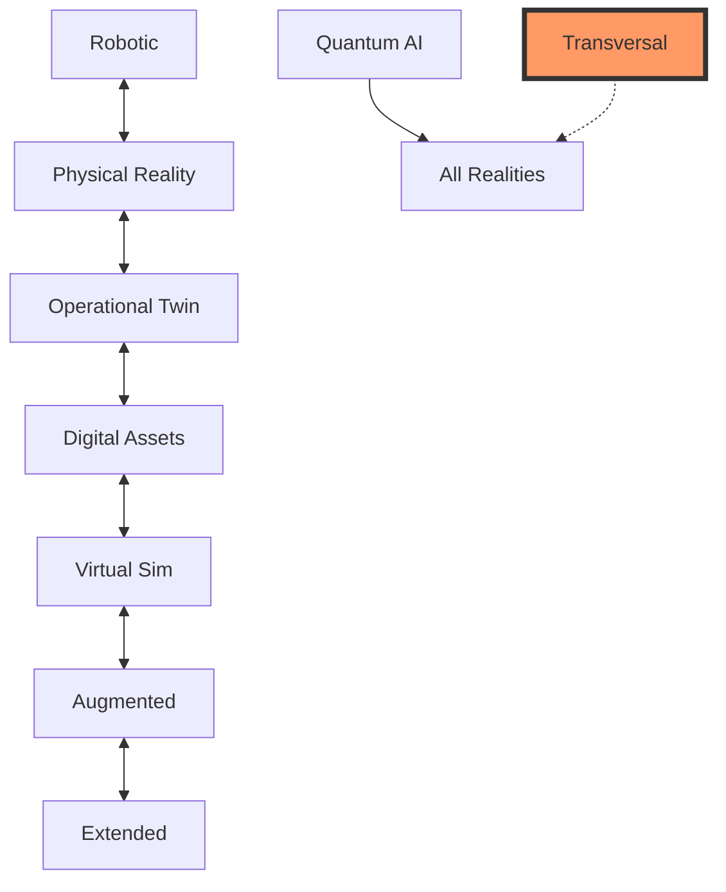

# 📋 ANNEX D: Official Nomenclature System v5.0 (FINAL)

## AQUA V. Complete Naming Convention & Digital Thread Architecture

This document establishes the mandatory naming conventions for all artifacts within the AQUA V. €40 billion quantum aerospace program. The v5.0 revision streamlines the UTCS field by removing redundant category prefixes, as the numeric code already identifies the architecture domain.

-----

## 📑 Table of Contents

* [D.1 General Nomenclature Rule](#d1-general-nomenclature-rule)
* [D.2 Field Definitions](#d2-field-definitions)
* [D.3 Domain Specifications](#d3-domain-specifications)
* [D.4 Examples by Product Line](#d4-examples-by-product-line)
* [D.5 Reality Types Matrix](#d5-reality-types-matrix)
* [D.6 Version Control System](#d6-version-control-system)
* [D.7 Digital Thread Integration](#d7-digital-thread-integration)
* [D.8 MSN Management System](#d8-msn-management-system)
* [D.9 Implementation Guidelines](#d9-implementation-guidelines)
* [D.10 Automated Tools & APIs](#d10-automated-tools--apis)
* [D.11 Compliance & Validation](#d11-compliance--validation)
* [D.12 Quick Reference Guide](#d12-quick-reference-guide)

-----

## D.1 General Nomenclature Rule

### 🔷 Complete Nomenclature Format v5.0

**For Product-Specific Artifacts:**
```
LÍNEA-PRODUCTO-SUBPRODUCTO-MSN-FASE-SUBTIPO-DOMINIO-NÚMERO-REALIDAD-UTCS-QD-VERSIÓN
```

**For Cross-Program Artifacts:**
```
AQUART-FASE-SUBTIPO-DOMINIO-NÚMERO-REALIDAD-UTCS-QD-VERSIÓN
```

### 📊 Field Position Reference

| Position | Field        | Length      | Type     | Required | Updated v5.0 |
|:---------|:-------------|:------------|:---------|:---------|:-------------|
| 1        | LÍNEA/AQUART | 3-6         | Alpha    | ✓        |              |
| 2        | PRODUCTO     | 3           | Alpha    | ✓*       |              |
| 3        | SUBPRODUCTO  | 4           | AlphaNum | ✓*       |              |
| 4        | MSN          | 8           | AlphaNum | ✓*       |              |
| 5        | FASE         | 3           | Alpha    | ✓        |              |
| 6        | SUBTIPO      | 3           | Alpha    | ✓        |              |
| 7        | DOMINIO      | 3-4         | Alpha    | ✓        |              |
| 8        | NÚMERO       | 3           | Numeric  | ✓        |              |
| 9        | REALIDAD     | 4           | Alpha    | ✓        |              |
| 10       | UTCS         | 3-8         | Numeric  | ✓        | ✅ SIMPLIFIED|
| 11       | QD           | 4           | Alpha    | ✓        |              |
| 12       | VERSIÓN      | 6+          | SemVer   | ✓        |              |

*Not required for AQUART artifacts

### 🔹 Nomenclature Decomposition Examples

**Product-Specific with Simplified UTCS:**
```
AMP-BWB-Q100-25MAP0001-DES-SDS-SWD-001-DIGT-053-00-00-QSTR-v5.0.0
 │   │    │       │       │   │   │   │   │      │      │     │
 │   │    │       │       │   │   │   │   │      │      │     └─ Version
 │   │    │       │       │   │   │   │   │      │      └───── Q-Division
 │   │    │       │       │   │   │   │   │      └──────────── UTCS (053 = Fuselage)
 │   │    │       │       │   │   │   │   └──────────────────── Reality Type
 │   │    │       │       │   │   │   └──────────────────────── Sequential Number
 │   │    │       │       │   │   └──────────────────────────── Domain
 │   │    │       │       │   └──────────────────────────────── Subtype
 │   │    │       │       └──────────────────────────────────── Phase
 │   │    │       └──────────────────────────────────────────── MSN
 │   │    └──────────────────────────────────────────────────── Subproduct
 │   └───────────────────────────────────────────────────────── Product
 └───────────────────────────────────────────────────────────── Line
```

**Cross-Program with Simplified UTCS:**
```
AQUART-OPS-POL-SEC-001-DIGT-800-00-00-QDAT-v5.0.0
   │    │   │   │   │   │      │      │     │
   │    │   │   │   │   │      │      │     └─ Version
   │    │   │   │   │   │      │      └───── Q-Division
   │    │   │   │   │   │      └──────────── UTCS (800 = Cybersecurity Overview)
   │    │   │   │   │   └──────────────────── Reality Type
   │    │   │   │   └──────────────────────── Sequential Number
   │    │   │   └──────────────────────────── Domain
   │    │   └──────────────────────────────── Subtype
   │    └──────────────────────────────────── Phase
   └──────────────────────────────────────── Cross-Program Artifact
```

-----

## D.2 Field Definitions

### 📋 Complete Field Specifications

**LÍNEA - Product Line Codes (4 Lines + AQUART)**

| Code   | Full Name         | Products              | Scope           |
|:-------|:------------------|:----------------------|:----------------|
| AMP    | AMPEL360          | Passenger aircraft    | Product-specific|
| GAI    | GAIA AIR & SPACE  | Unmanned systems      | Product-specific|
| ROB    | ROBBBO-T          | Robotic systems       | Product-specific|
| QUA    | QUANTUM           | Quantum technologies  | Product-specific|
| AQUART | AQUA V Artifact   | Cross-program docs    | Enterprise-wide |

**PRODUCTO - Product Codes**

* **AMPEL360:** BWB (Blended Wing Body), EVT (eVTOL), HYB (Hybrid), SUB (Suborbital), ORB (Orbital)
* **GAIA:** UAV (Unmanned Aerial), SAT (Satellite), ROV (Rover), CRG (Cargo)
* **ROBBBO:** FAL (Factory), MRO (Maintenance), SPC (Space), EXP (Explorer)
* **QUANTUM:** QNS (Navigation), QDS (Diagnostics), QPU (Processing), QKD (Key Distribution)

**SUBPRODUCTO - Subproduct Codes**

* **BWB:** Q100, Q250
* **UAV:** TACT (Tactical), CARG (Cargo), HALE (High Altitude), SWRM (Swarm), QENH (Q-Enhanced)
* **ROB:** INSP (Inspection), WELD (Welding), ASSY (Assembly)
* **QNS:** CORE (Core System), ADVN (Advanced), MINI (Miniaturized)

**FASE - Lifecycle Phase Codes**

| Code | Phase         | Document Focus                    |
|:-----|:--------------|:----------------------------------|
| CON  | Conceptual    | Requirements, feasibility         |
| DES  | Design        | Specifications, models            |
| DEV  | Development   | Implementation, code              |
| TST  | Testing       | Validation, results               |
| INT  | Integration   | System integration                |
| CRT  | Certification | Compliance, approval              |
| PRD  | Production    | Manufacturing, assembly           |
| MNT  | Maintenance   | Service, updates                  |
| OPS  | Operations    | Procedures, performance           |
| REP  | Repair        | Fixes, modifications              |
| RET  | Retirement    | Decommission, recycling           |

**SUBTIPO - Document Subtype Codes**

| Phase | Subtypes | Examples |
|:------|:---------|:---------|
| DES   | SDS, ICD, CSP, PRF, DVM | System Design Spec, Interface Control, Component Spec |
| PRD   | MPS, QCP, WIS, BOM | Manufacturing Process, Quality Control Plan |
| OPS   | SOP, POL, QMS, MOC | Standard Operating Procedure, Policy, Manual |
| TST   | TRP, TVP, TRR | Test Report, Test Validation Plan |

**REALIDAD - Reality Type Codes**

| Code | Reality Type                    | Description                           |
|:-----|:--------------------------------|:--------------------------------------|
| PHYS | Physical/Operational Reality    | Hardware, operational systems         |
| OPER | Operational Digital Twin        | Real-time synchronized digital twin   |
| DIGT | Digital Documentation/Assets    | All digitized documents/data          |
| VIRT | Virtual Simulation              | Predictive simulations                |
| AUGM | Augmented Reality               | AR overlays, mixed reality            |
| EXTD | Extended/Holographic            | XR, holographic representations       |
| ROBO | Robotic/Autonomous              | Autonomous systems                    |
| QASI | Quantum/Sentient Intelligence   | Advanced quantum AI                   |
| TRNS | Transpositional/Transversal     | Cross-reality modules                 |

**UTCS - Universal Technology Classification System (SIMPLIFIED v5.0)**

Format: `###-##-##` (numeric only)

| Range    | Architecture Domain        | Previously |
|:---------|:---------------------------|:----------|
| 000-099  | Aerospace Technology       | ATA       |
| 100-199  | Space Technology           | STA       |
| 200-299  | Defence Technology         | DTTA      |
| 300-399  | Digital Twin/Cloud/Edge    | DTCEC     |
| 400-499  | Energy/Propulsion          | EPTA      |
| 500-599  | Advanced Materials         | AMTA      |
| 600-699  | Ground Automation          | OGATA     |
| 700-799  | Aerial City Viability      | ACV       |
| 800-899  | Cybersecurity              | CYB       |
| 900-999  | Quantum Computing          | QCSAA     |

**Q-Division Codes**

| Code | Division | Focus |
|:-----|:---------|:------|
| QSTR | Q-STRUCTURES | Structural systems |
| QAIR | Q-AIR | Aerodynamics |
| QGRE | Q-GREENTECH | Sustainability |
| QMEC | Q-MECHANICS | Mechanical systems |
| QPOW | Q-POWERSENSE | Power & propulsion |
| QSPA | Q-SPACE | Space systems |
| QIND | Q-INDUSTRY | Manufacturing |
| QGRO | Q-GROUND | Ground ops |
| QDAT | Q-DATAGOV | Data governance |
| QHPC | Q-HPC | High-performance computing |
| QCOM | Q-COMM | Communications |
| QSCI | Q-SCIRES | Scientific research |

-----

## D.3 Domain Specifications

### 📋 Domain Codes by Document Subtype

#### System Design Specification (SDS) Domains

| Code | Domain | Full Name | Description |
|:-----|:-------|:----------|:------------|
| SWD  | Software | Software Design Specification | Architecture, APIs, classes, algorithms, data flows |
| HWD  | Hardware | Hardware Design Specification | Schematics, PCBs, components, interfaces |
| MED  | Mechanical | Mechanical Design Specification | Structures, materials, loads, tolerances |
| EED  | Electrical | Electrical/Electronic Design Specification | Circuits, signals, power, EMC |
| HMI  | HMI | Human-Machine Interface Design Specification | UI/UX, ergonomics, displays |
| QSD  | Quantum | Quantum System Design Specification | Qubits, gates, decoherence, control |
| CSD  | Cybersecurity | Cybersecurity Design Specification | Encryption, access control, hardening |
| AVD  | Avionics | Avionics Design Specification | Flight systems, navigation, communication |
| PWD  | Power | Power System Design Specification | Generation, distribution, storage |
| THD  | Thermal | Thermal Design Specification | Heat management, cooling, insulation |

#### Aircraft Maintenance Manual (AMM) Domains

| Code | Domain | Description |
|:-----|:-------|:------------|
| TSG  | Troubleshooting | Fault finding procedures |
| FIS  | Fault Isolation | Systematic fault isolation |
| MPR  | Maintenance Procedures | Step-by-step maintenance |
| SYD  | System Description | System overview and theory |
| SDS  | Schematic Diagrams | Wiring and system diagrams |
| IPL  | Illustrated Parts List | Parts identification |
| TST  | Testing | Test procedures and criteria |
| ADJ  | Adjustment | Calibration and adjustment |
| REM  | Removal/Installation | Component R&I procedures |
| SPC  | Special Tools | Special equipment usage |

#### Interface Control Document (ICD) Domains

| Code | Domain | Description |
|:-----|:-------|:------------|
| PHY  | Physical | Mechanical interfaces, connectors |
| DAT  | Data | Data protocols, formats, timing |
| PWR  | Power | Power interfaces, voltages, currents |
| SIG  | Signal | Signal types, levels, timing |
| ENV  | Environmental | Temperature, vibration, EMI |
| SFT  | Software | APIs, protocols, messages |
| NET  | Network | Network protocols, topology |
| SEC  | Security | Security protocols, authentication |
| QNT  | Quantum | Quantum state interfaces |

#### Test Report (TRP) Domains

| Code | Domain | Description |
|:-----|:-------|:------------|
| FNC  | Functional | Functional test results |
| PER  | Performance | Performance measurements |
| STR  | Stress | Stress and load testing |
| ENV  | Environmental | Environmental testing |
| EMC  | EMC/EMI | Electromagnetic compatibility |
| SAF  | Safety | Safety validation |
| SEC  | Security | Security testing |
| REL  | Reliability | Reliability testing |
| QUA  | Qualification | Qualification testing |

#### Component Specification (CSP) Domains

| Code | Domain | Description |
|:-----|:-------|:------------|
| STR  | Structural | Structural components |
| AVI  | Avionics | Avionics components |
| HYD  | Hydraulic | Hydraulic components |
| FUE  | Fuel | Fuel system components |
| ELE  | Electrical | Electrical components |
| PNE  | Pneumatic | Pneumatic components |
| LDG  | Landing Gear | Landing gear components |
| ENG  | Engine | Engine components |
| INT  | Interior | Interior components |
| QNT  | Quantum | Quantum components |

#### Policy Document (POL) Domains

| Code | Domain | Description |
|:-----|:-------|:------------|
| QMS  | Quality | Quality management policies |
| SAF  | Safety | Safety policies |
| SEC  | Security | Security policies |
| ENV  | Environmental | Environmental policies |
| OPS  | Operations | Operational policies |
| HRM  | Human Resources | HR policies |
| FIN  | Financial | Financial policies |
| ETH  | Ethics | Ethics and conduct |
| DAT  | Data | Data governance policies |

#### Standard Operating Procedure (SOP) Domains

| Code | Domain | Description |
|:-----|:-------|:------------|
| FLT  | Flight Ops | Flight operations |
| MNT  | Maintenance | Maintenance operations |
| GND  | Ground Ops | Ground handling |
| EMG  | Emergency | Emergency procedures |
| TRN  | Training | Training procedures |
| QUA  | Quality | Quality procedures |
| SAF  | Safety | Safety procedures |
| SEC  | Security | Security procedures |
| LOG  | Logistics | Logistics procedures |

-----

## D.4 Examples by Product Line

### 🛩️ AMPEL360 Examples

**Software Design for Flight Control:**
```
AMP-BWB-Q100-25MAP0001-DES-SDS-SWD-001-DIGT-022-00-00-QSTR-v5.0.0
```

**Hardware Design for Avionics:**
```
AMP-BWB-Q100-25MAP0001-DES-SDS-HWD-001-DIGT-031-00-00-QAIR-v5.0.0
```

**Maintenance Manual - Troubleshooting:**
```
AMP-BWB-Q100-25MAP0001-MNT-AMM-TSG-001-AUGM-024-50-00-QMEC-v5.0.0
```

**Interface Control - Data Protocol:**
```
AMP-BWB-Q100-25MAP0001-INT-ICD-DAT-001-DIGT-308-00-00-QDAT-v5.0.0
```

### 🛸 GAIA AIR & SPACE Examples

**Quantum System Design:**
```
GAI-SAT-QNET-25SVQ0001-DES-SDS-QSD-001-QASI-938-00-00-QCOM-v5.0.0
```

**Test Report - Environmental:**
```
GAI-UAV-TACT-25SGS0001-TST-TRP-ENV-001-DIGT-104-00-00-QIND-v5.0.0
```

**Virtual Mission Simulation:**
```
GAI-ROV-MARS-25MAP0001-TST-SIM-VRT-001-VIRT-152-00-00-QSPA-v5.0.0
```

### 🤖 ROBBBO-T Examples

**HMI Design for Control Panel:**
```
ROB-MRO-INSP-25MUS0001-DES-SDS-HMI-001-DIGT-627-00-00-QIND-v5.0.0
```

**Maintenance Procedure - System Description:**
```
ROB-FAL-WELD-25MAP0001-MNT-AMM-SYD-001-DIGT-611-00-00-QMEC-v5.0.0
```

### ⚛️ QUANTUM Examples

**Cybersecurity Design:**
```
QUA-QKD-CORE-25MUQ0001-DES-SDS-CSD-001-DIGT-880-00-00-QDAT-v5.0.0
```

**Interface Control - Quantum States:**
```
QUA-QPU-ADVN-25SVD0001-INT-ICD-QNT-001-TRNS-973-00-00-QHPC-v5.0.0
```

### 🏢 AQUART Examples

**Quality Management Policy:**
```
AQUART-OPS-POL-QMS-001-DIGT-302-00-00-QDAT-v5.0.0
```

**Cybersecurity Policy:**
```
AQUART-OPS-POL-SEC-001-DIGT-800-00-00-QDAT-v5.0.0
```

**Emergency SOP:**
```
AQUART-OPS-SOP-EMG-001-DIGT-000-00-00-QGRO-v5.0.0
```

**Quantum Framework:**
```
AQUART-DEV-FWK-QNT-001-QASI-950-00-00-QSCI-v5.0.0
```

-----

## D.5 Reality Types Matrix

### 🌐 Reality Type Usage Guidelines

| Reality | Primary Use Cases | Data Format | Sync Requirements |
|:--------|:------------------|:------------|:------------------|
| PHYS    | Hardware, components | CAD, STEP | N/A |
| OPER    | Live digital twins | Real-time | <100ms latency |
| DIGT    | All documentation | PDF, XML, JSON | Daily |
| VIRT    | Simulations | 3D, FEA | On-demand |
| AUGM    | Training, maintenance | AR/MR | Real-time |
| EXTD    | Design reviews | Holographic | Real-time |
| ROBO    | Autonomous ops | Control code | Real-time |
| QASI    | Advanced AI | Quantum states | Quantum-sync |
| TRNS    | Cross-reality | APIs, protocols | Multi-sync |

### Cross-Reality Relationships



-----

## D.6 Version Control System

### 📊 Semantic Versioning Rules

Format: `vMAJOR.MINOR.PATCH`

Examples:
* `v5.0.0` - Major change (UTCS simplification)
* `v5.1.0` - Minor enhancement
* `v5.0.1` - Bug fix

Pre-release examples:
* `v5.1.0-alpha.1`
* `v5.1.0-beta.2`
* `v5.1.0-rc.1`

Build metadata:
* `v5.0.0+20250802`
* `v5.0.0+build.1234`

### Version Progression by Phase

| Phase | Version Range | Example |
|:------|:--------------|:--------|
| CON   | v0.0.1-v0.9.99 | v0.1.0 |
| DES   | v1.0.0-v1.9.99 | v1.0.0 |
| DEV   | v2.0.0-v2.9.99 | v2.3.0 |
| TST   | v3.0.0-v3.9.99 | v3.0.0 |
| CRT   | v4.0.0-v4.9.99 | v4.0.0 |
| PRD   | v5.0.0+ | v5.0.0 |

-----

## D.7 Digital Thread Integration

### 🔗 Enhanced Digital Thread with Simplified UTCS

```yaml
digital_thread:
  unique_id: "AMP-BWB-Q100-25MAP0001-DES-SDS-SWD-001-DIGT-053-00-00-QSTR-v5.0.0"
  
  utcs_context:
    numeric_code: "053-00-00"
    architecture_domain: "Aerospace Technology"
    chapter_name: "Fuselage"
    
  domain_context:
    primary_domain: "SWD"
    secondary_domains: ["HWD", "HMI"]
    expertise_required: ["Software Engineering", "DO-178C"]
    
  reality_context:
    type: "DIGT"
    sync_pairs:
      - physical_id: "AMP-BWB-Q100-25MAP0001-PRD-HWD-001-PHYS-053-00-00-QSTR-v5.0.0"
        sync_frequency: "daily"
        last_sync: "2025-08-02T14:30:00Z"
    
  blockchain:
    algorithm: "SHA-256"
    hash: "7d865e959b2466918c9863afca942d0fb89d7c9d7e6f0a04"
    network: "AQUA V. Quantum-Secured Consortium"
    
  quantum_security:
    encryption: "Post-quantum lattice-based"
    qkd_enabled: true
    entanglement_id: "QKD-2025-08-02-MAP-0001"
```

-----

## D.8 MSN Management System

### 📊 MSN Format

Format: `YYSSTNNNN`

Examples:
* `25MAP0001` - 2025, Madrid, Prototype, #1
* `25TOS0001` - 2025, Toulouse, Series production, #1
* `25MUQ0001` - 2025, Munich, Quantum-enhanced, #1
* `25SVD0001` - 2025, Silicon Valley, Development/Test, #1
* `26SGS0001` - 2026, Singapore, Series production, #1
* `26NAR0001` - 2026, Naples, Retrofit/Upgrade, #1

MSN Components:
* **YY:** Year (25 = 2025, 26 = 2026)
* **SS:** Site code
  * MA = Madrid
  * TO = Toulouse
  * MU = Munich
  * NA = Naples
  * SG = Singapore
  * SV = Silicon Valley
* **T:** Type code
  * P = Prototype
  * D = Development/Test
  * S = Series production
  * C = Customer specific
  * Q = Quantum-enhanced
  * R = Retrofit/Upgrade
  * X = Experimental
  * A = Autonomous
  * V = Virtual only
* **NNNN:** Sequential (0001-9999)

-----

## D.9 Implementation Guidelines

### 🚀 Migration from v4.x to v5.0

**Phase 1: UTCS Conversion (Q3 2025)**

Automated conversion examples:
```
ATA-053-00-00    →  053-00-00
STA-152-00-00    →  152-00-00
DTCEC-308-00-00  →  308-00-00
CYB-800-00-00    →  800-00-00
QCSAA-938-00-00  →  938-00-00
```

**Phase 2: Validation & Testing (Q4 2025)**
* Deploy v5.0 validation tools
* Test all conversion scripts
* Update all active documents

**Phase 3: Full Deployment (Q1 2026)**
* Cutover date: 2026-01-01
* Deprecate v4.x APIs: 2026-06-30
* Archive conversion tools: 2026-12-31

### Conversion Script Example

```python
def convert_nomenclature_v4_to_v5(old_nomenclature):
    parts = old_nomenclature.split('-')
    
    # Find UTCS field (contains alphabetic prefix)
    for i, part in enumerate(parts):
        if any(prefix in part for prefix in ['ATA', 'STA', 'DTCEC', 'CYB', 'QCSAA']):
            # Remove alphabetic prefix
            parts[i] = part.replace('ATA', '').replace('STA', '').replace('DTCEC', '')
            parts[i] = parts[i].replace('CYB', '').replace('QCSAA', '')
            break
    
    return '-'.join(parts)
```

-----

## D.10 Automated Tools & APIs

### 🔧 Nomenclature Service API v5.0

**Generate Nomenclature:**
```http
POST /api/v5/generate
Content-Type: application/json

{
  "line": "AMP",
  "product": "BWB",
  "subproduct": "Q100",
  "msn": "25MAP0001",
  "phase": "DES",
  "subtype": "SDS",
  "domain": "SWD",
  "number": "001",
  "reality": "DIGT",
  "utcs": "053-00-00",
  "qd": "QSTR"
}

Response:
{
  "nomenclature": "AMP-BWB-Q100-25MAP0001-DES-SDS-SWD-001-DIGT-053-00-00-QSTR-v5.0.0",
  "validation": "PASS",
  "digital_thread_id": "7d865e959b2466918c9863afca942d0fb89d7c9d7e6f0a04"
}
```

**Decode UTCS:**
```http
GET /api/v5/utcs/decode/053-00-00

Response:
{
  "numeric": "053-00-00",
  "architecture": "Aerospace Technology",
  "chapter": "Fuselage",
  "section": "General",
  "subsection": "Overview",
  "legacy_prefix": "ATA"
}
```

**Validate Nomenclature:**
```http
POST /api/v5/validate
Content-Type: application/json

{
  "nomenclature": "AMP-BWB-Q100-25MAP0001-DES-SDS-SWD-001-DIGT-053-00-00-QSTR-v5.0.0"
}

Response:
{
  "valid": true,
  "details": {
    "format": "PASS",
    "domain_match": "PASS",
    "utcs_range": "PASS",
    "reality_compatibility": "PASS",
    "version_format": "PASS"
  }
}
```

-----

## D.11 Compliance & Validation

### ✅ v5.0 Validation Rules

**UTCS Format Rules:**
```javascript
function validateUTCS(utcsCode) {
  // Must match pattern: ###-##-##
  const pattern = /^\d{3}-\d{2}-\d{2}$/;
  if (!pattern.test(utcsCode)) return false;
  
  const chapter = parseInt(utcsCode.substring(0, 3));
  
  // Validate chapter range
  if (chapter < 0 || chapter > 999) return false;
  
  return true;
}
```

**Complete Validation Example:**
```javascript
function validateNomenclature(nomenclature) {
  const parts = nomenclature.split('-');
  
  // Validate part count
  if (parts[0] === 'AQUART' && parts.length !== 9) return false;
  if (parts[0] !== 'AQUART' && parts.length !== 13) return false;
  
  // Validate each field
  const validations = {
    line: /^(AMP|GAI|ROB|QUA|AQUART)$/,
    phase: /^(CON|DES|DEV|TST|INT|CRT|PRD|MNT|OPS|REP|RET)$/,
    reality: /^(PHYS|OPER|DIGT|VIRT|AUGM|EXTD|ROBO|QASI|TRNS)$/,
    utcs: /^\d{3}-\d{2}-\d{2}$/,
    version: /^v\d+\.\d+\.\d+/
  };
  
  // Run validations...
  return true;
}
```

-----

## D.12 Quick Reference Guide

### 📋 Complete Format Templates

**Product-Specific:**
```
AMP-BWB-Q100-25MAP0001-DES-SDS-SWD-001-DIGT-053-00-00-QSTR-v5.0.0
GAI-UAV-TACT-25SGS0001-TST-TRP-ENV-001-DIGT-104-00-00-QIND-v5.0.0
ROB-MRO-INSP-25MUS0001-PRD-CSP-HYD-001-PHYS-615-00-00-QMEC-v5.0.0
QUA-QPU-CORE-25MUQ0001-DEV-ICD-QNT-001-QASI-973-00-00-QHPC-v5.0.0
```

**Cross-Program:**
```
AQUART-OPS-POL-SEC-001-DIGT-800-00-00-QDAT-v5.0.0
AQUART-OPS-SOP-EMG-001-DIGT-000-00-00-QGRO-v5.0.0
AQUART-DEV-FWK-QNT-001-QASI-950-00-00-QSCI-v5.0.0
AQUART-MNT-PRC-QUA-001-DIGT-605-00-00-QIND-v5.0.0
```

### UTCS Quick Decoder

| First 3 Digits | Architecture | Common Chapters |
|:---------------|:-------------|:----------------|
| 000-099 | Aerospace | 022=Auto Flight, 024=Electrical, 031=Instruments, 053=Fuselage |
| 100-199 | Space | 110=Structure, 152=Surface Ops, 160=LEO Systems |
| 200-299 | Defence | 203=EW Systems, 210=Air Combat, 220=Hypersonic |
| 300-399 | Digital | 302=Edge Computing, 308=API Management, 320=Machine Learning |
| 400-499 | Energy | 410=Chemical Propulsion, 420=Electric Propulsion, 450=Hydraulics |
| 500-599 | Materials | 510=Carbon Fiber, 520=Advanced Composites, 570=Nanostructures |
| 600-699 | Automation | 610=Industrial Robotics, 615=Assembly Robots, 670=Industry 4.0 |
| 700-799 | Urban Air | 701=Vertiport Infrastructure, 710=eVTOL Design, 750=City Integration |
| 800-899 | Cybersec | 800=Overview, 820=Zero Trust, 870=Post-Quantum Crypto |
| 900-999 | Quantum | 900=Overview, 910=Superconducting, 938=Q-Navigation, 950=Algorithms |

### Common Patterns by Document Type

**Design Documents:**
```
*-DES-SDS-[SWD|HWD|MED|EED|HMI|QSD|CSD]-###-DIGT-###-##-##-Q###-v#.#.#
```

**Test Reports:**
```
*-TST-TRP-[FNC|PER|STR|ENV|EMC|SAF|SEC|REL|QUA]-###-DIGT-###-##-##-Q###-v#.#.#
```

**Maintenance Manuals:**
```
*-MNT-AMM-[TSG|FIS|MPR|SYD|SDS|IPL|TST|ADJ|REM|SPC]-###-[DIGT|AUGM]-###-##-##-Q###-v#.#.#
```

**Interface Control:**
```
*-INT-ICD-[PHY|DAT|PWR|SIG|ENV|SFT|NET|SEC|QNT]-###-DIGT-###-##-##-Q###-v#.#.#
```

-----

**Document Status:** APPROVED  
**Version:** 5.0  
**Issue Date:** 2025-08-02  
**Effective Date:** 2026-01-01  
**Owner:** Chief Technology Officer  
**Next Review:** 2026-07-01  
**Classification:** AQUA V. STANDARD - MANDATORY COMPLIANCE  
**Document ID:** `AQUART-OPS-STD-NOM-001-DIGT-304-00-01-QDAT-v5.0.0`  

**Migration Support:** v4.x to v5.0 conversion API: `/api/v5/migrate`  
**Training:** Mandatory v5.0 training deadline: 2025-12-15  
**Dual Format Support:** Until 2026-06-30  
**Compliance Hotline:** nomenclature@aqua-v.aero
