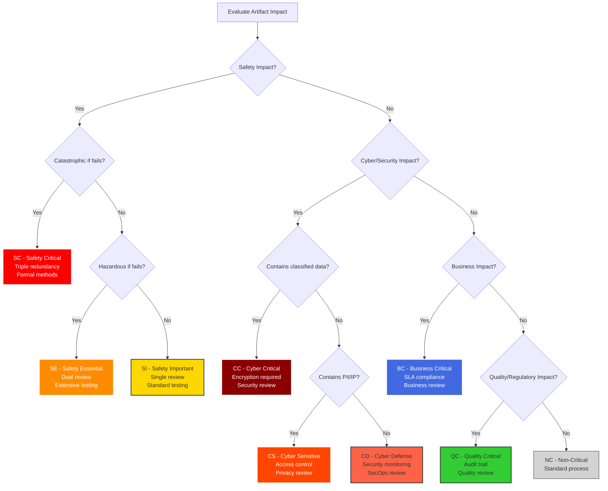

# ANNEX D: Nomenclature System v12.0 (DIGITAL-AEROSPACE UNIFIED) - Complete Digital Production Integration

**Document Status:** ✅ Complete  
**Version:** 12.0  
**Last Updated:** 2025-08-04  
**Artifact ID:** `AQUART-OPS-SC-POL-STD-DC-PA-NOMS-RDIG0-30400010000-MUL-PRD-ABCD1234-v12.0.0`

---

## Executive Summary

The AQUA V. Nomenclature System v12.0 represents a comprehensive aerospace artifact identification system that maintains all traditional aerospace documentation standards while integrating modern digital production, DevOps, AI/ML, and cloud-native practices. This version preserves decades of aerospace documentation best practices while adding critical distinctions between portfolio assets and infrastructure.

### v12.0 Core Principles
- **Complete Traditional Coverage:** All standard aerospace documents (ECR, ECN, ECP, LOPC, etc.)
- **Asset vs Infrastructure Separation:** Financial tracking and governance clarity
- **Digital Integration:** Modern DevOps/Cloud without compromising aerospace standards
- **Regulatory Compliance:** Full EASA/FAA Part 21/145/M documentation
- **Quality Standards:** AS9100, ISO 9001, NADCAP requirements
- **Safety First:** Maintains all DO-178C, DO-254, ARP4754A standards

---

## Table of Contents

1. [System Architecture](#1-system-architecture)
2. [Field Specifications](#2-field-specifications)
3. [Complete Traditional Aerospace Documents](#3-complete-traditional-aerospace-documents)
4. [Digital Production Integration](#4-digital-production-integration)
5. [Complete Code Libraries](#5-complete-code-libraries)
6. [Safety & Compliance](#6-safety--compliance)
7. [Implementation Examples](#7-implementation-examples)
8. [Validation & Quality](#8-validation--quality)
9. [Migration Guide](#9-migration-guide)
10. [Quick Reference](#10-quick-reference)

---

## 1. System Architecture

### 1.1 Unified Digital-Physical Format (v12.0)

**Product/Service Artifacts (15 fields, 94 characters + version):**
```
LLLLLL-PPP-SSSS-MMMMMMMM-HHH-CC-DDD-AAA-TTTTTTTTTTTTTT-RRRRR-UUUUUUUUUUU-RRR-EEE-DDDDDDDD-vXX.XX.XX
```

**Infrastructure Artifacts (15 fields, 94 characters + version):**
```
LLLLLL-III-TTTT-IIIIIIII-HHH-CC-DDD-AAA-TTTTTTTTTTTTTT-RRRRR-UUUUUUUUUUU-RRR-EEE-DDDDDDDD-vXX.XX.XX
```

**Cross-Program Artifacts (12 fields, 79 characters + version):**
```
AQUART-HHH-CC-DDD-AAA-TTTTTTTTTTTTTT-RRRRR-UUUUUUUUUUU-RRR-EEE-DDDDDDDD-vXX.XX.XX
```

### 1.2 Field Position Map

| Pos | Field | Length | Type | Description |
|:----|:------|:-------|:-----|:------------|
| 1 | LINE | 6 | Alpha | Product line/Infrastructure |
| 2 | PROD/INFRA | 3 | Alpha | Product or Infrastructure type |
| 3 | SUBPROD/SUBINFRA | 4 | AlphaNum | Model/variant or Infra subtype |
| 4 | MSN/ASSET | 8 | AlphaNum | Serial number or Asset ID |
| 5 | PHASE | 3 | Alpha | Lifecycle phase |
| 6 | CRIT | 2 | Alpha | Safety/Cyber criticality |
| 7 | DOC | 3 | Alpha | Document type |
| 8 | APP | 3 | Alpha | Application domain |
| 9 | MTD | 14 | AlphaNum | Method/Procedure |
| 10 | REALIDAD | 5 | Alpha | Reality state |
| 11 | UTCS | 11 | AlphaNum | Tech classification |
| 12 | REG | 3 | Alpha | Regulatory status |
| 13 | ENV | 3 | Alpha | Digital environment |
| 14 | CLOUD | 4 | Alpha | Cloud provider (optional) |
| 15 | DSIG | 8 | AlphaNum | Digital signature |
| 16 | VERSION | Variable | SemVer | Version number |

---

## 2. Field Specifications

### 2.1 LINE - Product Line (6 characters)

#### Portfolio Assets (Revenue-Generating)
| Code | Full Name | Type | Revenue Model |
|:-----|:----------|:-----|:--------------|
| AMPEL3 | AMPEL360 | Portfolio Asset | Aircraft Sales/Leasing |
| GAIAIR | GAIA AIR & SPACE | Portfolio Asset | UAV/Satellite Sales |
| ROBBBO | ROBBBO-T | Portfolio Asset | Robotics Sales/Service |
| QSERVS | Quantum Services | Portfolio Asset | SaaS/Licensing/Consulting |
| QPRODS | Quantum Products | Portfolio Asset | Hardware Sales/Leasing |

#### Owned Infrastructure (Cost Centers)
| Code | Full Name | Type | Cost Center |
|:-----|:----------|:-----|:------------|
| INFRAD | Digital Infrastructure | Owned Infrastructure | IT Operations |
| INFRAP | Physical Infrastructure | Owned Infrastructure | Facilities |
| INFRAT | Test Infrastructure | Owned Infrastructure | R&D/Quality |
| INFRAM | Manufacturing Infrastructure | Owned Infrastructure | Production |
| INFRAS | Security Infrastructure | Owned Infrastructure | Security Ops |
| INFRAQ | Quantum Infrastructure | Owned Infrastructure | Quantum Operations |

#### Enterprise & Shared Services
| Code | Full Name | Type | Classification |
|:-----|:----------|:-----|:---------------|
| AQUART | Cross-Program Artifacts | Enterprise | Shared Services |
| SERVIC | Service Delivery | Mixed | Customer Support |
| DATAPL | Data Platform | Mixed | Analytics/BI |

### 2.2 Product & Subproduct Specifications

#### AMPEL360 (AMPEL3) Products & Subproducts

| Product | Code | Product Name | Subproduct | Code | Description | Capacity |
|:--------|:-----|:-------------|:-----------|:-----|:------------|:---------|
| **Blended Wing Body** | BWB | Next-gen aircraft | Q100 Series | Q100 | Regional BWB | 120-180 pax |
| | | | Q250 Series | Q250 | Long-range BWB | 220-300 pax |
| **eVTOL** | EVT | Electric Vertical | City Hopper | CITY | Urban mobility | 2-6 pax |
| | | | Metro | METR | Regional connections | 8-12 pax |
| **Hybrid-Electric** | HYB | Sustainable prop | Electric-180 | E180 | Medium-haul | 180 pax |
| | | | Electric-220 | E220 | Long-haul | 220 pax |
| **Suborbital** | SUB | Space tourism | Suborbital-1 | SB01 | Tourist vehicle | 6-8 pax |
| | | | Suborbital-2 | SB02 | Research vehicle | 4-6 pax |
| **Orbital** | ORB | Space access | Orbital-1 | OR01 | Crew vehicle | 4-6 pax |
| | | | Orbital-2 | OR02 | Cargo vehicle | 2T payload |

#### GAIA AIR & SPACE (GAIAIR) Products & Subproducts

| Product | Code | Product Name | Subproduct | Code | Description | Application |
|:--------|:-----|:-------------|:-----------|:-----|:------------|:------------|
| **UAV** | UAV | Unmanned Aerial | Tactical | TACT | Military ops | Defense |
| | | | Cargo | CARG | Heavy lift | Logistics |
| | | | High Altitude | HALE | Long endurance | Surveillance |
| | | | Swarm | SWRM | Multi-unit ops | Distributed |
| **Satellite** | SAT | Space Systems | Q-Network | QNET | Quantum network | Quantum comm |
| | | | Earth Observation | EOBS | Imaging | Remote sensing |
| | | | Communications | COMM | Data relay | Connectivity |
| | | | Navigation | NAVS | Positioning | GPS augmentation |
| **Rover** | ROV | Planetary | Lunar Rover | LUNA | Moon exploration | Lunar surface |
| | | | Mars Rover | MARS | Mars exploration | Martian surface |
| | | | Asteroid | ASTE | Asteroid mining | Resource extraction |
| **Cargo Drone** | CRG | Logistics UAV | Light Cargo | LGT5 | 50kg payload | Last mile |
| | | | Medium Cargo | MED5 | 500kg payload | Regional |
| | | | Heavy Cargo | HVY2 | 2T payload | Industrial |
| | | | Ultra Heavy | UHV5 | 5T payload | Strategic |

#### ROBBBO-T (ROBBBO) Products & Subproducts

| Product | Code | Product Name | Subproduct | Code | Description | Function |
|:--------|:-----|:-------------|:-----------|:-----|:------------|:---------|
| **Factory Automation** | FAL | Manufacturing | Assembly Robot | AS01 | Assembly ops | Production |
| | | | Welding Robot | WL01 | Welding ops | Joining |
| | | | Quality Control | QC01 | Inspection | Testing |
| | | | Paint Robot | PT01 | Coating ops | Finishing |
| **MRO** | MRO | Maintenance | Aircraft Service | AC01 | Aircraft maint | Line service |
| | | | Engine Service | EN01 | Engine maint | Overhaul |
| | | | Component Service | CM01 | Component maint | Shop repair |
| | | | Inspection Robot | IN01 | NDT inspection | Quality |
| **Space** | SPC | Space Robotics | EVA Robot | EV01 | Spacewalk support | External ops |
| | | | Station Robot | ST01 | Space station | Internal ops |
| | | | Construction | CN01 | Space assembly | Infrastructure |
| | | | Mining Robot | MN01 | Resource extract | ISRU |
| **Explorer** | EXP | Exploration | Deep Sea | DP01 | Ocean exploration | Underwater |
| | | | Volcano | VL01 | Volcanic research | Extreme heat |
| | | | Arctic | AR01 | Polar research | Extreme cold |
| | | | Cave | CV01 | Cave exploration | Confined space |

#### QUANTUM Services (QSERVS) Products & Subproducts

| Service | Code | Service Name | Subservice | Code | Description | Model |
|:--------|:-----|:-------------|:-----------|:-----|:------------|:------|
| **QPaaS** | QPS | Q-Processing Service | Core Processing | CORE | Full QPU access | Usage-based |
| | | | Edge Processing | EDGE | Limited QPU | Subscription |
| | | | Hybrid Processing | HYBR | Classical+Quantum | Hybrid pricing |
| | | | Burst Processing | BRST | On-demand peaks | Pay-per-burst |
| **QKDaaS** | QKS | Q-Key Distribution | Enterprise QKD | ENTR | Corporate security | Annual contract |
| | | | Metro QKD | METR | City networks | Monthly sub |
| | | | Global QKD | GLOB | International | Premium tier |
| | | | Personal QKD | PERS | Individual use | Freemium |
| **QML Cloud** | QML | Q-Machine Learning | Training Platform | TRNG | Model training | Compute hours |
| | | | Inference Service | INFR | Model serving | API calls |
| | | | AutoML Quantum | AUTO | Automated QML | Projects |
| | | | Federated QML | FEDR | Distributed | Participants |
| **Q-Consulting** | QCN | Quantum Solutions | Strategy Advisory | STRT | Business strategy | Retainer |
| | | | Implementation | IMPL | Technical deploy | Project-based |
| | | | Optimization | OPTM | Process improve | Results-based |
| | | | Training Services | TRNG | Education | Per seat |

#### QUANTUM Products (QPRODS) Products & Subproducts

| Product | Code | Product Name | Subproduct | Code | Description | Sales Model |
|:--------|:-----|:-------------|:-----------|:-----|:------------|:------------|
| **QPU Units** | QPU | Processing Units | Desktop QPU | DESK | 50-qubit unit | Direct sale |
| | | | Rack QPU | RACK | 500-qubit unit | Sale/lease |
| | | | Datacenter QPU | DATA | 1000+ qubits | Lease only |
| | | | Mobile QPU | MOBL | Portable unit | Sale/rental |
| **QKD Devices** | QKD | Encryption Devices | Fiber QKD | FIBR | Metro range | Sale+service |
| | | | Satellite QKD | SATL | Global range | Sale+service |
| | | | Portable QKD | PORT | Field use | Sale/rental |
| | | | Embedded QKD | EMBD | Integration | OEM license |
| **Q-Sensors** | QSN | Quantum Sensors | Magnetometer | QMAG | Magnetic field | Sale+calibration |
| | | | Gravitometer | QGRV | Gravity sensing | Sale+calibration |
| | | | Q-Clock | QCLK | Timing device | Sale+sync service |
| | | | Q-Radar | QRAD | Detection | Sale+updates |

#### Infrastructure Specifications

##### DIGITAL Infrastructure (INFRAD)

| Type | Code | Infrastructure | Subtype | Code | Description | Purpose |
|:-----|:-----|:---------------|:--------|:-----|:------------|:--------|
| **Cloud** | CLD | Cloud Platforms | AWS Production | AWSP | Main AWS | Production workloads |
| | | | Azure Backup | AZRB | DR site | Disaster recovery |
| | | | GCP Analytics | GCPA | BigQuery | Data analytics |
| | | | Private Cloud | PRIV | On-prem | Sensitive data |
| **Network** | NET | Networks | Core Network | CORE | Backbone | Main connectivity |
| | | | Edge Network | EDGE | CDN/Edge | Low latency |
| | | | Quantum Network | QNET | QKD links | Secure comms |
| | | | IoT Network | IOTN | Sensor nets | Telemetry |
| **DevOps** | DVO | DevOps Tools | CI/CD Platform | CICD | Jenkins/GitLab | Automation |
| | | | Container Platform | CONT | K8s clusters | Orchestration |
| | | | Monitoring Stack | MONS | Prometheus | Observability |
| | | | Security Tools | SECT | SAST/DAST | AppSec |

##### PHYSICAL Infrastructure (INFRAP)

| Type | Code | Infrastructure | Subtype | Code | Description | Location |
|:-----|:-----|:---------------|:--------|:-----|:------------|:---------|
| **Facilities** | FAC | Buildings | Headquarters | HQMA | Madrid HQ | Madrid |
| | | | R&D Centers | RDTO | Toulouse R&D | Toulouse |
| | | | Manufacturing | MFNA | Naples factory | Naples |
| | | | Warehouses | WHSG | Singapore warehouse | Singapore |
| **Power** | PWR | Power Systems | Primary Power | PRIM | Main grid | All sites |
| | | | Backup Power | BACK | Generators | Critical areas |
| | | | UPS Systems | UPSS | Battery backup | IT/Production |
| | | | Renewable | RENW | Solar/Wind | Sustainability |

##### TEST Infrastructure (INFRAT)

| Type | Code | Infrastructure | Subtype | Code | Description | Capability |
|:-----|:-----|:---------------|:--------|:-----|:------------|:-----------|
| **Test Rigs** | RIG | Physical Testing | Structural Test | STRU | Load frames | 1000 ton capacity |
| | | | Environmental | ENVT | Thermal/altitude | -70°C to +200°C |
| | | | Vibration | VIBR | Shake tables | 50kN force |
| | | | EMI/EMC | EMIC | EM testing | DO-160 compliant |
| **Simulation** | SIM | Virtual Testing | HIL Systems | HILS | Hardware-in-loop | Real-time |
| | | | Flight Sim | FSIM | Full flight | Level D certified |
| | | | CFD Clusters | CFDC | Fluid dynamics | 10 PFLOPS |
| | | | FEA Systems | FEAS | Structural | Nonlinear capable |

##### MANUFACTURING Infrastructure (INFRAM)

| Type | Code | Infrastructure | Subtype | Code | Description | Capacity |
|:-----|:-----|:---------------|:--------|:-----|:------------|:---------|
| **Lines** | LIN | Production Lines | FAL BWB | FBWB | BWB assembly | 10 aircraft/month |
| | | | FAL eVTOL | FEVT | eVTOL assembly | 50 units/month |
| | | | Composite Line | COMP | AFP/ATL | 1000 parts/month |
| | | | Metal Line | METL | Machining | 5000 parts/month |
| **Robotics** | ROB | Robotic Systems | Assembly Cells | ACEL | Multi-robot | 20 cells |
| | | | Welding Cells | WCEL | Laser/friction | 10 cells |
| | | | Paint Booths | PBTH | Robotic spray | 5 booths |
| | | | Inspection | INSP | CMM/vision | 15 systems |

##### SECURITY Infrastructure (INFRAS)

| Type | Code | Infrastructure | Subtype | Code | Description | Coverage |
|:-----|:-----|:---------------|:--------|:-----|:------------|:---------|
| **Cyber** | CYB | Cybersecurity | SOC Platform | SOCP | 24/7 SOC | Global |
| | | | SIEM System | SIEM | Splunk | All systems |
| | | | Firewall Infra | FWAL | Next-gen FW | Perimeter |
| | | | Identity Mgmt | IDMG | IAM platform | 10k users |
| **Physical** | PHY | Physical Security | Access Control | ACCS | Badge/biometric | All sites |
| | | | CCTV System | CCTV | Surveillance | 2000 cameras |
| | | | Intrusion | INTR | Detection | Perimeter |
| | | | Guard Force | GRDF | Security personnel | 24/7 |

##### QUANTUM Infrastructure (INFRAQ)

| Type | Code | Infrastructure | Subtype | Code | Description | Purpose |
|:-----|:-----|:---------------|:--------|:-----|:------------|:--------|
| **R&D QPUs** | RQP | Research QPUs | Dev QPU Munich | DQMU | 100-qubit dev | Algorithm dev |
| | | | Test QPU Valley | TQSV | 500-qubit test | Validation |
| | | | Proto QPU Madrid | PQMA | 1000-qubit proto | Production prep |
| | | | Exp QPU Toulouse | EQTO | Experimental | Novel qubits |
| **Support** | SUP | Support Systems | Cryo Plant Munich | CRMU | Dilution fridges | 10 systems |
| | | | Control Electronics | CTEL | QPU control | Custom FPGA |
| | | | Calibration Lab | CALB | Q-calibration | Daily cal |
| | | | Clean Facilities | CLNF | Fab cleanroom | Qubit fab |

### 2.3 PHASE - Complete Lifecycle Phases (15 phases)

| Code | Phase | Description | Typical Duration |
|:-----|:------|:------------|:-----------------|
| STR | Strategy | Business strategy and planning | 3-6 months |
| CON | Conceptual | Requirements and feasibility | 6-12 months |
| DES | Design | Detailed design and analysis | 12-24 months |
| DEV | Development | Prototyping and testing | 12-18 months |
| TST | Testing | Validation and verification | 6-12 months |
| INT | Integration | System integration | 3-6 months |
| CRT | Certification | Regulatory approval | 12-24 months |
| PRD | Production | Manufacturing | Ongoing |
| OPS | Operations | Daily operations | 20-30 years |
| MNT | Maintenance | Service and support | Ongoing |
| REP | Repair | Repair and modification | As needed |
| UPG | Upgrade | Major improvements | 12-24 months |
| EXT | Extension | Life extension | 12-24 months |
| RET | Retirement | End of service | 6-12 months |
| AUD | Audit | Compliance verification | Periodic |

### 2.4 CRIT - Safety & Cyber Criticality (2 characters)

| Code | Level | Description | Review Requirements |
|:-----|:------|:------------|:-------------------|
| SC | Safety Critical | Failure = catastrophic | Triple redundancy, formal methods |
| SE | Safety Essential | Failure = hazardous | Dual review, extensive testing |
| SI | Safety Important | Failure = major effect | Single review, standard testing |
| QC | Quality Critical | Quality/regulatory impact | Quality review, audit trail |
| CC | Cyber Critical | Classified/SECRET data | Security review, encryption |
| CS | Cyber Sensitive | PII/Proprietary data | Privacy review, access control |
| CD | Cyber Defense | Security infrastructure | SecOps review, monitoring |
| BC | Business Critical | Revenue/operations impact | Business review, SLA |
| NC | Non-Critical | No safety/cyber/business impact | Standard process |

### 2.5 MSN - Manufacturing Serial Number (8 characters)

**Format:** `YYSSNNNN`
- `YY` = Year (25 = 2025, 26 = 2026, etc.)
- `SS` = Site code
- `NNNN` = Sequential number (0001-9999)

| Code | Site | Country | Specialization |
|:-----|:-----|:--------|:---------------|
| MA | Madrid | Spain | HQ & Final Assembly |
| TO | Toulouse | France | Aerodynamics & Certification |
| MU | Munich | Germany | Propulsion & Quantum Hardware |
| NA | Naples | Italy | Composites & Advanced Materials |
| SG | Singapore | Singapore | Asia Hub & Robotics |
| SV | Silicon Valley | USA | Software & Quantum Computing |

### 2.6 REALIDAD - Reality State (5 characters)

| Code | Full Name | Description | Use Cases |
|:-----|:----------|:------------|:----------|
| RDIG0 | Real-Time Digital | Live digital twin | Production monitoring |
| SDIG0 | Simulated Digital | Virtual model | Design verification |
| QASEN | Quantum AI Sentient | Self-aware system | Autonomous operations |
| TRPHY | Tangible Physical | Hardware artifact | Manufactured items |
| HYBRD | Hybrid | Physical + Digital | Smart products |
| VRTUL | Virtual Only | Cloud/container only | Software services |
| FEDML | Federated ML | Distributed AI | Edge AI systems |
| EDGES | Edge System | Edge computing | Local processing |
| BLKCN | Blockchain | DLT verified | Immutable records |

### 2.7 UTCS - Universal Technology Classification (11 characters)

**Format:** `DDDCCSSPPPP` (No hyphens, 11 chars exactly)
- `DDD` = Domain (3 digits)
- `CC` = Category (2 digits)  
- `SS` = Subcategory (2 digits)
- `PPPP` = Specific Tech (4 digits)

**Domain Structure:**
- `000-099` = Aerospace Technology (ATA chapters)
- `100-199` = Space Technology
- `200-299` = Defense Technology
- `300-399` = Digital/Cloud/Computing
- `400-499` = Energy/Propulsion
- `500-599` = Materials Technology
- `600-699` = Automation/Robotics
- `700-799` = Urban Air Mobility
- `800-899` = Cybersecurity
- `900-999` = Quantum Computing

### 2.8 REG - Regulatory Status (3 characters)

| Code | Authority | Status | Description |
|:-----|:----------|:-------|:------------|
| EAS | EASA | Approved | European approval |
| FAA | FAA | Approved | US approval |
| TCA | Transport Canada | Approved | Canadian approval |
| CAS | CAAC | Approved | Chinese approval |
| BRA | ANAC Brazil | Approved | Brazilian approval |
| MUL | Multiple | Multi-approved | Multiple authorities |
| PND | Pending | In certification | Under review |
| N/A | Not Applicable | No cert required | Non-regulated |

### 2.9 ENV - Digital Environment (3 characters)

| Code | Environment | Description | Use Case |
|:-----|:------------|:------------|:---------|
| DEV | Development | Developer sandbox | Feature development |
| TST | Testing | QA environment | Quality assurance |
| STG | Staging | Pre-production | Final validation |
| PRD | Production | Live systems | Customer facing |
| DRT | DR Testing | Disaster recovery | Backup systems |
| LAB | Laboratory | R&D systems | Research |
| SIM | Simulation | Virtual testing | Digital validation |
| TRN | Training | Training environment | Education |
| N/A | Not Applicable | Physical only | Hardware items |

### 2.10 CLOUD - Cloud Provider (4 characters - Optional)

| Code | Provider | Description | Services |
|:-----|:---------|:------------|:---------|
| AWS0 | Amazon Web Services | AWS infrastructure | Full stack |
| AZR0 | Microsoft Azure | Azure infrastructure | Full stack |
| GCP0 | Google Cloud | GCP infrastructure | Full stack |
| IBM0 | IBM Cloud | IBM infrastructure | Enterprise |
| OCI0 | Oracle Cloud | Oracle infrastructure | Database |
| PRIV | Private Cloud | On-premises | Internal only |
| HYBR | Hybrid Multi-Cloud | Multiple providers | Best of breed |
| EDGE | Edge Computing | Distributed edge | Local compute |
| N/A0 | Not Applicable | Non-cloud artifact | Physical only |

### 2.11 DSIG - Digital Signature (8 characters)

**Format:** First 8 characters of SHA-256 hash
- Calculated from: concatenation of all previous fields + timestamp
- Purpose: Tamper detection, uniqueness verification, audit trail
- Example: `A3F2B891`

---

## 3. Complete Traditional Aerospace Documents

### 3.1 Engineering Change Management Documents

| Code | Document Type | Full Name | Description | Regulatory Reference |
|:-----|:-------------|:----------|:------------|:---------------------|
| ECR | Engineering Change Request | ECR | Initial request for design change | AS9100 7.3.7 |
| ECP | Engineering Change Proposal | ECP | Detailed change proposal with impacts | MIL-STD-480 |
| ECN | Engineering Change Notice | ECN | Approved change implementation notice | AS9100 7.3.7 |
| ECO | Engineering Change Order | ECO | Work authorization for change | ISO 10007 |
| ECA | Engineering Change Analysis | ECA | Impact assessment of proposed change | ARP4754A |
| CCB | Change Control Board | CCB Minutes | Change review board decisions | AS9100 7.3.7 |
| CID | Change Impact Document | CID | Full impact analysis | Part 21.97 |
| BCN | Baseline Change Notice | BCN | Configuration baseline update | ISO 10007 |
| DCN | Document Change Notice | DCN | Documentation update notice | AS9100 4.2.3 |
| TCN | Temporary Change Notice | TCN | Temporary modification approval | Part 145.A.45 |
| PCN | Process Change Notice | PCN | Manufacturing process change | AS9100 8.5.6 |
| SCN | Supplier Change Notice | SCN | Supplier notification of change | AS9100 8.4.3 |
| FCN | Field Change Notice | FCN | In-service modification | Part 21.A.107 |
| MCR | Major Change Request | MCR | Type design change | Part 21.A.91 |
| MNR | Minor Change Request | MNR | Minor modification | Part 21.A.91 |

### 3.2 Design Phase Traditional Documents

| Code | Document Type | Full Name | Description | Regulatory Reference |
|:-----|:-------------|:----------|:------------|:---------------------|
| PDR | Preliminary Design Review | PDR Package | 30% design maturity review | ARP4754A |
| CDR | Critical Design Review | CDR Package | 90% design maturity review | ARP4754A |
| DDR | Detailed Design Review | DDR Package | 100% design release review | MIL-STD-1521 |
| TRR | Test Readiness Review | TRR Package | Ready for test gate | DO-178C |
| PRR | Production Readiness Review | PRR Package | Ready for production | AS9100 8.3 |
| ICD | Interface Control Document | ICD | Interface definition and control | ARP4754A |
| VDD | Version Description Document | VDD | Software version description | DO-178C |
| HDD | Hardware Design Document | HDD | Hardware detailed design | DO-254 |
| DJP | Design Justification Paper | DJP | Design decision rationale | Part 21.A.31 |
| DTP | Design Test Plan | DTP | Design verification approach | DO-160G |
| TSO | Technical Standard Order | TSO Application | Equipment approval | TSO-C series |
| PPS | Product Performance Specification | PPS | Performance requirements | AMS standards |
| DSS | Design Solution Specification | DSS | Detailed solution definition | ISO 9001 |
| DFR | Design Failure Report | DFR | Design issue documentation | AS9100 8.7 |
| DRB | Design Review Board | DRB Minutes | Design review decisions | MIL-STD-1521 |
| SRD | System Requirements Document | SRD | Top-level requirements | ARP4754A |
| SDD | Software Design Description | SDD | Software architecture | DO-178C |
| HRS | Hardware Requirements Specification | HRS | Hardware requirements | DO-254 |
| DFM | Design for Manufacturing | DFM Analysis | Producibility assessment | AS9100 8.3 |
| DFT | Design for Test | DFT Analysis | Testability assessment | AS9100 8.3 |
| DFS | Design for Service | DFS Analysis | Maintainability assessment | MSG-3 |
| FHA | Functional Hazard Assessment | FHA | Function failure analysis | ARP4761 |
| PSA | Preliminary System Safety Assessment | PSSA | Architecture safety | ARP4761 |
| CCA | Common Cause Analysis | CCA | Common failure modes | ARP4761 |
| ZSA | Zonal Safety Analysis | ZSA | Installation safety | ARP4761 |

### 3.3 Production Phase Traditional Documents

| Code | Document Type | Full Name | Description | Regulatory Reference |
|:-----|:-------------|:----------|:------------|:---------------------|
| COC | Certificate of Conformity | C of C | Conformity to requirements | Part 21.A.130 |
| COS | Certificate of Supply | C of S | Supplier certification | AS9120 |
| FAI | First Article Inspection | FAI Report | First production verification | AS9102 |
| FAIR | First Article Inspection Report | FAIR | Complete FAI documentation | AS9102 |
| PSW | Part Submission Warrant | PSW | PPAP submission | AIAG PPAP |
| PPAP | Production Part Approval Process | PPAP | Production approval package | AIAG PPAP |
| LOPC | Letter of Production Capability | LOPC | Production readiness cert | Part 21.A.133 |
| CON | Concession Request | Concession | Use-as-is disposition | AS9100 8.7 |
| DEV | Deviation Request | Deviation | Temporary departure approval | AS9100 8.7 |
| WAI | Waiver Request | Waiver | Permanent departure approval | MIL-STD-1520 |
| MRB | Material Review Board | MRB Report | Nonconformance disposition | AS9100 8.7 |
| NCR | Nonconformance Report | NCR | Quality nonconformance | AS9100 10.2 |
| CAR | Corrective Action Request | CAR | Root cause correction | AS9100 10.2 |
| SCAR | Supplier Corrective Action Request | SCAR | Supplier quality issue | AS9100 8.4 |
| PAR | Preventive Action Request | PAR | Proactive improvement | AS9100 10.3 |
| PRN | Process Revision Notice | PRN | Process change documentation | AS9100 8.5 |
| QN | Quality Notification | QN | Quality alert | AS9100 8.7 |
| 8D | 8-Discipline Report | 8D | Problem solving report | AIAG CQI |
| CAPA | Corrective and Preventive Action | CAPA | Quality system improvement | ISO 9001 |
| RGA | Returned Goods Authorization | RGA | Return for quality issue | AS9100 8.7 |
| SIR | Supplier Inspection Report | SIR | Incoming inspection | AS9100 8.4 |
| COT | Certificate of Test | C of T | Test certification | AS9100 8.6 |
| CRN | Conformity Release Note | CRN | Product release | Part 21.A.130 |
| PSI | Pre-Shipment Inspection | PSI | Final inspection | AS9100 8.6 |
| SQP | Supplier Quality Plan | SQP | Supplier quality requirements | AS9100 8.4 |

### 3.4 Certification Documents

| Code | Document Type | Full Name | Description | Regulatory Reference |
|:-----|:-------------|:----------|:------------|:---------------------|
| TC | Type Certificate | TC | Aircraft type approval | Part 21.A.21 |
| STC | Supplemental Type Certificate | STC | Major modification approval | Part 21.A.111 |
| TSO | Technical Standard Order | TSOA | Equipment approval | Part 21.O |
| PMA | Parts Manufacturer Approval | PMA | Replacement part approval | Part 21.K |
| DAS | Declaration of Design and Performance | DDP | Design compliance | Part 21.A.20 |
| SB | Service Bulletin | SB | Service instruction | Part 21.A.3B |
| AD | Airworthiness Directive | AD | Mandatory action | Part 39 |
| MMEL | Master Minimum Equipment List | MMEL | Dispatch deviation guide | Part 21.A.243 |
| CDL | Configuration Deviation List | CDL | Missing parts list | Part 21.A.245 |
| ETOPS | Extended Operations | ETOPS Approval | Extended range ops | Part 121.161 |
| RVSM | Reduced Vertical Separation | RVSM Approval | Altitude capability | Part 91.180 |
| MNPS | Minimum Navigation Performance | MNPS Approval | NAT track capability | ICAO Doc 7030 |
| RNP | Required Navigation Performance | RNP Approval | Navigation capability | PBN Manual |
| CAT | Category Landing | CAT II/III Approval | Low visibility ops | Part 91.189 |
| AWO | All Weather Operations | AWO Approval | Weather minima | CS-AWO |
| AML | Approved Model List | AML | Model variations | Part 21.A.115 |
| POA | Production Organization Approval | POA | Manufacturing approval | Part 21.A.133 |
| MOA | Maintenance Organization Approval | MOA | Maintenance approval | Part 145 |
| DOA | Design Organization Approval | DOA | Design approval | Part 21.J |
| TCDS | Type Certificate Data Sheet | TCDS | Type design data | Part 21.A.31 |

### 3.5 Quality System Documents

| Code | Document Type | Full Name | Description | Regulatory Reference |
|:-----|:-------------|:----------|:------------|:---------------------|
| QM | Quality Manual | Quality Manual | Quality system documentation | AS9100 4.4 |
| QP | Quality Procedure | Quality Procedure | Detailed quality processes | AS9100 4.4 |
| WI | Work Instruction | Work Instruction | Detailed work steps | AS9100 8.5.1 |
| QAP | Quality Assurance Plan | QAP | Project quality planning | AS9100 8.1 |
| IQA | Internal Quality Audit | IQA Report | Internal audit findings | AS9100 9.2 |
| EQA | External Quality Audit | EQA Report | Third-party audit | AS9100 9.2 |
| SQA | Supplier Quality Audit | SQA Report | Supplier assessment | AS9100 8.4 |
| PQA | Process Quality Audit | PQA Report | Process effectiveness | AS9100 9.2 |
| CQA | Customer Quality Audit | CQA Report | Customer audit response | AS9100 9.2 |
| MR | Management Review | MR Minutes | Leadership review | AS9100 9.3 |
| KPI | Key Performance Indicator | KPI Report | Quality metrics | AS9100 9.1 |
| CTQ | Critical to Quality | CTQ Matrix | Critical characteristics | AS9100 8.3 |
| SPC | Statistical Process Control | SPC Charts | Process monitoring | AS9100 9.1.3 |
| MSA | Measurement System Analysis | MSA Study | Gage R&R | AIAG MSA |
| FMEA | Failure Mode Effects Analysis | FMEA | Risk assessment | AS9100 8.1.1 |
| PFMEA | Process FMEA | PFMEA | Process risk | AIAG FMEA |
| DFMEA | Design FMEA | DFMEA | Design risk | AIAG FMEA |
| CP | Control Plan | Control Plan | Process controls | AIAG APQP |
| APQP | Advanced Product Quality Planning | APQP | Quality planning | AIAG APQP |
| QCPC | Quality Control Process Chart | QCPC | Inspection flow | AS9100 8.6 |

### 3.6 Test & Validation Documents

| Code | Document Type | Full Name | Description | Regulatory Reference |
|:-----|:-------------|:----------|:------------|:---------------------|
| ATP | Acceptance Test Procedure | ATP | Customer acceptance test | AS9100 8.6 |
| ATR | Acceptance Test Report | ATR | Test results | AS9100 8.6 |
| QTP | Qualification Test Plan | QTP | Qualification approach | DO-160G |
| QTR | Qualification Test Report | QTR | Qualification results | DO-160G |
| DTP | Development Test Plan | DTP | Development testing | ARP4754A |
| DTR | Development Test Report | DTR | Development results | ARP4754A |
| FTP | Flight Test Plan | FTP | Flight test program | Part 21.A.35 |
| FTR | Flight Test Report | FTR | Flight test results | Part 21.A.35 |
| GTP | Ground Test Plan | GTP | Ground test program | Part 21.A.33 |
| GTR | Ground Test Report | GTR | Ground test results | Part 21.A.33 |
| ETP | Environmental Test Plan | ETP | Environmental testing | DO-160G |
| ETR | Environmental Test Report | ETR | Environmental results | DO-160G |
| EMC | EMI/EMC Test Report | EMC Report | Electromagnetic testing | DO-160G |
| LTP | Life Test Plan | LTP | Durability testing | Part 25.571 |
| LTR | Life Test Report | LTR | Life test results | Part 25.571 |
| STR | Structural Test Report | STR | Static/fatigue results | Part 25.305 |
| VTP | Verification Test Plan | VTP | Requirements verification | DO-178C |
| VTR | Verification Test Report | VTR | Verification results | DO-178C |
| ITP | Integration Test Plan | ITP | Integration testing | ARP4754A |
| ITR | Integration Test Report | ITR | Integration results | ARP4754A |

### 3.7 Software Documents (DO-178C)

| Code | Document Type | Full Name | Description | Regulatory Reference |
|:-----|:-------------|:----------|:------------|:---------------------|
| PSAC | Plan for Software Aspects of Certification | PSAC | Certification planning | DO-178C 11.1 |
| SDP | Software Development Plan | SDP | Development process | DO-178C 11.2 |
| SVP | Software Verification Plan | SVP | Verification process | DO-178C 11.3 |
| SCMP | Software Configuration Management Plan | SCMP | CM process | DO-178C 11.4 |
| SQAP | Software Quality Assurance Plan | SQAP | QA process | DO-178C 11.5 |
| SRS | Software Requirements Standards | SRS | Requirements standards | DO-178C 11.6 |
| SDS | Software Design Standards | SDS | Design standards | DO-178C 11.7 |
| SCS | Software Coding Standards | SCS | Coding standards | DO-178C 11.8 |
| SRD | Software Requirements Data | SRD | Requirements | DO-178C 11.9 |
| SDD | Software Design Description | SDD | Design data | DO-178C 11.10 |
| SRC | Source Code | Source Code | Executable code | DO-178C 11.11 |
| EOC | Executable Object Code | EOC | Binary code | DO-178C 11.12 |
| SVCP | Software Verification Cases and Procedures | SVCP | Test cases | DO-178C 11.13 |
| SVR | Software Verification Results | SVR | Test results | DO-178C 11.14 |
| SECI | Software Environment Configuration Index | SECI | Tool qualification | DO-178C 11.15 |
| SCI | Software Configuration Index | SCI | Configuration list | DO-178C 11.16 |
| PSAA | Problem Reports and Software Accomplishment Summary | SAS | Accomplishment | DO-178C 11.17-11.20 |
| SLI | Software Life Cycle Index | SLI | Lifecycle data | DO-178C 11.21 |
| SCMR | Software Configuration Management Records | SCMR | CM records | DO-178C 11.18 |
| SQAR | Software Quality Assurance Records | SQAR | QA records | DO-178C 11.19 |

### 3.8 Hardware Documents (DO-254)

| Code | Document Type | Full Name | Description | Regulatory Reference |
|:-----|:-------------|:----------|:------------|:---------------------|
| PHAC | Plan for Hardware Aspects of Certification | PHAC | Certification planning | DO-254 10.1 |
| HDP | Hardware Design Plan | HDP | Design process | DO-254 10.2 |
| HVP | Hardware Validation Plan | HVAP | Validation process | DO-254 10.3 |
| HVP | Hardware Verification Plan | HVP | Verification process | DO-254 10.3 |
| HCMP | Hardware Configuration Management Plan | HCMP | CM process | DO-254 10.4 |
| HPAP | Hardware Process Assurance Plan | HPAP | PA process | DO-254 10.5 |
| HRS | Hardware Requirements Standards | HRS | Requirements standards | DO-254 10.6 |
| HDS | Hardware Design Standards | HDS | Design standards | DO-254 10.7 |
| HRD | Hardware Requirements | HRD | Requirements data | DO-254 10.8 |
| HCDD | Hardware Conceptual Design Data | HCDD | Conceptual design | DO-254 10.8 |
| HDDD | Hardware Detailed Design Data | HDDD | Detailed design | DO-254 10.8 |
| HVP | Hardware Validation and Verification Procedures | HVVP | V&V procedures | DO-254 10.9 |
| HVR | Hardware Validation and Verification Results | HVVR | V&V results | DO-254 10.9 |
| HECI | Hardware Environment Configuration Index | HECI | Tool data | DO-254 10.10 |
| HCI | Hardware Configuration Index | HCI | Configuration list | DO-254 10.11 |
| HPRS | Hardware Problem Reports | HPR | Problem tracking | DO-254 10.12 |
| HAS | Hardware Accomplishment Summary | HAS | Accomplishment | DO-254 10.13 |
| HCMR | Hardware Configuration Management Records | HCMR | CM records | DO-254 10.12 |
| HPAR | Hardware Process Assurance Records | HPAR | PA records | DO-254 10.12 |

### 3.9 Maintenance Documents

| Code | Document Type | Full Name | Description | Regulatory Reference |
|:-----|:-------------|:----------|:------------|:---------------------|
| AMM | Aircraft Maintenance Manual | AMM | Scheduled maintenance | ATA 100 |
| CMM | Component Maintenance Manual | CMM | Component overhaul | ATA 100 |
| SRM | Structural Repair Manual | SRM | Structural repairs | Part 25.1529 |
| IPC | Illustrated Parts Catalog | IPC | Parts identification | ATA 100 |
| WDM | Wiring Diagram Manual | WDM | Electrical schematics | Part 25.1729 |
| SSM | System Schematic Manual | SSM | System diagrams | ATA 100 |
| TSM | Troubleshooting Manual | TSM | Fault isolation | ATA 100 |
| FIM | Fault Isolation Manual | FIM | Detailed troubleshooting | ATA 100 |
| MEL | Minimum Equipment List | MEL | Dispatch deviations | Part 121.628 |
| CDL | Configuration Deviation List | CDL | Missing items | Part 25.1030 |
| MPD | Maintenance Planning Document | MPD | Maintenance program | MSG-3 |
| MRB | Maintenance Review Board | MRB Report | MSG-3 analysis | AC 121-22 |
| SB | Service Bulletin | SB | Service instructions | Part 43 |
| SIL | Service Information Letter | SIL | Service information | Part 43 |
| EO | Engineering Order | EO | Modification instruction | Part 43 |
| AWL | Airworthiness Limitations | AWL | Life limits | Part 25.1529 |
| CMR | Certification Maintenance Requirements | CMR | Required maintenance | Part 25.1529 |
| LLP | Life Limited Parts | LLP List | Life tracking | Part 33.70 |
| TCD | Time Controlled Documents | TCD | Time limits | MSG-3 |
| NDT | Non-Destructive Test Manual | NDT Manual | Inspection methods | Part 43 |

### 3.10 Operations Documents

| Code | Document Type | Full Name | Description | Regulatory Reference |
|:-----|:-------------|:----------|:------------|:---------------------|
| AFM | Aircraft Flight Manual | AFM | Operating limitations | Part 25.1581 |
| FCOM | Flight Crew Operating Manual | FCOM | Crew procedures | Part 121.133 |
| QRH | Quick Reference Handbook | QRH | Emergency procedures | Part 121.135 |
| MEL | MEL Operating Procedures | MEL Ops | MEL application | Part 121.628 |
| CDL | CDL Operating Procedures | CDL Ops | CDL application | Part 25.1030 |
| WBM | Weight and Balance Manual | WBM | Loading procedures | Part 25.27 |
| PRM | Performance Reference Manual | PRM | Performance data | Part 25.1587 |
| FPPM | Flight Planning and Performance Manual | FPPM | Flight planning | Part 121.135 |
| MMEL | Master MEL | MMEL | Master deviations | Part 121.628 |
| SOP | Standard Operating Procedures | SOP | Normal procedures | Part 121.135 |
| AOM | Aircraft Operating Manual | AOM | Complete operations | Part 121.133 |
| COM | Cabin Operating Manual | COM | Cabin procedures | Part 121.135 |
| DDG | Dispatch Deviation Guide | DDG | Dispatch procedures | Part 121.628 |
| OM-A | Operations Manual Part A | OM-A | General policies | Part 119.47 |
| OM-B | Operations Manual Part B | OM-B | Aircraft operating | Part 119.47 |
| OM-C | Operations Manual Part C | OM-C | Route instructions | Part 119.47 |
| OM-D | Operations Manual Part D | OM-D | Training | Part 119.47 |
| FOM | Flight Operations Manual | FOM | Flight procedures | Part 121.135 |
| GOM | Ground Operations Manual | GOM | Ground handling | Part 121.135 |
| CAME | Continuing Airworthiness Management Exposition | CAME | CAMO procedures | Part M.A.704 |

### 3.11 Training Documents

| Code | Document Type | Full Name | Description | Regulatory Reference |
|:-----|:-------------|:----------|:------------|:---------------------|
| CTM | Crew Training Manual | CTM | Pilot training | Part 121.401 |
| CBT | Computer Based Training | CBT | E-learning modules | Part 121.403 |
| FTG | Flight Training Guide | FTG | Simulator training | Part 121.407 |
| MTG | Maintenance Training Guide | MTG | Mechanic training | Part 147 |
| QSG | Quick Study Guide | QSG | Reference material | Part 121.403 |
| TNA | Training Needs Analysis | TNA | Training requirements | Part 121.401 |
| LPC | License Proficiency Check | LPC | Check requirements | Part 121.441 |
| OPC | Operator Proficiency Check | OPC | Operator checks | Part 121.441 |
| DIF | Differences Training | DIF | Type differences | Part 121.418 |
| CRM | Crew Resource Management | CRM | Human factors | Part 121.404 |
| DGR | Dangerous Goods Regulations | DGR Training | Hazmat training | Part 121.433 |
| SMS | Safety Management System | SMS Training | Safety training | Part 5 |
| SEC | Security Training | SEC Training | Security procedures | Part 1544 |
| ETP | Emergency Training Procedures | ETP | Emergency procedures | Part 121.417 |
| RGS | Regulatory Compliance Training | RGS | Regulatory training | Part 121.401 |

---

## 4. Digital Production Integration

### 4.1 DevOps & Cloud Documents

| Code | Document Type | Full Name | Description | Technology Stack |
|:-----|:-------------|:----------|:------------|:-----------------|
| CID | Container Image Definition | Dockerfile/OCI | Container specifications | Docker, Podman |
| IAC | Infrastructure as Code | IaC Scripts | Infrastructure automation | Terraform, CloudFormation |
| DPL | Deployment Pipeline | Pipeline Config | CI/CD automation | Jenkins, GitLab CI |
| K8S | Kubernetes Manifest | K8s YAML | Container orchestration | Kubernetes |
| HLM | Helm Chart | Helm Package | K8s package management | Helm |
| ANS | Ansible Playbook | Ansible YAML | Configuration management | Ansible |
| GIT | Git Repository | Git Repo | Version control | Git, GitHub |
| API | API Specification | API Docs | Interface documentation | OpenAPI, GraphQL |
| SBM | Software Bill of Materials | SBOM | Dependency tracking | SPDX, CycloneDX |
| MON | Monitoring Configuration | Monitor Config | Observability setup | Prometheus, Grafana |
| LOG | Logging Configuration | Log Config | Log management | ELK, Splunk |
| SEC | Security Configuration | Security Config | Security policies | Vault, KMS |
| BCK | Backup Configuration | Backup Config | Data protection | Velero, AWS Backup |
| DRT | Disaster Recovery Plan | DR Plan | Business continuity | Multi-region |
| NET | Network Configuration | Network Config | Network setup | VPC, NSG |

### 4.2 AI/ML Documents

| Code | Document Type | Full Name | Description | ML Framework |
|:-----|:-------------|:----------|:------------|:-------------|
| MLM | Machine Learning Model | ML Model | Trained models | TensorFlow, PyTorch |
| DVC | Data Version Control | DVC Config | Dataset versioning | DVC, Pachyderm |
| MLF | MLflow Configuration | MLflow Config | ML lifecycle | MLflow |
| TFX | TensorFlow Extended | TFX Pipeline | ML pipelines | TensorFlow |
| KUB | Kubeflow Pipeline | Kubeflow Config | ML on K8s | Kubeflow |
| FTR | Feature Store | Feature Config | Feature management | Feast, Tecton |
| EXP | Experiment Tracking | Experiment Log | Experiment management | W&B, Neptune |
| HPO | Hyperparameter Optimization | HPO Config | Parameter tuning | Optuna, Ray Tune |
| MDR | Model Registry | Model Registry | Model management | MLflow, Seldon |
| MET | Model Metrics | Metrics Report | Performance tracking | TensorBoard |
| BIA | Bias Assessment | Bias Report | Fairness evaluation | AI Fairness 360 |
| XAI | Explainable AI | XAI Report | Model interpretation | SHAP, LIME |
| DRF | Data Reference | Data Schema | Data documentation | Great Expectations |
| PIP | Pipeline Configuration | Pipeline YAML | Workflow automation | Airflow, Prefect |
| VAL | Validation Report | Validation Results | Model validation | Custom metrics |

### 4.3 Cybersecurity Documents

| Code | Document Type | Full Name | Description | Security Standard |
|:-----|:-------------|:----------|:------------|:------------------|
| PEN | Penetration Test Report | Pentest Report | Security testing | OWASP, NIST |
| CVE | Vulnerability Report | CVE Report | Vulnerability tracking | CVE, CVSS |
| SOC | SOC 2 Report | SOC 2 Audit | Compliance audit | AICPA SOC 2 |
| ISO | ISO 27001 Certification | ISO 27001 | Security certification | ISO/IEC 27001 |
| PCI | PCI Compliance | PCI DSS | Payment security | PCI DSS v4.0 |
| GRC | Governance Risk Compliance | GRC Report | Risk management | NIST RMF |
| IRP | Incident Response Plan | IR Plan | Security incidents | NIST 800-61 |
| BCP | Business Continuity Plan | BC Plan | Continuity planning | ISO 22301 |
| PKI | PKI Documentation | PKI Config | Certificate management | X.509 |
| IAM | Identity Access Management | IAM Policy | Access control | RBAC, ABAC |
| DLP | Data Loss Prevention | DLP Config | Data protection | Classification |
| SIEM | SIEM Configuration | SIEM Rules | Security monitoring | Splunk, QRadar |
| WAF | WAF Configuration | WAF Rules | Web protection | OWASP Top 10 |
| ZTA | Zero Trust Architecture | ZT Design | Network security | NIST 800-207 |
| CIS | CIS Benchmark | CIS Config | Security baseline | CIS Controls |

---

## 5. Complete Code Libraries

### 5.1 Traditional Aerospace Task Codes (100 codes)

#### Maintenance Tasks (50 codes)

| Code | Task | Description | ATA Reference |
|:-----|:-----|:------------|:--------------|
| RM | Remove | Component removal | ATA 100 |
| IN | Install | Component installation | ATA 100 |
| RP | Replace | Remove and replace | ATA 100 |
| IS | Inspect | Visual/detailed inspection | ATA 100 |
| CK | Check | Operational check | ATA 100 |
| TS | Test | Functional test | ATA 100 |
| AJ | Adjust | Rigging/calibration | ATA 100 |
| SV | Service | Fluid service | ATA 12 |
| CL | Clean | Cleaning/washing | ATA 100 |
| LU | Lubricate | Greasing/oiling | ATA 12 |
| TR | Troubleshoot | Fault isolation | ATA 100 |
| OP | Operate | Operational test | ATA 100 |
| CA | Calibrate | Instrument calibration | ATA 100 |
| ME | Measure | Dimensional check | ATA 100 |
| WE | Weigh | Weight measurement | ATA 08 |
| BL | Balance | Dynamic balance | ATA 71 |
| AL | Align | Alignment check | ATA 100 |
| TQ | Torque | Torque application | ATA 100 |
| SE | Seal | Sealing application | ATA 100 |
| RI | Rig | Control rigging | ATA 27 |
| FL | Flush | System flush | ATA 29 |
| DR | Drain | Fluid drain | ATA 100 |
| FI | Fill | Fluid fill | ATA 100 |
| CH | Charge | System charge | ATA 21 |
| PR | Pressure Test | Pressure check | ATA 100 |
| LE | Leak Test | Leak check | ATA 100 |
| ND | NDT Inspect | Non-destructive test | ATA 100 |
| FP | Fluorescent Penetrant | Crack detection | ATA 100 |
| MP | Magnetic Particle | Defect detection | ATA 100 |
| EC | Eddy Current | Conductivity test | ATA 100 |
| UT | Ultrasonic | Thickness check | ATA 100 |
| RT | Radiographic | X-ray inspection | ATA 100 |
| BO | Borescope | Internal inspection | ATA 100 |
| PA | Paint | Paint application | ATA 100 |
| ST | Strip | Paint removal | ATA 100 |
| PL | Plate | Plating application | ATA 100 |
| AN | Anneal | Heat treatment | ATA 100 |
| HT | Heat Treat | Thermal process | ATA 100 |
| CO | Coat | Coating application | ATA 100 |
| WD | Weld | Welding operation | ATA 100 |
| SD | Solder | Soldering operation | ATA 100 |
| RV | Rivet | Riveting operation | ATA 100 |
| BO | Bond | Adhesive bonding | ATA 100 |
| CU | Cure | Composite cure | ATA 100 |
| DS | Disassemble | Component teardown | ATA 100 |
| AS | Assemble | Component buildup | ATA 100 |
| MD | Modify | Modification | ATA 100 |
| DW | Downgrade | Capability reduction | ATA 100 |
| UP | Upgrade | Capability enhancement | ATA 100 |

#### Design Tasks (25 codes)

| Code | Task | Description | Standard |
|:-----|:-----|:------------|:---------|
| DF | Define | Requirements definition | ARP4754A |
| AN | Analyze | Engineering analysis | ARP4754A |
| CA | Calculate | Design calculation | ARP4754A |
| SI | Simulate | System simulation | ARP4754A |
| MO | Model | 3D modeling | ASME Y14.41 |
| DR | Draw | 2D drawing | ASME Y14.100 |
| SC | Schematic | Electrical schematic | IEEE 315 |
| LA | Layout | System layout | ARP4754A |
| AR | Architect | System architecture | ARP4754A |
| IN | Interface | Interface design | ARP4754A |
| OP | Optimize | Design optimization | Six Sigma |
| VL | Validate | Design validation | ARP4754A |
| VR | Verify | Requirements verification | ARP4754A |
| RV | Review | Design review | MIL-STD-1521 |
| AP | Approve | Design approval | AS9100 |
| RE | Release | Design release | AS9100 |
| UP | Update | Design update | AS9100 |
| TR | Trace | Requirements traceability | ARP4754A |
| AL | Allocate | Requirements allocation | ARP4754A |
| AS | Assess | Risk assessment | ARP4761 |
| ES | Estimate | Cost/weight estimate | ARP4754A |
| PL | Plan | Design planning | ARP4754A |
| SC | Schedule | Design schedule | PMI |
| PR | Prototype | Prototype development | ARP4754A |
| TE | Test | Design test | ARP4754A |

#### Production Tasks (25 codes)

| Code | Task | Description | Standard |
|:-----|:-----|:------------|:---------|
| FB | Fabricate | Part fabrication | AS9100 |
| MC | Machine | CNC machining | AS9100 |
| CT | Cut | Material cutting | AS9100 |
| DR | Drill | Hole drilling | NAS979 |
| ML | Mill | Milling operation | AS9100 |
| TU | Turn | Turning operation | AS9100 |
| GR | Grind | Grinding operation | AS9100 |
| FO | Form | Forming operation | AS9100 |
| BE | Bend | Bending operation | AS9100 |
| ST | Stamp | Stamping operation | AS9100 |
| CA | Cast | Casting operation | AS9100 |
| MO | Mold | Molding operation | AS9100 |
| LA | Layup | Composite layup | AS9100 |
| VA | Vacuum Bag | Vacuum bagging | AS9100 |
| AU | Autoclave | Autoclave cure | AS9100 |
| TR | Trim | Edge trimming | AS9100 |
| FI | Finish | Surface finishing | AS9100 |
| PO | Polish | Surface polishing | AS9100 |
| BU | Burnish | Surface burnishing | AS9100 |
| DE | Deburr | Deburring operation | AS9100 |
| ET | Etch | Chemical etching | AS9100 |
| MA | Mark | Part marking | AS478 |
| ID | Identify | Part identification | AS478 |
| PA | Package | Part packaging | AS9100 |
| SH | Ship | Part shipping | AS9100 |

### 5.2 Digital/Software Task Codes (50 codes)

#### DevOps Tasks (25 codes)

| Code | Task | Description | Tool |
|:-----|:-----|:------------|:-----|
| BD | Build | Code compilation | Maven, Gradle |
| CM | Compile | Source compilation | GCC, Javac |
| PK | Package | Application packaging | Docker, JAR |
| TS | Test | Automated testing | JUnit, Pytest |
| UT | Unit Test | Unit testing | xUnit frameworks |
| IT | Integration Test | Integration testing | Postman, REST |
| ST | Security Test | Security scanning | SAST, DAST |
| PT | Performance Test | Load testing | JMeter, K6 |
| DP | Deploy | Application deployment | Kubectl, Ansible |
| RL | Release | Version release | GitHub Release |
| RB | Rollback | Deployment rollback | Helm, K8s |
| SC | Scale | Resource scaling | HPA, Cluster API |
| MN | Monitor | System monitoring | Prometheus |
| LG | Log | Log collection | Fluentd, Logstash |
| TR | Trace | Distributed tracing | Jaeger, Zipkin |
| AL | Alert | Alert configuration | AlertManager |
| BK | Backup | Data backup | Velero, Restic |
| RS | Restore | Data restoration | Recovery tools |
| UP | Update | System update | APT, YUM |
| PT | Patch | Security patch | Patch management |
| CF | Configure | Configuration | Ansible, Puppet |
| PR | Provision | Infrastructure provision | Terraform |
| OR | Orchestrate | Container orchestration | Kubernetes |
| AU | Automate | Process automation | Jenkins, GitHub Actions |
| VL | Validate | Configuration validation | OPA, Checkov |

#### ML/AI Tasks (25 codes)

| Code | Task | Description | Framework |
|:-----|:-----|:------------|:----------|
| CL | Collect | Data collection | Scrapy, APIs |
| PR | Preprocess | Data preprocessing | Pandas, NumPy |
| CL | Clean | Data cleaning | OpenRefine |
| AW | Wrangle | Data wrangling | Trifacta |
| FE | Feature Engineer | Feature creation | Featuretools |
| FS | Feature Select | Feature selection | Scikit-learn |
| SP | Split | Train/test split | Scikit-learn |
| AU | Augment | Data augmentation | Albumentations |
| TR | Train | Model training | TensorFlow, PyTorch |
| VL | Validate | Model validation | Cross-validation |
| EV | Evaluate | Model evaluation | Metrics libraries |
| HP | Hyperparameter Tune | Parameter optimization | Optuna, Hyperopt |
| EN | Ensemble | Model ensembling | Voting, Stacking |
| PR | Predict | Inference | Model serving |
| EX | Explain | Model explanation | SHAP, LIME |
| IN | Interpret | Results interpretation | Visualization |
| DE | Deploy | Model deployment | TFServing, Triton |
| MO | Monitor | Model monitoring | Evidently AI |
| DR | Drift Detect | Drift detection | Alibi Detect |
| RT | Retrain | Model retraining | Kubeflow Pipelines |
| VE | Version | Model versioning | MLflow, DVC |
| RE | Register | Model registration | Model Registry |
| AR | Archive | Model archival | S3, GCS |
| CO | Compare | Model comparison | MLflow |
| BE | Benchmark | Performance benchmark | MLPerf |

### 5.3 Step Codes (Universal)

| Code | Step Type | Description | Usage |
|:-----|:----------|:------------|:------|
| PR | Preparation | Pre-task setup | Safety, tools, access |
| SA | Safety | Safety measures | PPE, lockout/tagout |
| AC | Access | Gaining access | Panels, doors, covers |
| DC | Disconnect | System disconnect | Electrical, hydraulic |
| IS | Isolate | System isolation | Valves, breakers |
| VN | Ventilate | Area ventilation | Confined space |
| DR | Drain | System drain | Fluids, pressure |
| TA | Tag | Tagging items | Identification |
| RE | Remove | Item removal | Components |
| IN | Install | Item installation | New components |
| CN | Connect | System connection | Wiring, plumbing |
| SE | Secure | Fastener security | Torque, safety wire |
| VF | Verify | Work verification | Quality check |
| TS | Test | Functional test | Operation check |
| AJ | Adjust | Fine adjustment | Calibration |
| DO | Document | Work documentation | Records, sign-off |
| CL | Clean | Area cleanup | FOD prevention |
| RS | Restore | System restoration | Panels, power |
| RT | Return | Return to service | Final checks |
| S1-S9 | Step 1-9 | Sequential steps | Numbered sequence |
| SX | Extended Step | Steps beyond 9 | Complex procedures |

### 5.4 Object Codes (Component Identification)

#### Aircraft Systems (ATA Chapters)

| Code Range | System | Description |
|:-----------|:-------|:------------|
| A001-A099 | ATA 00-09 | General |
| A100-A199 | ATA 10-19 | Parking, Mooring, Placards |
| A200-A299 | ATA 20-29 | Airframe Systems |
| A300-A399 | ATA 30-39 | Ice, Rain, Controls, Gear |
| A400-A499 | ATA 40-49 | Water/Waste, Equipment |
| A500-A599 | ATA 50-59 | Structures |
| A600-A699 | ATA 60-69 | Propeller/Rotor |
| A700-A799 | ATA 70-79 | Power Plant |
| A800-A899 | ATA 80-89 | Starting, Engine |
| A900-A999 | ATA 90-99 | Quantum Systems |

#### Component Types

| Code Range | Component | Description |
|:-----------|:----------|:------------|
| C001-C999 | Connectors | Electrical connectors |
| P001-P999 | Parts | Standard parts |
| F001-F999 | Fasteners | Bolts, screws, rivets |
| W001-W999 | Wire/Cable | Electrical wiring |
| H001-H999 | Hoses | Fluid lines |
| V001-V999 | Valves | Control valves |
| S001-S999 | Sensors | Measurement devices |
| M001-M999 | Motors | Electric motors |
| A001-A999 | Actuators | Linear/rotary actuators |
| B001-B999 | Brackets | Mounting brackets |
| L001-L999 | Lights | Lighting systems |
| D001-D999 | Displays | Indicators, screens |
| R001-R999 | Relays | Electrical relays |
| T001-T999 | Tubes | Pitot, static tubes |
| Q001-Q999 | Quantum | Quantum components |

---

## 6. Safety & Compliance

### 6.1 Criticality Decision Matrix



### 6.2 Regulatory Compliance Matrix

| Document Type | Part 21 | Part 23/25 | Part 145 | AS9100 | DO-178C | DO-254 |
|:--------------|:--------|:-----------|:---------|:-------|:--------|:-------|
| Design (DES) | ✓ | ✓ | - | ✓ | ✓ | ✓ |
| Production (PRD) | ✓ | - | - | ✓ | - | - |
| Maintenance (MNT) | - | - | ✓ | ✓ | - | - |
| Operations (OPS) | - | ✓ | - | - | - | - |
| Software (DEV) | ✓ | - | - | ✓ | ✓ | - |
| Hardware (DEV) | ✓ | - | - | ✓ | - | ✓ |

### 6.3 Digital Security Requirements

| Environment | Encryption | Access Control | Monitoring | Backup |
|:------------|:-----------|:---------------|:-----------|:-------|
| DEV | TLS 1.3 | RBAC | Basic | Daily |
| TST | TLS 1.3 | RBAC | Enhanced | Daily |
| STG | TLS 1.3 + at rest | RBAC + MFA | Full | Hourly |
| PRD | TLS 1.3 + at rest | RBAC + MFA + PAM | 24/7 SOC | Real-time |

---

## 7. Implementation Examples

### 7.1 Traditional Aerospace Examples

#### Engineering Change Request
```
AMPEL3-BWB-Q100-25MAP001-DES-SC-ECR-STR-RV-PA-W001-0001-RDIG0-051200000-PND-DEV-N/A0-A1B2C3D4-v1.0.0
```
- Product: AMPEL3 BWB Q100
- Phase: Design
- Document: Engineering Change Request
- System: Structures
- Safety: Safety Critical
- Status: Pending approval

#### First Article Inspection Report
```
AMPEL3-BWB-Q100-25MAP001-PRD-QC-FAI-STR-IS-VF-W001-0001-TRPHY-051300000-MUL-PRD-N/A0-B2C3D4E5-v1.0.0
```
- Product: AMPEL3 BWB Q100
- Phase: Production
- Document: First Article Inspection
- System: Structures
- Safety: Quality Critical
- Status: Multi-agency approved

#### Service Bulletin
```
AMPEL3-BWB-Q100-FLEET001-OPS-SE-SB-ENG-MD-PA-E001-0001-RDIG0-071400000-EAS-PRD-N/A0-C3D4E5F6-v2.1.0
```
- Product: AMPEL3 BWB Q100 Fleet
- Phase: Operations
- Document: Service Bulletin
- System: Engines
- Safety: Safety Essential
- Status: EASA approved

### 7.2 Digital Infrastructure Examples

#### Cloud Infrastructure
```
INFRAD-CLD-AWSP-AWSPRD01-OPS-CC-IAC-TER-PR-PA-VPC1-0001-VRTUL-304100000-N/A-PRD-AWS0-D4E5F6G7-v3.0.0
```
- Infrastructure: Digital Cloud AWS Production
- Phase: Operations
- Document: Infrastructure as Code
- Tool: Terraform
- Criticality: Cyber Critical
- Environment: Production on AWS

#### CI/CD Pipeline
```
INFRAD-DVO-CICD-CICDMN01-DEV-CD-DPL-JNK-BD-TS-PIPE-0001-VRTUL-304200000-N/A-DEV-PRIV-E5F6G7H8-v1.2.0
```
- Infrastructure: DevOps CI/CD
- Phase: Development
- Document: Deployment Pipeline
- Tool: Jenkins
- Criticality: Cyber Defense
- Environment: Development on-premises

### 7.3 Quantum Service Examples

#### QPaaS Service API
```
QSERVS-QPS-CORE-QPAAS001-PRD-BC-API-API-SV-PA-QAPI-0001-VRTUL-900100000-MUL-PRD-AWS0-F6G7H8I9-v4.0.0
```
- Service: Quantum Processing as a Service
- Phase: Production
- Document: API Specification
- Criticality: Business Critical
- Environment: Production on AWS

#### Quantum Product Delivery
```
QPRODS-QPU-RACK-25MUQ001-PRD-SC-COC-QPU-IN-VF-Q500-0001-TRPHY-910100000-MUL-PRD-N/A0-G7H8I9J1-v1.0.0
```
- Product: Quantum Processing Unit Rack
- Phase: Production
- Document: Certificate of Conformity
- Criticality: Safety Critical
- Physical delivery item

### 7.4 Complex Multi-Step Procedure
```
AMPEL3-BWB-Q100-25MAP001-MNT-SE-AMM-ENG-RM-PR-E001-0001-RDIG0-071500000-MUL-PRD-N/A0-H8I9J1K2-v5.2.1
```
Represents: Engine Removal Procedure, Step 1 (Preparation)

Follow-up steps would be:
- `-RM-SA-E001-0002-` (Step 2: Safety)
- `-RM-AC-E001-0003-` (Step 3: Access)
- `-RM-DC-E001-0004-` (Step 4: Disconnect)
- `-RM-IS-E001-0005-` (Step 5: Isolate)
- `-RM-RE-E001-0006-` (Step 6: Remove)

---

## 8. Validation & Quality

### 8.1 Comprehensive Validation Algorithm

```python
def validate_nomenclature_v12(nom_string):
    """
    Complete validation for AQUA V. Nomenclature v12.0
    Returns detailed validation results with all checks
    """
    
    validation_result = {
        'is_valid': True,
        'errors': [],
        'warnings': [],
        'classification': None,
        'safety_level': None,
        'digital_env': None,
        'regulatory_status': None,
        'signature_valid': False
    }
    
    # Split nomenclature into fields
    fields = nom_string.split('-')
    
    # Field count validation
    if nom_string.startswith('AQUART'):
        expected_fields = 13 if 'KKKK' in fields else 12
    else:
        expected_fields = 16 if len(fields) > 14 else 15
    
    if len(fields) != expected_fields:
        validation_result['errors'].append(f"Expected {expected_fields} fields, got {len(fields)}")
        validation_result['is_valid'] = False
        return validation_result
    
    # LINE validation and classification
    line_field = fields[0]
    valid_lines = {
        'Portfolio': ['AMPEL3', 'GAIAIR', 'ROBBBO', 'QSERVS', 'QPRODS'],
        'Infrastructure': ['INFRAD', 'INFRAP', 'INFRAT', 'INFRAM', 'INFRAS', 'INFRAQ'],
        'Enterprise': ['AQUART', 'SERVIC', 'DATAPL']
    }
    
    classification = None
    for category, lines in valid_lines.items():
        if line_field in lines:
            classification = category
            break
    
    if not classification:
        validation_result['errors'].append(f"Invalid LINE code: {line_field}")
        validation_result['is_valid'] = False
    else:
        validation_result['classification'] = classification
    
    # Phase validation
    phase_position = 4 if not nom_string.startswith('AQUART') else 1
    valid_phases = ['STR', 'CON', 'DES', 'DEV', 'TST', 'INT', 'CRT', 
                   'PRD', 'OPS', 'MNT', 'REP', 'UPG', 'EXT', 'RET', 'AUD']
    
    if fields[phase_position] not in valid_phases:
        validation_result['errors'].append(f"Invalid PHASE: {fields[phase_position]}")
        validation_result['is_valid'] = False
    
    # Criticality validation
    crit_position = 5 if not nom_string.startswith('AQUART') else 2
    valid_crits = ['SC', 'SE', 'SI', 'QC', 'CC', 'CS', 'CD', 'BC', 'NC']
    
    if fields[crit_position] in valid_crits:
        validation_result['safety_level'] = fields[crit_position]
    else:
        validation_result['errors'].append(f"Invalid CRIT: {fields[crit_position]}")
        validation_result['is_valid'] = False
    
    # Document type validation
    doc_position = 6 if not nom_string.startswith('AQUART') else 3
    # Check against comprehensive document library
    # (Implementation would check against full document type lists)
    
    # UTCS validation (11 characters, numeric only)
    utcs_position = 10 if not nom_string.startswith('AQUART') else 7
    if len(fields[utcs_position]) != 11 or not fields[utcs_position].isdigit():
        validation_result['errors'].append(f"Invalid UTCS format: {fields[utcs_position]}")
        validation_result['is_valid'] = False
    
    # Regulatory status validation
    reg_position = 11 if not nom_string.startswith('AQUART') else 8
    valid_regs = ['EAS', 'FAA', 'TCA', 'CAS', 'BRA', 'MUL', 'PND', 'N/A']
    
    if fields[reg_position] in valid_regs:
        validation_result['regulatory_status'] = fields[reg_position]
    else:
        validation_result['errors'].append(f"Invalid REG: {fields[reg_position]}")
        validation_result['is_valid'] = False
    
    # Environment validation
    env_position = 12 if not nom_string.startswith('AQUART') else 9
    valid_envs = ['DEV', 'TST', 'STG', 'PRD', 'DRT', 'LAB', 'SIM', 'TRN', 'N/A']
    
    if fields[env_position] in valid_envs:
        validation_result['digital_env'] = fields[env_position]
    else:
        validation_result['errors'].append(f"Invalid ENV: {fields[env_position]}")
        validation_result['is_valid'] = False
    
    # Digital signature validation
    dsig_position = -2  # Second to last before version
    if len(fields[dsig_position]) == 8 and fields[dsig_position].isalnum():
        # Verify signature calculation
        content_to_sign = '-'.join(fields[:dsig_position])
        calculated_sig = calculate_sha256_signature(content_to_sign)[:8]
        validation_result['signature_valid'] = (fields[dsig_position] == calculated_sig)
    else:
        validation_result['errors'].append(f"Invalid DSIG format: {fields[dsig_position]}")
        validation_result['is_valid'] = False
    
    # Version validation
    version_field = fields[-1]
    import re
    version_pattern = r'^v\d+\.\d+\.\d+(-[a-zA-Z0-9]+)?$'
    if not re.match(version_pattern, version_field):
        validation_result['errors'].append(f"Invalid VERSION format: {version_field}")
        validation_result['is_valid'] = False
    
    # Business logic validations
    if classification == 'Portfolio' and validation_result['safety_level'] == 'NC':
        validation_result['warnings'].append("Portfolio assets rarely Non-Critical")
    
    if classification == 'Infrastructure' and validation_result['safety_level'] in ['CC', 'BC']:
        if validation_result['digital_env'] == 'DEV':
            validation_result['warnings'].append("Critical infrastructure in DEV environment")
    
    # Update final validity
    validation_result['is_valid'] = len(validation_result['errors']) == 0
    
    return validation_result

def calculate_sha256_signature(content):
    """Calculate SHA-256 signature for content"""
    import hashlib
    import datetime
    
    timestamp = datetime.datetime.utcnow().isoformat()
    full_content = f"{content}-{timestamp}"
    sha256_hash = hashlib.sha256(full_content.encode()).hexdigest()
    
    return sha256_hash.upper()
```

### 8.2 Quality Assurance Checklist

| Check Point | Portfolio Assets | Infrastructure | Compliance |
|:------------|:----------------|:---------------|:-----------|
| Nomenclature Format | ✓ 15 fields | ✓ 15 fields | ISO 10007 |
| Safety Classification | Mandatory | Mandatory | AS9100 |
| Digital Signature | Required | Required | 21 CFR 11 |
| Version Control | SemVer | SemVer | DO-178C |
| Regulatory Tracking | Required | As needed | Part 21 |
| Environment Tagging | For digital | Required | SOC 2 |
| Financial Linking | Revenue tracking | Cost center | SOX |
| Change Control | ECR/ECN process | Change mgmt | AS9100 |
| Audit Trail | Complete | Complete | ISO 27001 |
| Retention Period | 40 years | 10 years | Part 21 |

### 8.3 Implementation Validation Gates

```yaml
validation_gates:
  creation:
    - nomenclature_format_check
    - field_validity_verification
    - safety_classification_required
    - digital_signature_generation
    
  pre_production:
    - regulatory_compliance_check
    - safety_review_completion
    - quality_approval_verification
    - financial_classification_validation
    
  production_release:
    - immutability_enforcement
    - blockchain_registration
    - audit_trail_verification
    - compliance_certification
    
  operational:
    - change_control_compliance
    - version_management_check
    - environment_consistency
    - security_validation
```

---

## 9. Migration Guide

### 9.1 v11.0 to v12.0 Migration Strategy

#### Phase 1: Assessment (Month 1)
1. **Inventory Current Artifacts**
   - Identify all v11.0 nomenclatures
   - Classify as Portfolio vs Infrastructure
   - Map quantum items to new categories

2. **Impact Analysis**
   - Financial system impacts
   - Regulatory implications
   - Training requirements

#### Phase 2: Preparation (Month 2)
1. **System Updates**
   - Update validation tools
   - Modify PLM/ERP systems
   - Configure financial mapping

2. **Training Program**
   - Train nomenclature administrators
   - Department-specific training
   - Create reference materials

#### Phase 3: Migration (Months 3-4)
1. **Automated Migration**
   ```python
   def migrate_v11_to_v12(v11_nom):
       """Automated migration with intelligence"""
       
       # Parse v11 nomenclature
       fields = parse_v11_nomenclature(v11_nom)
       
       # Determine new LINE based on content
       if is_quantum_infrastructure(fields):
           new_line = 'INFRAQ'
       elif is_quantum_service(fields):
           new_line = 'QSERVS'
       elif is_quantum_product(fields):
           new_line = 'QPRODS'
       else:
           new_line = map_traditional_line(fields)
       
       # Add new fields
       env_field = determine_environment(fields)
       cloud_field = determine_cloud_provider(fields) if applicable else ''
       dsig_field = generate_digital_signature(fields)
       
       # Reconstruct v12 nomenclature
       return construct_v12_nomenclature(new_line, fields, env_field, cloud_field, dsig_field)
   ```

2. **Manual Review**
   - Critical safety items
   - Revenue-generating assets
   - Regulatory documents

#### Phase 4: Validation (Month 5)
1. **Compliance Verification**
   - Regulatory audit
   - Financial reconciliation
   - Quality system update

2. **Go-Live Preparation**
   - Final data migration
   - System cutover plan
   - Rollback procedures

### 9.2 Migration Mapping

| v11.0 Category | v12.0 Mapping | Action Required |
|:---------------|:--------------|:----------------|
| QUANTM (Internal) | INFRAQ | Reclassify as infrastructure |
| QUANTM (Customer) | QSERVS/QPRODS | Split by service/product |
| Physical Assets | Same + ENV=N/A | Add environment field |
| Digital Assets | Same + ENV + CLOUD | Add digital fields |
| All Documents | Same + DSIG | Generate signatures |

### 9.3 Backward Compatibility

- **Grace Period:** 12 months dual validation
- **API Support:** v11 endpoints maintained
- **Reporting:** Dual format reports
- **Audit Trail:** Complete migration history

---

## 10. Quick Reference

### 10.1 Nomenclature Patterns

#### Portfolio Assets (Revenue)
```
AMPEL3-BWB-Q100-25MAP001-PRD-SC-[DOC]-[APP]-[METHOD]-[REALITY]-[UTCS]-[REG]-[ENV]-[DSIG]-v1.0.0
GAIAIR-UAV-TACT-26SGS001-OPS-SE-[DOC]-[APP]-[METHOD]-[REALITY]-[UTCS]-[REG]-[ENV]-[DSIG]-v2.1.0
ROBBBO-FAL-AS01-27NAR001-PRD-QC-[DOC]-[APP]-[METHOD]-[REALITY]-[UTCS]-[REG]-[ENV]-[DSIG]-v1.0.0
QSERVS-QPS-CORE-QPAAS001-PRD-BC-[DOC]-[APP]-[METHOD]-[REALITY]-[UTCS]-[REG]-[ENV]-[CLOUD]-[DSIG]-v3.0.0
QPRODS-QPU-RACK-25MUQ001-PRD-SC-[DOC]-[APP]-[METHOD]-[REALITY]-[UTCS]-[REG]-[ENV]-[DSIG]-v1.0.0
```

#### Infrastructure (Cost Centers)
```
INFRAD-CLD-AWSP-AWSPRD01-OPS-CC-[DOC]-[APP]-[METHOD]-[REALITY]-[UTCS]-[REG]-[ENV]-[CLOUD]-[DSIG]-v2.0.0
INFRAP-FAC-HQMA-MADRHQ01-OPS-BC-[DOC]-[APP]-[METHOD]-[REALITY]-[UTCS]-[REG]-[ENV]-[DSIG]-v1.0.0
INFRAT-RIG-STRU-TESTRIG1-OPS-SI-[DOC]-[APP]-[METHOD]-[REALITY]-[UTCS]-[REG]-[ENV]-[DSIG]-v1.0.0
INFRAM-LIN-FBWB-FALMA001-PRD-BC-[DOC]-[APP]-[METHOD]-[REALITY]-[UTCS]-[REG]-[ENV]-[DSIG]-v1.0.0
INFRAS-CYB-SOCP-SOCPRD01-OPS-CD-[DOC]-[APP]-[METHOD]-[REALITY]-[UTCS]-[REG]-[ENV]-[DSIG]-v3.0.0
INFRAQ-RQP-DQMU-QPUMU001-OPS-CC-[DOC]-[APP]-[METHOD]-[REALITY]-[UTCS]-[REG]-[ENV]-[DSIG]-v2.0.0
```

#### Cross-Program
```
AQUART-[PHASE]-[CRIT]-[DOC]-[APP]-[METHOD]-[REALITY]-[UTCS]-[REG]-[ENV]-[DSIG]-v1.0.0
```

### 10.2 Common Document Codes

#### Traditional Aerospace
- **ECR/ECN/ECP** - Engineering changes
- **FAI/COC/CON** - Production quality
- **SB/AD/SIL** - Service documents
- **AMM/CMM/SRM** - Maintenance manuals
- **TC/STC/TSO** - Certifications

#### Modern Digital
- **IAC/CID/K8S** - Infrastructure
- **API/GQL/OAS** - Interfaces
- **MLM/DVC/TFX** - AI/ML
- **PEN/CVE/SOC** - Security

### 10.3 Safety Classification Guide

```
Safety Impact → SC/SE/SI
Cyber Impact → CC/CS/CD
Business Impact → BC
Quality Impact → QC
No Impact → NC
```

### 10.4 Quick Validation

1. **Count hyphens:** Should be 14 for products, 11 for cross-program
2. **Check LINE:** Must be valid 6-character code
3. **Verify CRIT:** Must have safety/cyber classification
4. **Validate UTCS:** Exactly 11 numeric characters
5. **Check DSIG:** Exactly 8 alphanumeric characters
6. **Verify VERSION:** v#.#.# format

---

## Implementation Roadmap

### Immediate Actions (Week 1)
- Deploy v12.0 validation tools
- Update nomenclature generators
- Begin training program

### Month 1
- Complete infrastructure classification
- Start quantum reorganization
- Update financial mappings

### Month 2-3
- Migrate development systems
- Pilot production systems
- Validate regulatory compliance

### Month 4-6
- Complete production migration
- Full financial integration
- Audit and certification

### Ongoing
- Monitor compliance metrics
- Continuous improvement
- Quarterly reviews

---

## Appendices

### A. Acronym Dictionary

| Acronym | Full Name | Context |
|:--------|:----------|:--------|
| AD | Airworthiness Directive | Regulatory |
| AFM | Aircraft Flight Manual | Operations |
| AMM | Aircraft Maintenance Manual | Maintenance |
| API | Application Programming Interface | Digital |
| ARP | Aerospace Recommended Practice | Standards |
| AS | Aerospace Standard | Quality |
| ATA | Air Transport Association | Standards |
| BCN | Baseline Change Notice | Configuration |
| CAR | Corrective Action Request | Quality |
| CCB | Change Control Board | Governance |
| CDR | Critical Design Review | Design |
| CMM | Component Maintenance Manual | Maintenance |
| COC | Certificate of Conformity | Quality |
| CON | Concession | Quality |
| DEV | Deviation | Quality |
| DO | RTCA Document | Standards |
| ECP | Engineering Change Proposal | Engineering |
| ECR | Engineering Change Request | Engineering |
| ECN | Engineering Change Notice | Engineering |
| FAI | First Article Inspection | Production |
| ICD | Interface Control Document | Design |
| LOPC | Letter of Production Capability | Production |
| MRB | Material Review Board | Quality |
| NCR | Nonconformance Report | Quality |
| PDR | Preliminary Design Review | Design |
| PPAP | Production Part Approval Process | Production |
| SB | Service Bulletin | Service |
| SCAR | Supplier CAR | Quality |
| SRM | Structural Repair Manual | Maintenance |
| STC | Supplemental Type Certificate | Certification |
| TC | Type Certificate | Certification |
| TSO | Technical Standard Order | Certification |

### B. Regulatory Cross-Reference

| Regulation | Title | Applicability |
|:-----------|:------|:--------------|
| Part 21 | Certification Procedures | Design/Production |
| Part 23 | Normal Category Airplanes | Small aircraft |
| Part 25 | Transport Category Airplanes | Large aircraft |
| Part 27 | Normal Category Rotorcraft | Small rotorcraft |
| Part 29 | Transport Category Rotorcraft | Large rotorcraft |
| Part 33 | Aircraft Engines | Engines |
| Part 35 | Propellers | Propellers |
| Part 39 | Airworthiness Directives | Operations |
| Part 43 | Maintenance | Maintenance |
| Part 145 | Repair Stations | Maintenance |
| Part M | Continuing Airworthiness | EASA maintenance |
| AS9100 | Quality Management - Aerospace | Quality |
| DO-178C | Software Considerations | Software |
| DO-254 | Design Assurance - Hardware | Hardware |
| ARP4754A | Development of Civil Aircraft | Systems |
| ARP4761 | Safety Assessment Process | Safety |

### C. Contact Information

| Function | Contact | Responsibility |
|:---------|:--------|:---------------|
| Nomenclature Authority | nomenclature@aqua-v.com | System governance |
| Technical Support | techsupport@aqua-v.com | Implementation help |
| Training Coordinator | training@aqua-v.com | Education programs |
| Quality Assurance | quality@aqua-v.com | Compliance verification |
| Security Operations | security@aqua-v.com | Cybersecurity |
| Financial Systems | finance@aqua-v.com | Asset classification |

---

**Compliance Statement**

This nomenclature system complies with:

**Aerospace Standards:**
- ✅ AS9100 Rev D
- ✅ AS9110 Rev C
- ✅ AS9120 Rev B
- ✅ ISO 10007:2017
- ✅ EASA Part 21, Part 145, Part M
- ✅ FAA Part 21, Part 23/25, Part 43, Part 145
- ✅ ATA Spec 100, ATA Spec 2000

**Digital Standards:**
- ✅ ISO/IEC 27001:2022
- ✅ SOC 2 Type II
- ✅ NIST Cybersecurity Framework
- ✅ CIS Controls v8
- ✅ GDPR / 21 CFR Part 11

**Financial Standards:**
- ✅ IFRS 15 (Revenue Recognition)
- ✅ IAS 16 (Property, Plant & Equipment)
- ✅ IAS 38 (Intangible Assets)
- ✅ SOX Compliance

**Cloud & DevOps:**
- ✅ Cloud Native Computing Foundation
- ✅ Open Container Initiative
- ✅ Kubernetes Conformance
- ✅ FinOps Foundation

---

**Document Approval:**

| Role | Name | Signature | Date |
|:-----|:-----|:----------|:-----|
| Chief Technology Officer | [Name] | [Signature] | 2025-08-04 |
| Chief Financial Officer | [Name] | [Signature] | 2025-08-04 |
| Chief Operating Officer | [Name] | [Signature] | 2025-08-04 |
| VP Quality & Compliance | [Name] | [Signature] | 2025-08-04 |
| VP Engineering | [Name] | [Signature] | 2025-08-04 |
| Chief Information Officer | [Name] | [Signature] | 2025-08-04 |
| Chief Information Security Officer | [Name] | [Signature] | 2025-08-04 |
| Head of Airworthiness | [Name] | [Signature] | 2025-08-04 |
| Head of Production | [Name] | [Signature] | 2025-08-04 |
| Head of Digital Transformation | [Name] | [Signature] | 2025-08-04 |

© 2025 AQUA V. Aerospace. Controlled Document. 

**Distribution:** A - Unlimited Internal | B - Authorized Partners | C - Regulatory Authorities

**END OF DOCUMENT v12.0**
