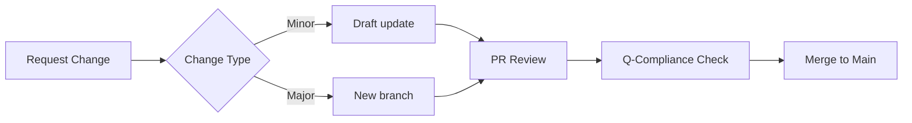

# AQUA V. Business Documentation Hub

> Central repository of standardized templates for quantum-aerospace enterprise operations
> **Program:** AQUA V. – Aerospace and Quantum United Advanced Venture
> **Version:** 3.0 | **Last Updated:** July 2025
> **Prepared for:** Amedeo Pelliccia, Quantum Structures Division

---

## 📂 Directory Structure

```plaintext
BUSINESS_DOCS/
├── 📁 Strategic_Planning/       # Templates for long-term vision and analysis
├── 📁 Project_Management/      # Templates for project lifecycle
├── 📁 Financial_Operations/    # Financial control templates
├── 📁 Legal_Compliance/        # Regulatory and contractual documents
└── 📁 Communications/          # Internal/external communication tools
```

---

## 🗂 Template Catalog

### 📁 Strategic\_Planning

| Template               | Format     | Description                    | Key Features                       |
| ---------------------- | ---------- | ------------------------------ | ---------------------------------- |
| `Business_Plan.docx`   | Word       | Quantum-aerospace roadmap      | Vision, TAM/SAM/SOM, Org Structure |
| `SWOT_Analysis.pptx`   | PowerPoint | Competitive position analysis  | Q-industry radar maps              |
| `Market_Analysis.xlsx` | Excel      | Aerospace/quantum segment data | Growth forecasts, TRL mapping      |

### 📁 Project\_Management

| Template                | Format | Description                | Phase                          |
| ----------------------- | ------ | -------------------------- | ------------------------------ |
| `Project_Proposal.docx` | Word   | Q-div project initiation   | Feasibility, Milestone mapping |
| `Project_Charter.pdf`   | PDF    | Formalized program charter | GAIA-QAO compliant             |
| `Status_Report.docx`    | Word   | Execution tracking         | Auto-updating KPIs             |

### 📁 Financial\_Operations

| Template                | Format | Purpose             | Automation                    |
| ----------------------- | ------ | ------------------- | ----------------------------- |
| `Invoice_Template.xlsx` | Excel  | Partner billing     | Multi-currency, VAT rules     |
| `Budget_Planning.xlsx`  | Excel  | TRL-phase budgeting | Scenario simulation           |
| `Financial_Report.docx` | Word   | Performance summary | Sustainability index included |

### 📁 Legal\_Compliance

| Template                 | Format | Use Case                  | Critical Sections         |
| ------------------------ | ------ | ------------------------- | ------------------------- |
| `Contract_Agreement.pdf` | PDF    | Supplier/client contracts | IP clause, deliverables   |
| `NDA_Template.pdf`       | PDF    | Multi-jurisdiction NDA    | Quantum IP included       |
| `Terms_Conditions.docx`  | Word   | Commercial usage rules    | Digital twin usage rights |

### 📁 Communications

| Template                     | Format     | Audience          | Frequency      |
| ---------------------------- | ---------- | ----------------- | -------------- |
| `Meeting_Minutes.docx`       | Word       | Inter-QD and ORB  | Weekly/Monthly |
| `Monthly_Report.docx`        | Word       | PMO + Board       | Monthly cycles |
| `Presentation_Template.pptx` | PowerPoint | External/Partners | By milestone   |

---

## 💻 Usage Guide

1. **Access Templates**:

   ```bash
   git clone https://aqua-v.com/docs/business_templates.git
   curl -O https://aqua-v.com/docs/Financial_Operations.zip
   ```

2. **Customization Protocol**:

   * Replace `<<AQUA_V_ENTITY>>`, `<<YEAR>>`, `<<Q-DIV>>`
   * Use approved logos: `logo_AQUA_V_black.png`, `logo_AQUA_V_blu.png`, `logo_AQUA_V_white.png`
   * Legal templates require `#ORB-LEGAL` review label

3. **Version Control**:

   ```bash
   grep "Version:" Strategic_Planning/Business_Plan.docx
   ```

---

## 🔄 Update Workflow



---

## 📌 Key Policies

1. **Retention Rules**:

   * Financial: 7 years
   * Legal: 10 years
   * Project: 2 years post-closure

2. **Compliance Standards**:

   * EU GDPR Art. 30
   * SOX 404
   * WCAG 2.1 AA

3. **Access Control**:
   \| Role | Permissions |
   \|------|-------------|
   \| All Staff | Read-only |
   \| QD Leads | Edit within division |
   \| ORB-LEGAL | Full access + sign-off |

---

## 🛠 Advanced Addendum Highlights

* Mermaid workflows & CLI commands added
* Retention policy & compliance-mapping matrix
* Role-based access control structure
* Template-specific usage guidance in `/guides/`
* Office compatibility & encryption protocols

---

© 2025 AQUA V. Technologies. All rights reserved.
Powered by Quantum Structures, ORB-FIN, and QDATAGOV
