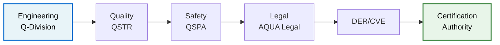

# 📑 AQUA V. Certification Templates Center

> Central repository for aerospace, robotic, and quantum systems certification within the AQUA V. program  
> **Version:** 5.4 | **Compliance:** FAA/EASA/NASA/ISO/ECSS | **Updated:** July 2025  
> **Program:** AQUA V. - Aerospace and Quantum United Advanced Venture

---

## 🌐 Directory Structure
```plaintext
DOCUMENTACION_MASTER/TEMPLATES/CERTIFICATION_TEMPLATES/
├── AIRCRAFT_CERTIFICATION/         # Aeronautical certification (FAA/EASA/ICAO)
├── SPACE_SYSTEMS_CERTIFICATION/    # Orbital and suborbital systems
├── ROBOTICS_CERTIFICATION/         # Industrial, drone, and space robotics
├── QUANTUM_SYSTEMS_CERT/           # Quantum systems
├── CROSS_PLATFORM_CERT/            # Cross-platform standards
└── CERTIFICATION_MANAGEMENT/       # Document management
```

---

## 🏷️ AQUA V. Nomenclature Mapping

### Template Nomenclature Format:
```
[LÍNEA]-CERT-[MSN]-DES-BOB-REG-TD-[UTCS]-[CÓDIGO]-TPL-CERT-[ID]-[QD]-v[X.Y.Z]

Where:
- LÍNEA: AMP (Aircraft), GAI (Space), ROB (Robotics), QUA (Quantum), AQA (Master)
- MSN: Development site (25MAD0001, 25TOL0001, 25MUN0001, 25NAP0001, 25SGA0001, 25SVD0001)
- UTCS: Domain-specific code (ATA, STA, DTTA, QCSAA, etc.)
- ID: Unique template identifier (3 digits)
- QD: Responsible Q-Division
```

### Nomenclature Examples:
| Original Template | AQUA V. Nomenclature |
|-------------------|---------------------|
| PSAC_Template.docx | AMP-CERT-25MAD0001-DES-BOB-REG-TD-ATA-000-TPL-CERT-001-QSTR-v5.4.0.docx |
| QKD_Implementation.docx | QUA-CERT-25SVD0001-DES-BOB-REG-TD-QCSAA-950-TPL-CERT-010-QSCI-v5.4.0.docx |
| Space_Robot_Cert.xlsx | ROB-CERT-25MUN0001-DES-BOB-REG-TD-STA-150-TPL-CERT-020-QSPA-v5.4.0.xlsx |
| Life_Support_Validation.docx | GAI-CERT-25TOL0001-DES-BOB-REG-TD-STA-110-TPL-CERT-030-QSPA-v5.4.0.docx |

---

## ✈️ Aircraft Certification - AMPEL360 Line
**Standards:** FAA Part 25, EASA CS-25, DO-178C, ARP4754A  
*Location: `AIRCRAFT_CERTIFICATION/`*  
*Q-Division Lead: QSTR-Structures*

| Template | Format | Application | AQUA V. Products | Key Features |
|----------|--------|-------------|------------------|--------------|
| PSAC_Template.docx | Word | Critical software | BWB-Q100/Q250 | V-cycle, DAL A-C |
| FHA_Template.docx | Word | Functional safety | All AMPEL360 | AM/AC analysis |
| EMC_Test_Plan.docx | Word | EM compatibility | AMPEL360e | DO-160G Section 20 |
| Compliance_Matrix.xlsx | Excel | Regulatory verification | All aircraft | CS/FAA mapping |
| SC-VTOL_Cert.docx | Word | eVTOL specific | AMPEL360City | Urban operations |
| Quantum_Integration.xlsx | Excel | Q-systems cert | BWB-Q series | Quantum safety |

---

## 🚀 Space Systems Certification - GAIA Line
### Space Tourism (AMPEL360 Plus/PlusPlus)
*Location: `SPACE_SYSTEMS_CERTIFICATION/SPACE_TOURISM/`*  
*Q-Division Lead: QSPA-Space*

| Template | Format | Requirement | Critical Parameters | AQUA V. Application |
|----------|--------|-------------|---------------------|---------------------|
| Life_Support_Validation.docx | Word | FAA Part 460 | 72h O₂ autonomy | AMPEL360 Plus/PlusPlus |
| G_Force_Tolerance.xlsx | Excel | Suborbital tourism | 6G/60s profile | AMPEL360 Plus |
| Emergency_Return_Procedures.pdf | PDF | Orbital safety | 5-min contingency | AMPEL360 PlusPlus |
| Passenger_Medical_Screening.docx | Word | Health requirements | Pre-flight protocol | All space tourism |

### Satellite Systems (GAIA-SAT)
| Template | Format | Standard | Validation | GAIA Products |
|----------|--------|----------|------------|---------------|
| Radiation_Hardness_Assurance.docx | Word | MIL-STD-1540 | 100krad TID | All GAIA-SAT |
| Thermal_Vacuum_Test_Protocol.docx | Word | ECSS-E-ST-10 | -196°C/+120°C cycles | LEO/GEO satellites |
| Orbital_Debris_Mitigation.xlsx | Excel | ISO 24113 | 25-year rule | All orbital systems |
| Quantum_Payload_Cert.docx | Word | AQUA-Q-001 | Q-state preservation | Q-Network satellite |

---

## 🤖 Robotics Certification - ROBBBO-T Line
**Standards:** ISO 10218, ISO/TS 15066, ECSS-Q-ST-60C  
*Location: `ROBOTICS_CERTIFICATION/`*  
*Q-Division Lead: QIND-Industry*

| Template | Format | Application | Metrics | ROBBBO-T Models |
|----------|--------|-------------|---------|-----------------|
| Collaborative_Safety.docx | Word | Industrial robots | Force < 150N | ROBBBO-FAL series |
| BVLOS_Operation_Plan.docx | Word | Drones | DIN 91350 geofences | GAIA-UAV interface |
| Space_Robot_Cert.xlsx | Excel | Orbital operations | TRL 7+ | ROBBBO-SPACE |
| MRO_Robot_Safety.docx | Word | Maintenance robots | SIL 3 compliance | ROBBBO-MRO |
| Extreme_Environment.xlsx | Excel | Harsh conditions | -180°C to +200°C | ROBBBO-EXPLORE |

---

## ⚛ Quantum Systems Certification
**Standards:** NIST IR 8413, ISO/IEC 23837, AQUA-Q-001  
*Location: `QUANTUM_SYSTEMS_CERT/`*  
*Q-Division Lead: QSCI-Research*

| Template | Format | System | Parameters | AQUA V. Systems |
|----------|--------|--------|------------|-----------------|
| QKD_Implementation.docx | Word | Communication | >10kbps @ 50km | QKD network |
| Quantum_Sensor_Metrology.xlsx | Excel | Sensors | Resolution 10⁻¹⁵ g | QGR, QMG |
| Cryogenic_TestPlan.docx | Word | Computing | Coherence >100μs | QPU, QAI |
| QNS_Navigation_Cert.docx | Word | Navigation | GPS-denied ops | QNS system |
| Quantum_State_Validation.xlsx | Excel | Q-state verify | 99.9% fidelity | All Q-systems |
| Error_Correction_Protocol.docx | Word | QEC | <10⁻⁹ error rate | QSMS |

---

## 👥 Q-Division Responsibilities

| Q-Division | Template Categories | Contact | Response Time |
|------------|--------------------|---------|--------------| 
| QSTR-Structures | Aircraft cert, DO-178C | qstr-cert@aquav.aero | <2h critical |
| QSPA-Space | Space systems, orbital | qspa-cert@aquav.aero | <2h critical |
| QSCI-Research | Quantum templates | qsci-cert@aquav.aero | <4h standard |
| QIND-Industry | Robotics, automation | qind-cert@aquav.aero | <4h standard |
| QDAT-DataGov | Cybersecurity, data | qdat-cert@aquav.aero | <2h security |
| QMEC-Mechanics | Mechanical cert | qmec-cert@aquav.aero | <4h standard |
| QGRE-GreenTech | Environmental | qgre-cert@aquav.aero | <8h standard |

---

## 🎯 Product-Specific Application Matrix

### AMPEL360 Aircraft Family
| Model | Required Templates | Certification Path | Timeline |
|-------|-------------------|-------------------|----------|
| BWB-Q100 | PSAC, FHA, EMC, Quantum_Integration | CS-25 + AQUA-Q | 36 months |
| BWB-Q250 | All BWB-Q100 + Extended_Range | CS-25 + AQUA-Q | 42 months |
| AMPEL360City | SC-VTOL_Cert, Urban_Ops, Noise | SC-VTOL | 24 months |
| AMPEL360e | Hybrid_Cert, Battery_Safety | CS-23 + Special | 30 months |
| AMPEL360 Plus | All aircraft + Space_Tourism | Dual cert | 48 months |

### GAIA Systems
| System | Required Templates | Special Requirements |
|--------|-------------------|---------------------|
| GAIA-UAV | BVLOS, Remote_ID, Swarm_Ops | SORA compliance |
| GAIA-SAT | Radiation, Thermal, Orbital | Launch safety |
| GAIA-ROVER | Space_Robot, Planetary_Protection | COSPAR Cat IV |

### ROBBBO-T Platforms
| Series | Certification Focus | Key Standards |
|--------|--------------------|--------------| 
| ROBBBO-FAL | Collaborative safety | ISO/TS 15066 |
| ROBBBO-MRO | Aviation maintenance | Part 145 interface |
| ROBBBO-SPACE | EVA operations | ECSS-Q-ST-60C |

---

## 🔄 Cross-Platform Standards
*Location: `CROSS_PLATFORM_CERT/`*

| Template | Format | Standard | Scope | All Products |
|----------|--------|----------|-------|--------------|
| Cyber_Security_Matrix.xlsx | Excel | NIST 800-53 | Aerospace-wide | ✓ |
| Environmental_Compliance.docx | Word | ISO 14001 | Product lifecycle | ✓ |
| AS9100_Audit_Plan.docx | Word | AS9100D | Quality system | ✓ |
| Quantum_Safety_Framework.xlsx | Excel | AQUA-Q-002 | Q-system safety | Q-enabled only |
| ALI_BOB_Sync_Protocol.docx | Word | AQUA-DT-001 | Digital twin | ✓ |

---

## 📋 Certification Management
*Location: `CERTIFICATION_MANAGEMENT/`*

| Template | Format | Function | Automation | Integration |
|----------|--------|----------|-------------|-------------|
| Nonconformity_Tracker.xlsx | Excel | NC management | 72h SLA | JIRA API |
| Training_Records.docx | Word | Competencies | QR verification | AQUA Academy |
| Document_Revision_Log.xlsx | Excel | Change control | SHA-256 timestamp | Git hooks |
| Certification_Dashboard.pptx | PowerPoint | Status reporting | Live data | Power BI |
| Compliance_Matrix_Master.xlsx | Excel | Multi-standard | Auto-mapping | AI-assisted |

---

## ⚙️ Usage Protocol

### 1. **Template Selection**
```bash
# Search FAA templates for AMPEL360:
find ./AIRCRAFT_CERTIFICATION -name "*FAA*" -exec grep -l "AMPEL360" {} \;

# List quantum certification templates:
ls -la ./QUANTUM_SYSTEMS_CERT/QUA-CERT-*.docx
```

### 2. **Customization Guidelines**
- 🟡 **Yellow fields**: Mandatory completion
- 🔵 **Blue fields**: Conditional (based on product)
- 🔴 **Red text**: Legal review required (do not modify)
- 🟢 **Green fields**: Auto-populated from AQUA database

### 3. **Validation Workflow**


### 4. **Digital Storage & Blockchain**
```yaml
storage:
  working: 
    location: "/AQUA-V/CERTIFICATION/WIP/"
    encryption: "AES-256"
    access: "Role-based"
  
  approved:
    location: "/AQUA-V/CERTIFICATION/APPROVED/"
    blockchain: "AQUA-Chain"
    hash: "SHA-3-512"
    
  archive:
    location: "/AQUA-V/CERTIFICATION/ARCHIVE/"
    retention: "Program life + 50 years"
    compliance: "21 CFR Part 11"
```

---

## 🛡 Critical Requirements by Domain

### Quantum Systems
```diff
+ Quantum state verification: >99.9% fidelity required
+ Decoherence mitigation: <10⁻⁶ error rate
+ Cryogenic validation: 10mK ± 1mK stability
+ Quantum-classical interface: Triple redundancy
+ Q-security: Post-quantum cryptography mandatory
```

### Space Tourism (AMPEL360 Plus/PlusPlus)
```diff
+ Insurance: >€500M liability coverage
+ Launch abort: 3s activation window
+ G-force training: 6G/60s verified tolerance
+ Pressure suits: <30s don time
+ Medical screening: 48h pre-flight mandatory
+ Emergency return: 5 orbits maximum
```

### Urban Air Mobility (AMPEL360City)
```diff
+ Noise certification: <65 dBA at 150m
+ VTOL redundancy: 6 independent lift units
+ Geo-fencing: Triple-redundant GPS/QNS
+ Emergency landing: 30s to safe zone
+ Battery safety: RTCA DO-311A compliance
```

---

## 📊 Certification Metrics Dashboard

### Real-Time KPIs
| Metric | Target | Current | Trend | Q-Division Owner |
|--------|--------|---------|--------|------------------|
| Average cert time | <90 days | 82 days | ↓ 📉 | QSTR |
| First-pass approval | >85% | 88% | ↑ 📈 | All |
| NC resolution | <72h | 65h | ↓ 📉 | QIND |
| Template reuse | >70% | 76% | ↑ 📈 | QDAT |
| Q-system cert rate | >80% | 83% | → 📊 | QSCI |

### Automated Tracking
```bash
# Check certification status
curl -X GET https://api.aquav.aero/cert/status/AMP-BWB01

# Verify compliance
curl -X POST https://api.aquav.aero/cert/verify \
  -H "Authorization: Bearer $AQUA_TOKEN" \
  -d '{"template": "PSAC_Template", "product": "BWB-Q100"}'

# Generate compliance report
aqua-cert generate-report --product BWB-Q100 --standard DO-178C
```

---

## 🔄 CI/CD Pipeline Integration

### GitLab CI Configuration
```yaml
# .gitlab-ci.yml
stages:
  - validate
  - version
  - review
  - deploy

validate_nomenclature:
  stage: validate
  script:
    - python3 /scripts/validate_aqua_naming.py
    - check_mandatory_fields.sh
    - verify_regulatory_refs.py
  only:
    - merge_requests

auto_version:
  stage: version
  script:
    - semantic-release --branch main
    - update_aqua_registry.py
    - generate_qr_code.sh
  only:
    - main

compliance_check:
  stage: review
  script:
    - run_compliance_matrix.py
    - check_standard_updates.sh
    - notify_q_division.py
  artifacts:
    paths:
      - compliance_report.pdf
```

---

## ⚠️ Risk Matrix by Product Line

### AMPEL360 Aircraft
| Risk | Probability | Impact | Mitigation | Template |
|------|-------------|--------|------------|----------|
| Quantum system failure | Low | Critical | Triple redundancy | Quantum_Integration.xlsx |
| Battery thermal runaway | Medium | High | DO-311A compliance | Battery_Safety.docx |

### GAIA Systems
| Risk | Probability | Impact | Mitigation | Template |
|------|-------------|--------|------------|----------|
| Space debris collision | Low | Catastrophic | Tracking + avoidance | Orbital_Debris.xlsx |
| Solar panel degradation | High | Medium | 30% oversizing | Power_Budget.xlsx |

### Quantum Systems
| Risk | Probability | Impact | Mitigation | Template |
|------|-------------|--------|------------|----------|
| Decoherence cascade | Medium | Critical | QEC + isolation | Error_Correction.docx |
| Cryogenic failure | Low | High | Redundant cooling | Cryogenic_TestPlan.docx |

---

## 📞 Support & Escalation

| Level | Contact | Response Time | Scope |
|-------|---------|---------------|-------|
| 🔴 CRITICAL | space-cert-emergency@aquav.aero | <15 min | Safety/regulatory blocks |
| 🟡 URGENT | cert-support@aquav.aero | <2h | Submission deadlines |
| 🔵 STANDARD | #cert-support (Slack) | <4h | General queries |
| 🟢 UPDATES | reg-updates@aquav.aero | Weekly digest | Regulatory changes |

**Documentation Portal:** [cert.aquav.aero](https://cert.aquav.aero)  
**Git Repository:** `git clone https://git.aquav.aero/cert-templates.git`  
**API Documentation:** [api.aquav.aero/cert/docs](https://api.aquav.aero/cert/docs)

---

## 📝 Version History

```diff
# v5.4.0 - July 2025
+ Added: Quantum system certification templates (10 new)
+ Added: AMPEL360 Plus/PlusPlus space tourism templates
+ Updated: FAA Part 460 Rev 4.1 compliance
+ Updated: DO-178C supplement for quantum software
! Fixed: MIL-STD-1540E matrix calculations
! Fixed: ECSS thermal cycling parameters
- Removed: Obsolete DO-178B templates
- Removed: Legacy robotics standards (pre-2023)

# v5.3.0 - June 2025
+ Added: Urban air mobility (UAM) certification package
+ Added: Blockchain verification for certificates
+ Updated: EASA SC-VTOL Issue 2
! Fixed: AS9100D audit checklist gaps

# v5.2.0 - May 2025
+ Initial AQUA V. integration
+ Q-Division responsibility matrix
+ Product-specific templates
```

---

> **Legal Notice:** All templates require final validation by the Certified Safety Officer and appropriate Q-Division lead before operational use. Templates are proprietary to AQUA V. and subject to export control regulations.

> **Quality Notice:** This documentation is controlled under AQUA V. QMS and requires Q-Division approval for modifications.

---

*© 2025 AQUA V. - Aerospace and Quantum United Advanced Venture*  
*Confidential and Proprietary - Not for Distribution*
