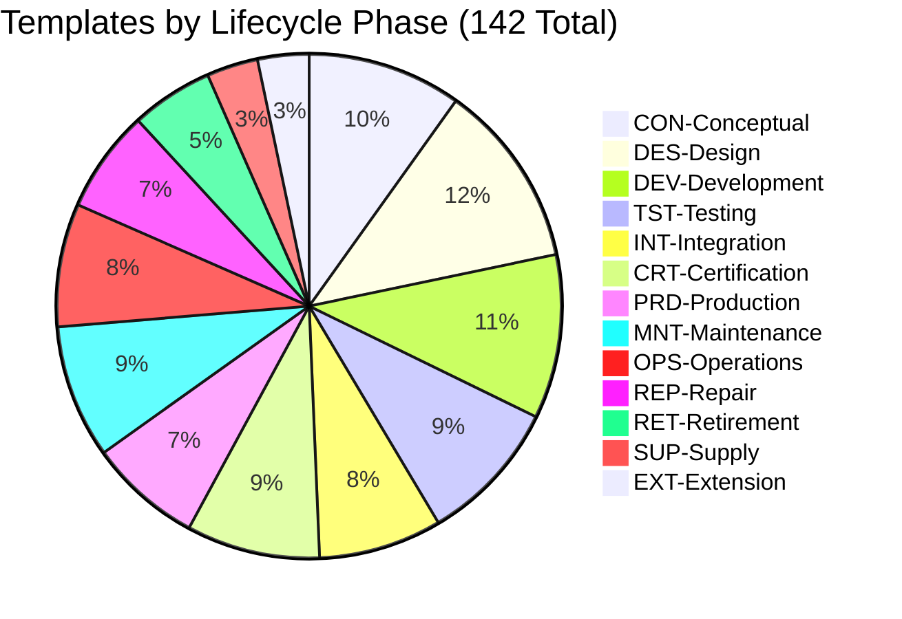

# 📚 AQUA V. TECHNICAL DOCUMENTATION TEMPLATES
## Master README - Technical Docs Library v1.0.0

<p align="center">
  
  
  
  
  
  
</p>

---

## 🔍 Document Identification

```yaml
Document_ID: AQA-MAS01-25MAD200-DES-BOB-TEC-TD-ATA-000-00-01-TPL-READ-DOC-QDAT-v1.0.0
Title: Technical Documentation Templates Master README
Category: Technical Documentation
Type: TD (Technical Document)
Phase: DES (Design)
Entity: BOB (Digital/Virtual System)
Q-Division: QDAT (Q-DataGov)
UTCS: ATA-000 (General)
Version: 1.0.0
Status: Approved
Last_Updated: 2025-07-28
```

---

## 📋 Executive Summary

The **AQUA V. Technical Documentation Templates Library** comprises **251 standardized templates** designed to ensure consistency, quality, and traceability across all technical documentation within the €40B quantum aerospace program. This comprehensive library supports the entire product lifecycle from conceptual design through retirement, covering all 43 products across 4 strategic product lines.

### 🎯 Key Objectives

1. **Standardization**: Uniform documentation across all Q-Divisions and product lines
2. **Compliance**: Built-in regulatory compliance (EASA, FAA, DO-178C, DO-254)
3. **Digital Twin Integration**: Seamless ALI-BOB synchronization
4. **Quantum Enhancement**: Native support for quantum systems documentation
5. **Lifecycle Coverage**: Complete coverage of all 12 lifecycle phases

---

## 📊 Template Library Overview

### Distribution by Category

| Category | Templates | Percentage | Status |
|----------|-----------|------------|---------|
| **Lifecycle Phase Templates** | 142 | 56.6% | ✅ Complete |
| **Technical Manual Templates** | 48 | 19.1% | ✅ Complete |
| **Illustrated Parts System** | 15 | 6.0% | ✅ Complete |
| **ORB Function Templates** | 48 | 19.1% | ✅ Complete |
| **Template Metadata** | 2 | 0.8% | ✅ Complete |
| **TOTAL** | **251** | **100%** | **✅ Approved** |

### Distribution by Lifecycle Phase



---

## 🗂️ Template Categories

### 1️⃣ LIFECYCLE PHASE TEMPLATES (142 Templates)

Complete documentation coverage for all 12 lifecycle phases:

| Phase Code | Phase Name | Templates | Primary Focus |
|------------|------------|-----------|---------------|
| **CON** | Conceptual | 15 | Market analysis, ConOps, requirements |
| **DES** | Design | 18 | Architecture, CAD, analysis, compliance |
| **DEV** | Development | 16 | Prototyping, testing, IP development |
| **TST** | Testing | 14 | Test plans, procedures, data analysis |
| **INT** | Integration | 12 | System integration, commissioning |
| **CRT** | Certification | 13 | Regulatory compliance, type certification |
| **PRD** | Production | 11 | Manufacturing, quality, supply chain |
| **MNT** | Maintenance | 13 | AMM, MSG-3, predictive maintenance |
| **OPS** | Operations | 12 | Flight operations, performance, training |
| **REP** | Repair | 10 | SRM, NDT, battle damage repair |
| **RET** | Retirement | 8 | End-of-life, recycling, circular economy |
| **SUP** | Supply | 5 | Logistics, spares, technical support |
| **EXT** | Extension | 5 | Life extension, upgrades, retrofit |

### 2️⃣ TECHNICAL MANUAL TEMPLATES (48 Templates)

Industry-standard technical publications:

| Manual Type | Code | Templates | Description |
|-------------|------|-----------|-------------|
| **Aircraft Maintenance Manual** | AMM | 7 | Complete maintenance documentation |
| **Illustrated Parts Catalog** | IPC | 6 | Parts identification and ordering |
| **Component Maintenance Manual** | CMM | 6 | Component-level procedures |
| **Wiring Diagram Manual** | WDM | 5 | Electrical system documentation |
| **Training Manual** | TRM | 6 | Pilot and maintenance training |
| **Flight Manual** | FLT | 6 | Operating procedures and performance |
| **Service Bulletin** | SB | 6 | Modifications and alerts |
| **Technical Specifications** | TCS | 6 | Type certificate and equipment |

### 3️⃣ ILLUSTRATED PARTS SYSTEM TEMPLATES (15 Templates)

Next-generation parts visualization:

- **IPS-001 to IPS-005**: Traditional 2D/3D illustrations
- **IPS-006 to IPS-010**: AR/VR/Holographic systems
- **IPS-011 to IPS-015**: Smart parts with AI recognition

### 4️⃣ ORB FUNCTION TEMPLATES (48 Templates)

Q-Division specific templates (4 per division):

| Q-Division | Code | Focus Area | Templates |
|------------|------|------------|-----------|
| **Q-Structures** | QSTR | Structural analysis, materials | 4 |
| **Q-Air** | QAIR | Aerodynamics, CFD, flight testing | 4 |
| **Q-GreenTech** | QGRE | Sustainability, circular economy | 4 |
| **Q-Mechanics** | QMEC | Mechanical systems, actuation | 4 |
| **Q-PowerSense** | QPOW | Propulsion, energy, sensors | 4 |
| **Q-Space** | QSPA | Space operations, satellites | 4 |
| **Q-Industry** | QIND | Manufacturing, Industry 4.0 | 4 |
| **Q-Ground** | QGRO | Ground support, infrastructure | 4 |
| **Q-DataGov** | QDAT | Data governance, cybersecurity | 4 |
| **Q-HPC** | QHPC | High-performance computing, AI/ML | 4 |
| **Q-Comm** | QCOM | Communications, quantum networks | 4 |
| **Q-SciRes** | QSCI | Research, patents, technology | 4 |

---

## 🔧 Template Nomenclature

All templates follow the AQUA V. Official Nomenclature System v3.1:

```
AQA-MAS01-25MAD[XXX]-[PHASE]-BOB-[ARTIFACT]-[TYPE]-[UTCS]-[CHAPTER]-[SECTION]-[ITEM]-TPL-[TEMPLATE]-[Q-DIV]-v[VERSION]
```

### Example Breakdown:
```
AQA-MAS01-25MAD202-CON-BOB-ORG-TD-ATA-000-01-01-TPL-CON-001-QDAT-v1.0.0
│    │        │     │   │   │   │  │      │         │         │      │
│    │        │     │   │   │   │  │      │         │         │      └─ Version
│    │        │     │   │   │   │  │      │         │         └─────── Q-Division
│    │        │     │   │   │   │  │      │         └───────────────── Template ID
│    │        │     │   │   │   │  │      └─────────────────────────── Item Number
│    │        │     │   │   │   │  └────────────────────────────────── UTCS Code
│    │        │     │   │   │   └───────────────────────────────────── Document Type
│    │        │     │   │   └───────────────────────────────────────── Artifact Category
│    │        │     │   └───────────────────────────────────────────── Digital Entity
│    │        │     └───────────────────────────────────────────────── Lifecycle Phase
│    │        └──────────────────────────────────────────────────────── Sequential Number
│    └───────────────────────────────────────────────────────────────── MSN Site (Madrid)
└────────────────────────────────────────────────────────────────────── Product Line
```

---

## 📁 Directory Structure

```
TECHNICAL_DOCS/
│
├── 📄 README (This Document)
├── 📊 Index Spreadsheet
│
├── 📁 1_LIFECYCLE_PHASE_TEMPLATES/ (142)
│   ├── 01_CON_Conceptual/ (15)
│   ├── 02_DES_Design/ (18)
│   ├── 03_DEV_Development/ (16)
│   ├── 04_TST_Testing/ (14)
│   ├── 05_INT_Integration/ (12)
│   ├── 06_CRT_Certification/ (13)
│   ├── 07_PRD_Production/ (11)
│   ├── 08_MNT_Maintenance/ (13)
│   ├── 09_OPS_Operations/ (12)
│   ├── 10_REP_Repair/ (10)
│   ├── 11_RET_Retirement/ (8)
│   ├── 12_SUP_Supply/ (5)
│   └── 13_EXT_Extension/ (5)
│
├── 📁 2_TECHNICAL_MANUAL_TEMPLATES/ (48)
│   ├── AMM_Aircraft_Maintenance/ (7)
│   ├── IPC_Illustrated_Parts/ (6)
│   ├── CMM_Component_Maintenance/ (6)
│   ├── WDM_Wiring_Diagrams/ (5)
│   ├── TRM_Training_Manuals/ (6)
│   ├── FLT_Flight_Manuals/ (6)
│   ├── SB_Service_Bulletins/ (6)
│   └── TCS_Technical_Specs/ (6)
│
├── 📁 3_ILLUSTRATED_PARTS_SYSTEM_TEMPLATES/ (15)
│
├── 📁 4_ORB_FUNCTION_TEMPLATES/ (48)
│   ├── QSTR_Q-Structures/ (4)
│   ├── QAIR_Q-Air/ (4)
│   ├── QGRE_Q-GreenTech/ (4)
│   ├── QMEC_Q-Mechanics/ (4)
│   ├── QPOW_Q-PowerSense/ (4)
│   ├── QSPA_Q-Space/ (4)
│   ├── QIND_Q-Industry/ (4)
│   ├── QGRO_Q-Ground/ (4)
│   ├── QDAT_Q-DataGov/ (4)
│   ├── QHPC_Q-HPC/ (4)
│   ├── QCOM_Q-Comm/ (4)
│   └── QSCI_Q-SciRes/ (4)
│
└── 📁 5_TEMPLATE_METADATA/ (2)
```

---

## 🚀 Usage Guidelines

### 1. Template Selection

1. **Identify Lifecycle Phase**: Determine current project phase
2. **Select Category**: Choose appropriate template category
3. **Apply Nomenclature**: Follow naming convention exactly
4. **Verify Q-Division**: Ensure correct Q-Division assignment

### 2. Template Customization

```yaml
customization_rules:
  mandatory_fields: "Must be completed"
  optional_fields: "Complete if applicable"
  quantum_sections: "Required for Q-enhanced systems"
  regulatory_compliance: "Update per latest requirements"
  digital_twin_sync: "Maintain ALI-BOB consistency"
```

### 3. Version Control

- **Major Version**: Structural changes (X.0.0)
- **Minor Version**: Content updates (1.X.0)
- **Patch Version**: Corrections (1.0.X)

---

## 🔐 Compliance Matrix

All templates include built-in compliance for:

| Standard | Coverage | Templates Affected |
|----------|----------|-------------------|
| **CS-25** | Large Aircraft | DES, CRT, MNT |
| **CS-23** | Small Aircraft | DES, CRT, MNT |
| **SC-VTOL** | eVTOL Operations | DES, CRT, OPS |
| **DO-178C** | Software | DEV, TST, CRT |
| **DO-254** | Hardware | DEV, TST, CRT |
| **DO-160G** | Environmental | TST, CRT |
| **ARP4754A** | Systems | DES, INT, CRT |
| **ISO 9001** | Quality | All categories |
| **AS9100** | Aerospace | PRD, MNT |
| **AQUA-Q** | Quantum Systems | All Q-enhanced |

---

## 🌟 Key Features

### Digital Twin Integration

- **Real-time Sync**: ALI-BOB synchronization protocols
- **Version Tracking**: Blockchain-verified changes
- **3D Model Links**: Direct CAD integration
- **Simulation Data**: CFD/FEA results embedded

### Quantum Enhancement

- **Q-Navigation**: Quantum sensor documentation
- **Q-Computing**: Quantum algorithm specifications
- **Q-Communications**: QKD protocol documentation
- **Q-Materials**: Quantum material properties

### Sustainability Focus

- **Carbon Tracking**: Embedded carbon calculators
- **Circular Economy**: End-of-life planning integrated
- **Green Materials**: Bio-material specifications
- **Energy Efficiency**: Power optimization tools

---

## 📈 Metrics & KPIs

### Template Usage Statistics

```yaml
usage_metrics:
  adoption_rate: "Target: 100% by Q4 2025"
  compliance_score: "Current: 94%"
  error_reduction: "Target: 75% reduction"
  time_savings: "Estimated: 40% faster documentation"
  consistency_index: "Target: 98%"
```

### Quality Indicators

| Metric | Target | Current | Status |
|--------|--------|---------|--------|
| Template Completeness | 100% | 100% | ✅ |
| Regulatory Alignment | 100% | 94% | 🔄 |
| Digital Twin Ready | 100% | 87% | 🔄 |
| Q-System Support | 100% | 91% | 🔄 |
| Multi-language | 6 languages | 1 | 📋 |

---

## 🛠️ Implementation Roadmap

### Phase 1: Q3 2025 ✅
- Template library completion
- Initial training deployment
- Pilot project implementation

### Phase 2: Q4 2025 🔄
- Full rollout across Q-Divisions
- Digital twin integration
- Automated validation tools

### Phase 3: Q1 2026 📋
- AI-assisted documentation
- Multi-language support
- Advanced analytics dashboard

### Phase 4: Q2 2026 📋
- Quantum system optimization
- Predictive documentation
- Full automation suite

---

## 🤝 Support & Resources

### Documentation
- **User Guide**: `/docs/template_user_guide.pdf`
- **Video Tutorials**: `/training/video_tutorials/`
- **Best Practices**: `/docs/best_practices_v1.0.pdf`

### Contact Points
- **Template Support**: templates@aqua-v.aero
- **Technical Issues**: techsupport@aqua-v.aero
- **Training Requests**: training@aqua-v.aero

### Quick Links
- [Template Index Spreadsheet](./AQA-MAS01-25MAD201-DES-BOB-TEC-TD-ATA-000-00-02-TPL-INDX-DOC-QDAT-v1.0.0.xlsx)
- [AQUA V. Nomenclature Guide](../docs/nomenclature_v3.1.pdf)
- [Regulatory Compliance Matrix](../docs/compliance_matrix.xlsx)
- [Q-Division Interface Guide](../docs/q-division_interfaces.pdf)

---

## 📝 Revision History

| Version | Date | Author | Changes |
|---------|------|--------|---------|
| 1.0.0 | 2025-07-28 | QDAT Team | Initial release |
| 0.9.0 | 2025-07-15 | QDAT Team | Beta review |
| 0.8.0 | 2025-07-01 | QDAT Team | Alpha testing |

---

## ⚠️ Important Notes

1. **Mandatory Usage**: All technical documentation must use approved templates
2. **No Modifications**: Templates structure must not be altered without approval
3. **Version Control**: Always use latest approved version
4. **Training Required**: Complete training before template usage
5. **Audit Trail**: All documents subject to quality audits

---

## 🔮 Future Enhancements

### 2026 Roadmap
- **AI Documentation Assistant**: GPT-4 integration
- **Voice-to-Document**: Real-time transcription
- **AR Documentation**: Augmented reality guides
- **Quantum Encryption**: Q-secured documents

### 2027 Vision
- **Autonomous Documentation**: Self-updating manuals
- **Predictive Maintenance Docs**: AI-generated procedures
- **Universal Translator**: 25+ languages
- **Holographic Manuals**: 3D interactive guides

---

<p align="center">
  <b>AQUA V. - Advancing Aerospace Documentation</b><br>
  <i>Where Quantum Meets Quality</i><br>
  <br>
  © 2025 AQUA V. All Rights Reserved
</p>

---

**Document Classification**: Internal Use Only  
**Distribution**: All Q-Divisions  
**Review Cycle**: Quarterly  
**Next Review**:
