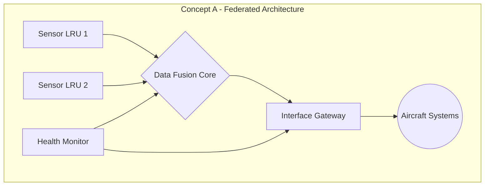
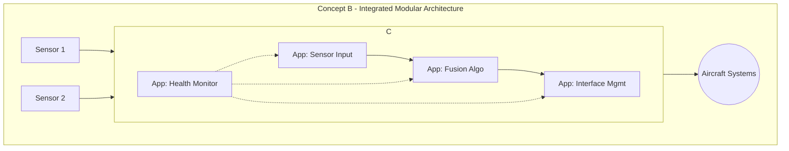

### **AQUA V. v9.0 Artifact Definition**

```yaml
artifact:
  nomenclature: "AQUART-CON-CDS-ARC-AR-PA-S001-DIGT-002-00-00-v9.0.0"
  configuration_item:
    artifact_id: "AQUART-CON-CDS-ARC-AR-PA-S001-DIGT-002-00-00-v9.0.0"
    owner_division: "QSTR"
    owner_team: "Enterprise Architecture & Advanced Design"
    created_by: "AI-DocGen-v9.0"
    created_date: "2025-12-01T14:15:00Z"
    classification: "AQUA V. CONFIDENTIAL"
    lifecycle_state: "TEMPLATE"
  extended_description:
    title: "AQUA V. Enterprise Conceptual Design Specification - System Architecture Concepts"
    short_title: "Enterprise CDS - Architecture Concepts"
    description: "Master template for defining and evaluating high-level system architecture concepts during the conceptual phase. This document translates initial requirements into potential block-level designs, exploring major components, interfaces, and operational flows to inform down-selection."
    keywords: ["conceptual design", "system architecture", "CDS", "architecture concepts", "block diagram", "trade study"]
    language: "en-US"
    translations: [] # No mandatory translations for CON phase
```

---

### **Template Content: `AQUART-CON-CDS-ARC-AR-PA-S001-DIGT-002-00-00-v9.0.0.md`**

```markdown
<!-- AQUA V. v9.0 Compliant -->
<!-- Artifact ID: AQUART-CON-CDS-ARC-AR-PA-S001-DIGT-002-00-00-v9.0.0 -->

# Conceptual Design Specification: [System/Program Name] Architecture

| | |
|:---|:---|
| **Document Title** | Conceptual Design Specification: [System/Program Name] Architecture |
| **Artifact ID** | *This document's ID will be generated upon instantiation* |
| **Based on Template** | AQUART-CON-CDS-ARC-AR-PA-S001-DIGT-002-00-00-v9.0.0 |
| **Phase** | CON - Conceptual |
| **Owner Division** | [Program Owner Q-Division] |
| **Status** | DRAFT / IN REVIEW / APPROVED |
| **Version** | [Specify Document Version, e.g., v1.0.0] |

---

## Table of Contents

1.  [Introduction](#1-introduction)
    1.1. [Purpose](#11-purpose)
    1.2. [Driving Requirements](#12-driving-requirements)
2.  [Architectural Goals and Constraints](#2-architectural-goals-and-constraints)
3.  [Proposed Architectural Concept A](#3-proposed-architectural-concept-a)
    3.1. [Concept Description](#31-concept-description)
    3.2. [High-Level Block Diagram](#32-high-level-block-diagram)
    3.3. [Key Components and Functions](#33-key-components-and-functions)
    3.4. [Major Interfaces](#34-major-interfaces)
    3.5. [Pros and Cons](#35-pros-and-cons)
4.  [Proposed Architectural Concept B](#4-proposed-architectural-concept-b)
    4.1. [Concept Description](#41-concept-description)
    4.2. [High-Level Block Diagram](#42-high-level-block-diagram)
    4.3. [Key Components and Functions](#43-key-components-and-functions)
    4.4. [Major Interfaces](#44-major-interfaces)
    4.5. [Pros and Cons](#45-pros-and-cons)
5.  [Comparative Analysis](#5-comparative-analysis)
6.  [Recommended Concept](#6-recommended-concept)

---

## 1. Introduction

### 1.1 Purpose
The purpose of this Conceptual Design Specification (CDS) is to present and evaluate high-level architectural concepts for the **[System/Program Name]**. This document serves as a bridge between the abstract requirements defined in the Requirement Specification (RQS) and the detailed engineering work of the Design Phase. It provides the basis for selecting a baseline architecture to move forward.

### 1.2 Driving Requirements
This conceptual design is driven by the following key top-level requirements from the RQS `[Insert RQS Document ID]`:

| Requirement ID | Requirement Summary | Architectural Implication |
|:---------------|:--------------------|:--------------------------|
| **[e.g., FR-002]** | System must be fail-operational. | Requires redundant components and a fault management sub-system. |
| **[e.g., PR-001]** | Position accuracy must be ≤ 1 meter. | Drives the selection of high-precision sensors and advanced fusion algorithms. |
| **[e.g., SeR-001]** | All external interfaces must be encrypted. | Necessitates a dedicated cryptographic processing module. |

---

## 2. Architectural Goals and Constraints
*   **Goals:** [List primary goals, e.g., "Maximize modularity", "Minimize Size, Weight, and Power (SWaP)", "Leverage existing enterprise software frameworks"].
*   **Constraints:** [List key constraints, e.g., "Must interface with legacy ARINC 429 bus", "Development budget not to exceed €X million", "Must use pre-approved quantum components from the QUA product line"].

---

## 3. Proposed Architectural Concept A: [e.g., "Federated Architecture"]

### 3.1 Concept Description
[Provide a narrative description of the architectural approach. E.g., "This concept utilizes a federated model where each major function (e.g., sensing, processing, communication) is handled by a dedicated, independent Line Replaceable Unit (LRU). These LRUs communicate over a central, high-speed data bus."]

### 3.2 High-Level Block Diagram



### 3.3 Key Components and Functions

| Component | Key Functions |
|:--------------------|:------------------------------------------------|
| **Sensor LRU** | Acquires raw data; performs initial signal conditioning. |
| **Data Fusion Core** | Fuses data from multiple sensors; runs core algorithms. |
| **Interface Gateway** | Formats data for output; manages communication protocols. |
| **Health Monitor** | Monitors the status of all LRUs; manages redundancy. |

### 3.4 Major Interfaces

*   **Sensor to Fusion Core:** High-speed, low-latency internal bus.
*   **Gateway to Aircraft:** Dual ARINC 664 busses.
*   **Power:** 28 VDC input to each LRU.

### 3.5 Pros and Cons

*   **Pros:** High modularity, simplified development and testing of individual LRUs, clear separation of concerns.
*   **Cons:** Higher number of physical units (SWaP impact), potential for data bus to become a bottleneck.

---

## 4. Proposed Architectural Concept B: [e.g., "Integrated Modular Architecture"]

### 4.1 Concept Description
[Provide a narrative description of the architectural approach. E.g., "This concept utilizes an Integrated Modular Architecture (IMA) approach, where all functions run as partitioned software applications on a single, powerful, redundant processing platform. Sensors connect directly to the IMA core."]

### 4.2 High-Level Block Diagram



### 4.3 Key Components and Functions

| Component | Key Functions |
|:----------------|:-----------------------------------------------------------------|
| **IMA Core** | Hosts all software applications in secure partitions; manages all processing and I/O. |
| **Software Apps** | Individual applications for sensing, fusion, interfaces, and health monitoring. |
| **Sensors** | Simpler sensor heads providing raw data directly to the IMA Core. |

### 4.4 Major Interfaces

*   **Sensor to IMA Core:** Direct, point-to-point digital links.
*   **IMA Core to Aircraft:** Dual ARINC 664 busses.
*   **Power:** Redundant 28 VDC inputs to the IMA Core.

### 4.5 Pros and Cons

*   **Pros:** Significantly reduced SWaP, high level of integration, flexible software-defined functionality.
*   **Cons:** Increased software complexity (requires DO-178C DAL A), high dependency on a single hardware platform, more complex integration testing.

---

## 5. Comparative Analysis

| Criteria | Concept A: Federated | Concept B: Integrated Modular | Rationale |
|:--------------------------|:-----------------------|:------------------------------|:-------------------------------------------------|
| **SWaP** | Lower Score (More boxes) | Higher Score (Fewer boxes) | IMA reduces physical footprint. |
| **Modularity** | Higher Score | Lower Score | Federated model has clear physical module boundaries. |
| **Development Complexity** | Lower Score (Simpler units) | Higher Score (Complex software) | Software partitioning and certification is complex. |
| **Performance** | Potentially lower (bus latency) | Potentially higher (tight integration) | Direct memory access in IMA is faster than bus comms. |
| **Risk** | Lower (Proven approach) | Higher (High software risk) | DAL A software development is a major risk driver. |

---

## 6. Recommended Concept

Based on the comparative analysis, **[Concept A or Concept B]** is the recommended architecture for the **[System/Program Name]**.

**Justification:** [Provide a clear and concise justification for the choice, linking back to the analysis and the driving requirements. E.g., "Although Concept B offers superior SWaP, the development and certification risk associated with its complex software is too high for the program's schedule constraints. Concept A, while physically larger, represents a more mature, lower-risk approach that still meets all key performance requirements."]

**Next Steps:** The recommended architecture will be used as the baseline for the **System Design Specification (SDS)** in the upcoming **Design Phase**. A detailed **Design Trade Study** will be performed on key components within this architecture.

```
