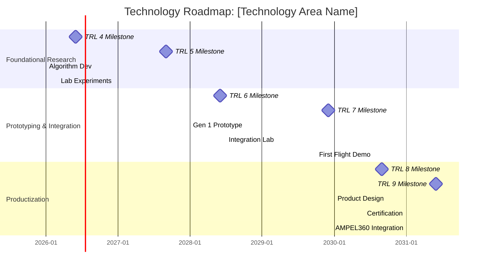

### **AQUA V. v9.0 Artifact Definition**

```yaml
artifact:
  nomenclature: "AQUART-CON-CDS-STR-PL-PA-TEC1-DIGT-003-00-00-v9.0.0"
  configuration_item:
    artifact_id: "AQUART-CON-CDS-STR-PL-PA-TEC1-DIGT-003-00-00-v9.0.0"
    owner_division: "QSCI"
    owner_team: "Technology Strategy & Research"
    created_by: "AI-DocGen-v9.0"
    created_date: "2025-12-01T14:20:00Z"
    classification: "AQUA V. STRATEGIC"
    lifecycle_state: "TEMPLATE"
  extended_description:
    title: "AQUA V. Enterprise Conceptual Design Specification - Strategic Technology Roadmap"
    short_title: "Enterprise CDS - Technology Roadmap"
    description: "Master template for creating a strategic technology roadmap. This document outlines the planned evolution of a technology area, mapping R&D efforts, capability milestones, and technology readiness levels to future product integration and market needs."
    keywords: ["technology roadmap", "strategic planning", "conceptual design", "CDS", "research and development", "TRL"]
    language: "en-US"
    translations: [] # No mandatory translations for CON phase
```

---

### **Template Content: `AQUART-CON-CDS-STR-PL-PA-TEC1-DIGT-003-00-00-v9.0.0.md`**

```markdown
<!-- AQUA V. v9.0 Compliant -->
<!-- Artifact ID: AQUART-CON-CDS-STR-PL-PA-TEC1-DIGT-003-00-00-v9.0.0 -->

# Technology Roadmap: [Technology Area Name, e.g., Quantum Navigation]

| | |
|:---|:---|
| **Document Title** | Technology Roadmap: [Technology Area Name] |
| **Artifact ID** | *This document's ID will be generated upon instantiation* |
| **Based on Template** | AQUART-CON-CDS-STR-PL-PA-TEC1-DIGT-003-00-00-v9.0.0 |
| **Phase** | CON - Conceptual |
| **Owner Division** | [Lead Q-Division for this technology, e.g., QSCI, QHPC] |
| **Status** | DRAFT / IN REVIEW / APPROVED |
| **Version** | [Specify Document Version, e.g., v1.0.0] |
| **Time Horizon** | [e.g., 2026 - 2031] |

---

## Table of Contents

1.  [Executive Summary](#1-executive-summary)
    1.1. [Vision Statement](#11-vision-statement)
    1.2. [Strategic Objectives](#12-strategic-objectives)
2.  [Current State Assessment](#2-current-state-assessment)
    2.1. [Internal Capabilities & TRL](#21-internal-capabilities--trl)
    2.2. [Market & Competitor Landscape](#22-market--competitor-landscape)
3.  [Future State Vision (The Roadmap)](#3-future-state-vision-the-roadmap)
    3.1. [Roadmap Visualization](#31-roadmap-visualization)
    3.2. [Phase 1: [Year Range, e.g., 2026-2027] - Foundational Research](#32-phase-1--year-range-eg-2026-2027---foundational-research)
    3.3. [Phase 2: [Year Range, e.g., 2028-2029] - Prototyping & Integration](#33-phase-2--year-range-eg-2028-2029---prototyping--integration)
    3.4. [Phase 3: [Year Range, e.g., 2030-2031] - Productization & Deployment](#34-phase-3--year-range-eg-2030-2031---productization--deployment)
4.  [Key Enablers and Dependencies](#4-key-enablers-and-dependencies)
5.  [Risk Assessment](#5-risk-assessment)
6.  [Resource & Investment Plan](#6-resource--investment-plan)

---

## 1. Executive Summary

### 1.1 Vision Statement
To establish AQUA V. as the undisputed industry leader in **[Technology Area Name]** by [Year], enabling a new generation of [describe impact, e.g., "fully autonomous, GPS-independent aircraft" or "computationally optimized aerospace structures"].

### 1.2 Strategic Objectives
This roadmap directly supports the following corporate strategic objectives:
*   **Objective 1:** [e.g., Achieve market leadership in the UAM sector by 2030.]
*   **Objective 2:** [e.g., Reduce product lifecycle costs by 15% through advanced simulation.]
*   **Objective 3:** [e.g., Introduce two new quantum-enhanced products to the market.]

---

## 2. Current State Assessment

### 2.1 Internal Capabilities & TRL
*   **Current TRL:** The current state of our **[Technology Area Name]** is assessed at **TRL [e.g., 3 - Analytical and experimental critical function and/or characteristic proof-of-concept]**.
*   **Key Assets:** [List existing projects, patents, labs, or hardware, e.g., "Project Q-Nav Alpha", "Patent US-12345B", "Munich Quantum Lab"].
*   **Key Personnel:** [List lead researchers or teams, e.g., "Dr. Evelyn Reed's team (QSCI)"].
*   **SWOT Analysis:**
    *   **Strengths:** [e.g., "World-class research team in cold-atom physics"].
    *   **Weaknesses:** [e.g., "Lack of in-house manufacturing capability for quantum sensors"].
    *   **Opportunities:** [e.g., "Growing market demand for resilient navigation"].
    *   **Threats:** [e.g., "Competitor Y has announced a similar program"].

### 2.2 Market & Competitor Landscape
[Brief analysis of the market size, growth projections, key competitors, and their last known technological state.]

---

## 3. Future State Vision (The Roadmap)

### 3.1 Roadmap Visualization



### 3.2 Phase 1: [Year Range, e.g., 2026-2027] - Foundational Research
*   **Goal:** Advance core technology from TRL 3 to TRL 5.
*   **Key Milestones:**
    *   **[Date]:** Demonstrate core algorithm in simulation (TRL 4).
    *   **[Date]:** Validate performance in a controlled lab environment (TRL 5).
*   **Product Impact:** No direct product integration. Findings will inform the design of the **[Future Product, e.g., AMPEL360 BWB Q250]**.
*   **Activities:** [e.g., "Algorithm development", "Material science research", "Small-scale experiments"].

### 3.3 Phase 2: [Year Range, e.g., 2028-2029] - Prototyping & Integration
*   **Goal:** Mature technology to TRL 7 through prototyping and demonstration in a relevant environment.
*   **Key Milestones:**
    *   **[Date]:** First functional ground-based prototype (TRL 6).
    *   **[Date]:** Successful demonstration on a surrogate aircraft (TRL 7).
*   **Product Impact:** Prototype will be integrated into the **[Testbed Product, e.g., GAIA UAV HALE]** for flight testing.
*   **Activities:** [e.g., "Hardware-in-the-loop simulation", "Prototype fabrication", "Flight test planning"].

### 3.4 Phase 3: [Year Range, e.g., 2030-2031] - Productization & Deployment
*   **Goal:** Achieve TRL 9 (flight-proven system) and integrate into a production product line.
*   **Key Milestones:**
    *   **[Date]:** Final system qualified through rigorous testing (TRL 8).
    *   **[Date]:** Full certification and first operational deployment on **[Production Aircraft]** (TRL 9).
*   **Product Impact:** Technology becomes a standard feature on the **[Production Product, e.g., AMPEL360 HYB E220]**.
*   **Activities:** [e.g., "Full-scale design for manufacturing", "Certification campaign", "Production line setup"].

---

## 4. Key Enablers and Dependencies
*   **Dependencies:** [e.g., "Success is dependent on breakthroughs from the Q-Materials research group", "Requires completion of the new Munich Quantum Lab facility"].
*   **Enabling Technologies:** [e.g., "Relies on next-generation HPC resources from the QHPC division for simulations"].
*   **Partnerships:** [e.g., "Requires a strategic partnership with [University/Company] for specialized sensor fabrication"].

---

## 5. Risk Assessment
| Risk ID | Risk Description | Probability (1-5) | Impact (1-5) | Mitigation Strategy |
|:--------|:-------------------------------------------|:--------------------|:---------------|:-----------------------------------------------------|
| **TR-RISK-01**| Key algorithm does not scale as predicted. | 3 | 5 | Maintain a parallel development track with a classical backup algorithm. |
| **TR-RISK-02**| Competitor achieves a breakthrough first. | 4 | 4 | Increase R&D funding; establish robust IP protection and patent filing strategy. |
| **TR-RISK-03**| Regulatory bodies are slow to approve novel technology. | 3 | 4 | Initiate early engagement with EASA/FAA on a certification basis for the new tech. |

---

## 6. Resource & Investment Plan
*A high-level summary of the required investment.*

| Phase | Timeframe | Estimated CapEx (€M) | Estimated OpEx (€M/yr) | Key Personnel (FTEs) |
|:------|:----------|:---------------------|:-----------------------|:---------------------|
| 1 | 2026-2027 | 5.0 | 2.5 | 15 (QSCI) |
| 2 | 2028-2029 | 15.0 | 4.0 | 25 (QSCI, QPOW) |
| 3 | 2030-2031 | 8.0 | 1.5 | 20 (QPOW, QIND) |
| **Total**| **6 Years** | **€28.0M** | **~€3M/yr (avg)** | **~20 FTEs (avg)** |

```
