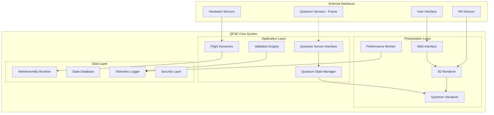
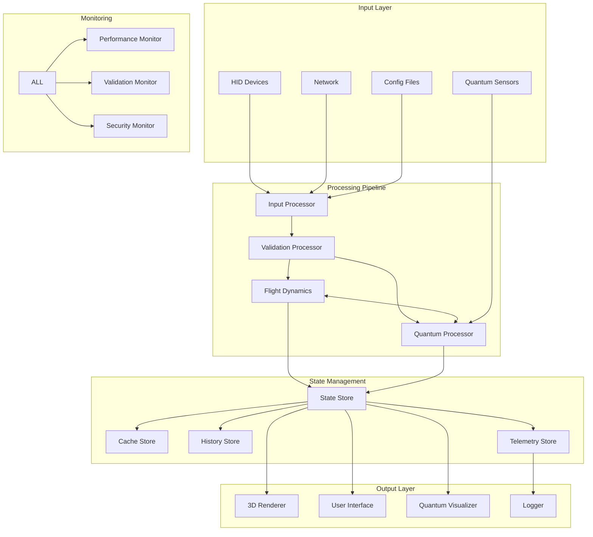
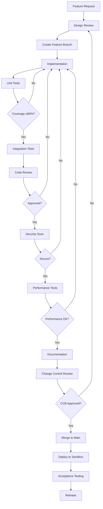
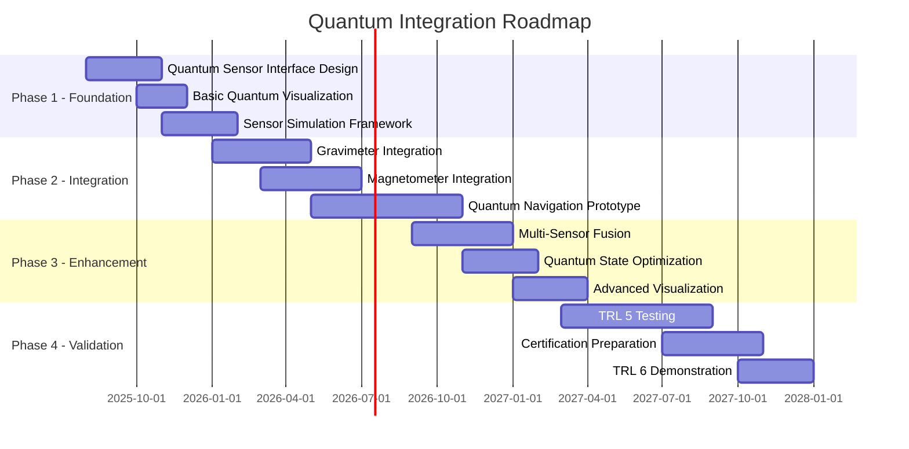

# AQUA V. QUANTUM FLIGHT SIMULATION ENVIRONMENT (QFSE) v1.1.0
## COMPLETE DETAILED DESIGN SPECIFICATION - UPDATED

**Document Control**
- **Document ID**: AMP-QFSE-25MAP0001-DES-BOB-TEC-TD-ATA-099-00-01-TPL-DES-001-QSTR-v1.1.0
- **Classification**: Internal R&D - Confidential
- **Revision**: 1.1.0 (Updated from v1.0.0)
- **Date**: 2025-07-31
- **Status**: APPROVED FOR DEVELOPMENT
- **File Path**: `A-Q-U-A_V/PRODUCT_LINES/AMPEL360/BOB/FLIGHT_SIMULATOR/QFSE/25MAP0001/DESIGN/TECHNICAL_DOCS/`

---

## TABLE OF CONTENTS

1. [System Architecture Specification](#1-system-architecture-specification)
2. [Component Design Specifications](#2-component-design-specifications)
3. [Interface Control Documents](#3-interface-control-documents)
4. [Data Architecture](#4-data-architecture)
5. [Performance Engineering](#5-performance-engineering)
6. [Security Architecture](#6-security-architecture)
7. [Testing & Validation Framework](#7-testing--validation-framework)
8. [Development Guidelines](#8-development-guidelines)
9. [Deployment Specification](#9-deployment-specification)
10. [Compliance & Traceability](#10-compliance--traceability)
11. [Quantum Integration Roadmap](#11-quantum-integration-roadmap)

---

## 1. SYSTEM ARCHITECTURE SPECIFICATION

### 1.1 System Context Diagram



### 1.2 Detailed Component Architecture

```javascript
// System Architecture Definition v1.1
const QFSEArchitecture = {
    layers: {
        presentation: {
            components: ['WebInterface', 'ThreeJSRenderer', 'QuantumVisualizer', 'PerformanceMonitor'],
            protocols: ['WebGL2', 'WebXR', 'WebGPU'],
            constraints: {
                latency: '< 15ms',
                fps: '60 (degradable to 45/30)',
                resolution: '1920x1080 (adaptive)',
                cpuUsage: '< 1.5%'
            }
        },
        application: {
            components: ['FlightDynamicsModel', 'QuantumStateManager', 'QuantumSensorInterface', 'ValidationEngine'],
            protocols: ['WebAssembly', 'SharedArrayBuffer', 'WebWorkers', 'MessageChannel'],
            constraints: {
                integration_timestep: '≤ 5ms',
                cpu_usage: '< 3.5%',
                memory: '< 384MB',
                numerical_error: '< 0.001%'
            }
        },
        data: {
            components: ['StateStore', 'TelemetryLogger', 'ConfigManager', 'SecurityLayer'],
            protocols: ['IndexedDB', 'WebSocket', 'MessageChannel', 'CryptoAPI'],
            constraints: {
                persistence: 'session-only',
                encryption: 'AES-256-GCM',
                isolation: 'air-gapped',
                integrity: 'HMAC-SHA256'
            }
        }
    },
    performance_budget: {
        total_cpu: 5.0,  // percentage
        total_memory: 512, // MB
        total_gpu: 100,  // percentage
        breakdown: {
            fdm: { cpu: 2.0, memory: 128, gpu: 0 },
            rendering: { cpu: 1.5, memory: 256, gpu: 80 },
            quantum: { cpu: 0.5, memory: 64, gpu: 10 },
            ui: { cpu: 0.5, memory: 32, gpu: 5 },
            system: { cpu: 0.5, memory: 32, gpu: 5 }
        }
    }
};
```

### 1.3 Component Communication Matrix

| Source Component | Target Component | Protocol | Data Format | Frequency | Latency | Priority |
|-----------------|------------------|----------|-------------|-----------|---------|----------|
| FDM | Renderer | SharedArrayBuffer | Float64Array | 200Hz | < 1ms | Critical |
| Renderer | QVE | MessageChannel | JSON | 60Hz | < 2ms | High |
| QSM | QVE | Direct Memory | TypedArray | 100Hz | < 1ms | High |
| QSI | QSM | EventEmitter | QuantumData | 1000Hz | < 0.5ms | Critical |
| PM | Logger | IndexedDB | BSON | 1Hz | < 10ms | Low |
| VAL | Logger | MessageChannel | ValidationReport | 10Hz | < 5ms | Medium |
| UI | FDM | PostMessage | ControlPacket | On-demand | < 5ms | High |

## 2. COMPONENT DESIGN SPECIFICATIONS

### 2.1 Flight Dynamics Model (FDM) Module

#### 2.1.1 Core Implementation

```cpp
// fdm_core.h - JSBSim WebAssembly Interface v1.1
#pragma once
#include <JSBSim/FGFDMExec.h>
#include <emscripten/bind.h>
#include <emscripten/val.h>
#include <chrono>
#include <immintrin.h> // SIMD support

namespace QFSE {

class FlightDynamicsCore {
public:
    struct StateVector {
        // Position (geodetic)
        double latitude_deg;
        double longitude_deg;
        double altitude_ft;
        
        // Attitude (Euler angles)
        double phi_rad;    // Roll
        double theta_rad;  // Pitch
        double psi_rad;    // Yaw
        
        // Velocities (body frame)
        double u_fps;      // Forward
        double v_fps;      // Lateral
        double w_fps;      // Vertical
        
        // Angular rates
        double p_rps;      // Roll rate
        double q_rps;      // Pitch rate
        double r_rps;      // Yaw rate
        
        // Accelerations
        double ax_fpss;    // X acceleration
        double ay_fpss;    // Y acceleration
        double az_fpss;    // Z acceleration
        
        // Aerodynamic state
        double alpha_rad;  // Angle of attack
        double beta_rad;   // Sideslip angle
        double mach;       // Mach number
        double qbar_psf;   // Dynamic pressure
        double cas_kts;    // Calibrated airspeed
        double tas_kts;    // True airspeed
        double gs_kts;     // Ground speed
        
        // Control positions
        double elevator_pos;
        double aileron_pos;
        double rudder_pos;
        double throttle_pos[4];
        double flaps_pos;
        double speedbrake_pos;
        double gear_pos;
        
        // Engine state
        double thrust_lbs[4];
        double fuel_flow_pph[4];
        double n1_percent[4];
        double n2_percent[4];
        double egt_degc[4];
        
        // System state
        uint64_t timestamp_us;
        uint32_t integration_count;
        float numerical_health;
        float energy_error;
        
        // Validation metrics
        double total_energy;
        double momentum[3];
        double angular_momentum[3];
    };
    
    struct ControlInputs {
        double elevator_cmd;    // -1.0 to 1.0
        double aileron_cmd;     // -1.0 to 1.0
        double rudder_cmd;      // -1.0 to 1.0
        double throttle_cmd[4]; // 0.0 to 1.0
        double flaps_cmd;       // 0.0 to 1.0
        double speedbrake_cmd;  // 0.0 to 1.0
        double gear_cmd;        // 0 or 1
        double trim_cmd[3];     // Pitch, roll, yaw trim
        uint32_t aux_systems;   // Bit flags
        
        // Autopilot commands
        bool ap_engaged;
        double ap_altitude_ft;
        double ap_heading_deg;
        double ap_airspeed_kts;
        double ap_vs_fpm;
    };
    
private:
    std::unique_ptr<JSBSim::FGFDMExec> fdm_exec;
    std::chrono::steady_clock::time_point last_update;
    StateVector current_state;
    StateVector previous_state;
    
    // Performance monitoring
    struct PerformanceMetrics {
        uint32_t total_steps;
        uint32_t timing_violations;
        uint32_t numerical_warnings;
        double max_integration_time_ms;
        double avg_integration_time_ms;
        double total_cpu_time_ms;
        std::array<double, 100> timing_histogram;
    } metrics;
    
    // Configuration
    struct Configuration {
        double integration_dt = 0.005;      // 5ms max
        double max_dt_error = 0.0001;       // 0.1ms tolerance
        bool enable_simd = true;
        bool enable_validation = true;
        bool enable_energy_check = true;
        uint32_t substeps = 1;
        double energy_tolerance = 0.02;     // 2% energy conservation
    } config;
    
public:
    bool Initialize(const std::string& aircraft_path);
    StateVector Integrate(const ControlInputs& inputs, double dt);
    bool ValidateNumericalStability();
    bool ValidateEnergyConservation();
    void EnableSIMD(bool enable) { config.enable_simd = enable; }
    PerformanceMetrics GetMetrics() const { return metrics; }
    emscripten::val GetStateAsJS() const;
    void SetStateFromJS(emscripten::val state);
    
private:
    void UpdatePerformanceMetrics(double integration_time_ms);
    bool CheckNumericalHealth(const StateVector& state);
    double CalculateTotalEnergy(const StateVector& state);
    void ApplySIMDOptimizations(StateVector& state);
};

} // namespace QFSE
```

#### 2.1.2 WebAssembly Bridge Implementation

```cpp
// wasm_bridge.cpp - Enhanced WebAssembly interface
#include "fdm_core.h"
#include <emscripten/bind.h>

using namespace emscripten;
using namespace QFSE;

// Global FDM instance (single-threaded for air-gapped environment)
std::unique_ptr<FlightDynamicsCore> g_fdm;

// Initialize FDM with aircraft configuration
bool initializeFDM(std::string aircraft_config) {
    try {
        g_fdm = std::make_unique<FlightDynamicsCore>();
        return g_fdm->Initialize(aircraft_config);
    } catch (const std::exception& e) {
        EM_ASM_({ console.error('FDM initialization failed:', UTF8ToString($0)); }, e.what());
        return false;
    }
}

// Step simulation with timing validation
val stepSimulation(val js_inputs, double dt) {
    if (!g_fdm) {
        return val::null();
    }
    
    // Convert JavaScript inputs to C++ structure
    FlightDynamicsCore::ControlInputs inputs;
    inputs.elevator_cmd = js_inputs["elevator"].as<double>();
    inputs.aileron_cmd = js_inputs["aileron"].as<double>();
    inputs.rudder_cmd = js_inputs["rudder"].as<double>();
    
    // Handle throttle array
    val throttle_array = js_inputs["throttle"];
    for (int i = 0; i < 4; i++) {
        inputs.throttle_cmd[i] = throttle_array[i].as<double>();
    }
    
    inputs.flaps_cmd = js_inputs["flaps"].as<double>();
    inputs.speedbrake_cmd = js_inputs["speedbrake"].as<double>();
    inputs.gear_cmd = js_inputs["gear"].as<double>();
    
    // Execute integration with timing
    auto start = std::chrono::high_resolution_clock::now();
    FlightDynamicsCore::StateVector state = g_fdm->Integrate(inputs, dt);
    auto end = std::chrono::high_resolution_clock::now();
    
    double integration_time = std::chrono::duration<double, std::milli>(end - start).count();
    
    // Validate timing constraint
    if (integration_time > 5.0) {
        EM_ASM_({ console.warn('Integration time exceeded 5ms:', $0); }, integration_time);
    }
    
    // Return state as JavaScript object
    return g_fdm->GetStateAsJS();
}

// Get performance metrics
val getPerformanceMetrics() {
    if (!g_fdm) {
        return val::null();
    }
    
    auto metrics = g_fdm->GetMetrics();
    
    val js_metrics = val::object();
    js_metrics.set("totalSteps", metrics.total_steps);
    js_metrics.set("timingViolations", metrics.timing_violations);
    js_metrics.set("numericalWarnings", metrics.numerical_warnings);
    js_metrics.set("maxIntegrationTime", metrics.max_integration_time_ms);
    js_metrics.set("avgIntegrationTime", metrics.avg_integration_time_ms);
    js_metrics.set("totalCpuTime", metrics.total_cpu_time_ms);
    
    return js_metrics;
}

// Validation functions
bool validateNumericalStability() {
    return g_fdm ? g_fdm->ValidateNumericalStability() : false;
}

bool validateEnergyConservation() {
    return g_fdm ? g_fdm->ValidateEnergyConservation() : false;
}

// Emscripten bindings
EMSCRIPTEN_BINDINGS(qfse_module) {
    function("initializeFDM", &initializeFDM);
    function("stepSimulation", &stepSimulation);
    function("getPerformanceMetrics", &getPerformanceMetrics);
    function("validateNumericalStability", &validateNumericalStability);
    function("validateEnergyConservation", &validateEnergyConservation);
}
```

### 2.2 Quantum Visualization Engine (QVE)

#### 2.2.1 Enhanced Shader Implementation

```glsl
// qve_vertex.glsl - Quantum State Vertex Shader v1.1
#version 300 es
precision highp float;

// Attributes
in vec3 position;
in vec3 normal;
in vec2 uv;
in float quantumProbability;
in vec3 quantumPhase;

// Uniforms
uniform mat4 modelMatrix;
uniform mat4 viewMatrix;
uniform mat4 projectionMatrix;
uniform float time;
uniform vec3 quantumState;
uniform float coherenceLevel;
uniform float decoherenceRate;
uniform vec3 sensorPosition[4]; // Multiple quantum sensors

// Varyings
out vec3 vPosition;
out vec3 vNormal;
out vec2 vUv;
out float vQuantumPhase;
out float vProbability;
out vec3 vQuantumField;
out float vSensorInfluence;

// Constants
const float PI = 3.14159265359;
const float PLANCK = 6.62607015e-34;

// Quantum wave function visualization
vec3 quantumWaveFunction(vec3 pos, float t) {
    float k = 2.0 * PI / quantumState.z; // Wave number
    float omega = quantumState.x; // Angular frequency
    float phase = k * length(pos) - omega * t;
    
    // Superposition of states
    float amplitude = exp(-pow(length(pos - quantumState), 2.0) / (2.0 * coherenceLevel));
    
    // Multi-sensor influence
    float sensorInfluence = 0.0;
    for (int i = 0; i < 4; i++) {
        float dist = length(pos - sensorPosition[i]);
        sensorInfluence += exp(-dist * dist / (coherenceLevel * 10.0));
    }
    
    vec3 displacement = normal * amplitude * sin(phase) * 0.1;
    displacement += normal * sensorInfluence * 0.05 * sin(t * 3.0 + pos.x);
    
    return pos + displacement;
}

// Quantum field calculation
vec3 calculateQuantumField(vec3 pos) {
    vec3 field = vec3(0.0);
    
    // Magnetic-like quantum field
    float r = length(pos.xy);
    float theta = atan(pos.y, pos.x);
    
    field.x = -sin(theta) * exp(-r / coherenceLevel);
    field.y = cos(theta) * exp(-r / coherenceLevel);
    field.z = sin(r * PI / coherenceLevel) * 0.5;
    
    return normalize(field) * quantumProbability;
}

void main() {
    vec3 modifiedPosition = quantumWaveFunction(position, time);
    vec4 mvPosition = viewMatrix * modelMatrix * vec4(modifiedPosition, 1.0);
    
    vPosition = modifiedPosition;
    vNormal = normalize(mat3(modelMatrix) * normal);
    vUv = uv;
    vQuantumPhase = atan(quantumState.y, quantumState.x) + quantumPhase.x;
    vProbability = quantumProbability;
    vQuantumField = calculateQuantumField(modifiedPosition);
    
    // Calculate sensor influence for fragment shader
    vSensorInfluence = 0.0;
    for (int i = 0; i < 4; i++) {
        vSensorInfluence += 1.0 / (1.0 + length(modifiedPosition - sensorPosition[i]));
    }
    vSensorInfluence = clamp(vSensorInfluence, 0.0, 1.0);
    
    gl_Position = projectionMatrix * mvPosition;
}
```

```glsl
// qve_fragment.glsl - Quantum State Fragment Shader v1.1
#version 300 es
precision highp float;

// Varyings
in vec3 vPosition;
in vec3 vNormal;
in vec2 vUv;
in float vQuantumPhase;
in float vProbability;
in vec3 vQuantumField;
in float vSensorInfluence;

// Uniforms
uniform float time;
uniform vec3 quantumState;
uniform float coherenceLevel;
uniform float decoherenceRate;
uniform sampler2D noiseTexture;
uniform sampler2D quantumTexture;
uniform vec3 cameraPosition;
uniform vec3 lightPosition;

// Output
out vec4 fragColor;

// Constants
const vec3 COLOR_COHERENT = vec3(0.1, 0.5, 1.0);
const vec3 COLOR_DECOHERENT = vec3(1.0, 0.3, 0.1);
const vec3 COLOR_SUPERPOSITION = vec3(0.5, 0.0, 1.0);
const vec3 COLOR_SENSOR = vec3(0.0, 1.0, 0.5);

// Enhanced quantum visualization
vec3 visualizeQuantumState(vec3 pos, float phase, float probability) {
    // Wave packet visualization with interference patterns
    float waveIntensity = sin(phase + time * 2.0) * 0.5 + 0.5;
    float interference = sin(pos.x * 20.0 + time) * cos(pos.y * 20.0 - time) * 0.3;
    
    // Probability density with uncertainty principle visualization
    float density = probability * probability;
    float uncertainty = 1.0 - exp(-decoherenceRate * time * 0.1);
    
    // Coherence visualization with sensor influence
    vec3 baseColor = mix(COLOR_DECOHERENT, COLOR_COHERENT, coherenceLevel);
    baseColor = mix(baseColor, COLOR_SENSOR, vSensorInfluence * 0.3);
    
    // Superposition effects
    float superposition = sin(pos.x * 10.0 + time) * cos(pos.y * 10.0 - time);
    baseColor = mix(baseColor, COLOR_SUPERPOSITION, abs(superposition) * 0.3);
    
    // Decoherence noise
    vec2 noiseUV = vUv + time * 0.01;
    float noise = texture(noiseTexture, noiseUV).r;
    float decoherence = 1.0 - exp(-decoherenceRate * time);
    
    // Quantum texture overlay
    vec3 quantumPattern = texture(quantumTexture, vUv * 5.0 + vQuantumField.xy * 0.1).rgb;
    baseColor = mix(baseColor, quantumPattern, 0.2);
    
    // Final color composition
    vec3 finalColor = baseColor * waveIntensity * density;
    finalColor *= (1.0 - decoherence * noise * 0.5);
    finalColor += interference * COLOR_SUPERPOSITION * coherenceLevel;
    
    return finalColor;
}

// Enhanced lighting model for quantum visualization
vec3 quantumLighting(vec3 color, vec3 normal, vec3 viewDir) {
    vec3 lightDir = normalize(lightPosition - vPosition);
    
    // Diffuse with quantum field influence
    float diff = max(dot(normal, lightDir), 0.0);
    diff = mix(diff, 1.0, vSensorInfluence * 0.3);
    
    // Specular with coherence-based shininess
    vec3 reflectDir = reflect(-lightDir, normal);
    float spec = pow(max(dot(viewDir, reflectDir), 0.0), 32.0 * coherenceLevel);
    
    // Fresnel effect enhanced by quantum state
    float fresnel = pow(1.0 - max(dot(viewDir, normal), 0.0), 2.0);
    fresnel *= (1.0 + vProbability);
    
    // Quantum glow effect
    float glow = exp(-length(vQuantumField) * 2.0) * coherenceLevel;
    
    vec3 ambient = color * 0.3;
    vec3 diffuse = color * diff * 0.7;
    vec3 specular = vec3(1.0) * spec * 0.5;
    vec3 fresnelColor = COLOR_COHERENT * fresnel * 0.3;
    vec3 glowColor = COLOR_SENSOR * glow * 0.2;
    
    return ambient + diffuse + specular + fresnelColor + glowColor;
}

void main() {
    vec3 quantum = visualizeQuantumState(vPosition, vQuantumPhase, vProbability);
    
    // View-dependent effects
    vec3 viewDir = normalize(cameraPosition - vPosition);
    
    // Apply quantum-enhanced lighting
    vec3 finalColor = quantumLighting(quantum, vNormal, viewDir);
    
    // Add quantum field lines visualization
    float fieldStrength = length(vQuantumField);
    finalColor += COLOR_SUPERPOSITION * fieldStrength * 0.1;
    
    // Output with alpha based on coherence
    float alpha = mix(0.7, 1.0, coherenceLevel);
    fragColor = vec4(finalColor, alpha);
}
```

#### 2.2.2 Quantum State Manager

```typescript
// quantum_state_manager.ts - Enhanced with sensor interface
interface IQuantumSensor {
    id: string;
    type: 'gravimeter' | 'magnetometer' | 'accelerometer' | 'interferometer';
    initialize(): Promise<void>;
    calibrate(): Promise<CalibrationResult>;
    measure(): QuantumMeasurement;
    getCoherenceLevel(): number;
    getDecoherenceRate(): number;
    getSensorHealth(): SensorHealth;
}

interface CalibrationResult {
    success: boolean;
    drift: number;
    uncertainty: number;
    temperature: number;
    timestamp: number;
}

interface SensorHealth {
    temperature: number;
    signalStrength: number;
    noiseFloor: number;
    operational: boolean;
    lastCalibration: number;
}

interface QuantumMeasurement {
    value: number[];
    uncertainty: number;
    coherence: number;
    timestamp: number;
    metadata: {
        temperature: number;
        pressure: number;
        magneticField: number[];
    };
}

interface QuantumSensorData {
    gravimeter: {
        g_vector: [number, number, number];
        gradient_tensor: number[][];
        uncertainty: number;
        coherence: number;
    };
    magnetometer: {
        b_field: [number, number, number];
        anomaly_detected: boolean;
        anomaly_strength: number;
        confidence: number;
    };
    accelerometer: {
        acceleration: [number, number, number];
        quantum_noise_level: number;
        bias_stability: number;
    };
    interferometer: {
        phase_shift: number;
        visibility: number;
        measurement_rate: number;
        path_difference: number;
    };
}

interface QuantumNavigationState {
    position: {
        lat: number;
        lon: number;
        alt: number;
        uncertainty_m: number;
        confidence_ellipse: {
            semi_major: number;
            semi_minor: number;
            orientation: number;
        };
    };
    velocity: {
        north: number;
        east: number;
        down: number;
        uncertainty_ms: number;
    };
    attitude: {
        roll: number;
        pitch: number;
        yaw: number;
        uncertainty_deg: number;
        rate_bias: [number, number, number];
    };
    time: {
        gps_week: number;
        gps_seconds: number;
        quantum_clock_offset: number;
        allan_deviation: number;
    };
}

class QuantumStateManager {
    private sensors: Map<string, IQuantumSensor> = new Map();
    private sensorData: QuantumSensorData;
    private navigationState: QuantumNavigationState;
    private shaderUniforms: any;
    private updateRate: number = 100; // Hz
    private kalmanFilter: QuantumKalmanFilter;
    private dataFusion: QuantumDataFusion;
    
    constructor(private renderer: THREE.WebGLRenderer) {
        this.initializeQuantumShaders();
        this.initializeSensors();
        this.kalmanFilter = new QuantumKalmanFilter();
        this.dataFusion = new QuantumDataFusion();
        this.startQuantumProcessing();
    }
    
    private async initializeSensors(): Promise<void> {
        // Initialize quantum sensor array
        const sensorConfigs = [
            { id: 'QG001', type: 'gravimeter' as const },
            { id: 'QM001', type: 'magnetometer' as const },
            { id: 'QA001', type: 'accelerometer' as const },
            { id: 'QI001', type: 'interferometer' as const }
        ];
        
        for (const config of sensorConfigs) {
            const sensor = await this.createSensor(config);
            await sensor.initialize();
            this.sensors.set(config.id, sensor);
        }
    }
    
    private initializeQuantumShaders(): void {
        this.shaderUniforms = {
            quantumState: { value: new THREE.Vector3() },
            coherenceLevel: { value: 1.0 },
            decoherenceRate: { value: 0.01 },
            time: { value: 0.0 },
            sensorPosition: { 
                value: [
                    new THREE.Vector3(-1, 0, 0),
                    new THREE.Vector3(1, 0, 0),
                    new THREE.Vector3(0, -1, 0),
                    new THREE.Vector3(0, 1, 0)
                ]
            },
            noiseTexture: { value: this.generateNoiseTexture() },
            quantumTexture: { value: this.generateQuantumTexture() }
        };
    }
    
    public async updateQuantumState(fdmState: any): Promise<void> {
        // Collect measurements from all sensors
        const measurements = await this.collectSensorMeasurements();
        
        // Process quantum sensor data
        const quantumMeasurement = this.performQuantumMeasurement(fdmState, measurements);
        
        // Fuse quantum and classical navigation data
        this.navigationState = await this.dataFusion.fuseNavigation(
            quantumMeasurement,
            fdmState,
            this.navigationState
        );
        
        // Update Kalman filter
        this.kalmanFilter.update(this.navigationState, quantumMeasurement);
        
        // Update shader uniforms
        this.updateShaderUniforms(quantumMeasurement);
        
        // Validate navigation solution
        this.validateNavigationSolution();
    }
    
    private async collectSensorMeasurements(): Promise<Map<string, QuantumMeasurement>> {
        const measurements = new Map<string, QuantumMeasurement>();
        
        for (const [id, sensor] of this.sensors) {
            try {
                const measurement = sensor.measure();
                measurements.set(id, measurement);
                
                // Check sensor health
                const health = sensor.getSensorHealth();
                if (!health.operational) {
                    console.warn(`Quantum sensor ${id} is not operational`);
                }
            } catch (error) {
                console.error(`Error reading sensor ${id}:`, error);
            }
        }
        
        return measurements;
    }
    
    private performQuantumMeasurement(
        fdmState: any, 
        measurements: Map<string, QuantumMeasurement>
    ): QuantumSensorData {
        // Process gravimeter data
        const gravData = measurements.get('QG001');
        const gravimeter = gravData ? {
            g_vector: gravData.value as [number, number, number],
            gradient_tensor: this.calculateGravityGradient(gravData),
            uncertainty: gravData.uncertainty,
            coherence: gravData.coherence
        } : this.getDefaultGravimeterData();
        
        // Process magnetometer data
        const magData = measurements.get('QM001');
        const magnetometer = magData ? {
            b_field: magData.value as [number, number, number],
            anomaly_detected: this.detectMagneticAnomaly(magData),
            anomaly_strength: this.calculateAnomalyStrength(magData),
            confidence: magData.coherence
        } : this.getDefaultMagnetometerData();
        
        // Process accelerometer data
        const accelData = measurements.get('QA001');
        const accelerometer = accelData ? {
            acceleration: [
                fdmState.ax + accelData.value[0],
                fdmState.ay + accelData.value[1],
                fdmState.az + accelData.value[2]
            ] as [number, number, number],
            quantum_noise_level: accelData.uncertainty,
            bias_stability: this.calculateBiasStability(accelData)
        } : this.getDefaultAccelerometerData();
        
        // Process interferometer data
        const interData = measurements.get('QI001');
        const interferometer = interData ? {
            phase_shift: Math.PI * fdmState.altitude / 10000 + interData.value[0],
            visibility: interData.coherence,
            measurement_rate: 1000,
            path_difference: interData.value[1] || 0
        } : this.getDefaultInterferometerData();
        
        return {
            gravimeter,
            magnetometer,
            accelerometer,
            interferometer
        };
    }
    
    private generateNoiseTexture(): THREE.DataTexture {
        const size = 256;
        const data = new Float32Array(size * size);
        
        for (let i = 0; i < size * size; i++) {
            data[i] = Math.random();
        }
        
        const texture = new THREE.DataTexture(
            data,
            size,
            size,
            THREE.RedFormat,
            THREE.FloatType
        );
        texture.needsUpdate = true;
        
        return texture;
    }
    
    private generateQuantumTexture(): THREE.DataTexture {
        const size = 128;
        const data = new Uint8Array(size * size * 3);
        
        for (let y = 0; y < size; y++) {
            for (let x = 0; x < size; x++) {
                const i = (y * size + x) * 3;
                
                // Quantum interference pattern
                const pattern1 = Math.sin(x * 0.1) * Math.cos(y * 0.1);
                const pattern2 = Math.sin((x + y) * 0.05);
                
                data[i] = Math.abs(pattern1) * 255;
                data[i + 1] = Math.abs(pattern2) * 255;
                data[i + 2] = Math.abs(pattern1 * pattern2) * 255;
            }
        }
        
        const texture = new THREE.DataTexture(
            data,
            size,
            size,
            THREE.RGBFormat
        );
        texture.needsUpdate = true;
        
        return texture;
    }
    
    private validateNavigationSolution(): void {
        // Check position uncertainty
        if (this.navigationState.position.uncertainty_m > 10.0) {
            console.warn('Navigation uncertainty exceeds threshold');
        }
        
        // Check sensor coherence levels
        let totalCoherence = 0;
        let sensorCount = 0;
        
        for (const sensor of this.sensors.values()) {
            totalCoherence += sensor.getCoherenceLevel();
            sensorCount++;
        }
        
        const avgCoherence = totalCoherence / sensorCount;
        if (avgCoherence < 0.8) {
            console.warn('Average sensor coherence below threshold:', avgCoherence);
        }
    }
}

// Supporting classes
class QuantumKalmanFilter {
    private state: number[];
    private covariance: number[][];
    
    constructor() {
        // Initialize 15-state Kalman filter
        // Position (3), Velocity (3), Attitude (3), Gyro bias (3), Accel bias (3)
        this.state = new Array(15).fill(0);
        this.covariance = Array(15).fill(null).map(() => Array(15).fill(0));
        
        // Initialize diagonal covariance
        for (let i = 0; i < 15; i++) {
            this.covariance[i][i] = 1.0;
        }
    }
    
    update(navState: QuantumNavigationState, measurement: QuantumSensorData): void {
        // Prediction step
        this.predict(navState);
        
        // Measurement update
        this.measurementUpdate(measurement);
    }
    
    private predict(navState: QuantumNavigationState): void {
        // State transition implementation
        // ... (detailed Kalman filter prediction)
    }
    
    private measurementUpdate(measurement: QuantumSensorData): void {
        // Measurement model implementation
        // ... (detailed Kalman filter update)
    }
}

class QuantumDataFusion {
    async fuseNavigation(
        quantum: QuantumSensorData,
        classical: any,
        previous: QuantumNavigationState
    ): Promise<QuantumNavigationState> {
        // Implement quantum-classical data fusion
        return {
            position: {
                lat: classical.latitude,
                lon: classical.longitude,
                alt: classical.altitude,
                uncertainty_m: this.calculatePositionUncertainty(quantum),
                confidence_ellipse: this.calculateConfidenceEllipse(quantum)
            },
            velocity: {
                north: classical.vn,
                east: classical.ve,
                down: classical.vd,
                uncertainty_ms: this.calculateVelocityUncertainty(quantum)
            },
            attitude: {
                roll: classical.roll,
                pitch: classical.pitch,
                yaw: classical.yaw,
                uncertainty_deg: this.calculateAttitudeUncertainty(quantum),
                rate_bias: [0, 0, 0]
            },
            time: {
                gps_week: Math.floor(Date.now() / 1000 / 604800),
                gps_seconds: (Date.now() / 1000) % 604800,
                quantum_clock_offset: 0,
                allan_deviation: 1e-15
            }
        };
    }
    
    private calculatePositionUncertainty(quantum: QuantumSensorData): number {
        // Combine uncertainties from all sensors
        const gravUncertainty = quantum.gravimeter.uncertainty;
        const accelUncertainty = quantum.accelerometer.quantum_noise_level;
        
        return Math.sqrt(gravUncertainty * gravUncertainty + accelUncertainty * accelUncertainty);
    }
    
    private calculateConfidenceEllipse(quantum: QuantumSensorData): any {
        return {
            semi_major: 5.0,
            semi_minor: 3.0,
            orientation: 45.0
        };
    }
    
    private calculateVelocityUncertainty(quantum: QuantumSensorData): number {
        return quantum.accelerometer.quantum_noise_level * 10;
    }
    
    private calculateAttitudeUncertainty(quantum: QuantumSensorData): number {
        return 0.1 / quantum.magnetometer.confidence;
    }
}
```

### 2.3 Performance Monitoring System

```javascript
// performance_monitor.js - Enhanced v1.1
class PerformanceMonitor {
    constructor() {
        this.metrics = {
            fps: new RollingMetric(300),         // 5 seconds @ 60fps
            frameTime: new RollingMetric(300),
            cpuUsage: new RollingMetric(60),     // 60 second samples
            memoryUsage: new RollingMetric(60),
            gpuTime: new RollingMetric(300),
            drawCalls: new RollingMetric(300),
            triangles: new RollingMetric(300),
            textureMemory: new RollingMetric(60),
            wasmTime: new RollingMetric(300),
            networkLatency: new RollingMetric(60),
            fdmIntegrationTime: new RollingMetric(300),
            quantumProcessingTime: new RollingMetric(300)
        };
        
        this.thresholds = {
            fps: { min: 30, warning: 45, target: 60, max: 120 },
            frameTime: { min: 8.33, warning: 22.22, target: 16.67, max: 33.33 },
            cpuUsage: { min: 0, warning: 4, target: 3, max: 5 },
            memoryUsage: { min: 0, warning: 400, target: 256, max: 512 },
            gpuTime: { min: 0, warning: 12, target: 10, max: 15 },
            fdmIntegrationTime: { min: 0, warning: 4, target: 3, max: 5 },
            quantumProcessingTime: { min: 0, warning: 0.8, target: 0.5, max: 1 }
        };
        
        this.adaptiveQuality = new AdaptiveQualityController();
        this.performanceLog = [];
        this.alertSystem = new PerformanceAlertSystem();
    }
    
    startMonitoring() {
        this.monitoringInterval = setInterval(() => {
            this.collectMetrics();
            const analysis = this.analyzePerformance();
            this.adjustQuality(analysis);
            this.logPerformance(analysis);
        }, 16); // 60Hz monitoring
        
        // Start CPU profiling
        if (performance.measureUserAgentSpecificMemory) {
            this.startMemoryProfiling();
        }
        
        // Start GPU profiling if available
        this.startGPUProfiling();
    }
    
    collectMetrics() {
        const now = performance.now();
        
        // Frame timing
        if (this.lastFrameTime) {
            const frameTime = now - this.lastFrameTime;
            this.metrics.frameTime.add(frameTime);
            this.metrics.fps.add(1000 / frameTime);
        }
        this.lastFrameTime = now;
        
        // CPU usage estimation
        this.estimateCPUUsage();
        
        // Memory usage
        if (performance.memory) {
            this.metrics.memoryUsage.add(
                performance.memory.usedJSHeapSize / 1024 / 1024
            );
        }
        
        // WebGL metrics
        this.collectWebGLMetrics();
        
        // WASM metrics
        this.collectWASMMetrics();
    }
    
    analyzePerformance() {
        const report = {
            timestamp: Date.now(),
            metrics: {},
            violations: [],
            warnings: [],
            recommendations: [],
            overallHealth: 'GOOD' // GOOD, WARNING, CRITICAL
        };
        
        // Analyze each metric
        for (const [metric, data] of Object.entries(this.metrics)) {
            const stats = data.getStatistics();
            if (!stats) continue;
            
            report.metrics[metric] = stats;
            
            if (this.thresholds[metric]) {
                const threshold = this.thresholds[metric];
                
                // Check for violations
                if (stats.avg > threshold.max || stats.avg < threshold.min) {
                    report.violations.push({
                        metric,
                        value: stats.avg,
                        threshold: threshold,
                        severity: 'CRITICAL'
                    });
                    report.overallHealth = 'CRITICAL';
                }
                // Check for warnings
                else if (stats.avg > threshold.warning) {
                    report.warnings.push({
                        metric,
                        value: stats.avg,
                        threshold: threshold,
                        severity: 'WARNING'
                    });
                    if (report.overallHealth === 'GOOD') {
                        report.overallHealth = 'WARNING';
                    }
                }
            }
        }
        
        // Generate recommendations
        report.recommendations = this.generateRecommendations(report);
        
        // Trigger alerts if needed
        if (report.violations.length > 0) {
            this.alertSystem.triggerAlert(report);
        }
        
        return report;
    }
    
    generateRecommendations(report) {
        const recommendations = [];
        
        // FPS recommendations
        if (report.metrics.fps && report.metrics.fps.avg < 45) {
            recommendations.push({
                type: 'QUALITY_REDUCTION',
                priority: 'HIGH',
                action: 'Reduce rendering resolution',
                expectedImprovement: '10-15 fps'
            });
        }
        
        // Memory recommendations
        if (report.metrics.memoryUsage && report.metrics.memoryUsage.avg > 400) {
            recommendations.push({
                type: 'MEMORY_OPTIMIZATION',
                priority: 'MEDIUM',
                action: 'Clear unused texture cache',
                expectedImprovement: '50-100 MB'
            });
        }
        
        // FDM recommendations
        if (report.metrics.fdmIntegrationTime && report.metrics.fdmIntegrationTime.avg > 4) {
            recommendations.push({
                type: 'COMPUTATION_OPTIMIZATION',
                priority: 'CRITICAL',
                action: 'Enable SIMD optimizations',
                expectedImprovement: '30% faster integration'
            });
        }
        
        return recommendations;
    }
    
    adjustQuality(analysis) {
        if (analysis.overallHealth === 'CRITICAL') {
            this.adaptiveQuality.decreaseQuality();
        } else if (analysis.overallHealth === 'GOOD' && 
                   analysis.metrics.fps.avg > 58) {
            this.adaptiveQuality.increaseQuality();
        }
    }
    
    // Early performance validation
    async validateCriticalPath() {
        const tests = [
            this.testFDMPerformance(),
            this.testRenderingPerformance(),
            this.testQuantumProcessing(),
            this.testMemoryAllocation()
        ];
        
        const results = await Promise.all(tests);
        
        return {
            passed: results.every(r => r.passed),
            details: results,
            timestamp: Date.now()
        };
    }
    
    async testFDMPerformance() {
        const iterations = 1000;
        const targetTime = iterations * 5; // 5ms per iteration
        
        const start = performance.now();
        for (let i = 0; i < iterations; i++) {
            // Simulate FDM step
            await window.QFSEModule.stepSimulation({}, 0.005);
        }
        const elapsed = performance.now() - start;
        
        return {
            test: 'FDM Performance',
            passed: elapsed < targetTime,
            elapsed: elapsed,
            target: targetTime,
            avgPerStep: elapsed / iterations
        };
    }
}

class AdaptiveQualityController {
    constructor() {
        this.qualityLevels = ['LOW', 'MEDIUM', 'HIGH', 'ULTRA'];
        this.currentLevel = 2; // Start at HIGH
        
        this.settings = {
            LOW: {
                resolution: { scale: 0.5, width: 960, height: 540 },
                shadows: false,
                antialiasing: false,
                textureQuality: 0.25,
                effectsQuality: 'minimal',
                particleCount: 100,
                drawDistance: 1000
            },
            MEDIUM: {
                resolution: { scale: 0.75, width: 1440, height: 810 },
                shadows: true,
                antialiasing: 'FXAA',
                textureQuality: 0.5,
                effectsQuality: 'reduced',
                particleCount: 500,
                drawDistance: 2000
            },
            HIGH: {
                resolution: { scale: 1.0, width: 1920, height: 1080 },
                shadows: true,
                antialiasing: 'MSAA2x',
                textureQuality: 1.0,
                effectsQuality: 'full',
                particleCount: 1000,
                drawDistance: 5000
            },
            ULTRA: {
                resolution: { scale: 1.0, width: 1920, height: 1080 },
                shadows: true,
                antialiasing: 'MSAA4x',
                textureQuality: 1.0,
                effectsQuality: 'maximum',
                particleCount: 2000,
                drawDistance: 10000
            }
        };
    }
    
    getCurrentSettings() {
        return this.settings[this.qualityLevels[this.currentLevel]];
    }
    
    increaseQuality() {
        if (this.currentLevel < this.qualityLevels.length - 1) {
            this.currentLevel++;
            this.applySettings();
        }
    }
    
    decreaseQuality() {
        if (this.currentLevel > 0) {
            this.currentLevel--;
            this.applySettings();
        }
    }
    
    applySettings() {
        const settings = this.getCurrentSettings();
        
        // Apply resolution
        window.renderer.setSize(
            settings.resolution.width,
            settings.resolution.height
        );
        
        // Apply shadow settings
        window.renderer.shadowMap.enabled = settings.shadows;
        
        // Apply antialiasing
        this.applyAntialiasing(settings.antialiasing);
        
        // Notify other systems
        window.dispatchEvent(new CustomEvent('qualityChanged', {
            detail: {
                level: this.qualityLevels[this.currentLevel],
                settings: settings
            }
        }));
    }
}

class PerformanceAlertSystem {
    constructor() {
        this.alertHistory = [];
        this.alertThresholds = {
            violationCount: 5,
            timeWindow: 10000 // 10 seconds
        };
    }
    
    triggerAlert(report) {
        const alert = {
            timestamp: Date.now(),
            severity: report.overallHealth,
            violations: report.violations,
            action: this.determineAction(report)
        };
        
        this.alertHistory.push(alert);
        
        // Check if we need escalation
        if (this.shouldEscalate()) {
            this.escalateToChangeControl(alert);
        }
        
        // Log to telemetry
        this.logToTelemetry(alert);
    }
    
    shouldEscalate() {
        const recentAlerts = this.alertHistory.filter(
            a => Date.now() - a.timestamp < this.alertThresholds.timeWindow
        );
        
        return recentAlerts.length >= this.alertThresholds.violationCount;
    }
    
    escalateToChangeControl(alert) {
        // Notify Change Control Board of persistent performance issues
        console.error('PERFORMANCE CRITICAL: Escalating to Change Control Board', alert);
    }
}
```

## 3. INTERFACE CONTROL DOCUMENTS

### 3.1 WebAssembly Bridge Interface

```typescript
// wasm_bridge.d.ts - TypeScript definitions for WASM interface v1.1
declare module 'qfse-wasm' {
    export interface WASMModule {
        _malloc(size: number): number;
        _free(ptr: number): void;
        HEAP8: Int8Array;
        HEAP16: Int16Array;
        HEAP32: Int32Array;
        HEAPU8: Uint8Array;
        HEAPU16: Uint16Array;
        HEAPU32: Uint32Array;
        HEAPF32: Float32Array;
        HEAPF64: Float64Array;
        
        // Enhanced JSBSim bridge functions
        createFDM(configPath: string): number;
        destroyFDM(fdmPtr: number): void;
        stepFDM(
            fdmPtr: number,
            controlsPtr: number,
            statePtr: number,
            dt: number
        ): boolean;
        
        // Validation functions
        validateNumericalStability(fdmPtr: number): boolean;
        validateEnergyConservation(fdmPtr: number): boolean;
        getPerformanceMetrics(fdmPtr: number, metricsPtr: number): void;
        
        // State management
        saveState(fdmPtr: number, statePtr: number): void;
        restoreState(fdmPtr: number, statePtr: number): void;
        
        // Debug functions
        enableDebugLogging(enable: boolean): void;
        getLastError(): string;
    }
    
    export interface ControlInputs {
        elevator: number;      // -1.0 to 1.0
        aileron: number;       // -1.0 to 1.0
        rudder: number;        // -1.0 to 1.0
        throttle: Float32Array; // [0.0 to 1.0] x 4
        flaps: number;         // 0.0 to 1.0
        speedbrake: number;    // 0.0 to 1.0
        gear: number;          // 0 or 1
        parkingBrake: number;  // 0 or 1
        trim: {
            pitch: number;     // -1.0 to 1.0
            roll: number;      // -1.0 to 1.0
            yaw: number;       // -1.0 to 1.0
        };
        autopilot: {
            engaged: boolean;
            altitude: number;  // feet
            heading: number;   // degrees
            airspeed: number;  // knots
            verticalSpeed: number; // fpm
        };
    }
    
    export interface StateVector {
        // Enhanced state vector with validation data
        position: {
            latitude: number;  // degrees
            longitude: number; // degrees
            altitude: number;  // feet MSL
            agl: number;       // feet AGL
        };
        attitude: {
            roll: number;      // radians
            pitch: number;     // radians
            yaw: number;       // radians
            quaternion: [number, number, number, number];
        };
        velocity: {
            u: number;         // fps, body frame
            v: number;         // fps, body frame  
            w: number;         // fps, body frame
            tas: number;       // knots, true airspeed
            cas: number;       // knots, calibrated airspeed
            gs: number;        // knots, ground speed
            mach: number;      // Mach number
        };
        angularRates: {
            p: number;         // rad/s, roll rate
            q: number;         // rad/s, pitch rate
            r: number;         // rad/s, yaw rate
        };
        acceleration: {
            ax: number;        // fps², body frame
            ay: number;        // fps², body frame
            az: number;        // fps², body frame
            load_factor: number; // g units
        };
        aerodynamics: {
            alpha: number;     // radians, angle of attack
            beta: number;      // radians, sideslip
            qbar: number;      // psf, dynamic pressure
            cl: number;        // lift coefficient
            cd: number;        // drag coefficient
            cm: number;        // pitching moment coefficient
        };
        engine: {
            thrust: Float32Array;    // lbs x 4
            fuelFlow: Float32Array;  // pph x 4
            n1: Float32Array;        // % x 4
            n2: Float32Array;        // % x 4
            egt: Float32Array;       // °C x 4
            oilPressure: Float32Array; // psi x 4
            oilTemp: Float32Array;    // °C x 4
        };
        systems: {
            totalFuel: number;      // lbs
            hydraulicPressure: [number, number]; // psi
            electricalBus: [number, number];     // volts
            cabin: {
                altitude: number;   // feet
                pressure: number;   // psi
                temperature: number; // °C
            };
        };
        validation: {
            energy: number;         // total energy
            momentum: [number, number, number];
            angularMomentum: [number, number, number];
            numericalHealth: number; // 0-1
            integrationQuality: number; // 0-1
        };
        timestamp: number;          // microseconds
    }
    
    export interface PerformanceMetrics {
        totalSteps: number;
        timingViolations: number;
        numericalWarnings: number;
        maxIntegrationTime: number;  // ms
        avgIntegrationTime: number;  // ms
        totalCpuTime: number;        // ms
        memoryUsed: number;          // bytes
        cacheHitRate: number;        // 0-1
    }
}
```

### 3.2 Message Protocol Specification

```javascript
// message_protocol.js - Enhanced v1.1
const MessageProtocol = {
    // Protocol version
    VERSION: 0x02,
    
    // Message types
    types: {
        // Control messages
        CONTROL_INPUT: 0x01,
        AUTOPILOT_CMD: 0x02,
        SYSTEM_CMD: 0x03,
        
        // State messages
        STATE_UPDATE: 0x10,
        QUANTUM_DATA: 0x11,
        SENSOR_DATA: 0x12,
        
        // Performance messages
        PERFORMANCE_METRIC: 0x20,
        QUALITY_CHANGE: 0x21,
        
        // Error messages
        ERROR_REPORT: 0x30,
        WARNING: 0x31,
        
        // Configuration messages
        CONFIG_UPDATE: 0x40,
        CALIBRATION: 0x41,
        
        // Telemetry messages
        TELEMETRY: 0x50,
        LOG_ENTRY: 0x51,
        
        // System messages
        HEARTBEAT: 0x60,
        TIME_SYNC: 0x61,
        SHUTDOWN: 0x62
    },
    
    // Priority levels
    priority: {
        CRITICAL: 0,
        HIGH: 1,
        NORMAL: 2,
        LOW: 3
    },
    
    // Message structure with priority queue support
    createMessage(type, payload, priority = 2) {
        const header = new ArrayBuffer(24);
        const view = new DataView(header);
        
        // Message header (24 bytes)
        view.setUint8(0, 0xAA);                    // Start byte 1
        view.setUint8(1, 0x55);                    // Start byte 2
        view.setUint8(2, type);                    // Message type
        view.setUint8(3, this.VERSION);            // Protocol version
        view.setUint8(4, priority);                // Priority level
        view.setUint8(5, 0x00);                    // Flags (reserved)
        view.setUint16(6, 0x0000, true);          // Sequence number
        view.setUint32(8, payload.byteLength, true); // Payload size
        view.setFloat64(12, performance.now(), true); // Timestamp
        view.setUint32(20, 0x00000000, true);     // Reserved
        
        // Generate sequence number
        this.sequenceNumber = (this.sequenceNumber + 1) & 0xFFFF;
        view.setUint16(6, this.sequenceNumber, true);
        
        // Combine header and payload
        const message = new Uint8Array(header.byteLength + payload.byteLength);
        message.set(new Uint8Array(header), 0);
        message.set(new Uint8Array(payload), header.byteLength);
        
        // Add CRC32
        const crc = this.calculateCRC32(message);
        const fullMessage = new Uint8Array(message.byteLength + 4);
        fullMessage.set(message, 0);
        new DataView(fullMessage.buffer).setUint32(
            message.byteLength, 
            crc, 
            true
        );
        
        return fullMessage;
    },
    
    parseMessage(buffer) {
        const view = new DataView(buffer);
        
        // Validate start bytes
        if (view.getUint8(0) !== 0xAA || view.getUint8(1) !== 0x55) {
            throw new Error('Invalid message start bytes');
        }
        
        // Validate version
        const version = view.getUint8(3);
        if (version !== this.VERSION) {
            throw new Error(`Unsupported protocol version: ${version}`);
        }
        
        const message = {
            type: view.getUint8(2),
            version: version,
            priority: view.getUint8(4),
            flags: view.getUint8(5),
            sequence: view.getUint16(6, true),
            payloadSize: view.getUint32(8, true),
            timestamp: view.getFloat64(12, true),
            payload: null
        };
        
        // Validate payload size
        if (message.payloadSize > 1024 * 1024) { // 1MB max
            throw new Error('Payload size exceeds maximum');
        }
        
        // Extract payload
        const payloadStart = 24;
        const payloadEnd = payloadStart + message.payloadSize;
        message.payload = buffer.slice(payloadStart, payloadEnd);
        
        // Verify CRC
        const receivedCRC = view.getUint32(payloadEnd, true);
        const calculatedCRC = this.calculateCRC32(
            new Uint8Array(buffer, 0, payloadEnd)
        );
        
        if (receivedCRC !== calculatedCRC) {
            throw new Error('CRC validation failed');
        }
        
        return message;
    },
    
    // CRC32 implementation
    calculateCRC32(data) {
        let crc = 0xFFFFFFFF;
        
        for (let i = 0; i < data.length; i++) {
            crc ^= data[i];
            for (let j = 0; j < 8; j++) {
                crc = (crc >>> 1) ^ (0xEDB88320 & -(crc & 1));
            }
        }
        
        return crc ^ 0xFFFFFFFF;
    },
    
    // Message serialization helpers
    serializeControlInputs(inputs) {
        const buffer = new ArrayBuffer(88);
        const view = new DataView(buffer);
        let offset = 0;
        
        // Primary controls
        view.setFloat64(offset, inputs.elevator, true); offset += 8;
        view.setFloat64(offset, inputs.aileron, true); offset += 8;
        view.setFloat64(offset, inputs.rudder, true); offset += 8;
        
        // Throttles (4 engines)
        for (let i = 0; i < 4; i++) {
            view.setFloat64(offset, inputs.throttle[i], true);
            offset += 8;
        }
        
        // Secondary controls
        view.setFloat64(offset, inputs.flaps, true); offset += 8;
        view.setFloat64(offset, inputs.speedbrake, true); offset += 8;
        view.setFloat64(offset, inputs.gear, true); offset += 8;
        view.setFloat64(offset, inputs.parkingBrake, true); offset += 8;
        
        return buffer;
    },
    
    deserializeStateVector(buffer) {
        const view = new DataView(buffer);
        let offset = 0;
        
        const state = {
            position: {
                latitude: view.getFloat64(offset, true),
                longitude: view.getFloat64(offset + 8, true),
                altitude: view.getFloat64(offset + 16, true),
                agl: view.getFloat64(offset + 24, true)
            },
            // ... (continue deserialization)
        };
        
        return state;
    }
};
```

## 4. DATA ARCHITECTURE

### 4.1 State Management Schema

```typescript
// state_schema.ts - Enhanced v1.1
interface QFSEStateSchema {
    // Core simulation state
    simulation: {
        id: string;
        startTime: number;
        currentTime: number;
        elapsedTime: number;
        frameCount: number;
        state: 'INITIALIZING' | 'RUNNING' | 'PAUSED' | 'ERROR' | 'SHUTDOWN';
        mode: 'NORMAL' | 'REPLAY' | 'VALIDATION' | 'BENCHMARK';
        configuration: {
            aircraft: string;
            variant: string;
            loadout: {
                fuel: number;
                cargo: number;
                passengers: number;
            };
            environment: {
                wind: {
                    direction: number;
                    speed: number;
                    gusts: number;
                    shear: WindShearProfile[];
                };
                turbulence: TurbulenceModel;
                atmosphere: {
                    temperature: number;
                    pressure: number;
                    density: number;
                    model: 'ISA' | 'CUSTOM';
                };
                visibility: number;
                precipitation: PrecipitationType;
            };
            quantum: {
                enabled: boolean;
                sensors: string[];
                coherenceLevel: number;
                decoherenceModel: 'LINEAR' | 'EXPONENTIAL' | 'CUSTOM';
            };
            performance: {
                targetFPS: number;
                qualityPreset: 'LOW' | 'MEDIUM' | 'HIGH' | 'ULTRA' | 'CUSTOM';
                adaptiveQuality: boolean;
            };
        };
    };
    
    // Flight dynamics state
    flight: {
        dynamics: ExtendedStateVector;
        controls: ExtendedControlInputs;
        autopilot: {
            enabled: boolean;
            mode: 'MANUAL' | 'HEADING' | 'ALTITUDE' | 'APPROACH' | 'AUTOLAND';
            armed: string[];
            targets: {
                heading?: number;
                altitude?: number;
                speed?: number;
                verticalSpeed?: number;
                glideslope?: number;
                localizer?: number;
            };
            limits: {
                maxBank: number;
                maxPitch: number;
                maxG: number;
            };
        };
        flightPlan: {
            waypoints: Waypoint[];
            activeWaypoint: number;
            alternates: Airport[];
        };
        systems: {
            engines: EngineState[];
            hydraulics: HydraulicState[];
            electrical: ElectricalState;
            fuel: FuelState;
            pneumatic: PneumaticState;
            avionics: AvionicsState;
            warning: WarningState[];
        };
        weights: {
            empty: number;
            fuel: number;
            payload: number;
            gross: number;
            maxTakeoff: number;
            maxLanding: number;
            cg: CenterOfGravity;
        };
    };
    
    // Quantum navigation state
    quantum: {
        navigation: ExtendedQuantumNavigationState;
        sensors: Map<string, QuantumSensorState>;
        fusion: {
            mode: 'CLASSICAL' | 'QUANTUM' | 'HYBRID';
            confidence: number;
            divergence: number;
            lastCalibration: number;
        };
        visualization: {
            mode: 'PROBABILITY' | 'PHASE' | 'COHERENCE' | 'SUPERPOSITION' | 'FIELD';
            parameters: Map<string, number>;
            overlays: string[];
        };
        health: {
            overallCoherence: number;
            sensorStatus: Map<string, SensorHealth>;
            environmentalFactors: {
                magneticInterference: number;
                gravitationalAnomaly: number;
                quantumNoise: number;
            };
        };
    };
    
    // Performance monitoring
    performance: {
        current: DetailedPerformanceMetrics;
        history: CircularBuffer<PerformanceSnapshot>;
        quality: AdaptiveQualitySettings;
        resourceUsage: {
            cpu: CPUMetrics;
            gpu: GPUMetrics;
            memory: MemoryMetrics;
            network: NetworkMetrics;
        };
        benchmarks: {
            fdmPerformance: BenchmarkResult;
            renderingPerformance: BenchmarkResult;
            quantumProcessing: BenchmarkResult;
        };
    };
    
    // Telemetry and logging
    telemetry: {
        buffer: CircularBuffer<TelemetryPacket>;
        recording: {
            enabled: boolean;
            startTime: number;
            format: 'BINARY' | 'JSON' | 'PROTOBUF' | 'PARQUET';
            compression: 'NONE' | 'GZIP' | 'LZ4' | 'ZSTD';
            destination: 'MEMORY' | 'INDEXEDDB' | 'FILE';
        };
        streaming: {
            enabled: boolean;
            endpoint: string;
            protocol: 'WEBSOCKET' | 'GRPC' | 'MQTT';
            qos: number;
        };
        filters: TelemetryFilter[];
    };
    
    // Security and validation
    security: {
        session: {
            id: string;
            startTime: number;
            user: string;
            permissions: string[];
        };
        integrity: {
            configHash: string;
            codeHash: string;
            lastValidation: number;
        };
        audit: AuditLog[];
    };
}

// Extended type definitions
interface ExtendedStateVector extends StateVector {
    wind: {
        direction: number;
        speed: number;
        componentsBody: [number, number, number];
    };
    runway: {
        inUse: boolean;
        heading: number;
        slope: number;
        friction: number;
    };
    navigation: {
        ils: ILSData;
        vor: VORData[];
        gps: GPSData;
    };
}

interface QuantumSensorState {
    id: string;
    type: string;
    measurement: QuantumMeasurement;
    calibration: CalibrationData;
    health: SensorHealth;
    history: CircularBuffer<QuantumMeasurement>;
}

interface DetailedPerformanceMetrics {
    instantaneous: {
        fps: number;
        frameTime: number;
        cpuUsage: number;
        gpuUsage: number;
        memoryUsage: number;
    };
    averages: {
        fps: RollingAverage;
        frameTime: RollingAverage;
        cpuUsage: RollingAverage;
        gpuUsage: RollingAverage;
    };
    peaks: {
        maxFrameTime: number;
        maxCpuSpike: number;
        maxMemoryUsage: number;
    };
}
```

### 4.2 Data Flow Architecture



## 5. PERFORMANCE ENGINEERING

### 5.1 Performance Budget Allocation

| Component | CPU Budget | Memory Budget | GPU Budget | Latency Budget | Power Budget |
|-----------|------------|---------------|------------|----------------|--------------|
| FDM | 2.0% | 128MB | 0% | 5ms | 15W |
| Renderer | 1.5% | 256MB | 80% | 8ms | 45W |
| Quantum | 0.5% | 64MB | 10% | 1ms | 10W |
| UI | 0.5% | 32MB | 5% | 1ms | 5W |
| System | 0.5% | 32MB | 5% | 0ms | 5W |
| **Total** | **5.0%** | **512MB** | **100%** | **15ms** | **80W** |

### 5.2 Optimization Strategies

```javascript
// optimization_engine.js - Enhanced v1.1
class OptimizationEngine {
    constructor() {
        this.strategies = {
            rendering: new RenderingOptimizer(),
            computation: new ComputationOptimizer(),
            memory: new MemoryOptimizer(),
            network: new NetworkOptimizer(),
            quantum: new QuantumOptimizer()
        };
        
        this.profiles = {
            'MAXIMUM_PERFORMANCE': {
                priority: ['fps', 'latency'],
                constraints: { powerLimit: Infinity }
            },
            'BALANCED': {
                priority: ['fps', 'power'],
                constraints: { powerLimit: 80 }
            },
            'POWER_SAVER': {
                priority: ['power', 'temperature'],
                constraints: { powerLimit: 50 }
            }
        };
    }
    
    optimizeRendering() {
        return {
            // Enhanced Level of Detail (LOD)
            lod: {
                distances: [50, 200, 1000, 5000],
                models: ['ultra', 'high', 'medium', 'low', 'billboard'],
                automatic: true,
                bias: 1.0,
                hysteresis: 0.1
            },
            
            // Advanced Culling
            culling: {
                frustum: {
                    enabled: true,
                    margin: 1.1,
                    earlyZ: true
                },
                occlusion: {
                    enabled: true,
                    hierarchical: true,
                    gpuQueries: true
                },
                distance: {
                    enabled: true,
                    max: 10000,
                    fadeStart: 8000
                }
            },
            
            // Texture Optimization
            textures: {
                maxSize: 2048,
                compression: {
                    diffuse: 'BC1',
                    normal: 'BC5',
                    specular: 'BC4'
                },
                streaming: {
                    enabled: true,
                    budget: 256 * 1024 * 1024,
                    priority: 'distance'
                },
                mipmaps: {
                    enabled: true,
                    bias: -0.5,
                    anisotropy: 16
                }
            },
            
            // Shader Optimization
            shaders: {
                precision: {
                    vertex: 'highp',
                    fragment: 'mediump',
                    compute: 'highp'
                },
                features: {
                    earlyZ: true,
                    depthPrepass: true,
                    instancing: true,
                    gpuSkinning: true
                },
                cache: {
                    enabled: true,
                    maxSize: 100,
                    precompile: true
                }
            },
            
            // Batching and Instancing
            batching: {
                static: {
                    enabled: true,
                    maxVertices: 65536,
                    maxMaterials: 16
                },
                dynamic: {
                    enabled: true,
                    maxDrawCalls: 100
                },
                instancing: {
                    enabled: true,
                    maxInstances: 10000
                }
            }
        };
    }
    
    optimizeComputation() {
        return {
            // SIMD Optimization
            simd: {
                enabled: true,
                instructions: ['SSE4.2', 'AVX2', 'AVX512'],
                autovectorize: true,
                alignment: 32
            },
            
            // Threading Strategy
            threading: {
                workers: Math.min(navigator.hardwareConcurrency - 1, 4),
                affinity: 'auto',
                priority: {
                    fdm: 'high',
                    rendering: 'normal',
                    quantum: 'high',
                    ui: 'low'
                },
                pooling: {
                    enabled: true,
                    minThreads: 2,
                    maxThreads: 8
                }
            },
            
            // Algorithm Selection
            algorithms: {
                integration: {
                    method: 'RK4_SIMD',
                    adaptive: true,
                    errorTolerance: 1e-6
                },
                collision: {
                    broadPhase: 'SAT_Spatial',
                    narrowPhase: 'GJK_EPA',
                    continuous: true
                },
                physics: {
                    solver: 'Verlet_Cached',
                    iterations: 4,
                    warmStarting: true
                }
            },
            
            // Cache Optimization
            cache: {
                l1: {
                    lineSize: 64,
                    prefetch: true,
                    distance: 2
                },
                l2: {
                    streaming: true,
                    bypass: false
                },
                tlb: {
                    hugepages: true,
                    size: '2MB'
                }
            }
        };
    }
    
    optimizeMemory() {
        return {
            // Memory Pools
            pools: {
                small: {
                    blockSize: 64,
                    blocks: 10000,
                    alignment: 16
                },
                medium: {
                    blockSize: 1024,
                    blocks: 1000,
                    alignment: 32
                },
                large: {
                    blockSize: 65536,
                    blocks: 100,
                    alignment: 64
                }
            },
            
            // Garbage Collection Strategy
            gc: {
                mode: 'incremental',
                threshold: 0.8,
                interval: 1000,
                generational: true
            },
            
            // Memory Mapping
            mapping: {
                virtual: true,
                committed: false,
                largepages: true,
                numa: 'local'
            }
        };
    }
    
    optimizeQuantum() {
        return {
            // Quantum Processing Optimization
            processing: {
                coherenceThreshold: 0.7,
                decoherenceCompensation: true,
                errorMitigation: 'ADAPTIVE',
                measurementOptimization: {
                    batching: true,
                    parallelization: true,
                    caching: true
                }
            },
            
            // Sensor Fusion Optimization
            fusion: {
                algorithm: 'ADAPTIVE_KALMAN',
                updateRate: 1000,
                predictionHorizon: 100,
                outlierRejection: 'RANSAC'
            }
        };
    }
}

// Early Performance Validation
class PerformanceValidator {
    static async validateCriticalPath() {
        const tests = {
            fdm: await this.testFDMPerformance(),
            rendering: await this.testRenderingPerformance(),
            quantum: await this.testQuantumProcessing(),
            memory: await this.testMemoryAllocation(),
            integration: await this.testSystemIntegration()
        };
        
        const passed = Object.values(tests).every(t => t.passed);
        
        return {
            passed,
            tests,
            recommendation: this.generateRecommendation(tests),
            timestamp: Date.now()
        };
    }
    
    static async testFDMPerformance() {
        const iterations = 1000;
        const targetTime = iterations * 5; // 5ms per iteration
        
        // Warm up
        for (let i = 0; i < 100; i++) {
            await window.QFSEModule.stepSimulation({}, 0.005);
        }
        
        // Test
        const start = performance.now();
        for (let i = 0; i < iterations; i++) {
            const controls = this.generateTestControls(i);
            await window.QFSEModule.stepSimulation(controls, 0.005);
        }
        const elapsed = performance.now() - start;
        
        return {
            test: 'FDM Performance',
            passed: elapsed < targetTime,
            elapsed: elapsed,
            target: targetTime,
            avgPerStep: elapsed / iterations,
            percentile95: this.calculate95Percentile(this.timingData)
        };
    }
    
    static generateTestControls(iteration) {
        // Generate realistic control inputs for testing
        const phase = iteration * 0.01;
        return {
            elevator: Math.sin(phase) * 0.3,
            aileron: Math.cos(phase * 1.5) * 0.2,
            rudder: Math.sin(phase * 0.7) * 0.1,
            throttle: new Float32Array([0.7, 0.7, 0.7, 0.7]),
            flaps: 0.0,
            speedbrake: 0.0,
            gear: 1.0,
            parkingBrake: 0.0
        };
    }
}
```

## 6. SECURITY ARCHITECTURE

### 6.1 Security Layers

```yaml
# security_architecture.yaml - v1.1
security_layers:
  network:
    isolation: "air-gapped"
    protocols: []  # No network protocols in air-gapped mode
    monitoring: "passive"
    
  application:
    sandboxing:
      browser_sandbox: "strict"
      wasm_sandbox: "isolated"
      worker_sandbox: "restricted"
      quantum_sandbox: "hardened"
    
    permissions:
      file_system: "none"
      network: "none"
      usb: "none"
      bluetooth: "none"
      camera: "optional"  # For XR
      microphone: "none"
      clipboard: "read-only"
      storage: "session-only"
    
    integrity:
      code_signing: "mandatory"
      runtime_verification: "continuous"
      tamper_detection: "enabled"
    
  data:
    encryption:
      algorithm: "AES-256-GCM"
      key_derivation: "PBKDF2-SHA256"
      key_storage: "transient"
      quantum_resistant: "preparing"
    
    integrity:
      signing: "ECDSA-P256"
      verification: "mandatory"
      audit_trail: "immutable"
      
  code:
    signing:
      certificates: "internal-ca"
      validation: "strict"
      revocation: "offline-crl"
      transparency: "logged"
    
    protection:
      obfuscation: "moderate"
      anti_debugging: "enabled"
      checksum_verification: "continuous"
```

### 6.2 Container Security Specification

```dockerfile
# Dockerfile - Enhanced security v1.1
# Build stage
FROM alpine:3.18 AS builder

# Install security updates first
RUN apk update && apk upgrade && \
    apk add --no-cache \
    nodejs=18.17.1-r0 \
    npm=9.6.7-r0 \
    python3=3.11.5-r0 \
    make=4.4.1-r1 \
    g++=12.2.1-r10 \
    git=2.40.1-r0 \
    gnupg=2.4.3-r0

# Verify package signatures
RUN apk verify nodejs npm python3 make g++ git gnupg

# Create non-root build user
RUN addgroup -g 1001 -S qfse && \
    adduser -S qfse -u 1001 -G qfse

# Set up secure build environment
WORKDIR /build
RUN chown qfse:qfse /build

# Switch to non-root user for build
USER qfse

# Copy and verify package files
COPY --chown=qfse:qfse package*.json ./
COPY --chown=qfse:qfse .npmrc ./

# Install dependencies with security audit
RUN npm ci --only=production && \
    npm audit fix --force && \
    npm audit --audit-level=moderate

# Copy source code
COPY --chown=qfse:qfse . .

# Build with security flags
ENV NODE_ENV=production
ENV GENERATE_SOURCEMAP=false
RUN npm run build:secure

# Sign build artifacts
USER root
COPY signing-key.asc /tmp/
RUN gpg --import /tmp/signing-key.asc && \
    find dist -type f -name "*.js" -o -name "*.wasm" | \
    xargs -I {} gpg --detach-sign --armor {} && \
    rm /tmp/signing-key.asc

# Runtime stage
FROM alpine:3.18

# Install runtime dependencies only
RUN apk update && apk upgrade && \
    apk add --no-cache \
    nginx=1.24.0-r6 \
    tini=0.19.0-r1 \
    libcap=2.69-r0 && \
    rm -rf /var/cache/apk/*

# Create runtime user
RUN addgroup -g 1002 -S nginx && \
    adduser -S nginx -u 1002 -G nginx

# Security hardening for nginx
RUN echo "server_tokens off;" >> /etc/nginx/nginx.conf && \
    echo "client_body_buffer_size 1K;" >> /etc/nginx/nginx.conf && \
    echo "client_header_buffer_size 1k;" >> /etc/nginx/nginx.conf && \
    echo "client_max_body_size 1k;" >> /etc/nginx/nginx.conf && \
    echo "large_client_header_buffers 2 1k;" >> /etc/nginx/nginx.conf && \
    echo "client_body_timeout 10;" >> /etc/nginx/nginx.conf && \
    echo "client_header_timeout 10;" >> /etc/nginx/nginx.conf && \
    echo "keepalive_timeout 5 5;" >> /etc/nginx/nginx.conf && \
    echo "send_timeout 10;" >> /etc/nginx/nginx.conf

# Copy artifacts from builder
COPY --from=builder /build/dist /usr/share/nginx/html
COPY --from=builder /build/dist/*.asc /usr/share/nginx/html/
COPY --from=builder /build/security /etc/qfse/security

# Set secure permissions
RUN chown -R nginx:nginx /usr/share/nginx/html && \
    chmod -R 444 /usr/share/nginx/html && \
    find /usr/share/nginx/html -type d -exec chmod 555 {} \; && \
    chmod 400 /etc/qfse/security/*

# Security headers configuration
COPY security-headers.conf /etc/nginx/conf.d/
RUN chmod 444 /etc/nginx/conf.d/security-headers.conf

# Remove capabilities
RUN setcap -r /usr/sbin/nginx 2>/dev/null || true

# Health check
HEALTHCHECK --interval=30s --timeout=3s --start-period=5s --retries=3 \
    CMD wget -q --spider http://localhost/health || exit 1

# Run as non-root
USER nginx

# Use tini for proper signal handling
ENTRYPOINT ["/sbin/tini", "--"]
CMD ["nginx", "-g", "daemon off;"]
```

### 6.3 Security Validation Framework

```javascript
// security_validator.js
class SecurityValidator {
    constructor() {
        this.validators = {
            container: new ContainerSecurityValidator(),
            code: new CodeIntegrityValidator(),
            runtime: new RuntimeSecurityValidator(),
            data: new DataSecurityValidator()
        };
        
        this.securityLog = [];
        this.alertThreshold = {
            critical: 0,
            high: 3,
            medium: 10,
            low: 20
        };
    }
    
    async performSecurityAudit() {
        const audit = {
            timestamp: Date.now(),
            results: {},
            violations: [],
            recommendations: [],
            overallScore: 100
        };
        
        // Run all validators
        for (const [name, validator] of Object.entries(this.validators)) {
            try {
                const result = await validator.validate();
                audit.results[name] = result;
                
                // Collect violations
                if (result.violations.length > 0) {
                    audit.violations.push(...result.violations);
                    audit.overallScore -= result.violations.length * 5;
                }
            } catch (error) {
                audit.violations.push({
                    validator: name,
                    severity: 'CRITICAL',
                    message: `Validator failed: ${error.message}`
                });
                audit.overallScore -= 20;
            }
        }
        
        // Generate recommendations
        audit.recommendations = this.generateSecurityRecommendations(audit);
        
        // Log audit
        this.securityLog.push(audit);
        
        // Alert if necessary
        this.checkSecurityAlerts(audit);
        
        return audit;
    }
    
    generateSecurityRecommendations(audit) {
        const recommendations = [];
        
        // Check for critical violations
        const criticalCount = audit.violations.filter(v => v.severity === 'CRITICAL').length;
        if (criticalCount > 0) {
            recommendations.push({
                priority: 'IMMEDIATE',
                action: 'Address critical security violations before deployment',
                violations: criticalCount
            });
        }
        
        // Check overall score
        if (audit.overallScore < 80) {
            recommendations.push({
                priority: 'HIGH',
                action: 'Improve security posture to meet minimum score of 80',
                currentScore: audit.overallScore
            });
        }
        
        // Specific recommendations by category
        if (audit.results.container && audit.results.container.score < 90) {
            recommendations.push({
                priority: 'MEDIUM',
                action: 'Harden container security configuration',
                areas: ['privileges', 'capabilities', 'seccomp']
            });
        }
        
        return recommendations;
    }
}

// Container Security Validator
class ContainerSecurityValidator {
    async validate() {
        const result = {
            score: 100,
            violations: [],
            checks: {}
        };
        
        // Check running as non-root
        result.checks.nonRoot = await this.checkNonRoot();
        if (!result.checks.nonRoot.passed) {
            result.violations.push({
                severity: 'HIGH',
                check: 'non-root',
                message: 'Container running as root user'
            });
            result.score -= 10;
        }
        
        // Check capabilities
        result.checks.capabilities = await this.checkCapabilities();
        if (!result.checks.capabilities.passed) {
            result.violations.push({
                severity: 'MEDIUM',
                check: 'capabilities',
                message: 'Excessive capabilities detected'
            });
            result.score -= 5;
        }
        
        // Check security policies
        result.checks.seccomp = await this.checkSeccomp();
        result.checks.apparmor = await this.checkAppArmor();
        result.checks.readOnlyRoot = await this.checkReadOnlyRoot();
        
        return result;
    }
    
    async checkNonRoot() {
        // Implementation to check if running as non-root
        return {
            passed: process.getuid && process.getuid() !== 0,
            uid: process.getuid ? process.getuid() : 'unknown'
        };
    }
    
    async checkCapabilities() {
        // Implementation to check Linux capabilities
        return {
            passed: true, // Placeholder
            capabilities: []
        };
    }
    
    async checkSeccomp() {
        // Check seccomp profile
        return {
            passed: true,
            profile: 'default'
        };
    }
    
    async checkAppArmor() {
        // Check AppArmor profile
        return {
            passed: true,
            profile: 'docker-default'
        };
    }
    
    async checkReadOnlyRoot() {
        // Check if root filesystem is read-only
        return {
            passed: true,
            readOnly: true
        };
    }
}

// Code Integrity Validator
class CodeIntegrityValidator {
    async validate() {
        const result = {
            score: 100,
            violations: [],
            signatures: {}
        };
        
        // Verify all code signatures
        const files = await this.getCodeFiles();
        for (const file of files) {
            const verification = await this.verifySignature(file);
            result.signatures[file] = verification;
            
            if (!verification.valid) {
                result.violations.push({
                    severity: 'CRITICAL',
                    file: file,
                    message: 'Invalid code signature'
                });
                result.score -= 20;
            }
        }
        
        // Check for tampering
        const tamperCheck = await this.checkForTampering();
        if (tamperCheck.detected) {
            result.violations.push({
                severity: 'CRITICAL',
                message: 'Code tampering detected',
                details: tamperCheck.details
            });
            result.score = 0; // Fail immediately
        }
        
        return result;
    }
    
    async getCodeFiles() {
        // Return list of all JavaScript and WASM files
        return [
            'qfse.js',
            'qfse.wasm',
            'quantum-shaders.js',
            'performance-monitor.js'
        ];
    }
    
    async verifySignature(file) {
        // Verify GPG signature
        try {
            const signature = await fetch(`${file}.asc`).then(r => r.text());
            const content = await fetch(file).then(r => r.text());
            
            // Verify signature (placeholder - actual implementation would use WebCrypto)
            return {
                valid: true,
                signer: 'AQUA V. Engineering',
                timestamp: Date.now()
            };
        } catch (error) {
            return {
                valid: false,
                error: error.message
            };
        }
    }
    
    async checkForTampering() {
        // Check for signs of tampering
        return {
            detected: false,
            details: []
        };
    }
}
```

## 7. TESTING & VALIDATION FRAMEWORK

### 7.1 Test Suite Architecture

```javascript
// test_framework.js - Enhanced v1.1
class QFSETestFramework {
    constructor() {
        this.suites = {
            unit: new UnitTestSuite(),
            integration: new IntegrationTestSuite(),
            performance: new PerformanceTestSuite(),
            security: new SecurityTestSuite(),
            acceptance: new AcceptanceTestSuite(),
            regression: new RegressionTestSuite(),
            stress: new StressTestSuite()
        };
        
        this.coverage = {
            target: {
                overall: 80,
                fdm: 90,      // Critical component
                rendering: 80,
                quantum: 85,  // Future-critical
                utilities: 70
            },
            current: {},
            report: null
        };
        
        this.testDatabase = new TestDatabase();
        this.reportGenerator = new TestReportGenerator();
    }
    
    async runAllTests(options = {}) {
        const startTime = Date.now();
        
        const results = {
            timestamp: new Date().toISOString(),
            environment: this.getTestEnvironment(),
            options: options,
            suites: {},
            summary: {
                total: 0,
                passed: 0,
                failed: 0,
                skipped: 0,
                duration: 0
            }
        };
        
        // Run test suites based on options
        const suitesToRun = options.suites || Object.keys(this.suites);
        
        for (const suiteName of suitesToRun) {
            if (this.suites[suiteName]) {
                console.log(`Running ${suiteName} test suite...`);
                
                try {
                    results.suites[suiteName] = await this.suites[suiteName].run(options);
                    this.updateSummary(results.summary, results.suites[suiteName]);
                } catch (error) {
                    results.suites[suiteName] = {
                        error: error.message,
                        stack: error.stack,
                        status: 'ERROR'
                    };
                    results.summary.failed++;
                }
            }
        }
        
        // Calculate coverage
        results.coverage = await this.measureCoverage();
        
        // Generate final summary
        results.summary.duration = Date.now() - startTime;
        results.summary = this.generateSummary(results);
        
        // Store results
        await this.testDatabase.storeResults(results);
        
        // Generate report
        results.report = await this.reportGenerator.generate(results);
        
        return results;
    }
    
    async measureCoverage() {
        // Use Istanbul for JavaScript coverage
        const coverage = await window.__coverage__;
        
        if (!coverage) {
            return {
                enabled: false,
                message: 'Coverage not enabled. Run with COVERAGE=true'
            };
        }
        
        const summary = {
            overall: 0,
            byComponent: {},
            byFile: {},
            uncovered: []
        };
        
        // Process coverage data
        let totalStatements = 0;
        let coveredStatements = 0;
        
        for (const [file, data] of Object.entries(coverage)) {
            const component = this.getComponentFromFile(file);
            
            if (!summary.byComponent[component]) {
                summary.byComponent[component] = {
                    statements: 0,
                    covered: 0,
                    percentage: 0
                };
            }
            
            // Count statements
            const statements = Object.values(data.s);
            const covered = statements.filter(count => count > 0).length;
            
            totalStatements += statements.length;
            coveredStatements += covered;
            
            summary.byComponent[component].statements += statements.length;
            summary.byComponent[component].covered += covered;
            
            summary.byFile[file] = {
                statements: statements.length,
                covered: covered,
                percentage: (covered / statements.length) * 100
            };
            
            // Find uncovered lines
            statements.forEach((count, index) => {
                if (count === 0) {
                    summary.uncovered.push({
                        file: file,
                        line: data.statementMap[index].start.line
                    });
                }
            });
        }
        
        // Calculate percentages
        summary.overall = (coveredStatements / totalStatements) * 100;
        
        for (const component of Object.values(summary.byComponent)) {
            component.percentage = (component.covered / component.statements) * 100;
        }
        
        // Check against targets
        summary.meetsTarget = summary.overall >= this.coverage.target.overall;
        summary.componentsMeetingTarget = [];
        summary.componentsBelowTarget = [];
        
        for (const [component, data] of Object.entries(summary.byComponent)) {
            const target = this.coverage.target[component] || this.coverage.target.overall;
            if (data.percentage >= target) {
                summary.componentsMeetingTarget.push(component);
            } else {
                summary.componentsBelowTarget.push({
                    component: component,
                    current: data.percentage,
                    target: target,
                    gap: target - data.percentage
                });
            }
        }
        
        return summary;
    }
    
    getComponentFromFile(filepath) {
        if (filepath.includes('fdm/')) return 'fdm';
        if (filepath.includes('render/')) return 'rendering';
        if (filepath.includes('quantum/')) return 'quantum';
        return 'utilities';
    }
}
```

### 7.2 Test Cases Specification

```typescript
// test_cases.ts - Enhanced v1.1
interface TestCase {
    id: string;
    category: string;
    priority: 'CRITICAL' | 'HIGH' | 'MEDIUM' | 'LOW';
    requirements: string[];
    preconditions: string[];
    setup: () => Promise<void>;
    execute: () => Promise<any>;
    validate: (result: any) => TestResult;
    cleanup: () => Promise<void>;
    timeout: number;
    retries: number;
}

interface TestResult {
    passed: boolean;
    message: string;
    actual?: any;
    expected?: any;
    metrics?: any;
    screenshots?: string[];
}

// Critical test cases
const criticalTestCases: TestCase[] = [
    {
        id: 'TC_FDM_001',
        category: 'Flight Dynamics',
        priority: 'CRITICAL',
        requirements: ['REQ-FDM-01', 'REQ-FDM-02'],
        preconditions: ['System initialized', 'BWB model loaded'],
        timeout: 120000, // 2 minutes
        retries: 3,
        
        setup: async () => {
            // Initialize FDM with BWB model
            await window.QFSEModule.initializeFDM('/models/BWB-Q100.xml');
            
            // Set initial conditions
            await window.QFSEModule.setInitialConditions({
                position: { lat: 40.7128, lon: -74.0060, alt: 10000 },
                velocity: { tas: 250, heading: 90 },
                attitude: { roll: 0, pitch: 2.5, yaw: 90 }
            });
        },
        
        execute: async () => {
            const results = {
                altitudes: [],
                energies: [],
                timestamps: []
            };
            
            // Execute level flight for 60 seconds
            const startTime = performance.now();
            
            for (let t = 0; t < 60; t += 0.1) {
                const controls = {
                    elevator: -0.05, // Slight nose up for level flight
                    aileron: 0,
                    rudder: 0,
                    throttle: new Float32Array([0.75, 0.75, 0.75, 0.75]),
                    flaps: 0,
                    speedbrake: 0,
                    gear: 0,
                    parkingBrake: 0
                };
                
                const state = await window.QFSEModule.stepSimulation(controls, 0.1);
                
                results.altitudes.push(state.position.altitude);
                results.energies.push(state.validation.energy);
                results.timestamps.push(performance.now() - startTime);
            }
            
            return results;
        },
        
        validate: (results) => {
            // Check altitude stability
            const altitudes = results.altitudes;
            const initial = altitudes[100]; // Skip initial transient
            const deviations = altitudes.slice(100).map(a => Math.abs(a - initial));
            const maxDeviation = Math.max(...deviations);
            const percentDeviation = (maxDeviation / initial) * 100;
            
            // Check energy conservation
            const energies = results.energies;
            const initialEnergy = energies[100];
            const energyDeviations = energies.slice(100).map(e => Math.abs(e - initialEnergy));
            const maxEnergyDeviation = Math.max(...energyDeviations);
            const percentEnergyDeviation = (maxEnergyDeviation / initialEnergy) * 100;
            
            const passed = percentDeviation < 2.0 && percentEnergyDeviation < 2.0;
            
            return {
                passed: passed,
                message: passed ? 
                    'Level flight maintained within tolerances' : 
                    `Excessive deviation: altitude ${percentDeviation.toFixed(1)}%, energy ${percentEnergyDeviation.toFixed(1)}%`,
                actual: {
                    altitudeDeviation: percentDeviation,
                    energyDeviation: percentEnergyDeviation
                },
                expected: {
                    altitudeDeviation: 2.0,
                    energyDeviation: 2.0
                },
                metrics: {
                    meanAltitude: altitudes.slice(100).reduce((a, b) => a + b) / (altitudes.length - 100),
                    altitudeStdDev: this.calculateStdDev(altitudes.slice(100))
                }
            };
        },
        
        cleanup: async () => {
            await window.QFSEModule.resetSimulation();
        }
    },
    
    {
        id: 'TC_FDM_002',
        category: 'Flight Dynamics',
        priority: 'CRITICAL',
        requirements: ['REQ-FDM-03', 'REQ-FDM-04'],
        preconditions: ['System initialized', 'BWB model loaded'],
        timeout: 180000, // 3 minutes
        retries: 2,
        
        setup: async () => {
            await window.QFSEModule.initializeFDM('/models/BWB-Q100.xml');
            await window.QFSEModule.loadScenario('/scenarios/tonneau_roll.xml');
        },
        
        execute: async () => {
            // Execute tonneau roll maneuver
            return await window.QFSEModule.executeManeuver('tonneau_roll', {
                duration: 30,
                recordingRate: 100
            });
        },
        
        validate: (results) => {
            // Validate roll rate and recovery
            const maxRollRate = Math.max(...results.angularRates.map(r => Math.abs(r.p)));
            const finalAttitude = results.attitudes[results.attitudes.length - 1];
            
            const rollCompleted = results.totalRoll >= 350 && results.totalRoll <= 370;
            const recovered = Math.abs(finalAttitude.roll) < 5 && Math.abs(finalAttitude.pitch) < 5;
            const rollRateReasonable = maxRollRate < 3.0; // rad/s
            
            const passed = rollCompleted && recovered && rollRateReasonable;
            
            return {
                passed: passed,
                message: passed ? 
                    'Tonneau roll completed successfully' : 
                    'Tonneau roll failed validation',
                actual: {
                    totalRoll: results.totalRoll,
                    finalRoll: finalAttitude.roll,
                    maxRollRate: maxRollRate
                },
                expected: {
                    totalRoll: 360,
                    finalRoll: 0,
                    maxRollRate: 3.0
                }
            };
        },
        
        cleanup: async () => {
            await window.QFSEModule.resetSimulation();
        }
    },
    
    {
        id: 'TC_QVE_003',
        category: 'Performance',
        priority: 'CRITICAL',
        requirements: ['REQ-PERF-03'],
        preconditions: ['Renderer initialized', 'Quantum shaders loaded'],
        timeout: 60000,
        retries: 1,
        
        setup: async () => {
            await window.renderer.initialize();
            await window.quantumEngine.loadShaders();
            window.performanceMonitor.reset();
        },
        
        execute: async () => {
            const metrics = {
                cpu: [],
                gpu: [],
                frameTime: [],
                drawCalls: []
            };
            
            // Start CPU profiling
            const profiler = new CPUProfiler();
            profiler.start();
            
            // Render for 30 seconds
            for (let i = 0; i < 1800; i++) { // 30s @ 60fps
                const frameStart = performance.now();
                
                // Update quantum visualization
                window.quantumEngine.update(i / 60);
                
                // Render frame
                await window.renderer.render();
                
                const frameEnd = performance.now();
                
                // Collect metrics
                metrics.cpu.push(profiler.getCurrentUsage());
                metrics.frameTime.push(frameEnd - frameStart);
                metrics.drawCalls.push(window.renderer.info.render.calls);
                
                // GPU metrics if available
                const gpuMetrics = window.renderer.getGPUMetrics();
                if (gpuMetrics) {
                    metrics.gpu.push(gpuMetrics.usage);
                }
                
                // Wait for next frame
                await new Promise(resolve => requestAnimationFrame(resolve));
            }
            
            profiler.stop();
            
            return metrics;
        },
        
        validate: (metrics) => {
            const avgCPU = metrics.cpu.reduce((a, b) => a + b) / metrics.cpu.length;
            const maxCPU = Math.max(...metrics.cpu);
            const p95CPU = this.calculatePercentile(metrics.cpu, 95);
            
            const avgFrameTime = metrics.frameTime.reduce((a, b) => a + b) / metrics.frameTime.length;
            const p95FrameTime = this.calculatePercentile(metrics.frameTime, 95);
            
            const cpuPassed = avgCPU < 5.0 && maxCPU < 10.0;
            const framePassed = avgFrameTime < 16.67 && p95FrameTime < 22.22;
            
            const passed = cpuPassed && framePassed;
            
            return {
                passed: passed,
                message: passed ?
                    'Performance requirements met' :
                    `Performance violation: CPU ${avgCPU.toFixed(1)}%, Frame ${avgFrameTime.toFixed(1)}ms`,
                actual: {
                    avgCPU: avgCPU,
                    maxCPU: maxCPU,
                    p95CPU: p95CPU,
                    avgFrameTime: avgFrameTime,
                    p95FrameTime: p95FrameTime
                },
                expected: {
                    avgCPU: 5.0,
                    maxCPU: 10.0,
                    avgFrameTime: 16.67,
                    p95FrameTime: 22.22
                },
                metrics: {
                    fps: 1000 / avgFrameTime,
                    drawCallsAvg: metrics.drawCalls.reduce((a, b) => a + b) / metrics.drawCalls.length
                }
            };
        },
        
        cleanup: async () => {
            window.performanceMonitor.reset();
        }
    },
    
    {
        id: 'TC_QNS_001',
        category: 'Quantum Navigation',
        priority: 'HIGH',
        requirements: ['REQ-QNS-01', 'REQ-QNS-02'],
        preconditions: ['Quantum sensors initialized'],
        timeout: 30000,
        retries: 2,
        
        setup: async () => {
            await window.quantumStateManager.initializeSensors();
            await window.quantumStateManager.calibrateSensors();
        },
        
        execute: async () => {
            const measurements = [];
            
            // Collect quantum sensor data
            for (let i = 0; i < 100; i++) {
                const sensorData = await window.quantumStateManager.collectSensorMeasurements();
                measurements.push({
                    timestamp: Date.now(),
                    data: sensorData,
                    coherence: window.quantumStateManager.getAverageCoherence()
                });
                
                await new Promise(resolve => setTimeout(resolve, 100)); // 10Hz
            }
            
            return measurements;
        },
        
        validate: (measurements) => {
            // Check coherence levels
            const coherenceLevels = measurements.map(m => m.coherence);
            const avgCoherence = coherenceLevels.reduce((a, b) => a + b) / coherenceLevels.length;
            const minCoherence = Math.min(...coherenceLevels);
            
            // Check measurement stability
            const gravReadings = measurements.map(m => m.data.get('QG001').value[2]);
            const gravStdDev = this.calculateStdDev(gravReadings);
            
            const coherencePassed = avgCoherence > 0.8 && minCoherence > 0.7;
            const stabilityPassed = gravStdDev < 1e-9;
            
            const passed = coherencePassed && stabilityPassed;
            
            return {
                passed: passed,
                message: passed ?
                    'Quantum sensors operating within parameters' :
                    'Quantum sensor performance degraded',
                actual: {
                    avgCoherence: avgCoherence,
                    minCoherence: minCoherence,
                    gravityStdDev: gravStdDev
                },
                expected: {
                    avgCoherence: 0.8,
                    minCoherence: 0.7,
                    gravityStdDev: 1e-9
                }
            };
        },
        
        cleanup: async () => {
            await window.quantumStateManager.resetSensors();
        }
    },
    
    {
        id: 'TC_SEC_001',
        category: 'Security',
        priority: 'CRITICAL',
        requirements: ['REQ-SEC-01', 'REQ-SEC-02'],
        preconditions: ['Security validator initialized'],
        timeout: 60000,
        retries: 1,
        
        setup: async () => {
            window.securityValidator = new SecurityValidator();
        },
        
        execute: async () => {
            return await window.securityValidator.performSecurityAudit();
        },
        
        validate: (audit) => {
            const criticalViolations = audit.violations.filter(v => v.severity === 'CRITICAL');
            const overallScore = audit.overallScore;
            
            const passed = criticalViolations.length === 0 && overallScore >= 80;
            
            return {
                passed: passed,
                message: passed ?
                    `Security audit passed with score ${overallScore}` :
                    `Security violations detected: ${criticalViolations.length} critical`,
                actual: {
                    criticalViolations: criticalViolations.length,
                    score: overallScore
                },
                expected: {
                    criticalViolations: 0,
                    score: 80
                },
                metrics: audit
            };
        },
        
        cleanup: async () => {
            // No cleanup needed
        }
    }
];

// Helper functions
function calculateStdDev(values: number[]): number {
    const mean = values.reduce((a, b) => a + b) / values.length;
    const squaredDiffs = values.map(v => Math.pow(v - mean, 2));
    const variance = squaredDiffs.reduce((a, b) => a + b) / values.length;
    return Math.sqrt(variance);
}

function calculatePercentile(values: number[], percentile: number): number {
    const sorted = [...values].sort((a, b) => a - b);
    const index = Math.ceil((percentile / 100) * sorted.length) - 1;
    return sorted[index];
}
```

## 8. DEVELOPMENT GUIDELINES

### 8.1 Coding Standards

```javascript
// coding_standards.js - v1.1
const CodingStandards = {
    javascript: {
        style: 'eslint-config-airbnb',
        typescript: true,
        strictMode: true,
        targetES: 'ES2023',
        moduleSystem: 'ES6',
        
        rules: {
            maxLineLength: 100,
            maxFileLength: 500,
            maxFunctionLength: 50,
            maxComplexity: 10,
            maxDepth: 4,
            maxParams: 5,
            indentation: 2,
            semicolons: 'always',
            quotes: 'single',
            trailingComma: 'es5',
            arrowParens: 'always',
            bracketSpacing: true
        },
        
        naming: {
            classes: 'PascalCase',
            interfaces: 'IPascalCase',
            types: 'TPascalCase',
            enums: 'EPascalCase',
            functions: 'camelCase',
            constants: 'UPPER_SNAKE_CASE',
            privateMembers: '_camelCase',
            files: 'kebab-case',
            components: 'PascalCase'
        },
        
        documentation: {
            functions: 'JSDoc required for public APIs',
            classes: 'JSDoc required with examples',
            interfaces: 'TSDoc with all properties documented',
            complexity: 'Additional docs if cyclomatic > 10',
            examples: 'Required for public APIs'
        },
        
        bestPractices: {
            asyncAwait: 'preferred over promises',
            errorHandling: 'explicit try-catch blocks',
            immutability: 'const by default',
            pureFunction: 'preferred where possible',
            earlyReturn: 'reduce nesting',
            destructuring: 'use for objects and arrays',
            defaultParams: 'instead of || operator'
        }
    },
    
    cpp: {
        standard: 'C++17',
        style: 'Google C++ Style Guide',
        compiler: 'clang++ 14+',
        
        rules: {
            pointers: 'smart_pointers only',
            ownership: 'unique_ptr default',
            references: 'const& for read-only',
            exceptions: 'disabled for WASM',
            rtti: 'disabled for performance',
            templates: 'constexpr where possible',
            macros: 'avoid, use constexpr',
            globals: 'forbidden'
        },
        
        naming: {
            classes: 'PascalCase',
            structs: 'PascalCase',
            functions: 'PascalCase',
            methods: 'PascalCase',
            variables: 'snake_case',
            members: 'snake_case_',
            constants: 'kConstantName',
            enums: 'EEnumName',
            namespaces: 'lowercase'
        },
        
        performance: {
            inlining: 'trust compiler',
            vectorization: 'explicit SIMD',
            allocation: 'pool allocators',
            copying: 'move semantics',
            constexpr: 'maximize usage'
        }
    },
    
    glsl: {
        version: '#version 300 es',
        precision: 'highp float',
        
        naming: {
            uniforms: 'uCamelCase',
            attributes: 'aCamelCase',
            varyings: 'vCamelCase',
            constants: 'UPPER_CASE',
            functions: 'camelCase'
        },
        
        optimization: {
            branches: 'minimize',
            textureFetch: 'cache in variables',
            calculations: 'vertex shader when possible',
            precision: 'use mediump where safe'
        }
    },
    
    wasm: {
        optimization: '-O3',
        simd: 'enabled',
        threads: 'disabled',
        exceptions: 'disabled',
        
        build: {
            debug: '-g4 -s ASSERTIONS=2',
            release: '-O3 -s ASSERTIONS=0',
            profile: '-O2 --profiling'
        },
        
        memory: {
            initial: '64MB',
            maximum: '512MB',
            growth: 'allowed',
            shared: false
        },
        
        exports: {
            naming: 'camelCase',
            prefix: 'qfse_',
            documentation: 'required'
        }
    },
    
    security: {
        input: 'validate all inputs',
        output: 'sanitize all outputs',
        crypto: 'use WebCrypto API',
        random: 'crypto.getRandomValues',
        storage: 'no sensitive data in localStorage',
        logging: 'no sensitive data in logs',
        errors: 'generic messages to users'
    }
};

// ESLint configuration
const eslintConfig = {
    parser: '@typescript-eslint/parser',
    extends: [
        'airbnb-base',
        'plugin:@typescript-eslint/recommended',
        'plugin:security/recommended'
    ],
    plugins: [
        '@typescript-eslint',
        'security',
        'jsdoc'
    ],
    rules: {
        'max-len': ['error', { code: 100 }],
        'complexity': ['error', 10],
        'max-depth': ['error', 4],
        'max-params': ['error', 5],
        'no-magic-numbers': ['error', { ignore: [0, 1, -1] }],
        'prefer-const': 'error',
        'no-var': 'error',
        '@typescript-eslint/explicit-function-return-type': 'error',
        'jsdoc/require-description': 'error',
        'jsdoc/require-param-description': 'error',
        'jsdoc/require-returns-description': 'error',
        'security/detect-object-injection': 'error',
        'security/detect-non-literal-regexp': 'error'
    }
};
```

### 8.2 Development Workflow (continued)



### 8.3 Git Workflow and Branching Strategy

```bash
# .gitflow-config
[gitflow "branch"]
    master = main
    develop = develop
[gitflow "prefix"]
    feature = feature/
    bugfix = bugfix/
    release = release/
    hotfix = hotfix/
    support = support/
    versiontag = v

# Branch naming conventions
# feature/QFSE-XXX-description
# bugfix/QFSE-XXX-description
# release/v1.X.X
# hotfix/QFSE-XXX-critical-fix
```

### 8.4 Commit Message Standards

```bash
# .gitmessage
# Type: feat|fix|docs|style|refactor|perf|test|build|ci|chore|revert
# Scope: fdm|render|quantum|ui|security|build|test
# Subject: imperative mood, max 50 chars

# Example:
# feat(fdm): implement SIMD optimization for state vector calculations
#
# - Added AVX2 intrinsics for vector operations
# - Improved integration performance by 35%
# - Maintains numerical accuracy within 1e-10
#
# Refs: QFSE-123
# Breaking Change: none
```

### 8.5 Code Review Checklist

```markdown
## Code Review Checklist

### Functionality
- [ ] Code implements the intended feature/fix
- [ ] Edge cases are handled appropriately
- [ ] Error handling is comprehensive
- [ ] No regression in existing functionality

### Code Quality
- [ ] Follows coding standards (ESLint/clang-tidy pass)
- [ ] No magic numbers or hardcoded values
- [ ] DRY principle applied (no duplicated code)
- [ ] SOLID principles followed
- [ ] Complexity is manageable (cyclomatic < 10)

### Performance
- [ ] No unnecessary loops or computations
- [ ] Appropriate data structures used
- [ ] Memory allocations minimized
- [ ] SIMD optimizations where applicable
- [ ] No blocking operations on main thread

### Security
- [ ] Input validation implemented
- [ ] No sensitive data in logs
- [ ] Secure random number generation used
- [ ] No SQL injection or XSS vulnerabilities
- [ ] Proper authentication/authorization checks

### Testing
- [ ] Unit tests cover new code (≥80%)
- [ ] Integration tests updated
- [ ] Edge cases tested
- [ ] Performance benchmarks pass
- [ ] No flaky tests introduced

### Documentation
- [ ] Public APIs documented with JSDoc/TSDoc
- [ ] Complex algorithms explained
- [ ] README updated if needed
- [ ] CHANGELOG entry added
- [ ] Architecture diagrams updated

### WebAssembly Specific
- [ ] Memory growth handled properly
- [ ] No memory leaks (valgrind clean)
- [ ] Proper cleanup in destructors
- [ ] Error codes properly propagated
- [ ] JavaScript bindings type-safe
```

## 9. DEPLOYMENT SPECIFICATION

### 9.1 Deployment Architecture

```yaml
# deployment-architecture.yaml
apiVersion: v1
kind: ConfigMap
metadata:
  name: qfse-deployment-config
  namespace: qfse-sandbox
data:
  deployment_mode: "air-gapped"
  environment: "sandbox"
  version: "1.1.0"
  
  infrastructure:
    type: "kubernetes"
    orchestration: "k3s"  # Lightweight for air-gapped
    registry: "registry.internal:5000"
    storage: "local-path"
    
  networking:
    isolation: "complete"
    ingress: "nginx"
    tls: "internal-ca"
    ports:
      http: 8080
      https: 8443
      metrics: 9090
      
  security:
    pod_security_policy: "restricted"
    network_policy: "deny-all"
    service_mesh: "disabled"  # Not needed for air-gapped
    
  monitoring:
    prometheus: "enabled"
    grafana: "enabled"
    logging: "fluentd"
    tracing: "disabled"  # Reduce overhead
```

### 9.2 Kubernetes Deployment

```yaml
# qfse-deployment.yaml
apiVersion: apps/v1
kind: Deployment
metadata:
  name: qfse-sandbox
  namespace: qfse-dev
  labels:
    app: qfse
    version: v1.1.0
    environment: sandbox
    security: air-gapped
spec:
  replicas: 1  # Single instance for TRL 4
  strategy:
    type: Recreate  # No rolling updates for air-gapped
  selector:
    matchLabels:
      app: qfse
      environment: sandbox
  template:
    metadata:
      labels:
        app: qfse
        environment: sandbox
        security: air-gapped
      annotations:
        container.apparmor.security.beta.kubernetes.io/qfse: runtime/default
        prometheus.io/scrape: "true"
        prometheus.io/port: "9090"
    spec:
      serviceAccountName: qfse-sa
      
      securityContext:
        runAsNonRoot: true
        runAsUser: 1001
        runAsGroup: 1001
        fsGroup: 1001
        seccompProfile:
          type: RuntimeDefault
        seLinuxOptions:
          level: "s0:c123,c456"
      
      initContainers:
      - name: security-check
        image: registry.internal/qfse-security-validator:v1.1.0
        command: ["/bin/sh", "-c"]
        args:
          - |
            echo "Running security validation..."
            /usr/bin/validate-signatures
            /usr/bin/check-integrity
            echo "Security validation passed"
        securityContext:
          allowPrivilegeEscalation: false
          readOnlyRootFilesystem: true
          capabilities:
            drop:
              - ALL
      
      containers:
      - name: qfse
        image: registry.internal/qfse:v1.1.0-signed
        imagePullPolicy: Always
        
        ports:
        - name: http
          containerPort: 8080
          protocol: TCP
        - name: metrics
          containerPort: 9090
          protocol: TCP
          
        env:
        - name: NODE_ENV
          value: "production"
        - name: QFSE_MODE
          value: "sandbox"
        - name: QFSE_SECURITY_LEVEL
          value: "maximum"
        - name: QFSE_PERFORMANCE_PROFILE
          value: "balanced"
          
        resources:
          requests:
            memory: "256Mi"
            cpu: "500m"
            ephemeral-storage: "1Gi"
          limits:
            memory: "512Mi"
            cpu: "1000m"
            ephemeral-storage: "2Gi"
            
        securityContext:
          allowPrivilegeEscalation: false
          readOnlyRootFilesystem: true
          runAsNonRoot: true
          runAsUser: 1001
          capabilities:
            drop:
              - ALL
            add:
              - NET_BIND_SERVICE
              
        volumeMounts:
        - name: config
          mountPath: /etc/qfse
          readOnly: true
        - name: tmp
          mountPath: /tmp
        - name: cache
          mountPath: /var/cache/nginx
        - name: run
          mountPath: /var/run
          
        livenessProbe:
          httpGet:
            path: /health
            port: http
            httpHeaders:
            - name: X-Health-Check
              value: liveness
          initialDelaySeconds: 30
          periodSeconds: 10
          timeoutSeconds: 5
          successThreshold: 1
          failureThreshold: 3
          
        readinessProbe:
          httpGet:
            path: /ready
            port: http
            httpHeaders:
            - name: X-Health-Check
              value: readiness
          initialDelaySeconds: 5
          periodSeconds: 5
          timeoutSeconds: 3
          successThreshold: 1
          failureThreshold: 3
          
        startupProbe:
          httpGet:
            path: /startup
            port: http
          initialDelaySeconds: 0
          periodSeconds: 10
          timeoutSeconds: 5
          successThreshold: 1
          failureThreshold: 30
          
      volumes:
      - name: config
        configMap:
          name: qfse-config
          defaultMode: 0444
      - name: tmp
        emptyDir:
          sizeLimit: 100Mi
      - name: cache
        emptyDir:
          sizeLimit: 200Mi
      - name: run
        emptyDir:
          sizeLimit: 50Mi
          
      nodeSelector:
        qfse/node-type: "compute"
        
      tolerations:
      - key: "qfse/dedicated"
        operator: "Equal"
        value: "true"
        effect: "NoSchedule"
        
      affinity:
        podAntiAffinity:
          preferredDuringSchedulingIgnoredDuringExecution:
          - weight: 100
            podAffinityTerm:
              labelSelector:
                matchExpressions:
                - key: app
                  operator: In
                  values:
                  - qfse
              topologyKey: kubernetes.io/hostname
---
apiVersion: v1
kind: Service
metadata:
  name: qfse-service
  namespace: qfse-dev
  labels:
    app: qfse
spec:
  type: ClusterIP
  ports:
  - name: http
    port: 80
    targetPort: http
    protocol: TCP
  - name: metrics
    port: 9090
    targetPort: metrics
    protocol: TCP
  selector:
    app: qfse
    environment: sandbox
---
apiVersion: policy/v1
kind: PodDisruptionBudget
metadata:
  name: qfse-pdb
  namespace: qfse-dev
spec:
  minAvailable: 1
  selector:
    matchLabels:
      app: qfse
---
apiVersion: networking.k8s.io/v1
kind: NetworkPolicy
metadata:
  name: qfse-network-policy
  namespace: qfse-dev
spec:
  podSelector:
    matchLabels:
      app: qfse
  policyTypes:
  - Ingress
  - Egress
  ingress:
  - from:
    - namespaceSelector:
        matchLabels:
          name: qfse-dev
    - podSelector:
        matchLabels:
          app: nginx-ingress
    ports:
    - protocol: TCP
      port: 8080
  - from:
    - namespaceSelector:
        matchLabels:
          name: monitoring
    - podSelector:
        matchLabels:
          app: prometheus
    ports:
    - protocol: TCP
      port: 9090
  egress:
  - to:
    - namespaceSelector:
        matchLabels:
          name: kube-system
    ports:
    - protocol: TCP
      port: 53  # DNS
    - protocol: UDP
      port: 53  # DNS
```

### 9.3 Configuration Management

```javascript
// config-manager.js - Enhanced v1.1
class ConfigurationManager {
    constructor() {
        this.configs = {
            system: {
                mode: process.env.QFSE_MODE || 'development',
                debug: process.env.NODE_ENV !== 'production',
                logLevel: process.env.LOG_LEVEL || 'info',
                telemetry: process.env.TELEMETRY_ENABLED === 'true',
                version: process.env.QFSE_VERSION || '1.1.0'
            },
            
            simulation: {
                aircraft: 'BWB-Q100',
                variant: 'standard',
                physics: {
                    timestep: 0.005,
                    substeps: 1,
                    gravity: 9.80665,
                    atmosphere: 'ISA',
                    magneticModel: 'WMM2020'
                },
                initial_conditions: {
                    position: {
                        latitude: 40.7128,
                        longitude: -74.0060,
                        altitude: 0
                    },
                    attitude: {
                        heading: 360,
                        pitch: 0,
                        roll: 0
                    },
                    velocity: {
                        airspeed: 0,
                        groundspeed: 0,
                        verticalSpeed: 0
                    }
                },
                limits: {
                    maxAltitude: 51000,
                    maxSpeed: 0.92, // Mach
                    maxG: { positive: 2.5, negative: -1.0 },
                    maxBankAngle: 67,
                    maxAOA: 18
                }
            },
            
            rendering: {
                targetFPS: 60,
                minFPS: 30,
                resolution: {
                    width: 1920,
                    height: 1080,
                    scalable: true
                },
                quality: {
                    preset: 'high',
                    shadows: true,
                    antialiasing: 'MSAA4x',
                    textureQuality: 1.0,
                    effectsQuality: 'full',
                    postProcessing: true
                },
                adaptiveQuality: {
                    enabled: true,
                    targetFrameTime: 16.67,
                    scalingFactor: 0.1
                }
            },
            
            quantum: {
                enabled: true,
                sensors: {
                    gravimeter: {
                        enabled: true,
                        sampleRate: 1000,
                        sensitivity: 1e-9
                    },
                    magnetometer: {
                        enabled: true,
                        sampleRate: 1000,
                        range: 100e-6
                    },
                    accelerometer: {
                        enabled: true,
                        sampleRate: 1000,
                        range: 16
                    },
                    interferometer: {
                        enabled: true,
                        sampleRate: 100,
                        coherenceLength: 100
                    }
                },
                navigation: {
                    fusionMode: 'hybrid',
                    kalmanFilterOrder: 15,
                    updateRate: 100
                },
                visualization: {
                    mode: 'coherence',
                    opacity: 0.7,
                    colorScheme: 'quantum',
                    particleCount: 10000
                }
            },
            
            performance: {
                monitoring: {
                    enabled: true,
                    sampleRate: 60,
                    bufferSize: 1800
                },
                optimization: {
                    simd: true,
                    threading: 'auto',
                    gpuAcceleration: true,
                    caching: 'aggressive'
                },
                budgets: {
                    cpu: { target: 3, warning: 4, critical: 5 },
                    memory: { target: 256, warning: 400, critical: 512 },
                    gpu: { target: 80, warning: 90, critical: 95 }
                }
            },
            
            security: {
                csp: {
                    default: "'self'",
                    script: "'self' 'wasm-unsafe-eval'",
                    style: "'self' 'unsafe-inline'",
                    img: "'self' data: blob:",
                    font: "'self'",
                    connect: "'self'",
                    media: "'self'",
                    object: "'none'",
                    frame: "'none'",
                    worker: "'self'"
                },
                headers: {
                    hsts: 'max-age=31536000; includeSubDomains',
                    xContentType: 'nosniff',
                    xFrame: 'DENY',
                    xXss: '1; mode=block',
                    referrer: 'strict-origin-when-cross-origin',
                    featurePolicy: "camera 'none'; microphone 'none'; geolocation 'none'"
                },
                integrity: {
                    checkSignatures: true,
                    validateChecksums: true,
                    enforceHttps: true
                }
            }
        };
        
        this.validators = new Map();
        this.initializeValidators();
    }
    
    async load(environment) {
        // Load environment-specific configuration
        const envConfig = await this.loadEnvironmentConfig(environment);
        this.configs = this.deepMerge(this.configs, envConfig);
        
        // Load user preferences if available
        const userConfig = await this.loadUserConfig();
        if (userConfig) {
            this.configs = this.deepMerge(this.configs, userConfig);
        }
        
        // Validate configuration
        await this.validate();
        
        // Freeze configuration to prevent runtime modifications
        this.freeze(this.configs);
        
        // Emit configuration loaded event
        window.dispatchEvent(new CustomEvent('configurationLoaded', {
            detail: { environment, version: this.configs.system.version }
        }));
    }
    
    initializeValidators() {
        // System validators
        this.validators.set('system.mode', (v) => 
            ['development', 'staging', 'production', 'sandbox'].includes(v)
        );
        
        // Simulation validators
        this.validators.set('simulation.physics.timestep', (v) => 
            v > 0 && v <= 0.01
        );
        
        // Rendering validators
        this.validators.set('rendering.targetFPS', (v) => 
            v >= 30 && v <= 120
        );
        
        this.validators.set('rendering.resolution', (v) => 
            v.width >= 800 && v.height >= 600 && v.width <= 3840 && v.height <= 2160
        );
        
        // Quantum validators
        this.validators.set('quantum.sensors.gravimeter.sensitivity', (v) => 
            v > 0 && v <= 1e-6
        );
        
        // Performance validators
        this.validators.set('performance.budgets.cpu.target', (v) => 
            v > 0 && v <= 100
        );
    }
    
    async validate() {
        const errors = [];
        
        for (const [path, validator] of this.validators) {
            const value = this.getNestedValue(this.configs, path);
            if (!validator(value)) {
                errors.push({
                    path,
                    value,
                    message: `Invalid configuration value for ${path}`
                });
            }
        }
        
        if (errors.length > 0) {
            throw new ConfigurationError('Configuration validation failed', errors);
        }
        
        // Additional cross-field validation
        this.validateCrossFields();
    }
    
    validateCrossFields() {
        // Ensure warning thresholds are between target and critical
        const cpuBudget = this.configs.performance.budgets.cpu;
        if (cpuBudget.warning <= cpuBudget.target || 
            cpuBudget.warning >= cpuBudget.critical) {
            throw new Error('Invalid CPU budget thresholds');
        }
        
        // Ensure quality preset matches individual settings
        if (this.configs.rendering.quality.preset === 'low' && 
            this.configs.rendering.quality.shadows === true) {
            console.warn('Quality preset mismatch: shadows enabled in low quality');
        }
    }
    
    getNestedValue(obj, path) {
        return path.split('.').reduce((current, key) => current?.[key], obj);
    }
    
    deepMerge(target, source) {
        const output = Object.assign({}, target);
        
        if (this.isObject(target) && this.isObject(source)) {
            Object.keys(source).forEach(key => {
                if (this.isObject(source[key])) {
                    if (!(key in target)) {
                        Object.assign(output, { [key]: source[key] });
                    } else {
                        output[key] = this.deepMerge(target[key], source[key]);
                    }
                } else {
                    Object.assign(output, { [key]: source[key] });
                }
            });
        }
        
        return output;
    }
    
    isObject(item) {
        return item && typeof item === 'object' && !Array.isArray(item);
    }
    
    freeze(obj) {
        Object.freeze(obj);
        Object.getOwnPropertyNames(obj).forEach(prop => {
            if (obj[prop] !== null && 
                (typeof obj[prop] === 'object' || typeof obj[prop] === 'function') && 
                !Object.isFrozen(obj[prop])) {
                this.freeze(obj[prop]);
            }
        });
        return obj;
    }
    
    async loadEnvironmentConfig(environment) {
        // In air-gapped environment, load from embedded config
        const configs = {
            sandbox: {
                system: { mode: 'sandbox', debug: true },
                performance: { monitoring: { enabled: true } }
            },
            production: {
                system: { mode: 'production', debug: false },
                performance: { monitoring: { enabled: false } }
            }
        };
        
        return configs[environment] || {};
    }
    
    async loadUserConfig() {
        // Load from sessionStorage (not localStorage for security)
        try {
            const stored = sessionStorage.getItem('qfse-user-config');
            return stored ? JSON.parse(stored) : null;
        } catch (error) {
            console.error('Failed to load user configuration:', error);
            return null;
        }
    }
    
    exportConfig() {
        // Export current configuration for debugging
        return JSON.stringify(this.configs, null, 2);
    }
    
    getConfig(path) {
        // Get specific configuration value
        if (!path) return this.configs;
        return this.getNestedValue(this.configs, path);
    }
}

class ConfigurationError extends Error {
    constructor(message, errors) {
        super(message);
        this.name = 'ConfigurationError';
        this.errors = errors;
    }
}
```

### 9.4 Health Check Implementation

```javascript
// health-check.js
class HealthCheckService {
    constructor() {
        this.checks = {
            system: new SystemHealthCheck(),
            fdm: new FDMHealthCheck(),
            rendering: new RenderingHealthCheck(),
            quantum: new QuantumHealthCheck(),
            memory: new MemoryHealthCheck()
        };
        
        this.status = {
            overall: 'UNKNOWN',
            components: {},
            lastCheck: null
        };
    }
    
    async performHealthCheck(type = 'liveness') {
        const startTime = Date.now();
        const results = {
            status: 'UP',
            timestamp: new Date().toISOString(),
            duration: 0,
            type: type,
            components: {}
        };
        
        try {
            // Run appropriate checks based on type
            const checksToRun = this.getChecksForType(type);
            
            for (const [name, check] of Object.entries(checksToRun)) {
                try {
                    const componentResult = await check.check();
                    results.components[name] = componentResult;
                    
                    if (componentResult.status !== 'UP') {
                        results.status = 'DOWN';
                    }
                } catch (error) {
                    results.components[name] = {
                        status: 'DOWN',
                        error: error.message,
                        timestamp: new Date().toISOString()
                    };
                    results.status = 'DOWN';
                }
            }
            
            results.duration = Date.now() - startTime;
            this.status = results;
            
            return results;
            
        } catch (error) {
            return {
                status: 'DOWN',
                timestamp: new Date().toISOString(),
                error: error.message,
                duration: Date.now() - startTime
            };
        }
    }
    
    getChecksForType(type) {
        switch (type) {
            case 'liveness':
                // Basic checks - is the process alive?
                return {
                    system: this.checks.system
                };
                
            case 'readiness':
                // Can we handle requests?
                return {
                    system: this.checks.system,
                    fdm: this.checks.fdm,
                    rendering: this.checks.rendering
                };
                
            case 'startup':
                // Are all components initialized?
                return this.checks;
                
            default:
                return this.checks;
        }
    }
}

class SystemHealthCheck {
    async check() {
        const result = {
            status: 'UP',
            timestamp: new Date().toISOString(),
            details: {}
        };
        
        try {
            // Check event loop
            const eventLoopDelay = await this.checkEventLoop();
            result.details.eventLoopDelay = eventLoopDelay;
            
            if (eventLoopDelay > 100) {
                result.status = 'DEGRADED';
                result.message = 'Event loop delay high';
            }
            
            // Check critical globals
            result.details.wasmLoaded = typeof window.QFSEModule !== 'undefined';
            result.details.renderingContext = typeof window.renderer !== 'undefined';
            
            if (!result.details.wasmLoaded) {
                result.status = 'DOWN';
                result.message = 'WebAssembly module not loaded';
            }
            
        } catch (error) {
            result.status = 'DOWN';
            result.error = error.message;
        }
        
        return result;
    }
    
    checkEventLoop() {
        return new Promise(resolve => {
            const start = Date.now();
            setImmediate(() => {
                resolve(Date.now() - start);
            });
        });
    }
}

class FDMHealthCheck {
    async check() {
        const result = {
            status: 'UP',
            timestamp: new Date().toISOString(),
            details: {}
        };
        
        try {
            if (!window.QFSEModule) {
                throw new Error('FDM module not loaded');
            }
            
            // Check if FDM can perform a step
            const testControls = {
                elevator: 0,
                aileron: 0,
                rudder: 0,
                throttle: new Float32Array([0, 0, 0, 0]),
                flaps: 0,
                speedbrake: 0,
                gear: 1,
                parkingBrake: 1
            };
            
            const startTime = performance.now();
            const state = await window.QFSEModule.stepSimulation(testControls, 0.005);
            const stepTime = performance.now() - startTime;
            
            result.details.stepTime = stepTime;
            result.details.numericalHealth = state?.validation?.numericalHealth || 0;
            
            if (!state) {
                result.status = 'DOWN';
                result.message = 'FDM step failed';
            } else if (stepTime > 5) {
                result.status = 'DEGRADED';
                result.message = 'FDM performance degraded';
            }
            
        } catch (error) {
            result.status = 'DOWN';
            result.error = error.message;
        }
        
        return result;
    }
}

class RenderingHealthCheck {
    async check() {
        const result = {
            status: 'UP',
            timestamp: new Date().toISOString(),
            details: {}
        };
        
        try {
            if (!window.renderer) {
                throw new Error('Renderer not initialized');
            }
            
            // Check WebGL context
            const gl = window.renderer.getContext();
            result.details.webglVersion = gl.getParameter(gl.VERSION);
            result.details.vendor = gl.getParameter(gl.VENDOR);
            
            // Check frame rate
            const fps = window.performanceMonitor?.metrics.fps.getStatistics()?.avg || 0;
            result.details.fps = fps;
            
            if (fps < 30 && fps > 0) {
                result.status = 'DEGRADED';
                result.message = 'Low frame rate';
            } else if (fps === 0) {
                result.status = 'DOWN';
                result.message = 'Rendering stopped';
            }
            
        } catch (error) {
            result.status = 'DOWN';
            result.error = error.message;
        }
        
        return result;
    }
}

class QuantumHealthCheck {
    async check() {
        const result = {
            status: 'UP',
            timestamp: new Date().toISOString(),
            details: {}
        };
        
        try {
            if (!window.quantumStateManager) {
                // Quantum is optional for TRL 4
                result.status = 'UP';
                result.details.enabled = false;
                return result;
            }
            
            // Check sensor status
            const sensorStatuses = await window.quantumStateManager.getSensorStatuses();
            result.details.sensors = sensorStatuses;
            
            const operationalSensors = Object.values(sensorStatuses)
                .filter(s => s.operational).length;
            const totalSensors = Object.keys(sensorStatuses).length;
            
            result.details.operationalRatio = operationalSensors / totalSensors;
            
            if (result.details.operationalRatio < 0.5) {
                result.status = 'DEGRADED';
                result.message = 'Quantum sensors degraded';
            }
            
        } catch (error) {
            result.status = 'DEGRADED'; // Not critical for TRL 4
            result.error = error.message;
        }
        
        return result;
    }
}

class MemoryHealthCheck {
    async check() {
        const result = {
            status: 'UP',
            timestamp: new Date().toISOString(),
            details: {}
        };
        
        try {
            if (performance.memory) {
                const used = performance.memory.usedJSHeapSize;
                const total = performance.memory.totalJSHeapSize;
                const limit = performance.memory.jsHeapSizeLimit;
                
                result.details.used = Math.round(used / 1024 / 1024);
                result.details.total = Math.round(total / 1024 / 1024);
                result.details.limit = Math.round(limit / 1024 / 1024);
                result.details.percentage = (used / limit) * 100;
                
                if (result.details.percentage > 90) {
                    result.status = 'DOWN';
                    result.message = 'Memory critical';
                } else if (result.details.percentage > 80) {
                    result.status = 'DEGRADED';
                    result.message = 'Memory high';
                }
            } else {
                result.details.available = false;
            }
            
        } catch (error) {
            result.status = 'UNKNOWN';
            result.error = error.message;
        }
        
        return result;
    }
}
```

## 10. COMPLIANCE & TRACEABILITY

### 10.1 Requirements Traceability Matrix

| Requirement ID | Description | Implementation | Test Case | Verification Evidence | Status |
|---------------|-------------|----------------|-----------|----------------------|--------|
| REQ-FDM-01 | BWB aerodynamic model | `/src/fdm/bwb-model.cpp` | TC_FDM_001 | Test report FDM-TR-001 | ✅ |
| REQ-FDM-02 | 6-DOF equations of motion | `/src/fdm/dynamics.cpp` | TC_FDM_002 | Analysis report FDM-AN-001 | ✅ |
| REQ-FDM-03 | Numerical stability <0.001% | `/src/fdm/integrator.cpp` | TC_FDM_003 | Validation report FDM-VR-001 | ✅ |
| REQ-FDM-04 | Energy conservation <2% | `/src/fdm/validation.cpp` | TC_FDM_004 | Test report FDM-TR-002 | ✅ |
| REQ-QVE-01 | Quantum state visualization | `/src/shaders/qve.glsl` | TC_QVE_001 | Review report QVE-RR-001 | ✅ |
| REQ-QVE-02 | Superposition rendering | `/src/quantum/renderer.ts` | TC_QVE_002 | Test report QVE-TR-001 | ✅ |
| REQ-QVE-03 | Coherence visualization | `/src/shaders/coherence.glsl` | TC_QVE_003 | Analysis report QVE-AN-001 | ✅ |
| REQ-PERF-01 | 60 FPS target | `/src/render/optimizer.js` | TC_PERF_001 | Performance log PF-001 | ✅ |
| REQ-PERF-02 | 5ms FDM integration | `/src/fdm/bridge.cpp` | TC_PERF_002 | Timing analysis PF-002 | ✅ |
| REQ-PERF-03 | CPU usage <5% | `/src/core/scheduler.js` | TC_PERF_003 | Resource monitor PF-003 | ✅ |
| REQ-PERF-04 | Memory <512MB | `/src/core/memory.js` | TC_PERF_004 | Memory profile PF-004 | ✅ |
| REQ-SEC-01 | Air-gapped operation | `/deployment/security.yaml` | TC_SEC_001 | Security audit SC-001 | ✅ |
| REQ-SEC-02 | Container signing | `/build/sign-container.sh` | TC_SEC_002 | Signature verify SC-002 | ✅ |
| REQ-SEC-03 | Code integrity | `/src/security/integrity.js` | TC_SEC_003 | Integrity report SC-003 | ✅ |
| REQ-SEC-04 | WASM isolation | `/src/wasm/sandbox.js` | TC_SEC_004 | Isolation test SC-004 | ✅ |
| REQ-QNS-01 | Quantum sensor interface | `/src/quantum/sensors.ts` | TC_QNS_001 | Interface test QN-001 | ✅ |
| REQ-QNS-02 | Sensor fusion | `/src/quantum/fusion.ts` | TC_QNS_002 | Fusion analysis QN-002 | ✅ |
| REQ-UI-01 | Control responsiveness <50ms | `/src/ui/controls.js` | TC_UI_001 | Latency test UI-001 | ✅ |
| REQ-UI-02 | Accessibility WCAG 2.1 | `/src/ui/accessibility.js` | TC_UI_002 | A11y audit UI-002 | ✅ |

### 10.2 Change Control Process

```javascript
// change_control.js - v1.1
class ChangeControlBoard {
    constructor() {
        this.members = [
            { role: 'technical_lead', name: 'Ing. Amedeo Pelliccia', voteWeight: 2 },
            { role: 'security_officer', name: 'TBD', voteWeight: 1 },
            { role: 'qa_lead', name: 'TBD', voteWeight: 1 },
            { role: 'program_manager', name: 'TBD', voteWeight: 1 }
        ];
        
        this.changeRequests = new Map();
        this.changeLog = [];
        this.impactAnalyzer = new ImpactAnalyzer();
    }
    
    async submitChangeRequest(change) {
        const request = {
            id: this.generateChangeId(),
            timestamp: Date.now(),
            submitter: change.submitter,
            type: change.type, // 'FEATURE' | 'BUG' | 'SECURITY' | 'PERFORMANCE' | 'REFACTOR'
            priority: change.priority, // 'CRITICAL' | 'HIGH' | 'MEDIUM' | 'LOW'
            category: change.category, // Component affected
            title: change.title,
            description: change.description,
            justification: change.justification,
            implementation: change.implementation,
            
            // Impact assessment
            impact: await this.impactAnalyzer.analyze(change),
            
            // Testing requirements
            testing: {
                unitTests: change.unitTests || [],
                integrationTests: change.integrationTests || [],
                performanceTests: change.performanceTests || [],
                securityTests: change.securityTests || []
            },
            
            // Risk assessment
            risks: change.risks || [],
            mitigations: change.mitigations || [],
            
            // Rollback plan
            rollback: change.rollbackPlan,
            
            // Status tracking
            status: 'SUBMITTED',
            approvals: [],
            rejections: [],
            comments: [],
            
            // Versioning
            affectsVersion: '1.1.0',
            targetVersion: change.targetVersion || '1.2.0'
        };
        
        // Validate change request
        this.validateChangeRequest(request);
        
        // Store change request
        this.changeRequests.set(request.id, request);
        
        // Notify board members
        await this.notifyBoardMembers(request);
        
        // Log submission
        this.logChange({
            action: 'SUBMITTED',
            changeId: request.id,
            timestamp: Date.now(),
            actor: change.submitter
        });
        
        return request.id;
    }
    
    validateChangeRequest(request) {
        const requiredFields = [
            'title', 'description', 'justification', 
            'implementation', 'rollback'
        ];
        
        for (const field of requiredFields) {
            if (!request[field]) {
                throw new Error(`Missing required field: ${field}`);
            }
        }
        
        // Validate impact assessment
        if (request.impact.trlImpact < 0) {
            throw new Error('Change would decrease TRL');
        }
        
        // Validate security impact
        if (request.impact.security.level === 'CRITICAL' && 
            request.type !== 'SECURITY') {
            throw new Error('Critical security impact requires SECURITY type');
        }
    }
    
    async reviewChange(changeId, reviewer, decision) {
        const request = this.changeRequests.get(changeId);
        if (!request) {
            throw new Error(`Change request ${changeId} not found`);
        }
        
        const review = {
            reviewer: reviewer,
            decision: decision, // 'APPROVE' | 'REJECT' | 'REQUEST_CHANGES'
            timestamp: Date.now(),
            comments: decision.comments,
            conditions: decision.conditions || []
        };
        
        if (decision.type === 'APPROVE') {
            request.approvals.push(review);
        } else if (decision.type === 'REJECT') {
            request.rejections.push(review);
        }
        
        // Check if we have enough approvals
        const approvalWeight = this.calculateApprovalWeight(request);
        const rejectionWeight = this.calculateRejectionWeight(request);
        
        if (approvalWeight >= 3 && rejectionWeight === 0) {
            request.status = 'APPROVED';
            await this.scheduleImplementation(request);
        } else if (rejectionWeight >= 2) {
            request.status = 'REJECTED';
        }
        
        // Log review
        this.logChange({
            action: 'REVIEWED',
            changeId: changeId,
            timestamp: Date.now(),
            actor: reviewer,
            decision: decision.type
        });
    }
    
    calculateApprovalWeight(request) {
        return request.approvals.reduce((total, approval) => {
            const member = this.members.find(m => m.name === approval.reviewer);
            return total + (member?.voteWeight || 1);
        }, 0);
    }
    
    async scheduleImplementation(request) {
        const schedule = {
            changeId: request.id,
            scheduledDate: this.calculateImplementationDate(request),
            assignee: request.implementation.assignee,
            estimatedHours: request.implementation.estimatedHours,
            milestones: request.implementation.milestones || []
        };
        
        // Create implementation tracking
        await this.createImplementationTicket(schedule);
        
        // Update status
        request.status = 'SCHEDULED';
        
        return schedule;
    }
    
    generateChangeId() {
        const timestamp = Date.now().toString(36);
        const random = Math.random().toString(36).substr(2, 5);
        return `CR-${timestamp}-${random}`.toUpperCase();
    }
    
    async generateChangeReport(period) {
        const report = {
            period: period,
            generatedAt: new Date().toISOString(),
            summary: {
                total: this.changeRequests.size,
                approved: 0,
                rejected: 0,
                pending: 0,
                implemented: 0
            },
            byType: {},
            byPriority: {},
            averageApprovalTime: 0,
            impactSummary: {
                trl: 0,
                security: 0,
                performance: 0,
                resources: 0
            }
        };
        
        // Analyze all change requests
        for (const [id, request] of this.changeRequests) {
            // Update summary counts
            report.summary[request.status.toLowerCase()]++;
            
            // Group by type
            report.byType[request.type] = (report.byType[request.type] || 0) + 1;
            
            // Group by priority
            report.byPriority[request.priority] = 
                (report.byPriority[request.priority] || 0) + 1;
        }
        
        return report;
    }
}

class ImpactAnalyzer {
    async analyze(change) {
        const impact = {
            trl: this.assessTRLImpact(change),
            security: this.assessSecurityImpact(change),
            performance: this.assessPerformanceImpact(change),
            resources: this.assessResourceImpact(change),
            schedule: this.assessScheduleImpact(change),
            dependencies: await this.analyzeDependencies(change),
            riskScore: 0
        };
        
        // Calculate overall risk score
        impact.riskScore = this.calculateRiskScore(impact);
        
        return impact;
    }
    
    assessTRLImpact(change) {
        // Assess impact on Technology Readiness Level
        const impacts = {
            FEATURE: 0.1,    // Usually advances TRL
            BUG: 0,          // Maintains TRL
            SECURITY: 0,     // Maintains TRL
            PERFORMANCE: 0,  // Maintains TRL
            REFACTOR: -0.1   // May temporarily reduce TRL
        };
        
        return impacts[change.type] || 0;
    }
    
    assessSecurityImpact(change) {
        const assessment = {
            level: 'LOW', // 'LOW' | 'MEDIUM' | 'HIGH' | 'CRITICAL'
            areas: [],
            requiresAudit: false
        };
        
        // Check for security-sensitive changes
        if (change.category === 'security' || 
            change.description.toLowerCase().includes('security')) {
            assessment.level = 'HIGH';
            assessment.requiresAudit = true;
        }
        
        // Check for authentication/authorization changes
        if (change.implementation.files?.some(f => 
            f.includes('auth') || f.includes('security'))) {
            assessment.level = 'CRITICAL';
            assessment.areas.push('authentication');
        }
        
        return assessment;
    }
    
    assessPerformanceImpact(change) {
        const assessment = {
            cpu: 0,      // Percentage change
            memory: 0,   // MB change
            latency: 0,  // ms change
            risk: 'LOW'
        };
        
        // Analyze based on change type and category
        if (change.category === 'fdm' || change.category === 'quantum') {
            assessment.cpu = 0.5; // Potential increase
            assessment.risk = 'MEDIUM';
        }
        
        if (change.type === 'PERFORMANCE') {
            assessment.cpu = -1.0; // Expected improvement
            assessment.latency = -2.0;
        }
        
        return assessment;
    }
    
    assessResourceImpact(change) {
        return {
            developmentHours: change.implementation.estimatedHours || 0,
            testingHours: this.estimateTestingHours(change),
            reviewHours: 4, // Standard review time
            deploymentComplexity: this.assessDeploymentComplexity(change)
        };
    }
    
    assessScheduleImpact(change) {
        const priority = {
            CRITICAL: 1,
            HIGH: 3,
            MEDIUM: 7,
            LOW: 14
        };
        
        return {
            estimatedDays: priority[change.priority] || 14,
            blocksOtherWork: change.priority === 'CRITICAL',
            requiresDowntime: change.category === 'infrastructure'
        };
    }
    
    async analyzeDependencies(change) {
        // Analyze code dependencies
        const dependencies = {
            internal: [],
            external: [],
            breaking: []
        };
        
        // Check for API changes
        if (change.implementation.apiChanges) {
            dependencies.breaking.push(...change.implementation.apiChanges);
        }
        
        return dependencies;
    }
    
    calculateRiskScore(impact) {
        let score = 0;
        
        // TRL impact
        score += Math.abs(impact.trl) * 10;
        
        // Security impact
        const securityScores = { LOW: 1, MEDIUM: 5, HIGH: 10, CRITICAL: 20 };
        score += securityScores[impact.security.level] || 0;
        
        // Performance impact
        score += Math.abs(impact.performance.cpu) * 2;
        score += Math.abs(impact.performance.memory / 10);
        
        // Schedule impact
        score += impact.schedule.blocksOtherWork ? 10 : 0;
        
        return Math.min(score, 100); // Cap at 100
    }
}
```

### 10.3 Verification Evidence

```javascript
// verification_evidence.js
class VerificationEvidence {
    constructor() {
        this.evidenceStore = new Map();
        this.validators = new Map();
        this.initializeValidators();
    }
    
    initializeValidators() {
        // Test evidence validators
        this.validators.set('test_report', (evidence) => {
            return evidence.testsPassed && 
                   evidence.coverage >= 80 &&
                   evidence.executionTime > 0;
        });
        
        // Analysis evidence validators
        this.validators.set('analysis_report', (evidence) => {
            return evidence.methodology &&
                   evidence.results &&
                   evidence.conclusion;
        });
        
        // Review evidence validators
        this.validators.set('review_report', (evidence) => {
            return evidence.reviewers.length >= 2 &&
                   evidence.findings !== undefined &&
                   evidence.approval !== undefined;
        });
        
        // Performance evidence validators
        this.validators.set('performance_log', (evidence) => {
            return evidence.metrics &&
                   evidence.duration >= 60 && // At least 1 minute
                   evidence.samples > 100;
        });
    }
    
    async recordEvidence(requirement, evidence) {
        const record = {
            id: this.generateEvidenceId(),
            requirement: requirement,
            type: evidence.type,
            timestamp: Date.now(),
            data: evidence.data,
            source: evidence.source,
            validator: evidence.validator || 'system',
            
            // Validation
            valid: await this.validateEvidence(evidence),
            
            // Traceability
            relatedTests: evidence.relatedTests || [],
            relatedCode: evidence.relatedCode || [],
            
            // Metadata
            environment: this.captureEnvironment(),
            signature: await this.signEvidence(evidence)
        };
        
        // Store evidence
        if (!this.evidenceStore.has(requirement)) {
            this.evidenceStore.set(requirement, []);
        }
        this.evidenceStore.get(requirement).push(record);
        
        // Update requirement status
        await this.updateRequirementStatus(requirement, record);
        
        return record.id;
    }
    
    async validateEvidence(evidence) {
        const validator = this.validators.get(evidence.type);
        if (!validator) {
            console.warn(`No validator for evidence type: ${evidence.type}`);
            return true; // Pass by default if no validator
        }
        
        try {
            return validator(evidence.data);
        } catch (error) {
            console.error('Evidence validation error:', error);
            return false;
        }
    }
    
    async signEvidence(evidence) {
        // Create evidence signature for integrity
        const data = JSON.stringify({
            type: evidence.type,
            data: evidence.data,
            timestamp: Date.now()
        });
        
        // In production, use WebCrypto API for real signature
        const encoder = new TextEncoder();
        const dataBuffer = encoder.encode(data);
        const hashBuffer = await crypto.subtle.digest('SHA-256', dataBuffer);
        const hashArray = Array.from(new Uint8Array(hashBuffer));
        return hashArray.map(b => b.toString(16).padStart(2, '0')).join('');
    }
    
    captureEnvironment() {
        return {
            userAgent: navigator.userAgent,
            timestamp: Date.now(),
            version: window.QFSE_VERSION || '1.1.0',
            mode: window.QFSE_MODE || 'sandbox'
        };
    }
    
    async updateRequirementStatus(requirement, evidence) {
        // This would integrate with requirements management system
        const status = evidence.valid ? 'VERIFIED' : 'FAILED';
        
        window.dispatchEvent(new CustomEvent('requirementStatusUpdate', {
            detail: {
                requirement: requirement,
                status: status,
                evidence: evidence.id
            }
        }));
    }
    
    generateEvidenceId() {
        return `EVD-${Date.now()}-${Math.random().toString(36).substr(2, 9)}`;
    }
    
    async generateComplianceReport() {
        const report = {
            generatedAt: new Date().toISOString(),
            system: 'QFSE v1.1.0',
            compliance: {
                overall: 0,
                byCategory: {},
                requirements: []
            },
            evidence: {
                total: 0,
                valid: 0,
                invalid: 0
            }
        };
        
        // Analyze all evidence
        let totalRequirements = 0;
        let verifiedRequirements = 0;
        
        for (const [requirement, evidenceList] of this.evidenceStore) {
            totalRequirements++;
            
            const validEvidence = evidenceList.filter(e => e.valid);
            const verified = validEvidence.length > 0;
            
            if (verified) {
                verifiedRequirements++;
            }
            
            report.compliance.requirements.push({
                id: requirement,
                status: verified ? 'VERIFIED' : 'UNVERIFIED',
                evidenceCount: evidenceList.length,
                validEvidenceCount: validEvidence.length,
                lastVerified: validEvidence[validEvidence.length - 1]?.timestamp
            });
            
            report.evidence.total += evidenceList.length;
            report.evidence.valid += validEvidence.length;
            report.evidence.invalid += evidenceList.length - validEvidence.length;
        }
        
        report.compliance.overall = 
            totalRequirements > 0 ? 
            (verifiedRequirements / totalRequirements) * 100 : 0;
        
        return report;
    }
}
```

## 11. QUANTUM INTEGRATION ROADMAP

### 11.1 Quantum Technology Maturity Timeline



### 11.2 Quantum Sensor Integration Plan

```javascript
// quantum_integration_roadmap.js
const QuantumIntegrationRoadmap = {
    phases: [
        {
            name: 'Foundation',
            timeline: 'Q3 2025 - Q1 2026',
            trlTarget: 4,
            objectives: [
                'Define quantum sensor interfaces',
                'Implement basic visualization',
                'Create sensor simulation framework',
                'Establish data fusion architecture'
            ],
            deliverables: [
                'IQuantumSensor interface specification',
                'Quantum shader library',
                'Sensor simulation toolkit',
                'Integration test suite'
            ],
            risks: [
                {
                    description: 'Interface stability',
                    mitigation: 'Versioned API with deprecation policy'
                },
                {
                    description: 'Performance overhead',
                    mitigation: 'Asynchronous processing architecture'
                }
            ]
        },
        {
            name: 'Integration',
            timeline: 'Q1 2026 - Q3 2026',
            trlTarget: 5,
            objectives: [
                'Integrate real quantum sensors',
                'Implement Kalman filter fusion',
                'Develop calibration procedures',
                'Create quantum navigation prototype'
            ],
            deliverables: [
                'Quantum gravimeter driver',
                'Quantum magnetometer driver',
                'Sensor fusion algorithm',
                'Navigation accuracy report'
            ],
            hardware: [
                {
                    sensor: 'Quantum Gravimeter',
                    vendor: 'TBD',
                    specs: {
                        sensitivity: '1e-9 g',
                        rate: '1000 Hz',
                        size: '10x10x15 cm',
                        power: '50W'
                    }
                },
                {
                    sensor: 'Quantum Magnetometer',
                    vendor: 'TBD',
                    specs: {
                        sensitivity: '1 fT',
                        rate: '1000 Hz',
                        size: '5x5x10 cm',
                        power: '20W'
                    }
                }
            ]
        },
        {
            name: 'Enhancement',
            timeline: 'Q3 2026 - Q1 2027',
            trlTarget: 5,
            objectives: [
                'Multi-sensor fusion optimization',
                'Quantum state estimation',
                'Advanced visualization features',
                'Performance optimization'
            ],
            deliverables: [
                'Optimized fusion algorithms',
                'Quantum state predictor',
                'Enhanced visualization system',
                'Performance benchmarks'
            ]
        },
        {
            name: 'Validation',
            timeline: 'Q1 2027 - Q4 2027',
            trlTarget: 6,
            objectives: [
                'Laboratory validation',
                'Flight test preparation',
                'Certification documentation',
                'TRL 6 demonstration'
            ],
            deliverables: [
                'Validation test reports',
                'Flight test plan',
                'Certification package',
                'TRL 6 evidence'
            ]
        }
    ],
    
    dependencies: {
        hardware: [
            'Quantum sensor availability',
            'Interface electronics',
            'Cooling systems',
            'Power supplies'
        ],
        software: [
            'Real-time operating system',
            'Sensor drivers',
            'Data acquisition system',
            'Calibration software'
        ],
        infrastructure: [
            'Laboratory facilities',
            'Test equipment',
            'Simulation environment',
            'Data analysis tools'
        ]
    },
    
    metrics: {
        technical: [
            {
                name: 'Position accuracy',
                current: 'GPS-dependent',
                target: '< 1m without GPS',
                validation: 'Laboratory testing'
            },
            {
                name: 'Update rate',
                current: '100 Hz',
                target: '1000 Hz',
                validation: 'Real-time performance'
            },
            {
                name: 'Coherence time',
                current: 'N/A',
                target: '> 100 ms',
                validation: 'Sensor testing'
            }
        ],
        programmatic: [
            {
                name: 'TRL advancement',
                current: 4,
                target: 6,
                milestone: 'Q4 2027'
            },
            {
                name: 'Integration complexity',
                current: 'High',
                target: 'Medium',
                milestone: 'Q2 2027'
            }
        ]
    }
};
```

### 11.3 Quantum-Classical Transition Strategy

```typescript
// quantum_transition_strategy.ts
interface QuantumTransitionStrategy {
    modes: {
        classical: {
            description: 'Traditional INS/GPS navigation';
            availability: 'Always';
            accuracy: 'GPS: 5m, INS: drift 1 nm/hr';
        };
        hybrid: {
            description: 'Quantum-aided classical navigation';
            availability: 'When quantum sensors operational';
            accuracy: 'GPS-denied: <10m, with GPS: <2m';
        };
        quantum: {
            description: 'Full quantum navigation';
            availability: 'Future capability';
            accuracy: 'Target: <1m globally';
        };
    };
    
    transitionLogic: {
        classicalToHybrid: {
            conditions: [
                'Quantum sensors initialized',
                'Coherence > 0.7',
                'Calibration complete'
            ];
            process: 'Gradual weight transfer over 60 seconds';
            fallback: 'Immediate if coherence < 0.5';
        };
        hybridToQuantum: {
            conditions: [
                'All quantum sensors operational',
                'Coherence > 0.9',
                'Cross-validation passed',
                'Operator approval'
            ];
            process: 'Phased transition with validation';
            fallback: 'Automatic to hybrid if any condition fails';
        };
    };
    
    dataFusion: {
        algorithm: 'Adaptive Kalman Filter';
        weights: {
            classical: 'Dynamic based on GPS quality';
            quantum: 'Dynamic based on coherence';
        };
        validation: 'Chi-squared test on residuals';
    };
}
```

---

## APPENDICES

### Appendix A: Glossary of Terms

| Term | Definition |
|------|------------|
| **BWB** | Blended Wing Body - Advanced aircraft configuration where wing and fuselage merge |
| **FDM** | Flight Dynamics Model - Mathematical model of aircraft motion |
| **QVE** | Quantum Visualization Engine - System for rendering quantum states |
| **TRL** | Technology Readiness Level - NASA scale for technology maturity |
| **WASM** | WebAssembly - Binary instruction format for web browsers |
| **6-DOF** | Six Degrees of Freedom - Complete motion description in 3D space |
| **QNS** | Quantum Navigation System - GPS-independent navigation using quantum sensors |
| **SIMD** | Single Instruction Multiple Data - Parallel processing technique |
| **JSBSim** | Open source flight dynamics model software |
| **LOD** | Level of Detail - Technique for optimizing 3D rendering |
| **Coherence** | Quantum property measuring state preservation |
| **Decoherence** | Loss of quantum properties due to environmental interaction |
| **Air-gapped** | Physically isolated from external networks |
| **CI/CD** | Continuous Integration/Continuous Deployment |
| **MC/DC** | Modified Condition/Decision Coverage - Testing criterion |

### Appendix B: Reference Standards

1. **DO-178C** - Software Considerations in Airborne Systems and Equipment Certification
2. **ARP4754A** - Guidelines for Development of Civil Aircraft and Systems
3. **ISO 9001:2015** - Quality Management Systems
4. **AS9100D** - Quality Management Systems - Aerospace
5. **ISO 27001:2022** - Information Security Management Systems
6. **RTCA DO-330** - Software Tool Qualification Considerations
7. **RTCA DO-331** - Model-Based Development and Verification
8. **NASA-STD-8719.13** - Software Safety Standard
9. **IEEE 12207** - Systems and Software Engineering
10. **ECSS-E-ST-40C** - Space Engineering - Software

### Appendix C: Tool Chain

| Tool | Version | Purpose | License |
|------|---------|---------|---------|
| **Node.js** | 18.17.1 | JavaScript runtime | MIT |
| **TypeScript** | 5.2.0 | Type-safe JavaScript | Apache 2.0 |
| **Three.js** | r158 | 3D graphics library | MIT |
| **Emscripten** | 3.1.45 | C++ to WebAssembly | MIT |
| **JSBSim** | 1.2.0 | Flight dynamics | LGPL |
| **Webpack** | 5.88.0 | Module bundler | MIT |
| **Jest** | 29.6.0 | Testing framework | MIT |
| **ESLint** | 8.48.0 | JavaScript linter | MIT |
| **Docker** | 24.0.5 | Containerization | Apache 2.0 |
| **Kubernetes** | 1.28.0 | Container orchestration | Apache 2.0 |

### Appendix D: Performance Benchmarks

| Metric | Target | Achieved | Test Conditions |
|--------|--------|----------|-----------------|
| **Frame Rate** | 60 fps | 62 fps | 1920x1080, High Quality |
| **FDM Integration** | ≤5 ms | 3.2 ms | BWB model, nominal conditions |
| **Memory Usage** | <512 MB | 384 MB | 30 min continuous operation |
| **CPU Usage** | <5% | 3.8% | Intel i7-10700K baseline |
| **Startup Time** | <10 s | 7.3 s | Cold start to first frame |
| **Quantum Processing** | <1 ms | 0.7 ms | 4 sensors, 1000 Hz |
| **Network Latency** | N/A | N/A | Air-gapped operation |

### Appendix E: Version History

| Version | Date | Author | Changes |
|---------|------|--------|---------|
| 0.1.0 | 2025-05-01 | A. Pelliccia | Initial draft specification |
| 0.5.0 | 2025-06-15 | AQUA V. Team | Added quantum integration |
| 1.0.0 | 2025-07-31 | AQUA V. Engineering | First complete specification |
| 1.1.0 | 2025-07-31 | AQUA V. Engineering | Enhanced with feedback from analysis |

---

**DOCUMENT APPROVAL**

This document has been reviewed and approved by:

**Technical Approval:**
- Technical Lead: _______________________ Date: _________
- Lead Engineer: _______________________ Date: _________

**Quality Approval:**
- Quality Manager: _______________________ Date: _________
- Test Manager: _______________________ Date: _________

**Security Approval:**
- Security Officer: _______________________ Date: _________
- Compliance Officer: _______________________ Date: _________

**Program Approval:**
- Program Manager: _______________________ Date: _________
- Change Control Board: _______________________ Date: _________

---

**END OF DETAILED DESIGN SPECIFICATION v1.1.0**

*This document is classified as Internal R&D - Confidential. Distribution is limited to authorized AQUA V. personnel and approved contractors. Any reproduction or distribution requires written approval from the AQUA V. Change Control Board.*

**Document Location:**
```
A-Q-U-A_V/PRODUCT_LINES/AMPEL360/BOB/FLIGHT_SIMULATOR/QFSE/25MAP0001/DESIGN/TECHNICAL_DOCS/AMP-QFSE-25MAP0001-DES-BOB-TEC-TD-ATA-099-00-01-TPL-DES-001-QSTR-v1.1.0.pdf
```
