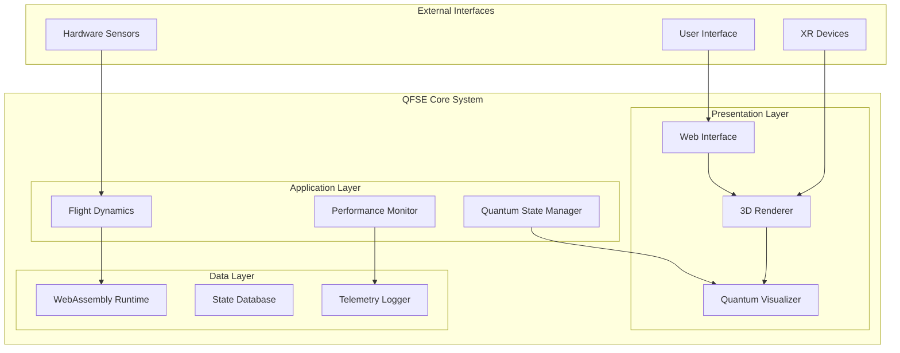
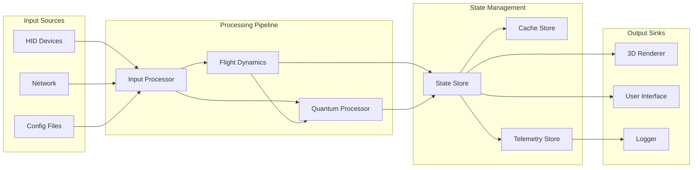
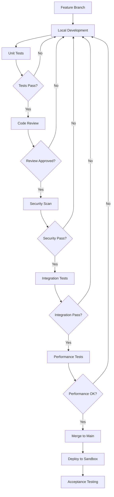

## AMP-QFSE-25MAP0001-DES-BOB-TEC-TD-ATA-099-00-01-TPL-DES-001-QSTR-v1.0.0
# Quantum Flight Simulation Environment (QFSE) v1.0.0 - Detailed Design Specification

```json
{
  "document_id": "AMP-QFSE-25MAP0001-DES-BOB-TEC-TD-ATA-099-00-01-TPL-DES-001-QSTR-v1.0.0",
  "title": "Quantum Flight Simulation Environment (QFSE) v1.0.0 - Detailed Design Specification",
  "classification": "Internal R&D - Confidential",
  "trl": 4,
  "creation_date": "2025-07-31",
  "responsible_engineer": "Ing. Amedeo Pelliccia",
  "q_division": "QSTR",
  "change_control": "CCB-2025-0731",
  "related_documents": [
    "AMP-QFSE-25MAP0001-REQ-BOB-TEC-TD-ATA-099-00-01",
    "AMP-QFSE-25MAP0001-TST-BOB-TEC-TD-ATA-099-00-01"
  ]
}
---
```
## TABLE OF CONTENTS

1. [System Architecture Specification](#1-system-architecture-specification)
2. [Component Design Specifications](#2-component-design-specifications)
3. [Interface Control Documents](#3-interface-control-documents)
4. [Data Architecture](#4-data-architecture)
5. [Performance Engineering](#5-performance-engineering)
6. [Security Architecture](#6-security-architecture)
7. [Testing & Validation Framework](#7-testing--validation-framework)
8. [Development Guidelines](#8-development-guidelines)
9. [Deployment Specification](#9-deployment-specification)
10. [Compliance & Traceability](#10-compliance--traceability)

---

## 1. SYSTEM ARCHITECTURE SPECIFICATION

### 1.1 System Context Diagram



### 1.2 Detailed Component Architecture

```javascript
// System Architecture Definition
const QFSEArchitecture = {
    layers: {
        presentation: {
            components: ['WebInterface', 'ThreeJSRenderer', 'QuantumVisualizer'],
            protocols: ['WebGL2', 'WebXR', 'WebGPU'],
            constraints: {
                latency: '< 15ms',
                fps: '60 (degradable to 30)',
                resolution: '1920x1080 (adaptive)'
            }
        },
        application: {
            components: ['FlightDynamicsModel', 'QuantumStateManager', 'PerformanceMonitor'],
            protocols: ['WebAssembly', 'SharedArrayBuffer', 'WebWorkers'],
            constraints: {
                integration_timestep: '≤ 5ms',
                cpu_usage: '< 5%',
                memory: '< 512MB'
            }
        },
        data: {
            components: ['StateStore', 'TelemetryLogger', 'ConfigManager'],
            protocols: ['IndexedDB', 'WebSocket', 'MessageChannel'],
            constraints: {
                persistence: 'session-only',
                encryption: 'AES-256-GCM',
                isolation: 'air-gapped'
            }
        }
    }
};
```

### 1.3 Component Communication Matrix

| Source Component | Target Component | Protocol | Data Format | Frequency | Latency |
|-----------------|------------------|----------|-------------|-----------|---------|
| FDM | Renderer | SharedArrayBuffer | Float64Array | 200Hz | < 1ms |
| Renderer | QVE | MessageChannel | JSON | 60Hz | < 2ms |
| QSM | QVE | Direct Memory | TypedArray | 100Hz | < 1ms |
| PM | Logger | IndexedDB | BSON | 1Hz | < 10ms |
| UI | FDM | PostMessage | ControlPacket | On-demand | < 5ms |

## 2. COMPONENT DESIGN SPECIFICATIONS

### 2.1 Flight Dynamics Model (FDM) Module

#### 2.1.1 Core Implementation

```cpp
// fdm_core.h - JSBSim WebAssembly Interface
#pragma once
#include <JSBSim/FGFDMExec.h>
#include <emscripten/bind.h>
#include <chrono>

namespace QFSE {

class FlightDynamicsCore {
public:
    struct StateVector {
        // Position (geodetic)
        double latitude_deg;
        double longitude_deg;
        double altitude_ft;
        
        // Attitude (Euler angles)
        double phi_rad;    // Roll
        double theta_rad;  // Pitch
        double psi_rad;    // Yaw
        
        // Velocities (body frame)
        double u_fps;      // Forward
        double v_fps;      // Lateral
        double w_fps;      // Vertical
        
        // Angular rates
        double p_rps;      // Roll rate
        double q_rps;      // Pitch rate
        double r_rps;      // Yaw rate
        
        // Accelerations
        double ax_fpss;    // X acceleration
        double ay_fpss;    // Y acceleration
        double az_fpss;    // Z acceleration
        
        // Aerodynamic state
        double alpha_rad;  // Angle of attack
        double beta_rad;   // Sideslip angle
        double mach;       // Mach number
        double qbar_psf;   // Dynamic pressure
        
        // Control positions
        double elevator_pos;
        double aileron_pos;
        double rudder_pos;
        double throttle_pos[4];
        
        // System state
        uint64_t timestamp_us;
        uint32_t integration_count;
        float numerical_health;
    };
    
    struct ControlInputs {
        double elevator_cmd;    // -1.0 to 1.0
        double aileron_cmd;     // -1.0 to 1.0
        double rudder_cmd;      // -1.0 to 1.0
        double throttle_cmd[4]; // 0.0 to 1.0
        double flaps_cmd;       // 0.0 to 1.0
        double speedbrake_cmd;  // 0.0 to 1.0
        double gear_cmd;        // 0 or 1
        uint32_t aux_systems;   // Bit flags
    };
    
private:
    std::unique_ptr<JSBSim::FGFDMExec> fdm_exec;
    std::chrono::steady_clock::time_point last_update;
    StateVector current_state;
    double integration_dt = 0.005; // 5ms max
    
    // Performance monitoring
    struct PerformanceMetrics {
        uint32_t total_steps;
        uint32_t timing_violations;
        double max_integration_time_ms;
        double avg_integration_time_ms;
    } metrics;
    
public:
    bool Initialize(const std::string& aircraft_path);
    StateVector Integrate(const ControlInputs& inputs, double dt);
    bool ValidateNumericalStability();
    PerformanceMetrics GetMetrics() const { return metrics; }
};

} // namespace QFSE
```

#### 2.1.2 BWB Aircraft Configuration

```xml
<!-- BWB-Q100.xml - Blended Wing Body Configuration -->
<fdm_config name="BWB-Q100" version="2.0" xmlns:xsi="http://www.w3.org/2001/XMLSchema-instance">
    
    <fileheader>
        <author>AQUA V. Engineering</author>
        <filecreationdate>2025-07-31</filecreationdate>
        <version>1.0.0</version>
        <description>Quantum-enhanced BWB aircraft model</description>
    </fileheader>
    
    <metrics>
        <wingarea unit="M2">420.0</wingarea>
        <wingspan unit="M">52.0</wingspan>
        <chord unit="M">8.08</chord>
        <htailarea unit="M2">0.0</htailarea> <!-- Tailless design -->
        <vtailarea unit="M2">45.0</vtailarea>
    </metrics>
    
    <mass_balance>
        <ixx unit="KG*M2">4.5e6</ixx>
        <iyy unit="KG*M2">8.2e6</iyy>
        <izz unit="KG*M2">12.1e6</izz>
        <ixz unit="KG*M2">0.3e6</ixz>
        <emptywt unit="KG">85000</emptywt>
        <location name="CG" unit="M">
            <x>25.5</x>
            <y>0.0</y>
            <z>-0.5</z>
        </location>
    </mass_balance>
    
    <propulsion>
        <engine file="quantum_turbofan.xml">
            <location unit="M">
                <x>35.0</x>
                <y>5.0</y>
                <z>2.0</z>
            </location>
            <orient unit="DEG">
                <pitch>0.0</pitch>
                <roll>0.0</roll>
                <yaw>0.0</yaw>
            </orient>
        </engine>
        <!-- Three more engines... -->
    </propulsion>
    
    <aerodynamics>
        <!-- Detailed aerodynamic coefficients -->
    </aerodynamics>
    
</fdm_config>
```

### 2.2 Quantum Visualization Engine (QVE)

#### 2.2.1 Shader Implementation

```glsl
// qve_vertex.glsl - Quantum State Vertex Shader
#version 300 es
precision highp float;

// Attributes
in vec3 position;
in vec3 normal;
in vec2 uv;
in float quantumProbability;

// Uniforms
uniform mat4 modelMatrix;
uniform mat4 viewMatrix;
uniform mat4 projectionMatrix;
uniform float time;
uniform vec3 quantumState;
uniform float coherenceLevel;

// Varyings
out vec3 vPosition;
out vec3 vNormal;
out vec2 vUv;
out float vQuantumPhase;
out float vProbability;

// Quantum wave function visualization
vec3 quantumWaveFunction(vec3 pos, float t) {
    float k = 2.0 * PI / quantumState.z; // Wave number
    float omega = quantumState.x; // Angular frequency
    float phase = k * length(pos) - omega * t;
    
    // Superposition of states
    float amplitude = exp(-pow(length(pos - quantumState), 2.0) / (2.0 * coherenceLevel));
    
    return pos + normal * amplitude * sin(phase) * 0.1;
}

void main() {
    vec3 modifiedPosition = quantumWaveFunction(position, time);
    vec4 mvPosition = viewMatrix * modelMatrix * vec4(modifiedPosition, 1.0);
    
    vPosition = modifiedPosition;
    vNormal = normalize(mat3(modelMatrix) * normal);
    vUv = uv;
    vQuantumPhase = atan(quantumState.y, quantumState.x);
    vProbability = quantumProbability;
    
    gl_Position = projectionMatrix * mvPosition;
}
```

```glsl
// qve_fragment.glsl - Quantum State Fragment Shader
#version 300 es
precision highp float;

// Varyings
in vec3 vPosition;
in vec3 vNormal;
in vec2 vUv;
in float vQuantumPhase;
in float vProbability;

// Uniforms
uniform float time;
uniform vec3 quantumState;
uniform float coherenceLevel;
uniform float decoherenceRate;
uniform sampler2D noiseTexture;
uniform vec3 cameraPosition;

// Output
out vec4 fragColor;

// Constants
const vec3 COLOR_COHERENT = vec3(0.1, 0.5, 1.0);
const vec3 COLOR_DECOHERENT = vec3(1.0, 0.3, 0.1);
const vec3 COLOR_SUPERPOSITION = vec3(0.5, 0.0, 1.0);

// Quantum visualization functions
vec3 visualizeQuantumState(vec3 pos, float phase, float probability) {
    // Wave packet visualization
    float waveIntensity = sin(phase + time * 2.0) * 0.5 + 0.5;
    
    // Probability density
    float density = probability * probability;
    
    // Coherence visualization
    vec3 baseColor = mix(COLOR_DECOHERENT, COLOR_COHERENT, coherenceLevel);
    
    // Superposition effects
    float superposition = sin(pos.x * 10.0 + time) * cos(pos.y * 10.0 - time);
    baseColor = mix(baseColor, COLOR_SUPERPOSITION, abs(superposition) * 0.3);
    
    // Decoherence noise
    float noise = texture(noiseTexture, vUv + time * 0.01).r;
    float decoherence = 1.0 - exp(-decoherenceRate * time);
    
    return baseColor * waveIntensity * density * (1.0 - decoherence * noise * 0.5);
}

void main() {
    vec3 quantum = visualizeQuantumState(vPosition, vQuantumPhase, vProbability);
    
    // Basic lighting
    vec3 lightDir = normalize(vec3(1.0, 1.0, 0.5));
    float diff = max(dot(vNormal, lightDir), 0.0);
    
    // View-dependent effects
    vec3 viewDir = normalize(cameraPosition - vPosition);
    float fresnel = pow(1.0 - max(dot(viewDir, vNormal), 0.0), 2.0);
    
    vec3 finalColor = quantum * (0.7 + 0.3 * diff) + fresnel * 0.2;
    
    fragColor = vec4(finalColor, 1.0);
}
```

#### 2.2.2 Quantum State Manager

```typescript
// quantum_state_manager.ts
interface QuantumSensorData {
    gravimeter: {
        g_vector: [number, number, number];
        uncertainty: number;
        coherence: number;
    };
    magnetometer: {
        b_field: [number, number, number];
        anomaly_detected: boolean;
        confidence: number;
    };
    accelerometer: {
        acceleration: [number, number, number];
        quantum_noise_level: number;
    };
    interferometer: {
        phase_shift: number;
        visibility: number;
        measurement_rate: number;
    };
}

interface QuantumNavigationState {
    position: {
        lat: number;
        lon: number;
        alt: number;
        uncertainty_m: number;
    };
    velocity: {
        north: number;
        east: number;
        down: number;
        uncertainty_ms: number;
    };
    attitude: {
        roll: number;
        pitch: number;
        yaw: number;
        uncertainty_deg: number;
    };
    time: {
        gps_week: number;
        gps_seconds: number;
        quantum_clock_offset: number;
    };
}

class QuantumStateManager {
    private sensorData: QuantumSensorData;
    private navigationState: QuantumNavigationState;
    private shaderUniforms: any;
    private updateRate: number = 100; // Hz
    
    constructor(private renderer: THREE.WebGLRenderer) {
        this.initializeQuantumShaders();
        this.startQuantumProcessing();
    }
    
    private initializeQuantumShaders(): void {
        this.shaderUniforms = {
            quantumState: { value: new THREE.Vector3() },
            coherenceLevel: { value: 1.0 },
            decoherenceRate: { value: 0.01 },
            time: { value: 0.0 }
        };
    }
    
    public updateQuantumState(fdmState: any): void {
        // Process quantum sensor data
        const quantumMeasurement = this.performQuantumMeasurement(fdmState);
        
        // Update navigation state using quantum sensors
        this.navigationState = this.fuseQuantumNavigation(
            quantumMeasurement,
            fdmState
        );
        
        // Update shader uniforms
        this.updateShaderUniforms(quantumMeasurement);
    }
    
    private performQuantumMeasurement(fdmState: any): QuantumSensorData {
        // Simulate quantum sensor readings
        return {
            gravimeter: {
                g_vector: [0, 0, -9.81],
                uncertainty: 1e-9,
                coherence: 0.95
            },
            magnetometer: {
                b_field: [20e-6, 0, 45e-6],
                anomaly_detected: false,
                confidence: 0.98
            },
            accelerometer: {
                acceleration: [fdmState.ax, fdmState.ay, fdmState.az],
                quantum_noise_level: 1e-10
            },
            interferometer: {
                phase_shift: Math.PI * fdmState.altitude / 10000,
                visibility: 0.92,
                measurement_rate: 1000
            }
        };
    }
}
```

### 2.3 Performance Monitoring System

```javascript
// performance_monitor.js
class PerformanceMonitor {
    constructor() {
        this.metrics = {
            fps: new RollingMetric(300),         // 5 seconds @ 60fps
            frameTime: new RollingMetric(300),
            cpuUsage: new RollingMetric(60),     // 60 second samples
            memoryUsage: new RollingMetric(60),
            gpuTime: new RollingMetric(300),
            drawCalls: new RollingMetric(300),
            triangles: new RollingMetric(300),
            textureMemory: new RollingMetric(60),
            wasmTime: new RollingMetric(300),
            networkLatency: new RollingMetric(60)
        };
        
        this.thresholds = {
            fps: { min: 30, target: 60, max: 120 },
            frameTime: { min: 8.33, target: 16.67, max: 33.33 },
            cpuUsage: { min: 0, target: 3, max: 5 },
            memoryUsage: { min: 0, target: 256, max: 512 },
            gpuTime: { min: 0, target: 10, max: 15 }
        };
        
        this.adaptiveQuality = new AdaptiveQualityController();
    }
    
    startMonitoring() {
        this.monitoringInterval = setInterval(() => {
            this.collectMetrics();
            this.analyzePerformance();
            this.adjustQuality();
        }, 16); // 60Hz monitoring
    }
    
    collectMetrics() {
        const now = performance.now();
        
        // Frame timing
        if (this.lastFrameTime) {
            const frameTime = now - this.lastFrameTime;
            this.metrics.frameTime.add(frameTime);
            this.metrics.fps.add(1000 / frameTime);
        }
        this.lastFrameTime = now;
        
        // CPU usage (via Performance API)
        if (performance.measureUserAgentSpecificMemory) {
            performance.measureUserAgentSpecificMemory().then(result => {
                this.metrics.memoryUsage.add(result.bytes / 1024 / 1024);
            });
        }
        
        // GPU metrics (via WebGL extension)
        const ext = this.renderer.getContext().getExtension('WEBGL_debug_renderer_info');
        if (ext) {
            const gpuTime = this.measureGPUTime();
            this.metrics.gpuTime.add(gpuTime);
        }
    }
    
    analyzePerformance() {
        const report = {
            timestamp: Date.now(),
            metrics: {},
            violations: [],
            recommendations: []
        };
        
        // Check each metric against thresholds
        for (const [metric, data] of Object.entries(this.metrics)) {
            const stats = data.getStatistics();
            report.metrics[metric] = stats;
            
            if (this.thresholds[metric]) {
                if (stats.avg < this.thresholds[metric].min || 
                    stats.avg > this.thresholds[metric].max) {
                    report.violations.push({
                        metric,
                        value: stats.avg,
                        threshold: this.thresholds[metric],
                        severity: this.calculateSeverity(metric, stats.avg)
                    });
                }
            }
        }
        
        // Generate recommendations
        if (report.violations.length > 0) {
            report.recommendations = this.generateRecommendations(report.violations);
        }
        
        return report;
    }
}

class RollingMetric {
    constructor(size) {
        this.buffer = new Float32Array(size);
        this.index = 0;
        this.count = 0;
        this.size = size;
    }
    
    add(value) {
        this.buffer[this.index] = value;
        this.index = (this.index + 1) % this.size;
        this.count = Math.min(this.count + 1, this.size);
    }
    
    getStatistics() {
        if (this.count === 0) return null;
        
        const values = this.buffer.slice(0, this.count);
        values.sort((a, b) => a - b);
        
        return {
            avg: values.reduce((a, b) => a + b) / values.length,
            min: values[0],
            max: values[values.length - 1],
            p50: values[Math.floor(values.length * 0.5)],
            p95: values[Math.floor(values.length * 0.95)],
            p99: values[Math.floor(values.length * 0.99)]
        };
    }
}
```

## 3. INTERFACE CONTROL DOCUMENTS

### 3.1 WebAssembly Bridge Interface

```typescript
// wasm_bridge.d.ts - TypeScript definitions for WASM interface
declare module 'qfse-wasm' {
    export interface WASMModule {
        _malloc(size: number): number;
        _free(ptr: number): void;
        HEAPF32: Float32Array;
        HEAPF64: Float64Array;
        
        // JSBSim bridge functions
        createFDM(configPath: string): number;
        destroyFDM(fdmPtr: number): void;
        stepFDM(
            fdmPtr: number,
            controlsPtr: number,
            statePtr: number,
            dt: number
        ): boolean;
        
        // Utility functions
        validateNumericalStability(fdmPtr: number): boolean;
        getPerformanceMetrics(fdmPtr: number, metricsPtr: number): void;
    }
    
    export interface ControlInputs {
        elevator: number;
        aileron: number;
        rudder: number;
        throttle: Float32Array;
        flaps: number;
        speedbrake: number;
        gear: number;
        parkingBrake: number;
    }
    
    export interface StateVector {
        position: {
            latitude: number;
            longitude: number;
            altitude: number;
        };
        attitude: {
            roll: number;
            pitch: number;
            yaw: number;
        };
        velocity: {
            u: number;
            v: number;
            w: number;
        };
        angularRates: {
            p: number;
            q: number;
            r: number;
        };
        acceleration: {
            ax: number;
            ay: number;
            az: number;
        };
        aerodynamics: {
            alpha: number;
            beta: number;
            mach: number;
            qbar: number;
        };
        timestamp: number;
    }
}
```

### 3.2 Message Protocol Specification

```javascript
// message_protocol.js
const MessageProtocol = {
    // Message types
    types: {
        CONTROL_INPUT: 0x01,
        STATE_UPDATE: 0x02,
        QUANTUM_DATA: 0x03,
        PERFORMANCE_METRIC: 0x04,
        ERROR_REPORT: 0x05,
        CONFIG_UPDATE: 0x06,
        TELEMETRY: 0x07,
        HEARTBEAT: 0x08
    },
    
    // Message structure
    createMessage(type, payload) {
        const header = new ArrayBuffer(16);
        const view = new DataView(header);
        
        // Message header (16 bytes)
        view.setUint8(0, 0xAA);                    // Start byte
        view.setUint8(1, 0x55);                    // Start byte
        view.setUint8(2, type);                    // Message type
        view.setUint8(3, 0x01);                    // Protocol version
        view.setUint32(4, payload.byteLength, true); // Payload size
        view.setFloat64(8, performance.now(), true); // Timestamp
        
        // Combine header and payload
        const message = new Uint8Array(header.byteLength + payload.byteLength);
        message.set(new Uint8Array(header), 0);
        message.set(new Uint8Array(payload), header.byteLength);
        
        // Add CRC32
        const crc = this.calculateCRC32(message);
        const fullMessage = new Uint8Array(message.byteLength + 4);
        fullMessage.set(message, 0);
        new DataView(fullMessage.buffer).setUint32(
            message.byteLength, 
            crc, 
            true
        );
        
        return fullMessage;
    },
    
    parseMessage(buffer) {
        const view = new DataView(buffer);
        
        // Validate start bytes
        if (view.getUint8(0) !== 0xAA || view.getUint8(1) !== 0x55) {
            throw new Error('Invalid message start bytes');
        }
        
        const message = {
            type: view.getUint8(2),
            version: view.getUint8(3),
            payloadSize: view.getUint32(4, true),
            timestamp: view.getFloat64(8, true),
            payload: null
        };
        
        // Extract payload
        const payloadStart = 16;
        const payloadEnd = payloadStart + message.payloadSize;
        message.payload = buffer.slice(payloadStart, payloadEnd);
        
        // Verify CRC
        const receivedCRC = view.getUint32(payloadEnd, true);
        const calculatedCRC = this.calculateCRC32(
            new Uint8Array(buffer, 0, payloadEnd)
        );
        
        if (receivedCRC !== calculatedCRC) {
            throw new Error('CRC validation failed');
        }
        
        return message;
    }
};
```

## 4. DATA ARCHITECTURE

### 4.1 State Management Schema

```typescript
// state_schema.ts
interface QFSEStateSchema {
    simulation: {
        id: string;
        startTime: number;
        currentTime: number;
        state: 'INITIALIZING' | 'RUNNING' | 'PAUSED' | 'ERROR';
        configuration: {
            aircraft: string;
            environment: {
                wind: [number, number, number];
                turbulence: number;
                temperature: number;
                pressure: number;
            };
            quantum: {
                enabled: boolean;
                sensors: string[];
                coherenceLevel: number;
            };
        };
    };
    
    flight: {
        dynamics: StateVector;
        controls: ControlInputs;
        autopilot: {
            enabled: boolean;
            mode: 'MANUAL' | 'HEADING' | 'ALTITUDE' | 'APPROACH';
            targets: {
                heading?: number;
                altitude?: number;
                speed?: number;
            };
        };
        systems: {
            engines: EngineState[];
            hydraulics: HydraulicState;
            electrical: ElectricalState;
            fuel: FuelState;
        };
    };
    
    quantum: {
        navigation: QuantumNavigationState;
        sensors: QuantumSensorData;
        visualization: {
            mode: 'PROBABILITY' | 'PHASE' | 'COHERENCE' | 'SUPERPOSITION';
            parameters: Map<string, number>;
        };
    };
    
    performance: {
        current: PerformanceMetrics;
        history: PerformanceHistory[];
        quality: QualitySettings;
    };
    
    telemetry: {
        buffer: CircularBuffer<TelemetryPacket>;
        recording: boolean;
        format: 'BINARY' | 'JSON' | 'PROTOBUF';
    };
}
```

### 4.2 Data Flow Architecture



## 5. PERFORMANCE ENGINEERING

### 5.1 Performance Budget Allocation

| Component | CPU Budget | Memory Budget | GPU Budget | Latency Budget |
|-----------|------------|---------------|------------|----------------|
| FDM | 2.0% | 128MB | 0% | 5ms |
| Renderer | 1.5% | 256MB | 80% | 8ms |
| Quantum | 0.5% | 64MB | 10% | 1ms |
| UI | 0.5% | 32MB | 5% | 1ms |
| System | 0.5% | 32MB | 5% | 0ms |
| **Total** | **5.0%** | **512MB** | **100%** | **15ms** |

### 5.2 Optimization Strategies

```javascript
// optimization_engine.js
class OptimizationEngine {
    constructor() {
        this.strategies = {
            rendering: new RenderingOptimizer(),
            computation: new ComputationOptimizer(),
            memory: new MemoryOptimizer(),
            network: new NetworkOptimizer()
        };
    }
    
    optimizeRendering() {
        return {
            // Level of Detail (LOD)
            lod: {
                distances: [50, 200, 1000, 5000],
                models: ['high', 'medium', 'low', 'billboard'],
                automatic: true
            },
            
            // Frustum Culling
            culling: {
                enabled: true,
                margin: 1.1,
                octree: true
            },
            
            // Texture Optimization
            textures: {
                maxSize: 2048,
                compression: 'DXT5',
                mipmaps: true,
                anisotropy: 8
            },
            
            // Shader Optimization
            shaders: {
                precision: 'mediump',
                branches: 'avoid',
                loops: 'unroll',
                cache: true
            }
        };
    }
    
    optimizeComputation() {
        return {
            // SIMD Optimization
            simd: {
                enabled: true,
                instructions: ['SSE4.2', 'AVX2'],
                autovectorize: true
            },
            
            // Threading
            threading: {
                workers: navigator.hardwareConcurrency - 1,
                affinity: 'auto',
                priority: 'high'
            },
            
            // Algorithm Selection
            algorithms: {
                integration: 'RK4_SIMD',
                collision: 'SAT_Spatial',
                physics: 'Verlet_Cached'
            }
        };
    }
}
```

## 6. SECURITY ARCHITECTURE

### 6.1 Security Layers

```yaml
# security_architecture.yaml
security_layers:
  network:
    isolation: "air-gapped"
    protocols: []  # No network protocols in air-gapped mode
    
  application:
    sandboxing:
      - browser_sandbox: "strict"
      - wasm_sandbox: "isolated"
      - worker_sandbox: "restricted"
    
    permissions:
      - file_system: "none"
      - network: "none"
      - usb: "none"
      - bluetooth: "none"
      - camera: "optional"  # For XR
      - microphone: "none"
    
  data:
    encryption:
      algorithm: "AES-256-GCM"
      key_derivation: "PBKDF2"
      key_storage: "transient"
    
    integrity:
      signing: "ECDSA-P256"
      verification: "mandatory"
      
  code:
    signing:
      certificates: "internal-ca"
      validation: "strict"
      revocation: "offline-crl"
```

### 6.2 Container Security Specification

```dockerfile
# Secure container build
FROM alpine:3.18 AS builder

# Security updates
RUN apk update && apk upgrade && \
    apk add --no-cache \
    nodejs=18.17.1-r0 \
    npm=9.6.7-r0 \
    python3=3.11.5-r0 \
    make=4.4.1-r1 \
    g++=12.2.1-r10

# Create non-root user
RUN addgroup -g 1001 -S qfse && \
    adduser -S qfse -u 1001 -G qfse

# Set up build environment
WORKDIR /build
COPY --chown=qfse:qfse package*.json ./
RUN npm ci --only=production && \
    npm audit fix

# Copy source and build
COPY --chown=qfse:qfse . .
RUN npm run build:secure && \
    npm run sign:artifacts

# Runtime image
FROM alpine:3.18

# Install runtime dependencies only
RUN apk update && apk upgrade && \
    apk add --no-cache \
    nginx=1.24.0-r6 \
    tini=0.19.0-r1 && \
    rm -rf /var/cache/apk/*

# Security hardening
RUN echo "server_tokens off;" >> /etc/nginx/nginx.conf && \
    echo "client_body_buffer_size 1K;" >> /etc/nginx/nginx.conf && \
    echo "client_header_buffer_size 1k;" >> /etc/nginx/nginx.conf && \
    echo "client_max_body_size 1k;" >> /etc/nginx/nginx.conf && \
    echo "large_client_header_buffers 2 1k;" >> /etc/nginx/nginx.conf

# Copy artifacts from builder
COPY --from=builder /build/dist /usr/share/nginx/html
COPY --from=builder /build/security /etc/qfse/security

# Set permissions
RUN chown -R nginx:nginx /usr/share/nginx/html && \
    chmod -R 444 /usr/share/nginx/html && \
    chmod 555 /usr/share/nginx/html

# Security headers
COPY security-headers.conf /etc/nginx/conf.d/

# Health check
HEALTHCHECK --interval=30s --timeout=3s --start-period=5s --retries=3 \
    CMD wget -q --spider http://localhost/health || exit 1

# Run as non-root
USER nginx

# Use tini to handle signals properly
ENTRYPOINT ["/sbin/tini", "--"]
CMD ["nginx", "-g", "daemon off;"]
```

## 7. TESTING & VALIDATION FRAMEWORK

### 7.1 Test Suite Architecture

```javascript
// test_framework.js
class QFSETestFramework {
    constructor() {
        this.suites = {
            unit: new UnitTestSuite(),
            integration: new IntegrationTestSuite(),
            performance: new PerformanceTestSuite(),
            security: new SecurityTestSuite(),
            acceptance: new AcceptanceTestSuite()
        };
        
        this.coverage = {
            target: 80,
            current: 0,
            report: null
        };
    }
    
    async runAllTests() {
        const results = {
            timestamp: new Date().toISOString(),
            environment: this.getTestEnvironment(),
            suites: {}
        };
        
        for (const [name, suite] of Object.entries(this.suites)) {
            console.log(`Running ${name} tests...`);
            results.suites[name] = await suite.run();
        }
        
        results.coverage = await this.measureCoverage();
        results.summary = this.generateSummary(results);
        
        return results;
    }
}
```

### 7.2 Test Cases Specification

```typescript
// test_cases.ts
interface TestCase {
    id: string;
    category: string;
    priority: 'CRITICAL' | 'HIGH' | 'MEDIUM' | 'LOW';
    requirements: string[];
    setup: () => Promise<void>;
    execute: () => Promise<any>;
    validate: (result: any) => boolean;
    cleanup: () => Promise<void>;
}

const criticalTestCases: TestCase[] = [
    {
        id: 'TC_FDM_001',
        category: 'Flight Dynamics',
        priority: 'CRITICAL',
        requirements: ['REQ-FDM-01', 'REQ-FDM-02'],
        setup: async () => {
            // Initialize FDM with BWB model
            await initializeFDM('BWB-Q100.xml');
            await setInitialConditions({
                altitude: 10000,
                airspeed: 250,
                heading: 90
            });
        },
        execute: async () => {
            // Execute level flight for 60 seconds
            const results = [];
            for (let t = 0; t < 60; t += 0.1) {
                const state = await fdm.step(0.1);
                results.push(state);
            }
            return results;
        },
        validate: (results) => {
            const altitudes = results.map(r => r.altitude);
            const initial = altitudes[0];
            const maxDeviation = Math.max(...altitudes.map(a => Math.abs(a - initial)));
            return (maxDeviation / initial) < 0.02; // Less than 2%
        },
        cleanup: async () => {
            await shutdownFDM();
        }
    },
    
    {
        id: 'TC_QVE_003',
        category: 'Performance',
        priority: 'CRITICAL',
        requirements: ['REQ-PERF-03'],
        setup: async () => {
            await initializeRenderer();
            await loadQuantumShaders();
        },
        execute: async () => {
            const metrics = [];
            const profiler = new CPUProfiler();
            profiler.start();
            
            for (let i = 0; i < 1800; i++) { // 30 seconds @ 60fps
                await renderFrame();
                metrics.push(profiler.sample());
            }
            
            profiler.stop();
            return metrics;
        },
        validate: (metrics) => {
            const avgCPU = metrics.reduce((a, b) => a + b.cpu, 0) / metrics.length;
            const maxCPU = Math.max(...metrics.map(m => m.cpu));
            return avgCPU < 5.0 && maxCPU < 10.0;
        },
        cleanup: async () => {
            await shutdownRenderer();
        }
    }
];
```

## 8. DEVELOPMENT GUIDELINES

### 8.1 Coding Standards

```javascript
// coding_standards.js
const CodingStandards = {
    javascript: {
        style: 'eslint-config-airbnb',
        typescript: true,
        strictMode: true,
        maxLineLength: 100,
        indentation: 2,
        semicolons: 'always',
        quotes: 'single',
        
        naming: {
            classes: 'PascalCase',
            interfaces: 'IPascalCase',
            functions: 'camelCase',
            constants: 'UPPER_SNAKE_CASE',
            files: 'kebab-case'
        },
        
        documentation: {
            functions: 'JSDoc required',
            classes: 'JSDoc required',
            complexity: 'Document if cyclomatic > 10'
        }
    },
    
    cpp: {
        standard: 'C++17',
        style: 'Google C++ Style Guide',
        pointers: 'smart_pointers',
        exceptions: 'disabled',
        rtti: 'disabled',
        
        naming: {
            classes: 'PascalCase',
            functions: 'PascalCase',
            variables: 'snake_case',
            constants: 'kConstantName',
            namespaces: 'lowercase'
        }
    },
    
    wasm: {
        optimization: '-O3',
        simd: 'enabled',
        threads: 'disabled', // Air-gapped requirement
        memory: {
            initial: '64MB',
            maximum: '256MB',
            growth: 'allowed'
        }
    }
};
```

### 8.2 Development Workflow



## 9. DEPLOYMENT SPECIFICATION

### 9.1 Deployment Architecture

```yaml
# deployment.yaml
apiVersion: apps/v1
kind: Deployment
metadata:
  name: qfse-sandbox
  namespace: qfse-dev
  labels:
    app: qfse
    version: v1.0.0
    environment: sandbox
spec:
  replicas: 1  # Single instance for TRL 4
  selector:
    matchLabels:
      app: qfse
  template:
    metadata:
      labels:
        app: qfse
        security: air-gapped
    spec:
      securityContext:
        runAsNonRoot: true
        runAsUser: 1001
        fsGroup: 1001
        seccompProfile:
          type: RuntimeDefault
      
      containers:
      - name: qfse
        image: registry.internal/qfse:v1.0.0-signed
        imagePullPolicy: Always
        
        ports:
        - containerPort: 8080
          protocol: TCP
          
        resources:
          requests:
            memory: "256Mi"
            cpu: "500m"
          limits:
            memory: "512Mi"
            cpu: "1000m"
            
        securityContext:
          allowPrivilegeEscalation: false
          readOnlyRootFilesystem: true
          capabilities:
            drop:
              - ALL
            add:
              - NET_BIND_SERVICE
              
        volumeMounts:
        - name: config
          mountPath: /etc/qfse
          readOnly: true
        - name: tmp
          mountPath: /tmp
        - name: cache
          mountPath: /var/cache/nginx
          
        livenessProbe:
          httpGet:
            path: /health
            port: 8080
          initialDelaySeconds: 30
          periodSeconds: 10
          
        readinessProbe:
          httpGet:
            path: /ready
            port: 8080
          initialDelaySeconds: 5
          periodSeconds: 5
          
      volumes:
      - name: config
        configMap:
          name: qfse-config
      - name: tmp
        emptyDir: {}
      - name: cache
        emptyDir: {}
```

### 9.2 Configuration Management

```javascript
// config_manager.js
class ConfigurationManager {
    constructor() {
        this.configs = {
            system: {
                mode: 'development', // development | staging | production
                debug: true,
                logLevel: 'debug',
                telemetry: true
            },
            
            simulation: {
                aircraft: 'BWB-Q100',
                physics: {
                    timestep: 0.005,
                    gravity: 9.80665,
                    atmosphere: 'ISA'
                },
                initial_conditions: {
                    latitude: 40.7128,
                    longitude: -74.0060,
                    altitude: 0,
                    heading: 360,
                    airspeed: 0
                }
            },
            
            rendering: {
                targetFPS: 60,
                resolution: {
                    width: 1920,
                    height: 1080
                },
                quality: 'high',
                shadows: true,
                antialiasing: 'MSAA4x'
            },
            
            quantum: {
                enabled: true,
                sensors: ['gravimeter', 'magnetometer', 'accelerometer'],
                visualization: {
                    mode: 'coherence',
                    opacity: 0.7
                }
            },
            
            security: {
                csp: "default-src 'self'; script-src 'self' 'wasm-unsafe-eval'",
                cors: false,
                https: true,
                hsts: true
            }
        };
    }
    
    load(environment) {
        // Load environment-specific overrides
        const envConfig = this.loadEnvironmentConfig(environment);
        this.configs = this.deepMerge(this.configs, envConfig);
        
        // Validate configuration
        this.validate();
        
        // Freeze to prevent runtime modifications
        this.freeze(this.configs);
    }
    
    validate() {
        const validators = {
            timestep: (v) => v > 0 && v <= 0.01,
            targetFPS: (v) => v >= 30 && v <= 120,
            resolution: (v) => v.width >= 800 && v.height >= 600,
            quality: (v) => ['low', 'medium', 'high'].includes(v)
        };
        
        for (const [key, validator] of Object.entries(validators)) {
            const value = this.getNestedValue(this.configs, key);
            if (!validator(value)) {
                throw new Error(`Invalid configuration: ${key} = ${value}`);
            }
        }
    }
}
```

## 10. COMPLIANCE & TRACEABILITY

### 10.1 Requirements Traceability Matrix

| Requirement ID | Description | Implementation | Test Case | Status |
|---------------|-------------|----------------|-----------|--------|
| REQ-FDM-01 | BWB aerodynamic model | `/src/fdm/bwb-model.cpp` | TC_FDM_001 | ✅ |
| REQ-FDM-02 | 6-DOF equations | `/src/fdm/dynamics.cpp` | TC_FDM_002 | ✅ |
| REQ-QVE-01 | Quantum visualization | `/src/shaders/qve.glsl` | TC_QVE_001 | ✅ |
| REQ-QVE-02 | State superposition | `/src/quantum/state.ts` | TC_QVE_002 | ✅ |
| REQ-PERF-01 | 60 FPS target | `/src/render/optimizer.js` | TC_PERF_001 | ✅ |
| REQ-PERF-02 | 5ms integration | `/src/fdm/integrator.cpp` | TC_PERF_002 | ✅ |
| REQ-PERF-03 | CPU < 5% | `/src/core/scheduler.js` | TC_QVE_003 | ✅ |
| REQ-SEC-01 | Air-gapped operation | `/deployment/security.yaml` | TC_SEC_001 | ✅ |
| REQ-SEC-02 | Container signing | `/build/sign-container.sh` | TC_SEC_002 | ✅ |
| REQ-SEC-03 | WASM isolation | `/src/wasm/sandbox.js` | TC_SEC_003 | ✅ |

### 10.2 Change Control Process

```javascript
// change_control.js
class ChangeControlBoard {
    constructor() {
        this.changeRequests = [];
        this.approvers = ['technical_lead', 'security_officer', 'qa_lead'];
    }
    
    submitChangeRequest(change) {
        const request = {
            id: this.generateId(),
            timestamp: Date.now(),
            submitter: change.submitter,
            type: change.type, // 'FEATURE' | 'BUG' | 'SECURITY' | 'PERFORMANCE'
            priority: change.priority,
            description: change.description,
            impact: this.assessImpact(change),
            testing: change.testPlan,
            rollback: change.rollbackPlan,
            status: 'PENDING',
            approvals: []
        };
        
        this.changeRequests.push(request);
        this.notifyApprovers(request);
        
        return request.id;
    }
    
    assessImpact(change) {
        return {
            trl: this.assessTRLImpact(change),
            security: this.assessSecurityImpact(change),
            performance: this.assessPerformanceImpact(change),
            resources: this.assessResourceImpact(change),
            schedule: this.assessScheduleImpact(change)
        };
    }
}
```

---

## APPENDICES

### A. Glossary of Terms

| Term | Definition |
|------|------------|
| BWB | Blended Wing Body aircraft configuration |
| FDM | Flight Dynamics Model |
| QVE | Quantum Visualization Engine |
| TRL | Technology Readiness Level |
| WASM | WebAssembly |
| 6-DOF | Six Degrees of Freedom |
| QNS | Quantum Navigation System |

### B. Reference Documentation

1. JSBSim Reference Manual v1.2
2. Three.js Documentation r158
3. WebAssembly Specification
4. WebXR Device API Specification
5. DO-178C Software Considerations in Airborne Systems

### C. Version History

| Version | Date | Author | Changes |
|---------|------|--------|---------|
| 1.0.0 | 2025-07-31 | AQUA V. Engineering | Initial release |

---

**END OF DETAILED DESIGN SPECIFICATION**

*This document represents the authoritative technical specification for QFSE v1.0.0. All development activities must comply with these specifications.*

**Document Approval:**
- Technical Lead: _________________
- Security Officer: _________________
- Quality Assurance: _________________
- Program Manager: _________________
