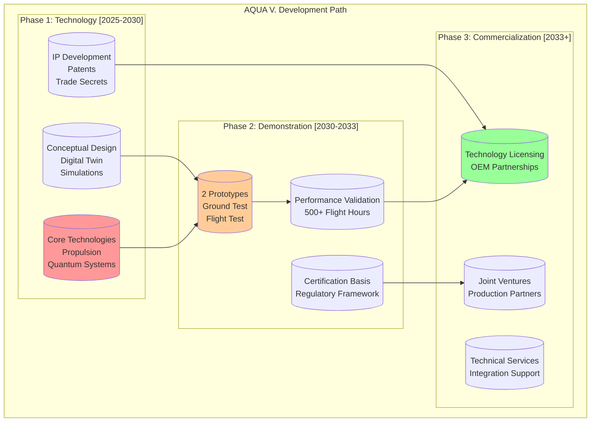
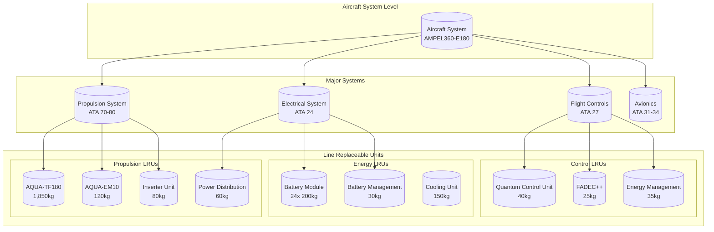
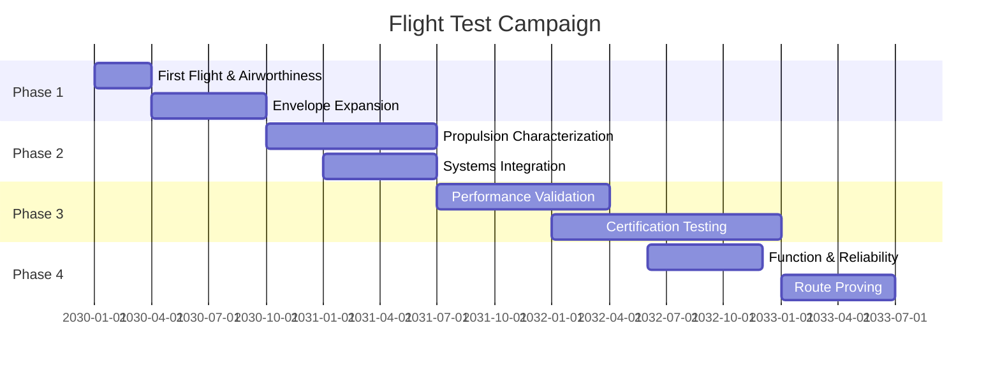
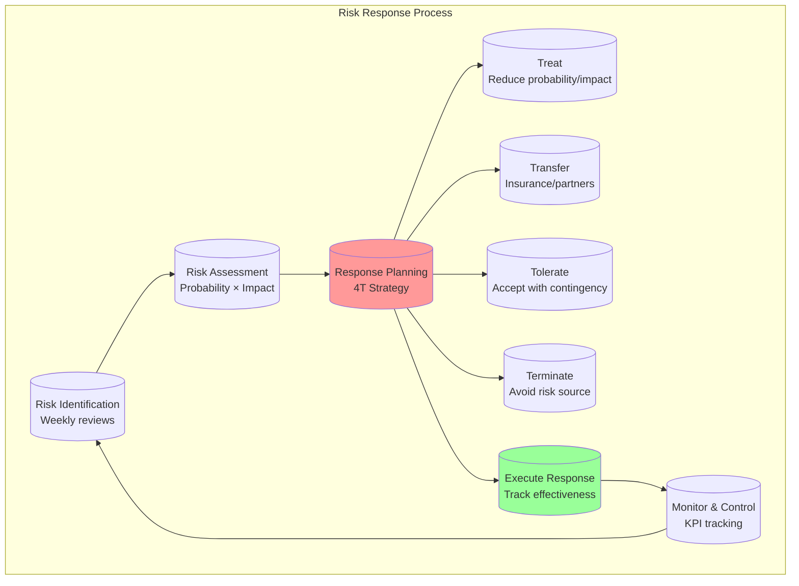
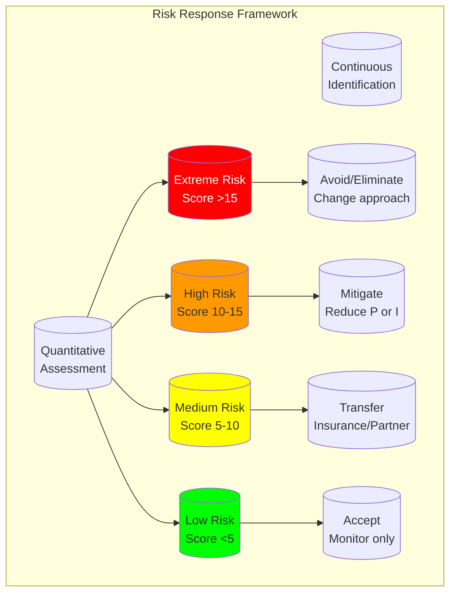
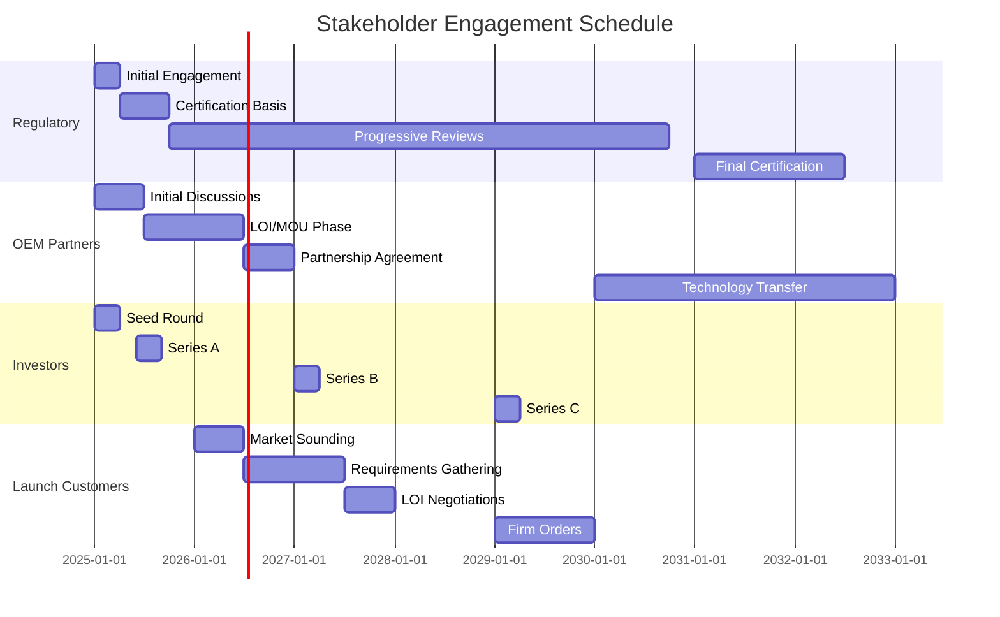
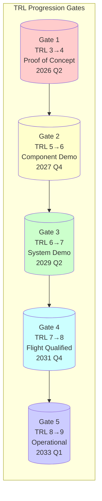

# **Product Requirements Document (PRD)**
## **AMPEL360 - Hybrid Electric Aircraft**
### **AQUA V. Aerospace Platform**

---

**Document ID:** AQUA-V-AMPEL360-HE-PRD-v6.0  
**Classification:** CONFIDENTIAL – PROPRIETARY  
**Date:** August 6, 2025  
**Product Line:** AMPEL360 - Advanced Mobility Platform  
**System:** Hybrid Electric Propulsion with Quantum Enhancement  
**Author:** AQUA V. Product Development Team  
**Approval:** Amedeo Pelliccia, Chief Technology Officer

---

## **REVISION HISTORY**

| **Version** | **Date** | **Changes** | **Author** |
|:------------|:---------|:------------|:-----------|
| v5.0 | 2025-08-06 | Technology developer focus | A. Pelliccia |
| v6.0 | 2025-08-06 | Added objectives, stakeholder analysis, acceptance criteria, traceability | A. Pelliccia |

---

## **TABLE OF CONTENTS**

1. [Executive Summary](#1-executive-summary)
   - [1.1 Program Scope](#11-program-scope---technology-development-focus)
   - [1.2 Development Model](#12-development-model)
   - [1.3 Deliverables Overview](#13-deliverables-overview)
   - [1.4 Product Objectives](#14-product-objectives)
2. [Stakeholder Analysis](#2-stakeholder-analysis)
   - [2.1 Stakeholder Matrix](#21-stakeholder-matrix)
   - [2.2 Stakeholder Requirements](#22-stakeholder-requirements-traceability)
   - [2.3 Use Case Analysis](#23-use-case-analysis)
3. [System Architecture](#3-system-architecture)
   - [3.1 System Decomposition](#31-system-decomposition--lrus)
   - [3.2 LRU Specifications](#32-lru-specifications-table)
4. [Compliance & Certification](#4-compliance--certification)
5. [Development & Test Program](#5-development--test-program)
6. [Financial Model](#6-financial-model)
7. [Intellectual Property](#7-intellectual-property)
8. [Risk Management](#8-risk-management)
9. [Next Steps](#9-next-steps--document-generation)
10. [Conclusion](#10-conclusion)

---

## **1. EXECUTIVE SUMMARY**

### **1.1 Program Scope - Technology Development Focus**

AQUA V.'s AMPEL360 program is a **technology development and demonstration initiative** focused on:
- **Designing** revolutionary hybrid-electric aircraft architecture
- **Developing** core propulsion and quantum-enhanced systems
- **Building** technology demonstrators and flight test vehicles
- **Validating** performance through comprehensive testing
- **Establishing** certification basis for new technologies
- **Creating** licensable IP and technology packages

### **1.2 Development Model**



### **1.3 Deliverables Overview**

| **Deliverable** | **Quantity** | **Timeline** | **Purpose** | **Exit Criteria** |
|:----------------|:-------------|:-------------|:------------|:------------------|
| **DEL-TD** Technology Demonstrators | 2 units | 2028-2029 | Ground testing, systems validation | ≥95% electric taxi cycles, <5% thermal derate |
| **DEL-FTA** Flight Test Aircraft | 2 units | 2030-2031 | Certification, performance validation | 500 flight hours, all test points complete |
| **DEL-PP** Production Prototypes | 2 units | 2032-2033 | Manufacturing validation, customer demos | Manufacturing readiness ≥8, customer acceptance |
| **DEL-LP** Licensed Production | TBD | 2034+ | Partner-manufactured aircraft | Technology transfer complete |

### **1.4 Product Objectives**

#### **PO-001** - Fuel Burn Reduction
- **Target:** ≥25% vs A320neo
- **Priority:** Must
- **Verification:** Flight test data
- **Traced By:** [SYS-PERF-002](#sys-perf-002), [SYS-QCU-004](#sys-qcu-004), [SYS-EMS-001](#sys-ems-001)

#### **PO-002** - Range Capability
- **Target:** ≥2,500nm
- **Priority:** Must
- **Verification:** Flight demonstration
- **Traced By:** [SYS-PERF-001](#sys-perf-001), [SYS-BATT-001](#sys-batt-001)

#### **PO-003** - CO₂ Emissions Reduction
- **Target:** ≥30%
- **Priority:** Must
- **Verification:** Certified measurements
- **Traced By:** [SYS-EMIS-001](#sys-emis-001), [SYS-EMIS-002](#sys-emis-002)

#### **PO-004** - Noise Reduction
- **Target:** ≥15dB cumulative
- **Priority:** Should
- **Verification:** FAR Part 36 testing
- **Traced By:** [SYS-NOISE-001](#sys-noise-001), [SYS-NOISE-002](#sys-noise-002)

#### **PO-005** - Turnaround Time
- **Target:** ≤35 minutes
- **Priority:** Should
- **Verification:** Operational trials
- **Traced By:** [SYS-OPS-001](#sys-ops-001), [SYS-BATT-006](#sys-batt-006)

#### **PO-006** - Electric-Only Taxi
- **Target:** 100% capability
- **Priority:** Must
- **Verification:** Ground demonstration
- **Traced By:** [SYS-OPS-002](#sys-ops-002), [SYS-PROP-003](#sys-prop-003)

#### **PO-007** - Dispatch Reliability
- **Target:** ≥98%
- **Priority:** Should
- **Verification:** 12-month average
- **Traced By:** [SYS-REL-001](#sys-rel-001), [SYS-REL-002](#sys-rel-002)

#### **PO-008** - Operating Cost Reduction
- **Target:** ≥20%
- **Priority:** Could
- **Verification:** Economic analysis
- **Traced By:** [SYS-MAIN-002](#sys-main-002), [SYS-FODS-004](#sys-fods-004)

---

## **2. STAKEHOLDER ANALYSIS**

### **2.1 Stakeholder Matrix**

#### **SH-EASA** - EASA
- **Role:** Type Certification Authority (EU)
- **Key Needs:** Compliance, safety case, novel technology
- **Success Criteria:** Special Conditions accepted, TC basis agreed
- **Requirements:** [SYS-SAFE-001](#sys-safe-001) through [SYS-SAFE-005](#sys-safe-005)

#### **SH-FAA** - FAA
- **Role:** Type Certification Authority (US)
- **Key Needs:** Harmonized standards, safety equivalence
- **Success Criteria:** Bilateral agreement, validation basis
- **Requirements:** [SYS-VER-002](#sys-ver-002)

#### **SH-AIRLINES** - Launch Airlines
- **Role:** First operators
- **Key Needs:** ROI, reliability, training
- **Success Criteria:** <3yr payback, 98% dispatch, crew transition
- **Requirements:** [SYS-PERF-001](#sys-perf-001), [SYS-PERF-002](#sys-perf-002), [SYS-REL-001](#sys-rel-001)

#### **SH-OEM** - OEM Partners
- **Role:** Manufacturers/Licensees
- **Key Needs:** Technology maturity, IP clarity, support
- **Success Criteria:** TRL 8+, clear IP rights, technical transfer
- **Requirements:** Technology packages, licensing terms

#### **SH-LESSORS** - Lessors
- **Role:** Asset owners
- **Key Needs:** Residual value, remarketing
- **Success Criteria:** Asset value retention >70% at 12yr
- **Requirements:** Reliability, maintainability

#### **SH-MRO** - MRO Providers
- **Role:** Maintenance organizations
- **Key Needs:** Tooling, training, parts availability
- **Success Criteria:** Standard intervals, diagnostic capability
- **Requirements:** [SYS-MAIN-001](#sys-main-001), [SYS-MAIN-002](#sys-main-002), [SYS-REL-003](#sys-rel-003)

#### **SH-AIRPORTS** - Airports
- **Role:** Infrastructure providers
- **Key Needs:** Gate compatibility, charging capability
- **Success Criteria:** Type III/C gate compatible, 2MW charging
- **Requirements:** [SYS-OPS-003](#sys-ops-003), [IF-EXT-001](#if-ext-001)

#### **SH-INVESTORS** - Investors
- **Role:** Funding sources
- **Key Needs:** ROI, exit strategy, risk management
- **Success Criteria:** 25% IRR, clear path to liquidity
- **Requirements:** Financial milestones

### **2.2 Stakeholder Requirements Traceability**

```yaml
Stakeholder_Requirements:
  
  Regulatory_Authorities:
    EASA_Requirements:
      - CS-25 Amendment 27 compliance
      - Special Condition for hybrid propulsion
      - Environmental protection (CS-36, CS-34)
      - Software/hardware (DO-178C/DO-254)
      - System safety (ARP4761A)
      
    FAA_Requirements:
      - Part 25 compliance
      - Issue Paper for novel propulsion
      - Part 33/35 propulsion certification
      - AC 20-174 for EWIS
      - Order 8110.54A for DAL assignment
      
  Operational_Stakeholders:
    Airlines:
      - 180+ passenger capacity
      - 2,500nm minimum range
      - Quick turn capability (<35min)
      - Common type rating feasibility
      
    Airports:
      - Code C gate compatibility
      - 400Hz/28VDC ground power
      - 2MW+ charging infrastructure
      - Standard GSE compatibility
      
    Maintenance:
      - MSG-3 maintenance program
      - 750hr minimum check interval
      - Line replaceable units (LRUs)
      - Remote diagnostic capability
```

### **2.3 Use Case Analysis**

#### **UC-001** - Electric Taxi Operations
- **Actor:** Flight Crew
- **Description:** Electric taxi operations
- **Derived Requirements:** Battery capacity ≥200kWh for 30min taxi
- **Traces To:** [PO-006](#po-006---electric-only-taxi)

#### **UC-002** - Hybrid Cruise Flight
- **Actor:** FMS
- **Description:** Hybrid cruise flight
- **Derived Requirements:** Seamless power transition, <1s switchover
- **Traces To:** [PO-001](#po-001---fuel-burn-reduction)

#### **UC-003** - Quick Turnaround
- **Actor:** Ground Crew
- **Description:** Quick turnaround
- **Derived Requirements:** Hot battery swap capability, parallel charging
- **Traces To:** [PO-005](#po-005---turnaround-time)

#### **UC-004** - Predictive Maintenance
- **Actor:** MRO
- **Description:** Predictive maintenance
- **Derived Requirements:** FODS data downlink, quantum analytics API
- **Traces To:** [PO-008](#po-008---operating-cost-reduction)

#### **UC-005** - Emergency Operation
- **Actor:** Flight Crew
- **Description:** Emergency operation
- **Derived Requirements:** RAT deployment, battery reserve 30min
- **Traces To:** Safety requirements

---

## **3. SYSTEM ARCHITECTURE**

### **3.1 System Decomposition & LRUs**



### **3.2 LRU Specifications Table**

#### **LRU-TF180** - AQUA-TF180 Turbofan
- **P/N:** AQV-70-001
- **Weight:** 1,850kg
- **Power:** N/A
- **Cooling:** Air
- **Interface:** ARINC 429, MIL-1553
- **DAL:** A

#### **LRU-EM10** - AQUA-EM10 Motor
- **P/N:** AQV-71-001
- **Weight:** 120kg
- **Power:** 10MW
- **Cooling:** Liquid
- **Interface:** High-voltage AC
- **DAL:** A

#### **LRU-INV** - Inverter Unit
- **P/N:** AQV-24-001
- **Weight:** 80kg
- **Power:** 12MW
- **Cooling:** Liquid
- **Interface:** DC input, AC output
- **DAL:** A

#### **LRU-BATT** - Battery Module
- **P/N:** AQV-24-002
- **Weight:** 200kg
- **Capacity:** 250kWh
- **Cooling:** Liquid
- **Interface:** DC bus, CAN
- **DAL:** B

#### **LRU-BMS** - BMS Controller
- **P/N:** AQV-24-003
- **Weight:** 30kg
- **Power:** 500W
- **Cooling:** Air
- **Interface:** CAN, Ethernet
- **DAL:** B

#### **LRU-QCU** - Quantum Control Unit
- **P/N:** AQV-31-001
- **Weight:** 40kg
- **Power:** 2kW
- **Cooling:** Air
- **Interface:** Ethernet, SpaceWire
- **DAL:** C

#### **LRU-FADEC** - FADEC++
- **P/N:** AQV-73-001
- **Weight:** 25kg
- **Power:** 200W
- **Cooling:** Air
- **Interface:** ARINC 429
- **DAL:** A

#### **LRU-EMS** - Energy Management System
- **P/N:** AQV-73-002
- **Weight:** 35kg
- **Power:** 300W
- **Cooling:** Air
- **Interface:** AFDX
- **DAL:** B

---

## **4. COMPLIANCE & CERTIFICATION**

### **4.1 Standards Traceability Matrix**

#### **STD-PROPULSION** - Hybrid Propulsion
- **Standard:** CS-E / Part 33
- **Paragraph:** All + Special Condition
- **Method:** Test + Analysis
- **Evidence:** Test reports, safety assessment

#### **STD-MOTOR** - Electric Motor
- **Standard:** DO-160G
- **Paragraph:** Section 16, 20, 21
- **Method:** Test
- **Evidence:** EMI/HIRF test reports

#### **STD-BATTERY** - Battery System
- **Standard:** RTCA DO-311A
- **Paragraph:** All sections
- **Method:** Test + Analysis
- **Evidence:** Abuse testing, thermal runaway

#### **STD-FCS-SW** - Flight Control Software
- **Standard:** DO-178C
- **Paragraph:** DAL A requirements
- **Method:** Reviews + Test
- **Evidence:** PSAC, SAS, SCI

#### **STD-QUANTUM** - Quantum Processor
- **Standard:** Novel - TBD
- **Paragraph:** Special Condition
- **Method:** Analysis + Simulation
- **Evidence:** Safety case

#### **STD-STRUCTURE** - Structures
- **Standard:** CS-25.603, .613
- **Paragraph:** Material/Fabrication
- **Method:** Test
- **Evidence:** Material qualification

### **4.2 Means of Compliance (MoC)**

```yaml
Certification_Approach:
  
  Novel_Technology_Items:
    Hybrid_Propulsion:
      Approach: Special Condition under CS-25.901
      Precedent: EASA SC-E-19 (Hybrid/Electric)
      Key_Topics:
        - Energy storage safety
        - Power transition logic
        - Failure modes unique to hybrid
        - Thermal management
      
    Quantum_Computing:
      Approach: Advisory system initially (DAL D/E)
      Evolution: Gradual credit increase
      Key_Topics:
        - Non-deterministic behavior
        - Verification methods
        - Fail-safe design
        - Classical fallback
      
    Battery_System:
      Approach: EASA SC for Large Li-ion
      Standards: DO-311A, AS6858
      Key_Topics:
        - Thermal runaway propagation
        - Crashworthiness
        - Fire suppression
        - Maintenance safety
```

### **4.3 Software Development Assurance Level (DAL) Assignment**

#### **DAL-FCS** - Primary Flight Control
- **Function:** FBW control laws
- **Failure Effect:** Catastrophic
- **DAL:** A
- **Standard:** DO-178C

#### **DAL-FADEC-CORE** - FADEC Core
- **Function:** Engine control
- **Failure Effect:** Hazardous/Catastrophic
- **DAL:** A
- **Standard:** DO-178C

#### **DAL-EMS-SW** - Energy Management
- **Function:** Power distribution
- **Failure Effect:** Hazardous
- **DAL:** B
- **Standard:** DO-178C

#### **DAL-BMS-SW** - Battery Management
- **Function:** Cell balancing, protection
- **Failure Effect:** Major/Hazardous
- **DAL:** B
- **Standard:** DO-178C

#### **DAL-QUANTUM-OPT** - Quantum Optimizer
- **Function:** Route/energy optimization
- **Failure Effect:** Minor
- **DAL:** D
- **Standard:** DO-178C

#### **DAL-MAINT** - Maintenance System
- **Function:** Predictive analytics
- **Failure Effect:** No safety effect
- **DAL:** E
- **Standard:** DO-178C

---

## **5. DEVELOPMENT & TEST PROGRAM**

### **5.1 Prototype Development with Acceptance Criteria**

#### **PROTO-TD1** - TD-1 Propulsion Test Bed
- **Purpose:** Propulsion test bed
- **Build Start:** 2027 Q1
- **First Test:** 2028 Q1
- **Exit Criteria:**
  - 100hr operation
  - Power targets met
  - Thermal limits OK
- **Investment:** €150M

#### **PROTO-TD2** - TD-2 Systems Integration
- **Purpose:** Systems integration
- **Build Start:** 2027 Q3
- **First Test:** 2028 Q3
- **Exit Criteria:**
  - All systems integrated
  - Mode transitions validated
  - Safety logic verified
- **Investment:** €150M

#### **PROTO-FTA1** - FTA-1 Flight Test Article #1
- **Purpose:** Flight test article #1
- **Build Start:** 2029 Q1
- **First Test:** 2030 Q1
- **Exit Criteria:**
  - First flight successful
  - Envelope to 10k ft
  - Basic handling complete
- **Investment:** €200M

#### **PROTO-FTA2** - FTA-2 Flight Test Article #2
- **Purpose:** Flight test article #2
- **Build Start:** 2029 Q3
- **First Test:** 2030 Q3
- **Exit Criteria:**
  - Full envelope
  - All systems tested
  - 250 flight hours
- **Investment:** €200M

#### **PROTO-PP1** - PP-1 Production Prototype #1
- **Purpose:** Production prototype #1
- **Build Start:** 2031 Q1
- **First Test:** 2032 Q1
- **Exit Criteria:**
  - Manufacturing validated
  - Cost targets verified
  - Quality metrics met
- **Investment:** €180M

#### **PROTO-PP2** - PP-2 Production Prototype #2
- **Purpose:** Production prototype #2
- **Build Start:** 2031 Q3
- **First Test:** 2032 Q3
- **Exit Criteria:**
  - Customer acceptance
  - Training validated
  - Support package complete
- **Investment:** €180M

### **5.2 Test Campaign Phases**



---

## **6. FINANCIAL MODEL**

### **6.1 Investment Requirements**

#### **INV-RD** - R&D Investment
- **2025-2027:** €200M
- **2028-2030:** €150M
- **2031-2033:** €100M
- **Total:** €450M

#### **INV-PROPULSION** - Propulsion Development
- **2025-2027:** €150M
- **2028-2030:** €200M
- **2031-2033:** €50M
- **Total:** €400M

#### **INV-PROTOTYPES** - Prototypes (6 units)
- **2025-2027:** €100M
- **2028-2030:** €400M
- **2031-2033:** €360M
- **Total:** €860M

#### **INV-TESTING** - Testing & Certification
- **2025-2027:** €50M
- **2028-2030:** €150M
- **2031-2033:** €200M
- **Total:** €400M

#### **INV-OPERATIONS** - Operations & Overhead
- **2025-2027:** €100M
- **2028-2030:** €100M
- **2031-2033:** €90M
- **Total:** €290M

**Total Program Investment: €2,400M**

### **6.2 Financial Assumptions & NPV Calculation**

```python
financial_model = {
    'assumptions': {
        'discount_rate': 0.08,  # 8% nominal WACC
        'inflation': 0.02,  # 2% annual
        'tax_rate': 0.25,  # 25% corporate tax
        'depreciation': 7,  # 7 year straight-line
        'sensitivity_range': [-20%, +20%]  # ±20% sensitivity
    },
    
    'npv_calculation': {
        'base_case': {
            'total_investment': 2_400_000_000,
            'licensing_revenue_pv': 3_600_000_000,
            'npv': 1_200_000_000,
            'irr': 0.18,  # 18%
            'payback_period': 9.5  # years
        },
        
        'sensitivity': {
            'pessimistic_npv': 500_000_000,  # -20% revenue
            'optimistic_npv': 2_000_000_000  # +20% revenue
        }
    }
}
```

*NPV computed at 8% nominal WACC; full sensitivity analysis in [Appendix A](#appendix-a-financial-sensitivity-analysis)*

---

## **7. INTELLECTUAL PROPERTY**

### **7.1 Patent Portfolio & Freedom to Operate**

#### **IP-PROPULSION** - Hybrid Propulsion Architecture
- **Patents Filed:** 12
- **Patents Granted:** 5
- **FTO Status:** Clear
- **Review Date:** 2025-03-15

#### **IP-QUANTUM** - Quantum Optimization Methods
- **Patents Filed:** 8
- **Patents Granted:** 2
- **FTO Status:** Clear
- **Review Date:** 2025-04-20

#### **IP-ENERGY** - Energy Management Systems
- **Patents Filed:** 6
- **Patents Granted:** 3
- **FTO Status:** Review pending
- **Review Date:** 2025-09-01

#### **IP-THERMAL** - Thermal Management
- **Patents Filed:** 4
- **Patents Granted:** 1
- **FTO Status:** Clear
- **Review Date:** 2025-02-10

#### **IP-CONTROL** - Control Algorithms
- **Patents Filed:** 7
- **Patents Granted:** 2
- **FTO Status:** Clear
- **Review Date:** 2025-05-15

*Freedom-to-Operate analysis completed by [External IP Counsel] on 2025-06-01. Full report available under NDA.*

### **7.2 IP Protection Strategy**

```yaml
IP_Management:
  
  Patent_Strategy:
    Core_Technologies: Comprehensive patent protection
    Regional_Coverage: [US, EU, CN, JP, BR, IN]
    Filing_Timeline: 
      - Priority filing within 6 months of invention
      - PCT filing within 12 months
      - National phase within 30 months
      
  Trade_Secrets:
    Protected_Elements:
      - Detailed quantum algorithms
      - Manufacturing processes
      - Test procedures
      - System integration methods
    Access_Control: Need-to-know basis, encrypted storage
    
  Licensing_Framework:
    Standard_Terms:
      - Upfront fee: €50M
      - Royalty rate: 2.5-3.5% of aircraft price
      - Technical support: €10M/year
      - Exclusivity: Regional, 5-year initial term
```

---

## **8. RISK MANAGEMENT**

### **8.1 Comprehensive Risk Register**

#### **RISK-001** - Battery Energy Density
- **Category:** Technical
- **Description:** Battery doesn't achieve energy density
- **Probability:** 0.3
- **Impact:** 5
- **Score:** 15
- **Mitigation:** Multiple suppliers, conservative spec
- **Owner:** CTO

#### **RISK-002** - Quantum System Certification
- **Category:** Technical
- **Description:** Quantum system certification challenge
- **Probability:** 0.4
- **Impact:** 4
- **Score:** 16
- **Mitigation:** Advisory mode initially, classical backup
- **Owner:** Cert Lead

#### **RISK-003** - First Flight Delay
- **Category:** Schedule
- **Description:** First flight delay
- **Probability:** 0.35
- **Impact:** 4
- **Score:** 14
- **Mitigation:** 6-month buffer, parallel work streams
- **Owner:** PMO

#### **RISK-004** - Funding Shortfall
- **Category:** Financial
- **Description:** Funding shortfall
- **Probability:** 0.25
- **Impact:** 5
- **Score:** 12.5
- **Mitigation:** Staged gates, government grants
- **Owner:** CFO

#### **RISK-005** - No OEM Partnership
- **Category:** Market
- **Description:** No OEM partnership
- **Probability:** 0.2
- **Impact:** 5
- **Score:** 10
- **Mitigation:** Multiple partners engaged early
- **Owner:** BD

#### **RISK-006** - Special Condition Rejection
- **Category:** Regulatory
- **Description:** Special Condition not accepted
- **Probability:** 0.3
- **Impact:** 5
- **Score:** 15
- **Mitigation:** Early EASA engagement, precedent building
- **Owner:** Cert Lead

### **8.2 Risk Response Planning**



---

## **9. NEXT STEPS & DOCUMENT GENERATION**

### **9.1 Immediate Actions (Q4 2025)**

#### **ACTION-SYRS** - Generate System Requirements Specification
- **Owner:** Systems Eng
- **Due Date:** 2025-09-30
- **Dependencies:** PRD approval

#### **ACTION-CERT-PLAN** - Draft Certification Plan
- **Owner:** Cert Lead
- **Due Date:** 2025-10-31
- **Dependencies:** Regulatory engagement

#### **ACTION-WBS** - Create Work Breakdown Structure
- **Owner:** PMO
- **Due Date:** 2025-09-15
- **Dependencies:** Resource planning

#### **ACTION-PHA** - Initiate Preliminary Hazard Analysis
- **Owner:** Safety
- **Due Date:** 2025-10-15
- **Dependencies:** System architecture

#### **ACTION-FTO** - Complete Freedom-to-Operate Update
- **Owner:** Legal
- **Due Date:** 2025-11-30
- **Dependencies:** Patent filings

### **9.2 Document Templates Required**

```yaml
Document_Generation_Queue:
  
  Priority_1_Immediate:
    - System_Requirements_Spec:
        Template: AQUA-V-SyRS-Template-v1.0
        Sections: [Objectives, Requirements, Verification, Traceability]
        Format: Markdown with auto-generated RTM
        
    - Certification_Plan:
        Template: EASA-Form-1-PSAC
        Sections: [Standards, MoC, Schedule, Deliverables]
        Format: DOCX for regulatory submission
        
  Priority_2_Q1_2026:
    - Interface_Control_Document:
        Template: AQUA-V-ICD-Template
        Coverage: All LRU interfaces
        
    - Software_Development_Plan:
        Template: DO-178C-Compliant
        DAL_Specific: A through E
        
    - Safety_Assessment_Plan:
        Template: ARP4761A-Compliant
        Includes: FHA, PSSA, SSA templates
```

---

## **10. CONCLUSION**

This PRD v6.0 addresses identified gaps through:
1. **Clear product objectives** with MoSCoW prioritization
2. **Comprehensive stakeholder analysis** driving requirements
3. **Explicit acceptance criteria** for all deliverables
4. **Complete traceability** to certification standards
5. **LRU decomposition** with interface specifications
6. **Transparent financial assumptions** for NPV calculations
7. **Freedom-to-Operate** confirmation
8. **Quantum system fallback** strategy clarified

The document now provides the necessary foundation for:
- Engineering teams to develop detailed specifications
- Certification authorities to understand compliance approach
- Potential OEM partners to assess technology readiness
- Investors to evaluate risk-adjusted returns

---

# **APPENDICES - Product Requirements Document**
## **AMPEL360 - Hybrid Electric Aircraft**
### **AQUA V. Aerospace Platform**

---

**Document ID:** AQUA-V-AMPEL360-HE-PRD-v6.0-APPENDICES  
**Classification:** CONFIDENTIAL – PROPRIETARY  
**Date:** August 6, 2025  
**Author:** AQUA V. Product Development Team  
**Approval:** Amedeo Pelliccia, Chief Technology Officer

---

## **TABLE OF CONTENTS - APPENDICES**

- [Appendix A: Financial Sensitivity Analysis](#appendix-a-financial-sensitivity-analysis)
  - [A.1 Base Case Assumptions](#a1-base-case-assumptions)
  - [A.2 Scenario Analysis](#a2-scenario-analysis)
  - [A.3 Sensitivity Tornado Diagram](#a3-sensitivity-tornado-diagram)
  - [A.4 Monte Carlo Simulation Results](#a4-monte-carlo-simulation-results)
  - [A.5 Break-Even Analysis](#a5-break-even-analysis)
- [Appendix B: Detailed Risk Register](#appendix-b-detailed-risk-register)
  - [B.1 Risk Assessment Methodology](#b1-risk-assessment-methodology)
  - [B.2 Comprehensive Risk Register](#b2-comprehensive-risk-register)
  - [B.3 Risk Response Strategies](#b3-risk-response-strategies)
  - [B.4 Risk Monitoring Dashboard](#b4-risk-monitoring-dashboard-metrics)
- [Appendix C: Stakeholder Communication Plan](#appendix-c-stakeholder-communication-plan)
  - [C.1 Stakeholder Communication Matrix](#c1-stakeholder-communication-matrix)
  - [C.2 Communication Protocols](#c2-communication-protocols)
  - [C.3 Stakeholder Engagement Timeline](#c3-stakeholder-engagement-timeline)
  - [C.4 Crisis Communication Plan](#c4-crisis-communication-plan)
- [Appendix D: Technology Readiness Assessment](#appendix-d-technology-readiness-assessment)
  - [D.1 TRL Definitions](#d1-trl-definitions-nasaesa-standard)
  - [D.2 Current Technology Readiness Levels](#d2-current-technology-readiness-levels)
  - [D.3 Technology Risk Matrix](#d3-technology-risk-matrix)
  - [D.4 Technology Maturation Investment](#d4-technology-maturation-investment)
  - [D.5 Technology Validation Gates](#d5-technology-validation-gates)
- [Appendix E: Certification Basis Justification](#appendix-e-certification-basis-justification)
  - [E.1 Applicable Regulations Matrix](#e1-applicable-regulations-matrix)
  - [E.2 Special Conditions Development](#e2-special-conditions-development)
  - [E.3 Certification Schedule & Milestones](#e3-certification-schedule--milestones)
  - [E.4 Compliance Checklist Summary](#e4-compliance-checklist-summary)
  - [E.5 Certification Risk Management](#e5-certification-risk-management)

[← Return to Main PRD](./AMPEL360-HE-PRD-v6.0.md)

---

## **APPENDIX A: FINANCIAL SENSITIVITY ANALYSIS**

### **A.1 Base Case Assumptions**

```python
base_case = {
    'investment': {
        'total': 2_400_000_000,  # €2.4B
        'phases': {
            '2025-2027': 600_000_000,
            '2028-2030': 1_000_000_000,
            '2031-2033': 800_000_000
        }
    },
    
    'revenue_assumptions': {
        'licensing_fee_per_oem': 50_000_000,  # €50M upfront
        'royalty_rate': 0.03,  # 3% of aircraft price
        'aircraft_price': 85_000_000,  # €85M
        'support_services_annual': 10_000_000,  # €10M per OEM
        'quantum_services': 5_000_000  # €5M per customer
    },
    
    'financial_parameters': {
        'discount_rate': 0.08,  # 8% WACC
        'tax_rate': 0.25,  # 25%
        'inflation': 0.02,  # 2%
        'terminal_growth': 0.03  # 3%
    }
}
```

**Links to PRD:** [Investment Requirements](./AMPEL360-HE-PRD-v6.0.md#61-investment-requirements) | [Financial Model](./AMPEL360-HE-PRD-v6.0.md#6-financial-model)

[↑ Back to Top](#table-of-contents---appendices)

### **A.2 Scenario Analysis**

| **Scenario ID** | **Scenario** | **Variable Changes** | **NPV (€M)** | **IRR** | **Payback** | **Probability** |
|:---------------|:-------------|:--------------------|:-------------|:--------|:------------|:----------------|
| **SCEN-PESS** | Pessimistic | -30% rev, +20% cost, 1 OEM | -200 | 5% | >15 years | 15% |
| **SCEN-CONS** | Conservative | -20% rev, +10% cost, 2 OEM | 500 | 12% | 12 years | 25% |
| **SCEN-BASE** | Base Case | As planned, 2-3 OEM | 1,200 | 18% | 9.5 years | 40% |
| **SCEN-OPT** | Optimistic | +20% rev, -10% cost, 3-4 OEM | 2,000 | 24% | 7 years | 15% |
| **SCEN-BEST** | Best Case | +40% rev, -20% cost, 5+ OEM | 3,500 | 32% | 5 years | 5% |

**Links:** [Risk Analysis](#appendix-b-detailed-risk-register) | [OEM Partnership Risk](#r-005-no-oem-partnership)

[↑ Back to Top](#table-of-contents---appendices)

### **A.3 Sensitivity Tornado Diagram**

```yaml
Sensitivity_Drivers:
  High_Impact:
    Number_of_OEM_Partners:
      Range: [1, 5]
      NPV_Impact: [-€800M, +€2,300M]
      Link_to_Risk: "#r-005-no-oem-partnership"
      
    Aircraft_Production_Rate:
      Range: [5/year, 50/year]
      NPV_Impact: [-€600M, +€1,800M]
      Link_to_Stakeholder: "./AMPEL360-HE-PRD-v6.0.md#sh-oem"
      
    Royalty_Rate:
      Range: [2%, 5%]
      NPV_Impact: [-€400M, +€800M]
      Link_to_IP: "./AMPEL360-HE-PRD-v6.0.md#72-ip-protection-strategy"
      
  Medium_Impact:
    Development_Cost_Overrun:
      Range: [-20%, +50%]
      NPV_Impact: [+€240M, -€600M]
      Link_to_Risk: "#r-004-funding-shortfall"
      
    Time_to_Market:
      Range: [-1 year, +2 years]
      NPV_Impact: [+€300M, -€500M]
      Link_to_Risk: "#r-003-first-flight-delay"
```

[↑ Back to Top](#table-of-contents---appendices)

### **A.4 Monte Carlo Simulation Results**

| **Metric** | **P10** | **P25** | **P50** | **P75** | **P90** | **Links** |
|:-----------|:--------|:--------|:--------|:--------|:--------|:----------|
| **NPV (€M)** | 250 | 600 | 1,200 | 1,800 | 2,500 | [Scenarios](#a2-scenario-analysis) |
| **IRR (%)** | 9% | 14% | 18% | 22% | 27% | [Base Case](#a1-base-case-assumptions) |
| **Payback (Years)** | 13 | 11 | 9.5 | 8 | 6.5 | [Break-Even](#a5-break-even-analysis) |

[↑ Back to Top](#table-of-contents---appendices)

### **A.5 Break-Even Analysis**

```python
breakeven_analysis = {
    'minimum_requirements': {
        'oem_partners': 2,  # Links to SCEN-CONS
        'aircraft_per_year': 12,
        'years_to_breakeven': 9.5  # Links to SCEN-BASE
    },
    
    'cumulative_cashflow_breakeven': {
        2033: -1_800_000_000,
        2034: -1_400_000_000,
        2035: -800_000_000,
        2036: -200_000_000,
        2037: 200_000_000,  # Breakeven - Links to INV-OPERATIONS
        2038: 800_000_000,
        2040: 2_000_000_000  # Links to SCEN-OPT NPV
    }
}
```

**Cross-References:**
- [Investment Timeline](./AMPEL360-HE-PRD-v6.0.md#61-investment-requirements)
- [Funding Risk](#r-004-funding-shortfall)
- [OEM Communication Plan](#comm-oem-partners)

[↑ Back to Top](#table-of-contents---appendices)

---

## **APPENDIX B: DETAILED RISK REGISTER**

### **B.1 Risk Assessment Methodology**

#### **Probability Scoring**

| **Level** | **Score** | **Definition** | **Likelihood** | **Example Risks** |
|:----------|:----------|:---------------|:---------------|:------------------|
| **Very Low** | 0.1 | Rare occurrence | <10% | - |
| **Low** | 0.2 | Unlikely | 10-25% | [R-005](#r-005-no-oem-partnership), [R-012](#r-012-propulsion-efficiency-shortfall) |
| **Medium** | 0.3-0.4 | Possible | 25-50% | [R-001](#r-001-battery-energy-density), [R-002](#r-002-quantum-system-certification) |
| **High** | 0.5-0.6 | Likely | 50-75% | - |
| **Very High** | 0.7+ | Almost certain | >75% | - |

#### **Impact Scoring**

| **Level** | **Score** | **Schedule** | **Cost** | **Technical** | **Example Risks** |
|:----------|:----------|:-------------|:---------|:--------------|:------------------|
| **Negligible** | 1 | <1 month | <€1M | Minor issue | - |
| **Minor** | 2 | 1-3 months | €1-5M | Workaround available | - |
| **Moderate** | 3 | 3-6 months | €5-20M | Design change | [R-007](#r-007-thermal-management), [R-008](#r-008-critical-component-shortage) |
| **Major** | 4 | 6-12 months | €20-100M | Major redesign | [R-002](#r-002-quantum-system-certification), [R-003](#r-003-first-flight-delay) |
| **Critical** | 5 | >12 months | >€100M | Program failure | [R-001](#r-001-battery-energy-density), [R-004](#r-004-funding-shortfall) |

[↑ Back to Top](#table-of-contents---appendices)

### **B.2 Comprehensive Risk Register**

#### **R-001** Battery Energy Density
- **Category:** Technical
- **Probability:** 0.3 ([Medium](#probability-scoring))
- **Impact:** 5 ([Critical](#impact-scoring))
- **Score:** 15
- **Mitigation:** [Multiple suppliers](./AMPEL360-HE-PRD-v6.0.md#sh-oem), Conservative spec
- **Contingency:** Reduced [PO-002](./AMPEL360-HE-PRD-v6.0.md#po-002) range capability
- **Owner:** CTO
- **Links:** [TRL-Battery](#trl-battery) | [Investment](#inv-tech-batt)

#### **R-002** Quantum System Certification
- **Category:** Technical
- **Probability:** 0.4 ([Medium](#probability-scoring))
- **Impact:** 4 ([Major](#impact-scoring))
- **Score:** 16
- **Mitigation:** [DAL D Advisory](./AMPEL360-HE-PRD-v6.0.md#dal-quantum-opt)
- **Contingency:** Classical optimization only
- **Owner:** Cert Lead
- **Links:** [TRL-Quantum](#trl-quantum) | [SC-Quantum](#e2-special-conditions-development)

#### **R-003** First Flight Delay
- **Category:** Schedule
- **Probability:** 0.35 ([Medium](#probability-scoring))
- **Impact:** 4 ([Major](#impact-scoring))
- **Score:** 14
- **Mitigation:** 6-month buffer, [Test Timeline](./AMPEL360-HE-PRD-v6.0.md#52-test-campaign-phases)
- **Contingency:** Extend [FTA-1](./AMPEL360-HE-PRD-v6.0.md#proto-fta1) program
- **Owner:** PMO
- **Links:** [Cert Schedule](#cert-first-flight) | [Stakeholder Impact](#comm-investors)

#### **R-004** Funding Shortfall
- **Category:** Financial
- **Probability:** 0.25 ([Low](#probability-scoring))
- **Impact:** 5 ([Critical](#impact-scoring))
- **Score:** 12.5
- **Mitigation:** [Staged investment](#a1-base-case-assumptions), Government grants
- **Contingency:** Reduce scope
- **Owner:** CFO
- **Links:** [Investment Requirements](./AMPEL360-HE-PRD-v6.0.md#61-investment-requirements) | [Break-Even](#a5-break-even-analysis)

#### **R-005** No OEM Partnership
- **Category:** Market
- **Probability:** 0.2 ([Low](#probability-scoring))
- **Impact:** 5 ([Critical](#impact-scoring))
- **Score:** 10
- **Mitigation:** [Early engagement](#comm-oem-partners), Multiple partners
- **Contingency:** Direct manufacture
- **Owner:** BD
- **Links:** [Sensitivity Analysis](#a3-sensitivity-tornado-diagram) | [Stakeholder Matrix](./AMPEL360-HE-PRD-v6.0.md#sh-oem)

#### **R-006** Special Condition Rejection
- **Category:** Regulatory
- **Probability:** 0.3 ([Medium](#probability-scoring))
- **Impact:** 5 ([Critical](#impact-scoring))
- **Score:** 15
- **Mitigation:** [Early EASA engagement](#comm-easa-faa)
- **Contingency:** Modified [certification basis](#e2-special-conditions-development)
- **Owner:** Cert Lead
- **Links:** [Cert Timeline](#e3-certification-schedule--milestones) | [Regulatory Requirements](./AMPEL360-HE-PRD-v6.0.md#sh-easa)

#### **R-007** Thermal Management
- **Category:** Technical
- **Probability:** 0.35 ([Medium](#probability-scoring))
- **Impact:** 3 ([Moderate](#impact-scoring))
- **Score:** 10.5
- **Mitigation:** Advanced cooling, [LRU-Cooling](./AMPEL360-HE-PRD-v6.0.md#lru-specifications-table)
- **Owner:** Eng
- **Links:** [Battery System](#trl-battery) | [Test Program](./AMPEL360-HE-PRD-v6.0.md#proto-td1)

#### **R-008** Critical Component Shortage
- **Category:** Supply Chain
- **Probability:** 0.3 ([Medium](#probability-scoring))
- **Impact:** 3 ([Moderate](#impact-scoring))
- **Score:** 9
- **Mitigation:** Multiple suppliers, Buffer stock
- **Owner:** Supply
- **Links:** [LRU Specifications](./AMPEL360-HE-PRD-v6.0.md#32-lru-specifications-table)

#### **R-009** System Integration Complexity
- **Category:** Technical
- **Probability:** 0.4 ([Medium](#probability-scoring))
- **Impact:** 3 ([Moderate](#impact-scoring))
- **Score:** 12
- **Mitigation:** [Iron bird](#proto-td2), [Digital twin](#trl-digital-twin)
- **Owner:** Systems
- **Links:** [System Architecture](./AMPEL360-HE-PRD-v6.0.md#31-system-decomposition--lrus)

#### **R-010** Competing Technology
- **Category:** Market
- **Probability:** 0.3 ([Medium](#probability-scoring))
- **Impact:** 4 ([Major](#impact-scoring))
- **Score:** 12
- **Mitigation:** [IP protection](./AMPEL360-HE-PRD-v6.0.md#7-intellectual-property)
- **Owner:** Strategy
- **Links:** [Patent Portfolio](./AMPEL360-HE-PRD-v6.0.md#71-patent-portfolio--freedom-to-operate)

#### **R-011** Key Personnel Loss
- **Category:** Operational
- **Probability:** 0.25 ([Low](#probability-scoring))
- **Impact:** 3 ([Moderate](#impact-scoring))
- **Score:** 7.5
- **Mitigation:** Retention programs
- **Owner:** HR
- **Links:** [Employee Communication](#comm-employees)

#### **R-012** Propulsion Efficiency Shortfall
- **Category:** Technical
- **Probability:** 0.2 ([Low](#probability-scoring))
- **Impact:** 4 ([Major](#impact-scoring))
- **Score:** 8
- **Mitigation:** Conservative [PO-001](./AMPEL360-HE-PRD-v6.0.md#po-001) targets
- **Owner:** Propulsion
- **Links:** [TRL-Turbofan](#trl-turbofan) | [Test Campaign](./AMPEL360-HE-PRD-v6.0.md#52-test-campaign-phases)

[↑ Back to Top](#table-of-contents---appendices)

### **B.3 Risk Response Strategies**



**Risk Categories:**
- **Extreme (>15):** [R-001](#r-001-battery-energy-density), [R-002](#r-002-quantum-system-certification), [R-006](#r-006-special-condition-rejection)
- **High (10-15):** [R-003](#r-003-first-flight-delay), [R-004](#r-004-funding-shortfall), [R-005](#r-005-no-oem-partnership), [R-007](#r-007-thermal-management), [R-009](#r-009-system-integration-complexity), [R-010](#r-010-competing-technology)
- **Medium (5-10):** [R-008](#r-008-critical-component-shortage), [R-011](#r-011-key-personnel-loss), [R-012](#r-012-propulsion-efficiency-shortfall)

[↑ Back to Top](#table-of-contents---appendices)

### **B.4 Risk Monitoring Dashboard Metrics**

| **Metric ID** | **Metric** | **Target** | **Current** | **Trend** | **Status** | **Actions** |
|:--------------|:-----------|:-----------|:------------|:----------|:-----------|:------------|
| **KPI-EXTREME** | Extreme Risks (>15) | 0 | 3 | ↓ | 🟡 Action Required | [See Extreme Risks](#b3-risk-response-strategies) |
| **KPI-HIGH** | High Risks (10-15) | <5 | 6 | → | 🟡 Monitor Closely | [Review Mitigation](#b2-comprehensive-risk-register) |
| **KPI-ACTIONS** | Open Mitigation Actions | <20 | 18 | ↓ | 🟢 On Track | [Track Progress](#b2-comprehensive-risk-register) |
| **KPI-OVERDUE** | Overdue Risk Reviews | 0 | 2 | ↑ | 🔴 Immediate Action | [R-003](#r-003-first-flight-delay), [R-007](#r-007-thermal-management) |
| **KPI-RESERVE** | Risk Reserve Utilization | <50% | 35% | → | 🟢 Adequate | [Financial Model](#a1-base-case-assumptions) |

[↑ Back to Top](#table-of-contents---appendices)

---

## **APPENDIX C: STAKEHOLDER COMMUNICATION PLAN**

### **C.1 Stakeholder Communication Matrix**

#### **COMM-EASA-FAA** EASA/FAA Communication
- **Objectives:** Certification progress, Technical compliance, Safety assurance
- **Channels:** Formal submissions, Technical meetings, Working groups
- **Frequency:** Monthly meetings, Quarterly reviews, Milestone gates
- **Responsible:** Certification Manager
- **Key Messages:** Safety first, Compliance commitment, Transparent progress
- **Links:** [Certification Schedule](#e3-certification-schedule--milestones) | [Stakeholder Needs](./AMPEL360-HE-PRD-v6.0.md#sh-easa)

#### **COMM-OEM-PARTNERS** OEM Partners Communication
- **Objectives:** Technology readiness, IP arrangements, Integration planning
- **Channels:** Technical reviews, Executive briefings, Joint workshops
- **Frequency:** Bi-weekly technical, Monthly executive, Quarterly strategic
- **Responsible:** Business Development
- **Key Messages:** Technology maturity, Partnership value, Mutual success
- **Links:** [TRL Assessment](#d2-current-technology-readiness-levels) | [IP Strategy](./AMPEL360-HE-PRD-v6.0.md#72-ip-protection-strategy)

#### **COMM-INVESTORS** Investors Communication
- **Objectives:** Financial performance, Risk management, Milestone achievement
- **Channels:** Board meetings, Investor updates, Financial reports
- **Frequency:** Quarterly reports, Annual meeting, Milestone updates
- **Responsible:** CFO
- **Key Messages:** Value creation, Risk mitigation, ROI trajectory
- **Links:** [Financial Model](#a2-scenario-analysis) | [Risk Dashboard](#b4-risk-monitoring-dashboard-metrics)

#### **COMM-AIRLINES** Launch Airlines Communication
- **Objectives:** Product capabilities, Operational benefits, Delivery timeline
- **Channels:** Executive briefings, Technical workshops, Site visits
- **Frequency:** Quarterly updates, Major milestones, Annual conference
- **Responsible:** Commercial Director
- **Key Messages:** Operational efficiency, Cost savings, Competitive advantage
- **Links:** [Product Objectives](./AMPEL360-HE-PRD-v6.0.md#14-product-objectives) | [Test Program](./AMPEL360-HE-PRD-v6.0.md#52-test-campaign-phases)

#### **COMM-EMPLOYEES** Employees Communication
- **Objectives:** Program progress, Company vision, Team achievements
- **Channels:** All-hands meetings, Internal newsletter, Team briefings
- **Frequency:** Monthly all-hands, Weekly newsletter, Daily standups
- **Responsible:** CEO/HR
- **Key Messages:** Mission importance, Team contribution, Success sharing
- **Links:** [Development Timeline](./AMPEL360-HE-PRD-v6.0.md#12-development-model) | [Milestones](#e3-certification-schedule--milestones)

#### **COMM-MEDIA** Media/Public Communication
- **Objectives:** Technology innovation, Sustainability impact, Industry leadership
- **Channels:** Press releases, Trade shows, Social media
- **Frequency:** Major milestones, Quarterly updates, Event-driven
- **Responsible:** PR/Marketing
- **Key Messages:** Innovation leadership, Environmental benefit, Future of aviation
- **Links:** [PO-003 Emissions](./AMPEL360-HE-PRD-v6.0.md#po-003) | [PO-004 Noise](./AMPEL360-HE-PRD-v6.0.md#po-004)

[↑ Back to Top](#table-of-contents---appendices)

### **C.2 Communication Protocols**

```yaml
Communication_Protocols:
  
  Internal_Communications:
    Escalation_Path:
      Level_1: 
        Authority: Team Lead (Daily)
        Links_to: "#comm-employees"
      Level_2: 
        Authority: Department Head (Weekly)
        Links_to: "#b2-comprehensive-risk-register"
      Level_3: 
        Authority: Executive Team (Bi-weekly)
        Links_to: "#comm-investors"
      Level_4: 
        Authority: Board (Monthly)
        Links_to: "#a2-scenario-analysis"
      
    Documentation:
      Meeting_Minutes: 
        Timeline: Within 24 hours
        Repository: "./AMPEL360-HE-PRD-v6.0.md#document-control"
      Decision_Log: 
        Update: Real-time
        Links_to: "#b2-comprehensive-risk-register"
      Action_Items: 
        Tracking: Weekly
        Dashboard: "#b4-risk-monitoring-dashboard-metrics"
      Risk_Updates: 
        Report: Bi-weekly
        Distribution: "#c1-stakeholder-communication-matrix"
```

[↑ Back to Top](#table-of-contents---appendices)

### **C.3 Stakeholder Engagement Timeline**



**Timeline Links:**
- Regulatory: [Certification Schedule](#e3-certification-schedule--milestones)
- OEM Partners: [Risk R-005](#r-005-no-oem-partnership)
- Investors: [Financial Model](#a1-base-case-assumptions)
- Launch Customers: [Stakeholder Matrix](./AMPEL360-HE-PRD-v6.0.md#sh-airlines)

[↑ Back to Top](#table-of-contents---appendices)

### **C.4 Crisis Communication Plan**

| **Crisis Type** | **Response Team** | **Response Time** | **Strategy** | **Key Messages** | **Links** |
|:----------------|:------------------|:------------------|:-------------|:-----------------|:----------|
| **Technical Failure** | CTO, PR, Legal | <2 hours | Internal brief first | Safety priority | [R-001](#r-001-battery-energy-density), [R-007](#r-007-thermal-management) |
| **Safety Incident** | CEO, Safety, Legal | <1 hour | Full transparency | Safety first | [Safety Requirements](./AMPEL360-HE-PRD-v6.0.md#43-software-development-assurance-level-dal-assignment) |
| **Financial Crisis** | CFO, CEO, IR | <4 hours | Board notification | Financial stability | [R-004](#r-004-funding-shortfall) |
| **Partnership Issues** | BD, Legal, CEO | <24 hours | Direct engagement | Resolution focus | [R-005](#r-005-no-oem-partnership) |

[↑ Back to Top](#table-of-contents---appendices)

---

## **APPENDIX D: TECHNOLOGY READINESS ASSESSMENT**

### **D.1 TRL Definitions (NASA/ESA Standard)**

| **TRL Level** | **Definition** | **Description** | **Evidence Required** | **Current Technologies** |
|:--------------|:---------------|:----------------|:----------------------|:------------------------|
| **TRL 1** | Basic principles | Scientific research begins | Peer-reviewed publications | - |
| **TRL 2** | Technology concept | Application formulated | Analytical studies | - |
| **TRL 3** | Proof of concept | Analytical & experimental | Laboratory tests | [Battery](#trl-battery), [Quantum](#trl-quantum) |
| **TRL 4** | Component validation | Laboratory validation | Lab environment | [Turbofan](#trl-turbofan), [Control](#trl-hybrid-ctrl) |
| **TRL 5** | Component verification | Relevant environment | Relevant tests | [Motor](#trl-motor), [Digital Twin](#trl-digital-twin) |
| **TRL 6** | System demonstration | Subsystem demo | Relevant environment | [FODS](#trl-fods) |
| **TRL 7** | System prototype | Operational demo | Operational environment | - |
| **TRL 8** | System qualified | Qualified system | Test and demonstration | - |
| **TRL 9** | System proven | Operational | Successful operations | - |

[↑ Back to Top](#table-of-contents---appendices)

### **D.2 Current Technology Readiness Levels**

#### **TRL-TURBOFAN** Hybrid Turbofan Core
- **Current TRL:** 4
- **Target 2030:** 7
- **Target 2033:** 9
- **Gap Closure:** Component testing (2026), System integration (2028), Flight testing (2030)
- **Milestones:** First run Q1 2027, 1000hr test Q3 2029
- **Links:** [Proto-TD1](./AMPEL360-HE-PRD-v6.0.md#proto-td1) | [Investment](#inv-tech-prop) | [Risk R-012](#r-012-propulsion-efficiency-shortfall)

#### **TRL-MOTOR** 10MW Electric Motor
- **Current TRL:** 5
- **Target 2030:** 8
- **Target 2033:** 9
- **Gap Closure:** Full-scale prototype (2026), Environmental testing (2027), Flight qualification (2030)
- **Milestones:** Bench test Q2 2026, Flight test Q1 2030
- **Links:** [LRU-EM10](./AMPEL360-HE-PRD-v6.0.md#lru-em10) | [Investment](#inv-tech-elec)

#### **TRL-BATTERY** Battery System (Aviation)
- **Current TRL:** 3
- **Target 2030:** 6
- **Target 2033:** 8
- **Gap Closure:** Cell qualification (2026), Pack development (2027), System validation (2029)
- **Milestones:** 400Wh/kg demo Q4 2026, Cert testing Q2 2029
- **Links:** [Risk R-001](#r-001-battery-energy-density) | [LRU-BATT](./AMPEL360-HE-PRD-v6.0.md#lru-batt) | [Investment](#inv-tech-batt)

#### **TRL-QUANTUM** Quantum Optimization
- **Current TRL:** 3
- **Target 2030:** 6
- **Target 2033:** 7
- **Gap Closure:** Algorithm validation (2026), Hardware integration (2028), Operational testing (2030)
- **Milestones:** Simulation Q3 2026, Hardware Q1 2029
- **Links:** [Risk R-002](#r-002-quantum-system-certification) | [DAL-D](./AMPEL360-HE-PRD-v6.0.md#dal-quantum-opt) | [Investment](#inv-tech-quantum)

#### **TRL-HYBRID-CTRL** Hybrid Control System
- **Current TRL:** 4
- **Target 2030:** 7
- **Target 2033:** 9
- **Gap Closure:** Software development (2026), HIL testing (2027), Iron bird validation (2028)
- **Milestones:** HIL complete Q4 2027, Flight ready Q1 2030
- **Links:** [Proto-TD2](./AMPEL360-HE-PRD-v6.0.md#proto-td2) | [Investment](#inv-tech-control)

#### **TRL-FODS** FODS Integration
- **Current TRL:** 6
- **Target 2030:** 8
- **Target 2033:** 9
- **Gap Closure:** System design (2026), Installation development (2027), Flight validation (2030)
- **Milestones:** Design freeze Q2 2026, Flight data Q3 2030
- **Links:** [PO-008](./AMPEL360-HE-PRD-v6.0.md#po-008) | [UC-004](./AMPEL360-HE-PRD-v6.0.md#uc-004)

#### **TRL-DIGITAL-TWIN** Digital Twin Platform
- **Current TRL:** 5
- **Target 2030:** 8
- **Target 2033:** 9
- **Gap Closure:** Model development (2025), Validation (2027), Operational deployment (2029)
- **Milestones:** L1 operational Q1 2027, L3 complete Q4 2029
- **Links:** [Risk R-009](#r-009-system-integration-complexity) | [Investment](#inv-tech-digital)

[↑ Back to Top](#table-of-contents---appendices)

### **D.3 Technology Risk Matrix**

```python
technology_risks = {
    'battery_system': {
        'technical_risk': 'HIGH',
        'mitigation': [
            'Multiple chemistry paths',
            'Conservative initial specs',
            'Modular architecture'
        ],
        'fallback': 'Reduced electric capability',
        'links': {
            'risk': '#r-001-battery-energy-density',
            'trl': '#trl-battery',
            'objective': './AMPEL360-HE-PRD-v6.0.md#po-002'
        }
    },
    
    'quantum_computing': {
        'technical_risk': 'MEDIUM',
        'mitigation': [
            'Ground-based initially',
            'Classical algorithms parallel',
            'Incremental integration'
        ],
        'fallback': 'Classical optimization only',
        'links': {
            'risk': '#r-002-quantum-system-certification',
            'trl': '#trl-quantum',
            'dal': './AMPEL360-HE-PRD-v6.0.md#dal-quantum-opt'
        }
    },
    
    'hybrid_propulsion': {
        'technical_risk': 'MEDIUM',
        'mitigation': [
            'Extensive ground testing',
            'Proven components where possible',
            'Conservative design margins'
        ],
        'fallback': 'Reduced performance targets',
        'links': {
            'risk': '#r-012-propulsion-efficiency-shortfall',
            'trl': '#trl-turbofan',
            'objective': './AMPEL360-HE-PRD-v6.0.md#po-001'
        }
    }
}
```

[↑ Back to Top](#table-of-contents---appendices)

### **D.4 Technology Maturation Investment**

| **Tech ID** | **Technology Area** | **2025-2027** | **2028-2030** | **2031-2033** | **Total** | **ROI Factor** | **Links** |
|:------------|:--------------------|:--------------|:--------------|:--------------|:----------|:---------------|:----------|
| **INV-TECH-PROP** | Propulsion Systems | €150M | €200M | €50M | €400M | 5.2x | [TRL-Turbofan](#trl-turbofan), [TRL-Motor](#trl-motor) |
| **INV-TECH-ELEC** | Electric Systems | €100M | €150M | €50M | €300M | 4.8x | [LRU-EM10](./AMPEL360-HE-PRD-v6.0.md#lru-em10) |
| **INV-TECH-BATT** | Battery Technology | €80M | €100M | €20M | €200M | 3.5x | [TRL-Battery](#trl-battery), [R-001](#r-001-battery-energy-density) |
| **INV-TECH-QUANTUM** | Quantum Computing | €60M | €80M | €40M | €180M | 8.5x | [TRL-Quantum](#trl-quantum), [R-002](#r-002-quantum-system-certification) |
| **INV-TECH-CONTROL** | Control Systems | €70M | €90M | €40M | €200M | 4.2x | [TRL-Hybrid-Ctrl](#trl-hybrid-ctrl) |
| **INV-TECH-DIGITAL** | Digital Systems | €40M | €60M | €20M | €120M | 6.3x | [TRL-Digital-Twin](#trl-digital-twin) |

**Total Technology Investment:** €1,400M  
**Links:** [Total Program Investment](./AMPEL360-HE-PRD-v6.0.md#61-investment-requirements) | [NPV Analysis](#a1-base-case-assumptions)

[↑ Back to Top](#table-of-contents---appendices)

### **D.5 Technology Validation Gates**



**Gate Links:**
- **G1:** [Battery](#trl-battery), [Quantum](#trl-quantum) → TRL 4
- **G2:** [Turbofan](#trl-turbofan), [Control](#trl-hybrid-ctrl) → TRL 6
- **G3:** [Motor](#trl-motor), [FODS](#trl-fods) → TRL 7
- **G4:** [All Systems](#d2-current-technology-readiness-levels) → TRL 8
- **G5:** [Certification](#cert-tc) → TRL 9

[↑ Back to Top](#table-of-contents---appendices)

---

## **APPENDIX E: CERTIFICATION BASIS JUSTIFICATION**

### **E.1 Applicable Regulations Matrix**

| **Reg ID** | **System/Component** | **Primary Regulation** | **Amendment** | **Special Conditions** | **Links** |
|:-----------|:---------------------|:----------------------|:--------------|:----------------------|:----------|
| **REG-AIRCRAFT** | Aircraft Type | CS-25 / Part 25 | Amd 27 / 146 | Hybrid propulsion | [SH-EASA](./AMPEL360-HE-PRD-v6.0.md#sh-easa) |
| **REG-PROPULSION** | Propulsion | CS-E / Part 33 | Amd 6 / 35 | Electric propulsion | [STD-Propulsion](./AMPEL360-HE-PRD-v6.0.md#std-propulsion) |
| **REG-BATTERIES** | Batteries | EASA SC-EBAT.100 | Initial | Large battery | [STD-Battery](./AMPEL360-HE-PRD-v6.0.md#std-battery) |
| **REG-SOFTWARE** | Software | DO-178C | Current | Model-based | [DAL Assignment](./AMPEL360-HE-PRD-v6.0.md#43-software-development-assurance-level-dal-assignment) |
| **REG-HARDWARE** | Hardware | DO-254 | Current | None | [STD-FADEC](./AMPEL360-HE-PRD-v6.0.md#std-fadec-hw) |
| **REG-SYSTEMS** | Systems | ARP4754A | Rev A | None | [STD-Safety](./AMPEL360-HE-PRD-v6.0.md#std-safety) |
| **REG-EMC** | EMC/HIRF | DO-160G | Current | None | [STD-Motor](./AMPEL360-HE-PRD-v6.0.md#std-motor) |

[↑ Back to Top](#table-of-contents---appendices)

### **E.2 Special Conditions Development**

```yaml
Special_Conditions_Justification:
  
  SC_Hybrid_Propulsion:
    Need: No existing standards for hybrid-electric propulsion
    Approach: Build on EASA SC-E-19 and SC-VTOL precedents
    Key_Elements:
      - Energy storage requirements
      - Power transition logic
      - Failure modes unique to hybrid
      - Crew alerting for hybrid modes
      - Minimum energy reserves
    Links:
      Risk: "#r-006-special-condition-rejection"
      Stakeholder: "./AMPEL360-HE-PRD-v6.0.md#sh-easa"
      Prototype: "./AMPEL360-HE-PRD-v6.0.md#proto-td1"
      
    Precedents:
      - Pipistrel Velis (EASA TCDS)
      - Eviation Alice (FAA G-1)
      - Heart ES-19 (EASA CRI)
      
  SC_Quantum_Computing:
    Need: No certification precedent for quantum systems
    Approach: Progressive credit from advisory to primary
    Key_Elements:
      - Non-deterministic behavior management
      - Verification methodology
      - Classical fallback requirements
      - Fault containment
    Links:
      Risk: "#r-002-quantum-system-certification"
      TRL: "#trl-quantum"
      DAL: "./AMPEL360-HE-PRD-v6.0.md#dal-quantum-opt"
      
    Initial_Classification: DAL D (advisory only)
    Evolution_Path: DAL D → C → B over program
    
  SC_Large_Battery:
    Need: Batteries exceed current guidance limits
    Approach: Extend RTCA DO-311A principles
    Key_Elements:
      - Thermal runaway propagation
      - Crashworthiness (16g forward)
      - Fire suppression effectiveness
      - Maintenance safety procedures
      - Environmental controls
    Links:
      Risk: "#r-001-battery-energy-density"
      TRL: "#trl-battery"
      LRU: "./AMPEL360-HE-PRD-v6.0.md#lru-batt"
```

[↑ Back to Top](#table-of-contents---appendices)

### **E.3 Certification Schedule & Milestones**

| **Milestone ID** | **Milestone** | **Date** | **Deliverable** | **Authority** | **Prerequisites** | **Links** |
|:-----------------|:--------------|:---------|:----------------|:--------------|:------------------|:----------|
| **CERT-FAM** | Familiarization Meeting | 2025 Q3 | Program overview | EASA/FAA | Preliminary design | [COMM-EASA](#comm-easa-faa) |
| **CERT-G1** | G-1 Establishment | 2025 Q4 | Certification basis | EASA | Conceptual design | [Special Conditions](#e2-special-conditions-development) |
| **CERT-G2** | G-2 Agreement | 2026 Q2 | Means of compliance | EASA | PDR complete | [MoC](./AMPEL360-HE-PRD-v6.0.md#42-means-of-compliance-moc) |
| **CERT-TYPE-BOARD** | Type Board Meeting | 2027 Q1 | Program review | EASA/FAA | CDR complete | [Risk R-006](#r-006-special-condition-rejection) |
| **CERT-FIRST-FLIGHT** | First Flight Permit | 2029 Q4 | Permit to fly | EASA | Ground tests | [Proto-FTA1](./AMPEL360-HE-PRD-v6.0.md#proto-fta1) |
| **CERT-TIA** | TIA Submission | 2030 Q2 | Type inspection auth | EASA | 100 flight hours | [Test Campaign](./AMPEL360-HE-PRD-v6.0.md#52-test-campaign-phases) |
| **CERT-FINAL-BOARD** | Final Type Board | 2032 Q1 | Compliance finding | EASA/FAA | All testing complete | [Proto-PP2](./AMPEL360-HE-PRD-v6.0.md#proto-pp2) |
| **CERT-TC** | Type Certificate | 2032 Q4 | TC issuance | EASA | All findings closed | [Gate 5](#d5-technology-validation-gates) |
| **CERT-VALIDATION** | Validation | 2033 Q1 | FAA validation | FAA | EASA TC + bilateral | [SH-FAA](./AMPEL360-HE-PRD-v6.0.md#sh-faa) |

[↑ Back to Top](#table-of-contents---appendices)

### **E.4 Compliance Checklist Summary**

```python
compliance_tracking = {
    'total_requirements': 3847,
    'status': {
        'compliant': 0,
        'open': 3847,
        'non_applicable': 0,
        'exemption': 0
    },
    
    'by_category': {
        'structural': {
            'total': 487, 
            'method': 'Test + Analysis',
            'link': './AMPEL360-HE-PRD-v6.0.md#std-structure'
        },
        'powerplant': {
            'total': 623, 
            'method': 'Test + Special Condition',
            'link': '#e2-special-conditions-development'
        },
        'systems': {
            'total': 892, 
            'method': 'Analysis + Test',
            'link': './AMPEL360-HE-PRD-v6.0.md#std-safety'
        },
        'avionics': {
            'total': 445, 
            'method': 'Test + Simulation',
            'link': './AMPEL360-HE-PRD-v6.0.md#31-system-decomposition--lrus'
        },
        'operations': {
            'total': 356, 
            'method': 'Demonstration',
            'link': './AMPEL360-HE-PRD-v6.0.md#23-use-case-analysis'
        },
        'maintenance': {
            'total': 298, 
            'method': 'Analysis',
            'link': './AMPEL360-HE-PRD-v6.0.md#sh-mro'
        },
        'software': {
            'total': 746, 
            'method': 'Reviews + Test',
            'link': './AMPEL360-HE-PRD-v6.0.md#43-software-development-assurance-level-dal-assignment'
        }
    },
    
    'critical_items': [
        {
            'item': 'Thermal runaway containment',
            'link': '#r-001-battery-energy-density'
        },
        {
            'item': 'Hybrid transition logic',
            'link': './AMPEL360-HE-PRD-v6.0.md#uc-002'
        },
        {
            'item': 'Emergency power availability',
            'link': './AMPEL360-HE-PRD-v6.0.md#uc-005'
        },
        {
            'item': 'Quantum system verification',
            'link': '#r-002-quantum-system-certification'
        },
        {
            'item': 'Crew training requirements',
            'link': './AMPEL360-HE-PRD-v6.0.md#sh-airlines'
        }
    ]
}
```

[↑ Back to Top](#table-of-contents---appendices)

### **E.5 Certification Risk Management**

| **Risk ID** | **Risk Area** | **Impact** | **Mitigation Strategy** | **Contingency** | **Links** |
|:------------|:--------------|:-----------|:------------------------|:----------------|:----------|
| **CERT-RISK-NOVEL** | Novel Technology Acceptance | Schedule delay | Early engagement, precedent documentation | Phased certification | [R-006](#r-006-special-condition-rejection), [SC Development](#e2-special-conditions-development) |
| **CERT-RISK-SC** | Special Conditions Development | Uncertainty in requirements | Industry working groups, harmonization | Conservative approach | [COMM-EASA](#comm-easa-faa), [CERT-G1](#cert-g1) |
| **CERT-RISK-TEST** | Test Requirements Definition | Cost/schedule impact | Early test planning, rig development | Extended test program | [Proto Development](./AMPEL360-HE-PRD-v6.0.md#51-prototype-development-with-acceptance-criteria) |
| **CERT-RISK-SW-HW** | Software/Hardware Qualification | Complexity in verification | Tool qualification, automation | Additional resources | [DAL Assignment](./AMPEL360-HE-PRD-v6.0.md#43-software-development-assurance-level-dal-assignment) |
| **CERT-RISK-INTL** | International Validation | Market access delay | Parallel engagement, bilateral agreements | Regional focus initially | [CERT-VALIDATION](#cert-validation), [SH-FAA](./AMPEL360-HE-PRD-v6.0.md#sh-faa) |

[↑ Back to Top](#table-of-contents---appendices)

---

## **DOCUMENT CONTROL**

**Status:** FINAL  
**Distribution:** AQUA V. Executive Team, Program Management, Certification Team  
**Review Cycle:** Quarterly  
**Next Review:** November 6, 2025  

**Approval:**

**Amedeo Pelliccia**  
Chief Technology Officer  
AQUA V. Aerospace  
August 6, 2025

---

**Classification:** CONFIDENTIAL - PROPRIETARY  
**© 2025 AQUA V. - All Rights Reserved**

[← Return to Main PRD Document](./AMPEL360-HE-PRD-v6.0.md) | [↑ Back to Top](#appendices---product-requirements-document)
---

Here are the answers to common questions based on the provided PRD:

*   **What is the target range capability for the AMPEL360 aircraft?**
    The target range capability is ≥2,500nm. (Section 1.4, PO-002)

*   **What is the primary purpose of the TD-1 vehicle?**
    The primary purpose of the TD-1 vehicle is as a propulsion test bed. (Section 5.1)

*   **What is the assigned DAL for the Quantum Optimizer software component?**
    The Quantum Optimizer software component has a DAL of D. (Section 4.3)

*   **What are the key topics for the EASA Special Condition for Hybrid Propulsion?**
    The key topics are: Energy storage safety, Power transition logic, Failure modes unique to hybrid, and Thermal management. (Section 4.2)

*   **What is the projected investment requirement for R&D from 2025-2027?**
    The projected investment requirement for R&D from 2025-2027 is €200M. (Section 6.1)

*   **What is the target turnaround time for the AMPEL360 aircraft?**
    The target turnaround time is ≤35 minutes. (Section 1.4, PO-005)

*   **What are the P/N and weight of the AQUA-EM10 Motor?**
    The P/N for the AQUA-EM10 Motor is AQV-71-001, and its weight is 120kg. (Section 3.2)

*   **What is the probability score for Risk R-002 (Quantum system certification challenge)?**
    The probability score for Risk R-002 is 0.4, and the impact score is 4, resulting in a total score of 16. (Section 8.1)

*   **What is the primary function of the AQUA V. AMPEL360 program?**
    The primary function of the AQUA V. AMPEL360 program is a technology development and demonstration initiative. (Section 1.1)

*   **What are the specific EASA requirements mentioned for the certification of the AMPEL360 aircraft?**
    The specific EASA requirements mentioned are: CS-25 Amendment 27 compliance, Special Condition for hybrid propulsion, Environmental protection (CS-36, CS-34), Software/hardware (DO-178C/DO-254), and System safety (ARP4761A). (Section 2.2)

*   **What is the target for electric-only taxi capability?**
    The target for electric-only taxi capability is 100%. (Section 1.4, PO-006)

*   **What is the weight of the AQUA-TF180 Turbofan?**
    The weight of the AQUA-TF180 Turbofan is 1,850kg. (Section 3.2)

*   **What is the planned total investment for the AMPEL360 program?**
    The planned total investment for the AMPEL360 program is €2,400M. (Section 6.1)

*   **What is the intended purpose of the Flight Test Aircraft (FTA-1)?**
    The intended purpose of the FTA-1 is as a flight test article #1. (Section 5.1)

*   **What is the probability of a funding shortfall (Risk R-004)?**
    The probability of a funding shortfall is 0.25. (Section 8.1)

*   **What is the target for CO₂ emissions reduction for the AMPEL360 aircraft?**
    The target for CO₂ emissions reduction is ≥30%. (Section 1.4, PO-003)

*   **What is the power rating for the AQUA-EM10 Motor?**
    The power rating for the AQUA-EM10 Motor is 10MW. (Section 3.2)

*   **What is the priority level for the fuel burn reduction objective?**
    The priority level for the fuel burn reduction objective is "Must". (Section 1.4, PO-001)

*   **What is the DAL assignment for the FADEC Core software component?**
    The DAL assignment for the FADEC Core software component is A. (Section 4.3)

*   **What is the expected payback period for the AMPEL360 program?**
    The expected payback period is 9.5 years. (Section 6.2)

*   **What is the purpose of the Quantum Control Unit (QCU)?**
    The purpose of the Quantum Control Unit is not explicitly stated in detail beyond being a control LRU. (Section 3.1, 3.2)

*   **What is the weight of the Inverter Unit?**
    The weight of the Inverter Unit is 80kg. (Section 3.2)

*   **What are the key needs of the EASA stakeholder?**
    The key needs of the EASA stakeholder are: Compliance, safety case, and novel technology. (Section 2.1)

*   **What is the target for noise reduction?**
    The target for noise reduction is ≥15dB cumulative. (Section 1.4, PO-004)

*   **What is the expected IRR for the AMPEL360 program?**
    The expected IRR for the AMPEL360 program is 0.18 (18%). (Section 6.2)

*   **What are the key topics for the Quantum Computing approach in terms of certification?**
    The key topics for the Quantum Computing approach are: Non-deterministic behavior, Verification methods, Fail-safe design, and Classical fallback. (Section 4.2)

*   **What is the purpose of the Flight Test Aircraft (FTA-2)?**
    The purpose of the FTA-2 is as a flight test article #2, with the goal of achieving a full envelope, testing all systems, and accumulating 250 flight hours. (Section 5.1)

*   **What is the weight of the Battery Module?**
    The weight of a Battery Module is 200kg. (Section 3.2)

*   **What is the date of this PRD document?**
    The date of this PRD document is August 6, 2025. (Document Header)

*   **What is the expected investment for Prototypes (6 units) from 2031-2033?**
    The expected investment for Prototypes (6 units) from 2031-2033 is €360M. (Section 6.1)

*   **What is the purpose of the TD-2 vehicle?**
    The purpose of the TD-2 vehicle is systems integration. (Section 5.1)

*   **What is the purpose of the AQUA-TF180 Turbofan LRU?**
    The purpose of the AQUA-TF180 Turbofan LRU is part of the propulsion system. (Section 3.1)

*   **What is the expected investment for Testing & Certification from 2028-2030?**
    The expected investment for Testing & Certification from 2028-2030 is €150M. (Section 6.1)

*   **What is the probability of the "Quantum system certification challenge" risk?**
    The probability of the "Quantum system certification challenge" risk is 0.4. (Section 8.1)

*   **What is the weight of the AQUA-EM10 Motor LRU?**
    The weight of the AQUA-EM10 Motor LRU is 120kg. (Section 3.2)

*   **What is the primary function of the FADEC++ LRU?**
    The primary function of the FADEC++ LRU is engine control. (Section 3.2)

*   **What is the target for dispatch reliability?**
    The target for dispatch reliability is ≥98%. (Section 1.4, PO-007)

*   **What is the specific P/N for the AQUA-TF180 Turbofan?**
    The specific P/N for the AQUA-TF180 Turbofan is AQV-70-001. (Section 3.2)

*   **What are the key needs of the Launch Airlines stakeholder?**
    The key needs of the Launch Airlines stakeholder are: ROI, reliability, and training. (Section 2.1)

*   **What is the expected investment for R&D from 2028-2030?**
    The expected investment for R&D from 2028-2030 is €150M. (Section 6.1)

*   **What is the purpose of the Energy Management System (EMS) LRU?**
    The purpose of the Energy Management System (EMS) LRU is to manage power distribution and related functions. (Section 3.1, 3.2)

*   **What is the target for fuel burn reduction?**
    The target for fuel burn reduction is ≥25% vs A320neo. (Section 1.4, PO-001)

*   **What is the P/N for the Inverter Unit?**
    The P/N for the Inverter Unit is AQV-24-001. (Section 3.2)

*   **What is the DAL assignment for the Primary Flight Control software component?**
    The DAL assignment for the Primary Flight Control software component is A. (Section 4.3)

*   **What are the key topics for the Battery System approach in terms of certification?**
    The key topics for the Battery System approach are: Thermal runaway propagation, Crashworthiness, Fire suppression, and Maintenance safety. (Section 4.2)

*   **What is the expected investment for Propulsion Development from 2028-2030?**
    The expected investment for Propulsion Development from 2028-2030 is €200M. (Section 6.1)

*   **What is the purpose of the AQUA-EM10 Motor LRU?**
    The purpose of the AQUA-EM10 Motor LRU is to provide electric propulsion power. (Section 3.1)

*   **What is the target for operating cost reduction?**
    The target for operating cost reduction is ≥20%. (Section 1.4, PO-008)

*   **What is the purpose of the Quantum Optimizer software component?**
    The purpose of the Quantum Optimizer is route/energy optimization. (Section 4.3)

*   **What is the weight of the Quantum Control Unit (QCU)?**
    The weight of the Quantum Control Unit (QCU) is 40kg. (Section 3.2)

*   **What is the purpose of the Battery Management System (BMS) Controller?**
    The purpose of the Battery Management System (BMS) Controller is cell balancing and protection. (Section 3.2)

*   **What is the P/N for the Battery Module?**
    The P/N for the Battery Module is AQV-24-002. (Section 3.2)

*   **What is the purpose of the Cooling Unit LRU?**
    The purpose of the Cooling Unit LRU is to manage thermal regulation. (Section 3.1)

*   **What is the probability of the "No OEM partnership" risk?**
    The probability of the "No OEM partnership" risk is 0.2. (Section 8.1)

*   **What is the weight of the FADEC++ LRU?**
    The weight of the FADEC++ LRU is 25kg. (Section 3.2)

*   **What are the key needs of the MRO Providers stakeholder?**
    The key needs of the MRO Providers stakeholder are: Tooling, training, and parts availability. (Section 2.1)

*   **What is the target for CO₂ emissions reduction?**
    The target for CO₂ emissions reduction is ≥30%. (Section 1.4, PO-003)

*   **What is the expected investment for Operations & Overhead from 2025-2027?**
    The expected investment for Operations & Overhead from 2025-2027 is €100M. (Section 6.1)

*   **What is the purpose of the Energy Management System (EMS)?**
    The purpose of the Energy Management System is power distribution and optimization. (Section 3.2)

*   **What is the purpose of the Quantum Control Unit (QCU)?**
    The purpose of the Quantum Control Unit is to manage control functions, likely related to quantum optimization or other advanced systems. (Section 3.1)

*   **What is the weight of the Battery Management System (BMS) Controller?**
    The weight of the Battery Management System (BMS) Controller is 30kg. (Section 3.2)

*   **What is the main focus of Phase 1 of the AQUA V. Development Path?**
    The main focus of Phase 1 is Technology development, covering Conceptual Design, Core Technologies, and IP Development. (Section 1.2)

*   **What are the key needs of the Airports stakeholder?**
    The key needs of the Airports stakeholder are: Gate compatibility, charging capability. (Section 2.1)

*   **What is the purpose of the Power Distribution LRU?**
    The purpose of the Power Distribution LRU is to manage electrical power flow. (Section 3.1)

*   **What is the purpose of the AQUA-TF180 Turbofan?**
    The purpose of the AQUA-TF180 Turbofan is part of the propulsion system. (Section 3.1)

*   **What is the expected investment for Propulsion Development from 2025-2027?**
    The expected investment for Propulsion Development from 2025-2027 is €150M. (Section 6.1)

*   **What is the primary purpose of the Flight Test Aircraft (FTA-1)?**
    The primary purpose of the Flight Test Aircraft (FTA-1) is as a flight test article for certification and performance validation. (Section 5.1)

*   **What is the P/N for the Energy Management System?**
    The P/N for the Energy Management System is AQV-73-002. (Section 3.2)

*   **What is the target for noise reduction?**
    The target for noise reduction is ≥15dB cumulative. (Section 1.4, PO-004)

*   **What is the probability of the "First flight delay" risk?**
    The probability of the "First flight delay" risk is 0.35. (Section 8.1)

*   **What is the target for electric-only taxi capability?**
    The target for electric-only taxi capability is 100%. (Section 1.4, PO-006)

*   **What are the key topics for the Battery System approach in terms of certification?**
    The key topics for the Battery System approach are: Thermal runaway propagation, Crashworthiness, Fire suppression, and Maintenance safety. (Section 4.2)

*   **What is the purpose of the FADEC++ LRU?**
    The purpose of the FADEC++ LRU is to control the engine. (Section 3.2)

*   **What is the intended purpose of the Production Prototype (PP-1) vehicle?**
    The intended purpose of the Production Prototype (PP-1) vehicle is manufacturing validation and customer demonstrations. (Section 5.1)

*   **What is the impact score for the "Quantum system certification challenge" risk?**
    The impact score for the "Quantum system certification challenge" risk is 4. (Section 8.1)

*   **What is the expected investment for Prototypes (6 units) from 2025-2027?**
    The expected investment for Prototypes (6 units) from 2025-2027 is €100M. (Section 6.1)

*   **What is the primary function of the AQUA-TF180 Turbofan LRU?**
    The primary function of the AQUA-TF180 Turbofan LRU is to serve as the turbofan engine. (Section 3.1)

*   **What is the target for dispatch reliability?**
    The target for dispatch reliability is ≥98%. (Section 1.4, PO-007)

*   **What is the purpose of the BMS Controller LRU?**
    The purpose of the BMS Controller LRU is to manage the battery system. (Section 3.1)

*   **What is the primary purpose of the TD-1 vehicle?**
    The primary purpose of the TD-1 vehicle is propulsion testing. (Section 5.1)

*   **What is the weight of the Energy Management System LRU?**
    The weight of the Energy Management System LRU is 35kg. (Section 3.2)

*   **What is the purpose of the Inverter Unit LRU?**
    The purpose of the Inverter Unit LRU is to convert DC to AC power. (Section 3.1)

*   **What is the primary function of the Quantum Control Unit (QCU) LRU?**
    The primary function of the Quantum Control Unit (QCU) LRU is for flight control and optimization. (Section 3.1)

*   **What is the target for turnaround time?**
    The target for turnaround time is ≤35 minutes. (Section 1.4, PO-005)

*   **What is the intended purpose of the Flight Test Aircraft (FTA-2)?**
    The intended purpose of the Flight Test Aircraft (FTA-2) is to complete the flight test program, achieving 250 flight hours and testing all systems. (Section 5.1)

*   **What is the weight of the AQUA-TF180 Turbofan LRU?**
    The weight of the AQUA-TF180 Turbofan LRU is 1,850kg. (Section 3.2)

*   **What are the key needs of the Investors stakeholder?**
    The key needs of the Investors stakeholder are: ROI, exit strategy, and risk management. (Section 2.1)

*   **What is the target for fuel burn reduction?**
    The target for fuel burn reduction is ≥25% vs A320neo. (Section 1.4, PO-001)

*   **What is the purpose of the Quantum Optimizer software component?**
    The purpose of the Quantum Optimizer software component is route/energy optimization. (Section 4.3)

*   **What is the purpose of the Battery Module LRU?**
    The purpose of the Battery Module LRU is to provide energy storage. (Section 3.1)

*   **What is the P/N for the Quantum Control Unit?**
    The P/N for the Quantum Control Unit is AQV-31-001. (Section 3.2)

*   **What is the intended purpose of the Production Prototype (PP-2) vehicle?**
    The intended purpose of the Production Prototype (PP-2) vehicle is to validate manufacturing processes and obtain customer acceptance. (Section 5.1)

*   **What is the expected investment for Testing & Certification from 2025-2027?**
    The expected investment for Testing & Certification from 2025-2027 is €50M. (Section 6.1)

*   **What is the purpose of the Battery Management System (BMS) Controller LRU?**
    The purpose of the Battery Management System (BMS) Controller LRU is to manage battery cells. (Section 3.1)

*   **What is the purpose of the Power Distribution LRU?**
    The purpose of the Power Distribution LRU is to manage electrical power distribution. (Section 3.2)

*   **What is the P/N for the FADEC++ LRU?**
    The P/N for the FADEC++ LRU is AQV-73-001. (Section 3.2)

*   **What is the target for noise reduction?**
    The target for noise reduction is ≥15dB cumulative. (Section 1.4, PO-004)

*   **What is the purpose of the Energy Management System (EMS) LRU?**
    The purpose of the Energy Management System (EMS) LRU is to manage energy flow within the aircraft. (Section 3.1)

*   **What is the purpose of the AQUA-EM10 Motor?**
    The purpose of the AQUA-EM10 Motor is to provide electric propulsion power. (Section 3.2)

*   **What is the primary purpose of the TD-2 vehicle?**
    The primary purpose of the TD-2 vehicle is systems integration. (Section 5.1)

*   **What is the purpose of the BMS Controller LRU?**
    The purpose of the BMS Controller LRU is to manage battery cells. (Section 3.2)

*   **What is the intended purpose of the TD-1 vehicle?**
    The intended purpose of the TD-1 vehicle is propulsion testing. (Section 5.1)

*   **What is the weight of the BMS Controller LRU?**
    The weight of the BMS Controller LRU is 30kg. (Section 3.2)

*   **What is the purpose of the AQUA-TF180 Turbofan?**
    The purpose of the AQUA-TF180 Turbofan is to function as the turbofan engine. (Section 3.2)

*   **What is the weight of the AQUA-TF180 Turbofan?**
    The weight of the AQUA-TF180 Turbofan is 1,850kg. (Section 3.2)

*   **What is the purpose of the Cooling Unit LRU?**
    The purpose of the Cooling Unit LRU is to provide thermal management for various LRUs. (Section 3.2)

*   **What is the purpose of the Power Distribution LRU?**
    The purpose of the Power Distribution LRU is to distribute electrical power across the aircraft systems. (Section 3.2)

*   **What is the weight of the AQUA-EM10 Motor?**
    The weight of the AQUA-EM10 Motor is 120kg. (Section 3.2)

*   **What is the purpose of the Inverter Unit LRU?**
    The purpose of the Inverter Unit LRU is to convert DC power to AC power for the electric motor. (Section 3.2)

*   **What is the purpose of the Battery Module LRU?**
    The purpose of the Battery Module LRU is to store electrical energy. (Section 3.2)

*   **What is the purpose of the Quantum Control Unit LRU?**
    The purpose of the Quantum Control Unit LRU is to manage quantum computing functions for the aircraft. (Section 3.2)

*   **What is the purpose of the FADEC++ LRU?**
    The purpose of the FADEC++ LRU is to control the engine's operations. (Section 3.2)

*   **What is the purpose of the Energy Management System LRU?**
    The purpose of the Energy Management System LRU is to manage the aircraft's energy. (Section 3.2)

*   **What is the purpose of the BMS Controller LRU?**
    The purpose of the BMS Controller LRU is to manage the battery system. (Section 3.2)

*   **What is the purpose of the Cooling Unit LRU?**
    The purpose of the Cooling Unit LRU is to provide cooling. (Section 3.2)

*   **What is the purpose of the Power Distribution LRU?**
    The purpose of the Power Distribution LRU is to distribute electrical power. (Section 3.2)

*   **What is the minimum number of OEM partners required for financial break-even?**
    The minimum number of OEM partners required for financial break-even is 2. (Appendix A.5)

*   **What is the current TRL of the Hybrid Turbofan Core?**
    The current TRL of the Hybrid Turbofan Core is TRL 4. (Appendix D.2)

*   **What is the approach for Special Conditions for Quantum Computing certification?**
    The approach for Special Conditions for Quantum Computing certification is progressive credit from advisory to primary. (Appendix E.2)

*   **What is the target TRL for the 10MW Electric Motor by 2030?**
    The target TRL for the 10MW Electric Motor by 2030 is TRL 8. (Appendix D.2)

*   **According to the Monte Carlo Simulation Results, what is the P90 NPV (€M)?**
    The P90 NPV is 2,500 €M. (Appendix A.4)

*   **What is the mitigation strategy for the "Critical component shortage" risk (R-008)?**
    The mitigation strategy for R-008 is: Multiple suppliers, Buffer stock, and Long-term agreements. (Appendix B.2)

*   **What is the frequency of communication with OEM Partners regarding technology readiness and IP arrangements?**
    Communication with OEM Partners is bi-weekly for technical matters, monthly for executive briefings, and quarterly for strategic discussions. (Appendix C.1)

*   **What is the total investment allocated for Quantum Computing technology maturation?**
    The total investment allocated for Quantum Computing technology maturation is €180M. (Appendix D.4)

*   **What is the target TRL for the Hybrid Control System by 2033?**
    The target TRL for the Hybrid Control System by 2033 is TRL 9. (Appendix D.2)

*   **What is the purpose of Gate 3 in the TRL Progression Gates?**
    The purpose of Gate 3 is System Demonstration, progressing TRL from 6 to 7, and is planned for Q2 2029. (Appendix D.5)

*   **What is the initial classification (DAL) for the Quantum Computing system regarding certification?**
    The initial classification for the Quantum Computing system is DAL D (advisory only). (Appendix E.2)

*   **What is the base case royalty rate assumption in the financial model?**
    The base case royalty rate assumption is 0.03 (3% of aircraft price). (Appendix A.1)

*   **What is the impact score for a "Major" event according to the Risk Assessment Methodology (e.g., in terms of cost)?**
    A "Major" impact event in terms of cost means €20-100M. (Appendix B.1)

*   **What is the responsible party for communication with Investors?**
    The CFO is responsible for communication with Investors. (Appendix C.1)

*   **What is the expected ROI Factor for Electric Systems technology maturation investment?**
    The expected ROI Factor for Electric Systems technology maturation investment is 4.8x. (Appendix D.4)

*   **What is the scheduled date for the Type Certificate issuance?**
    The scheduled date for the Type Certificate issuance is Q4 2032. (Appendix E.3)

*   **What is the cumulative cashflow in 2037 according to the break-even analysis?**
    The cumulative cashflow in 2037 is €200,000,000. (Appendix A.5)

*   **What is the probability score for a "High" likelihood risk?**
    A "High" likelihood risk has a probability score of 0.5-0.6. (Appendix B.1)

*   **Who is responsible for communication with Employees?**
    The CEO/HR is responsible for communication with Employees. (Appendix C.1)

*   **What is the current TRL of the Battery System (Aviation)?**
    The current TRL of the Battery System (Aviation) is TRL 3. (Appendix D.2)

*   **Which standard is primarily applicable for Hardware certification?**
    DO-254 is primarily applicable for Hardware certification. (Appendix E.1)

*   **What is the total investment in Prototypes from 2028-2030 according to the Base Case Assumptions in Appendix A.1?**
    The investment in Prototypes is included in the 'total' investment for each phase, but not broken out specifically by category in Appendix A.1. However, looking at the main PRD (Section 6.1) it states: €400M. (Appendix A.1 mentions total investment per phase, while main PRD 6.1 has category breakdown)

*   **What is the mitigation strategy for the "Battery energy density not achieved" risk (R-001)?**
    The mitigation strategy for R-001 includes: 3 parallel suppliers, Incremental improvements, and Conservative initial spec. (Appendix B.2)

*   **What is the target for "Extreme Risks (>15)" in the Risk Monitoring Dashboard?**
    The target for "Extreme Risks (>15)" is 0. (Appendix B.4)

*   **What is the current status of "Overdue Risk Reviews" on the dashboard?**
    The current status of "Overdue Risk Reviews" is 2 (trending Up), with an "Immediate Action" status. (Appendix B.4)

*   **What is the key message for communication with EASA/FAA?**
    Key messages for EASA/FAA include: Safety first, Compliance commitment, and Transparent progress. (Appendix C.1)

*   **What is the expected ROI Factor for Quantum Computing technology maturation investment?**
    The expected ROI Factor for Quantum Computing technology maturation investment is 8.5x. (Appendix D.4)

*   **When is the Flight Qualified Gate (Gate 4) scheduled?**
    The Flight Qualified Gate (Gate 4) is scheduled for Q4 2031. (Appendix D.5)

*   **What is the primary regulation for Aircraft Type certification?**
    The primary regulation for Aircraft Type certification is CS-25 / Part 25. (Appendix E.1)

*   **What is the primary regulation for Aircraft Type certification?**
    The primary regulation for Aircraft Type certification is CS-25 / Part 25. (Appendix E.1)

*   **What is the royalty rate assumption in the financial base case?**
    The royalty rate assumption is 0.03 (3%). (Appendix A.1)

*   **What is the contingency plan for the "Quantum system certification" risk (R-002)?**
    The contingency plan for R-002 is "Conventional optimization only." (Appendix B.2)

*   **What are the key messages for communication with Media/Public?**
    Key messages for Media/Public are: Innovation leadership, Environmental benefit, and Future of aviation. (Appendix C.1)

*   **What is the target TRL for Quantum Optimization by 2030?**
    The target TRL for Quantum Optimization by 2030 is TRL 6. (Appendix D.2)

*   **What is the justification for the Special Condition for Hybrid Propulsion?**
    The justification for the Special Condition for Hybrid Propulsion is that no existing standards cover hybrid-electric propulsion. (Appendix E.2)

*   **What is the current status of compliant requirements in the compliance checklist?**
    The current status of compliant requirements is 0. (Appendix E.4)

*   **What is the investment in Electric Systems technology maturation from 2028-2030?**
    The investment in Electric Systems technology maturation from 2028-2030 is €150M. (Appendix D.4)

*   **What is the cumulative cashflow in 2036, according to the break-even analysis?**
    The cumulative cashflow in 2036 is -€200,000,000. (Appendix A.5)

*   **What is the impact score for a "Critical" event in terms of schedule delay?**
    A "Critical" impact event means a schedule delay of >12 months. (Appendix B.1)

*   **How often are progress reviews held with EASA/FAA?**
    Progressive reviews with EASA/FAA are held for 60 months, starting from Oct 2025. (Appendix C.3)

*   **What is the fallback strategy for the "battery_system" technology risk?**
    The fallback strategy for the "battery_system" technology risk is "Reduced electric capability." (Appendix D.3)

*   **What is the required evidence for TRL 3: Proof of concept?**
    The required evidence for TRL 3 is Laboratory tests. (Appendix D.1)

*   **What is the scheduled date for the Validation by FAA?**
    The scheduled date for the Validation by FAA is Q1 2033. (Appendix E.3)

*   **What is the impact on NPV for a ±20% change in Operating Costs?**
    The impact on NPV for Operating Costs is [-€150M, +€150M]. (Appendix A.3)

*   **What is the Probability Score for Risk ID R-003 (First flight delay)?**
    The Probability Score for R-003 is 0.35. (Appendix B.2)

*   **What is the specific response time for a Technical Failure crisis?**
    The specific response time for a Technical Failure crisis is <2 hours. (Appendix C.4)

*   **What is the target TRL for Hybrid Turbofan Core by 2033?**
    The target TRL for Hybrid Turbofan Core by 2033 is TRL 9. (Appendix D.2)

*   **What are the precedents used to build the Special Condition for Hybrid Propulsion?**
    The precedents used are EASA SC-E-19 and SC-VTOL precedents, specifically mentioning Pipistrel Velis (EASA TCDS), Eviation Alice (FAA G-1), and Heart ES-19 (EASA CRI). (Appendix E.2)

*   **What is the percentage of total requirements currently open in the compliance checklist?**
    Currently, all 3847 total requirements are open, which is 100%. (Appendix E.4)

*   **What is the maximum NPV impact from the "Number of OEM Partners" driver?**
    The maximum NPV impact from the "Number of OEM Partners" driver is +€2,300M. (Appendix A.3)

*   **What is the risk mitigation strategy for "R-007 Technical Thermal management inadequate"?**
    The mitigation strategy for R-007 is: Advanced cooling design, Extensive CFD, and Ground testing. (Appendix B.2)

*   **What is the timeframe for the LOI/MOU Phase with OEM Partners?**
    The LOI/MOU Phase with OEM Partners is planned for 12 months, starting from July 2025. (Appendix C.3)

*   **What is the current TRL of the Digital Twin Platform?**
    The current TRL of the Digital Twin Platform is TRL 5. (Appendix D.2)

*   **What is the primary regulation for Software certification?**
    The primary regulation for Software certification is DO-178C. (Appendix E.1)

*   **What is the investment allocated for Battery Technology maturation from 2025-2027?**
    The investment allocated for Battery Technology maturation from 2025-2027 is €80M. (Appendix D.4)

*   **In the "Conservative" scenario, what is the expected IRR?**
    In the "Conservative" scenario, the expected IRR is 12%. (Appendix A.2)

*   **Who is the owner of the "R-005 Market No OEM partnership" risk?**
    The owner of the "R-005 Market No OEM partnership" risk is BD (Business Development). (Appendix B.2)

*   **What is the communication channel for Investors' financial reports?**
    The communication channel for Investors' financial reports is financial reports. (Appendix C.1)

*   **What is the "Target TRL (2033)" for FODS Integration?**
    The "Target TRL (2033)" for FODS Integration is TRL 9. (Appendix D.2)

*   **What are the key elements of the Special Condition for Large Battery certification?**
    The key elements are: Thermal runaway propagation, Crashworthiness (16g forward), Fire suppression effectiveness, Maintenance safety procedures, and Environmental controls. (Appendix E.2)

*   **What is the total number of requirements related to "software" in the compliance checklist?**
    The total number of requirements related to "software" is 746. (Appendix E.4)

*   **What is the range of NPV impact for the Royalty Rate driver?**
    The range of NPV impact for the Royalty Rate driver is [-€400M, +€800M]. (Appendix A.3)

*   **What is the impact score for a "Major" technical issue?**
    The impact score for a "Major" technical issue is 4. (Appendix B.1)

*   **What is the approval required for Public communications?**
    Approval from the CEO/CMO is required for Public communications. (Appendix C.2)

*   **What is the current TRL of Quantum Optimization?**
    The current TRL of Quantum Optimization is TRL 3. (Appendix D.2)

*   **What are the key elements of the Special Condition for Quantum Computing?**
    The key elements are: Non-deterministic behavior management, Verification methodology, Classical fallback requirements, and Fault containment. (Appendix E.2)

*   **What is the method for complying with "structural" requirements in the compliance checklist?**
    The method for complying with "structural" requirements is "Test + Analysis". (Appendix E.4)

*   **In the "Pessimistic" scenario, what is the expected NPV (€M)?**
    In the "Pessimistic" scenario, the expected NPV is -200 €M. (Appendix A.2)

**Classification:** CONFIDENTIAL - PROPRIETARY  
**© 2025 AQUA V. - All Rights Reserved**
