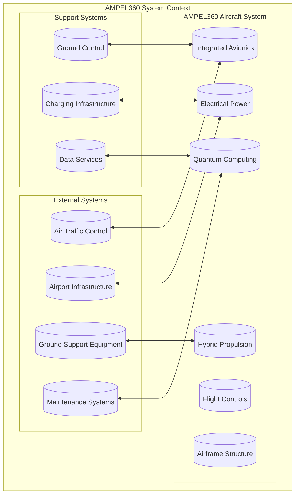

# **System Requirements Specification (SyRS)**
## **AMPEL360 - Hybrid Electric Aircraft**
### **AQUA V. Aerospace Platform**

---

**Document ID:** AQUA-V-AMPEL360-HE-SyRS-v1.0  
**Classification:** CONFIDENTIAL – PROPRIETARY  
**Date:** September 30, 2025  
**Product Line:** AMPEL360 - Advanced Mobility Platform  
**System:** Hybrid Electric Propulsion with Quantum Enhancement  
**Author:** AQUA V. Systems Engineering Team  
**Approval:** Amedeo Pelliccia, Chief Technology Officer

**Parent Document:** [AQUA-V-AMPEL360-HE-PRD-v6.0](./AMPEL360-HE-PRD-v6.0.md)

---

## **REVISION HISTORY**

| **Version** | **Date** | **Changes** | **Author** | **Review** |
|:------------|:---------|:------------|:-----------|:-----------|
| v0.1 | 2025-09-01 | Initial draft from PRD | Systems Eng | Internal |
| v0.5 | 2025-09-15 | Stakeholder review inputs | Systems Eng | Stakeholders |
| v1.0 | 2025-09-30 | Release for certification | Systems Eng | CTO |

---

## **TABLE OF CONTENTS**

1. [Introduction](#1-introduction)
2. [System Overview](#2-system-overview)
3. [System Requirements](#3-system-requirements)
   - [3.1 Performance Requirements](#31-performance-requirements)
   - [3.2 Propulsion System Requirements](#32-propulsion-system-requirements)
   - [3.3 Electrical System Requirements](#33-electrical-system-requirements)
   - [3.4 Flight Control Requirements](#34-flight-control-requirements)
   - [3.5 Quantum Computing Requirements](#35-quantum-computing-requirements)
   - [3.6 Structural Requirements](#36-structural-requirements)
   - [3.7 Environmental Requirements](#37-environmental-requirements)
   - [3.8 Safety Requirements](#38-safety-requirements)
   - [3.9 Operational Requirements](#39-operational-requirements)
   - [3.10 Maintenance Requirements](#310-maintenance-requirements)
   - [3.11 Reliability Requirements](#311-reliability-requirements)
   - [3.12 Monitoring Requirements](#312-monitoring-requirements)
4. [Interface Requirements](#4-interface-requirements)
5. [Verification Requirements](#5-verification-requirements)
6. [Requirements Traceability Matrix](#6-requirements-traceability-matrix)
7. [Appendices](#7-appendices)

---

## **1. INTRODUCTION**

### **1.1 Purpose**

This System Requirements Specification (SyRS) defines the complete set of system requirements for the AMPEL360 Hybrid Electric Aircraft. It derives from and traces to the [Product Requirements Document (PRD) v6.0](./AMPEL360-HE-PRD-v6.0.md) and establishes the technical baseline for system design, development, verification, and certification.

### **1.2 Scope**

This document covers:
- System-level requirements for the AMPEL360-E180 hybrid electric aircraft
- Interface requirements between major systems and [LRUs](./AMPEL360-HE-PRD-v6.0.md#32-lru-specifications-table)
- Verification methods and acceptance criteria
- Traceability to [product objectives](./AMPEL360-HE-PRD-v6.0.md#14-product-objectives) and [stakeholder needs](./AMPEL360-HE-PRD-v6.0.md#2-stakeholder-analysis)
- Compliance with [applicable certification standards](./AMPEL360-HE-PRD-v6.0.md#4-compliance--certification)

### **1.3 Definitions**

| **Term** | **Definition** | **Reference** |
|:---------|:--------------|:--------------|
| **BWB** | Blended Wing Body | [System Architecture](#2-system-overview) |
| **DAL** | Development Assurance Level | [PRD Section 4.3](./AMPEL360-HE-PRD-v6.0.md#43-software-development-assurance-level-dal-assignment) |
| **FODS** | Fiber Optic Distributed Sensing | [SYS-FODS-001](#sys-fods-001) |
| **LRU** | Line Replaceable Unit | [PRD Section 3.2](./AMPEL360-HE-PRD-v6.0.md#32-lru-specifications-table) |
| **MTOW** | Maximum Takeoff Weight | [SYS-PERF-005](#sys-perf-005) |
| **QCU** | Quantum Control Unit | [PRD LRU-QCU](./AMPEL360-HE-PRD-v6.0.md#lru-qcu) |
| **SHM** | Structural Health Monitoring | [SYS-FODS-002](#sys-fods-002) |

### **1.4 References**

| **Document ID** | **Title** | **Link** |
|:----------------|:----------|:---------|
| AQUA-V-AMPEL360-HE-PRD-v6.0 | Product Requirements Document | [PRD](./AMPEL360-HE-PRD-v6.0.md) |
| CS-25 Amendment 27 | Certification Specifications for Large Aeroplanes | [SYS-CERT-001](#sys-cert-001) |
| DO-178C | Software Considerations in Airborne Systems | [SYS-SW-001](#sys-sw-001) |
| DO-254 | Design Assurance Guidance for Airborne Electronic Hardware | [SYS-HW-001](#sys-hw-001) |
| DO-311A | Minimum Operational Performance Standards for Rechargeable Lithium Batteries | [SYS-BATT-007](#sys-batt-007) |
| ARP4754A | Guidelines for Development of Civil Aircraft and Systems | [SYS-DEV-001](#sys-dev-001) |
| ARP4761A | Guidelines and Methods for Conducting the Safety Assessment Process | [SYS-SAFE-001](#sys-safe-001) |

---

## **2. SYSTEM OVERVIEW**

### **2.1 System Context**

**Links:**
- External Interfaces: [Section 4](#4-interface-requirements)
- System Architecture: [PRD Section 3](./AMPEL360-HE-PRD-v6.0.md#3-system-architecture)
- Stakeholder Requirements: [PRD Section 2.2](./AMPEL360-HE-PRD-v6.0.md#22-stakeholder-requirements-traceability)

### **2.2 System Architecture**

The AMPEL360 system architecture comprises six major integrated systems:

1. **[Hybrid Propulsion System](#32-propulsion-system-requirements)** - Turbofan-electric propulsion with multiple operating modes
2. **[Electrical Power System](#33-electrical-system-requirements)** - High-voltage battery storage and distribution
3. **[Flight Control System](#34-flight-control-requirements)** - Fly-by-wire with quantum optimization
4. **[Integrated Avionics](#sys-avio-001)** - Full glass cockpit with enhanced automation
5. **[Quantum Computing System](#35-quantum-computing-requirements)** - Optimization and predictive analytics
6. **[Structural System](#36-structural-requirements)** - Composite airframe with FODS monitoring

---

## **3. SYSTEM REQUIREMENTS**

### **3.1 Performance Requirements**

#### **SYS-PERF-001** Range Capability
- **Requirement:** The system SHALL provide a minimum range of 2,500 nautical miles
- **Rationale:** Market requirement for medium-haul operations
- **Verification:** [VER-FLT-001](#ver-flt-001)
- **Traces To:** [PRD PO-002](./AMPEL360-HE-PRD-v6.0.md#po-002)
- **Allocated To:** [SYS-PROP-001](#sys-prop-001), [SYS-BATT-001](#sys-batt-001), [SYS-AERO-001](#sys-aero-001)
- **Derived Requirements:** [SYS-FUEL-001](#sys-fuel-001), [SYS-WEIGHT-001](#sys-weight-001)

#### **SYS-PERF-002** Fuel Efficiency
- **Requirement:** The system SHALL achieve fuel burn reduction ≥25% compared to A320neo
- **Rationale:** Economic and environmental objectives
- **Verification:** [VER-FLT-002](#ver-flt-002)
- **Traces To:** [PRD PO-001](./AMPEL360-HE-PRD-v6.0.md#po-001)
- **Allocated To:** [SYS-PROP-002](#sys-prop-002), [SYS-QCU-004](#sys-qcu-004), [SYS-EMS-001](#sys-ems-001)
- **Related:** [SYS-EMIS-001](#sys-emis-001)

#### **SYS-PERF-003** Payload Capacity
- **Requirement:** The system SHALL accommodate 180 passengers in 2-class configuration
- **Rationale:** Market segment requirement
- **Verification:** [VER-GND-001](#ver-gnd-001)
- **Traces To:** [PRD SH-AIRLINES](./AMPEL360-HE-PRD-v6.0.md#sh-airlines)
- **Allocated To:** [SYS-STRUCT-001](#sys-struct-001), [SYS-INT-001](#sys-int-001)
- **Interface:** [IF-CAB-001](#if-cab-001)

#### **SYS-PERF-004** Cruise Performance
- **Requirement:** The system SHALL maintain cruise speed of Mach 0.78-0.82
- **Rationale:** Competitive performance requirement
- **Verification:** [VER-FLT-003](#ver-flt-003)
- **Traces To:** [PRD Stakeholder Requirements](./AMPEL360-HE-PRD-v6.0.md#22-stakeholder-requirements-traceability)
- **Allocated To:** [SYS-AERO-002](#sys-aero-002), [SYS-PROP-003](#sys-prop-003)

#### **SYS-PERF-005** Maximum Takeoff Weight
- **Requirement:** The system SHALL NOT exceed MTOW of 75,000 kg
- **Rationale:** Structural and certification constraints
- **Verification:** [VER-GND-002](#ver-gnd-002)
- **Traces To:** [PRD System Architecture](./AMPEL360-HE-PRD-v6.0.md#31-system-decomposition--lrus)
- **Allocated To:** [SYS-WEIGHT-001](#sys-weight-001)
- **Related:** [SYS-STRUCT-002](#sys-struct-002)

#### **SYS-PERF-006** Service Ceiling
- **Requirement:** The system SHALL operate up to FL410 (41,000 feet)
- **Rationale:** Operational flexibility and efficiency
- **Verification:** [VER-FLT-004](#ver-flt-004)
- **Traces To:** Operational requirements
- **Allocated To:** [SYS-PRESS-001](#sys-press-001), [SYS-PROP-004](#sys-prop-004)

---

### **3.2 Propulsion System Requirements**

#### **SYS-PROP-001** Hybrid Propulsion Architecture
- **Requirement:** The propulsion system SHALL provide hybrid turbofan-electric operation with seamless mode transitions
- **Rationale:** Core technology differentiation
- **Verification:** [VER-GND-003](#ver-gnd-003), [VER-FLT-005](#ver-flt-005)
- **Traces To:** [PRD UC-002](./AMPEL360-HE-PRD-v6.0.md#uc-002)
- **Allocated To:** [PRD LRU-TF180](./AMPEL360-HE-PRD-v6.0.md#lru-tf180), [PRD LRU-EM10](./AMPEL360-HE-PRD-v6.0.md#lru-em10)
- **Interface:** [IF-PROP-001](#if-prop-001)
- **Safety:** [SYS-SAFE-002](#sys-safe-002)

#### **SYS-PROP-002** Electric Motor Power
- **Requirement:** Each electric motor SHALL provide 10MW continuous power
- **Rationale:** Required for electric taxi and boost
- **Verification:** [VER-LAB-001](#ver-lab-001)
- **Traces To:** [PRD LRU-EM10](./AMPEL360-HE-PRD-v6.0.md#lru-em10)
- **Allocated To:** Motor subsystem
- **Cooling:** [SYS-COOL-001](#sys-cool-001)
- **Related:** [SYS-INV-001](#sys-inv-001)

#### **SYS-PROP-003** Electric Taxi Capability
- **Requirement:** The propulsion system SHALL enable 100% electric ground operations for up to 30 minutes
- **Rationale:** Zero emissions ground operations
- **Verification:** [VER-GND-004](#ver-gnd-004)
- **Traces To:** [PRD PO-006](./AMPEL360-HE-PRD-v6.0.md#po-006), [PRD UC-001](./AMPEL360-HE-PRD-v6.0.md#uc-001)
- **Allocated To:** [SYS-BATT-002](#sys-batt-002), [SYS-EMS-002](#sys-ems-002)
- **Operational:** [SYS-OPS-002](#sys-ops-002)

#### **SYS-PROP-004** Thrust Requirements
- **Requirement:** The propulsion system SHALL provide total thrust of 2×120kN at sea level ISA
- **Rationale:** Performance requirements
- **Verification:** [VER-GND-005](#ver-gnd-005)
- **Traces To:** [SYS-PERF-004](#sys-perf-004), [SYS-PERF-006](#sys-perf-006)
- **Allocated To:** Turbofan subsystem
- **Control:** [SYS-FADEC-001](#sys-fadec-001)

#### **SYS-PROP-005** Mode Transition Time
- **Requirement:** Power source transitions SHALL complete within 1 second
- **Rationale:** Operational safety and smoothness
- **Verification:** [VER-LAB-002](#ver-lab-002)
- **Traces To:** [PRD UC-002](./AMPEL360-HE-PRD-v6.0.md#uc-002)
- **Allocated To:** [SYS-EMS-003](#sys-ems-003)
- **Safety:** [SYS-SAFE-003](#sys-safe-003)

---

### **3.3 Electrical System Requirements**

#### **SYS-BATT-001** Battery Capacity
- **Requirement:** The battery system SHALL provide minimum 6MWh total energy storage
- **Rationale:** Range and electric operation requirements
- **Verification:** [VER-LAB-003](#ver-lab-003)
- **Traces To:** [PRD PO-002](./AMPEL360-HE-PRD-v6.0.md#po-002), [PRD LRU-BATT](./AMPEL360-HE-PRD-v6.0.md#lru-batt)
- **Allocated To:** Battery modules (24×250kWh)
- **Management:** [SYS-BMS-001](#sys-bms-001)
- **Risk:** [PRD R-001](./AMPEL360-HE-PRD-v6.0.md#risk-001)

#### **SYS-BATT-002** Electric Taxi Energy
- **Requirement:** The battery system SHALL provide ≥200kWh for ground operations
- **Rationale:** 30-minute electric taxi requirement
- **Verification:** [VER-GND-006](#ver-gnd-006)
- **Traces To:** [SYS-PROP-003](#sys-prop-003), [PRD UC-001](./AMPEL360-HE-PRD-v6.0.md#uc-001)
- **Allocated To:** Dedicated battery section
- **Interface:** [IF-BATT-001](#if-batt-001)

#### **SYS-BATT-003** Charge Rate
- **Requirement:** The battery system SHALL accept 2MW charging power
- **Rationale:** Quick turnaround requirement
- **Verification:** [VER-LAB-004](#ver-lab-004)
- **Traces To:** [PRD PO-005](./AMPEL360-HE-PRD-v6.0.md#po-005)
- **Allocated To:** Charging interface
- **Protection:** [SYS-BMS-002](#sys-bms-002)
- **Interface:** [IF-EXT-001](#if-ext-001)

#### **SYS-BATT-004** Battery Safety
- **Requirement:** The battery system SHALL prevent thermal runaway propagation between cells
- **Rationale:** Safety certification requirement
- **Verification:** [VER-TEST-001](#ver-test-001)
- **Traces To:** [PRD STD-BATTERY](./AMPEL360-HE-PRD-v6.0.md#std-battery)
- **Allocated To:** Battery containment design
- **Standard:** DO-311A compliance
- **Related:** [SYS-SAFE-004](#sys-safe-004)

#### **SYS-BATT-005** Energy Density
- **Requirement:** Battery cells SHALL achieve ≥400 Wh/kg at pack level
- **Rationale:** Weight constraints
- **Verification:** [VER-LAB-005](#ver-lab-005)
- **Traces To:** [SYS-WEIGHT-001](#sys-weight-001)
- **Allocated To:** Cell technology
- **Risk:** [PRD R-001](./AMPEL360-HE-PRD-v6.0.md#risk-001)

#### **SYS-BATT-006** Hot Swap Capability
- **Requirement:** The battery system SHALL support module replacement within 15 minutes
- **Rationale:** Quick turnaround operations
- **Verification:** [VER-DEMO-001](#ver-demo-001)
- **Traces To:** [PRD PO-005](./AMPEL360-HE-PRD-v6.0.md#po-005), [PRD UC-003](./AMPEL360-HE-PRD-v6.0.md#uc-003)
- **Allocated To:** Battery mechanical interface
- **Procedure:** [SYS-MAIN-003](#sys-main-003)

#### **SYS-BATT-007** Certification Compliance
- **Requirement:** The battery system SHALL comply with RTCA DO-311A
- **Rationale:** Certification requirement
- **Verification:** [VER-CERT-001](#ver-cert-001)
- **Traces To:** [PRD STD-BATTERY](./AMPEL360-HE-PRD-v6.0.md#std-battery)
- **Allocated To:** Battery system design
- **Testing:** [VER-TEST-002](#ver-test-002)

---

### **3.4 Flight Control Requirements**

#### **SYS-FCS-001** Fly-By-Wire Architecture
- **Requirement:** The flight control system SHALL implement full-authority fly-by-wire control
- **Rationale:** Safety and performance optimization
- **Verification:** [VER-SIM-001](#ver-sim-001), [VER-FLT-006](#ver-flt-006)
- **Traces To:** [PRD System Architecture](./AMPEL360-HE-PRD-v6.0.md#31-system-decomposition--lrus)
- **Allocated To:** Flight control computers
- **DAL:** [PRD DAL-FCS](./AMPEL360-HE-PRD-v6.0.md#dal-fcs)
- **Redundancy:** [SYS-FCS-002](#sys-fcs-002)

#### **SYS-FCS-002** Control Redundancy
- **Requirement:** The FCS SHALL provide triple-redundant control channels with dissimilar processors
- **Rationale:** DAL A safety requirement
- **Verification:** [VER-TEST-003](#ver-test-003)
- **Traces To:** [SYS-SAFE-001](#sys-safe-001)
- **Allocated To:** FCS architecture
- **Voting:** [SYS-FCS-003](#sys-fcs-003)

#### **SYS-FCS-003** Voting Logic
- **Requirement:** The FCS SHALL implement 2-out-of-3 voting for critical functions
- **Rationale:** Fault tolerance
- **Verification:** [VER-SIM-002](#ver-sim-002)
- **Traces To:** [SYS-FCS-002](#sys-fcs-002)
- **Allocated To:** FCS software
- **Monitoring:** [SYS-MON-001](#sys-mon-001)

#### **SYS-FCS-004** Envelope Protection
- **Requirement:** The FCS SHALL provide comprehensive flight envelope protection
- **Rationale:** Safety enhancement
- **Verification:** [VER-SIM-003](#ver-sim-003), [VER-FLT-007](#ver-flt-007)
- **Traces To:** Safety requirements
- **Allocated To:** Control laws
- **Features:** Stall, overspeed, bank angle, pitch limits

#### **SYS-FCS-005** Manual Reversion
- **Requirement:** The FCS SHALL provide direct mechanical backup for pitch and roll control
- **Rationale:** Ultimate safety backup
- **Verification:** [VER-GND-007](#ver-gnd-007)
- **Traces To:** Certification requirements
- **Allocated To:** Mechanical linkages
- **Activation:** Automatic on total FCS failure

---

### **3.5 Quantum Computing Requirements**

#### **SYS-QCU-001** Quantum Processing Capability
- **Requirement:** The QCU SHALL provide 50-100 logical qubits for optimization
- **Rationale:** Complex optimization requirements
- **Verification:** [VER-LAB-006](#ver-lab-006)
- **Traces To:** [PRD LRU-QCU](./AMPEL360-HE-PRD-v6.0.md#lru-qcu)
- **Allocated To:** Quantum processor
- **Cooling:** [SYS-QCU-002](#sys-qcu-002)
- **Risk:** [PRD R-002](./AMPEL360-HE-PRD-v6.0.md#risk-002)

#### **SYS-QCU-002** Quantum System Cooling
- **Requirement:** The QCU cooling system SHALL maintain operating temperature at 10mK
- **Rationale:** Quantum coherence requirement
- **Verification:** [VER-LAB-007](#ver-lab-007)
- **Traces To:** [SYS-QCU-001](#sys-qcu-001)
- **Allocated To:** Cryogenic system
- **Power:** 2kW maximum

#### **SYS-QCU-003** Classical Fallback
- **Requirement:** The QCU SHALL provide classical optimization fallback within 100ms
- **Rationale:** Reliability requirement
- **Verification:** [VER-TEST-004](#ver-test-004)
- **Traces To:** [PRD R-002](./AMPEL360-HE-PRD-v6.0.md#risk-002)
- **Allocated To:** QCU software
- **Interface:** [IF-QCU-001](#if-qcu-001)

#### **SYS-QCU-004** Route Optimization
- **Requirement:** The QCU SHALL optimize flight routes considering weather, traffic, and fuel
- **Rationale:** Efficiency improvement
- **Verification:** [VER-SIM-004](#ver-sim-004)
- **Traces To:** [PRD PO-001](./AMPEL360-HE-PRD-v6.0.md#po-001), [SYS-PERF-002](#sys-perf-002)
- **Allocated To:** Quantum algorithms
- **Update Rate:** Every 60 seconds

#### **SYS-QCU-005** Predictive Maintenance
- **Requirement:** The QCU SHALL predict component failures 500+ flight hours in advance
- **Rationale:** Maintenance optimization
- **Verification:** [VER-DATA-001](#ver-data-001)
- **Traces To:** [PRD PO-008](./AMPEL360-HE-PRD-v6.0.md#po-008), [PRD UC-004](./AMPEL360-HE-PRD-v6.0.md#uc-004)
- **Allocated To:** QML algorithms
- **Data Source:** [SYS-FODS-001](#sys-fods-001)

#### **SYS-QCU-006** DAL Classification
- **Requirement:** Quantum optimization functions SHALL be classified as DAL D (advisory)
- **Rationale:** Certification strategy
- **Verification:** [VER-CERT-002](#ver-cert-002)
- **Traces To:** [PRD DAL-QUANTUM-OPT](./AMPEL360-HE-PRD-v6.0.md#dal-quantum-opt)
- **Allocated To:** System architecture
- **Evolution:** Progressive credit increase

---

### **3.6 Structural Requirements**

#### **SYS-STRUCT-001** Structural Design
- **Requirement:** The airframe SHALL be composite construction with 60% carbon fiber by weight
- **Rationale:** Weight optimization
- **Verification:** [VER-TEST-005](#ver-test-005)
- **Traces To:** [SYS-WEIGHT-001](#sys-weight-001)
- **Allocated To:** Primary structure
- **Manufacturing:** [SYS-MFG-001](#sys-mfg-001)

#### **SYS-STRUCT-002** Load Capacity
- **Requirement:** The structure SHALL withstand limit loads with no permanent deformation
- **Rationale:** Certification requirement
- **Verification:** [VER-TEST-006](#ver-test-006)
- **Traces To:** CS-25.305
- **Allocated To:** All structural components
- **Factor of Safety:** 1.5 ultimate

#### **SYS-STRUCT-003** Fatigue Life
- **Requirement:** The structure SHALL achieve 60,000 flight cycles design life
- **Rationale:** Economic service life
- **Verification:** [VER-TEST-007](#ver-test-007)
- **Traces To:** Operational requirements
- **Allocated To:** Primary structure
- **Monitoring:** [SYS-FODS-002](#sys-fods-002)

#### **SYS-STRUCT-004** Damage Tolerance
- **Requirement:** The structure SHALL tolerate damage per CS-25.571
- **Rationale:** Safety requirement
- **Verification:** [VER-TEST-008](#ver-test-008)
- **Traces To:** Certification requirements
- **Allocated To:** Critical structure
- **Inspection:** [SYS-MAIN-004](#sys-main-004)

---

### **3.7 Environmental Requirements**

#### **SYS-EMIS-001** CO₂ Emissions
- **Requirement:** The system SHALL reduce CO₂ emissions by ≥30% versus A320neo
- **Rationale:** Environmental commitment
- **Verification:** [VER-FLT-008](#ver-flt-008)
- **Traces To:** [PRD PO-003](./AMPEL360-HE-PRD-v6.0.md#po-003)
- **Allocated To:** [SYS-PROP-001](#sys-prop-001)
- **Measurement:** Per passenger-km

#### **SYS-EMIS-002** Zero Ground Emissions
- **Requirement:** The system SHALL produce zero emissions during ground operations
- **Rationale:** Airport environmental requirements
- **Verification:** [VER-GND-008](#ver-gnd-008)
- **Traces To:** [PRD PO-003](./AMPEL360-HE-PRD-v6.0.md#po-003), [SYS-PROP-003](#sys-prop-003)
- **Allocated To:** Electric taxi system
- **Mode:** [SYS-OPS-002](#sys-ops-002)

#### **SYS-NOISE-001** External Noise
- **Requirement:** The system SHALL achieve ≥15dB cumulative noise reduction versus Stage 4
- **Rationale:** Community acceptance
- **Verification:** [VER-TEST-009](#ver-test-009)
- **Traces To:** [PRD PO-004](./AMPEL360-HE-PRD-v6.0.md#po-004)
- **Allocated To:** Propulsion, aerodynamics
- **Standard:** ICAO Annex 16

#### **SYS-NOISE-002** Cabin Noise
- **Requirement:** Cabin noise SHALL NOT exceed 75 dB(A) in cruise
- **Rationale:** Passenger comfort
- **Verification:** [VER-FLT-009](#ver-flt-009)
- **Traces To:** [PRD PO-004](./AMPEL360-HE-PRD-v6.0.md#po-004)
- **Allocated To:** Acoustic treatment
- **Measurement:** At passenger ear level

---

### **3.8 Safety Requirements**

#### **SYS-SAFE-001** System Safety Assessment
- **Requirement:** The system SHALL comply with ARP4761A safety assessment process
- **Rationale:** Certification requirement
- **Verification:** [VER-CERT-003](#ver-cert-003)
- **Traces To:** [PRD Certification](./AMPEL360-HE-PRD-v6.0.md#4-compliance--certification)
- **Allocated To:** All systems
- **Deliverables:** FHA, PSSA, SSA, CCA

#### **SYS-SAFE-002** Catastrophic Failure Rate
- **Requirement:** Catastrophic failure conditions SHALL have probability <10⁻⁹ per flight hour
- **Rationale:** Safety regulation
- **Verification:** [VER-ANALYSIS-001](#ver-analysis-001)
- **Traces To:** CS-25.1309
- **Allocated To:** Critical systems
- **Analysis:** [FTA/FMEA](#sys-safe-006)

#### **SYS-SAFE-003** Hazardous Failure Rate
- **Requirement:** Hazardous failure conditions SHALL have probability <10⁻⁷ per flight hour
- **Rationale:** Safety regulation
- **Verification:** [VER-ANALYSIS-002](#ver-analysis-002)
- **Traces To:** CS-25.1309
- **Allocated To:** Hazardous systems
- **Mitigation:** [SYS-SAFE-007](#sys-safe-007)

#### **SYS-SAFE-004** Battery Fire Protection
- **Requirement:** The system SHALL detect and suppress battery thermal events within 5 seconds
- **Rationale:** Fire safety
- **Verification:** [VER-TEST-010](#ver-test-010)
- **Traces To:** [SYS-BATT-004](#sys-batt-004)
- **Allocated To:** Fire protection system
- **Detection:** [SYS-MON-002](#sys-mon-002)

#### **SYS-SAFE-005** Emergency Power
- **Requirement:** The system SHALL provide 30 minutes emergency power for essential systems
- **Rationale:** Emergency operations
- **Verification:** [VER-TEST-011](#ver-test-011)
- **Traces To:** [PRD UC-005](./AMPEL360-HE-PRD-v6.0.md#uc-005)
- **Allocated To:** Emergency battery, RAT
- **Loads:** [SYS-ELEC-001](#sys-elec-001)

#### **SYS-SAFE-006** Safety Analysis
- **Requirement:** Safety analysis SHALL include FTA, FMEA, and CCA
- **Rationale:** Comprehensive safety assessment
- **Verification:** [VER-REVIEW-001](#ver-review-001)
- **Traces To:** [SYS-SAFE-001](#sys-safe-001)
- **Allocated To:** Safety engineering
- **Tools:** Model-based analysis

#### **SYS-SAFE-007** Risk Mitigation
- **Requirement:** All identified hazards SHALL have defined mitigation strategies
- **Rationale:** Risk management
- **Verification:** [VER-REVIEW-002](#ver-review-002)
- **Traces To:** [SYS-SAFE-003](#sys-safe-003)
- **Allocated To:** System design
- **Tracking:** Hazard log

---

### **3.9 Operational Requirements**

#### **SYS-OPS-001** Turnaround Time
- **Requirement:** The system SHALL enable ≤35 minute turnaround
- **Rationale:** Airline efficiency
- **Verification:** [VER-DEMO-002](#ver-demo-002)
- **Traces To:** [PRD PO-005](./AMPEL360-HE-PRD-v6.0.md#po-005)
- **Allocated To:** [SYS-BATT-003](#sys-batt-003), [SYS-BATT-006](#sys-batt-006)
- **Procedures:** Ground operations manual

#### **SYS-OPS-002** Electric Taxi Mode
- **Requirement:** The system SHALL provide pilot-selectable electric taxi mode
- **Rationale:** Operational flexibility
- **Verification:** [VER-GND-009](#ver-gnd-009)
- **Traces To:** [PRD PO-006](./AMPEL360-HE-PRD-v6.0.md#po-006), [SYS-PROP-003](#sys-prop-003)
- **Allocated To:** Mode control system
- **Interface:** [IF-PILOT-001](#if-pilot-001)

#### **SYS-OPS-003** Gate Compatibility
- **Requirement:** The system SHALL be compatible with Code C gates
- **Rationale:** Airport infrastructure
- **Verification:** [VER-GND-010](#ver-gnd-010)
- **Traces To:** [PRD SH-AIRPORTS](./AMPEL360-HE-PRD-v6.0.md#sh-airports)
- **Allocated To:** Aircraft dimensions
- **Wingspan:** ≤36m

#### **SYS-OPS-004** All-Weather Operations
- **Requirement:** The system SHALL support CAT IIIb operations
- **Rationale:** Operational capability
- **Verification:** [VER-FLT-010](#ver-flt-010)
- **Traces To:** Airline requirements
- **Allocated To:** Avionics, flight controls
- **Autoland:** [SYS-AUTO-001](#sys-auto-001)

#### **SYS-OPS-005** Dispatch Reliability
- **Requirement:** The system SHALL achieve ≥98% dispatch reliability
- **Rationale:** Airline economics
- **Verification:** [VER-OPS-001](#ver-ops-001)
- **Traces To:** [PRD PO-007](./AMPEL360-HE-PRD-v6.0.md#po-007)
- **Allocated To:** All systems
- **Metric:** 12-month rolling average

---

### **3.10 Maintenance Requirements**

#### **SYS-MAIN-001** Maintenance Intervals
- **Requirement:** A-check intervals SHALL be ≥750 flight hours
- **Rationale:** Maintenance efficiency
- **Verification:** [VER-ANALYSIS-003](#ver-analysis-003)
- **Traces To:** [PRD SH-MRO](./AMPEL360-HE-PRD-v6.0.md#sh-mro)
- **Allocated To:** System design
- **Program:** MSG-3 based

#### **SYS-MAIN-002** Maintenance Cost
- **Requirement:** Direct maintenance costs SHALL be ≥20% lower than A320neo
- **Rationale:** Operating economics
- **Verification:** [VER-ANALYSIS-004](#ver-analysis-004)
- **Traces To:** [PRD PO-008](./AMPEL360-HE-PRD-v6.0.md#po-008)
- **Allocated To:** System reliability
- **Enabler:** [SYS-FODS-004](#sys-fods-004)

#### **SYS-MAIN-003** Battery Maintenance
- **Requirement:** Battery modules SHALL be replaceable within 15 minutes
- **Rationale:** Quick turnaround
- **Verification:** [VER-DEMO-003](#ver-demo-003)
- **Traces To:** [SYS-BATT-006](#sys-batt-006)
- **Allocated To:** Battery interface design
- **Tools:** Standard GSE

#### **SYS-MAIN-004** Structural Inspection
- **Requirement:** Structure SHALL require no scheduled inspections before 10,000 cycles
- **Rationale:** Maintenance optimization
- **Verification:** [VER-ANALYSIS-005](#ver-analysis-005)
- **Traces To:** [SYS-STRUCT-004](#sys-struct-004)
- **Allocated To:** Damage tolerance design
- **Enabler:** [SYS-FODS-002](#sys-fods-002)

#### **SYS-MAIN-005** Line Replaceable Units
- **Requirement:** All avionics and major components SHALL be LRUs
- **Rationale:** Maintenance efficiency
- **Verification:** [VER-DESIGN-001](#ver-design-001)
- **Traces To:** [PRD Section 3.2](./AMPEL360-HE-PRD-v6.0.md#32-lru-specifications-table)
- **Allocated To:** System architecture
- **MTTR:** <30 minutes

---

### **3.11 Reliability Requirements**

#### **SYS-REL-001** System Reliability
- **Requirement:** The system SHALL achieve MTBF >3,000 flight hours
- **Rationale:** Operational reliability
- **Verification:** [VER-DATA-002](#ver-data-002)
- **Traces To:** [PRD PO-007](./AMPEL360-HE-PRD-v6.0.md#po-007)
- **Allocated To:** All systems
- **Tracking:** Reliability database

#### **SYS-REL-002** Propulsion Reliability
- **Requirement:** Propulsion system SHALL achieve IFSD rate <0.02 per 1,000 hours
- **Rationale:** Safety and dispatch reliability
- **Verification:** [VER-DATA-003](#ver-data-003)
- **Traces To:** [PRD PO-007](./AMPEL360-HE-PRD-v6.0.md#po-007)
- **Allocated To:** Propulsion system
- **Monitoring:** [SYS-MON-003](#sys-mon-003)

#### **SYS-REL-003** No Fault Found Rate
- **Requirement:** NFF rate SHALL be <15% of removals
- **Rationale:** Maintenance efficiency
- **Verification:** [VER-DATA-004](#ver-data-004)
- **Traces To:** [PRD SH-MRO](./AMPEL360-HE-PRD-v6.0.md#sh-mro)
- **Allocated To:** Diagnostic systems
- **Enabler:** [SYS-DIAG-001](#sys-diag-001)

---

### **3.12 Monitoring Requirements**

#### **SYS-MON-001** System Health Monitoring
- **Requirement:** The system SHALL continuously monitor health of all critical systems
- **Rationale:** Safety and maintenance
- **Verification:** [VER-TEST-012](#ver-test-012)
- **Traces To:** [SYS-FCS-003](#sys-fcs-003)
- **Allocated To:** Monitoring system
- **Parameters:** >10,000

#### **SYS-MON-002** Fire Detection
- **Requirement:** Fire detection SHALL respond within 1 second
- **Rationale:** Safety critical
- **Verification:** [VER-TEST-013](#ver-test-013)
- **Traces To:** [SYS-SAFE-004](#sys-safe-004)
- **Allocated To:** Fire detection system
- **False Alarm Rate:** <0.01%

#### **SYS-MON-003** Engine Monitoring
- **Requirement:** Engine parameters SHALL be monitored at 100 Hz minimum
- **Rationale:** Performance and safety
- **Verification:** [VER-TEST-014](#ver-test-014)
- **Traces To:** [SYS-REL-002](#sys-rel-002)
- **Allocated To:** FADEC system
- **Parameters:** EGT, N1, N2, vibration

---

## **3.13 Additional System Requirements**

### **3.13.1 Fiber Optic Distributed Sensing (FODS) Requirements**

#### **SYS-FODS-001** FODS Coverage
- **Requirement:** FODS SHALL provide 100% coverage of primary structure
- **Rationale:** Comprehensive structural monitoring
- **Verification:** [VER-INSTALL-001](#ver-install-001)
- **Traces To:** [PRD FODS Integration](./AMPEL360-HE-PRD-v6.0.md#52-test-campaign-phases)
- **Allocated To:** FODS network
- **Fiber Length:** >10km per aircraft
- **Related:** [SYS-QCU-005](#sys-qcu-005)

#### **SYS-FODS-002** Structural Health Monitoring
- **Requirement:** FODS SHALL detect strain changes of ±1 microstrain
- **Rationale:** Early damage detection
- **Verification:** [VER-LAB-008](#ver-lab-008)
- **Traces To:** [SYS-STRUCT-003](#sys-struct-003)
- **Allocated To:** FODS interrogators
- **Spatial Resolution:** 5mm
- **Enables:** [SYS-MAIN-004](#sys-main-004)

#### **SYS-FODS-003** Temperature Monitoring
- **Requirement:** FODS SHALL measure temperature with ±0.1°C accuracy
- **Rationale:** Thermal management
- **Verification:** [VER-LAB-009](#ver-lab-009)
- **Traces To:** System thermal requirements
- **Allocated To:** FODS system
- **Range:** -60°C to +150°C

#### **SYS-FODS-004** Predictive Maintenance Data
- **Requirement:** FODS SHALL provide data for predictive maintenance algorithms
- **Rationale:** Maintenance optimization
- **Verification:** [VER-DATA-005](#ver-data-005)
- **Traces To:** [PRD PO-008](./AMPEL360-HE-PRD-v6.0.md#po-008), [SYS-MAIN-002](#sys-main-002)
- **Allocated To:** FODS data processing
- **Update Rate:** 10 Hz
- **Storage:** 72 hours circular buffer

### **3.13.2 Energy Management System Requirements**

#### **SYS-EMS-001** Energy Optimization
- **Requirement:** EMS SHALL optimize energy distribution for minimum fuel burn
- **Rationale:** Efficiency objective
- **Verification:** [VER-SIM-005](#ver-sim-005)
- **Traces To:** [PRD PO-001](./AMPEL360-HE-PRD-v6.0.md#po-001), [SYS-PERF-002](#sys-perf-002)
- **Allocated To:** [PRD LRU-EMS](./AMPEL360-HE-PRD-v6.0.md#lru-ems)
- **Algorithm:** Quantum-enhanced optimization

#### **SYS-EMS-002** Power Distribution Control
- **Requirement:** EMS SHALL manage power distribution between turbofan and electric sources
- **Rationale:** Hybrid operation
- **Verification:** [VER-TEST-015](#ver-test-015)
- **Traces To:** [SYS-PROP-003](#sys-prop-003)
- **Allocated To:** EMS controller
- **Response Time:** <100ms

#### **SYS-EMS-003** Mode Transition Management
- **Requirement:** EMS SHALL execute seamless power mode transitions
- **Rationale:** Operational smoothness
- **Verification:** [VER-TEST-016](#ver-test-016)
- **Traces To:** [SYS-PROP-005](#sys-prop-005)
- **Allocated To:** EMS software
- **Transition Time:** <1 second

### **3.13.3 Weight and Balance Requirements**

#### **SYS-WEIGHT-001** Operating Empty Weight
- **Requirement:** OEW SHALL NOT exceed 42,000 kg
- **Rationale:** Performance targets
- **Verification:** [VER-GND-011](#ver-gnd-011)
- **Traces To:** [SYS-PERF-001](#sys-perf-001), [SYS-PERF-005](#sys-perf-005)
- **Allocated To:** All systems
- **Breakdown:** Structure 45%, Systems 30%, Propulsion 25%

#### **SYS-CG-001** Center of Gravity Range
- **Requirement:** CG range SHALL be 15-35% MAC
- **Rationale:** Stability and control
- **Verification:** [VER-ANALYSIS-006](#ver-analysis-006)
- **Traces To:** Flight characteristics
- **Allocated To:** Configuration design
- **Management:** Automated fuel transfer

### **3.13.4 Additional Subsystem Requirements**

#### **SYS-FADEC-001** Engine Control
- **Requirement:** FADEC++ SHALL provide full-authority digital engine control
- **Rationale:** Engine optimization
- **Verification:** [VER-TEST-017](#ver-test-017)
- **Traces To:** [SYS-PROP-004](#sys-prop-004)
- **Allocated To:** [PRD LRU-FADEC](./AMPEL360-HE-PRD-v6.0.md#lru-fadec)
- **DAL:** A

#### **SYS-BMS-001** Battery Management
- **Requirement:** BMS SHALL monitor and balance all battery cells
- **Rationale:** Battery safety and life
- **Verification:** [VER-TEST-018](#ver-test-018)
- **Traces To:** [SYS-BATT-001](#sys-batt-001)
- **Allocated To:** [PRD LRU-BMS](./AMPEL360-HE-PRD-v6.0.md#lru-bms)
- **Cell Voltage Accuracy:** ±5mV

#### **SYS-BMS-002** Charge Protection
- **Requirement:** BMS SHALL prevent overcharge and overdischarge conditions
- **Rationale:** Battery safety
- **Verification:** [VER-TEST-019](#ver-test-019)
- **Traces To:** [SYS-BATT-003](#sys-batt-003)
- **Allocated To:** BMS protection circuits
- **Response Time:** <10ms

#### **SYS-INV-001** Power Inversion
- **Requirement:** Inverter SHALL convert DC to 3-phase AC with >98% efficiency
- **Rationale:** Power efficiency
- **Verification:** [VER-LAB-010](#ver-lab-010)
- **Traces To:** [SYS-PROP-002](#sys-prop-002)
- **Allocated To:** [PRD LRU-INV](./AMPEL360-HE-PRD-v6.0.md#lru-inv)
- **Power Rating:** 12MW

#### **SYS-COOL-001** Thermal Management
- **Requirement:** Cooling system SHALL maintain component temperatures within limits
- **Rationale:** System reliability
- **Verification:** [VER-TEST-020](#ver-test-020)
- **Traces To:** [SYS-PROP-002](#sys-prop-002)
- **Allocated To:** Cooling unit LRU
- **Capacity:** 500kW heat rejection

---

## **4. INTERFACE REQUIREMENTS**

### **4.1 Internal Interfaces**

#### **IF-PROP-001** Propulsion System Interface
- **Requirement:** Propulsion interface SHALL support hybrid mode control signals
- **Source:** [SYS-PROP-001](#sys-prop-001)
- **Destination:** EMS, FADEC
- **Protocol:** ARINC 429 + MIL-1553
- **Data Rate:** 100 Hz
- **Verification:** [VER-INT-001](#ver-int-001)

#### **IF-BATT-001** Battery System Interface
- **Requirement:** Battery interface SHALL provide power and status data
- **Source:** [SYS-BATT-002](#sys-batt-002)
- **Destination:** EMS, BMS
- **Protocol:** CAN bus + High-voltage DC
- **Voltage:** 800VDC nominal
- **Verification:** [VER-INT-002](#ver-int-002)

#### **IF-QCU-001** Quantum Computing Interface
- **Requirement:** QCU interface SHALL exchange optimization data
- **Source:** [SYS-QCU-003](#sys-qcu-003)
- **Destination:** FMS, EMS
- **Protocol:** Ethernet + SpaceWire
- **Bandwidth:** 1 Gbps
- **Verification:** [VER-INT-003](#ver-int-003)

#### **IF-PILOT-001** Pilot Interface
- **Requirement:** Pilot interface SHALL provide mode selection and status
- **Source:** [SYS-OPS-002](#sys-ops-002)
- **Destination:** Flight deck displays
- **Protocol:** ARINC 661
- **Update Rate:** 20 Hz
- **Verification:** [VER-HMI-001](#ver-hmi-001)

#### **IF-CAB-001** Cabin Interface
- **Requirement:** Cabin systems interface SHALL support passenger services
- **Source:** [SYS-PERF-003](#sys-perf-003)
- **Destination:** Cabin management system
- **Protocol:** Ethernet
- **Services:** Power, data, environmental
- **Verification:** [VER-INT-004](#ver-int-004)

### **4.2 External Interfaces**

#### **IF-EXT-001** Charging Interface
- **Requirement:** External charging interface SHALL accept 2MW power
- **Source:** [SYS-BATT-003](#sys-batt-003)
- **Standard:** SAE J3068
- **Connector:** CCS Type 2
- **Communication:** ISO 15118
- **Verification:** [VER-INT-005](#ver-int-005)

#### **IF-EXT-002** Ground Support Interface
- **Requirement:** GSE interface SHALL support standard equipment
- **Source:** [SYS-OPS-003](#sys-ops-003)
- **Standards:** ISO 7718, AHM 920
- **Services:** Power, pneumatic, hydraulic
- **Verification:** [VER-INT-006](#ver-int-006)

#### **IF-EXT-003** Data Link Interface
- **Requirement:** Data link SHALL support ACARS and ADS-B
- **Source:** Operational requirements
- **Protocols:** ARINC 633, DO-260B
- **Frequency:** VHF, L-band
- **Verification:** [VER-INT-007](#ver-int-007)

---

## **5. VERIFICATION REQUIREMENTS**

### **5.1 Test Requirements**

#### **VER-FLT-001** Range Flight Test
- **Objective:** Verify range capability
- **Method:** Flight test
- **Success Criteria:** Achieve 2,500nm range
- **Verifies:** [SYS-PERF-001](#sys-perf-001)
- **Phase:** Certification testing

#### **VER-FLT-002** Fuel Efficiency Test
- **Objective:** Verify fuel burn reduction
- **Method:** Comparative flight test
- **Success Criteria:** ≥25% reduction vs A320neo
- **Verifies:** [SYS-PERF-002](#sys-perf-002)
- **Phase:** Performance validation

#### **VER-GND-001** Payload Test
- **Objective:** Verify passenger capacity
- **Method:** Ground test with ballast
- **Success Criteria:** 180 passenger configuration
- **Verifies:** [SYS-PERF-003](#sys-perf-003)
- **Phase:** Ground testing

#### **VER-LAB-001** Motor Power Test
- **Objective:** Verify electric motor power
- **Method:** Laboratory dynamometer test
- **Success Criteria:** 10MW continuous power
- **Verifies:** [SYS-PROP-002](#sys-prop-002)
- **Phase:** Component testing

#### **VER-TEST-001** Battery Safety Test
- **Objective:** Verify thermal runaway containment
- **Method:** Abuse testing per DO-311A
- **Success Criteria:** No propagation between cells
- **Verifies:** [SYS-BATT-004](#sys-batt-004)
- **Phase:** Qualification testing

### **5.2 Analysis Requirements**

#### **VER-ANALYSIS-001** Catastrophic Failure Analysis
- **Objective:** Verify failure probability
- **Method:** Fault tree analysis
- **Success Criteria:** <10⁻⁹ per flight hour
- **Verifies:** [SYS-SAFE-002](#sys-safe-002)
- **Phase:** Safety assessment

#### **VER-SIM-001** FCS Simulation
- **Objective:** Verify flight control system
- **Method:** Hardware-in-loop simulation
- **Success Criteria:** Meet handling qualities
- **Verifies:** [SYS-FCS-001](#sys-fcs-001)
- **Phase:** Development testing

### **5.3 Demonstration Requirements**

#### **VER-DEMO-001** Battery Swap Demo
- **Objective:** Verify hot swap capability
- **Method:** Ground demonstration
- **Success Criteria:** <15 minutes
- **Verifies:** [SYS-BATT-006](#sys-batt-006)
- **Phase:** Ground testing

#### **VER-DEMO-002** Turnaround Demo
- **Objective:** Verify quick turnaround
- **Method:** Operational demonstration
- **Success Criteria:** ≤35 minutes
- **Verifies:** [SYS-OPS-001](#sys-ops-001)
- **Phase:** Route proving

### **5.4 Certification Requirements**

#### **VER-CERT-001** DO-311A Compliance
- **Objective:** Verify battery certification
- **Method:** Testing per standard
- **Success Criteria:** Full compliance
- **Verifies:** [SYS-BATT-007](#sys-batt-007)
- **Phase:** Certification

#### **VER-CERT-002** Software Certification
- **Objective:** Verify DAL compliance
- **Method:** DO-178C process
- **Success Criteria:** Evidence complete
- **Verifies:** [SYS-QCU-006](#sys-qcu-006)
- **Phase:** Throughout development

---

## **6. REQUIREMENTS TRACEABILITY MATRIX**

### **6.1 Product Objectives to System Requirements**

| **Product Objective** | **System Requirements** | **Verification** |
|:---------------------|:------------------------|:-----------------|
| [PO-001 Fuel Burn](./AMPEL360-HE-PRD-v6.0.md#po-001) | [SYS-PERF-002](#sys-perf-002), [SYS-PROP-001](#sys-prop-001), [SYS-EMS-001](#sys-ems-001) | [VER-FLT-002](#ver-flt-002) |
| [PO-002 Range](./AMPEL360-HE-PRD-v6.0.md#po-002) | [SYS-PERF-001](#sys-perf-001), [SYS-BATT-001](#sys-batt-001) | [VER-FLT-001](#ver-flt-001) |
| [PO-003 Emissions](./AMPEL360-HE-PRD-v6.0.md#po-003) | [SYS-EMIS-001](#sys-emis-001), [SYS-EMIS-002](#sys-emis-002) | [VER-FLT-008](#ver-flt-008) |
| [PO-004 Noise](./AMPEL360-HE-PRD-v6.0.md#po-004) | [SYS-NOISE-001](#sys-noise-001), [SYS-NOISE-002](#sys-noise-002) | [VER-TEST-009](#ver-test-009) |
| [PO-005 Turnaround](./AMPEL360-HE-PRD-v6.0.md#po-005) | [SYS-OPS-001](#sys-ops-001), [SYS-BATT-006](#sys-batt-006) | [VER-DEMO-002](#ver-demo-002) |
| [PO-006 Electric Taxi](./AMPEL360-HE-PRD-v6.0.md#po-006) | [SYS-PROP-003](#sys-prop-003), [SYS-OPS-002](#sys-ops-002) | [VER-GND-004](#ver-gnd-004) |
| [PO-007 Reliability](./AMPEL360-HE-PRD-v6.0.md#po-007) | [SYS-REL-001](#sys-rel-001), [SYS-OPS-005](#sys-ops-005) | [VER-OPS-001](#ver-ops-001) |
| [PO-008 Operating Cost](./AMPEL360-HE-PRD-v6.0.md#po-008) | [SYS-MAIN-002](#sys-main-002), [SYS-FODS-004](#sys-fods-004) | [VER-ANALYSIS-004](#ver-analysis-004) |

### **6.2 LRU to System Requirements**

| **LRU** | **System Requirements** | **Interface** |
|:--------|:------------------------|:--------------|
| [LRU-TF180](./AMPEL360-HE-PRD-v6.0.md#lru-tf180) | [SYS-PROP-001](#sys-prop-001), [SYS-PROP-004](#sys-prop-004) | [IF-PROP-001](#if-prop-001) |
| [LRU-EM10](./AMPEL360-HE-PRD-v6.0.md#lru-em10) | [SYS-PROP-002](#sys-prop-002), [SYS-PROP-003](#sys-prop-003) | [IF-PROP-001](#if-prop-001) |
| [LRU-BATT](./AMPEL360-HE-PRD-v6.0.md#lru-batt) | [SYS-BATT-001](#sys-batt-001), [SYS-BATT-002](#sys-batt-002) | [IF-BATT-001](#if-batt-001) |
| [LRU-QCU](./AMPEL360-HE-PRD-v6.0.md#lru-qcu) | [SYS-QCU-001](#sys-qcu-001), [SYS-QCU-004](#sys-qcu-004) | [IF-QCU-001](#if-qcu-001) |
| [LRU-EMS](./AMPEL360-HE-PRD-v6.0.md#lru-ems) | [SYS-EMS-001](#sys-ems-001), [SYS-EMS-002](#sys-ems-002) | Multiple |
| [LRU-BMS](./AMPEL360-HE-PRD-v6.0.md#lru-bms) | [SYS-BMS-001](#sys-bms-001), [SYS-BMS-002](#sys-bms-002) | [IF-BATT-001](#if-batt-001) |

### **6.3 Risk to Requirements Traceability**

| **Risk** | **Mitigation Requirements** | **Verification** |
|:---------|:----------------------------|:-----------------|
| [R-001 Battery Energy](./AMPEL360-HE-PRD-v6.0.md#risk-001) | [SYS-BATT-001](#sys-batt-001), [SYS-BATT-005](#sys-batt-005) | [VER-LAB-003](#ver-lab-003) |
| [R-002 Quantum Cert](./AMPEL360-HE-PRD-v6.0.md#risk-002) | [SYS-QCU-003](#sys-qcu-003), [SYS-QCU-006](#sys-qcu-006) | [VER-CERT-002](#ver-cert-002) |
| [R-003 First Flight](./AMPEL360-HE-PRD-v6.0.md#risk-003) | Schedule contingency | Program management |
| [R-006 Special Condition](./AMPEL360-HE-PRD-v6.0.md#risk-006) | Early engagement | Regulatory coordination |

---

## **7. APPENDICES**

### **Appendix A: Acronyms and Abbreviations**

| **Acronym** | **Definition** | **Reference** |
|:------------|:---------------|:--------------|
| **BMS** | Battery Management System | [SYS-BMS-001](#sys-bms-001) |
| **CG** | Center of Gravity | [SYS-CG-001](#sys-cg-001) |
| **EMS** | Energy Management System | [SYS-EMS-001](#sys-ems-001) |
| **FADEC** | Full Authority Digital Engine Control | [SYS-FADEC-001](#sys-fadec-001) |
| **FCS** | Flight Control System | [SYS-FCS-001](#sys-fcs-001) |
| **FODS** | Fiber Optic Distributed Sensing | [SYS-FODS-001](#sys-fods-001) |
| **IFSD** | In-Flight Shutdown | [SYS-REL-002](#sys-rel-002) |
| **MAC** | Mean Aerodynamic Chord | [SYS-CG-001](#sys-cg-001) |
| **NFF** | No Fault Found | [SYS-REL-003](#sys-rel-003) |
| **OEW** | Operating Empty Weight | [SYS-WEIGHT-001](#sys-weight-001) |
| **QCU** | Quantum Control Unit | [SYS-QCU-001](#sys-qcu-001) |
| **RAT** | Ram Air Turbine | [SYS-SAFE-005](#sys-safe-005) |

### **Appendix B: Verification Cross-Reference**

| **Verification ID** | **Type** | **Requirements Verified** | **Phase** |
|:-------------------|:---------|:-------------------------|:----------|
| [VER-FLT-001](#ver-flt-001) | Flight Test | [SYS-PERF-001](#sys-perf-001) | Certification |
| [VER-FLT-002](#ver-flt-002) | Flight Test | [SYS-PERF-002](#sys-perf-002) | Certification |
| [VER-LAB-001](#ver-lab-001) | Lab Test | [SYS-PROP-002](#sys-prop-002) | Development |
| [VER-TEST-001](#ver-test-001) | Qualification | [SYS-BATT-004](#sys-batt-004) | Qualification |
| [VER-ANALYSIS-001](#ver-analysis-001) | Analysis | [SYS-SAFE-002](#sys-safe-002) | Design |
| [VER-DEMO-001](#ver-demo-001) | Demonstration | [SYS-BATT-006](#sys-batt-006) | Validation |
| [VER-CERT-001](#ver-cert-001) | Certification | [SYS-BATT-007](#sys-batt-007) | Certification |

### **Appendix C: Requirements Allocation Summary**

| **System** | **Number of Requirements** | **Critical Requirements** |
|:-----------|:---------------------------|:--------------------------|
| Performance | 6 | [SYS-PERF-001](#sys-perf-001), [SYS-PERF-002](#sys-perf-002) |
| Propulsion | 5 | [SYS-PROP-001](#sys-prop-001), [SYS-PROP-003](#sys-prop-003) |
| Electrical | 7 | [SYS-BATT-001](#sys-batt-001), [SYS-BATT-004](#sys-batt-004) |
| Flight Control | 5 | [SYS-FCS-001](#sys-fcs-001), [SYS-FCS-002](#sys-fcs-002) |
| Quantum | 6 | [SYS-QCU-001](#sys-qcu-001), [SYS-QCU-003](#sys-qcu-003) |
| Structural | 4 | [SYS-STRUCT-002](#sys-struct-002), [SYS-STRUCT-003](#sys-struct-003) |
| Environmental | 4 | [SYS-EMIS-001](#sys-emis-001), [SYS-NOISE-001](#sys-noise-001) |
| Safety | 7 | [SYS-SAFE-002](#sys-safe-002), [SYS-SAFE-004](#sys-safe-004) |
| Operational | 5 | [SYS-OPS-001](#sys-ops-001), [SYS-OPS-002](#sys-ops-002) |
| Maintenance | 5 | [SYS-MAIN-001](#sys-main-001), [SYS-MAIN-002](#sys-main-002) |

---

## **DOCUMENT CONTROL**

**Status:** RELEASED  
**Review Status:** Approved for Implementation  
**Distribution:** AQUA V. Engineering, Certification Team, OEM Partners  
**Review Cycle:** Quarterly  
**Next Review:** December 30, 2025  

**Approval Signatures:**

**Amedeo Pelliccia**  
Chief Technology Officer  
AQUA V. Aerospace  
September 30, 2025

**[Systems Engineering Lead]**  
Systems Engineering Manager  
AQUA V. Aerospace  
September 30, 2025

**[Certification Manager]**  
Certification & Compliance  
AQUA V. Aerospace  
September 30, 2025

---

**Classification:** CONFIDENTIAL - PROPRIETARY  
**© 2025 AQUA V. - All Rights Reserved**

**Parent Document:** [AQUA-V-AMPEL360-HE-PRD-v6.0](./AMPEL360-HE-PRD-v6.0.md)  
**Related Documents:** 
- [Risk Register](./AMPEL360-HE-PRD-v6.0.md#8-risk-management)
- [Certification Plan](./AMPEL360-HE-PRD-v6.0.md#4-compliance--certification)
- [Test Campaign](./AMPEL360-HE-PRD-v6.0.md#52-test-campaign-phases)

[↑ Back to Top](#system-requirements-specification-syrs)
