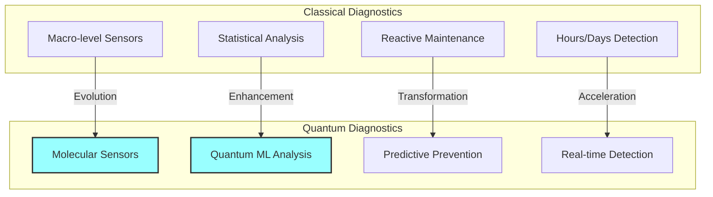
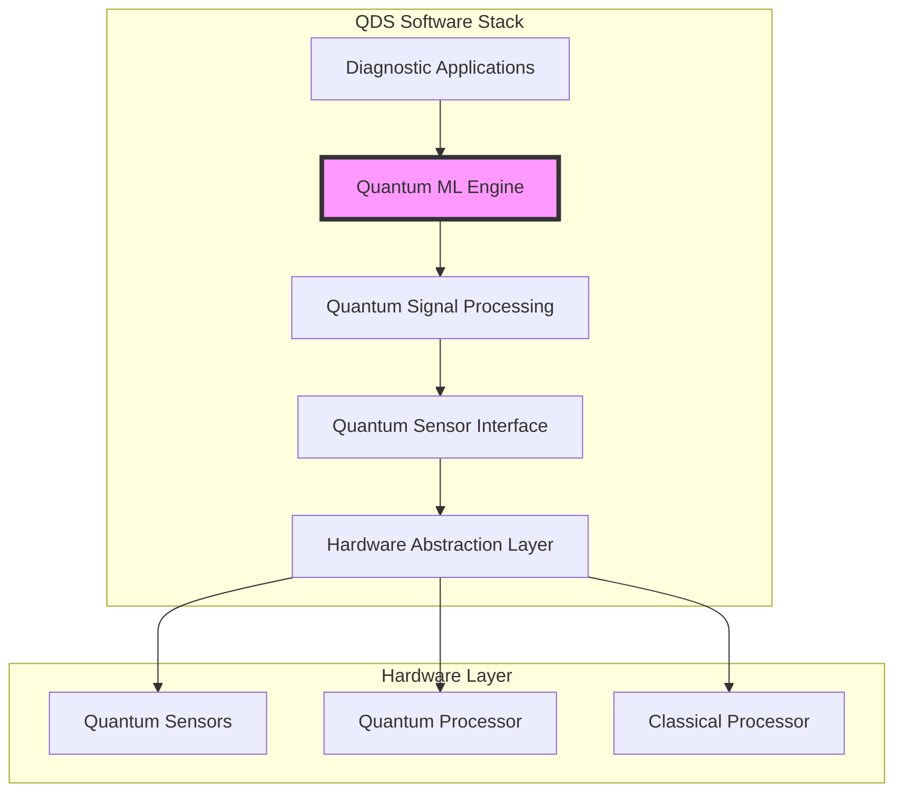
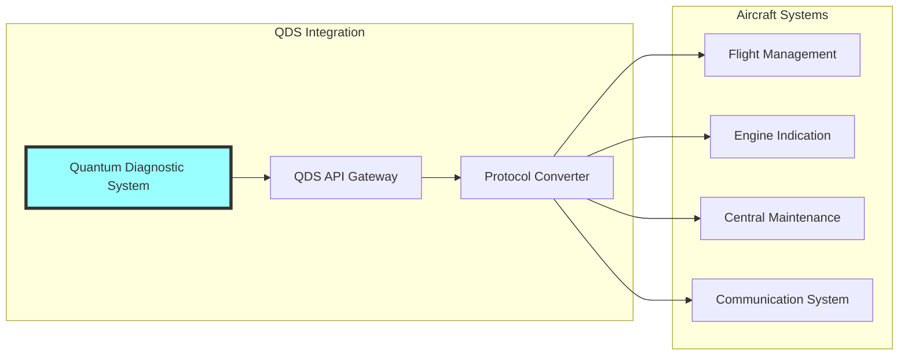
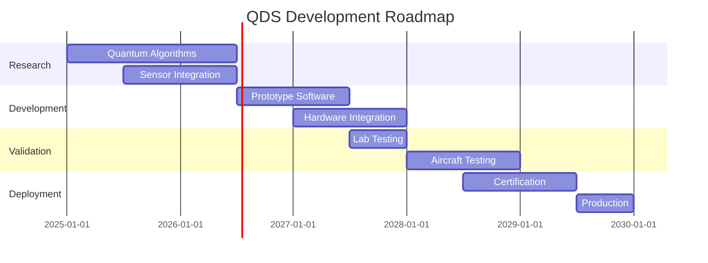
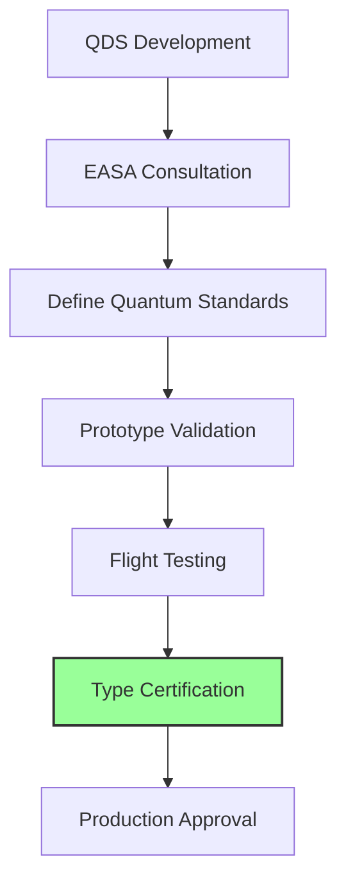

# Quantum Diagnostic System Software Concept
**Document ID**: QUA-QDS01-25SVD0001-CON-BOB-R&I-TD-QCSAA-920-000-00-01-TPL-CON-110-QSCI-v1.0.0  
**Template ID**: TPL-CON-110  
**Version**: 1.0.0  
**Status**: Draft - Concept Phase  
**Classification**: Research & Innovation  
**Date**: 2025-07-28  
**Q-Division**: QSCI (Quantum Science & Research)  
**Product Line**: QUANTUM  
**Product**: QDS01 (Quantum Diagnostic System)  
**Lifecycle Phase**: CONCEPT  
**Entity Type**: BOB (Digital/Virtual System)  
**UTCS Category**: QCSAA-920 (Quantum Diagnostic Systems)  

> 🔬 **Purpose**: Define the conceptual framework for the Quantum Diagnostic System (QDS) software, enabling molecular-level predictive failure detection in critical aerospace components within the A.Q.U.A.-V. ecosystem.

---

## Document Control

| Property | Value |
|----------|--------|
| **Created By** | QSCI Division |
| **Creation Date** | 2025-07-28 |
| **Last Modified** | 2025-07-28 |
| **Review Cycle** | 3 months |
| **Distribution** | Technical Leaders, Research Teams, MRO Division |
| **Related Documents** | TPL-CON-001 (Vision v1.0.1), TPL-CON-002 (Objectives v1.0.1) |
| **Current TRL** | 2 (Technology concept formulated) |
| **Target TRL 2030** | 5 (Technology validated in relevant environment) |

---

## 1. Introduction

### 1.1 Background

Traditional aerospace diagnostic systems rely on classical sensors and statistical models that detect failures after degradation has begun. The Quantum Diagnostic System (QDS) represents a paradigm shift by leveraging quantum sensing and machine learning to detect molecular-level anomalies before they manifest as measurable degradation.

### 1.2 Revolutionary Capabilities



---

## 2. System Architecture

### 2.1 High-Level Architecture



### 2.2 Core Components

#### 2.2.1 Quantum Sensor Interface (QSI)

```python
class QuantumSensorInterface:
    """
    Interface for quantum sensing devices
    TRL: 2 (Concept formulated)
    """
    
    def __init__(self):
        self.sensor_registry = QuantumSensorRegistry()
        self.calibration_engine = CalibrationEngine()
        self.noise_filter = QuantumNoiseFilter()
        
    def read_molecular_signature(self, 
                                component: AerospaceComponent,
                                sensitivity: float = 1e-9) -> MolecularData:
        """
        Read molecular-level signatures from component
        """
        # Configure quantum sensors for target sensitivity
        sensor_config = self.configure_sensors(component.material_type, sensitivity)
        
        # Perform quantum measurement
        raw_data = self.sensor_registry.measure(sensor_config)
        
        # Apply quantum noise filtering
        filtered_data = self.noise_filter.process(raw_data)
        
        # Return molecular signature
        return MolecularData(
            component_id=component.id,
            timestamp=datetime.utcnow(),
            molecular_state=filtered_data,
            confidence=self.calculate_confidence(filtered_data)
        )
```

#### 2.2.2 Quantum Machine Learning Engine

```python
class QuantumMLEngine:
    """
    Quantum-enhanced machine learning for pattern recognition
    TRL: 2 (Algorithm development)
    """
    
    def __init__(self):
        self.qpu_interface = QPUInterface()
        self.feature_encoder = QuantumFeatureEncoder()
        self.classifier = QuantumNeuralNetwork()
        
    def detect_anomalies(self, molecular_data: MolecularData) -> AnomalyReport:
        """
        Detect molecular-level anomalies using quantum ML
        """
        # Encode classical data into quantum states
        quantum_features = self.feature_encoder.encode(molecular_data)
        
        # Process through quantum neural network
        quantum_result = self.classifier.process(quantum_features)
        
        # Decode to classical anomaly indicators
        anomaly_indicators = self.decode_quantum_output(quantum_result)
        
        return AnomalyReport(
            severity=anomaly_indicators.severity,
            type=anomaly_indicators.failure_mode,
            probability=anomaly_indicators.confidence,
            time_to_failure=self.estimate_ttf(anomaly_indicators)
        )
```

---

## 3. Diagnostic Capabilities

### 3.1 Failure Modes Detectable

| Failure Mode | Classical Detection | QDS Detection | Improvement |
|--------------|-------------------|---------------|-------------|
| **Fatigue Cracks** | >0.1mm visible | Molecular bond stress | 1000x earlier |
| **Corrosion** | Surface oxidation | Single molecule oxidation | 10,000x earlier |
| **Composite Delamination** | Ultrasonic changes | Interface quantum states | 100x earlier |
| **Metal Fatigue** | Hardness changes | Crystal lattice distortion | 500x earlier |
| **Contamination** | Chemical analysis | Molecular presence | Real-time |

### 3.2 Sensor Technologies

```python
# Quantum sensor types integrated in QDS
sensor_technologies = {
    "NV_Centers": {
        "type": "Nitrogen-Vacancy in Diamond",
        "capability": "Magnetic field sensing",
        "resolution": "1 nT",
        "application": "Stress detection in metals"
    },
    "Quantum_Dots": {
        "type": "Semiconductor Quantum Dots",
        "capability": "Optical sensing",
        "resolution": "Single photon",
        "application": "Surface defect detection"
    },
    "SQUID": {
        "type": "Superconducting Quantum Interference",
        "capability": "Magnetic flux detection",
        "resolution": "10^-15 Tesla",
        "application": "Deep structure analysis"
    },
    "Quantum_Gravimeter": {
        "type": "Atom Interferometry",
        "capability": "Density variations",
        "resolution": "10^-9 g",
        "application": "Internal void detection"
    }
}
```

---

## 4. Software Modules

### 4.1 Data Acquisition Module

```python
class QuantumDataAcquisition:
    """
    Real-time quantum sensor data acquisition
    TRL: 2 (Design phase)
    """
    
    def __init__(self):
        self.buffer_manager = QuantumBufferManager()
        self.timestamp_sync = QuantumClockSync()
        self.data_validator = DataIntegrityValidator()
        
    async def acquire_continuous(self, 
                                sensors: List[QuantumSensor],
                                sampling_rate: float = 1e6) -> AsyncIterator[SensorData]:
        """
        Continuous acquisition from multiple quantum sensors
        """
        async with self.buffer_manager as buffer:
            while True:
                # Synchronized quantum measurement
                measurement_time = await self.timestamp_sync.get_quantum_time()
                
                # Parallel sensor reading
                readings = await asyncio.gather(*[
                    sensor.read_async() for sensor in sensors
                ])
                
                # Validate quantum data integrity
                if self.data_validator.validate(readings, measurement_time):
                    yield SensorData(
                        timestamp=measurement_time,
                        readings=readings,
                        metadata=self.generate_metadata(sensors)
                    )
```

### 4.2 Pattern Recognition Module

```python
class QuantumPatternRecognition:
    """
    Quantum-enhanced pattern recognition for failure signatures
    TRL: 2 (Conceptual algorithms)
    """
    
    def __init__(self):
        self.pattern_database = QuantumPatternDB()
        self.qsvm = QuantumSupportVectorMachine()
        self.anomaly_detector = QuantumAnomalyDetector()
        
    def identify_failure_pattern(self, 
                               molecular_signature: MolecularSignature) -> FailurePattern:
        """
        Identify failure patterns using quantum algorithms
        """
        # Extract quantum features
        features = self.extract_quantum_features(molecular_signature)
        
        # Search pattern database using quantum algorithm
        matching_patterns = self.pattern_database.quantum_search(features)
        
        if matching_patterns:
            # Classify using Quantum SVM
            classification = self.qsvm.classify(features, matching_patterns)
            return classification.best_match
        else:
            # Unknown pattern - use anomaly detection
            anomaly = self.anomaly_detector.analyze(features)
            return self.create_new_pattern(anomaly)
```

---

## 5. Integration with Aircraft Systems

### 5.1 System Interfaces



### 5.2 Real-time Monitoring Dashboard

```python
class QDSDashboard:
    """
    Real-time visualization of quantum diagnostics
    """
    
    def __init__(self):
        self.component_health = {}
        self.alert_system = QuantumAlertSystem()
        self.prediction_engine = FailurePredictionEngine()
        
    def update_component_status(self, component_id: str, diagnostic_data: DiagnosticData):
        """
        Update component health status in real-time
        """
        # Calculate health score using quantum metrics
        health_score = self.calculate_quantum_health_score(diagnostic_data)
        
        # Update component status
        self.component_health[component_id] = {
            "score": health_score,
            "molecular_integrity": diagnostic_data.molecular_integrity,
            "predicted_lifetime": self.prediction_engine.estimate_lifetime(diagnostic_data),
            "maintenance_urgency": self.calculate_urgency(health_score),
            "timestamp": datetime.utcnow()
        }
        
        # Trigger alerts if necessary
        if health_score < CRITICAL_THRESHOLD:
            self.alert_system.trigger_quantum_alert(component_id, health_score)
```

---

## 6. Use Cases

### 6.1 Engine Turbine Blade Monitoring

```python
# Example: Real-time turbine blade health monitoring
turbine_monitor = TurbineBladeMonitor(qds_system)

# Configure quantum sensors for high-temperature operation
sensor_config = {
    "sensor_type": "NV_Center_Array",
    "temperature_range": (500, 1200),  # Celsius
    "sampling_rate": 1e6,  # 1 MHz
    "sensitivity": "molecular_stress"
}

# Continuous monitoring during flight
async for health_data in turbine_monitor.monitor_blades(sensor_config):
    if health_data.stress_concentration > FATIGUE_THRESHOLD:
        # Predict time to failure
        ttf = qds_system.predict_failure(health_data)
        
        # Alert maintenance crew
        alert = MaintenanceAlert(
            component="Turbine Blade #3",
            severity="WARNING",
            predicted_failure=ttf,
            recommended_action="Schedule inspection within 50 flight hours"
        )
```

### 6.2 Composite Structure Integrity

| Component | Monitoring Frequency | Quantum Advantage |
|-----------|---------------------|-------------------|
| Wing Spar | Continuous | Detects micro-delamination |
| Fuselage Panels | Every 10 seconds | Identifies resin degradation |
| Control Surfaces | Real-time | Monitors fiber stress distribution |
| Pressure Bulkhead | Every minute | Detects molecular fatigue |

---

## 7. Development Roadmap

### 7.1 Phase Timeline



### 7.2 Technical Milestones

| Year | Milestone | Deliverable | TRL |
|------|-----------|-------------|-----|
| 2025 | Concept Validation | Algorithm whitepaper | 2 |
| 2026 | Prototype Development | QDS v0.1 simulator | 3 |
| 2027 | Hardware Integration | Sensor test bench | 4 |
| 2028 | Flight Testing | In-flight validation | 5 |
| 2029 | Certification | EASA/FAA approval | 6 |

---

## 8. Performance Metrics

### 8.1 Key Performance Indicators

```python
# QDS Performance Targets
performance_kpis = {
    "detection_sensitivity": {
        "current": "1 mm crack",
        "target_2027": "10 μm defect",
        "target_2030": "molecular anomaly"
    },
    "prediction_accuracy": {
        "current": "70%",
        "target_2027": "85%", 
        "target_2030": "95%"
    },
    "time_to_failure_prediction": {
        "current": "100 hours",
        "target_2027": "1000 hours",
        "target_2030": "10000 hours"
    },
    "false_positive_rate": {
        "current": "15%",
        "target_2027": "5%",
        "target_2030": "<1%"
    },
    "processing_latency": {
        "current": "N/A",
        "target_2027": "<100ms",
        "target_2030": "<10ms"
    }
}
```

### 8.2 Validation Criteria

1. **Sensitivity**: Detection of single molecular bond breakage
2. **Specificity**: >99% accurate failure mode identification
3. **Reliability**: >99.99% uptime in operational environment
4. **Scalability**: Monitor 1000+ components simultaneously
5. **Integration**: Seamless interface with existing avionics

---

## 9. Technical Challenges

### 9.1 Primary Challenges

| Challenge | Description | Mitigation Strategy |
|-----------|-------------|-------------------|
| **Quantum Decoherence** | Environmental noise affects sensors | Advanced shielding & error correction |
| **Data Volume** | TB/s from quantum sensors | Edge quantum computing |
| **Calibration Drift** | Sensor accuracy degradation | Self-calibrating algorithms |
| **Temperature Effects** | Quantum sensors sensitive to heat | Cryogenic micro-environments |
| **Certification** | No standards for quantum diagnostics | Work with regulators early |

### 9.2 Research Focus Areas

```python
research_priorities = {
    "2025": [
        "Quantum noise reduction algorithms",
        "High-temperature quantum sensors",
        "ML model quantum advantage validation"
    ],
    "2026": [
        "Sensor miniaturization",
        "Real-time quantum processing",
        "Failure signature database"
    ],
    "2027": [
        "Aircraft integration protocols",
        "Certification framework",
        "Production scalability"
    ]
}
```

---

## 10. Business Impact

### 10.1 Value Proposition

| Metric | Current State | With QDS | Impact |
|--------|--------------|----------|--------|
| **Unscheduled Maintenance** | 15% of events | <2% | 87% reduction |
| **Component Lifetime** | Design limits | +40% extension | Billions saved |
| **Safety Incidents** | 1 per million hours | <0.1 per million | 10x improvement |
| **Maintenance Cost** | $2M per aircraft/year | $1.2M | 40% reduction |
| **Aircraft Availability** | 85% | 95% | Revenue increase |

### 10.2 Market Opportunity

- **Total Addressable Market**: $50B by 2040
- **AQUA V. Target Share**: 30% ($15B)
- **Licensing Potential**: $5B additional
- **Service Revenue**: $10B recurring

---

## 11. Regulatory Considerations

### 11.1 Certification Path



### 11.2 Compliance Requirements

- **DO-178C**: Software certification (modified for quantum)
- **ARP4754A**: System development assurance
- **DO-160G**: Environmental testing
- **New**: DO-XXX Quantum Diagnostic Standards (to be developed)

---

## 12. Conclusion

The Quantum Diagnostic System represents a fundamental leap in predictive maintenance capabilities, offering molecular-level detection that will revolutionize aircraft safety and operational efficiency. With current TRL 2 status, the path to operational deployment by 2030 is ambitious but achievable through focused development and strategic partnerships.

### 12.1 Next Steps

1. **Q3 2025**: Establish QDS development team (20 specialists)
2. **Q4 2025**: Complete algorithm proof-of-concept
3. **Q1 2026**: Begin sensor prototype development
4. **Q2 2026**: First integrated lab demonstration

### 12.2 Success Factors

- Access to advanced quantum sensors
- Collaboration with QPU manufacturers
- Early regulatory engagement
- Strong IP portfolio development
- Strategic airline partnerships for testing

---

**END OF DOCUMENT**

*This document is subject to revision based on technological advances and stakeholder feedback.*

**Document Control**: QUA-QDS01-25SVD0001-CON-BOB-R&I-TD-QCSAA-920-000-00-01-TPL-CON-110-QSCI-v1.0.0  
**Classification**: Research & Innovation - Conceptual Phase  
**© 2025 A.Q.U.A.-V. Aerospace. All rights reserved.**
