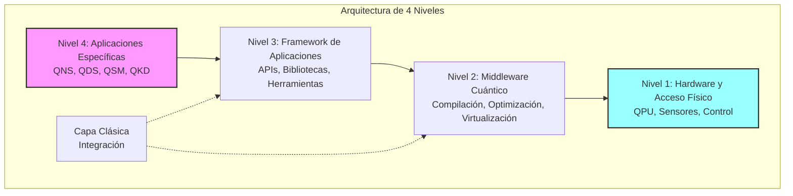
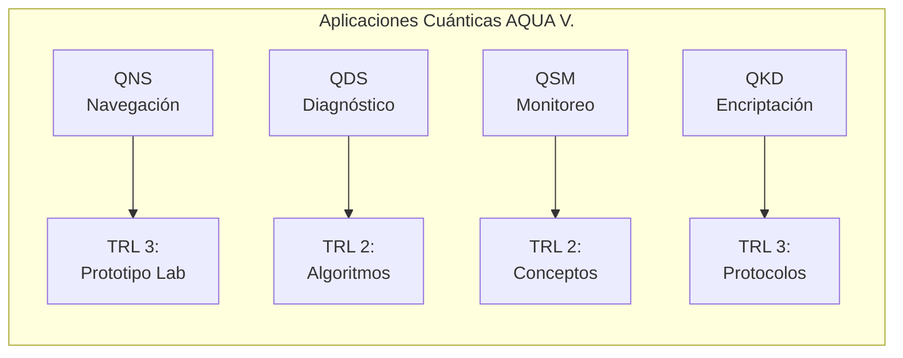
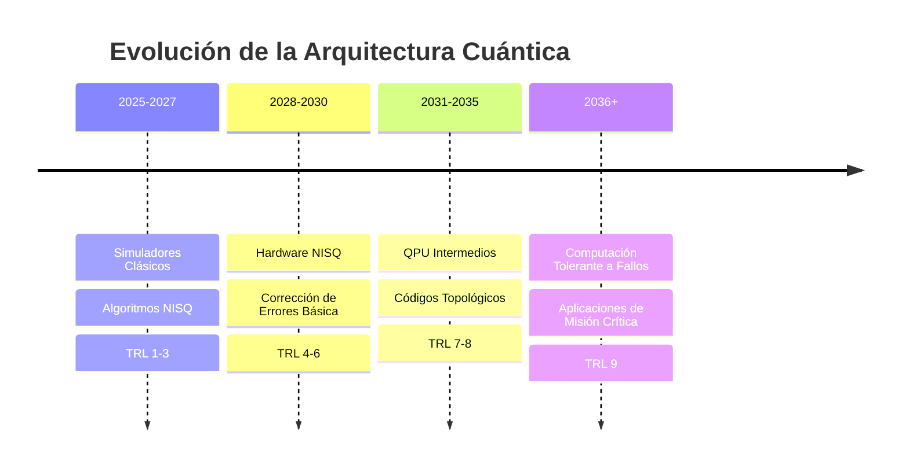
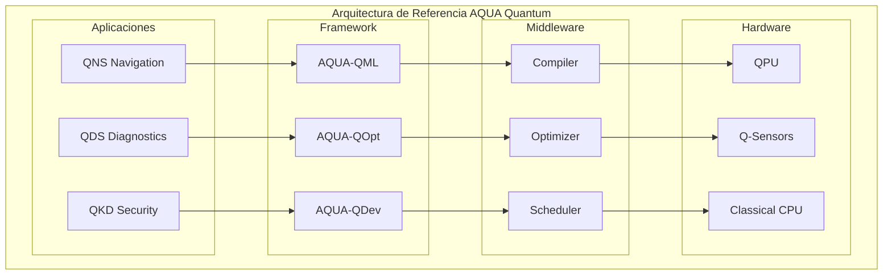

# Arquitectura de Software Cuántico - Visión General
**Document ID**: QUA-QSOFT-25SVD0001-CON-BOB-R&I-TD-QCSAA-901-000-00-01-TPL-CON-010-QSCI-v1.0.0  
**Template ID**: TPL-CON-010  
**Version**: 1.0.0  
**Status**: Draft - Concept Phase  
**Classification**: Research & Innovation  
**Date**: 2025-07-28  
**Q-Division**: QSCI (Quantum Science & Research)  
**Product Line**: QUANTUM  
**Product**: QSOFT (Quantum Software)  
**Lifecycle Phase**: CONCEPT  
**Entity Type**: BOB (Digital/Virtual System)  
**UTCS Category**: QCSAA-901 (Quantum Software Architecture)  

> 🏗️ **Propósito**: Definir la arquitectura conceptual del software cuántico de A.Q.U.A.-V., estableciendo los principios fundamentales, capas arquitectónicas y patrones de diseño para sistemas en fase de investigación.

---

## Control del Documento

| Propiedad | Valor |
|-----------|--------|
| **Creado Por** | División QSCI |
| **Fecha de Creación** | 2025-07-28 |
| **Última Modificación** | 2025-07-28 |
| **Ciclo de Revisión** | 3 meses |
| **Distribución** | Arquitectos de Software, Líderes Técnicos, I+D |
| **Documentos Relacionados** | TPL-CON-001 (Visión v1.0.1), TPL-CON-002 (Objetivos v1.0.1) |
| **TRL Base** | 1-3 (Arquitectura Conceptual) |

---

## 1. Principios Arquitectónicos

La arquitectura del software cuántico de A.Q.U.A.-V. se fundamenta en los siguientes principios:

### 1.1 Hibridación Clásico-Cuántica
**Principio**: Integración perfecta entre paradigmas de computación clásica y cuántica.

**Justificación Técnica**:
- Los sistemas NISQ actuales requieren procesamiento clásico significativo
- Fallback automático a métodos clásicos cuando sea óptimo
- Orquestación inteligente de recursos híbridos

**Estado Actual**: TRL 2 (Concepto arquitectónico formulado)

### 1.2 Modularidad Extrema
**Principio**: Componentes intercambiables para adaptarse a distintas plataformas y misiones.

**Implementación Conceptual**:
```python
# Arquitectura de plugins modulares
class QuantumModule(ABC):
    """Base para todos los módulos cuánticos"""
    @abstractmethod
    def validate_compatibility(self, platform: AircraftPlatform) -> bool:
        pass
    
    @abstractmethod
    def adapt_to_mission(self, mission_profile: MissionProfile) -> None:
        pass
```

**Estado Actual**: TRL 2 (Diseño modular conceptualizado)

### 1.3 Abstracción de Hardware
**Principio**: Independencia de los detalles específicos de implementación del hardware cuántico.

**Capas de Abstracción Propuestas**:
- HAL cuántico (Quantum Hardware Abstraction Layer)
- Traducción automática entre arquitecturas de qubits
- Portabilidad entre tecnologías (superconductores, iones atrapados, fotónica)

**Estado Actual**: TRL 1 (Principios básicos investigados)

### 1.4 Seguridad por Diseño
**Principio**: Consideraciones de seguridad integradas en todos los niveles.

**Elementos de Seguridad**:
- Encriptación cuántica nativa en todas las comunicaciones
- Protección contra ataques de canal lateral cuántico
- Auditoría cuántica inmutable

**Estado Actual**: TRL 3 (Prototipos de seguridad en desarrollo)

### 1.5 Escalabilidad
**Principio**: Capacidad para crecer desde simuladores cuánticos a hardware cuántico completo.

**Hoja de Ruta de Escalabilidad**:
- 2025-2027: Simuladores hasta 50 qubits
- 2028-2030: Hardware NISQ 100-1000 qubits
- 2031+: Sistemas tolerantes a fallos

**Estado Actual**: TRL 2 (Arquitectura escalable diseñada)

---

## 2. Capas Arquitectónicas



### 2.1 Nivel 1: Hardware y Acceso Físico

**Componentes Conceptuales**:

| Componente | Función | TRL | Tecnología Base |
|------------|---------|-----|-----------------|
| **QPU Interface** | Acceso a procesadores cuánticos | 3 | Protocolos OpenQASM |
| **Sensor Controllers** | Control de sensores cuánticos | 2 | Drivers específicos |
| **Coherence Manager** | Gestión de coherencia cuántica | 1 | Investigación activa |
| **Error Correction** | Calibración y corrección | 2 | Códigos de superficie |

**Desafíos de Investigación**:
- Mantener coherencia >100μs en entorno aeroespacial
- Interfaces estándar para múltiples tecnologías QPU
- Calibración automática en vuelo

### 2.2 Nivel 2: Middleware Cuántico

**Arquitectura del Middleware**:

```python
class QuantumMiddleware:
    """Capa de abstracción para operaciones cuánticas"""
    
    def __init__(self):
        self.circuit_compiler = CircuitCompiler()
        self.resource_manager = QuantumResourceManager()
        self.qubit_virtualizer = QubitVirtualizer()
        
    def compile_algorithm(self, algorithm: QuantumAlgorithm) -> QuantumCircuit:
        """Traduce algoritmos de alto nivel a circuitos"""
        # TRL 2: Concepto en desarrollo
        pass
        
    def optimize_circuit(self, circuit: QuantumCircuit) -> OptimizedCircuit:
        """Optimización específica para hardware objetivo"""
        # TRL 1: Investigación de técnicas
        pass
```

**Funcionalidades Clave**:
- Traducción de algoritmos a circuitos cuánticos
- Optimización de profundidad y conectividad
- Gestión de recursos cuánticos limitados
- Virtualización para simular más qubits que los físicos

### 2.3 Nivel 3: Framework de Aplicaciones

**Componentes del Framework**:

| Biblioteca | Propósito | Estado Conceptual |
|------------|-----------|-------------------|
| **AQUA-QML** | Machine Learning Cuántico | Algoritmos teóricos definidos |
| **AQUA-QOpt** | Optimización Cuántica | QAOA, VQE conceptualizados |
| **AQUA-QSim** | Simulación Cuántica | Arquitectura de simulador |
| **AQUA-QDev** | Herramientas de Desarrollo | IDE conceptual |

**APIs Propuestas**:

```python
# API de Alto Nivel para Desarrolladores
from aqua_quantum import NavigationSystem, DiagnosticSystem

# Ejemplo conceptual de uso
qns = NavigationSystem()
position = qns.calculate_position_quantum(
    gravity_field=sensor_data.gravity,
    magnetic_field=sensor_data.magnetic,
    use_entanglement=True
)
```

### 2.4 Nivel 4: Aplicaciones Específicas

**Portfolio de Aplicaciones**:



---

## 3. Patrones de Diseño

### 3.1 Adaptador Cuántico-Clásico

```python
class QuantumClassicalAdapter:
    """Patrón para conversión transparente entre paradigmas"""
    
    def quantum_to_classical(self, quantum_state: QuantumState) -> ClassicalData:
        """Medición y decodificación de estados cuánticos"""
        # TRL 2: Diseño conceptual
        measurements = quantum_state.measure_all()
        return self.decode_measurements(measurements)
        
    def classical_to_quantum(self, data: ClassicalData) -> QuantumState:
        """Codificación de datos clásicos en estados cuánticos"""
        # TRL 2: Técnicas en investigación
        return self.amplitude_encoding(data)
```

### 3.2 Proxy de Hardware Cuántico

```python
class QuantumHardwareProxy:
    """Abstracción de hardware específico"""
    
    def execute(self, circuit: QuantumCircuit) -> Result:
        if self.hardware_available():
            return self.execute_on_qpu(circuit)
        else:
            return self.execute_on_simulator(circuit)
```

### 3.3 Observer de Coherencia

```python
class CoherenceObserver:
    """Monitoreo continuo de coherencia cuántica"""
    
    def monitor(self, quantum_system: QuantumSystem):
        coherence_time = quantum_system.measure_T2()
        if coherence_time < self.threshold:
            self.trigger_recalibration()
```

### 3.4 Factory de Circuitos

```python
class CircuitFactory:
    """Generación dinámica de circuitos optimizados"""
    
    @staticmethod
    def create_navigation_circuit(params: NavigationParams) -> QuantumCircuit:
        # Genera circuito específico para navegación
        pass
```

---

## 4. Consideraciones Técnicas

### 4.1 Manejo de la Decoherencia Cuántica

**Estrategias Propuestas**:

| Estrategia | Descripción | Estado de Investigación |
|------------|-------------|------------------------|
| **Códigos de Error** | Corrección cuántica de errores | TRL 1-2 |
| **Pulsos Dinámicos** | Desacoplamiento dinámico | TRL 2 |
| **Refrigeración Activa** | Control térmico avanzado | TRL 3 |
| **Aislamiento EMI** | Protección electromagnética | TRL 2 |

### 4.2 Optimización para Hardware NISQ

**Técnicas de Optimización**:
- Compilación consciente del ruido
- Circuitos de profundidad mínima
- Mitigación de errores post-procesamiento
- Caracterización continua del hardware

**Estado**: TRL 1-2 (Investigación activa)

### 4.3 Evolución hacia Tolerancia a Fallos



### 4.4 Integración con Infraestructura Clásica

**Interfaces de Integración**:

| Sistema Clásico | Interface Propuesta | Protocolo |
|-----------------|-------------------|-----------|
| **FMS** | ARINC 429 Cuántico | Extensión estándar |
| **EICAS** | CAN Bus Híbrido | Mensajes cuánticos |
| **Aviónica** | Ethernet Cuántico | QKD sobre fibra |

### 4.5 Estrategias de Migración

**Plan de Migración por Fases**:

1. **Fase 1 (2025-2027)**: Simulación y Prototipado
   - Desarrollo en simuladores clásicos
   - Validación de algoritmos
   - TRL 1-3

2. **Fase 2 (2028-2030)**: Integración NISQ
   - Primeros QPUs en laboratorio
   - Pruebas de concepto integradas
   - TRL 4-6

3. **Fase 3 (2031+)**: Despliegue Operacional
   - Sistemas certificados
   - Operación en aeronaves
   - TRL 7-9

---

## 5. Arquitectura de Referencia

### 5.1 Diagrama de Componentes



---

## 6. Validación de Arquitectura

### 6.1 Criterios de Validación

| Criterio | Métrica Objetivo | Método de Validación |
|----------|------------------|---------------------|
| **Modularidad** | >90% componentes intercambiables | Análisis de acoplamiento |
| **Escalabilidad** | 10-1000 qubits | Simulación de carga |
| **Rendimiento** | <100ms latencia | Benchmarks prototipo |
| **Portabilidad** | 3+ tecnologías QPU | Pruebas multi-plataforma |

### 6.2 Plan de Validación

1. **2025**: Validación en simulador (TRL 2)
2. **2026**: Prototipo de arquitectura (TRL 3)
3. **2027**: Integración con QPU experimental (TRL 4)

---

## 7. Riesgos Arquitectónicos

| Riesgo | Impacto | Probabilidad | Mitigación |
|--------|---------|--------------|------------|
| **Cambio radical en hardware** | Alto | Media | Abstracción extrema |
| **Límites de coherencia** | Crítico | Alta | Múltiples estrategias |
| **Complejidad de integración** | Alto | Alta | Desarrollo incremental |
| **Obsolescencia rápida** | Medio | Alta | Arquitectura evolutiva |

---

## 8. Conclusiones

La arquitectura conceptual del software cuántico de A.Q.U.A.-V. establece una base sólida para el desarrollo futuro de sistemas cuánticos aeroespaciales. Los principios de hibridación, modularidad, abstracción, seguridad y escalabilidad proporcionan la flexibilidad necesaria para adaptarse a la rápida evolución del hardware cuántico mientras se mantiene la confiabilidad requerida para aplicaciones aeroespaciales críticas.

---

## 9. Próximos Pasos

1. **Q3 2025**: Desarrollo de simulador de arquitectura
2. **Q4 2025**: Validación de patrones de diseño
3. **Q1 2026**: Primer prototipo integrado
4. **Q2 2026**: Pruebas con QPU de laboratorio
5. **Q3 2026**: Refinamiento basado en resultados

---

**FIN DEL DOCUMENTO**

*Este documento está sujeto a evolución basada en avances en tecnología cuántica y resultados de investigación.*

**Número de Control**: QUA-QSOFT-25SVD0001-CON-BOB-R&I-TD-QCSAA-901-000-00-01-TPL-CON-010-QSCI-v1.0.0  
**Clasificación**: Investigación e Innovación - Fase Conceptual  
**© 2025 A.Q.U.A.-V. Aerospace. Todos los derechos reservados.**
