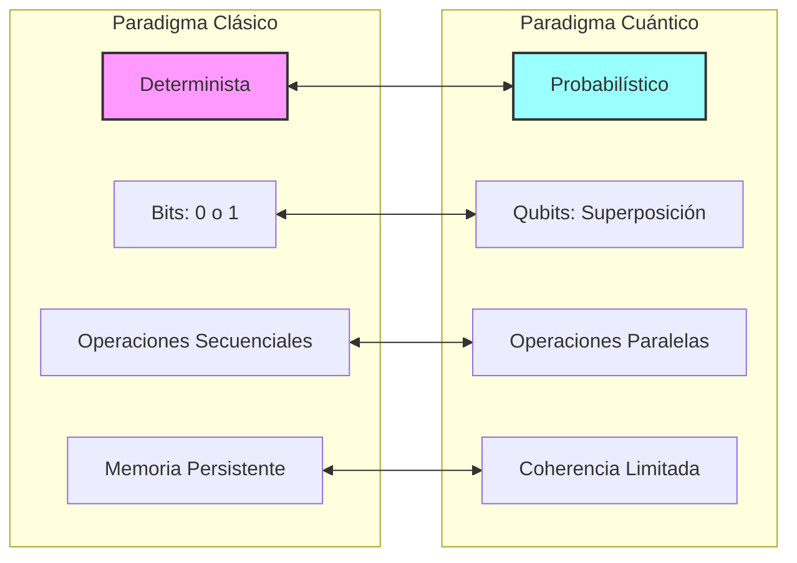
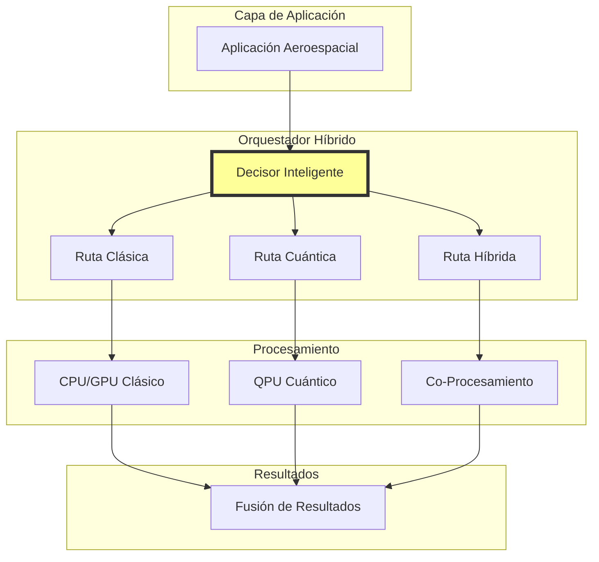
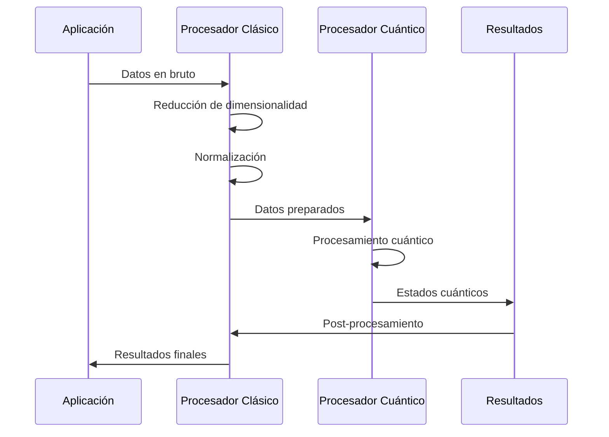
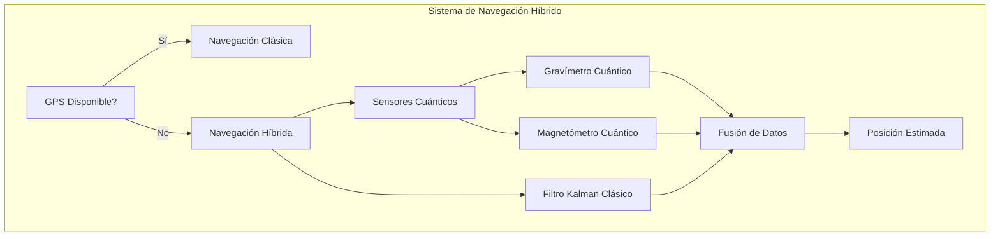
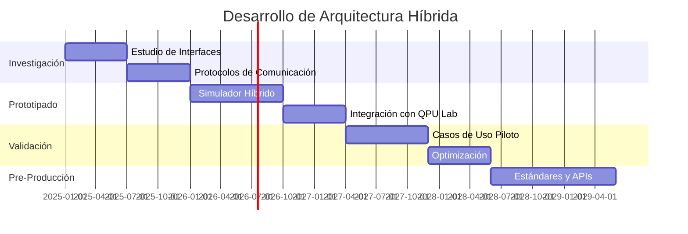

# Arquitectura Híbrida Clásico-Cuántica
**Document ID**: QUA-QSOFT-25SVD0001-CON-BOB-R&I-TD-QCSAA-901-010-00-01-TPL-CON-011-QSCI-v1.0.0  
**Template ID**: TPL-CON-011  
**Version**: 1.0.0  
**Status**: Draft - Concept Phase  
**Classification**: Research & Innovation  
**Date**: 2025-07-28  
**Q-Division**: QSCI (Quantum Science & Research)  
**Product Line**: QUANTUM  
**Product**: QSOFT (Quantum Software)  
**Lifecycle Phase**: CONCEPT  
**Entity Type**: BOB (Digital/Virtual System)  
**UTCS Category**: QCSAA-901 (Quantum Software Architecture)  
**Subsystem**: 010 (Hybrid Computing)  

> 🔄 **Propósito**: Definir la arquitectura conceptual para la integración transparente entre sistemas de computación clásica y cuántica en las plataformas aeroespaciales de A.Q.U.A.-V.

---

## Control del Documento

| Propiedad | Valor |
|-----------|--------|
| **Creado Por** | División QSCI |
| **Fecha de Creación** | 2025-07-28 |
| **Última Modificación** | 2025-07-28 |
| **Ciclo de Revisión** | 3 meses |
| **Distribución** | Arquitectos de Software, Investigadores Cuánticos, Ingenieros de Sistemas |
| **Documentos Relacionados** | TPL-CON-010 (Arquitectura General), TPL-CON-001 (Visión v1.0.1) |
| **TRL Base** | 1-3 (Investigación de Arquitectura Híbrida) |

---

## 1. Introducción

### 1.1 Contexto

La computación cuántica en su estado actual (era NISQ) requiere una estrecha colaboración con sistemas clásicos para:
- Pre-procesamiento de datos
- Control de hardware cuántico
- Post-procesamiento de resultados
- Corrección de errores
- Orquestación de recursos

### 1.2 Desafío Fundamental



---

## 2. Arquitectura Híbrida Conceptual

### 2.1 Modelo de Integración



### 2.2 Componentes Clave

#### 2.2.1 Orquestador Híbrido

```python
class HybridOrchestrator:
    """
    Componente central que decide la estrategia de computación óptima
    TRL: 2 (Concepto formulado)
    """
    
    def __init__(self):
        self.classical_estimator = ClassicalComplexityEstimator()
        self.quantum_estimator = QuantumAdvantageEstimator()
        self.resource_monitor = ResourceMonitor()
        
    def decide_computation_path(self, problem: ComputationalProblem) -> ComputationStrategy:
        """
        Decisión inteligente basada en:
        - Complejidad del problema
        - Recursos disponibles
        - Ventaja cuántica esperada
        - Restricciones de tiempo
        """
        
        # Análisis de complejidad
        classical_complexity = self.classical_estimator.estimate(problem)
        quantum_advantage = self.quantum_estimator.evaluate(problem)
        
        # Recursos disponibles
        qpu_available = self.resource_monitor.check_qpu_availability()
        coherence_time = self.resource_monitor.get_coherence_window()
        
        # Decisión estratégica
        if quantum_advantage > 100 and qpu_available:
            return ComputationStrategy.QUANTUM
        elif quantum_advantage > 10:
            return ComputationStrategy.HYBRID
        else:
            return ComputationStrategy.CLASSICAL
```

#### 2.2.2 Traductor de Problemas

```python
class ProblemTranslator:
    """
    Convierte problemas aeroespaciales a formulaciones cuánticas
    TRL: 1 (Principios básicos observados)
    """
    
    def translate_navigation_to_quantum(self, nav_problem: NavigationProblem) -> QuantumCircuit:
        """
        Ejemplo: Problema de navegación → Circuito de interferometría
        """
        # Codificación de posición en amplitudes
        position_encoding = self.encode_position(nav_problem.current_position)
        
        # Aplicación de operadores de evolución gravitacional
        gravity_evolution = self.create_gravity_operator(nav_problem.gravity_field)
        
        # Medición interferométrica
        measurement = self.create_interference_measurement()
        
        return QuantumCircuit([position_encoding, gravity_evolution, measurement])
```

---

## 3. Patrones de Hibridación

### 3.1 Patrón de Pre-procesamiento Clásico



**Aplicaciones**:
- Reducción de ruido en señales de sensores
- Preparación de datos para QML
- Optimización de parámetros iniciales

### 3.2 Patrón de Co-procesamiento

```python
class CoProcessor:
    """
    Ejecuta partes clásicas y cuánticas en paralelo
    TRL: 2 (Diseño conceptual)
    """
    
    async def execute_hybrid_algorithm(self, problem: Problem):
        # División del problema
        classical_subproblem = problem.extract_classical_component()
        quantum_subproblem = problem.extract_quantum_component()
        
        # Ejecución paralela
        classical_future = self.run_classical_async(classical_subproblem)
        quantum_future = self.run_quantum_async(quantum_subproblem)
        
        # Combinación de resultados
        classical_result = await classical_future
        quantum_result = await quantum_future
        
        return self.merge_results(classical_result, quantum_result)
```

### 3.3 Patrón de Algoritmo Variacional

```python
class VariationalQuantumAlgorithm:
    """
    Bucle de optimización clásico con evaluación cuántica
    TRL: 3 (Prueba de concepto experimental)
    """
    
    def optimize(self, cost_function: CostFunction, initial_params: Parameters):
        optimizer = ClassicalOptimizer()
        params = initial_params
        
        for iteration in range(max_iterations):
            # Evaluación cuántica
            quantum_circuit = self.build_circuit(params)
            expectation_value = self.qpu.execute(quantum_circuit)
            
            # Optimización clásica
            gradient = self.estimate_gradient(params, expectation_value)
            params = optimizer.update_parameters(params, gradient)
            
            if self.converged(expectation_value):
                break
                
        return params
```

---

## 4. Interfaces de Comunicación

### 4.1 Protocolo de Intercambio Híbrido

```protobuf
// Definición del protocolo de comunicación híbrido
syntax = "proto3";

message HybridComputationRequest {
    string request_id = 1;
    ProblemType problem_type = 2;
    bytes classical_data = 3;
    QuantumParameters quantum_params = 4;
    ResourceConstraints constraints = 5;
}

message QuantumParameters {
    int32 num_qubits = 1;
    int32 circuit_depth = 2;
    repeated Gate gates = 3;
}

message HybridComputationResponse {
    string request_id = 1;
    ComputationPath path_used = 2;
    bytes result_data = 3;
    PerformanceMetrics metrics = 4;
}
```

### 4.2 Capa de Abstracción de Datos

```python
class HybridDataAbstraction:
    """
    Abstrae las diferencias entre representaciones clásicas y cuánticas
    TRL: 2 (Concepto en desarrollo)
    """
    
    def __init__(self):
        self.classical_encoder = ClassicalEncoder()
        self.quantum_encoder = QuantumStateEncoder()
        
    def encode_for_hybrid(self, data: AerospaceData) -> HybridRepresentation:
        """
        Crea representación dual para procesamiento híbrido
        """
        return HybridRepresentation(
            classical=self.classical_encoder.encode(data),
            quantum=self.quantum_encoder.encode_amplitude(data),
            metadata=self.extract_metadata(data)
        )
```

---

## 5. Gestión de Recursos Híbridos

### 5.1 Planificador de Recursos

```python
class HybridResourceScheduler:
    """
    Gestiona la asignación óptima de recursos clásicos y cuánticos
    TRL: 1 (Investigación inicial)
    """
    
    def __init__(self):
        self.classical_pool = ClassicalResourcePool()
        self.quantum_pool = QuantumResourcePool()
        self.job_queue = PriorityQueue()
        
    def schedule_job(self, job: HybridJob) -> SchedulingDecision:
        # Evaluación de requisitos
        classical_needs = job.estimate_classical_resources()
        quantum_needs = job.estimate_quantum_resources()
        
        # Verificación de disponibilidad
        classical_available = self.classical_pool.check_availability(classical_needs)
        quantum_available = self.quantum_pool.check_availability(quantum_needs)
        
        # Decisión de planificación
        if quantum_available and classical_available:
            return SchedulingDecision.IMMEDIATE
        elif job.can_defer_quantum():
            return SchedulingDecision.CLASSICAL_NOW_QUANTUM_LATER
        else:
            return SchedulingDecision.QUEUE
```

### 5.2 Monitor de Rendimiento Híbrido

```python
class HybridPerformanceMonitor:
    """
    Métricas específicas para sistemas híbridos
    TRL: 2 (Diseño de métricas)
    """
    
    def calculate_hybrid_efficiency(self, execution: HybridExecution) -> Metrics:
        metrics = Metrics()
        
        # Tiempo total vs. tiempo si fuera solo clásico
        metrics.speedup = execution.classical_only_time / execution.hybrid_time
        
        # Utilización de QPU
        metrics.qpu_utilization = execution.qpu_active_time / execution.total_time
        
        # Overhead de comunicación
        metrics.communication_overhead = execution.transfer_time / execution.total_time
        
        # Ventaja cuántica realizada
        metrics.quantum_advantage_realized = (
            execution.quantum_operations_value / 
            execution.total_operations_cost
        )
        
        return metrics
```

---

## 6. Casos de Uso Aeroespaciales

### 6.1 Navegación Híbrida



### 6.2 Diagnóstico Predictivo Híbrido

| Componente | Procesamiento Clásico | Procesamiento Cuántico | Fusión |
|------------|----------------------|------------------------|---------|
| **Sensores** | Filtrado de ruido | Detección cuántica | Datos limpios |
| **Análisis** | Estadísticas básicas | Patrones cuánticos | Anomalías |
| **Predicción** | Modelos ML clásicos | QML para correlaciones | Predicción robusta |
| **Decisión** | Lógica determinista | Optimización cuántica | Acción óptima |

---

## 7. Desafíos Técnicos

### 7.1 Sincronización Temporal

```python
class QuantumClassicalSynchronizer:
    """
    Sincronización entre dominios temporales diferentes
    TRL: 1 (Problema fundamental identificado)
    """
    
    def __init__(self):
        self.classical_clock = ClassicalClock()  # Nanosegundos
        self.quantum_clock = QuantumClock()      # Tiempo de coherencia
        
    def synchronize_operations(self, operations: List[Operation]):
        # Desafío: QPU opera en microsegundos
        # CPU puede esperar milisegundos
        # Necesidad de buffering inteligente
        pass
```

### 7.2 Gestión de Errores Híbridos

| Tipo de Error | Origen | Estrategia de Mitigación |
|---------------|--------|--------------------------|
| **Decoherencia** | Cuántico | Repetición y promediado |
| **Error de puerta** | Cuántico | Corrección de errores |
| **Overflow numérico** | Clásico | Precisión extendida |
| **Desincronización** | Híbrido | Checkpoints frecuentes |

---

## 8. Hoja de Ruta de Desarrollo

### 8.1 Fases de Maduración



### 8.2 Métricas de Progreso

| Métrica | 2025 | 2027 | 2030 |
|---------|------|------|------|
| **Overhead de hibridación** | >50% | <20% | <5% |
| **Algoritmos híbridos validados** | 2 | 10 | 50 |
| **Speedup vs. clásico** | 1.5x | 10x | 100x |
| **Confiabilidad del sistema** | 90% | 95% | 99.9% |

---

## 9. Estándares y Compatibilidad

### 9.1 Interfaces Estándar Propuestas

```python
# Interfaz estándar para algoritmos híbridos
class IHybridAlgorithm(ABC):
    """Interfaz base para todos los algoritmos híbridos de AQUA V."""
    
    @abstractmethod
    def decompose(self) -> Tuple[ClassicalPart, QuantumPart]:
        """Descompone el algoritmo en partes clásicas y cuánticas"""
        pass
        
    @abstractmethod
    def estimate_resources(self) -> ResourceRequirements:
        """Estima recursos necesarios para ejecución"""
        pass
        
    @abstractmethod
    def merge_results(self, classical: Result, quantum: Result) -> FinalResult:
        """Combina resultados de ambos paradigmas"""
        pass
```

### 9.2 Compatibilidad con Sistemas Existentes

| Sistema Aeroespacial | Adaptación Requerida | Complejidad |
|---------------------|---------------------|-------------|
| **FMS (ARINC 653)** | Partición híbrida dedicada | Media |
| **EICAS** | Nuevos tipos de mensaje | Baja |
| **Autopilot** | Modo híbrido opcional | Alta |
| **Communication Bus** | Protocolo extendido | Media |

---

## 10. Validación Conceptual

### 10.1 Simulaciones Planificadas

1. **Navegación GPS-denegada** (Q1 2026)
   - Comparar precisión clásica vs. híbrida
   - Medir overhead de comunicación

2. **Optimización de rutas** (Q2 2026)
   - QAOA híbrido para planificación
   - Benchmarks contra algoritmos clásicos

3. **Diagnóstico de fallos** (Q3 2026)
   - Detección de patrones con QML híbrido
   - Validación de falsos positivos/negativos

### 10.2 Criterios de Éxito

- Demostrar ventaja cuántica en al menos 3 casos de uso
- Overhead de hibridación <20% del tiempo total
- Confiabilidad >95% en entorno simulado
- Escalabilidad demostrada de 10 a 100 qubits

---

## 11. Conclusiones

La arquitectura híbrida clásico-cuántica representa el puente necesario entre las capacidades actuales y el futuro cuántico de la aviación. Este diseño conceptual establece los fundamentos para:

1. **Integración Transparente**: Permitiendo que las aplicaciones aeroespaciales aprovechen lo mejor de ambos paradigmas
2. **Evolución Gradual**: Facilitando la transición desde sistemas puramente clásicos
3. **Optimización de Recursos**: Maximizando el valor de los limitados recursos cuánticos
4. **Robustez Operacional**: Manteniendo la confiabilidad aeroespacial crítica

---

## 12. Referencias y Próximos Pasos

### 12.1 Documentos Relacionados
- TPL-CON-010: Arquitectura General de Software Cuántico
- TPL-CON-012: Sistema Operativo Cuántico (próximo)
- TPL-CON-013: Framework de Middleware Cuántico (próximo)

### 12.2 Acciones Inmediatas
1. **Q3 2025**: Diseño detallado de interfaces
2. **Q4 2025**: Prototipo de orquestador híbrido
3. **Q1 2026**: Primeras pruebas de integración
4. **Q2 2026**: Validación con QPU de laboratorio

---

**FIN DEL DOCUMENTO**

*Este documento conceptual está sujeto a revisión basada en avances en computación cuántica y retroalimentación de investigación.*

**Número de Control**: QUA-QSOFT-25SVD0001-CON-BOB-R&I-TD-QCSAA-901-010-00-01-TPL-CON-011-QSCI-v1.0.0  
**Clasificación**: Investigación e Innovación - Fase Conceptual  
**© 2025 A.Q.U.A.-V. Aerospace. Todos los derechos reservados.**
