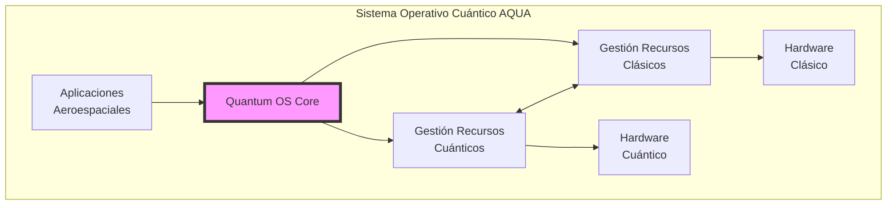
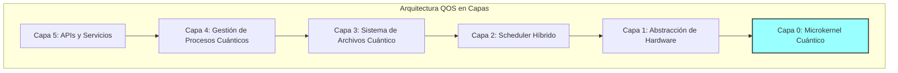
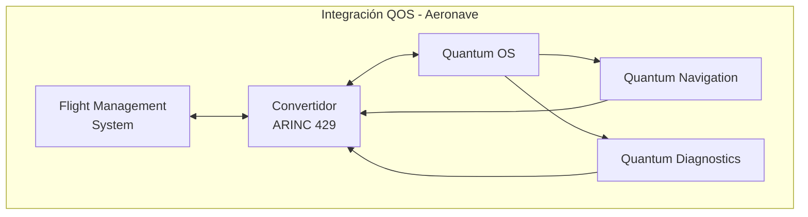
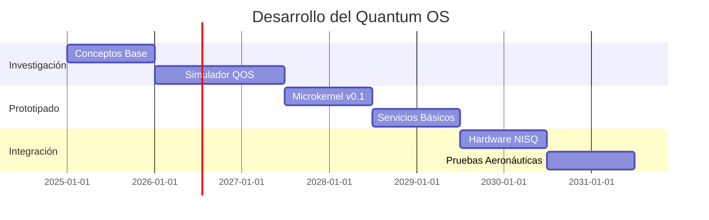

# Concepto de Sistema Operativo Cuántico
**Document ID**: QUA-QSOFT-25SVD0001-CON-BOB-R&I-TD-QCSAA-901-020-00-01-TPL-CON-012-QSCI-v1.0.0  
**Template ID**: TPL-CON-012  
**Version**: 1.0.0  
**Status**: Draft - Concept Phase  
**Classification**: Research & Innovation  
**Date**: 2025-07-28  
**Q-Division**: QSCI (Quantum Science & Research)  
**Product Line**: QUANTUM  
**Product**: QSOFT (Quantum Software)  
**Lifecycle Phase**: CONCEPT  
**Entity Type**: BOB (Digital/Virtual System)  
**UTCS Category**: QCSAA-901 (Quantum Software Architecture)  
**Subsystem**: 020 (Operating System)  

> 💻 **Propósito**: Definir el concepto de un Sistema Operativo Cuántico (QOS) diseñado específicamente para gestionar recursos cuánticos y clásicos en plataformas aeroespaciales de A.Q.U.A.-V.

---

## Control del Documento

| Propiedad | Valor |
|-----------|--------|
| **Creado Por** | División QSCI |
| **Fecha de Creación** | 2025-07-28 |
| **Última Modificación** | 2025-07-28 |
| **Ciclo de Revisión** | 3 meses |
| **Distribución** | Arquitectos de Sistema, Investigadores OS, Ingenieros Cuánticos |
| **Documentos Relacionados** | TPL-CON-010 (Arquitectura General), TPL-CON-011 (Arquitectura Híbrida) |
| **TRL Base** | 2 (Concepto tecnológico formulado) |
| **TRL Objetivo 2030** | 5 (Validación en entorno relevante) |

---

## 1. Introducción

### 1.1 Motivación

Los sistemas operativos tradicionales fueron diseñados para gestionar recursos clásicos deterministas. La computación cuántica introduce paradigmas fundamentalmente diferentes que requieren un nuevo enfoque en la gestión de recursos del sistema:

- **Estados de superposición** que colapsan al ser medidos
- **Entrelazamiento cuántico** entre qubits
- **Coherencia limitada** en el tiempo
- **Corrección de errores** continua
- **Paralelismo cuántico** masivo

### 1.2 Visión del QOS



---

## 2. Arquitectura Conceptual del QOS

### 2.1 Capas del Sistema Operativo



### 2.2 Componentes Principales

#### 2.2.1 Microkernel Cuántico

```python
class QuantumMicrokernel:
    """
    Núcleo mínimo para gestión de recursos cuánticos básicos
    TRL: 2 (Concepto formulado)
    """
    
    def __init__(self):
        self.qubit_registry = QubitRegistry()
        self.coherence_monitor = CoherenceMonitor()
        self.error_corrector = ErrorCorrectionEngine()
        self.quantum_memory = QuantumMemoryManager()
        
    def allocate_qubits(self, request: QubitRequest) -> QubitAllocation:
        """
        Asignación de qubits con garantías de coherencia
        """
        # Verificar disponibilidad
        available = self.qubit_registry.get_available_qubits()
        
        # Evaluar calidad (coherencia, conectividad, fidelidad)
        quality_scores = self.evaluate_qubit_quality(available)
        
        # Asignar los mejores qubits disponibles
        allocation = self.select_optimal_qubits(
            request.num_qubits,
            request.min_coherence_time,
            quality_scores
        )
        
        # Reservar y monitorear
        self.coherence_monitor.track(allocation)
        
        return allocation
```

#### 2.2.2 Gestor de Estados Cuánticos

```python
class QuantumStateManager:
    """
    Gestión del ciclo de vida de estados cuánticos
    TRL: 1 (Principios básicos observados)
    """
    
    def __init__(self):
        self.state_store = QuantumStateStore()
        self.entanglement_tracker = EntanglementTracker()
        
    def create_quantum_state(self, qubits: List[Qubit]) -> QuantumState:
        """
        Crear y registrar un nuevo estado cuántico
        """
        state = QuantumState(qubits)
        
        # Registrar en el sistema
        state_id = self.state_store.register(state)
        
        # Configurar monitoreo de decoherencia
        self.setup_decoherence_monitoring(state_id)
        
        return state
        
    def checkpoint_state(self, state: QuantumState) -> StateCheckpoint:
        """
        Crear checkpoint para recuperación (si es posible)
        Nota: No-cloning theorem limita opciones
        """
        # Estrategias limitadas por física cuántica
        if state.is_classical():
            return self.classical_checkpoint(state)
        else:
            return self.quantum_error_correction_checkpoint(state)
```

---

## 3. Gestión de Recursos

### 3.1 Scheduler Híbrido Cuántico-Clásico

```python
class HybridQuantumScheduler:
    """
    Planificador que optimiza uso de recursos cuánticos y clásicos
    TRL: 2 (Diseño conceptual)
    """
    
    def __init__(self):
        self.quantum_queue = PriorityQueue()
        self.classical_queue = PriorityQueue()
        self.resource_monitor = ResourceMonitor()
        
    def schedule_job(self, job: ComputationJob) -> ScheduleDecision:
        """
        Decisión inteligente de planificación
        """
        # Análisis del trabajo
        quantum_benefit = self.analyze_quantum_advantage(job)
        resource_needs = job.estimate_resources()
        
        # Estado actual del sistema
        quantum_load = self.resource_monitor.quantum_utilization()
        classical_load = self.resource_monitor.classical_utilization()
        coherence_window = self.resource_monitor.coherence_time_available()
        
        # Lógica de decisión
        if quantum_benefit > 10 and coherence_window > resource_needs.min_time:
            return self.schedule_quantum(job)
        elif quantum_benefit > 1:
            return self.schedule_hybrid(job)
        else:
            return self.schedule_classical(job)
    
    def preemption_policy(self) -> PreemptionRules:
        """
        Política de apropiación para trabajos cuánticos
        """
        return PreemptionRules(
            quantum_jobs_non_preemptible=True,  # No interrumpir cálculos cuánticos
            save_partial_results=True,
            coherence_based_priority=True
        )
```

### 3.2 Sistema de Memoria Cuántica

```python
class QuantumMemoryManager:
    """
    Gestión de memoria cuántica (qubits lógicos)
    TRL: 1 (Investigación inicial)
    """
    
    def __init__(self, total_qubits: int):
        self.total_qubits = total_qubits
        self.allocation_table = AllocationTable()
        self.garbage_collector = QuantumGarbageCollector()
        
    def allocate(self, size: int, coherence_requirement: float) -> MemoryBlock:
        """
        Asignar bloque de memoria cuántica
        """
        # Buscar bloque contiguo con coherencia adecuada
        block = self.find_suitable_block(size, coherence_requirement)
        
        if not block:
            # Intentar desfragmentación cuántica
            self.garbage_collector.collect()
            block = self.find_suitable_block(size, coherence_requirement)
            
        if block:
            self.allocation_table.mark_allocated(block)
            return block
        else:
            raise QuantumMemoryException("Insufficient quantum memory")
    
    def deallocate(self, block: MemoryBlock):
        """
        Liberar memoria cuántica y resetear qubits
        """
        # Reset seguro de qubits
        for qubit in block.qubits:
            qubit.reset_to_ground_state()
            
        self.allocation_table.mark_free(block)
```

---

## 4. Sistema de Archivos Cuántico

### 4.1 Concepto de Almacenamiento Cuántico

```python
class QuantumFileSystem:
    """
    Sistema de archivos para datos cuánticos
    TRL: 1 (Concepto teórico)
    """
    
    def __init__(self):
        self.namespace = QuantumNamespace()
        self.storage_backend = HybridStorage()
        
    def store_quantum_data(self, data: QuantumData, path: str) -> FileHandle:
        """
        Almacenar información cuántica
        Desafío: No-cloning theorem
        """
        # Estrategias posibles:
        # 1. Almacenar descripción del circuito (no el estado)
        # 2. Tomografía cuántica (destructiva)
        # 3. Almacenamiento híbrido (clásico + referencia cuántica)
        
        if data.is_circuit_description():
            return self.store_circuit(data, path)
        elif data.allows_tomography():
            classical_data = self.perform_tomography(data)
            return self.store_classical(classical_data, path)
        else:
            return self.store_reference(data, path)
```

### 4.2 Metadatos Cuánticos

```python
class QuantumMetadata:
    """
    Metadatos específicos para archivos cuánticos
    """
    
    def __init__(self):
        self.creation_time: datetime
        self.coherence_time: float  # Tiempo de coherencia al crear
        self.entanglement_map: Dict[Qubit, List[Qubit]]
        self.fidelity: float
        self.quantum_volume: int
        self.error_rate: float
        self.hardware_requirements: HardwareSpec
```

---

## 5. Seguridad y Aislamiento

### 5.1 Aislamiento de Procesos Cuánticos

```python
class QuantumProcessIsolation:
    """
    Aislamiento entre procesos cuánticos
    TRL: 2 (Diseño conceptual)
    """
    
    def __init__(self):
        self.process_table = QuantumProcessTable()
        self.isolation_monitor = IsolationMonitor()
        
    def create_quantum_sandbox(self, process: QuantumProcess) -> Sandbox:
        """
        Crear entorno aislado para proceso cuántico
        """
        sandbox = Sandbox()
        
        # Asignar qubits dedicados (sin compartir)
        sandbox.qubits = self.allocate_isolated_qubits(process.qubit_count)
        
        # Configurar barreras de decoherencia
        sandbox.decoherence_barriers = self.setup_barriers(sandbox.qubits)
        
        # Monitoreo de cross-talk
        self.isolation_monitor.watch_crosstalk(sandbox)
        
        return sandbox
    
    def enforce_quantum_security(self, sandbox: Sandbox):
        """
        Aplicar políticas de seguridad cuántica
        """
        # Prevenir mediciones no autorizadas
        self.protect_from_measurement(sandbox)
        
        # Detectar intentos de entrelazamiento no autorizado
        self.monitor_entanglement_attempts(sandbox)
        
        # Aplicar límites de decoherencia
        self.enforce_coherence_limits(sandbox)
```

### 5.2 Control de Acceso Cuántico

```python
class QuantumAccessControl:
    """
    Control de acceso a recursos cuánticos
    """
    
    def __init__(self):
        self.acl = QuantumACL()
        self.audit_log = QuantumAuditLog()
        
    def check_permission(self, 
                        principal: Principal, 
                        resource: QuantumResource, 
                        operation: Operation) -> bool:
        """
        Verificar permisos para operaciones cuánticas
        """
        # Permisos especiales para operaciones cuánticas
        if operation == Operation.MEASURE:
            # Medición destruye superposición
            return self.acl.can_destroy_superposition(principal, resource)
        elif operation == Operation.ENTANGLE:
            # Entrelazamiento crea dependencias
            return self.acl.can_create_entanglement(principal, resource)
        else:
            return self.acl.check_standard(principal, resource, operation)
```

---

## 6. APIs y Servicios del Sistema

### 6.1 API de Sistema para Aplicaciones

```python
class QuantumSystemAPI:
    """
    API principal para aplicaciones cuánticas
    TRL: 2 (Diseño de interfaces)
    """
    
    def __init__(self):
        self.kernel = QuantumMicrokernel()
        self.scheduler = HybridQuantumScheduler()
        self.memory = QuantumMemoryManager()
        
    async def execute_quantum_circuit(self, 
                                    circuit: QuantumCircuit, 
                                    options: ExecutionOptions) -> Result:
        """
        Ejecutar circuito cuántico con gestión completa del OS
        """
        # Solicitar recursos
        resources = await self.request_resources(circuit.resource_requirements())
        
        # Compilar para hardware objetivo
        compiled_circuit = self.compile_for_target(circuit, resources.hardware)
        
        # Ejecutar con monitoreo
        try:
            result = await self.execute_with_monitoring(compiled_circuit, resources)
            return result
        finally:
            # Liberar recursos
            await self.release_resources(resources)
    
    def get_system_status(self) -> SystemStatus:
        """
        Estado del sistema cuántico
        """
        return SystemStatus(
            total_qubits=self.kernel.qubit_registry.total_count(),
            available_qubits=self.kernel.qubit_registry.available_count(),
            average_coherence_time=self.kernel.coherence_monitor.average_t2(),
            quantum_volume=self.calculate_quantum_volume(),
            active_processes=self.scheduler.active_job_count()
        )
```

### 6.2 Servicios del Sistema

```python
# Servicios principales del QOS
quantum_os_services = {
    "resource_manager": {
        "description": "Gestión de qubits y puertas cuánticas",
        "api": "/qos/v1/resources",
        "trl": 2
    },
    "scheduler": {
        "description": "Planificación de trabajos híbridos",
        "api": "/qos/v1/scheduler",
        "trl": 2
    },
    "error_correction": {
        "description": "Corrección continua de errores cuánticos",
        "api": "/qos/v1/error_correction",
        "trl": 1
    },
    "calibration": {
        "description": "Calibración automática de hardware",
        "api": "/qos/v1/calibration",
        "trl": 2
    },
    "monitoring": {
        "description": "Monitoreo de coherencia y fidelidad",
        "api": "/qos/v1/monitoring",
        "trl": 2
    }
}
```

---

## 7. Casos de Uso Aeroespaciales

### 7.1 Gestión de QNS (Quantum Navigation System)

```python
class QNSProcessManager:
    """
    Gestión especializada para procesos de navegación cuántica
    """
    
    def __init__(self, qos: QuantumOS):
        self.qos = qos
        self.navigation_priority = Priority.CRITICAL
        
    async def start_navigation_service(self) -> NavigationProcess:
        """
        Iniciar servicio de navegación con prioridad crítica
        """
        # Solicitar recursos dedicados
        resources = await self.qos.request_dedicated_resources(
            qubits=100,
            coherence_time_min=1000,  # microsegundos
            error_rate_max=0.001
        )
        
        # Crear proceso con aislamiento total
        process = await self.qos.create_critical_process(
            name="QNS_Navigation",
            resources=resources,
            restart_policy=RestartPolicy.ALWAYS,
            isolation_level=IsolationLevel.MAXIMUM
        )
        
        return process
```

### 7.2 Integración con Sistemas de Aeronave



---

## 8. Desafíos Técnicos

### 8.1 Principales Desafíos

| Desafío | Descripción | Estrategia de Investigación |
|---------|-------------|----------------------------|
| **No-cloning theorem** | Imposibilidad de copiar estados cuánticos | Desarrollar técnicas de recuperación alternativas |
| **Decoherencia** | Pérdida rápida de información cuántica | Scheduling optimizado por coherencia |
| **Limitaciones de medición** | Colapso del estado al medir | Minimizar mediciones, usar weak measurements |
| **Escalabilidad** | Gestionar miles de qubits | Arquitectura jerárquica y distribuida |
| **Corrección de errores** | Overhead significativo | Códigos de error optimizados |

### 8.2 Áreas de Investigación Activa

```python
research_areas = {
    "fault_tolerant_os": {
        "description": "OS tolerante a fallos cuánticos",
        "trl_current": 1,
        "trl_target_2030": 4,
        "key_challenges": ["Error propagation", "Logical qubit management"]
    },
    "quantum_virtualization": {
        "description": "Virtualización de recursos cuánticos",
        "trl_current": 1,
        "trl_target_2030": 3,
        "key_challenges": ["Qubit multiplexing", "State isolation"]
    },
    "distributed_quantum_os": {
        "description": "OS para computación cuántica distribuida",
        "trl_current": 1,
        "trl_target_2030": 3,
        "key_challenges": ["Quantum networking", "Distributed entanglement"]
    }
}
```

---

## 9. Hoja de Ruta de Desarrollo

### 9.1 Fases de Evolución



### 9.2 Hitos Clave

| Año | Hito | Entregable | TRL |
|-----|------|------------|-----|
| 2026 | Simulador QOS | Simulador funcional en clásico | 2 |
| 2027 | Microkernel Alpha | Primera versión ejecutable | 3 |
| 2028 | Gestión Recursos | Scheduler y memoria funcionales | 3 |
| 2029 | Integración QPU | Ejecución en hardware real | 4 |
| 2030 | Demo Aeronáutica | QOS en simulador de vuelo | 5 |

---

## 10. Métricas de Éxito

### 10.1 KPIs Técnicos

| Métrica | 2025 | 2027 | 2030 |
|---------|------|------|------|
| **Overhead del OS** | N/A | <20% | <5% |
| **Utilización de qubits** | N/A | >60% | >85% |
| **Tiempo de respuesta** | N/A | <10ms | <1ms |
| **Procesos concurrentes** | 0 | 10 | 100 |
| **Uptime** | N/A | 90% | 99% |

### 10.2 Criterios de Validación

1. **Funcionalidad básica**: Gestión de recursos cuánticos demostrada
2. **Rendimiento**: Overhead aceptable vs. ejecución directa
3. **Confiabilidad**: Recuperación de errores sin pérdida de datos
4. **Escalabilidad**: Soporte para 100+ qubits
5. **Integración**: Compatible con sistemas aeronáuticos

---

## 11. Conclusiones

El concepto de Sistema Operativo Cuántico representa un componente fundamental para la realización práctica de la computación cuántica en entornos aeroespaciales. Aunque actualmente en TRL 2, el QOS evolucionará para proporcionar:

1. **Abstracción efectiva** del hardware cuántico complejo
2. **Gestión optimizada** de recursos limitados y frágiles
3. **Integración transparente** con sistemas clásicos
4. **Confiabilidad aeronáutica** en operaciones críticas
5. **Base sólida** para aplicaciones cuánticas futuras

---

## 12. Referencias y Próximos Pasos

### 12.1 Documentos Relacionados
- TPL-CON-013: Framework de Middleware Cuántico (próximo)
- TPL-CON-020: QOS Detailed Design (futuro)
- TPL-CON-100: QNS Integration with QOS (futuro)

### 12.2 Acciones Inmediatas
1. **Q3 2025**: Formar equipo de investigación QOS
2. **Q4 2025**: Desarrollar simulador conceptual
3. **Q1 2026**: Publicar paper sobre arquitectura QOS
4. **Q2 2026**: Prototipo de microkernel básico

---

**FIN DEL DOCUMENTO**

*Este concepto de Sistema Operativo Cuántico está sujeto a evolución basada en avances en hardware cuántico y teoría de computación cuántica.*

**Número de Control**: QUA-QSOFT-25SVD0001-CON-BOB-R&I-TD-QCSAA-901-020-00-01-TPL-CON-012-QSCI-v1.0.0  
**Clasificación**: Investigación e Innovación - Concepto de Sistema  
**© 2025 A.Q.U.A.-V. Aerospace. Todos los derechos reservados.**
