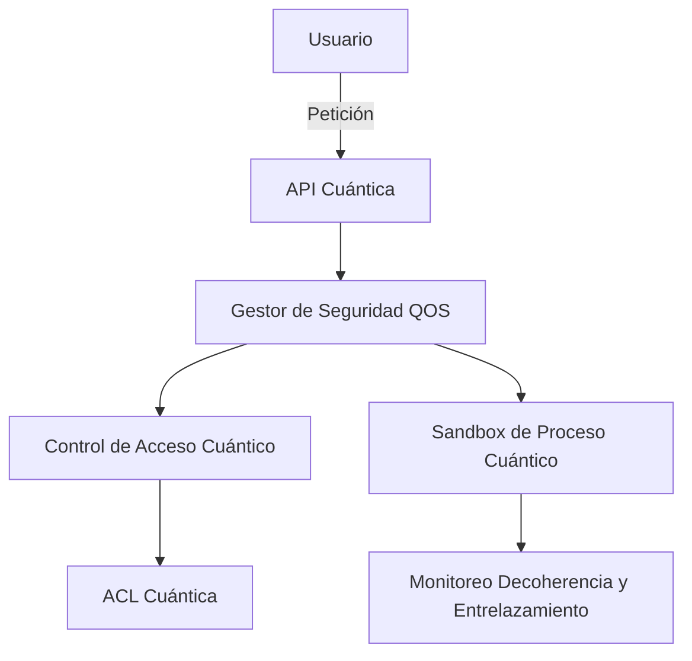
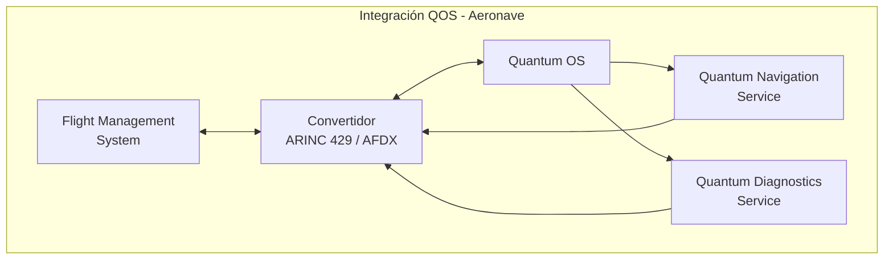
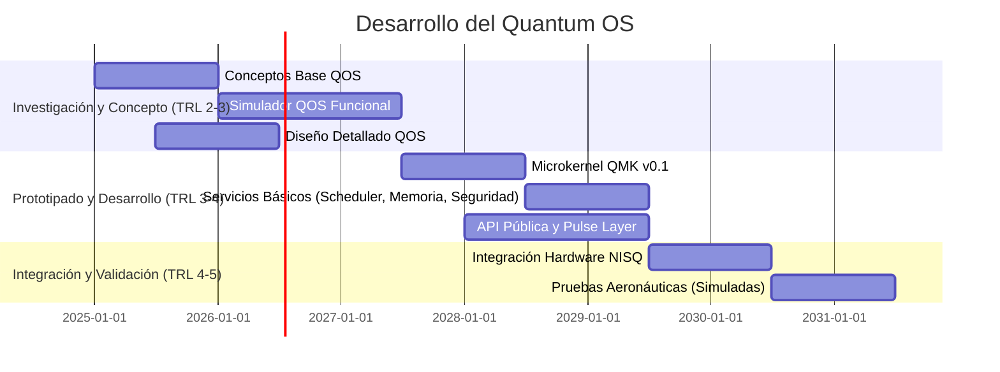

# Concepto y Diseño Detallado de Sistema Operativo Cuántico (QOS)

## Metadatos del Documento

  * **Document ID:** `QUA-QSOFT-25SVD0001-CON-BOB-R&I-TD-QCSAA-901-020-00-01-TPL-CON-012-QSCI-v1.0.0` (Actualizado y Consolidado)
  * **Template ID:** `TPL-CON-012` (Consolidado con `TPL-CON-020`)
  * **Version:** `1.0.0`
  * **Status:** Draft - Diseño Detallado y Concepto Consolidado
  * **Classification:** Research & Innovation
  * **Date:** 2025-07-28
  * **Q-Division:** QSCI (Quantum Science & Research)
  * **Product Line:** QUANTUM
  * **Product:** QSOFT (Quantum Software)
  * **Lifecycle Phase:** CONCEPT & DESIGN (TRL 2-4)
  * **Entity Type:** BOB (Digital/Virtual System)
  * **UTCS Category:** QCSAA-901 (Quantum Software Architecture)
  * **Subsystem:** 020 (Operating System)

-----

## Propósito

Definir el concepto y el diseño detallado de un **Sistema Operativo Cuántico (QOS)** diseñado específicamente para gestionar recursos cuánticos y clásicos en plataformas aeroespaciales de A.Q.U.A.-V. Este documento establecerá su arquitectura, funcionalidades clave, consideraciones de seguridad, métricas de desarrollo y un plan preliminar de certificación.

-----

## Control del Documento

| Propiedad          | Valor                                       |
| :------------------ | :------------------------------------------ |
| Creado Por          | División QSCI                               |
| Fecha de Creación   | 2025-07-28                                  |
| Última Modificación | 2025-07-28                                  |
| Ciclo de Revisión   | 3 meses                                     |
| Distribución        | Arquitectos de Sistema, Investigadores OS, Ingenieros Cuánticos, Equipo de Certificación |
| Documentos Relacionados | TPL-CON-010 (Arquitectura General), TPL-CON-011 (Arquitectura Híbrida), TPL-CON-013 (Framework de Middleware Cuántico), TPL-CON-100 (QNS Integration) |
| TRL Base            | 2 (Concepto tecnológico formulado)          |
| TRL Objetivo 2030   | 5 (Validación en entorno relevante)         |

-----

## 1\. Introducción

### 1.1 Motivación

Los sistemas operativos tradicionales fueron diseñados para gestionar **recursos clásicos deterministas**. La computación cuántica introduce paradigmas fundamentalmente diferentes que requieren un nuevo enfoque en la gestión de recursos del sistema para entornos aeroespaciales de misión crítica:

  * **Estados de superposición** que colapsan al ser medidos.
  * **Entrelazamiento cuántico** entre qubits.
  * **Coherencia limitada** en el tiempo.
  * **Corrección de errores** continua y de alto overhead.
  * **Paralelismo cuántico** masivo.
  * Naturaleza **probabilística** de los resultados cuánticos.
  * **Vulnerabilidades de seguridad** inherentes a los principios cuánticos (e.g., *no-cloning theorem*).

### 1.2 Visión del QOS

El Sistema Operativo Cuántico (QOS) de A.Q.U.A.-V. se concibe como el intermediario esencial entre las aplicaciones aeroespaciales avanzadas y la compleja interacción de hardware cuántico y clásico. Su propósito es abstraer las complejidades del hardware, optimizar la utilización de recursos cuánticos frágiles y proporcionar un entorno operativo seguro y confiable para cargas de trabajo híbridas.

```mermaid
graph TD
    subgraph "Sistema Operativo Cuántico AQUA"
        APP[Aplicaciones<br/>Aeroespaciales]
        QOS[Quantum OS Core]
        QRES[Gestión Recursos<br/>Cuánticos]
        CRES[Gestión Recursos<br/>Clásicos]
        QHW[Hardware<br/>Cuántico (QPU)]
        CHW[Hardware<br/>Clásico (CPU/GPU)]
        
        APP --> QOS
        QOS --> QRES
        QOS --> CRES
        QRES --> QHW
        CRES --> CHW
        
        QRES <--> CRES
    end
    
    style QOS fill:#f9f,stroke:#333,stroke-width:4px
```

-----

## 2\. Arquitectura Conceptual y Técnica del QOS

El QOS se estructura en capas y componentes clave para manejar la naturaleza híbrida de la computación cuántica.

### 2.1 Capas del Sistema Operativo

La arquitectura del QOS se define en un modelo de capas, donde cada capa proporciona servicios a la superior y abstrae detalles de la inferior, culminando en un microkernel cuántico de bajo nivel.

```mermaid
graph TD
    subgraph "Arquitectura QOS en Capas"
        L5[Capa 5: APIs y Servicios de Aplicación]
        L4[Capa 4: Gestión de Procesos Cuánticos]
        L3[Capa 3: Sistema de Archivos Cuántico (QFS)]
        L2[Capa 2: Scheduler Híbrido y Gestión de Memoria]
        L1[Capa 1: Abstracción de Hardware (HAL Cuántica)]
        L0[Capa 0: Microkernel Cuántico (QMK)]
        
        L5 --> L4 --> L3 --> L2 --> L1 --> L0
    end
    
    style L0 fill:#9ff,stroke:#333,stroke-width:2px
```

### 2.2 Componentes Principales Internos

Los componentes internos del QOS están diseñados para operar de forma híbrida, gestionando tanto recursos cuánticos como clásicos.

#### 2.2.1 Microkernel Cuántico (QMK)

El **Quantum Microkernel** es el núcleo mínimo del QOS, responsable de la gestión de recursos cuánticos fundamentales y la interacción directa con el hardware.

```python
class QuantumMicrokernel:
    """
    Núcleo mínimo para gestión de recursos cuánticos básicos
    TRL: 2 (Concepto formulado) -> Objetivo TRL 4
    """
    
    def __init__(self):
        self.qubit_registry = QubitRegistry()
        self.coherence_monitor = CoherenceMonitor()
        self.error_corrector = ErrorCorrectionEngine()
        self.quantum_memory = QuantumMemoryManager()
        self.pulse_abstraction_layer = PulseAbstractionLayer() # Añadido
        
    def allocate_qubits(self, request: QubitRequest) -> QubitAllocation:
        """
        Asignación de qubits con garantías de coherencia
        """
        # Verificar disponibilidad
        available = self.qubit_registry.get_available_qubits()
        
        # Evaluar calidad (coherencia, conectividad, fidelidad)
        quality_scores = self.evaluate_qubit_quality(available)
        
        # Asignar los mejores qubits disponibles
        allocation = self.select_optimal_qubits(
            request.num_qubits,
            request.min_coherence_time,
            quality_scores
        )
        
        # Reservar y monitorear
        self.coherence_monitor.track(allocation)
        
        return allocation

    def execute_pulse_schedule(self, schedule: List[PulseInstruction]) -> QPUResult:
        """
        Envía un horario de pulsos directamente a la QPU a través de la HAL.
        """
        return self.pulse_abstraction_layer.send_schedule(schedule)

    # ... (métodos adicionales para gestión de hardware de bajo nivel)
```

#### 2.2.2 Gestor de Estados Cuánticos

El **Quantum State Manager** se encarga del ciclo de vida de los estados cuánticos, una tarea compleja debido a las propiedades únicas de la mecánica cuántica.

```python
class QuantumStateManager:
    """
    Gestión del ciclo de vida de estados cuánticos
    TRL: 1 (Principios básicos observados) -> Objetivo TRL 3
    """
    
    def __init__(self):
        self.state_store = QuantumStateStore()
        self.entanglement_tracker = EntanglementTracker()
        
    def create_quantum_state(self, qubits: List[Qubit]) -> QuantumState:
        """
        Crear y registrar un nuevo estado cuántico
        """
        state = QuantumState(qubits)
        
        # Registrar en el sistema
        state_id = self.state_store.register(state)
        
        # Configurar monitoreo de decoherencia
        self.setup_decoherence_monitoring(state_id)
        
        return state
        
    def checkpoint_state(self, state: QuantumState) -> StateCheckpoint:
        """
        Crear checkpoint para recuperación (si es posible)
        Nota: No-cloning theorem limita opciones
        """
        # Estrategias limitadas por física cuántica
        if state.is_classical():
            return self.classical_checkpoint(state)
        else:
            # Checkpointing cuántico usa QEC y/o métodos de "snapshot" clásicos destructivos
            return self.quantum_error_correction_checkpoint(state)
```

-----

## 3\. Gestión de Recursos

### 3.1 Scheduler Híbrido Cuántico-Clásico

El **Hybrid Quantum Scheduler** es fundamental para optimizar el uso de los recursos escasos y frágiles del hardware cuántico, en coordinación con los recursos clásicos.

```python
class HybridQuantumScheduler:
    """
    Planificador que optimiza uso de recursos cuánticos y clásicos
    TRL: 2 (Diseño conceptual) -> Objetivo TRL 4
    """
    
    def __init__(self):
        self.quantum_queue = PriorityQueue()
        self.classical_queue = PriorityQueue()
        self.resource_monitor = ResourceMonitor()
        
    def schedule_job(self, job: ComputationJob) -> ScheduleDecision:
        """
        Decisión inteligente de planificación
        """
        # Análisis del trabajo
        quantum_benefit = self.analyze_quantum_advantage(job)
        resource_needs = job.estimate_resources()
        
        # Estado actual del sistema
        quantum_load = self.resource_monitor.quantum_utilization()
        classical_load = self.resource_monitor.classical_utilization()
        coherence_window = self.resource_monitor.coherence_time_available()
        
        # Lógica de decisión
        if quantum_benefit > 10 and coherence_window > resource_needs.min_time:
            return self.schedule_quantum(job)
        elif quantum_benefit > 1:
            return self.schedule_hybrid(job)
        else:
            return self.schedule_classical(job)
    
    def preemption_policy(self) -> PreemptionRules:
        """
        Política de apropiación para trabajos cuánticos
        """
        return PreemptionRules(
            quantum_jobs_non_preemptible=True,  # No interrumpir cálculos cuánticos activos
            save_partial_results=True,          # Guardar resultados parciales (si aplica)
            coherence_based_priority=True       # Prioridad basada en tiempo de coherencia restante
        )
```

### 3.2 Sistema de Memoria Cuántica

El **Quantum Memory Manager** gestiona la asignación y liberación de qubits lógicos, considerando sus propiedades físicas.

```python
class QuantumMemoryManager:
    """
    Gestión de memoria cuántica (qubits lógicos)
    TRL: 1 (Investigación inicial) -> Objetivo TRL 4
    """
    
    def __init__(self, total_qubits: int):
        self.total_qubits = total_qubits
        self.allocation_table = AllocationTable()
        self.garbage_collector = QuantumGarbageCollector()
        
    def allocate(self, size: int, coherence_requirement: float) -> MemoryBlock:
        """
        Asignar bloque de memoria cuántica
        """
        # Buscar bloque contiguo con coherencia adecuada
        block = self.find_suitable_block(size, coherence_requirement)
        
        if not block:
            # Intentar desfragmentación cuántica
            self.garbage_collector.collect()
            block = self.find_suitable_block(size, coherence_requirement)
            
        if block:
            self.allocation_table.mark_allocated(block)
            return block
        else:
            raise QuantumMemoryException("Insufficient quantum memory")
    
    def deallocate(self, block: MemoryBlock):
        """
        Liberar memoria cuántica y resetear qubits
        """
        # Reset seguro de qubits a estado fundamental |0⟩
        for qubit in block.qubits:
            qubit.reset_to_ground_state()
            
        self.allocation_table.mark_free(block)
```

-----

## 4\. Sistema de Archivos Cuántico (QFS)

### 4.1 Concepto de Almacenamiento Cuántico

El **Quantum File System** aborda el desafío de almacenar información cuántica, limitado por el teorema de no clonación.

```python
class QuantumFileSystem:
    """
    Sistema de archivos para datos cuánticos
    TRL: 1 (Concepto teórico) -> Objetivo TRL 3
    """
    
    def __init__(self):
        self.namespace = QuantumNamespace()
        self.storage_backend = HybridStorage() # Almacenamiento híbrido (clásico + ref cuántica)
        
    def store_quantum_data(self, data: QuantumData, path: str) -> FileHandle:
        """
        Almacenar información cuántica
        Desafío: No-cloning theorem. Estrategias:
        1. Almacenar descripción del circuito que genera el estado (no el estado).
        2. Tomografía cuántica (destructiva, almacena datos clásicos de la medición).
        3. Almacenamiento híbrido: Referencia a qubits activos + metadatos clásicos.
        """
        
        if data.is_circuit_description():
            return self.store_circuit(data, path)
        elif data.allows_tomography(): # Requiere mediciones destructivas
            classical_data = self.perform_tomography(data)
            return self.store_classical(classical_data, path)
        else: # Almacena referencia y metadatos, no el estado cuántico en sí.
            return self.store_reference(data, path)
```

### 4.2 Metadatos Cuánticos

Los metadatos para archivos cuánticos deben capturar las propiedades efímeras y contextuales de la información cuántica.

```python
class QuantumMetadata:
    """
    Metadatos específicos para archivos cuánticos
    """
    
    def __init__(self):
        self.creation_time: datetime
        self.coherence_time: float  # Tiempo de coherencia del estado al crear (en µs)
        self.entanglement_map: Dict[Qubit, List[Qubit]] # Mapa de entrelazamientos iniciales
        self.fidelity: float         # Fidelidad estimada del estado
        self.quantum_volume: int     # Volumen cuántico del circuito/hardware usado
        self.error_rate: float       # Tasa de error de puertas en el momento de creación
        self.hardware_requirements: HardwareSpec # Especificaciones del hardware requerido para recrear/interactuar
```

-----

## 5\. Seguridad y Aislamiento

La seguridad en el QOS aborda desafíos únicos derivados de la mecánica cuántica, como el aislamiento de estados y el control de operaciones que colapsan la superposición o crean entrelazamiento.

### 5.1 Aislamiento de Procesos Cuánticos

El **Quantum Process Isolation** garantiza que los procesos cuánticos se ejecuten en entornos aislados para evitar interferencias y fugas de información.

```python
class QuantumProcessIsolation:
    """
    Aislamiento entre procesos cuánticos
    TRL: 2 (Diseño conceptual) -> Objetivo TRL 4
    """
    
    def __init__(self):
        self.process_table = QuantumProcessTable()
        self.isolation_monitor = IsolationMonitor()
        
    def create_quantum_sandbox(self, process: QuantumProcess) -> Sandbox:
        """
        Crear entorno aislado para proceso cuántico (QuantumProcessSandbox)
        """
        sandbox = Sandbox()
        
        # Asignar qubits dedicados (sin compartir)
        sandbox.qubits = self.allocate_isolated_qubits(process.qubit_count)
        
        # Configurar barreras de decoherencia (físicas o lógicas)
        sandbox.decoherence_barriers = self.setup_barriers(sandbox.qubits)
        
        # Monitoreo de cross-talk (interferencia entre qubits no deseada)
        self.isolation_monitor.watch_crosstalk(sandbox)
        
        return sandbox
    
    def enforce_quantum_security(self, sandbox: Sandbox):
        """
        Aplicar políticas de seguridad cuántica
        """
        # Prevenir mediciones no autorizadas
        self.protect_from_measurement(sandbox)
        
        # Detectar intentos de entrelazamiento no autorizado (quantum cross-talk)
        self.monitor_entanglement_attempts(sandbox)
        
        # Aplicar límites de decoherencia y forzar reinicio si se exceden
        self.enforce_coherence_limits(sandbox)
```

### 5.2 Control de Acceso Cuántico (QuantumACL)

El **Quantum Access Control** define los permisos necesarios para realizar operaciones cuánticas sensibles.

```python
class QuantumAccessControl:
    """
    Control de acceso a recursos cuánticos
    TRL: 2 (Diseño conceptual) -> Objetivo TRL 4
    """
    
    def __init__(self):
        self.acl = QuantumACL()
        self.audit_log = QuantumAuditLog()
        
    def check_permission(self, 
                        principal: Principal, 
                        resource: QuantumResource, 
                        operation: Operation) -> bool:
        """
        Verificar permisos para operaciones cuánticas
        """
        # Permisos especiales para operaciones cuánticas
        if operation == Operation.MEASURE:
            # Medición destruye superposición y requiere permiso explícito
            return self.acl.can_destroy_superposition(principal, resource)
        elif operation == Operation.ENTANGLE:
            # Entrelazamiento crea dependencias y puede ser una amenaza de seguridad
            return self.acl.can_create_entanglement(principal, resource)
        elif operation == Operation.ALLOCATE_QUBITS:
            return self.acl.can_allocate(principal, resource)
        elif operation == Operation.RESET:
            return self.acl.can_reset_state(principal, resource)
        else:
            return self.acl.check_standard(principal, resource, operation)
```

### 5.3 Amenazas y Controles de Seguridad Cuántica (Integrado de Anexo C)

El modelo de seguridad del QOS se basa en la identificación de amenazas específicas del dominio cuántico y la aplicación de políticas y mecanismos de mitigación.



**Políticas Fundamentales:**

  * **No Entrelazamiento Externo:** Prohibido entrelazar qubits fuera del **Quantum Process Sandbox** asignado.
  * **No Clonación:** Prohibida la replicación de estados cuánticos (*No-cloning theorem* por diseño).
  * **Prioridad de Coherencia:** Procesos con menor tiempo de coherencia restante pueden tener prioridad o ser migrados.
  * **Acceso Solo por Rol Cuántico:** Operaciones sensibles (medir, entangle, reset) requieren permisos explícitos basados en roles.

**Amenazas Identificadas y Mitigaciones:**

| Código | Descripción                                                  | Impacto                                                  | Mitigación                                                   |
| :----- | :----------------------------------------------------------- | :------------------------------------------------------- | :----------------------------------------------------------- |
| Q01    | Medición no autorizada                                       | Colapso del estado cuántico, pérdida de información      | QuantumACL, Registro de Auditoría Cuántica                   |
| Q02    | Entrelazamiento lateral (Cross-talk)                         | Corrupción o fuga de información entre procesos vecinos  | QuantumProcessSandbox, **Isolation Monitor** |
| Q03    | Captura de circuito sin fidelidad                            | Pérdida de integridad semántica de los resultados        | Limitación de tomografía, validación de fidelidad            |
| Q04    | Reutilización de qubits sin reset                            | Herencia de estados no deseados, decoherencia residual   | **Quantum Garbage Collector** obligatorio, reset seguro      |
| Q05    | Ejecución fuera de ventana de coherencia                     | Resultados inválidos o degradados, inestabilidad         | **Scheduler** con monitoreo de coherencia                    |

**Auditoría Cuántica:**

El QOS mantendrá un registro detallado de eventos cuánticos relevantes para trazabilidad y auditoría forense.

```json
{
  "event_id": "QSEC-003042",
  "timestamp": "2025-07-28T22:40:00Z",
  "type": "measurement_attempt",
  "qubits": [2,3],
  "initiator": "user:qnav_service_PID_123",
  "policy_check": "DENIED",
  "reason": "Unauthorized_Operation",
  "fidelity_at_time": 98.9
}
```

Tipos de Eventos Auditables: Inicio/término de sandbox, solicitud de qubits, intentos/realizaciones de medición, checkpointing, intentos de entrelazamiento, fugas de coherencia, activación de QEC.

**Integridad del Sistema:**

  * **Heartbeat Cuántico:** Comprobación continua de integridad de los canales de control y comunicación con la QPU.
  * **Redundancia Estocástica:** Ejecución periódica aleatoria de circuitos de validación conocidos para verificar el estado de la QPU.
  * **Checksum de Fidelidad:** Verificación del valor esperado vs. fidelidad real; si la desviación es significativa, el recurso se marca como degradado o corrupto.
  * **Desactivación Condicionada:** Bloqueo automático de recursos o reinicio de procesos al detectar anomalías críticas.

-----

## 6\. APIs y Servicios del Sistema

El QOS expone diversas APIs y servicios para interactuar con aplicaciones y gestionar el hardware cuántico.

### 6.1 API de Sistema para Aplicaciones

La **Quantum System API** es la interfaz principal para que las aplicaciones de alto nivel interactúen con los recursos cuánticos gestionados por el QOS.

```python
class QuantumSystemAPI:
    """
    API principal para aplicaciones cuánticas
    TRL: 2 (Diseño de interfaces) -> Objetivo TRL 5
    """
    
    def __init__(self):
        self.kernel = QuantumMicrokernel()
        self.scheduler = HybridQuantumScheduler()
        self.memory = QuantumMemoryManager()
        self.transpiler = QuantumCircuitTranspiler() # Para compilar a instrucciones de bajo nivel
        
    async def execute_quantum_circuit(self, 
                                    circuit: QuantumCircuit, 
                                    options: ExecutionOptions) -> Result:
        """
        Ejecutar circuito cuántico con gestión completa del OS
        """
        # 1. Solicitar recursos al scheduler
        resources = await self.request_resources(circuit.resource_requirements())
        
        # 2. Compilar/transpilar para hardware objetivo
        compiled_circuit = self.transpiler.compile_for_target(circuit, resources.hardware)
        
        # 3. Enviar a Microkernel para ejecución a nivel de pulsos
        try:
            # Asumiendo que el Microkernel tiene un método para ejecutar circuitos transpilados
            result = await self.kernel.execute_circuit(compiled_circuit, resources)
            return result
        finally:
            # 4. Liberar recursos
            await self.release_resources(resources)
    
    def get_system_status(self) -> SystemStatus:
        """
        Estado del sistema cuántico
        """
        return SystemStatus(
            total_qubits=self.kernel.qubit_registry.total_count(),
            available_qubits=self.kernel.qubit_registry.available_count(),
            average_coherence_time=self.kernel.coherence_monitor.average_t2(),
            quantum_volume=self.calculate_quantum_volume(),
            active_processes=self.scheduler.active_job_count()
        )
```

**API Pública (qos.sys.api.v1) - Endpoints Clave:**

| Endpoint           | Método | Descripción                                                  |
| :----------------- | :----- | :----------------------------------------------------------- |
| `/circuit/execute` | `POST` | Ejecuta un circuito cuántico o híbrido.                      |
| `/resources/allocate` | `POST` | Solicita y reserva recursos cuánticos (qubits, tiempo de coherencia). |
| `/system/status`   | `GET`  | Proporciona el estado actual del QOS y la QPU.               |
| `/sandbox/init`    | `POST` | Inicializa un entorno de ejecución cuántica aislado.         |
| `/security/audit_log` | `GET`  | Recupera el registro de auditoría de eventos cuánticos.      |

### 6.2 Servicios del Sistema

El QOS proporciona una serie de servicios internos y externos para gestionar el entorno cuántico.

```python
# Servicios principales del QOS
quantum_os_services = {
    "resource_manager": {
        "description": "Gestión de qubits, puertas cuánticas y recursos clásicos.",
        "api": "/qos/v1/resources",
        "trl": 2
    },
    "scheduler": {
        "description": "Planificación y orquestación de trabajos híbridos.",
        "api": "/qos/v1/scheduler",
        "trl": 2
    },
    "error_correction": {
        "description": "Servicio de corrección continua de errores cuánticos (QEC).",
        "api": "/qos/v1/error_correction",
        "trl": 1
    },
    "calibration": {
        "description": "Calibración automática y re-calibración de hardware de QPU.",
        "api": "/qos/v1/calibration",
        "trl": 2
    },
    "monitoring": {
        "description": "Monitoreo en tiempo real de coherencia, fidelidad y performance de la QPU.",
        "api": "/qos/v1/monitoring",
        "trl": 2
    },
    "security": { # Nuevo servicio de seguridad
        "description": "Gestión de políticas de seguridad cuántica, ACL y sandboxing.",
        "api": "/qos/v1/security",
        "trl": 2
    },
    "transpiler": { # Nuevo servicio de transpilación
        "description": "Compilación y optimización de circuitos cuánticos para QPU objetivo.",
        "api": "/qos/v1/transpiler",
        "trl": 2
    }
}
```

### 6.3 Especificación Pulse API (Integrado de Anexo A)

La **Pulse Abstraction Layer** dentro del Microkernel Cuántico expone una API de bajo nivel para el control directo de la QPU mediante pulsos físicos.

**A.1 Objetivo:** Definir un conjunto unificado de instrucciones e interfaces temporales para controlar puertas cuánticas a nivel de pulsos físicos en hardware real (NISQ), asegurando compatibilidad entre el microkernel y la QPU.

**A.2 Arquitectura General:**

```mermaid
graph LR
    QOS[QOS Microkernel] --> PAPI[Pulse API]
    PAPI --> SCHED[Pulse Scheduler (en QPU Controller)]
    SCHED --> QPU[Quantum Processing Unit]
```

**A.3 Componentes de la API:**

**A.3.1 Estructura de Pulso:**

```json
{
  "pulse_id": "pulse_X90",
  "type": "gaussian",
  "duration": 160,
  "amplitude": 0.8,
  "sigma": 40,
  "frequency": 5.3e9,
  "phase": 0.0
}
```

| Campo      | Descripción                                |
| :--------- | :----------------------------------------- |
| `pulse_id` | Identificador único del pulso              |
| `type`     | Forma del pulso (gaussian, square, drag, etc.) |
| `duration` | Duración total (en ns)                     |
| `amplitude` | Amplitud máxima del pulso                  |
| `sigma`    | Parámetro de forma para gaussian           |
| `frequency` | Frecuencia de emisión (Hz)                 |
| `phase`    | Fase inicial del pulso (rad)               |

**A.3.2 Secuencia Temporal (Pulse Schedule):**

Una lista ordenada de instrucciones de pulso a ejecutar en un `timeline`.

```json
[
  {"time": 0, "channel": "d0", "pulse_id": "pulse_X90"},
  {"time": 160, "channel": "d0", "pulse_id": "pulse_Idle"},
  {"time": 200, "channel": "m0", "command": "measure", "qubit_idx": 0}
]
```

  * `channel`: Canal de control (dN para drive, mN para measure, uN para update, aN para acquire).
  * `command`: Acciones directas como `measure`, `acquire`, `reset`.
  * `time`: Timestep absoluto en ns desde el inicio del horario.

**A.3.3 Canales Soportados:**

| Canal | Tipo    | Función                                   |
| :---- | :------ | :---------------------------------------- |
| `dN`  | Drive   | Aplicar operaciones/puertas cuánticas.    |
| `mN`  | Measure | Medir qubits.                             |
| `uN`  | Update  | Actualizar parámetros de calibración.     |
| `aN`  | Acquire | Captura analógica del resultado de la medición. |

**A.4 Protocolo de Comunicación:**

  * **Transporte:** gRPC o REST sobre Unix Socket / PCIe para baja latencia.
  * **Frecuencia de sincronización:** Idealmente en el rango de 10 MHz – 1 GHz.
  * **Compilación Previa:** El microkernel genera el `pulse_schedule` y lo envía al `QPU Controller`.
  * **Respuesta Esperada:** `ExecutionResult`, fidelidad estimada y `timestamps` de ejecución.

**A.5 Mecanismos Avanzados:**

  * **Dynamic Decoupling:** Inserción automática de pulsos para preservar coherencia.
  * **Conditional Gates:** Ejecución de pulsos basada en resultados de mediciones previas a tiempo real.
  * **Measurement Feedback:** Realimentación clásica a tiempo casi real para algoritmos adaptativos.
  * **Frequency Modulation:** Variación dinámica de la frecuencia del canal en función de condiciones ambientales (temperatura, drift).

**A.6 Compatibilidad:**

El diseño de la Pulse API busca la mayor compatibilidad posible con frameworks existentes.

| Proveedor    | Compatibilidad Pulse | Notas                                       |
| :----------- | :------------------- | :------------------------------------------ |
| IBM Qiskit   | ✔️ Total (Qobj / OpenPulse) | Compatible con backend Pulse                |
| Rigetti Quil-T | ✔️ Parcial             | Requiere traducción gate→pulse              |
| IonQ / Trapped-Ion | ❌ No pulse-level expuesto | A implementar con capa de emulación/traducción |
| AWS Braket   | ✔️ Parcial             | Soporta pulsos con Braket SDK               |

### 6.4 Lista de Instrucciones Cuánticas Soportadas (Integrado de Anexo B)

El QOS, a través de su transpilador y la Pulse API, soporta un conjunto de instrucciones cuánticas fundamentales y avanzadas.

**B.1 Clasificación General:**

| Clase   | Descripción                               |
| :------ | :---------------------------------------- |
| `SGL`   | Operaciones de un solo qubit (Single-Qubit Gates) |
| `CPL`   | Operaciones de control (Controlled Gates) |
| `MEAS`  | Medición y Reset                          |
| `QEC`   | Corrección de errores cuánticos           |
| `MIXED` | Operaciones híbridas o mixtas (Cuántico-Clásico) |

**B.2 Tabla de Instrucciones Soportadas:**

**B.2.1 Instrucciones Básicas – Single-Qubit Gates (SGL):**

| Código | Nombre           | Descripción                           | Equivalencia Pulse (Ej.) |
| :----- | :--------------- | :------------------------------------ | :----------------------- |
| X      | Puerta X (NOT)   | Invierte el estado del qubit          | Drive(pi\_pulse)          |
| Y      | Puerta Y         | Rotación π alrededor del eje Y        | Drive(pi\_pulse, phase=π/2) |
| Z      | Puerta Z         | Cambia la fase π                      | Virtual Phase            |
| H      | Hadamard         | Crea superposición                    | X90\_pulse + Z90\_pulse    |
| S      | Phase Gate (π/2) | Rotación π/2 alrededor del eje Z      | Virtual Phase (π/2)      |
| T      | T-Gate (π/4)     | Rotación π/4 alrededor del eje Z      | Virtual Phase (π/4)      |
| Rx(θ)  | Rotación Arbitraria X | Rotación arbitraria θ alrededor del eje X | Drive(θ\_pulse)           |
| Ry(θ)  | Rotación Arbitraria Y | Rotación arbitraria θ alrededor del eje Y | Drive(θ\_pulse, phase=π/2) |
| Rz(θ)  | Rotación Arbitraria Z | Rotación arbitraria θ alrededor del eje Z | Virtual Phase (θ)        |

**B.2.2 Instrucciones de Control – Controlled Gates (CPL):**

| Código | Nombre    | Qubits de Control | Descripción                           |
| :----- | :-------- | :---------------- | :------------------------------------ |
| CX     | CNOT      | 1                 | NOT condicional                       |
| CCX    | Toffoli   | 2                 | NOT doble condicional                 |
| CZ     | Controlled-Z | 1                 | Introduce π fase si control = 1       |
| CRx(θ) | Controlled-Rx | 1                 | Rotación condicional en X             |
| CSWAP  | Fredkin   | 1                 | Swap controlado                       |

**B.2.3 Medición y Reset (MEAS):**

| Código            | Descripción                                                  | Soporte Pulse     |
| :---------------- | :----------------------------------------------------------- | :---------------- |
| `measure q[i] -> c[i]` | Mide el qubit `q[i]` y guarda en bit clásico `c[i]`         | `measure Pulse`   |
| `reset q[i]`      | Lleva el qubit `q[i]` al estado fundamental `|0⟩`            | `reset`           |
| `acquire`         | Captura y digitaliza el resultado analógico de la medición   | `acquire_channel` |

**B.2.4 Corrección de Errores Cuánticos (QEC):**

| Código    | Nombre              | Descripción                                                  | Observaciones                                                |
| :-------- | :------------------ | :----------------------------------------------------------- | :----------------------------------------------------------- |
| ENCODE    | Codificación Lógica | Codifica qubits físicos en qubits lógicos con redundancia    | Supone soporte de superficie o códigos de repetición         |
| SYNDROME  | Lectura de Síndromes | Medición de síndromes de error sin destruir el estado lógico | Requiere ciclos de pulsos dedicados                          |
| CORRECT   | Aplicación de Corrección | Aplica operaciones de recuperación basadas en los síndromes | Integrado con QMK Error Correction Engine                    |

**B.2.5 Operaciones Híbridas o Especiales (MIXED):**

| Código            | Tipo         | Descripción                                                  |
| :---------------- | :----------- | :----------------------------------------------------------- |
| `if (c[i] == 1) X q[j]` | Condicional  | Operación cuántica controlada clásicamente (requiere realimentación clásica rápida) |
| `wait(t)`         | Sincronización | Espera activa o pasiva (coherentemente) por un tiempo `t`    |
| `barrier`         | Barrera      | Impide la reordenación de operaciones por el compilador para asegurar el orden o aislar qubits |
| `snapshot`        | Toma de Estado | Captura el estado cuántico actual (principalmente para simuladores o tomografía destructiva) |
| `classical_log()` | Logging      | Registra eventos clásicos para trazabilidad y depuración     |

**B.3 Consideraciones para Transpilación:**

El QOS incluye un módulo de transpilación que convierte circuitos de alto nivel (QASM, Qiskit, Quil) a las instrucciones de pulso de bajo nivel.

| Fuente (High-Level) | Target (Pulse API) | Notas                                       |
| :------------------ | :----------------- | :------------------------------------------ |
| `HRx(pi/2) + Rz(pi)` | Descomposición común |                                             |
| `TRz(pi/4)`         | Descomposición simple para `T` gate |                                             |
| `CX`                | `X` + cross-resonance pulse | Implementación física común para CNOT en arquitecturas de transmon |
| `CSWAP`             | Descompuesto en `CX` y `Toffoli` | Requiere varias puertas de 2 y 3 qubits     |

-----

## 7\. Casos de Uso Aeroespaciales

El QOS es el habilitador clave para diversas aplicaciones cuánticas en el dominio aeroespacial.

### 7.1 Gestión de QNS (Quantum Navigation System)

El **QNS Process Manager** gestiona los procesos críticos de navegación cuántica, asegurando la asignación de recursos dedicados y el máximo aislamiento.

```python
class QNSProcessManager:
    """
    Gestión especializada para procesos de navegación cuántica
    """
    
    def __init__(self, qos: QuantumOS):
        self.qos = qos
        self.navigation_priority = Priority.CRITICAL # Prioridad de misión crítica
        
    async def start_navigation_service(self) -> NavigationProcess:
        """
        Iniciar servicio de navegación con prioridad crítica
        """
        # Solicitar recursos dedicados con requisitos estrictos de coherencia y error
        resources = await self.qos.request_dedicated_resources(
            qubits=100, # Número de qubits lógicos
            coherence_time_min=1000,  # microsegundos (µs)
            error_rate_max=0.001      # Tasa de error máxima para puertas
        )
        
        # Crear proceso con aislamiento total para evitar interferencias
        process = await self.qos.create_critical_process(
            name="QNS_Navigation_Service",
            resources=resources,
            restart_policy=RestartPolicy.ALWAYS, # Reinicio automático en caso de fallo
            isolation_level=IsolationLevel.MAXIMUM # Aislamiento físico de qubits
        )
        
        return process
```

### 7.2 Integración con Sistemas de Aeronave

El QOS se integrará con los sistemas de aviónica clásicos existentes para permitir un flujo de datos híbrido y la toma de decisiones.



-----

## 8\. Desafíos Técnicos

El desarrollo de un QOS implica superar barreras significativas en la computación cuántica actual.

### 8.1 Principales Desafíos

| Desafío                 | Descripción                                                  | Estrategia de Investigación                                  |
| :---------------------- | :----------------------------------------------------------- | :----------------------------------------------------------- |
| No-cloning theorem      | Imposibilidad de copiar estados cuánticos arbitrarios.       | Desarrollar técnicas de recuperación y `checkpointing` alternativas (e.g., basados en QEC). |
| Decoherencia            | Pérdida rápida de información cuántica por interacción ambiental. | Scheduling optimizado por coherencia, `dynamic decoupling`, QEC continua. |
| Limitaciones de medición | Colapso del estado al ser medido, pérdida de superposición.  | Minimizar mediciones intermedias, uso de `weak measurements` para monitoreo no destructivo. |
| Escalabilidad           | Gestionar miles o millones de qubits con alta conectividad.  | Arquitectura jerárquica y distribuida del QOS, virtualización cuántica. |
| Corrección de errores (QEC) | Overhead significativo de qubits y operaciones para QEC.     | Códigos de error optimizados, `fault-tolerant computing` eficiente. |
| Fidelidad y Ruido       | Alta tasa de error en puertas y qubits físicos.              | Calibración automática continua, `error mitigation` a nivel de software/hardware. |

### 8.2 Áreas de Investigación Activa

```python
research_areas = {
    "fault_tolerant_os": {
        "description": "Desarrollo de un OS tolerante a fallos cuánticos.",
        "trl_current": 1,
        "trl_target_2030": 4,
        "key_challenges": ["Error propagation control", "Logical qubit management", "Robust resource allocation"]
    },
    "quantum_virtualization": {
        "description": "Virtualización de recursos cuánticos (ej. múltiples máquinas virtuales sobre una QPU).",
        "trl_current": 1,
        "trl_target_2030": 3,
        "key_challenges": ["Qubit multiplexing", "State isolation across virtual machines", "Performance overhead of virtualization"]
    },
    "distributed_quantum_os": {
        "description": "OS para computación cuántica distribuida y *quantum networking*.",
        "trl_current": 1,
        "trl_target_2030": 3,
        "key_challenges": ["Quantum networking protocols", "Distributed entanglement generation and management", "Secure quantum communication"]
    },
    "qos_verification_validation": { # Nueva área
        "description": "Métodos formales y probabilísticos para verificación y validación del QOS.",
        "trl_current": 1,
        "trl_target_2030": 4,
        "key_challenges": ["Probabilistic testing", "Formal methods for quantum programs", "Runtime verification of coherence"]
    }
}
```

-----

## 9\. Hoja de Ruta de Desarrollo y Métricas

El desarrollo del QOS sigue un plan de fases y hitos, con métricas claras para medir el progreso y la madurez tecnológica.

### 9.1 Fases de Evolución



### 9.2 Hitos Clave

| Año  | Hito Clave                       | Entregable                                   | TRL Objetivo |
| :--- | :------------------------------- | :------------------------------------------- | :----------- |
| 2026 | Simulador QOS Funcional          | Simulador funcional en plataforma clásica    | 2            |
| 2027 | Microkernel Alpha Ejecutable     | Primera versión ejecutable del QMK sobre hardware real/mock | 3            |
| 2028 | Gestión de Recursos Híbridos     | Scheduler y gestor de memoria funcionales    | 3            |
| 2029 | Integración QPU                  | Ejecución en hardware cuántico real (NISQ) y pruebas de interfaz | 4            |
| 2030 | Demo Aeronáutica Preliminar      | QOS integrado en simulador de vuelo para QNS/QDS | 5            |

### 9.3 Mapeo TRL–Módulo–KPI (Integrado de Anexo D)

Este mapeo establece la trazabilidad de madurez tecnológica y los indicadores clave de rendimiento (KPIs) para cada componente del QOS.

**D.2 Tabla de Mapeo TRL–Módulo–KPI:**

| Módulo                      | Descripción                                                  | TRL Actual | TRL Objetivo (2030) | KPIs Asociados (Objetivo 2030)                               |
| :-------------------------- | :----------------------------------------------------------- | :--------- | :------------------ | :----------------------------------------------------------- |
| Quantum Microkernel (QMK)   | Núcleo mínimo de gestión cuántica.                           | 2          | 4                   | Overhead \< 5%, Latencia de Operación \< 1 µs, Disponibilidad 99.9% |
| Quantum Scheduler           | Planificador híbrido Cuántico-Clásico.                       | 2          | 4                   | Utilización de Qubits \> 85%, Tasa de Preemption Error \< 0.1% |
| Quantum Memory Manager      | Gestión dinámica de bloques de qubits lógicos.               | 1          | 4                   | Tasa de Asignación Exitosa \> 98%, Fragmentación \< 2%        |
| Quantum State Manager       | Registro y seguimiento del ciclo de vida de estados.         | 1          | 3                   | Tasa de Decoherencia Predecible, Integridad de Estado \> 99.9% |
| Quantum File System (QFS)   | Almacenamiento indirecto de datos cuánticos.                 | 1          | 3                   | Tasa de Recuperación Lógica \> 99%, Tiempo Acceso Referencia \< 100 µs |
| Quantum System API Layer    | Interfaces públicas del QOS para aplicaciones.               | 2          | 5                   | Compatibilidad QASM 3.0, Latencia API \< 1 ms               |
| Pulse Abstraction Layer     | Traductor QMK ↔ QPU para control de pulsos.                  | 2          | 4                   | Fidelidad de Ejecución de Puerta \> 99.5%, Jitter \< 0.5 ns    |
| Quantum Security & ACL      | Control de acceso, sandbox y monitoreo de seguridad.         | 2          | 4                   | Violaciones Detectadas: 100%, Fugas de Coherencia: 0%, Aislamiento Verificado |
| QPU Hardware Driver         | Abstracción física de Unidades de Procesamiento Cuántico.    | 2          | 5                   | Latencia Física \< 1 µs, Integración Multi-Backend            |
| Quantum Diagnostic Monitor  | Monitoreo en tiempo real de coherencia y fidelidad.          | 1          | 3                   | Precisión de Alerta Predictiva \> 98%, Resolución Temporal \< 100 ns |

**D.3 KPIs de Rendimiento Global del Sistema (Objetivo 2030):**

| Métrica Global                     | Objetivo 2026 | Objetivo 2028 | Objetivo 2030 |
| :--------------------------------- | :------------ | :------------ | :------------ |
| Overhead Total del OS              | \< 20%         | \< 10%         | \< 5%          |
| Fidelidad Promedio en Ejecución    | \> 97%         | \> 98.5%       | \> 99.5%       |
| Latencia de Ejecución de Circuito Corto | \< 20 µs       | \< 10 µs       | \< 5 µs        |
| Uptime del Sistema                 | 90%           | 97%           | 99.9%         |
| Tiempo Medio entre Fallos (MTBF)   | N/A           | \> 50 h        | \> 500 h       |
| Tiempo Medio de Recuperación (MTTR) | N/A           | \< 30 s        | \< 5 s         |

-----

## 10\. Plan de Certificación y Conformidad

La certificación del QOS es un aspecto crítico para su despliegue en plataformas aeroespaciales. Se propone un plan preliminar basado en normativas existentes y extensiones necesarias para la naturaleza cuántica.

### 10.1 Referencias Normativas Clave (Integrado de E.3)

| Código     | Nombre                                       | Aplicación al QOS                                                  |
| :--------- | :------------------------------------------- | :----------------------------------------------------------- |
| DO-178C    | Software Considerations in Airborne Systems and Equipment Certification | Base fundamental: Aplica a la arquitectura del software, desarrollo, verificación, configuración y gestión del ciclo de vida del QOS. |
| DO-330     | Software Tool Qualification Considerations   | Cualificación de herramientas como el simulador QOS, transpiladores, herramientas de análisis de coherencia y fidelidad. |
| DO-326A    | Airworthiness Security Process Specification | Procesos y métodos para asegurar la resiliencia contra amenazas de seguridad, incluyendo el control de acceso a qubits y el sandbox cuántico. |
| DO-355A    | Cyber Security Considerations for Assuring Resilience of Commercial Aircraft Systems | Consideraciones para proteger el QOS de ataques físicos y lógicos, especialmente en la interacción con la QPU. |
| DO-178Q (propuesta) | Software Considerations in Airborne Quantum Systems Certification | Nueva norma propuesta: Abordaría la validación probabilística de resultados, la gestión de la decoherencia, la trazabilidad del entrelazamiento y la robustez frente a errores cuánticos. |
| DO-326Q (propuesta) | Airworthiness Quantum Security Process Specification | Nueva norma propuesta: Se centrará en modelos de amenaza cuántica (e.g., ataques de des-entrelazamiento, manipulación de estados superpuestos), aislamiento de procesos cuánticos. |

### 10.2 Arquitectura de Certificación QOS (Integrado de E.4)

El proceso de certificación será un enfoque iterativo y basado en la evidencia, integrado en el ciclo de vida de desarrollo.

```mermaid
flowchart TD
    A[QOS Código Fuente] --> B{Herramientas Cualificadas<br/>(Simulador, Compilador, Transpilador)}
    B --> C[Revisión de Código + Plan de Pruebas]
    C --> D[Pruebas de Integración QPU (Hardware Real/Mock)]
    D --> E[Banco de Pruebas de Vuelo + Simulador QPU]
    E --> F[Documentación de Certificación<br/>(DO-178C, DO-326A, DO-178Q/326Q)]
    F --> G[Auditoría por Regulador<br/>(EASA, FAA, JAA)]
    G --> H[Certificación Aeroespacial QOS]
```

### 10.3 Elementos a Certificar y Artefactos (Consolidado de E.5)

Cada módulo del QOS generará artefactos específicos para cumplir con los requisitos de certificación. Se buscará una certificación DAL B para los componentes críticos.

| Módulo                  | DO-178C Artefactos Requeridos (Ejemplos)                             | Nivel DAL Estimado         |
| :---------------------- | :------------------------------------------------------------------- | :------------------------- |
| Quantum Microkernel (QMK) | SDP, LLRs, Diseño Detallado, Código Fuente, Pruebas Unitarias, Pruebas de Integración. | DAL B                      |
| Scheduler Híbrido       | HLRs, LLRs, Pruebas de Carga y Consistencia, Pruebas de Trazabilidad. | DAL B                      |
| Quantum Memory Manager  | SRS, LLRs, Pruebas de Asignación/Liberación, Pruebas de Fallback.    | DAL B                      |
| Quantum Security & ACL  | Plan de Seguridad de la Aeronave (ASP), Análisis de Amenazas (THR), Diseño de Mitigación de Seguridad (SMD), Pruebas de Penetración de Sandbox, Auditoría Cuántica. | DO-326A + DO-326Q          |
| Pulse Abstraction Layer | Diseño de Interfaz de Hardware (HID), LLRs, Pruebas de Fidelidad de Pulsos, Pruebas de Jitter. | DAL B                      |
| QPU Hardware Driver     | HIDs, Requisitos de Hardware (HRs), Pruebas de Componentes de Hardware, Pruebas de Calibración. | DAL B (Hardware)           |

### 10.4 Requisitos Propuestos para DO-178Q / DO-326Q (Integrado de E.6)

Para la certificación de software cuántico, se proponen los siguientes requisitos y métodos de validación adicionales, que se desarrollarían en las normativas DO-178Q y DO-326Q:

| Requisito Cuántico              | Propuesta de Validación / Verificación                                                                                                                                     |
| :------------------------------ | :------------------------------------------------------------------------------------------------------------------------------------------------------------------------- |
| Resultados Probabilísticos Consistentes | Ejecución repetida de circuitos de referencia para validar la distribución de probabilidad de los resultados dentro de un umbral de confianza definido.                         |
| Fidelidad Sostenida del Sistema | Monitoreo y reporte continuo de la fidelidad de puertas y estados cuánticos durante la operación, con un umbral mínimo certificable (\>99.5%).                                    |
| Gestión Explícita del Entrelazamiento | Trazabilidad completa de qubits entrelazados y verificación de la disociación segura de estados para evitar fugas de información o interferencias.                               |
| Robustez ante Decoherencia y Errores | Pruebas de inyección de errores cuánticos y validación de la eficacia de los códigos de corrección de errores cuánticos (QEC) implementados por el QOS.                         |
| Aislamiento de Procesos Cuánticos | Verificación estricta de que los qubits asignados a un proceso no son afectados por otros procesos cuánticos concurrentes, mediante pruebas de `cross-talk` y `side-channel attacks`. |
| Seguridad de Medición           | Garantizar que las operaciones de medición (que colapsan el estado) solo pueden ser iniciadas por procesos autorizadas y auditadas.                                            |
| Validación Semántica del Circuito | Herramientas cualificadas para asegurar que la transpilación de circuitos de alto nivel a pulsos físicos preserva la semántica y el propósito original del algoritmo.            |
| Recuperación y Re-coherencia    | Estrategias definidas para recuperar o reiniciar qubits/estados cuánticos después de un fallo o una decoherencia excesiva, minimizando el impacto en la operación.                 |

### 10.5 Roadmap Certificable (TRL 3–6) (Integrado de E.9)

| Año  | Hito Clave                        | Entregable Principal                                         | Nivel TRL | Certificación Relevante         |
| :--- | :-------------------------------- | :----------------------------------------------------------- | :-------- | :------------------------------ |
| 2026 | Simulador funcional verificado    | Simulador QOS cualificado (DO-330)                           | 3         | DO-330 (Tool Qualification)     |
| 2027 | Microkernel ejecutable en hardware | Prototipo de QMK en entorno simulado y mock QPU              | 4         | Evidencia parcial DO-178C (DAL C) |
| 2028 | Módulos seguros validados en QPU  | QMK, Scheduler, Seguridad validados en QPU real (NISQ)       | 5         | Evidencia DO-178C/DO-326A (DAL B) |
| 2029 | Pruebas completas QPU–QNS         | QOS funcionando con aplicaciones aeroespaciales en banco de vuelo | 5         | Pruebas de Sistema y Rendimiento |
| 2030 | Demostrador certificado aeronáutico | Paquete de certificación preliminar completo, listo para auditoría formal | 6         | Inicio de Certificación Formal  |

-----

## 11\. Conclusiones

El concepto y diseño detallado del **Sistema Operativo Cuántico (QOS)** representan un componente fundamental para la realización práctica de la computación cuántica en entornos aeroespaciales de A.Q.U.A.-V. Aunque actualmente en TRL 2 y en fase de diseño detallado, el QOS está planificado para evolucionar y proporcionar:

  * **Abstracción efectiva** del hardware cuántico complejo, permitiendo a los desarrolladores de aplicaciones aeroespaciales centrarse en la lógica de negocio.
  * **Gestión optimizada** de recursos cuánticos limitados, frágiles y probabilísticos, maximizando la eficiencia y el rendimiento del sistema.
  * **Integración transparente** con sistemas clásicos de aviónica, facilitando la adopción y el desarrollo de arquitecturas híbridas.
  * **Confiabilidad aeronáutica** y robustez en operaciones críticas de vuelo y misión, con un enfoque proactivo en la seguridad cuántica.
  * **Base sólida** para el desarrollo y despliegue de futuras aplicaciones cuánticas avanzadas, como la navegación cuántica y los diagnósticos predictivos.

El camino hacia la plena implementación y certificación del QOS es un desafío significativo que requerirá innovación continua, colaboración con autoridades reguladoras y un riguroso proceso de verificación y validación.

-----

## 12\. Referencias y Próximos Pasos

### 12.1 Documentos Relacionados

  * **TPL-CON-010:** Arquitectura General del Ecosistema A.Q.U.A.-V.
  * **TPL-CON-011:** Arquitectura Híbrida Cuántico-Clásica.
  * **TPL-CON-013:** Framework de Middleware Cuántico (próximo, para interacciones de alto nivel).
  * **TPL-CON-100:** QNS Integration with QOS (futuro, detalles de integración de navegación cuántica).

### 12.2 Acciones Inmediatas

  * **Q3 2025:** Formar equipo de investigación y desarrollo de QOS.
  * **Q4 2025:** Desarrollar el simulador conceptual del QOS (objetivo TRL 3).
  * **Q1 2026:** Publicar *white paper* o *journal paper* sobre la arquitectura QOS.
  * **Q2 2026:** Prototipo funcional del microkernel cuántico (QMK) básico.
  * **Q3 2026:** Iniciar conversaciones con autoridades de certificación (EASA, FAA) sobre las extensiones DO-178Q/DO-326Q propuestas.

-----

**FIN DEL DOCUMENTO CONSOLIDADO**

Este concepto de Sistema Operativo Cuántico está sujeto a evolución continua basada en avances en hardware cuántico, teoría de computación cuántica y requisitos regulatorios aeronáuticos.

**Número de Control:** `QUA-QSOFT-25SVD0001-CON-BOB-R&I-TD-QCSAA-901-020-00-01-TPL-CON-012-QSCI-v1.0.0`
**Clasificación:** Investigación e Innovación - Concepto y Diseño Detallado de Sistema
**© 2025 A.Q.U.A.-V. Aerospace. Todos los derechos reservados.**
