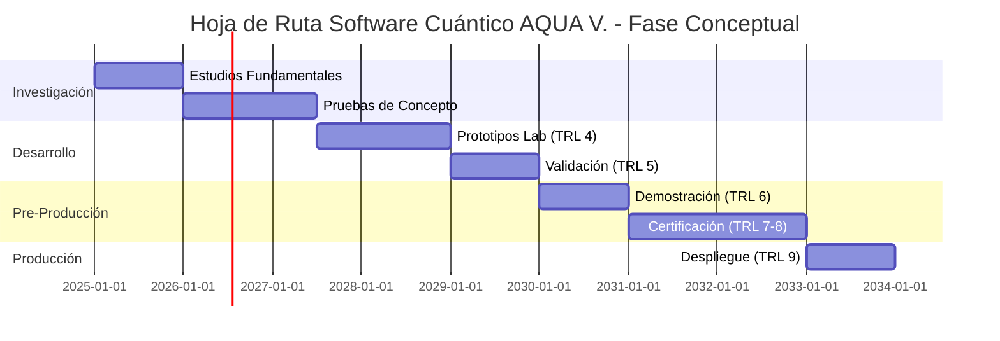

# Resumen Ejecutivo - Visión del Software Cuántico (REVISADO)
**Document ID**: QUA-QSOFT-25SVD0001-CON-BOB-R&I-TD-QCSAA-900-000-00-01-TPL-CON-001-QSCI-v1.0.1  
**Template ID**: TPL-CON-001  
**Version**: 1.0.1  
**Status**: Draft - Concept Phase  
**Classification**: Research & Innovation  
**Date**: 2025-07-28  
**Revision**: 2025-07-28 (TRL Alignment)  
**Q-Division**: QSCI (Quantum Science & Research)  
**Product Line**: QUANTUM  
**Product**: QSOFT (Quantum Software)  
**Lifecycle Phase**: CONCEPT  
**Entity Type**: BOB (Digital/Virtual System)  
**UTCS Category**: QCSAA-900 (Quantum Computing Core Systems)  

> ⚛️ **Concepto Central**: Establecer la visión fundacional para el desarrollo futuro de software cuántico integrado en los sistemas aeroespaciales de A.Q.U.A.-V.

---

## Control del Documento

| Propiedad | Valor |
|-----------|--------|
| **Creado Por** | División QSCI |
| **Fecha de Creación** | 2025-07-28 |
| **Última Modificación** | 2025-07-28 |
| **Ciclo de Revisión** | 3 meses |
| **Distribución** | Ejecutivos, Líderes Técnicos, Inversores |
| **Documentos Relacionados** | TPL-CON-002 (Objetivos Estratégicos), TPL-CON-003 (Hoja de Ruta) |
| **TRL Objetivo** | 1-3 (Fase Conceptual) |
| **Cambios v1.0.1** | Alineación de valores TRL con fase conceptual |

---

## 3. Alcance del Proyecto (REVISADO)

El software cuántico **conceptualizado** abarcará múltiples dominios:

### 3.1 Sistemas de Navegación Cuántica (QNS)
- **Concepto**: Navegación en entornos GPS denegados
- **Tecnología Propuesta**: Interferometría atómica
- **TRL Actual**: 3 (Prueba de concepto analítica)
- **TRL Objetivo 2030**: 6 (Demostración en entorno relevante)
- **Aplicación Futura**: Todas las plataformas AQUA V.

### 3.2 Diagnósticos Avanzados (QDS)
- **Concepto**: Detección de defectos a nivel molecular
- **Tecnología Propuesta**: Algoritmos cuánticos de ML
- **TRL Actual**: 2 (Concepto tecnológico formulado)
- **TRL Objetivo 2030**: 5 (Validación en laboratorio)
- **Aplicación Futura**: Mantenimiento predictivo

### 3.3 Monitoreo Estructural en Tiempo Real (QSM)
- **Concepto**: Salud estructural continua
- **Tecnología Propuesta**: Sensores cuánticos distribuidos
- **TRL Actual**: 2 (Concepto tecnológico formulado)
- **TRL Objetivo 2030**: 6 (Prototipo demostrado)
- **Aplicación Futura**: Fuselaje y componentes críticos

### 3.4 Procesamiento Cuántico de Información (QPU)
- **Concepto**: Optimización compleja en tiempo real
- **Tecnología Propuesta**: Procesador cuántico de 1000+ qubits
- **TRL Actual**: 3 (Prueba de concepto experimental)
- **TRL Objetivo 2030**: 7 (Demostración en entorno operacional)
- **Aplicación Futura**: Centro de control de misión

### 3.5 Comunicaciones Seguras (QKD)
- **Concepto**: Encriptación inquebrantable
- **Tecnología Propuesta**: Distribución cuántica de claves
- **TRL Actual**: 3 (Prueba de concepto experimental)
- **TRL Objetivo 2030**: 8 (Sistema completo certificado)
- **Aplicación Futura**: Enlaces de comunicación críticos

### 3.6 Sistemas de Radar Cuántico (QRS)
- **Concepto**: Detección de objetivos stealth
- **Tecnología Propuesta**: Iluminación cuántica
- **TRL Actual**: 1 (Principios básicos observados)
- **TRL Objetivo 2030**: 4 (Validación en laboratorio)
- **Aplicación Futura**: Sistemas de defensa

### 3.7 Sensores Gravitacionales (QGR)
- **Concepto**: Mapeo del campo gravitacional
- **Tecnología Propuesta**: Gravímetro cuántico
- **TRL Actual**: 2 (Concepto tecnológico formulado)
- **TRL Objetivo 2030**: 5 (Validación en entorno relevante)
- **Aplicación Futura**: Navegación de terreno

### 3.8 Sensores Magnéticos (QMG)
- **Concepto**: Detección de anomalías magnéticas
- **Tecnología Propuesta**: Magnetómetro cuántico
- **TRL Actual**: 3 (Prueba de concepto analítica)
- **TRL Objetivo 2030**: 6 (Prototipo demostrado)
- **Aplicación Futura**: Navegación y detección

### 3.9 Red de Relojes Cuánticos (QCN)
- **Concepto**: Sincronización ultra-precisa
- **Tecnología Propuesta**: Relojes atómicos ópticos
- **TRL Actual**: 3 (Prueba de concepto experimental)
- **TRL Objetivo 2030**: 7 (Demostración operacional)
- **Aplicación Futura**: Sincronización de sistemas

### 3.10 Inteligencia Artificial Cuántica (QAI)
- **Concepto**: Procesamiento cognitivo avanzado
- **Tecnología Propuesta**: Redes neuronales cuánticas
- **TRL Actual**: 1 (Principios básicos observados)
- **TRL Objetivo 2030**: 3 (Prueba de concepto)
- **Aplicación Futura**: Toma de decisiones autónoma

---

## 6. Hoja de Ruta de Alto Nivel (REVISADA)

---

## 7. Métricas de Éxito (REVISADAS)

### 7.1 Indicadores Clave de Rendimiento (KPIs) - Fase Conceptual

| KPI | Meta 2025 | Meta 2027 | Meta 2030 |
|-----|-----------|-----------|-----------|
| **Conceptos Cuánticos Validados** | 10 | 25 | 50 |
| **Publicaciones Científicas** | 5 | 20 | 50 |
| **Patentes Solicitadas** | 3 | 15 | 40 |
| **Prototipos de Laboratorio** | 0 | 5 | 10 |
| **Colaboraciones Académicas** | 3 | 10 | 20 |
| **TRL Promedio del Portfolio** | 2 | 3 | 5 |

### 7.2 Hitos Tecnológicos (REVISADOS)

- **2025**: Completar estudios de viabilidad teórica (TRL 1-2)
- **2026**: Primeras pruebas de concepto en laboratorio (TRL 3)
- **2028**: Validación de componentes en entorno controlado (TRL 4)
- **2030**: Integración de subsistemas (TRL 5)
- **2032**: Demostración en entorno relevante (TRL 6)
- **2035**: Primer sistema operacional (TRL 7-8)
- **2040**: Despliegue completo (TRL 9)

---

## 8. Consideraciones de Riesgo (ACTUALIZADAS)

### 8.1 Riesgos Técnicos - Fase Conceptual

| Riesgo | Probabilidad | Impacto | Mitigación |
|--------|--------------|---------|------------|
| **Inviabilidad Teórica** | Alta | Crítico | Múltiples enfoques paralelos |
| **Limitaciones Físicas Fundamentales** | Media | Crítico | Investigación exhaustiva |
| **Escalabilidad No Demostrable** | Alta | Alto | Prototipos incrementales |
| **Falta de Talento Especializado** | Alta | Alto | Programa de formación temprano |

---

## 9. Próximos Pasos (ACTUALIZADOS)

### 9.1 Acciones Inmediatas (Q3 2025) - Fase Conceptual

1. [ ] Establecer laboratorio de investigación cuántica fundamental
2. [ ] Reclutar 10 físicos cuánticos PhD para investigación básica
3. [ ] Iniciar estudios de viabilidad para cada sistema propuesto
4. [ ] Establecer colaboraciones con universidades líderes
5. [ ] Desarrollar primeros modelos teóricos y simulaciones

### 9.2 Entregables Clave - Fase Conceptual

- **Estudio de Viabilidad QNS**: TPL-CON-100 (Q4 2025)
- **Modelo Teórico QPU**: TPL-CON-130 (Q1 2026)
- **Simulación QKD**: TPL-CON-140 (Q2 2026)
- **Prueba de Concepto QAI**: TPL-CON-190 (Q4 2026)

---

**Nota de Revisión v1.0.1**: 
Este documento ha sido actualizado para reflejar correctamente el estado actual de las tecnologías cuánticas en fase conceptual (TRL 1-3), alineándose con la fase del ciclo de vida del documento y los valores TRL validados en los Anexos J y K de AQUA V.

---

**FIN DEL DOCUMENTO**

*Este documento está sujeto a actualizaciones basadas en avances en investigación fundamental y validación de conceptos.*

**Número de Control**: QUA-QSOFT-25SVD0001-CON-BOB-R&I-TD-QCSAA-900-000-00-01-TPL-CON-001-QSCI-v1.0.1  
**Clasificación**: Investigación e Innovación - Fase Conceptual  
**© 2025 A.Q.U.A.-V. Aerospace. Todos los derechos reservados.**
