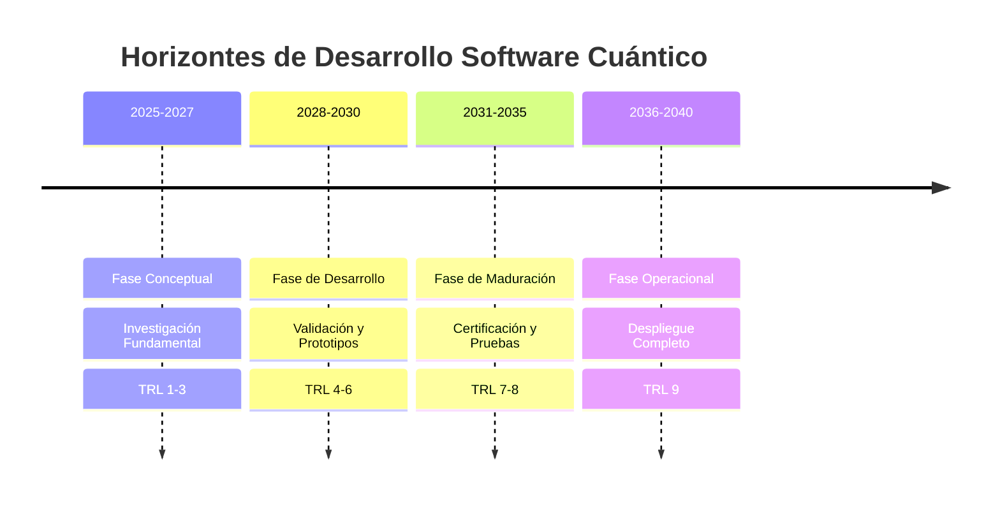
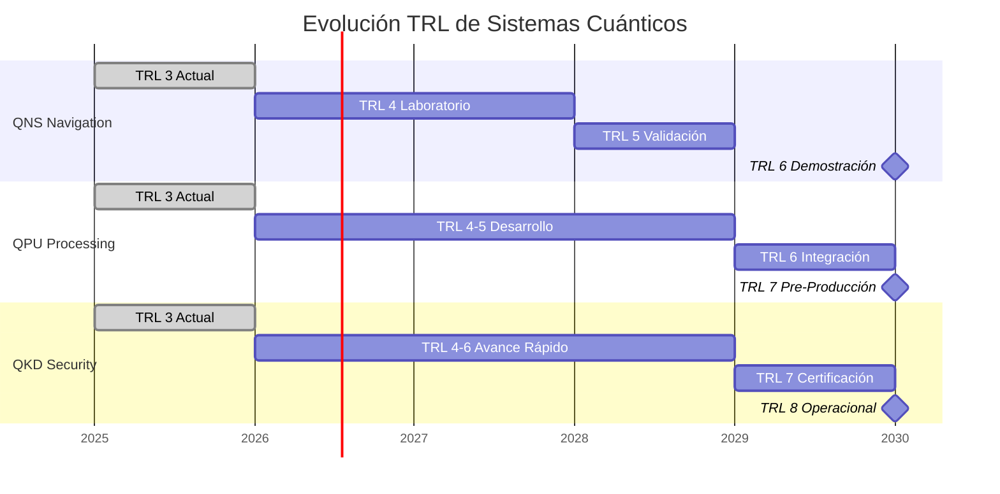
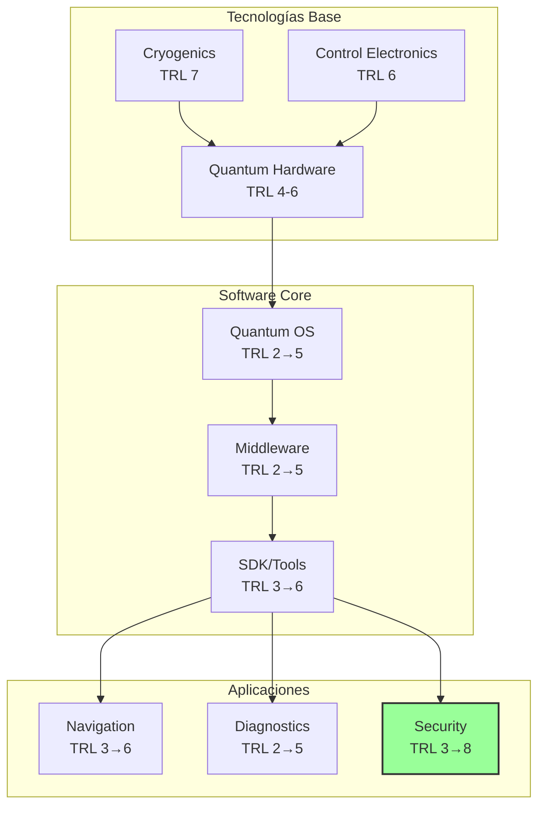
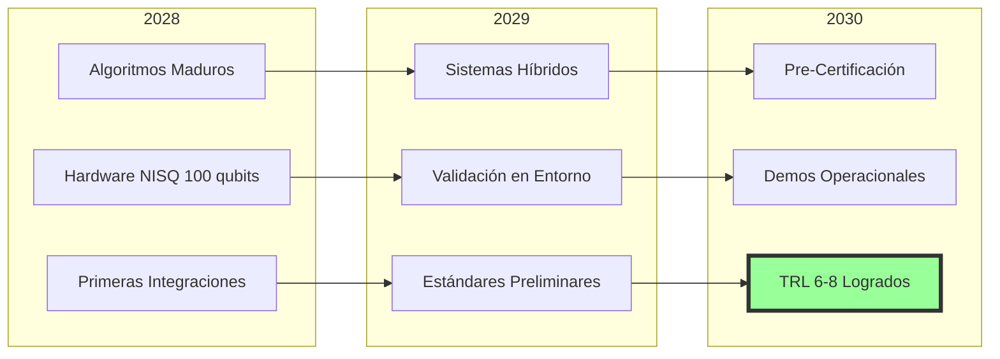
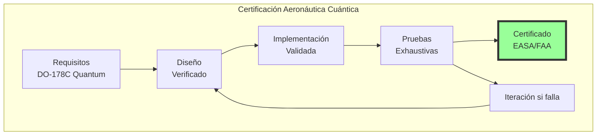
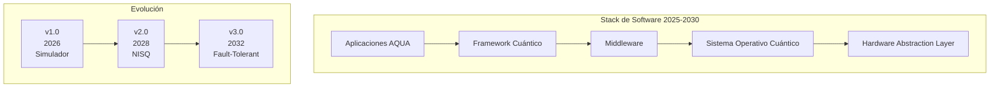
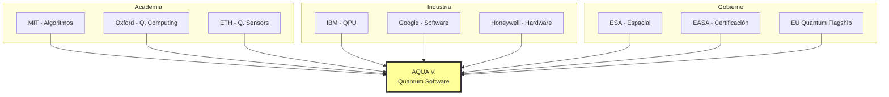

# Hoja de Ruta Tecnológica - Software Cuántico AQUA V.
**Document ID**: QUA-QSOFT-25SVD0001-CON-BOB-R&I-TD-QCSAA-900-000-00-03-TPL-CON-003-QSCI-v1.0.0  
**Template ID**: TPL-CON-003  
**Version**: 1.0.0  
**Status**: Draft - Concept Phase  
**Classification**: Research & Innovation  
**Date**: 2025-07-28  
**Q-Division**: QSCI (Quantum Science & Research)  
**Product Line**: QUANTUM  
**Product**: QSOFT (Quantum Software)  
**Lifecycle Phase**: CONCEPT  
**Entity Type**: BOB (Digital/Virtual System)  
**UTCS Category**: QCSAA-900 (Quantum Computing Core Systems)  

> 📍 **Propósito**: Establecer la hoja de ruta tecnológica detallada para el desarrollo del software cuántico de A.Q.U.A.-V., desde la investigación fundamental hasta el despliegue operacional.

---

## Control del Documento

| Propiedad | Valor |
|-----------|--------|
| **Creado Por** | División QSCI |
| **Fecha de Creación** | 2025-07-28 |
| **Última Modificación** | 2025-07-28 |
| **Ciclo de Revisión** | 3 meses |
| **Distribución** | Ejecutivos, Directores de Programa, Líderes Técnicos |
| **Documentos Relacionados** | TPL-CON-001 (Visión v1.0.1), TPL-CON-002 (Objetivos v1.0.1) |
| **TRL Base** | 1-3 (Fase Conceptual) |

---

## 1. Resumen Ejecutivo

### 1.1 Visión de la Hoja de Ruta

Esta hoja de ruta tecnológica define el camino desde la investigación fundamental actual (TRL 1-3) hasta sistemas operacionales certificados (TRL 9) para el software cuántico aeroespacial de A.Q.U.A.-V.

### 1.2 Horizontes Temporales



---

## 2. Mapa de Evolución Tecnológica

### 2.1 Progresión TRL por Sistema



### 2.2 Dependencias Tecnológicas



---

## 3. Fases de Desarrollo Detalladas

### 3.1 Fase I: Investigación Fundamental (2025-2027)

#### 3.1.1 Objetivos Principales

| Objetivo | Entregables | Métricas de Éxito |
|----------|-------------|-------------------|
| **Validación Teórica** | 20+ papers científicos | Peer review positivo |
| **Algoritmos Base** | 10 algoritmos cuánticos | Ventaja teórica demostrada |
| **Simuladores** | Simulador 50 qubits | <5min para circuitos típicos |
| **Prototipos Lab** | 3 demos funcionales | TRL 3 alcanzado |

#### 3.1.2 Hitos Clave

```python
# Hitos Fase I
fase_1_hitos = {
    "2025-Q3": "Laboratorio Cuántico Operacional",
    "2025-Q4": "Primer Algoritmo QNS Validado",
    "2026-Q2": "Simulador v1.0 Liberado",
    "2026-Q4": "Prototipo QKD Punto a Punto",
    "2027-Q2": "Integración con QPU de Laboratorio",
    "2027-Q4": "Revisión de Fase y Go/No-Go"
}
```

#### 3.1.3 Inversión y Recursos

| Recurso | Cantidad | Costo (€M) |
|---------|----------|------------|
| **Investigadores PhD** | 50 | 150 |
| **Infraestructura Lab** | 1 centro | 100 |
| **Colaboraciones** | 10 universidades | 50 |
| **Equipamiento** | QPUs experimentales | 100 |
| **Total Fase I** | - | **400** |

### 3.2 Fase II: Desarrollo y Validación (2028-2030)

#### 3.2.1 Evolución Tecnológica



#### 3.2.2 Desarrollo por Sistema

| Sistema | 2028 | 2029 | 2030 |
|---------|------|------|------|
| **QNS** | Integración sensores | Pruebas de vuelo simuladas | **TRL 6** Demo real |
| **QDS** | Algoritmos ML cuánticos | Validación en componentes | **TRL 5** Lab completo |
| **QPU** | 100 qubits estables | Optimizador híbrido | **TRL 7** Pre-producción |
| **QKD** | Red punto a multipunto | Certificación seguridad | **TRL 8** Operacional |

#### 3.2.3 Plataformas de Prueba

```python
plataformas_prueba = {
    "2028": {
        "simulador_vuelo": "Integración básica",
        "banco_pruebas": "Componentes aislados",
        "red_lab": "QKD experimental"
    },
    "2029": {
        "aeronave_tierra": "Sistemas completos",
        "vuelo_prueba": "Instrumentado especial",
        "centro_control": "Operaciones híbridas"
    },
    "2030": {
        "prototipo_bwb": "Integración completa",
        "red_satelite": "QKD orbital",
        "flota_prueba": "3 aeronaves"
    }
}
```

### 3.3 Fase III: Maduración y Certificación (2031-2035)

#### 3.3.1 Proceso de Certificación



#### 3.3.2 Estándares a Desarrollar

| Estándar | Organismo | Objetivo | Timeline |
|----------|-----------|----------|----------|
| **DO-178Q** | RTCA/EUROCAE | Software cuántico crítico | 2031-2033 |
| **AQUA-QS-100** | AQUA V. | Arquitectura de referencia | 2031-2032 |
| **ISO/IEC 23837** | ISO | Computación cuántica aero | 2032-2034 |
| **EASA CS-Q** | EASA | Certificación sistemas Q | 2033-2035 |

### 3.4 Fase IV: Despliegue Operacional (2036-2040)

#### 3.4.1 Plan de Despliegue

```python
deployment_plan = {
    "2036": {
        "plataforma": "AMPEL360e Híbrido",
        "sistemas": ["QNS", "QKD"],
        "flota": 5,
        "rutas": "Experimentales"
    },
    "2038": {
        "plataforma": "BWB-Q100",
        "sistemas": ["QNS", "QDS", "QPU", "QKD"],
        "flota": 20,
        "rutas": "Comerciales selectas"
    },
    "2040": {
        "plataforma": "Toda la flota AQUA",
        "sistemas": "Suite completa",
        "flota": 100+,
        "rutas": "Operación global"
    }
}
```

---

## 4. Tecnologías Habilitadoras

### 4.1 Hardware Cuántico Requerido

| Período | Tecnología | Especificaciones | Proveedor |
|---------|------------|------------------|-----------|
| **2025-2027** | Simuladores | 50 qubits clásicos | Interno |
| **2028-2030** | NISQ | 100-1000 qubits, T2>100μs | IBM/Google |
| **2031-2035** | Corrección errores | 1000+ qubits lógicos | Múltiple |
| **2036+** | Tolerante a fallos | 10,000+ qubits | AQUA QPU |

### 4.2 Software de Base



---

## 5. Gestión de Riesgos Tecnológicos

### 5.1 Matriz de Riesgos por Fase

| Fase | Riesgo Principal | Probabilidad | Impacto | Mitigación |
|------|------------------|--------------|---------|------------|
| **I (2025-27)** | Inviabilidad teórica | Media | Crítico | Múltiples enfoques |
| **II (2028-30)** | Hardware inmaduro | Alta | Alto | Simuladores robustos |
| **III (2031-35)** | Certificación compleja | Media | Alto | Engagement temprano |
| **IV (2036-40)** | Adopción lenta | Baja | Medio | Beneficios claros |

### 5.2 Puntos de Decisión Go/No-Go

```python
decision_points = {
    "2027-Q4": {
        "criterio": "TRL 3 en 3+ sistemas",
        "go": "Proceder a Fase II",
        "no_go": "Pivote a simulación pura"
    },
    "2030-Q4": {
        "criterio": "TRL 6+ en QNS y QKD",
        "go": "Iniciar certificación",
        "no_go": "Extensión de desarrollo"
    },
    "2035-Q4": {
        "criterio": "Certificación obtenida",
        "go": "Producción en serie",
        "no_go": "Despliegue limitado"
    }
}
```

---

## 6. Métricas de Progreso

### 6.1 KPIs por Año

```python
# Métricas clave de progreso
kpis_anuales = {
    "2025": {"papers": 5, "algoritmos": 2, "trl_promedio": 1.5},
    "2026": {"papers": 10, "algoritmos": 5, "trl_promedio": 2.0},
    "2027": {"papers": 15, "algoritmos": 10, "trl_promedio": 3.0},
    "2028": {"prototipos": 3, "integraciones": 2, "trl_promedio": 4.0},
    "2029": {"prototipos": 5, "pruebas_vuelo": 10, "trl_promedio": 5.0},
    "2030": {"sistemas_demo": 4, "certificaciones": 1, "trl_promedio": 6.0}
}
```

### 6.2 Hitos de Validación Técnica

| Año | Hito Técnico | Validación |
|-----|--------------|------------|
| **2026** | Primer vuelo simulado con QNS | Error <10m |
| **2027** | QKD funcionando en lab | 1000 keys/s |
| **2028** | QPU híbrido operacional | 100 qubits |
| **2029** | Diagnóstico cuántico activo | 95% precisión |
| **2030** | Sistema integrado completo | TRL 6+ todos |

---

## 7. Ecosistema y Colaboraciones

### 7.1 Mapa de Colaboraciones



### 7.2 Estrategia de Propiedad Intelectual

| Período | Foco IP | Meta Anual | Acumulado |
|---------|---------|------------|-----------|
| **2025-2027** | Algoritmos fundamentales | 15 patentes | 45 |
| **2028-2030** | Sistemas integrados | 30 patentes | 135 |
| **2031-2035** | Aplicaciones específicas | 50 patentes | 385 |
| **2036-2040** | Optimizaciones operacionales | 40 patentes | 585 |

---

## 8. Presupuesto y Recursos

### 8.1 Inversión Total por Fase

```python
# Presupuesto en millones de euros
presupuesto_fases = {
    "Fase I (2025-2027)": {
        "I+D": 250,
        "Infraestructura": 100,
        "Personal": 50,
        "Total": 400
    },
    "Fase II (2028-2030)": {
        "Desarrollo": 300,
        "Pruebas": 150,
        "Certificación": 50,
        "Total": 500
    },
    "Fase III (2031-2035)": {
        "Industrialización": 400,
        "Certificación": 200,
        "Despliegue": 200,
        "Total": 800
    },
    "Fase IV (2036-2040)": {
        "Producción": 500,
        "Operaciones": 300,
        "Mejoras": 200,
        "Total": 1000
    },
    "TOTAL_PROGRAMA": 2700
}
```

### 8.2 Recursos Humanos

| Fase | Investigadores | Ingenieros | Operaciones | Total |
|------|---------------|------------|-------------|--------|
| **I** | 50 | 20 | 10 | 80 |
| **II** | 80 | 100 | 20 | 200 |
| **III** | 60 | 200 | 100 | 360 |
| **IV** | 40 | 300 | 200 | 540 |

---

## 9. Análisis de Escenarios

### 9.1 Escenario Optimista

- Hardware cuántico evoluciona más rápido
- Certificación simplificada por reguladores
- Adopción acelerada del mercado
- **Resultado**: TRL 9 en 2035 (-5 años)

### 9.2 Escenario Base

- Progreso según lo planificado
- Desafíos técnicos manejables
- Adopción gradual del mercado
- **Resultado**: TRL 9 en 2040 (según plan)

### 9.3 Escenario Pesimista

- Retrasos en hardware cuántico
- Certificación más compleja
- Resistencia del mercado
- **Resultado**: TRL 9 en 2045 (+5 años)

---

## 10. Conclusiones y Próximos Pasos

### 10.1 Factores Críticos de Éxito

1. **Talento**: Atraer y retener los mejores investigadores cuánticos
2. **Hardware**: Acceso temprano a QPUs de vanguardia
3. **Colaboración**: Ecosistema fuerte con academia e industria
4. **Financiación**: Compromiso sostenido de €2.7B
5. **Regulación**: Trabajo proactivo con autoridades

### 10.2 Acciones Inmediatas (Q3-Q4 2025)

- [ ] Establecer Quantum Software Lab en Silicon Valley
- [ ] Firmar MOUs con 3+ universidades líderes
- [ ] Reclutar 20 investigadores PhD
- [ ] Iniciar desarrollo de simulador v0.1
- [ ] Lanzar programa de patentes

### 10.3 Revisión y Actualización

Esta hoja de ruta será revisada y actualizada:
- **Trimestralmente**: Ajustes menores
- **Anualmente**: Revisión mayor con stakeholders
- **En hitos clave**: Evaluación profunda Go/No-Go

---

**FIN DEL DOCUMENTO**

*Esta hoja de ruta tecnológica es un documento vivo sujeto a actualización basada en avances tecnológicos y condiciones del mercado.*

**Número de Control**: QUA-QSOFT-25SVD0001-CON-BOB-R&I-TD-QCSAA-900-000-00-03-TPL-CON-003-QSCI-v1.0.0  
**Clasificación**: Investigación e Innovación - Planificación Estratégica  
**© 2025 A.Q.U.A.-V. Aerospace. Todos los derechos reservados.**
