# Quantum Magnetometer Software Concept
**Document ID**: QUA-QMG01-25SVD0001-CON-BOB-R&I-TD-QCSAA-980-000-00-01-TPL-CON-170-QSCI-v1.0.0  
**Template ID**: TPL-CON-170  
**Version**: 1.0.0  
**Status**: Draft - Concept Phase  
**Classification**: Research & Innovation  
**Date**: 2025-07-28  
**Q-Division**: QSCI (Quantum Science & Research)  
**Product Line**: QUANTUM  
**Product**: QMG01 (Quantum Magnetometer)  
**Lifecycle Phase**: CONCEPT  
**Entity Type**: BOB (Digital/Virtual System)  
**UTCS Category**: QCSAA-980 (Quantum Magnetometer Systems)  

> 🧲 **Purpose**: Define the conceptual framework for the Quantum Magnetometer (QMG) software system, enabling ultra-sensitive magnetic field detection for navigation, anomaly detection, and electromagnetic warfare applications in aerospace environments.

---

## Document Control

| Property | Value |
|----------|--------|
| **Created By** | QSCI Division |
| **Creation Date** | 2025-07-28 |
| **Last Modified** | 2025-07-28 |
| **Review Cycle** | 3 months |
| **Distribution** | Navigation Teams, EW Engineers, Research Division |
| **Related Documents** | TPL-CON-001 (Vision v1.0.1), QNS Navigation Suite |
| **Current TRL** | 7 (System prototype demonstration in operational environment) |
| **Target TRL 2030** | 9 (Actual system proven in operational environment) |

---

## 1. Introduction

### 1.1 Quantum Magnetometry Advantage

Quantum magnetometers leverage quantum mechanical properties of atoms or solid-state spins to achieve sensitivities far beyond classical magnetometers. With commercial systems already deployed in medical imaging, geological surveys, and defense applications, quantum magnetometry represents one of the most mature quantum sensing technologies.

### 1.2 Technology Comparison

```mermaid
graph TD
    subgraph "Classical Magnetometers"
        C1[Fluxgate<br/>1 nT sensitivity]
        C2[Hall Effect<br/>1 μT sensitivity]
        C3[GMR Sensors<br/>100 nT sensitivity]
        C4[Temperature<br/>Drift]
    end
    
    subgraph "Quantum Magnetometers"
        Q1[OPM<br/>1 fT sensitivity]
        Q2[NV Diamond<br/>1 pT sensitivity]
        Q3[SERF Atomic<br/>0.1 fT sensitivity]
        Q4[Absolute<br/>Calibration]
    end
    
    C1 -->|1000x better| Q1
    C2 -->|10^9x better| Q1
    C3 -->|10^5x better| Q2
    C4 -->|Self-calibrating| Q4
    
    style Q1 fill:#9ff,stroke:#333,stroke-width:2px
    style Q2 fill:#9f9,stroke:#333,stroke-width:2px
```



---

## 2. Technical Foundation

### 2.1 Quantum Sensing Technologies

```python
class QuantumMagnetometerTypes:
    """
    Overview of mature quantum magnetometer technologies
    TRL: 7-9 (Commercial systems available)
    """
    
    def __init__(self):
        self.technologies = {
            "OPM": {  # Optically Pumped Magnetometer
                "sensitivity": "1-10 fT/√Hz",
                "bandwidth": "DC to 1 kHz",
                "temperature": "Room temperature",
                "size": "1-10 cm³",
                "trl": 8,
                "commercial": True,
                "vendors": ["QuSpin", "Twinleaf", "FieldLine"]
            },
            "NV_Diamond": {  # Nitrogen-Vacancy Centers
                "sensitivity": "1 pT/√Hz to 1 nT/√Hz",
                "bandwidth": "DC to 10 MHz",
                "temperature": "Room temperature",
                "size": "mm³ sensor head",
                "trl": 7,
                "commercial": True,
                "vendors": ["Qnami", "QZabre", "Element Six"]
            },
            "SERF": {  # Spin Exchange Relaxation Free
                "sensitivity": "0.1 fT/√Hz",
                "bandwidth": "DC to 100 Hz",
                "temperature": "150°C operation",
                "size": "10-100 cm³",
                "trl": 7,
                "commercial": True,
                "vendors": ["Twinleaf", "NIST spinoffs"]
            },
            "SQUID": {  # Superconducting Quantum Interference Device
                "sensitivity": "1 fT/√Hz",
                "bandwidth": "DC to MHz",
                "temperature": "4K (cryogenic)",
                "size": "Large with cooling",
                "trl": 9,
                "commercial": True,
                "vendors": ["STAR Cryoelectronics", "Supracon"]
            }
        }
    
    def select_for_aerospace(self, requirements: dict) -> str:
        """
        Select optimal technology for aerospace applications
        """
        # For aircraft: No cryogenics, compact, wide bandwidth
        if requirements["platform"] == "aircraft":
            if requirements["bandwidth"] > 1000:  # Hz
                return "NV_Diamond"  # Best for high frequency
            else:
                return "OPM"  # Best sensitivity at low frequency
        
        # For spacecraft: Can accommodate more complex systems
        elif requirements["platform"] == "spacecraft":
            return "SERF"  # Ultimate sensitivity
        
        # For ground stations: No constraints
        else:
            return "SQUID"  # If cryogenics acceptable
```

### 2.2 Optically Pumped Magnetometer Physics

```python
class OPMPhysics:
    """
    Core physics of optically pumped magnetometry
    Most suitable for aerospace applications
    """
    
    def __init__(self):
        self.atom_species = "Rubidium-87"  # or Cesium
        self.pump_wavelength = 795e-9  # D1 line
        self.probe_wavelength = 780e-9  # D2 line
        
    def calculate_sensitivity_limit(self, 
                                  cell_volume: float,
                                  temperature: float) -> float:
        """
        Calculate fundamental sensitivity limit
        """
        # Constants
        k_B = 1.38e-23  # Boltzmann constant
        mu_B = 9.27e-24  # Bohr magneton
        gamma = 2 * np.pi * 6.995e9  # Rb gyromagnetic ratio (Hz/T)
        
        # Atom density
        n_atoms = self.calculate_vapor_density(temperature) * cell_volume
        
        # Spin projection noise limit
        sensitivity_limit = 1 / (gamma * np.sqrt(n_atoms * self.measurement_time))
        
        # Typical: 1-10 fT/√Hz achievable
        return sensitivity_limit
    
    def dead_zone_compensation(self, field_vector: np.ndarray) -> np.ndarray:
        """
        Compensate for dead zones in single-axis magnetometers
        """
        # Use 3-axis configuration to eliminate dead zones
        # Each sensor oriented 54.7° from others (tetrahedral)
        sensor_orientations = np.array([
            [1, 1, 1],
            [1, -1, -1],
            [-1, 1, -1],
            [-1, -1, 1]
        ]) / np.sqrt(3)
        
        # Measure with all sensors
        measurements = sensor_orientations @ field_vector
        
        # Reconstruct full vector (overdetermined system)
        field_reconstructed = np.linalg.lstsq(
            sensor_orientations, 
            measurements, 
            rcond=None
        )[0]
        
        return field_reconstructed
```

---

## 3. System Architecture

### 3.1 Software Architecture Overview


### 3.2 Core Software Components

#### 3.2.1 Multi-Sensor Array Controller

```python
class QuantumMagnetometerArray:
    """
    Manage array of quantum magnetometers for aerospace applications
    TRL: 7 (Proven in submarine and medical applications)
    """
    
    def __init__(self):
        self.sensors = {
            'primary': OPMSensorArray(count=4, configuration='tetrahedral'),
            'gradient': OPMGradiometer(baseline=0.5),  # meters
            'highfreq': NVDiamondSensor(bandwidth=10e6),  # 10 MHz
            'reference': ScalarOPM()  # For absolute calibration
        }
        self.compensation = MagneticCompensation()
        self.fusion_engine = KalmanFusionEngine()
        
    async def acquire_magnetic_field(self) -> MagneticFieldData:
        """
        Acquire compensated magnetic field measurements
        """
        # Synchronized measurement from all sensors
        raw_measurements = await self.synchronized_measurement()
        
        # Remove aircraft magnetic signature
        aircraft_field = self.compensation.get_aircraft_signature(
            electrical_loads=await self.get_electrical_status(),
            engine_rpm=await self.get_engine_parameters(),
            control_surfaces=await self.get_control_positions()
        )
        
        # Compensate measurements
        compensated = {}
        for sensor_id, measurement in raw_measurements.items():
            compensated[sensor_id] = measurement - aircraft_field[sensor_id]
        
        # Fuse multi-sensor data
        fused_field = self.fusion_engine.fuse(
            measurements=compensated,
            sensor_noise_models=self.get_noise_models(),
            correlation_matrix=self.get_sensor_correlations()
        )
        
        # Calculate derivatives
        gradient = self.calculate_gradient_tensor(compensated)
        
        return MagneticFieldData(
            field_vector=fused_field.vector,
            magnitude=fused_field.magnitude,
            gradient_tensor=gradient,
            uncertainty=fused_field.uncertainty,
            timestamp=self.get_synchronized_time()
        )
```

#### 3.2.2 Magnetic Anomaly Detection Engine

```python
class MagneticAnomalyDetector:
    """
    Detect magnetic anomalies for submarine detection, navigation
    TRL: 8 (Operational in maritime patrol aircraft)
    """
    
    def __init__(self):
        self.background_model = IGRFModel()  # International Geomagnetic Reference Field
        self.ml_detector = TrainedAnomalyNetwork()
        self.tracking_filter = MultiTargetTracker()
        
    def detect_anomalies(self, 
                        magnetic_data: MagneticFieldData,
                        platform_state: AircraftState) -> List[MagneticAnomaly]:
        """
        Detect and classify magnetic anomalies
        """
        # Remove Earth's field
        expected_field = self.background_model.calculate(
            latitude=platform_state.position.lat,
            longitude=platform_state.position.lon,
            altitude=platform_state.position.alt,
            date=platform_state.timestamp
        )
        
        # Calculate residual
        residual = magnetic_data.field_vector - expected_field
        
        # Apply matched filter for submarine detection
        submarine_score = self.matched_filter_detection(
            residual=residual,
            gradient=magnetic_data.gradient_tensor,
            template=self.submarine_magnetic_signature()
        )
        
        # ML-based anomaly detection
        ml_anomalies = self.ml_detector.detect(
            field_data=residual,
            gradient_data=magnetic_data.gradient_tensor,
            platform_motion=platform_state.velocity
        )
        
        # Combine detections
        anomalies = []
        
        # Submarine detection
        if submarine_score > self.submarine_threshold:
            anomaly = MagneticAnomaly(
                type='submarine',
                confidence=submarine_score,
                position=self.estimate_source_position(
                    magnetic_data, 
                    platform_state
                ),
                magnetic_moment=self.estimate_magnetic_moment(residual)
            )
            anomalies.append(anomaly)
        
        # Other anomalies (geological, man-made structures)
        for ml_anomaly in ml_anomalies:
            if ml_anomaly.confidence > self.general_threshold:
                anomalies.append(ml_anomaly)
        
        # Update tracking
        self.tracking_filter.update(anomalies)
        
        return self.tracking_filter.get_confirmed_tracks()
```

---

## 4. Navigation Applications

### 4.1 Magnetic Anomaly Navigation (MAGNAV)

```python
class MagneticAnomalyNavigation:
    """
    GPS-independent navigation using Earth's magnetic anomalies
    TRL: 6 (Demonstrated in research aircraft)
    """
    
    def __init__(self):
        self.magnetic_map = HighResolutionMagneticMap()  # NOAA/BGS data
        self.particle_filter = ParticleFilter(particles=5000)
        self.map_matcher = CorrelationMatcher()
        
    def navigate_by_magnetic_field(self, 
                                  magnetic_measurements: List[MagneticFieldData],
                                  initial_position: Position,
                                  imu_data: IMUData) -> NavigationSolution:
        """
        Estimate position by matching magnetic measurements to map
        """
        # Propagate particles using IMU
        self.particle_filter.propagate(imu_data)
        
        # Get latest magnetic measurement
        current_field = magnetic_measurements[-1]
        
        # For each particle, calculate likelihood
        for particle in self.particle_filter.particles:
            # Get expected field from map
            expected_field = self.magnetic_map.get_field_at_position(
                particle.position
            )
            
            # Include gradient information for better matching
            expected_gradient = self.magnetic_map.get_gradient_at_position(
                particle.position
            )
            
            # Calculate likelihood (field + gradient matching)
            field_likelihood = self.gaussian_likelihood(
                measured=current_field.field_vector,
                expected=expected_field,
                covariance=current_field.uncertainty
            )
            
            gradient_likelihood = self.matrix_likelihood(
                measured=current_field.gradient_tensor,
                expected=expected_gradient
            )
            
            # Combined likelihood
            particle.weight *= field_likelihood * gradient_likelihood
        
        # Resample and extract solution
        self.particle_filter.resample()
        
        return NavigationSolution(
            position=self.particle_filter.get_weighted_mean_position(),
            uncertainty=self.particle_filter.get_position_covariance(),
            magnetic_match_quality=self.assess_match_quality()
        )
```

### 4.2 Performance Specifications

| Parameter | Current Capability | Target 2030 | Notes |
|-----------|-------------------|-------------|-------|
| **Sensitivity (OPM)** | 10 fT/√Hz | 1 fT/√Hz | Commercial systems |
| **Sensitivity (NV)** | 1 pT/√Hz | 100 fT/√Hz | Improving rapidly |
| **Bandwidth** | DC-1 kHz (OPM) | DC-10 kHz | Application dependent |
| **Dynamic Range** | ±100 μT | ±200 μT | Earth field ±50 μT |
| **Navigation Accuracy** | 200m after 1hr | 50m after 1hr | With good mag maps |
| **Power Consumption** | 10W per sensor | 5W per sensor | Miniaturization |

---

## 5. Electronic Warfare Applications

### 5.1 EM Threat Detection

```python
class ElectromagneticWarfareDetector:
    """
    Detect and classify electromagnetic threats
    TRL: 7 (Proven in military applications)
    """
    
    def __init__(self):
        self.wideband_sensor = NVDiamondArray(bandwidth=10e6)
        self.signal_classifier = EMSignalClassifier()
        self.threat_library = ThreatSignatureDatabase()
        
    def detect_em_threats(self, 
                         em_environment: ElectromagneticData) -> List[EMThreat]:
        """
        Identify potential electromagnetic threats
        """
        threats = []
        
        # Detect radar emissions
        radar_signals = self.detect_radar_emissions(
            em_environment.spectrum,
            frequency_range=(1e9, 40e9)  # 1-40 GHz
        )
        
        for signal in radar_signals:
            threat_class = self.signal_classifier.classify(signal)
            if threat_class.is_threat:
                threat = EMThreat(
                    type=threat_class.radar_type,
                    frequency=signal.center_frequency,
                    direction=self.estimate_arrival_direction(signal),
                    power_level=signal.power,
                    modulation=signal.modulation_type,
                    threat_level=self.assess_threat_level(threat_class)
                )
                threats.append(threat)
        
        # Detect jamming attempts
        jamming_indicators = self.detect_jamming(
            current_spectrum=em_environment.spectrum,
            baseline_spectrum=self.get_baseline_spectrum()
        )
        
        if jamming_indicators.detected:
            threats.append(EMThreat(
                type='jamming',
                affected_frequencies=jamming_indicators.frequencies,
                jamming_power=jamming_indicators.power_level,
                technique=jamming_indicators.jamming_type
            ))
        
        # Detect directed energy weapons
        dew_signature = self.detect_directed_energy(
            magnetic_gradient=em_environment.gradient,
            temporal_pattern=em_environment.time_series
        )
        
        if dew_signature.detected:
            threats.append(EMThreat(
                type='directed_energy',
                weapon_type=dew_signature.classification,
                power_estimate=dew_signature.power,
                pulse_characteristics=dew_signature.pulse_params
            ))
        
        return threats
```

---

## 6. Space Weather Monitoring

### 6.1 Geomagnetic Storm Detection

```python
class SpaceWeatherMonitor:
    """
    Monitor space weather effects on navigation and communication
    TRL: 8 (Operational in satellites)
    """
    
    def __init__(self):
        self.baseline_field = QuietDayBaseline()
        self.storm_detector = GeomagneticStormDetector()
        self.impact_predictor = SpaceWeatherImpactModel()
        
    def monitor_space_weather(self, 
                            magnetic_data: MagneticFieldData,
                            position: Position) -> SpaceWeatherStatus:
        """
        Detect and assess space weather impacts
        """
        # Calculate disturbance level
        expected_quiet = self.baseline_field.get_expected(
            position, 
            datetime.utcnow()
        )
        
        disturbance = magnetic_data.field_vector - expected_quiet
        
        # Detect storm characteristics
        storm_params = self.storm_detector.analyze(
            disturbance_vector=disturbance,
            time_series=self.get_recent_measurements()
        )
        
        # Assess impacts on aircraft systems
        impacts = self.impact_predictor.predict_impacts(
            storm_level=storm_params.kp_index,
            altitude=position.altitude,
            latitude=position.latitude
        )
        
        return SpaceWeatherStatus(
            storm_level=storm_params.classification,
            kp_index=storm_params.kp_index,
            navigation_degradation=impacts.navigation_error_increase,
            communication_impact=impacts.hf_communication_loss,
            radiation_exposure=impacts.radiation_dose_rate,
            recommended_actions=self.generate_recommendations(impacts)
        )
```

---

## 7. Integration Architecture

### 7.1 Aircraft System Integration


### 7.2 Installation Considerations

```python
installation_requirements = {
    "sensor_placement": {
        "wing_tips": "Maximum separation from interference",
        "tail_boom": "Gradient measurement baseline",
        "fuselage": "Away from engines and avionics",
        "total_sensors": 6  # 4 OPM + 1 NV + 1 reference
    },
    "magnetic_cleanliness": {
        "permalloy_shielding": "For sensor heads",
        "mu_metal_enclosures": "For electronics",
        "twisted_pair_wiring": "Minimize current loops",
        "compensation_coils": "Active cancellation"
    },
    "calibration_features": {
        "built_in_coils": "Known field generation",
        "rotation_platform": "Full 3D calibration",
        "temperature_sensors": "Thermal compensation"
    }
}
```

---

## 8. Market Analysis

### 8.1 Commercial Landscape

```python
market_assessment = {
    "current_market": {
        "total_size": "$450M (2025)",
        "aerospace_segment": "$50M",
        "growth_rate": "12% CAGR",
        "maturity": "Commercial products available"
    },
    "key_players": {
        "OPM": ["QuSpin ($10k/sensor)", "Twinleaf", "FieldLine"],
        "NV_Diamond": ["Qnami", "QZabre", "Element Six"],
        "Integration": ["CAE", "Lockheed Martin", "Raytheon"]
    },
    "aqua_applications": {
        "primary": "ASW for maritime patrol",
        "secondary": "Navigation backup",
        "tertiary": "Space weather monitoring",
        "market_share_potential": "10% of aerospace segment"
    }
}
```

### 8.2 Cost Analysis

| Component | Current Cost | Target 2030 | Volume Price |
|-----------|-------------|-------------|--------------|
| **OPM Sensor** | $10,000 | $5,000 | $2,500 |
| **NV Diamond** | $50,000 | $20,000 | $10,000 |
| **Electronics** | $20,000 | $10,000 | $5,000 |
| **Integration** | $100,000 | $50,000 | $25,000 |
| **Total System** | $200,000 | $100,000 | $50,000 |

---

## 9. Development Roadmap

### 9.1 Phased Development


### 9.2 Risk Assessment

| Risk | Impact | Probability | Mitigation |
|------|--------|-------------|------------|
| **Magnetic interference** | High | Medium | Extensive modeling and compensation |
| **Sensor reliability** | Medium | Low | Redundancy, proven COTS |
| **Integration complexity** | Medium | Medium | Modular architecture |
| **Cost overrun** | Low | Low | Mature technology |

---

## 10. Performance Validation

### 10.1 Test Scenarios

```python
validation_scenarios = {
    "submarine_detection": {
        "range": "5-10 km",
        "sea_state": "Up to 4",
        "detection_probability": "90%",
        "false_alarm_rate": "<1/hour"
    },
    "navigation_accuracy": {
        "map_quality": "100 nT resolution",
        "position_error": "<200m after 1 hour",
        "availability": "Global coverage"
    },
    "ew_detection": {
        "radar_warning": "X-band to Ka-band",
        "jamming_detection": "100% for >10dBm",
        "response_time": "<100ms"
    }
}
```

---

## 11. Conclusion and Recommendations

### 11.1 Strategic Assessment

Quantum magnetometry represents the **most mature quantum sensing technology** with immediate aerospace applications:

- **Technology Maturity**: TRL 7-8 with COTS availability
- **Clear Applications**: ASW, navigation, EW
- **Low Risk**: Proven technology, no cryogenics
- **Cost Effective**: <$200k per aircraft system

### 11.2 Implementation Strategy

1. **Q1 2025**: Procure COTS evaluation units
2. **Q2 2025**: Begin aircraft magnetic modeling
3. **Q3 2025**: Develop compensation algorithms
4. **Q4 2025**: Ground test prototype system
5. **2026**: Flight testing and refinement
6. **2027**: Certification and initial deployment

### 11.3 Expected Benefits

- **ASW Performance**: 2x detection range improvement
- **Navigation**: GPS-independent backup capability
- **EW Enhancement**: Passive threat detection
- **Space Weather**: Real-time monitoring capability

### 11.4 Investment Required

- **Development**: €20M (2025-2027)
- **Per Aircraft**: €150k (production)
- **ROI Period**: 3-5 years
- **Market Opportunity**: €50M by 2030

---

**END OF DOCUMENT**

*This concept leverages mature quantum technology for immediate operational benefits.*

**Document Control**: QUA-QMG01-25SVD0001-CON-BOB-R&I-TD-QCSAA-980-000-00-01-TPL-CON-170-QSCI-v1.0.0  
**Classification**: Research & Innovation - Conceptual Phase  
**© 2025 A.Q.U.A.-V. Aerospace. All rights reserved.**


[https://aistudio.google.com/app/prompts?state=%7B%22ids%22:%5B%221-gjzADwTQIBd89DaJPQjpWT6nBV_nXoA%22%5D,%22action%22:%22open%22,%22userId%22:%22104636269716919807175%22,%22resourceKeys%22:%7B%7D%7D&usp=sharing](https://aistudio.google.com/app/prompts?state=%7B%22ids%22:%5B%221-gjzADwTQIBd89DaJPQjpWT6nBV_nXoA%22%5D,%22action%22:%22open%22,%22userId%22:%22104636269716919807175%22,%22resourceKeys%22:%7B%7D%7D&usp=sharing)


# Quantum Magnetometer Software Concept - Implementation Addendum
**Document ID**: QUA-QMG01-25SVD0001-CON-BOB-R&I-TD-QCSAA-980-000-00-01-TPL-CON-170-QSCI-v1.0.1  
**Template ID**: TPL-CON-170  
**Version**: 1.0.1 (Addendum based on validation report)  
**Status**: Approved - Fast-Track Implementation  
**Classification**: Research & Innovation  
**Date**: 2025-07-29  
**Q-Division**: QSCI (Quantum Science & Research)  
**Product Line**: QUANTUM  
**Product**: QMG01 (Quantum Magnetometer)  
**Lifecycle Phase**: CONCEPT → IMMEDIATE DEVELOPMENT  
**Entity Type**: BOB (Digital/Virtual System)  
**UTCS Category**: QCSAA-980 (Quantum Magnetometer Systems)  
**Current TRL**: 7 (System prototype demonstration in operational environment)  
**Target TRL 2030**: 9 (Actual system proven in operational environment)  

> 📋 **Purpose**: Document strategic acceleration and minor refinements based on external validation confirming this as the **strongest quantum technology proposition** in AQUA V. portfolio.

---

## Validation Summary

**External Validation Result**: ✅ **EXCEPTIONALLY STRONG**

The comprehensive validation report (135+ sources) confirms:
- Technology is **most mature** quantum sensing capability (TRL 7-8)
- Market analysis is **"outstanding"** with perfect alignment
- Performance specifications are **commercially achieved today**
- This represents the **"highest probability success"** quantum initiative

**Strategic Recommendation**: **"Prioritize this as your lead quantum technology initiative"**

---

## 1. Strategic Positioning Update

### 1.1 Quantum Technology Priority Matrix

Based on validation confirming this as the strongest proposition:

```python
quantum_technology_prioritization = {
    "priority_1": {
        "technology": "Quantum Magnetometer (QMG)",
        "trl": 7-8,
        "time_to_market": "6-12 months",
        "investment": "€20M",
        "risk": "LOW",
        "roi": "3-5 years",
        "status": "FAST-TRACK IMPLEMENTATION"
    },
    "priority_2": {
        "technology": "Quantum Gravitometer (QGR)",
        "trl": 6,
        "time_to_market": "24-36 months",
        "investment": "€50M",
        "risk": "LOW-MEDIUM"
    },
    "priority_3": {
        "technology": "Quantum Navigation System (QNS)",
        "trl": 5,
        "time_to_market": "36-48 months",
        "investment": "€100M",
        "risk": "MEDIUM"
    },
    "priority_4": {
        "technology": "Quantum Radar System (QRS)",
        "trl": 4,
        "time_to_market": "60+ months",
        "investment": "€350M",
        "risk": "HIGH"
    }
}
```

### 1.2 Competitive Advantage

**Validation confirms unique positioning opportunity**:
- First European aerospace integrator of quantum magnetometry
- Leverage mature COTS technology for rapid deployment
- Focus on integration excellence vs. sensor development
- Build strategic partnerships with Twinleaf/QuSpin

---

## 2. Technical Refinements

### 2.1 Power Consumption Update

Based on validation feedback:

```python
# REVISED power specifications
power_requirements = {
    "per_sensor": {
        "baseline": 10,  # W (updated from 5W)
        "target_2027": 7,  # W (more realistic)
        "target_2030": 5,  # W (aggressive but achievable)
    },
    "full_system": {
        "6_sensors": 60,  # W baseline
        "electronics": 40,  # W
        "total": 100,  # W (well within aircraft capacity)
    },
    "best_in_class": {
        "twinleaf_microSERF": 5,  # W (validated)
        "status": "Available today"
    }
}
```

### 2.2 Environmental Specifications Enhancement

```python
# UPDATED based on commercial achievements
environmental_specs = {
    "temperature": {
        "operating": "-40°C to +70°C",
        "surface_temp": "<40°C",  # Human-safe operation validated
        "no_cooling": True  # Major advantage
    },
    "altitude": {
        "operational": "0 to 60,000 ft",
        "proven": "50,000 ft in research aircraft"
    },
    "vibration": {
        "compliance": "DO-160G Cat M",
        "proven": "Helicopter platforms operational"
    }
}
```

---

## 3. Accelerated Implementation Timeline

### 3.1 Fast-Track Development Plan

Given technology maturity and commercial availability:


### 3.2 Milestone Acceleration

| Original Timeline | Accelerated Timeline | Justification |
|------------------|---------------------|---------------|
| **COTS Eval**: Q1 2025 | **Procurement**: Jan 2025 | Skip eval, proven systems |
| **First Flight**: 2027 | **First Flight**: Dec 2025 | Mature technology |
| **Certification**: 2028 | **Certification**: Q3 2026 | Similar to existing avionics |
| **Fleet Ops**: 2029 | **Fleet Ops**: Q1 2027 | Parallel deployment |

---

## 4. Partnership Strategy

### 4.1 Validated Vendor Ecosystem

The validation confirms all identified vendors as market leaders:

```python
strategic_partnerships = {
    "tier_1_partners": {
        "Twinleaf": {
            "products": ["microSERF", "VMR vector magnetometer"],
            "advantage": "Navy contracts, proven aerospace",
            "action": "Immediate partnership discussion"
        },
        "QuSpin": {
            "products": ["QTFM", "QZFM"],
            "advantage": "Biomagnetic leadership, miniaturization",
            "action": "Evaluation for specific applications"
        }
    },
    "integration_partners": {
        "CAE": {
            "product": "MAD-XR systems",
            "advantage": "2000+ systems deployed",
            "action": "License MAD algorithms"
        },
        "Lockheed_Martin": {
            "capability": "System integration",
            "advantage": "Defense relationships",
            "action": "Subcontract integration"
        }
    }
}
```

---

## 5. Market Opportunity Enhancement

### 5.1 Immediate Revenue Opportunities

Validation confirms operational markets ready today:

```python
revenue_acceleration = {
    "2026": {
        "prototype_sales": "€5M (5 units to partners)",
        "r&d_contracts": "€10M (government funded)",
        "total": "€15M"
    },
    "2027": {
        "initial_production": "€20M (20 aircraft)",
        "services": "€5M (training, support)",
        "total": "€25M"
    },
    "2028": {
        "full_production": "€40M (40 aircraft)",
        "upgrades": "€10M (retrofit market)",
        "total": "€50M"
    },
    "5_year_total": "€200M (2x original projection)"
}
```

### 5.2 Application Priority

Based on proven operational use:

1. **Anti-Submarine Warfare (ASW)** - Immediate market
2. **Magnetic Navigation (MAGNAV)** - 40m accuracy proven
3. **Electronic Warfare (EW)** - 100x improvement demonstrated
4. **Space Weather Monitoring** - Growing requirement

---

## 6. Risk Mitigation Updates

### 6.1 Dramatically Reduced Risk Profile

Validation confirms **lowest risk** quantum initiative:

| Risk Category | Original | Validated | Impact |
|--------------|----------|-----------|---------|
| **Technology** | Medium | **LOW** | COTS proven |
| **Integration** | Medium | **LOW** | CAE precedent |
| **Market** | Low | **VERY LOW** | $3.64B market |
| **Competition** | Medium | **LOW** | Partnership strategy |
| **Certification** | Medium | **LOW** | DO-160 path clear |

---

## 7. Investment Optimization

### 7.1 Reduced Development Cost

Leveraging COTS and partnerships:

```python
optimized_investment = {
    "original_budget": "€20M (2025-2027)",
    "optimized_budget": {
        "cots_procurement": "€1M",
        "integration_development": "€5M",
        "flight_testing": "€3M",
        "certification": "€2M",
        "initial_production": "€4M",
        "total": "€15M (25% reduction)"
    },
    "roi_acceleration": {
        "breakeven": "2028 (vs 2030)",
        "10x_return": "2032 (vs 2035)"
    }
}
```

---

## 8. Immediate Action Plan

### 8.1 30-Day Sprint (January 2025)

**Week 1-2**:
- [ ] Contact Twinleaf for partnership meeting
- [ ] Form 5-person quantum magnetometry team
- [ ] Allocate €15M fast-track budget

**Week 3-4**:
- [ ] Sign vendor agreements
- [ ] Order evaluation units (3 OPM, 1 NV)
- [ ] Begin aircraft magnetic modeling

### 8.2 90-Day Milestones

- [ ] **Day 30**: Sensors delivered, lab testing begins
- [ ] **Day 60**: Ground vehicle integration complete
- [ ] **Day 90**: First data from mobile platform

---

## 9. Strategic Communications

### 9.1 Internal Messaging

**To Board**: "Quantum magnetometry offers immediate ROI with proven technology"

**To Engineering**: "COTS solutions available, focus on integration excellence"

**To Sales**: "Operational capability by 2026, not 2030"

### 9.2 External Positioning

- **"AQUA V. - First quantum-enhanced aircraft in Europe"**
- **"Operational quantum advantage in 18 months"**
- **"Partnership with world-leading sensor manufacturers"**

---

## 10. Conclusion

The external validation conclusively demonstrates that quantum magnetometry represents the **optimal entry point** into quantum technologies for AQUA V. With commercial systems proven, operational applications validated, and clear market demand, this initiative should be **immediately prioritized and accelerated**.

### 10.1 Key Success Factors (All Validated)

✅ Mature technology with multiple vendors  
✅ Proven aerospace applications  
✅ No cryogenics or complex physics  
✅ Clear certification pathway  
✅ Immediate revenue opportunity  
✅ Low technical risk  

### 10.2 Executive Decision Required

**RECOMMEND: Immediate approval for fast-track implementation with €15M budget allocation**

This represents a **strategic opportunity** to:
1. Establish quantum technology leadership in aerospace
2. Generate near-term revenue and credibility
3. Build expertise for future quantum systems
4. Differentiate AQUA V. in competitive markets

---

**END OF ADDENDUM**

*Quantum magnetometry validated as the optimal quantum technology investment.*

**Document Control**: QUA-QMG01-25SVD0001-CON-BOB-R&I-TD-QCSAA-980-000-00-01-TPL-CON-170-QSCI-v1.0.1  
**Classification**: Research & Innovation - Fast-Track Implementation  
**© 2025 A.Q.U.A.-V. Aerospace. All rights reserved.**
