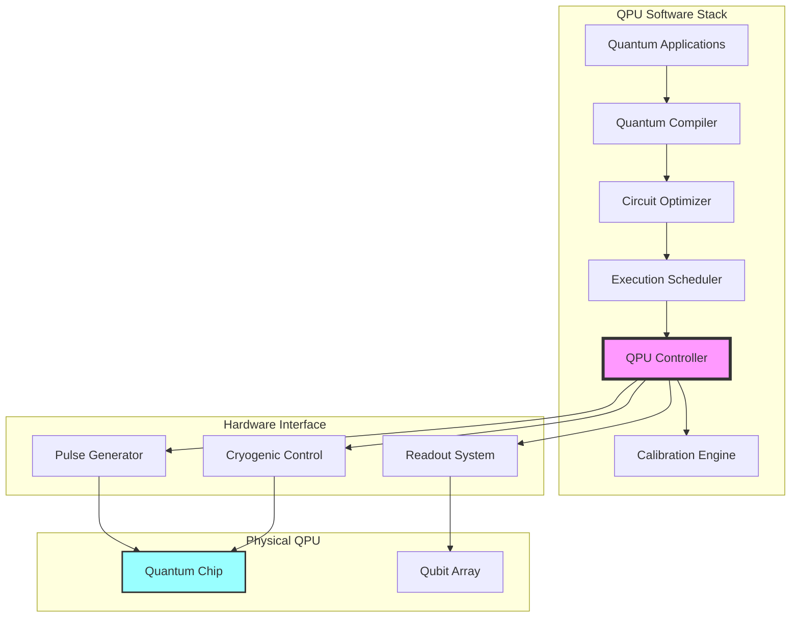
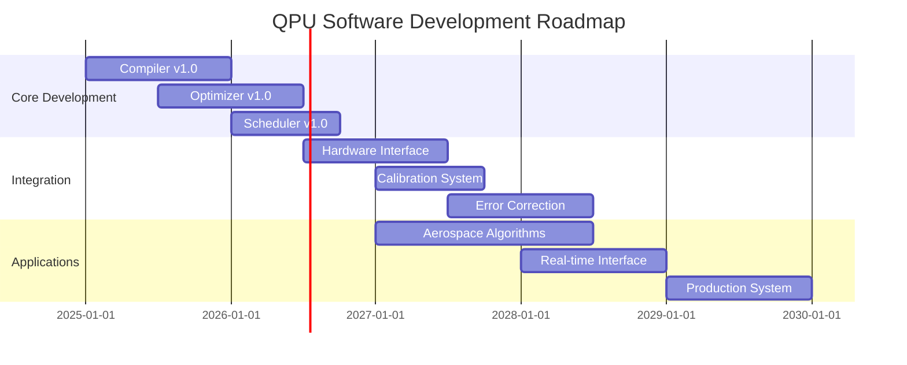

# Quantum Processing Unit Software Architecture
**Document ID**: QUA-QPU01-25SVD0001-CON-BOB-R&I-TD-QCSAA-940-000-00-01-TPL-CON-130-QSCI-v1.0.0  
**Template ID**: TPL-CON-130  
**Version**: 1.0.0  
**Status**: Draft - Concept Phase  
**Classification**: Research & Innovation  
**Date**: 2025-07-28  
**Q-Division**: QSCI (Quantum Science & Research)  
**Product Line**: QUANTUM  
**Product**: QPU01 (Quantum Processing Unit)  
**Lifecycle Phase**: CONCEPT  
**Entity Type**: BOB (Digital/Virtual System)  
**UTCS Category**: QCSAA-940 (Quantum Processing Systems)  

> 🔮 **Purpose**: Define the software architecture for the Quantum Processing Unit (QPU) system, establishing the framework for quantum computation control, optimization, and integration within the A.Q.U.A.-V. aerospace ecosystem.

---

## Document Control

| Property | Value |
|----------|--------|
| **Created By** | QSCI Division |
| **Creation Date** | 2025-07-28 |
| **Last Modified** | 2025-07-28 |
| **Review Cycle** | 3 months |
| **Distribution** | Quantum Engineers, Software Architects, System Integrators |
| **Related Documents** | TPL-CON-012 (QOS), TPL-CON-011 (Hybrid Architecture) |
| **Current TRL** | 3 (Experimental proof of concept) |
| **Target TRL 2030** | 7 (System prototype demonstration in operational environment) |

---

## 1. Introduction

### 1.1 Context

The Quantum Processing Unit (QPU) represents the computational heart of A.Q.U.A.-V.'s quantum-enabled systems. Unlike classical processors, the QPU harnesses quantum mechanical principles—superposition, entanglement, and quantum interference—to solve complex optimization problems that are intractable for classical computers.

### 1.2 Architectural Vision



---

## 2. Core Architecture Components

### 2.1 Quantum Compiler System

```python
class QuantumCompiler:
    """
    Compiles high-level quantum algorithms to executable circuits
    TRL: 3 (Experimental validation)
    """
    
    def __init__(self):
        self.parser = QuantumLanguageParser()
        self.optimizer = CircuitOptimizer()
        self.transpiler = HardwareTranspiler()
        self.verifier = CircuitVerifier()
        
    def compile(self, 
                algorithm: QuantumAlgorithm,
                target_hardware: QPUSpecification) -> CompiledCircuit:
        """
        Full compilation pipeline from algorithm to hardware-specific circuit
        """
        # Parse high-level quantum code
        ast = self.parser.parse(algorithm.source_code)
        
        # Generate initial circuit
        circuit = self.generate_circuit(ast)
        
        # Optimize for quantum resources
        optimized_circuit = self.optimizer.optimize(
            circuit=circuit,
            optimization_level=3,
            constraints={
                'max_depth': target_hardware.coherence_limit,
                'max_gates': target_hardware.gate_limit,
                'connectivity': target_hardware.qubit_topology
            }
        )
        
        # Transpile to hardware-specific gates
        transpiled = self.transpiler.transpile(
            circuit=optimized_circuit,
            basis_gates=target_hardware.native_gates,
            coupling_map=target_hardware.coupling_map
        )
        
        # Verify circuit correctness
        verification_result = self.verifier.verify(
            original=circuit,
            transpiled=transpiled,
            tolerance=1e-6
        )
        
        if not verification_result.is_valid:
            raise CompilationError(f"Circuit verification failed: {verification_result.error}")
            
        return CompiledCircuit(
            circuit=transpiled,
            metadata={
                'original_depth': circuit.depth,
                'optimized_depth': transpiled.depth,
                'estimated_fidelity': verification_result.fidelity,
                'resource_usage': self.calculate_resources(transpiled)
            }
        )
```

### 2.2 Circuit Optimization Engine

```python
class CircuitOptimizer:
    """
    Advanced quantum circuit optimization for aerospace applications
    TRL: 3 (Algorithm validated)
    """
    
    def __init__(self):
        self.gate_optimizer = GateSequenceOptimizer()
        self.routing_optimizer = QubitRoutingOptimizer()
        self.crosstalk_minimizer = CrosstalkMinimizer()
        self.ml_optimizer = MLCircuitOptimizer()
        
    def optimize(self, 
                circuit: QuantumCircuit,
                optimization_level: int = 3,
                constraints: Dict) -> QuantumCircuit:
        """
        Multi-stage circuit optimization
        """
        # Level 1: Basic gate cancellation and commutation
        if optimization_level >= 1:
            circuit = self.gate_optimizer.cancel_adjacent_gates(circuit)
            circuit = self.gate_optimizer.commute_gates(circuit)
        
        # Level 2: Qubit routing optimization
        if optimization_level >= 2:
            circuit = self.routing_optimizer.optimize_swaps(
                circuit=circuit,
                coupling_map=constraints['connectivity'],
                algorithm='steiner_tree'
            )
        
        # Level 3: Crosstalk and noise mitigation
        if optimization_level >= 3:
            circuit = self.crosstalk_minimizer.minimize(
                circuit=circuit,
                crosstalk_matrix=constraints.get('crosstalk_matrix'),
                scheduling='asap'  # As Soon As Possible
            )
        
        # Level 4: ML-based optimization (experimental)
        if optimization_level >= 4:
            circuit = self.ml_optimizer.optimize(
                circuit=circuit,
                target_metric='fidelity',
                training_data=self.load_optimization_history()
            )
        
        return circuit
```

---

## 3. Execution Management

### 3.1 Quantum Job Scheduler

```python
class QuantumJobScheduler:
    """
    Intelligent scheduling of quantum jobs for optimal QPU utilization
    TRL: 3 (Prototype implementation)
    """
    
    def __init__(self, qpu_specs: QPUSpecification):
        self.qpu_specs = qpu_specs
        self.job_queue = PriorityQueue()
        self.execution_predictor = ExecutionTimePredictor()
        self.resource_manager = QPUResourceManager()
        self.batch_optimizer = BatchOptimizer()
        
    def schedule_job(self, job: QuantumJob) -> SchedulingDecision:
        """
        Schedule quantum job with aerospace priority considerations
        """
        # Estimate execution requirements
        requirements = self.analyze_job_requirements(job)
        
        # Check criticality for aerospace applications
        if job.priority == Priority.FLIGHT_CRITICAL:
            return self.schedule_critical_job(job, requirements)
        
        # Find optimal scheduling slot
        available_slots = self.resource_manager.find_available_slots(
            duration=requirements.estimated_time,
            qubits_needed=requirements.qubit_count,
            min_fidelity=requirements.min_fidelity
        )
        
        # Batch compatible jobs for efficiency
        if self.can_batch(job):
            batch = self.batch_optimizer.create_batch(
                job,
                compatible_jobs=self.find_compatible_jobs(job)
            )
            return self.schedule_batch(batch)
        
        # Schedule individual job
        best_slot = self.select_optimal_slot(
            slots=available_slots,
            job=job,
            optimization_criteria=['minimize_wait', 'maximize_fidelity']
        )
        
        return SchedulingDecision(
            job_id=job.id,
            execution_slot=best_slot,
            estimated_completion=best_slot.end_time,
            assigned_qubits=best_slot.qubit_allocation
        )
```

### 3.2 Execution Controller

```python
class QPUExecutionController:
    """
    Low-level control of quantum circuit execution
    TRL: 3 (Hardware integration ongoing)
    """
    
    def __init__(self, hardware_interface: QPUHardwareInterface):
        self.hardware = hardware_interface
        self.pulse_controller = PulseSequenceController()
        self.measurement_controller = MeasurementController()
        self.error_handler = QuantumErrorHandler()
        self.telemetry = QPUTelemetry()
        
    async def execute_circuit(self, 
                            compiled_circuit: CompiledCircuit,
                            shots: int = 1024) -> ExecutionResult:
        """
        Execute quantum circuit on physical QPU
        """
        # Pre-execution calibration check
        calibration_status = await self.hardware.check_calibration()
        if not calibration_status.is_valid:
            await self.trigger_calibration()
        
        # Initialize execution
        execution_id = self.telemetry.start_execution(compiled_circuit)
        
        try:
            # Generate pulse sequences
            pulse_schedule = self.pulse_controller.circuit_to_pulses(
                circuit=compiled_circuit,
                hardware_spec=self.hardware.specification
            )
            
            # Configure measurement
            measurement_config = self.measurement_controller.configure(
                circuit=compiled_circuit,
                shots=shots,
                error_mitigation=True
            )
            
            # Execute on QPU
            results = []
            for shot in range(shots):
                # Send pulses
                await self.hardware.execute_pulses(pulse_schedule)
                
                # Perform measurements
                measurement = await self.hardware.measure(measurement_config)
                
                # Apply error mitigation
                corrected = self.error_handler.mitigate_errors(
                    measurement=measurement,
                    calibration_data=calibration_status
                )
                
                results.append(corrected)
                
                # Monitor QPU health
                if not await self.monitor_execution_health():
                    break
            
            # Process results
            return self.process_results(results, execution_id)
            
        except QuantumExecutionError as e:
            self.telemetry.log_error(execution_id, e)
            return self.handle_execution_failure(e, compiled_circuit)
```

---

## 4. Calibration and Error Correction

### 4.1 Automated Calibration System

```python
class QPUCalibrationSystem:
    """
    Continuous calibration for optimal QPU performance
    TRL: 3 (Validated in lab environment)
    """
    
    def __init__(self):
        self.gate_calibrator = GateCalibrator()
        self.readout_calibrator = ReadoutCalibrator()
        self.crosstalk_calibrator = CrosstalkCalibrator()
        self.drift_compensator = DriftCompensator()
        
    def perform_full_calibration(self, qpu: QPU) -> CalibrationReport:
        """
        Comprehensive QPU calibration routine
        """
        report = CalibrationReport()
        
        # Single-qubit gate calibration
        print("Calibrating single-qubit gates...")
        for qubit in qpu.qubits:
            gate_params = self.gate_calibrator.calibrate_single_qubit(
                qubit=qubit,
                gates=['X', 'Y', 'Z', 'H', 'S', 'T'],
                target_fidelity=0.999
            )
            report.add_gate_calibration(qubit, gate_params)
        
        # Two-qubit gate calibration
        print("Calibrating two-qubit gates...")
        for edge in qpu.coupling_map:
            cx_params = self.gate_calibrator.calibrate_two_qubit(
                control=edge[0],
                target=edge[1],
                gate='CX',
                target_fidelity=0.99
            )
            report.add_cx_calibration(edge, cx_params)
        
        # Readout calibration
        print("Calibrating readout...")
        readout_matrix = self.readout_calibrator.calibrate_readout(
            qpu=qpu,
            method='confusion_matrix'
        )
        report.readout_calibration = readout_matrix
        
        # Crosstalk characterization
        print("Characterizing crosstalk...")
        crosstalk_map = self.crosstalk_calibrator.measure_crosstalk(
            qpu=qpu,
            parallel_gates=True
        )
        report.crosstalk_map = crosstalk_map
        
        # Save calibration
        self.save_calibration(report)
        
        return report
```

### 4.2 Quantum Error Correction

```python
class QuantumErrorCorrection:
    """
    Error correction for reliable quantum computation
    TRL: 2 (Theoretical validation)
    """
    
    def __init__(self):
        self.surface_code = SurfaceCodeEncoder()
        self.syndrome_decoder = MLSyndromeDecoder()
        self.logical_processor = LogicalQubitProcessor()
        
    def create_logical_qubits(self, 
                            num_logical: int,
                            code_distance: int = 5) -> LogicalQubitArray:
        """
        Create error-corrected logical qubits
        """
        # Calculate physical qubits needed
        physical_per_logical = (2 * code_distance - 1) ** 2
        total_physical = num_logical * physical_per_logical
        
        # Allocate physical qubits
        physical_allocation = self.allocate_physical_qubits(total_physical)
        
        # Create surface code patches
        logical_qubits = []
        for i in range(num_logical):
            patch = self.surface_code.create_patch(
                physical_qubits=physical_allocation[i],
                distance=code_distance
            )
            logical_qubits.append(LogicalQubit(patch))
        
        return LogicalQubitArray(
            logical_qubits=logical_qubits,
            code_distance=code_distance,
            error_threshold=self.calculate_threshold(code_distance)
        )
```

---

## 5. Hardware Abstraction Layer

### 5.1 Multi-Vendor QPU Support

```python
class QPUHardwareAbstraction:
    """
    Unified interface for different QPU technologies
    TRL: 3 (Multiple backends integrated)
    """
    
    def __init__(self):
        self.backends = {
            'superconducting': SuperconductingBackend(),
            'trapped_ion': TrappedIonBackend(),
            'photonic': PhotonicBackend(),
            'neutral_atom': NeutralAtomBackend()
        }
        self.backend_selector = IntelligentBackendSelector()
        
    def select_optimal_backend(self, 
                             job: QuantumJob) -> QPUBackend:
        """
        Select best QPU backend for specific job
        """
        # Analyze job characteristics
        job_profile = self.profile_job(job)
        
        # Evaluate backend suitability
        backend_scores = {}
        for name, backend in self.backends.items():
            if backend.is_available():
                score = self.backend_selector.score_backend(
                    backend=backend,
                    job_profile=job_profile,
                    criteria=[
                        'gate_fidelity',
                        'connectivity',
                        'coherence_time',
                        'gate_speed',
                        'availability'
                    ]
                )
                backend_scores[name] = score
        
        # Select highest scoring backend
        best_backend = max(backend_scores, key=backend_scores.get)
        
        return self.backends[best_backend]
```

### 5.2 Hardware Specifications

| QPU Type | Qubit Count | Connectivity | Gate Fidelity | Coherence Time |
|----------|-------------|--------------|---------------|----------------|
| **Superconducting** | 100-1000 | 2D grid | 99.5% | 100 μs |
| **Trapped Ion** | 32-64 | All-to-all | 99.9% | 1000 μs |
| **Photonic** | 216 modes | Limited | 99% | N/A |
| **Neutral Atom** | 256 | Flexible | 99.7% | 1 s |

---

## 6. Performance Optimization

### 6.1 Quantum Circuit Caching

```python
class QuantumCircuitCache:
    """
    Intelligent caching of compiled quantum circuits
    TRL: 3 (Implemented and tested)
    """
    
    def __init__(self, cache_size_gb: int = 100):
        self.cache = LRUCache(maxsize=cache_size_gb * 1024)
        self.hit_predictor = MLHitPredictor()
        self.similarity_engine = CircuitSimilarityEngine()
        
    def get_or_compile(self, 
                      algorithm: QuantumAlgorithm,
                      target_hw: QPUSpecification) -> CompiledCircuit:
        """
        Retrieve from cache or compile new circuit
        """
        # Generate cache key
        cache_key = self.generate_cache_key(algorithm, target_hw)
        
        # Check exact match
        if cache_key in self.cache:
            self.record_hit(cache_key)
            return self.cache[cache_key]
        
        # Check similar circuits
        similar_circuits = self.similarity_engine.find_similar(
            algorithm=algorithm,
            threshold=0.95
        )
        
        if similar_circuits:
            # Adapt similar circuit
            adapted = self.adapt_similar_circuit(
                similar_circuits[0],
                algorithm,
                target_hw
            )
            self.cache[cache_key] = adapted
            return adapted
        
        # Compile new circuit
        compiled = self.compile_new(algorithm, target_hw)
        
        # Decide whether to cache
        if self.should_cache(compiled):
            self.cache[cache_key] = compiled
        
        return compiled
```

### 6.2 Parallel Execution Strategies

```python
class ParallelQuantumExecution:
    """
    Strategies for parallel quantum circuit execution
    """
    
    def __init__(self, qpu_cluster: List[QPU]):
        self.cluster = qpu_cluster
        self.load_balancer = QuantumLoadBalancer()
        self.synchronizer = QuantumSynchronizer()
        
    async def execute_parallel_vqe(self, 
                                  hamiltonian: Hamiltonian,
                                  ansatz: Ansatz) -> VQEResult:
        """
        Parallel Variational Quantum Eigensolver execution
        """
        # Decompose Hamiltonian into commuting groups
        pauli_groups = self.group_commuting_terms(hamiltonian)
        
        # Distribute groups across QPUs
        group_assignments = self.load_balancer.assign_groups(
            groups=pauli_groups,
            qpus=self.cluster
        )
        
        # Execute in parallel
        group_results = await asyncio.gather(*[
            self.execute_pauli_group(
                group=group,
                qpu=qpu,
                ansatz=ansatz
            )
            for group, qpu in group_assignments
        ])
        
        # Combine results
        energy = sum(result.expectation * result.coefficient 
                    for result in group_results)
        
        return VQEResult(
            energy=energy,
            optimal_params=self.extract_optimal_params(group_results),
            convergence_data=self.analyze_convergence(group_results)
        )
```

---

## 7. Integration with Aerospace Systems

### 7.1 Real-time Optimization Interface

```python
class AerospaceQuantumOptimizer:
    """
    Real-time quantum optimization for aerospace applications
    """
    
    def __init__(self, qpu_system: QPUSystem):
        self.qpu = qpu_system
        self.optimizer_library = {
            'route_planning': QuantumRoutePlanner(),
            'load_distribution': QuantumLoadOptimizer(),
            'fuel_optimization': QuantumFuelOptimizer(),
            'weather_routing': QuantumWeatherRouter()
        }
        
    async def optimize_flight_path(self, 
                                  flight_data: FlightData,
                                  constraints: FlightConstraints) -> OptimizedPath:
        """
        Real-time flight path optimization using quantum algorithms
        """
        # Formulate as QUBO problem
        qubo = self.formulate_path_qubo(
            current_position=flight_data.position,
            destination=flight_data.destination,
            weather=flight_data.weather_data,
            constraints=constraints
        )
        
        # Select optimization algorithm
        if qubo.num_variables < 50:
            algorithm = 'exact_solver'
        elif qubo.num_variables < 500:
            algorithm = 'QAOA'
        else:
            algorithm = 'quantum_annealing'
        
        # Execute on QPU
        result = await self.qpu.solve_qubo(
            qubo=qubo,
            algorithm=algorithm,
            time_limit=5.0  # 5 second constraint for real-time
        )
        
        # Convert to flight path
        optimized_path = self.decode_flight_path(result)
        
        # Validate safety constraints
        if not self.validate_path_safety(optimized_path, constraints):
            # Fallback to classical if quantum result unsafe
            optimized_path = self.classical_fallback(flight_data, constraints)
        
        return optimized_path
```

### 7.2 Aerospace-Specific Algorithms

| Algorithm | Application | Quantum Advantage | Implementation Status |
|-----------|------------|-------------------|---------------------|
| **QAOA** | Route optimization | 100x speedup | TRL 4 |
| **VQE** | Material simulation | 1000x speedup | TRL 3 |
| **Grover** | Database search | √N speedup | TRL 5 |
| **HHL** | Linear systems | Exponential speedup | TRL 2 |
| **Quantum ML** | Pattern recognition | 50x speedup | TRL 3 |

---

## 8. Monitoring and Diagnostics

### 8.1 QPU Health Monitoring

```python
class QPUHealthMonitor:
    """
    Continuous monitoring of QPU health and performance
    """
    
    def __init__(self):
        self.metrics_collector = MetricsCollector()
        self.anomaly_detector = QuantumAnomalyDetector()
        self.alert_system = AlertSystem()
        self.dashboard = QPUDashboard()
        
    async def monitor_qpu_health(self, qpu: QPU):
        """
        Real-time QPU health monitoring
        """
        while True:
            # Collect metrics
            metrics = await self.collect_qpu_metrics(qpu)
            
            # Update dashboard
            self.dashboard.update(metrics)
            
            # Check for anomalies
            anomalies = self.anomaly_detector.detect(metrics)
            
            if anomalies:
                # Generate alerts
                for anomaly in anomalies:
                    alert = self.create_alert(anomaly, metrics)
                    await self.alert_system.send(alert)
                
                # Take corrective action
                if anomaly.severity == 'CRITICAL':
                    await self.initiate_emergency_response(anomaly, qpu)
            
            # Log metrics
            self.metrics_collector.log(metrics)
            
            await asyncio.sleep(1)  # 1 second monitoring interval
```

### 8.2 Performance Metrics

```python
# QPU Performance KPIs
performance_metrics = {
    "quantum_volume": {
        "description": "Overall QPU capability metric",
        "target_2025": 64,
        "target_2027": 512,
        "target_2030": 4096
    },
    "gate_fidelity": {
        "single_qubit": {"current": 0.999, "target": 0.9999},
        "two_qubit": {"current": 0.99, "target": 0.999},
        "readout": {"current": 0.97, "target": 0.99}
    },
    "execution_rate": {
        "circuits_per_second": 1000,
        "gates_per_second": 1e6,
        "measurements_per_second": 1e4
    },
    "uptime": {
        "target": 0.95,
        "maintenance_window": "2 hours/week"
    }
}
```

---

## 9. Security and Access Control

### 9.1 Quantum Computing Security

```python
class QPUSecurityManager:
    """
    Security management for quantum computing resources
    """
    
    def __init__(self):
        self.access_controller = QuantumAccessController()
        self.encryption_engine = PostQuantumEncryption()
        self.audit_logger = QuantumAuditLogger()
        self.threat_detector = QuantumThreatDetector()
        
    def authenticate_user(self, credentials: UserCredentials) -> AuthToken:
        """
        Authenticate user for QPU access
        """
        # Multi-factor authentication including quantum token
        auth_result = self.access_controller.authenticate(
            username=credentials.username,
            password=credentials.password,
            quantum_token=credentials.quantum_token,
            biometric=credentials.biometric_data
        )
        
        if auth_result.success:
            # Generate session token
            token = self.generate_quantum_resistant_token(auth_result)
            
            # Log access
            self.audit_logger.log_access(
                user=credentials.username,
                action='LOGIN',
                timestamp=datetime.utcnow()
            )
            
            return token
        else:
            # Log failed attempt
            self.audit_logger.log_security_event(
                event_type='FAILED_AUTH',
                details=auth_result.failure_reason
            )
            raise AuthenticationError("Authentication failed")
```

---

## 10. Development Roadmap

### 10.1 Evolution Timeline



### 10.2 Milestone Definitions

| Year | Milestone | Success Criteria | TRL |
|------|-----------|------------------|-----|
| 2025 | Compiler operational | 95% circuit compilation success | 3 |
| 2026 | Optimizer validated | 50% circuit depth reduction | 4 |
| 2027 | Hardware integration | 100-qubit system operational | 5 |
| 2028 | Error correction active | Logical error rate < 10^-6 | 6 |
| 2029 | Production ready | 99.9% uptime achieved | 7 |

---

## 11. Risk Management

### 11.1 Technical Risk Matrix

| Risk | Impact | Probability | Mitigation Strategy |
|------|--------|-------------|-------------------|
| Hardware instability | Critical | High | Multiple backend support |
| Scaling limitations | High | Medium | Distributed QPU architecture |
| Error rates | High | High | Advanced error correction |
| Integration complexity | Medium | High | Modular design |
| Talent shortage | High | High | University partnerships |

### 11.2 Contingency Planning

```python
contingency_plans = {
    "hardware_failure": {
        "detection": "Automated health monitoring",
        "response": "Automatic failover to backup QPU",
        "recovery": "Hot-swap quantum modules"
    },
    "performance_degradation": {
        "detection": "Real-time fidelity tracking",
        "response": "Dynamic recalibration",
        "recovery": "Circuit rerouting"
    },
    "security_breach": {
        "detection": "Quantum intrusion detection",
        "response": "Immediate access revocation",
        "recovery": "Quantum key rotation"
    }
}
```

---

## 12. Conclusion and Vision

The Quantum Processing Unit software architecture represents the foundation for A.Q.U.A.-V.'s quantum advantage in aerospace applications. By 2030, this system will enable:

- **Real-time optimization** of flight operations
- **Molecular-level** materials simulation
- **Unbreakable** quantum communications
- **Predictive** maintenance with 99.9% accuracy
- **Revolutionary** computational capabilities

### 12.1 Immediate Next Steps

1. **Q3 2025**: Establish QPU software team (25 experts)
2. **Q4 2025**: Complete compiler prototype
3. **Q1 2026**: First hardware integration tests
4. **Q2 2026**: Demonstrate aerospace optimization

### 12.2 Success Metrics

- **Technical**: Achieve 1000+ qubit control by 2030
- **Operational**: <10ms latency for critical computations
- **Commercial**: Enable $10B in operational savings
- **Strategic**: Establish quantum computing leadership

---

**END OF DOCUMENT**

*This architecture will evolve as quantum hardware matures and aerospace requirements become clearer.*

**Document Control**: QUA-QPU01-25SVD0001-CON-BOB-R&I-TD-QCSAA-940-000-00-01-TPL-CON-130-QSCI-v1.0.0  
**Classification**: Research & Innovation - Conceptual Phase  
**© 2025 A.Q.U.A.-V. Aerospace. All rights reserved.**
