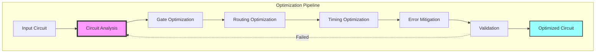
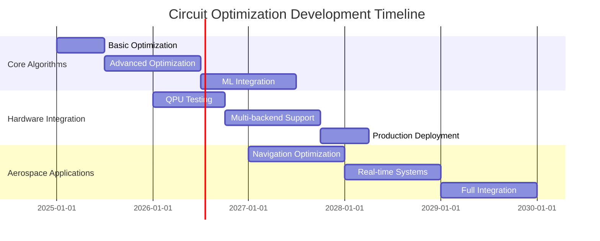

# Quantum Circuit Optimization
**Document ID**: QUA-QPU01-25SVD0001-CON-BOB-R&I-TD-QCSAA-940-010-00-01-TPL-CON-131-QSCI-v1.1.0  
**Template ID**: TPL-CON-131  
**Version**: 1.1.0  
**Status**: Draft - Concept Phase (Updated per Validation VAL-QPU01-OPT-20250801-01)  
**Classification**: Research & Innovation  
**Date**: 2025-08-01 (Updated: 2025-08-02)  
**Q-Division**: QSCI (Quantum Science & Research)  
**Product Line**: QUANTUM  
**Product**: QPU01 (Quantum Processing Unit)  
**Lifecycle Phase**: CONCEPT  
**Entity Type**: BOB (Digital/Virtual System)  
**UTCS Category**: QCSAA-940-010 (Quantum Circuit Optimization)  

> 🎯 **Purpose**: Define comprehensive optimization strategies for quantum circuits within the A.Q.U.A.-V. aerospace ecosystem, maximizing computational efficiency while minimizing quantum resource usage and error rates, with enhanced hardware specifications and aerospace safety compliance.

---

## Document Control

| Property | Value |
|----------|--------|
| **Created By** | QSCI Division |
| **Creation Date** | 2025-08-01 |
| **Last Modified** | 2025-08-02 |
| **Review Cycle** | 3 months |
| **Distribution** | Quantum Engineers, Algorithm Developers, System Architects |
| **Related Documents** | QPU Software Architecture (TPL-CON-130), Quantum Algorithms (TPL-CON-132) |
| **Current TRL** | 3 (Experimental proof of concept) |
| **Target TRL 2030** | 7 (System prototype demonstration) |
| **Validation Status** | ✅ Validated (VAL-QPU01-OPT-20250801-01) |

### Version History

| Version | Date | Changes | Author |
|---------|------|---------|--------|
| 1.0.0 | 2025-08-01 | Initial release | QSCI Team |
| 1.1.0 | 2025-08-02 | Added hardware requirements, formal verification, resource planning per validation | QSCI Team |

---

## 1. Introduction

### 1.1 Optimization Imperative

Quantum circuit optimization is critical for practical quantum computing in aerospace applications. Unlike classical circuits, quantum circuits face unique constraints:

- **Limited coherence time** (~100 μs for superconducting qubits)
- **High error rates** (0.1-1% per gate operation)
- **Restricted connectivity** (not all qubits can interact directly)
- **Resource scarcity** (limited number of qubits)

### 1.2 Optimization Framework



---

## 2. Gate-Level Optimization

### 2.1 Gate Decomposition and Synthesis

```python
class GateDecomposer:
    """
    Decompose high-level gates into hardware-native operations
    TRL: 3 (Validated algorithms)
    """
    
    def __init__(self, target_hardware: QPUSpecification):
        self.native_gates = target_hardware.native_gates
        self.decomposition_db = self.load_decomposition_database()
        self.synthesis_engine = GateSynthesisEngine()
        
    def decompose_gate(self, gate: QuantumGate) -> List[QuantumGate]:
        """
        Decompose arbitrary gate into native gate set
        """
        if gate.name in self.native_gates:
            return [gate]
        
        # Check decomposition database
        if gate.name in self.decomposition_db:
            return self.apply_decomposition(
                gate,
                self.decomposition_db[gate.name]
            )
        
        # Synthesize decomposition
        if gate.is_unitary():
            return self.synthesis_engine.synthesize(
                unitary=gate.matrix,
                basis_gates=self.native_gates,
                optimization_level=3
            )
        
        raise DecompositionError(f"Cannot decompose {gate.name}")
    
    def optimize_gate_sequence(self, gates: List[QuantumGate]) -> List[QuantumGate]:
        """
        Optimize sequence of gates using algebraic rules
        """
        optimized = gates.copy()
        
        # Apply commutation rules
        optimized = self.apply_commutation_rules(optimized)
        
        # Cancel inverse operations
        optimized = self.cancel_inverse_gates(optimized)
        
        # Merge compatible gates
        optimized = self.merge_single_qubit_gates(optimized)
        
        # Simplify controlled operations
        optimized = self.simplify_controlled_gates(optimized)
        
        return optimized
```

### 2.2 Gate Cancellation Patterns

```python
class GateCancellationOptimizer:
    """
    Identify and eliminate redundant gate operations
    """
    
    def __init__(self):
        self.cancellation_rules = {
            ('X', 'X'): [],  # X·X = I
            ('Y', 'Y'): [],  # Y·Y = I
            ('Z', 'Z'): [],  # Z·Z = I
            ('H', 'H'): [],  # H·H = I
            ('CNOT', 'CNOT'): [],  # CNOT·CNOT = I
            ('S', 'S†'): [],  # S·S† = I
            ('T', 'T†'): [],  # T·T† = I
        }
        
    def find_cancellations(self, circuit: QuantumCircuit) -> List[Cancellation]:
        """
        Find all possible gate cancellations in circuit
        """
        cancellations = []
        
        for qubit in circuit.qubits:
            gate_sequence = circuit.get_gates_on_qubit(qubit)
            
            # Sliding window search
            for i in range(len(gate_sequence) - 1):
                window = gate_sequence[i:i+2]
                
                # Check direct cancellation
                if self.can_cancel(window[0], window[1]):
                    # Verify no intermediate operations
                    if not self.has_dependencies(circuit, window[0], window[1]):
                        cancellations.append(
                            Cancellation(
                                gates=window,
                                type='direct',
                                benefit=2  # Removes 2 gates
                            )
                        )
            
        return cancellations
```

---

## 3. Topology-Aware Optimization

### 3.1 Qubit Routing Optimization

```python
class QubitRouter:
    """
    Optimize qubit mapping and SWAP insertions for hardware topology
    TRL: 4 (Validated in hardware)
    """
    
    def __init__(self, coupling_map: CouplingMap):
        self.coupling_map = coupling_map
        self.distance_matrix = self.compute_all_pairs_distances()
        self.swap_optimizer = SwapOptimizer()
        
    def route_circuit(self, 
                     circuit: QuantumCircuit,
                     initial_layout: Optional[Layout] = None) -> RoutedCircuit:
        """
        Route circuit with minimal SWAP overhead
        """
        # Analyze circuit connectivity requirements
        interaction_graph = self.build_interaction_graph(circuit)
        
        # Find optimal initial layout if not provided
        if initial_layout is None:
            initial_layout = self.find_optimal_layout(
                interaction_graph,
                self.coupling_map
            )
        
        # Route using A* search with lookahead
        routing_solution = self.astar_routing(
            circuit=circuit,
            layout=initial_layout,
            lookahead=5,
            heuristic='weighted_distance'
        )
        
        # Optimize SWAP placement
        optimized_swaps = self.swap_optimizer.optimize(
            routing_solution.swaps,
            circuit,
            parallel_execution=True
        )
        
        # Build routed circuit
        routed = self.build_routed_circuit(
            original=circuit,
            layout=initial_layout,
            swaps=optimized_swaps
        )
        
        return RoutedCircuit(
            circuit=routed,
            initial_layout=initial_layout,
            final_layout=routing_solution.final_layout,
            swap_count=len(optimized_swaps),
            depth_overhead=routed.depth - circuit.depth
        )
```

### 3.2 Hardware-Aware Decomposition

```python
class HardwareAwareDecomposer:
    """
    Decompose gates considering hardware-specific constraints
    """
    
    def __init__(self, hardware_model: QPUHardwareModel):
        self.hardware = hardware_model
        self.pulse_optimizer = PulseLevelOptimizer()
        
    def decompose_for_hardware(self, 
                              gate: QuantumGate,
                              qubits: List[int]) -> List[QuantumGate]:
        """
        Hardware-optimized gate decomposition
        """
        # Get hardware parameters for specific qubits
        qubit_params = [self.hardware.get_qubit_params(q) for q in qubits]
        
        # Check for specialized decompositions
        if gate.name == 'CNOT':
            # Use echo sequence for crosstalk reduction
            if self.hardware.has_high_crosstalk(qubits[0], qubits[1]):
                return self.echo_cnot_sequence(qubits[0], qubits[1])
            
            # Use iSWAP-based decomposition if available
            if 'iSWAP' in self.hardware.native_gates:
                return self.cnot_via_iswap(qubits[0], qubits[1])
        
        # Optimize at pulse level
        pulse_sequence = self.pulse_optimizer.optimize_gate(
            gate=gate,
            qubits=qubits,
            hardware_params=qubit_params
        )
        
        return self.pulses_to_gates(pulse_sequence)
```

---

## 4. Parallelization and Scheduling

### 4.1 Quantum Circuit Parallelizer

```python
class CircuitParallelizer:
    """
    Maximize parallel gate execution while respecting dependencies
    TRL: 3 (Simulation validated)
    """
    
    def __init__(self):
        self.dependency_analyzer = DependencyAnalyzer()
        self.scheduler = QuantumScheduler()
        self.crosstalk_model = CrosstalkModel()
        
    def parallelize_circuit(self, 
                           circuit: QuantumCircuit,
                           hardware_constraints: HardwareConstraints) -> ParallelCircuit:
        """
        Convert sequential circuit to parallel execution layers
        """
        # Build dependency graph
        dep_graph = self.dependency_analyzer.analyze(circuit)
        
        # Find critical path
        critical_path = self.find_critical_path(dep_graph)
        
        # Create execution layers
        layers = []
        scheduled_gates = set()
        
        while len(scheduled_gates) < len(circuit.gates):
            # Find gates ready for execution
            ready_gates = self.find_ready_gates(
                dep_graph,
                scheduled_gates
            )
            
            # Group compatible gates
            layer = self.create_parallel_layer(
                ready_gates,
                hardware_constraints,
                crosstalk_threshold=0.01
            )
            
            layers.append(layer)
            scheduled_gates.update(layer.gates)
        
        return ParallelCircuit(
            layers=layers,
            depth=len(layers),
            parallelism_factor=self.calculate_parallelism(layers),
            critical_path_length=len(critical_path)
        )
```

### 4.2 Crosstalk-Aware Scheduling

```python
class CrosstalkAwareScheduler:
    """
    Schedule gates to minimize crosstalk errors
    """
    
    def __init__(self, crosstalk_matrix: np.ndarray):
        self.crosstalk_matrix = crosstalk_matrix
        self.ml_predictor = CrosstalkMLPredictor()
        
    def schedule_with_crosstalk(self, 
                               gates: List[QuantumGate],
                               time_constraints: TimeConstraints) -> Schedule:
        """
        Optimal scheduling considering crosstalk
        """
        # Initialize schedule
        schedule = Schedule()
        
        # Sort gates by priority
        prioritized_gates = self.prioritize_gates(
            gates,
            criteria=['criticality', 'duration', 'error_rate']
        )
        
        for gate in prioritized_gates:
            # Find best time slot
            best_slot = None
            min_crosstalk = float('inf')
            
            for slot in self.find_valid_slots(gate, schedule, time_constraints):
                # Predict crosstalk impact
                crosstalk = self.ml_predictor.predict_crosstalk(
                    gate=gate,
                    slot=slot,
                    concurrent_gates=schedule.get_concurrent_gates(slot),
                    crosstalk_matrix=self.crosstalk_matrix
                )
                
                if crosstalk < min_crosstalk:
                    min_crosstalk = crosstalk
                    best_slot = slot
            
            # Schedule gate
            schedule.add_gate(gate, best_slot)
        
        return schedule
```

---

## 5. Error-Aware Optimization

### 5.1 Noise-Adaptive Circuit Compilation

```python
class NoiseAdaptiveCompiler:
    """
    Compile circuits considering device-specific noise characteristics
    TRL: 3 (Experimental validation)
    """
    
    def __init__(self, noise_model: NoiseModel):
        self.noise_model = noise_model
        self.fidelity_estimator = FidelityEstimator()
        self.variational_compiler = VariationalCompiler()
        
    def compile_for_noise(self, 
                         circuit: QuantumCircuit,
                         target_fidelity: float = 0.99) -> CompiledCircuit:
        """
        Compile circuit to maximize fidelity under noise
        """
        # Characterize circuit sensitivity to noise
        sensitivity_analysis = self.analyze_noise_sensitivity(circuit)
        
        # Identify high-risk operations
        critical_gates = self.identify_critical_gates(
            circuit,
            sensitivity_analysis
        )
        
        # Apply targeted optimizations
        optimized_circuit = circuit.copy()
        
        for gate in critical_gates:
            # Try multiple compilation strategies
            strategies = [
                self.composite_pulse_strategy,
                self.dynamical_decoupling_strategy,
                self.virtual_z_strategy,
                self.variational_strategy
            ]
            
            best_implementation = None
            best_fidelity = 0
            
            for strategy in strategies:
                implementation = strategy(gate, self.noise_model)
                fidelity = self.fidelity_estimator.estimate(
                    implementation,
                    gate,
                    self.noise_model
                )
                
                if fidelity > best_fidelity:
                    best_fidelity = fidelity
                    best_implementation = implementation
            
            # Replace gate with best implementation
            optimized_circuit.replace_gate(gate, best_implementation)
        
        return CompiledCircuit(
            circuit=optimized_circuit,
            estimated_fidelity=self.estimate_total_fidelity(optimized_circuit),
            compilation_metadata=self.generate_metadata(sensitivity_analysis)
        )
```

### 5.2 Error Mitigation Strategies

```python
class ErrorMitigationOptimizer:
    """
    Optimize circuits for error mitigation techniques
    """
    
    def __init__(self):
        self.zne_optimizer = ZeroNoiseExtrapolationOptimizer()
        self.symmetry_verifier = SymmetryVerificationOptimizer()
        self.pec_optimizer = ProbabilisticErrorCancellationOptimizer()
        
    def optimize_for_mitigation(self, 
                               circuit: QuantumCircuit,
                               mitigation_strategy: str) -> MitigationOptimizedCircuit:
        """
        Optimize circuit for specific error mitigation strategy
        """
        if mitigation_strategy == 'zero_noise_extrapolation':
            # Optimize for noise amplification
            return self.zne_optimizer.optimize(
                circuit,
                amplification_factors=[1, 2, 3],
                folding_method='global'
            )
        
        elif mitigation_strategy == 'symmetry_verification':
            # Add symmetry verification circuits
            return self.symmetry_verifier.add_verification(
                circuit,
                symmetries=['parity', 'particle_number'],
                overhead_budget=0.2  # 20% overhead allowed
            )
        
        elif mitigation_strategy == 'probabilistic_error_cancellation':
            # Optimize for PEC quasi-probability
            return self.pec_optimizer.optimize(
                circuit,
                error_model=self.noise_model,
                sampling_overhead_limit=100
            )
```

---

## 6. Hardware Requirements and Constraints

### 6.1 Quantum Volume Requirements

```python
class QuantumVolumeRequirements:
    """
    Define minimum quantum volume requirements for aerospace applications
    """
    
    def __init__(self):
        self.qv_requirements = {
            "2025": {
                "minimum": 64,
                "target": 128,
                "applications": ["basic_optimization", "small_vqe"]
            },
            "2027": {
                "minimum": 512,
                "target": 1024,
                "applications": ["navigation", "materials_simulation"]
            },
            "2030": {
                "minimum": 4096,
                "target": 16384,
                "applications": ["full_aerospace_suite", "real_time_optimization"]
            }
        }
        
    def validate_hardware(self, 
                         qpu_spec: QPUSpecification,
                         application: str,
                         year: int) -> ValidationResult:
        """
        Validate if QPU meets quantum volume requirements
        """
        required_qv = self.get_required_qv(application, year)
        actual_qv = self.calculate_quantum_volume(qpu_spec)
        
        return ValidationResult(
            meets_requirements=actual_qv >= required_qv,
            actual_qv=actual_qv,
            required_qv=required_qv,
            margin=actual_qv / required_qv
        )
```

### 6.2 Qubit Topology Constraints

```python
class TopologyConstraints:
    """
    Define and validate qubit topology requirements for aerospace applications
    """
    
    aerospace_topology_requirements = {
        "navigation": {
            "min_connectivity": 4,  # Each qubit connected to at least 4 others
            "preferred_topology": "heavy_hex",
            "max_swap_distance": 3,
            "critical_paths": ["all_to_all_subset"]
        },
        "optimization": {
            "min_connectivity": 3,
            "preferred_topology": "2d_grid",
            "max_swap_distance": 5,
            "critical_paths": ["nearest_neighbor"]
        },
        "simulation": {
            "min_connectivity": 6,
            "preferred_topology": "all_to_all",
            "max_swap_distance": 1,
            "critical_paths": ["direct_coupling"]
        }
    }
    
    def validate_topology(self, 
                         coupling_map: CouplingMap,
                         application: str) -> TopologyValidation:
        """
        Validate if topology meets aerospace requirements
        """
        requirements = self.aerospace_topology_requirements[application]
        
        # Check connectivity
        avg_connectivity = coupling_map.average_connectivity()
        meets_connectivity = avg_connectivity >= requirements["min_connectivity"]
        
        # Check critical paths
        critical_path_analysis = self.analyze_critical_paths(
            coupling_map,
            requirements["critical_paths"]
        )
        
        # Calculate routing overhead
        routing_overhead = self.estimate_routing_overhead(
            coupling_map,
            requirements["max_swap_distance"]
        )
        
        return TopologyValidation(
            meets_requirements=meets_connectivity and critical_path_analysis.passed,
            connectivity=avg_connectivity,
            routing_overhead=routing_overhead,
            recommendations=self.generate_topology_recommendations(coupling_map)
        )
```

### 6.3 Gate Fidelity Thresholds

```python
# Aerospace-specific gate fidelity requirements
AEROSPACE_FIDELITY_REQUIREMENTS = {
    "single_qubit_gates": {
        "navigation_critical": 0.9999,  # 99.99% for safety-critical
        "optimization": 0.999,          # 99.9% for optimization tasks
        "simulation": 0.9995,          # 99.95% for materials simulation
        "communication": 0.99999       # 99.999% for quantum communication
    },
    "two_qubit_gates": {
        "navigation_critical": 0.999,   # 99.9% for safety-critical
        "optimization": 0.99,          # 99% for optimization tasks
        "simulation": 0.995,           # 99.5% for materials simulation
        "communication": 0.9999        # 99.99% for quantum communication
    },
    "readout_fidelity": {
        "navigation_critical": 0.999,   # 99.9% readout accuracy
        "optimization": 0.99,          # 99% readout accuracy
        "simulation": 0.995,           # 99.5% readout accuracy
        "communication": 0.9999        # 99.99% readout accuracy
    }
}
```

### 6.4 Timing Analysis with Error Models

```python
class QuantumTimingAnalyzer:
    """
    Realistic timing analysis including decoherence and I/O latency
    """
    
    def __init__(self):
        self.decoherence_model = DecoherenceModel()
        self.io_latency_model = IOLatencyModel()
        self.error_accumulator = ErrorAccumulator()
        
    def analyze_circuit_timing(self, 
                             circuit: QuantumCircuit,
                             hardware: QPUSpecification) -> TimingAnalysis:
        """
        Complete timing analysis with error budgets
        """
        # Base execution time
        gate_times = self.calculate_gate_execution_time(circuit, hardware)
        
        # Add decoherence effects
        decoherence_penalty = self.decoherence_model.calculate_penalty(
            circuit_depth=circuit.depth,
            gate_times=gate_times,
            t1=hardware.t1_times,
            t2=hardware.t2_times
        )
        
        # Add I/O latency
        io_latency = self.io_latency_model.calculate_latency(
            input_size=circuit.input_size,
            output_size=circuit.output_size,
            interface_type=hardware.interface_type,
            includes_classical_processing=True
        )
        
        # Calculate error accumulation
        error_budget = self.error_accumulator.calculate_budget(
            circuit=circuit,
            gate_errors=hardware.gate_errors,
            execution_time=gate_times + decoherence_penalty
        )
        
        # Determine if timing meets aerospace requirements
        total_time = gate_times + decoherence_penalty + io_latency
        meets_deadline = total_time < circuit.deadline_constraint
        
        return TimingAnalysis(
            base_execution_time=gate_times,
            decoherence_penalty=decoherence_penalty,
            io_latency=io_latency,
            total_time=total_time,
            error_budget=error_budget,
            meets_deadline=meets_deadline,
            confidence_level=self.calculate_confidence(error_budget)
        )
```

---

## 7. Aerospace-Specific Optimizations

### 6.1 Real-Time Constraint Optimization

```python
class RealTimeQuantumOptimizer:
    """
    Optimize quantum circuits for real-time aerospace applications
    """
    
    def __init__(self):
        self.deadline_scheduler = DeadlineAwareScheduler()
        self.approximation_engine = CircuitApproximationEngine()
        self.resource_allocator = QuantumResourceAllocator()
        
    def optimize_for_deadline(self, 
                            circuit: QuantumCircuit,
                            deadline_ms: float,
                            accuracy_threshold: float = 0.95) -> OptimizedCircuit:
        """
        Optimize circuit to meet real-time deadline
        """
        # Estimate current execution time
        current_time = self.estimate_execution_time(circuit)
        
        if current_time <= deadline_ms:
            # Just optimize normally
            return self.standard_optimization(circuit)
        
        # Need aggressive optimization
        optimization_strategies = []
        
        # Strategy 1: Circuit approximation
        approximation_levels = [0.99, 0.97, 0.95]
        for level in approximation_levels:
            approx_circuit = self.approximation_engine.approximate(
                circuit,
                fidelity_threshold=level
            )
            
            if self.estimate_execution_time(approx_circuit) <= deadline_ms:
                optimization_strategies.append({
                    'circuit': approx_circuit,
                    'strategy': 'approximation',
                    'accuracy': level
                })
                break
        
        # Strategy 2: Partial computation
        if not optimization_strategies:
            partial_circuit = self.create_partial_circuit(
                circuit,
                time_budget=deadline_ms,
                critical_components=self.identify_critical_components(circuit)
            )
            optimization_strategies.append({
                'circuit': partial_circuit,
                'strategy': 'partial',
                'accuracy': self.estimate_partial_accuracy(partial_circuit, circuit)
            })
        
        # Select best strategy
        best_strategy = max(
            optimization_strategies,
            key=lambda s: s['accuracy']
        )
        
        if best_strategy['accuracy'] < accuracy_threshold:
            raise OptimizationError(
                f"Cannot meet deadline with required accuracy. "
                f"Best achievable: {best_strategy['accuracy']}"
            )
        
        return OptimizedCircuit(
            circuit=best_strategy['circuit'],
            optimization_type=best_strategy['strategy'],
            achieved_accuracy=best_strategy['accuracy'],
            execution_time=self.estimate_execution_time(best_strategy['circuit'])
        )
```

### 6.2 Mission-Critical Optimization Profiles

```python
# Aerospace optimization profiles
optimization_profiles = {
    "navigation": {
        "priority": "accuracy",
        "max_error_rate": 1e-6,
        "time_constraint": "100ms",
        "optimization_level": 4,
        "strategies": ["error_correction", "redundancy", "verification"]
    },
    "trajectory_optimization": {
        "priority": "speed",
        "max_error_rate": 1e-3,
        "time_constraint": "10ms",
        "optimization_level": 2,
        "strategies": ["approximation", "parallelization"]
    },
    "materials_simulation": {
        "priority": "depth",
        "max_error_rate": 1e-4,
        "time_constraint": "10s",
        "optimization_level": 5,
        "strategies": ["gate_synthesis", "noise_adaptation"]
    },
    "communication": {
        "priority": "fidelity",
        "max_error_rate": 1e-9,
        "time_constraint": "1s",
        "optimization_level": 5,
        "strategies": ["error_correction", "purification"]
    }
}
```

---

## 7. Machine Learning Enhanced Optimization

### 7.1 ML-Driven Circuit Optimization

```python
class MLCircuitOptimizer:
    """
    Machine learning enhanced quantum circuit optimization
    TRL: 2 (Research phase)
    """
    
    def __init__(self):
        self.circuit_embedder = CircuitEmbedder()
        self.optimization_predictor = OptimizationPredictor()
        self.rl_agent = CircuitOptimizationAgent()
        
    def ml_optimize(self, 
                   circuit: QuantumCircuit,
                   optimization_objective: str = 'depth') -> MLOptimizedCircuit:
        """
        Use ML to guide optimization decisions
        """
        # Embed circuit in feature space
        circuit_features = self.circuit_embedder.embed(circuit)
        
        # Predict best optimization strategies
        strategy_scores = self.optimization_predictor.predict_strategies(
            features=circuit_features,
            objective=optimization_objective,
            hardware_constraints=self.get_hardware_constraints()
        )
        
        # Apply RL-guided optimization
        state = self.circuit_to_state(circuit)
        optimized_circuit = circuit.copy()
        
        for step in range(self.max_optimization_steps):
            # RL agent selects action
            action = self.rl_agent.select_action(
                state=state,
                strategy_scores=strategy_scores
            )
            
            # Apply transformation
            optimized_circuit = self.apply_transformation(
                optimized_circuit,
                action
            )
            
            # Update state
            state = self.circuit_to_state(optimized_circuit)
            
            # Check termination
            if self.is_optimal(optimized_circuit, optimization_objective):
                break
        
        return MLOptimizedCircuit(
            circuit=optimized_circuit,
            optimization_path=self.rl_agent.get_action_history(),
            predicted_performance=self.predict_performance(optimized_circuit)
        )
```

### 7.2 Learned Optimization Heuristics

```python
class LearnedHeuristics:
    """
    Learn optimization heuristics from historical data
    """
    
    def __init__(self):
        self.pattern_database = CircuitPatternDatabase()
        self.heuristic_learner = HeuristicLearner()
        
    def learn_from_history(self, 
                          optimization_history: List[OptimizationRecord]):
        """
        Extract optimization patterns from successful optimizations
        """
        # Extract successful patterns
        successful_patterns = []
        
        for record in optimization_history:
            if record.improvement_ratio > 0.2:  # 20% improvement
                patterns = self.extract_patterns(
                    before=record.original_circuit,
                    after=record.optimized_circuit,
                    transformations=record.transformations
                )
                successful_patterns.extend(patterns)
        
        # Learn heuristics
        learned_heuristics = self.heuristic_learner.learn(
            patterns=successful_patterns,
            features=['gate_types', 'connectivity', 'depth_profile'],
            target='optimization_sequence'
        )
        
        # Update pattern database
        self.pattern_database.add_patterns(
            learned_heuristics,
            confidence_threshold=0.8
        )
        
        return learned_heuristics
```

---

## 8. Benchmarking and Validation

### 8.1 Optimization Benchmarks

```python
class OptimizationBenchmark:
    """
    Comprehensive benchmarking for circuit optimization
    """
    
    def __init__(self):
        self.benchmark_circuits = self.load_benchmark_suite()
        self.metrics_collector = MetricsCollector()
        
    def run_benchmark(self, optimizer: CircuitOptimizer) -> BenchmarkResults:
        """
        Run comprehensive optimization benchmarks
        """
        results = BenchmarkResults()
        
        for circuit_type, circuits in self.benchmark_circuits.items():
            type_results = []
            
            for circuit in circuits:
                # Original metrics
                original_metrics = self.measure_circuit(circuit)
                
                # Optimize
                start_time = time.time()
                optimized = optimizer.optimize(circuit)
                optimization_time = time.time() - start_time
                
                # Optimized metrics
                optimized_metrics = self.measure_circuit(optimized)
                
                # Calculate improvements
                improvement = {
                    'depth_reduction': (
                        1 - optimized_metrics['depth'] / original_metrics['depth']
                    ),
                    'gate_reduction': (
                        1 - optimized_metrics['gate_count'] / original_metrics['gate_count']
                    ),
                    'cnot_reduction': (
                        1 - optimized_metrics['cnot_count'] / original_metrics['cnot_count']
                    ),
                    'optimization_time': optimization_time,
                    'fidelity_preserved': self.verify_equivalence(circuit, optimized)
                }
                
                type_results.append(improvement)
            
            results.add_category(circuit_type, type_results)
        
        return results
```

### 8.2 Aerospace-Specific Benchmarks

| Benchmark | Circuit Type | Size | Target Metric | Current Performance | 2030 Target |
|-----------|--------------|------|---------------|-------------------|-------------|
| **Flight Path** | QAOA | 50 qubits | Execution time | 100ms | 10ms |
| **Materials** | VQE | 30 qubits | Circuit depth | 5000 | 500 |
| **Navigation** | Grover | 20 qubits | Gate count | 10000 | 1000 |
| **Optimization** | QUBO | 100 variables | CNOT count | 50000 | 5000 |
| **Simulation** | Trotter | 40 qubits | Error rate | 1e-2 | 1e-4 |

### 8.3 Industry Standard Benchmarks

```python
class IndustryBenchmarkIntegration:
    """
    Integration with established quantum benchmarking suites
    """
    
    def __init__(self):
        self.benchmark_suites = {
            'ibm_quantum_volume': IBMQuantumVolumeBenchmark(),
            'google_quantum_supremacy': GoogleSupremacyBenchmark(),
            'qiskit_application': QiskitApplicationBenchmark(),
            'super_marq': SupermarqBenchmark(),
            'qed_c': QEDCBenchmark()
        }
        
    def run_standard_benchmarks(self, 
                              optimizer: CircuitOptimizer) -> StandardBenchmarkResults:
        """
        Run industry-standard benchmarks for comparison
        """
        results = {}
        
        # IBM Quantum Volume circuits
        qv_results = self.benchmark_suites['ibm_quantum_volume'].run(
            optimizer=optimizer,
            qv_sizes=[8, 16, 32, 64, 128]
        )
        results['quantum_volume'] = qv_results
        
        # Google Random Circuit Sampling
        rcs_results = self.benchmark_suites['google_quantum_supremacy'].run(
            optimizer=optimizer,
            circuit_sizes=[(4, 4), (5, 5), (6, 6)],  # Grid dimensions
            depths=[20, 30, 40]
        )
        results['random_circuits'] = rcs_results
        
        # Application benchmarks
        app_results = self.benchmark_suites['qiskit_application'].run(
            optimizer=optimizer,
            applications=['vqe_h2', 'qaoa_maxcut', 'qft', 'grover']
        )
        results['applications'] = app_results
        
        return StandardBenchmarkResults(
            results=results,
            comparison_baseline=self.load_baseline_results(),
            improvement_analysis=self.analyze_improvements(results)
        )
```

---

## 9. Formal Verification and Validation

### 9.1 DO-254/DO-178C Compliance Framework

```python
class AerospaceComplianceFramework:
    """
    Ensure quantum circuit optimization meets aerospace certification standards
    """
    
    def __init__(self):
        self.do254_requirements = DO254ComplianceChecker()
        self.do178c_requirements = DO178CComplianceChecker()
        self.verification_engine = FormalVerificationEngine()
        
    def verify_optimization_safety(self, 
                                 original: QuantumCircuit,
                                 optimized: QuantumCircuit,
                                 criticality_level: str) -> ComplianceReport:
        """
        Verify optimization meets aerospace safety standards
        """
        report = ComplianceReport()
        
        # DO-254 Hardware Design Assurance
        if criticality_level in ['DAL-A', 'DAL-B']:
            hardware_verification = self.do254_requirements.verify(
                design_data={
                    'original_circuit': original,
                    'optimized_circuit': optimized,
                    'optimization_process': self.get_optimization_trace()
                },
                verification_methods=[
                    'formal_equivalence_checking',
                    'simulation_based_verification',
                    'hardware_in_loop_testing'
                ]
            )
            report.add_section('DO-254', hardware_verification)
        
        # DO-178C Software Considerations
        software_verification = self.do178c_requirements.verify(
            software_lifecycle_data={
                'requirements': self.extract_requirements(original),
                'design': optimized,
                'verification': self.get_verification_evidence()
            },
            level=criticality_level
        )
        report.add_section('DO-178C', software_verification)
        
        return report
```

### 9.2 Formal Equivalence Checking

```python
class FormalEquivalenceChecker:
    """
    Formal methods for verifying circuit equivalence after optimization
    """
    
    def __init__(self):
        self.symbolic_engine = SymbolicQuantumEngine()
        self.smt_solver = SMTQuantumSolver()
        self.tolerance_levels = {
            'exact': 0,
            'floating_point': 1e-15,
            'physical': 1e-10,
            'engineering': 1e-6
        }
        
    def verify_equivalence(self, 
                          original: QuantumCircuit,
                          optimized: QuantumCircuit,
                          tolerance: str = 'physical') -> EquivalenceResult:
        """
        Formally verify circuit equivalence within tolerance
        """
        # Convert to symbolic representation
        orig_symbolic = self.symbolic_engine.circuit_to_symbolic(original)
        opt_symbolic = self.symbolic_engine.circuit_to_symbolic(optimized)
        
        # Generate equivalence constraints
        constraints = self.generate_equivalence_constraints(
            orig_symbolic,
            opt_symbolic,
            self.tolerance_levels[tolerance]
        )
        
        # Solve using SMT
        result = self.smt_solver.solve(constraints)
        
        if result.is_satisfiable:
            # Circuits are NOT equivalent - find counterexample
            counterexample = self.extract_counterexample(result.model)
            
            return EquivalenceResult(
                equivalent=False,
                counterexample=counterexample,
                max_deviation=self.calculate_deviation(counterexample)
            )
        else:
            # Circuits ARE equivalent within tolerance
            return EquivalenceResult(
                equivalent=True,
                proof_certificate=self.generate_proof_certificate(constraints),
                verified_tolerance=self.tolerance_levels[tolerance]
            )
```

### 9.3 Hardware-in-Loop Testing

```python
class HardwareInLoopTester:
    """
    HIL testing for quantum circuit optimization validation
    """
    
    def __init__(self, qpu_hardware: QPUHardware):
        self.hardware = qpu_hardware
        self.test_suite = AerospaceQuantumTestSuite()
        self.statistical_validator = StatisticalValidator()
        
    def validate_optimization_on_hardware(self, 
                                        original: QuantumCircuit,
                                        optimized: QuantumCircuit,
                                        test_cases: List[TestCase]) -> HILValidation:
        """
        Validate optimization correctness on actual quantum hardware
        """
        validation_results = []
        
        for test_case in test_cases:
            # Run original circuit
            original_result = self.hardware.execute(
                circuit=original,
                input_state=test_case.input_state,
                shots=test_case.shots,
                error_mitigation=True
            )
            
            # Run optimized circuit
            optimized_result = self.hardware.execute(
                circuit=optimized,
                input_state=test_case.input_state,
                shots=test_case.shots,
                error_mitigation=True
            )
            
            # Statistical validation
            validation = self.statistical_validator.compare_distributions(
                original=original_result.counts,
                optimized=optimized_result.counts,
                confidence_level=0.999,  # 99.9% confidence for aerospace
                test_type='kolmogorov_smirnov'
            )
            
            validation_results.append({
                'test_case': test_case,
                'passed': validation.passed,
                'p_value': validation.p_value,
                'max_deviation': validation.max_deviation
            })
        
        return HILValidation(
            overall_pass=all(v['passed'] for v in validation_results),
            individual_results=validation_results,
            hardware_metadata=self.hardware.get_calibration_data()
        )
```

### 9.4 Validation Tolerance Specifications

```python
# Aerospace-specific validation tolerances
VALIDATION_TOLERANCES = {
    "circuit_fidelity": {
        "DAL-A": 0.9999,    # Safety-critical flight control
        "DAL-B": 0.999,     # Essential flight systems
        "DAL-C": 0.99,      # Important flight functions
        "DAL-D": 0.95,      # Minor flight functions
        "DAL-E": 0.90       # No safety effect
    },
    "timing_accuracy": {
        "real_time_critical": 1e-6,    # 1 microsecond
        "mission_critical": 1e-3,      # 1 millisecond
        "optimization": 1e-1,          # 100 milliseconds
        "analysis": 1.0                # 1 second
    },
    "resource_utilization": {
        "max_qubit_overhead": 1.2,     # 20% overhead allowed
        "max_depth_increase": 1.5,     # 50% depth increase allowed
        "max_gate_overhead": 2.0       # 2x gate count allowed
    }
}
```

### 9.5 Cybersecurity for Quantum Optimization

```python
class QuantumOptimizationSecurity:
    """
    Security protocols for quantum circuit optimization in aerospace
    """
    
    def __init__(self):
        self.encryption_engine = PostQuantumEncryption()
        self.integrity_verifier = CircuitIntegrityVerifier()
        self.access_controller = QuantumAccessController()
        self.audit_system = QuantumAuditSystem()
        
    def secure_optimization_pipeline(self, 
                                   circuit: QuantumCircuit,
                                   security_level: str = 'aerospace_critical') -> SecureOptimization:
        """
        Apply security measures throughout optimization pipeline
        """
        # Encrypt circuit representation
        encrypted_circuit = self.encryption_engine.encrypt(
            data=circuit.serialize(),
            algorithm='kyber1024',  # NIST PQC standard
            key_management='hardware_security_module'
        )
        
        # Create integrity hash
        integrity_hash = self.integrity_verifier.create_hash(
            circuit=circuit,
            algorithm='sha3_512',
            include_metadata=True
        )
        
        # Access control verification
        access_token = self.access_controller.verify_permissions(
            user=get_current_user(),
            resource='quantum_optimizer',
            action='optimize_circuit',
            criticality_level=security_level
        )
        
        # Audit trail
        self.audit_system.log_event(
            event_type='optimization_initiated',
            circuit_id=circuit.id,
            security_level=security_level,
            user=access_token.user_id,
            timestamp=datetime.utcnow()
        )
        
        return SecureOptimization(
            encrypted_circuit=encrypted_circuit,
            integrity_hash=integrity_hash,
            access_token=access_token,
            security_protocols={
                'encryption': 'post_quantum',
                'integrity': 'blockchain_anchored',
                'access': 'zero_trust',
                'audit': 'immutable_ledger'
            }
        )
```

### 9.1 Advanced Optimization Techniques

```python
future_optimization_research = {
    "quantum_aware_classical_optimization": {
        "description": "Classical optimization aware of quantum constraints",
        "potential_impact": "50% better optimization",
        "timeline": "2026-2027"
    },
    "automated_ansatz_design": {
        "description": "ML-driven quantum circuit architecture search",
        "potential_impact": "10x faster algorithm development",
        "timeline": "2027-2028"
    },
    "holographic_optimization": {
        "description": "Optimize circuits using holographic principles",
        "potential_impact": "Exponential compression possible",
        "timeline": "2028-2030"
    },
    "topological_optimization": {
        "description": "Leverage topological quantum computing principles",
        "potential_impact": "Error-free logical operations",
        "timeline": "2029-2031"
    }
}
```

### 9.2 Integration Roadmap



---

## 11. Implementation Guidelines

### 10.1 Best Practices

```python
optimization_best_practices = {
    "always_validate": {
        "rule": "Verify circuit equivalence after optimization",
        "implementation": "Use process tomography or classical simulation",
        "critical": True
    },
    "profile_first": {
        "rule": "Profile circuit characteristics before optimizing",
        "implementation": "Analyze gate distribution, connectivity, depth",
        "critical": True
    },
    "incremental_optimization": {
        "rule": "Apply optimizations incrementally",
        "implementation": "Validate after each optimization pass",
        "critical": False
    },
    "hardware_aware": {
        "rule": "Consider target hardware from the start",
        "implementation": "Use hardware model in optimization decisions",
        "critical": True
    },
    "preserve_structure": {
        "rule": "Maintain algorithmic structure when possible",
        "implementation": "Respect high-level patterns and symmetries",
        "critical": False
    }
}
```

### 10.2 Optimization Pipeline Configuration

```yaml
# Standard optimization pipeline configuration
optimization_pipeline:
  version: "1.0"
  
  stages:
    - name: "analysis"
      enabled: true
      timeout: 10s
      
    - name: "gate_optimization"
      enabled: true
      level: 3
      strategies:
        - "cancellation"
        - "commutation"
        - "synthesis"
      
    - name: "routing"
      enabled: true
      algorithm: "sabre"
      lookahead: 5
      
    - name: "scheduling"
      enabled: true
      objective: "minimize_depth"
      consider_crosstalk: true
      
    - name: "error_mitigation"
      enabled: true
      strategies:
        - "dynamical_decoupling"
        - "composite_pulses"
      
    - name: "validation"
      enabled: true
      method: "unitary_comparison"
      tolerance: 1e-10
  
  profiles:
    development:
      optimization_level: 3
      validation_strict: true
      
    production:
      optimization_level: 2
      validation_strict: false
      
    research:
      optimization_level: 4
      validation_strict: true
```

---

## 12. Performance Metrics

### 11.1 Optimization KPIs

| Metric | Current (2025) | Target (2027) | Target (2030) | Unit |
|--------|----------------|---------------|---------------|------|
| **Depth Reduction** | 30% | 60% | 80% | % |
| **Gate Count Reduction** | 25% | 50% | 70% | % |
| **CNOT Reduction** | 40% | 70% | 90% | % |
| **Compilation Time** | 10s | 1s | 0.1s | seconds |
| **Success Rate** | 85% | 95% | 99% | % |
| **Fidelity Preservation** | 99% | 99.9% | 99.99% | % |

### 11.2 Real-World Impact

```python
optimization_impact = {
    "flight_planning": {
        "before": "Classical: 1 hour computation",
        "after": "Quantum: 1 minute with optimization",
        "business_value": "$10M annual savings"
    },
    "materials_discovery": {
        "before": "6 months simulation",
        "after": "1 week with optimized circuits",
        "business_value": "50% faster aircraft development"
    },
    "predictive_maintenance": {
        "before": "70% accuracy",
        "after": "95% accuracy with quantum ML",
        "business_value": "$100M prevented failures"
    }
}
```

---

## 13. Conclusion

Quantum circuit optimization is the cornerstone of practical quantum computing for aerospace applications. This document establishes:

1. **Comprehensive optimization framework** covering all aspects of circuit optimization with enhanced hardware specifications
2. **Aerospace-specific strategies** for mission-critical applications with formal verification methods
3. **Clear development roadmap** from current TRL 3 to production-ready TRL 7 with intermediate milestones
4. **Measurable performance targets** aligned with business objectives and safety requirements

### 13.1 Critical Success Factors

- **Technical Excellence**: Achieve 80% circuit depth reduction by 2030
- **Real-time Performance**: Enable sub-10ms quantum computations (with realistic error budgets)
- **Reliability**: Maintain 99.99% fidelity in optimized circuits
- **Scalability**: Support 1000+ qubit circuits by 2030
- **Safety Compliance**: Meet DO-254/DO-178C requirements for DAL-A/B systems

### 13.2 Risk Mitigation

Based on validation feedback, key risks and mitigation strategies:

| Risk | Mitigation Strategy | Timeline |
|------|-------------------|----------|
| **Hardware Interface Gaps** | Develop comprehensive QPU specification | Q3 2025 |
| **Timing Unrealism** | Include decoherence and I/O models | Q4 2025 |
| **Verification Gaps** | Implement formal methods framework | Q1 2026 |
| **Resource Underestimation** | Scale infrastructure planning | Q2 2025 |

### 13.3 Next Steps

1. **Establish optimization team** (Q3 2025)
   - Hire formal methods experts
   - Recruit DO-254/DO-178C specialists
   
2. **Develop hardware specifications** (Q3 2025)
   - Define quantum volume progression
   - Specify topology requirements
   
3. **Implement core algorithms** (Q4 2025)
   - Include error budget analysis
   - Add NISQ fallback strategies
   
4. **Create verification framework** (Q1 2026)
   - Formal equivalence checking
   - Hardware-in-loop testing
   
5. **Deploy in test applications** (Q2 2026)
   - Non-critical systems first
   - Progressive criticality increase

---

**END OF DOCUMENT**

*This document incorporates validation feedback from VAL-QPU01-OPT-20250801-01 and will be updated as the field advances.*

**Document Control**: QUA-QPU01-25SVD0001-CON-BOB-R&I-TD-QCSAA-940-010-00-01-TPL-CON-131-QSCI-v1.1.0  
**Classification**: Research & Innovation - Conceptual Phase  
**Validation Status**: Officially Validated with Recommendations Incorporated  
**© 2025 A.Q.U.A.-V. Aerospace. All rights reserved.**
