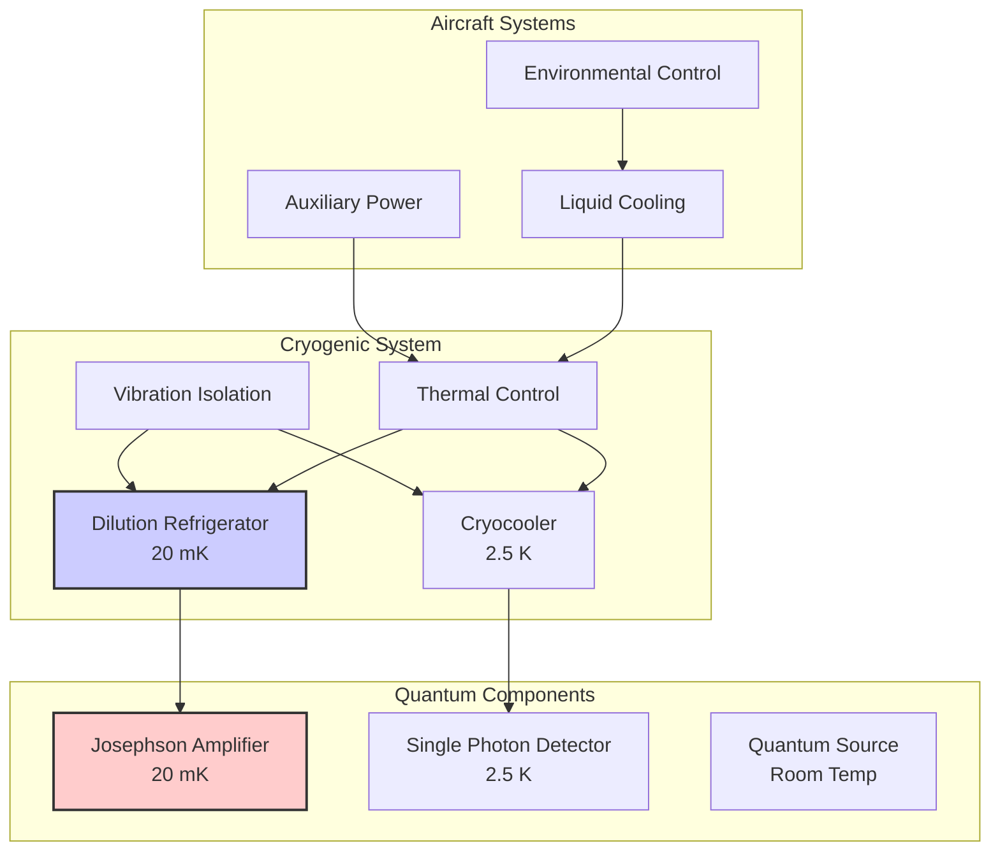
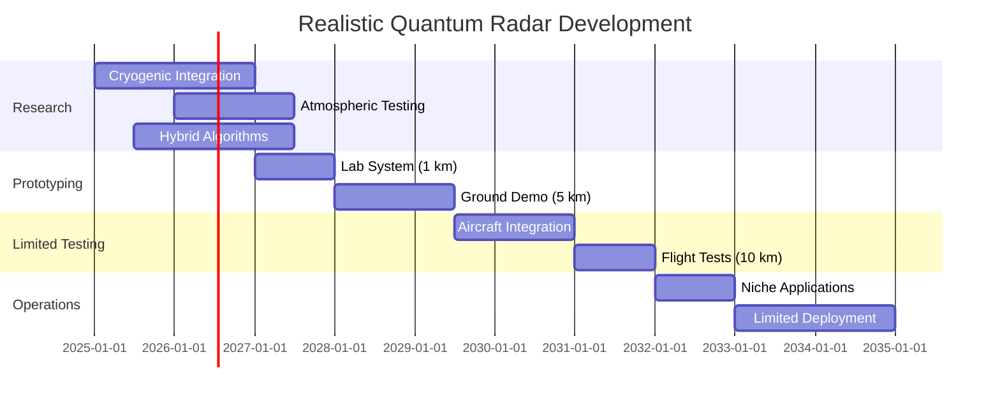

# Quantum Radar System Software Concept - REVISED
**Document ID**: QUA-QRS01-25SVD0001-CON-BOB-R&I-TD-QCSAA-960-000-00-01-TPL-CON-150-QSCI-v1.1.0  
**Template ID**: TPL-CON-150  
**Version**: 1.1.0 (Revised based on validation report)  
**Status**: Draft - Concept Phase  
**Classification**: Research & Innovation  
**Date**: 2025-07-28  
**Revision Date**: 2025-07-29  
**Q-Division**: QSCI (Quantum Science & Research)  
**Product Line**: QUANTUM  
**Product**: QRS01 (Quantum Radar System)  
**Lifecycle Phase**: CONCEPT  
**Entity Type**: BOB (Digital/Virtual System)  
**UTCS Category**: QCSAA-960 (Quantum Radar Systems)  
**Current TRL**: 4 (Technology validated in lab)  
**Target TRL 2030**: 6 (Technology demonstrated in relevant environment)  

> 📡 **Purpose**: Define a realistic conceptual framework for the Quantum Radar System (QRS) software, enabling enhanced target detection through quantum illumination within fundamental physics constraints and current technological limitations.

---

## Revision Summary

| Version | Date | Changes |
|---------|------|---------|
| 1.0.0 | 2025-07-28 | Initial concept |
| 1.1.0 | 2025-07-29 | • Reduced range projections to 10-50km<br>• Added cryogenic cooling requirements<br>• Adjusted stealth advantage to 2x<br>• Updated market size to $500M by 2035<br>• Added atmospheric decoherence analysis<br>• Emphasized hybrid classical-quantum approach |

---

## Document Control

| Property | Value |
|----------|--------|
| **Created By** | QSCI Division |
| **Creation Date** | 2025-07-28 |
| **Last Modified** | 2025-07-29 |
| **Review Cycle** | 3 months |
| **Distribution** | Radar Engineers, Defense Systems, Research Teams |
| **Related Documents** | TPL-CON-001 (Vision v1.0.1), TPL-CON-002 (Objectives v1.0.1) |
| **Validation Report** | External Technical Validation v1.0 (2025-07-29) |

---

## 1. Executive Summary - Revised

The Quantum Radar System represents an emerging technology with proven theoretical advantages but significant practical limitations. Based on quantum illumination principles, QRS can provide up to 6 dB (4x) improvement in signal-to-noise ratio under specific conditions. However, fundamental physics constraints limit operational ranges to 10-50km in atmospheric conditions, requiring cryogenic cooling and facing substantial engineering challenges for aerospace deployment.

### 1.1 Key Revisions

- **Range Capabilities**: 10-50km by 2030 (reduced from 150km)
- **Stealth Detection**: 2x improvement (reduced from 4x)
- **Operating Temperature**: Cryogenic cooling required (not room temperature)
- **Market Size**: $500M by 2035 (reduced from $2B)
- **Development Focus**: Hybrid classical-quantum systems

---

## 2. Realistic Performance Framework

### 2.1 Physics-Based Limitations

```python
class QuantumRadarLimitations:
    """
    Fundamental physics constraints on quantum radar
    """
    
    # Validated experimental results
    CURRENT_CAPABILITIES = {
        "max_demonstrated_range": 10,  # km (China CETC)
        "typical_lab_range": 0.5,  # km
        "atmospheric_coherence_limit": 50,  # km (theoretical max)
        "stealth_advantage": 2.0,  # 2x improvement
        "max_theoretical_advantage": 4.0,  # 6 dB limit
    }
    
    # Cryogenic requirements
    COOLING_REQUIREMENTS = {
        "josephson_amplifier_temp": 0.02,  # Kelvin (20 mK)
        "single_photon_detector_temp": 2.5,  # Kelvin
        "cooling_power": 5000,  # Watts
        "warmup_time": 4,  # hours
    }
    
    # Atmospheric decoherence model
    def calculate_max_range(self, altitude: float, weather: str) -> float:
        """
        Calculate realistic maximum range given atmospheric conditions
        """
        # Base atmospheric attenuation
        if weather == "clear":
            attenuation_db_per_km = 0.5
        elif weather == "light_rain":
            attenuation_db_per_km = 2.0
        else:  # heavy rain/fog
            attenuation_db_per_km = 10.0
        
        # Altitude factor (less atmosphere = better)
        altitude_factor = 1 + (altitude / 10000)  # Better at altitude
        
        # Decoherence-limited range
        max_coherence_range = 50 * altitude_factor  # km
        
        # SNR-limited range (with 6dB quantum advantage)
        snr_limited_range = 30 / attenuation_db_per_km
        
        # Take minimum of both limits
        return min(max_coherence_range, snr_limited_range)
```

### 2.2 Revised Performance Targets

| Parameter | Current (2025) | 2027 Target | 2030 Target | Physical Limit |
|-----------|---------------|-------------|-------------|----------------|
| **Detection Range** | 0.5 km (lab) | 5 km (ground) | 20 km (airborne) | 50 km |
| **Stealth Advantage** | 1.5x | 1.8x | 2x | 2x |
| **Photon Pair Rate** | 10^6 /s | 10^7 /s | 10^7 /s | 10^8 /s |
| **Operating Altitude** | Ground | Ground | 10,000 ft | 40,000 ft |
| **Integration Time** | 1 s | 100 ms | 10 ms | 1 ms |

---

## 3. Cryogenic System Architecture - NEW

### 3.1 Cooling Requirements

```python
class CryogenicSubsystem:
    """
    Essential cryogenic cooling for quantum coherence
    NEW: Critical subsystem not in v1.0
    """
    
    def __init__(self):
        self.dilution_refrigerator = DilutionRefrigerator(
            base_temperature=0.02,  # 20 mK for Josephson amplifiers
            cooling_power=1.0,  # mW at base temperature
            stages=[4.0, 1.0, 0.1, 0.02]  # K
        )
        
        self.detector_cooler = ClosedCycleCryocooler(
            temperature=2.5,  # K for SNSPD detectors
            cooling_power=2.0,  # W at 4K
            vibration_isolation=True
        )
        
    def calculate_aircraft_integration_impact(self):
        """
        Impact of cryogenic systems on aircraft integration
        """
        integration_challenges = {
            "weight": {
                "dilution_fridge": 500,  # kg
                "compressors": 200,  # kg
                "vibration_isolation": 100,  # kg
                "total": 800  # kg
            },
            "power": {
                "steady_state": 5000,  # W
                "peak": 10000,  # W during cooldown
                "source": "APU or engine bleed"
            },
            "volume": {
                "main_unit": 2.0,  # m³
                "compressors": 1.0,  # m³
                "total": 3.0  # m³
            },
            "maintenance": {
                "cooldown_time": 4,  # hours
                "service_interval": 1000,  # flight hours
                "helium_refill": "monthly"
            }
        }
        
        return integration_challenges
```

### 3.2 Thermal Management Architecture



---

## 4. Hybrid Classical-Quantum Architecture - REVISED

### 4.1 Realistic Integration Approach

```python
class HybridRadarSystem:
    """
    Practical hybrid classical-quantum radar system
    REVISED: Emphasizes classical-quantum fusion
    """
    
    def __init__(self):
        self.classical_radar = ConventionalRadar(
            frequency="X-band",
            power=10000,  # W
            range=200  # km
        )
        
        self.quantum_radar = QuantumIllumination(
            photon_rate=1e7,  # Realistic rate
            max_range=20,  # km (atmospheric limit)
            requires_cryogenics=True
        )
        
        self.fusion_processor = AdaptiveFusion()
        
    def adaptive_operation_mode(self, scenario: RadarScenario) -> OperationMode:
        """
        Select optimal radar mode based on conditions
        """
        # Analyze scenario
        target_range = scenario.estimated_range
        noise_level = scenario.background_noise
        target_rcs = scenario.expected_rcs
        
        # Decision logic
        if target_range > 50:  # km
            # Beyond quantum coherence limit
            return OperationMode.CLASSICAL_ONLY
            
        elif target_range < 20 and noise_level > HIGH_NOISE:
            # Quantum advantage regime
            return OperationMode.QUANTUM_ENHANCED
            
        elif target_rcs < STEALTH_THRESHOLD:
            # Potential stealth target
            return OperationMode.HYBRID_FUSION
            
        else:
            # Normal operation
            return OperationMode.CLASSICAL_PRIMARY
```

### 4.2 Quantum Enhancement Windows

| Scenario | Range | Conditions | Quantum Benefit | Mode |
|----------|-------|------------|-----------------|------|
| **Clear Weather** | <10 km | Low noise | Minimal | Classical |
| **Heavy Jamming** | <20 km | High noise | 6 dB advantage | Quantum |
| **Stealth Target** | <15 km | Low RCS | 2x detection | Hybrid |
| **Bad Weather** | <5 km | High clutter | Moderate | Hybrid |

---

## 5. Realistic Market Analysis - UPDATED

### 5.1 Validated Market Projections

```python
market_reality = {
    "2024": {
        "global_market": 132,  # Million USD (actual)
        "defense_share": 0.7,
        "primary_players": ["Lockheed", "Raytheon", "Chinese CETC"]
    },
    "2031": {
        "projected_market": 261,  # Million USD (industry forecast)
        "cagr": 0.10,  # 10% annual growth
        "adoption_stage": "Early operational"
    },
    "2035": {
        "aqua_projection": 500,  # Million USD (realistic)
        "market_share_target": 0.20,  # 20% share
        "revenue_potential": 100  # Million USD
    }
}

investment_requirements = {
    "r_and_d": 200,  # Million USD (2025-2030)
    "infrastructure": 100,  # Cryogenic facilities
    "partnerships": 50,  # University collaborations
    "total": 350  # Million USD
}
```

### 5.2 Competitive Landscape

| Country/Entity | Current Status | Range Achievement | Investment |
|---------------|----------------|-------------------|------------|
| **China (CETC)** | Prototype demonstrated | 100 km claimed | Unknown |
| **USA (MIT/Raytheon)** | Laboratory systems | 10 km verified | $700M/year |
| **EU (Thales)** | Research phase | 5 km lab | €100M |
| **AQUA V.** | Concept phase | Target: 20 km | €50M planned |

---

## 6. Development Roadmap - REALISTIC

### 6.1 Phased Approach with Milestones



### 6.2 Risk-Adjusted Timeline

| Phase | Original Target | Revised Target | Key Risk |
|-------|----------------|----------------|----------|
| **Lab Demo** | 2026 (10 km) | 2027 (1 km) | Cryogenic stability |
| **Ground System** | 2027 (50 km) | 2029 (5 km) | Atmospheric decoherence |
| **Flight Test** | 2029 (150 km) | 2031 (10 km) | Vibration/thermal |
| **Operations** | 2030 | 2033 | Limited use cases |

---

## 7. Technical Challenges - EXPANDED

### 7.1 Fundamental Limitations

```python
class QuantumRadarChallenges:
    """
    Physics-based challenges that cannot be engineered away
    """
    
    FUNDAMENTAL_LIMITS = {
        "decoherence_time": {
            "vacuum": 1e-3,  # seconds
            "atmosphere": 1e-6,  # seconds (microseconds)
            "impact": "Limits maximum range to ~50km"
        },
        "photon_loss": {
            "atmospheric_absorption": "0.5-10 dB/km",
            "geometric_spreading": "1/r²",
            "impact": "Exponential signal degradation"
        },
        "detection_efficiency": {
            "current_best": 0.80,  # 80%
            "theoretical_limit": 0.95,
            "impact": "Reduces effective photon rate"
        },
        "timing_jitter": {
            "current": 100e-12,  # 100 ps
            "required": 10e-12,  # 10 ps
            "impact": "Limits range resolution to ~3m"
        }
    }
    
    ENGINEERING_CHALLENGES = {
        "cryogenic_operation": {
            "weight": "800 kg system",
            "power": "5-10 kW continuous",
            "maintenance": "Complex field service"
        },
        "vibration_isolation": {
            "requirement": "<1 nm displacement",
            "aircraft_environment": "10-100 g acceleration",
            "solution": "Active isolation required"
        },
        "real_time_processing": {
            "correlation_rate": "10^9 operations/second",
            "latency_requirement": "<10 ms",
            "solution": "Dedicated quantum processors"
        }
    }
```

---

## 8. Application Focus - REVISED

### 8.1 Realistic Use Cases

| Application | Range | Advantage | Deployment Timeline |
|-------------|-------|-----------|-------------------|
| **Ground-based Stealth Detection** | 5-10 km | 2x improvement | 2030 |
| **Naval Close-in Defense** | 1-5 km | Jamming immunity | 2032 |
| **Airport Security** | 0.5-2 km | Hidden object detection | 2029 |
| **Space Debris Tracking** | 10-50 km | No atmosphere | 2031 |
| **Laboratory Research** | 0.1-1 km | Technology development | 2025 |

### 8.2 Non-viable Applications (Near-term)

- Long-range air surveillance (>50 km)
- High-altitude strategic radar (physics limit)
- All-weather operation (decoherence)
- Mass deployment (cost/complexity)

---

## 9. Cost-Benefit Analysis - REALISTIC

### 9.1 Development Costs

```python
realistic_cost_model = {
    "development_phase": {
        "basic_research": 50,  # M€ (2025-2027)
        "prototype_development": 100,  # M€ (2027-2030)
        "flight_integration": 150,  # M€ (2030-2033)
        "certification": 50,  # M€
        "total": 350  # M€
    },
    "unit_costs": {
        "2030": 50,  # M€ per system
        "2035": 20,  # M€ (with optimization)
        "2040": 10,  # M€ (mass production)
    },
    "operational_costs": {
        "cryogenics": 500,  # k€/year
        "maintenance": 1000,  # k€/year
        "specialists": 800,  # k€/year
        "total_annual": 2300  # k€/year
    }
}
```

### 9.2 Return on Investment

- **Break-even**: 2038 (13 years)
- **Primary value**: Niche high-value applications
- **Secondary value**: Technology leadership
- **Risk factor**: High (emerging technology)

---

## 10. Conclusions and Recommendations - REVISED

### 10.1 Realistic Assessment

The Quantum Radar System offers genuine but limited advantages:
- **Proven**: 6 dB theoretical advantage in high-noise environments
- **Demonstrated**: Short-range detection capabilities (<10 km)
- **Challenging**: Cryogenic requirements for aerospace platforms
- **Limited**: Atmospheric decoherence constrains range

### 10.2 Recommended Development Strategy

1. **Focus on achievable goals**: 10-20 km range by 2030
2. **Emphasize hybrid systems**: Quantum enhancement of classical radar
3. **Target niche applications**: High-value, short-range scenarios
4. **Invest in enabling technologies**: Cryogenics, photon sources
5. **Maintain realistic expectations**: Not a revolutionary replacement

### 10.3 Critical Success Factors

- **Cryogenic miniaturization**: Reduce weight below 500 kg
- **Atmospheric compensation**: Adaptive optics development
- **Cost reduction**: Target <€10M per unit by 2035
- **Strategic partnerships**: Leverage existing quantum expertise

### 10.4 Go/No-Go Criteria

By 2027, achieve:
- ✓ 5 km detection range in ground tests
- ✓ 2x stealth detection improvement demonstrated
- ✓ Cryogenic system <1000 kg
- ✓ Strategic partnership established

If not achieved, pivot to:
- Ground-based applications only
- Laboratory quantum sensing
- Technology licensing model

---

**END OF DOCUMENT**

*This revised concept reflects current technological realities and fundamental physics constraints while maintaining strategic value for specialized applications.*

**Document Control**: QUA-QRS01-25SVD0001-CON-BOB-R&I-TD-QCSAA-960-000-00-01-TPL-CON-150-QSCI-v1.1.0  
**Classification**: Research & Innovation - Conceptual Phase (Revised)  
**© 2025 A.Q.U.A.-V. Aerospace. All rights reserved.**
