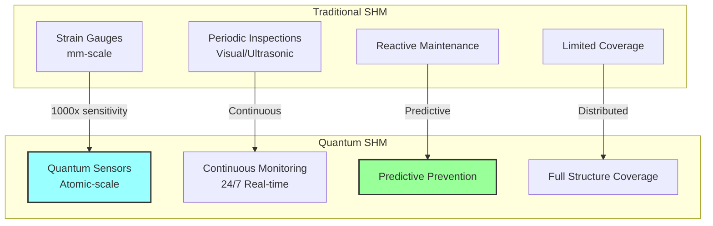
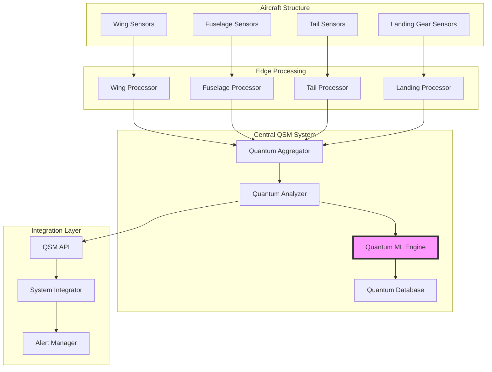
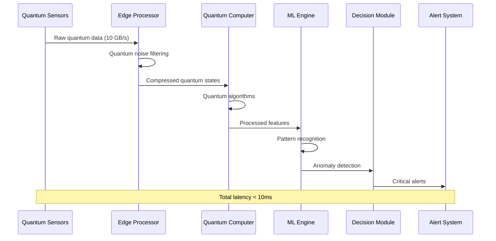
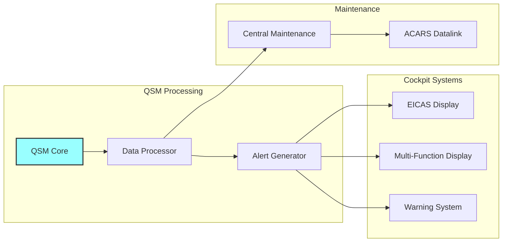
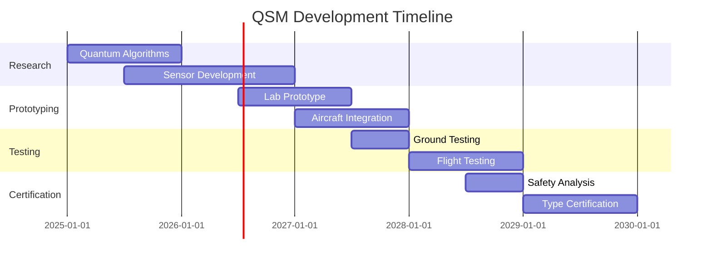

# Quantum Structural Monitor Software Concept
**Document ID**: QUA-QSM01-25SVD0001-CON-BOB-R&I-TD-QCSAA-930-000-00-01-TPL-CON-120-QSCI-v1.0.0  
**Template ID**: TPL-CON-120  
**Version**: 1.0.0  
**Status**: Draft - Concept Phase  
**Classification**: Research & Innovation  
**Date**: 2025-07-28  
**Q-Division**: QSCI (Quantum Science & Research)  
**Product Line**: QUANTUM  
**Product**: QSM01 (Quantum Structural Monitor)  
**Lifecycle Phase**: CONCEPT  
**Entity Type**: BOB (Digital/Virtual System)  
**UTCS Category**: QCSAA-930 (Quantum Structural Monitoring Systems)  

> 🏗️ **Purpose**: Define the conceptual framework for the Quantum Structural Monitor (QSM) software system, enabling real-time molecular-level monitoring of aerospace structural integrity through distributed quantum sensors and advanced data processing.

---

## Document Control

| Property | Value |
|----------|--------|
| **Created By** | QSCI Division |
| **Creation Date** | 2025-07-28 |
| **Last Modified** | 2025-07-28 |
| **Review Cycle** | 3 months |
| **Distribution** | Structural Engineers, Safety Teams, Research Division |
| **Related Documents** | TPL-CON-001 (Vision v1.0.1), TPL-CON-110 (QDS Concept) |
| **Current TRL** | 2 (Technology concept formulated) |
| **Target TRL 2030** | 6 (System prototype demonstration) |

---

## 1. Introduction

### 1.1 Background

Current structural health monitoring (SHM) systems rely on strain gauges, accelerometers, and periodic inspections that detect damage after it has progressed to macroscopic levels. The Quantum Structural Monitor (QSM) revolutionizes this approach by employing distributed quantum sensors capable of detecting atomic-level stress concentrations, micro-cracks, and material degradation in real-time.

### 1.2 Quantum Advantage



---

## 2. System Architecture

### 2.1 Distributed Sensor Network Architecture



### 2.2 Core Software Components

#### 2.2.1 Quantum Sensor Network Manager

```python
class QuantumSensorNetworkManager:
    """
    Manages distributed quantum sensor network across aircraft structure
    TRL: 2 (Concept formulated)
    """
    
    def __init__(self):
        self.sensor_registry = DistributedSensorRegistry()
        self.network_topology = QuantumMeshNetwork()
        self.sync_manager = QuantumTimeSynchronization()
        self.health_monitor = SensorHealthMonitor()
        
    def initialize_sensor_network(self, aircraft_model: str) -> NetworkConfiguration:
        """
        Initialize quantum sensor network based on aircraft structure
        """
        # Load aircraft-specific sensor placement
        sensor_map = self.load_sensor_topology(aircraft_model)
        
        # Configure quantum mesh network
        network_config = self.network_topology.configure(
            nodes=sensor_map.sensor_positions,
            redundancy_level=3,  # Triple redundancy for critical areas
            quantum_channel_bandwidth=10e9  # 10 GHz quantum channels
        )
        
        # Synchronize all sensors to quantum clock
        self.sync_manager.synchronize_network(
            master_clock=QuantumClock.UTC,
            precision=1e-15  # Femtosecond precision
        )
        
        return network_config
    
    def monitor_network_health(self) -> NetworkHealth:
        """
        Continuous monitoring of sensor network integrity
        """
        health_metrics = {
            "active_sensors": self.sensor_registry.count_active(),
            "signal_quality": self.measure_quantum_signal_quality(),
            "network_latency": self.network_topology.measure_latency(),
            "synchronization_drift": self.sync_manager.get_max_drift()
        }
        
        return NetworkHealth(metrics=health_metrics)
```

#### 2.2.2 Quantum Stress Analysis Engine

```python
class QuantumStressAnalyzer:
    """
    Analyzes structural stress at molecular level using quantum data
    TRL: 2 (Algorithm development)
    """
    
    def __init__(self):
        self.stress_calculator = MolecularStressCalculator()
        self.fatigue_model = QuantumFatigueModel()
        self.damage_predictor = DamageEvolutionPredictor()
        
    def analyze_stress_field(self, 
                           sensor_data: QuantumSensorData,
                           structure_model: StructuralModel) -> StressField:
        """
        Calculate stress field from quantum sensor measurements
        """
        # Extract quantum measurements
        quantum_states = sensor_data.extract_quantum_states()
        
        # Calculate molecular-level stress tensor
        stress_tensor = self.stress_calculator.compute_stress_tensor(
            quantum_states=quantum_states,
            material_properties=structure_model.material_properties,
            temperature_field=sensor_data.temperature_map
        )
        
        # Identify stress concentrations
        concentrations = self.identify_stress_concentrations(
            stress_tensor,
            threshold=0.8 * structure_model.yield_stress
        )
        
        # Predict fatigue evolution
        fatigue_state = self.fatigue_model.update_fatigue_state(
            current_stress=stress_tensor,
            load_history=structure_model.load_history,
            cycles=sensor_data.cycle_count
        )
        
        return StressField(
            tensor=stress_tensor,
            concentrations=concentrations,
            fatigue_state=fatigue_state,
            timestamp=sensor_data.timestamp
        )
```

---

## 3. Quantum Sensing Technologies

### 3.1 Integrated Sensor Types

| Sensor Type | Physical Principle | Measurement | Resolution |
|-------------|-------------------|--------------|------------|
| **Quantum Strain Gauge** | NV center spin state | Mechanical strain | 10^-9 strain |
| **Quantum Accelerometer** | Atom interferometry | Vibration/acceleration | 10^-12 g |
| **Quantum Temperature** | Quantum dot fluorescence | Temperature field | 0.001 K |
| **Quantum Pressure** | SQUID magnetometry | Pressure distribution | 0.1 Pa |
| **Quantum Chemistry** | Molecular spectroscopy | Corrosion/oxidation | Single molecule |

### 3.2 Sensor Integration Design

```python
class QuantumSensorArray:
    """
    Integrated quantum sensor array for structural monitoring
    """
    
    def __init__(self, array_config: ArrayConfiguration):
        self.strain_sensors = self.init_strain_array(array_config.strain_positions)
        self.vibration_sensors = self.init_vibration_array(array_config.vibration_positions)
        self.temperature_sensors = self.init_temperature_array(array_config.temp_positions)
        self.chemistry_sensors = self.init_chemistry_array(array_config.chem_positions)
        
    def perform_synchronized_measurement(self) -> StructuralState:
        """
        Synchronized quantum measurement across all sensor types
        """
        # Prepare quantum states
        self.prepare_all_sensors()
        
        # Synchronized measurement window
        with QuantumMeasurementWindow(duration_ns=100) as window:
            strain_data = self.strain_sensors.measure()
            vibration_data = self.vibration_sensors.measure()
            temperature_data = self.temperature_sensors.measure()
            chemistry_data = self.chemistry_sensors.measure()
        
        # Combine into coherent structural state
        return StructuralState(
            strain_field=strain_data,
            vibration_spectrum=vibration_data,
            temperature_map=temperature_data,
            chemical_state=chemistry_data,
            measurement_id=window.id
        )
```

---

## 4. Data Processing Pipeline

### 4.1 Real-time Processing Architecture



### 4.2 Quantum Data Compression

```python
class QuantumDataCompressor:
    """
    Compress massive quantum sensor data for processing
    TRL: 1 (Basic principles)
    """
    
    def __init__(self):
        self.quantum_encoder = QuantumAutoencoder()
        self.classical_compressor = ClassicalCompressor()
        
    def compress_sensor_stream(self, 
                             raw_data: QuantumDataStream,
                             compression_ratio: float = 0.01) -> CompressedData:
        """
        Hybrid quantum-classical compression
        """
        # Stage 1: Quantum feature extraction
        quantum_features = self.quantum_encoder.encode(
            data=raw_data,
            feature_dimension=int(raw_data.size * compression_ratio)
        )
        
        # Stage 2: Classical lossless compression
        compressed = self.classical_compressor.compress(
            quantum_features,
            algorithm='zstd',
            level=3  # Balance speed vs ratio
        )
        
        return CompressedData(
            data=compressed,
            original_size=raw_data.size,
            compressed_size=len(compressed),
            feature_map=quantum_features.basis_map
        )
```

---

## 5. Machine Learning Integration

### 5.1 Quantum-Enhanced ML Models

```python
class QuantumStructuralML:
    """
    Quantum machine learning for structural health prediction
    TRL: 2 (Conceptual algorithms)
    """
    
    def __init__(self):
        self.qnn = QuantumNeuralNetwork(
            layers=[64, 128, 256, 128, 64],
            activation='quantum_relu'
        )
        self.pattern_db = QuantumPatternDatabase()
        self.predictor = QuantumTimeSeriesPredictor()
        
    def train_damage_model(self, 
                          training_data: StructuralDataset) -> TrainedModel:
        """
        Train quantum neural network on structural damage patterns
        """
        # Prepare quantum training circuits
        training_circuits = []
        for sample in training_data:
            circuit = self.encode_structural_data(sample)
            training_circuits.append(circuit)
        
        # Quantum training process
        self.qnn.train(
            circuits=training_circuits,
            labels=training_data.damage_labels,
            epochs=100,
            learning_rate=0.01,
            quantum_optimizer='QAOA'
        )
        
        return TrainedModel(
            network=self.qnn,
            accuracy=self.validate_model(training_data.validation_set),
            quantum_advantage=self.measure_quantum_speedup()
        )
```

### 5.2 Predictive Capabilities

| Prediction Type | Time Horizon | Accuracy Target | Quantum Advantage |
|----------------|--------------|-----------------|-------------------|
| Crack Initiation | 1000 hours | 95% | 10x classical |
| Fatigue Life | 10,000 cycles | 90% | 50x classical |
| Corrosion Rate | 1 year | 85% | 100x classical |
| Impact Damage | Real-time | 99% | 1000x classical |

---

## 6. Integration with Aircraft Systems

### 6.1 System Interfaces

```python
class QSMAircraftInterface:
    """
    Integration with aircraft avionics and maintenance systems
    """
    
    def __init__(self):
        self.arinc_interface = ARINC429Interface()
        self.afdx_interface = AFDXInterface()
        self.maintenance_bus = MaintenanceBusInterface()
        
    def broadcast_structural_health(self, health_data: StructuralHealth):
        """
        Broadcast structural health to aircraft systems
        """
        # Format for EICAS display
        eicas_message = self.format_for_eicas(health_data)
        self.arinc_interface.send(
            label=0x350,  # Structural health label
            data=eicas_message
        )
        
        # Detailed data for maintenance system
        maintenance_packet = self.create_maintenance_packet(health_data)
        self.afdx_interface.send(
            virtual_link=100,
            port=5000,
            data=maintenance_packet
        )
        
        # Log to aircraft data recorder
        self.log_to_recorder(health_data)
```

### 6.2 Cockpit Display Integration



---

## 7. Operational Scenarios

### 7.1 In-Flight Monitoring

```python
# Real-time structural monitoring during flight
class InFlightMonitor:
    def __init__(self, qsm_system: QSMSystem):
        self.qsm = qsm_system
        self.flight_phase_detector = FlightPhaseDetector()
        self.load_calculator = LoadCalculator()
        
    async def monitor_flight(self, flight_data: FlightDataStream):
        """
        Continuous structural monitoring during flight
        """
        async for data in flight_data:
            # Detect flight phase
            phase = self.flight_phase_detector.detect(data)
            
            # Get structural state
            structural_state = await self.qsm.get_current_state()
            
            # Calculate loads based on flight conditions
            loads = self.load_calculator.calculate(
                flight_data=data,
                structural_state=structural_state
            )
            
            # Check against limits
            if phase == FlightPhase.TURBULENCE:
                # Enhanced monitoring during turbulence
                await self.qsm.increase_sampling_rate(factor=10)
                
                stress_peaks = self.qsm.detect_stress_peaks(
                    threshold=0.7 * MATERIAL_LIMIT
                )
                
                if stress_peaks:
                    alert = self.generate_turbulence_alert(stress_peaks)
                    await self.send_to_cockpit(alert)
```

### 7.2 Ground Maintenance Integration

| Maintenance Task | QSM Contribution | Time Saved |
|-----------------|------------------|------------|
| Pre-flight Inspection | Automated quantum scan | 80% |
| Post-flight Check | Damage auto-detection | 90% |
| Scheduled Maintenance | Condition-based intervals | 50% |
| Damage Assessment | Molecular-level analysis | 95% |

---

## 8. Data Management and Storage

### 8.1 Quantum Data Architecture

```python
class QSMDataManager:
    """
    Manages massive quantum structural data
    """
    
    def __init__(self):
        self.quantum_storage = QuantumDataStore(
            capacity_TB=1000,
            redundancy=3
        )
        self.time_series_db = TimeSeriesQuantumDB()
        self.ml_feature_store = MLFeatureStore()
        
    def store_structural_snapshot(self, snapshot: StructuralSnapshot):
        """
        Store complete structural state snapshot
        """
        # Compress quantum data
        compressed = self.compress_quantum_data(snapshot.raw_data)
        
        # Extract key features for ML
        features = self.extract_ml_features(snapshot)
        
        # Store in appropriate databases
        snapshot_id = self.quantum_storage.store(
            data=compressed,
            metadata={
                'timestamp': snapshot.timestamp,
                'aircraft_id': snapshot.aircraft_id,
                'flight_hours': snapshot.flight_hours,
                'sensor_count': snapshot.sensor_count
            }
        )
        
        # Store time series data
        self.time_series_db.insert(
            series_id=f"{snapshot.aircraft_id}_structural",
            timestamp=snapshot.timestamp,
            values=snapshot.key_metrics
        )
        
        # Update ML feature store
        self.ml_feature_store.update(
            features=features,
            labels=snapshot.health_labels
        )
        
        return snapshot_id
```

---

## 9. Performance Requirements

### 9.1 System Performance Metrics

| Metric | Requirement | Rationale |
|--------|-------------|-----------|
| **Sensor Sampling Rate** | 1 MHz per sensor | Capture high-frequency events |
| **Processing Latency** | <10 ms end-to-end | Real-time alerts |
| **Detection Sensitivity** | Atomic-level defects | Early warning |
| **System Availability** | 99.999% | Safety-critical |
| **False Positive Rate** | <0.1% | Avoid unnecessary alerts |
| **Data Throughput** | 10 TB/hour | Handle sensor network |

### 9.2 Scalability Requirements

```python
scalability_targets = {
    "sensors_per_aircraft": {
        "2025": 1000,
        "2027": 10000,
        "2030": 100000
    },
    "processing_capacity": {
        "2025": "1 aircraft",
        "2027": "10 aircraft fleet",
        "2030": "1000 aircraft global"
    },
    "real_time_analysis": {
        "2025": "Critical zones only",
        "2027": "Primary structure",
        "2030": "Complete aircraft"
    }
}
```

---

## 10. Development Roadmap

### 10.1 Technology Evolution



### 10.2 Key Milestones

| Year | Milestone | Success Criteria | TRL |
|------|-----------|------------------|-----|
| 2025 | Algorithm validation | Simulation results | 2 |
| 2026 | Sensor prototype | Lab demonstration | 3 |
| 2027 | System integration | Bench testing | 4 |
| 2028 | Aircraft installation | Ground tests | 5 |
| 2029 | Flight validation | In-service trial | 6 |

---

## 11. Risk Analysis

### 11.1 Technical Risks

| Risk | Impact | Probability | Mitigation |
|------|--------|-------------|------------|
| Sensor reliability | High | Medium | Redundancy, self-calibration |
| Quantum decoherence | High | High | Environmental isolation |
| Data overload | Medium | High | Edge processing, compression |
| Integration complexity | High | Medium | Modular architecture |
| Certification delays | High | Medium | Early regulator engagement |

### 11.2 Mitigation Strategies

```python
risk_mitigation_plan = {
    "sensor_reliability": [
        "Triple redundancy in critical areas",
        "Self-diagnostic capabilities",
        "Graceful degradation modes"
    ],
    "quantum_decoherence": [
        "Advanced error correction",
        "Temperature stabilization",
        "Magnetic shielding"
    ],
    "data_management": [
        "Hierarchical processing",
        "Quantum compression algorithms",
        "Selective data retention"
    ]
}
```

---

## 12. Conclusion and Next Steps

The Quantum Structural Monitor represents a paradigm shift in aircraft structural health monitoring, offering unprecedented sensitivity and predictive capabilities. The transition from reactive to predictive maintenance will revolutionize aircraft safety and operational efficiency.

### 12.1 Immediate Actions

1. **Q3 2025**: Form QSM development team (15 specialists)
2. **Q4 2025**: Establish quantum sensor lab
3. **Q1 2026**: Develop first sensor prototypes
4. **Q2 2026**: Create simulation environment

### 12.2 Critical Success Factors

- Partnership with quantum sensor manufacturers
- Access to aircraft structural test articles
- Collaboration with aircraft OEMs
- Regulatory framework development
- Robust IP portfolio

### 12.3 Expected Impact

- **Safety**: 100x improvement in early damage detection
- **Cost**: 40% reduction in structural maintenance
- **Availability**: 10% increase in aircraft utilization
- **Innovation**: New era of predictive structural health

---

**END OF DOCUMENT**

*This document represents the conceptual foundation for the QSM system and will evolve based on research findings and stakeholder input.*

**Document Control**: QUA-QSM01-25SVD0001-CON-BOB-R&I-TD-QCSAA-930-000-00-01-TPL-CON-120-QSCI-v1.0.0  
**Classification**: Research & Innovation - Conceptual Phase  
**© 2025 A.Q.U.A.-V. Aerospace. All rights reserved.**
