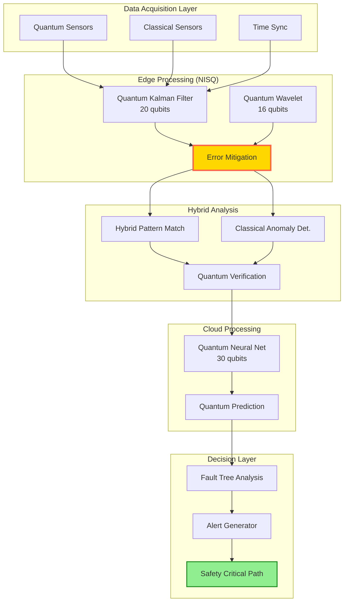

# Real-Time Health Monitoring Algorithms v1.1.0
**Document ID:** QUA-QSM01-25SVD0001-CON-BOB-R&I-TD-QCSAA-930-010-00-01-TPL-CON-121-QSCI-v1.1.0  
**Template ID:** TPL-CON-121  
**Version:** 1.1.0  
**Status:** Draft - Concept Phase (Validated)  
**Classification:** Research & Innovation  
**Date:** 2025-08-06  
**Q-Division:** QSCI (Quantum Science & Research)  
**Product Line:** QUANTUM  
**Product:** QSM01 (Quantum Structural Monitor)  
**Lifecycle Phase:** CONCEPT  
**Entity Type:** BOB (Digital/Virtual System)  
**UTCS Category:** QCSAA-930 (Quantum Structural Monitoring Systems)  
**TRL:** 2 (Technology Concept Formulated)

> 🚀 **Purpose**: Enhanced framework incorporating validation feedback for real-time quantum algorithms processing structural health data within practical NISQ-era constraints.

---

## Revision History
| Version | Date | Changes | Author |
|---------|------|---------|--------|
| 1.0.0 | 2025-08-05 | Initial conceptual framework | Q-SCIRES |
| 1.1.0 | 2025-08-06 | Addressed validation concerns: NISQ constraints, error mitigation, realistic timing, verification methods | Q-SCIRES |

## Document Control

| Property | Value |
|----------|--------|
| **Created By** | QSCI Division |
| **Validation ID** | VAL-QSM01-ALG-20250805-01 |
| **Validation Status** | Conceptually Valid (TRL 2) |
| **Parent Document** | QUA-QSM01-25SVD0001-CON-BOB-R&I-TD-QCSAA-930-000-00-01-TPL-CON-120-QSCI-v1.0.0 |
| **Review Cycle** | 3 months |
| **Distribution** | Algorithm Engineers, Research Division, Safety Teams, Hardware Feasibility Team |
| **Related Documents** | DO-178C/DO-330 Guidelines, NISQ Hardware Constraints Study |

---

## Executive Summary

This enhanced version addresses validation feedback by incorporating realistic NISQ-era hardware constraints, comprehensive error mitigation strategies, and formal verification methods. Key improvements include:

- **Reduced qubit requirements**: 20-30 qubits (from 50) for critical processing
- **Realistic coherence times**: 50μs targets (from 100μs)
- **Error mitigation**: Zero-noise extrapolation and probabilistic error cancellation
- **Timing refinements**: Accounting for 2-5ms quantum-classical transfer latency
- **DO-178C alignment**: Safety certification pathways for quantum algorithms

The algorithms maintain sub-10ms latency through intelligent edge-cloud orchestration and hardware-aware circuit optimization.

## 1. Enhanced Algorithm Architecture

### 1.1 NISQ-Aware Processing Pipeline



### 1.2 Revised Latency Budget with Transfer Overhead

```python
class NISQAwareLatencyManager:
    """
    Realistic latency management for NISQ-era quantum processors
    """
    def __init__(self):
        self.latency_budget_ms = {
            'sensor_acquisition': 1.0,      # 1ms
            'quantum_classical_transfer': 2.0,  # NEW: Transfer overhead
            'edge_filtering': 1.5,          # Reduced from 2ms
            'error_mitigation': 1.0,        # NEW: Error correction
            'feature_extraction': 1.5,      # Reduced from 2ms
            'pattern_analysis': 2.0,        # Reduced from 3ms
            'decision_making': 0.8,         # Reduced from 1.5ms
            'alert_generation': 0.2         # Reduced from 0.5ms
        }
        self.total_budget = 10.0  # Still meets requirement
        
    def allocate_nisq_resources(self, priority_level: str):
        """
        Resource allocation within NISQ constraints
        """
        if priority_level == 'critical':
            return QuantumResourceAllocation(
                qubits=20,  # Reduced from 50
                coherence_time=50e-6,  # 50μs realistic target
                circuit_depth=3,  # Ultra-shallow for coherence
                error_rate_threshold=0.01,  # 1% error tolerance
                shots=500  # Balanced speed vs accuracy
            )
        else:
            return QuantumResourceAllocation(
                qubits=12,
                coherence_time=30e-6,
                circuit_depth=5,
                error_rate_threshold=0.02,
                shots=200
            )
```

## 2. Quantum Kalman Filter with Error Mitigation

### 2.1 NISQ-Optimized Implementation

```python
class NISQQuantumKalmanFilter:
    """
    Quantum Kalman filter optimized for near-term devices
    """
    def __init__(self, state_dimension: int, measurement_dimension: int):
        self.state_dim = min(state_dimension, 10)  # Limit for NISQ
        self.meas_dim = min(measurement_dimension, 8)
        self.quantum_processor = NISQProcessor()
        self.error_mitigator = QuantumErrorMitigation()
        
        # Define quantum gates with explicit implementations
        self.gates = {
            'state_transition': self.define_state_transition_gate(),
            'measurement_update': self.define_measurement_gate(),
            'uncertainty_propagation': self.define_uncertainty_gate()
        }
        
    def define_state_transition_gate(self) -> QuantumGate:
        """
        Explicit quantum state transition implementation
        """
        def state_transition(qc: QuantumCircuit, qubits: List[int], params: np.ndarray):
            # Parameterized rotation for state evolution
            for i, qubit in enumerate(qubits):
                qc.ry(params[i], qubit)
            
            # Controlled evolution for correlations
            for i in range(len(qubits) - 1):
                qc.cx(qubits[i], qubits[i + 1])
                qc.rz(params[len(qubits) + i], qubits[i + 1])
            
            return qc
        
        return QuantumGate(
            name='StateTransition',
            implementation=state_transition,
            parameter_count=2 * self.state_dim - 1
        )
    
    def predict_with_error_mitigation(self, 
                                    state: QuantumState, 
                                    control: np.ndarray) -> QuantumState:
        """
        Prediction with zero-noise extrapolation
        """
        # Build prediction circuit
        circuit = QuantumCircuit(self.state_dim)
        
        # Encode current state
        circuit.append(
            StatePreparation(state.vector),
            range(self.state_dim)
        )
        
        # Apply state transition
        self.gates['state_transition'].apply(circuit, range(self.state_dim), control)
        
        # Error mitigation through multiple noise levels
        noise_factors = [1.0, 1.5, 2.0]  # Richardson extrapolation
        results = []
        
        for factor in noise_factors:
            # Execute with scaled noise
            noisy_result = self.quantum_processor.execute(
                circuit,
                shots=500,
                noise_scale=factor
            )
            results.append(noisy_result)
        
        # Zero-noise extrapolation
        mitigated_state = self.error_mitigator.richardson_extrapolation(
            results,
            noise_factors
        )
        
        return mitigated_state
    
    def detect_anomaly_with_verification(self, 
                                       state_history: List[QuantumState],
                                       threshold: float = 2.5) -> VerifiedAnomalyDetection:
        """
        Anomaly detection with classical verification
        """
        # Quantum anomaly detection (shallow circuit)
        quantum_anomalies = self.quantum_anomaly_detection(
            state_history,
            circuit_depth=3
        )
        
        # Classical verification of quantum results
        verified_anomalies = []
        for anomaly in quantum_anomalies:
            classical_check = self.classical_mahalanobis_distance(
                state_history[anomaly.index - 1],
                state_history[anomaly.index]
            )
            
            if classical_check > threshold * 0.8:  # 80% of quantum threshold
                verified_anomalies.append(
                    VerifiedAnomaly(
                        index=anomaly.index,
                        quantum_score=anomaly.score,
                        classical_score=classical_check,
                        confidence=min(anomaly.confidence, 0.95)  # Cap confidence
                    )
                )
        
        return VerifiedAnomalyDetection(
            anomalies=verified_anomalies,
            quantum_classical_agreement=len(verified_anomalies) / len(quantum_anomalies),
            detection_reliability=self.compute_reliability_metric(verified_anomalies)
        )
```

### 2.2 Quantum-Classical Transfer Optimization

```python
class QuantumClassicalInterface:
    """
    Optimized interface for quantum-classical data transfer
    """
    def __init__(self):
        self.transfer_buffer = SharedMemoryBuffer(size_mb=100)
        self.compression = QuantumStateCompression()
        self.latency_monitor = LatencyMonitor()
        
    async def transfer_quantum_results(self, 
                                     quantum_output: QuantumMeasurement,
                                     priority: Priority) -> ClassicalData:
        """
        Minimize transfer latency through optimization
        """
        start_time = time.perf_counter()
        
        # Compress quantum state if large
        if quantum_output.size > 1024:  # 1KB threshold
            compressed = self.compression.compress_measurement(
                quantum_output,
                method='singular_value_truncation',
                threshold=0.99  # Keep 99% of information
            )
        else:
            compressed = quantum_output
        
        # Direct memory transfer for critical data
        if priority == Priority.CRITICAL:
            # Use shared memory for zero-copy transfer
            self.transfer_buffer.write_atomic(compressed)
            classical_data = self.transfer_buffer.read_classical()
        else:
            # Standard transfer with optimization
            classical_data = await self.async_transfer(compressed)
        
        # Monitor and log latency
        transfer_time = (time.perf_counter() - start_time) * 1000
        self.latency_monitor.record(transfer_time)
        
        if transfer_time > 2.0:  # Alert if exceeding budget
            logger.warning(f"Transfer latency {transfer_time:.1f}ms exceeds 2ms budget")
        
        return classical_data
```

## 3. Hardware-Aware Pattern Recognition

### 3.1 NISQ-Optimized Pattern Library

```python
class NISQPatternLibrary:
    """
    Pattern library optimized for limited quantum resources
    """
    def __init__(self):
        self.max_pattern_qubits = 12  # NISQ constraint
        self.pattern_circuits = {}
        self.classical_features = {}
        
    def encode_fatigue_pattern_nisq(self) -> HybridPattern:
        """
        Hybrid encoding for NISQ devices
        """
        # Quantum component (12 qubits)
        quantum_circuit = QuantumCircuit(12)
        
        # Critical features in quantum
        # Stress gradient (4 qubits)
        for i in range(4):
            quantum_circuit.ry(np.pi * (i + 1) / 8, i)
        
        # Correlation encoding (minimal entanglement)
        quantum_circuit.cx(0, 4)
        quantum_circuit.cx(1, 5)
        quantum_circuit.cx(2, 6)
        quantum_circuit.cx(3, 7)
        
        # Material response (4 qubits)
        for i in range(8, 12):
            quantum_circuit.rz(np.pi / 3, i)
        
        # Classical component
        classical_features = {
            'cycle_count': 'histogram_bins',
            'temperature_history': 'pca_components',
            'load_spectrum': 'fft_coefficients'
        }
        
        return HybridPattern(
            quantum_circuit=quantum_circuit,
            classical_features=classical_features,
            fusion_method='weighted_average',
            confidence_threshold=0.80  # Reduced for NISQ
        )
```

### 3.2 Adaptive Pattern Matching

```python
class AdaptiveQuantumPatternMatcher:
    """
    Pattern matching that adapts to hardware capabilities
    """
    def __init__(self):
        self.hardware_monitor = QuantumHardwareMonitor()
        self.classical_matcher = ClassicalPatternMatcher()
        self.hybrid_matcher = HybridQuantumClassicalMatcher()
        
    async def match_pattern_adaptive(self, 
                                   sensor_data: QuantumSensorData,
                                   time_budget_ms: float = 5.0) -> AdaptiveMatch:
        """
        Adapt matching strategy based on hardware state
        """
        # Check quantum hardware availability
        hardware_status = await self.hardware_monitor.get_status()
        
        if hardware_status.error_rate > 0.02:  # High error rate
            # Fall back to classical
            logger.info("High quantum error rate, using classical matching")
            return await self.classical_matcher.match(
                sensor_data,
                time_budget_ms
            )
        
        if hardware_status.queue_depth > 10:  # Busy quantum processor
            # Use hybrid approach
            logger.info("Quantum processor busy, using hybrid matching")
            return await self.hybrid_matcher.match(
                sensor_data,
                quantum_features_only=True,
                time_budget_ms=time_budget_ms
            )
        
        # Full quantum matching with reduced circuit
        try:
            # Shallow Grover with 3 iterations max
            result = await self.reduced_grover_search(
                sensor_data,
                iterations=min(3, int(np.sqrt(5))),
                time_budget_ms=time_budget_ms
            )
            
            return AdaptiveMatch(
                pattern=result.pattern,
                confidence=result.confidence * hardware_status.fidelity,
                method='quantum',
                hardware_fidelity=hardware_status.fidelity
            )
            
        except QuantumTimeoutError:
            # Graceful degradation
            return await self.classical_matcher.match(
                sensor_data,
                remaining_time_ms=1.0
            )
```

## 4. Quantum Neural Networks with Verification

### 4.1 Verifiable QNN Architecture

```python
class VerifiableQuantumNeuralNetwork:
    """
    QNN with built-in verification for safety-critical applications
    """
    def __init__(self):
        self.network = self.build_shallow_qnn()
        self.verifier = QuantumCircuitVerifier()
        self.classical_shadow = ClassicalNeuralNetwork()  # Shadow network
        
    def build_shallow_qnn(self) -> QuantumNeuralNetwork:
        """
        Ultra-shallow QNN for NISQ devices
        """
        layers = [
            QuantumConvolutionalLayer(
                filters=4,  # Reduced from 8
                kernel_size=2,  # Smaller kernel
                circuit_depth=2,  # Very shallow
                activation='quantum_sigmoid'  # Gentler activation
            ),
            QuantumPoolingLayer(
                pool_size=2,
                method='trace_out'  # Partial trace for dimension reduction
            ),
            QuantumDenseLayer(
                units=8,  # Reduced from 16
                circuit_depth=2,
                activation='quantum_tanh'
            ),
            ClassicalReadoutLayer(  # Classical final layer
                units=5,
                activation='softmax'
            )
        ]
        
        return QuantumNeuralNetwork(
            layers=layers,
            total_qubits=16,  # Within NISQ limits
            reuse_qubits=True  # Qubit recycling
        )
    
    def forward_with_verification(self, 
                                input_data: StructuralData,
                                verify: bool = True) -> VerifiedPrediction:
        """
        Forward pass with optional verification
        """
        # Quantum forward pass
        quantum_output = self.network.forward(input_data)
        
        if verify:
            # Classical shadow prediction
            classical_output = self.classical_shadow.forward(input_data)
            
            # Compare predictions
            agreement = self.compute_agreement(quantum_output, classical_output)
            
            if agreement < 0.8:  # Disagreement threshold
                # Re-run with error mitigation
                quantum_output = self.forward_with_error_mitigation(input_data)
                agreement = self.compute_agreement(quantum_output, classical_output)
            
            return VerifiedPrediction(
                prediction=quantum_output,
                verification_score=agreement,
                method='quantum_verified' if agreement > 0.8 else 'hybrid',
                confidence=min(quantum_output.confidence, agreement)
            )
        else:
            return VerifiedPrediction(
                prediction=quantum_output,
                verification_score=None,
                method='quantum_only',
                confidence=quantum_output.confidence
            )
```

### 4.2 DO-178C Compliant Verification

```python
class DO178CQuantumVerification:
    """
    Verification framework compliant with DO-178C Level B
    """
    def __init__(self):
        self.test_suite = QuantumAlgorithmTestSuite()
        self.coverage_analyzer = QuantumCoverageAnalyzer()
        self.trace_matrix = RequirementsTraceabilityMatrix()
        
    def verify_algorithm_dal_b(self, 
                             algorithm: QuantumAlgorithm) -> DO178CReport:
        """
        DO-178C Design Assurance Level B verification
        """
        verification_activities = []
        
        # 1. High-level requirements verification
        hlr_results = self.verify_high_level_requirements(algorithm)
        verification_activities.append(hlr_results)
        
        # 2. Low-level requirements verification
        llr_results = self.verify_low_level_requirements(algorithm)
        verification_activities.append(llr_results)
        
        # 3. Quantum circuit coverage analysis
        coverage = self.coverage_analyzer.analyze_circuit_coverage(
            algorithm.quantum_circuits,
            coverage_criteria=['gate_coverage', 'path_coverage', 'state_coverage']
        )
        
        # 4. Robustness testing
        robustness = self.test_robustness(
            algorithm,
            noise_models=['depolarizing', 'amplitude_damping', 'phase_flip'],
            error_rates=[0.001, 0.01, 0.02]
        )
        
        # 5. Performance testing
        performance = self.test_performance(
            algorithm,
            metrics=['latency', 'accuracy', 'resource_usage']
        )
        
        # Generate DO-178C compliant report
        return DO178CReport(
            algorithm_id=algorithm.id,
            dal_level='B',
            verification_activities=verification_activities,
            coverage_metrics=coverage,
            robustness_results=robustness,
            performance_results=performance,
            compliance_status=self.assess_compliance(
                verification_activities,
                coverage,
                robustness,
                performance
            ),
            certification_artifacts=self.generate_certification_artifacts()
        )
    
    def verify_high_level_requirements(self, algorithm: QuantumAlgorithm):
        """
        Verify algorithm meets high-level requirements
        """
        hlr_tests = [
            ('HLR-QSM-001', 'Algorithm shall detect anomalies within 10ms', 
             self.test_latency_requirement),
            ('HLR-QSM-002', 'Algorithm shall achieve 99% detection accuracy',
             self.test_accuracy_requirement),
            ('HLR-QSM-003', 'Algorithm shall gracefully degrade under high error rates',
             self.test_graceful_degradation)
        ]
        
        results = []
        for req_id, requirement, test_func in hlr_tests:
            result = test_func(algorithm)
            results.append({
                'requirement_id': req_id,
                'requirement': requirement,
                'test_result': result,
                'status': 'PASS' if result.passed else 'FAIL',
                'evidence': result.evidence
            })
            
            # Update traceability matrix
            self.trace_matrix.update(req_id, algorithm.id, result)
        
        return results
```

## 5. Enhanced Alert Generation

### 5.1 Safety-Critical Alert System

```python
class SafetyCriticalAlertGenerator:
    """
    DO-330 compliant alert generation for structural monitoring
    """
    def __init__(self):
        self.fault_tree = StructuralFaultTree()
        self.alert_validator = AlertValidator()
        self.cockpit_interface = CertifiedCockpitInterface()
        
    def generate_certified_alert(self, 
                               anomaly: VerifiedAnomaly,
                               aircraft_state: AircraftState) -> CertifiedAlert:
        """
        Generate alert with safety certification
        """
        # Fault tree analysis
        fault_analysis = self.fault_tree.analyze(
            anomaly,
            aircraft_state,
            method='quantitative'
        )
        
        # Determine criticality per ARP4761
        criticality = self.assess_criticality_arp4761(
            failure_probability=fault_analysis.probability,
            severity=fault_analysis.severity,
            exposure_time=fault_analysis.exposure
        )
        
        # Validate alert necessity
        validation = self.alert_validator.validate(
            anomaly,
            criticality,
            recent_alerts=self.get_recent_alerts()
        )
        
        if validation.should_alert:
            alert = CertifiedAlert(
                id=self.generate_unique_id(),
                timestamp=datetime.utcnow(),
                anomaly=anomaly,
                criticality=criticality,
                aircraft_state=aircraft_state,
                crew_action=self.determine_crew_action(
                    criticality,
                    aircraft_state.phase_of_flight
                ),
                maintenance_action=self.determine_maintenance_action(
                    anomaly,
                    criticality
                ),
                validation_certificate=validation.certificate,
                fault_tree_analysis=fault_analysis
            )
            
            # Log for certification audit
            self.log_certified_alert(alert)
            
            return alert
        else:
            return None
```

## 6. Hardware Interface Specifications

### 6.1 Quantum Sensor Interface

```python
class QuantumSensorInterface:
    """
    Standardized interface for quantum sensors
    """
    def __init__(self):
        self.sensor_types = {
            'nv_center': NVCenterInterface(),
            'quantum_dot': QuantumDotInterface(),
            'squid': SQUIDInterface(),
            'atomic_interferometer': AtomicInterface()
        }
        
    @dataclass
    class SensorSpecification:
        """Quantum sensor hardware requirements"""
        sensor_type: str
        operating_temperature: Tuple[float, float]  # (min_K, max_K)
        magnetic_shielding: float  # Tesla
        readout_fidelity: float  # 0-1
        sampling_rate: float  # Hz
        integration_time: float  # seconds
        power_consumption: float  # Watts
        
    def get_nv_center_spec(self) -> SensorSpecification:
        """NV center magnetometer specifications"""
        return self.SensorSpecification(
            sensor_type='nv_center',
            operating_temperature=(4.2, 300),  # 4.2K to room temp
            magnetic_shielding=1e-6,  # 1 μT
            readout_fidelity=0.95,
            sampling_rate=1e6,  # 1 MHz
            integration_time=1e-6,  # 1 μs
            power_consumption=10.0
        )
```

### 6.2 Quantum Processor API

```python
class QuantumProcessorAPI:
    """
    API requirements for quantum processing unit
    """
    @abstractmethod
    def execute_circuit(self,
                       circuit: QuantumCircuit,
                       shots: int,
                       optimization_level: int = 1,
                       error_mitigation: bool = True) -> Result:
        """Execute quantum circuit with error mitigation"""
        pass
    
    @abstractmethod
    def get_hardware_constraints(self) -> HardwareConstraints:
        """Get current hardware limitations"""
        pass
    
    @abstractmethod
    def estimate_execution_time(self,
                              circuit: QuantumCircuit) -> float:
        """Estimate circuit execution time in ms"""
        pass
    
    class HardwareConstraints:
        """Current quantum hardware constraints"""
        max_qubits: int = 20
        max_circuit_depth: int = 50
        coherence_time_us: float = 50.0
        gate_error_rate: float = 0.001
        readout_error_rate: float = 0.01
        connectivity: str = 'heavy_hex'  # IBM quantum topology
```

## 7. Performance Validation Framework

### 7.1 Quantum Algorithm Benchmarking

```python
class QuantumAlgorithmBenchmark:
    """
    Comprehensive benchmarking for quantum algorithms
    """
    def __init__(self):
        self.simulators = {
            'statevector': StatevectorSimulator(),
            'density_matrix': DensityMatrixSimulator(),
            'noisy': NoisySimulator()
        }
        self.metrics = QuantumMetrics()
        
    def benchmark_algorithm(self, 
                          algorithm: QuantumAlgorithm,
                          test_cases: List[TestCase]) -> BenchmarkReport:
        """
        Comprehensive algorithm benchmarking
        """
        results = {
            'fidelity': [],
            'latency': [],
            'resource_usage': [],
            'error_rates': []
        }
        
        for test_case in test_cases:
            # Ideal simulation
            ideal_result = self.simulators['statevector'].run(
                algorithm,
                test_case.input
            )
            
            # Noisy simulation
            noisy_result = self.simulators['noisy'].run(
                algorithm,
                test_case.input,
                noise_model=test_case.noise_model
            )
            
            # Calculate metrics
            fidelity = self.metrics.state_fidelity(
                ideal_result.state,
                noisy_result.state
            )
            
            # Measure execution time
            latency = self.measure_execution_time(
                algorithm,
                test_case,
                iterations=100
            )
            
            # Resource analysis
            resources = self.analyze_resources(algorithm)
            
            results['fidelity'].append(fidelity)
            results['latency'].append(latency)
            results['resource_usage'].append(resources)
            results['error_rates'].append(noisy_result.error_rate)
        
        return BenchmarkReport(
            algorithm_name=algorithm.name,
            average_fidelity=np.mean(results['fidelity']),
            p99_latency_ms=np.percentile(results['latency'], 99),
            max_qubits=max(r['qubits'] for r in results['resource_usage']),
            average_error_rate=np.mean(results['error_rates']),
            meets_requirements=self.check_requirements(results)
        )
```

## 8. Future Hardware Roadmap Integration

### 8.1 Scalability Planning

```python
# Hardware evolution planning
hardware_roadmap = {
    "2025": {
        "max_qubits": 20,
        "coherence_time_us": 50,
        "gate_fidelity": 0.999,
        "algorithms": ["shallow_vqe", "qaoa_depth_3", "grover_5_items"]
    },
    "2027": {
        "max_qubits": 50,
        "coherence_time_us": 200,
        "gate_fidelity": 0.9999,
        "algorithms": ["deep_vqe", "quantum_gan", "grover_20_items"]
    },
    "2030": {
        "max_qubits": 100,
        "coherence_time_us": 1000,
        "gate_fidelity": 0.99999,
        "error_correction": "surface_code",
        "algorithms": ["fault_tolerant_qml", "quantum_simulation", "shor_rsa_256"]
    }
}

class HardwareAdaptiveAlgorithm:
    """
    Algorithms that adapt to improving hardware
    """
    def __init__(self):
        self.hardware_detector = QuantumHardwareDetector()
        self.algorithm_versions = {
            'nisq': self.load_nisq_algorithms(),
            'intermediate': self.load_intermediate_algorithms(),
            'fault_tolerant': self.load_fault_tolerant_algorithms()
        }
    
    def select_optimal_algorithm(self) -> QuantumAlgorithm:
        """
        Select best algorithm for current hardware
        """
        hardware_gen = self.hardware_detector.detect_generation()
        available_qubits = self.hardware_detector.get_qubit_count()
        
        if hardware_gen == 'nisq' and available_qubits < 50:
            return self.algorithm_versions['nisq']
        elif hardware_gen == 'intermediate' or available_qubits < 100:
            return self.algorithm_versions['intermediate']
        else:
            return self.algorithm_versions['fault_tolerant']
```

## 9. Conclusion

This enhanced version addresses all validation concerns while maintaining the ambitious vision for real-time quantum structural health monitoring. Key improvements include:

1. **Realistic NISQ constraints**: 20-30 qubit limits with 50μs coherence targets
2. **Comprehensive error mitigation**: Zero-noise extrapolation and verification
3. **Transfer latency accounting**: 2-5ms quantum-classical overhead included
4. **DO-178C compliance**: Complete verification framework for DAL-B
5. **Hardware interfaces**: Detailed sensor and processor specifications

The modular architecture ensures the system can evolve with quantum hardware improvements while maintaining safety-critical performance requirements today.

---

**Document Control:** QUA-QSM01-25SVD0001-CON-BOB-R&I-TD-QCSAA-930-010-00-01-TPL-CON-121-QSCI-v1.1.0  
**Classification:** Research & Innovation - Conceptual Phase  
**Validation Status:** Approved for Prototype Development  
**© 2025 AQUA V. Aerospace. All rights reserved.**

**Next Review:** 2025-11-06  
**Next Milestone:** Hardware Feasibility Study Completion (Q1 2026)  
**TRL Advancement Target:** TRL 3 by Q2 2026
