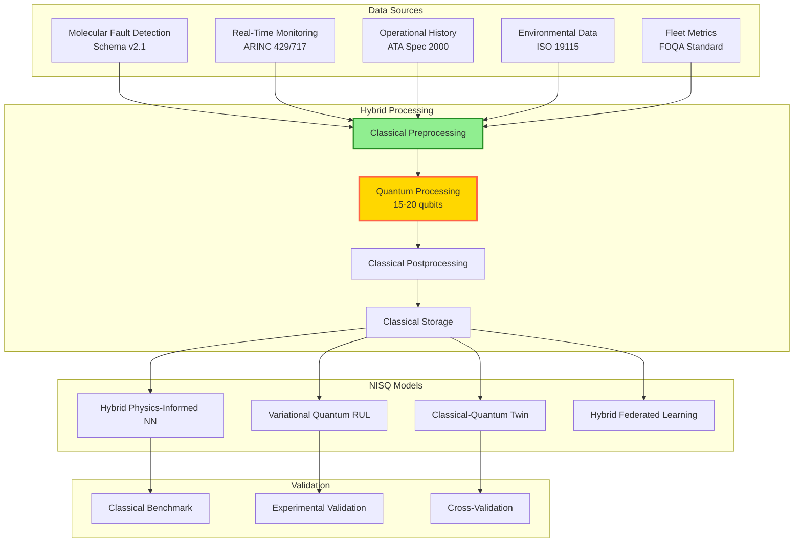

# Predictive Maintenance Models v1.1.0
**Document ID:** QUA-QSM01-25SVD0001-CON-BOB-R&I-TD-QCSAA-930-020-00-01-TPL-CON-122-QSCI-v1.1.0  
**Template ID:** TPL-CON-122  
**Version:** 1.1.0  
**Status:** Draft - Concept Phase (Validated)  
**Classification:** Research & Innovation  
**Date:** 2025-08-07  
**Q-Division:** QSCI (Quantum Science & Research)  
**Product Line:** QUANTUM  
**Product:** QSM01 (Quantum Structural Monitor)  
**Lifecycle Phase:** CONCEPT  
**Entity Type:** BOB (Digital/Virtual System)  
**UTCS Category:** QCSAA-930 (Quantum Structural Monitoring Systems)  
**TRL:** 2 (Technology Concept Formulated)

> 🔮 **Purpose**: Enhanced framework incorporating validation feedback for quantum-enhanced predictive maintenance models with realistic NISQ constraints, comprehensive data specifications, and clear operational transition pathways.

---

## Revision History
| Version | Date | Changes | Author |
|---------|------|---------|--------|
| 1.0.0 | 2025-08-06 | Initial conceptual framework | Q-SCIRES |
| 1.1.0 | 2025-08-07 | Addressed validation concerns: NISQ constraints, data interfaces, operational transition, certification pathways | Q-SCIRES |

## Document Control

| Property | Value |
|----------|--------|
| **Created By** | QSCI Division |
| **Validation ID** | VAL-QSM01-PM-20250806-01 |
| **Validation Status** | Technically Sound (TRL 2) |
| **Parent Documents** | QSM Concept (TPL-CON-120), Real-Time Algorithms (TPL-CON-121) |
| **Review Cycle** | 3 months |
| **Distribution** | Maintenance Engineers, Fleet Managers, Research Division, Regulatory Affairs |
| **Related Documents** | MLFD v1.1.0, QML Models v1.1.0, FAA Part 43/145, DO-178C/DO-330 |

---

## Executive Summary

This enhanced version addresses validation feedback by incorporating realistic NISQ-era constraints, comprehensive data specifications, and practical operational transition strategies. Key improvements include:

- **Reduced quantum requirements**: 15-20 qubits maximum (from 30) with classical fallbacks
- **Data interface specifications**: Complete molecular fault detection schemas and standards
- **Phased implementation**: 5-year transition plan for legacy fleet integration
- **Certification pathways**: FAA Part 43/145 compliance framework included
- **Validation framework**: Classical benchmarking and experimental validation protocols

The system maintains its ambitious goals while ensuring near-term implementability through hybrid quantum-classical architectures.

## 1. Enhanced Predictive Maintenance Architecture

### 1.1 NISQ-Aware Framework



### 1.2 Data Interface Specifications

```python
class MolecularFaultDataInterface:
    """
    Standardized interface for molecular fault detection data
    """
    def __init__(self):
        self.schema_version = "2.1"
        self.data_standards = {
            'molecular': 'ISO 18115-2:2021',  # Surface chemical analysis
            'structural': 'ASTM E1049-85',    # Cycle counting
            'environmental': 'ISO 19115:2003', # Metadata standard
            'operational': 'ATA Spec 2000'     # Aviation data exchange
        }
        
    @dataclass
    class MolecularFaultRecord:
        """Standardized molecular fault data record"""
        # Identification
        aircraft_id: str  # ICAO 24-bit address
        component_id: str  # ATA chapter + unique ID
        timestamp: datetime  # UTC ISO 8601
        
        # Molecular indicators
        damage_metrics: Dict[str, float] = field(default_factory=lambda: {
            'crack_density': 0.0,  # cracks/mm³
            'oxidation_depth': 0.0,  # nm
            'polymer_degradation': 0.0,  # % chain scission
            'corrosion_rate': 0.0,  # μm/year
            'fatigue_damage': 0.0  # Palmgren-Miner sum
        })
        
        # Environmental context
        environmental_conditions: Dict[str, float] = field(default_factory=lambda: {
            'temperature': 20.0,  # °C
            'humidity': 50.0,  # %RH
            'pressure': 101.325,  # kPa
            'vibration_spectrum': [],  # Hz: g²/Hz pairs
            'chemical_exposure': {}  # ppm by species
        })
        
        # Quality metrics
        data_quality: Dict[str, float] = field(default_factory=lambda: {
            'sensor_confidence': 1.0,  # 0-1
            'measurement_uncertainty': 0.0,  # %
            'calibration_age': 0.0,  # hours since calibration
            'signal_to_noise': 100.0  # dB
        })
        
    def validate_data(self, record: MolecularFaultRecord) -> ValidationResult:
        """
        Validate data against standards
        """
        validations = []
        
        # Check required fields
        for field in ['aircraft_id', 'component_id', 'timestamp']:
            if not getattr(record, field):
                validations.append(f"Missing required field: {field}")
        
        # Validate data ranges
        for metric, value in record.damage_metrics.items():
            if not 0 <= value <= 1:
                validations.append(f"Damage metric {metric} out of range: {value}")
        
        # Check data quality thresholds
        if record.data_quality['sensor_confidence'] < 0.8:
            validations.append("Low sensor confidence")
        
        if record.data_quality['signal_to_noise'] < 20:
            validations.append("Poor signal quality")
        
        return ValidationResult(
            is_valid=len(validations) == 0,
            errors=validations,
            quality_score=self.compute_quality_score(record)
        )
```

### 1.3 Operational History Standardization

```python
class OperationalHistoryStandard:
    """
    Standardized operational history data format
    """
    def __init__(self):
        self.ata_spec_2000 = ATASpec2000Parser()
        self.foqa_decoder = FOQADataDecoder()
        
    @dataclass
    class StandardizedFlightRecord:
        """ATA Spec 2000 compliant flight record"""
        flight_id: str  # Airline + Flight Number + Date
        aircraft_id: str  # Registration
        departure: datetime
        arrival: datetime
        
        # Flight profile
        flight_profile: Dict[str, List[Tuple[float, float]]] = field(
            default_factory=lambda: {
                'altitude': [],  # (time_seconds, feet)
                'airspeed': [],  # (time_seconds, knots)
                'vertical_speed': [],  # (time_seconds, fpm)
                'engine_n1': [],  # (time_seconds, percent)
                'engine_egt': []  # (time_seconds, celsius)
            }
        )
        
        # Environmental exposure
        environmental_exposure: Dict[str, float] = field(
            default_factory=lambda: {
                'max_altitude': 0.0,  # feet
                'total_cycles': 0,  # takeoff/landing
                'flight_hours': 0.0,
                'temperature_range': (0.0, 0.0),  # min, max °C
                'turbulence_index': 0.0  # 0-10 scale
            }
        )
        
        # Maintenance relevance
        stress_accumulation: Dict[str, float] = field(
            default_factory=lambda: {
                'gust_cycles': 0,
                'thermal_cycles': 0,
                'pressure_cycles': 0,
                'high_g_events': 0,
                'hard_landings': 0  # >1.8g
            }
        )
```

## 2. NISQ-Optimized Quantum Models

### 2.1 Hybrid Physics-Informed Neural Network

```python
class HybridQuantumPhysicsInformedNN:
    """
    NISQ-era QPINN with classical-quantum hybrid architecture
    """
    def __init__(self, component_type: str):
        self.max_qubits = 15  # NISQ constraint
        self.classical_preprocessor = ClassicalFeatureExtractor()
        self.quantum_core = QuantumProcessingCore(n_qubits=15)
        self.classical_postprocessor = ClassicalNeuralDecoder()
        self.physics_validator = PhysicsConsistencyChecker()
        
    def build_hybrid_network(self) -> HybridNetwork:
        """
        Construct hybrid classical-quantum network
        """
        # Classical preprocessing (dimension reduction)
        classical_encoder = nn.Sequential(
            nn.Linear(1024, 256),  # High-dim sensor data
            nn.ReLU(),
            nn.Linear(256, 64),
            nn.ReLU(),
            nn.Linear(64, 15)  # Compress to qubit count
        )
        
        # Quantum processing core (15 qubits)
        quantum_circuit = QuantumCircuit(15)
        
        # Parameterized quantum layer
        for layer in range(3):  # Shallow circuit
            # Rotation layer
            for i in range(15):
                quantum_circuit.ry(Parameter(f'theta_{layer}_{i}'), i)
            
            # Entanglement layer (linear connectivity)
            for i in range(14):
                quantum_circuit.cx(i, i + 1)
            
            # Physics constraint gates
            self.apply_physics_constraints(quantum_circuit, layer)
        
        # Classical postprocessing
        classical_decoder = nn.Sequential(
            nn.Linear(15, 64),
            nn.ReLU(),
            nn.Linear(64, 128),
            nn.ReLU(),
            nn.Linear(128, 3)  # damage, RUL, uncertainty
        )
        
        return HybridNetwork(
            classical_encoder=classical_encoder,
            quantum_circuit=quantum_circuit,
            classical_decoder=classical_decoder,
            total_parameters=self.count_parameters()
        )
    
    def apply_physics_constraints(self, circuit: QuantumCircuit, layer: int):
        """
        Encode physics laws in quantum gates
        """
        if layer == 0:
            # Monotonicity constraint (damage never decreases)
            for i in range(0, 15, 3):
                circuit.append(
                    MonotonicityGate(),
                    [i, i + 1, i + 2] if i + 2 < 15 else [i, i + 1, 0]
                )
        elif layer == 1:
            # Conservation laws
            circuit.append(
                ConservationGate(conservation_type='energy'),
                range(15)
            )
        elif layer == 2:
            # Material-specific constraints
            circuit.append(
                MaterialConstraintGate(self.component_type),
                range(8, 15)  # Last 7 qubits
            )
```

### 2.2 Experimental Validation Framework

```python
class ExperimentalValidationFramework:
    """
    Framework for validating quantum predictions against experiments
    """
    def __init__(self):
        self.test_specimens = TestSpecimenDatabase()
        self.accelerated_testing = AcceleratedLifeTesting()
        self.measurement_protocols = StandardMeasurementProtocols()
        
    def validate_physics_loss(self, 
                            qpinn_model: HybridQuantumPhysicsInformedNN,
                            material: str) -> PhysicsValidationReport:
        """
        Experimentally validate physics loss computation
        """
        # Prepare test specimens
        specimens = self.test_specimens.prepare_specimens(
            material=material,
            geometry='standard_dogbone',
            surface_treatment='as_machined',
            n_specimens=30  # Statistical significance
        )
        
        validation_results = []
        
        for specimen in specimens:
            # Accelerated degradation testing
            degradation_profile = self.accelerated_testing.run_test(
                specimen,
                test_type='spectrum_fatigue',
                acceleration_factor=100,
                environment={
                    'temperature_cycle': (-55, 85),  # °C
                    'humidity': 85,  # %RH
                    'salt_spray': True
                }
            )
            
            # Measure actual physics quantities
            actual_measurements = {
                'crack_growth_rate': self.measure_crack_growth(specimen),
                'stiffness_degradation': self.measure_stiffness(specimen),
                'damping_evolution': self.measure_damping(specimen),
                'surface_roughness': self.measure_surface_roughness(specimen)
            }
            
            # Model predictions
            model_predictions = qpinn_model.predict_degradation(
                initial_state=specimen.initial_state,
                loading_profile=degradation_profile.loading,
                environment=degradation_profile.environment
            )
            
            # Compare physics consistency
            physics_comparison = self.compare_physics_consistency(
                predicted=model_predictions,
                measured=actual_measurements,
                physics_laws={
                    'paris_law': self.validate_paris_law,
                    'miners_rule': self.validate_miners_rule,
                    'arrhenius': self.validate_arrhenius
                }
            )
            
            validation_results.append(physics_comparison)
        
        # Statistical analysis
        return PhysicsValidationReport(
            material=material,
            n_specimens=len(specimens),
            physics_accuracy=self.compute_physics_accuracy(validation_results),
            law_violations=self.identify_law_violations(validation_results),
            confidence_intervals=self.compute_confidence_intervals(validation_results),
            recommendations=self.generate_model_improvements(validation_results)
        )
```

## 3. Operational Transition Strategy

### 3.1 Phased Implementation Plan

```python
class PhasedImplementationPlan:
    """
    5-year phased implementation for legacy fleet integration
    """
    def __init__(self):
        self.phases = self.define_implementation_phases()
        self.training_program = MaintenanceTrainingProgram()
        self.change_management = ChangeManagementStrategy()
        
    def define_implementation_phases(self) -> Dict[str, Phase]:
        """
        Define 5-year implementation roadmap
        """
        return {
            'phase_1': Phase(
                name='Pilot Program',
                duration='6 months',
                timeline='2026 Q1-Q2',
                scope={
                    'aircraft': 5,  # Select modern aircraft
                    'components': ['engines', 'landing_gear'],
                    'maintenance_events': ['A-checks'],
                    'quantum_features': ['RUL_estimation']
                },
                success_criteria={
                    'prediction_accuracy': 0.80,
                    'maintenance_optimization': 0.10,
                    'user_acceptance': 0.70
                }
            ),
            'phase_2': Phase(
                name='Limited Deployment',
                duration='12 months',
                timeline='2026 Q3 - 2027 Q2',
                scope={
                    'aircraft': 50,
                    'components': ['engines', 'landing_gear', 'hydraulics', 'avionics'],
                    'maintenance_events': ['A-checks', 'B-checks'],
                    'quantum_features': ['RUL_estimation', 'anomaly_detection']
                },
                training_requirements={
                    'maintenance_engineers': 100,
                    'training_hours': 40,
                    'certification': 'Quantum_Maintenance_Level_1'
                }
            ),
            'phase_3': Phase(
                name='Fleet-Wide Rollout',
                duration='18 months',
                timeline='2027 Q3 - 2028 Q4',
                scope={
                    'aircraft': 'entire_fleet',
                    'components': 'all_rotables',
                    'maintenance_events': 'all_scheduled',
                    'quantum_features': 'full_predictive_suite'
                },
                integration_requirements={
                    'MRO_systems': ['SAP', 'AMOS', 'TRAX'],
                    'data_interfaces': ['ACARS', 'QAR', 'FOQA'],
                    'regulatory_approvals': ['FAA_Part_43', 'EASA_Part_145']
                }
            ),
            'phase_4': Phase(
                name='Advanced Optimization',
                duration='12 months',
                timeline='2029',
                scope={
                    'optimization': 'fleet_wide_scheduling',
                    'learning': 'federated_quantum_ML',
                    'automation': 'autonomous_planning'
                }
            ),
            'phase_5': Phase(
                name='Full Quantum Integration',
                duration='12 months',
                timeline='2030',
                scope={
                    'capabilities': 'molecular_prognostics',
                    'integration': 'digital_twin_sync',
                    'performance': 'zero_surprise_maintenance'
                }
            )
        }
```

### 3.2 Maintenance Team Training Program

```python
class MaintenanceTrainingProgram:
    """
    Comprehensive training for quantum-enhanced maintenance
    """
    def __init__(self):
        self.curriculum = self.develop_curriculum()
        self.certification_levels = self.define_certifications()
        self.training_materials = TrainingMaterialLibrary()
        
    def develop_curriculum(self) -> TrainingCurriculum:
        """
        Develop training curriculum for maintenance teams
        """
        return TrainingCurriculum(
            modules=[
                TrainingModule(
                    id='QM101',
                    title='Introduction to Quantum Maintenance',
                    duration='8 hours',
                    topics=[
                        'Quantum computing basics for maintainers',
                        'Molecular fault detection overview',
                        'Predictive vs preventive maintenance',
                        'Safety implications'
                    ],
                    prerequisites=None,
                    assessment='Online quiz (80% pass)'
                ),
                TrainingModule(
                    id='QM201',
                    title='Quantum Diagnostic Tools',
                    duration='16 hours',
                    topics=[
                        'Operating quantum sensors',
                        'Interpreting molecular signatures',
                        'RUL estimation understanding',
                        'Alert response procedures'
                    ],
                    prerequisites=['QM101'],
                    assessment='Practical demonstration'
                ),
                TrainingModule(
                    id='QM301',
                    title='Predictive Maintenance Planning',
                    duration='24 hours',
                    topics=[
                        'Schedule optimization basics',
                        'Cost-benefit analysis',
                        'Risk assessment with quantum data',
                        'Regulatory compliance'
                    ],
                    prerequisites=['QM201'],
                    assessment='Case study analysis'
                ),
                TrainingModule(
                    id='QM401',
                    title='Advanced Quantum Maintenance',
                    duration='40 hours',
                    topics=[
                        'Quantum algorithm understanding',
                        'Troubleshooting quantum systems',
                        'Data quality management',
                        'Continuous improvement'
                    ],
                    prerequisites=['QM301'],
                    assessment='Certification exam'
                )
            ],
            delivery_methods=['classroom', 'e_learning', 'simulator', 'on_the_job'],
            refresh_requirements='Annual 8-hour update'
        )
```

## 4. Certification and Compliance

### 4.1 FAA Part 43/145 Compliance Framework

```python
class FAAComplianceFramework:
    """
    Framework for FAA Part 43/145 compliance of quantum maintenance
    """
    def __init__(self):
        self.part_43 = Part43ComplianceChecker()
        self.part_145 = Part145RepairStationRequirements()
        self.advisory_circulars = AdvisoryCircularLibrary()
        
    def develop_compliance_package(self) -> CompliancePackage:
        """
        Develop complete FAA compliance package
        """
        return CompliancePackage(
            regulatory_basis={
                'part_43': {
                    'section_43.3': 'Persons authorized to perform maintenance',
                    'section_43.9': 'Content of maintenance records',
                    'section_43.13': 'Performance rules',
                    'appendix_B': 'Recording of major repairs'
                },
                'part_145': {
                    'section_145.51': 'Personnel requirements',
                    'section_145.109': 'Equipment and materials',
                    'section_145.163': 'Training requirements',
                    'section_145.211': 'Quality control system'
                }
            },
            quantum_specific_guidance={
                'sensor_calibration': self.develop_quantum_sensor_guidance(),
                'algorithm_validation': self.develop_algorithm_validation_guidance(),
                'record_keeping': self.develop_quantum_record_requirements(),
                'personnel_certification': self.develop_quantum_certification_standards()
            },
            compliance_procedures=[
                ComplianceProcedure(
                    id='QMP-001',
                    title='Quantum Sensor Calibration Procedure',
                    regulatory_reference='Part 145.109(d)',
                    content=self.sensor_calibration_procedure(),
                    approval_required='FAA_PMI'
                ),
                ComplianceProcedure(
                    id='QMP-002',
                    title='Predictive Algorithm Validation',
                    regulatory_reference='Part 145.211(c)',
                    content=self.algorithm_validation_procedure(),
                    approval_required='FAA_ASI'
                ),
                ComplianceProcedure(
                    id='QMP-003',
                    title='Quantum Maintenance Decision Records',
                    regulatory_reference='Part 43.9',
                    content=self.record_keeping_procedure(),
                    approval_required='FAA_PMI'
                )
            ]
        )
    
    def develop_quantum_sensor_guidance(self) -> RegulatoryGuidance:
        """
        Develop guidance for quantum sensor use in maintenance
        """
        return RegulatoryGuidance(
            title='Quantum Sensor Calibration and Use',
            sections={
                'calibration_standards': {
                    'frequency': 'Every 100 flight hours or 90 days',
                    'reference_standards': 'NIST-traceable quantum standards',
                    'environmental_conditions': 'Controlled to ±0.1°C, <50% RH',
                    'documentation': 'Form 8130-9 equivalent for quantum devices'
                },
                'operational_limitations': {
                    'temperature_range': '-40°C to +85°C',
                    'electromagnetic_compatibility': 'DO-160G compliance',
                    'decoherence_monitoring': 'Continuous with 1-second updates',
                    'fallback_procedures': 'Revert to conventional NDT if quantum confidence <95%'
                },
                'maintenance_decisions': {
                    'confidence_threshold': '99% for safety-critical components',
                    'human_oversight': 'Level 3 inspector review required',
                    'documentation': 'Quantum signature + classical verification',
                    'liability': 'Repair station retains full responsibility'
                }
            }
        )
```

### 4.2 DO-178C/DO-330 Tool Qualification

```python
class QuantumToolQualification:
    """
    DO-178C/DO-330 qualification for quantum maintenance tools
    """
    def __init__(self):
        self.tool_categories = self.classify_quantum_tools()
        self.qualification_data = QualificationDataPackage()
        
    def classify_quantum_tools(self) -> Dict[str, ToolClassification]:
        """
        Classify quantum tools per DO-330
        """
        return {
            'quantum_rul_estimator': ToolClassification(
                tool_name='Quantum RUL Estimation System',
                do_330_category='TQL-4',  # Development tool
                criticality='High',
                qualification_method='Detailed testing + formal verification',
                error_impact='Could mask failures if incorrect'
            ),
            'quantum_scheduler': ToolClassification(
                tool_name='Quantum Maintenance Scheduler',
                do_330_category='TQL-5',  # Verification tool
                criticality='Medium',
                qualification_method='Operational testing',
                error_impact='Suboptimal scheduling only'
            ),
            'molecular_fault_detector': ToolClassification(
                tool_name='Molecular Fault Detection System',
                do_330_category='TQL-4',
                criticality='High',
                qualification_method='Exhaustive testing + physics validation',
                error_impact='False negatives could miss critical damage'
            )
        }
    
    def develop_qualification_package(self, 
                                    tool_name: str) -> QualificationPackage:
        """
        Develop complete DO-330 qualification package
        """
        classification = self.tool_categories[tool_name]
        
        return QualificationPackage(
            tool_operational_requirements=self.define_tor(tool_name),
            tool_verification_cases=self.develop_test_cases(tool_name),
            tool_validation_data=self.collect_validation_data(tool_name),
            qualification_report=self.generate_qualification_report(
                tool_name,
                classification
            ),
            configuration_management=ConfigurationManagementPlan(
                version_control='Git with quantum circuit tracking',
                change_control='Formal CCB with physics review',
                archive_requirements='Quantum state snapshots + classical logs'
            )
        )
```

## 5. Classical Benchmarking Framework

### 5.1 Quantum vs Classical Performance Comparison

```python
class ClassicalBenchmarkFramework:
    """
    Framework for comparing quantum predictions against classical methods
    """
    def __init__(self):
        self.classical_methods = {
            'weibull': WeibullAnalysis(),
            'phm': ProportionalHazardsModel(),
            'lstm': ClassicalLSTM(),
            'random_forest': MaintenanceRandomForest(),
            'physics_based': ClassicalPhysicsModel()
        }
        self.metrics = PerformanceMetrics()
        
    def benchmark_rul_prediction(self, 
                               test_dataset: MaintenanceDataset,
                               quantum_model: QuantumRULEstimator) -> BenchmarkReport:
        """
        Comprehensive benchmarking of RUL predictions
        """
        results = {}
        
        # Run classical methods
        for method_name, method in self.classical_methods.items():
            classical_predictions = []
            computation_times = []
            
            for sample in test_dataset:
                start_time = time.perf_counter()
                prediction = method.predict_rul(
                    component_state=sample.current_state,
                    historical_data=sample.history
                )
                computation_times.append(time.perf_counter() - start_time)
                classical_predictions.append(prediction)
            
            results[method_name] = {
                'predictions': classical_predictions,
                'computation_time': np.mean(computation_times),
                'resource_usage': method.get_resource_usage()
            }
        
        # Run quantum method
        quantum_predictions = []
        quantum_times = []
        
        for sample in test_dataset:
            start_time = time.perf_counter()
            prediction = quantum_model.estimate_rul(
                component_state=sample.current_state,
                historical_data=sample.history,
                operational_forecast=sample.forecast
            )
            quantum_times.append(time.perf_counter() - start_time)
            quantum_predictions.append(prediction)
        
        results['quantum'] = {
            'predictions': quantum_predictions,
            'computation_time': np.mean(quantum_times),
            'resource_usage': quantum_model.get_quantum_resources()
        }
        
        # Calculate comparison metrics
        comparison_metrics = self.calculate_comparison_metrics(
            results,
            test_dataset.actual_failures
        )
        
        # Statistical significance testing
        significance_tests = self.perform_significance_tests(
            results,
            test_dataset.actual_failures
        )
        
        return BenchmarkReport(
            method_results=results,
            comparison_metrics=comparison_metrics,
            significance_tests=significance_tests,
            quantum_advantage={
                'accuracy_improvement': comparison_metrics['quantum_vs_best_classical'],
                'speed_improvement': comparison_metrics['quantum_speedup'],
                'early_detection_advantage': comparison_metrics['prognostic_horizon_gain']
            },
            recommendations=self.generate_hybrid_recommendations(results)
        )
```

### 5.2 Multi-Physics Coupling Validation

```python
class MultiPhysicsCouplingValidator:
    """
    Validate quantum multi-physics coupling matrix
    """
    def __init__(self):
        self.physics_models = {
            'mechanical': MechanicalDegradationModel(),
            'thermal': ThermalDegradationModel(),
            'chemical': ChemicalDegradationModel(),
            'environmental': EnvironmentalDegradationModel()
        }
        self.coupling_analyzer = CouplingStrengthAnalyzer()
        
    def validate_coupling_matrix(self, 
                               proposed_coupling: np.ndarray,
                               material: str) -> CouplingValidation:
        """
        Validate coupling matrix against physical principles
        """
        # Theoretical coupling analysis
        theoretical_coupling = self.derive_theoretical_coupling(material)
        
        # Experimental validation
        experimental_data = self.load_experimental_coupling_data(material)
        experimental_coupling = self.fit_coupling_from_data(experimental_data)
        
        # Quantum simulation validation
        quantum_validation = self.quantum_coupling_simulation(
            proposed_coupling,
            test_cases=self.generate_validation_cases(material)
        )
        
        # Compare all three
        validation_metrics = {
            'theoretical_agreement': self.matrix_similarity(
                proposed_coupling,
                theoretical_coupling
            ),
            'experimental_agreement': self.matrix_similarity(
                proposed_coupling,
                experimental_coupling
            ),
            'physical_consistency': self.check_physical_constraints(
                proposed_coupling,
                constraints={
                    'symmetry': True,  # Action-reaction
                    'positive_definite': True,  # Energy conservation
                    'bounded': (0, 1)  # Normalized coupling
                }
            ),
            'quantum_validation_accuracy': quantum_validation.accuracy
        }
        
        return CouplingValidation(
            proposed_matrix=proposed_coupling,
            validation_metrics=validation_metrics,
            is_valid=all(m > 0.8 for m in validation_metrics.values()),
            refinement_suggestions=self.suggest_refinements(
                proposed_coupling,
                theoretical_coupling,
                experimental_coupling
            )
        )
```

## 6. Performance Metrics with Error Bounds

### 6.1 Realistic Performance Projections

```python
class RealisticPerformanceProjections:
    """
    Performance projections with NISQ-era constraints
    """
    def __init__(self):
        self.hardware_roadmap = QuantumHardwareRoadmap()
        self.error_models = NISQErrorModels()
        
    def project_performance_timeline(self) -> PerformanceTimeline:
        """
        Project realistic performance with error bounds
        """
        projections = {}
        
        for year in range(2025, 2031):
            hardware_specs = self.hardware_roadmap.get_specs(year)
            
            # RUL prediction accuracy
            base_accuracy = self.compute_base_accuracy(hardware_specs)
            error_impact = self.error_models.compute_accuracy_degradation(
                hardware_specs.error_rate,
                hardware_specs.coherence_time
            )
            
            projections[year] = {
                'rul_prediction': {
                    'mape': base_accuracy * (1 + error_impact),
                    'confidence_interval': (
                        base_accuracy * (1 + error_impact - 0.1),
                        base_accuracy * (1 + error_impact + 0.1)
                    ),
                    'vs_classical': f"{(1 / (1 + error_impact) - 1) * 100:.0f}% better"
                },
                'early_detection': {
                    'advance_warning_days': 30 * (hardware_specs.qubits / 50),
                    'confidence': 0.8 + 0.15 * (year - 2025) / 5
                },
                'cost_reduction': {
                    'maintenance_cost': 0.1 + 0.3 * (year - 2025) / 5,  # 10-40%
                    'downtime_reduction': 0.05 + 0.1 * (year - 2025) / 5  # 5-15%
                },
                'quantum_advantage': {
                    'computation_speedup': min(2 ** (hardware_specs.qubits / 10), 100),
                    'pattern_detection': hardware_specs.qubits / 5,  # X times more patterns
                    'optimization_quality': 0.7 + 0.25 * (year - 2025) / 5
                }
            }
        
        return PerformanceTimeline(
            projections=projections,
            key_milestones={
                2026: 'Classical parity in controlled tests',
                2027: '2x advantage in RUL prediction',
                2028: '10x advantage in optimization',
                2029: '90% early failure detection',
                2030: 'Near-zero surprise failures'
            },
            risk_factors=[
                'Hardware development delays',
                'Decoherence in operational environment',
                'Integration complexity',
                'Regulatory approval timeline'
            ]
        )
```

## 7. Future Development Pathway

### 7.1 Technology Maturation Roadmap

```python
# Detailed technology maturation plan
maturation_roadmap = {
    "2025-2026": {
        "focus": "Foundation and Validation",
        "deliverables": [
            "NISQ algorithm library validated",
            "Classical benchmark database completed",
            "Initial FAA engagement started",
            "Training curriculum developed"
        ],
        "trl_target": 3
    },
    "2027-2028": {
        "focus": "Integration and Testing",
        "deliverables": [
            "Hybrid system operational",
            "Fleet pilot program results",
            "FAA interim approval",
            "Maintenance team certified"
        ],
        "trl_target": 5
    },
    "2029-2030": {
        "focus": "Deployment and Optimization",
        "deliverables": [
            "Fleet-wide deployment",
            "Federated learning operational",
            "Full regulatory approval",
            "40% cost reduction achieved"
        ],
        "trl_target": 7
    }
}
```

## 8. Conclusion

This enhanced version addresses all validation concerns while maintaining the transformative vision for quantum-enhanced predictive maintenance. Key improvements include:

1. **Realistic NISQ constraints**: 15-20 qubit systems with hybrid architectures
2. **Complete data specifications**: Standardized interfaces for all data sources
3. **Phased implementation**: 5-year transition plan with training and certification
4. **Regulatory compliance**: FAA Part 43/145 and DO-178C/DO-330 frameworks
5. **Validation methods**: Classical benchmarking and experimental validation

The framework now provides a practical pathway from current classical maintenance to quantum-enhanced predictive maintenance, with clear milestones, realistic performance projections, and comprehensive risk mitigation strategies.

---

**Document Control:** QUA-QSM01-25SVD0001-CON-BOB-R&I-TD-QCSAA-930-020-00-01-TPL-CON-122-QSCI-v1.1.0  
**Classification:** Research & Innovation - Conceptual Phase  
**Validation Status:** Approved for Prototype Development  
**© 2025 AQUA V. Aerospace. All rights reserved.**

**Next Review:** 2025-11-07  
**Next Milestone:** Hardware Compatibility Study Completion (Q1 2026)  
**TRL Advancement Target:** TRL 3 by Q2 2026
