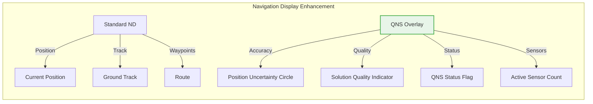
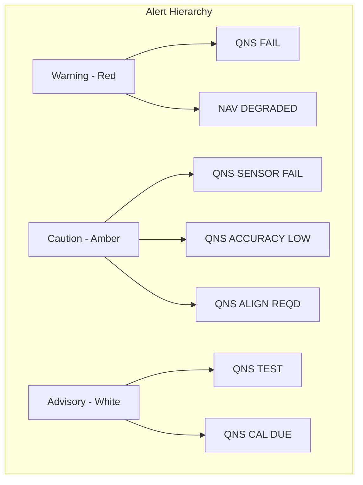
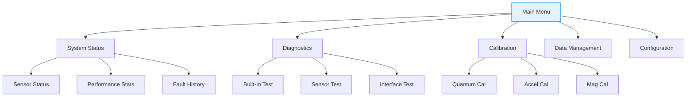
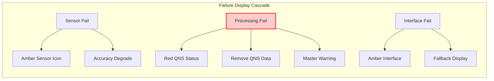

# User Interface Design - Quantum Navigation System

**Document ID**: QUA-QNS01-25SVD0001-DES-BOB-FUN-TD-QCSAA-916-000-00-01-TPL-DES-211-QSTR-v1.0.0  
**Template ID**: TPL-DES-211  
**Version**: 1.0.0  
**Status**: Draft - Design Phase  
**Classification**: Functional Design  
**Date**: 2025-07-29  
**Q-Division**: QSTR (Quantum Structures)  
**Product Line**: QUANTUM  
**Product**: QNS01 (Quantum Navigation System)  
**Lifecycle Phase**: DESIGN  
**Entity Type**: BOB (Digital/Virtual System)  
**UTCS Category**: QCSAA-916 (QNS User Interface Design)  
**Current TRL**: 4 (Technology validated in lab)  
**Target TRL**: 6 (Technology demonstrated in relevant environment)  

> 👥 **Purpose**: Define the comprehensive user interface design for the Quantum Navigation System, ensuring intuitive, safe, and efficient human-machine interaction for flight crew and maintenance personnel while meeting aerospace human factors standards.

---

## QNS Navigation Simulator

Access the QNS Simulator here: [QNS Simulator](https://claude.ai/public/artifacts/6c442eea-1d9a-4f9e-8416-6dc127b172a8)


## External Resources

Access the Google AI Studio prompt used for QNS Navigation development:  
[Google AI Studio Prompt](https://aistudio.google.com/app/prompts?state=%7B%22ids%22:%5B%221XJ9OKGZCb40Uk28OhO-esOpZP1BMM5fR%22%5D,%22action%22:%22open%22,%22userId%22:%22104636269716919807175%22,%22resourceKeys%22:%7B%7D%7D&usp=sharing)

## Document Control

| Property | Value |
|----------|--------|
| **Created By** | QSTR Division - Human Factors Engineering Team |
| **Creation Date** | 2025-07-29 |
| **Last Modified** | 2025-07-29 |
| **Review Cycle** | Monthly |
| **Distribution** | Human Factors Engineers, Pilots, Certification Teams |
| **Related Documents** | Functional Design (TPL-DES-210), ARINC 661, DO-178C, CS-25.1302 |
| **Approval Status** | Pending PDR |

---

## 1. Executive Summary

This User Interface Design document defines the human-machine interface (HMI) for the Quantum Navigation System, ensuring safe, intuitive, and efficient operation by flight crews and maintenance personnel. The design philosophy emphasizes **minimal crew workload**, **clear situational awareness**, and **fail-safe operation** while introducing quantum navigation concepts in a familiar operational context.

### 1.1 Design Philosophy

- **Familiar Yet Advanced**: Leverage existing navigation display conventions while introducing quantum-specific information
- **Progressive Disclosure**: Present essential information prominently, detailed data on demand
- **Error Prevention**: Design prevents incorrect inputs and clearly indicates system limitations
- **Consistency**: Uniform interaction patterns across all QNS interfaces
- **Accessibility**: Support for varying lighting conditions and crew capabilities

### 1.2 Interface Overview

| Interface Type | Primary Users | Key Functions | Criticality |
|----------------|---------------|---------------|-------------|
| **Flight Deck Displays** | Pilots | Navigation monitoring, alerts | Safety-Critical |
| **Control Panel** | Pilots | Mode selection, system control | Safety-Critical |
| **Maintenance Terminal** | Technicians | Diagnostics, calibration | Operational |
| **Ground Support** | Engineers | Configuration, data analysis | Non-Critical |

---

## 2. Flight Deck Interface Design

### 2.1 Primary Navigation Display Integration



#### 2.1.1 QNS Position Display

```python
class QNSPositionDisplay:
    """
    Position uncertainty visualization on Navigation Display
    """
    def __init__(self):
        self.display_modes = {
            'NORMAL': self.show_standard_uncertainty,
            'DETAILED': self.show_enhanced_uncertainty,
            'DIAGNOSTIC': self.show_full_diagnostics
        }
        
    def show_standard_uncertainty(self, nav_solution):
        """Standard display mode - minimal clutter"""
        display_elements = {
            'aircraft_symbol': {
                'type': 'standard_triangle',
                'color': self.get_quality_color(nav_solution.quality),
                'size': 'standard'
            },
            'uncertainty_circle': {
                'radius': nav_solution.horizontal_uncertainty_m,
                'color': 'cyan',
                'style': 'dashed',
                'width': 1,
                'visible': nav_solution.uncertainty > 10  # Only show if >10m
            },
            'quality_indicator': {
                'position': 'top_right',
                'text': self.get_quality_text(nav_solution.quality),
                'color': self.get_quality_color(nav_solution.quality)
            }
        }
        return display_elements
        
    def get_quality_color(self, quality):
        """Color coding per aerospace standards"""
        colors = {
            'OPTIMAL': 'green',      # Normal operation
            'DEGRADED': 'amber',     # Caution
            'MINIMAL': 'amber',      # Caution
            'FAILED': 'red'          # Warning
        }
        return colors.get(quality, 'white')
```

#### 2.1.2 Display Symbology

```yaml
qns_symbology:
  position_accuracy:
    optimal:
      symbol: "Circle with dot"
      color: "Green"
      size: "5mm diameter"
    degraded:
      symbol: "Circle with cross"
      color: "Amber"
      size: "7mm diameter"
      flash: "When first degraded"
    failed:
      symbol: "X"
      color: "Red"
      size: "10mm"
      flash: "Continuous 1Hz"
      
  sensor_status:
    all_operational:
      text: "QNS"
      color: "Green"
      position: "Top right of ND"
    partial_failure:
      text: "QNS-1" # Number indicates failed sensors
      color: "Amber"
      box: "Amber outline"
    total_failure:
      text: "QNS FAIL"
      color: "Red"
      box: "Red filled"
      
  uncertainty_visualization:
    circle:
      line_type: "Dashed"
      line_width: "1 pixel"
      color: "Cyan"
      label: "EPU: XXm" # Estimated Position Uncertainty
    growth_rate:
      show_when: "No GPS > 5 minutes"
      format: "Growing circle animation"
      rate_label: "+X.Xm/min"
```

### 2.2 Primary Flight Display Integration

#### 2.2.1 Attitude Indicator Enhancement

```python
class QNSAttitudeDisplay:
    """Enhanced attitude display with quantum sensor status"""
    
    def render_attitude_indicator(self, attitude_data):
        elements = {
            'standard_adi': self.render_standard_adi(attitude_data),
            'qns_enhancements': {
                'quantum_reliability': {
                    'position': 'bottom_left',
                    'type': 'arc',
                    'range': [0, 100],
                    'value': attitude_data.quantum_fidelity * 100,
                    'color_ranges': [
                        (80, 100, 'green'),
                        (60, 80, 'amber'),
                        (0, 60, 'red')
                    ]
                },
                'sensor_voting': {
                    'position': 'bottom_right',
                    'format': '3/3',  # Active/Total sensors
                    'color': 'green' if all_sensors_agree else 'amber'
                }
            }
        }
        return elements
```

#### 2.2.2 Integrated Alert Display



### 2.3 Control Display Unit (CDU) Pages

#### 2.3.1 QNS Status Page


#### 2.3.2 QNS Test Page


### 2.4 Control Panel Design

#### 2.4.1 Physical Layout


#### 2.4.2 Control Logic

```python
class QNSControlPanel:
    """Physical control panel interface logic"""
    
    def __init__(self):
        self.controls = {
            'power_switch': {
                'type': 'toggle',
                'positions': ['OFF', 'ON'],
                'guard': True,
                'backlight': 'integral'
            },
            'mode_selector': {
                'type': 'rotary',
                'positions': ['STBY', 'ALIGN', 'NAV'],
                'detents': True,
                'backlight': 'per_position'
            },
            'test_button': {
                'type': 'momentary',
                'action': 'initiate_bit',
                'indicator': 'embedded_led'
            },
            'reset_button': {
                'type': 'guarded_momentary',
                'action': 'system_reset',
                'hold_time': 3.0  # seconds
            }
        }
        
        self.indicators = {
            'ready': {'color': 'green', 'type': 'steady'},
            'align': {'color': 'white', 'type': 'steady'},
            'fault': {'color': 'amber', 'type': 'steady/flash'}
        }
```

---

## 3. Crew Alerting System (CAS) Integration

### 3.1 Alert Messages

#### 3.1.1 Warning Messages (Red)

| Message | Condition | Aural Alert | Corrective Action |
|---------|-----------|-------------|-------------------|
| **QNS FAIL** | Complete system failure | "NAVIGATION, NAVIGATION" | Select alternate navigation |
| **NAV SOLUTION INVALID** | Critical computation error | Triple chime | Revert to conventional nav |

#### 3.1.2 Caution Messages (Amber)

| Message | Condition | Aural Alert | Corrective Action |
|---------|-----------|-------------|-------------------|
| **QNS DEGRADED** | Single sensor failure | Single chime | Monitor performance |
| **QNS ACCURACY LOW** | Position uncertainty >50m | Single chime | Cross-check position |
| **QNS ALIGN NEEDED** | Alignment lost | None | Realign when able |
| **QNS SENSOR FAIL-X** | Specific sensor failed | Single chime | Continue if able |

#### 3.1.3 Advisory Messages (White)

| Message | Condition | Aural Alert | Corrective Action |
|---------|-----------|-------------|-------------------|
| **QNS TEST IN PROG** | BIT running | None | Wait for completion |
| **QNS WARMING UP** | Initial startup | None | Normal operation |
| **QNS CAL DUE** | Calibration reminder | None | Schedule maintenance |

### 3.2 Alert Prioritization

```python
class AlertPrioritization:
    """CAS alert priority logic"""
    
    PRIORITY_LEVELS = {
        'WARNING': 1,
        'CAUTION': 2,
        'ADVISORY': 3
    }
    
    def prioritize_alerts(self, active_alerts):
        """Sort alerts by priority and recency"""
        sorted_alerts = sorted(
            active_alerts,
            key=lambda x: (
                self.PRIORITY_LEVELS[x.level],
                x.timestamp
            )
        )
        
        # Group by level for display
        display_groups = {
            'warnings': [a for a in sorted_alerts if a.level == 'WARNING'],
            'cautions': [a for a in sorted_alerts if a.level == 'CAUTION'],
            'advisories': [a for a in sorted_alerts if a.level == 'ADVISORY']
        }
        
        return display_groups
```

---

## 4. Maintenance Interface Design

### 4.1 Maintenance Terminal Display

#### 4.1.1 Main Menu Structure



#### 4.1.2 Diagnostic Display Screen


### 4.2 Calibration Interface

#### 4.2.1 Interactive Calibration Wizard

```python
class CalibrationWizard:
    """Guided calibration procedure interface"""
    
    def __init__(self):
        self.steps = [
            EnvironmentCheck(),
            SensorSelection(),
            ZeroCalibration(),
            MultiPositionCalibration(),
            ValidationTest(),
            ResultsDisplay()
        ]
        self.current_step = 0
        
    def display_current_step(self):
        step = self.steps[self.current_step]
        
        display = {
            'header': f"Step {self.current_step + 1} of {len(self.steps)}",
            'title': step.title,
            'instructions': step.get_instructions(),
            'visual_guide': step.get_visual_aid(),
            'input_fields': step.get_input_fields(),
            'progress': (self.current_step / len(self.steps)) * 100,
            'actions': {
                'back': self.current_step > 0,
                'next': step.can_proceed(),
                'skip': step.is_optional(),
                'abort': True
            }
        }
        return display
```

#### 4.2.2 Calibration Visualization


### 4.3 Data Management Interface

#### 4.3.1 Flight Data Download

```python
class DataDownloadInterface:
    """Interface for retrieving flight data"""
    
    def display_download_options(self):
        return {
            'quick_download': {
                'title': 'Last Flight',
                'icon': 'airplane',
                'data_size': self.calculate_last_flight_size(),
                'time_estimate': '< 1 minute'
            },
            'date_range': {
                'title': 'Date Range',
                'icon': 'calendar',
                'input_type': 'date_picker',
                'presets': ['Today', 'Last 7 days', 'Last 30 days']
            },
            'event_based': {
                'title': 'Event Data',
                'icon': 'alert',
                'options': [
                    'All warnings',
                    'Sensor failures',
                    'Accuracy degradations',
                    'System resets'
                ]
            },
            'format_options': {
                'CSV': {'description': 'Spreadsheet compatible'},
                'Binary': {'description': 'Full resolution'},
                'PDF': {'description': 'Summary report'}
            }
        }
```

---

## 5. Human Factors Considerations

### 5.1 Color Usage Standards

```yaml
color_standards:
  functional_colors:
    normal_operation: 
      primary: "Green"
      rgb: [0, 255, 0]
      usage: "System operating normally"
      
    caution_condition:
      primary: "Amber"
      rgb: [255, 194, 0]
      usage: "Degraded operation, attention required"
      
    warning_condition:
      primary: "Red"
      rgb: [255, 0, 0]
      usage: "Failure or immediate action required"
      
    neutral_information:
      primary: "White"
      rgb: [255, 255, 255]
      usage: "Labels, static text"
      
    inactive_disabled:
      primary: "Gray"
      rgb: [128, 128, 128]
      usage: "Unavailable functions"
      
    highlight_selection:
      primary: "Cyan"
      rgb: [0, 255, 255]
      usage: "Selected items, active fields"
```

### 5.2 Text and Typography

```python
class DisplayTypography:
    """Typography standards for QNS displays"""
    
    FONT_SPECIFICATIONS = {
        'primary_font': {
            'family': 'Helvetica',
            'fallback': ['Arial', 'sans-serif']
        },
        'critical_information': {
            'size': 16,  # points
            'weight': 'bold',
            'spacing': 1.2  # line height multiplier
        },
        'normal_text': {
            'size': 12,
            'weight': 'normal',
            'spacing': 1.0
        },
        'labels': {
            'size': 10,
            'weight': 'normal',
            'case': 'UPPERCASE'
        },
        'minimum_sizes': {
            'critical': 14,  # points
            'important': 12,
            'standard': 10,
            'minimum': 8  # absolute minimum
        }
    }
    
    def calculate_viewing_distance_size(self, distance_mm, importance):
        """Calculate font size based on viewing distance"""
        # Visual angle of 0.007 radians (24 arc minutes) minimum
        min_height_mm = distance_mm * 0.007
        
        # Convert to points (1 point = 0.353mm)
        min_size_points = min_height_mm / 0.353
        
        # Apply importance factor
        importance_factors = {
            'critical': 1.5,
            'important': 1.2,
            'standard': 1.0
        }
        
        return max(
            min_size_points * importance_factors[importance],
            self.FONT_SPECIFICATIONS['minimum_sizes'][importance]
        )
```

### 5.3 Control Accessibility

#### 5.3.1 Physical Control Requirements

```yaml
control_requirements:
  reach_envelope:
    seated_pilot:
      forward_reach: 635mm  # 25 inches
      lateral_reach: 457mm  # 18 inches
      vertical_reach: 
        above_seat: 762mm  # 30 inches
        below_seat: 152mm  # 6 inches
        
  control_spacing:
    minimum_spacing:
      toggle_switches: 19mm   # 0.75 inches
      push_buttons: 13mm      # 0.5 inches
      rotary_controls: 25mm   # 1.0 inches
      
  control_forces:
    toggle_switches:
      min: 1.0N  # Newtons
      max: 15.0N
    push_buttons:
      min: 2.0N
      max: 20.0N
    rotary_controls:
      min: 0.5Nm  # Newton-meters
      max: 2.0Nm
```

#### 5.3.2 Visual Accessibility

```python
class VisualAccessibility:
    """Visual design for varying conditions"""
    
    def adjust_for_lighting(self, ambient_light_lux):
        """Adjust display parameters for ambient lighting"""
        
        if ambient_light_lux < 10:  # Night
            return {
                'brightness': 20,  # percent
                'contrast': 15,    # ratio
                'color_temp': 3000, # Kelvin (warm)
                'red_filter': True
            }
        elif ambient_light_lux < 1000:  # Dusk/Dawn
            return {
                'brightness': 50,
                'contrast': 10,
                'color_temp': 4500,
                'red_filter': False
            }
        else:  # Daylight
            return {
                'brightness': 100,
                'contrast': 7,
                'color_temp': 6500,
                'red_filter': False
            }
```

### 5.4 Error Prevention

#### 5.4.1 Input Validation

```python
class InputValidation:
    """Prevent erroneous inputs"""
    
    def validate_mode_change(self, current_mode, requested_mode, conditions):
        """Validate mode change requests"""
        
        invalid_transitions = {
            ('NAV', 'ALIGN'): "Cannot align while navigating",
            ('OFF', 'NAV'): "Must pass through STANDBY",
            ('ALIGN', 'NAV'): "Alignment not complete"
        }
        
        # Check if transition is valid
        if (current_mode, requested_mode) in invalid_transitions:
            if requested_mode == 'NAV' and current_mode == 'ALIGN':
                # Special case: check if alignment is actually complete
                if conditions['alignment_complete']:
                    return {'valid': True}
            
            return {
                'valid': False,
                'reason': invalid_transitions[(current_mode, requested_mode)],
                'display': 'flash_mode_selector',
                'audio': 'invalid_selection_tone'
            }
            
        return {'valid': True}
```

#### 5.4.2 Confirmation Dialogs


---

## 6. Display Format Specifications

### 6.1 Navigation Data Display Formats

```python
class NavigationDataFormats:
    """Standard formats for navigation data display"""
    
    POSITION_FORMATS = {
        'latitude': {
            'format': "DD°MM.mmm'N/S",
            'example': "47°25.456'N",
            'precision': 3,  # decimal places for minutes
            'field_width': 11
        },
        'longitude': {
            'format': "DDD°MM.mmm'E/W",
            'example': "122°18.789'W",
            'precision': 3,
            'field_width': 12
        },
        'altitude': {
            'format': "FFFFFŁ",
            'example': "35000↑",
            'units': 'feet',
            'trend_indicator': True
        }
    }
    
    VELOCITY_FORMATS = {
        'ground_speed': {
            'format': "GS:KKK",
            'example': "GS:486",
            'units': 'knots',
            'range': [0, 999]
        },
        'vertical_speed': {
            'format': "±FFFF",
            'example': "+1200",
            'units': 'fpm',
            'zero_display': "0000"
        }
    }
    
    ACCURACY_FORMATS = {
        'position_uncertainty': {
            'format': "EPU:MM.Mm",
            'example': "EPU:08.5m",
            'threshold_colors': [
                (0, 10, 'green'),
                (10, 50, 'amber'),
                (50, float('inf'), 'red')
            ]
        }
    }
```

### 6.2 Status Information Display

```yaml
status_display_formats:
  system_mode:
    field_width: 10
    alignment: center
    states:
      - text: "OFF"
        color: gray
        blink: false
      - text: "STANDBY"
        color: white
        blink: false
      - text: "ALIGNING"
        color: white
        blink: true  # 1Hz
      - text: "NAVIGATION"
        color: green
        blink: false
      - text: "DEGRADED"
        color: amber
        blink: false
      - text: "FAILED"
        color: red
        blink: true  # 2Hz
        
  sensor_status:
    format: "N/M"  # Active/Total
    examples:
      - "4/4"  # All operational
      - "3/4"  # One failed
      - "0/4"  # Total failure
    color_coding:
      all_operational: green
      partial_failure: amber
      total_failure: red
```

---

## 7. Interactive Behavior Specifications

### 7.1 Touch Interface Behavior

```python
class TouchInterfaceSpec:
    """Touch interface specifications for maintenance terminal"""
    
    TOUCH_PARAMETERS = {
        'minimum_target_size': {
            'width': 44,   # pixels (11mm @ 100ppi)
            'height': 44   # pixels
        },
        'touch_feedback': {
            'visual': {
                'type': 'ripple_effect',
                'duration': 200,  # milliseconds
                'color': 'semi_transparent_white'
            },
            'haptic': {
                'enabled': True,
                'intensity': 'medium',
                'duration': 50  # milliseconds
            },
            'audio': {
                'enabled': True,
                'sound': 'soft_click',
                'volume': 'adaptive'  # Based on ambient noise
            }
        },
        'gesture_support': {
            'tap': True,
            'double_tap': False,  # Avoid accidental activation
            'long_press': True,   # For additional options
            'swipe': True,       # For scrolling only
            'pinch_zoom': True   # For graphs/charts only
        }
    }
    
    def handle_long_press(self, element):
        """Long press behavior for additional options"""
        if element.type == 'sensor_status':
            return self.show_context_menu([
                'View Details',
                'Run Diagnostic',
                'View History',
                'Export Data'
            ])
        elif element.type == 'graph':
            return self.show_zoom_controls()
```

### 7.2 Rotary Encoder Behavior

```python
class RotaryEncoderBehavior:
    """Behavior for rotary controls on flight deck"""
    
    def __init__(self):
        self.acceleration = {
            'enabled': True,
            'threshold': 3,  # clicks per second
            'multiplier': 5  # Fast rotation multiplier
        }
        
        self.detents = {
            'positions': ['STBY', 'ALIGN', 'NAV'],
            'force': 2.0,  # Newtons
            'feedback': 'mechanical_click'
        }
        
    def process_rotation(self, clicks_per_second, current_value):
        """Process rotary encoder input with acceleration"""
        
        if self.acceleration['enabled'] and \
           clicks_per_second > self.acceleration['threshold']:
            increment = self.acceleration['multiplier']
        else:
            increment = 1
            
        # Apply increment
        new_value = current_value + (increment * self.get_direction())
        
        # Constrain to valid range
        return self.constrain_to_range(new_value)
```

---

## 8. Failure Mode Displays

### 8.1 Degraded Mode Interface

```python
class DegradedModeDisplay:
    """Display modifications for degraded operation"""
    
    def modify_display_for_degradation(self, failure_type):
        modifications = {
            'single_sensor_fail': {
                'position_display': {
                    'uncertainty_circle': 'show_always',
                    'color_code': 'amber',
                    'add_label': 'DEGRADED'
                },
                'remove_features': [],
                'add_warnings': ['QNS DEGRADED - CHECK POSITION']
            },
            'multiple_sensor_fail': {
                'position_display': {
                    'uncertainty_circle': 'show_growing',
                    'color_code': 'amber',
                    'flash_rate': 0.5  # Hz
                },
                'remove_features': ['vertical_guidance'],
                'add_warnings': ['QNS SEVERELY DEGRADED']
            },
            'total_failure': {
                'position_display': {
                    'show': False,
                    'replacement_text': 'QNS FAIL'
                },
                'remove_features': ['all_qns_data'],
                'add_warnings': ['QNS FAIL - USE ALTERNATE NAV']
            }
        }
        
        return modifications[failure_type]
```

### 8.2 Failure Annunciation



---

## 9. Training Mode Interface

### 9.1 Simulation Mode Display

```yaml
training_mode_indicators:
  visual_indicators:
    - type: "Border"
      color: "Magenta"
      width: "3 pixels"
      pattern: "Solid"
      
    - type: "Watermark"
      text: "TRAINING"
      position: "All displays"
      opacity: 0.1
      angle: 45  # degrees
      
    - type: "Status Banner"
      text: "SIMULATION MODE - NOT FOR NAVIGATION"
      position: "Top of display"
      background: "Magenta"
      text_color: "White"
      flash: false
      
  functional_differences:
    - failure_injection: enabled
    - data_recording: training_partition
    - alerts: prefixed_with_SIM
    - performance_limits: relaxed
```

### 9.2 Instructor Interface

```python
class InstructorInterface:
    """Instructor control interface for training"""
    
    def display_instructor_panel(self):
        return {
            'failure_injection': {
                'sensor_failures': [
                    'QINT-X Fail',
                    'QINT-Y Fail', 
                    'QINT-Z Fail',
                    'QMAG Fail',
                    'All Sensors Fail'
                ],
                'processing_failures': [
                    'CPU Overload',
                    'Memory Fault',
                    'Interface Error'
                ]
            },
            'environment_control': {
                'magnetic_anomaly': 'slider',  # -100% to +100%
                'vibration_level': 'slider',   # 0 to 200%
                'temperature': 'numeric'       # -40 to +70°C
            },
            'scenario_selection': [
                'Normal Operation',
                'Single Sensor Degradation',
                'GPS Denial Scenario',
                'Combat Maneuvering',
                'Polar Navigation'
            ],
            'performance_monitoring': {
                'student_actions': 'timeline',
                'system_responses': 'log',
                'decision_points': 'markers'
            }
        }
```

---

## 10. Accessibility Compliance

### 10.1 Section 508 Compliance

```python
class AccessibilityCompliance:
    """Ensure interface meets accessibility standards"""
    
    WCAG_2_1_REQUIREMENTS = {
        'perceivable': {
            'text_alternatives': 'All non-text content has text alternatives',
            'time_based_media': 'Captions for all audio alerts',
            'adaptable': 'Content can be presented without losing meaning',
            'distinguishable': 'Contrast ratio minimum 4.5:1'
        },
        'operable': {
            'keyboard_accessible': 'All functions available via keyboard',
            'enough_time': 'User can extend time limits',
            'seizures': 'No flashing > 3Hz',
            'navigable': 'Clear navigation structure'
        },
        'understandable': {
            'readable': 'Clear, simple language',
            'predictable': 'Consistent navigation',
            'input_assistance': 'Error identification and suggestions'
        },
        'robust': {
            'compatible': 'Works with assistive technologies'
        }
    }
    
    def generate_screen_reader_text(self, element):
        """Generate appropriate text for screen readers"""
        
        if element.type == 'gauge':
            return f"{element.label}: {element.value} {element.units}, " \
                   f"{'normal' if element.in_range else 'abnormal'}"
                   
        elif element.type == 'status_indicator':
            return f"{element.label} status: {element.state}"
            
        elif element.type == 'trend_graph':
            return f"{element.label} trend: {element.trend_description}"
```

---

## 11. Performance Specifications

### 11.1 Display Update Rates

| Display Element | Update Rate | Latency | Priority |
|----------------|-------------|---------|----------|
| **Attitude Indicator** | 50 Hz | <20 ms | Critical |
| **Position Display** | 2 Hz | <100 ms | High |
| **Navigation Map** | 1 Hz | <200 ms | Normal |
| **Status Indicators** | 1 Hz | <200 ms | Normal |
| **Sensor Health** | 0.1 Hz | <1000 ms | Low |
| **Alert Messages** | Immediate | <50 ms | Critical |

### 11.2 Response Time Requirements

```yaml
response_requirements:
  user_input:
    button_press:
      visual_feedback: <50ms
      system_response: <200ms
      
    mode_selection:
      visual_feedback: <100ms
      mode_change: <1000ms
      
    touch_input:
      visual_feedback: <50ms
      haptic_feedback: <20ms
      
  display_updates:
    critical_alerts:
      display_latency: <50ms
      audio_alert: <100ms
      
    normal_updates:
      data_refresh: <200ms
      screen_redraw: <16.7ms  # 60 Hz
```

---

## 12. Compliance and Standards

### 12.1 Applicable Standards

| Standard | Title | Compliance Area |
|----------|-------|-----------------|
| **CS-25.1302** | Installed Systems and Equipment | Flight deck design |
| **CS-25.1322** | Flight Crew Alerting | Warning systems |
| **CS-25.1523** | Minimum Flight Crew | Workload assessment |
| **ARINC 661** | Cockpit Display System | Display interfaces |
| **DO-178C** | Software Considerations | UI software |
| **ARP 4102/4** | Flight Deck Alerts | Alert guidelines |
| **Section 508** | Accessibility Standards | Accessibility |

### 12.2 Verification Matrix

| Requirement | Verification Method | Success Criteria |
|-------------|-------------------|------------------|
| Display readability | Photometric testing | Contrast >7:1 daylight |
| Control accessibility | Reach study | 95th percentile pilot |
| Alert recognition | Pilot evaluation | <3s recognition time |
| Error rate | Usability testing | <1 error per flight |
| Training time | Training evaluation | <2 hours proficiency |

---

## 13. Conclusion

This User Interface Design document establishes a comprehensive framework for human-machine interaction with the Quantum Navigation System. The design philosophy emphasizes:

- **Safety** through clear information hierarchy and error prevention
- **Efficiency** through familiar patterns and minimal workload
- **Adaptability** through multiple display modes and degradation handling
- **Accessibility** through compliant design and multiple modalities
- **Trainability** through consistent patterns and simulation support

The interface design supports the transition from TRL 4 to TRL 6 by providing a mature, certifiable human-machine interface that meets all aerospace standards while introducing quantum navigation capabilities in an intuitive, pilot-friendly manner.

---

**END OF DOCUMENT**

*This design establishes the human-machine interface for the Quantum Navigation System.*

**Document Control**: QUA-QNS01-25SVD0001-DES-BOB-FUN-TD-QCSAA-916-000-00-01-TPL-DES-211-QSTR-v1.0.0  
**Classification**: Functional Design - Design Phase  
**© 2025 A.Q.U.A.-V. Aerospace. All rights reserved.**
