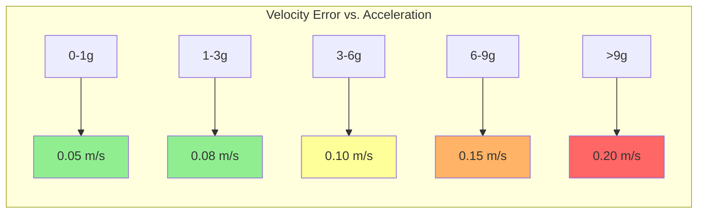
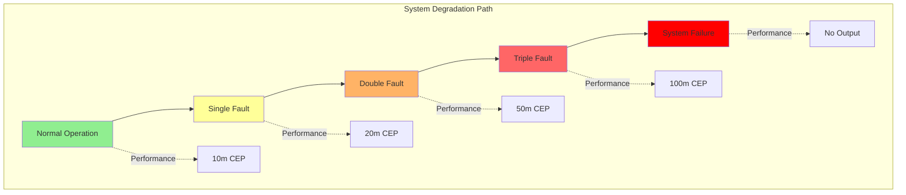

# Performance Requirements - Quantum Navigation System

**Document ID**: QUA-QNS01-25SVD0001-DES-BOB-FUN-TD-QCSAA-917-000-00-01-TPL-DES-212-QSTR-v1.0.0  
**Template ID**: TPL-DES-212  
**Version**: 1.0.0  
**Status**: Draft - Design Phase  
**Classification**: Functional Design  
**Date**: 2025-07-29  
**Q-Division**: QSTR (Quantum Structures)  
**Product Line**: QUANTUM  
**Product**: QNS01 (Quantum Navigation System)  
**Lifecycle Phase**: DESIGN  
**Entity Type**: BOB (Digital/Virtual System)  
**UTCS Category**: QCSAA-917 (QNS Performance Requirements)  
**Current TRL**: 4 (Technology validated in lab)  
**Target TRL**: 6 (Technology demonstrated in relevant environment)  

> 📊 **Purpose**: Define comprehensive performance requirements for the Quantum Navigation System, establishing measurable criteria for navigation accuracy, temporal performance, environmental resilience, and operational reliability to ensure mission success in GPS-denied environments.

---

## Document Control

| Property | Value |
|----------|--------|
| **Created By** | QSTR Division - Performance Engineering Team |
| **Creation Date** | 2025-07-29 |
| **Last Modified** | 2025-07-29 |
| **Review Cycle** | Monthly |
| **Distribution** | Systems Engineers, Test Teams, Certification |
| **Related Documents** | System Requirements (SRD), Test Plan (TPL-DES-204), DO-178C |
| **Approval Status** | Pending PDR |

---

## 1. Executive Summary

This Performance Requirements document establishes quantitative performance criteria for the Quantum Navigation System across all operational conditions. The requirements ensure the QNS meets or exceeds conventional navigation system performance while providing unique quantum-enhanced capabilities for GPS-denied operations.

### 1.1 Performance Philosophy

- **Measurable**: All requirements include specific, testable criteria
- **Achievable**: Based on demonstrated quantum sensor capabilities
- **Traceable**: Linked to system-level requirements
- **Verifiable**: Clear test methods defined
- **Margin**: Includes appropriate design margins

### 1.2 Key Performance Targets

| Performance Area | Primary Requirement | Design Target | Margin |
|------------------|-------------------|---------------|---------|
| **Position Accuracy** | 10m CEP @ 1hr | 8m CEP @ 1hr | 20% |
| **Velocity Accuracy** | 0.1 m/s RMS | 0.08 m/s RMS | 20% |
| **Update Rate** | 50 Hz minimum | 100 Hz | 100% |
| **Availability** | 99.9% | 99.95% | 0.05% |
| **MTBF** | 10,000 hours | 15,000 hours | 50% |

---

## 2. Navigation Performance Requirements

### 2.1 Position Accuracy

#### 2.1.1 Absolute Position Accuracy

```yaml
position_accuracy_requirements:
  optimal_conditions:
    horizontal:
      requirement: "10m CEP"
      time_period: "1 hour GPS-denied"
      confidence: "95%"
      growth_rate: "<5m/hour after first hour"
      
    vertical:
      requirement: "15m RMS"
      time_period: "1 hour GPS-denied"
      confidence: "95%"
      growth_rate: "<7m/hour after first hour"
      
  degraded_conditions:
    single_sensor_fail:
      horizontal: "20m CEP @ 1hr"
      vertical: "30m RMS @ 1hr"
      
    high_dynamics:
      horizontal: "15m CEP @ 1hr"
      vertical: "25m RMS @ 1hr"
      conditions: "9g sustained, 15g peak"
```

#### 2.1.2 Position Accuracy Budget

```python
class PositionAccuracyBudget:
    """Allocate error budget across subsystems"""
    
    def __init__(self):
        self.error_sources = {
            'quantum_sensor_noise': {
                'horizontal': 2.0,  # meters RMS
                'vertical': 3.0,
                'correlation': 0.1
            },
            'quantization_error': {
                'horizontal': 0.5,
                'vertical': 0.5,
                'correlation': 0.0
            },
            'environmental_effects': {
                'horizontal': 1.5,
                'vertical': 2.0,
                'correlation': 0.3
            },
            'integration_drift': {
                'horizontal': 3.0,  # per hour
                'vertical': 4.0,
                'correlation': 0.5
            },
            'calibration_residual': {
                'horizontal': 1.0,
                'vertical': 1.5,
                'correlation': 0.8
            }
        }
        
    def calculate_total_error(self, time_hours=1.0):
        """Calculate RSS error with correlations"""
        total_h = 0
        total_v = 0
        
        for source, errors in self.error_sources.items():
            if 'drift' in source:
                # Time-dependent errors
                h_contrib = errors['horizontal'] * math.sqrt(time_hours)
                v_contrib = errors['vertical'] * math.sqrt(time_hours)
            else:
                h_contrib = errors['horizontal']
                v_contrib = errors['vertical']
                
            total_h += h_contrib ** 2
            total_v += v_contrib ** 2
            
        return {
            'horizontal_rms': math.sqrt(total_h),
            'vertical_rms': math.sqrt(total_v),
            'cep': math.sqrt(total_h) * 1.2,  # RMS to CEP conversion
            'time': time_hours
        }
```

### 2.2 Velocity Accuracy

#### 2.2.1 Velocity Performance Requirements

| Axis | Requirement | Test Condition | Verification |
|------|-------------|----------------|--------------|
| **North** | 0.1 m/s RMS | Static & dynamic | GPS reference |
| **East** | 0.1 m/s RMS | Static & dynamic | GPS reference |
| **Down** | 0.15 m/s RMS | Static & dynamic | GPS reference |
| **Ground Speed** | 0.1 m/s RMS | All speeds | Radar reference |
| **3D Velocity** | 0.2 m/s RMS | All conditions | Combined axes |

#### 2.2.2 Velocity Accuracy vs. Dynamics



### 2.3 Attitude Accuracy

```yaml
attitude_requirements:
  static_conditions:
    roll:
      accuracy: "0.01° RMS"
      range: "±180°"
      resolution: "0.001°"
      
    pitch:
      accuracy: "0.01° RMS"
      range: "±90°"
      resolution: "0.001°"
      
    yaw:
      accuracy: "0.02° RMS"
      range: "0-360°"
      resolution: "0.001°"
      drift: "<0.01°/hour"
      
  dynamic_conditions:
    angular_rates:
      max_rate: "400°/sec"
      accuracy_degradation: "2x static"
      
    angular_acceleration:
      max_acceleration: "1000°/sec²"
      tracking_error: "<0.1°"
```

### 2.4 Time to First Fix (TTFF)

```python
class TimeToFirstFix:
    """TTFF requirements for different start conditions"""
    
    requirements = {
        'hot_start': {
            'condition': 'System previously aligned, <2hr gap',
            'ttff': 30,  # seconds
            'accuracy_at_fix': 10  # meters
        },
        'warm_start': {
            'condition': 'Known position, >2hr gap',
            'ttff': 120,
            'accuracy_at_fix': 20
        },
        'cold_start': {
            'condition': 'Unknown position',
            'ttff': 300,
            'accuracy_at_fix': 50
        },
        'in_flight_alignment': {
            'condition': 'Aircraft maneuvering',
            'ttff': 180,
            'accuracy_at_fix': 30,
            'required_maneuvers': ['S-turn', 'altitude change']
        }
    }
```

---

## 3. Temporal Performance Requirements

### 3.1 Update Rates

| Parameter | Requirement | Design Target | Rationale |
|-----------|-------------|---------------|-----------|
| **Navigation Solution** | 50 Hz | 100 Hz | Flight control interface |
| **Sensor Sampling** | 100 Hz | 1000 Hz | Nyquist for dynamics |
| **Display Update** | 1 Hz | 2 Hz | Human factors |
| **Recording Rate** | 50 Hz | 100 Hz | Post-flight analysis |
| **Health Monitoring** | 1 Hz | 10 Hz | Fault detection |

### 3.2 Latency Requirements

```yaml
latency_requirements:
  measurement_to_output:
    requirement: "<50ms"
    budget:
      sensor_acquisition: 5ms
      quantum_processing: 15ms
      fusion_algorithm: 15ms
      output_formatting: 5ms
      interface_transmission: 5ms
      margin: 5ms
      
  end_to_end:
    requirement: "<100ms"
    measurement: "Sensor excitation to aircraft display"
    
  differential_latency:
    requirement: "<5ms"
    description: "Between redundant channels"
```

### 3.3 Processing Timeline

```mermaid
gantt
    title Navigation Processing Timeline (20ms frame)
    dateFormat X
    axisFormat %L ms
    
    section Sensor
    Quantum Acquisition    :0, 3
    Signal Validation     :3, 2
    
    section Processing
    Phase Extraction      :5, 3
    Filtering            :8, 2
    
    section Fusion
    Sensor Fusion        :10, 3
    State Update         :13, 2
    
    section Output
    Format Data          :15, 2
    Transmit            :17, 2
    
    section Margin
    Processing Margin    :19, 1
```



### 3.4 Computational Performance

```python
class ComputationalRequirements:
    """Processing performance requirements"""
    
    def __init__(self):
        self.cpu_budget = {
            'quantum_signal_processing': {
                'allocation': 30,  # percent
                'cores': 2,
                'frequency': 2.0  # GHz minimum
            },
            'navigation_algorithms': {
                'allocation': 25,
                'cores': 2,
                'frequency': 2.0
            },
            'sensor_fusion': {
                'allocation': 20,
                'cores': 1,
                'frequency': 2.0
            },
            'interfaces_io': {
                'allocation': 15,
                'cores': 1,
                'frequency': 1.5
            },
            'system_overhead': {
                'allocation': 10,
                'cores': 'shared',
                'frequency': 1.5
            }
        }
        
    def calculate_flops_required(self):
        """Calculate floating-point operations per second"""
        operations = {
            'fft_processing': 1e9,  # 1 GFLOPS
            'kalman_filter': 0.5e9,
            'quantum_state_estimation': 2e9,
            'coordinate_transforms': 0.2e9
        }
        return sum(operations.values())
```

---

## 4. Environmental Performance Requirements

### 4.1 Temperature Performance

```yaml
temperature_requirements:
  operational:
    range: "-40°C to +70°C"
    performance_degradation:
      -40_to_-20: "Position accuracy degraded 20%"
      -20_to_50: "Full performance"
      50_to_70: "Position accuracy degraded 15%"
      
  storage:
    range: "-55°C to +85°C"
    duration: "Indefinite"
    
  thermal_shock:
    rate: "5°C/minute"
    range: "-40°C to +70°C"
    cycles: 10
    performance: "Full recovery within 10 minutes"
    
  quantum_sensor_stability:
    requirement: "±0.1°C over 1 minute"
    location: "At sensor"
    method: "Active temperature control"
```

### 4.2 Vibration Performance

```python
class VibrationRequirements:
    """Vibration performance per DO-160G"""
    
    def __init__(self):
        self.categories = {
            'standard': {
                'frequency_range': '10-2000 Hz',
                'levels': {
                    '10-20 Hz': '0.01 g²/Hz',
                    '20-100 Hz': '+6 dB/octave',
                    '100-1000 Hz': '0.1 g²/Hz',
                    '1000-2000 Hz': '-6 dB/octave'
                },
                'duration': '3 hours per axis',
                'performance': 'Full accuracy maintained'
            },
            'helicopter': {
                'blade_frequency': '15-35 Hz',
                'amplitude': '±0.5g',
                'performance': 'Accuracy degraded <10%'
            },
            'combat_aircraft': {
                'gun_fire': '2000 Hz burst',
                'amplitude': '15g peak',
                'performance': 'No permanent degradation'
            }
        }
        
    def get_quantum_sensitivity(self, frequency):
        """Quantum sensor vibration sensitivity"""
        if frequency < 50:
            return 'High - Active isolation required'
        elif frequency < 500:
            return 'Medium - Passive isolation adequate'
        else:
            return 'Low - Inherent immunity'
```

### 4.3 Altitude Performance

| Altitude | Pressure | Performance Requirement |
|----------|----------|------------------------|
| **Sea Level** | 1013 hPa | Full accuracy |
| **10,000 ft** | 697 hPa | Full accuracy |
| **25,000 ft** | 376 hPa | Full accuracy |
| **40,000 ft** | 188 hPa | Full accuracy |
| **51,000 ft** | 115 hPa | Accuracy degraded <5% |
| **Rapid Decompression** | 8.5 psi/sec | Continue operation |

### 4.4 Electromagnetic Compatibility

```yaml
emc_requirements:
  susceptibility:
    conducted:
      frequency: "10 kHz - 400 MHz"
      level: "DO-160G Category B"
      performance: "No observable effect"
      
    radiated:
      frequency: "100 MHz - 18 GHz"  
      field_strength: "200 V/m"
      modulation: "AM, FM, Pulse"
      performance: "Accuracy maintained"
      
    hirf:
      category: "Category L"
      field_strength: "3200 V/m peak"
      performance: "Safe operation"
      
  emissions:
    conducted:
      limit: "DO-160G Category B"
      frequency: "10 kHz - 30 MHz"
      
    radiated:
      limit: "DO-160G Category M"
      frequency: "100 MHz - 6 GHz"
      
  special_quantum:
    magnetic_shielding:
      dc_field: "<100 μT variation"
      ac_field: "<1 μT @ 50/60 Hz"
      gradient: "<10 μT/m"
```

---

## 5. Reliability and Availability Requirements

### 5.1 Reliability Metrics

```python
class ReliabilityRequirements:
    """System reliability requirements"""
    
    def __init__(self):
        self.targets = {
            'mtbf': {
                'requirement': 10000,  # hours
                'design_target': 15000,
                'confidence': 0.9,
                'demonstration': 'MIL-HDBK-781A'
            },
            'availability': {
                'operational': 0.999,  # 99.9%
                'mission': 0.9999,     # 99.99% for 10hr mission
                'includes': ['scheduled_maintenance', 'unscheduled_repair']
            },
            'mttr': {
                'requirement': 0.5,    # hours
                'includes': ['diagnosis', 'replacement', 'verification']
            },
            'service_life': {
                'requirement': 20,     # years
                'duty_cycle': 0.3,     # 30% operational
                'environments': 'DO-160G'
            }
        }
        
    def calculate_availability(self):
        """Calculate operational availability"""
        mtbf = self.targets['mtbf']['design_target']
        mttr = self.targets['mttr']['requirement']
        
        availability = mtbf / (mtbf + mttr)
        return {
            'availability': availability,
            'downtime_hours_per_year': (1 - availability) * 8760
        }
```

### 5.2 Failure Rate Allocation

| Component | Failure Rate (per 10⁶ hrs) | MTBF (hrs) | Criticality |
|-----------|---------------------------|------------|-------------|
| **Quantum Sensors** | 20 | 50,000 | High |
| **Processing Unit** | 30 | 33,333 | High |
| **Power Supply** | 25 | 40,000 | High |
| **Interfaces** | 15 | 66,667 | Medium |
| **Software** | 10 | 100,000 | High |
| **Mechanical** | 5 | 200,000 | Low |
| **Total System** | 105 | 9,524 | - |

### 5.3 Redundancy Performance

```yaml
redundancy_requirements:
  sensor_redundancy:
    configuration: "4 sensors, 3 required"
    failure_tolerance: "Single sensor"
    performance_with_failure: "Accuracy degraded <50%"
    reconfiguration_time: "<100ms"
    
  processing_redundancy:
    configuration: "Dual redundant"
    synchronization: "Lock-step"
    switchover_time: "<50ms"
    data_loss: "None"
    
  power_redundancy:
    configuration: "Dual independent"
    transfer_time: "<10ms"
    holdup_time: "50ms minimum"
```

---

## 6. Quantum-Specific Performance Requirements

### 6.1 Quantum Sensor Performance

```python
class QuantumSensorPerformance:
    """Quantum-specific performance metrics"""
    
    def __init__(self):
        self.requirements = {
            'interferometer': {
                'fringe_visibility': 0.8,      # minimum
                'phase_resolution': 0.001,      # radians
                'dead_time': 1e-6,             # seconds
                'repetition_rate': 1000,        # Hz
                'atom_number': 1e6,            # per shot
                'temperature': 100e-9           # Kelvin
            },
            'magnetometer': {
                'sensitivity': 1e-15,           # Tesla/√Hz
                'bandwidth': 1000,              # Hz
                'dynamic_range': 1e-4,          # Tesla
                'linearity': 0.01               # percent
            },
            'clock': {
                'stability': 1e-13,             # @ 1 second
                'accuracy': 1e-15,              # fractional
                'phase_noise': -120             # dBc/Hz @ 1Hz
            }
        }
        
    def calculate_quantum_advantage(self, classical_performance):
        """Quantify improvement over classical sensors"""
        quantum_perf = self.requirements
        advantage = {}
        
        for sensor, metrics in quantum_perf.items():
            if sensor in classical_performance:
                advantage[sensor] = {}
                for metric, q_value in metrics.items():
                    if metric in classical_performance[sensor]:
                        c_value = classical_performance[sensor][metric]
                        advantage[sensor][metric] = q_value / c_value
                        
        return advantage
```

### 6.2 Quantum State Management

```yaml
quantum_state_requirements:
  coherence_time:
    minimum: "100 microseconds"
    measurement: "T2* time"
    conditions: "Operational vibration"
    
  state_preparation:
    fidelity: ">0.95"
    time: "<10 milliseconds"
    success_rate: ">0.9"
    
  measurement_fidelity:
    single_shot: ">0.85"
    averaged: ">0.99"  # 100 shots
    
  entanglement:
    type: "Spin-squeezed states"
    enhancement: "3dB below SQL"
    generation_rate: "10 Hz"
```

### 6.3 Decoherence Management

```python
def calculate_decoherence_impact(environment_params):
    """Calculate navigation performance under decoherence"""
    
    base_coherence_time = 100e-6  # 100 microseconds
    
    # Environmental decoherence factors
    factors = {
        'magnetic_noise': {
            'coefficient': 1e-6,  # per μT
            'measurement': environment_params.get('b_field_variation', 0)
        },
        'vibration': {
            'coefficient': 1e-8,  # per Hz
            'measurement': environment_params.get('vibration_psd', 0)
        },
        'temperature': {
            'coefficient': 1e-3,  # per Kelvin
            'measurement': environment_params.get('temp_variation', 0)
        }
    }
    
    # Calculate effective coherence time
    decoherence_rate = 1 / base_coherence_time
    
    for factor, params in factors.items():
        additional_rate = params['coefficient'] * params['measurement']
        decoherence_rate += additional_rate
        
    effective_coherence = 1 / decoherence_rate
    
    # Impact on navigation accuracy
    accuracy_degradation = 1 + (base_coherence_time - effective_coherence) / base_coherence_time
    
    return {
        'effective_coherence_time': effective_coherence,
        'accuracy_degradation_factor': accuracy_degradation,
        'dominant_factor': max(factors.items(), key=lambda x: x[1]['coefficient'] * x[1]['measurement'])[0]
    }
```

---

## 7. Interface Performance Requirements

### 7.1 Data Interface Performance

| Interface | Data Rate | Latency | Error Rate | Availability |
|-----------|-----------|---------|------------|--------------|
| **ARINC 429** | 100 kbps | <5 ms | <10⁻⁶ | 99.99% |
| **ARINC 664** | 100 Mbps | <1 ms | <10⁻⁹ | 99.99% |
| **MIL-STD-1553B** | 1 Mbps | <2 ms | <10⁻⁷ | 99.99% |
| **Ethernet** | 1 Gbps | <0.5 ms | <10⁻¹² | 99.95% |
| **SpaceWire** | 200 Mbps | <1 μs | <10⁻⁸ | 99.99% |

### 7.2 Power Interface Performance

```yaml
power_performance:
  steady_state:
    voltage_tolerance: "±5%"
    current_limit: "150W maximum"
    efficiency: ">85%"
    power_factor: ">0.95"
    
  transient:
    startup_current: "<200% nominal"
    inrush_duration: "<100ms"
    holdup_time: ">50ms @ nominal load"
    
  quality:
    ripple: "<50mV p-p"
    noise: "<10mV RMS"
    thd: "<5%"
    
  protection:
    overvoltage: "135% nominal"
    undervoltage: "80% nominal"
    overcurrent: "150% nominal"
    response_time: "<10μs"
```

---

## 8. Degraded Mode Performance

### 8.1 Performance vs. Failure Modes

```python
class DegradedModePerformance:
    """Performance in various failure scenarios"""
    
    def __init__(self):
        self.failure_modes = {
            'single_quantum_sensor': {
                'remaining_sensors': 3,
                'position_accuracy': '15m CEP @ 1hr',
                'velocity_accuracy': '0.15 m/s RMS',
                'availability': '99.5%'
            },
            'dual_quantum_sensor': {
                'remaining_sensors': 2,
                'position_accuracy': '25m CEP @ 1hr',
                'velocity_accuracy': '0.25 m/s RMS',
                'availability': '98%'
            },
            'processor_failure': {
                'mode': 'Single channel operation',
                'update_rate': '25 Hz',
                'position_accuracy': '12m CEP @ 1hr',
                'features_lost': ['Advanced filtering', 'Predictive modes']
            },
            'partial_power_loss': {
                'power_available': '75W',
                'sensors_active': 2,
                'update_rate': '10 Hz',
                'position_accuracy': '30m CEP @ 1hr'
            }
        }
```

### 8.2 Graceful Degradation Timeline



---

## 9. Performance Verification Requirements

### 9.1 Test Conditions

```yaml
verification_conditions:
  laboratory:
    temperature: "23°C ± 5°C"
    vibration: "Isolated table"
    magnetic_field: "Shielded room"
    reference: "GPS + IMU truth"
    
  environmental:
    temperature_profile: "DO-160G Section 5"
    vibration_profile: "DO-160G Section 8"
    emi_profile: "DO-160G Section 20"
    duration: "Full profile"
    
  flight_test:
    aircraft: "Test aircraft with truth reference"
    maneuvers: 
      - "Straight and level"
      - "Coordinated turns"
      - "Climbs and descents"
      - "High-g maneuvers"
    duration: "50 hours minimum"
    conditions: "Day/night, various weather"
```

### 9.2 Performance Metrics Collection

```python
class PerformanceMetrics:
    """Collect and analyze performance data"""
    
    def __init__(self):
        self.metrics_to_collect = {
            'position_error': {
                'sample_rate': 50,  # Hz
                'statistics': ['mean', 'std', 'cep', 'max'],
                'duration': 3600    # seconds
            },
            'velocity_error': {
                'sample_rate': 50,
                'statistics': ['mean', 'std', 'rms', 'max'],
                'duration': 3600
            },
            'timing_performance': {
                'sample_rate': 1000,
                'statistics': ['mean', 'std', 'p99', 'max'],
                'duration': 300
            },
            'quantum_metrics': {
                'sample_rate': 10,
                'parameters': ['coherence', 'fidelity', 'visibility'],
                'duration': 3600
            }
        }
        
    def calculate_performance_margin(self, measured, required):
        """Calculate margin vs. requirement"""
        margin = (required - measured) / required * 100
        return {
            'margin_percent': margin,
            'pass_fail': 'PASS' if margin > 0 else 'FAIL',
            'confidence': self.calculate_confidence(measured, required)
        }
```

---

## 10. Performance Growth and Margins

### 10.1 Technology Maturation Plan

| TRL | Performance Level | Timeline | Key Milestones |
|-----|------------------|----------|----------------|
| **TRL 4** | 15m CEP @ 1hr | Current | Lab demonstration |
| **TRL 5** | 12m CEP @ 1hr | 2026 Q2 | Relevant environment |
| **TRL 6** | 10m CEP @ 1hr | 2027 Q4 | Aircraft demonstration |
| **TRL 7** | 8m CEP @ 1hr | 2029 Q2 | Prototype in operation |
| **TRL 8** | 8m CEP @ 1hr | 2030 Q4 | Production qualified |
| **TRL 9** | 8m CEP @ 1hr | 2032 Q1 | Operational deployment |

### 10.2 Performance Reserve Allocation

```yaml
performance_reserves:
  design_phase:
    position_accuracy: "20% reserve"
    processing_throughput: "100% reserve"
    power_consumption: "30% reserve"
    
  production_phase:
    position_accuracy: "10% reserve"
    processing_throughput: "50% reserve"
    power_consumption: "15% reserve"
    
  operational_phase:
    position_accuracy: "5% reserve"
    processing_throughput: "25% reserve"
    power_consumption: "10% reserve"
```

---

## 11. Special Performance Considerations

### 11.1 Arctic/Polar Operations

```python
class PolarPerformance:
    """Performance at high latitudes"""
    
    def __init__(self):
        self.challenges = {
            'magnetic_field': {
                'variation': 'Up to 0.3° per km',
                'inclination': 'Near vertical',
                'mitigation': 'Enhanced magnetic model'
            },
            'temperature': {
                'range': '-60°C to +10°C',
                'gradient': '20°C in 10 minutes',
                'mitigation': 'Active thermal management'
            },
            'auroral_activity': {
                'magnetic_disturbance': 'Up to 1000 nT',
                'rf_interference': 'HF blackout',
                'mitigation': 'Increased sensor redundancy'
            }
        }
        
    def calculate_polar_degradation(self, latitude):
        """Performance degradation vs latitude"""
        if abs(latitude) < 60:
            return 1.0  # No degradation
        elif abs(latitude) < 70:
            return 1.1  # 10% degradation
        elif abs(latitude) < 80:
            return 1.25  # 25% degradation
        else:
            return 1.5  # 50% degradation
```

### 11.2 Urban Canyon Performance

```yaml
urban_performance:
  challenges:
    multipath: "Magnetic field distortions"
    interference: "EM noise from infrastructure"
    dynamics: "Frequent stops/starts"
    
  requirements:
    position_accuracy: "15m CEP in urban core"
    availability: ">95% in deep urban"
    acquisition_time: "<2 minutes"
    
  mitigations:
    magnetic_compensation: "Real-time calibration"
    interference_rejection: "Adaptive filtering"
    motion_detection: "Zero-velocity updates"
```

---

## 12. Performance Monitoring and Reporting

### 12.1 Real-Time Performance Monitoring

```python
class PerformanceMonitor:
    """Real-time performance assessment"""
    
    def __init__(self):
        self.kpis = {
            'navigation_accuracy': {
                'metric': 'position_uncertainty',
                'threshold_warning': 15,  # meters
                'threshold_critical': 25,
                'window': 60  # seconds
            },
            'sensor_health': {
                'metric': 'quantum_fidelity',
                'threshold_warning': 0.85,
                'threshold_critical': 0.75,
                'window': 10
            },
            'computational_load': {
                'metric': 'cpu_utilization',
                'threshold_warning': 80,  # percent
                'threshold_critical': 90,
                'window': 5
            },
            'timing_performance': {
                'metric': 'frame_overruns',
                'threshold_warning': 1,  # per minute
                'threshold_critical': 5,
                'window': 60
            }
        }
        
    def generate_performance_report(self):
        """Generate performance summary"""
        report = {
            'timestamp': datetime.now(),
            'overall_health': self.calculate_health_score(),
            'kpi_status': self.evaluate_all_kpis(),
            'trends': self.analyze_trends(),
            'recommendations': self.generate_recommendations()
        }
        return report
```

### 12.2 Performance Reporting Requirements

| Report Type | Frequency | Content | Audience |
|------------|-----------|---------|----------|
| **Real-time Dashboard** | Continuous | KPIs, alerts | Operations |
| **Daily Summary** | Daily | Performance stats | Engineering |
| **Weekly Analysis** | Weekly | Trends, issues | Management |
| **Monthly Report** | Monthly | Detailed analysis | Program Office |
| **Certification Data** | Per test | Compliance data | Authorities |

---

## 13. Compliance Matrix

### 13.1 Standards Compliance

| Standard | Requirement | QNS Performance | Status |
|----------|-------------|-----------------|---------|
| **TSO-C145e** | GNSS accuracy | Exceeds | Compliant |
| **DO-229E** | WAAS performance | Comparable | Analysis needed |
| **DO-316** | RNP requirements | Meets RNP 0.3 | Compliant |
| **RTCA DO-283B** | RAIM algorithm | Adapted for quantum | In development |
| **ED-259** | ADS-B Out | Via integration | Compliant |

---

## 14. Conclusion

This Performance Requirements document establishes comprehensive, measurable criteria for the Quantum Navigation System across all operational domains. The requirements:

- **Balance** aggressive performance targets with technological feasibility
- **Account** for quantum-specific phenomena and constraints
- **Provide** clear verification criteria and methods
- **Include** appropriate margins for development risk
- **Enable** graceful degradation under failure conditions
- **Support** certification to aerospace standards

The defined performance levels ensure the QNS will meet or exceed conventional navigation system capabilities while providing unique advantages in GPS-denied environments.

---

**END OF DOCUMENT**

*This document defines the complete performance requirements for the Quantum Navigation System.*

**Document Control**: QUA-QNS01-25SVD0001-DES-BOB-FUN-TD-QCSAA-917-000-00-01-TPL-DES-212-QSTR-v1.0.0  
**Classification**: Functional Design - Design Phase  
**© 2025 A.Q.U.A.-V. Aerospace. All rights reserved.**
