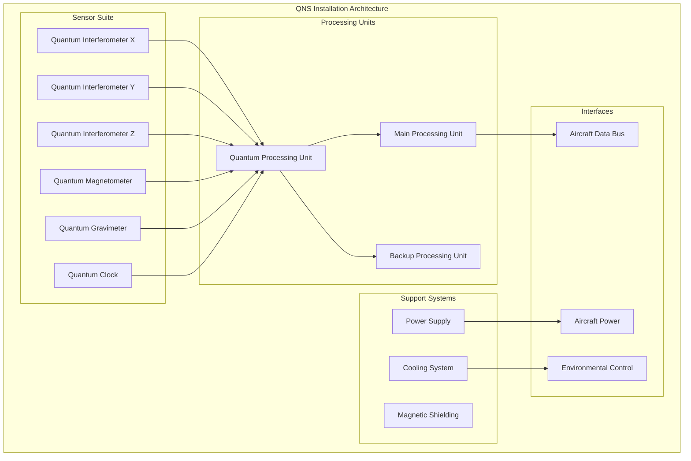
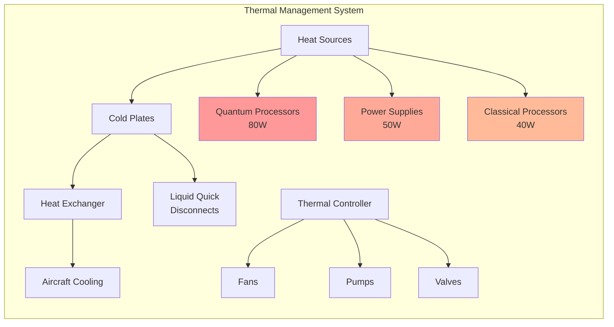
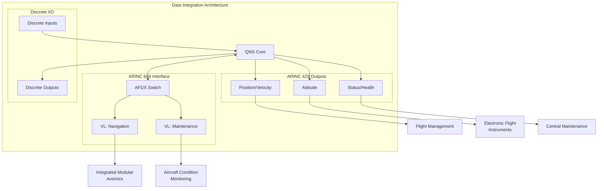
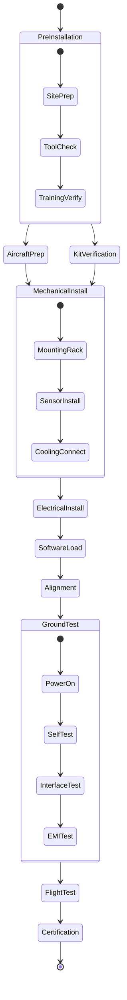
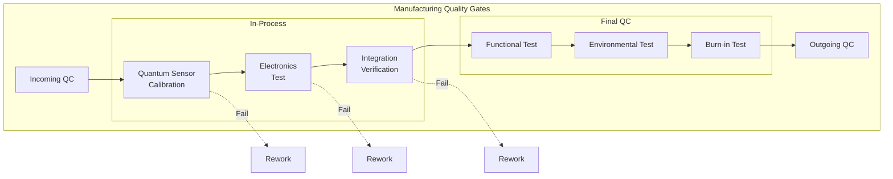
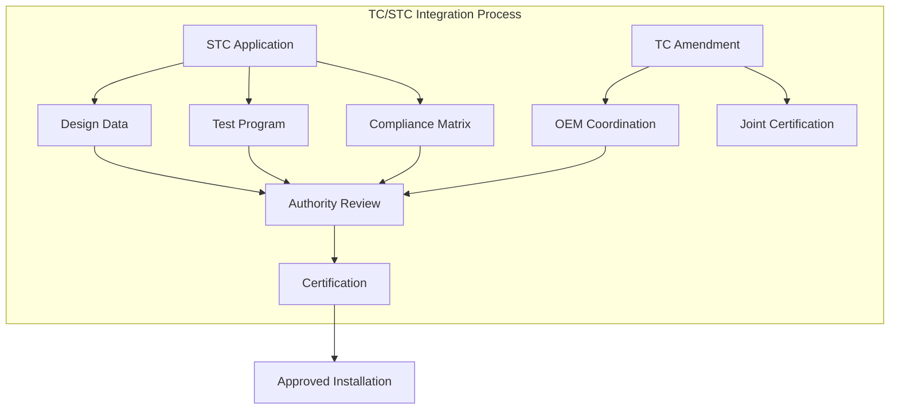
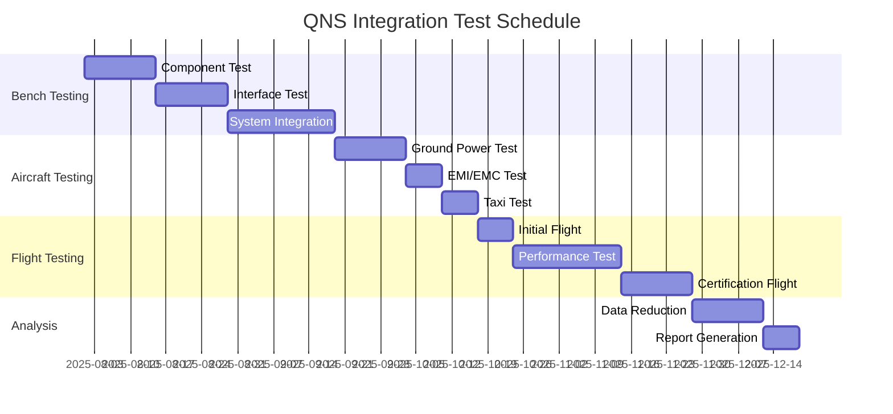

# System Integration Plan - Quantum Navigation System

**Document ID**: QUA-QNS01-25SVD0001-DES-BOB-IND-TD-QCSAA-918-000-00-01-TPL-DES-220-QIND-v1.0.0  
**Template ID**: TPL-DES-220  
**Version**: 1.0.0  
**Status**: Draft - Design Phase  
**Classification**: Industrial Design  
**Date**: 2025-07-29  
**Q-Division**: QIND (Quantum Industry)  
**Product Line**: QUANTUM  
**Product**: QNS01 (Quantum Navigation System)  
**Lifecycle Phase**: DESIGN  
**Entity Type**: BOB (Digital/Virtual System)  
**UTCS Category**: QCSAA-918 (QNS Integration)  
**Current TRL**: 4 (Technology validated in lab)  
**Target TRL**: 6 (Technology demonstrated in relevant environment)  

> 🔧 **Purpose**: Define the comprehensive integration strategy for the Quantum Navigation System into aircraft platforms, covering physical installation, system interfaces, manufacturing processes, and certification pathways to ensure seamless deployment across the AQUA V. fleet.

---

## Document Control

| Property | Value |
|----------|--------|
| **Created By** | QIND Division - Systems Integration Team |
| **Creation Date** | 2025-07-29 |
| **Last Modified** | 2025-07-29 |
| **Review Cycle** | Monthly |
| **Distribution** | Integration Engineers, Aircraft OEMs, Certification |
| **Related Documents** | ICD (TPL-DES-202), Installation Manual, ATA 34 |
| **Approval Status** | Pending PDR |

---

## 1. Executive Summary

This System Integration Plan defines the strategy, processes, and requirements for integrating the Quantum Navigation System into various aircraft platforms. The plan addresses physical installation, electrical and data interfaces, cooling requirements, certification considerations, and the industrial processes required for manufacturing and deployment.

### 1.1 Integration Philosophy

- **Modular Architecture**: Enable platform-agnostic installation
- **Minimal Modification**: Reduce aircraft changes required
- **Federated Design**: Maintain independence from critical systems
- **Future-Proof**: Support technology upgrades without re-certification
- **Standard Compliance**: Meet all aerospace integration standards

### 1.2 Key Integration Challenges

| Challenge | Impact | Mitigation Strategy |
|-----------|--------|-------------------|
| **Quantum Sensor Environment** | High | Magnetic shielding, vibration isolation |
| **Cooling Requirements** | Medium | Integrated thermal management |
| **Power Demands** | Medium | Efficient power architecture |
| **Certification Path** | High | Incremental approval strategy |
| **Retrofit Complexity** | Medium | Standardized installation kits |

---

## 2. Aircraft Platform Integration

### 2.1 Target Aircraft Platforms

```yaml
platform_categories:
  commercial_aviation:
    - large_commercial:
        examples: ["A350", "B787", "AMPEL360"]
        integration_level: "Full IRS replacement"
        certification: "TSO-C201b"
        
    - regional_jets:
        examples: ["E2", "A220"]
        integration_level: "Supplemental navigation"
        certification: "TSO-C196b"
        
    - business_jets:
        examples: ["G650", "Global 7500"]
        integration_level: "Enhanced navigation"
        certification: "TSO-C145e"
        
  military_aviation:
    - transport:
        examples: ["A400M", "C-130J"]
        integration_level: "Primary navigation"
        certification: "MIL-STD"
        
    - combat:
        examples: ["F-35", "Eurofighter"]
        integration_level: "GPS-denied ops"
        certification: "Classified"
        
  urban_air_mobility:
    - evtol:
        examples: ["AMPEL360City"]
        integration_level: "Primary navigation"
        certification: "SC-VTOL"
```

### 2.2 Installation Locations

```python
class InstallationLocations:
    """Standard installation positions by aircraft type"""
    
    def __init__(self):
        self.locations = {
            'nose_avionics_bay': {
                'aircraft': ['Commercial jets', 'Business jets'],
                'advantages': ['Close to antennas', 'Easy access'],
                'challenges': ['Limited space', 'High temperature'],
                'cooling': 'Forced air',
                'typical_volume': '10 MCU'  # Modular Concept Units
            },
            'main_avionics_bay': {
                'aircraft': ['Large commercial', 'Military transport'],
                'advantages': ['Ample space', 'Good cooling'],
                'challenges': ['Long cable runs', 'EMI'],
                'cooling': 'Liquid cooled',
                'typical_volume': '20 MCU'
            },
            'aft_equipment_bay': {
                'aircraft': ['Regional jets', 'eVTOL'],
                'advantages': ['Vibration isolated', 'Dedicated space'],
                'challenges': ['Access limited', 'Weight distribution'],
                'cooling': 'Conduction',
                'typical_volume': '5 MCU'
            },
            'distributed_installation': {
                'aircraft': ['Combat aircraft', 'UAV'],
                'advantages': ['Optimized placement', 'Redundancy'],
                'challenges': ['Complex integration', 'Multiple interfaces'],
                'cooling': 'Mixed',
                'typical_volume': '15 MCU total'
            }
        }
```

### 2.3 Physical Installation Architecture



---

## 3. Mechanical Integration

### 3.1 Mounting Requirements

```yaml
mounting_specifications:
  standard_rack:
    form_factor: "ARINC 600"
    dimensions:
      width: "194.5 mm (7.62 in)"
      height: "194.5 mm (7.62 in)"
      depth: "variable MCU"
    weight:
      1_mcu: "7.5 kg max"
      2_mcu: "15 kg max"
      4_mcu: "30 kg max"
    cooling: "ARINC 600 forced air"
    connectors: "Rear panel"
    
  custom_installation:
    quantum_sensor_unit:
      dimensions: "400 x 400 x 600 mm"
      weight: "45 kg"
      mounting: "Vibration isolated platform"
      orientation: "Critical ±0.1°"
      access: "Front and top"
      
    processing_unit:
      dimensions: "ARINC 600 2MCU"
      weight: "12 kg"
      mounting: "Standard tray"
      cooling: "Forced air + liquid"
```

### 3.2 Vibration Isolation Design

```python
class VibrationIsolation:
    """Vibration isolation system design"""
    
    def __init__(self):
        self.requirements = {
            'frequency_range': '5-2000 Hz',
            'isolation_target': {
                '5-20 Hz': '20 dB',
                '20-100 Hz': '30 dB',
                '100-500 Hz': '40 dB',
                '500-2000 Hz': '35 dB'
            },
            'max_displacement': '±5 mm',
            'temperature_range': '-40 to +70°C'
        }
        
    def calculate_isolator_parameters(self, sensor_mass):
        """Calculate isolation system parameters"""
        
        # Natural frequency target
        fn_target = 3.0  # Hz - below aircraft frequencies
        
        # Spring constant
        k = (2 * math.pi * fn_target) ** 2 * sensor_mass
        
        # Damping ratio
        zeta = 0.1  # 10% for good isolation
        
        # Damping coefficient
        c = 2 * zeta * math.sqrt(k * sensor_mass)
        
        return {
            'spring_constant': k,
            'damping_coefficient': c,
            'natural_frequency': fn_target,
            'isolator_type': self.select_isolator_type(k, sensor_mass)
        }
        
    def select_isolator_type(self, k, mass):
        """Select appropriate isolator technology"""
        if mass < 10:
            return 'Elastomeric mounts'
        elif mass < 50:
            return 'Wire rope isolators'
        else:
            return 'Active isolation system'
```

### 3.3 Thermal Management



### 3.4 Environmental Protection

```yaml
environmental_sealing:
  enclosure_rating: "IP65"
  
  sealing_methods:
    static_seals:
      material: "Fluorosilicone"
      temperature: "-65 to +200°C"
      compression: "20-30%"
      
    dynamic_seals:
      type: "Spring-energized PTFE"
      pressure: "0.5 to 1.5 atm"
      leakage: "<0.1 sccm"
      
    connector_seals:
      type: "Interfacial"
      rating: "IP67"
      material: "Silicone rubber"
      
  pressure_relief:
    type: "Bidirectional valve"
    cracking_pressure: "±2 psi"
    flow_rate: "10 scfm @ 3 psi"
```

---

## 4. Electrical Integration

### 4.1 Power Architecture

```python
class PowerIntegration:
    """Aircraft power integration design"""
    
    def __init__(self):
        self.power_sources = {
            'primary_28vdc': {
                'voltage_range': '22-29 VDC',
                'current_max': '10A',
                'protection': 'Circuit breaker',
                'quality': 'MIL-STD-704F'
            },
            'backup_28vdc': {
                'voltage_range': '22-29 VDC',
                'current_max': '10A',
                'protection': 'Circuit breaker',
                'source': 'Essential bus'
            },
            'ac_power_115vac': {
                'voltage_range': '108-118 VAC',
                'frequency': '360-800 Hz',
                'current_max': '5A',
                'phases': 3,
                'use': 'Cooling system'
            }
        }
        
    def calculate_power_budget(self):
        """Total power consumption budget"""
        
        loads = {
            'quantum_sensors': 80,    # Watts
            'processing': 40,
            'cooling': 30,
            'interfaces': 20,
            'losses': 15
        }
        
        total = sum(loads.values())
        margin = total * 0.25  # 25% margin
        
        return {
            'nominal_power': total,
            'peak_power': total * 1.5,
            'with_margin': total + margin,
            'efficiency': 0.85
        }
```

### 4.2 Grounding Scheme

```yaml
grounding_architecture:
  signal_ground:
    type: "Single point"
    impedance: "<0.1 ohm to chassis"
    isolation: ">1 Mohm from power ground"
    
  power_ground:
    type: "Chassis ground"
    connection: "Direct to aircraft structure"
    resistance: "<2.5 milliohm"
    
  shield_ground:
    type: "360° termination"
    method: "Backshell clamps"
    coverage: ">85%"
    
  quantum_sensor_ground:
    type: "Isolated ground plane"
    coupling: "AC coupled to chassis"
    frequency: ">10 Hz coupling"
    dc_isolation: ">10 Mohm"
```

### 4.3 EMI/EMC Design

```python
class EMIControl:
    """EMI/EMC control measures"""
    
    def __init__(self):
        self.shielding = {
            'enclosure': {
                'material': 'Aluminum 6061-T6',
                'thickness': '3mm minimum',
                'effectiveness': '60 dB @ 1 GHz',
                'finish': 'Chromate conversion'
            },
            'cable_shields': {
                'type': 'Double braid + foil',
                'coverage': '>95%',
                'transfer_impedance': '<5 mohm/m @ 10 MHz'
            },
            'gaskets': {
                'material': 'Be-Cu fingerstock',
                'compression': '20-30%',
                'resistance': '<10 mohm/inch'
            }
        }
        
    def calculate_filter_requirements(self, frequency, required_attenuation):
        """Calculate EMI filter specifications"""
        
        # Simple first-order filter calculation
        if frequency < 1e6:  # Below 1 MHz
            filter_type = 'Common mode choke'
            inductance = required_attenuation / (40 * math.log10(frequency / 1000))
        else:  # Above 1 MHz
            filter_type = 'Pi-filter'
            capacitance = required_attenuation / (40 * math.log10(frequency / 1e6))
            
        return {
            'filter_type': filter_type,
            'attenuation': f'{required_attenuation} dB @ {frequency/1e6} MHz',
            'insertion_loss': '<0.5 dB @ DC',
            'current_rating': '10A'
        }
```

---

## 5. Data Integration

### 5.1 Aircraft Data Bus Integration



### 5.2 Data Mapping

```python
class DataMapping:
    """Map QNS data to aircraft systems"""
    
    def __init__(self):
        self.arinc429_labels = {
            # Navigation data
            '310': {'data': 'latitude', 'units': 'degrees', 'rate': '50Hz'},
            '311': {'data': 'longitude', 'units': 'degrees', 'rate': '50Hz'},
            '312': {'data': 'altitude', 'units': 'feet', 'rate': '50Hz'},
            '313': {'data': 'ground_speed', 'units': 'knots', 'rate': '10Hz'},
            '314': {'data': 'track_angle', 'units': 'degrees', 'rate': '10Hz'},
            
            # Attitude data
            '324': {'data': 'pitch', 'units': 'degrees', 'rate': '50Hz'},
            '325': {'data': 'roll', 'units': 'degrees', 'rate': '50Hz'},
            '326': {'data': 'yaw', 'units': 'degrees', 'rate': '50Hz'},
            
            # Status
            '350': {'data': 'system_status', 'units': 'discrete', 'rate': '1Hz'},
            '351': {'data': 'failure_warning', 'units': 'discrete', 'rate': 'event'}
        }
        
    def map_to_afdx(self, qns_data):
        """Map to ARINC 664 message format"""
        
        afdx_message = {
            'message_id': 'QNS_NAV_DATA',
            'version': 1,
            'timestamp': qns_data['timestamp'],
            'navigation': {
                'position': {
                    'latitude': qns_data['latitude'],
                    'longitude': qns_data['longitude'],
                    'altitude': qns_data['altitude'],
                    'accuracy': qns_data['position_accuracy']
                },
                'velocity': {
                    'north': qns_data['velocity_n'],
                    'east': qns_data['velocity_e'],
                    'down': qns_data['velocity_d'],
                    'accuracy': qns_data['velocity_accuracy']
                },
                'attitude': {
                    'roll': qns_data['roll'],
                    'pitch': qns_data['pitch'],
                    'yaw': qns_data['yaw'],
                    'accuracy': qns_data['attitude_accuracy']
                }
            },
            'integrity': {
                'solution_type': qns_data['solution_mode'],
                'sensor_count': qns_data['active_sensors'],
                'quality_factor': qns_data['quality_metric']
            }
        }
        
        return afdx_message
```

### 5.3 System Integration Interfaces

```yaml
integration_interfaces:
  flight_management_system:
    interface_type: "ARINC 429"
    data_provided:
      - "Present position"
      - "Ground speed/track"
      - "Wind estimates"
    data_received:
      - "Flight plan"
      - "Waypoints"
    update_rate: "1-50 Hz"
    
  autopilot:
    interface_type: "ARINC 429 + Analog"
    data_provided:
      - "Attitude angles"
      - "Angular rates"
      - "Linear accelerations"
    latency: "<20 ms"
    accuracy: "Per DO-178C Level B"
    
  efis_displays:
    interface_type: "ARINC 429"
    data_provided:
      - "Navigation solution"
      - "System status"
      - "Failure flags"
    graphics_support: "Via symbol generator"
    
  maintenance_system:
    interface_type: "ARINC 664 (AFDX)"
    data_provided:
      - "Health monitoring"
      - "Fault logs"
      - "Performance metrics"
    data_rate: "10 Mbps virtual link"
```

---

## 6. Installation Process

### 6.1 Installation Workflow



### 6.2 Installation Kit Contents

```python
class InstallationKit:
    """Standard installation kit components"""
    
    def __init__(self, aircraft_type):
        self.base_kit = {
            'mounting_hardware': {
                'trays': self.get_tray_count(aircraft_type),
                'isolators': 12,
                'brackets': 8,
                'fasteners': 'MS/NAS standard set'
            },
            'electrical_components': {
                'wire_harnesses': self.get_harness_set(aircraft_type),
                'connectors': 'Pre-terminated set',
                'circuit_breakers': 4,
                'grounding_straps': 6
            },
            'cooling_components': {
                'ducts': 'Custom per aircraft',
                'quick_disconnects': 4,
                'coolant': '2 liters',
                'insulation': 'As required'
            },
            'tools_special': {
                'alignment_fixture': 1,
                'torque_adapters': 'Set of 5',
                'extraction_tool': 1,
                'test_harness': 1
            },
            'consumables': {
                'sealant': 'PR-1776 (100g)',
                'thermal_paste': 'TC-5026 (50g)',
                'lock_wire': '0.032" SS (100ft)',
                'cable_ties': 'Assorted (100)'
            }
        }
        
    def get_tray_count(self, aircraft_type):
        """Determine tray count by aircraft"""
        tray_configs = {
            'large_commercial': 4,
            'regional_jet': 2,
            'business_jet': 2,
            'military_transport': 4,
            'evtol': 1
        }
        return tray_configs.get(aircraft_type, 2)
```

### 6.3 Installation Time Estimates

```yaml
installation_schedule:
  preparation:
    documentation_review: "4 hours"
    tool_preparation: "2 hours"
    aircraft_preparation: "4 hours"
    
  mechanical_installation:
    rack_installation: "6 hours"
    sensor_mounting: "8 hours"
    cooling_system: "4 hours"
    
  electrical_installation:
    power_wiring: "8 hours"
    data_bus_wiring: "12 hours"
    grounding: "4 hours"
    
  software_configuration:
    software_load: "2 hours"
    configuration: "4 hours"
    database_update: "1 hour"
    
  testing:
    ground_testing: "8 hours"
    emi_testing: "4 hours"
    flight_testing: "20 hours"
    
  total_estimated: "91 hours"
  calendar_time: "2-3 weeks"
  crew_size: "3-4 technicians"
```

---

## 7. Manufacturing Integration

### 7.1 Production Line Integration

```python
class ProductionIntegration:
    """Manufacturing line integration requirements"""
    
    def __init__(self):
        self.assembly_stations = {
            'quantum_sensor_assembly': {
                'cleanroom_class': 'ISO 7',
                'temperature': '20±2°C',
                'humidity': '45±10%',
                'equipment': [
                    'Optical alignment stage',
                    'Vacuum chamber',
                    'Magnetic shield assembly'
                ],
                'cycle_time': '8 hours'
            },
            'electronics_assembly': {
                'esd_class': 'ANSI/ESD S20.20',
                'equipment': [
                    'SMT line',
                    'Selective solder',
                    'Conformal coating'
                ],
                'cycle_time': '4 hours'
            },
            'system_integration': {
                'test_equipment': [
                    'Environmental chamber',
                    'Vibration table',
                    'EMI chamber'
                ],
                'cycle_time': '12 hours'
            },
            'final_test': {
                'equipment': [
                    'GPS simulator',
                    'Motion table',
                    'Reference IMU'
                ],
                'cycle_time': '6 hours'
            }
        }
```

### 7.2 Quality Control Points



### 7.3 Supply Chain Integration

```yaml
supply_chain_requirements:
  critical_components:
    quantum_sensors:
      supplier: "AQUA Quantum Division"
      lead_time: "16 weeks"
      minimum_order: "10 units"
      quality_level: "Aerospace Grade"
      
    processors:
      supplier: "Multiple qualified"
      lead_time: "12 weeks"
      alternates: "Pre-qualified"
      inventory: "6 months buffer"
      
    optical_components:
      supplier: "Specialty vendors"
      lead_time: "20 weeks"
      inspection: "100% incoming"
      traceability: "Full genealogy"
      
  inventory_strategy:
    raw_materials: "6 months"
    wip_buffer: "2 weeks"
    finished_goods: "1 month"
    service_parts: "10% of install base"
```

---

## 8. Certification Integration

### 8.1 Certification Strategy

```python
class CertificationPath:
    """Phased certification approach"""
    
    def __init__(self):
        self.phases = {
            'phase_1_supplemental': {
                'designation': 'TSO-C196b',
                'functionality': 'Supplemental navigation',
                'timeline': '18 months',
                'complexity': 'Medium',
                'aircraft': ['Part 23', 'Part 25 retrofit']
            },
            'phase_2_primary': {
                'designation': 'TSO-C201b',
                'functionality': 'Primary navigation',
                'timeline': '24 months',
                'complexity': 'High',
                'aircraft': ['Part 25 forward fit']
            },
            'phase_3_sole_means': {
                'designation': 'New TSO-CXXX',
                'functionality': 'Sole means navigation',
                'timeline': '36 months',
                'complexity': 'Very High',
                'aircraft': ['NextGen aircraft']
            }
        }
        
    def get_certification_data(self, phase):
        """Required certification data"""
        
        base_data = {
            'design_data': [
                'System architecture',
                'Safety assessment',
                'Interface control',
                'Software plans'
            ],
            'test_data': [
                'Environmental qualification',
                'EMI/EMC testing',
                'Performance validation',
                'Failure mode testing'
            ],
            'analysis': [
                'FMEA',
                'Reliability prediction',
                'Thermal analysis',
                'Structural analysis'
            ]
        }
        
        if 'primary' in phase:
            base_data['additional'] = [
                'Fault tree analysis',
                'Common mode analysis',
                'Zonal safety analysis'
            ]
            
        return base_data
```

### 8.2 Type Certificate Integration



### 8.3 Compliance Matrix

```yaml
compliance_demonstration:
  part_25_requirements:
    "25.1301":
      title: "Function and installation"
      method: "Test + Analysis"
      status: "In progress"
      
    "25.1309":
      title: "Equipment systems and installations"
      method: "Analysis + Inspection"
      status: "Planned"
      
    "25.1316":
      title: "Electrical and electronic system lightning protection"
      method: "Test"
      status: "Planned"
      
    "25.1322":
      title: "Flightcrew alerting"
      method: "Demonstration"
      status: "In progress"
      
  special_conditions:
    quantum_technology:
      title: "Quantum sensor airworthiness"
      method: "Special test program"
      authority: "Joint EASA/FAA"
      
    software_assurance:
      standard: "DO-178C + DO-331"
      level: "DAL-B"
      supplements: "Model-based, OOT"
```

---

## 9. Support Equipment Integration

### 9.1 Ground Support Equipment

```python
class GroundSupportEquipment:
    """GSE requirements for QNS"""
    
    def __init__(self):
        self.equipment = {
            'qns_test_set': {
                'function': 'Comprehensive system test',
                'interfaces': ['ARINC 429', 'ARINC 664', 'Discrete'],
                'capabilities': [
                    'Automated test sequences',
                    'Fault injection',
                    'Performance measurement',
                    'Data recording'
                ],
                'portability': 'Flightline cart'
            },
            'quantum_calibrator': {
                'function': 'Sensor calibration',
                'requirements': [
                    'Magnetic shielding',
                    'Temperature control',
                    'Vibration isolation',
                    'Reference standards'
                ],
                'accuracy': '10x better than QNS'
            },
            'alignment_fixture': {
                'function': 'Mechanical alignment',
                'accuracy': '0.01 degrees',
                'reference': 'Aircraft datum',
                'interface': 'Optical/mechanical'
            }
        }
```

### 9.2 Maintenance Equipment

```yaml
maintenance_equipment:
  standard_tools:
    - multimeter: "Fluke 87V or equivalent"
    - oscilloscope: "4-channel, 1GHz minimum"
    - bit_error_tester: "ARINC 429/664 capable"
    - torque_wrench: "Calibrated set"
    
  specialized_tools:
    - quantum_state_analyzer:
        function: "Verify quantum coherence"
        connection: "Fiber optic"
        
    - magnetic_field_mapper:
        range: "±100 μT"
        resolution: "1 nT"
        
    - thermal_imager:
        range: "-40 to +150°C"
        resolution: "0.1°C"
        
  software_tools:
    - diagnostic_suite:
        platform: "Windows/Linux"
        connection: "Ethernet"
        features: ["Real-time monitoring", "Data logging", "Fault analysis"]
        
    - configuration_tool:
        function: "Aircraft-specific setup"
        security: "Role-based access"
```

---

## 10. Integration Testing

### 10.1 Integration Test Plan



### 10.2 Test Procedures

```python
class IntegrationTestProcedures:
    """Comprehensive integration testing"""
    
    def __init__(self):
        self.test_categories = {
            'power_on_test': {
                'duration': '2 hours',
                'checks': [
                    'Voltage levels',
                    'Current draw',
                    'Power sequencing',
                    'Thermal stability'
                ],
                'pass_criteria': 'All parameters within limits'
            },
            'interface_validation': {
                'duration': '8 hours',
                'interfaces': [
                    'ARINC 429 label verification',
                    'ARINC 664 message validation',
                    'Discrete I/O functionality',
                    'Timing requirements'
                ],
                'tools': ['Bus analyzer', 'Logic analyzer']
            },
            'functional_test': {
                'duration': '4 hours',
                'scenarios': [
                    'Normal operation',
                    'Single sensor failure',
                    'Power interruption',
                    'Data bus failure'
                ],
                'verification': 'Compare to simulation'
            },
            'environmental_test': {
                'duration': '24 hours',
                'conditions': [
                    'Temperature cycle',
                    'Vibration profile',
                    'EMI exposure',
                    'Pressure variation'
                ],
                'monitoring': 'Continuous performance'
            }
        }
```

### 10.3 Acceptance Criteria

```yaml
acceptance_criteria:
  functional_performance:
    navigation_accuracy:
      requirement: "10m CEP @ 1hr"
      measured: "TBD"
      margin: ">20%"
      
    update_rate:
      requirement: "50 Hz"
      measured: "TBD"
      margin: "0%"
      
    availability:
      requirement: "99.9%"
      measured: "TBD"
      margin: ">0.05%"
      
  interface_compatibility:
    arinc_429:
      errors: "0"
      data_rate: "100%"
      
    arinc_664:
      packet_loss: "<0.01%"
      latency: "<1ms"
      
  environmental_compliance:
    temperature:
      tested_range: "-40 to +70°C"
      performance: "Within spec"
      
    vibration:
      profile: "DO-160G Cat B"
      result: "Pass"
      
    emi_emc:
      emissions: "Below limits"
      susceptibility: "No effect"
```

---

## 11. Risk Management

### 11.1 Integration Risks

```python
class IntegrationRisks:
    """Risk assessment and mitigation"""
    
    def __init__(self):
        self.risks = {
            'magnetic_interference': {
                'probability': 'Medium',
                'impact': 'High',
                'detection': 'Pre-installation survey',
                'mitigation': [
                    'Enhanced shielding',
                    'Relocation options',
                    'Active compensation'
                ]
            },
            'cooling_inadequacy': {
                'probability': 'Low',
                'impact': 'Medium',
                'detection': 'Thermal analysis',
                'mitigation': [
                    'Supplemental cooling',
                    'Power derating',
                    'Enhanced heat sinks'
                ]
            },
            'software_incompatibility': {
                'probability': 'Medium',
                'impact': 'Medium',
                'detection': 'Interface testing',
                'mitigation': [
                    'Wrapper functions',
                    'Protocol conversion',
                    'Firmware updates'
                ]
            },
            'certification_delay': {
                'probability': 'Medium',
                'impact': 'High',
                'detection': 'Regular reviews',
                'mitigation': [
                    'Early authority engagement',
                    'Phased approach',
                    'Precedent documentation'
                ]
            }
        }
        
    def calculate_risk_score(self, probability, impact):
        """Calculate risk priority number"""
        
        prob_scores = {'Low': 1, 'Medium': 3, 'High': 5}
        impact_scores = {'Low': 1, 'Medium': 3, 'High': 5}
        
        return prob_scores[probability] * impact_scores[impact]
```

### 11.2 Contingency Planning

```yaml
contingency_plans:
  technical_issues:
    integration_failure:
      detection: "Ground testing"
      primary_action: "Troubleshoot interfaces"
      fallback: "Simulator mode operation"
      
    performance_shortfall:
      detection: "Flight testing"
      primary_action: "Algorithm optimization"
      fallback: "Reduced capability mode"
      
  schedule_issues:
    component_delay:
      detection: "Supply chain monitoring"
      primary_action: "Expedite shipping"
      fallback: "Alternative suppliers"
      
    test_failure:
      detection: "Test execution"
      primary_action: "Root cause analysis"
      fallback: "Retest with modifications"
      
  regulatory_issues:
    certification_finding:
      detection: "Authority review"
      primary_action: "Design modification"
      fallback: "Operational limitation"
```

---

## 12. Conclusion

This System Integration Plan provides a comprehensive framework for successfully integrating the Quantum Navigation System into various aircraft platforms. The plan addresses:

- **Physical Integration** with detailed mounting and environmental considerations
- **Electrical Integration** ensuring power quality and EMI compliance  
- **Data Integration** with full aircraft system compatibility
- **Manufacturing Integration** for efficient production
- **Certification Integration** with phased approval strategy
- **Risk Management** with proactive mitigation strategies

The modular approach and standardized interfaces enable platform-agnostic deployment while maintaining the stringent requirements of aerospace applications. Through careful execution of this plan, the QNS will achieve seamless integration across the AQUA V. fleet and broader aviation market.

---

**END OF DOCUMENT**

*This plan ensures successful integration of the Quantum Navigation System across all platforms.*

**Document Control**: QUA-QNS01-25SVD0001-DES-BOB-IND-TD-QCSAA-918-000-00-01-TPL-DES-220-QIND-v1.0.0  
**Classification**: Industrial Design - Design Phase  
**© 2025 A.Q.U.A.-V. Aerospace. All rights reserved.**
