# QUA-QNS01-25SVD0001-DES-BOB-IND-TD-QCSAA-918-000-00-01-TPL-DES-221-QIND-v1.0.0

## Quantum Navigation System (QNS) - Aircraft Integration Design Document

**Document Classification:** Industrial Artifact - Technical Document  
**Q-Division:** QIND-Industry  
**Template:** TPL-DES-220  
**Status:** Design Phase - Digital Twin (BOB)  
**Version:** 1.0.0  
**Date:** 2025-07-29  
**TRL:** 6 (Flight Testing)

---

## Executive Summary

This document defines the integration architecture and implementation requirements for the Quantum Navigation System (QNS) within the AMPEL360 aircraft family. The QNS provides GPS-denied navigation capabilities through quantum sensing technologies, enabling unprecedented navigation accuracy and resilience. This design covers the digital twin (BOB) specifications for system integration, interface requirements, and certification pathways.

## 1. System Overview

### 1.1 QNS Core Capabilities
- **Primary Function:** GPS-independent navigation using quantum gravitometry and magnetometry
- **Accuracy:** Position error < 10m after 24 hours without external reference
- **Update Rate:** 100 Hz navigation solution
- **Operating Environment:** -55°C to +70°C, up to FL600
- **Power Consumption:** 850W nominal, 1200W peak
- **MTBF:** > 50,000 flight hours

### 1.2 Integration Scope
This design covers QNS integration into:
- BWB-Q100 (Primary platform)
- BWB-Q250 (Enhanced configuration)
- AMPEL360e (Hybrid-electric variant)
- AMPEL360 Plus (Suborbital configuration)

## 2. System Architecture

### 2.1 QNS Subsystem Components

### 2.2 Physical Architecture

**Primary Installation Zone:** Forward avionics bay
- **Volume Required:** 0.8m³ (main unit) + 0.2m³ (remote sensors)
- **Weight:** 145 kg (complete system)
- **Cooling:** Liquid cooling interface required (heat dissipation: 1.2kW max)

**Remote Sensor Locations:**
1. QGR-F1: Forward fuselage station FS120
2. QGR-A1: Aft fuselage station FS680
3. QMG-W1/W2: Wing stations WS250 (left/right)

## 3. Interface Specifications

### 3.1 Electrical Interfaces

| Interface | Type | Protocol | Data Rate | Function |
|-----------|------|----------|-----------|----------|
| FMS-QNS-01 | ARINC 825 | CAN | 1 Mbps | Primary navigation data |
| AP-QNS-01 | MIL-STD-1553B | Dual redundant | 1 Mbps | Autopilot integration |
| DIS-QNS-01 | Ethernet | TSN | 1 Gbps | Display system feed |
| PWR-QNS-01 | 28VDC | N/A | 45A max | Primary power |
| PWR-QNS-02 | 115VAC 400Hz | 3-phase | 10A max | Auxiliary power |

### 3.2 Data Interface Requirements

**Navigation Data Output (ARINC 825):**
- Position (lat/long/alt): 100 Hz
- Velocity (3-axis): 100 Hz
- Attitude (roll/pitch/yaw): 100 Hz
- System status: 10 Hz
- Quantum confidence metrics: 10 Hz

**Input Requirements:**
- Air data (static/dynamic pressure): 50 Hz
- Inertial reference (backup): 50 Hz
- Temperature sensors: 1 Hz
- Aircraft configuration: On change

### 3.3 Mechanical Interfaces

**Mounting Requirements:**
- Vibration isolation: > 30 dB @ 100-2000 Hz
- Shock mounts: 15g operational, 30g crash safety
- Thermal interface: Liquid cooling plate (cold plate spec: QNS-CP-001)
- EMI shielding: > 60 dB @ 1-40 GHz

## 4. Integration Requirements

### 4.1 Installation Sequence

1. **Pre-Installation Phase**
   - Avionics bay preparation
   - Cooling system modification
   - Cable routing preparation
   - EMI shield verification

2. **Core Installation**
   - Mount vibration isolation system
   - Install QNS core unit
   - Connect liquid cooling
   - Initial power-on test

3. **Sensor Installation**
   - Install remote quantum sensors
   - Verify magnetic cleanliness < 50 nT
   - Calibrate sensor alignment
   - Validate quantum entanglement

4. **System Integration**
   - Connect all data buses
   - Load aircraft-specific configuration
   - Perform interface verification
   - Execute built-in test (BIT)

### 4.2 Aircraft Modifications

**Structural Modifications:**
- Avionics bay floor reinforcement (SRM ref: QNS-STR-001)
- Sensor mounting provisions (4 locations)
- Additional cable raceways

**Systems Modifications:**
- Enhanced cooling capacity (+1.5kW)
- Dedicated 28VDC bus (45A circuit breaker)
- FMS software update (v12.0-QNS)
- Display format modifications

## 5. Performance Specifications

### 5.1 Navigation Performance

| Parameter | Specification | Test Method |
|-----------|--------------|-------------|
| Position Accuracy (GPS denied) | < 10m @ 24hr | Chamber test + flight test |
| Velocity Accuracy | < 0.1 m/s | Laser interferometer |
| Heading Accuracy | < 0.05° | Optical reference |
| Initialization Time | < 15 minutes | Cold start test |
| Reacquisition Time | < 30 seconds | Interruption test |

### 5.2 Environmental Performance

| Condition | Requirement | Standard |
|-----------|------------|----------|
| Temperature | -55°C to +70°C | DO-160G Section 4 |
| Altitude | Sea level to FL600 | DO-160G Section 4 |
| Vibration | Category S (Severe) | DO-160G Section 8 |
| EMI | Category L | DO-160G Section 21 |
| Lightning | Level 3 | DO-160G Section 22 |

## 6. Validation & Testing

### 6.1 Ground Testing Protocol

**Phase 1: Component Testing**
- Quantum sensor characterization
- Interface protocol verification
- Power consumption profiling
- Thermal cycling (-55°C to +70°C)

**Phase 2: System Integration Testing**
- Hardware-in-loop simulation
- Full aircraft mockup testing
- EMI/EMC compliance
- Failure mode validation

**Phase 3: Digital Twin Validation**
- ALI-BOB synchronization
- Real-time performance modeling
- Predictive maintenance algorithms
- Quantum decoherence modeling

### 6.2 Flight Test Campaign

**Test Aircraft:** AMPEL360e Prototype (MSN: 25MAP0001)

**Flight Test Phases:**
1. **Phase A:** Basic functionality (20 flights)
   - System activation and initialization
   - Nominal operation verification
   - Data recording and analysis

2. **Phase B:** Performance envelope (30 flights)
   - Full flight envelope exploration
   - Extended GPS-denied operation
   - Extreme attitude maneuvers

3. **Phase C:** Failure modes (15 flights)
   - Simulated sensor failures
   - Power interruption testing
   - Backup mode operation

4. **Phase D:** Certification (25 flights)
   - Show compliance flights
   - Demonstrated reliability
   - Final performance validation

## 7. Certification Strategy

### 7.1 Regulatory Framework

**Primary Certification Basis:**
- EASA CS-25 Amendment 27
- Special Condition: Quantum Navigation Systems (SC-QNS-001)
- FAA AC 20-138D (GPS Equipment)
- RTCA DO-229E (GNSS Equipment)

### 7.2 Means of Compliance

| Requirement | MoC | Evidence |
|-------------|-----|----------|
| Navigation accuracy | Flight test | FTR-QNS-001 through 050 |
| System reliability | Analysis + Test | FMEA + 5000hr operation |
| Software assurance | DO-178C DAL B | Full lifecycle data |
| Quantum safety | Special evaluation | Quantum safety assessment |

### 7.3 Certification Timeline

**Key Milestones Summary:**

| Phase | Period | Key Activities | Duration | Status |
|-------|--------|----------------|----------|---------|
| **Planning** | 2025 Q3-Q4 | Certification plan development & approval | 6 months | ✅ In Progress |
| **Ground Testing** | 2026 Q1-Q2 | Component & system testing, EMI/EMC | 6 months | 🔄 Planned |
| **Flight Testing** | 2027 Full Year | 90 flight test campaign (4 phases) | 12 months | 🔄 Planned |
| **Certification** | 2028 Q1-Q2 | Final review & type certification | 6 months | 🔄 Planned |
| **Production** | 2028 Q3-Q4 | Production approval & ramp-up | 6 months | 🔄 Planned |

**Critical Path Items:**
- 🔴 **Certification Plan Approval** - October 2025
- 🔴 **Ground Test Completion** - June 2026  
- 🔴 **Flight Test Start** - January 2027
- 🔴 **Type Certification** - June 2028
- 🔴 **First Delivery** - December 2028
- **2026 Q2:** Ground test completion
- **2027 Q1:** Flight test start
- **2028 Q2:** Type certification
- **2028 Q4:** Production approval

## 8. Risk Management

### 8.1 Technical Risks

| Risk | Probability | Impact | Mitigation |
|------|-------------|--------|------------|
| Quantum decoherence in flight | Medium | High | Enhanced shielding + active compensation |
| Integration complexity | High | Medium | Incremental integration + digital twin |
| Cooling system capacity | Low | Medium | Pre-validated thermal solution |
| EMI interference | Medium | High | Dedicated EMI test campaign |

### 8.2 Program Risks

| Risk | Probability | Impact | Mitigation |
|------|-------------|--------|------------|
| Certification delay | Medium | High | Early authority engagement |
| Supply chain (quantum components) | Medium | Medium | Dual sourcing strategy |
| Technology maturation | Low | High | Parallel development paths |

### Risk Assessment Matrix

```mermaid
%%{init: {'theme':'neutral', 'themeVariables': {'primaryTextColor':'#000', 'fontFamily':'Arial, sans-serif'}}}%%
flowchart TB
    subgraph "Risk Matrix - QNS Integration Program"
        subgraph "Critical Risks [High Impact]"
            R1[Quantum Decoherence<br/>Probability: Medium<br/>Impact: High<br/>Score: 6]
            R2[EMI Interference<br/>Probability: Medium<br/>Impact: High<br/>Score: 6]
            R3[Certification Delay<br/>Probability: Medium<br/>Impact: High<br/>Score: 6]
            R4[Technology Maturation<br/>Probability: Low<br/>Impact: High<br/>Score: 3]
        end
        
        subgraph "Moderate Risks [Medium Impact]"
            R5[Integration Complexity<br/>Probability: High<br/>Impact: Medium<br/>Score: 6]
            R6[Supply Chain<br/>Probability: Medium<br/>Impact: Medium<br/>Score: 4]
            R7[Cooling Capacity<br/>Probability: Low<br/>Impact: Medium<br/>Score: 2]
        end
    end
    
    %% Risk scoring legend
    subgraph "Risk Scoring"
        L1[Score = Probability × Impact<br/>Low=1, Medium=2, High=3]
    end
    
    %% Styling
    classDef critical fill:#ffcdd2,stroke:#d32f2f,stroke-width:3px,color:#000
    classDef moderate fill:#ffe0b2,stroke:#f57c00,stroke-width:2px,color:#000
    classDef legend fill:#f5f5f5,stroke:#666,stroke-width:1px,color:#000
    
    class R1,R2,R3,R4 critical
    class R5,R6,R7 moderate
    class L1 legend
```

**Risk Prioritization Table:**

| Priority | Risk | Probability | Impact | Risk Score | Action Required |
|----------|------|-------------|--------|------------|-----------------|
| 1 | Quantum Decoherence | Medium (2) | High (3) | 6 | Enhanced shielding + active compensation |
| 1 | EMI Interference | Medium (2) | High (3) | 6 | Dedicated EMI test campaign |
| 1 | Certification Delay | Medium (2) | High (3) | 6 | Early authority engagement |
| 1 | Integration Complexity | High (3) | Medium (2) | 6 | Incremental integration + digital twin |
| 2 | Supply Chain | Medium (2) | Medium (2) | 4 | Dual sourcing strategy |
| 3 | Technology Maturation | Low (1) | High (3) | 3 | Parallel development paths |
| 4 | Cooling Capacity | Low (1) | Medium (2) | 2 | Pre-validated thermal solution |

### Risk Mitigation Strategy Overview

## 9. Configuration Management

### 9.1 Baseline Configuration

**Hardware Configuration:**
- QNS Core Unit: P/N QNS-100-001 Rev C
- Remote Sensors: P/N QGR-200-001 Rev B
- Interface Unit: P/N QIF-300-001 Rev D

**Software Configuration:**
- Navigation Software: v3.2.0
- Quantum Processing: v2.8.1
- Interface Management: v4.1.0

### 9.2 Change Control

All changes must be processed through:
- AQUA V. Configuration Control Board (CCB)
- Impact assessment on ALI-BOB synchronization
- Full regression testing requirement
- Certification impact evaluation

## 10. Production Readiness

### 10.1 Manufacturing Requirements

**Production Facility:** Silicon Valley (SV)
- Clean room: ISO Class 5 for quantum assemblies
- Calibration facility: Quantum state preparation
- Test equipment: Quantum state analyzers

**Production Rate Capability:**
- Initial: 2 units/month
- Full rate: 10 units/month (2030)
- Surge capacity: 15 units/month

### 10.2 Quality Assurance

**Manufacturing Quality Plan:**
- 100% quantum sensor calibration
- Burn-in testing (168 hours)
- Acceptance test procedure (ATP)
- First article inspection (FAI)

## 11. Support & Maintenance

### 11.1 Maintenance Concept

**Line Maintenance:**
- Built-in test (BIT): < 5 minutes
- Fault isolation: > 95% accuracy
- No adjustment required
- LRU replacement only

**Base Maintenance:**
- Quantum sensor recalibration: 5000 FH
- Software updates: As required
- Deep system diagnostic: Annual

### 11.2 Spares Philosophy

**Recommended Spares (per 10 aircraft):**
- QNS Core Units: 1
- Remote Sensors: 2 sets
- Interface Units: 1
- Cables/Connectors: 1 set

## 12. Conclusion

The QNS integration into AMPEL360 aircraft represents a revolutionary advancement in navigation capability. This design ensures seamless integration while maintaining the highest safety and performance standards. The digital twin (BOB) architecture enables continuous optimization and predictive maintenance throughout the system lifecycle.

---

**Document Control:**
- Author: QIND Integration Team
- Review: QSTR-Structures, QAIR-Aerodynamics
- Approval: Chief Technology Officer
- Next Review: 2025-08-30

**Related Documents:**
- QNS System Specification: QUA-QNS01-00-SYS-001
- Installation Manual: QUA-QNS01-00-MAN-001
- Interface Control Document: QUA-QNS01-00-ICD-001
- Certification Plan: QUA-QNS01-00-CERT-001

---

*This document is part of the AQUA V. Quantum Aerospace Program*  
*© 2025 AQUA V. - Aerospace and Quantum United Advanced Venture*
