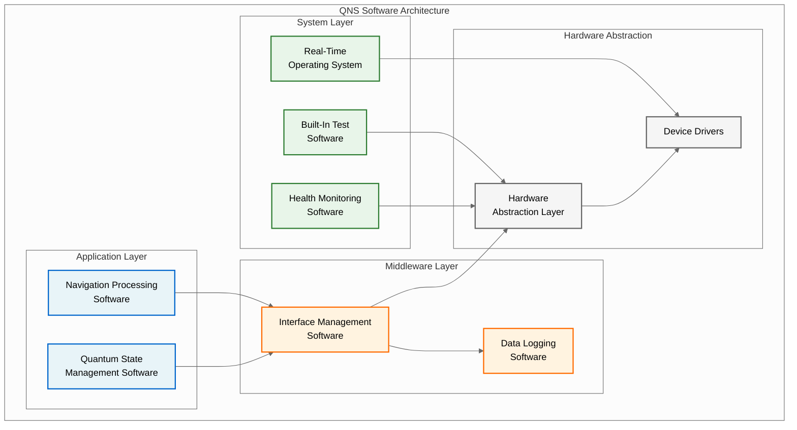
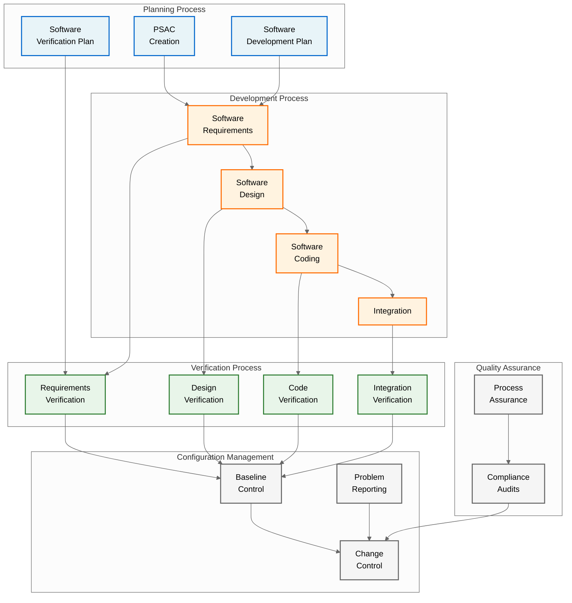
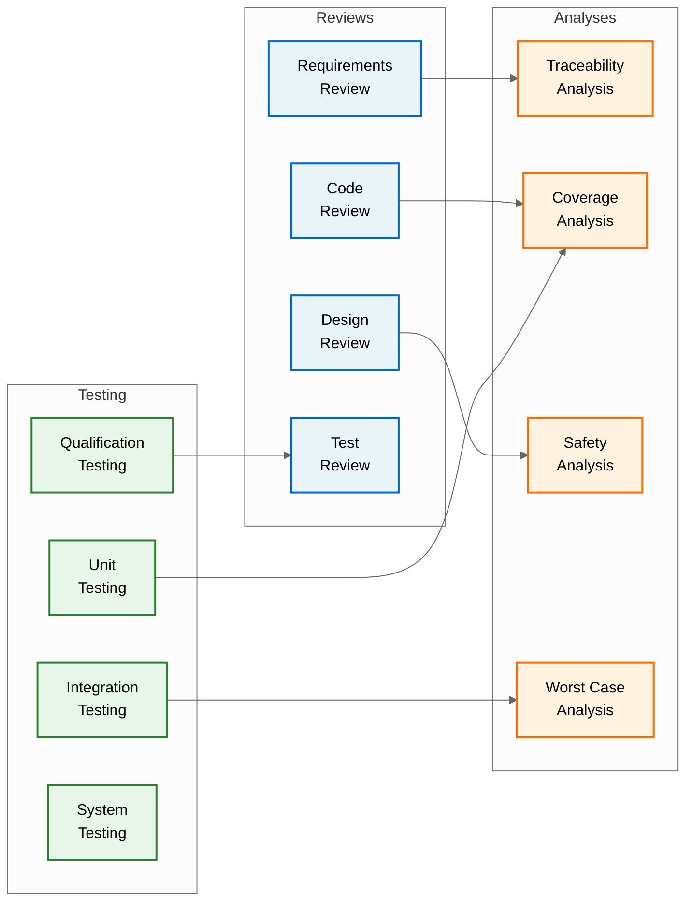
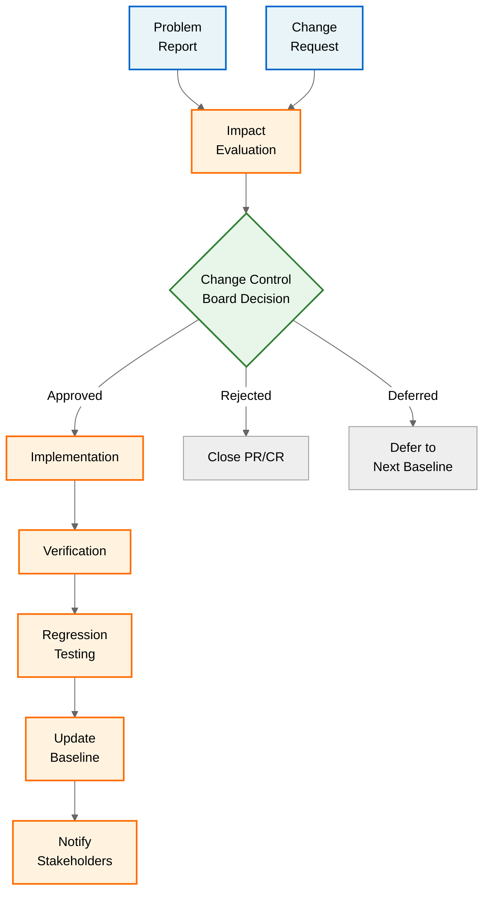

# QUA-QNS01-25SVD0001-DES-BOB-REG-TD-QCSAA-910-001-00-01-TPL-DES-230-QSTR-v1.0.1

## DO-178C Software Compliance Plan - Quantum Navigation System

**Document Classification:** Regulatory Artifact - Technical Document  
**Q-Division:** QSTR-Structures  
**Template:** TPL-DES-230  
**Status:** Design Phase - Digital Twin (BOB)  
**Version:** 1.0.1  
**Date:** 2025-07-29  
**TRL:** 6 (System/subsystem model or prototype demonstration in relevant environment)  
**Compliance Standard:** DO-178C / ED-12C

---

## Executive Summary

This DO-178C Compliance Plan defines the software development, verification, and certification approach for the Quantum Navigation System (QNS) software components. The QNS software is classified as **Design Assurance Level B (DAL-B)** based on its safety assessment, requiring comprehensive lifecycle processes and independence in verification activities. This plan ensures compliance with DO-178C objectives and establishes the framework for software certification as part of the AMPEL360 aircraft type certification.

## Revision History

| Version | Date | Description | Author |
|---------|------|-------------|--------|
| 1.0.0 | 2025-07-29 | Initial release | QSTR Team |
| 1.0.1 | 2025-07-29 | Corrected DAL assignment for quantum state control (Major→Hazardous); Added TRL column to component table | QSTR Team |

## 1. Introduction

### 1.1 Purpose
This document establishes the compliance approach for QNS software development in accordance with DO-178C "Software Considerations in Airborne Systems and Equipment Certification" and its supplements:
- DO-330: Software Tool Qualification Considerations
- DO-331: Model-Based Development and Verification
- DO-332: Object-Oriented Technology
- DO-333: Formal Methods

### 1.2 Scope
This plan covers all software components within the QNS:
- Navigation Processing Software (NPS)
- Quantum State Management Software (QSMS)
- Interface Management Software (IMS)
- Built-In Test Software (BITS)
- Health Monitoring Software (HMS)

### 1.3 Document Organization
- Section 2: System Overview
- Section 3: Software Level Determination
- Section 4: Compliance Planning
- Section 5: Software Lifecycle Processes
- Section 6: Verification & Validation
- Section 7: Configuration Management
- Section 8: Quality Assurance
- Section 9: Certification Liaison
- Section 10: Compliance Matrices
- Section 11: Schedule Integration
- Section 12: Risk Management
- Section 13: Conclusion
- Section 14: Document Reference Matrix

### 1.4 Document Reference Convention
Throughout this plan, all referenced documents use the complete AQUA V. nomenclature system as defined in Annex D. Generic document references (e.g., "SRD", "SDD") are mapped to specific AQUA V. documents in Section 14.

## 2. System Overview

### 2.1 QNS Software Architecture

### 2.2 Software Components Description

| Component | Function | Criticality | Size (KSLOC) | Reference Document | TRL |
|-----------|----------|-------------|--------------|-------------------|-----|
| NPS | Navigation solution computation | DAL-B | 150 | [QUA-QNS01-25SVD0001-DES-BOB-TEC-TD-QCSAA-914-000-00-01-TPL-DES-204-QSTR-v1.0.1](/A.Q.U.A.-V./PRODUCT_LINES/QUANTUM/QUANTUM_SOFTWARE/DESIGN/QNS_NAVIGATION/DES_TECHNICAL/QUA-QNS01-25SVD0001-DES-BOB-TEC-TD-QCSAA-914-000-00-01-TPL-DES-204-QSTR-v1.0.1.md) | 6 |
| QSMS | Quantum sensor state control | DAL-B | 80 | [QUA-QPU01-25SVD0004-DES-BOB-TEC-SM-QCSAA-901-000-00-01-TPL-DES-281-QHPC-v1.0.0.py](/A.Q.U.A.-V./PRODUCT_LINES/QUANTUM/QUANTUM_SOFTWARE/DESIGN/QPU_PROCESSING/DES_TECHNICAL/QUA-QPU01-25SVD0004-DES-BOB-TEC-SM-QCSAA-901-000-00-01-TPL-DES-281-QHPC-v1.0.0.py) | 6 |
| IMS | Aircraft interface management | DAL-B | 50 | [QUA-QNS01-25SVD0001-DES-BOB-TEC-TD-QCSAA-912-000-00-01-TPL-DES-202-QSTR-v1.0.0](/A.Q.U.A.-V./PRODUCT_LINES/QUANTUM/QUANTUM_SOFTWARE/DESIGN/QNS_NAVIGATION/DES_TECHNICAL/QUA-QNS01-25SVD0001-DES-BOB-TEC-TD-QCSAA-912-000-00-01-TPL-DES-202-QSTR-v1.0.0.md) | 6 |
| BITS | System self-test execution | DAL-C | 30 | [QUA-QDS01-25SVD0002-DES-BOB-TEC-SM-QCSAA-921-000-00-01-TPL-DES-241-QSTR-v1.0.0.py](/A.Q.U.A.-V./PRODUCT_LINES/QUANTUM/QUANTUM_SOFTWARE/DESIGN/QDS_DIAGNOSTIC/DES_TECHNICAL/QUA-QDS01-25SVD0002-DES-BOB-TEC-SM-QCSAA-921-000-00-01-TPL-DES-241-QSTR-v1.0.0.py) | 5 |
| HMS | Health status monitoring | DAL-C | 25 | [QUA-QSM01-25SVD0003-DES-BOB-TEC-TD-QCSAA-930-000-00-01-TPL-DES-260-QSTR-v1.0.0](/A.Q.U.A.-V./PRODUCT_LINES/QUANTUM/QUANTUM_SOFTWARE/DESIGN/QSM_STRUCTURAL/DES_TECHNICAL/QUA-QSM01-25SVD0003-DES-BOB-TEC-TD-QCSAA-930-000-00-01-TPL-DES-260-QSTR-v1.0.0.md) | 5 |
| HAL | Hardware abstraction | DAL-B | 40 | [QUA-COM01-25SVD0011-DES-BOB-TEC-TD-DTCEC-301-000-00-01-TPL-DES-501-QDAT-v1.0.0](/A.Q.U.A.-V./PRODUCT_LINES/QUANTUM/COMMON_SYSTEMS/DESIGN/COM_INTEGRATION/DES_TECHNICAL/QUA-COM01-25SVD0011-DES-BOB-TEC-TD-DTCEC-301-000-00-01-TPL-DES-501-QDAT-v1.0.0.md) | 6 |
| **Total** | | | **375 KSLOC** | | |

## 3. Software Level Determination

### 3.1 Failure Condition Analysis

Based on the Aircraft Level Functional Hazard Assessment (FHA):

| Failure Condition | Classification | Software Level |
|-------------------|----------------|----------------|
| Total loss of QNS function | Hazardous | DAL-B |
| Erroneous navigation output | Hazardous | DAL-B |
| Loss of quantum state control | Hazardous | DAL-B |
| BIT false failure indication | Minor | DAL-D |

### 3.2 Software Level Assignment

**Primary Software Components (DAL-B):**
- Navigation Processing Software
- Quantum State Management Software
- Interface Management Software
- Hardware Abstraction Layer

**Supporting Software Components (DAL-C):**
- Built-In Test Software
- Health Monitoring Software

**DAL-B Assignment Rationale:**
The loss of quantum state control has been classified as Hazardous (DAL-B) based on the following safety analysis:
- Loss of quantum state coherence directly impacts navigation accuracy
- Degraded quantum states can produce erroneous position outputs
- In GPS-denied environments, this constitutes the primary navigation source
- Undetected quantum state degradation could lead to Controlled Flight Into Terrain (CFIT)

Therefore, all software components critical to quantum state management and navigation processing are assigned DAL-B to ensure the highest level of design assurance for these safety-critical functions.

### 3.3 Independence Requirements

For DAL-B software:
- **Verification Independence:** Required for all reviews and analyses
- **Tool Qualification:** Required for verification tools (DO-330)
- **Configuration Management:** Independent audit required

## 4. Compliance Planning

### 4.1 Applicable Standards and Guidance

| Standard | Title | Application |
|----------|-------|-------------|
| DO-178C | Software Considerations in Airborne Systems | Primary compliance |
| DO-331 | Model-Based Development and Verification | QSMS model verification |
| DO-332 | Object-Oriented Technology | C++ implementation |
| ARP-4754A | Development of Civil Aircraft and Systems | System integration |
| DO-254 | Design Assurance for Airborne Electronic Hardware | HW/SW interface |

### 4.2 Planning Documents

| Document | DO-178C Reference | Status | AQUA V. Document ID |
|----------|-------------------|--------|---------------------|
| Plan for Software Aspects of Certification (PSAC) | 11.1 | Released | [QUA-QNS01-25SVD0001-DES-BOB-REG-TD-QCSAA-910-003-00-01-TPL-DES-232-QSTR-v1.0.0](/A.Q.U.A.-V./PRODUCT_LINES/QUANTUM/QUANTUM_SOFTWARE/DESIGN/QNS_NAVIGATION/DES_REGULATORY/QUA-QNS01-25SVD0001-DES-BOB-REG-TD-QCSAA-910-003-00-01-TPL-DES-232-QSTR-v1.0.0.md) |
| Software Development Plan (SDP) | 11.2 | Released | [QUA-QNS01-25SVD0001-DES-BOB-REG-TD-QCSAA-910-004-00-01-TPL-DES-233-QSTR-v1.0.0](/A.Q.U.A.-V./PRODUCT_LINES/QUANTUM/QUANTUM_SOFTWARE/DESIGN/QNS_NAVIGATION/DES_REGULATORY/QUA-QNS01-25SVD0001-DES-BOB-REG-TD-QCSAA-910-004-00-01-TPL-DES-233-QSTR-v1.0.0.md) |
| Software Verification Plan (SVP) | 11.3 | Released | [QUA-QNS01-25SVD0001-DES-BOB-REG-TD-QCSAA-910-005-00-01-TPL-DES-234-QSTR-v1.0.0](/A.Q.U.A.-V./PRODUCT_LINES/QUANTUM/QUANTUM_SOFTWARE/DESIGN/QNS_NAVIGATION/DES_REGULATORY/QUA-QNS01-25SVD0001-DES-BOB-REG-TD-QCSAA-910-005-00-01-TPL-DES-234-QSTR-v1.0.0.md) |
| Software Configuration Management Plan (SCMP) | 11.4 | Released | [QUA-QNS01-25SVD0001-DES-BOB-REG-TD-QCSAA-910-006-00-01-TPL-DES-235-QSTR-v1.0.0](/A.Q.U.A.-V./PRODUCT_LINES/QUANTUM/QUANTUM_SOFTWARE/DESIGN/QNS_NAVIGATION/DES_REGULATORY/QUA-QNS01-25SVD0001-DES-BOB-REG-TD-QCSAA-910-006-00-01-TPL-DES-235-QSTR-v1.0.0.md) |
| Software Quality Assurance Plan (SQAP) | 11.5 | Released | [QUA-QNS01-25SVD0001-DES-BOB-REG-TD-QCSAA-910-007-00-01-TPL-DES-236-QSTR-v1.0.0](/A.Q.U.A.-V./PRODUCT_LINES/QUANTUM/QUANTUM_SOFTWARE/DESIGN/QNS_NAVIGATION/DES_REGULATORY/QUA-QNS01-25SVD0001-DES-BOB-REG-TD-QCSAA-910-007-00-01-TPL-DES-236-QSTR-v1.0.0.md) |

### 4.3 Certification Authority Coordination

**EASA Focal Points:**
- Software Specialist: TBD
- System Specialist: TBD
- Project Certification Manager: TBD

**Key Milestones:**
- PSAC Approval: Q4 2025
- Stage of Involvement #1: Q1 2026
- Stage of Involvement #2: Q3 2026
- Stage of Involvement #3: Q1 2027
- Stage of Involvement #4: Q3 2027
- Final Software Approval: Q2 2028

## 5. Software Lifecycle Processes

### 5.1 Development Process Flow

### 5.2 Software Requirements Process

**Requirements Standards:**
- Natural language with formal notation for critical functions
- Model-based requirements for quantum algorithms (DO-331)
- Traceability to system requirements (ARP-4754A)

**Key Requirements Documents:**
- Software Requirements Document (SRD): [QUA-QNS01-25SVD0001-DES-BOB-TEC-TD-QCSAA-910-000-00-01-TPL-DES-200-QSTR-v1.0.0](/A.Q.U.A.-V./PRODUCT_LINES/QUANTUM/QUANTUM_SOFTWARE/DESIGN/QNS_NAVIGATION/DES_TECHNICAL/QUA-QNS01-25SVD0001-DES-BOB-TEC-TD-QCSAA-910-000-00-01-TPL-DES-200-QSTR-v1.0.0.md)
- Interface Requirements Document (IRD): [QUA-QNS01-25SVD0001-DES-BOB-TEC-TD-QCSAA-912-000-00-01-TPL-DES-202-QSTR-v1.0.0](/A.Q.U.A.-V./PRODUCT_LINES/QUANTUM/QUANTUM_SOFTWARE/DESIGN/QNS_NAVIGATION/DES_TECHNICAL/QUA-QNS01-25SVD0001-DES-BOB-TEC-TD-QCSAA-912-000-00-01-TPL-DES-202-QSTR-v1.0.0.md)
- Derived Requirements Rationale: [QUA-QNS01-25SVD0001-DES-BOB-FUN-TD-QCSAA-915-000-00-01-TPL-DES-210-QSTR-v1.0.0](/A.Q.U.A.-V./PRODUCT_LINES/QUANTUM/QUANTUM_SOFTWARE/DESIGN/QNS_NAVIGATION/DES_FUNCTIONAL/QUA-QNS01-25SVD0001-DES-BOB-FUN-TD-QCSAA-915-000-00-01-TPL-DES-210-QSTR-v1.0.0.md)

### 5.3 Software Design Process

**Design Standards:**
- UML 2.5 for architectural design
- Formal methods for quantum state algorithms (DO-333)
- Design patterns for safety-critical systems

**Design Artifacts:**
- Software Design Description (SDD): [QUA-QNS01-25SVD0001-DES-BOB-TEC-TD-QCSAA-911-000-00-01-TPL-DES-201-QSTR-v1.0.0](/A.Q.U.A.-V./PRODUCT_LINES/QUANTUM/QUANTUM_SOFTWARE/DESIGN/QNS_NAVIGATION/DES_TECHNICAL/QUA-QNS01-25SVD0001-DES-BOB-TEC-TD-QCSAA-911-000-00-01-TPL-DES-201-QSTR-v1.0.0.md)
- Interface Design Document (IDD): [QUA-QNS01-25SVD0001-DES-BOB-TEC-TD-QCSAA-912-000-00-01-TPL-DES-202-QSTR-v1.0.0](/A.Q.U.A.-V./PRODUCT_LINES/QUANTUM/QUANTUM_SOFTWARE/DESIGN/QNS_NAVIGATION/DES_TECHNICAL/QUA-QNS01-25SVD0001-DES-BOB-TEC-TD-QCSAA-912-000-00-01-TPL-DES-202-QSTR-v1.0.0.md)
- Database Design Document (DDD): [QUA-QNS01-25SVD0001-DES-BOB-TEC-TD-QCSAA-913-000-00-01-TPL-DES-203-QSTR-v1.0.0](/A.Q.U.A.-V./PRODUCT_LINES/QUANTUM/QUANTUM_SOFTWARE/DESIGN/QNS_NAVIGATION/DES_TECHNICAL/QUA-QNS01-25SVD0001-DES-BOB-TEC-TD-QCSAA-913-000-00-01-TPL-DES-203-QSTR-v1.0.0.md)

### 5.4 Software Coding Process

**Coding Standards:**
- MISRA C++:2012 for safety-critical code
- AQUA V. Quantum Computing Guidelines (per Annex M)
- CERT C++ Secure Coding Standard

**Programming Languages:**
- C++14 (primary implementation)
- Python (development tools only)
- QASM (quantum assembly for QSMS)

**Code Artifacts:**
- Quantum Algorithm Library: [QUA-QPU01-25SVD0004-DES-BOB-TEC-SM-QCSAA-901-000-00-01-TPL-DES-281-QHPC-v1.0.0.py](/A.Q.U.A.-V./PRODUCT_LINES/QUANTUM/QUANTUM_SOFTWARE/DESIGN/QPU_PROCESSING/DES_TECHNICAL/QUA-QPU01-25SVD0004-DES-BOB-TEC-SM-QCSAA-901-000-00-01-TPL-DES-281-QHPC-v1.0.0.py)
- Core Diagnostic Algorithms: [QUA-QDS01-25SVD0002-DES-BOB-TEC-SM-QCSAA-921-000-00-01-TPL-DES-241-QSTR-v1.0.0.py](/A.Q.U.A.-V./PRODUCT_LINES/QUANTUM/QUANTUM_SOFTWARE/DESIGN/QDS_DIAGNOSTIC/DES_TECHNICAL/QUA-QDS01-25SVD0002-DES-BOB-TEC-SM-QCSAA-921-000-00-01-TPL-DES-241-QSTR-v1.0.0.py)
- Gravity Field Processing: [QUA-QGR01-25SVD0007-DES-BOB-TEC-SM-QCSAA-971-000-00-01-TPL-DES-341-QSCI-v1.0.0.py](/A.Q.U.A.-V./PRODUCT_LINES/QUANTUM/QUANTUM_SOFTWARE/DESIGN/QGR_GRAVITOMETER/DES_TECHNICAL/QUA-QGR01-25SVD0007-DES-BOB-TEC-SM-QCSAA-971-000-00-01-TPL-DES-341-QSCI-v1.0.0.py)
- Magnetic Anomaly Detection: [QUA-QMG01-25SVD0008-DES-BOB-TEC-SM-QCSAA-981-000-00-01-TPL-DES-361-QSCI-v1.0.0.py](/A.Q.U.A.-V./PRODUCT_LINES/QUANTUM/QUANTUM_SOFTWARE/DESIGN/QMG_MAGNETOMETER/DES_TECHNICAL/QUA-QMG01-25SVD0008-DES-BOB-TEC-SM-QCSAA-981-000-00-01-TPL-DES-361-QSCI-v1.0.0.py)
- Time Scale Algorithms: [QUA-QCN01-25SVD0009-DES-BOB-TEC-SM-QCSAA-991-000-00-01-TPL-DES-381-QSCI-v1.0.0.py](/A.Q.U.A.-V./PRODUCT_LINES/QUANTUM/QUANTUM_SOFTWARE/DESIGN/QCN_CLOCK/DES_TECHNICAL/QUA-QCN01-25SVD0009-DES-BOB-TEC-SM-QCSAA-991-000-00-01-TPL-DES-381-QSCI-v1.0.0.py)
- Quantum ML Algorithms: [QUA-QAI01-25SVD0010-DES-BOB-TEC-SM-QCSAA-999-001-00-01-TPL-DES-411-QHPC-v1.0.0.py](/A.Q.U.A.-V./PRODUCT_LINES/QUANTUM/QUANTUM_SOFTWARE/DESIGN/QAI_PROCESSOR/DES_TECHNICAL/QUA-QAI01-25SVD0010-DES-BOB-TEC-SM-QCSAA-999-001-00-01-TPL-DES-411-QHPC-v1.0.0.py)

### 5.5 Integration Process

**Integration Levels:**
1. Software-Software Integration
2. Software-Hardware Integration
3. System Integration

**Integration Environment:**
- Hardware-in-Loop (HIL) test bench
- Quantum simulator integration
- Aircraft systems integration lab

**Integration Documents:**
- System Integration Framework: [QUA-COM01-25SVD0011-DES-BOB-IND-TD-DTCEC-310-000-00-01-TPL-DES-510-QIND-v1.0.0](/A.Q.U.A.-V./PRODUCT_LINES/QUANTUM/COMMON_SYSTEMS/DESIGN/COM_INTEGRATION/DES_INDUSTRIAL/QUA-COM01-25SVD0011-DES-BOB-IND-TD-DTCEC-310-000-00-01-TPL-DES-510-QIND-v1.0.0.md)
- API Design Specifications: [QUA-COM01-25SVD0011-DES-BOB-IND-TD-DTCEC-311-000-00-01-TPL-DES-511-QIND-v1.0.0](/A.Q.U.A.-V./PRODUCT_LINES/QUANTUM/COMMON_SYSTEMS/DESIGN/COM_INTEGRATION/DES_INDUSTRIAL/QUA-COM01-25SVD0011-DES-BOB-IND-TD-DTCEC-311-000-00-01-TPL-DES-511-QIND-v1.0.0.md)
- Aircraft Integration Design: [QUA-QNS01-25SVD0001-DES-BOB-IND-TD-QCSAA-918-000-00-01-TPL-DES-220-QIND-v1.0.0](/A.Q.U.A.-V./PRODUCT_LINES/QUANTUM/QUANTUM_SOFTWARE/DESIGN/QNS_NAVIGATION/DES_INDUSTRIAL/QUA-QNS01-25SVD0001-DES-BOB-IND-TD-QCSAA-918-000-00-01-TPL-DES-220-QIND-v1.0.0.md)
- System Integration Plan: [QUA-QNS01-25SVD0001-DES-BOB-IND-TD-QCSAA-919-000-00-01-TPL-DES-221-QIND-v1.0.0](/A.Q.U.A.-V./PRODUCT_LINES/QUANTUM/QUANTUM_SOFTWARE/DESIGN/QNS_NAVIGATION/DES_INDUSTRIAL/QUA-QNS01-25SVD0001-DES-BOB-IND-TD-QCSAA-919-000-00-01-TPL-DES-221-QIND-v1.0.0.md)

## 6. Verification & Validation

### 6.1 Verification Objectives (DAL-B)

| Objective | Method | Independence |
|-----------|--------|--------------|
| Requirements Coverage | Analysis + Test | Required |
| Structural Coverage (MCDC) | Analysis + Test | Required |
| Requirements Review | Review | Required |
| Design Review | Review | Required |
| Code Review | Review | Required |
| Test Coverage Analysis | Analysis | Required |
| Test Procedure Review | Review | Required |
| Test Result Review | Review | Required |

### 6.2 Verification Methods

### 6.3 Test Coverage Requirements

**DAL-B Coverage Requirements:**
- Statement Coverage: 100%
- Decision Coverage: 100%
- Modified Condition/Decision Coverage (MCDC): 100%
- Data Coupling and Control Coupling: 100%

### 6.4 Verification Tools

| Tool | Purpose | Qualification Level |
|------|---------|-------------------|
| QNS-COV | Coverage analysis | Tool Qualification Level 2 |
| QNS-STAT | Static analysis | Tool Qualification Level 2 |
| QNS-TEST | Test automation | Tool Qualification Level 2 |
| QNS-REQ | Requirements management | Tool Qualification Level 3 |

## 7. Configuration Management

### 7.1 Configuration Items

**Software Configuration Items (SCIs):**
- Source code files
- Requirements documents
- Design documents
- Test cases and procedures
- Test results
- Build scripts and makefiles
- Tool qualification data

### 7.2 Baselines

| Baseline | Trigger | Contents |
|----------|---------|----------|
| Planning Baseline | PSAC approval | All plans |
| Requirements Baseline | SRD approval | Requirements + traceability |
| Design Baseline | SDD approval | Design documents |
| Code Baseline | Code freeze | Source code + build files |
| Verification Baseline | Test completion | All verification data |
| Certification Baseline | SOI#4 | Complete lifecycle data |

### 7.3 Change Control Process

## 8. Quality Assurance

### 8.1 QA Objectives

**Process Assurance:**
- Verify compliance with plans and standards
- Ensure independence requirements are met
- Monitor process effectiveness

**Product Assurance:**
- Review lifecycle data completeness
- Verify traceability maintenance
- Confirm objective compliance

### 8.2 QA Activities Schedule

| Activity | Frequency | Records |
|----------|-----------|---------|
| Process Audits | Monthly | Audit reports |
| Baseline Reviews | Per baseline | Review minutes |
| Metrics Analysis | Bi-weekly | Metrics reports |
| Tool Qualification | Per tool | Qualification records |
| Supplier Audits | Quarterly | Supplier reports |

### 8.3 Process Metrics

**Quality Metrics:**
- Defect density by phase
- Review effectiveness
- Test coverage achievement
- Change request cycle time
- Baseline stability index

**Compliance Metrics:**
- Objective completion status
- Independence verification
- Document approval status
- Open problem reports

## 9. Certification Liaison Process

### 9.1 Stage of Involvement (SOI) Planning

| SOI | Purpose | Timing | Deliverables |
|-----|---------|--------|--------------|
| SOI#1 | Planning review | Q1 2026 | Approved plans |
| SOI#2 | Development review | Q3 2026 | Requirements, design |
| SOI#3 | Verification review | Q1 2027 | Test results, coverage |
| SOI#4 | Final review | Q3 2027 | Complete SAS, SECI |

### 9.2 Certification Deliverables

**Software Accomplishment Summary (SAS):**
- Compliance summary
- Open problem reports
- Deviations and rationale
- Tool qualification summary

**Software Configuration Index (SECI):**
- Complete software configuration
- Archive media and access
- Build instructions
- Life cycle environment

### 9.3 Authority Coordination

**Review Items:**
- Plans and standards: See Section 14.4
- Requirements and design samples: See Sections 14.1 and 14.2
- Code samples: See Section 5.4 Code Artifacts
- Test cases and results: TBD in Development Phase
- Coverage analysis: TBD in Verification Phase
- Tool qualification data: Per Annex M standards

**Review Packages:**
- Preliminary Design Review: [AQA-MAS01-25MAD0104-DES-BOB-ORG-IR-ATA-000-001-00-01-TPL-DES-600-QSTR-v1.0.0](/A.Q.U.A.-V./MASTER/AQA_MASTER/DESIGN/MAS_MASTER/DES_ORGANIZATIONAL/AQA-MAS01-25MAD0104-DES-BOB-ORG-IR-ATA-000-001-00-01-TPL-DES-600-QSTR-v1.0.0.md)
- Critical Design Review: [AQA-MAS01-25MAD0105-DES-BOB-ORG-IR-ATA-000-003-00-01-TPL-DES-610-QSTR-v1.0.0](/A.Q.U.A.-V./MASTER/AQA_MASTER/DESIGN/MAS_MASTER/DES_ORGANIZATIONAL/AQA-MAS01-25MAD0105-DES-BOB-ORG-IR-ATA-000-003-00-01-TPL-DES-610-QSTR-v1.0.0.md)

## 10. Compliance Matrices

### 10.1 DO-178C Objectives Compliance (DAL-B)

| Table | Objective | With Independence | Compliance Method |
|-------|-----------|-------------------|-------------------|
| A-1 | Software Planning Process | Yes | PSAC, SDP, SVP, SCMP, SQAP |
| A-2 | Software Development Process | Yes | Requirements, Design, Code |
| A-3 | Verification of Requirements | Yes | Reviews, Analyses, Tests |
| A-4 | Verification of Design | Yes | Reviews, Analyses |
| A-5 | Verification of Code | Yes | Reviews, Analyses, Tests |
| A-6 | Testing of Code | Yes | Unit, Integration, Qualification |
| A-7 | Verification of Integration | Yes | Integration Tests |
| A-8 | Configuration Management | Yes | CM Process, Baselines |
| A-9 | Quality Assurance | Yes | QA Audits, Reviews |
| A-10 | Certification Liaison | N/A | SOI, SAS, SECI |

### 10.2 DO-331 Model-Based Development Compliance

| Table | Objective | Application | Status | Reference Document |
|-------|-----------|-------------|--------|-------------------|
| MB.A-3 | Model Coverage Analysis | QSMS models | Planned | [QUA-QSM01-25SVD0003-DES-BOB-TEC-DT-QCSAA-931-000-00-01-TPL-DES-261-QSTR-v1.0.0.json](/A.Q.U.A.-V./PRODUCT_LINES/QUANTUM/QUANTUM_SOFTWARE/DESIGN/QSM_STRUCTURAL/DES_TECHNICAL/QUA-QSM01-25SVD0003-DES-BOB-TEC-DT-QCSAA-931-000-00-01-TPL-DES-261-QSTR-v1.0.0.json) |
| MB.A-4 | Model Standards | UML, SysML | Defined | [AQA-MAS01-25MAD0106-DES-BOB-TEC-DT-DTCEC-320-000-00-01-TPL-DES-620-QDAT-v1.0.0/](/A.Q.U.A.-V./MASTER/AQA_MASTER/DESIGN/MAS_MASTER/DES_TECHNICAL/AQA-MAS01-25MAD0106-DES-BOB-TEC-DT-DTCEC-320-000-00-01-TPL-DES-620-QDAT-v1.0.0/) |
| MB.A-5 | Model Simulation | Quantum algorithms | In progress | [AQA-MAS01-25MAD0106-DES-BOB-TEC-DT-DTCEC-322-000-00-01-TPL-DES-622-QDAT-v1.0.0/](/A.Q.U.A.-V./MASTER/AQA_MASTER/DESIGN/MAS_MASTER/DES_TECHNICAL/AQA-MAS01-25MAD0106-DES-BOB-TEC-DT-DTCEC-322-000-00-01-TPL-DES-622-QDAT-v1.0.0/) |
| MB.A-6 | Model Verification | Formal proofs | Planned | [QUA-QCN01-25SVD0009-DES-BOB-TEC-DT-QCSAA-992-000-00-01-TPL-DES-382-QSCI-v1.0.0.json](/A.Q.U.A.-V./PRODUCT_LINES/QUANTUM/QUANTUM_SOFTWARE/DESIGN/QCN_CLOCK/DES_TECHNICAL/QUA-QCN01-25SVD0009-DES-BOB-TEC-DT-QCSAA-992-000-00-01-TPL-DES-382-QSCI-v1.0.0.json) |

### 10.3 DO-332 Object-Oriented Technology Compliance

| Table | Objective | Application | Status |
|-------|-----------|-------------|--------|
| OO.A-3 | Local Type Consistency | C++ type safety | Implemented |
| OO.A-4 | Dynamic Memory Management | Prohibited in flight code | Compliant |
| OO.A-5 | Inheritance Verification | Limited inheritance | Defined |
| OO.A-6 | Overloading/Polymorphism | Static polymorphism only | Compliant |

### 10.4 Deviations and Alternative Methods

| Deviation | Rationale | Alternative Method | Authority Agreement |
|-----------|-----------|-------------------|---------------------|
| None identified | - | - | - |

## 11. Schedule Integration

### 11.1 Software Development Schedule Alignment

| Phase | Start | End | Key Milestones |
|-------|-------|-----|----------------|
| Planning | 2025-07 | 2025-10 | PSAC approval |
| Requirements | 2025-10 | 2026-01 | SRD baseline |
| Design | 2026-01 | 2026-04 | SDD baseline |
| Coding | 2026-04 | 2026-08 | Code freeze |
| Integration | 2026-08 | 2026-11 | Integration complete |
| Qualification | 2026-11 | 2027-03 | Qualification complete |
| Certification | 2027-03 | 2028-06 | Type certification |

### 11.2 Critical Path Items

1. **Quantum Algorithm Verification** - Novel verification approach required
2. **MCDC Coverage Achievement** - Complex decision logic in QSMS
3. **Real-Time Performance** - 100Hz update rate validation
4. **Tool Qualification** - Custom tools for quantum software

## 12. Risk Management

### 12.1 Compliance Risks

| Risk | Impact | Likelihood | Mitigation |
|------|--------|------------|------------|
| Novel quantum algorithms | High | Medium | Early authority engagement |
| MCDC coverage complexity | Medium | High | Advanced coverage tools |
| Tool qualification delay | High | Low | Start qualification early |
| Integration complexity | Medium | Medium | Incremental integration |

### 12.2 Mitigation Strategies

**Technical Mitigations:**
- Formal methods for quantum algorithms
- Model-based testing approach
- Automated verification tools
- Continuous integration pipeline

**Process Mitigations:**
- Regular authority coordination
- Independent review team
- Metrics-driven management
- Supplier management program

## 13. Conclusion

This DO-178C Compliance Plan establishes a comprehensive framework for developing, verifying, and certifying the QNS software as DAL-B. The plan addresses the unique challenges of quantum computing software while maintaining full compliance with established aerospace software standards. Success depends on early and continuous coordination with certification authorities, rigorous application of defined processes, and proactive management of technical risks.

## 14. Document Reference Matrix

### 14.1 Primary Lifecycle Documents

| Document Type | AQUA V. Document ID | Description |
|---------------|---------------------|-------------|
| **System Architecture** | [QUA-QNS01-25SVD0001-DES-BOB-TEC-TD-QCSAA-910-000-00-01-TPL-DES-200-QSTR-v1.0.0](/A.Q.U.A.-V./PRODUCT_LINES/QUANTUM/QUANTUM_SOFTWARE/DESIGN/QNS_NAVIGATION/DES_TECHNICAL/QUA-QNS01-25SVD0001-DES-BOB-TEC-TD-QCSAA-910-000-00-01-TPL-DES-200-QSTR-v1.0.0.md) | Software Requirements Document (SRD) |
| **Software Architecture** | [QUA-QNS01-25SVD0001-DES-BOB-TEC-TD-QCSAA-911-000-00-01-TPL-DES-201-QSTR-v1.0.0](/A.Q.U.A.-V./PRODUCT_LINES/QUANTUM/QUANTUM_SOFTWARE/DESIGN/QNS_NAVIGATION/DES_TECHNICAL/QUA-QNS01-25SVD0001-DES-BOB-TEC-TD-QCSAA-911-000-00-01-TPL-DES-201-QSTR-v1.0.0.md) | Software Design Description (SDD) |
| **Interface Control** | [QUA-QNS01-25SVD0001-DES-BOB-TEC-TD-QCSAA-912-000-00-01-TPL-DES-202-QSTR-v1.0.0](/A.Q.U.A.-V./PRODUCT_LINES/QUANTUM/QUANTUM_SOFTWARE/DESIGN/QNS_NAVIGATION/DES_TECHNICAL/QUA-QNS01-25SVD0001-DES-BOB-TEC-TD-QCSAA-912-000-00-01-TPL-DES-202-QSTR-v1.0.0.md) | Interface Requirements/Design (IRD/IDD) |
| **Database Design** | [QUA-QNS01-25SVD0001-DES-BOB-TEC-TD-QCSAA-913-000-00-01-TPL-DES-203-QSTR-v1.0.0](/A.Q.U.A.-V./PRODUCT_LINES/QUANTUM/QUANTUM_SOFTWARE/DESIGN/QNS_NAVIGATION/DES_TECHNICAL/QUA-QNS01-25SVD0001-DES-BOB-TEC-TD-QCSAA-913-000-00-01-TPL-DES-203-QSTR-v1.0.0.md) | Database Design Document (DDD) |
| **Algorithm Design** | [QUA-QNS01-25SVD0001-DES-BOB-TEC-TD-QCSAA-914-000-00-01-TPL-DES-204-QSTR-v1.0.1](/A.Q.U.A.-V./PRODUCT_LINES/QUANTUM/QUANTUM_SOFTWARE/DESIGN/QNS_NAVIGATION/DES_TECHNICAL/QUA-QNS01-25SVD0001-DES-BOB-TEC-TD-QCSAA-914-000-00-01-TPL-DES-204-QSTR-v1.0.1.md) | Quantum Algorithm Specifications |

### 14.2 Functional and Performance Documents

| Document Type | AQUA V. Document ID | Description |
|---------------|---------------------|-------------|
| **Functional Design** | [QUA-QNS01-25SVD0001-DES-BOB-FUN-TD-QCSAA-915-000-00-01-TPL-DES-210-QSTR-v1.0.0](/A.Q.U.A.-V./PRODUCT_LINES/QUANTUM/QUANTUM_SOFTWARE/DESIGN/QNS_NAVIGATION/DES_FUNCTIONAL/QUA-QNS01-25SVD0001-DES-BOB-FUN-TD-QCSAA-915-000-00-01-TPL-DES-210-QSTR-v1.0.0.md) | Functional Design Specification |
| **User Interface** | [QUA-QNS01-25SVD0001-DES-BOB-FUN-TD-QCSAA-916-000-00-01-TPL-DES-211-QSTR-v1.0.0](/A.Q.U.A.-V./PRODUCT_LINES/QUANTUM/QUANTUM_SOFTWARE/DESIGN/QNS_NAVIGATION/DES_FUNCTIONAL/QUA-QNS01-25SVD0001-DES-BOB-FUN-TD-QCSAA-916-000-00-01-TPL-DES-211-QSTR-v1.0.0.md) | UI Design Document |
| **Performance** | [QUA-QNS01-25SVD0001-DES-BOB-FUN-TD-QCSAA-917-000-00-01-TPL-DES-212-QSTR-v1.0.0](/A.Q.U.A.-V./PRODUCT_LINES/QUANTUM/QUANTUM_SOFTWARE/DESIGN/QNS_NAVIGATION/DES_FUNCTIONAL/QUA-QNS01-25SVD0001-DES-BOB-FUN-TD-QCSAA-917-000-00-01-TPL-DES-212-QSTR-v1.0.0.md) | Performance Requirements |

### 14.3 Integration Documents

| Document Type | AQUA V. Document ID | Description |
|---------------|---------------------|-------------|
| **Aircraft Integration** | [QUA-QNS01-25SVD0001-DES-BOB-IND-TD-QCSAA-918-000-00-01-TPL-DES-220-QIND-v1.0.0](/A.Q.U.A.-V./PRODUCT_LINES/QUANTUM/QUANTUM_SOFTWARE/DESIGN/QNS_NAVIGATION/DES_INDUSTRIAL/QUA-QNS01-25SVD0001-DES-BOB-IND-TD-QCSAA-918-000-00-01-TPL-DES-220-QIND-v1.0.0.md) | Aircraft Integration Design |
| **System Integration** | [QUA-QNS01-25SVD0001-DES-BOB-IND-TD-QCSAA-919-000-00-01-TPL-DES-221-QIND-v1.0.0](/A.Q.U.A.-V./PRODUCT_LINES/QUANTUM/QUANTUM_SOFTWARE/DESIGN/QNS_NAVIGATION/DES_INDUSTRIAL/QUA-QNS01-25SVD0001-DES-BOB-IND-TD-QCSAA-919-000-00-01-TPL-DES-221-QIND-v1.0.0.md) | System Integration Plan |

### 14.4 Regulatory and Compliance Documents

| Document Type | AQUA V. Document ID | Description |
|---------------|---------------------|-------------|
| **DO-178C Plan** | [QUA-QNS01-25SVD0001-DES-BOB-REG-TD-QCSAA-910-001-00-01-TPL-DES-230-QSTR-v1.0.1](/A.Q.U.A.-V./PRODUCT_LINES/QUANTUM/QUANTUM_SOFTWARE/DESIGN/QNS_NAVIGATION/DES_REGULATORY/QUA-QNS01-25SVD0001-DES-BOB-REG-TD-QCSAA-910-001-00-01-TPL-DES-230-QSTR-v1.0.1.md) | This Document |
| **Safety Assessment** | [QUA-QNS01-25SVD0001-DES-BOB-REG-TD-QCSAA-910-002-00-01-TPL-DES-231-QSTR-v1.0.0](/A.Q.U.A.-V./PRODUCT_LINES/QUANTUM/QUANTUM_SOFTWARE/DESIGN/QNS_NAVIGATION/DES_REGULATORY/QUA-QNS01-25SVD0001-DES-BOB-REG-TD-QCSAA-910-002-00-01-TPL-DES-231-QSTR-v1.0.0.md) | System Safety Assessment |
| **PSAC** | [QUA-QNS01-25SVD0001-DES-BOB-REG-TD-QCSAA-910-003-00-01-TPL-DES-232-QSTR-v1.0.0](/A.Q.U.A.-V./PRODUCT_LINES/QUANTUM/QUANTUM_SOFTWARE/DESIGN/QNS_NAVIGATION/DES_REGULATORY/QUA-QNS01-25SVD0001-DES-BOB-REG-TD-QCSAA-910-003-00-01-TPL-DES-232-QSTR-v1.0.0.md) | Plan for Software Aspects of Certification |
| **SDP** | [QUA-QNS01-25SVD0001-DES-BOB-REG-TD-QCSAA-910-004-00-01-TPL-DES-233-QSTR-v1.0.0](/A.Q.U.A.-V./PRODUCT_LINES/QUANTUM/QUANTUM_SOFTWARE/DESIGN/QNS_NAVIGATION/DES_REGULATORY/QUA-QNS01-25SVD0001-DES-BOB-REG-TD-QCSAA-910-004-00-01-TPL-DES-233-QSTR-v1.0.0.md) | Software Development Plan |
| **SVP** | [QUA-QNS01-25SVD0001-DES-BOB-REG-TD-QCSAA-910-005-00-01-TPL-DES-234-QSTR-v1.0.0](/A.Q.U.A.-V./PRODUCT_LINES/QUANTUM/QUANTUM_SOFTWARE/DESIGN/QNS_NAVIGATION/DES_REGULATORY/QUA-QNS01-25SVD0001-DES-BOB-REG-TD-QCSAA-910-005-00-01-TPL-DES-234-QSTR-v1.0.0.md) | Software Verification Plan |

---

**Document Control:**
- Author: QSTR Software Certification Team
- Review: QDAT-DataGov, QSCI-Research
- Approval: Chief Technology Officer, Head of Certification
- Revision: 1.0.1 - Corrected DAL assignments and added TRL specifications
- Next Review: 2025-10-31

**Related Documents:**
- Plan for Software Aspects of Certification (PSAC): [QUA-QNS01-25SVD0001-DES-BOB-REG-TD-QCSAA-910-003-00-01-TPL-DES-232-QSTR-v1.0.0](/A.Q.U.A.-V./PRODUCT_LINES/QUANTUM/QUANTUM_SOFTWARE/DESIGN/QNS_NAVIGATION/DES_REGULATORY/QUA-QNS01-25SVD0001-DES-BOB-REG-TD-QCSAA-910-003-00-01-TPL-DES-232-QSTR-v1.0.0.md)
- Software Development Plan (SDP): [QUA-QNS01-25SVD0001-DES-BOB-REG-TD-QCSAA-910-004-00-01-TPL-DES-233-QSTR-v1.0.0](/A.Q.U.A.-V./PRODUCT_LINES/QUANTUM/QUANTUM_SOFTWARE/DESIGN/QNS_NAVIGATION/DES_REGULATORY/QUA-QNS01-25SVD0001-DES-BOB-REG-TD-QCSAA-910-004-00-01-TPL-DES-233-QSTR-v1.0.0.md)
- Software Verification Plan (SVP): [QUA-QNS01-25SVD0001-DES-BOB-REG-TD-QCSAA-910-005-00-01-TPL-DES-234-QSTR-v1.0.0](/A.Q.U.A.-V./PRODUCT_LINES/QUANTUM/QUANTUM_SOFTWARE/DESIGN/QNS_NAVIGATION/DES_REGULATORY/QUA-QNS01-25SVD0001-DES-BOB-REG-TD-QCSAA-910-005-00-01-TPL-DES-234-QSTR-v1.0.0.md)
- QNS System Safety Assessment: [QUA-QNS01-25SVD0001-DES-BOB-REG-TD-QCSAA-910-002-00-01-TPL-DES-231-QSTR-v1.0.0](/A.Q.U.A.-V./PRODUCT_LINES/QUANTUM/QUANTUM_SOFTWARE/DESIGN/QNS_NAVIGATION/DES_REGULATORY/QUA-QNS01-25SVD0001-DES-BOB-REG-TD-QCSAA-910-002-00-01-TPL-DES-231-QSTR-v1.0.0.md)
- Algorithm Design Specification: [QUA-QNS01-25SVD0001-DES-BOB-TEC-TD-QCSAA-914-000-00-01-TPL-DES-204-QSTR-v1.0.1](/A.Q.U.A.-V./PRODUCT_LINES/QUANTUM/QUANTUM_SOFTWARE/DESIGN/QNS_NAVIGATION/DES_TECHNICAL/QUA-QNS01-25SVD0001-DES-BOB-TEC-TD-QCSAA-914-000-00-01-TPL-DES-204-QSTR-v1.0.1.md)
- Performance Requirements: [QUA-QNS01-25SVD0001-DES-BOB-FUN-TD-QCSAA-917-000-00-01-TPL-DES-212-QSTR-v1.0.0](/A.Q.U.A.-V./PRODUCT_LINES/QUANTUM/QUANTUM_SOFTWARE/DESIGN/QNS_NAVIGATION/DES_FUNCTIONAL/QUA-QNS01-25SVD0001-DES-BOB-FUN-TD-QCSAA-917-000-00-01-TPL-DES-212-QSTR-v1.0.0.md)
- Aircraft Integration Design: [QUA-QNS01-25SVD0001-DES-BOB-IND-TD-QCSAA-918-000-00-01-TPL-DES-220-QIND-v1.0.0](/A.Q.U.A.-V./PRODUCT_LINES/QUANTUM/QUANTUM_SOFTWARE/DESIGN/QNS_NAVIGATION/DES_INDUSTRIAL/QUA-QNS01-25SVD0001-DES-BOB-IND-TD-QCSAA-918-000-00-01-TPL-DES-220-QIND-v1.0.0.md)
- System Integration Plan: [QUA-QNS01-25SVD0001-DES-BOB-IND-TD-QCSAA-919-000-00-01-TPL-DES-221-QIND-v1.0.0](/A.Q.U.A.-V./PRODUCT_LINES/QUANTUM/QUANTUM_SOFTWARE/DESIGN/QNS_NAVIGATION/DES_INDUSTRIAL/QUA-QNS01-25SVD0001-DES-BOB-IND-TD-QCSAA-919-000-00-01-TPL-DES-221-QIND-v1.0.0.md)

---

*This document is part of the AQUA V. Quantum Aerospace Program*  
*© 2025 AQUA V. - Aerospace and Quantum United Advanced Venture*
