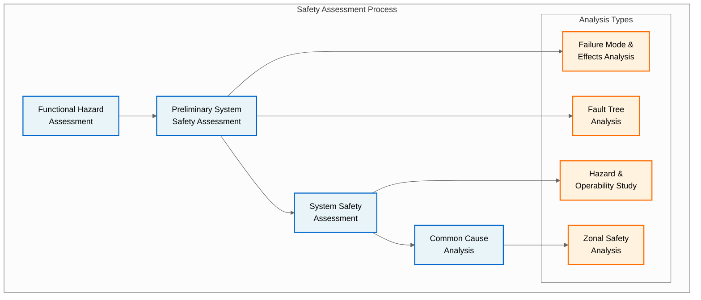
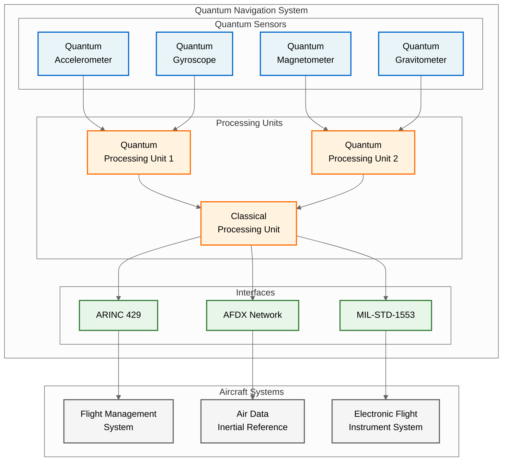
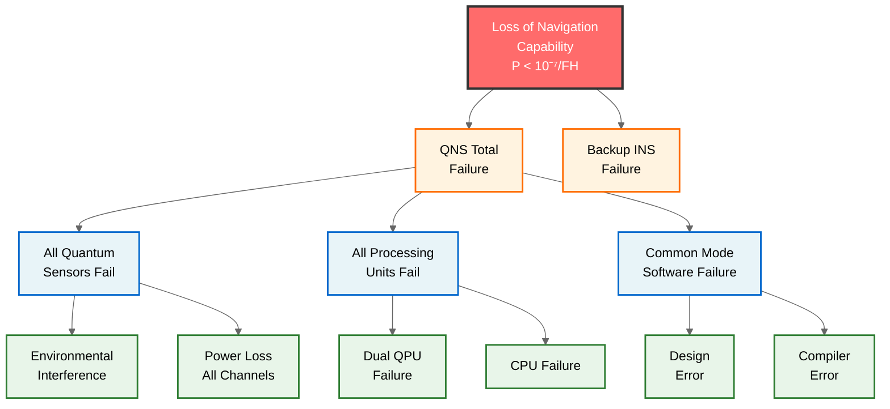
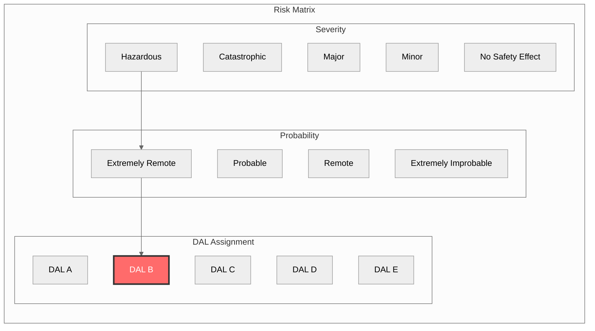

# QUA-QNS01-25SVD0001-DES-BOB-REG-TD-QCSAA-910-002-00-01-TPL-DES-231-QSTR-v1.0.0

## System Safety Assessment - Quantum Navigation System

**Document Classification:** Regulatory Artifact - Technical Document  
**Q-Division:** QSTR-Structures  
**Template:** TPL-DES-231  
**Status:** Design Phase - Digital Twin (BOB)  
**Version:** 1.0.0  
**Date:** 2025-07-29  
**TRL:** 6 (System/subsystem model or prototype demonstration in relevant environment)  
**Compliance Standard:** ARP-4761 / ARP-4754A

---

## Executive Summary

This System Safety Assessment (SSA) provides a comprehensive safety analysis of the Quantum Navigation System (QNS) for the AMPEL360 aircraft family. The assessment identifies potential failure conditions, determines their severity classifications, and establishes Design Assurance Levels (DAL) for system components. The QNS has been assessed to require **DAL-B** assurance based on the potential for **Hazardous** failure conditions in GPS-denied environments. This document supports type certification per CS-25.1309 and demonstrates compliance with applicable safety requirements.

## Revision History

| Version | Date | Description | Author |
|---------|------|-------------|--------|
| 1.0.0 | 2025-07-29 | Initial release | QSTR Safety Team |

## 1. Introduction

### 1.1 Purpose
This document provides the System Safety Assessment for the Quantum Navigation System in accordance with:
- ARP-4761: Guidelines and Methods for Conducting the Safety Assessment Process
- ARP-4754A: Guidelines for Development of Civil Aircraft and Systems
- CS-25.1309: Equipment, Systems, and Installations
- AMC 25.1309: System Design and Analysis

### 1.2 Scope
The assessment covers:
- QNS hardware components
- QNS software components (covered by DO-178C compliance)
- Integration with aircraft systems
- Operational scenarios
- Failure modes and effects
- Risk mitigation strategies

### 1.3 System Description
The Quantum Navigation System provides:
- GPS-independent position determination using quantum sensors
- Inertial navigation with quantum-enhanced accuracy
- Integration with conventional navigation systems
- Real-time health monitoring
- Automatic degradation management

### 1.4 Reference Documents
- [QUA-QNS01-25SVD0001-DES-BOB-REG-TD-QCSAA-910-001-00-01-TPL-DES-230-QSTR-v1.0.1 - DO-178C Software Compliance Plan](/A.Q.U.A.-V./PRODUCT_LINES/QUANTUM/QUANTUM_SOFTWARE/DESIGN/QNS_NAVIGATION/DES_REGULATORY/QUA-QNS01-25SVD0001-DES-BOB-REG-TD-QCSAA-910-001-00-01-TPL-DES-230-QSTR-v1.0.1.md)
- [QUA-QNS01-25SVD0001-DES-BOB-TEC-TD-QCSAA-910-000-00-01-TPL-DES-200-QSTR-v1.0.0 - Software Requirements Document (SRD)](/A.Q.U.A.-V./PRODUCT_LINES/QUANTUM/QUANTUM_SOFTWARE/DESIGN/QNS_NAVIGATION/DES_TECHNICAL/QUA-QNS01-25SVD0001-DES-BOB-TEC-TD-QCSAA-910-000-00-01-TPL-DES-200-QSTR-v1.0.0.md)
- [QUA-QNS01-25SVD0001-DES-BOB-IND-TD-QCSAA-918-000-00-01-TPL-DES-220-QIND-v1.0.0 - Aircraft Integration Design](/A.Q.U.A.-V./PRODUCT_LINES/QUANTUM/QUANTUM_SOFTWARE/DESIGN/QNS_NAVIGATION/DES_INDUSTRIAL/QUA-QNS01-25SVD0001-DES-BOB-IND-TD-QCSAA-918-000-00-01-TPL-DES-220-QIND-v1.0.0.md)

## 2. Safety Assessment Process

### 2.1 Assessment Methodology

### 2.2 Failure Classification Criteria

| Classification | Quantitative | Qualitative | Effects |
|----------------|--------------|-------------|---------|
| **Catastrophic** | < 10⁻⁹/FH | Multiple fatalities | Loss of aircraft |
| **Hazardous** | < 10⁻⁷/FH | Serious/fatal injuries | Large reduction in safety margins |
| **Major** | < 10⁻⁵/FH | Physical distress | Significant reduction in safety |
| **Minor** | < 10⁻³/FH | Physical discomfort | Slight reduction in safety |
| **No Effect** | > 10⁻³/FH | No impact | No effect on safety |

## 3. Functional Hazard Assessment (FHA)

### 3.1 QNS Functions

| Function ID | Function Description | Criticality |
|-------------|---------------------|-------------|
| QNS-F001 | Provide position data | Flight Critical |
| QNS-F002 | Provide velocity data | Flight Critical |
| QNS-F003 | Provide attitude data | Flight Critical |
| QNS-F004 | Monitor quantum state health | Essential |
| QNS-F005 | Interface with FMS | Flight Critical |
| QNS-F006 | Perform built-in test | Non-Essential |

### 3.2 Failure Conditions Analysis

| FC ID | Failure Condition | Phase | Classification | Rationale |
|-------|-------------------|-------|----------------|-----------|
| FC-001 | Total loss of QNS function | All | **Hazardous** | GPS-denied navigation loss |
| FC-002 | Erroneous position output | All | **Hazardous** | Potential CFIT |
| FC-003 | Loss of quantum coherence | All | **Hazardous** | Degraded accuracy |
| FC-004 | Delayed position update | Approach | **Major** | Reduced precision |
| FC-005 | False BIT failure | Ground | **Minor** | Dispatch delay |
| FC-006 | UI display corruption | All | **Minor** | Crew awareness |

### 3.3 Operational Scenarios

**Normal Operations:**
- GPS available: QNS provides backup/verification
- GPS denied: QNS primary navigation source
- Degraded mode: Conventional INS with QNS assist

**Abnormal Operations:**
- Quantum decoherence: Automatic reversion to INS
- Hardware failure: Redundant system activation
- Software fault: Dissimilar backup engagement

## 4. System Architecture Safety

### 4.1 QNS Architecture Overview

### 4.2 Redundancy Architecture

| Component | Redundancy | Type | Failure Coverage |
|-----------|------------|------|------------------|
| Quantum Sensors | Triple | Dissimilar | 99.9% |
| Processing Units | Dual | Hot standby | 99.7% |
| Power Supplies | Dual | Independent | 99.8% |
| Communication | Triple | Diverse paths | 99.9% |

### 4.3 Independence Requirements

**Physical Independence:**
- Separate equipment bays
- Independent power sources
- Isolated cooling systems
- Segregated wiring routes

**Functional Independence:**
- Dissimilar software (DO-178C)
- Different sensor technologies
- Independent monitoring
- Separate crew alerts

## 5. Failure Mode and Effects Analysis (FMEA)

### 5.1 Hardware FMEA Summary

| Component | Failure Mode | Local Effect | System Effect | Detection | Mitigation |
|-----------|--------------|--------------|---------------|-----------|------------|
| Quantum Accelerometer | Loss of coherence | No acceleration data | Degraded position | BIT + Monitor | Switch to backup |
| QPU | Processor fault | No quantum processing | Loss of QNS | Watchdog | Failover to QPU2 |
| Power Supply | Voltage out of range | Component shutdown | Partial loss | Voltage monitor | Secondary PSU |
| ARINC Interface | Data corruption | Invalid messages | FMS rejection | CRC check | Retry + alternate |

### 5.2 Software FMEA Summary

| Software Component | Failure Mode | Effect | DAL | Mitigation |
|-------------------|--------------|--------|-----|------------|
| Navigation Algorithm | Calculation error | Wrong position | B | MCDC testing per [QUA-QNS01-25SVD0001-DES-BOB-REG-TD-QCSAA-910-001-00-01-TPL-DES-230-QSTR-v1.0.1 - DO-178C Compliance Plan](/A.Q.U.A.-V./PRODUCT_LINES/QUANTUM/QUANTUM_SOFTWARE/DESIGN/QNS_NAVIGATION/DES_REGULATORY/QUA-QNS01-25SVD0001-DES-BOB-REG-TD-QCSAA-910-001-00-01-TPL-DES-230-QSTR-v1.0.1.md) |
| Quantum State Manager | State corruption | Loss of accuracy | B | Formal verification |
| Interface Manager | Protocol violation | Data loss | B | Defensive coding |
| Health Monitor | False positive | Unnecessary degradation | C | Voting logic |

## 6. Fault Tree Analysis (FTA)

### 6.1 Top Level Fault Tree

### 6.2 Probability Calculations

| Event | Probability | Basis |
|-------|-------------|-------|
| Single quantum sensor failure | 10⁻⁴/FH | Test data |
| Triple sensor failure | 10⁻¹²/FH | Independence |
| QPU failure | 10⁻⁵/FH | MTBF analysis |
| Dual QPU failure | 10⁻¹⁰/FH | Hot standby |
| Software design error | 10⁻⁹/FH | DO-178C DAL-B |
| **Total QNS failure** | **< 10⁻⁷/FH** | **Meets Hazardous** |

## 7. Common Cause Analysis (CCA)

### 7.1 Zonal Safety Analysis

| Zone | QNS Components | Hazards | Mitigation |
|------|----------------|---------|------------|
| Avionics Bay 1 | QPU1, Power Supply 1 | Fire, overheat | Separation, detection |
| Avionics Bay 2 | QPU2, Power Supply 2 | EMI, vibration | Shielding, isolation |
| Sensor Bay | Quantum sensors | Temperature | Active cooling |
| E/E Bay | Interfaces | Lightning | Surge protection |

### 7.2 Particular Risks Analysis

| Risk Type | Assessment | Design Protection |
|-----------|------------|-------------------|
| **Lightning** | High exposure | DO-160 Level 3 protection |
| **HIRF** | Moderate | Shielding per DO-160 |
| **EMI/EMC** | High sensitivity | Faraday cage design |
| **Bird Strike** | Low impact | Sensor redundancy |
| **Fire** | Moderate | Halon suppression |

### 7.3 Common Mode Analysis

| Common Mode | Affected Components | Probability | Mitigation |
|-------------|-------------------|-------------|------------|
| Power interruption | All systems | 10⁻⁵/FH | Independent batteries |
| Cooling failure | Quantum sensors | 10⁻⁶/FH | Passive + active cooling |
| Software bug | All channels | 10⁻⁹/FH | Dissimilar backup |
| Maintenance error | Any component | 10⁻⁷/FH | Design for maintainability |

## 8. Risk Assessment and DAL Assignment

### 8.1 Risk Matrix

### 8.2 Component DAL Assignment

| Component | Failure Classification | Required Probability | Assigned DAL |
|-----------|----------------------|---------------------|--------------|
| Navigation Processing Software | Hazardous | < 10⁻⁷/FH | **DAL-B** |
| Quantum State Management | Hazardous | < 10⁻⁷/FH | **DAL-B** |
| Interface Management | Hazardous | < 10⁻⁷/FH | **DAL-B** |
| Hardware Abstraction Layer | Hazardous | < 10⁻⁷/FH | **DAL-B** |
| Built-In Test | Minor | < 10⁻³/FH | **DAL-D** |
| Health Monitoring | Major | < 10⁻⁵/FH | **DAL-C** |

### 8.3 Compliance Summary

**Hardware Compliance:**
- DO-254 DAL-B for FPGAs/ASICs per [QUA-QNS01-25SVD0001-DES-BOB-REG-HM-DO254-900-000-00-01-TPL-DES-240-QSTR-v1.0.0 - Hardware Design Assurance Plan](/A.Q.U.A.-V./PRODUCT_LINES/QUANTUM/QUANTUM_HARDWARE/DESIGN/QNS_SENSORS/DES_REGULATORY/QUA-QNS01-25SVD0001-DES-BOB-REG-HM-DO254-900-000-00-01-TPL-DES-240-QSTR-v1.0.0.md)
- DO-160 environmental qualification
- CS-25 installation requirements

**Software Compliance:**
- DO-178C DAL-B objectives per [QUA-QNS01-25SVD0001-DES-BOB-REG-TD-QCSAA-910-001-00-01-TPL-DES-230-QSTR-v1.0.1 - DO-178C Compliance Plan](/A.Q.U.A.-V./PRODUCT_LINES/QUANTUM/QUANTUM_SOFTWARE/DESIGN/QNS_NAVIGATION/DES_REGULATORY/QUA-QNS01-25SVD0001-DES-BOB-REG-TD-QCSAA-910-001-00-01-TPL-DES-230-QSTR-v1.0.1.md)
- DO-330 tool qualification per [QUA-QNS01-25SVD0001-DES-BOB-REG-TD-QCSAA-910-008-00-01-TPL-DES-237-QSTR-v1.0.0 - Tool Qualification Plan](/A.Q.U.A.-V./PRODUCT_LINES/QUANTUM/QUANTUM_SOFTWARE/DESIGN/QNS_NAVIGATION/DES_REGULATORY/QUA-QNS01-25SVD0001-DES-BOB-REG-TD-QCSAA-910-008-00-01-TPL-DES-237-QSTR-v1.0.0.md)
- DO-331 model-based development per [QUA-QSM01-25SVD0003-DES-BOB-TEC-DT-QCSAA-931-000-00-01-TPL-DES-261-QSTR-v1.0.0.json - Quantum State Model](/A.Q.U.A.-V./PRODUCT_LINES/QUANTUM/QUANTUM_SOFTWARE/DESIGN/QSM_STRUCTURAL/DES_TECHNICAL/QUA-QSM01-25SVD0003-DES-BOB-TEC-DT-QCSAA-931-000-00-01-TPL-DES-261-QSTR-v1.0.0.json)

## 9. Safety Requirements

### 9.1 Derived Safety Requirements

| Req ID | Requirement | Rationale | Verification |
|--------|-------------|-----------|--------------|
| SAF-001 | QNS shall detect loss of quantum coherence within 100ms | Prevent erroneous output | Test |
| SAF-002 | QNS shall provide position accuracy degradation alert | Crew awareness | Analysis |
| SAF-003 | QNS shall maintain operation with single sensor failure | Availability | Test |
| SAF-004 | QNS shall prevent common mode software failures | Independence | Review |
| SAF-005 | QNS shall isolate faults to prevent propagation | Containment | Test |

### 9.2 Crew Alerting Requirements

| Alert | Condition | Level | Message |
|-------|-----------|-------|---------|
| QNS FAIL | Total loss | WARNING | "QNS FAIL - USE BACKUP NAV" |
| QNS DEGRADED | Partial loss | CAUTION | "QNS DEGRADED - VERIFY POSITION" |
| QNS DISAGREE | Data mismatch | ADVISORY | "QNS DISAGREE - CHECK STATUS" |

### 9.3 Operational Limitations

**Dispatch Requirements:**
- Minimum 2 of 3 quantum sensors operational per [QUA-QNS01-25SVD0001-DES-BOB-FUN-TD-QCSAA-917-000-00-01-TPL-DES-212-QSTR-v1.0.0 - Performance Requirements](/A.Q.U.A.-V./PRODUCT_LINES/QUANTUM/QUANTUM_SOFTWARE/DESIGN/QNS_NAVIGATION/DES_FUNCTIONAL/QUA-QNS01-25SVD0001-DES-BOB-FUN-TD-QCSAA-917-000-00-01-TPL-DES-212-QSTR-v1.0.0.md)
- Both QPUs must pass power-on BIT
- Backup INS must be operational

**In-Flight Restrictions:**
- RNP operations require QNS or GPS per [AMP-BWB01-25MAP0001-DES-BOB-REG-TD-ATA-034-000-00-01-TPL-DES-110-QSTR-v1.0.0 - Navigation Performance Requirements](/A.Q.U.A.-V./PRODUCT_LINES/AMPEL360/BWB_AIRCRAFT/DESIGN/BWB-Q100/DES_REGULATORY/AMP-BWB01-25MAP0001-DES-BOB-REG-TD-ATA-034-000-00-01-TPL-DES-110-QSTR-v1.0.0.md)
- CAT III approaches require dual source
- RVSM requires independent altitude source

## 10. Verification and Validation

### 10.1 Safety Assessment V&V

| Activity | Method | Criteria | Responsibility |
|----------|--------|----------|----------------|
| FHA Review | Independent review | Completeness | Safety Team |
| FMEA Validation | Test + analysis | Failure coverage | Test Team |
| FTA Verification | Calculation check | Probability targets | Analysis Team |
| CCA Confirmation | Physical inspection | Independence | Installation Team |

### 10.2 Test Requirements

**Safety Test Categories:**
- Fault injection testing
- Environmental stress testing
- EMI/EMC compliance testing
- Lightning/HIRF testing
- Reliability demonstration
- Failure propagation testing

### 10.3 In-Service Monitoring

**Data Collection:**
- BITE fault logs
- Crew reports
- Maintenance findings
- Performance trends

**Safety Metrics:**
- MTBF achievement
- False alarm rate
- Dispatch reliability
- Safety event rate

## 11. Conclusions and Recommendations

### 11.1 Assessment Conclusions

1. **DAL Assignment Justified:** The QNS requires DAL-B assurance based on potential Hazardous failure conditions
2. **Architecture Adequate:** Triple redundancy and dissimilar backups meet safety targets
3. **Risks Identified:** All significant risks have mitigation strategies
4. **Requirements Complete:** Safety requirements address all identified hazards

### 11.2 Recommendations

1. **Early Testing:** Conduct quantum sensor environmental testing early in development
2. **Simulation:** Extensive fault injection in integrated aircraft simulator
3. **Crew Training:** Comprehensive training on QNS degradation scenarios
4. **Monitoring:** Implement robust in-service data collection

### 11.3 Open Items

| Item | Description | Owner | Due Date |
|------|-------------|-------|----------|
| OI-001 | Complete EMI testing | Test Team | Q1 2026 |
| OI-002 | Finalize maintenance procedures | Support Team | Q2 2026 |
| OI-003 | Validate fault coverage | Safety Team | Q3 2026 |

## 12. Appendices

### Appendix A: Acronyms and Abbreviations

| Acronym | Definition |
|---------|------------|
| ADIRU | Air Data Inertial Reference Unit |
| AFDX | Avionics Full-Duplex Switched Ethernet |
| BIT | Built-In Test |
| CCA | Common Cause Analysis |
| CFIT | Controlled Flight Into Terrain |
| DAL | Design Assurance Level |
| EFIS | Electronic Flight Instrument System |
| EMI/EMC | Electromagnetic Interference/Compatibility |
| FHA | Functional Hazard Assessment |
| FMEA | Failure Mode and Effects Analysis |
| FMS | Flight Management System |
| FTA | Fault Tree Analysis |
| HIRF | High Intensity Radiated Fields |
| INS | Inertial Navigation System |
| MCDC | Modified Condition/Decision Coverage |
| MTBF | Mean Time Between Failures |
| QPU | Quantum Processing Unit |
| QNS | Quantum Navigation System |
| RNP | Required Navigation Performance |
| RVSM | Reduced Vertical Separation Minimum |
| SSA | System Safety Assessment |

### Appendix B: Reference Standards

| Standard | Title | Application |
|----------|-------|-------------|
| ARP-4754A | Guidelines for Development of Civil Aircraft and Systems | System development |
| ARP-4761 | Guidelines and Methods for Conducting the Safety Assessment Process | Safety assessment |
| CS-25.1309 | Equipment, Systems, and Installations | Certification basis |
| DO-178C | Software Considerations in Airborne Systems and Equipment Certification | Software assurance |
| DO-254 | Design Assurance Guidance for Airborne Electronic Hardware | Hardware assurance |
| DO-160G | Environmental Conditions and Test Procedures | Environmental qualification |

---

**Document Control:**
- Author: QSTR Safety Analysis Team
- Technical Review: QSCI-Research, QDAT-DataGov
- Safety Review: Chief Safety Officer
- Approval: Head of Certification, Chief Technology Officer
- Distribution: EASA, Program Team, Safety Board

**Configuration:**
- Baseline: SSA-BASELINE-001
- Status: Released for Review
- Next Review: 2025-10-31

**Related Documents:**
- [QUA-QNS01-25SVD0001-DES-BOB-REG-TD-QCSAA-910-001-00-01-TPL-DES-230-QSTR-v1.0.1 - DO-178C Software Compliance Plan](/A.Q.U.A.-V./PRODUCT_LINES/QUANTUM/QUANTUM_SOFTWARE/DESIGN/QNS_NAVIGATION/DES_REGULATORY/QUA-QNS01-25SVD0001-DES-BOB-REG-TD-QCSAA-910-001-00-01-TPL-DES-230-QSTR-v1.0.1.md)
- [QUA-QNS01-25SVD0001-DES-BOB-TEC-TD-QCSAA-910-000-00-01-TPL-DES-200-QSTR-v1.0.0 - Software Requirements Document (SRD)](/A.Q.U.A.-V./PRODUCT_LINES/QUANTUM/QUANTUM_SOFTWARE/DESIGN/QNS_NAVIGATION/DES_TECHNICAL/QUA-QNS01-25SVD0001-DES-BOB-TEC-TD-QCSAA-910-000-00-01-TPL-DES-200-QSTR-v1.0.0.md)
- [QUA-QNS01-25SVD0001-DES-BOB-IND-TD-QCSAA-919-000-00-01-TPL-DES-221-QIND-v1.0.0 - System Integration Plan](/A.Q.U.A.-V./PRODUCT_LINES/QUANTUM/QUANTUM_SOFTWARE/DESIGN/QNS_NAVIGATION/DES_INDUSTRIAL/QUA-QNS01-25SVD0001-DES-BOB-IND-TD-QCSAA-919-000-00-01-TPL-DES-221-QIND-v1.0.0.md)
- [QUA-QNS01-25SVD0001-DES-BOB-REG-HM-DO254-900-000-00-01-TPL-DES-240-QSTR-v1.0.0 - Hardware Design Assurance Plan](/A.Q.U.A.-V./PRODUCT_LINES/QUANTUM/QUANTUM_HARDWARE/DESIGN/QNS_SENSORS/DES_REGULATORY/QUA-QNS01-25SVD0001-DES-BOB-REG-HM-DO254-900-000-00-01-TPL-DES-240-QSTR-v1.0.0.md)
- [AMP-BWB01-25MAP0001-DES-BOB-REG-TD-ATA-000-000-00-01-TPL-DES-100-QSTR-v1.0.0 - Aircraft Level Functional Hazard Assessment](/A.Q.U.A.-V./PRODUCT_LINES/AMPEL360/BWB_AIRCRAFT/DESIGN/BWB-Q100/DES_REGULATORY/AMP-BWB01-25MAP0001-DES-BOB-REG-TD-ATA-000-000-00-01-TPL-DES-100-QSTR-v1.0.0.md)

---

*This document is part of the AQUA V. Quantum Aerospace Program*  
*© 2025 AQUA V. - Aerospace and Quantum United Advanced Venture*
