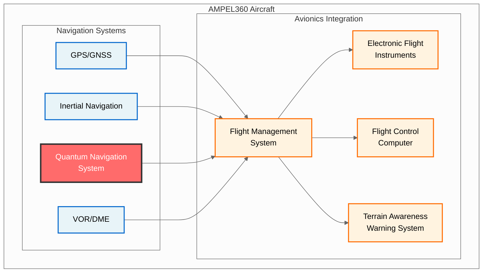
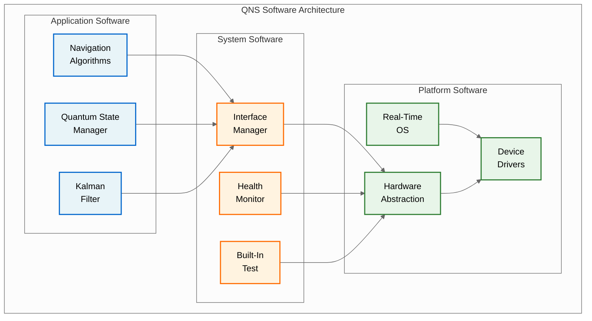
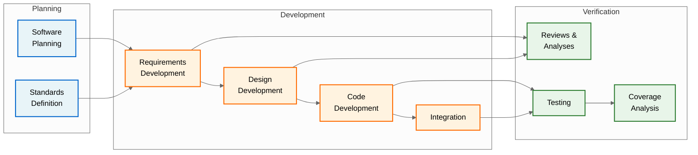
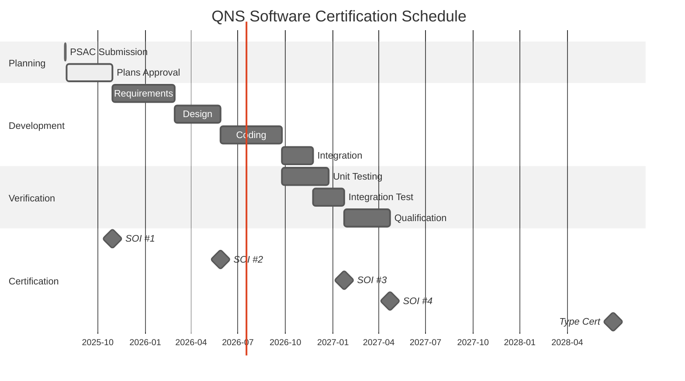

# QUA-QNS01-25SVD0001-DES-BOB-REG-TD-QCSAA-910-003-00-01-TPL-DES-232-QSTR-v1.0.0

## Plan for Software Aspects of Certification (PSAC) - Quantum Navigation System

**Document Classification:** Regulatory Artifact - Technical Document  
**Q-Division:** QSTR-Structures  
**Template:** TPL-DES-232  
**Status:** Design Phase - Digital Twin (BOB)  
**Version:** 1.0.0  
**Date:** 2025-07-29  
**TRL:** 6 (System/subsystem model or prototype demonstration in relevant environment)  
**Compliance Standard:** DO-178C / ED-12C

---

## Executive Summary

This Plan for Software Aspects of Certification (PSAC) defines the certification approach for the Quantum Navigation System (QNS) software in accordance with DO-178C. The QNS software is classified as Design Assurance Level B (DAL-B) based on the system safety assessment. This plan establishes the framework for demonstrating compliance with airworthiness requirements and coordinating with certification authorities throughout the software development lifecycle.

## Document Approval

| Role | Name | Signature | Date |
|------|------|-----------|------|
| Author | QSTR Software Lead | ___________ | 2025-07-29 |
| Software QA | QSTR QA Manager | ___________ | 2025-07-29 |
| DER Software | Company DER | ___________ | 2025-07-29 |
| Program Manager | QNS PM | ___________ | 2025-07-29 |
| Certification Office | Head of Cert | ___________ | 2025-07-29 |

## Revision History

| Version | Date | Description | Author |
|---------|------|-------------|--------|
| 1.0.0 | 2025-07-29 | Initial release for authority review | QSTR Team |

## Table of Contents

1. [Introduction](#1-introduction)
2. [System Overview](#2-system-overview)
3. [Certification Considerations](#3-certification-considerations)
4. [Software Overview](#4-software-overview)
5. [Software Lifecycle](#5-software-lifecycle)
6. [Software Lifecycle Data](#6-software-lifecycle-data)
7. [Schedule](#7-schedule)
8. [Certification Authority Involvement](#8-certification-authority-involvement)
9. [Compliance Substantiation](#9-compliance-substantiation)
10. [Tool Qualification](#10-tool-qualification)
11. [Supplier Oversight](#11-supplier-oversight)
12. [Summary](#12-summary)

## 1. Introduction

### 1.1 Purpose
This PSAC provides the certification authority with:
- Overview of the QNS software and its criticality
- Software development and verification approach
- Plans for demonstrating DO-178C compliance
- Schedule for certification activities
- Framework for authority involvement

### 1.2 Scope
This plan covers all software components of the QNS:
- Airborne software (embedded in QNS hardware)
- Support software requiring qualification
- User-modifiable software (if applicable)
- Option-selectable software (if applicable)

### 1.3 Reference Documents

| Document | Title | Reference ID |
|----------|-------|--------------|
| DO-178C | Software Considerations in Airborne Systems and Equipment Certification | RTCA/DO-178C |
| DO-330 | Software Tool Qualification Considerations | RTCA/DO-330 |
| DO-331 | Model-Based Development and Verification Supplement | RTCA/DO-331 |
| ARP-4754A | Guidelines for Development of Civil Aircraft and Systems | SAE ARP4754A |
| [System Safety Assessment](/A.Q.U.A.-V./PRODUCT_LINES/QUANTUM/QUANTUM_SOFTWARE/DESIGN/QNS_NAVIGATION/DES_REGULATORY/QUA-QNS01-25SVD0001-DES-BOB-REG-TD-QCSAA-910-002-00-01-TPL-DES-231-QSTR-v1.0.0.md) | QNS SSA | Internal |
| [DO-178C Compliance Plan](/A.Q.U.A.-V./PRODUCT_LINES/QUANTUM/QUANTUM_SOFTWARE/DESIGN/QNS_NAVIGATION/DES_REGULATORY/QUA-QNS01-25SVD0001-DES-BOB-REG-TD-QCSAA-910-001-00-01-TPL-DES-230-QSTR-v1.0.1.md) | QNS Compliance Strategy | Internal |

### 1.4 Acronyms and Abbreviations

| Acronym | Definition |
|---------|------------|
| CCB | Configuration Control Board |
| CI | Configuration Item |
| DAL | Design Assurance Level |
| DER | Designated Engineering Representative |
| EASA | European Union Aviation Safety Agency |
| FAA | Federal Aviation Administration |
| MCDC | Modified Condition/Decision Coverage |
| PSAC | Plan for Software Aspects of Certification |
| QNS | Quantum Navigation System |
| SAS | Software Accomplishment Summary |
| SCI | Software Configuration Index |
| SOI | Stage of Involvement |
| TSRI | Transition State Readiness Index |

## 2. System Overview

### 2.1 Aircraft and System Context

### 2.2 QNS System Description

The Quantum Navigation System provides:
- **Primary Function:** GPS-independent navigation using quantum sensors
- **Operational Domain:** All flight phases, particularly GPS-denied environments
- **Integration:** ARINC 429, AFDX, and MIL-STD-1553 interfaces
- **Performance:** Position accuracy < 10m CEP after 1 hour operation

### 2.3 System Architecture

**Hardware Components:**
- Quantum sensor array (accelerometers, gyroscopes, magnetometer, gravitometer)
- Dual quantum processing units (QPU)
- Classical processing unit (CPU)
- Power supplies and interfaces

**Software Components:**
- Navigation processing algorithms
- Quantum state management
- Interface management
- Health monitoring
- Built-in test

## 3. Certification Considerations

### 3.1 Certification Basis

**Type Certificate Application:** AMPEL360 BWB-Q100  
**Certification Specification:** CS-25 Amendment 27  
**Special Conditions:** Quantum technology navigation systems

**Applicable Requirements:**
- CS 25.1301: Function and installation
- CS 25.1309: Equipment, systems, and installations
- CS 25.1316: Electrical and electronic system lightning protection
- CS 25.1322: Flightcrew alerting
- CS 25.1329: Flight guidance system

### 3.2 Software Criticality Assessment

Based on the System Safety Assessment:

| Failure Condition | Classification | Software Level | Rationale |
|-------------------|----------------|----------------|-----------|
| Total loss of QNS | Hazardous | DAL-B | GPS-denied navigation capability |
| Erroneous navigation | Hazardous | DAL-B | Potential CFIT in GPS-denied |
| Loss of quantum coherence | Hazardous | DAL-B | Degraded navigation accuracy |
| BIT false failure | Minor | DAL-D | Operational impact only |

**Conclusion:** QNS software requires **DAL-B** assurance level.

### 3.3 Compliance Approach

**Standards Compliance:**
- DO-178C objectives for DAL-B
- DO-331 for model-based quantum algorithms
- DO-330 for tool qualification

**Certification Strategy:**
- Early and continuous authority engagement
- Incremental compliance demonstration
- Use of simulation and modeling
- Comprehensive documentation

## 4. Software Overview

### 4.1 Software Architecture

### 4.2 Software Components Description

| Component | Type | Size (KSLOC) | Criticality | Description |
|-----------|------|--------------|-------------|-------------|
| Navigation Algorithms | Application | 150 | DAL-B | Position/velocity/attitude computation |
| Quantum State Manager | Application | 80 | DAL-B | Quantum sensor control and monitoring |
| Kalman Filter | Application | 45 | DAL-B | Sensor fusion and error estimation |
| Interface Manager | System | 50 | DAL-B | External communications handling |
| Health Monitor | System | 25 | DAL-C | System health assessment |
| Built-In Test | System | 30 | DAL-D | Power-on and continuous BIT |
| RTOS | Platform | 100 | DAL-B | VxWorks 7 certified kernel |
| HAL | Platform | 40 | DAL-B | Hardware abstraction layer |
| Device Drivers | Platform | 30 | DAL-B | Low-level hardware control |
| **Total** | | **550 KSLOC** | | |

### 4.3 Deactivated Code and Unused Functions

**Policy:** No deactivated code permitted in production builds
**Verification:** Static analysis tools verify absence of unreachable code
**Exception Handling:** Defensive programming for robustness

### 4.4 User-Modifiable Software

**Not Applicable:** QNS software is not user-modifiable

### 4.5 COTS Software

| Component | Vendor | Version | Criticality | Certification Evidence |
|-----------|--------|---------|-------------|----------------------|
| VxWorks 7 | Wind River | 7.0 | DAL-B | DO-178C certification package |
| Math Library | AQUA V. | 1.0 | DAL-B | Developed to DO-178C |

## 5. Software Lifecycle

### 5.1 Software Development Process

### 5.2 Lifecycle Model

**Development Model:** V-Model with iterative refinement
**Key Principles:**
- Requirements-driven development
- Bi-directional traceability
- Continuous verification
- Configuration management throughout

### 5.3 Transition Criteria

| Transition | Criteria | Authority Review |
|------------|----------|------------------|
| Planning → Development | Approved plans, standards defined | SOI #1 |
| Requirements → Design | Requirements baseline established | - |
| Design → Coding | Design reviews complete | SOI #2 |
| Coding → Testing | Code reviews complete, unit tested | - |
| Testing → Qualification | Coverage targets met | SOI #3 |
| Qualification → Certification | All objectives satisfied | SOI #4 |

### 5.4 Software Development Environment

**Development Tools:**
- Requirements: IBM DOORS
- Modeling: MATLAB/Simulink (DO-331)
- Design: Enterprise Architect
- Coding: Wind River Workbench
- Testing: LDRA Testbed
- Configuration: Git/GitLab

**Target Environment:**
- Processor: PowerPC e6500
- RTOS: VxWorks 7
- Compiler: Wind River Diab 5.9
- Memory: 2GB RAM, 8GB Flash

## 6. Software Lifecycle Data

### 6.1 Software Plans

| Plan | Document ID | DO-178C Section |
|------|-------------|-----------------|
| Plan for Software Aspects of Certification (PSAC) | [QUA-QNS01-25SVD0001-DES-BOB-REG-TD-QCSAA-910-003-00-01-TPL-DES-232-QSTR-v1.0.0](/A.Q.U.A.-V./PRODUCT_LINES/QUANTUM/QUANTUM_SOFTWARE/DESIGN/QNS_NAVIGATION/DES_REGULATORY/QUA-QNS01-25SVD0001-DES-BOB-REG-TD-QCSAA-910-003-00-01-TPL-DES-232-QSTR-v1.0.0.md) | 11.1 |
| Software Development Plan (SDP) | [QUA-QNS01-25SVD0001-DES-BOB-REG-TD-QCSAA-910-004-00-01-TPL-DES-233-QSTR-v1.0.0](/A.Q.U.A.-V./PRODUCT_LINES/QUANTUM/QUANTUM_SOFTWARE/DESIGN/QNS_NAVIGATION/DES_REGULATORY/QUA-QNS01-25SVD0001-DES-BOB-REG-TD-QCSAA-910-004-00-01-TPL-DES-233-QSTR-v1.0.0.md) | 11.2 |
| Software Verification Plan (SVP) | [QUA-QNS01-25SVD0001-DES-BOB-REG-TD-QCSAA-910-005-00-01-TPL-DES-234-QSTR-v1.0.0](/A.Q.U.A.-V./PRODUCT_LINES/QUANTUM/QUANTUM_SOFTWARE/DESIGN/QNS_NAVIGATION/DES_REGULATORY/QUA-QNS01-25SVD0001-DES-BOB-REG-TD-QCSAA-910-005-00-01-TPL-DES-234-QSTR-v1.0.0.md) | 11.3 |
| Software Configuration Management Plan (SCMP) | [QUA-QNS01-25SVD0001-DES-BOB-REG-TD-QCSAA-910-006-00-01-TPL-DES-235-QSTR-v1.0.0](/A.Q.U.A.-V./PRODUCT_LINES/QUANTUM/QUANTUM_SOFTWARE/DESIGN/QNS_NAVIGATION/DES_REGULATORY/QUA-QNS01-25SVD0001-DES-BOB-REG-TD-QCSAA-910-006-00-01-TPL-DES-235-QSTR-v1.0.0.md) | 11.4 |
| Software Quality Assurance Plan (SQAP) | [QUA-QNS01-25SVD0001-DES-BOB-REG-TD-QCSAA-910-007-00-01-TPL-DES-236-QSTR-v1.0.0](/A.Q.U.A.-V./PRODUCT_LINES/QUANTUM/QUANTUM_SOFTWARE/DESIGN/QNS_NAVIGATION/DES_REGULATORY/QUA-QNS01-25SVD0001-DES-BOB-REG-TD-QCSAA-910-007-00-01-TPL-DES-236-QSTR-v1.0.0.md) | 11.5 |

### 6.2 Software Development Data

| Data Item | Description | DO-178C Reference |
|-----------|-------------|-------------------|
| Software Requirements Data (SRD) | High and low-level requirements | 11.9 |
| Software Design Description (SDD) | Architecture and detailed design | 11.10 |
| Source Code | Implementation in C++ and QASM | 11.11 |
| Executable Object Code | Compiled and linked binaries | 11.12 |

### 6.3 Software Verification Data

| Data Item | Description | DO-178C Reference |
|-----------|-------------|-------------------|
| Software Verification Cases and Procedures | Test cases for all levels | 11.13 |
| Software Verification Results | Test execution records | 11.14 |
| Requirements Coverage Analysis | Requirements to test traceability | 11.20 |
| Structural Coverage Analysis | Code coverage metrics | 11.21 |

### 6.4 Software Configuration Management Data

| Data Item | Description | DO-178C Reference |
|-----------|-------------|-------------------|
| Software Configuration Index (SCI) | Configuration identification | 11.16 |
| Software Library | Controlled software archive | 11.17 |
| Problem Reports | Defect tracking records | 11.18 |

### 6.5 Software Quality Assurance Data

| Data Item | Description | DO-178C Reference |
|-----------|-------------|-------------------|
| Software Quality Assurance Records | Audit and review records | 11.15 |
| Software Conformity Review | Compliance assessment | 11.19 |
| Software Accomplishment Summary (SAS) | Certification summary | 11.20 |

## 7. Schedule

### 7.1 Major Milestones

### 7.2 Key Dates

| Milestone | Target Date | Description |
|-----------|-------------|-------------|
| PSAC Approval | 2025-10-31 | Authority approval of this plan |
| SOI #1 | 2025-11-30 | Planning review |
| Requirements Baseline | 2026-04-30 | SRD approval |
| SOI #2 | 2026-09-30 | Development review |
| Code Complete | 2027-01-31 | All coding finished |
| SOI #3 | 2027-06-30 | Test review |
| Qualification Complete | 2027-09-30 | All testing done |
| SOI #4 | 2027-10-31 | Final review |
| SAS/SCI Delivery | 2028-01-31 | Final deliverables |
| Type Certification | 2028-06-30 | Aircraft TC |

## 8. Certification Authority Involvement

### 8.1 Stages of Involvement (SOI)

| SOI | Purpose | Timing | Deliverables | Review Focus |
|-----|---------|--------|--------------|--------------|
| **SOI #1** | Planning Review | Q4 2025 | - PSAC (this document) - All plans (SDP, SVP, SCMP, SQAP) - Standards documents | - Certification approach - DAL assignment - Process adequacy |
| **SOI #2** | Development Review | Q3 2026 | - Software requirements - Architecture design - Sample detailed design - Traceability matrix | - Requirements quality - Design approach - Quantum algorithms |
| **SOI #3** | Verification Review | Q2 2027 | - Test procedures - Test results sample - Coverage analysis - Problem reports | - Test adequacy - Coverage achievement - Issue resolution |
| **SOI #4** | Final Review | Q4 2027 | - Software Accomplishment Summary - Software Configuration Index - All compliance evidence - Open items resolution | - Objective compliance - Completeness - Readiness for cert |

### 8.2 Authority Coordination

**Primary Contact Points:**
- EASA Software Specialist: TBD
- EASA System Specialist: TBD
- FAA Software Specialist: TBD (if applicable)

**Communication Methods:**
- Formal SOI meetings
- Technical familiarization briefings
- Issue papers for novel aspects
- Regular progress reports

### 8.3 Areas Requiring Special Attention

1. **Quantum Algorithm Verification**
   - Novel technology requiring new verification approaches
   - Use of formal methods (DO-333) for quantum state proofs
   - Simulation-based testing for quantum behaviors

2. **Model-Based Development**
   - MATLAB/Simulink models for quantum algorithms
   - DO-331 compliance for model verification
   - Code generation qualification

3. **Hardware-Software Integration**
   - Quantum sensor interfaces
   - Real-time performance requirements
   - Environmental robustness

## 9. Compliance Substantiation

### 9.1 DO-178C Objectives Compliance

For DAL-B software, the following objectives apply:

| Table | Objectives | With Independence | Approach |
|-------|------------|-------------------|----------|
| A-1 | Planning Process (7 objectives) | Yes | Plans and standards |
| A-2 | Development Process (7 objectives) | Yes | Requirements, design, code |
| A-3 | Requirements Verification (7 objectives) | Yes | Reviews, analysis, test |
| A-4 | Design Verification (13 objectives) | Yes | Reviews, analysis |
| A-5 | Code Verification (9 objectives) | Yes | Reviews, analysis, test |
| A-6 | Integration Process (5 objectives) | Yes | Integration testing |
| A-7 | Verification Process (9 objectives) | Yes | Test execution |
| A-8 | Configuration Management (6 objectives) | Yes | CM system |
| A-9 | Quality Assurance (5 objectives) | Yes | QA audits |
| A-10 | Certification Liaison (3 objectives) | No | This PSAC, SAS |

**Total:** 71 objectives for DAL-B

### 9.2 Additional Considerations

**DO-331 Model-Based Development:**
- MB.A-3: Model coverage analysis
- MB.C-5: Model simulation for verification
- MB.D-0: Model development standards

**DO-332 Object-Oriented Technology:**
- OO.A-3: Local type consistency
- OO.D-4: Dynamic memory management (prohibited)
- OO.E-7: Inheritance verification

### 9.3 Compliance Matrix

A detailed compliance matrix showing:
- Each DO-178C/supplement objective
- Compliance approach
- Responsible organization
- Lifecycle data reference

Will be maintained in: [QUA-QNS01-25SVD0001-DES-BOB-REG-TD-QCSAA-910-050-00-01-TPL-DES-250-QSTR-v1.0.0 - Compliance Matrix](/A.Q.U.A.-V./PRODUCT_LINES/QUANTUM/QUANTUM_SOFTWARE/DESIGN/QNS_NAVIGATION/DES_REGULATORY/QUA-QNS01-25SVD0001-DES-BOB-REG-TD-QCSAA-910-050-00-01-TPL-DES-250-QSTR-v1.0.0.md)

## 10. Tool Qualification

### 10.1 Development Tools

| Tool | Purpose | TQL | Qualification Approach |
|------|---------|-----|----------------------|
| MATLAB/Simulink | Model development | TQL-5 | Verification of models |
| Simulink Coder | Code generation | TQL-1 | Full qualification |
| Wind River Diab | Compilation | TQL-1 | Vendor qualification |
| Git | Version control | TQL-5 | Procedural control |

### 10.2 Verification Tools

| Tool | Purpose | TQL | Qualification Approach |
|------|---------|-----|----------------------|
| LDRA Testbed | Coverage analysis | TQL-2 | Tool qualification data |
| QNS-TEST | Test automation | TQL-2 | In-house qualification |
| MATLAB | Model verification | TQL-3 | Qualified use cases |
| Quantum Simulator | Algorithm verification | TQL-3 | Custom qualification |

### 10.3 Tool Qualification Plans

Separate Tool Qualification Plans per DO-330:
- [QUA-QNS01-25SVD0001-DES-BOB-REG-TD-QCSAA-910-008-00-01-TPL-DES-237-QSTR-v1.0.0 - Simulink Coder Tool Qualification Plan](/A.Q.U.A.-V./PRODUCT_LINES/QUANTUM/QUANTUM_SOFTWARE/DESIGN/QNS_NAVIGATION/DES_REGULATORY/QUA-QNS01-25SVD0001-DES-BOB-REG-TD-QCSAA-910-008-00-01-TPL-DES-237-QSTR-v1.0.0.md)
- [QUA-QNS01-25SVD0001-DES-BOB-REG-TD-QCSAA-910-009-00-01-TPL-DES-238-QSTR-v1.0.0 - LDRA Tool Qualification Plan](/A.Q.U.A.-V./PRODUCT_LINES/QUANTUM/QUANTUM_SOFTWARE/DESIGN/QNS_NAVIGATION/DES_REGULATORY/QUA-QNS01-25SVD0001-DES-BOB-REG-TD-QCSAA-910-009-00-01-TPL-DES-238-QSTR-v1.0.0.md)

## 11. Supplier Oversight

### 11.1 Software Suppliers

| Supplier | Component | DAL | Oversight Method |
|----------|-----------|-----|------------------|
| Wind River | VxWorks RTOS | B | Certification evidence review |
| MathWorks | Generated code | B | Tool qualification |
| Internal | All other software | B | Direct DO-178C compliance |

### 11.2 Supplier Compliance

**Requirements for Suppliers:**
- DO-178C compliance evidence
- Access to lifecycle data
- Participation in audits
- Configuration control

**AQUA V. Responsibilities:**
- Supplier audits
- Compliance verification
- Integration testing
- Final certification accountability

## 12. Summary

### 12.1 Key Aspects

1. **Novel Technology:** First quantum navigation system requiring DO-178C certification
2. **DAL-B Rigor:** Comprehensive lifecycle processes with independence
3. **Model-Based:** Extensive use of modeling for quantum algorithms
4. **Tool Qualification:** Multiple tools requiring DO-330 qualification
5. **Authority Engagement:** Early and continuous through 4 SOIs

### 12.2 Certification Risks and Mitigation

| Risk | Impact | Mitigation |
|------|--------|------------|
| Quantum algorithm verification | High | Formal methods, extensive simulation |
| Tool qualification delays | Medium | Early start, vendor engagement |
| Model coverage gaps | Medium | DO-331 compliance, supplemental testing |
| Schedule pressure | High | Experienced team, proven processes |

### 12.3 Conclusion

This PSAC establishes a comprehensive framework for QNS software certification compliance with DO-178C DAL-B objectives. The plan addresses the unique challenges of quantum technology while maintaining full alignment with established aerospace software standards. Success depends on:

- Rigorous application of defined processes
- Early and continuous certification authority engagement  
- Proactive management of novel technology aspects
- Comprehensive documentation and traceability

The QNS software team is committed to achieving certification objectives and supporting the AMPEL360 aircraft type certification program.

---

**Document Control:**
- Author: QSTR Software Certification Team
- Review: QDAT-DataGov, QSCI-Research, QIND-Industry
- Approval: Chief Technology Officer, Head of Certification, DER
- Distribution: EASA, FAA (if applicable), Program Team
- Classification: Restricted - Certification Sensitive

**Configuration:**
- Baseline: PSAC-BASELINE-001
- Status: Released for Authority Review
- Next Review: After SOI #1 Feedback

**Related Documents:**
- [QUA-QNS01-25SVD0001-DES-BOB-REG-TD-QCSAA-910-001-00-01-TPL-DES-230-QSTR-v1.0.1 - DO-178C Compliance Plan](/A.Q.U.A.-V./PRODUCT_LINES/QUANTUM/QUANTUM_SOFTWARE/DESIGN/QNS_NAVIGATION/DES_REGULATORY/QUA-QNS01-25SVD0001-DES-BOB-REG-TD-QCSAA-910-001-00-01-TPL-DES-230-QSTR-v1.0.1.md)
- [QUA-QNS01-25SVD0001-DES-BOB-REG-TD-QCSAA-910-002-00-01-TPL-DES-231-QSTR-v1.0.0 - System Safety Assessment](/A.Q.U.A.-V./PRODUCT_LINES/QUANTUM/QUANTUM_SOFTWARE/DESIGN/QNS_NAVIGATION/DES_REGULATORY/QUA-QNS01-25SVD0001-DES-BOB-REG-TD-QCSAA-910-002-00-01-TPL-DES-231-QSTR-v1.0.0.md)
- [QUA-QNS01-25SVD0001-DES-BOB-REG-TD-QCSAA-910-004-00-01-TPL-DES-233-QSTR-v1.0.0 - Software Development Plan](/A.Q.U.A.-V./PRODUCT_LINES/QUANTUM/QUANTUM_SOFTWARE/DESIGN/QNS_NAVIGATION/DES_REGULATORY/QUA-QNS01-25SVD0001-DES-BOB-REG-TD-QCSAA-910-004-00-01-TPL-DES-233-QSTR-v1.0.0.md)
- [QUA-QNS01-25SVD0001-DES-BOB-REG-TD-QCSAA-910-005-00-01-TPL-DES-234-QSTR-v1.0.0 - Software Verification Plan](/A.Q.U.A.-V./PRODUCT_LINES/QUANTUM/QUANTUM_SOFTWARE/DESIGN/QNS_NAVIGATION/DES_REGULATORY/QUA-QNS01-25SVD0001-DES-BOB-REG-TD-QCSAA-910-005-00-01-TPL-DES-234-QSTR-v1.0.0.md)

---

*This document is part of the AQUA V. Quantum Aerospace Program*  
*© 2025 AQUA V. - Aerospace and Quantum United Advanced Venture*
