# QUA-QNS01-25SVD0001-DES-BOB-REG-TD-QCSAA-910-004-00-01-TPL-DES-233-QSTR-v1.0.0

## Software Development Plan (SDP) - Quantum Navigation System

**Document Classification:** Regulatory Artifact - Technical Document  
**Q-Division:** QSTR-Structures  
**Template:** TPL-DES-233  
**Status:** Design Phase - Digital Twin (BOB)  
**Version:** 1.0.0  
**Date:** 2025-07-29  
**TRL:** 6 (System/subsystem model or prototype demonstration in relevant environment)  
**Compliance Standard:** DO-178C / ED-12C Section 11.2

---

## Executive Summary

This Software Development Plan (SDP) defines the processes, standards, and methods used to develop the Quantum Navigation System (QNS) software in compliance with DO-178C objectives for Design Assurance Level B (DAL-B). The plan establishes the framework for systematic software development from requirements through integration, ensuring traceability, quality, and airworthiness throughout the lifecycle.

## Document Approval

| Role | Name | Signature | Date |
|------|------|-----------|------|
| Author | QSTR Software Lead | ___________ | 2025-07-29 |
| Software Manager | QNS SW Manager | ___________ | 2025-07-29 |
| Systems Engineering | QSTR Systems Lead | ___________ | 2025-07-29 |
| Software QA | QSTR QA Manager | ___________ | 2025-07-29 |
| DER Software | Company DER | ___________ | 2025-07-29 |

## Revision History

| Version | Date | Description | Author |
|---------|------|-------------|--------|
| 1.0.0 | 2025-07-29 | Initial release for SOI #1 | QSTR Team |

## Table of Contents

1. [Introduction](#1-introduction)
2. [Software Development Process](#2-software-development-process)
3. [Software Development Standards](#3-software-development-standards)
4. [Software Development Environment](#4-software-development-environment)
5. [Software Requirements Process](#5-software-requirements-process)
6. [Software Design Process](#6-software-design-process)
7. [Software Coding Process](#7-software-coding-process)
8. [Software Integration Process](#8-software-integration-process)
9. [Problem Reporting and Corrective Action](#9-problem-reporting-and-corrective-action)
10. [Supplier Management](#10-supplier-management)
11. [Process Assurance](#11-process-assurance)
12. [Certification Liaison](#12-certification-liaison)

## 1. Introduction

### 1.1 Purpose
This Software Development Plan defines:
- Software development lifecycle processes
- Standards and methods for each development phase
- Development environment and tools
- Organizational structure and responsibilities
- Transition criteria between phases
- Compliance approach for DO-178C objectives

### 1.2 Scope
This plan applies to all QNS software components:
- Navigation Processing Software (NPS)
- Quantum State Management Software (QSMS)
- Interface Management Software (IMS)
- Built-In Test Software (BITS)
- Health Monitoring Software (HMS)
- Hardware Abstraction Layer (HAL)

### 1.3 Reference Documents

| Document | Title | Reference ID |
|----------|-------|--------------|
| DO-178C | Software Considerations in Airborne Systems and Equipment Certification | RTCA/DO-178C |
| DO-331 | Model-Based Development and Verification | RTCA/DO-331 |
| DO-332 | Object-Oriented Technology | RTCA/DO-332 |
| [PSAC](/A.Q.U.A.-V./PRODUCT_LINES/QUANTUM/QUANTUM_SOFTWARE/DESIGN/QNS_NAVIGATION/DES_REGULATORY/QUA-QNS01-25SVD0001-DES-BOB-REG-TD-QCSAA-910-003-00-01-TPL-DES-232-QSTR-v1.0.0.md) | Plan for Software Aspects of Certification | Internal |
| [SVP](/A.Q.U.A.-V./PRODUCT_LINES/QUANTUM/QUANTUM_SOFTWARE/DESIGN/QNS_NAVIGATION/DES_REGULATORY/QUA-QNS01-25SVD0001-DES-BOB-REG-TD-QCSAA-910-005-00-01-TPL-DES-234-QSTR-v1.0.0.md) | Software Verification Plan | Internal |
| [SCMP](/A.Q.U.A.-V./PRODUCT_LINES/QUANTUM/QUANTUM_SOFTWARE/DESIGN/QNS_NAVIGATION/DES_REGULATORY/QUA-QNS01-25SVD0001-DES-BOB-REG-TD-QCSAA-910-006-00-01-TPL-DES-235-QSTR-v1.0.0.md) | Software Configuration Management Plan | Internal |

### 1.4 Relationship to Other Plans

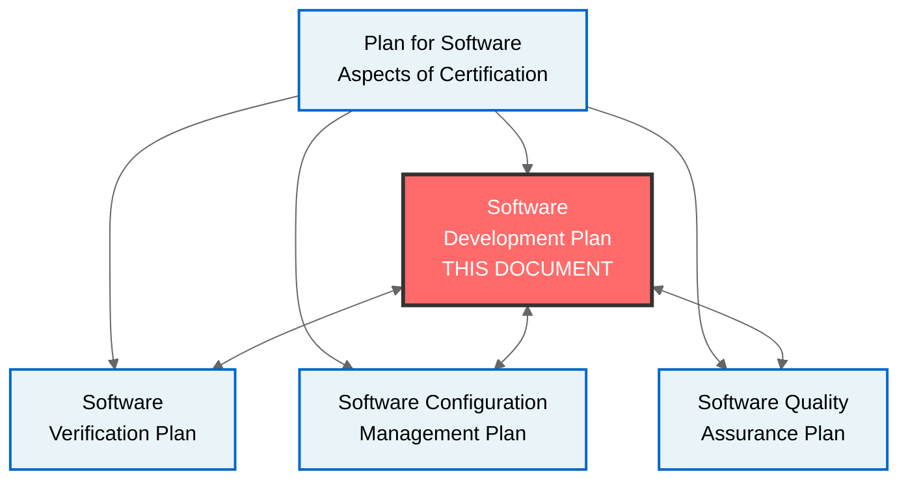

## 2. Software Development Process

### 2.1 Development Lifecycle Model

The QNS software follows a **V-Model** with iterative refinement:

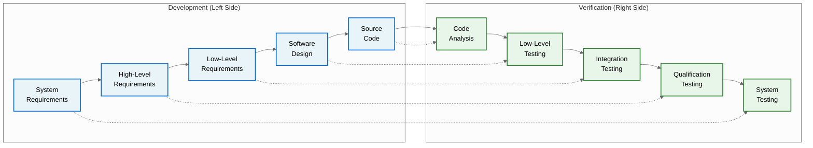

### 2.2 Development Organization

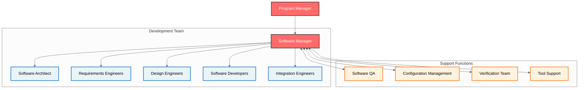

### 2.3 Development Phases and Transition Criteria

| Phase | Entry Criteria | Exit Criteria | Key Deliverables |
|-------|----------------|---------------|------------------|
| **Requirements** | - System requirements allocated<br>- Standards defined<br>- Tools available | - Requirements reviewed<br>- Traceability established<br>- Test cases identified | - Software Requirements Data (SRD)<br>- Requirements standards compliance |
| **Design** | - Requirements baselined<br>- Architecture approved<br>- Design standards defined | - Design reviewed<br>- All requirements allocated<br>- Interfaces defined | - Software Design Description (SDD)<br>- Interface Control Documents |
| **Coding** | - Design baselined<br>- Coding standards approved<br>- Development environment ready | - Code complete<br>- Unit tests passed<br>- Code reviews done | - Source code<br>- Unit test results |
| **Integration** | - Components tested<br>- Integration environment ready<br>- Test procedures approved | - Integration complete<br>- All interfaces verified<br>- Performance targets met | - Integrated software<br>- Integration test results |

### 2.4 Process Assurance

**Independence Requirements (DAL-B):**
- Requirements review: Independent reviewer
- Design review: Independent reviewer  
- Code review: Independent reviewer
- Test review: Independent reviewer

**Quality Gates:**
- Phase transition reviews
- Baseline establishment
- Metrics evaluation
- Problem report status

## 3. Software Development Standards

### 3.1 Standards Hierarchy

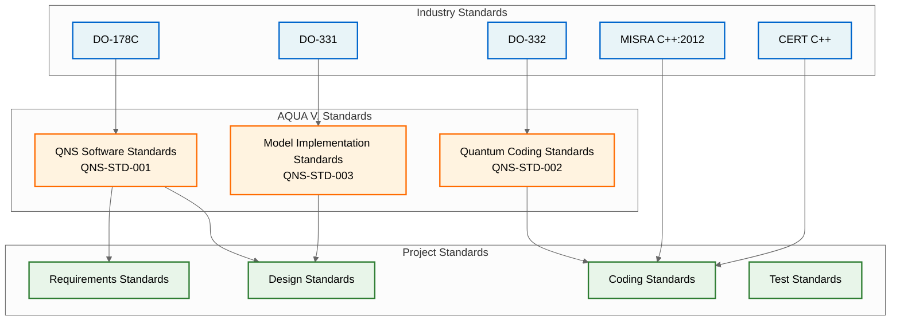

### 3.2 Requirements Standards

**Notation:**
- Natural language with formal semantics
- SHALL for mandatory requirements
- SHOULD for recommended practices
- Unique identifiers: QNS-HLR-XXXX, QNS-LLR-XXXX

**Structure:**
```
[REQ-ID] The [component] shall [action] [object] [condition].
Rationale: [justification]
Verification: [method]
```

### 3.3 Design Standards

**Architecture Design:**
- UML 2.5 for structural diagrams
- SysML for system integration
- AADL for real-time aspects

**Detailed Design:**
- Class diagrams for OOP structures
- Sequence diagrams for interactions
- State machines for behavioral logic

**Quantum Algorithm Design:**
- Mathematical notation for quantum states
- Circuit diagrams for quantum operations
- Formal proofs for correctness

### 3.4 Coding Standards

**C++ Standards (Primary Language):**
- MISRA C++:2012 mandatory rules
- CERT C++ secure coding
- No dynamic memory allocation
- No exceptions in flight code
- Deterministic execution time

**Python Standards (Tools Only):**
- PEP 8 style guide
- Type hints required
- No use in flight software

**Quantum Assembly (QASM):**
- AQUA V. Quantum Standards
- Gate-level optimization
- Error correction codes

### 3.5 Documentation Standards

**Code Documentation:**
```cpp
/**
 * @brief Calculate quantum navigation solution
 * @param[in] sensorData Current quantum sensor readings
 * @param[out] navSolution Computed navigation state
 * @return QNS_SUCCESS or error code
 * @req QNS-HLR-0001, QNS-HLR-0002
 * @test QNS-TEST-0001
 */
QnsResult calculateNavigation(const QuantumSensorData& sensorData,
                             NavigationSolution& navSolution);
```

## 4. Software Development Environment

### 4.1 Development Tools

| Tool | Version | Purpose | Qualification |
|------|---------|---------|---------------|
| **Requirements Management** |
| IBM DOORS | 9.7 | Requirements database | Configuration controlled |
| ReqIF Studio | 0.16 | Requirements exchange | Open source verified |
| **Design Tools** |
| Enterprise Architect | 16.1 | UML/SysML modeling | Commercial license |
| MATLAB/Simulink | R2024b | Quantum algorithm models | DO-331 qualified |
| **Development IDE** |
| Wind River Workbench | 4.0 | C++ development | Certified for VxWorks |
| Visual Studio Code | 1.85 | Script development | Configuration controlled |
| **Compilers** |
| Wind River Diab | 5.9.4.8 | C++ compiler | DO-178C qualified |
| GCC | 11.3 | Host tools only | Not for target code |
| **Analysis Tools** |
| Polyspace | R2024b | Static analysis | Qualified use |
| Coverity | 2024.6 | Code quality | Supplemental only |

### 4.2 Target Environment

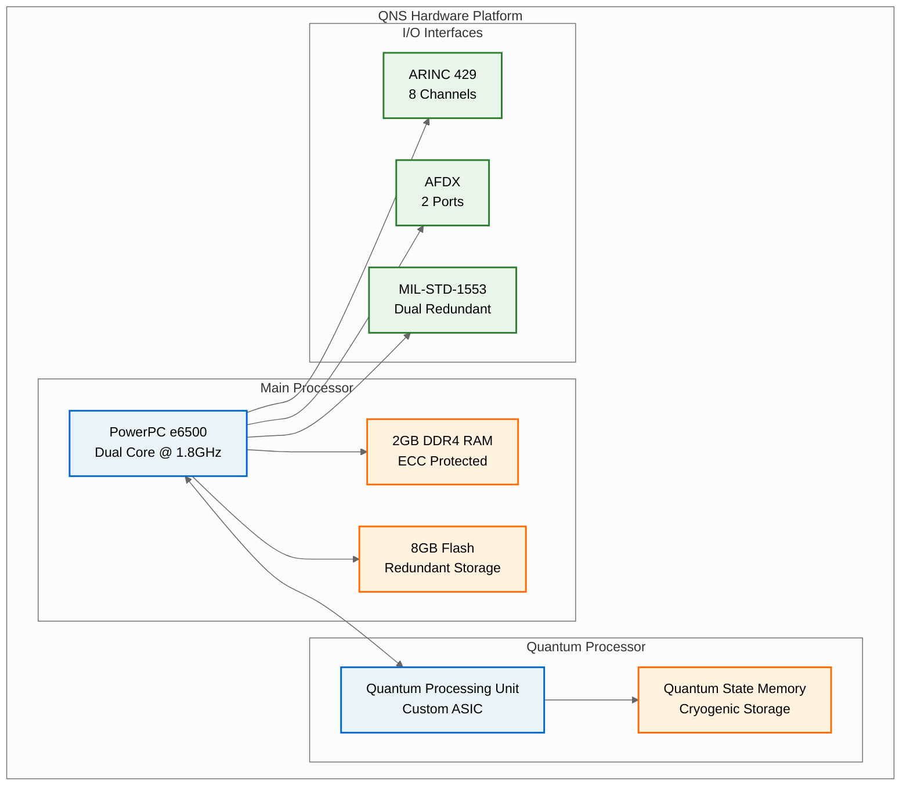

### 4.3 Development Infrastructure

**Version Control:**
- GitLab Enterprise (self-hosted)
- Git-flow branching model
- Protected master branch
- Merge request reviews

**Build System:**
- Jenkins CI/CD pipeline
- Automated builds every commit
- Static analysis integration
- Test automation

**Issue Tracking:**
- JIRA for problem reports
- Integrated with GitLab
- Automated workflow
- Metrics dashboard

## 5. Software Requirements Process

### 5.1 Requirements Development Flow

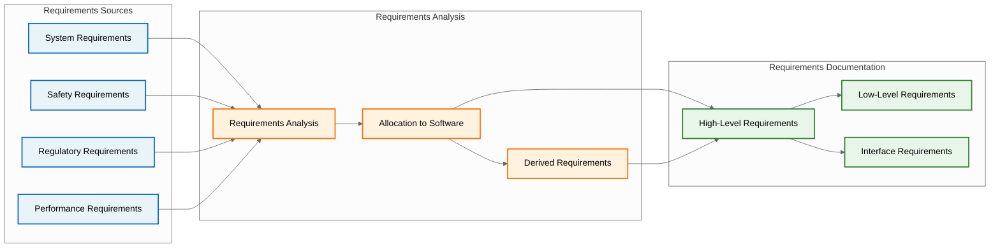

### 5.2 Requirements Attributes

Each requirement shall have:
- **Unique ID**: QNS-HLR-XXXX or QNS-LLR-XXXX
- **Text**: Clear, verifiable statement
- **Source**: Traceability to system requirement
- **Allocation**: Component assignment
- **Criticality**: Safety impact (DAL level)
- **Verification Method**: Test, Analysis, Review, Inspection
- **Status**: Draft, Reviewed, Approved, Verified

### 5.3 Derived Requirements

**Process for Derived Requirements:**
1. Identify during design activities
2. Document rationale for derivation
3. Assess safety impact
4. Feed back to system safety assessment
5. Obtain approval from systems engineering

**Categories:**
- Quantum state management constraints
- Real-time performance requirements
- Error detection and correction
- Hardware interface protocols
- Initialization sequences

## 6. Software Design Process

### 6.1 Design Development Flow

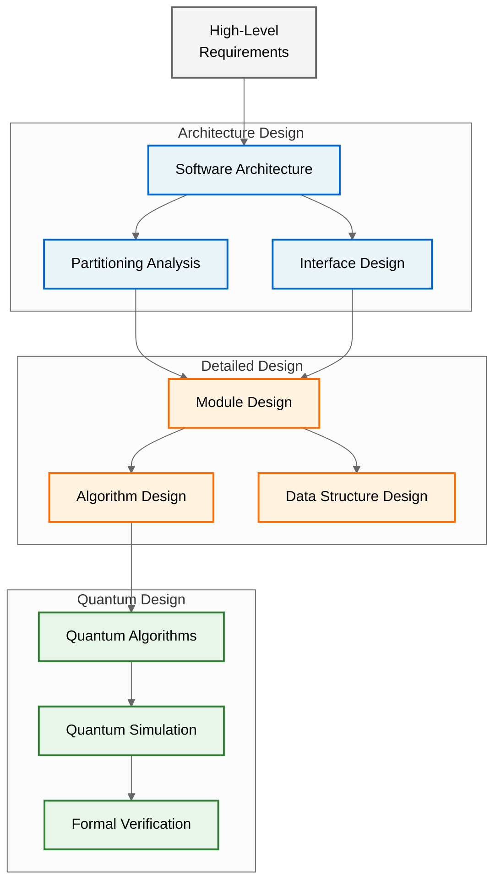

### 6.2 Architecture Design Principles

**Modularity:**
- Single responsibility principle
- Low coupling, high cohesion
- Clear interface definitions
- Hierarchical decomposition

**Safety by Design:**
- Fail-safe defaults
- Defensive programming
- Error propagation barriers
- Resource protection

**Real-Time Constraints:**
- Deterministic execution
- Bounded response times
- Priority-based scheduling
- Deadline monitoring

### 6.3 Design Methods and Notations

**Structural Design:**
- UML class diagrams
- Component diagrams
- Deployment diagrams

**Behavioral Design:**
- State machines (UML/SysML)
- Sequence diagrams
- Activity diagrams

**Quantum Algorithm Design:**
- Quantum circuit notation
- Bloch sphere representations
- Density matrix formalism
- Error correction codes

## 7. Software Coding Process

### 7.1 Coding Process Flow

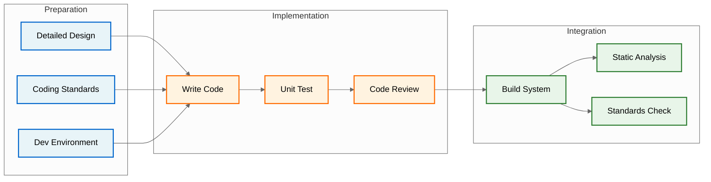

### 7.2 Programming Languages

**C++ (Primary Flight Software):**
- C++14 standard
- Safety-critical subset
- No dynamic allocation
- No exceptions
- Templates restricted

**QASM (Quantum Algorithms):**
- OpenQASM 3.0 base
- AQUA V. extensions
- Hardware optimized
- Error correction integrated

**Python (Development Tools Only):**
- Python 3.10+
- Type annotations required
- Not for flight software
- Test automation only

### 7.3 Code Organization

```
QNS_Software/
├── src/
│   ├── navigation/
│   │   ├── algorithms/
│   │   ├── filters/
│   │   └── fusion/
│   ├── quantum/
│   │   ├── state_manager/
│   │   ├── error_correction/
│   │   └── calibration/
│   ├── interfaces/
│   │   ├── arinc429/
│   │   ├── afdx/
│   │   └── mil1553/
│   ├── platform/
│   │   ├── hal/
│   │   ├── drivers/
│   │   └── rtos/
│   └── test/
│       ├── bit/
│       └── health/
├── include/
├── config/
├── build/
└── docs/
```

### 7.4 Code Review Process

**Review Checklist:**
- [ ] Requirements traceability
- [ ] Coding standards compliance
- [ ] Algorithm correctness
- [ ] Resource usage
- [ ] Error handling
- [ ] Real-time constraints
- [ ] Test coverage
- [ ] Documentation completeness

## 8. Software Integration Process

### 8.1 Integration Strategy

**Bottom-Up Integration:**
1. Hardware abstraction layer
2. Device drivers
3. Quantum sensor interfaces
4. Core algorithms
5. System services
6. Application layer

### 8.2 Integration Sequence

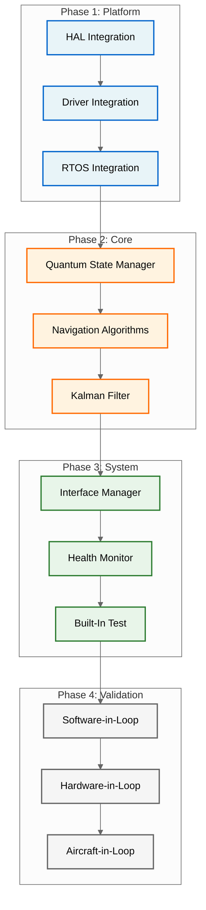

### 8.3 Integration Testing Approach

**Progressive Integration:**
- Component integration tests
- Subsystem integration tests
- System integration tests
- Hardware/software integration

**Test Environment:**
- Software Integration Lab (SIL)
- Hardware-in-the-Loop (HIL)
- Systems Integration Lab
- Iron bird testing

## 9. Problem Reporting and Corrective Action

### 9.1 Problem Report Process

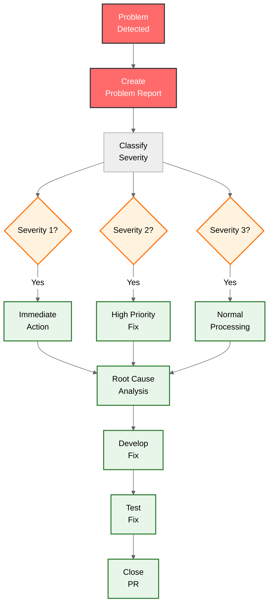

### 9.2 Problem Report Categories

| Severity | Description | Response Time | Examples |
|----------|-------------|---------------|----------|
| **1 - Critical** | Safety impact, blocks testing | < 24 hours | System crash, wrong navigation output |
| **2 - Major** | Significant functionality impact | < 1 week | Interface errors, performance issues |
| **3 - Minor** | Limited impact | < 1 month | Documentation errors, UI issues |
| **4 - Enhancement** | Improvement suggestion | Next release | Optimization opportunities |

### 9.3 Corrective Action Process

**Root Cause Analysis:**
- 5-Why analysis
- Fishbone diagrams
- Failure mode analysis
- Code inspection

**Preventive Actions:**
- Process improvements
- Tool enhancements
- Training updates
- Standard revisions

## 10. Supplier Management

### 10.1 Software Suppliers

| Supplier | Component | Criticality | Oversight Level |
|----------|-----------|-------------|-----------------|
| Wind River | VxWorks RTOS | DAL-B | Full lifecycle data |
| MathWorks | MATLAB/Simulink | Tool | Qualification data |
| IBM | DOORS | Tool | Configuration control |
| Internal Teams | All other SW | DAL-B | Direct control |

### 10.2 Supplier Control Process

```mermaid
%%{init: {'theme':'neutral', 'themeVariables': {'primaryTextColor':'#000'}}}%%
flowchart LR
    subgraph "Supplier Selection"
        EVAL[Evaluate<br/>Capability]
        AUDIT[Supplier<br/>Audit]
        CONT[Contract<br/>Agreement]
    end
    
    subgraph "Development Oversight"
        PLAN[Review<br/>Plans]
        PROG[Monitor<br/>Progress]
        DATA[Receive<br/>Data]
    end
    
    subgraph "Acceptance"
        VER[Verify<br/>Compliance]
        TEST[Acceptance<br/>Testing]
        CERT[Certification<br/>Evidence]
    end
    
    EVAL --> AUDIT
    AUDIT --> CONT
    CONT --> PLAN
    PLAN --> PROG
    PROG --> DATA
    DATA --> VER
    VER --> TEST
    TEST --> CERT
    
    classDef select fill:#e8f4f8,stroke:#0066cc,stroke-width:2px,color:#000
    classDef oversee fill:#fff3e0,stroke:#ff6b00,stroke-width:2px,color:#000
    classDef accept fill:#e8f5e9,stroke:#2e7d32,stroke-width:2px,color:#000
    
    class EVAL,AUDIT,CONT select
    class PLAN,PROG,DATA oversee
    class VER,TEST,CERT accept
```

### 10.3 Supplier Requirements

**DO-178C Compliance:**
- Lifecycle data package
- Compliance matrix
- Verification evidence
- Configuration index

**Technical Requirements:**
- Interface specifications
- Performance requirements
- Integration constraints
- Test requirements

## 11. Process Assurance

### 11.1 Metrics Collection

| Metric | Target | Measurement | Frequency |
|--------|--------|-------------|-----------|
| Requirements Stability | < 5% change/month | Baseline changes | Monthly |
| Code Quality | 0 MISRA mandatory violations | Static analysis | Per build |
| Test Progress | Per schedule | Tests passed/planned | Weekly |
| Defect Density | < 0.5/KSLOC | PR per KSLOC | Per release |
| Review Effectiveness | > 80% | Defects found in review | Per phase |

### 11.2 Process Improvement

**Continuous Improvement Process:**
1. Collect metrics
2. Analyze trends
3. Identify issues
4. Propose improvements
5. Implement changes
6. Measure effectiveness

**Improvement Areas:**
- Development efficiency
- Defect prevention
- Tool automation
- Review effectiveness
- Documentation quality

## 12. Certification Liaison

### 12.1 Authority Coordination

**Development Phase Interactions:**
- Requirements review package
- Design review package
- Code sample reviews
- Test witness opportunities

### 12.2 Compliance Evidence

**Development Artifacts for Certification:**
- Requirements with verification
- Design with rationale
- Source code with traceability
- Review records
- Test evidence
- Metrics reports

### 12.3 Open Items Tracking

**Certification Issues:**
- Issue papers for novel aspects
- Deviations from standards
- Alternative compliance methods
- Schedule impacts

---

**Document Control:**
- Author: QSTR Software Development Team
- Review: Software QA, Systems Engineering, DER
- Approval: Software Manager, Program Manager
- Distribution: Development Team, QA, Certification
- Classification: AQUA V. Proprietary

**Configuration:**
- Baseline: SDP-BASELINE-001
- Status: Released for SOI #1
- Next Review: After SOI #1 Feedback

**Related Documents:**
- [QUA-QNS01-25SVD0001-DES-BOB-REG-TD-QCSAA-910-003-00-01-TPL-DES-232-QSTR-v1.0.0 - PSAC](/A.Q.U.A.-V./PRODUCT_LINES/QUANTUM/QUANTUM_SOFTWARE/DESIGN/QNS_NAVIGATION/DES_REGULATORY/QUA-QNS01-25SVD0001-DES-BOB-REG-TD-QCSAA-910-003-00-01-TPL-DES-232-QSTR-v1.0.0.md)
- [QUA-QNS01-25SVD0001-DES-BOB-REG-TD-QCSAA-910-005-00-01-TPL-DES-234-QSTR-v1.0.0 - SVP](/A.Q.U.A.-V./PRODUCT_LINES/QUANTUM/QUANTUM_SOFTWARE/DESIGN/QNS_NAVIGATION/DES_REGULATORY/QUA-QNS01-25SVD0001-DES-BOB-REG-TD-QCSAA-910-005-00-01-TPL-DES-234-QSTR-v1.0.0.md)
- [QUA-QNS01-25SVD0001-DES-BOB-REG-TD-QCSAA-910-006-00-01-TPL-DES-235-QSTR-v1.0.0 - SCMP](/A.Q.U.A.-V./PRODUCT_LINES/QUANTUM/QUANTUM_SOFTWARE/DESIGN/QNS_NAVIGATION/DES_REGULATORY/QUA-QNS01-25SVD0001-DES-BOB-REG-TD-QCSAA-910-006-00-01-TPL-DES-235-QSTR-v1.0.0.md)
- [QUA-QNS01-25SVD0001-DES-BOB-TEC-TD-QCSAA-910-000-00-01-TPL-DES-200-QSTR-v1.0.0 - Software Requirements](/A.Q.U.A.-V./PRODUCT_LINES/QUANTUM/QUANTUM_SOFTWARE/DESIGN/QNS_NAVIGATION/DES_TECHNICAL/QUA-QNS01-25SVD0001-DES-BOB-TEC-TD-QCSAA-910-000-00-01-TPL-DES-200-QSTR-v1.0.0.md)

---

*This document is part of the AQUA V. Quantum Aerospace Program*  
*© 2025 AQUA V. - Aerospace and Quantum United Advanced Venture*
