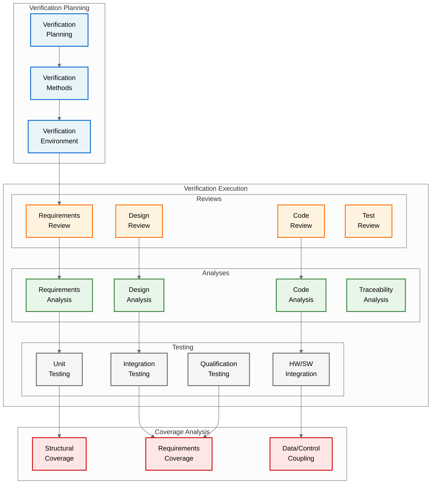
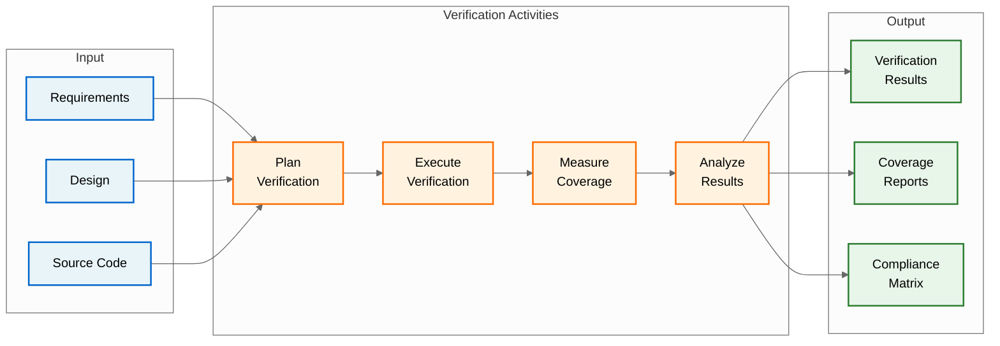
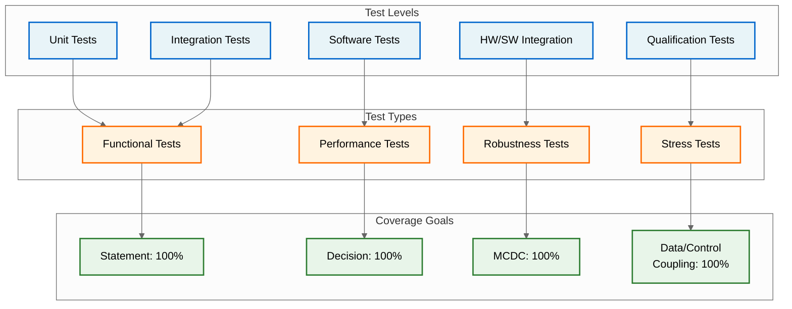
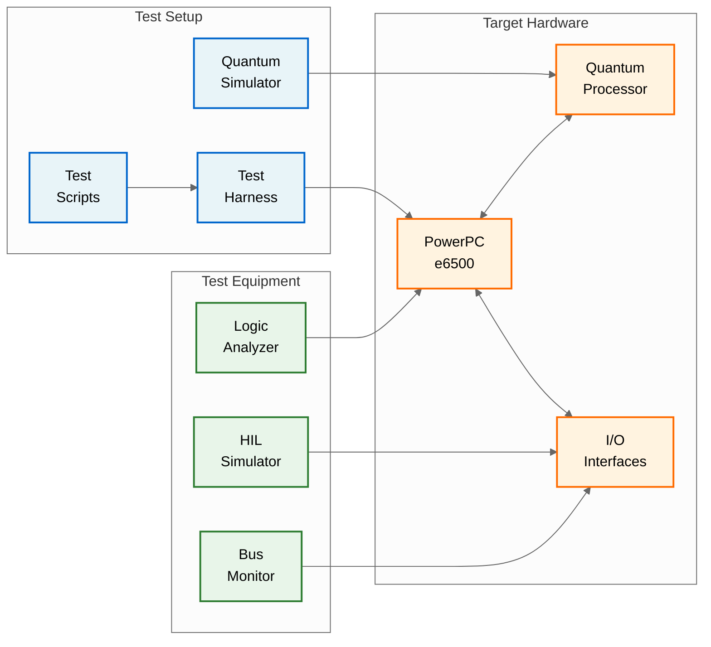
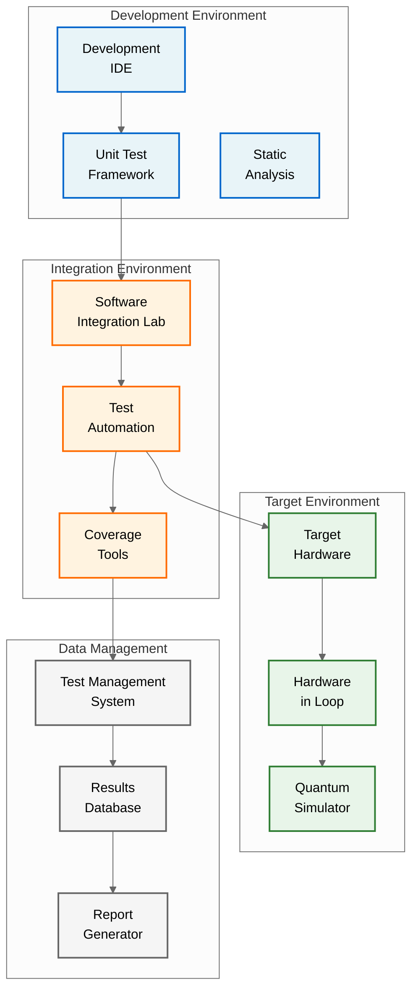
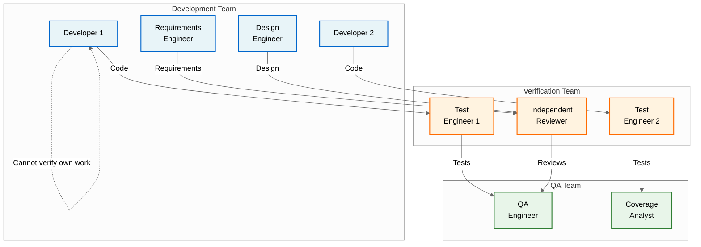
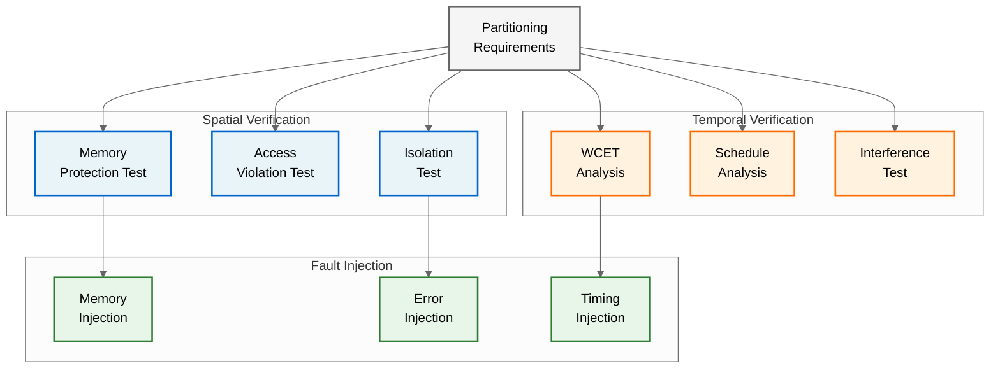
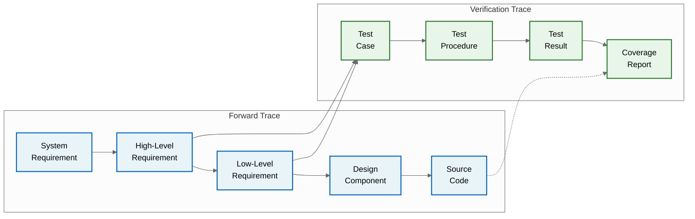

# QUA-QNS01-25SVD0001-DES-BOB-REG-TD-QCSAA-910-005-00-01-TPL-DES-234-QSTR-v1.0.0

## Software Verification Plan (SVP) - Quantum Navigation System

**Document Classification:** Regulatory Artifact - Technical Document  
**Q-Division:** QSTR-Structures  
**Template:** TPL-DES-234  
**Status:** Design Phase - Digital Twin (BOB)  
**Version:** 1.0.0  
**Date:** 2025-07-29  
**TRL:** 6 (System/subsystem model or prototype demonstration in relevant environment)  
**Compliance Standard:** DO-178C / ED-12C Section 11.3

---

## Executive Summary

This Software Verification Plan (SVP) defines the processes, methods, and procedures for verifying the Quantum Navigation System (QNS) software in compliance with DO-178C objectives for Design Assurance Level B (DAL-B). The plan establishes comprehensive verification activities including reviews, analyses, and testing to ensure the software satisfies its requirements and is safe for flight operation.

## Document Approval

| Role | Name | Signature | Date |
|------|------|-----------|------|
| Author | QSTR Verification Lead | ___________ | 2025-07-29 |
| Software Manager | QNS SW Manager | ___________ | 2025-07-29 |
| Software QA | QSTR QA Manager | ___________ | 2025-07-29 |
| Systems Engineering | QSTR Systems Lead | ___________ | 2025-07-29 |
| DER Software | Company DER | ___________ | 2025-07-29 |

## Revision History

| Version | Date | Description | Author |
|---------|------|-------------|--------|
| 1.0.0 | 2025-07-29 | Initial release for SOI #1 | QSTR Team |

## Table of Contents

1. [Introduction](#1-introduction)
2. [Software Verification Process](#2-software-verification-process)
3. [Software Reviews](#3-software-reviews)
4. [Software Analysis](#4-software-analysis)
5. [Software Testing](#5-software-testing)
6. [Verification of Verification](#6-verification-of-verification)
7. [Software Verification Environment](#7-software-verification-environment)
8. [Independence](#8-independence)
9. [Verification Methods and Procedures](#9-verification-methods-and-procedures)
10. [Partitioning Verification](#10-partitioning-verification)
11. [Traceability](#11-traceability)
12. [Verification Standards](#12-verification-standards)

## 1. Introduction

### 1.1 Purpose
This Software Verification Plan defines:
- Verification process objectives and activities
- Verification methods (reviews, analyses, tests)
- Verification environment and tools
- Independence requirements
- Coverage criteria and measurement
- Traceability approach

### 1.2 Scope
This plan covers verification of all QNS software components:
- Navigation Processing Software (NPS) - DAL-B
- Quantum State Management Software (QSMS) - DAL-B
- Interface Management Software (IMS) - DAL-B
- Hardware Abstraction Layer (HAL) - DAL-B
- Health Monitoring Software (HMS) - DAL-C
- Built-In Test Software (BITS) - DAL-D

### 1.3 Reference Documents

| Document | Title | Reference ID |
|----------|-------|--------------|
| DO-178C | Software Considerations in Airborne Systems and Equipment Certification | RTCA/DO-178C |
| DO-330 | Software Tool Qualification Considerations | RTCA/DO-330 |
| DO-331 | Model-Based Development and Verification | RTCA/DO-331 |
| DO-333 | Formal Methods | RTCA/DO-333 |
| [PSAC](/A.Q.U.A.-V./PRODUCT_LINES/QUANTUM/QUANTUM_SOFTWARE/DESIGN/QNS_NAVIGATION/DES_REGULATORY/QUA-QNS01-25SVD0001-DES-BOB-REG-TD-QCSAA-910-003-00-01-TPL-DES-232-QSTR-v1.0.0.md) | Plan for Software Aspects of Certification | Internal |
| [SDP](/A.Q.U.A.-V./PRODUCT_LINES/QUANTUM/QUANTUM_SOFTWARE/DESIGN/QNS_NAVIGATION/DES_REGULATORY/QUA-QNS01-25SVD0001-DES-BOB-REG-TD-QCSAA-910-004-00-01-TPL-DES-233-QSTR-v1.0.0.md) | Software Development Plan | Internal |
| [SCMP](/A.Q.U.A.-V./PRODUCT_LINES/QUANTUM/QUANTUM_SOFTWARE/DESIGN/QNS_NAVIGATION/DES_REGULATORY/QUA-QNS01-25SVD0001-DES-BOB-REG-TD-QCSAA-910-006-00-01-TPL-DES-235-QSTR-v1.0.0.md) | Software Configuration Management Plan | Internal |

### 1.4 Verification Objectives Summary

For DAL-B software, DO-178C requires:
- Reviews of all lifecycle data
- Requirements-based testing
- Structural coverage analysis (MCDC)
- Independence in verification activities
- Comprehensive traceability

## 2. Software Verification Process

### 2.1 Verification Process Overview



### 2.2 Verification Approach by Software Level

| Software Level | Reviews | Analyses | Testing | Coverage Required |
|----------------|---------|----------|---------|-------------------|
| **DAL-B** | All with independence | All required | All levels | 100% MCDC |
| **DAL-C** | All (no independence) | Most required | All levels | 100% Decision |
| **DAL-D** | Selected | Basic | Functional | 100% Statement |

### 2.3 Verification Process Flow



## 3. Software Reviews

### 3.1 Review Process

**Review Objectives:**
- Detect errors and defects
- Ensure standards compliance
- Verify completeness and consistency
- Assess verifiability

### 3.2 Review Types and Scope

| Review Type | Scope | Participants | Independence Required |
|-------------|-------|--------------|----------------------|
| **Requirements Review** | - Completeness<br>- Consistency<br>- Verifiability<br>- Traceability | Requirements engineer<br>Design engineer<br>Test engineer<br>Independent reviewer | Yes (DAL-B) |
| **Design Review** | - Architecture correctness<br>- Requirements allocation<br>- Interface definitions<br>- Algorithm soundness | Software architect<br>Design engineers<br>Test engineer<br>Independent reviewer | Yes (DAL-B) |
| **Code Review** | - Standards compliance<br>- Design implementation<br>- Error handling<br>- Resource usage | Developer<br>Peer developer<br>Test engineer<br>Independent reviewer | Yes (DAL-B) |
| **Test Review** | - Test coverage<br>- Procedure correctness<br>- Expected results<br>- Pass/fail criteria | Test engineer<br>Developer<br>QA engineer<br>Independent reviewer | Yes (DAL-B) |

### 3.3 Review Checklists

**Requirements Review Checklist:**
- [ ] Each requirement has unique identifier
- [ ] Requirements are atomic and testable
- [ ] No conflicts between requirements
- [ ] Safety requirements identified
- [ ] Derived requirements justified
- [ ] Verification method specified
- [ ] Traceability to system requirements

**Design Review Checklist:**
- [ ] All requirements allocated
- [ ] Interfaces fully defined
- [ ] Data flows documented
- [ ] Error conditions handled
- [ ] Resource usage bounded
- [ ] Timing constraints met
- [ ] Quantum algorithms verified

**Code Review Checklist:**
- [ ] Coding standards followed
- [ ] Design correctly implemented
- [ ] Comments adequate
- [ ] No dead code
- [ ] Variables initialized
- [ ] Bounds checking present
- [ ] MISRA violations resolved

### 3.4 Review Metrics

| Metric | Target | Measurement |
|--------|--------|-------------|
| Review Coverage | 100% | Items reviewed / Total items |
| Defect Density | < 5 per review | Defects found / Items reviewed |
| Review Effectiveness | > 80% | Defects in review / Total defects |
| Action Closure | 100% before phase exit | Actions closed / Total actions |

## 4. Software Analysis

### 4.1 Analysis Methods

```mermaid
%%{init: {'theme':'neutral', 'themeVariables': {'primaryTextColor':'#000'}}}%%
graph TB
    subgraph "Static Analysis"
        SA1[Control Flow<br/>Analysis]
        SA2[Data Flow<br/>Analysis]
        SA3[Stack Usage<br/>Analysis]
        SA4[Timing<br/>Analysis]
    end
    
    subgraph "Dynamic Analysis"
        DA1[Memory<br/>Analysis]
        DA2[Performance<br/>Analysis]
        DA3[Coverage<br/>Analysis]
        DA4[Runtime<br/>Errors]
    end
    
    subgraph "Formal Analysis"
        FA1[Model<br/>Checking]
        FA2[Theorem<br/>Proving]
        FA3[Abstract<br/>Interpretation]
        FA4[Quantum State<br/>Verification]
    end
    
    SOURCE[Source<br/>Code] --> SA1
    SOURCE --> SA2
    SOURCE --> SA3
    SOURCE --> SA4
    
    EXEC[Executable<br/>Code] --> DA1
    EXEC --> DA2
    EXEC --> DA3
    EXEC --> DA4
    
    MODEL[Formal<br/>Models] --> FA1
    MODEL --> FA2
    MODEL --> FA3
    MODEL --> FA4
    
    classDef source fill:#f5f5f5,stroke:#666,stroke-width:2px,color:#000
    classDef static fill:#e8f4f8,stroke:#0066cc,stroke-width:2px,color:#000
    classDef dynamic fill:#fff3e0,stroke:#ff6b00,stroke-width:2px,color:#000
    classDef formal fill:#e8f5e9,stroke:#2e7d32,stroke-width:2px,color:#000
    
    class SOURCE,EXEC,MODEL source
    class SA1,SA2,SA3,SA4 static
    class DA1,DA2,DA3,DA4 dynamic
    class FA1,FA2,FA3,FA4 formal
```



### 4.2 Requirements Analysis

**Objectives:**
- Verify requirements completeness
- Check for conflicts and ambiguities
- Ensure testability
- Validate safety requirements

**Methods:**
- Requirements parsing tools
- Consistency checking
- Formal specification (Z notation)
- Model checking for critical properties

### 4.3 Design Analysis

**Architecture Analysis:**
- Coupling and cohesion metrics
- Cyclomatic complexity
- Information flow analysis
- Dependency analysis

**Algorithm Analysis:**
- Correctness proofs for quantum algorithms
- Numerical stability analysis
- Worst-case execution time (WCET)
- Resource usage bounds

### 4.4 Source Code Analysis

**Static Analysis Tools:**
- Polyspace for runtime errors
- Coverity for code quality
- PC-lint for MISRA compliance
- Custom tools for quantum code

**Analysis Scope:**
- All DAL-B components: 100% coverage
- DAL-C components: Critical sections
- DAL-D components: Selected modules

## 5. Software Testing

### 5.1 Test Strategy



### 5.2 Test Development Process

**Requirements-Based Testing:**
1. Analyze each requirement
2. Identify test conditions
3. Design test cases
4. Define expected results
5. Create test procedures
6. Review test adequacy

**Test Case Structure:**
```
Test ID: QNS-TEST-XXXX
Requirement: QNS-HLR-XXXX
Description: [What is being tested]
Preconditions: [Initial state]
Test Steps:
  1. [Action]
  2. [Action]
  3. [Verify]
Expected Results: [Specific outcomes]
Actual Results: [To be filled during execution]
Pass/Fail: [Criteria]
```

### 5.3 Unit Testing

**Scope:**
- All functions/methods in DAL-B components
- Critical functions in DAL-C components
- Selected functions in DAL-D components

**Approach:**
- Test harness for each module
- Stub/mock external dependencies
- Boundary value testing
- Equivalence partitioning
- Error injection

**Quantum-Specific Unit Tests:**
- Quantum state initialization
- Gate operation correctness
- Entanglement verification
- Decoherence detection
- Error correction algorithms

### 5.4 Integration Testing

**Integration Levels:**
1. **Component Integration**
   - Quantum sensor interfaces
   - Algorithm modules
   - Data flow verification

2. **Subsystem Integration**
   - Navigation subsystem
   - Quantum subsystem
   - Interface subsystem

3. **System Integration**
   - Full software integration
   - Performance verification
   - Resource utilization

### 5.5 Hardware/Software Integration Testing

**Test Environment:**


### 5.6 Qualification Testing

**Test Categories:**
- Normal operation scenarios
- Abnormal operation scenarios
- Performance limits
- Stress conditions
- Failure modes

**Acceptance Criteria:**
- All requirements verified
- No critical defects
- Performance within limits
- Coverage targets achieved
- Certification evidence complete

## 6. Verification of Verification

### 6.1 Coverage Analysis

**Structural Coverage Requirements (DAL-B):**

| Coverage Type | Target | Method | Tool |
|---------------|--------|--------|------|
| Statement Coverage | 100% | Instrumentation | LDRA |
| Decision Coverage | 100% | Instrumentation | LDRA |
| Modified Condition/Decision Coverage (MCDC) | 100% | Instrumentation | LDRA |
| Data Coupling | 100% | Analysis | Custom |
| Control Coupling | 100% | Analysis | Custom |

### 6.2 Requirements Coverage

**Coverage Matrix:**
- Every requirement has test cases
- Bidirectional traceability
- No untested requirements
- No untraceable tests

### 6.3 Coverage Gap Analysis

**Process:**
1. Run instrumented code
2. Collect coverage data
3. Identify uncovered code
4. Analyze root cause:
   - Dead code → Remove
   - Defensive code → Justify
   - Missing tests → Create
   - Deactivated code → Document

## 7. Software Verification Environment

### 7.1 Test Environment Architecture



### 7.2 Test Tools

| Tool | Purpose | Version | Qualification Status |
|------|---------|---------|---------------------|
| **Test Execution** |
| VectorCAST | Unit test automation | 2024.1 | TQL-2 qualified |
| LDRA Testbed | Coverage analysis | 10.0 | TQL-2 qualified |
| QNS-TEST | Custom test framework | 1.0 | In-house qualification |
| **Static Analysis** |
| Polyspace | Runtime error detection | R2024b | TQL-3 qualified |
| PC-lint Plus | MISRA checking | 2.0 | Configuration controlled |
| **Quantum Verification** |
| Qiskit | Quantum simulation | 0.45 | Research tool |
| QuTiP | Quantum verification | 5.0 | Research tool |
| **Test Management** |
| DOORS Test | Requirements coverage | 9.7 | Configuration controlled |
| Jenkins | Test automation | 2.440 | Infrastructure |

### 7.3 Test Data Management

**Test Data Categories:**
- Input vectors
- Expected results
- Configuration files
- Calibration data
- Error injection patterns

**Data Control:**
- Version controlled
- Traceable to requirements
- Validated before use
- Archived after execution

## 8. Independence

### 8.1 Independence Requirements

For DAL-B software, independence is required for:

| Activity | Developer | Verifier | Independence Level |
|----------|-----------|----------|-------------------|
| Requirements Review | Requirements Engineer | Independent Reviewer | Different person |
| Design Review | Design Engineer | Independent Reviewer | Different person |
| Code Review | Developer | Independent Reviewer | Different person |
| Test Development | Developer | Test Engineer | Different team |
| Test Execution | Test Engineer | Independent Tester | Different person |
| Coverage Analysis | Test Engineer | QA Engineer | Different team |

### 8.2 Independence Implementation



## 9. Verification Methods and Procedures

### 9.1 Review Procedures

**Procedure Template:**
```
Procedure ID: QNS-REV-XXXX
Review Type: [Requirements/Design/Code/Test]
Input: [Documents to review]
Participants: [Roles required]
Process:
  1. Distribute materials (2 days prior)
  2. Individual review
  3. Review meeting
  4. Document findings
  5. Track actions
  6. Verify closure
Output: Review report with actions
```

### 9.2 Test Procedures

**Test Procedure Structure:**
```
Procedure ID: QNS-PROC-XXXX
Test Level: [Unit/Integration/System]
Prerequisites:
  - Hardware configuration
  - Software version
  - Test data loaded
Setup:
  1. [Setup step]
  2. [Setup step]
Execution:
  1. [Test step with expected result]
  2. [Test step with expected result]
Teardown:
  1. [Cleanup step]
Pass/Fail Criteria: [Specific criteria]
```

### 9.3 Analysis Procedures

**Static Analysis Procedure:**
1. Configure analysis tool
2. Set coding standard rules
3. Run analysis
4. Review violations
5. Classify findings:
   - Real defects → Fix
   - False positives → Justify
   - Rule deviations → Document
6. Re-run to verify fixes

### 9.4 Regression Testing

**Regression Strategy:**
- Full regression for major changes
- Targeted regression for minor changes
- Automated regression suite
- Impact analysis driven

**Regression Selection:**
- Modified components
- Dependent components
- Interface tests
- Critical path tests

## 10. Partitioning Verification

### 10.1 Partitioning Requirements

**Spatial Partitioning:**
- Memory protection between components
- No unauthorized memory access
- Protected mode execution

**Temporal Partitioning:**
- Guaranteed time slots
- No timing interference
- Worst-case execution time bounds

### 10.2 Partitioning Verification Methods



## 11. Traceability

### 11.1 Traceability Requirements

**Bidirectional Traceability:**
- System Requirements ↔ Software Requirements
- Software Requirements ↔ Design
- Design ↔ Source Code
- Requirements ↔ Test Cases
- Test Cases ↔ Test Results
- Problem Reports ↔ Changes

### 11.2 Traceability Matrix



### 11.3 Traceability Tools

**Requirements Management:**
- IBM DOORS for requirements traceability
- Custom scripts for code traceability
- Test management system integration

**Traceability Reports:**
- Requirements to test matrix
- Test to requirements matrix
- Orphan analysis (untested requirements)
- Dead code analysis (untraceable code)

## 12. Verification Standards

### 12.1 Verification Standards Hierarchy

| Standard Level | Document | Applicability |
|----------------|----------|---------------|
| **Industry** | DO-178C | Overall framework |
| | DO-330 | Tool qualification |
| | DO-331 | Model verification |
| | DO-333 | Formal methods |
| **Company** | AQUA-VER-001 | Verification procedures |
| | AQUA-TEST-001 | Test standards |
| | AQUA-QUA-001 | Quantum verification |
| **Project** | QNS-VER-STD | Project specific |

### 12.2 Test Case Standards

**Test Case Quality Criteria:**
- Atomic (tests one thing)
- Repeatable (deterministic)
- Independent (no dependencies)
- Traceable (to requirements)
- Verifiable (clear pass/fail)

**Test Naming Convention:**
```
QNS-[LEVEL]-[COMPONENT]-[TYPE]-[NUMBER]
Where:
  LEVEL = UT/IT/ST/HIT/QT
  COMPONENT = NPS/QSMS/IMS/etc.
  TYPE = FUNC/PERF/ROB/STR
  NUMBER = Sequential
```

### 12.3 Quantum-Specific Standards

**Quantum State Verification:**
- State tomography procedures
- Fidelity measurements
- Entanglement verification
- Decoherence testing

**Quantum Algorithm Verification:**
- Mathematical proofs
- Simulation validation
- Hardware correlation
- Error rate analysis

---

**Document Control:**
- Author: QSTR Verification Team
- Review: Software QA, Systems Engineering, DER
- Approval: Verification Manager, Software Manager
- Distribution: Verification Team, Development Team, QA, Certification
- Classification: AQUA V. Proprietary

**Configuration:**
- Baseline: SVP-BASELINE-001
- Status: Released for SOI #1
- Next Review: After SOI #1 Feedback

**Related Documents:**
- [QUA-QNS01-25SVD0001-DES-BOB-REG-TD-QCSAA-910-003-00-01-TPL-DES-232-QSTR-v1.0.0 - PSAC](/A.Q.U.A.-V./PRODUCT_LINES/QUANTUM/QUANTUM_SOFTWARE/DESIGN/QNS_NAVIGATION/DES_REGULATORY/QUA-QNS01-25SVD0001-DES-BOB-REG-TD-QCSAA-910-003-00-01-TPL-DES-232-QSTR-v1.0.0.md)
- [QUA-QNS01-25SVD0001-DES-BOB-REG-TD-QCSAA-910-004-00-01-TPL-DES-233-QSTR-v1.0.0 - SDP](/A.Q.U.A.-V./PRODUCT_LINES/QUANTUM/QUANTUM_SOFTWARE/DESIGN/QNS_NAVIGATION/DES_REGULATORY/QUA-QNS01-25SVD0001-DES-BOB-REG-TD-QCSAA-910-004-00-01-TPL-DES-233-QSTR-v1.0.0.md)
- [QUA-QNS01-25SVD0001-DES-BOB-REG-TD-QCSAA-910-006-00-01-TPL-DES-235-QSTR-v1.0.0 - SCMP](/A.Q.U.A.-V./PRODUCT_LINES/QUANTUM/QUANTUM_SOFTWARE/DESIGN/QNS_NAVIGATION/DES_REGULATORY/QUA-QNS01-25SVD0001-DES-BOB-REG-TD-QCSAA-910-006-00-01-TPL-DES-235-QSTR-v1.0.0.md)
- [QUA-QNS01-25SVD0001-DES-BOB-TEC-TD-QCSAA-910-000-00-01-TPL-DES-200-QSTR-v1.0.0 - Software Requirements](/A.Q.U.A.-V./PRODUCT_LINES/QUANTUM/QUANTUM_SOFTWARE/DESIGN/QNS_NAVIGATION/DES_TECHNICAL/QUA-QNS01-25SVD0001-DES-BOB-TEC-TD-QCSAA-910-000-00-01-TPL-DES-200-QSTR-v1.0.0.md)

---

*This document is part of the AQUA V. Quantum Aerospace Program*  
*© 2025 AQUA V. - Aerospace and Quantum United Advanced Venture*
