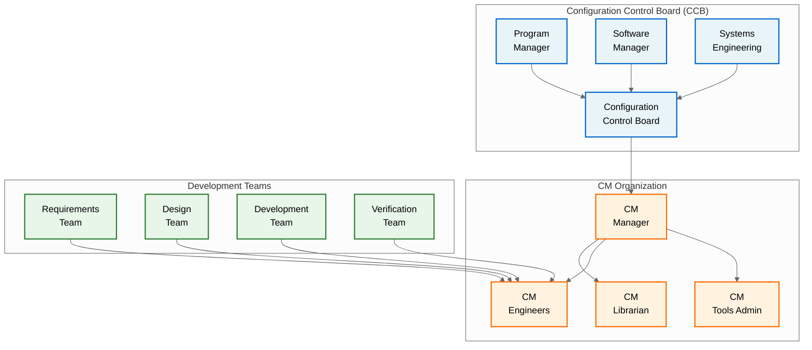
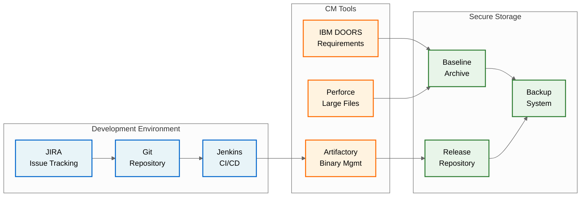
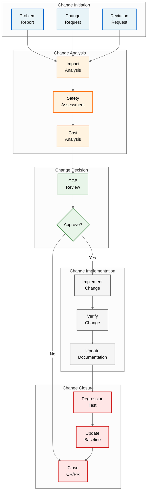
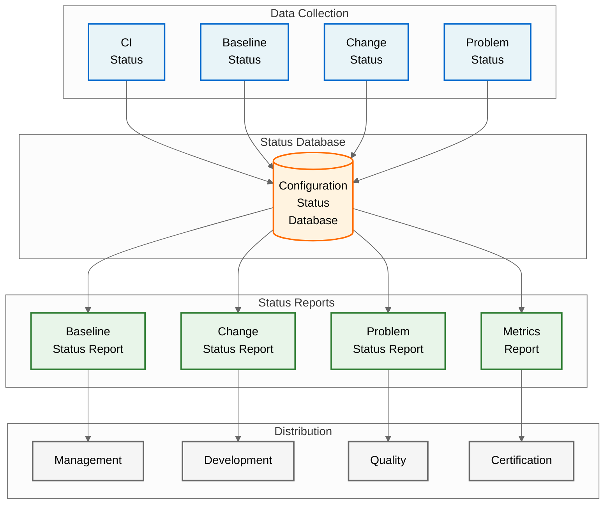
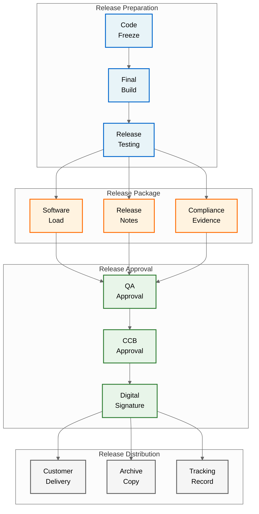
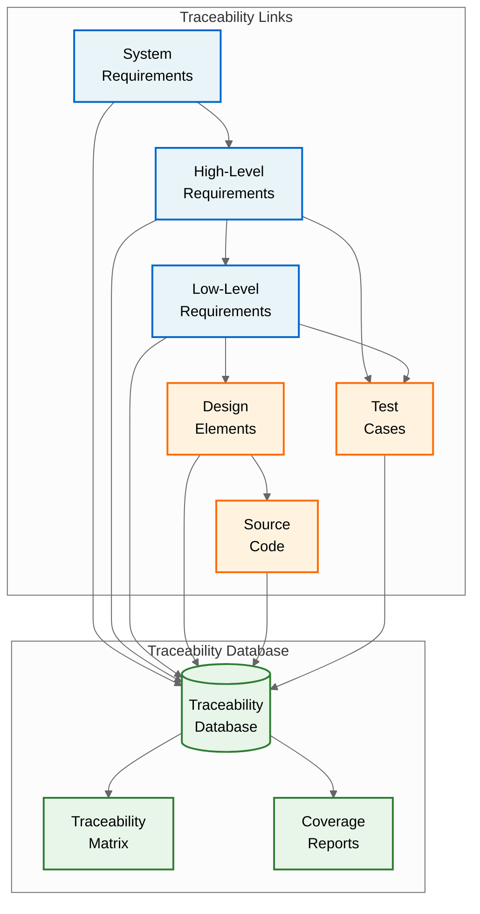

# QUA-QNS01-25SVD0001-DES-BOB-REG-TD-QCSAA-910-006-00-01-TPL-DES-235-QSTR-v1.0.0

## Software Configuration Management Plan (SCMP) - Quantum Navigation System

**Document Classification:** Regulatory Artifact - Technical Document  
**Q-Division:** QSTR-Structures  
**Template:** TPL-DES-235  
**Status:** Design Phase - Digital Twin (BOB)  
**Version:** 1.0.0  
**Date:** 2025-07-30  
**TRL:** 6 (System/subsystem model or prototype demonstration in relevant environment)  
**Compliance Standard:** DO-178C / ED-12C Section 7

---

## Executive Summary

This Software Configuration Management Plan (SCMP) defines the configuration management processes, procedures, and tools for the Quantum Navigation System (QNS) software development. This plan ensures configuration control of all software lifecycle data in compliance with DO-178C objectives for Design Assurance Level B (DAL-B). The plan establishes comprehensive configuration management activities including identification, control, status accounting, and audits to maintain integrity throughout the software lifecycle.

## Document Approval

| Role | Name | Signature | Date |
|------|------|-----------|------|
| Author | QSTR CM Lead | ___________ | 2025-07-30 |
| Software Manager | QNS SW Manager | ___________ | 2025-07-30 |
| Software QA | QSTR QA Manager | ___________ | 2025-07-30 |
| Systems Engineering | QSTR Systems Lead | ___________ | 2025-07-30 |
| DER Software | Company DER | ___________ | 2025-07-30 |

## Revision History

| Version | Date | Description | Author |
|---------|------|-------------|--------|
| 1.0.0 | 2025-07-30 | Initial release for SOI #1 | QSTR Team |

## Table of Contents

1. [Introduction](#1-introduction)
2. [Configuration Management Environment](#2-configuration-management-environment)
3. [Configuration Identification](#3-configuration-identification)
   - 3.1 [Configuration Item (CI) Identification Scheme](#31-configuration-item-ci-identification-scheme)
   - 3.2 [Configuration Items List](#32-configuration-items-list)
   - 3.3 [CI Attributes](#33-ci-attributes)
   - 3.4 [CI Naming to AQUA V. Nomenclature Mapping](#34-ci-naming-to-aqua-v-nomenclature-mapping)
4. [Baselines](#4-baselines)
5. [Configuration Control](#5-configuration-control)
6. [Configuration Status Accounting](#6-configuration-status-accounting)
7. [Archive, Retrieval and Release](#7-archive-retrieval-and-release)
8. [Software Lifecycle Data Control](#8-software-lifecycle-data-control)
9. [Software Load Control](#9-software-load-control)
10. [Configuration Management Tools](#10-configuration-management-tools)
11. [CM Activities by Lifecycle Phase](#11-cm-activities-by-lifecycle-phase)
12. [Supplier Configuration Management](#12-supplier-configuration-management)

## 1. Introduction

### 1.1 Purpose
This Software Configuration Management Plan defines:
- Configuration management organization and responsibilities
- Configuration identification scheme
- Baseline establishment and control procedures
- Change control processes
- Configuration status accounting methods
- Archive and release procedures
- Software load control for quantum-enhanced systems

### 1.2 Scope
This plan covers configuration management of all QNS software components and associated lifecycle data:
- Software components (DAL-B, DAL-C, DAL-D)
- Software lifecycle data (plans, standards, designs, code, tests)
- Tool qualification data
- Quantum algorithm libraries and models
- Hardware/software interface specifications
- Third-party software components

### 1.3 Reference Documents

| Document | Title | Reference ID |
|----------|-------|--------------|
| DO-178C | Software Considerations in Airborne Systems and Equipment Certification | RTCA/DO-178C |
| DO-200B | Standards for Processing Aeronautical Data | RTCA/DO-200B |
| ARP4754A | Guidelines for Development of Civil Aircraft and Systems | SAE ARP4754A |
| [PSAC](/A.Q.U.A.-V./PRODUCT_LINES/QUANTUM/QUANTUM_SOFTWARE/DESIGN/QNS_NAVIGATION/DES_REGULATORY/QUA-QNS01-25SVD0001-DES-BOB-REG-TD-QCSAA-910-003-00-01-TPL-DES-232-QSTR-v1.0.0.md) | Plan for Software Aspects of Certification | Internal |
| [SDP](/A.Q.U.A.-V./PRODUCT_LINES/QUANTUM/QUANTUM_SOFTWARE/DESIGN/QNS_NAVIGATION/DES_REGULATORY/QUA-QNS01-25SVD0001-DES-BOB-REG-TD-QCSAA-910-004-00-01-TPL-DES-233-QSTR-v1.0.0.md) | Software Development Plan | Internal |
| [SVP](/A.Q.U.A.-V./PRODUCT_LINES/QUANTUM/QUANTUM_SOFTWARE/DESIGN/QNS_NAVIGATION/DES_REGULATORY/QUA-QNS01-25SVD0001-DES-BOB-REG-TD-QCSAA-910-005-00-01-TPL-DES-234-QSTR-v1.0.0.md) | Software Verification Plan | Internal |

### 1.4 Configuration Management Objectives

For DAL-B software, DO-178C requires:
- Unique identification of configuration items
- Controlled baselines at defined milestones
- Problem reporting and change control
- Configuration status accounting
- Archive and retrieval procedures
- Protection against unauthorized changes

## 2. Configuration Management Environment

### 2.1 CM Organization Structure



### 2.2 Roles and Responsibilities

| Role | Responsibilities |
|------|------------------|
| **Configuration Control Board (CCB)** | - Approve baselines<br>- Authorize changes to baselines<br>- Review change impact<br>- Approve deviations and waivers |
| **CM Manager** | - Develop and maintain SCMP<br>- Chair CCB meetings<br>- Oversee CM activities<br>- Report CM status |
| **CM Librarian** | - Maintain CM repositories<br>- Control access permissions<br>- Perform builds and releases<br>- Archive baselines |
| **CM Engineers** | - Support development teams<br>- Implement CM procedures<br>- Track configuration items<br>- Generate CM reports |
| **Development Teams** | - Follow CM procedures<br>- Submit change requests<br>- Update CI documentation<br>- Participate in audits |

### 2.3 CM Environment Infrastructure



## 3. Configuration Identification

### 3.1 Configuration Item (CI) Identification Scheme

**CI Naming Convention:**
```
[PROJECT]-[TYPE]-[COMPONENT]-[VERSION]

Where:
  PROJECT = QNS (Quantum Navigation System)
  TYPE = REQ/DES/SRC/TST/DOC/DAT
  COMPONENT = Specific component identifier
  VERSION = Major.Minor.Patch (Semantic Versioning)

Example: QNS-SRC-NPS-2.1.0
```

### 3.2 Configuration Items List

| CI Type | Configuration Item | Identifier | Control Level |
|---------|-------------------|------------|---------------|
| **Plans** |
| | Plan for Software Aspects of Certification | QNS-DOC-PSAC-X.Y.Z | Baseline |
| | Software Development Plan | QNS-DOC-SDP-X.Y.Z | Baseline |
| | Software Verification Plan | QNS-DOC-SVP-X.Y.Z | Baseline |
| | Software Configuration Management Plan | QNS-DOC-SCMP-X.Y.Z | Baseline |
| | Software Quality Assurance Plan | QNS-DOC-SQAP-X.Y.Z | Baseline |
| **Standards** |
| | Software Requirements Standards | QNS-DOC-SRS-X.Y.Z | Baseline |
| | Software Design Standards | QNS-DOC-SDS-X.Y.Z | Baseline |
| | Software Code Standards | QNS-DOC-SCS-X.Y.Z | Baseline |
| **Requirements** |
| | System Requirements | QNS-REQ-SYS-X.Y.Z | Baseline |
| | Software High-Level Requirements | QNS-REQ-HLR-X.Y.Z | Baseline |
| | Software Low-Level Requirements | QNS-REQ-LLR-X.Y.Z | Baseline |
| | Derived Requirements | QNS-REQ-DER-X.Y.Z | Baseline |
| **Design** |
| | Software Architecture | QNS-DES-ARCH-X.Y.Z | Baseline |
| | Interface Control Documents | QNS-DES-ICD-X.Y.Z | Baseline |
| | Database Design | QNS-DES-DB-X.Y.Z | Baseline |
| | Quantum Algorithm Specifications | QNS-DES-QAS-X.Y.Z | Baseline |
| **Source Code** |
| | Navigation Processing Software | QNS-SRC-NPS-X.Y.Z | Baseline |
| | Quantum State Management Software | QNS-SRC-QSMS-X.Y.Z | Baseline |
| | Interface Management Software | QNS-SRC-IMS-X.Y.Z | Baseline |
| | Hardware Abstraction Layer | QNS-SRC-HAL-X.Y.Z | Baseline |
| | Health Monitoring Software | QNS-SRC-HMS-X.Y.Z | Baseline |
| | Built-In Test Software | QNS-SRC-BITS-X.Y.Z | Baseline |
| **Test** |
| | Test Cases | QNS-TST-CASE-X.Y.Z | Baseline |
| | Test Procedures | QNS-TST-PROC-X.Y.Z | Baseline |
| | Test Results | QNS-TST-RES-X.Y.Z | Archive |
| **Data** |
| | Parameter Data Files | QNS-DAT-PARAM-X.Y.Z | Baseline |
| | Quantum Calibration Data | QNS-DAT-QCAL-X.Y.Z | Baseline |
| | Configuration Tables | QNS-DAT-CFG-X.Y.Z | Baseline |
| **Tools** |
| | Qualified Tools | QNS-TOOL-[NAME]-X.Y.Z | Baseline |
| | Tool Qualification Data | QNS-TOOL-QUAL-X.Y.Z | Baseline |

### 3.3 CI Attributes

Each configuration item shall have the following attributes tracked:

| Attribute | Description | Example |
|-----------|-------------|---------|
| CI Identifier | Unique identifier | QNS-SRC-NPS-2.1.0 |
| Title | Descriptive name | Navigation Processing Software |
| Type | Category of CI | Source Code |
| Owner | Responsible person/team | Navigation Team |
| Status | Current lifecycle state | Released |
| DAL Level | Design Assurance Level | DAL-B |
| Location | Repository path | /src/navigation/nps/ |
| Dependencies | Related CIs | QNS-DES-ARCH-1.0.0 |
| Checksum | Integrity verification | SHA-256 hash |

### 3.4 CI Naming to AQUA V. Nomenclature Mapping

The Configuration Item (CI) identification scheme maps to the AQUA V. Official Nomenclature System as follows:

#### 3.4.1 Mapping Structure

```
CI Identifier:        [PROJECT]-[TYPE]-[COMPONENT]-[VERSION]
                             ↓      ↓        ↓          ↓
AQUA V. Nomenclature: [LÍNEA]-[PRODUCTO]-[MSN]-[FASE]-[ALI/BOB]-[ARTIFACT]-[TYPE]-[UTCS]-[CÓDIGO]-[TEMPLATE]-[QD]-[VERSIÓN]
```

#### 3.4.2 Mapping Rules

| CI Element | AQUA V. Field | Mapping Rule | Example |
|------------|---------------|--------------|---------|
| PROJECT | LÍNEA + PRODUCTO | QNS → QUA-QNS01 | QNS → QUA-QNS01 |
| TYPE | ARTIFACT + TYPE | SRC → TEC-SM (Source Module)<br>DOC → REG-TD (Document)<br>TST → FUN-TD (Test) | SRC → TEC-SM |
| COMPONENT | CÓDIGO | Component maps to specific code | NPS → 914-000-00-01 |
| VERSION | VERSIÓN | Direct mapping | 2.1.0 → v2.1.0 |

#### 3.4.3 Complete Mapping Examples

**Source Code Example:**
```
CI Identifier:    QNS-SRC-NPS-2.1.0
AQUA V. Filename: QUA-QNS01-25SVD0001-DEV-BOB-TEC-SM-QCSAA-914-000-00-01-TPL-DEV-004-QSTR-v2.1.0.cpp

Where:
- QNS → QUA-QNS01 (Quantum Navigation System)
- SRC → TEC-SM (Technical Artifact - Software Module)
- NPS → 914-000-00-01 (Navigation Processing Software UTCS code)
- 2.1.0 → v2.1.0 (Version)
- Phase: DEV (Development phase for source code)
- MSN: 25SVD0001 (Silicon Valley Development site)
```

**Document Example:**
```
CI Identifier:    QNS-DOC-SDP-1.0.0
AQUA V. Filename: QUA-QNS01-25SVD0001-DES-BOB-REG-TD-QCSAA-910-004-00-01-TPL-DES-233-QSTR-v1.0.0.md

Where:
- QNS → QUA-QNS01
- DOC → REG-TD (Regulatory Artifact - Technical Document)
- SDP → 910-004 (Software Development Plan specific code)
- 1.0.0 → v1.0.0
```

**Test Case Example:**
```
CI Identifier:    QNS-TST-CASE-3.2.1
AQUA V. Filename: QUA-QNS01-25SVD0001-VER-BOB-FUN-TD-QCSAA-917-001-00-01-TPL-VER-312-QSTR-v3.2.1.yaml

Where:
- QNS → QUA-QNS01
- TST → FUN-TD (Functional Artifact - Technical Document)
- CASE → 917-001 (Test Case specific code)
- 3.2.1 → v3.2.1
- Phase: VER (Verification phase for test execution)
```

#### 3.4.4 Repository Structure Alignment

The physical repository structure follows the AQUA V. nomenclature hierarchy:

```
/AQUA-V/
└── /PRODUCT_LINES/
    └── /QUANTUM/
        └── /QNS_NAVIGATION/
            ├── /DESIGN/
            │   └── QUA-QNS01-25SVD0001-DES-BOB-*.md
            ├── /DEVELOPMENT/
            │   └── /src/
            │       └── QUA-QNS01-25SVD0001-DEV-BOB-TEC-SM-*.cpp
            ├── /VERIFICATION/
            │   └── /tests/
            │       └── QUA-QNS01-25SVD0001-VER-BOB-FUN-TD-*.yaml
            └── /PRODUCTION/
                └── /releases/
                    └── QUA-QNS01-25SVD0001-PRD-ALI-*.bin
```

#### 3.4.5 Version Control Integration

Git tags and branches use the CI identifier for simplicity, while the full AQUA V. nomenclature is used for:
- File names in the repository
- Formal baselines
- Certification deliverables
- Archive records

**Example Git to AQUA V. Mapping:**
```
Git Tag:          QNS-SRC-NPS-2.1.0
Git Branch:       feature/QNS-NPS-quantum-optimization
Actual Filename:  QUA-QNS01-25SVD0001-DEV-BOB-TEC-SM-QCSAA-914-000-00-01-TPL-DEV-004-QSTR-v2.1.0.cpp
```

This dual naming approach provides:
- Simple, readable identifiers for daily development work
- Full traceability through AQUA V. nomenclature for formal processes
- Complete digital thread from CI to physical file

## 4. Baselines

### 4.1 Baseline Strategy

```mermaid
%%{init: {'theme':'neutral', 'themeVariables': {'primaryTextColor':'#000'}}}%%
graph LR
    subgraph "Planning Phase"
        PB[Planning<br/>Baseline]
    end
    
    subgraph "Development Phase"
        RB[Requirements<br/>Baseline]
        DB[Design<br/>Baseline]
        CB[Code<br/>Baseline]
    end
    
    subgraph "Verification Phase"
        TB[Test<br/>Baseline]
        QB[Qualification<br/>Baseline]
    end
    
    subgraph "Production Phase"
        PRB[Production<br/>Baseline]
        CRB[Certification<br/>Baseline]
    end
    
    PB --> RB
    RB --> DB
    DB --> CB
    CB --> TB
    TB --> QB
    QB --> PRB
    PRB --> CRB
    
    classDef planning fill:#e8f4f8,stroke:#0066cc,stroke-width:2px,color:#000
    classDef dev fill:#fff3e0,stroke:#ff6b00,stroke-width:2px,color:#000
    classDef ver fill:#e8f5e9,stroke:#2e7d32,stroke-width:2px,color:#000
    classDef prod fill:#f5f5f5,stroke:#666,stroke-width:2px,color:#000
    
    class PB planning
    class RB,DB,CB dev
    class TB,QB ver
    class PRB,CRB prod
```



### 4.2 Baseline Definitions

| Baseline | Contents | Approval | Timing |
|----------|----------|----------|--------|
| **Planning Baseline** | - PSAC<br>- SDP, SVP, SCMP, SQAP<br>- Standards | CCB | Before development start |
| **Requirements Baseline** | - System requirements<br>- Software requirements<br>- ICD requirements | CCB | After requirements review |
| **Design Baseline** | - Architecture<br>- Design documents<br>- Algorithms | CCB | After PDR/CDR |
| **Code Baseline** | - Source code<br>- Build scripts<br>- Libraries | CCB | After code reviews |
| **Test Baseline** | - Test cases<br>- Test procedures<br>- Test tools | CCB | Before formal testing |
| **Qualification Baseline** | - All lifecycle data<br>- Test results<br>- Compliance matrix | CCB | After testing complete |
| **Production Baseline** | - Loadable software<br>- Installation procedures<br>- Release notes | CCB | For delivery |
| **Certification Baseline** | - All SOI data<br>- Accomplishment summary<br>- Certification records | CCB + DER | For certification |

### 4.3 Baseline Establishment Process

1. **Baseline Preparation**
   - Identify all CIs for baseline
   - Verify CI completeness
   - Run quality checks
   - Generate baseline manifest

2. **Baseline Review**
   - Technical review of contents
   - Verify traceability
   - Check compliance
   - Document issues

3. **Baseline Approval**
   - CCB review and approval
   - Sign baseline record
   - Lock baseline items
   - Archive baseline

4. **Baseline Distribution**
   - Notify stakeholders
   - Update status accounting
   - Provide access as needed
   - Document distribution

## 5. Configuration Control

### 5.1 Change Control Process



### 5.2 Problem Reporting

**Problem Report Template:**
```
PR Number: QNS-PR-YYYY-XXXX
Date: [Submission date]
Reporter: [Name/Organization]
Severity: [Critical/Major/Minor/Enhancement]
Component: [Affected CI]
Version: [CI Version]
Description: [Detailed problem description]
Reproduction: [Steps to reproduce]
Impact: [Safety/Performance/Schedule]
Suggested Fix: [If applicable]
```

**Severity Definitions:**
- **Critical**: Safety impact or prevents system operation
- **Major**: Significant functionality degraded
- **Minor**: Inconvenience with workaround available
- **Enhancement**: Improvement request

### 5.3 Change Request Processing

**Change Request Categories:**

| Category | Description | Approval Level |
|----------|-------------|----------------|
| Class I | Safety-critical changes | CCB + Safety Review |
| Class II | Major functional changes | CCB |
| Class III | Minor changes/corrections | CM Manager |
| Class IV | Documentation only | Team Lead |

**Impact Analysis Requirements:**
- Technical impact on system
- Safety assessment (if applicable)
- Verification impact
- Schedule impact
- Cost impact
- Risk assessment

### 5.4 Configuration Control Board (CCB)

**CCB Composition:**
- Program Manager (Chair)
- Software Manager
- Systems Engineering Lead
- CM Manager
- QA Manager
- Safety Representative (for Class I)
- Customer Representative (as required)

**CCB Meeting Schedule:**
- Regular meetings: Bi-weekly
- Emergency meetings: Within 48 hours
- Virtual attendance permitted

**CCB Decision Criteria:**
- Technical merit
- Safety impact
- Cost/benefit analysis
- Schedule impact
- Resource availability
- Risk assessment

## 6. Configuration Status Accounting

### 6.1 Status Accounting System



### 6.2 Status Accounting Records

**Configuration Item Status:**
- Current version and status
- Baseline allocation
- Change history
- Problem reports associated
- Build/release information

**Baseline Status:**
- Baseline identifier and date
- Included configuration items
- Approval records
- Distribution list
- Changes since baseline

**Change Status:**
- Open/closed change requests
- Implementation status
- Verification status
- Affected baselines
- Closure dates

### 6.3 Status Reports

| Report Type | Frequency | Contents | Distribution |
|-------------|-----------|----------|--------------|
| **Baseline Status** | Monthly | - Current baselines<br>- Upcoming baselines<br>- Baseline metrics | All teams |
| **Change Status** | Bi-weekly | - Open changes<br>- Changes in work<br>- Completed changes | CCB, Dev teams |
| **Problem Status** | Weekly | - Open problems by severity<br>- Age analysis<br>- Closure rate | Management, QA |
| **CM Metrics** | Monthly | - Change velocity<br>- Problem trends<br>- Process compliance | Management |

### 6.4 Configuration Audits

**Functional Configuration Audit (FCA):**
- Verify software meets requirements
- Review test results
- Check qualification status
- Confirm readiness for delivery

**Physical Configuration Audit (PCA):**
- Verify as-built matches as-designed
- Check CI identification
- Review build records
- Confirm deliverable completeness

**Audit Schedule:**
- Internal audits: Quarterly
- Pre-delivery audit: Before each release
- Certification audit: Before SOI submission

## 7. Archive, Retrieval and Release

### 7.1 Archive Strategy

```mermaid
%%{init: {'theme':'neutral', 'themeVariables': {'primaryTextColor':'#000'}}}%%
graph LR
    subgraph "Active Storage"
        WORK[Working<br/>Repository]
        BUILD[Build<br/>Server]
    end
    
    subgraph "Archive Levels"
        NEAR[Near-line<br/>Archive<br/>(1 year)]
        OFF[Offline<br/>Archive<br/>(10 years)]
        PERM[Permanent<br/>Archive<br/>(Program life)]
    end
    
    subgraph "Archive Media"
        NAS[Network<br/>Storage]
        TAPE[Tape<br/>Library]
        VAULT[Secure<br/>Vault]
    end
    
    WORK --> NEAR
    BUILD --> NEAR
    NEAR --> OFF
    OFF --> PERM
    
    NEAR --> NAS
    OFF --> TAPE
    PERM --> VAULT
    
    classDef active fill:#e8f4f8,stroke:#0066cc,stroke-width:2px,color:#000
    classDef archive fill:#fff3e0,stroke:#ff6b00,stroke-width:2px,color:#000
    classDef media fill:#e8f5e9,stroke:#2e7d32,stroke-width:2px,color:#000
    
    class WORK,BUILD active
    class NEAR,OFF,PERM archive
    class NAS,TAPE,VAULT media
```

### 7.2 Archive Requirements

**Archive Contents:**
- All baselined items
- Build environments
- Tool versions and configurations
- Test data and results
- Certification evidence

**Archive Integrity:**
- Checksum verification
- Duplicate copies
- Geographic distribution
- Media refresh schedule
- Access logging

### 7.3 Retrieval Procedures

**Retrieval Request Process:**
1. Submit retrieval request form
2. Specify items and versions needed
3. Justify need for retrieval
4. CM approval for archive access
5. Retrieve and verify integrity
6. Log retrieval activity

**Retrieval Time Requirements:**
- Active repository: Immediate
- Near-line archive: < 4 hours
- Offline archive: < 24 hours
- Permanent archive: < 72 hours

### 7.4 Software Release Process



**Release Package Contents:**
- Executable software files
- Installation procedures
- Release notes
- Configuration files
- Compliance documentation
- Digital signatures

## 8. Software Lifecycle Data Control

### 8.1 Lifecycle Data Categories

| Category | Items | Control Method |
|----------|-------|----------------|
| **Plans** | PSAC, SDP, SVP, SCMP, SQAP | Baseline control |
| **Standards** | Coding, design, requirements | Version control |
| **Requirements** | System, HLR, LLR, derived | Requirements management |
| **Design** | Architecture, detailed design | Baseline control |
| **Source Code** | All software modules | Version control |
| **Test Data** | Cases, procedures, results | Test management |
| **Reviews** | Meeting minutes, actions | Document control |
| **Analyses** | Safety, performance, coverage | Baseline control |

### 8.2 Data Control Requirements

**Access Control:**
- Role-based permissions
- Read/write restrictions
- Audit trail of access
- Secure authentication

**Data Integrity:**
- Checksum verification
- Backup and recovery
- Version comparison
- Merge conflict resolution

**Data Consistency:**
- Single source of truth
- Synchronization checks
- Cross-reference validation
- Dependency tracking

### 8.3 Traceability Data Management



## 9. Software Load Control

### 9.1 Load Control Process

**Software Part Number Scheme:**
```
QNS-LOAD-[TARGET]-[VERSION]-[CRC]

Where:
  TARGET = Target hardware identifier
  VERSION = Major.Minor.Build
  CRC = 32-bit CRC checksum

Example: QNS-LOAD-PPC6500-2.1.347-A5B3C7D9
```

### 9.2 Load Configuration Control

**Load Package Contents:**
- Executable binaries
- Configuration data files
- Quantum calibration data
- Field loadable data
- Load instructions
- Compatibility matrix

**Load Verification:**
- CRC verification
- Digital signature check
- Hardware compatibility check
- Version dependency check
- Memory allocation verification

### 9.3 Field Loadable Software Control

```mermaid
%%{init: {'theme':'neutral', 'themeVariables': {'primaryTextColor':'#000'}}}%%
flowchart LR
    subgraph "Load Development"
        DEV[Develop<br/>Update]
        TEST[Test<br/>Update]
        PACK[Package<br/>Update]
    end
    
    subgraph "Load Verification"
        SIGN[Digital<br/>Signature]
        COMPAT[Compatibility<br/>Check]
        SEC[Security<br/>Scan]
    end
    
    subgraph "Load Distribution"
        ENCRYPT[Encryption]
        TRANS[Secure<br/>Transfer]
        AUTH[Authentication]
    end
    
    subgraph "Load Installation"
        CHECK[Pre-load<br/>Check]
        LOAD[Load<br/>Process]
        VERIFY[Post-load<br/>Verify]
    end
    
    DEV --> TEST
    TEST --> PACK
    PACK --> SIGN
    SIGN --> COMPAT
    COMPAT --> SEC
    SEC --> ENCRYPT
    ENCRYPT --> TRANS
    TRANS --> AUTH
    AUTH --> CHECK
    CHECK --> LOAD
    LOAD --> VERIFY
    
    classDef dev fill:#e8f4f8,stroke:#0066cc,stroke-width:2px,color:#000
    classDef ver fill:#fff3e0,stroke:#ff6b00,stroke-width:2px,color:#000
    classDef dist fill:#e8f5e9,stroke:#2e7d32,stroke-width:2px,color:#000
    classDef inst fill:#f5f5f5,stroke:#666,stroke-width:2px,color:#000
    
    class DEV,TEST,PACK dev
    class SIGN,COMPAT,SEC ver
    class ENCRYPT,TRANS,AUTH dist
    class CHECK,LOAD,VERIFY inst
```



## 10. Configuration Management Tools

### 10.1 CM Tool Suite

| Tool | Purpose | Version | Access |
|------|---------|---------|--------|
| **Version Control** |
| Git | Source code control | 2.42 | All developers |
| Perforce | Large binary files | 2024.1 | CM team |
| **Requirements Management** |
| IBM DOORS | Requirements and traceability | 9.7 | Requirements team |
| **Issue Tracking** |
| JIRA | Problem reports and changes | 9.12 | All teams |
| **Build Management** |
| Jenkins | Continuous integration | 2.440 | CM team |
| Gradle | Build automation | 8.5 | Developers |
| **Repository Management** |
| Artifactory | Binary repository | 7.71 | CM team |

### 10.2 Tool Qualification

**Tool Categories (per DO-330):**
- **TQL-1**: Development tools (output is part of airborne software)
- **TQL-2**: Verification tools that automate verification
- **TQL-3**: Verification tools that fail to detect errors

**Qualification Status:**

| Tool | Category | Qualification Status |
|------|----------|---------------------|
| Compiler (GCC) | TQL-1 | Qualified per DO-330 |
| LDRA Testbed | TQL-2 | Qualified per DO-330 |
| Jenkins | Infrastructure | Not required |
| Git | Infrastructure | Not required |

### 10.3 Tool Configuration Control

**Tool Baseline Requirements:**
- Exact version identification
- Configuration settings
- Installation procedures
- Qualification evidence
- Known limitations

**Tool Change Control:**
- Impact analysis required
- Re-qualification if needed
- Notification to users
- Update procedures
- Rollback plan

### 10.4 CI Identifier Usage in Tools

The simplified CI identifiers are used within development tools for efficiency:

| Tool | CI Identifier Usage | AQUA V. Nomenclature Usage |
|------|--------------------|-----------------------------|
| Git | Branch names, commit messages | Not used (too long) |
| JIRA | Issue keys, component names | Custom field for full name |
| Jenkins | Job names, build tags | Build artifacts use full name |
| DOORS | Requirement IDs | Full nomenclature in attributes |
| Artifactory | Package names | Full nomenclature for releases |

This approach ensures development efficiency while maintaining full traceability through the digital thread.

## 11. CM Activities by Lifecycle Phase

### 11.1 Planning Phase CM Activities

| Activity | Description | Deliverable |
|----------|-------------|------------|
| SCMP Development | Create this plan | SCMP |
| CM Environment Setup | Install and configure tools | CM Environment |
| Training | Train team on procedures | Training Records |
| Initial Baselines | Establish planning baseline | Baseline Record |

### 11.2 Development Phase CM Activities

| Activity | Frequency | Description |
|----------|-----------|-------------|
| Check-in/Check-out | Daily | Developers follow procedures |
| Build Management | Daily | Automated builds |
| Change Control | As needed | Process changes |
| Status Reporting | Weekly | Generate reports |
| Baseline Updates | Milestone | Update baselines |

### 11.3 Verification Phase CM Activities

| Activity | Description | Focus |
|----------|-------------|-------|
| Test Configuration | Control test environments | Repeatability |
| Result Management | Archive test results | Traceability |
| Problem Tracking | Manage problem reports | Resolution |
| Coverage Tracking | Link tests to requirements | Completeness |

### 11.4 Production Phase CM Activities

| Activity | Description | Deliverable |
|----------|-------------|------------|
| Release Preparation | Package software | Release Package |
| Release Testing | Verify package | Test Report |
| Release Approval | CCB approval | Approval Record |
| Distribution | Deliver to customer | Delivery Record |
| Archive | Archive all data | Archive Record |

## 12. Supplier Configuration Management

### 12.1 Supplier CM Requirements

**Supplier Obligations:**
- Follow defined CM procedures
- Provide CM plans for review
- Report status regularly
- Support audits
- Deliver required CM records

### 12.2 Third-Party Software Control

| Component | Supplier | Version | License | CM Control |
|-----------|----------|---------|---------|------------|
| RTOS | Wind River | VxWorks 7 | Commercial | Vendor baseline |
| Math Library | GNU | GSL 2.7 | GPL | Source control |
| Quantum SDK | IBM | Qiskit 0.45 | Apache 2.0 | Version lock |

**Third-Party CM Process:**
1. Evaluate supplier CM capability
2. Define interface requirements
3. Establish delivery procedures
4. Verify delivered items
5. Control changes/updates
6. Maintain supplier records

### 12.3 Supplier Audits

**Audit Scope:**
- CM process compliance
- Baseline integrity
- Change control effectiveness
- Delivery completeness
- Record availability

**Audit Schedule:**
- Initial audit before contract
- Periodic audits during development
- Pre-delivery audit
- Post-delivery support audit

---

**Document Control:**
- Author: QSTR CM Team
- Review: Software Manager, QA Manager, Systems Engineering
- Approval: CM Manager, Software Manager, DER
- Distribution: All Development Teams, QA, Certification
- Classification: AQUA V. Proprietary

**Configuration:**
- Baseline: SCMP-BASELINE-001
- Status: Released for SOI #1
- Next Review: After SOI #1 Feedback

**Related Documents:**
- [QUA-QNS01-25SVD0001-DES-BOB-REG-TD-QCSAA-910-003-00-01-TPL-DES-232-QSTR-v1.0.0 - PSAC](/A.Q.U.A.-V./PRODUCT_LINES/QUANTUM/QUANTUM_SOFTWARE/DESIGN/QNS_NAVIGATION/DES_REGULATORY/QUA-QNS01-25SVD0001-DES-BOB-REG-TD-QCSAA-910-003-00-01-TPL-DES-232-QSTR-v1.0.0.md)
- [QUA-QNS01-25SVD0001-DES-BOB-REG-TD-QCSAA-910-004-00-01-TPL-DES-233-QSTR-v1.0.0 - SDP](/A.Q.U.A.-V./PRODUCT_LINES/QUANTUM/QUANTUM_SOFTWARE/DESIGN/QNS_NAVIGATION/DES_REGULATORY/QUA-QNS01-25SVD0001-DES-BOB-REG-TD-QCSAA-910-004-00-01-TPL-DES-233-QSTR-v1.0.0.md)
- [QUA-QNS01-25SVD0001-DES-BOB-REG-TD-QCSAA-910-005-00-01-TPL-DES-234-QSTR-v1.0.0 - SVP](/A.Q.U.A.-V./PRODUCT_LINES/QUANTUM/QUANTUM_SOFTWARE/DESIGN/QNS_NAVIGATION/DES_REGULATORY/QUA-QNS01-25SVD0001-DES-BOB-REG-TD-QCSAA-910-005-00-01-TPL-DES-234-QSTR-v1.0.0.md)
- [QUA-QNS01-25SVD0001-DES-BOB-REG-TD-QCSAA-910-007-00-01-TPL-DES-236-QSTR-v1.0.0 - SQAP](/A.Q.U.A.-V./PRODUCT_LINES/QUANTUM/QUANTUM_SOFTWARE/DESIGN/QNS_NAVIGATION/DES_REGULATORY/QUA-QNS01-25SVD0001-DES-BOB-REG-TD-QCSAA-910-007-00-01-TPL-DES-236-QSTR-v1.0.0.md)

---

*This document is part of the AQUA V. Quantum Aerospace Program*  
*© 2025 AQUA V. - Aerospace and Quantum United Advanced Venture*
