# QUA-QNS01-25SVD0001-DES-BOB-REG-TD-QCSAA-910-007-00-01-TPL-DES-236-QSTR-v1.0.0

## Software Quality Assurance Plan (SQAP) - Quantum Navigation System

**Document Classification:** Regulatory Artifact - Technical Document  
**Q-Division:** QSTR-Structures  
**Template:** TPL-DES-236  
**Status:** Design Phase - Digital Twin (BOB)  
**Version:** 1.0.0  
**Date:** 2025-07-30  
**TRL:** 6 (System/subsystem model or prototype demonstration in relevant environment)  
**Compliance Standard:** DO-178C / ED-12C Section 8

---

## Executive Summary

This Software Quality Assurance Plan (SQAP) defines the quality assurance processes, procedures, and activities for the Quantum Navigation System (QNS) software development. This plan ensures independent assessment of software lifecycle processes and their outputs in compliance with DO-178C objectives for Design Assurance Level B (DAL-B). The plan establishes comprehensive QA activities including process assurance, product evaluation, and compliance monitoring throughout the software lifecycle.

## Document Approval

| Role | Name | Signature | Date |
|------|------|-----------|------|
| Author | QSTR QA Lead | ___________ | 2025-07-30 |
| QA Manager | QSTR QA Manager | ___________ | 2025-07-30 |
| Software Manager | QNS SW Manager | ___________ | 2025-07-30 |
| Systems Engineering | QSTR Systems Lead | ___________ | 2025-07-30 |
| DER Software | Company DER | ___________ | 2025-07-30 |

## Revision History

| Version | Date | Description | Author |
|---------|------|-------------|--------|
| 1.0.0 | 2025-07-30 | Initial release for SOI #1 | QSTR Team |

## Table of Contents

1. [Introduction](#1-introduction)
2. [Software Quality Assurance Environment](#2-software-quality-assurance-environment)
3. [Independence](#3-independence)
4. [Software Quality Assurance Activities](#4-software-quality-assurance-activities)
5. [Software Process Assurance](#5-software-process-assurance)
6. [Software Product Evaluation](#6-software-product-evaluation)
7. [Software Conformity Review](#7-software-conformity-review)
8. [Problem Reporting and Corrective Action](#8-problem-reporting-and-corrective-action)
9. [SQA Records](#9-sqa-records)
10. [Supplier SQA](#10-supplier-sqa)
11. [SQA Metrics and Reporting](#11-sqa-metrics-and-reporting)
12. [Tools and Resources](#12-tools-and-resources)

## 1. Introduction

### 1.1 Purpose
This Software Quality Assurance Plan defines:
- QA organization and independence requirements
- Process assurance activities
- Product evaluation methods
- Conformity review procedures
- Problem reporting and corrective action processes
- QA records management
- Supplier oversight requirements

### 1.2 Scope
This plan covers quality assurance of all QNS software components and lifecycle processes:
- Software planning process
- Software development processes
- Software verification process
- Software configuration management process
- Software quality assurance process
- Certification liaison process
- Quantum-specific development processes

### 1.3 Reference Documents

| Document | Title | Reference ID |
|----------|-------|--------------|
| DO-178C | Software Considerations in Airborne Systems and Equipment Certification | RTCA/DO-178C |
| DO-330 | Software Tool Qualification Considerations | RTCA/DO-330 |
| ISO 9001 | Quality Management Systems | ISO 9001:2015 |
| AS9100 | Quality Management Systems - Aerospace | AS9100D |
| [PSAC](/A.Q.U.A.-V./PRODUCT_LINES/QUANTUM/QUANTUM_SOFTWARE/DESIGN/QNS_NAVIGATION/DES_REGULATORY/QUA-QNS01-25SVD0001-DES-BOB-REG-TD-QCSAA-910-003-00-01-TPL-DES-232-QSTR-v1.0.0.md) | Plan for Software Aspects of Certification | Internal |
| [SDP](/A.Q.U.A.-V./PRODUCT_LINES/QUANTUM/QUANTUM_SOFTWARE/DESIGN/QNS_NAVIGATION/DES_REGULATORY/QUA-QNS01-25SVD0001-DES-BOB-REG-TD-QCSAA-910-004-00-01-TPL-DES-233-QSTR-v1.0.0.md) | Software Development Plan | Internal |
| [SVP](/A.Q.U.A.-V./PRODUCT_LINES/QUANTUM/QUANTUM_SOFTWARE/DESIGN/QNS_NAVIGATION/DES_REGULATORY/QUA-QNS01-25SVD0001-DES-BOB-REG-TD-QCSAA-910-005-00-01-TPL-DES-234-QSTR-v1.0.0.md) | Software Verification Plan | Internal |
| [SCMP](/A.Q.U.A.-V./PRODUCT_LINES/QUANTUM/QUANTUM_SOFTWARE/DESIGN/QNS_NAVIGATION/DES_REGULATORY/QUA-QNS01-25SVD0001-DES-BOB-REG-TD-QCSAA-910-006-00-01-TPL-DES-235-QSTR-v1.0.0.md) | Software Configuration Management Plan | Internal |

### 1.4 Software Quality Assurance Objectives

For DAL-B software, DO-178C requires:
- Independent assessment of processes and products
- Verification of process compliance
- Evaluation of lifecycle data
- Participation in reviews and audits
- Assurance of corrective action
- Certification support

## 2. Software Quality Assurance Environment

### 2.1 QA Organization Structure

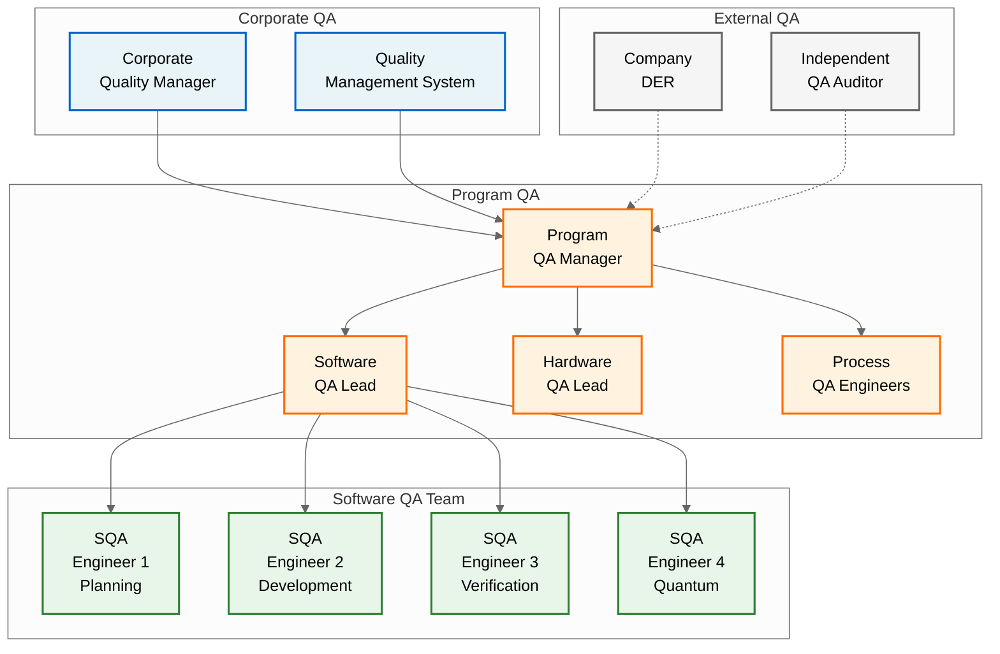

### 2.2 Roles and Responsibilities

| Role | Responsibilities |
|------|------------------|
| **Program QA Manager** | - Overall QA program management<br>- QA resource allocation<br>- Executive reporting<br>- Certification liaison |
| **Software QA Lead** | - SQAP implementation<br>- SQA team coordination<br>- Process improvement<br>- Metrics analysis |
| **SQA Engineers** | - Process audits<br>- Product evaluations<br>- Review participation<br>- Compliance verification |
| **Process QA Engineers** | - Process definition<br>- Training coordination<br>- Best practices<br>- Tool qualification |
| **DER** | - Regulatory compliance<br>- Certification guidance<br>- Finding delegation<br>- SOI review |

### 2.3 QA Authority and Reporting

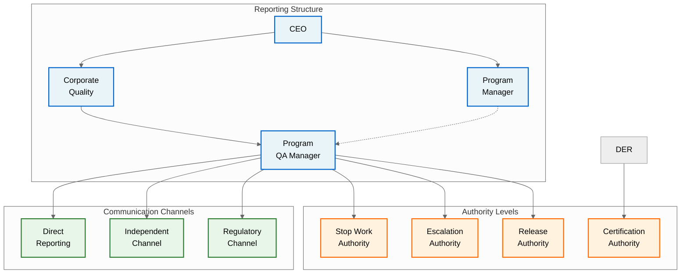

## 3. Independence

### 3.1 Independence Requirements

For DAL-B software, DO-178C requires independence between development and QA:

| Activity | Developer | QA Role | Independence Level |
|----------|-----------|---------|-------------------|
| Process Definition | Develops processes | Reviews/approves processes | Organizational |
| Planning Documents | Authors plans | Reviews/approves plans | Organizational |
| Requirements Development | Creates requirements | Evaluates requirements | Organizational |
| Design Development | Creates design | Evaluates design | Organizational |
| Code Development | Writes code | Audits coding process | Organizational |
| Testing | Executes tests | Witnesses tests | Individual |
| Reviews | Participates | Chairs/approves | Individual |
| Configuration Management | Performs CM | Audits CM | Organizational |

### 3.2 Independence Implementation

**Organizational Independence:**
- QA reports to Corporate Quality, not Program Management
- Separate budget and resource allocation
- Independent escalation path to executive management

**Individual Independence:**
- QA engineers do not develop software
- Different individuals for development and QA activities
- Rotation policy to maintain objectivity

### 3.3 Independence Verification

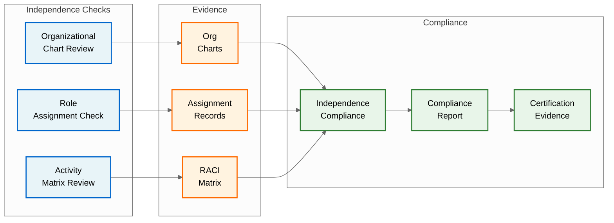

## 4. Software Quality Assurance Activities

### 4.1 QA Activity Overview

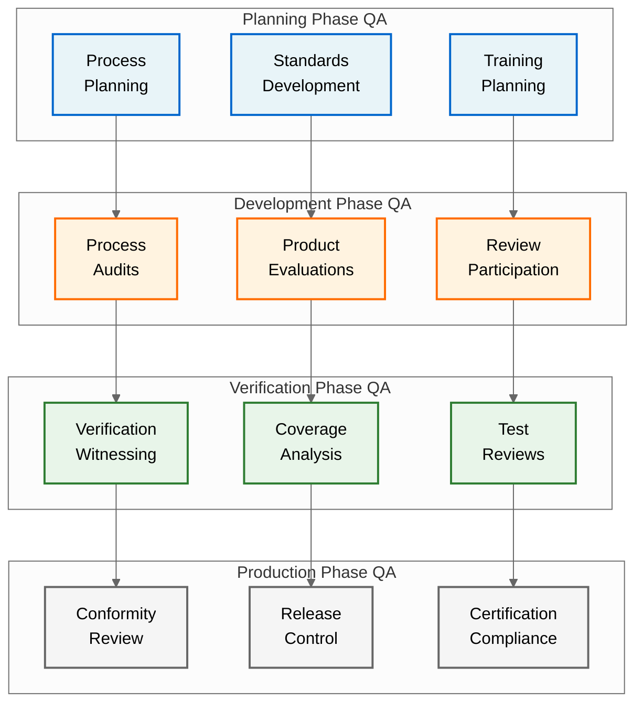

### 4.2 QA Activity Schedule

| Lifecycle Phase | QA Activities | Frequency | Deliverables |
|-----------------|---------------|-----------|--------------|
| **Planning** | - Review plans<br>- Approve standards<br>- Establish metrics | Once per plan | QA approval records |
| **Requirements** | - Review requirements<br>- Audit process<br>- Evaluate standards compliance | Weekly audits | Audit reports |
| **Design** | - Review design<br>- Witness reviews<br>- Evaluate architecture | Bi-weekly audits | Evaluation reports |
| **Coding** | - Code process audits<br>- Standards compliance<br>- Review participation | Weekly audits | Compliance reports |
| **Integration** | - Integration witnessing<br>- Process verification<br>- Problem tracking | Per integration | Witness records |
| **Verification** | - Test witnessing<br>- Coverage review<br>- Results evaluation | Per test campaign | Test reports |
| **Release** | - Conformity review<br>- Release approval<br>- Archive verification | Per release | Release records |

### 4.3 Quantum-Specific QA Activities

**Quantum Algorithm Verification:**
- Mathematical proof reviews
- Quantum state validation
- Entanglement verification
- Decoherence assessment

**Quantum Hardware Integration:**
- Calibration verification
- Quantum-classical interface validation
- Error rate analysis
- Performance benchmarking

**Quantum Safety Assessment:**
- Quantum error propagation analysis
- State collapse impact assessment
- Measurement uncertainty evaluation
- Quantum security verification

## 5. Software Process Assurance

### 5.1 Process Assurance Strategy

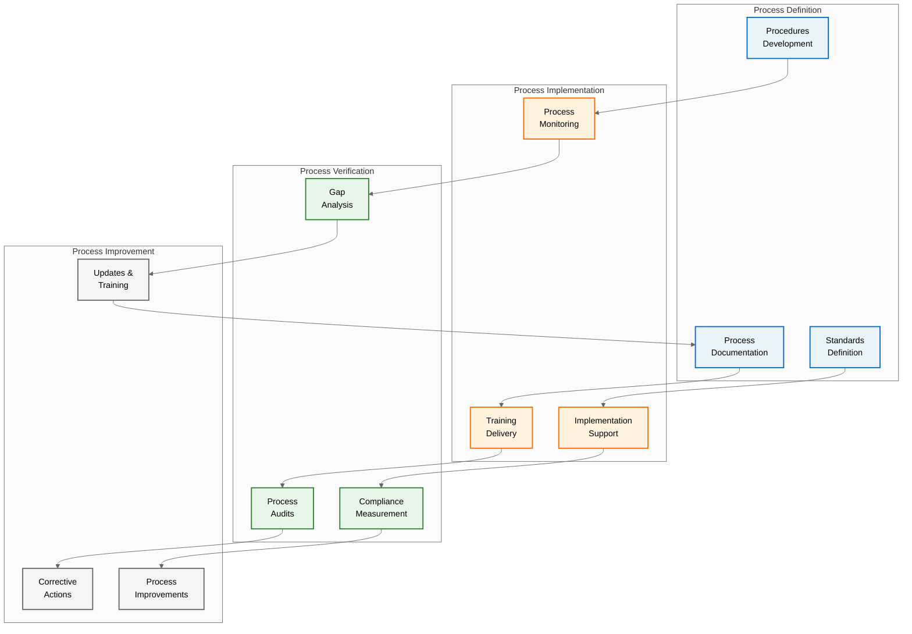

### 5.2 Process Audit Program

**Audit Types:**

| Audit Type | Scope | Frequency | Duration |
|------------|-------|-----------|----------|
| **Compliance Audit** | DO-178C process compliance | Monthly | 2 days |
| **Technical Audit** | Technical process effectiveness | Quarterly | 3 days |
| **Supplier Audit** | Supplier process compliance | Semi-annual | 2 days |
| **Internal Audit** | QMS compliance | Quarterly | 1 day |

**Audit Process:**
1. **Planning**
   - Define audit scope
   - Select audit team
   - Notify auditees
   - Prepare checklists

2. **Execution**
   - Opening meeting
   - Process observation
   - Record review
   - Evidence collection

3. **Reporting**
   - Document findings
   - Categorize issues
   - Present results
   - Define actions

4. **Follow-up**
   - Track corrections
   - Verify effectiveness
   - Close findings
   - Update metrics

### 5.3 Process Compliance Verification

**Compliance Checklist Example - Requirements Process:**

- [ ] Requirements standards followed
- [ ] Each requirement uniquely identified
- [ ] Requirements are atomic and verifiable
- [ ] Traceability established
- [ ] Reviews conducted per procedure
- [ ] Review records maintained
- [ ] Changes controlled through CCB
- [ ] Derived requirements justified
- [ ] Safety requirements identified
- [ ] Verification methods defined

### 5.4 Process Metrics

| Metric | Target | Measurement | Reporting |
|--------|--------|-------------|-----------|
| Process Compliance | > 95% | Audit findings / Total checks | Monthly |
| On-time Completion | > 90% | Activities on time / Total activities | Weekly |
| First-time Quality | > 85% | Passed reviews / Total reviews | Monthly |
| Corrective Action Closure | 100% within 30 days | Closed CAs / Total CAs | Weekly |

## 6. Software Product Evaluation

### 6.1 Product Evaluation Framework

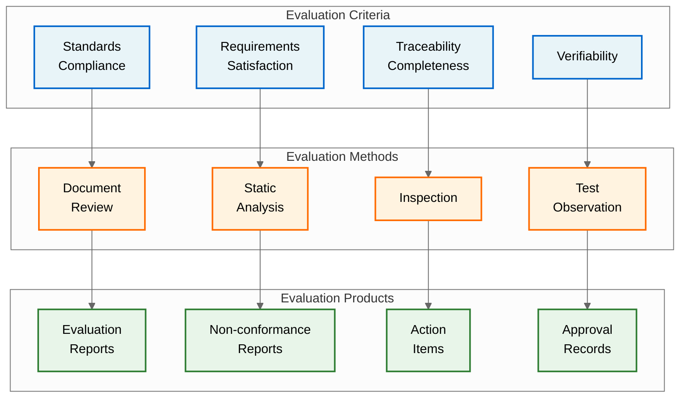

### 6.2 Lifecycle Data Evaluation

| Lifecycle Data | Evaluation Criteria | Method | QA Role |
|----------------|--------------------|---------|---------| 
| **Plans** | Completeness, DO-178C compliance | Document review | Review & approve |
| **Standards** | Adequacy, enforceability | Review & analysis | Review & approve |
| **Requirements** | Clarity, verifiability, safety | Inspection | Evaluate & witness reviews |
| **Design** | Architecture soundness, traceability | Analysis | Evaluate & witness reviews |
| **Source Code** | Standards compliance, complexity | Static analysis | Audit & review results |
| **Test Cases** | Coverage, correctness | Review | Evaluate & witness |
| **Test Results** | Pass/fail criteria, coverage | Analysis | Witness & verify |

### 6.3 Product Quality Metrics

**Code Quality Metrics:**
- Cyclomatic complexity: < 10 per function
- Comment density: > 20%
- MISRA compliance: > 95%
- Static analysis defects: < 1 per KLOC

**Documentation Quality Metrics:**
- Review defect density: < 5 per document
- Traceability gaps: 0%
- Standards compliance: 100%
- Completeness: 100%

### 6.4 Quantum Software Evaluation

**Quantum-Specific Evaluations:**

| Component | Evaluation Focus | Methods | Acceptance Criteria |
|-----------|------------------|---------|---------------------|
| Quantum Algorithms | Mathematical correctness | Formal proofs, simulation | Proven correctness |
| Quantum States | State preparation accuracy | Tomography, fidelity tests | > 99% fidelity |
| Error Correction | Correction effectiveness | Error injection, analysis | < 10^-9 error rate |
| Entanglement | Entanglement verification | Bell inequality tests | Violation confirmed |

## 7. Software Conformity Review

### 7.1 Conformity Review Process

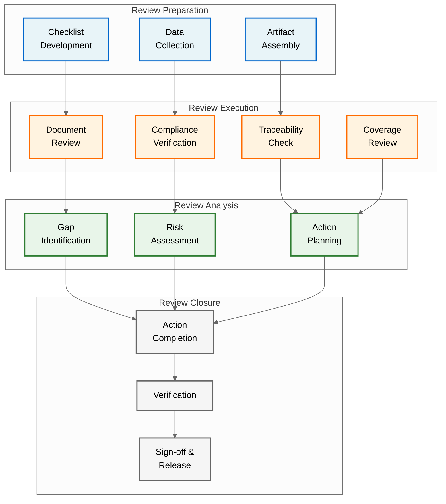

### 7.2 Stage of Involvement Reviews

| SOI | Purpose | QA Activities | Deliverables |
|-----|---------|---------------|--------------|
| **SOI #1** | Planning review | - Verify plans complete<br>- Confirm standards adequate<br>- Review organization | QA SOI #1 report |
| **SOI #2** | Development review | - Verify requirements/design<br>- Confirm process compliance<br>- Review lifecycle data | QA SOI #2 report |
| **SOI #3** | Verification review | - Verify test completion<br>- Confirm coverage<br>- Review all evidence | QA SOI #3 report |
| **SOI #4** | Final review | - Confirm readiness<br>- Verify compliance<br>- Support certification | QA SOI #4 report |

### 7.3 Conformity Review Checklist

**Software Planning Conformity:**
- [ ] All plans approved and under CM control
- [ ] Standards defined and adequate
- [ ] Organization and independence verified
- [ ] Tool qualification plans complete

**Software Development Conformity:**
- [ ] Requirements complete and verified
- [ ] Design documented and reviewed
- [ ] Code complies with standards
- [ ] Traceability maintained

**Software Verification Conformity:**
- [ ] All tests executed successfully
- [ ] Coverage objectives achieved
- [ ] Problem reports resolved
- [ ] Regression testing complete

**Software Configuration Management Conformity:**
- [ ] All items under CM control
- [ ] Baselines established
- [ ] Changes properly controlled
- [ ] Archive complete

## 8. Problem Reporting and Corrective Action

### 8.1 Problem Reporting System

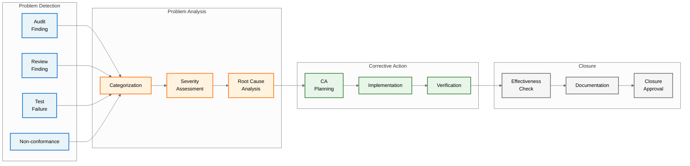

### 8.2 Problem Categories and Severity

| Category | Description | Examples |
|----------|-------------|----------|
| **Process** | Process non-compliance | Missing reviews, skipped steps |
| **Product** | Product defects | Requirements errors, code bugs |
| **Documentation** | Documentation issues | Missing documents, errors |
| **Tools** | Tool problems | Tool failures, qualification issues |

| Severity | Criteria | Response Time | Escalation |
|----------|----------|---------------|------------|
| **Critical** | Safety impact, blocks progress | Immediate | Program Manager |
| **Major** | Significant impact | 24 hours | Software Manager |
| **Minor** | Limited impact | 1 week | Team Lead |
| **Observation** | Improvement opportunity | 30 days | None |

### 8.3 Root Cause Analysis

**RCA Methods:**
- 5 Whys analysis
- Fishbone diagrams
- Fault tree analysis
- Pareto analysis

**Common Root Causes:**
- Training gaps
- Process unclear
- Tool inadequate
- Resource constraints
- Communication breakdown

### 8.4 Corrective Action Process

**CA Planning Template:**
```
CA Number: QNS-CA-YYYY-XXXX
Problem: [Description]
Root Cause: [RCA result]
Corrective Action: [Specific action]
Responsible: [Person/team]
Due Date: [Target date]
Verification Method: [How to verify]
Effectiveness Measure: [Success criteria]
```

**CA Tracking Metrics:**
- Open CAs by age
- CA closure rate
- Repeat problems
- CA effectiveness

## 9. SQA Records

### 9.1 QA Record Categories

| Record Type | Retention | Storage | Access |
|-------------|-----------|---------|--------|
| **Audit Reports** | Program life + 10 years | Secure archive | QA, Management |
| **Review Records** | Program life + 10 years | CM system | All stakeholders |
| **Conformity Reports** | Program life + 10 years | Secure archive | QA, Certification |
| **Problem Reports** | Program life + 10 years | JIRA + archive | All teams |
| **Training Records** | Employment + 5 years | HR system | QA, HR |
| **Metrics Reports** | Program life | SharePoint | All stakeholders |

### 9.2 Record Management

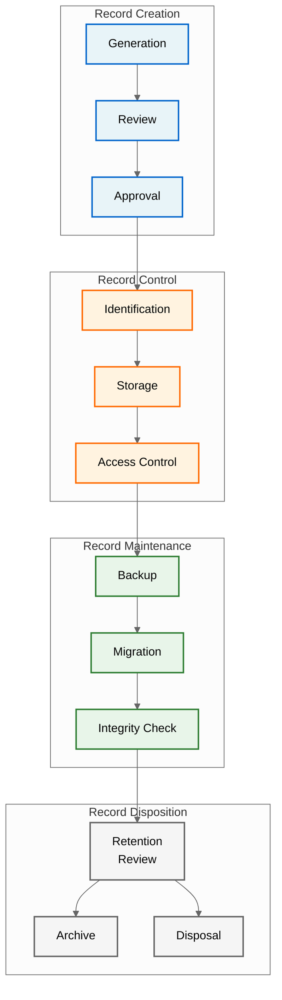

### 9.3 QA Evidence for Certification

**Required QA Evidence:**
- QA approval of all plans
- Audit reports showing compliance
- Review participation records
- Problem resolution evidence
- Conformity review reports
- Independence verification

**Evidence Package Structure:**
```
/QA_EVIDENCE/
├── /PLANNING/
│   ├── Plan_Approvals/
│   └── Standards_Review/
├── /AUDITS/
│   ├── Process_Audits/
│   └── Product_Evaluations/
├── /REVIEWS/
│   ├── Review_Records/
│   └── Participation_Evidence/
├── /PROBLEMS/
│   ├── Problem_Reports/
│   └── Corrective_Actions/
└── /CONFORMITY/
    ├── SOI_Reports/
    └── Compliance_Matrix/
```

## 10. Supplier SQA

### 10.1 Supplier QA Requirements

**Supplier Categories:**

| Category | Examples | QA Requirements |
|----------|----------|-----------------|
| **COTS Software** | RTOS, Libraries | License review, COTS evaluation |
| **Development Tools** | Compilers, Analyzers | Tool qualification data |
| **Services** | Testing, Reviews | Process compliance, audit rights |
| **Components** | Quantum hardware | Quality certificates, test data |

### 10.2 Supplier Oversight

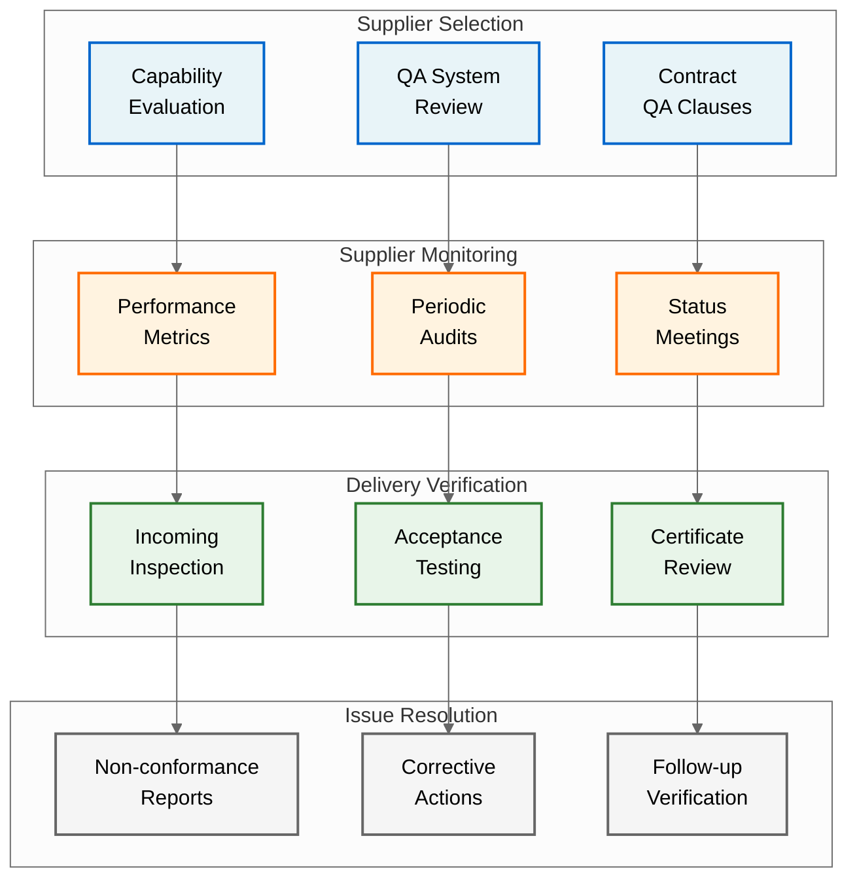

### 10.3 COTS Software Evaluation

**COTS Evaluation Criteria:**
- Functionality vs. requirements
- Known problem reports
- Support availability
- Upgrade impact
- Security vulnerabilities
- License compliance

**COTS Usage Decision:**
- Document evaluation results
- Justify safety impact
- Define usage constraints
- Plan for obsolescence
- Verify through testing

## 11. SQA Metrics and Reporting

### 11.1 QA Metrics Dashboard

| Metric Category | Specific Metrics | Target | Frequency |
|-----------------|------------------|--------|-----------|
| **Process Compliance** | - Audit findings per audit<br>- Process compliance rate<br>- Repeat findings | < 3<br>> 95%<br>< 10% | Monthly |
| **Product Quality** | - Defect density<br>- First-time quality<br>- Review effectiveness | < 5/KLOC<br>> 85%<br>> 80% | Weekly |
| **Problem Resolution** | - Open problems by age<br>- CA closure rate<br>- MTTR | < 10 > 30 days<br>> 90% on time<br>< 14 days | Weekly |
| **Review Performance** | - Reviews on schedule<br>- Action closure rate<br>- Review cycle time | > 95%<br>100%<br>< planned + 10% | Bi-weekly |

### 11.2 QA Reporting Structure

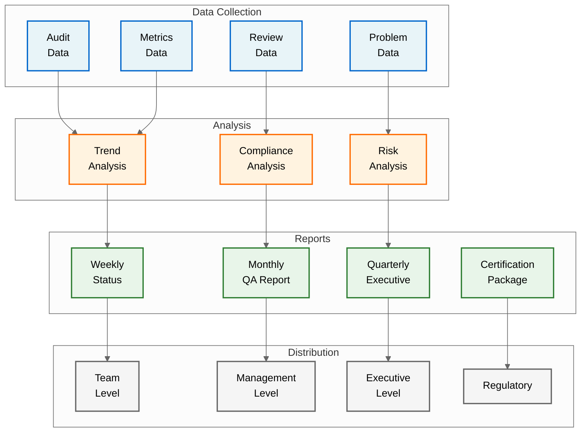

### 11.3 Executive QA Dashboard Example

**Monthly QA Status - July 2025**

| Area | Status | Trend | Issues | Actions |
|------|--------|-------|--------|---------|
| Process Compliance | 🟢 96% | ↑ | None | Continue monitoring |
| Product Quality | 🟡 82% | → | Design reviews behind | Additional resources |
| Problem Resolution | 🟢 91% | ↑ | None | Maintain focus |
| Schedule Adherence | 🟢 94% | ↑ | None | On track |
| Quantum Verification | 🟡 78% | ↓ | Tool delays | Expedite tool qual |

**Legend:** 🟢 On target | 🟡 Attention needed | 🔴 Critical

## 12. Tools and Resources

### 12.1 QA Tools

| Tool | Purpose | Version | Training Required |
|------|---------|---------|------------------|
| **Audit Management** |
| Audit Master | Audit planning/tracking | 5.2 | 2 days |
| **Metrics & Reporting** |
| Power BI | Metrics dashboards | 2024 | 1 day |
| JIRA | Problem tracking | 9.12 | 1 day |
| **Analysis Tools** |
| Coverity | Static analysis review | 2024.1 | 2 days |
| LDRA | Coverage analysis | 10.0 | 3 days |
| **Quantum Tools** |
| Q-Verify | Quantum verification | 1.0 | 5 days |

### 12.2 QA Resources

**Personnel Requirements:**
- 1 Software QA Lead (Senior)
- 4 SQA Engineers (Mid-level)
- 1 Process QA Engineer
- 0.5 Tool Support Engineer

**Training Requirements:**
- DO-178C training: All QA staff
- Quantum computing basics: All QA staff
- Tool-specific training: As needed
- Internal process training: All new hires

### 12.3 QA Budget Allocation

| Category | % of QA Budget | Primary Items |
|----------|----------------|---------------|
| Personnel | 70% | Salaries, benefits |
| Tools | 15% | Licenses, maintenance |
| Training | 10% | Courses, conferences |
| External Audits | 5% | Third-party audits |

---

**Document Control:**
- Author: QSTR QA Team
- Review: QA Manager, Software Manager, Systems Engineering
- Approval: QA Manager, Software Manager, DER
- Distribution: All Development Teams, Management, Certification
- Classification: AQUA V. Proprietary

**Configuration:**
- Baseline: SQAP-BASELINE-001
- Status: Released for SOI #1
- Next Review: After SOI #1 Feedback

**Related Documents:**
- [QUA-QNS01-25SVD0001-DES-BOB-REG-TD-QCSAA-910-003-00-01-TPL-DES-232-QSTR-v1.0.0 - PSAC](/A.Q.U.A.-V./PRODUCT_LINES/QUANTUM/QUANTUM_SOFTWARE/DESIGN/QNS_NAVIGATION/DES_REGULATORY/QUA-QNS01-25SVD0001-DES-BOB-REG-TD-QCSAA-910-003-00-01-TPL-DES-232-QSTR-v1.0.0.md)
- [QUA-QNS01-25SVD0001-DES-BOB-REG-TD-QCSAA-910-004-00-01-TPL-DES-233-QSTR-v1.0.0 - SDP](/A.Q.U.A.-V./PRODUCT_LINES/QUANTUM/QUANTUM_SOFTWARE/DESIGN/QNS_NAVIGATION/DES_REGULATORY/QUA-QNS01-25SVD0001-DES-BOB-REG-TD-QCSAA-910-004-00-01-TPL-DES-233-QSTR-v1.0.0.md)
- [QUA-QNS01-25SVD0001-DES-BOB-REG-TD-QCSAA-910-005-00-01-TPL-DES-234-QSTR-v1.0.0 - SVP](/A.Q.U.A.-V./PRODUCT_LINES/QUANTUM/QUANTUM_SOFTWARE/DESIGN/QNS_NAVIGATION/DES_REGULATORY/QUA-QNS01-25SVD0001-DES-BOB-REG-TD-QCSAA-910-005-00-01-TPL-DES-234-QSTR-v1.0.0.md)
- [QUA-QNS01-25SVD0001-DES-BOB-REG-TD-QCSAA-910-006-00-01-TPL-DES-235-QSTR-v1.0.0 - SCMP](/A.Q.U.A.-V./PRODUCT_LINES/QUANTUM/QUANTUM_SOFTWARE/DESIGN/QNS_NAVIGATION/DES_REGULATORY/QUA-QNS01-25SVD0001-DES-BOB-REG-TD-QCSAA-910-006-00-01-TPL-DES-235-QSTR-v1.0.0.md)

---

*This document is part of the AQUA V. Quantum Aerospace Program*  
*© 2025 AQUA V. - Aerospace and Quantum United Advanced Venture*
