# AQUA V. Quantum Navigation System (QNS) - Project Overview

**Document ID:** QUA-QNS01-25SVD0001-DES-BOB-ORG-TD-ATA-000-00-01-TPL-DOC-001-QCOM-v1.1.0  
**Classification:** Public Release  
**Site:** Silicon Valley (25SVD)  
**Last Updated:** 2025-07-30  
**Version:** 1.1.0  


---

## Executive Summary

The AQUA V. Quantum Navigation System (QNS) represents a paradigm shift in aerospace navigation technology. As part of the €40 billion AQUA V. program, QNS leverages cutting-edge quantum sensors and algorithms to provide ultra-precise, GPS-independent navigation capabilities. Currently at Technology Readiness Level (TRL) 6, the system has successfully demonstrated performance in relevant operational environments and is progressing toward full aerospace certification.

**Key Achievement:** First quantum navigation system to achieve sustained 1000Hz update rates with sub-meter accuracy in GPS-denied environments.


### Live Performance Metrics

<div id="performance-dashboard" class="live-metrics">
<iframe src="https://grafana.aqua-v.aerospace/d/qns-overview?orgId=1&refresh=30s" width="100%" height="300" frameborder="0"></iframe>
</div>

---

## Table of Contents

1. [Project Vision](#1-project-vision)
2. [System Overview](#2-system-overview)
3. [Key Capabilities](#3-key-capabilities)
4. [Architecture](#4-architecture)
5. [Applications](#5-applications)
6. [Technology Readiness](#6-technology-readiness)
7. [Quality & Compliance](#7-quality--compliance)
8. [Project Resources](#8-project-resources)
9. [Getting Started](#9-getting-started)
10. [Contact & Support](#10-contact--support)
11. [Glossary & Acronyms](#11-glossary--acronyms)
12. [Appendices](#12-appendices)

---

## 1. Project Vision

### Mission Statement
*"To revolutionize global aerospace navigation through quantum technology, enabling safe, precise, and autonomous flight operations in any environment."*

### Strategic Objectives

<div class="interactive-diagram" data-diagram-id="strategic-objectives">


</div>

### Why Quantum Navigation?


---

## 2. System Overview

The Quantum Navigation System is an integrated hardware-software platform that determines precise position, velocity, and attitude without external references.

### Core Components

<!-- This diagram is auto-generated from src/architecture/components.yaml -->
<!-- Last updated: 2025-07-30 14:22:00 UTC -->
<div class="auto-generated-diagram" data-source="components.yaml">


</div>

### Data Flow Architecture


### Key Specifications

| Parameter | Specification | Status | Real-time Value |
|-----------|--------------|--------|-----------------|
| Update Rate | 1000 Hz | ✅ Achieved | <span class="live-metric" data-metric="update_rate">Loading...</span> |
| Position Accuracy | < 0.1 m | ✅ Validated | <span class="live-metric" data-metric="position_accuracy">Loading...</span> |
| Gravitometer Sensitivity | 1 × 10⁻¹² g | ✅ Operational | <span class="live-metric" data-metric="grav_sensitivity">Loading...</span> |
| Magnetometer Range | 1 × 10⁻⁹ T | ✅ Operational | <span class="live-metric" data-metric="mag_range">Loading...</span> |
| Power Consumption | < 500W | ✅ Optimized | <span class="live-metric" data-metric="power">Loading...</span> |
| MTBF | > 50,000 hours | 🔄 Testing | <span class="live-metric" data-metric="mtbf">Loading...</span> |
| Operating Temperature | -55°C to +85°C | ✅ Qualified | N/A |

---

## 3. Key Capabilities

### 3.1 GPS-Denied Navigation

```mermaid
graph LR
    subgraph "Input Sources"
        G[Gravity Field]
        M[Magnetic Field]
        I[Inertial Forces]
    end
    
    subgraph "Quantum Processing"
        QS[Quantum Sensing]
        QE[Quantum Entanglement]
        QC[Quantum Computing]
    end
    
    subgraph "Navigation Output"
        P[Position ±0.1m]
        V[Velocity ±0.01m/s]
        A[Attitude ±0.001°]
    end
    
    G --> QS
    M --> QS
    I --> QS
    QS --> QE
    QE --> QC
    QC --> P
    QC --> V
    QC --> A
```



### 3.2 Quantum Sensor Fusion

<!-- Auto-generated from sensor configuration -->
<div class="auto-generated-diagram" data-source="sensor-fusion.yaml">


</div>

### 3.3 ALI-BOB Synchronization


### 3.4 Performance Monitoring

<div class="interactive-dashboard">


</div>

---

## 4. Architecture

### 4.1 System Architecture

<!-- Interactive C4 Context Diagram -->
<div class="interactive-c4-diagram" data-level="context">


</div>

<script>
// Interactive C4 diagram handler
document.addEventListener('DOMContentLoaded', function() {
    const c4Diagram = document.querySelector('.interactive-c4-diagram');
    if (c4Diagram && window.mermaid) {
        mermaid.init(undefined, c4Diagram);
        
        // Add click handlers after rendering
        setTimeout(() => {
            document.querySelectorAll('.interactive-c4-diagram .node').forEach(node => {
                node.style.cursor = 'pointer';
                node.addEventListener('click', function(e) {
                    const nodeId = this.getAttribute('id');
                    if (nodeId) {
                        window.location.href = `./design/components/${nodeId}.html`;
                    }
                });
            });
        }, 1000);
    }
});
</script>

### 4.2 Component Architecture

<!-- Auto-generated from build artifacts -->
<div class="auto-generated-diagram" data-source="build/architecture.json">


</div>

### 4.3 Deployment Architecture


---

## 5. Applications

### 5.1 Multi-Domain Operations


### 5.2 Use Case Scenarios


---

## 6. Technology Readiness

### 6.1 TRL Progression


### 6.2 Development Timeline


### 6.3 Validation & Verification

```mermaid
graph TD
    subgraph "Verification Process"
        REQ[Requirements<br/>✅ 2,847 Traced]
        DES[Design<br/>✅ 100% Reviewed]
        IMP[Implementation<br/>✅ 85% Coverage]
        VER[Verification<br/>✅ 12,543 Tests]
    end
    
    subgraph "Validation Activities"
        SIM[Simulation<br/>✅ 10,000 Hours]
        LAB[Lab Tests<br/>✅ 5,000 Hours]
        FLT[Flight Tests<br/>🔄 500 Hours]
        OPS[Operational Tests<br/>📅 Planned]
    end
    
    subgraph "Evidence"
        REP[Test Reports<br/>📄 1,247 Documents]
        DAT[Flight Data<br/>💾 15 TB]
        CER[Certificates<br/>📜 23 Issued]
        AUD[Audits<br/>✅ 8 Passed]
    end
    
    REQ --> DES
    DES --> IMP
    IMP --> VER
    
    VER --> SIM
    VER --> LAB
    VER --> FLT
    VER --> OPS
    
    SIM --> REP
    LAB --> REP
    FLT --> DAT
    OPS --> DAT
    
    REP --> CER
    DAT --> CER
    CER --> AUD
```

<!-- Auto-generated from test results -->
<div class="test-results-summary">



</div>

---

## 7. Quality & Compliance

### 7.1 Quality Management System


### 7.2 Compliance Matrix


### 7.3 CI/CD Pipeline

```mermaid
graph LR
    subgraph "Source Control"
        GIT[GitLab<br/>✅ Connected]
        MR[Merge Request<br/>🔄 Active: 3]
    end
    
    subgraph "Build Stage"
        BUILD[Build<br/>✅ #4521]
        SAST[Security Scan<br/>✅ Pass]
        LINT[Code Quality<br/>✅ 98.5%]
    end
    
    subgraph "Test Stage"
        UNIT[Unit Tests<br/>✅ 2,847/2,847]
        INT[Integration<br/>✅ 543/543]
        PERF[Performance<br/>✅ Within SLA]
        QUANTUM[Quantum Tests<br/>✅ 127/127]
    end
    
    subgraph "Deploy Stage"
        PKG[Package<br/>✅ v1.0.0-4521]
        STAGE[Staging<br/>🔄 Deploying]
        PROD[Production<br/>📅 Scheduled]
    end
    
    GIT --> MR
    MR --> BUILD
    BUILD --> SAST
    SAST --> LINT
    
    LINT --> UNIT
    UNIT --> INT
    INT --> PERF
    PERF --> QUANTUM
    
    QUANTUM --> PKG
    PKG --> STAGE
    STAGE --> PROD
    
    style QUANTUM fill:#ff9,stroke:#333,stroke-width:2px
```

<!-- Live pipeline status -->
<div class="pipeline-status" data-pipeline="qns-main">



</div>

---

## 8. Project Resources

### 8.1 Repository Structure

<!-- Auto-generated from repository -->
<div class="repo-structure" data-last-scan="2025-07-30T14:22:00Z">

```mermaid
graph TD
    ROOT[qns/<br/>📊 247,831 files<br/>💾 15.7 GB]
    
    ROOT --> SRC[src/<br/>📄 12,543 files<br/>💾 2.3 GB]
    ROOT --> TESTS[tests/<br/>📄 8,921 files<br/>💾 1.1 GB]
    ROOT --> DOCS[docs/<br/>📄 3,247 files<br/>💾 892 MB]
    ROOT --> TOOLS[tools/<br/>📄 1,023 files<br/>💾 234 MB]
    ROOT --> BUILD[build/<br/>📄 Auto-generated]
    ROOT --> DEPS[dependencies/<br/>📄 847 files<br/>💾 8.2 GB]
    
    SRC --> NAV[navigation/<br/>Core algorithms]
    SRC --> QUANTUM[quantum/<br/>Q-algorithms]
    SRC --> HAL[hal/<br/>Hardware layer]
    SRC --> API[api/<br/>External interfaces]
    
    TESTS --> UNIT[unit/<br/>2,847 tests]
    TESTS --> INTEG[integration/<br/>543 tests]
    TESTS --> FLIGHT[flight/<br/>127 scenarios]
    
    DOCS --> DESIGN[design/<br/>Architecture docs]
    DOCS --> USER[user/<br/>Manuals]
    DOCS --> DEV[dev/<br/>Developer guides]
    
    TOOLS --> SIM[simulator/<br/>QNS simulator]
    TOOLS --> CALIB[calibration/<br/>Sensor tools]
    TOOLS --> ANALYSIS[analysis/<br/>Data analysis]
```

</div>

### 8.2 Development Workflow

```mermaid
graph LR
    subgraph "Development"
        FEAT[Feature Branch]
        DEV[Development]
        TEST[Local Testing]
    end
    
    subgraph "Integration"
        MR[Merge Request]
        REV[Code Review]
        CI[CI Pipeline]
    end
    
    subgraph "Release"
        MERG[Merge to Main]
        TAG[Tag Release]
        DEPL[Deploy]
    end
    
    FEAT --> DEV
    DEV --> TEST
    TEST --> MR
    
    MR --> REV
    REV --> CI
    CI --> MERG
    
    MERG --> TAG
    TAG --> DEPL
```

### 8.3 Documentation System

<!-- AI-assisted documentation status -->
<div class="doc-ai-status">

```mermaid
graph LR
    subgraph "Documentation AI Assistant"
        SCAN[Code Scanner<br/>🤖 Active]
        GEN[Doc Generator<br/>🤖 Active]
        CHECK[Compliance Check<br/>🤖 Active]
        UPDATE[Auto-Update<br/>🤖 Active]
    end
    
    subgraph "Generated Docs"
        API_DOC[API Docs<br/>✅ 100%]
        ARCH[Architecture<br/>✅ 95%]
        TEST_DOC[Test Reports<br/>✅ 100%]
        USER_DOC[User Guides<br/>🔄 87%]
    end
    
    SCAN --> GEN
    GEN --> CHECK
    CHECK --> UPDATE
    
    UPDATE --> API_DOC
    UPDATE --> ARCH
    UPDATE --> TEST_DOC
    UPDATE --> USER_DOC
```

</div>

---

## 9. Getting Started

### 9.1 Developer Onboarding

<div class="interactive-onboarding">

```mermaid
graph TD
    START[Start<br/>📅 Day 1]
    
    subgraph "Setup Phase"
        ENV[Environment Setup<br/>⏱️ 2 hours]
        ACCESS[Access Requests<br/>⏱️ 1 hour]
        TOOLS[Tool Installation<br/>⏱️ 4 hours]
    end
    
    subgraph "Learning Phase"
        DOCS[Read Documentation<br/>⏱️ 8 hours]
        TRAIN[Training Modules<br/>⏱️ 16 hours]
        MENT[Mentorship<br/>⏱️ Ongoing]
    end
    
    subgraph "Practice Phase"
        EXER[Exercises<br/>⏱️ 24 hours]
        CODE[Code Walkthrough<br/>⏱️ 8 hours]
        REVIEW[First PR<br/>⏱️ Variable]
    end
    
    START --> ENV
    START --> ACCESS
    ENV --> TOOLS
    ACCESS --> TOOLS
    
    TOOLS --> DOCS
    DOCS --> TRAIN
    TRAIN --> MENT
    
    MENT --> EXER
    EXER --> CODE
    CODE --> REVIEW
    
    REVIEW --> READY[Ready to Contribute<br/>🎉 Week 2-3]
    
    click ENV "./onboarding/environment-setup.html" "Environment Setup Guide"
    click TRAIN "./onboarding/training-modules.html" "Training Modules"
    click EXER "./onboarding/exercises.html" "Practice Exercises"
```

</div>

### 9.2 Build Process

```mermaid
graph LR
    subgraph "Prerequisites"
        CMAKE[CMake 3.20+]
        GCC[GCC 11+]
        QSDK[Quantum SDK]
    end
    
    subgraph "Build Steps"
        CLONE[Clone Repo]
        DEPS[Install Deps]
        CONF[Configure]
        BUILD[Build]
    end
    
    subgraph "Verification"
        TEST[Run Tests]
        BENCH[Benchmarks]
        PKG[Package]
    end
    
    CMAKE --> CLONE
    GCC --> CLONE
    QSDK --> CLONE
    
    CLONE --> DEPS
    DEPS --> CONF
    CONF --> BUILD
    
    BUILD --> TEST
    TEST --> BENCH
    BENCH --> PKG
```

### 9.3 Quick Start Commands

```bash
# Clone the repository
git clone https://gitlab.aqua-v.aerospace/quantum/qns.git

# Setup development environment (includes AI assistant)
cd qns
./scripts/setup-dev-env.sh --with-ai-tools

# Build the project
mkdir build && cd build
cmake .. -DCMAKE_BUILD_TYPE=Debug -DENABLE_QUANTUM_TESTS=ON
make -j8

# Run tests
ctest --output-on-failure

# Generate documentation
make docs

# Start AI documentation assistant
./tools/doc-ai-assistant.py --watch
```

---

## 10. Contact & Support

### 10.1 Support Workflow

```mermaid
graph TD
    ISSUE[Issue/Question]
    
    subgraph "Triage"
        TYPE{Issue Type?}
        BUG[Bug Report]
        FEAT[Feature Request]
        HELP[Help Needed]
        CRIT[Critical Issue]
    end
    
    subgraph "Routing"
        JIRA[Create Jira]
        SLACK[Slack Channel]
        EMAIL[Email Support]
        PHONE[24/7 Hotline]
    end
    
    subgraph "Resolution"
        ASSIGN[Assign Team]
        WORK[Work on Issue]
        RESOLVE[Resolution]
        NOTIFY[Notify User]
    end
    
    ISSUE --> TYPE
    
    TYPE -->|Bug| BUG
    TYPE -->|Feature| FEAT
    TYPE -->|Question| HELP
    TYPE -->|Emergency| CRIT
    
    BUG --> JIRA
    FEAT --> JIRA
    HELP --> SLACK
    CRIT --> PHONE
    
    JIRA --> ASSIGN
    SLACK --> ASSIGN
    EMAIL --> ASSIGN
    PHONE --> ASSIGN
    
    ASSIGN --> WORK
    WORK --> RESOLVE
    RESOLVE --> NOTIFY
```

### 10.2 Communication Channels

```mermaid
graph TD
    subgraph "Internal Communication"
        SLACK[Slack Workspace]
        EMAIL[Email Lists]
        CONF[Confluence Wiki]
        JIRA[Jira Projects]
    end
    
    subgraph "Channels"
        GEN[#qns-general]
        DEV[#qns-dev]
        SUP[#qns-support]
        ANN[#qns-announce]
    end
    
    subgraph "External Communication"
        WEB[Website]
        FORUM[Community Forum]
        SOCIAL[Social Media]
    end
    
    SLACK --> GEN
    SLACK --> DEV
    SLACK --> SUP
    SLACK --> ANN
    
    EMAIL --> ANN
    CONF --> WEB
    JIRA --> FORUM
```

---

## 11. Glossary & Acronyms

### 11.1 Acronyms

| Acronym | Definition | Context |
|---------|------------|---------|
| **ALI** | ALICE (Physical System) | Hardware state monitoring component |
| **ARP** | Aerospace Recommended Practice | SAE International standards |
| **BOB** | BOB (Digital Twin) | Virtual system simulation component |
| **EASA** | European Union Aviation Safety Agency | Regulatory authority |
| **FAA** | Federal Aviation Administration | US regulatory authority |
| **HAL** | Hardware Abstraction Layer | Software architecture component |
| **ITAR** | International Traffic in Arms Regulations | US export control |
| **MTBF** | Mean Time Between Failures | Reliability metric |
| **QKD** | Quantum Key Distribution | Quantum security protocol |
| **QKF** | Quantum Kalman Filter | Navigation algorithm |
| **QPU** | Quantum Processing Unit | Quantum hardware component |
| **QNS** | Quantum Navigation System | The system itself |
| **TRL** | Technology Readiness Level | NASA/ESA maturity scale |

### 11.2 Technical Terms

| Term | Definition | Reference |
|------|------------|-----------|
| **Coherence Time** | Duration a quantum state maintains superposition | [Quantum Physics Ref](./theory/coherence.html) |
| **Decoherence** | Loss of quantum coherence due to environmental interaction | [Quantum Theory](./theory/decoherence.html) |
| **Digital Twin** | Real-time virtual representation of physical system | [ALI-BOB Spec](./design/ali-bob.html) |
| **Gravitometer** | Device measuring gravitational field variations | [Sensor Manual](./hardware/gravitometer.html) |
| **Quantum Entanglement** | Quantum correlation between particles | [Quantum Basics](./theory/entanglement.html) |
| **Quantum State** | Mathematical description of quantum system | [Q-State Guide](./theory/states.html) |
| **Sensor Fusion** | Combining multiple sensor inputs for improved accuracy | [Fusion Algorithms](./algorithms/fusion.html) |
| **Superposition** | Quantum state existing in multiple states simultaneously | [Quantum Principles](./theory/superposition.html) |

---

## 12. Appendices

### Appendix A: Change Log

<!-- Auto-generated from Git history -->
<div class="auto-changelog" data-source="git">

| Version | Date | Changes | Author |
|---------|------|---------|--------|
| 1.1.0 | 2025-07-30 | Added interactive diagrams, glossary, live metrics | DevOps Team |
| 1.0.0 | 2025-07-27 | Initial release | QCOM Team |

</div>

### Appendix B: Diagram Version Control

All diagrams in this document are version controlled:
- **Source:** Stored in `docs/diagrams/src/`
- **Generated:** Auto-built during CI/CD
- **History:** Full Git history maintained
- **Checksums:** Validated on each commit

### Appendix C: Interactive Features

This document includes several interactive features when viewed in supported browsers:
1. **Clickable Diagrams:** Navigate to detailed documentation
2. **Live Metrics:** Real-time system performance data
3. **Auto-generated Content:** Always up-to-date with codebase
4. **AI-assisted Updates:** Documentation synchronized with code changes

### Appendix D: Contributing to Documentation

To contribute to this documentation:
1. Fork the repository
2. Make changes in `docs/` directory
3. Run `make docs` to validate
4. Submit merge request
5. AI assistant will review for compliance

### Appendix E: Regulatory & Standards Compliance

#### E.1 Compliance Overview

The AQUA V. Quantum Navigation System adheres to a comprehensive framework of international aerospace, safety, and export control regulations. This appendix provides detailed tracking of compliance status, certification progress, and regulatory requirements.

```mermaid
mindmap
  root((QNS Compliance))
    Aerospace
      EASA
        CS-25
        CS-23
        Part-21
      FAA
        Part 25
        Part 23
        TSO
      ICAO
        Annex 8
        Annex 16
        Annex 19
    Software
      DO-178C
        DAL-A
        DAL-B
      DO-330
      DO-331
    Hardware
      DO-254
        DAL-A
        DAL-B
      DO-160G
    Safety
      ARP4754A
      ARP4761
      ISO 26262
      IEC 61508
    Export Control
      ITAR
      EAR
      EU Dual-Use
      Wassenaar
```

#### E.2 Aerospace Standards Compliance

##### E.2.1 EASA Compliance Status

| Standard | Description | Compliance Level | Evidence | Last Audit |
|----------|-------------|------------------|----------|------------|
| **CS-25** | Large Aeroplanes | 🔄 87% Complete | [CS25-QNS-Evidence](./compliance/CS25/) | 2025-06-15 |
| **CS-23** | Normal Category | ✅ 100% Complete | [CS23-QNS-Evidence](./compliance/CS23/) | 2025-05-20 |
| **CS-ETSO** | European TSO | 🔄 92% Complete | [ETSO-QNS-Evidence](./compliance/ETSO/) | 2025-07-01 |
| **Part-21** | Certification Procedures | ✅ 100% Complete | [Part21-Evidence](./compliance/Part21/) | 2025-04-10 |
| **Part-145** | Maintenance Org | 📅 Planned Q4 2025 | N/A | N/A |

```mermaid
graph LR
    subgraph "EASA Certification Path"
        DOA[Design Org Approval<br/>✅ Obtained]
        TC[Type Certificate<br/>🔄 In Progress]
        STC[Supplemental TC<br/>📅 2026]
        PMA[Production Approval<br/>📅 2027]
    end
    
    DOA --> TC
    TC --> STC
    TC --> PMA
    
    style DOA fill:#9f9
    style TC fill:#ff9
```

##### E.2.2 FAA Compliance Status

| Standard | Description | Compliance Level | Evidence | Last Review |
|----------|-------------|------------------|----------|-------------|
| **14 CFR Part 25** | Transport Category | 🔄 85% Complete | [Part25-Evidence](./compliance/FAA/Part25/) | 2025-07-10 |
| **14 CFR Part 23** | Normal Category | ✅ 100% Complete | [Part23-Evidence](./compliance/FAA/Part23/) | 2025-06-30 |
| **TSO-C196** | Navigation Equipment | 🔄 78% Complete | [TSO-Evidence](./compliance/FAA/TSO/) | 2025-07-15 |
| **AC 20-115** | Software Guidance | ✅ 100% Complete | [AC20-115-Evidence](./compliance/FAA/AC/) | 2025-05-15 |

#### E.3 Software Standards Compliance (DO-178C)

##### E.3.1 Software Criticality Levels

```mermaid
graph TD
    subgraph "QNS Software Components by DAL"
        DAL_A[DAL-A: Catastrophic<br/>Navigation Core<br/>Sensor Fusion<br/>25% of Code]
        DAL_B[DAL-B: Hazardous<br/>Monitoring<br/>Diagnostics<br/>35% of Code]
        DAL_C[DAL-C: Major<br/>Display<br/>Logging<br/>30% of Code]
        DAL_D[DAL-D: Minor<br/>Tools<br/>Utilities<br/>10% of Code]
    end
    
    style DAL_A fill:#faa,stroke:#333,stroke-width:3px
    style DAL_B fill:#fda,stroke:#333,stroke-width:2px
    style DAL_C fill:#ffa,stroke:#333,stroke-width:1px
    style DAL_D fill:#afa,stroke:#333,stroke-width:1px
```

##### E.3.2 DO-178C Objectives Compliance

| Objective Category | Total | Completed | In Progress | Evidence Location |
|-------------------|-------|-----------|-------------|-------------------|
| **Planning** | 13 | 13 | 0 | [/compliance/DO178C/planning/](./compliance/DO178C/planning/) |
| **Development** | 31 | 29 | 2 | [/compliance/DO178C/development/](./compliance/DO178C/development/) |
| **Verification** | 65 | 58 | 7 | [/compliance/DO178C/verification/](./compliance/DO178C/verification/) |
| **Configuration Management** | 10 | 10 | 0 | [/compliance/DO178C/config/](./compliance/DO178C/config/) |
| **Quality Assurance** | 15 | 15 | 0 | [/compliance/DO178C/qa/](./compliance/DO178C/qa/) |
| **Certification Liaison** | 6 | 5 | 1 | [/compliance/DO178C/cert/](./compliance/DO178C/cert/) |

```mermaid
pie title "DO-178C Objectives Completion"
    "Completed" : 126
    "In Progress" : 10
    "Not Started" : 4
```

#### E.4 Hardware Standards Compliance (DO-254)

##### E.4.1 Hardware Design Assurance Levels

| Component | DAL | Compliance Status | Evidence |
|-----------|-----|-------------------|----------|
| **Quantum Processing Unit** | A | ✅ 100% | [QPU-Compliance](./compliance/DO254/QPU/) |
| **Sensor Array** | A | ✅ 100% | [Sensor-Compliance](./compliance/DO254/Sensors/) |
| **Power Supply** | B | ✅ 100% | [Power-Compliance](./compliance/DO254/Power/) |
| **Communication Bus** | B | 🔄 95% | [Comm-Compliance](./compliance/DO254/Comm/) |
| **Display Unit** | C | ✅ 100% | [Display-Compliance](./compliance/DO254/Display/) |

#### E.5 Environmental & Safety Standards

##### E.5.1 DO-160G Environmental Testing

```mermaid
gantt
    title DO-160G Test Campaign Progress
    dateFormat YYYY-MM-DD
    
    section Temperature
    High Temp        :done, 2024-01-01, 2024-02-15
    Low Temp         :done, 2024-02-16, 2024-03-30
    Thermal Shock    :done, 2024-04-01, 2024-04-30
    
    section Vibration
    Sine Vibration   :done, 2024-05-01, 2024-05-31
    Random Vib       :done, 2024-06-01, 2024-06-30
    Shock            :active, 2025-07-01, 2025-08-15
    
    section EMI/EMC
    Radiated Em      :done, 2024-07-01, 2024-08-15
    Conducted Em     :done, 2024-08-16, 2024-09-30
    Lightning        :active, 2025-07-15, 2025-08-31
    
    section Other
    Altitude         :done, 2024-10-01, 2024-10-31
    Humidity         :done, 2024-11-01, 2024-11-30
    Salt Fog         :2025-09-01, 2025-09-30
```

##### E.5.2 Safety Standards Compliance

| Standard | Description | Status | Key Requirements Met |
|----------|-------------|--------|---------------------|
| **ARP4754A** | Development of Civil Aircraft | ✅ 100% | • Safety Assessment<br/>• Requirements Validation<br/>• System Integration |
| **ARP4761** | Safety Assessment Process | ✅ 100% | • FHA Complete<br/>• PSSA Complete<br/>• SSA In Progress |
| **ISO 26262** | Functional Safety | ✅ ASIL-D | • Safety Goals Defined<br/>• HARA Complete<br/>• Safety Case Building |
| **IEC 61508** | Functional Safety of E/E/PE | ✅ SIL 4 | • Safety Lifecycle<br/>• V&V Complete<br/>• Proven in Use |

#### E.6 Export Control Compliance

##### E.6.1 Classification Status

```mermaid
flowchart TD
    subgraph "Export Control Classifications"
        QNS[QNS System]
        ITAR_CLASS["`ITAR Category XV(e)
USML XV(e)(14)`"]
        EAR_CLASS["`EAR ECCN 7D994
AT Column 1`"]
        EU_CLASS["`EU Dual-Use 7D004`"]
        WASS_CLASS["`Wassenaar Cat 7.D.4.a`"]
    end

    QNS --> ITAR_CLASS
    QNS --> EAR_CLASS
    QNS --> EU_CLASS
    QNS --> WASS_CLASS

    style ITAR_CLASS fill:#faa,stroke:#333,stroke-width:2px
    style EAR_CLASS fill:#fda,stroke:#333,stroke-width:2px
```

##### E.6.2 Export License Requirements

| Destination | License Type | Processing Time | Restrictions |
|-------------|--------------|-----------------|--------------|
| **NATO Allies** | TAA/MLA | 60-90 days | Technical data only |
| **Five Eyes** | Expedited TAA | 30-45 days | Full system allowed |
| **EU Members** | General License | 45-60 days | Quantum components restricted |
| **Other Allies** | Individual License | 90-120 days | Case-by-case basis |
| **Restricted** | Not Authorized | N/A | Complete embargo |

#### E.7 Quantum Technology Regulations

##### E.7.1 Emerging Quantum Standards

| Standard | Organization | Status | QNS Involvement |
|----------|--------------|---------|-----------------|
| **ISO/IEC 23837** | ISO | 🔄 Draft | Contributing Member |
| **ETSI GR QKD** | ETSI | ✅ Published | Compliant |
| **NIST PQC** | NIST | ✅ Final | Implemented |
| **IEEE 1913** | IEEE | 🔄 Development | Working Group Member |

##### E.7.2 Quantum Security Compliance

```mermaid
graph LR
    subgraph "Quantum Security Framework"
        QKD[Quantum Key Distribution<br/>✅ BB84 Protocol]
        PQC[Post-Quantum Crypto<br/>✅ CRYSTALS-Kyber]
        QRN[Quantum Random Numbers<br/>✅ NIST SP 800-90B]
        QSC[Quantum-Safe Comms<br/>✅ ETSI QSC 001]
    end
    
    QKD --> SECURE[Secure QNS]
    PQC --> SECURE
    QRN --> SECURE
    QSC --> SECURE
    
    style SECURE fill:#9f9,stroke:#333,stroke-width:3px
```

#### E.8 Certification Roadmap

```mermaid
timeline
    title QNS Certification Timeline
    
    section 2024
        EASA DOA Obtained
        : Design Organization Approval
        : Enables official design activities
        
        DO-178C Planning Complete
        : All software plans approved
        : Development can proceed
    
    section 2025
        FAA Coordination Begin
        : Bilateral agreements initiated
        : Validation process started
        
        Environmental Testing
        : DO-160G campaign 70% complete
        : Critical tests passed
    
    section 2026
        Type Certificate Application
        : Formal TC application to EASA
        : Concurrent FAA validation
        
        First Article Testing
        : Production representative testing
        : Compliance demonstration
    
    section 2027
        EASA Type Certificate
        : Expected TC issuance
        : Enables European operations
        
        FAA Validation
        : FAA validates EASA TC
        : US market access
    
    section 2028
        Production Certificate
        : Manufacturing approval
        : Serial production begins
        
        Global Certifications
        : TCCA, ANAC, CAAC applications
        : Worldwide market access
```

#### E.9 Compliance Tracking System

##### E.9.1 Real-time Compliance Dashboard

<div class="compliance-dashboard">

```mermaid
graph TD
    subgraph "Live Compliance Status"
        OVERALL[Overall Compliance<br/>⚡ 91.3%]
        
        AERO[Aerospace<br/>✅ 94.2%]
        SOFT[Software<br/>🔄 89.7%]
        HARD[Hardware<br/>✅ 95.8%]
        SAFE[Safety<br/>✅ 93.1%]
        ENV[Environmental<br/>🔄 85.6%]
        EXP[Export<br/>✅ 100%]
    end
    
    OVERALL --> AERO
    OVERALL --> SOFT
    OVERALL --> HARD
    OVERALL --> SAFE
    OVERALL --> ENV
    OVERALL --> EXP
    
    style OVERALL fill:#ff9,stroke:#333,stroke-width:3px
```

</div>

##### E.9.2 Compliance Metrics

| Metric | Target | Current | Trend | Actions |
|--------|--------|---------|-------|---------|
| **Requirements Traced** | 100% | 98.7% | ↗️ | Final review in progress |
| **Tests Passed** | 100% | 96.3% | ↗️ | 127 tests remaining |
| **Documents Approved** | 100% | 94.2% | ↗️ | 23 pending review |
| **Audits Passed** | 100% | 100% | ✓ | Maintaining status |
| **NCRs Closed** | 100% | 87.5% | ↗️ | 15 NCRs in work |

#### E.10 Audit History & Findings

##### E.10.1 Recent Audit Summary

| Date | Auditor | Type | Findings | Status |
|------|---------|------|----------|--------|
| 2025-07-15 | EASA | Stage 3 | 2 Minor | ✅ Closed |
| 2025-06-20 | DNV GL | AS9100D | 0 | ✅ Passed |
| 2025-05-10 | FAA | Software | 3 Minor | 🔄 2 Open |
| 2025-04-05 | Internal | Comprehensive | 5 Minor | ✅ Closed |
| 2025-03-15 | DCMA | Export | 0 | ✅ Passed |

##### E.10.2 Corrective Action Status

```mermaid
pie title "Corrective Actions by Category"
    "Documentation" : 8
    "Process" : 5
    "Training" : 3
    "Technical" : 2
    "Closed" : 42
```

#### E.11 Regulatory Contacts

| Organization | Role | Contact | Frequency |
|--------------|------|---------|-----------|
| **EASA** | Certification Manager | J. Schmidt | Weekly |
| **FAA** | Validation Lead | M. Johnson | Bi-weekly |
| **TCCA** | Bilateral Coordinator | S. Chen | Monthly |
| **DCMA** | Export Compliance | R. Martinez | As needed |
| **ISO** | Standards Liaison | K. Tanaka | Quarterly |

#### E.12 Compliance Documentation Repository

All compliance evidence is maintained in a validated, access-controlled repository:

- **Location:** `https://compliance.aqua-v.aerospace/qns/`
- **Access:** Role-based, audit-logged
- **Backup:** Real-time replication, 30-day retention
- **Validation:** SHA-256 checksums, digital signatures
- **Audit Trail:** Complete change history maintained

```mermaid
graph LR
    subgraph "Compliance Repository Structure"
        ROOT[/compliance/]
        
        ROOT --> EASA[/EASA/]
        ROOT --> FAA[/FAA/]
        ROOT --> STDS[/Standards/]
        ROOT --> EXPORT[/Export/]
        ROOT --> AUDITS[/Audits/]
        
        EASA --> CS25[/CS-25/]
        EASA --> ETSO[/ETSO/]
        
        STDS --> DO178[/DO-178C/]
        STDS --> DO254[/DO-254/]
        
        style ROOT fill:#f9f,stroke:#333,stroke-width:2px
    end
```

**Compliance Status Last Updated:** 2025-07-30 14:45:00 UTC  
**Next Compliance Review:** 2025-08-15  
**Compliance Officer:** Dr. Sarah Mitchell, Chief Compliance Officer  
**Compliance Hotline:** +1-555-QNS-COMP (24/7)

---

## Acknowledgments

The QNS project represents the collaborative effort of:

```mermaid
pie title "QNS Contribution by Division (Live Data)"
    "QSTR-Structures" : 12
    "QAIR-Aerodynamics" : 10
    "QPOW-PowerSense" : 11
    "QSPA-Space" : 7
    "QIND-Industry" : 13
    "QDAT-DataGov" : 7
    "QHPC-Computing" : 8
    "QCOM-Communications" : 6
    "QSCI-Research" : 5
    "QGRE-GreenTech" : 6
    "QMEC-Mechanics" : 9
    "QGRO-Ground" : 6
```

Special recognition to the quantum physics and aerospace engineering teams whose innovation made this breakthrough possible.

---

## License & Legal

This documentation is proprietary to GAIA AIR - ROBBBO-T under the AQUA V. program. 
See [LICENSE](LICENSE.md) for details.

**Export Control Warning:** This technology is subject to export control regulations (ITAR/EAR). 
Distribution is restricted to authorized personnel only.

```mermaid
graph LR
    DOC[This Document]
    
    subgraph "Classifications"
        ITAR[ITAR Controlled]
        EAR[EAR 7D994]
        PROP[Proprietary]
    end
    
    subgraph "Restrictions"
        US[US Persons Only]
        AUTH[Authorized Access]
        NDA[NDA Required]
    end
    
    DOC --> ITAR
    DOC --> EAR
    DOC --> PROP
    
    ITAR --> US
    EAR --> AUTH
    PROP --> NDA
    
    style ITAR fill:#faa,stroke:#333,stroke-width:2px
    style EAR fill:#faa,stroke:#333,stroke-width:2px
    style PROP fill:#faa,stroke:#333,stroke-width:2px
```

---

**Document Version:** 1.1.0  
**Last Updated:** 2025-07-30  
**Next Review:** 2025-10-30  
**AI Assistant Status:** 🟢 Active  

<div class="doc-footer">
    <span class="live-metric">Views: <span data-metric="doc-views">12,847</span></span> |
    <span class="live-metric">Contributors: <span data-metric="contributors">127</span></span> |
    <span class="live-metric">Last AI Update: <span data-metric="ai-update">2 min ago</span></span>
</div>

*For the latest version of this document, visit the [QNS Documentation Portal](https://docs.aqua-v.aerospace/qns)*

<!-- Documentation monitoring script -->
<script src="./assets/js/doc-monitor.js"></script>
<script src="./assets/js/live-metrics.js"></script>
<script src="./assets/js/interactive-diagrams.js"></script>
