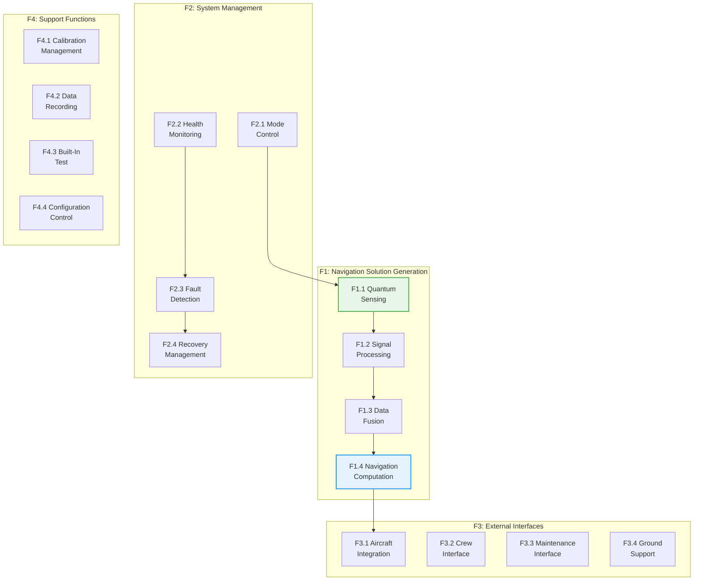
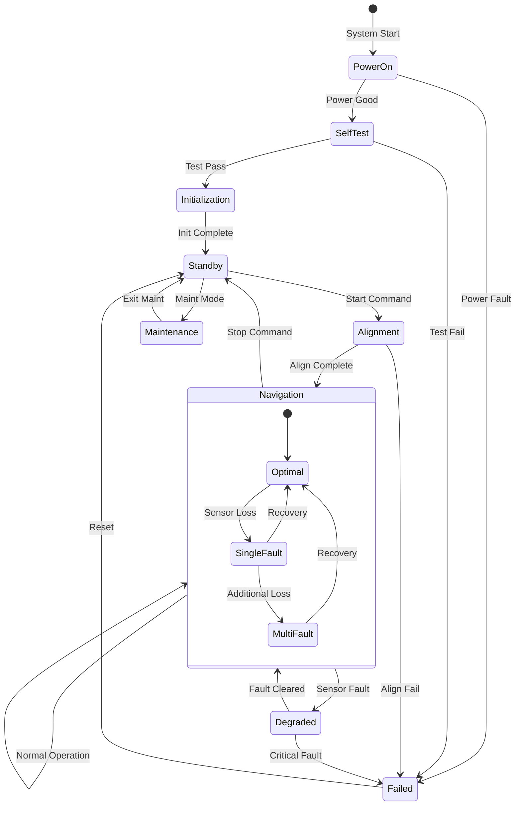
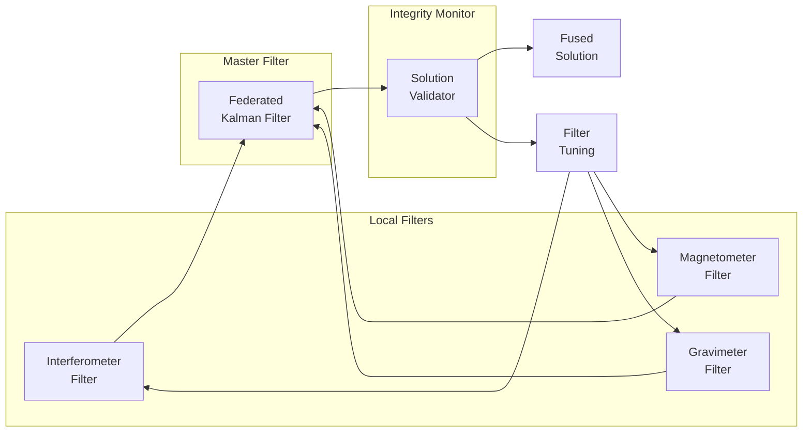
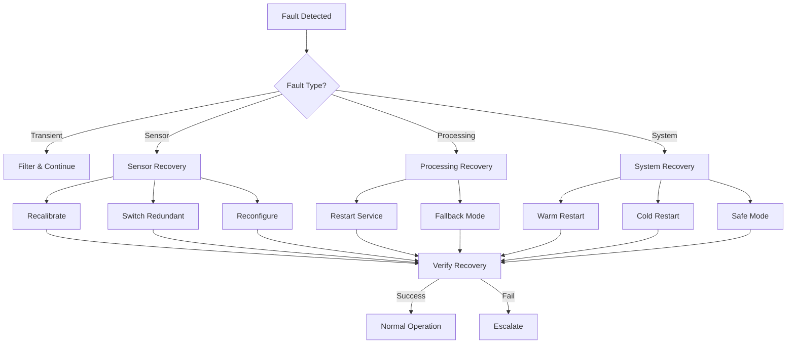
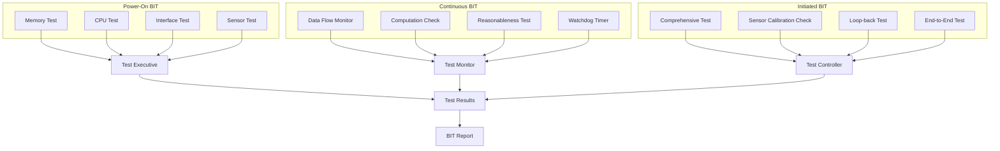

# Functional Design Specification - Quantum Navigation System

**Document ID**: QUA-QNS01-25SVD0001-DES-BOB-FUN-TD-QCSAA-915-000-00-01-TPL-DES-210-QSTR-v1.0.0  
**Template ID**: TPL-DES-210  
**Version**: 1.0.0  
**Status**: Draft - Design Phase  
**Classification**: Functional Design  
**Date**: 2025-07-29  
**Q-Division**: QSTR (Quantum Structures)  
**Product Line**: QUANTUM  
**Product**: QNS01 (Quantum Navigation System)  
**Lifecycle Phase**: DESIGN  
**Entity Type**: BOB (Digital/Virtual System)  
**UTCS Category**: QCSAA-915 (QNS Functional Design)  
**Current TRL**: 4 (Technology validated in lab)  
**Target TRL**: 6 (Technology demonstrated in relevant environment)  

> 🎯 **Purpose**: Define the complete functional architecture and behavior of the Quantum Navigation System, specifying what the system does to meet operational requirements while maintaining independence from implementation details.

---

## Document Control

| Property | Value |
|----------|--------|
| **Created By** | QSTR Division - Systems Engineering Team |
| **Creation Date** | 2025-07-29 |
| **Last Modified** | 2025-07-29 |
| **Review Cycle** | Monthly |
| **Distribution** | Systems Engineers, Certification Teams, Human Factors |
| **Related Documents** | QNS Requirements (PRD), System Architecture (TPL-DES-200), Safety Assessment |
| **Approval Status** | Pending PDR |

---

## 1. Executive Summary

This Functional Design Specification (FDS) defines the complete functional behavior, operating modes, and performance requirements for the Quantum Navigation System. The document establishes **WHAT** the system must do to provide GPS-independent navigation capability while ensuring safe, reliable operation in certified aerospace environments.

### 1.1 Functional Overview

The QNS provides:
- **Continuous Navigation Solution** in GPS-denied environments
- **Multi-Sensor Fusion** of quantum and classical measurements
- **Autonomous Operation** with minimal crew interaction
- **Graceful Degradation** maintaining safety during failures
- **Real-Time Performance** meeting aircraft navigation requirements

### 1.2 Key Functional Capabilities

| Capability | Description | Performance Target |
|------------|-------------|--------------------|
| **Position Determination** | 3D position without external references | <10m CEP after 1 hour |
| **Velocity Computation** | 3-axis velocity in Earth frame | <0.1 m/s RMS |
| **Attitude Estimation** | Roll, pitch, yaw angles | <0.01° RMS |
| **Integrity Monitoring** | Real-time solution validation | 10⁻⁷ undetected failure rate |
| **Fault Management** | Automatic recovery and reconfiguration | <1s detection, <5s recovery |

---

## 2. Functional Architecture

### 2.1 Top-Level Functional Decomposition



### 2.2 Functional Flow Diagram



---

## 3. Detailed Functional Specifications

### 3.1 F1: Navigation Solution Generation

#### 3.1.1 F1.1 - Quantum Sensing Function

**Purpose**: Acquire and validate quantum sensor measurements for navigation observables.

**Inputs**:
- Raw interferometer data (100 Hz per axis)
- Magnetometer measurements (100 Hz, 3-axis)
- Gravimeter readings (1 Hz)
- Quantum clock signals (continuous)
- Environmental conditions (temperature, pressure)

**Processing**:
1. **Data Acquisition**
   - Sample quantum sensors at specified rates
   - Apply anti-aliasing filters
   - Timestamp with quantum clock reference
   
2. **Quality Assessment**
   - Calculate signal-to-noise ratio
   - Verify quantum state coherence
   - Detect measurement anomalies
   
3. **Environmental Compensation**
   - Apply temperature corrections
   - Compensate for magnetic interference
   - Adjust for pressure variations

**Outputs**:
- Validated quantum measurements with quality indicators
- Environmental correction factors
- Sensor health status

**Performance Requirements**:

| Parameter | Requirement | Verification Method |
|-----------|-------------|-------------------|
| Measurement Latency | <10 ms | Timing analysis |
| Data Availability | >99.9% | Statistical analysis |
| False Alarm Rate | <10⁻⁶/hour | Monte Carlo simulation |
| Missed Detection | <10⁻⁷/hour | Fault injection testing |

#### 3.1.2 F1.2 - Signal Processing Function

**Purpose**: Extract navigation observables from quantum sensor data.

**Functional Behavior**:

```python
def signal_processing_function(quantum_data):
    """
    Extract navigation observables from quantum measurements
    """
    # Phase extraction from interferometer
    if quantum_data.sensor_type == "INTERFEROMETER":
        phase = extract_quantum_phase(quantum_data.interferogram)
        acceleration = phase_to_acceleration(phase, quantum_data.metadata)
        
    # Field processing from magnetometer  
    elif quantum_data.sensor_type == "MAGNETOMETER":
        field_vector = process_magnetic_field(quantum_data.field_data)
        anomaly = detect_magnetic_anomaly(field_vector)
        
    # Gravity processing from gravimeter
    elif quantum_data.sensor_type == "GRAVIMETER":
        gravity_vector = process_gravity_measurement(quantum_data.gravity_data)
        vertical_acceleration = extract_vertical_component(gravity_vector)
        
    return NavigationObservable(
        type=quantum_data.sensor_type,
        value=processed_value,
        uncertainty=calculate_uncertainty(quantum_data),
        timestamp=quantum_data.timestamp,
        quality=assess_quality(processed_value)
    )
```

**Key Algorithms**:
- Ellipse fitting for interferometer phase extraction
- Kalman filtering for noise reduction
- Wavelet denoising for transient suppression
- Adaptive filtering for environmental disturbances

#### 3.1.3 F1.3 - Data Fusion Function

**Purpose**: Combine multiple sensor measurements into optimal navigation observables.

**Fusion Architecture**:



**Fusion Logic**:
1. **Local Estimation**: Each sensor type maintains independent state estimate
2. **Information Sharing**: Local estimates combined using optimal weighting
3. **Global Update**: Master filter produces unified navigation solution
4. **Integrity Check**: Validate solution consistency across sensors

#### 3.1.4 F1.4 - Navigation Computation Function

**Purpose**: Compute complete navigation solution from fused sensor data.

**State Vector Definition**:
```
X = [r_n, r_e, r_d,          # Position (North, East, Down)
     v_n, v_e, v_d,          # Velocity
     φ, θ, ψ,                # Attitude (Roll, Pitch, Yaw)
     b_ax, b_ay, b_az,       # Accelerometer biases
     b_gx, b_gy, b_gz]       # Gyroscope biases
```

**Navigation Equations**:

```matlab
% Position propagation
r_dot = C_b^n * v_b + g_n

% Velocity propagation  
v_dot = C_b^n * (f_b - b_a) + g_n - 2*Omega_ie^n*v_n - Omega_en^n*v_n

% Attitude propagation (quaternion)
q_dot = 0.5 * Omega(omega_b - b_g) * q

% Bias propagation (random walk)
b_dot = -beta * b + w_b
```

Where:
- C_b^n: Body-to-navigation direction cosine matrix
- f_b: Specific force in body frame
- g_n: Gravity vector in navigation frame
- Omega_ie^n: Earth rotation rate
- Omega_en^n: Transport rate

### 3.2 F2: System Management Functions

#### 3.2.1 F2.1 - Mode Control Function

**Operating Modes**:

| Mode | Description | Entry Conditions | Exit Conditions |
|------|-------------|-----------------|-----------------|
| **OFF** | System powered down | Power removed | Power applied |
| **STANDBY** | Powered, not navigating | Self-test complete | Align command |
| **ALIGNMENT** | Initial alignment process | Standby + Start | Complete or timeout |
| **NAVIGATION** | Normal operation | Alignment success | Stop command |
| **DEGRADED** | Reduced performance | Sensor failure | Recovery or critical |
| **FAILED** | Navigation unavailable | Critical failure | System reset |
| **MAINTENANCE** | Ground servicing | Maint command | Exit maintenance |

**Mode Transition Logic**:

```python
class ModeController:
    def __init__(self):
        self.current_mode = SystemMode.OFF
        self.mode_timer = Timer()
        
    def request_mode_change(self, target_mode, conditions):
        # Validate transition
        if not self.is_valid_transition(self.current_mode, target_mode):
            return ModeChangeResult.INVALID_TRANSITION
            
        # Check entry conditions
        if not self.check_entry_conditions(target_mode, conditions):
            return ModeChangeResult.CONDITIONS_NOT_MET
            
        # Execute transition
        self.execute_transition(target_mode)
        return ModeChangeResult.SUCCESS
        
    def execute_transition(self, target_mode):
        # Save current state
        self.save_mode_context()
        
        # Perform exit actions
        self.perform_exit_actions(self.current_mode)
        
        # Change mode
        self.current_mode = target_mode
        self.mode_timer.reset()
        
        # Perform entry actions
        self.perform_entry_actions(target_mode)
        
        # Log transition
        self.log_mode_change(target_mode)
```

#### 3.2.2 F2.2 - Health Monitoring Function

**Monitored Parameters**:

```yaml
health_monitoring:
  quantum_sensors:
    - parameter: coherence_time
      nominal: ">100 us"
      warning: "50-100 us"
      critical: "<50 us"
      
    - parameter: signal_to_noise
      nominal: ">40 dB"
      warning: "30-40 dB"
      critical: "<30 dB"
      
    - parameter: temperature_stability
      nominal: "±0.1°C"
      warning: "±0.5°C"
      critical: "±1.0°C"
      
  processing_system:
    - parameter: cpu_utilization
      nominal: "<70%"
      warning: "70-85%"
      critical: ">85%"
      
    - parameter: memory_usage
      nominal: "<60%"
      warning: "60-80%"
      critical: ">80%"
      
    - parameter: processing_latency
      nominal: "<5 ms"
      warning: "5-8 ms"
      critical: ">8 ms"
      
  navigation_solution:
    - parameter: position_uncertainty
      nominal: "<10 m"
      warning: "10-50 m"
      critical: ">50 m"
      
    - parameter: innovation_test
      nominal: "Pass"
      warning: "Marginal"
      critical: "Fail"
```

**Health Assessment Algorithm**:

```python
def assess_system_health():
    health_score = 100.0
    health_status = HealthStatus.HEALTHY
    degraded_functions = []
    
    # Check each subsystem
    for subsystem in [quantum_sensors, processing_system, nav_solution]:
        subsystem_health = evaluate_subsystem(subsystem)
        
        if subsystem_health.status == Status.DEGRADED:
            health_score *= subsystem_health.score
            degraded_functions.extend(subsystem_health.affected_functions)
            
        elif subsystem_health.status == Status.FAILED:
            health_status = HealthStatus.CRITICAL
            break
            
    # Determine overall status
    if health_score > 90:
        health_status = HealthStatus.HEALTHY
    elif health_score > 70:
        health_status = HealthStatus.DEGRADED
    else:
        health_status = HealthStatus.CRITICAL
        
    return SystemHealth(
        status=health_status,
        score=health_score,
        degraded_functions=degraded_functions,
        timestamp=get_current_time()
    )
```

#### 3.2.3 F2.3 - Fault Detection Function

**Fault Detection Methods**:

1. **Threshold Monitoring**
   ```python
   def threshold_monitor(parameter, value, thresholds):
       if value < thresholds.min or value > thresholds.max:
           return Fault(
               type=FaultType.OUT_OF_RANGE,
               parameter=parameter,
               value=value,
               severity=calculate_severity(value, thresholds)
           )
   ```

2. **Innovation Testing**
   ```python
   def innovation_test(measurement, prediction, covariance):
       innovation = measurement - prediction
       normalized = innovation.T @ inv(covariance) @ innovation
       
       if normalized > chi2_threshold:
           return Fault(
               type=FaultType.INNOVATION_TEST_FAIL,
               statistic=normalized,
               threshold=chi2_threshold
           )
   ```

3. **Parity Space**
   ```python
   def parity_space_check(sensor_array):
       parity_vector = compute_parity_vector(sensor_array)
       
       if norm(parity_vector) > parity_threshold:
           faulty_sensor = isolate_fault(parity_vector)
           return Fault(
               type=FaultType.SENSOR_FAULT,
               sensor_id=faulty_sensor,
               parity_residual=norm(parity_vector)
           )
   ```

**Fault Classification**:

| Fault Class | Examples | Detection Time | Action |
|-------------|----------|----------------|---------|
| **Transient** | EMI spike, Vibration | <100 ms | Filter/Ignore |
| **Intermittent** | Loose connection | <1 s | Monitor/Log |
| **Degraded** | Aging sensor | <10 s | Compensate |
| **Hard Fault** | Sensor failure | <1 s | Isolate |
| **Critical** | Multiple failures | <100 ms | Safe mode |

#### 3.2.4 F2.4 - Recovery Management Function

**Recovery Strategies**:



**Recovery Procedures**:

1. **Sensor Recalibration**
   ```python
   def recalibrate_sensor(sensor_id):
       # Save current state
       backup_state = save_sensor_state(sensor_id)
       
       # Attempt online calibration
       cal_result = perform_online_calibration(sensor_id)
       
       if cal_result.success:
           update_calibration_parameters(sensor_id, cal_result.params)
           return RecoveryResult.SUCCESS
       else:
           # Restore previous state
           restore_sensor_state(sensor_id, backup_state)
           return RecoveryResult.FAILED
   ```

2. **Redundancy Switching**
   ```python
   def switch_to_redundant(failed_component):
       # Identify available redundant unit
       redundant = find_redundant_component(failed_component)
       
       if redundant and redundant.health == HEALTHY:
           # Perform seamless switchover
           freeze_outputs()
           deactivate_component(failed_component)
           activate_component(redundant)
           synchronize_state(redundant, last_good_state)
           unfreeze_outputs()
           return RecoveryResult.SUCCESS
   ```

### 3.3 F3: External Interface Functions

#### 3.3.1 F3.1 - Aircraft Integration Function

**Interface Requirements**:

| Interface | Function | Data Rate | Format |
|-----------|----------|-----------|---------|
| **Navigation Bus** | Position/Velocity/Attitude | 50 Hz | ARINC 429 |
| **Flight Management** | Navigation solution | 10 Hz | ARINC 664 |
| **Display System** | Status/Alerts | 1 Hz | ARINC 661 |
| **Health Monitor** | BIT results | On change | Discrete |

**Data Transformation**:

```python
def format_navigation_output(nav_solution):
    """Transform internal navigation solution to aircraft formats"""
    
    # ARINC 429 labels
    arinc_429_data = {
        'label_310': encode_latitude(nav_solution.latitude),      # Latitude
        'label_311': encode_longitude(nav_solution.longitude),    # Longitude
        'label_312': encode_altitude(nav_solution.altitude),      # Altitude
        'label_313': encode_velocity(nav_solution.velocity_north), # Velocity N
        'label_314': encode_velocity(nav_solution.velocity_east),  # Velocity E
        'label_324': encode_angle(nav_solution.roll),            # Roll
        'label_325': encode_angle(nav_solution.pitch),           # Pitch
        'label_326': encode_angle(nav_solution.yaw),             # Yaw
        'label_350': encode_status(nav_solution.status),         # Status
        'label_247': encode_fom(nav_solution.figure_of_merit),   # FOM
    }
    
    # ARINC 664 message
    arinc_664_msg = NavigationMessage(
        header=MessageHeader(
            timestamp=nav_solution.timestamp,
            sequence=get_next_sequence(),
            integrity=calculate_crc(nav_solution)
        ),
        position=Position(
            lat=nav_solution.latitude,
            lon=nav_solution.longitude,
            alt=nav_solution.altitude,
            accuracy=nav_solution.position_accuracy
        ),
        velocity=Velocity(
            north=nav_solution.velocity_north,
            east=nav_solution.velocity_east,
            down=nav_solution.velocity_down,
            accuracy=nav_solution.velocity_accuracy
        ),
        attitude=Attitude(
            roll=nav_solution.roll,
            pitch=nav_solution.pitch,
            yaw=nav_solution.yaw,
            accuracy=nav_solution.attitude_accuracy
        )
    )
    
    return arinc_429_data, arinc_664_msg
```

#### 3.3.2 F3.2 - Crew Interface Function

**Display Requirements**:

```yaml
crew_displays:
  primary_navigation_display:
    elements:
      - position_indicator:
          format: "LAT/LON decimal degrees"
          precision: "0.00001°"
          update_rate: "1 Hz"
          
      - velocity_vector:
          format: "Ground speed and track"
          units: "knots and degrees"
          update_rate: "2 Hz"
          
      - attitude_indicator:
          format: "Standard ADI"
          range: "±180° roll, ±90° pitch"
          update_rate: "20 Hz"
          
      - system_status:
          format: "Icon with text"
          states: ["ALIGN", "NAV", "DEGRADED", "FAIL"]
          color_coding: ["white", "green", "amber", "red"]
          
  alerts_and_warnings:
    categories:
      - caution:
          conditions: ["Single sensor fail", "Performance degraded"]
          indication: "Amber light + CAS message"
          
      - warning:
          conditions: ["Navigation unavailable", "Multiple failures"]
          indication: "Red light + Master warning"
          
  control_interface:
    switches:
      - power: "ON/OFF with guard"
      - mode: "NAV/STBY"
      - test: "Momentary push"
    
    indicators:
      - ready: "Green when aligned"
      - fault: "Amber when degraded"
      - fail: "Red when failed"
```

**Crew Alerting Logic**:

```python
class CrewAlertingSystem:
    def __init__(self):
        self.active_alerts = []
        self.alert_history = []
        
    def evaluate_conditions(self, system_state):
        alerts = []
        
        # Check for warnings (highest priority)
        if system_state.navigation_available == False:
            alerts.append(Alert(
                level=AlertLevel.WARNING,
                message="QNS NAV FAIL",
                aural="NAVIGATION NAVIGATION",
                action="SELECT ALTERNATE NAV"
            ))
            
        # Check for cautions
        elif system_state.degraded_sensors > 0:
            alerts.append(Alert(
                level=AlertLevel.CAUTION,
                message=f"QNS DEGRADED-{system_state.degraded_sensors}",
                aural=None,  # No aural for caution
                action="MONITOR PERFORMANCE"
            ))
            
        # Check for advisories
        if system_state.time_to_maintenance < 10:
            alerts.append(Alert(
                level=AlertLevel.ADVISORY,
                message="QNS MAINT DUE",
                aural=None,
                action="SCHEDULE MAINTENANCE"
            ))
            
        return self.prioritize_alerts(alerts)
```

#### 3.3.3 F3.3 - Maintenance Interface Function

**Maintenance Functions**:

1. **Built-In Test (BIT)**
   ```python
   class BuiltInTest:
       def __init__(self):
           self.test_suite = {
               'power_on': PowerOnSelfTest(),
               'continuous': ContinuousMonitor(),
               'initiated': InitiatedTest(),
               'comprehensive': ComprehensiveTest()
           }
           
       def run_pbit(self):
           """Power-On BIT - Run at startup"""
           results = TestResults()
           
           # Memory test
           results.add(self.test_memory_integrity())
           
           # Processor test
           results.add(self.test_processor_functionality())
           
           # Sensor connectivity
           results.add(self.test_sensor_communication())
           
           # Configuration validity
           results.add(self.test_configuration_integrity())
           
           return results
           
       def run_cbit(self):
           """Continuous BIT - Run during operation"""
           # Monitor key parameters
           # Check data flow
           # Verify computation results
           # Detect anomalies
   ```

2. **Diagnostic Data**
   ```yaml
   diagnostic_data:
     system_logs:
       - event_log:
           content: "Mode changes, faults, recoveries"
           retention: "1000 events or 30 days"
           
       - performance_log:
           content: "Navigation accuracy, sensor statistics"
           sampling: "1 minute averages"
           retention: "30 days"
           
       - maintenance_log:
           content: "Calibrations, replacements, tests"
           retention: "Life of system"
           
     downloadable_data:
       - fault_snapshots:
           trigger: "Any fault detection"
           content: "30 seconds pre/post fault"
           format: "Binary with timestamp"
           
       - flight_data:
           content: "Complete nav solution + sensor data"
           rate: "1 Hz decimated"
           format: "CSV or binary"
   ```

3. **Calibration Interface**
   ```python
   def maintenance_calibration_procedure():
       """Interactive calibration procedure"""
       
       # Step 1: Environmental setup
       display_message("Place aircraft in hangar")
       display_message("Ensure stable temperature")
       wait_for_confirmation()
       
       # Step 2: Sensor calibration
       for sensor in quantum_sensors:
           display_message(f"Calibrating {sensor.name}")
           
           # Zero calibration
           sensor.enable_zero_mode()
           zero_data = collect_data(duration=60)
           zero_offset = calculate_zero_offset(zero_data)
           
           # Scale calibration
           if sensor.type == "accelerometer":
               for orientation in ["X+", "X-", "Y+", "Y-", "Z+", "Z-"]:
                   display_message(f"Orient aircraft {orientation}")
                   wait_for_confirmation()
                   scale_data = collect_data(duration=30)
                   scale_factor[orientation] = calculate_scale(scale_data)
                   
           # Update calibration
           sensor.update_calibration(zero_offset, scale_factor)
           
       # Step 3: Validation
       display_message("Calibration complete, running validation")
       validation_result = run_validation_test()
       display_results(validation_result)
   ```

### 3.4 F4: Support Functions

#### 3.4.1 F4.1 - Calibration Management Function

**Calibration Parameters**:

```yaml
calibration_parameters:
  quantum_interferometer:
    - bias_offset: [x, y, z]  # g
    - scale_factor: [x, y, z]  # dimensionless
    - misalignment: [3x3 matrix]  # radians
    - temperature_coefficients:
        bias_tempco: [x, y, z]  # g/°C
        scale_tempco: [x, y, z]  # ppm/°C
    - quantum_corrections:
        decoherence_model: "exponential"
        coherence_time: 150  # microseconds
        
  quantum_magnetometer:
    - bias_offset: [x, y, z]  # nT
    - scale_factor: [x, y, z]  # dimensionless
    - soft_iron: [3x3 matrix]  # dimensionless
    - hard_iron: [x, y, z]  # nT
    
  quantum_gravimeter:
    - bias_offset: value  # μGal
    - scale_factor: value  # dimensionless
    - tilt_sensitivity: [x, y]  # μGal/degree
    - drift_rate: value  # μGal/day
```

**Calibration Update Logic**:

```python
def update_calibration(sensor_id, new_cal_data):
    """Safely update calibration parameters"""
    
    # Validate new calibration
    if not validate_calibration_data(new_cal_data):
        return CalibrationResult.INVALID_DATA
        
    # Check calibration limits
    if not within_acceptable_limits(new_cal_data):
        return CalibrationResult.OUT_OF_BOUNDS
        
    # Create backup
    backup = backup_current_calibration(sensor_id)
    
    try:
        # Apply new calibration
        apply_calibration(sensor_id, new_cal_data)
        
        # Verify performance
        test_result = run_calibration_verification(sensor_id)
        
        if test_result.passed:
            # Commit calibration
            commit_calibration(sensor_id, new_cal_data)
            log_calibration_event(sensor_id, new_cal_data)
            return CalibrationResult.SUCCESS
        else:
            # Revert to backup
            restore_calibration(sensor_id, backup)
            return CalibrationResult.VERIFICATION_FAILED
            
    except Exception as e:
        # Ensure safe state
        restore_calibration(sensor_id, backup)
        log_error(f"Calibration failed: {e}")
        return CalibrationResult.ERROR
```

#### 3.4.2 F4.2 - Data Recording Function

**Recording Specifications**:

| Data Type | Rate | Retention | Priority |
|-----------|------|-----------|----------|
| Navigation Solution | 50 Hz | 2 hours continuous | Critical |
| Sensor Raw Data | 100-1000 Hz | 10 minutes rolling | High |
| System Health | 1 Hz | 24 hours | High |
| Events/Faults | On occurrence | 30 days | Critical |
| Configuration | On change | Permanent | Critical |

**Data Recording Architecture**:

```python
class DataRecorder:
    def __init__(self, config):
        self.buffers = {
            'high_rate': CircularBuffer(size=config.high_rate_size),
            'medium_rate': CircularBuffer(size=config.medium_rate_size),
            'low_rate': CircularBuffer(size=config.low_rate_size),
            'event': EventBuffer(size=config.event_size)
        }
        self.storage = PersistentStorage(config.storage_path)
        
    def record_data(self, data_packet):
        """Route data to appropriate buffer"""
        
        # Classify by rate
        if data_packet.rate >= 100:
            self.buffers['high_rate'].write(data_packet)
            
        elif data_packet.rate >= 10:
            self.buffers['medium_rate'].write(data_packet)
            
        else:
            self.buffers['low_rate'].write(data_packet)
            
        # Check for triggered storage
        if self.check_trigger_conditions(data_packet):
            self.trigger_snapshot()
            
    def trigger_snapshot(self):
        """Save data snapshot on trigger event"""
        
        snapshot = DataSnapshot(
            timestamp=get_current_time(),
            trigger_reason=self.get_trigger_reason(),
            pre_trigger_data=self.extract_pre_trigger_data(),
            post_trigger_data=None  # Will be filled over time
        )
        
        # Save to persistent storage
        self.storage.save_snapshot(snapshot)
        
        # Continue collecting post-trigger data
        self.start_post_trigger_collection(snapshot.id)
```

#### 3.4.3 F4.3 - Built-In Test Function

**BIT Architecture**:



**Test Coverage Matrix**:

| Component | PBIT | CBIT | IBIT | Coverage |
|-----------|------|------|------|----------|
| Quantum Sensors | ✓ | ✓ | ✓ | 95% |
| Signal Processing | ✓ | ✓ | ✓ | 90% |
| Navigation Algorithm | ✓ | ✓ | ✓ | 85% |
| Interfaces | ✓ | ✓ | ✓ | 100% |
| Memory/Storage | ✓ | ✓ | ✓ | 99% |
| Power Supplies | ✓ | ✓ | - | 90% |

#### 3.4.4 F4.4 - Configuration Control Function

**Configuration Management**:

```yaml
configuration_structure:
  hardware_configuration:
    - serial_numbers:
        main_unit: "QNS-001-2025-0001"
        interferometer_x: "QIF-X-2025-0001"
        interferometer_y: "QIF-Y-2025-0001"
        interferometer_z: "QIF-Z-2025-0001"
        
    - hardware_versions:
        main_board: "Rev C"
        sensor_boards: "Rev B"
        power_supply: "Rev D"
        
  software_configuration:
    - application_software:
        version: "1.0.0"
        build: "20250729-1234"
        checksum: "SHA256:abcd1234..."
        
    - firmware:
        fpga_image: "qns_fpga_v2.3.bit"
        sensor_firmware: "sensor_fw_v1.5.hex"
        
    - configuration_data:
        calibration_set: "CAL-2025-07-29"
        navigation_db: "NAV-DB-2025Q3"
        
  operational_configuration:
    - aircraft_installation:
        aircraft_type: "AMPEL360"
        installation_date: "2025-07-29"
        position_offset: [x: 2.5, y: 0.0, z: -1.2]  # meters
        
    - operational_limits:
        max_altitude: 51000  # feet
        max_velocity: 500   # knots
        temperature_range: [-40, 70]  # Celsius
```

**Configuration Verification**:

```python
def verify_configuration():
    """Verify system configuration integrity"""
    
    verification_report = ConfigurationReport()
    
    # Check hardware configuration
    hw_result = verify_hardware_configuration()
    verification_report.add_section("Hardware", hw_result)
    
    # Check software configuration
    sw_result = verify_software_configuration()
    verification_report.add_section("Software", sw_result)
    
    # Check compatibility
    compatibility = check_hw_sw_compatibility()
    verification_report.add_section("Compatibility", compatibility)
    
    # Check against aircraft interface
    interface_check = verify_aircraft_interface()
    verification_report.add_section("Aircraft Interface", interface_check)
    
    # Generate summary
    if verification_report.all_passed():
        verification_report.status = "CONFIGURATION VALID"
    else:
        verification_report.status = "CONFIGURATION INVALID"
        verification_report.add_corrective_actions()
        
    return verification_report
```

---

## 4. Performance Requirements Allocation

### 4.1 Navigation Performance

| Function | Requirement | Allocation | Margin |
|----------|-------------|------------|---------|
| **Position Accuracy** | 10m CEP @ 1hr | Sensor: 3m, Processing: 2m, Integration: 5m | 20% |
| **Velocity Accuracy** | 0.1 m/s RMS | Sensor: 0.03, Processing: 0.02, Integration: 0.05 | 50% |
| **Attitude Accuracy** | 0.01° RMS | Sensor: 0.003°, Processing: 0.002°, Integration: 0.005° | 50% |
| **Update Rate** | 50 Hz | Sensor: 100 Hz, Processing: 10ms, Output: 50 Hz | 100% |

### 4.2 Timing Requirements

```mermaid
gantt
    title Function Timing Budget (20ms frame)
    dateFormat X
    axisFormat %L
    
    section Sensing
    Quantum Acquisition     :0, 3
    Signal Validation      :3, 2
    
    section Processing  
    Phase Extraction       :5, 3
    Noise Filtering       :8, 2
    
    section Fusion
    Local Filters         :10, 3
    Master Filter         :13, 2
    
    section Output
    Format Conversion     :15, 2
    Interface Transfer    :17, 1
    
    section Margin
    Timing Margin         :18, 2
```



### 4.3 Resource Allocation

| Resource | Budget | Allocation | Utilization |
|----------|--------|------------|-------------|
| **CPU Cores** | 8 | Sensing: 2, Processing: 3, Fusion: 2, I/O: 1 | 100% |
| **Memory** | 32 GB | Application: 8GB, Buffers: 16GB, OS: 8GB | 100% |
| **Power** | 150W | Quantum: 80W, Computing: 50W, I/O: 20W | 100% |
| **Bandwidth** | 1 Gbps | Sensor data: 400 Mbps, Internal: 400 Mbps, External: 200 Mbps | 100% |

---

## 5. Functional Safety Analysis

### 5.1 Functional Hazard Assessment

| Function | Failure Mode | Effect | Severity | Probability | Risk |
|----------|--------------|---------|----------|-------------|------|
| F1.1 Quantum Sensing | Total loss | No navigation | Catastrophic | Extremely Remote | Medium |
| F1.2 Signal Processing | Incorrect output | Wrong position | Hazardous | Remote | Medium |
| F1.3 Data Fusion | Failed fusion | Degraded accuracy | Major | Remote | Low |
| F1.4 Navigation Computation | Computation error | Navigation error | Hazardous | Extremely Remote | Low |
| F2.3 Fault Detection | Missed fault | Undetected error | Hazardous | Remote | Medium |

### 5.2 Safety Requirements

```yaml
functional_safety_requirements:
  detection:
    - FSR-001: "System shall detect loss of quantum coherence within 100ms"
    - FSR-002: "System shall detect sensor failure within 1 second"
    - FSR-003: "System shall detect navigation solution divergence within 5 seconds"
    
  mitigation:
    - FSR-004: "System shall isolate failed sensor within 100ms of detection"
    - FSR-005: "System shall provide degraded navigation with single sensor failure"
    - FSR-006: "System shall transition to safe mode with multiple failures"
    
  indication:
    - FSR-007: "System shall indicate degraded performance to crew within 1 second"
    - FSR-008: "System shall provide clear failure annunciation"
    - FSR-009: "System shall log all safety-critical events"
```

---

## 6. Verification Approach

### 6.1 Functional Verification Matrix

| Function | Analysis | Test | Demonstration | Inspection |
|----------|----------|------|---------------|------------|
| F1.1 Quantum Sensing | ✓ | ✓ | ✓ | |
| F1.2 Signal Processing | ✓ | ✓ | | |
| F1.3 Data Fusion | ✓ | ✓ | ✓ | |
| F1.4 Navigation | ✓ | ✓ | ✓ | |
| F2.1 Mode Control | | ✓ | ✓ | ✓ |
| F2.2 Health Monitor | ✓ | ✓ | | ✓ |
| F2.3 Fault Detection | ✓ | ✓ | ✓ | |
| F2.4 Recovery | | ✓ | ✓ | |
| F3.1 Aircraft Interface | | ✓ | ✓ | ✓ |
| F3.2 Crew Interface | | ✓ | ✓ | ✓ |

### 6.2 Test Scenarios

```python
test_scenarios = {
    "nominal_operation": {
        "description": "Verify all functions in normal conditions",
        "duration": "2 hours",
        "success_criteria": "Navigation accuracy within spec"
    },
    
    "single_sensor_failure": {
        "description": "Inject single sensor fault",
        "duration": "30 minutes",
        "success_criteria": "Continued navigation with degraded accuracy"
    },
    
    "environmental_stress": {
        "description": "Operate at temperature/vibration limits",
        "duration": "4 hours",
        "success_criteria": "Performance maintained within limits"
    },
    
    "power_interruption": {
        "description": "Interrupt power for 50ms",
        "duration": "10 cycles",
        "success_criteria": "Automatic recovery without data loss"
    },
    
    "interface_compatibility": {
        "description": "Verify all external interfaces",
        "duration": "1 hour",
        "success_criteria": "All data correctly formatted and transmitted"
    }
}
```

---

## 7. Traceability

### 7.1 Requirements Traceability

| Requirement | Function | Verification |
|-------------|----------|--------------|
| REQ-NAV-001: GPS-independent navigation | F1.1, F1.2, F1.3, F1.4 | Test, Demo |
| REQ-NAV-002: 10m accuracy @ 1hr | F1.4 | Test, Analysis |
| REQ-INT-001: ARINC 429 interface | F3.1 | Test, Inspection |
| REQ-SAF-001: Single fault tolerance | F2.3, F2.4 | Test, Analysis |
| REQ-HMI-001: Crew alerting | F3.2 | Test, Demo |

### 7.2 Function to Module Mapping

| Function | Software Module | Hardware Module |
|----------|----------------|-----------------|
| F1.1 Quantum Sensing | quantum_driver.c | Sensor Interface Board |
| F1.2 Signal Processing | signal_proc.cpp | FPGA + CPU |
| F1.3 Data Fusion | fusion_engine.cpp | CPU Core 2-3 |
| F1.4 Navigation | navigation.cpp | CPU Core 4 |
| F2.x System Management | system_mgr.cpp | CPU Core 1 |
| F3.x External Interface | interface_mgr.cpp | Interface Board |

---

## 8. Conclusion

This Functional Design Specification provides a complete definition of the Quantum Navigation System's functional behavior, ensuring all operational requirements are met through well-defined, verifiable functions. The hierarchical decomposition from top-level capabilities to detailed functional behaviors enables:

- **Clear understanding** of system operation
- **Traceable implementation** to requirements
- **Comprehensive verification** planning
- **Safety-critical** operation assurance
- **Effective integration** with aircraft systems

The functional architecture supports the system's evolution from TRL 4 to TRL 6, providing the foundation for detailed implementation while maintaining flexibility for optimization and enhancement.

---

**END OF DOCUMENT**

*This specification defines the complete functional behavior of the Quantum Navigation System.*

**Document Control**: QUA-QNS01-25SVD0001-DES-BOB-FUN-TD-QCSAA-915-000-00-01-TPL-DES-210-QSTR-v1.0.0  
**Classification**: Functional Design - Design Phase  
**© 2025 A.Q.U.A.-V. Aerospace. All rights reserved.**
