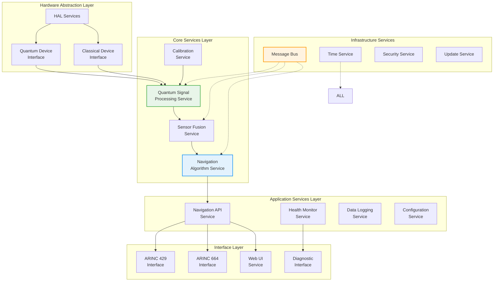
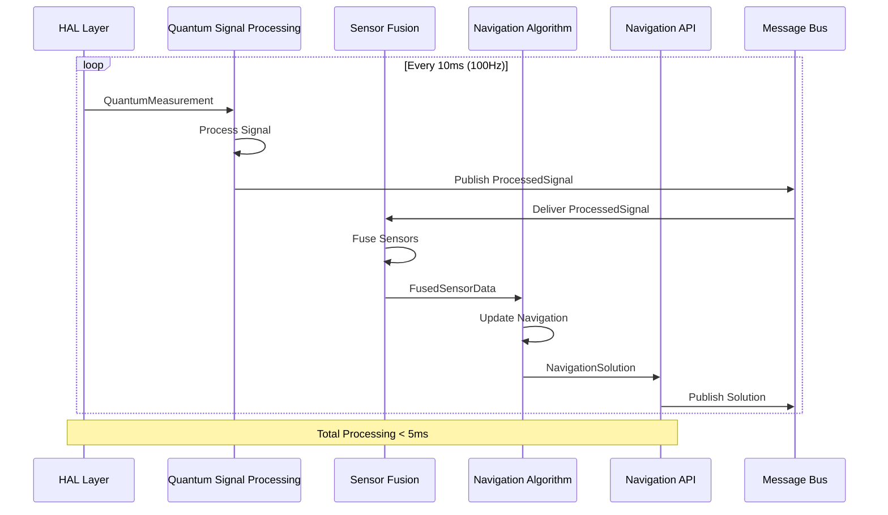
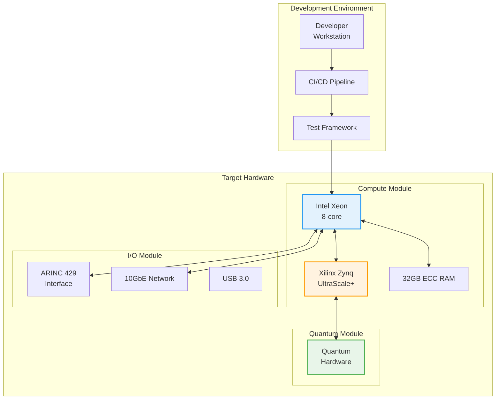

# Software Architecture Design - Quantum Navigation System

**Document ID**: QUA-QNS01-25SVD0001-DES-BOB-TEC-TD-QCSAA-911-000-00-01-TPL-DES-201-QSTR-v1.0.0  
**Template ID**: TPL-DES-201  
**Version**: 1.0.0  
**Status**: Draft - Design Phase  
**Classification**: Technical Design  
**Date**: 2025-07-29  
**Q-Division**: QSTR (Quantum Structures)  
**Product Line**: QUANTUM  
**Product**: QNS01 (Quantum Navigation System)  
**Lifecycle Phase**: DESIGN  
**Entity Type**: BOB (Digital/Virtual System)  
**UTCS Category**: QCSAA-911 (QNS Software Architecture)  
**Current TRL**: 4 (Technology validated in lab)  
**Target TRL**: 6 (Technology demonstrated in relevant environment)  

> 💻 **Purpose**: Define the comprehensive software architecture for the Quantum Navigation System, detailing software components, interfaces, data flows, and real-time processing requirements to implement the system architecture design.

---

## Document Control

| Property | Value |
|----------|--------|
| **Created By** | QSTR Division - Software Architecture Team |
| **Creation Date** | 2025-07-29 |
| **Last Modified** | 2025-07-29 |
| **Review Cycle** | Monthly |
| **Distribution** | Software Engineers, System Architects, Integration Teams |
| **Related Documents** | TPL-DES-200 (System Architecture v1.0.0), TPL-DES-202 (Interface Control), TPL-DES-203 (Database Design) |
| **Approval Status** | Pending PDR |

---

## 1. Executive Summary

This document presents the software architecture design for the Quantum Navigation System (QNS), transforming the system architecture into a detailed software implementation framework. The design employs a **microservices architecture** with **real-time constraints**, enabling modular development, scalability, and certification compliance for safety-critical aerospace applications.

### 1.1 Key Software Design Principles

- **Real-time Performance**: Deterministic execution with guaranteed response times
- **Fault Tolerance**: Graceful degradation and automatic recovery
- **Modularity**: Loosely coupled services with well-defined interfaces
- **Certifiability**: DO-178C DAL-B compliance from inception
- **Quantum-Classical Bridge**: Efficient interfacing between quantum and classical domains

---

## 2. Software Architecture Overview

### 2.1 Architectural Pattern

The QNS software follows a **Layered Microservices Architecture** with the following characteristics:

- **Service-Oriented**: Each major function implemented as independent service
- **Event-Driven**: Asynchronous communication via message passing
- **Real-Time**: Deterministic scheduling and resource allocation
- **Fault-Tolerant**: Byzantine fault tolerance for critical services

### 2.2 High-Level Software Architecture



---

## 3. Detailed Software Components

### 3.1 Hardware Abstraction Layer (HAL)

#### 3.1.1 Quantum Device Interface

```cpp
namespace QNS::HAL {

class QuantumDeviceInterface {
public:
    // Base interface for all quantum sensors
    virtual StatusCode initialize(const DeviceConfig& config) = 0;
    virtual StatusCode startMeasurement() = 0;
    virtual StatusCode readMeasurement(QuantumMeasurement& data) = 0;
    virtual StatusCode calibrate(const CalibrationParams& params) = 0;
    virtual DeviceStatus getStatus() const = 0;
    virtual ~QuantumDeviceInterface() = default;
    
protected:
    // Real-time constraints
    static constexpr uint32_t MAX_INIT_TIME_MS = 5000;
    static constexpr uint32_t MAX_READ_TIME_US = 100;
    static constexpr uint32_t MEASUREMENT_TIMEOUT_MS = 150;
};

class InterferometerDriver : public QuantumDeviceInterface {
private:
    std::unique_ptr<FPGAInterface> fpga_;
    std::unique_ptr<LaserController> laser_;
    std::unique_ptr<PhotodetectorArray> detectors_;
    
public:
    StatusCode initialize(const DeviceConfig& config) override {
        // Initialize FPGA for real-time control
        fpga_ = std::make_unique<FPGAInterface>(config.fpga_bitfile);
        
        // Configure laser system
        laser_ = std::make_unique<LaserController>(
            config.laser_params,
            config.safety_interlocks
        );
        
        // Setup photodetector array
        detectors_ = std::make_unique<PhotodetectorArray>(
            config.detector_count,
            config.sampling_rate
        );
        
        return StatusCode::SUCCESS;
    }
    
    StatusCode readMeasurement(QuantumMeasurement& data) override {
        // Real-time measurement sequence
        auto start_time = std::chrono::high_resolution_clock::now();
        
        // Trigger measurement pulse sequence
        fpga_->triggerPulseSequence();
        
        // Read interferogram data
        std::vector<uint16_t> raw_data;
        detectors_->readData(raw_data, MEASUREMENT_TIMEOUT_MS);
        
        // Package quantum measurement
        data.timestamp = getQuantumTimestamp();
        data.interferogram = std::move(raw_data);
        data.metadata.temperature = readTemperature();
        data.metadata.magnetic_field = readMagneticField();
        
        // Verify timing constraint
        auto elapsed = std::chrono::high_resolution_clock::now() - start_time;
        if (elapsed > std::chrono::microseconds(MAX_READ_TIME_US)) {
            return StatusCode::TIMING_VIOLATION;
        }
        
        return StatusCode::SUCCESS;
    }
};

} // namespace QNS::HAL
```

### 3.2 Core Services Layer

#### 3.2.1 Quantum Signal Processing Service

```cpp
namespace QNS::Core {

class QuantumSignalProcessingService : public RealTimeService {
private:
    // Processing pipeline components
    std::unique_ptr<PhaseExtractor> phase_extractor_;
    std::unique_ptr<QuantumNoiseFilter> noise_filter_;
    std::unique_ptr<StateEstimator> state_estimator_;
    
    // Real-time thread pool
    ThreadPool<RealTimeThread> processing_threads_;
    
    // Lock-free data structures for real-time performance
    LockFreeQueue<QuantumMeasurement> input_queue_;
    LockFreeQueue<ProcessedSignal> output_queue_;
    
public:
    void processQuantumSignal(const QuantumMeasurement& measurement) {
        // Submit to real-time processing pipeline
        auto task = [this, measurement]() {
            // Extract phase information
            auto phase_data = phase_extractor_->extract(measurement);
            
            // Apply quantum noise filtering
            auto filtered = noise_filter_->filter(phase_data);
            
            // Estimate quantum state
            auto state = state_estimator_->estimate(filtered);
            
            // Convert to navigation observable
            ProcessedSignal signal;
            signal.acceleration = convertToAcceleration(state);
            signal.rotation = convertToRotation(state);
            signal.timestamp = measurement.timestamp;
            signal.uncertainty = calculateUncertainty(state);
            
            // Push to output queue (lock-free)
            output_queue_.push(signal);
            
            // Publish to message bus
            publishSignal(signal);
        };
        
        processing_threads_.submit(task, Priority::CRITICAL);
    }
    
private:
    // Ellipse fitting algorithm for phase extraction
    PhaseData extractPhaseEllipseFit(const std::vector<uint16_t>& interferogram) {
        // Implementation of real-time ellipse fitting
        EllipseFitter fitter;
        auto ellipse = fitter.fit(interferogram);
        
        PhaseData phase;
        phase.value = atan2(ellipse.minor_axis, ellipse.major_axis);
        phase.contrast = ellipse.eccentricity;
        phase.quality = assessFitQuality(ellipse);
        
        return phase;
    }
};

} // namespace QNS::Core
```

#### 3.2.2 Navigation Algorithm Service

```cpp
namespace QNS::Core {

class NavigationAlgorithmService : public RealTimeService {
private:
    // Navigation filter implementation
    std::unique_ptr<ExtendedKalmanFilter> ekf_;
    
    // State vector: [position(3), velocity(3), quaternion(4), biases(5)]
    Eigen::VectorXd state_vector_;
    Eigen::MatrixXd covariance_matrix_;
    
    // Quantum corrections
    std::unique_ptr<QuantumCorrections> quantum_corrections_;
    
public:
    NavigationSolution computeNavigation(const SensorData& sensors) {
        // Time update (prediction)
        propagateState(sensors.delta_time);
        
        // Measurement update
        if (sensors.has_interferometer_data) {
            updateWithInterferometer(sensors.interferometer);
        }
        if (sensors.has_magnetometer_data) {
            updateWithMagnetometer(sensors.magnetometer);
        }
        if (sensors.has_gravimeter_data) {
            updateWithGravimeter(sensors.gravimeter);
        }
        
        // Apply quantum corrections
        applyQuantumCorrections();
        
        // Extract navigation solution
        return extractNavigationSolution();
    }
    
private:
    void propagateState(double dt) {
        // State transition with quantum mechanics
        Eigen::MatrixXd F = computeStateTransition(dt);
        
        // Include relativistic effects
        if (quantum_corrections_->isRelativisticCorrectionEnabled()) {
            F = quantum_corrections_->applyRelativisticCorrection(F, state_vector_);
        }
        
        // Propagate state and covariance
        state_vector_ = F * state_vector_;
        covariance_matrix_ = F * covariance_matrix_ * F.transpose() + 
                           computeProcessNoise(dt);
    }
    
    void updateWithInterferometer(const InterferometerData& data) {
        // Measurement model for quantum interferometer
        Eigen::VectorXd h = computeMeasurementModel(state_vector_);
        Eigen::MatrixXd H = computeMeasurementJacobian(state_vector_);
        
        // Innovation
        Eigen::VectorXd innovation = data.measurement - h;
        
        // Kalman gain
        Eigen::MatrixXd S = H * covariance_matrix_ * H.transpose() + 
                          data.noise_covariance;
        Eigen::MatrixXd K = covariance_matrix_ * H.transpose() * S.inverse();
        
        // Update state and covariance
        state_vector_ += K * innovation;
        covariance_matrix_ = (Eigen::MatrixXd::Identity(15, 15) - K * H) * 
                           covariance_matrix_;
    }
};

} // namespace QNS::Core
```

### 3.3 Application Services Layer

#### 3.3.1 Navigation API Service

```cpp
namespace QNS::Application {

class NavigationAPIService : public Service {
private:
    // REST API endpoints
    RestServer rest_server_;
    
    // WebSocket for real-time updates
    WebSocketServer ws_server_;
    
    // gRPC for high-performance clients
    grpc::Server grpc_server_;
    
public:
    void initialize() {
        // Setup REST endpoints
        rest_server_.route("/api/v1/navigation/position", 
            [this](const Request& req) { return getPosition(); });
        rest_server_.route("/api/v1/navigation/velocity", 
            [this](const Request& req) { return getVelocity(); });
        rest_server_.route("/api/v1/navigation/attitude", 
            [this](const Request& req) { return getAttitude(); });
        
        // WebSocket streaming
        ws_server_.on_connection([this](WebSocketConnection& conn) {
            subscribeToNavigationUpdates(conn);
        });
        
        // gRPC service implementation
        grpc::ServerBuilder builder;
        builder.AddListeningPort("0.0.0.0:50051", 
            grpc::InsecureServerCredentials());
        builder.RegisterService(this);
        grpc_server_ = builder.BuildAndStart();
    }
    
    // Protocol buffer definition for navigation data
    NavigationProto getNavigationData() {
        NavigationProto nav_data;
        
        auto solution = getCurrentNavigationSolution();
        
        // Position
        nav_data.mutable_position()->set_latitude(solution.latitude);
        nav_data.mutable_position()->set_longitude(solution.longitude);
        nav_data.mutable_position()->set_altitude(solution.altitude);
        
        // Velocity
        nav_data.mutable_velocity()->set_north(solution.velocity_north);
        nav_data.mutable_velocity()->set_east(solution.velocity_east);
        nav_data.mutable_velocity()->set_down(solution.velocity_down);
        
        // Attitude
        nav_data.mutable_attitude()->set_roll(solution.roll);
        nav_data.mutable_attitude()->set_pitch(solution.pitch);
        nav_data.mutable_attitude()->set_yaw(solution.yaw);
        
        // Uncertainty
        nav_data.mutable_uncertainty()->CopyFrom(
            convertUncertainty(solution.covariance));
        
        // Timestamp
        nav_data.set_timestamp_ns(solution.timestamp.count());
        
        return nav_data;
    }
};

} // namespace QNS::Application
```

### 3.4 Infrastructure Services

#### 3.4.1 Real-Time Message Bus

```cpp
namespace QNS::Infrastructure {

class RealTimeMessageBus : public MessageBus {
private:
    // Topic-based publish/subscribe
    std::unordered_map<std::string, std::vector<Subscriber>> subscribers_;
    
    // Lock-free message queues per priority
    LockFreeQueue<Message> critical_queue_;
    LockFreeQueue<Message> high_queue_;
    LockFreeQueue<Message> normal_queue_;
    
    // Real-time dispatcher threads
    std::vector<std::thread> dispatcher_threads_;
    
public:
    void publish(const std::string& topic, 
                const Message& message, 
                Priority priority = Priority::NORMAL) {
        // Timestamp message
        auto timestamped_msg = message;
        timestamped_msg.timestamp = getHighResolutionTime();
        
        // Route to appropriate queue
        switch (priority) {
            case Priority::CRITICAL:
                critical_queue_.push(timestamped_msg);
                break;
            case Priority::HIGH:
                high_queue_.push(timestamped_msg);
                break;
            case Priority::NORMAL:
                normal_queue_.push(timestamped_msg);
                break;
        }
    }
    
    void subscribe(const std::string& topic, 
                  std::function<void(const Message&)> callback,
                  const SubscriptionOptions& options = {}) {
        Subscriber sub;
        sub.callback = callback;
        sub.filter = options.filter;
        sub.thread_affinity = options.thread_affinity;
        
        std::lock_guard<std::mutex> lock(subscribers_mutex_);
        subscribers_[topic].push_back(sub);
    }
    
private:
    void dispatcherThread(Priority priority) {
        // Set real-time scheduling
        setRealtimePriority(priority);
        
        // CPU affinity for deterministic performance
        setCPUAffinity(priority);
        
        while (running_) {
            Message msg;
            bool has_message = false;
            
            // Non-blocking read from appropriate queue
            switch (priority) {
                case Priority::CRITICAL:
                    has_message = critical_queue_.try_pop(msg);
                    break;
                case Priority::HIGH:
                    has_message = high_queue_.try_pop(msg);
                    break;
                case Priority::NORMAL:
                    has_message = normal_queue_.try_pop(msg);
                    break;
            }
            
            if (has_message) {
                dispatchMessage(msg);
            } else {
                // Yield to avoid busy waiting
                std::this_thread::yield();
            }
        }
    }
};

} // namespace QNS::Infrastructure
```

---

## 4. Data Flow and Communication

### 4.1 Inter-Service Communication



### 4.2 Message Definitions

```protobuf
// Protocol Buffer definitions for inter-service communication

syntax = "proto3";
package qns;

message QuantumMeasurement {
    uint64 timestamp_ns = 1;
    bytes interferogram = 2;
    
    message Metadata {
        double temperature_k = 1;
        double magnetic_field_t = 2;
        double pressure_pa = 3;
    }
    Metadata metadata = 3;
    
    enum Quality {
        GOOD = 0;
        DEGRADED = 1;
        FAILED = 2;
    }
    Quality quality = 4;
}

message ProcessedSignal {
    uint64 timestamp_ns = 1;
    
    message Vector3 {
        double x = 1;
        double y = 2;
        double z = 3;
    }
    
    Vector3 acceleration = 2;  // m/s²
    Vector3 rotation_rate = 3; // rad/s
    
    message Uncertainty {
        repeated double covariance = 1; // 6x6 matrix, row-major
    }
    Uncertainty uncertainty = 4;
}

message NavigationSolution {
    uint64 timestamp_ns = 1;
    
    message Position {
        double latitude_deg = 1;
        double longitude_deg = 2;
        double altitude_m = 3;
    }
    Position position = 2;
    
    message Velocity {
        double north_m_s = 1;
        double east_m_s = 2;
        double down_m_s = 3;
    }
    Velocity velocity = 3;
    
    message Attitude {
        double roll_deg = 1;
        double pitch_deg = 2;
        double yaw_deg = 3;
    }
    Attitude attitude = 4;
    
    enum SolutionQuality {
        OPTIMAL = 0;
        DEGRADED = 1;
        COAST = 2;
        FAILED = 3;
    }
    SolutionQuality quality = 5;
}
```

---

## 5. Real-Time Design Patterns

### 5.1 Memory Management

```cpp
namespace QNS::Memory {

// Custom allocator for real-time performance
template<typename T>
class RealTimeAllocator {
private:
    MemoryPool<T> pool_;
    static constexpr size_t POOL_SIZE = 1024;
    
public:
    T* allocate(size_t n) {
        if (n == 1) {
            // Fast path for single object
            return pool_.allocate();
        }
        // Fall back to pre-allocated blocks for arrays
        return static_cast<T*>(
            MemoryManager::getInstance().allocate(n * sizeof(T))
        );
    }
    
    void deallocate(T* p, size_t n) {
        if (n == 1) {
            pool_.deallocate(p);
        } else {
            MemoryManager::getInstance().deallocate(p);
        }
    }
};

// Lock-free object pool for frequent allocations
template<typename T>
class LockFreeObjectPool {
private:
    struct Node {
        T data;
        std::atomic<Node*> next;
    };
    
    std::atomic<Node*> head_;
    std::array<Node, 1024> nodes_;
    
public:
    T* acquire() {
        Node* head = head_.load(std::memory_order_acquire);
        while (head && !head_.compare_exchange_weak(
            head, head->next.load(std::memory_order_relaxed),
            std::memory_order_release, std::memory_order_acquire)) {
            // Retry
        }
        return head ? &head->data : nullptr;
    }
    
    void release(T* obj) {
        Node* node = reinterpret_cast<Node*>(
            reinterpret_cast<char*>(obj) - offsetof(Node, data)
        );
        Node* head = head_.load(std::memory_order_relaxed);
        do {
            node->next.store(head, std::memory_order_relaxed);
        } while (!head_.compare_exchange_weak(
            head, node, std::memory_order_release, std::memory_order_acquire));
    }
};

} // namespace QNS::Memory
```

### 5.2 Task Scheduling

```cpp
namespace QNS::Scheduling {

class RealTimeScheduler {
private:
    struct Task {
        std::function<void()> function;
        std::chrono::nanoseconds period;
        std::chrono::nanoseconds deadline;
        Priority priority;
        uint32_t core_affinity;
    };
    
    std::vector<Task> periodic_tasks_;
    std::priority_queue<ScheduledTask> task_queue_;
    
public:
    void schedulePeriodic(std::function<void()> task,
                         std::chrono::nanoseconds period,
                         Priority priority = Priority::NORMAL,
                         uint32_t core = ANY_CORE) {
        Task t;
        t.function = task;
        t.period = period;
        t.deadline = period * 0.8; // 80% of period as deadline
        t.priority = priority;
        t.core_affinity = core;
        
        periodic_tasks_.push_back(t);
    }
    
    void run() {
        // Set real-time scheduling policy
        struct sched_param param;
        param.sched_priority = sched_get_priority_max(SCHED_FIFO);
        pthread_setschedparam(pthread_self(), SCHED_FIFO, &param);
        
        // Main scheduling loop
        auto next_wake = std::chrono::steady_clock::now();
        
        while (running_) {
            // Execute all tasks due at this time
            executeDueTasks();
            
            // Calculate next wake time
            next_wake += std::chrono::microseconds(100); // 10kHz tick
            
            // Sleep until next scheduling point
            std::this_thread::sleep_until(next_wake);
        }
    }
};

} // namespace QNS::Scheduling
```

---

## 6. Fault Tolerance and Recovery

### 6.1 Service Health Monitoring

```cpp
namespace QNS::HealthMonitoring {

class ServiceHealthMonitor {
private:
    struct ServiceHealth {
        std::string service_name;
        std::atomic<bool> is_healthy{true};
        std::atomic<uint64_t> last_heartbeat{0};
        std::atomic<uint32_t> error_count{0};
        std::chrono::milliseconds timeout{1000};
    };
    
    std::unordered_map<std::string, ServiceHealth> services_;
    std::thread monitor_thread_;
    
public:
    void registerService(const std::string& name, 
                        std::chrono::milliseconds timeout) {
        ServiceHealth health;
        health.service_name = name;
        health.timeout = timeout;
        health.last_heartbeat = getCurrentTimeMs();
        
        services_[name] = health;
    }
    
    void heartbeat(const std::string& service) {
        if (auto it = services_.find(service); it != services_.end()) {
            it->second.last_heartbeat.store(getCurrentTimeMs());
            it->second.error_count.store(0);
        }
    }
    
    void reportError(const std::string& service, const Error& error) {
        if (auto it = services_.find(service); it != services_.end()) {
            it->second.error_count.fetch_add(1);
            
            // Check if error threshold exceeded
            if (it->second.error_count.load() > ERROR_THRESHOLD) {
                it->second.is_healthy.store(false);
                initiateRecovery(service);
            }
        }
    }
    
private:
    void monitoringLoop() {
        while (running_) {
            auto now = getCurrentTimeMs();
            
            for (auto& [name, health] : services_) {
                auto last_heartbeat = health.last_heartbeat.load();
                if (now - last_heartbeat > health.timeout.count()) {
                    health.is_healthy.store(false);
                    initiateRecovery(name);
                }
            }
            
            std::this_thread::sleep_for(std::chrono::milliseconds(100));
        }
    }
    
    void initiateRecovery(const std::string& service) {
        LOG_ERROR("Service {} failed, initiating recovery", service);
        
        // Service-specific recovery procedures
        if (service == "QuantumSignalProcessing") {
            restartQuantumProcessing();
        } else if (service == "NavigationAlgorithm") {
            switchToBackupNavigation();
        }
        
        // Notify system supervisor
        notifySupervisor(ServiceFailure{service, getCurrentTime()});
    }
};

} // namespace QNS::HealthMonitoring
```

---

## 7. Configuration and Deployment

### 7.1 Configuration Management

```yaml
# qns_config.yaml - System configuration file

system:
  name: "QNS-Alpha-Prototype"
  version: "1.0.0"
  deployment: "laboratory"

services:
  quantum_signal_processing:
    enabled: true
    priority: "critical"
    cpu_cores: [0, 1]
    memory_mb: 512
    config:
      phase_extraction:
        algorithm: "ellipse_fitting"
        min_contrast: 0.3
        max_iterations: 100
      noise_filter:
        type: "quantum_kalman"
        process_noise: 1e-9
        measurement_noise: 1e-6
        
  navigation_algorithm:
    enabled: true
    priority: "critical"
    cpu_cores: [2]
    memory_mb: 256
    config:
      filter_type: "extended_kalman"
      state_dimension: 15
      update_rate_hz: 100
      quantum_corrections:
        relativistic: true
        decoherence: true
        
  sensor_fusion:
    enabled: true
    priority: "high"
    cpu_cores: [3]
    memory_mb: 128
    config:
      fusion_algorithm: "federated_filter"
      sensor_weights:
        interferometer: 0.6
        magnetometer: 0.3
        gravimeter: 0.1

interfaces:
  arinc_429:
    enabled: true
    channels: 4
    bit_rate: 100000
    labels:
      - {id: 310, name: "latitude", update_rate: 50}
      - {id: 311, name: "longitude", update_rate: 50}
      - {id: 312, name: "altitude", update_rate: 50}
      
  arinc_664:
    enabled: false  # Not in alpha prototype
    
  diagnostic:
    enabled: true
    port: 8080
    protocol: "https"
    
logging:
  level: "debug"
  outputs:
    - type: "file"
      path: "/var/log/qns/system.log"
      rotation: "daily"
    - type: "network"
      endpoint: "syslog://192.168.1.100:514"
      
performance:
  real_time_priority: 90
  memory_locked: true
  huge_pages: true
  cpu_isolation: true
```

### 7.2 Deployment Architecture



---

## 8. Testing and Validation Strategy

### 8.1 Unit Testing Framework

```cpp
namespace QNS::Testing {

// Quantum-specific test fixtures
class QuantumProcessingTest : public ::testing::Test {
protected:
    void SetUp() override {
        // Initialize test quantum sensor data
        test_interferogram_ = generateTestInterferogram();
        
        // Create processing service
        qsp_ = std::make_unique<QuantumSignalProcessingService>();
        qsp_->initialize(test_config_);
    }
    
    void TearDown() override {
        qsp_.reset();
    }
    
    // Test real-time performance
    TEST_F(QuantumProcessingTest, MeetsRealtimeDeadline) {
        const int iterations = 1000;
        std::vector<double> processing_times;
        
        for (int i = 0; i < iterations; ++i) {
            auto start = std::chrono::high_resolution_clock::now();
            
            QuantumMeasurement measurement;
            measurement.interferogram = test_interferogram_;
            qsp_->processQuantumSignal(measurement);
            
            auto end = std::chrono::high_resolution_clock::now();
            auto duration = std::chrono::duration<double, std::milli>(
                end - start).count();
            processing_times.push_back(duration);
        }
        
        // Verify all processing completed within deadline
        for (auto time : processing_times) {
            EXPECT_LT(time, 5.0); // 5ms deadline
        }
        
        // Check 99.9% percentile
        std::sort(processing_times.begin(), processing_times.end());
        double p999 = processing_times[iterations * 0.999];
        EXPECT_LT(p999, 4.0); // 4ms for 99.9% percentile
    }
    
    // Test quantum algorithm accuracy
    TEST_F(QuantumProcessingTest, PhaseExtractionAccuracy) {
        // Generate interferogram with known phase
        double expected_phase = M_PI / 4;
        auto interferogram = generateInterferogramWithPhase(expected_phase);
        
        // Process and extract phase
        auto result = qsp_->extractPhase(interferogram);
        
        // Verify accuracy
        EXPECT_NEAR(result.phase, expected_phase, 1e-3);
        EXPECT_GT(result.contrast, 0.8);
        EXPECT_EQ(result.quality, Quality::GOOD);
    }
};

} // namespace QNS::Testing
```

### 8.2 Integration Testing

```python
# integration_test.py - System integration test framework

import pytest
import numpy as np
from qns_test_harness import QNSTestHarness, SimulatedQuantumSensor

class TestQNSIntegration:
    @pytest.fixture
    def qns_system(self):
        """Initialize QNS system for testing"""
        harness = QNSTestHarness()
        harness.start_services([
            'quantum_signal_processing',
            'navigation_algorithm',
            'sensor_fusion',
            'navigation_api'
        ])
        yield harness
        harness.stop_services()
    
    def test_end_to_end_navigation(self, qns_system):
        """Test complete navigation pipeline"""
        # Configure simulated sensors
        interferometer = SimulatedQuantumSensor(
            sensor_type='interferometer',
            noise_level=1e-9,
            update_rate=100
        )
        
        # Generate test trajectory
        trajectory = generate_circular_trajectory(
            radius=1000,  # meters
            velocity=50,  # m/s
            duration=60   # seconds
        )
        
        # Run navigation system
        results = []
        for t, true_state in trajectory:
            # Inject sensor data
            measurement = interferometer.generate_measurement(true_state)
            qns_system.inject_measurement(measurement)
            
            # Get navigation solution
            nav_solution = qns_system.get_navigation_solution()
            results.append({
                'time': t,
                'true': true_state,
                'estimated': nav_solution
            })
        
        # Analyze results
        position_errors = [
            np.linalg.norm(r['true'].position - r['estimated'].position)
            for r in results
        ]
        
        # Verify performance requirements
        assert np.mean(position_errors) < 0.1  # <10cm average error
        assert np.max(position_errors) < 0.5   # <50cm max error
```

---

## 9. Performance Optimization

### 9.1 Compiler Optimizations

```cmake
# CMakeLists.txt - Build configuration

# Compiler flags for real-time performance
set(CMAKE_CXX_FLAGS_RELEASE 
    "-O3 -march=native -mtune=native -ffast-math -fno-rtti")

# Link-time optimization
set(CMAKE_INTERPROCEDURAL_OPTIMIZATION TRUE)

# Real-time specific flags
set(RT_FLAGS 
    "-D_GNU_SOURCE -pthread -fno-exceptions")

# Quantum processing optimizations
target_compile_options(quantum_processing PRIVATE
    ${RT_FLAGS}
    -mavx2              # AVX2 instructions for signal processing
    -mfma               # Fused multiply-add
    -funroll-loops      # Loop unrolling
    -fprefetch-loop-arrays  # Prefetch for cache optimization
)

# Navigation algorithm optimizations
target_compile_options(navigation_algorithm PRIVATE
    ${RT_FLAGS}
    -fno-math-errno     # Skip errno setting in math functions
    -ffinite-math-only  # Assume no NaN/Inf
    -fno-trapping-math  # No trap on FP exceptions
)
```

### 9.2 Runtime Optimizations

```cpp
namespace QNS::Optimization {

// SIMD-optimized phase extraction
class SIMDPhaseExtractor {
public:
    double extractPhase(const std::vector<uint16_t>& interferogram) {
        const size_t n = interferogram.size();
        const size_t simd_width = 8; // AVX2 processes 8 floats
        
        // Aligned memory for SIMD
        alignas(32) float cos_sum[8] = {0};
        alignas(32) float sin_sum[8] = {0};
        
        // Process in SIMD chunks
        for (size_t i = 0; i < n - simd_width; i += simd_width) {
            __m256 data = _mm256_cvtepi32_ps(
                _mm256_cvtepu16_epi32(
                    _mm_loadu_si128(
                        reinterpret_cast<const __m128i*>(&interferogram[i])
                    )
                )
            );
            
            __m256 angle = _mm256_mul_ps(
                data, 
                _mm256_set1_ps(2.0f * M_PI / n)
            );
            
            __m256 cos_val = _mm256_cos_ps(angle);
            __m256 sin_val = _mm256_sin_ps(angle);
            
            _mm256_store_ps(cos_sum, 
                _mm256_add_ps(_mm256_load_ps(cos_sum), cos_val));
            _mm256_store_ps(sin_sum, 
                _mm256_add_ps(_mm256_load_ps(sin_sum), sin_val));
        }
        
        // Sum the SIMD lanes
        float total_cos = 0, total_sin = 0;
        for (int i = 0; i < 8; ++i) {
            total_cos += cos_sum[i];
            total_sin += sin_sum[i];
        }
        
        // Handle remaining elements
        for (size_t i = (n / simd_width) * simd_width; i < n; ++i) {
            float angle = 2.0f * M_PI * i / n;
            total_cos += interferogram[i] * cosf(angle);
            total_sin += interferogram[i] * sinf(angle);
        }
        
        return atan2(total_sin, total_cos);
    }
};

} // namespace QNS::Optimization
```

---

## 10. Security Considerations

### 10.1 Secure Communication

```cpp
namespace QNS::Security {

class SecureMessageHandler {
private:
    std::unique_ptr<CryptoProvider> crypto_;
    std::unique_ptr<KeyManager> key_manager_;
    
public:
    Message encryptMessage(const Message& plaintext) {
        // Generate message key
        auto message_key = crypto_->generateKey(256);
        
        // Encrypt message content
        auto ciphertext = crypto_->encrypt(
            plaintext.serialize(),
            message_key
        );
        
        // Sign message for integrity
        auto signature = crypto_->sign(
            ciphertext,
            key_manager_->getSigningKey()
        );
        
        // Package secure message
        SecureMessage secure_msg;
        secure_msg.ciphertext = ciphertext;
        secure_msg.signature = signature;
        secure_msg.key_id = key_manager_->getCurrentKeyId();
        secure_msg.timestamp = getSecureTimestamp();
        
        return secure_msg;
    }
    
    bool validateAndDecrypt(const SecureMessage& secure_msg, 
                           Message& plaintext) {
        // Verify timestamp to prevent replay
        if (!validateTimestamp(secure_msg.timestamp)) {
            LOG_SECURITY("Timestamp validation failed");
            return false;
        }
        
        // Verify signature
        if (!crypto_->verify(
            secure_msg.ciphertext,
            secure_msg.signature,
            key_manager_->getVerificationKey(secure_msg.key_id))) {
            LOG_SECURITY("Signature verification failed");
            return false;
        }
        
        // Decrypt message
        auto decrypted = crypto_->decrypt(
            secure_msg.ciphertext,
            key_manager_->getDecryptionKey(secure_msg.key_id)
        );
        
        plaintext = Message::deserialize(decrypted);
        return true;
    }
};

} // namespace QNS::Security
```

---

## 11. Conclusion and Next Steps

This software architecture design provides a comprehensive framework for implementing the Quantum Navigation System software. The architecture emphasizes:

- **Real-time performance** through deterministic scheduling and lock-free data structures
- **Modularity** via microservices architecture
- **Fault tolerance** with health monitoring and automatic recovery
- **Security** through encrypted communication and access control
- **Certifiability** following DO-178C guidelines

### 11.1 Immediate Next Steps

1. **Prototype Implementation** - Begin alpha prototype development
2. **Performance Benchmarking** - Establish baseline metrics
3. **Integration Testing** - Validate service interactions
4. **Security Audit** - Review security implementation

### 11.2 Critical Success Factors

- Meeting real-time deadlines consistently (99.9% < 5ms)
- Achieving target navigation accuracy (<10 cm after 1 hour)
- Maintaining system stability during sensor failures
- Passing DO-178C certification requirements

---

**END OF DOCUMENT**

*This design represents the software architecture for the Quantum Navigation System development phase.*

**Document Control**: QUA-QNS01-25SVD0001-DES-BOB-TEC-TD-QCSAA-911-000-00-01-TPL-DES-201-QSTR-v1.0.0  
**Classification**: Technical Design - Design Phase  
**© 2025 A.Q.U.A.-V. Aerospace. All rights reserved.**
