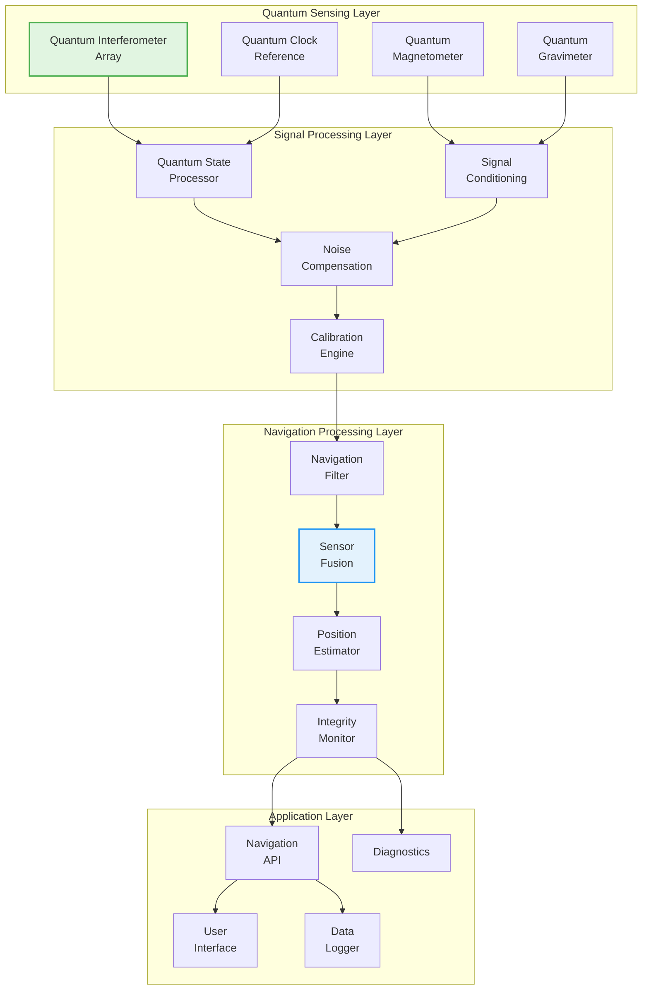
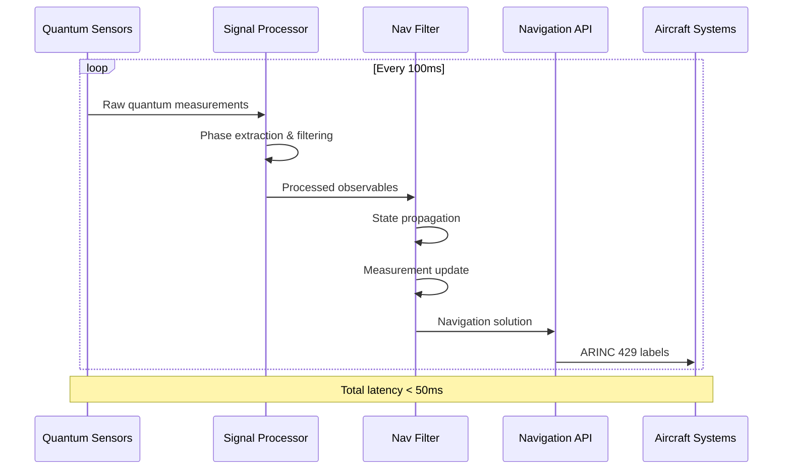

# System Architecture Design - Quantum Navigation System

**Document ID**: QUA-QNS01-25SVD0001-DES-BOB-TEC-TD-QCSAA-910-000-00-01-TPL-DES-200-QSTR-v1.0.0  
**Template ID**: TPL-DES-200  
**Version**: 1.0.0  
**Status**: Draft - Design Phase  
**Classification**: Technical Design  
**Date**: 2025-07-29  
**Q-Division**: QSTR (Quantum Structures)  
**Product Line**: QUANTUM  
**Product**: QNS01 (Quantum Navigation System)  
**Lifecycle Phase**: DESIGN  
**Entity Type**: BOB (Digital/Virtual System)  
**UTCS Category**: QCSAA-910 (Quantum Navigation Systems)  
**Current TRL**: 4 (Technology validated in lab)  
**Target TRL**: 6 (Technology demonstrated in relevant environment)  

> 🏗️ **Purpose**: Define the comprehensive system architecture for the Quantum Navigation System, translating conceptual foundations into a detailed technical design suitable for prototype development.

---

## Document Control

| Property | Value |
|----------|--------|
| **Created By** | QSTR Division - System Architecture Team |
| **Creation Date** | 2025-07-29 |
| **Last Modified** | 2025-07-29 |
| **Review Cycle** | Monthly |
| **Distribution** | Engineering Teams, System Architects, Integration Specialists |
| **Related Documents** | TPL-CON-100 (QNS Concept v1.0.1), TPL-DES-201 (Software Architecture), TPL-DES-202 (Interface Control) |
| **Approval Status** | Pending PDR |

---

## 1. Executive Summary

This document presents the detailed system architecture design for the Quantum Navigation System (QNS), advancing from conceptual studies (TRL 3) to a comprehensive design framework (TRL 4) suitable for laboratory validation and prototype development. The architecture integrates quantum interferometry, advanced signal processing, and hybrid classical-quantum computing to achieve GPS-independent navigation with target accuracy of <10 cm after 1 hour of operation.

### 1.1 Key Design Decisions

- **Hybrid Architecture**: Quantum sensors with classical processing for real-time performance
- **Modular Design**: Replaceable sensor modules for different operational modes
- **Distributed Processing**: Edge computing at sensor level, centralized fusion
- **Open Standards**: ARINC 429/664 interfaces for aircraft integration

---

## 2. System Overview

### 2.1 Architecture Philosophy

The QNS architecture follows a **layered, modular approach** that separates quantum sensing from classical processing, enabling:

- Independent evolution of quantum and classical components
- Graceful degradation in case of component failure
- Scalability from single-sensor to multi-sensor configurations
- Technology insertion as quantum components mature

### 2.2 High-Level Architecture



---

## 3. Detailed Component Architecture

### 3.1 Quantum Sensing Subsystem

#### 3.1.1 Quantum Interferometer Array

```python
class QuantumInterferometerArray:
    """
    Core quantum sensing component for inertial measurements
    Design specifications for laboratory prototype
    """
    
    def __init__(self):
        self.configuration = {
            "sensor_count": 3,  # Orthogonal axes
            "atom_species": "Rubidium-87",
            "operating_temperature": 10e-6,  # Kelvin (μK)
            "interrogation_time": 100e-3,  # seconds
            "pulse_sequence": "π/2 - π - π/2",
            "measurement_rate": 10,  # Hz
        }
        
        self.performance_specs = {
            "acceleration_sensitivity": 1e-8,  # g/√Hz
            "rotation_sensitivity": 1e-6,  # rad/s/√Hz
            "bias_stability": 1e-9,  # g
            "scale_factor_stability": 10,  # ppm
        }
        
        self.interfaces = {
            "control": "SpaceWire",  # ESA standard
            "data": "10GbE fiber",
            "timing": "White Rabbit PTP",
            "power": "28VDC isolated",
        }
```

#### 3.1.2 Quantum Magnetometer

```python
class QuantumMagnetometer:
    """
    Vector magnetometer for magnetic anomaly navigation
    Based on validated OPM technology (TRL 7-8)
    """
    
    def __init__(self):
        self.sensor_type = "Optically Pumped Magnetometer"
        self.configuration = {
            "sensor_count": 4,  # Tetrahedral array
            "sensitivity": 10e-15,  # Tesla/√Hz
            "bandwidth": "DC to 1 kHz",
            "dynamic_range": "±100 μT",
            "dead_zone_compensation": True,
        }
```

#### 3.1.3 Quantum Gravimeter

```python
class QuantumGravimeter:
    """
    Absolute gravimeter for vertical navigation
    Atom interferometry based design
    """
    
    def __init__(self):
        self.configuration = {
            "measurement_principle": "Atom interferometry",
            "sensitivity": 10e-6,  # m/s²/√Hz
            "accuracy": 50e-6,  # m/s² absolute
            "update_rate": 1,  # Hz
            "vibration_isolation": "Active 6-DOF",
        }
```

#### 3.1.4 Quantum Clock Reference

```python
class QuantumClockReference:
    """
    Ultra-stable timing reference
    Chip-scale atomic clock for prototype
    """
    
    def __init__(self):
        self.clock_type = "Chip-Scale Atomic Clock (CSAC)"
        self.specifications = {
            "frequency_stability": 1e-11,  # Allan deviation @ 1s
            "aging_rate": 5e-10,  # per day
            "power_consumption": 120e-3,  # Watts
            "warmup_time": 300,  # seconds
        }
```

### 3.2 Signal Processing Architecture

#### 3.2.1 Quantum State Processor

```python
class QuantumStateProcessor:
    """
    Processes raw quantum sensor outputs
    Extracts navigation observables from quantum measurements
    """
    
    def __init__(self):
        self.processing_pipeline = [
            "Fringe Pattern Analysis",
            "Phase Extraction",
            "Quantum Noise Filtering",
            "State Estimation",
            "Observable Calculation"
        ]
        
        self.algorithms = {
            "phase_extraction": "Ellipse Fitting Method",
            "noise_filter": "Quantum Kalman Filter",
            "state_estimation": "Maximum Likelihood",
        }
        
    def process_interferogram(self, raw_data: np.ndarray) -> NavigationObservable:
        """
        Extract acceleration/rotation from interferometer data
        Real-time processing requirement: <10ms latency
        """
        # Phase extraction from interference pattern
        phase = self.extract_phase_ellipse_fit(raw_data)
        
        # Quantum noise filtering
        filtered_phase = self.quantum_kalman_filter(phase)
        
        # Convert to physical observable
        acceleration = self.phase_to_acceleration(filtered_phase)
        
        return NavigationObservable(
            acceleration=acceleration,
            uncertainty=self.calculate_uncertainty(raw_data),
            timestamp=self.get_quantum_timestamp()
        )
```

#### 3.2.2 Sensor Fusion Engine

```python
class SensorFusionEngine:
    """
    Multi-sensor data fusion using hybrid classical-quantum algorithms
    """
    
    def __init__(self):
        self.fusion_algorithm = "Federated Kalman Filter"
        self.sensor_models = {
            "interferometer": InterferometerModel(),
            "magnetometer": MagnetometerModel(),
            "gravimeter": GravimeterModel(),
        }
        
    def fuse_measurements(self, sensor_data: Dict[str, Measurement]) -> StateEstimate:
        """
        Combine all quantum sensor measurements
        Output: Optimal state estimate with uncertainty
        """
        # Local filters for each sensor
        local_estimates = {}
        for sensor, data in sensor_data.items():
            local_estimates[sensor] = self.sensor_models[sensor].update(data)
        
        # Master filter combines local estimates
        master_estimate = self.master_filter.combine(local_estimates)
        
        # Integrity check
        if not self.integrity_monitor.check(master_estimate):
            master_estimate.flag_degraded_mode()
        
        return master_estimate
```

### 3.3 Navigation Processing Architecture

#### 3.3.1 Navigation Filter

```python
class QuantumNavigationFilter:
    """
    Core navigation algorithm implementation
    Extended Kalman Filter with quantum corrections
    """
    
    def __init__(self):
        self.state_vector = np.zeros(15)  # Position, velocity, orientation, biases
        self.covariance_matrix = np.eye(15) * 1e-6
        
        self.quantum_corrections = {
            "relativistic_effects": True,
            "quantum_noise_model": True,
            "decoherence_compensation": True,
        }
        
    def propagate_state(self, dt: float) -> None:
        """
        Propagate navigation state using quantum sensor data
        Includes quantum mechanical corrections
        """
        # Classical mechanics propagation
        self.state_vector = self.dynamics_model(self.state_vector, dt)
        
        # Quantum corrections
        if self.quantum_corrections["relativistic_effects"]:
            self.apply_relativistic_corrections(dt)
        
        # Update covariance
        self.covariance_matrix = self.propagate_covariance(dt)
```

### 3.4 System Interfaces

#### 3.4.1 External Interfaces

```python
interface_specifications = {
    "avionics_bus": {
        "protocol": "ARINC 429",
        "data_rate": "100 kbps",
        "labels": {
            "position": [310, 311, 312],  # Lat, Lon, Alt
            "velocity": [313, 314, 315],  # Vn, Ve, Vd
            "attitude": [324, 325, 326],  # Roll, Pitch, Yaw
            "status": [350],
        }
    },
    "ethernet": {
        "protocol": "ARINC 664 Part 7",
        "speed": "1 Gbps",
        "vlan": "Navigation_Critical",
    },
    "discrete_io": {
        "inputs": ["Power_On", "Test_Mode", "Align_Cmd"],
        "outputs": ["Ready", "Fault", "Degraded"],
    },
    "power": {
        "primary": "28 VDC ± 4V",
        "consumption": "150W nominal, 200W peak",
        "holdup": "50ms minimum",
    }
}
```

---

## 4. Data Flow Architecture

### 4.1 Real-time Data Pipeline



### 4.2 Data Rates and Bandwidth

| Data Stream | Rate | Format | Bandwidth |
|-------------|------|--------|-----------|
| Raw interferograms | 10 Hz | 16-bit float array | 10 MB/s |
| Magnetometer data | 100 Hz | 3x 32-bit float | 1.2 KB/s |
| Gravimeter data | 1 Hz | 32-bit float | 4 B/s |
| Navigation solution | 50 Hz | 15x 64-bit double | 6 KB/s |
| Diagnostic data | 1 Hz | JSON | 10 KB/s |

---

## 5. Performance Specifications

### 5.1 Navigation Performance

| Parameter | Specification | Conditions |
|-----------|--------------|------------|
| **Position Accuracy** | < 10 cm RMS | After 1 hour, GPS-denied |
| **Velocity Accuracy** | < 0.1 m/s RMS | 3-axis |
| **Attitude Accuracy** | < 0.01° RMS | Roll, pitch, yaw |
| **Time to First Fix** | < 5 minutes | From cold start |
| **Update Rate** | 50 Hz | Navigation solution |

### 5.2 Environmental Specifications

| Parameter | Specification |
|-----------|--------------|
| **Operating Temperature** | -20°C to +55°C |
| **Storage Temperature** | -40°C to +85°C |
| **Vibration** | DO-160G Cat M |
| **Altitude** | 0 to 51,000 ft |
| **EMI/EMC** | DO-160G |

---

## 6. Fault Detection and Recovery

### 6.1 Fault Detection Architecture

```python
class FaultDetectionSystem:
    """
    Multi-level fault detection and isolation
    """
    
    def __init__(self):
        self.monitors = {
            "sensor_health": SensorHealthMonitor(),
            "data_validity": DataValidityChecker(),
            "performance": PerformanceMonitor(),
            "system_integrity": IntegrityMonitor(),
        }
        
        self.fault_responses = {
            "sensor_failure": self.isolate_failed_sensor,
            "data_corruption": self.switch_to_redundant_path,
            "performance_degradation": self.activate_degraded_mode,
            "system_failure": self.safe_mode_activation,
        }
```

### 6.2 Redundancy Architecture

- **Sensor Redundancy**: 3x interferometers, 4x magnetometers
- **Processing Redundancy**: Dual processing channels
- **Data Path Redundancy**: Primary and backup data buses
- **Power Redundancy**: Dual power inputs with automatic switching

---

## 7. Development and Testing Strategy

### 7.1 Development Phases

| Phase | Duration | Deliverables | TRL Target |
|-------|----------|--------------|------------|
| **Alpha Prototype** | 6 months | Lab demonstration | TRL 4 |
| **Beta Prototype** | 9 months | Environmental testing | TRL 5 |
| **Flight Prototype** | 12 months | Aircraft integration | TRL 6 |
| **Production Design** | 6 months | Certified system | TRL 7 |

### 7.2 Test Environments

1. **Quantum Physics Lab**: Component-level validation
2. **System Integration Lab**: Full system testing
3. **Environmental Test Chamber**: DO-160G compliance
4. **Motion Simulator**: Dynamic performance validation
5. **Test Aircraft**: Real-world validation

---

## 8. Risk Assessment and Mitigation

### 8.1 Technical Risks

| Risk | Impact | Probability | Mitigation |
|------|--------|-------------|------------|
| **Quantum decoherence in flight** | High | Medium | Active vibration isolation, thermal control |
| **Processing latency** | Medium | Low | Hardware acceleration, optimized algorithms |
| **Sensor miniaturization** | Medium | Medium | Phased approach, COTS where possible |
| **Power consumption** | Low | Low | Power optimization, efficient designs |

### 8.2 Programmatic Risks

| Risk | Impact | Probability | Mitigation |
|------|--------|-------------|------------|
| **Technology maturity** | High | Medium | Partner with quantum tech leaders |
| **Certification timeline** | High | Medium | Early FAA/EASA engagement |
| **Cost overrun** | Medium | Medium | Modular design, COTS components |

---

## 9. Conclusion and Next Steps

This system architecture design provides a comprehensive framework for developing the Quantum Navigation System from current TRL 4 to operational TRL 7. The modular, layered architecture enables incremental development and risk reduction while maintaining clear paths to certification and production.

### 9.1 Immediate Next Steps

1. **Complete Preliminary Design Review (PDR)** - Q3 2025
2. **Finalize component specifications** - Q3 2025
3. **Begin alpha prototype development** - Q4 2025
4. **Establish test facilities** - Q4 2025

### 9.2 Critical Success Factors

- Maintaining quantum coherence in operational environment
- Achieving real-time processing performance
- Demonstrating clear advantage over classical INS
- Cost reduction through design optimization

---

**END OF DOCUMENT**

*This design represents the system architecture for the Quantum Navigation System prototype development phase.*

**Document Control**: QUA-QNS01-25SVD0001-DES-BOB-TEC-TD-QCSAA-910-000-00-01-TPL-DES-200-QSTR-v1.0.0  
**Classification**: Technical Design - Design Phase  
**© 2025 A.Q.U.A.-V. Aerospace. All rights reserved.**
