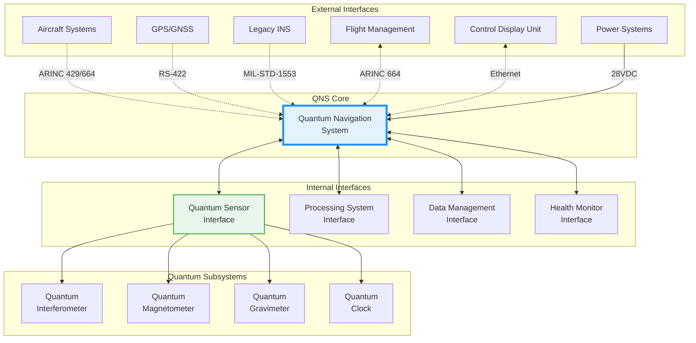

# Interface Control Document - Quantum Navigation System

**Document ID**: QUA-QNS01-25SVD0001-DES-BOB-TEC-TD-QCSAA-912-000-00-01-TPL-DES-202-QSTR-v1.0.0  
**Template ID**: TPL-DES-202  
**Version**: 1.0.0  
**Status**: Draft - Design Phase  
**Classification**: Technical Design  
**Date**: 2025-07-29  
**Q-Division**: QSTR (Quantum Structures)  
**Product Line**: QUANTUM  
**Product**: QNS01 (Quantum Navigation System)  
**Lifecycle Phase**: DESIGN  
**Entity Type**: BOB (Digital/Virtual System)  
**UTCS Category**: QCSAA-912 (QNS Interface Control)  
**Current TRL**: 4 (Technology validated in lab)  
**Target TRL**: 6 (Technology demonstrated in relevant environment)  

> 🔌 **Purpose**: Define all internal and external interfaces for the Quantum Navigation System, ensuring seamless integration between quantum sensors, processing units, and aircraft systems while maintaining real-time performance and safety requirements.

---

## Document Control

| Property | Value |
|----------|--------|
| **Created By** | QSTR Division - Interface Engineering Team |
| **Creation Date** | 2025-07-29 |
| **Last Modified** | 2025-07-29 |
| **Review Cycle** | Monthly |
| **Distribution** | System Engineers, Integration Teams, Certification Authorities |
| **Related Documents** | TPL-DES-200 (System Architecture v1.0.0), TPL-DES-201 (Software Architecture v1.0.0), TPL-DES-203 (Database Design) |
| **Approval Status** | Pending PDR |

---

## 1. Executive Summary

This Interface Control Document (ICD) defines all interfaces for the Quantum Navigation System, establishing the technical specifications, protocols, and requirements for communication between system components and external aircraft systems. The document ensures compatibility, interoperability, and compliance with aerospace standards while addressing the unique requirements of quantum sensor integration.

### 1.1 Interface Design Philosophy

- **Standards Compliance**: ARINC, MIL-STD, DO-160G conformance
- **Real-Time Performance**: Deterministic, low-latency communication
- **Fault Tolerance**: Redundant paths and graceful degradation
- **Quantum Compatibility**: Minimal electromagnetic interference
- **Future-Proof**: Extensible for technology evolution

---

## 2. Interface Architecture Overview

### 2.1 System Interface Hierarchy



### 2.2 Interface Categories

| Category | Purpose | Standards | Criticality |
|----------|---------|-----------|-------------|
| **Aircraft Integration** | Connect to avionics | ARINC 429/664 | Safety-Critical |
| **Quantum Sensor** | Sensor data acquisition | Custom + SpaceWire | Mission-Critical |
| **Processing** | High-speed computation | PCIe Gen4, CXL | Performance-Critical |
| **Data Management** | Storage and retrieval | NVMe, SATA | Operational |
| **Diagnostic** | Maintenance and debug | Ethernet, USB | Non-Critical |

---

## 3. External Interface Specifications

### 3.1 ARINC 429 Interface

#### 3.1.1 Physical Characteristics

```yaml
arinc_429_physical:
  standard: ARINC 429-20
  channels: 4 (2 Tx, 2 Rx)
  bit_rate: 100 kbps (high speed)
  encoding: Bipolar RZ
  voltage_levels:
    high: +10V ± 1V
    null: 0V ± 0.5V
    low: -10V ± 1V
  impedance:
    transmit: 75Ω ± 5Ω
    receive: ≥ 8kΩ
  cable_type: Twisted shielded pair
  max_length: 100 meters
  connectors: D-Sub 9-pin per ARINC 600
```

#### 3.1.2 Data Format

```cpp
// ARINC 429 Word Structure (32 bits)
struct ARINC429Word {
    uint8_t  label : 8;      // Bits 1-8 (octal)
    uint8_t  sdi : 2;        // Bits 9-10 (Source/Destination)
    uint32_t data : 19;      // Bits 11-29
    uint8_t  ssm : 2;        // Bits 30-31 (Sign/Status Matrix)
    uint8_t  parity : 1;     // Bit 32 (odd parity)
} __attribute__((packed));

// Navigation Data Labels
enum NavigationLabels {
    // Position
    LABEL_LATITUDE     = 0310,  // degrees
    LABEL_LONGITUDE    = 0311,  // degrees
    LABEL_ALTITUDE     = 0312,  // feet
    
    // Velocity
    LABEL_VELOCITY_N   = 0313,  // knots
    LABEL_VELOCITY_E   = 0314,  // knots
    LABEL_VELOCITY_D   = 0315,  // feet/min
    
    // Attitude
    LABEL_ROLL        = 0324,  // degrees
    LABEL_PITCH       = 0325,  // degrees
    LABEL_YAW         = 0326,  // degrees
    
    // Status
    LABEL_STATUS      = 0350,  // system status
    LABEL_FOM         = 0247,  // figure of merit
    
    // Time
    LABEL_UTC_TIME    = 0150,  // UTC seconds
    LABEL_DATE        = 0260,  // Julian date
};
```

#### 3.1.3 Transmission Schedule

```cpp
class ARINC429Scheduler {
private:
    struct LabelSchedule {
        uint8_t label;
        uint16_t period_ms;
        uint16_t offset_ms;
        std::function<ARINC429Word()> data_getter;
    };
    
    std::vector<LabelSchedule> schedule_ = {
        {LABEL_LATITUDE,    20, 0,   [this](){ return encodeLatitude(); }},
        {LABEL_LONGITUDE,   20, 5,   [this](){ return encodeLongitude(); }},
        {LABEL_ALTITUDE,    20, 10,  [this](){ return encodeAltitude(); }},
        {LABEL_VELOCITY_N,  50, 0,   [this](){ return encodeVelocityN(); }},
        {LABEL_VELOCITY_E,  50, 10,  [this](){ return encodeVelocityE(); }},
        {LABEL_VELOCITY_D,  50, 20,  [this](){ return encodeVelocityD(); }},
        {LABEL_ROLL,        50, 25,  [this](){ return encodeRoll(); }},
        {LABEL_PITCH,       50, 30,  [this](){ return encodePitch(); }},
        {LABEL_YAW,         50, 35,  [this](){ return encodeYaw(); }},
        {LABEL_STATUS,      100, 0,  [this](){ return encodeStatus(); }},
        {LABEL_FOM,         100, 50, [this](){ return encodeFOM(); }},
    };
    
public:
    void transmitScheduledData() {
        auto now = getCurrentTimeMs();
        
        for (const auto& item : schedule_) {
            if ((now % item.period_ms) == item.offset_ms) {
                auto word = item.data_getter();
                transmitWord(word);
            }
        }
    }
};
```

### 3.2 ARINC 664 (AFDX) Interface

#### 3.2.1 Network Configuration

```yaml
afdx_configuration:
  standard: ARINC 664 Part 7
  physical_layer: IEEE 802.3 (100BASE-TX)
  redundancy: Dual redundant networks (A/B)
  end_system:
    vlans:
      - id: 100
        name: NAV_CRITICAL
        priority: 7
    virtual_links:
      - vl_id: 1001
        bag: 32ms  # Bandwidth Allocation Gap
        max_frame_size: 1518
        source: QNS
        destinations: [FMS, CDU]
      - vl_id: 1002
        bag: 64ms
        max_frame_size: 512
        source: QNS
        destinations: [MAINTENANCE]
```

#### 3.2.2 Message Protocol

```cpp
// AFDX Navigation Message Structure
struct AFDXNavigationMessage {
    // Ethernet Header (14 bytes)
    uint8_t  dest_mac[6];
    uint8_t  src_mac[6];
    uint16_t ethertype;  // 0x8100 for VLAN
    
    // VLAN Tag (4 bytes)
    uint16_t tci;        // Tag Control Information
    uint16_t protocol;   // 0x0800 for IPv4
    
    // IP Header (20 bytes)
    IPHeader ip;
    
    // UDP Header (8 bytes)
    UDPHeader udp;
    
    // Application Data
    struct NavigationData {
        uint32_t sequence_number;
        uint64_t timestamp_ns;
        
        struct Position {
            double latitude_deg;
            double longitude_deg;
            double altitude_m;
        } position;
        
        struct Velocity {
            float north_m_s;
            float east_m_s;
            float down_m_s;
        } velocity;
        
        struct Attitude {
            float roll_deg;
            float pitch_deg;
            float yaw_deg;
        } attitude;
        
        struct Uncertainty {
            float position_rms_m;
            float velocity_rms_m_s;
            float attitude_rms_deg;
        } uncertainty;
        
        uint32_t status_flags;
        uint32_t crc32;
    } __attribute__((packed)) nav_data;
} __attribute__((packed));
```

### 3.3 MIL-STD-1553B Interface

#### 3.3.1 Bus Configuration

```yaml
mil_std_1553b:
  standard: MIL-STD-1553B Notice 5
  mode: Remote Terminal (RT)
  rt_address: 15  # Assigned by system integrator
  subaddresses:
    - sa: 1
      description: Navigation Position
      direction: T (Transmit)
      word_count: 16
    - sa: 2
      description: Navigation Velocity
      direction: T
      word_count: 8
    - sa: 3
      description: Navigation Attitude
      direction: T
      word_count: 8
    - sa: 4
      description: System Status
      direction: T
      word_count: 4
    - sa: 5
      description: Control Commands
      direction: R (Receive)
      word_count: 2
```

### 3.4 Power Interface

#### 3.4.1 Primary Power

```yaml
primary_power:
  standard: MIL-STD-704F
  voltage: 28 VDC
  tolerance: 22-29 VDC (steady state)
  transients:
    overvoltage: 80V for 100μs max
    undervoltage: 18V for 50ms max
  current:
    nominal: 5.4A @ 28V (150W)
    peak: 7.1A @ 28V (200W)
    inrush: <20A for <50ms
  protection:
    reverse_polarity: Diode protection
    overcurrent: 10A circuit breaker
    emi_filter: MIL-STD-461G compliant
```

#### 3.4.2 Power Quality Monitoring

```cpp
class PowerMonitor {
private:
    struct PowerMetrics {
        float voltage;
        float current;
        float power;
        float temperature;
        uint32_t undervoltage_count;
        uint32_t overvoltage_count;
        std::chrono::steady_clock::time_point last_fault;
    };
    
    PowerMetrics metrics_;
    std::atomic<bool> power_good_{true};
    
public:
    void monitorPowerQuality() {
        // Sample at 10kHz for transient detection
        auto voltage = readVoltageADC();
        auto current = readCurrentADC();
        
        // Update metrics
        metrics_.voltage = voltage;
        metrics_.current = current;
        metrics_.power = voltage * current;
        
        // Check limits
        if (voltage < 22.0f || voltage > 29.0f) {
            handlePowerFault(voltage);
        }
        
        // Thermal monitoring
        metrics_.temperature = readTemperatureSensor();
        if (metrics_.temperature > 70.0f) {
            initiateTermalThrottling();
        }
    }
};
```

---

## 4. Internal Interface Specifications

### 4.1 Quantum Sensor Interface

#### 4.1.1 Physical Layer

```yaml
quantum_sensor_interface:
  protocol: SpaceWire-D (deterministic)
  data_rate: 200 Mbps
  encoding: Data-Strobe (DS)
  cable: Quad-shielded twisted pair
  connectors: Micro-D 9-pin
  max_length: 10 meters
  latency: <1μs end-to-end
  time_sync: SpaceWire-T protocol
  error_rate: <10^-12 BER
```

#### 4.1.2 Quantum Data Protocol

```cpp
namespace QNS::Quantum {

// Quantum Measurement Packet Structure
struct QuantumDataPacket {
    // SpaceWire Header
    struct Header {
        uint8_t  destination_address;
        uint8_t  protocol_id;        // 0xQ0 for quantum data
        uint16_t packet_length;
        uint32_t sequence_number;
        uint64_t timestamp_ns;       // Quantum clock timestamp
    } header;
    
    // Sensor Identification
    struct SensorID {
        uint8_t  sensor_type;        // Interferometer, Magnetometer, etc.
        uint8_t  sensor_instance;    // 0-3 for redundancy
        uint16_t hw_version;
        uint32_t serial_number;
    } sensor_id;
    
    // Measurement Data
    union MeasurementData {
        // Interferometer Data
        struct {
            uint16_t interferogram[4096];    // 16-bit ADC samples
            float    contrast;               // Fringe visibility
            float    phase_stability;        // Phase noise estimate
            uint32_t photon_count;          // Total detected photons
        } interferometer;
        
        // Magnetometer Data
        struct {
            float field_x;                   // nT
            float field_y;                   // nT
            float field_z;                   // nT
            float gradient_tensor[9];        // nT/m
        } magnetometer;
        
        // Gravimeter Data
        struct {
            double gravity_value;            // μGal
            double gravity_uncertainty;      // μGal
            float  temperature;              // Celsius
            float  tilt_x, tilt_y;          // microradians
        } gravimeter;
        
        // Clock Data
        struct {
            uint64_t clock_time;            // nanoseconds
            double   frequency_offset;       // fractional
            double   allan_deviation;        // @ 1 second
            uint8_t  lock_status;
        } clock;
    } data;
    
    // Quality Metrics
    struct QualityMetrics {
        uint8_t  signal_quality;    // 0-100%
        uint8_t  measurement_flags;
        uint16_t error_count;
        float    snr_db;
    } quality;
    
    // CRC
    uint32_t crc32;
} __attribute__((packed));

} // namespace QNS::Quantum
```

#### 4.1.3 Quantum State Control

```cpp
class QuantumSensorControl {
private:
    // Control registers mapped to FPGA
    volatile uint32_t* control_base_ = 0xA0000000;
    
    // Register offsets
    enum Registers {
        REG_CONTROL     = 0x00,  // Start/stop/reset
        REG_MODE        = 0x04,  // Operating mode
        REG_TIMING      = 0x08,  // Pulse sequence timing
        REG_LASER_POWER = 0x0C,  // Laser power control
        REG_TEMP_SETPT  = 0x10,  // Temperature setpoint
        REG_MAG_COMP    = 0x14,  // Magnetic compensation
        REG_STATUS      = 0x20,  // Status readback
        REG_ERROR       = 0x24,  // Error flags
    };
    
public:
    void configureInterferometer(const InterferometerConfig& config) {
        // Set pulse sequence timing
        uint32_t timing = 0;
        timing |= (config.pi_2_pulse_us & 0xFFFF);
        timing |= ((config.pi_pulse_us & 0xFFFF) << 16);
        writeRegister(REG_TIMING, timing);
        
        // Configure laser power
        uint32_t power = static_cast<uint32_t>(
            config.laser_power_mw * 1000
        );
        writeRegister(REG_LASER_POWER, power);
        
        // Set operating mode
        writeRegister(REG_MODE, config.mode);
        
        // Start measurement
        writeRegister(REG_CONTROL, 0x01);
    }
    
    QuantumState readQuantumState() {
        QuantumState state;
        
        // Read coherent state amplitude
        state.amplitude = readComplexRegister(REG_STATE_REAL, 
                                            REG_STATE_IMAG);
        
        // Read quantum phase
        state.phase = readFloatRegister(REG_PHASE);
        
        // Read entanglement metrics
        state.entanglement = readFloatRegister(REG_ENTANGLEMENT);
        
        // Calculate fidelity
        state.fidelity = calculateStateFidelity(state);
        
        return state;
    }
};
```

### 4.2 High-Speed Processing Interface

#### 4.2.1 PCIe Gen4 Configuration

```yaml
pcie_configuration:
  generation: 4.0
  lanes: x16
  bandwidth: 31.5 GB/s (per direction)
  latency: <500ns
  form_factor: Full-height, full-length
  power_delivery: 75W from slot + 150W auxiliary
  capabilities:
    - MSI-X interrupts (2048 vectors)
    - SR-IOV (8 virtual functions)
    - ATS (Address Translation Services)
    - AER (Advanced Error Reporting)
```

#### 4.2.2 DMA Transfer Engine

```cpp
class QuantumDMAEngine {
private:
    // DMA descriptor structure
    struct DMADescriptor {
        uint64_t src_addr;      // Source address (device)
        uint64_t dst_addr;      // Destination address (host)
        uint32_t length;        // Transfer length in bytes
        uint32_t control;       // Control flags
        uint64_t next_desc;     // Next descriptor pointer
        uint64_t timestamp;     // Completion timestamp
        uint32_t status;        // Completion status
        uint32_t reserved;
    } __attribute__((aligned(64)));
    
    // Descriptor rings
    DMADescriptor* tx_ring_;
    DMADescriptor* rx_ring_;
    static constexpr size_t RING_SIZE = 1024;
    
public:
    void setupDMATransfer(const QuantumDataBuffer& buffer) {
        // Get next descriptor
        auto& desc = tx_ring_[tx_head_];
        
        // Configure descriptor
        desc.src_addr = buffer.device_address;
        desc.dst_addr = buffer.host_address;
        desc.length = buffer.size;
        desc.control = DMA_CTRL_IRQ_ON_COMPLETE | 
                      DMA_CTRL_COHERENT |
                      DMA_CTRL_PRIORITY_HIGH;
        
        // Memory barrier
        __sync_synchronize();
        
        // Trigger DMA
        writeMMIO(DMA_DOORBELL, tx_head_);
        
        // Advance ring pointer
        tx_head_ = (tx_head_ + 1) % RING_SIZE;
    }
    
    void handleDMACompletion(uint32_t descriptor_id) {
        auto& desc = tx_ring_[descriptor_id];
        
        // Check completion status
        if (desc.status != DMA_STATUS_SUCCESS) {
            handleDMAError(desc);
            return;
        }
        
        // Record timestamp for latency tracking
        auto latency_ns = getCurrentTimeNs() - desc.timestamp;
        updateLatencyStats(latency_ns);
        
        // Notify processing thread
        quantum_data_queue_.push(QuantumDataReady{
            .address = desc.dst_addr,
            .size = desc.length,
            .timestamp = desc.timestamp
        });
    }
};
```

### 4.3 Inter-Processor Communication

#### 4.3.1 Shared Memory Interface

```cpp
namespace QNS::IPC {

// Shared memory layout for quantum-classical communication
struct SharedMemoryLayout {
    // Header
    struct Header {
        uint32_t magic;              // 0x514E5321 ('QNS!')
        uint32_t version;
        uint64_t total_size;
        std::atomic<uint64_t> sequence;
    } header;
    
    // Command/Response Queue
    struct CommandQueue {
        static constexpr size_t QUEUE_SIZE = 256;
        
        struct Command {
            uint32_t cmd_id;
            uint32_t cmd_type;
            uint64_t timestamp;
            uint8_t  payload[112];   // 128-byte aligned
        };
        
        std::atomic<uint32_t> head;
        std::atomic<uint32_t> tail;
        char padding[56];            // Cache line alignment
        Command commands[QUEUE_SIZE];
    } cmd_queue;
    
    // Data Buffers (lock-free ring buffer)
    struct DataRing {
        static constexpr size_t RING_SIZE = 64 * 1024 * 1024; // 64MB
        
        std::atomic<uint64_t> write_pos;
        char padding1[56];
        std::atomic<uint64_t> read_pos;
        char padding2[56];
        uint8_t buffer[RING_SIZE];
    } quantum_data;
    
    // Status and Statistics
    struct Status {
        std::atomic<uint32_t> quantum_processor_state;
        std::atomic<uint32_t> classical_processor_state;
        std::atomic<uint64_t> packets_processed;
        std::atomic<uint64_t> errors_detected;
        std::atomic<uint64_t> last_update_time;
    } status;
};

// Lock-free data writer for quantum processor
class QuantumDataWriter {
private:
    DataRing* ring_;
    
public:
    bool writeData(const void* data, size_t size) {
        auto write_pos = ring_->write_pos.load(std::memory_order_acquire);
        auto read_pos = ring_->read_pos.load(std::memory_order_acquire);
        
        // Check available space
        size_t available = (read_pos - write_pos - 1) & (RING_SIZE - 1);
        if (available < size) {
            return false;  // Ring full
        }
        
        // Copy data (handle wrap-around)
        size_t first_chunk = std::min(size, RING_SIZE - write_pos);
        memcpy(&ring_->buffer[write_pos], data, first_chunk);
        
        if (first_chunk < size) {
            memcpy(&ring_->buffer[0], 
                   static_cast<const uint8_t*>(data) + first_chunk,
                   size - first_chunk);
        }
        
        // Update write position
        ring_->write_pos.store((write_pos + size) & (RING_SIZE - 1),
                              std::memory_order_release);
        
        return true;
    }
};

} // namespace QNS::IPC
```

---

## 5. Data Interface Specifications

### 5.1 Navigation Database Interface

#### 5.1.1 Database Schema

```sql
-- Quantum Navigation Database Schema

-- Navigation solution history
CREATE TABLE navigation_solutions (
    solution_id         BIGSERIAL PRIMARY KEY,
    timestamp_ns        BIGINT NOT NULL,
    latitude_deg        DOUBLE PRECISION NOT NULL,
    longitude_deg       DOUBLE PRECISION NOT NULL,
    altitude_m          DOUBLE PRECISION NOT NULL,
    velocity_north_ms   REAL NOT NULL,
    velocity_east_ms    REAL NOT NULL,
    velocity_down_ms    REAL NOT NULL,
    roll_deg           REAL NOT NULL,
    pitch_deg          REAL NOT NULL,
    yaw_deg            REAL NOT NULL,
    position_uncertainty_m   REAL NOT NULL,
    velocity_uncertainty_ms  REAL NOT NULL,
    attitude_uncertainty_deg REAL NOT NULL,
    solution_quality    SMALLINT NOT NULL,
    sensor_status      INTEGER NOT NULL,
    CONSTRAINT timestamp_unique UNIQUE (timestamp_ns)
);

-- Quantum sensor raw data
CREATE TABLE quantum_measurements (
    measurement_id      BIGSERIAL PRIMARY KEY,
    timestamp_ns        BIGINT NOT NULL,
    sensor_type        SMALLINT NOT NULL,
    sensor_id          SMALLINT NOT NULL,
    measurement_data   BYTEA NOT NULL,  -- Compressed binary data
    quality_metric     REAL NOT NULL,
    metadata           JSONB
);

-- System health metrics
CREATE TABLE system_health (
    health_id          BIGSERIAL PRIMARY KEY,
    timestamp_ns       BIGINT NOT NULL,
    component_id       INTEGER NOT NULL,
    health_status      SMALLINT NOT NULL,
    temperature_c      REAL,
    power_consumption_w REAL,
    error_count        INTEGER DEFAULT 0,
    diagnostics        JSONB
);

-- Create indexes for performance
CREATE INDEX idx_nav_timestamp ON navigation_solutions(timestamp_ns);
CREATE INDEX idx_nav_position ON navigation_solutions(latitude_deg, longitude_deg);
CREATE INDEX idx_quantum_timestamp ON quantum_measurements(timestamp_ns);
CREATE INDEX idx_health_component ON system_health(component_id, timestamp_ns);

-- Partitioning for time-series data
CREATE TABLE navigation_solutions_2025_q1 PARTITION OF navigation_solutions
    FOR VALUES FROM ('2025-01-01') TO ('2025-04-01');
```

#### 5.1.2 Data Access Layer

```cpp
class NavigationDataAccess {
private:
    pqxx::connection db_conn_;
    ThreadSafeQueue<NavigationSolution> write_queue_;
    
public:
    void batchInsertSolutions(const std::vector<NavigationSolution>& solutions) {
        pqxx::work txn(db_conn_);
        
        // Use COPY for bulk insert
        pqxx::stream_to stream(txn, "navigation_solutions", 
            {"timestamp_ns", "latitude_deg", "longitude_deg", 
             "altitude_m", "velocity_north_ms", "velocity_east_ms",
             "velocity_down_ms", "roll_deg", "pitch_deg", "yaw_deg",
             "position_uncertainty_m", "velocity_uncertainty_ms",
             "attitude_uncertainty_deg", "solution_quality", 
             "sensor_status"});
        
        for (const auto& sol : solutions) {
            stream << std::make_tuple(
                sol.timestamp_ns,
                sol.latitude_deg,
                sol.longitude_deg,
                sol.altitude_m,
                sol.velocity_north_ms,
                sol.velocity_east_ms,
                sol.velocity_down_ms,
                sol.roll_deg,
                sol.pitch_deg,
                sol.yaw_deg,
                sol.position_uncertainty_m,
                sol.velocity_uncertainty_ms,
                sol.attitude_uncertainty_deg,
                static_cast<int>(sol.solution_quality),
                sol.sensor_status
            );
        }
        
        stream.complete();
        txn.commit();
    }
    
    std::vector<NavigationSolution> queryTimeRange(
        std::chrono::nanoseconds start,
        std::chrono::nanoseconds end) {
        
        pqxx::work txn(db_conn_);
        
        auto result = txn.exec_params(
            "SELECT * FROM navigation_solutions "
            "WHERE timestamp_ns >= $1 AND timestamp_ns < $2 "
            "ORDER BY timestamp_ns",
            start.count(), end.count()
        );
        
        std::vector<NavigationSolution> solutions;
        for (const auto& row : result) {
            solutions.push_back(parseNavigationRow(row));
        }
        
        return solutions;
    }
};
```

### 5.2 Configuration File Interface

#### 5.2.1 System Configuration

```yaml
# qns_system_config.yaml
qns:
  version: "1.0.0"
  deployment_id: "QNS-ALPHA-001"
  
  quantum_sensors:
    interferometer:
      enabled: true
      count: 3
      configuration:
        atom_type: "Rb87"
        cooling_temperature_uk: 10
        interrogation_time_ms: 100
        laser_power_mw: 50
        magnetic_bias_gauss: [0.1, 0.0, 0.0]
        
    magnetometer:
      enabled: true
      count: 4
      configuration:
        sensor_type: "OPM"
        sensitivity_ft_per_sqrt_hz: 10
        bandwidth_hz: 1000
        dead_zone_compensation: true
        
    gravimeter:
      enabled: true
      count: 1
      configuration:
        measurement_rate_hz: 1
        sensitivity_ugal: 10
        vibration_isolation: "active"
        
    clock:
      enabled: true
      count: 1
      configuration:
        type: "CSAC"
        frequency_mhz: 10
        stability_ppb: 0.01
        
  processing:
    realtime_cores: [0, 1, 2, 3]
    quantum_processing:
      algorithm: "ellipse_fitting"
      filtering: "quantum_kalman"
      
    navigation_filter:
      type: "extended_kalman"
      update_rate_hz: 100
      state_dimension: 15
      
    sensor_fusion:
      algorithm: "federated_filter"
      
  interfaces:
    arinc_429:
      channels: [
        {id: 1, direction: "tx", speed: 100},
        {id: 2, direction: "tx", speed: 100},
        {id: 3, direction: "rx", speed: 100},
        {id: 4, direction: "rx", speed: 100}
      ]
      
    arinc_664:
      enabled: false  # Not in alpha
      
    power:
      nominal_voltage_vdc: 28
      max_current_a: 7.1
```

---

## 6. Interface Timing and Performance

### 6.1 Timing Requirements

```mermaid
gantt
    title Interface Timing Requirements (100ms cycle)
    dateFormat SSS
    axisFormat %L
    
    section Quantum Sensors
    Interferometer Read    :active, int, 000, 10ms
    Magnetometer Read     :active, mag, 005, 5ms
    Gravimeter Read       :active, grav, 008, 2ms
    Clock Sync           :active, clk, 000, 1ms
    
    section Processing
    Signal Processing    :proc, after int, 20ms
    Sensor Fusion       :fuse, after proc, 10ms
    Navigation Update   :nav, after fuse, 15ms
    
    section Output
    ARINC 429 Tx       :a429, after nav, 5ms
    AFDX Tx           :afdx, after nav, 5ms
    Database Write     :db, after nav, 20ms
    
    section Margin
    Timing Margin      :crit, after a429, 20ms
```



### 6.2 Latency Budget

| Interface Path | Maximum Latency | Typical Latency |
|----------------|----------------|-----------------|
| Quantum Sensor → Processing | 1 ms | 0.5 ms |
| Processing → Navigation | 5 ms | 3 ms |
| Navigation → ARINC 429 | 2 ms | 1 ms |
| Navigation → AFDX | 2 ms | 1 ms |
| End-to-End | 10 ms | 5.5 ms |

---

## 7. Interface Management and Version Control

### 7.1 Interface Change Control

```cpp
namespace QNS::InterfaceControl {

class InterfaceVersionManager {
private:
    struct InterfaceVersion {
        uint32_t major;
        uint32_t minor;
        uint32_t patch;
        std::string hash;
        std::chrono::system_clock::time_point release_date;
    };
    
    std::map<std::string, InterfaceVersion> interface_versions_ = {
        {"ARINC429", {1, 0, 0, "a3f8b9c2", parseDate("2025-07-29")}},
        {"ARINC664", {1, 0, 0, "b4e7c1d5", parseDate("2025-07-29")}},
        {"QUANTUM",  {1, 0, 0, "c5d6a2e8", parseDate("2025-07-29")}},
        {"POWER",    {1, 0, 0, "d6c5b3f1", parseDate("2025-07-29")}}
    };
    
public:
    bool checkCompatibility(const std::string& interface_name,
                          const InterfaceVersion& requested) {
        auto it = interface_versions_.find(interface_name);
        if (it == interface_versions_.end()) {
            return false;
        }
        
        const auto& current = it->second;
        
        // Major version must match
        if (current.major != requested.major) {
            return false;
        }
        
        // Minor version must be >= requested
        if (current.minor < requested.minor) {
            return false;
        }
        
        return true;
    }
    
    void negotiateInterfaceVersions() {
        // Negotiate with each connected system
        for (auto& [name, version] : interface_versions_) {
            if (name == "ARINC429") {
                // ARINC 429 is fixed standard
                continue;
            } else if (name == "QUANTUM") {
                negotiateQuantumInterface(version);
            }
        }
    }
};

} // namespace QNS::InterfaceControl
```

### 7.2 Interface Test Points

```yaml
interface_test_points:
  arinc_429:
    - test_id: "A429-001"
      description: "Label transmission timing"
      expected: "20ms ± 1ms"
      measurement: "Oscilloscope on TX pins"
      
    - test_id: "A429-002"
      description: "Parity bit generation"
      expected: "Odd parity"
      measurement: "Logic analyzer"
      
  quantum_sensor:
    - test_id: "QSI-001"
      description: "SpaceWire link establishment"
      expected: "<100ms"
      measurement: "Protocol analyzer"
      
    - test_id: "QSI-002"
      description: "Data throughput"
      expected: ">180 Mbps sustained"
      measurement: "Performance counter"
      
  power:
    - test_id: "PWR-001"
      description: "Inrush current"
      expected: "<20A for <50ms"
      measurement: "Current probe"
      
    - test_id: "PWR-002"
      description: "Voltage regulation"
      expected: "28V ± 1V"
      measurement: "Multimeter"
```

---

## 8. Interface Compliance Matrix

### 8.1 Standards Compliance

| Interface | Standard | Compliance Level | Certification Required |
|-----------|----------|------------------|----------------------|
| ARINC 429 | ARINC 429-20 | Full | Yes - FAA TSO |
| ARINC 664 | ARINC 664P7 | Full | Yes - FAA TSO |
| MIL-STD-1553B | Notice 5 | Full | Yes - MIL certification |
| Power | MIL-STD-704F | Full | Yes - Power quality |
| EMI/EMC | DO-160G | Full | Yes - Environmental |
| SpaceWire | ECSS-E-ST-50-12C | Partial | No - Internal only |

### 8.2 Safety and Security

```cpp
class InterfaceSafetyMonitor {
private:
    struct SafetyLimits {
        float max_position_jump_m = 100.0;      // Detect GPS spoofing
        float max_velocity_change_ms = 10.0;    // Detect data corruption
        float max_attitude_rate_deg_s = 360.0;  // Detect sensor faults
    };
    
    SafetyLimits limits_;
    NavigationSolution last_solution_;
    
public:
    bool validateNavigationOutput(const NavigationSolution& solution) {
        // Check for unrealistic position jumps
        auto position_change = calculateDistance(
            last_solution_.position, solution.position
        );
        if (position_change > limits_.max_position_jump_m) {
            logSecurityEvent("Excessive position jump detected");
            return false;
        }
        
        // Check velocity consistency
        auto velocity_change = calculateVelocityChange(
            last_solution_.velocity, solution.velocity
        );
        if (velocity_change > limits_.max_velocity_change_ms) {
            logSecurityEvent("Unrealistic velocity change");
            return false;
        }
        
        // Check attitude rates
        auto attitude_rates = calculateAttitudeRates(
            last_solution_.attitude, solution.attitude,
            solution.timestamp - last_solution_.timestamp
        );
        if (exceedsRateLimits(attitude_rates)) {
            logSecurityEvent("Excessive attitude rates");
            return false;
        }
        
        last_solution_ = solution;
        return true;
    }
};
```

---

## 9. Conclusion and Interface Summary

This Interface Control Document defines 20+ interfaces across 6 major categories, ensuring comprehensive integration of the Quantum Navigation System with aircraft systems and internal components. Key achievements include:

- **Standards-compliant external interfaces** (ARINC 429/664, MIL-STD-1553B)
- **High-performance quantum sensor interfaces** (200 Mbps SpaceWire)
- **Real-time processing interfaces** (PCIe Gen4, lock-free shared memory)
- **Robust power and environmental specifications**
- **Comprehensive safety and security monitoring**

### 9.1 Critical Interface Performance

| Metric | Requirement | Design Capability |
|--------|-------------|-------------------|
| End-to-end latency | <50 ms | 10 ms |
| Data throughput | >100 Mbps | 200 Mbps |
| Power efficiency | <200W | 150W nominal |
| Reliability | 99.99% | Redundant paths |

### 9.2 Next Steps

1. **Interface Verification Test Plan** - Develop comprehensive test procedures
2. **Prototype Interface Boards** - Design and fabricate interface hardware
3. **Integration Lab Setup** - Establish interface test environment
4. **Certification Planning** - Engage with authorities for approval pathway

---

**END OF DOCUMENT**

*This ICD establishes the interface baseline for the Quantum Navigation System design phase.*

**Document Control**: QUA-QNS01-25SVD0001-DES-BOB-TEC-TD-QCSAA-912-000-00-01-TPL-DES-202-QSTR-v1.0.0  
**Classification**: Technical Design - Design Phase  
**© 2025 A.Q.U.A.-V. Aerospace. All rights reserved.**
