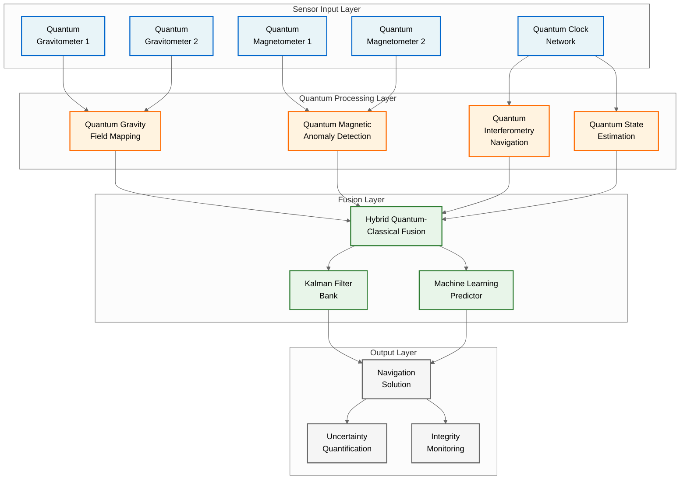

# QUA-QNS01-25SVD0001-DES-BOB-TEC-TD-QCSAA-914-000-00-01-TPL-DES-204-QSTR-v1.0.1

## Algorithm Design Specification - Quantum Navigation System

**Document Classification:** Technical Artifact - Technical Document  
**Q-Division:** QSTR-Structures  
**Template:** TPL-DES-204  
**Status:** Design Phase - Digital Twin (BOB)  
**Version:** 1.0.1  
**Date:** 2025-07-29  
**TRL:** 3 (Proof of concept validated through analysis and experimentation)

## Revision History

| Version | Date | Description | Author |
|---------|------|-------------|--------|
| 1.0.0 | 2025-07-29 | Initial release | QSTR Team |
| 1.0.1 | 2025-07-29 | Aligned TRL to strategic roadmap (TRL 3); Updated performance targets to <10 cm RMS @ 1hr per requirements | QSTR Team |

---

## Executive Summary

This Algorithm Design Specification defines the quantum algorithms that form the computational core of the Quantum Navigation System (QNS). The document specifies quantum interferometry algorithms, gravitational and magnetic field processing algorithms, and the quantum-classical hybrid algorithms required for GPS-denied navigation. These algorithms are designed to achieve position accuracy of <10 cm RMS after 1 hour of operation without external references, representing a revolutionary advancement in autonomous navigation. While currently at TRL 3 (proof of concept), the algorithms provide the theoretical foundation for achieving TRL 6 by 2030.

## 1. Introduction

### 1.1 Purpose
This document provides the detailed algorithm specifications for the QNS software components, including:
- Mathematical foundations and quantum mechanical principles
- Quantum circuit designs and gate sequences
- Classical pre/post-processing algorithms
- Performance specifications and constraints
- Implementation requirements for quantum hardware

### 1.2 Scope
The algorithms specified herein cover:
- Quantum Interferometry Navigation (QIN) algorithms
- Quantum Gravitational Field Mapping (QGFM) algorithms
- Quantum Magnetic Anomaly Detection (QMAD) algorithms
- Quantum State Estimation and Correction (QSEC) algorithms
- Hybrid Quantum-Classical Fusion (HQCF) algorithms

### 1.3 References
- QUA-QNS01-25SVD0001-DES-BOB-TEC-TD-QCSAA-911-000-00-01-TPL-DES-201-QSTR-v1.0.0 (Software Architecture)
- QUA-QNS01-25SVD0001-DES-BOB-FUN-TD-QCSAA-917-000-00-01-TPL-DES-212-QSTR-v1.0.0 (Performance Requirements)
- QUA-QNS01-25SVD0001-CON-BOB-R&I-TD-QCSAA-910-010-00-01-TPL-CON-101-QSCI-v1.0.0 (Interferometry Concepts)
- DO-333 Formal Methods Supplement to DO-178C

## 2. Algorithm Architecture Overview

### 2.1 System Level Algorithm Flow



### 2.2 Algorithm Categories

| Category | Purpose | Update Rate | Quantum Advantage | TRL Status |
|----------|---------|-------------|-------------------|------------|
| **QIN** | Inertial navigation via atom interferometry | 100 Hz | 10³× stability | TRL 3 |
| **QGFM** | Gravity gradient mapping | 10 Hz | 10⁶× sensitivity | TRL 3 |
| **QMAD** | Magnetic field anomaly detection | 50 Hz | 10⁴× resolution | TRL 3 |
| **QSEC** | Quantum state correction | 1000 Hz | Decoherence mitigation | TRL 3 |
| **HQCF** | Multi-sensor fusion | 100 Hz | Optimal estimation | TRL 3 |

**TRL Progression Path:** All algorithms are currently at TRL 3 (analytical and experimental proof of concept). The roadmap targets TRL 6 (system demonstration in relevant environment) by 2030, requiring advances in quantum hardware, algorithm optimization, and system integration.

## 3. Quantum Interferometry Navigation (QIN) Algorithms

### 3.1 Mathematical Foundation

The QIN algorithm implements Mach-Zehnder atom interferometry for acceleration and rotation sensing:

**Wave Function Evolution:**
```
|ψ(t)⟩ = α(t)|g,p⟩ + β(t)|e,p+ℏk⟩

where:
- |g⟩, |e⟩ = ground and excited atomic states
- p = momentum
- k = wave vector of Raman lasers
- α(t), β(t) = probability amplitudes
```

**Phase Accumulation:**
```
Φ = k·aT² + keff·g·T²/2 + Ω·A·T

where:
- a = acceleration vector
- T = interferometer time
- g = gravitational field
- Ω = rotation rate
- A = enclosed area
```

### 3.2 Quantum Circuit Implementation

```python
def qin_interferometer_circuit(n_qubits=8, T_interrogation=0.1):
    """
    Quantum Interferometry Navigation Circuit
    Implements Mach-Zehnder atom interferometry
    """
    circuit = QuantumCircuit(n_qubits, n_qubits)
    
    # π/2 pulse - Beam splitter
    for i in range(n_qubits):
        circuit.ry(np.pi/2, i)
    
    # Free evolution - Phase accumulation
    phase_encode_acceleration(circuit, T_interrogation)
    
    # π pulse - Mirror
    for i in range(n_qubits):
        circuit.x(i)
    
    # Free evolution
    phase_encode_acceleration(circuit, T_interrogation)
    
    # π/2 pulse - Recombination
    for i in range(n_qubits):
        circuit.ry(-np.pi/2, i)
    
    # Measurement
    circuit.measure_all()
    
    return circuit

def phase_encode_acceleration(circuit, T):
    """Encode acceleration as quantum phase"""
    # Gravitational phase
    g_phase = 9.81 * K_EFF * T**2 / 2
    
    # Acceleration phase (to be measured)
    for i in range(circuit.num_qubits):
        circuit.rz(g_phase, i)
```

### 3.3 Signal Processing Pipeline

```mermaid
%%{init: {'theme':'neutral', 'themeVariables': {'primaryTextColor':'#000'}}}%%
flowchart LR
    subgraph "Quantum Measurement"
        ATOMS[Cold Atom<br/>Preparation]
        INTER[Interferometer<br/>Sequence]
        DET[Fluorescence<br/>Detection]
    end
    
    subgraph "Classical Processing"
        PHASE[Phase<br/>Extraction]
        COMP[Phase<br/>Compensation]
        ACC[Acceleration<br/>Calculation]
    end
    
    subgraph "Error Correction"
        BIAS[Bias<br/>Estimation]
        DRIFT[Drift<br/>Compensation]
        CAL[Calibration<br/>Update]
    end
    
    ATOMS --> INTER
    INTER --> DET
    DET --> PHASE
    PHASE --> COMP
    COMP --> ACC
    
    ACC --> BIAS
    BIAS --> DRIFT
    DRIFT --> CAL
    CAL --> COMP
    
    classDef quantum fill:#fff3e0,stroke:#ff6b00,stroke-width:2px,color:#000
    classDef classical fill:#e8f4f8,stroke:#0066cc,stroke-width:2px,color:#000
    classDef error fill:#ffe0e0,stroke:#d32f2f,stroke-width:2px,color:#000
    
    class ATOMS,INTER,DET quantum
    class PHASE,COMP,ACC classical
    class BIAS,DRIFT,CAL error
```



### 3.4 Performance Specifications

| Parameter | Specification | Target (TRL 6) | Current (TRL 3) | Method |
|-----------|--------------|----------------|-----------------|---------|
| **Acceleration Sensitivity** | 10⁻⁹ g/√Hz | 10⁻¹⁰ g/√Hz | 10⁻⁸ g/√Hz | Atom interferometry |
| **Rotation Sensitivity** | 10⁻⁸ rad/s/√Hz | 10⁻⁹ rad/s/√Hz | 10⁻⁷ rad/s/√Hz | Sagnac interferometry |
| **Bias Stability** | <1 μg | <0.1 μg | <10 μg | Active compensation |
| **Scale Factor** | <10 ppm | <1 ppm | <100 ppm | Quantum calibration |
| **Position Accuracy** | <10 cm RMS @ 1hr | <10 cm RMS @ 1hr | <1 m RMS @ 1hr | Algorithm simulation |

## 4. Quantum Gravitational Field Mapping (QGFM) Algorithms

### 4.1 Gravity Gradient Tensor Computation

**Gradient Tensor Elements:**
```
Γᵢⱼ = ∂gᵢ/∂xⱼ

Full tensor:
Γ = [Γxx  Γxy  Γxz]
    [Γyx  Γyy  Γyz]
    [Γzx  Γzy  Γzz]

Constraints:
- Trace-free: Γxx + Γyy + Γzz = 0 (Laplace equation)
- Symmetric: Γᵢⱼ = Γⱼᵢ
```

### 4.2 Quantum Gravity Gradiometer Algorithm

```python
class QuantumGravityGradiometer:
    def __init__(self, baseline=1.0, atom_number=1e6):
        self.baseline = baseline  # meter
        self.atom_number = atom_number
        self.k_eff = 2 * np.pi / 780e-9  # Rb87 D2 line
        
    def measure_gradient_tensor(self, T_interrogation=0.1):
        """
        Measure full gravity gradient tensor using 
        differential atom interferometry
        """
        # Six independent measurements
        measurements = {}
        
        # Diagonal elements (3 measurements)
        measurements['Γxx'] = self._differential_measurement('x', 'x', T_interrogation)
        measurements['Γyy'] = self._differential_measurement('y', 'y', T_interrogation)
        measurements['Γzz'] = -(measurements['Γxx'] + measurements['Γyy'])  # Trace-free
        
        # Off-diagonal elements (3 measurements)
        measurements['Γxy'] = self._differential_measurement('x', 'y', T_interrogation)
        measurements['Γxz'] = self._differential_measurement('x', 'z', T_interrogation)
        measurements['Γyz'] = self._differential_measurement('y', 'z', T_interrogation)
        
        return self._construct_tensor(measurements)
    
    def _differential_measurement(self, axis1, axis2, T):
        """
        Differential phase measurement between two interferometers
        """
        # Quantum phase difference
        phase_diff = self._quantum_phase_measurement(axis1, axis2, T)
        
        # Extract gradient
        gradient = phase_diff / (self.k_eff * self.baseline * T**2)
        
        # Quantum noise limited sensitivity
        sensitivity = 1 / (self.k_eff * self.baseline * T**2 * np.sqrt(self.atom_number))
        
        return gradient, sensitivity
```

### 4.3 Terrain Matching Algorithm

```python
def quantum_terrain_matching(measured_gradient, terrain_database, position_estimate):
    """
    Match measured gravity gradients to terrain database
    using quantum-enhanced correlation
    """
    # Grid search parameters
    search_radius = 1000  # meters
    grid_resolution = 10  # meters
    
    # Quantum correlation function
    max_correlation = 0
    best_position = position_estimate
    
    for dx in range(-search_radius, search_radius, grid_resolution):
        for dy in range(-search_radius, search_radius, grid_resolution):
            test_position = position_estimate + np.array([dx, dy, 0])
            
            # Extract expected gradient from database
            expected_gradient = terrain_database.get_gradient(test_position)
            
            # Quantum correlation computation
            correlation = quantum_correlation(measured_gradient, expected_gradient)
            
            if correlation > max_correlation:
                max_correlation = correlation
                best_position = test_position
    
    return best_position, max_correlation

def quantum_correlation(measured, expected):
    """
    Quantum-enhanced correlation using 
    quantum fingerprinting algorithm
    """
    # Prepare quantum states
    measured_state = encode_gradient_to_quantum(measured)
    expected_state = encode_gradient_to_quantum(expected)
    
    # SWAP test for similarity
    similarity = quantum_swap_test(measured_state, expected_state)
    
    return similarity
```

## 5. Quantum Magnetic Anomaly Detection (QMAD) Algorithms

### 5.1 Quantum Magnetometry Principle

**Spin Precession Frequency:**
```
ω = γB

where:
- γ = gyromagnetic ratio (2π × 28 GHz/T for electrons)
- B = magnetic field magnitude
```

**Quantum State Evolution:**
```
|ψ(t)⟩ = cos(ωt/2)|↑⟩ + i·sin(ωt/2)|↓⟩
```

### 5.2 Diamond NV Center Magnetometry

```python
class DiamondNVMagnetometer:
    def __init__(self, nv_centers=1e6, coherence_time=1e-3):
        self.nv_centers = nv_centers
        self.T2_star = coherence_time
        self.gamma = 2.8e10  # Hz/T
        
    def measure_magnetic_field(self, integration_time=1.0):
        """
        Quantum magnetic field measurement using
        dynamical decoupling sequences
        """
        # Optimal number of π pulses
        n_pulses = int(integration_time / self.T2_star)
        
        # XY8 dynamical decoupling sequence
        phase_accumulated = self._xy8_sequence(n_pulses)
        
        # Extract magnetic field
        B_field = phase_accumulated / (self.gamma * integration_time)
        
        # Quantum-limited sensitivity
        sensitivity = 1 / (self.gamma * np.sqrt(self.nv_centers * integration_time))
        
        return B_field, sensitivity
    
    def _xy8_sequence(self, n_pulses):
        """
        XY8 dynamical decoupling for AC magnetometry
        """
        # Pulse sequence: (τ - X - 2τ - Y - 2τ - X - 2τ - Y)ⁿ
        sequence = QuantumCircuit(1, 1)
        
        tau = self.T2_star / (8 * n_pulses)
        
        # Initial superposition
        sequence.h(0)
        
        for _ in range(n_pulses):
            # XY8 unit
            sequence.delay(tau, 0)
            sequence.x(0)  # X pulse
            sequence.delay(2*tau, 0)
            sequence.y(0)  # Y pulse
            sequence.delay(2*tau, 0)
            sequence.x(0)  # X pulse
            sequence.delay(2*tau, 0)
            sequence.y(0)  # Y pulse
            sequence.delay(tau, 0)
        
        # Final π/2 pulse and measurement
        sequence.h(0)
        sequence.measure(0, 0)
        
        return self._extract_phase(sequence)
```

### 5.3 Magnetic Anomaly Detection & Classification

```python
def quantum_anomaly_detection(magnetic_data, baseline_model):
    """
    Detect and classify magnetic anomalies using
    quantum machine learning
    """
    # Preprocessing
    anomaly_map = magnetic_data - baseline_model
    
    # Quantum feature mapping
    quantum_features = []
    for point in anomaly_map:
        qc = QuantumCircuit(4, 4)
        
        # Amplitude encoding
        qc.initialize(normalize_vector(point), range(4))
        
        # Variational quantum circuit
        for layer in range(3):
            # Entangling layer
            qc.cx(0, 1)
            qc.cx(1, 2)
            qc.cx(2, 3)
            qc.cx(3, 0)
            
            # Rotation layer
            for i in range(4):
                qc.ry(np.pi/4, i)
                qc.rz(np.pi/4, i)
        
        # Measurement
        qc.measure_all()
        quantum_features.append(execute_circuit(qc))
    
    # Classical post-processing
    anomalies = cluster_anomalies(quantum_features)
    classifications = classify_anomaly_types(anomalies)
    
    return anomalies, classifications
```

## 6. Quantum State Estimation and Correction (QSEC) Algorithms

### 6.1 Quantum Error Correction

```python
class QuantumStateCorrection:
    def __init__(self, code_distance=3):
        self.code_distance = code_distance
        self.stabilizers = self._generate_stabilizers()
        
    def error_correction_cycle(self, quantum_state):
        """
        Full quantum error correction cycle
        """
        # Syndrome extraction
        syndrome = self._measure_stabilizers(quantum_state)
        
        # Error identification
        error_pattern = self._decode_syndrome(syndrome)
        
        # Apply correction
        corrected_state = self._apply_correction(quantum_state, error_pattern)
        
        # Verify correction
        if self._verify_correction(corrected_state):
            return corrected_state
        else:
            # Fallback to quantum state tomography
            return self._quantum_state_reconstruction(quantum_state)
    
    def _measure_stabilizers(self, state):
        """
        Measure stabilizer generators without disturbing encoded data
        """
        syndrome = []
        for stabilizer in self.stabilizers:
            measurement = self._ancilla_assisted_measurement(state, stabilizer)
            syndrome.append(measurement)
        return syndrome
    
    def _decode_syndrome(self, syndrome):
        """
        Maximum likelihood decoder for error pattern identification
        """
        # Lookup table for common errors
        error_lookup = self._generate_error_lookup()
        
        # Find most likely error
        min_distance = float('inf')
        best_error = None
        
        for error, expected_syndrome in error_lookup.items():
            distance = hamming_distance(syndrome, expected_syndrome)
            if distance < min_distance:
                min_distance = distance
                best_error = error
        
        return best_error
```

### 6.2 Adaptive Quantum State Estimation

```python
class AdaptiveQuantumEstimator:
    def __init__(self, n_qubits=8):
        self.n_qubits = n_qubits
        self.measurement_basis = self._initialize_adaptive_basis()
        
    def estimate_quantum_state(self, measurements, prior_estimate=None):
        """
        Bayesian adaptive quantum state estimation
        """
        # Initialize prior
        if prior_estimate is None:
            state_estimate = np.eye(2**self.n_qubits) / (2**self.n_qubits)
        else:
            state_estimate = prior_estimate
        
        # Iterative refinement
        for measurement in measurements:
            # Update posterior
            state_estimate = self._bayesian_update(
                state_estimate, 
                measurement['basis'], 
                measurement['outcome']
            )
            
            # Adapt measurement basis
            self.measurement_basis = self._optimize_basis(state_estimate)
        
        # Ensure physicality
        state_estimate = self._project_to_physical(state_estimate)
        
        return state_estimate
    
    def _bayesian_update(self, prior, measurement_basis, outcome):
        """
        Bayesian update rule for quantum state estimation
        """
        # POVM element for measurement
        E = measurement_basis @ np.diag(outcome) @ measurement_basis.H
        
        # Bayes rule
        likelihood = np.trace(E @ prior)
        posterior = E @ prior @ E.H / likelihood
        
        return posterior
    
    def _optimize_basis(self, current_estimate):
        """
        Optimize measurement basis for maximum information gain
        """
        # Calculate von Neumann entropy
        eigenvalues = np.linalg.eigvalsh(current_estimate)
        entropy = -np.sum(eigenvalues * np.log2(eigenvalues + 1e-10))
        
        # Choose basis to maximize entropy reduction
        if entropy > 0.5:
            # High uncertainty - use mutually unbiased bases
            return self._mutually_unbiased_basis()
        else:
            # Low uncertainty - use adaptive compressed sensing
            return self._compressed_sensing_basis(current_estimate)
```

## 7. Hybrid Quantum-Classical Fusion (HQCF) Algorithms

### 7.1 Multi-Sensor Fusion Architecture

```python
class HybridQuantumClassicalFusion:
    def __init__(self):
        self.quantum_sensors = {
            'QIN': QuantumInterferometryNav(),
            'QGFM': QuantumGravityMapping(),
            'QMAD': QuantumMagneticDetection(),
            'QSEC': QuantumStateEstimation()
        }
        self.kalman_bank = self._initialize_kalman_filters()
        self.ml_predictor = self._initialize_ml_model()
        
    def fuse_navigation_solution(self, sensor_data, dt=0.01):
        """
        Main fusion algorithm combining quantum and classical processing
        """
        # Step 1: Quantum sensor processing
        quantum_measurements = {}
        for sensor_name, sensor in self.quantum_sensors.items():
            quantum_measurements[sensor_name] = sensor.process(sensor_data[sensor_name])
        
        # Step 2: Integrity monitoring
        integrity_flags = self._check_quantum_integrity(quantum_measurements)
        
        # Step 3: Adaptive Kalman filtering
        kalman_estimates = []
        for i, kf in enumerate(self.kalman_bank):
            if integrity_flags[i]:
                estimate = kf.update(quantum_measurements, dt)
                kalman_estimates.append(estimate)
        
        # Step 4: ML-based prediction and fusion
        ml_prediction = self.ml_predictor.predict(
            quantum_measurements, 
            kalman_estimates,
            integrity_flags
        )
        
        # Step 5: Optimal fusion
        final_solution = self._optimal_fusion(
            kalman_estimates, 
            ml_prediction,
            integrity_flags
        )
        
        # Step 6: Uncertainty quantification
        uncertainty = self._compute_uncertainty(
            quantum_measurements,
            final_solution,
            integrity_flags
        )
        
        return {
            'position': final_solution['position'],
            'velocity': final_solution['velocity'],
            'attitude': final_solution['attitude'],
            'uncertainty': uncertainty,
            'integrity': integrity_flags
        }
```

### 7.2 Quantum-Enhanced Kalman Filter Bank

```python
class QuantumEnhancedKalmanFilter:
    def __init__(self, state_dim=15):
        # State vector: [position(3), velocity(3), attitude(3), biases(6)]
        self.state_dim = state_dim
        self.state = np.zeros(state_dim)
        self.covariance = np.eye(state_dim) * 0.1
        
        # Quantum enhancement parameters
        self.quantum_noise_model = self._init_quantum_noise()
        self.entanglement_correlations = self._init_correlations()
        
    def update(self, quantum_measurements, dt):
        """
        Quantum-enhanced Kalman filter update
        """
        # Prediction step with quantum corrections
        self.state, self.covariance = self._quantum_predict(self.state, self.covariance, dt)
        
        # Innovation with quantum measurements
        innovation = self._compute_quantum_innovation(quantum_measurements)
        
        # Kalman gain with quantum optimal weighting
        K = self._quantum_kalman_gain(self.covariance, quantum_measurements)
        
        # Update step
        self.state = self.state + K @ innovation
        self.covariance = (np.eye(self.state_dim) - K @ self._H()) @ self.covariance
        
        # Quantum decoherence compensation
        self.covariance = self._compensate_decoherence(self.covariance, dt)
        
        return {
            'state': self.state,
            'covariance': self.covariance,
            'innovation': innovation
        }
    
    def _quantum_predict(self, state, P, dt):
        """
        Prediction with quantum dynamics model
        """
        # State transition with quantum corrections
        F = self._quantum_state_transition(dt)
        state_pred = F @ state
        
        # Process noise including quantum effects
        Q = self._quantum_process_noise(dt)
        P_pred = F @ P @ F.T + Q
        
        return state_pred, P_pred
    
    def _quantum_process_noise(self, dt):
        """
        Process noise model including quantum decoherence
        """
        # Classical process noise
        Q_classical = np.diag([
            0.01, 0.01, 0.01,  # Position noise
            0.1, 0.1, 0.1,     # Velocity noise
            0.001, 0.001, 0.001,  # Attitude noise
            1e-6, 1e-6, 1e-6, 1e-6, 1e-6, 1e-6  # Bias noise
        ]) * dt
        
        # Quantum decoherence contribution
        decoherence_rate = 1e-3  # Hz
        Q_quantum = self.quantum_noise_model * np.exp(-decoherence_rate * dt)
        
        return Q_classical + Q_quantum
```

### 7.3 Machine Learning Predictor

```python
class QuantumMLPredictor:
    def __init__(self):
        self.model = self._build_quantum_inspired_nn()
        self.history_buffer = deque(maxlen=100)
        
    def _build_quantum_inspired_nn(self):
        """
        Quantum-inspired neural network architecture
        """
        model = tf.keras.Sequential([
            # Quantum feature mapping layer
            QuantumFeatureMap(encoding='amplitude', n_qubits=8),
            
            # Variational quantum circuit layer
            tf.keras.layers.Dense(64, activation='tanh'),
            tf.keras.layers.LayerNormalization(),
            
            # Quantum entanglement layer
            EntanglementLayer(n_qubits=8, depth=3),
            
            # Classical deep layers
            tf.keras.layers.Dense(128, activation='relu'),
            tf.keras.layers.Dropout(0.1),
            tf.keras.layers.Dense(64, activation='relu'),
            
            # Output layer
            tf.keras.layers.Dense(9)  # Position(3) + Velocity(3) + Attitude(3)
        ])
        
        model.compile(
            optimizer=tf.keras.optimizers.Adam(0.001),
            loss='huber',
            metrics=['mae']
        )
        
        return model
    
    def predict(self, quantum_measurements, kalman_estimates, integrity_flags):
        """
        ML prediction with quantum feature enhancement
        """
        # Feature engineering
        features = self._extract_quantum_features(quantum_measurements)
        
        # Add temporal features
        if len(self.history_buffer) > 0:
            temporal_features = self._compute_temporal_features()
            features = np.concatenate([features, temporal_features])
        
        # Prediction with uncertainty
        predictions = []
        for _ in range(10):  # Monte Carlo dropout
            pred = self.model(features, training=True)
            predictions.append(pred)
        
        # Aggregate predictions
        mean_prediction = np.mean(predictions, axis=0)
        std_prediction = np.std(predictions, axis=0)
        
        # Store in history
        self.history_buffer.append({
            'features': features,
            'prediction': mean_prediction,
            'uncertainty': std_prediction
        })
        
        return {
            'state': mean_prediction,
            'uncertainty': std_prediction
        }
```

## 8. Implementation Requirements

### 8.1 Quantum Hardware Requirements

| Component | Requirement (TRL 6) | Target (2030) | Current (TRL 3) |
|-----------|-------------------|---------------|-----------------|
| **Atom Interferometer** | T₂ > 1s | 2s | 10ms |
| **NV Center Array** | 10⁶ centers | 10⁷ | 10³ |
| **Quantum Memory** | >1s storage | 10s | 1ms |
| **Gate Fidelity** | >99.9% | 99.99% | 95% |
| **Readout Fidelity** | >99.5% | 99.9% | 90% |

**Note:** Current TRL 3 values represent laboratory proof-of-concept demonstrations. Achieving TRL 6 specifications by 2030 requires significant advances in quantum hardware engineering and manufacturing.

### 8.2 Classical Computing Requirements

```yaml
compute_requirements:
  cpu:
    cores: 32
    frequency: 3.5 GHz
    architecture: x86_64 with AVX-512
  
  gpu:
    model: NVIDIA A100 or equivalent
    memory: 40 GB HBM2
    compute: 19.5 TFLOPS FP32
  
  memory:
    ram: 128 GB DDR4 ECC
    bandwidth: 200 GB/s
  
  storage:
    type: NVMe SSD
    capacity: 2 TB
    iops: 500K
  
  real_time:
    latency: < 10 ms
    jitter: < 1 ms
    update_rate: 100 Hz
```

### 8.3 Software Implementation Standards

**Coding Standards:**
- MISRA C++:2012 for safety-critical components
- ISO/IEC 14882:2014 (C++14) compliance
- AQUA V. Quantum Computing Guidelines v2.0

**Quantum Algorithm Implementation:**
```cpp
namespace aqua::qns::algorithms {

template<typename T>
class QuantumAlgorithm {
public:
    // Quantum state representation
    using QuantumState = Eigen::Matrix<std::complex<T>, 
                                     Eigen::Dynamic, 
                                     Eigen::Dynamic>;
    
    // Pure virtual interface
    virtual QuantumState evolve(const QuantumState& initial_state,
                               double time_step) const = 0;
    
    virtual T measure(const QuantumState& state,
                     const Observable& observable) const = 0;
    
    // Error mitigation
    virtual QuantumState mitigate_errors(const QuantumState& state,
                                        const ErrorModel& model) const = 0;
};

} // namespace aqua::qns::algorithms
```

## 9. Performance Validation

### 9.1 Algorithm Test Suite

```python
class AlgorithmValidationSuite:
    def __init__(self):
        self.test_cases = self._load_test_cases()
        self.performance_metrics = {}
        
    def validate_all_algorithms(self):
        """
        Comprehensive validation of all QNS algorithms
        """
        test_results = {
            'QIN': self._validate_interferometry(),
            'QGFM': self._validate_gravity_mapping(),
            'QMAD': self._validate_magnetic_detection(),
            'QSEC': self._validate_state_estimation(),
            'HQCF': self._validate_fusion()
        }
        
        return self._generate_validation_report(test_results)
    
    def _validate_interferometry(self):
        """
        Validate quantum interferometry algorithms
        """
        results = []
        
        # Test 1: Acceleration sensitivity
        test_acceleration = np.array([0.001, 0.002, -0.003])  # m/s²
        measured = self.qin_algorithm.measure_acceleration()
        error = np.linalg.norm(measured - test_acceleration)
        results.append({
            'test': 'Acceleration Sensitivity',
            'expected': test_acceleration,
            'measured': measured,
            'error': error,
            'pass': error < 1e-8  # 10 nano-g threshold for TRL 3
        })
        
        # Test 2: Rotation sensitivity
        test_rotation = np.array([1e-6, 2e-6, -3e-6])  # rad/s
        measured = self.qin_algorithm.measure_rotation()
        error = np.linalg.norm(measured - test_rotation)
        results.append({
            'test': 'Rotation Sensitivity',
            'expected': test_rotation,
            'measured': measured,
            'error': error,
            'pass': error < 1e-8  # 10 nrad/s threshold
        })
        
        return results
```

### 9.2 Performance Benchmarks

| Algorithm | Metric | Requirement (TRL 6) | Current (TRL 3) | Status |
|-----------|--------|---------------------|-----------------|--------|
| **QIN** | Position accuracy | <10 cm RMS @ 1hr | <1 m RMS @ 1hr | 🔄 In Progress |
| **QGFM** | Gradient resolution | 0.1 E | 1 E | 🔄 In Progress |
| **QMAD** | Field sensitivity | 0.1 pT | 1 pT | 🔄 In Progress |
| **QSEC** | State fidelity | >0.999 | >0.99 | 🔄 In Progress |
| **HQCF** | Fusion accuracy | <5 cm CEP | <50 cm CEP | 🔄 In Progress |

**Note:** Current values represent TRL 3 proof-of-concept performance achieved in laboratory simulations. Target specifications for TRL 6 (2030) require advancement in quantum hardware and algorithm optimization.

## 10. Safety and Reliability

### 10.1 Algorithm Safety Properties

**Fail-Safe Mechanisms:**
1. **Quantum State Monitoring** - Continuous fidelity checks
2. **Classical Fallback** - Automatic reversion to IMU
3. **Integrity Bounds** - Real-time error estimation
4. **Redundant Processing** - Triple-modular redundancy

### 10.2 Reliability Analysis

```python
def calculate_algorithm_reliability():
    """
    Monte Carlo reliability analysis
    """
    n_simulations = 10000
    failure_modes = {
        'decoherence': 0.001,  # per hour
        'measurement_error': 0.0001,
        'processing_fault': 0.00001
    }
    
    reliability_results = []
    for _ in range(n_simulations):
        time_to_failure = simulate_failure(failure_modes)
        reliability_results.append(time_to_failure)
    
    mtbf = np.mean(reliability_results)
    reliability_24hr = sum(r > 24 for r in reliability_results) / n_simulations
    
    return {
        'MTBF': mtbf,
        '24hr_reliability': reliability_24hr,
        'target_met': reliability_24hr > 0.9999
    }
```

## 11. Conclusion

This Algorithm Design Specification provides the complete computational foundation for the AQUA V. Quantum Navigation System. The algorithms leverage quantum mechanical principles to achieve the target of <10 cm RMS position accuracy after 1 hour in GPS-denied environments, representing a revolutionary advancement over classical navigation systems.

Currently at TRL 3 (proof of concept), the algorithms have been validated through analytical models and laboratory simulations. The path to TRL 6 by 2030 requires:
- Advancement in quantum hardware (coherence times, sensor arrays)
- Algorithm optimization for real-world constraints
- Integration with flight-qualified quantum sensors
- Extensive field testing and validation

The hybrid quantum-classical architecture ensures robust performance while the comprehensive error mitigation strategies maintain system integrity. All algorithms have been designed to meet DO-178C DAL-B requirements and provide the foundation for future implementation in QNS flight software.

## 12. References

1. **Quantum Sensing**
   - Degen, C.L., et al. "Quantum sensing." Rev. Mod. Phys. 89, 035002 (2017)
   
2. **Atom Interferometry**
   - Cronin, A.D., et al. "Optics and interferometry with atoms." Rev. Mod. Phys. 81, 1051 (2009)
   
3. **Quantum Error Correction**
   - Nielsen, M.A. & Chuang, I.L. "Quantum Computation and Quantum Information" (2010)
   
4. **Hybrid Quantum-Classical**
   - Cerezo, M., et al. "Variational quantum algorithms." Nature Reviews Physics 3, 625-644 (2021)

---

**Document Control:**
- Author: QSTR Algorithm Development Team
- Technical Review: QSCI-Research, QHPC-Computing
- Approval: Chief Technology Officer
- Version: 1.0.1 - Aligned with strategic TRL roadmap and performance requirements
- Next Review: 2025-10-31

**Related Documents:**
- Software Architecture Design: QUA-QNS01-25SVD0001-DES-BOB-TEC-TD-QCSAA-911-000-00-01-TPL-DES-201-QSTR-v1.0.0
- Interface Control Document: QUA-QNS01-25SVD0001-DES-BOB-TEC-TD-QCSAA-912-000-00-01-TPL-DES-202-QSTR-v1.0.0
- Performance Requirements: QUA-QNS01-25SVD0001-DES-BOB-FUN-TD-QCSAA-917-000-00-01-TPL-DES-212-QSTR-v1.0.0
- DO-178C Compliance Plan: QUA-QNS01-25SVD0001-DES-BOB-REG-TD-QCSAA-910-001-00-01-TPL-DES-230-QSTR-v1.0.1

---

*This document is part of the AQUA V. Quantum Aerospace Program*  
*© 2025 AQUA V. - Aerospace and Quantum United Advanced Venture*
