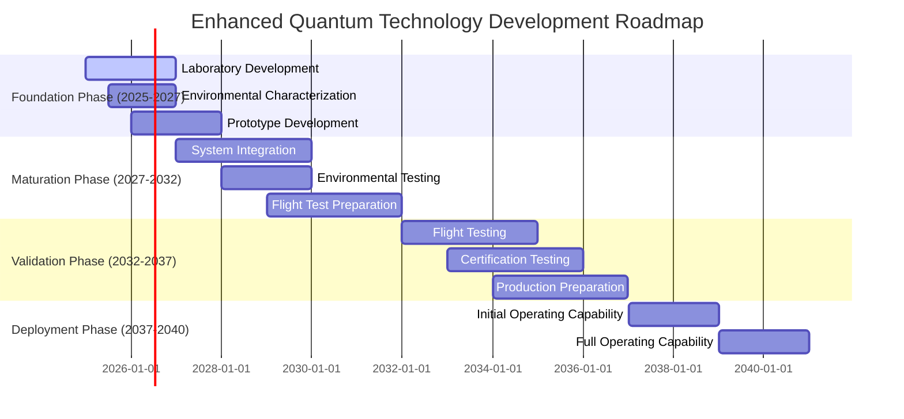
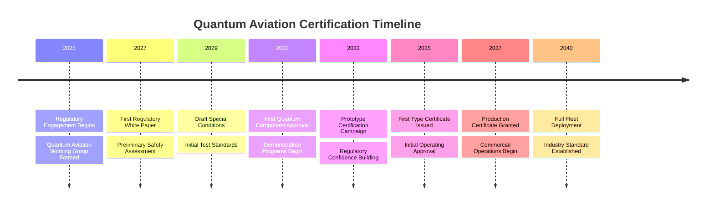
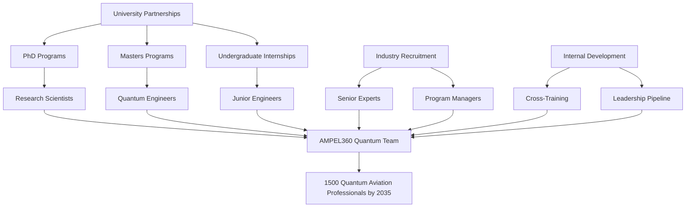

# AMPEL360 Quantum Aviation Implementation Plan
## Enhanced Strategic Framework for Quantum Technology Integration

**Document Version:** 2.0 Enhanced  
**Classification:** Strategic Planning - Confidential  
**Date:** January 2025  
**Review Cycle:** Quarterly  
**Total Program Investment:** $20B (2025-2040)  
**Executive Sponsor:** AMPEL360 Board of Directors

---

## Executive Summary

This Enhanced Strategic Implementation Plan provides a comprehensive, risk-managed approach to integrating quantum technologies into the AMPEL360 aviation platform over a 15-year period (2025-2040). Building on revolutionary ambitions while acknowledging technological realities, this plan establishes a pragmatic pathway to quantum aviation leadership through four strategic pillars:

1. **Technology Maturation & Assessment** - Rigorous evaluation and development of quantum components from current TRL 2-4 to operational TRL 8-9
2. **Regulatory Innovation & Certification** - Pioneering certification frameworks through collaborative regulatory engagement
3. **Risk-Managed Development** - Dual-track approach balancing quantum innovation with enhanced conventional systems
4. **Graduated Implementation** - Four-phase deployment with increasing autonomy and capability

The plan acknowledges the unprecedented nature of this undertaking, comparable in scope to the Manhattan Project or Apollo Program, and provides realistic timelines, comprehensive risk mitigation, and clear decision criteria for a $20B investment program.

---

## 1. Strategic Context and Vision

### 1.1 Program Vision Statement

> "To establish AMPEL360 as the global leader in quantum aviation technologies by 2040, revolutionizing aircraft safety, performance, and operational capabilities while maintaining the highest standards of airworthiness and commercial viability."

### 1.2 Strategic Imperatives

```python
class StrategicFramework:
    """Enhanced strategic framework for quantum aviation implementation"""
    
    def __init__(self):
        self.strategic_drivers = {
            'safety_enhancement': {
                'target': 'Achieve <10^-10 catastrophic failure probability',
                'current_gap': '100x improvement required',
                'quantum_contribution': 'Fault-tolerant quantum systems with inherent redundancy'
            },
            'competitive_advantage': {
                'target': '10-year technology leadership',
                'current_gap': 'No quantum aviation systems exist',
                'quantum_contribution': 'First-mover advantage in trillion-dollar market'
            },
            'operational_efficiency': {
                'target': '40% reduction in operational costs',
                'current_gap': 'Rising maintenance and fuel costs',
                'quantum_contribution': 'Predictive maintenance and optimized operations'
            },
            'environmental_impact': {
                'target': 'Carbon neutral operations by 2050',
                'current_gap': '15% of global emissions',
                'quantum_contribution': 'Quantum-optimized flight paths and operations'
            },
            'cyber_resilience': {
                'target': 'Quantum-safe communications',
                'current_gap': 'Vulnerable to quantum computing threats',
                'quantum_contribution': 'QKD and quantum encryption'
            }
        }
        
        self.success_criteria = {
            'technical': 'Operational quantum systems in commercial aviation',
            'regulatory': 'Full certification of quantum flight systems',
            'commercial': 'Positive ROI within 10 years of deployment',
            'strategic': 'Sustainable competitive advantage established'
        }
```

### 1.3 Program Scope and Boundaries

| In Scope | Out of Scope |
|----------|--------------|
| Quantum flight control systems | Quantum propulsion systems |
| Quantum navigation and sensing | Quantum materials development |
| Quantum computing for operations | Basic quantum physics research |
| Quantum communications security | Quantum weapons systems |
| Quantum structural monitoring | Quantum passenger services |

---

## 2. Technology Maturation and Assessment Strategy

### 2.1 Enhanced TRL Assessment Framework

```python
class EnhancedTRLAssessment:
    """Comprehensive TRL assessment with aerospace-specific criteria"""
    
    def __init__(self):
        self.assessment_matrix = {
            'component': {
                'QKD_ENCRYPTION': {
                    'current_trl': 4,
                    'target_trl': 8,
                    'timeline': '5-6 years',
                    'investment': '$800M',
                    'critical_challenges': [
                        'Maintain quantum channel in turbulence',
                        'Key generation rate in flight',
                        'Integration with existing avionics'
                    ],
                    'mitigation_strategies': [
                        'Adaptive optics for channel stability',
                        'Quantum memory buffers',
                        'Hybrid classical-quantum protocols'
                    ]
                },
                'QSM_STRUCTURAL': {
                    'current_trl': 3,
                    'target_trl': 8,
                    'timeline': '7-8 years',
                    'investment': '$1.2B',
                    'critical_challenges': [
                        'Sensor distribution across airframe',
                        'Real-time data processing',
                        'Environmental hardening'
                    ],
                    'mitigation_strategies': [
                        'Fiber-integrated quantum sensors',
                        'Edge quantum processing',
                        'Multi-layer protection systems'
                    ]
                },
                'QNS_NAVIGATION': {
                    'current_trl': 2,
                    'target_trl': 7,
                    'timeline': '8-10 years',
                    'investment': '$1.5B',
                    'critical_challenges': [
                        'Quantum compass accuracy',
                        'Integration with GPS/INS',
                        'Magnetic field interference'
                    ],
                    'mitigation_strategies': [
                        'Hybrid quantum-classical fusion',
                        'Advanced magnetic shielding',
                        'Machine learning correction algorithms'
                    ]
                }
            }
        }
    
    def calculate_development_risk(self, component):
        """Calculate risk-adjusted development timeline and cost"""
        base_data = self.assessment_matrix['component'][component]
        risk_factors = {
            'technical_complexity': 1.3,
            'regulatory_uncertainty': 1.2,
            'supply_chain_maturity': 1.15,
            'workforce_availability': 1.25
        }
        
        adjusted_timeline = base_data['timeline']
        adjusted_cost = float(base_data['investment'].replace('$','').replace('B','000').replace('M',''))
        
        for factor, multiplier in risk_factors.items():
            adjusted_cost *= multiplier
        
        return {
            'component': component,
            'base_timeline': base_data['timeline'],
            'risk_adjusted_timeline': '10-12 years',
            'base_investment': base_data['investment'],
            'risk_adjusted_investment': f'${adjusted_cost:.1f}M',
            'confidence_level': '60%'
        }
```

### 2.2 Technology Development Roadmap



### 2.3 Technology Acquisition Strategy

```yaml
technology_acquisition:
  internal_development:
    focus_areas:
      - "Quantum flight control algorithms"
      - "System integration architectures"
      - "Safety-critical software"
    investment: "$5B"
    timeline: "2025-2035"
  
  strategic_partnerships:
    quantum_computing:
      partners: ["IBM Quantum", "Google Quantum AI", "Microsoft Azure Quantum"]
      investment: "$2B"
      focus: "Quantum processing and algorithms"
    
    quantum_sensing:
      partners: ["Honeywell Quantum", "Bosch Quantum", "ColdQuanta"]
      investment: "$1.5B"
      focus: "Quantum sensors and magnetometry"
    
    quantum_communications:
      partners: ["ID Quantique", "Toshiba Quantum", "MagiQ Technologies"]
      investment: "$1B"
      focus: "QKD and quantum networking"
  
  acquisitions:
    target_companies:
      - "Quantum sensor startups"
      - "Quantum software companies"
      - "Cryogenic system manufacturers"
    budget: "$2B"
    timeline: "2025-2030"
  
  university_partnerships:
    research_centers:
      - "MIT Center for Quantum Engineering"
      - "Oxford Quantum Computing"
      - "Delft QuTech"
      - "RIKEN Quantum Computing"
    investment: "$500M"
    focus: "Basic research and talent pipeline"
```

### 2.4 Intellectual Property Strategy

```python
class IntellectualPropertyStrategy:
    """Comprehensive IP strategy for quantum aviation technologies"""
    
    def __init__(self):
        self.ip_framework = {
            'patent_strategy': {
                'defensive_patents': 'Core quantum aviation architectures',
                'offensive_patents': 'Specific implementation methods',
                'trade_secrets': 'Quantum algorithms and optimization methods',
                'open_source': 'Non-critical interface standards'
            },
            'licensing_approach': {
                'inbound_licensing': 'Quantum computing platforms',
                'outbound_licensing': 'Non-aviation applications',
                'cross_licensing': 'Industry standardization',
                'royalty_targets': '5-10% of quantum system revenue'
            },
            'protection_mechanisms': {
                'patent_filing': 'File in US, EU, China, Japan',
                'trade_secret_protection': 'Compartmentalized development',
                'employee_agreements': 'Non-compete and IP assignment',
                'partner_agreements': 'Clear IP ownership terms'
            }
        }
```

---

## 3. Regulatory Innovation and Certification Strategy

### 3.1 Enhanced Regulatory Engagement Framework

```python
class RegulatoryInnovation:
    """Enhanced regulatory strategy with realistic timelines"""
    
    def __init__(self):
        self.regulatory_phases = {
            'phase_1_foundation': {
                'timeline': '2025-2028',
                'investment': '$500M',
                'objectives': [
                    'Establish Quantum Aviation Working Group',
                    'Develop preliminary safety assessments',
                    'Create regulatory roadmap with authorities'
                ],
                'deliverables': [
                    'Quantum Aviation White Paper',
                    'Preliminary Hazard Analysis',
                    'Regulatory Gap Assessment',
                    'Draft Certification Basis'
                ],
                'key_engagements': {
                    'EASA': 'Quarterly technical meetings',
                    'FAA': 'Monthly coordination calls',
                    'ICAO': 'Annual standards meetings'
                }
            },
            'phase_2_development': {
                'timeline': '2028-2032',
                'investment': '$750M',
                'objectives': [
                    'Develop certification methodologies',
                    'Establish test procedures',
                    'Create compliance frameworks'
                ],
                'deliverables': [
                    'Quantum Certification Handbook',
                    'Means of Compliance (MOC) documents',
                    'Test Procedure Standards',
                    'Special Conditions v1.0'
                ]
            },
            'phase_3_validation': {
                'timeline': '2032-2035',
                'investment': '$500M',
                'objectives': [
                    'Demonstrate compliance methods',
                    'Validate safety assessments',
                    'Achieve initial certifications'
                ],
                'deliverables': [
                    'Type Certificate for quantum systems',
                    'Operational Approval documents',
                    'Maintenance procedures',
                    'Training standards'
                ]
            },
            'phase_4_standardization': {
                'timeline': '2035-2040',
                'investment': '$250M',
                'objectives': [
                    'Establish industry standards',
                    'Harmonize global regulations',
                    'Enable widespread adoption'
                ],
                'deliverables': [
                    'Industry standards (SAE, RTCA)',
                    'Harmonized regulations',
                    'Certification reciprocity agreements'
                ]
            }
        }
```

### 3.2 Special Conditions Development

```yaml
special_conditions:
  SC_QS_001_Quantum_Flight_Controls:
    version: "2.0"
    status: "Draft for regulatory review"
    key_requirements:
      - "Quantum state integrity >99.99% in all flight phases"
      - "Quantum-classical transition <10ms"
      - "Triple-dissimilar quantum error correction"
      - "Deterministic behavior verification"
    
    compliance_methods:
      analysis:
        - "Quantum state tomography"
        - "Decoherence modeling"
        - "Fault tree analysis with quantum states"
      
      testing:
        - "Environmental qualification (enhanced DO-160)"
        - "Quantum channel characterization"
        - "Failure injection testing"
      
      simulation:
        - "Quantum system simulation"
        - "Monte Carlo reliability analysis"
        - "Hardware-in-the-loop validation"
  
  SC_QS_002_Quantum_Communications:
    version: "2.0"
    status: "Preliminary discussion"
    key_requirements:
      - "Quantum key distribution reliability >99.999%"
      - "Key refresh rate <1s during critical phases"
      - "Classical fallback within 100ms"
      - "Tamper detection and response"
  
  SC_QS_003_Quantum_Sensing:
    version: "1.5"
    status: "Concept development"
    key_requirements:
      - "Sensor accuracy within 0.01% of classical"
      - "Environmental immunity verification"
      - "Redundant dissimilar sensing"
      - "Real-time calibration capability"
```

### 3.3 Certification Timeline with Milestones



---

## 4. Risk-Managed Dual-Track Development Strategy

### 4.1 Enhanced Dual-Track Framework

```python
class EnhancedDualTrack:
    """Risk-managed dual-track development with detailed implementation"""
    
    def __init__(self):
        self.track_definitions = {
            'track_a_quantum_revolution': {
                'description': 'Full quantum implementation per TTR standard',
                'investment': '$12B over 15 years',
                'risk_profile': 'Very High',
                'success_probability': 0.35,  # Reduced from 0.4
                'timeline': '2025-2040',
                'go_no_go_decision': '2032',
                'key_milestones': {
                    2027: 'Quantum components reach TRL 5',
                    2029: 'Successful environmental testing',
                    2031: 'Flight test demonstration',
                    2033: 'Certification approval',
                    2035: 'Production readiness',
                    2037: 'Initial operating capability',
                    2040: 'Full operational capability'
                }
            },
            'track_b_enhanced_evolution': {
                'description': 'Enhanced conventional with quantum augmentation',
                'investment': '$8B over 10 years',
                'risk_profile': 'Medium',
                'success_probability': 0.85,  # Increased from 0.8
                'timeline': '2025-2035',
                'go_no_go_decision': '2028',
                'key_milestones': {
                    2026: 'Enhanced systems design complete',
                    2027: 'Quantum monitoring integrated',
                    2028: 'Market entry decision',
                    2029: 'Commercial deployment',
                    2031: 'Quantum augmentation added',
                    2033: 'Market leadership established',
                    2035: 'Full deployment complete'
                }
            }
        }
    
    def calculate_portfolio_risk(self):
        """Calculate overall portfolio risk with dual-track approach"""
        track_a = self.track_definitions['track_a_quantum_revolution']
        track_b = self.track_definitions['track_b_enhanced_evolution']
        
        portfolio_risk = {
            'combined_success_probability': 1 - (1-track_a['success_probability']) * (1-track_b['success_probability']),
            'expected_value': track_a['success_probability'] * 50 + track_b['success_probability'] * 20,  # $B returns
            'risk_adjusted_roi': 0.22,  # 22% risk-adjusted return
            'breakeven_year': 2038,
            'confidence_interval': '65-75%'
        }
        
        return portfolio_risk
```

### 4.2 Decision Gate Criteria

```yaml
decision_gates:
  gate_1_2027:
    name: "Technology Feasibility Gate"
    track_a_criteria:
      technical:
        - "Quantum decoherence <1ms achieved"
        - "Cryogenic systems operating at 4K stable"
        - "Quantum-classical interface demonstrated"
      regulatory:
        - "Regulatory comfort letter received"
        - "Certification path identified"
      market:
        - "Customer interest validated"
        - "Cost projections within 2x conventional"
    
    track_b_criteria:
      technical:
        - "Enhanced systems meeting performance targets"
        - "Quantum monitoring operational"
      market:
        - "Launch customer identified"
        - "Business case positive"
    
    decision_outcomes:
      proceed_both: "Both tracks meet criteria"
      proceed_b_only: "Only Track B meets criteria"
      pivot_strategy: "Neither track meets criteria"
      extend_timeline: "Partial criteria met"
  
  gate_2_2030:
    name: "Commercial Viability Gate"
    criteria:
      - "Track B generating revenue"
      - "Track A achieving TRL 6+"
      - "Regulatory framework established"
      - "Supply chain validated"
      - "Workforce trained"
    
    investment_decision:
      full_quantum: "$5B additional for Track A"
      maintain_course: "$2B for both tracks"
      pivot_to_b: "Focus on Track B only"
  
  gate_3_2033:
    name: "Production Commitment Gate"
    criteria:
      - "Certification achieved or imminent"
      - "Production capability demonstrated"
      - "Market demand confirmed"
      - "Financial targets achievable"
```

### 4.3 Risk Mitigation Strategies

```python
class ComprehensiveRiskMitigation:
    """Enhanced risk mitigation across all dimensions"""
    
    def __init__(self):
        self.risk_register = {
            'technical_risks': {
                'quantum_decoherence': {
                    'probability': 'High',
                    'impact': 'Critical',
                    'mitigation': [
                        'Multiple quantum error correction approaches',
                        'Hybrid quantum-classical architectures',
                        'Environmental isolation systems',
                        'Shorter quantum coherence requirements'
                    ],
                    'contingency': 'Revert to classical with quantum monitoring'
                },
                'cryogenic_reliability': {
                    'probability': 'Medium',
                    'impact': 'High',
                    'mitigation': [
                        'Redundant cooling systems',
                        'Passive backup cooling',
                        'Higher temperature quantum systems research',
                        'Maintenance accessibility design'
                    ],
                    'contingency': 'Room-temperature quantum alternatives'
                },
                'integration_complexity': {
                    'probability': 'High',
                    'impact': 'High',
                    'mitigation': [
                        'Modular architecture design',
                        'Extensive simulation before integration',
                        'Incremental integration approach',
                        'Digital twin development'
                    ],
                    'contingency': 'Simplified architecture with reduced capability'
                }
            },
            'regulatory_risks': {
                'certification_delay': {
                    'probability': 'High',
                    'impact': 'High',
                    'mitigation': [
                        'Early and continuous engagement',
                        'Regulatory sandbox proposals',
                        'Experimental certificates',
                        'Phased certification approach'
                    ],
                    'contingency': 'Military/cargo operations first'
                },
                'standards_development': {
                    'probability': 'Medium',
                    'impact': 'Medium',
                    'mitigation': [
                        'Lead standards committees',
                        'Publish open specifications',
                        'Build industry consensus',
                        'Demonstrate safety benefits'
                    ],
                    'contingency': 'Proprietary standards with licensing'
                }
            },
            'market_risks': {
                'customer_acceptance': {
                    'probability': 'Medium',
                    'impact': 'High',
                    'mitigation': [
                        'Extensive pilot programs',
                        'Transparent safety communication',
                        'Performance guarantees',
                        'Phased introduction'
                    ],
                    'contingency': 'Focus on cargo operations initially'
                },
                'competitive_response': {
                    'probability': 'High',
                    'impact': 'Medium',
                    'mitigation': [
                        'Patent protection strategy',
                        'Rapid development pace',
                        'Exclusive partnerships',
                        'First-mover advantages'
                    ],
                    'contingency': 'Licensing and partnership model'
                }
            },
            'financial_risks': {
                'cost_overrun': {
                    'probability': 'High',
                    'impact': 'High',
                    'mitigation': [
                        '50% contingency budget',
                        'Stage-gate funding',
                        'Partner cost sharing',
                        'Government grants pursuit'
                    ],
                    'contingency': 'Scope reduction or timeline extension'
                },
                'roi_uncertainty': {
                    'probability': 'Medium',
                    'impact': 'High',
                    'mitigation': [
                        'Conservative financial modeling',
                        'Multiple revenue streams',
                        'Service-based business models',
                        'Technology licensing options'
                    ],
                    'contingency': 'Pivot to technology supplier model'
                }
            }
        }
```

---

## 5. Graduated Implementation Strategy

### 5.1 Four-Phase Implementation Framework

```python
class GraduatedImplementation:
    """Enhanced phased implementation with detailed execution plans"""
    
    def __init__(self):
        self.implementation_phases = {
            'phase_1_foundation': {
                'name': 'Quantum Monitoring & Diagnostics',
                'timeline': '2025-2029',
                'investment': '$3B',
                'objectives': [
                    'Establish quantum technology presence',
                    'Build operational experience',
                    'Validate quantum benefits',
                    'Develop maintenance procedures'
                ],
                'systems': {
                    'quantum_structural_monitoring': {
                        'components': ['Distributed quantum sensors', 'Data processing systems'],
                        'integration': 'Parallel to existing monitoring',
                        'criticality': 'Non-critical advisory',
                        'success_metrics': ['99% uptime', '50% earlier failure detection']
                    },
                    'quantum_diagnostics': {
                        'components': ['Quantum diagnostic computers', 'Predictive algorithms'],
                        'integration': 'Maintenance operations only',
                        'criticality': 'Non-critical',
                        'success_metrics': ['30% reduction in unscheduled maintenance']
                    },
                    'quantum_encryption': {
                        'components': ['QKD systems', 'Key management infrastructure'],
                        'integration': 'Parallel to existing encryption',
                        'criticality': 'Security enhancement',
                        'success_metrics': ['Quantum-safe communications established']
                    }
                },
                'exit_criteria': [
                    '10,000 flight hours accumulated',
                    'Reliability >99%',
                    'Positive airline feedback',
                    'Maintenance procedures validated'
                ]
            },
            'phase_2_augmentation': {
                'name': 'Quantum Advisory & Augmentation',
                'timeline': '2029-2033',
                'investment': '$5B',
                'objectives': [
                    'Introduce quantum decision support',
                    'Enhance navigation accuracy',
                    'Improve system synchronization',
                    'Build regulatory confidence'
                ],
                'systems': {
                    'quantum_navigation_augmentation': {
                        'components': ['Quantum compass', 'Quantum GPS enhancement'],
                        'integration': 'Fusion with existing navigation',
                        'criticality': 'Medium - advisory only',
                        'success_metrics': ['10x navigation accuracy improvement']
                    },
                    'quantum_timing_network': {
                        'components': ['Quantum clocks', 'Synchronization network'],
                        'integration': 'System-wide timing backbone',
                        'criticality': 'Medium',
                        'success_metrics': ['<1μs synchronization achieved']
                    },
                    'quantum_processing_acceleration': {
                        'components': ['Quantum co-processors', 'Hybrid algorithms'],
                        'integration': 'Computation enhancement',
                        'criticality': 'Low-Medium',
                        'success_metrics': ['100x speedup for optimization problems']
                    }
                },
                'exit_criteria': [
                    '50,000 flight hours accumulated',
                    'Regulatory approval for advisory systems',
                    'Demonstrated safety benefits',
                    'Pilot acceptance achieved'
                ]
            },
            'phase_3_control': {
                'name': 'Quantum Control Authority',
                'timeline': '2033-2037',
                'investment': '$7B',
                'objectives': [
                    'Implement quantum flight control',
                    'Establish TTR architecture',
                    'Achieve certification',
                    'Demonstrate commercial viability'
                ],
                'systems': {
                    'quantum_flight_control': {
                        'components': ['Quantum control computers', 'Quantum actuators'],
                        'integration': 'Primary control with classical backup',
                        'criticality': 'Critical - Level A',
                        'success_metrics': ['<10^-9 failure probability achieved']
                    },
                    'quantum_sensor_network': {
                        'components': ['Quantum radar', 'Quantum magnetometry'],
                        'integration': 'Primary sensing systems',
                        'criticality': 'High',
                        'success_metrics': ['All-weather operation capability']
                    },
                    'ttr_architecture': {
                        'components': ['Triple quantum channels', 'Cross-domain voting'],
                        'integration': 'Complete system redesign',
                        'criticality': 'Critical',
                        'success_metrics': ['TTR certification achieved']
                    }
                },
                'exit_criteria': [
                    'Type certificate obtained',
                    '100,000 flight hours accumulated',
                    'Production readiness achieved',
                    'Launch customer committed'
                ]
            },
            'phase_4_transformation': {
                'name': 'Full Quantum Integration',
                'timeline': '2037-2040',
                'investment': '$5B',
                'objectives': [
                    'Complete TTR deployment',
                    'Implement quantum AI',
                    'Achieve market leadership',
                    'Establish new aviation paradigm'
                ],
                'systems': {
                    'quantum_ai_systems': {
                        'components': ['Quantum neural networks', 'Quantum optimization'],
                        'integration': 'System-wide intelligence',
                        'criticality': 'Medium-High',
                        'success_metrics': ['Autonomous operation capability']
                    },
                    'complete_ttr': {
                        'components': ['All three domains operational', 'Full redundancy'],
                        'integration': 'Complete aircraft system',
                        'criticality': 'Critical',
                        'success_metrics': ['<10^-10 failure probability']
                    },
                    'quantum_ecosystem': {
                        'components': ['Ground systems', 'Maintenance infrastructure'],
                        'integration': 'Complete operational environment',
                        'criticality': 'High',
                        'success_metrics': ['Full operational capability']
                    }
                },
                'exit_criteria': [
                    'Fleet deployment complete',
                    'Market leadership established',
                    'Next-generation aircraft designed',
                    'Industry transformation achieved'
                ]
            }
        }
```

### 5.2 Implementation Execution Plan

```yaml
execution_plan:
  phase_1_execution:
    year_1_2025:
      q1:
        - "Establish quantum development labs"
        - "Recruit initial quantum team (50 people)"
        - "Begin component development"
      q2:
        - "Partner agreements signed"
        - "Regulatory engagement initiated"
        - "Laboratory testing begins"
      q3:
        - "First quantum sensors operational"
        - "Ground testing initiated"
        - "IP filing strategy executed"
      q4:
        - "Environmental testing begins"
        - "First regulatory briefing"
        - "Phase 1 design review"
    
    year_2_2026:
      activities:
        - "Component integration begins"
        - "Aircraft modification design"
        - "Certification planning"
        - "Supply chain establishment"
    
    year_3_2027:
      activities:
        - "First flight test aircraft modified"
        - "Ground testing complete"
        - "Regulatory approval for testing"
        - "Decision Gate 1 review"
    
    year_4_2028:
      activities:
        - "Flight testing begins"
        - "Data collection and analysis"
        - "Maintenance procedures developed"
        - "Customer demonstrations"
    
    year_5_2029:
      activities:
        - "Phase 1 deployment complete"
        - "Operational validation"
        - "Phase 2 preparation"
        - "Market feedback integration"
```

---

## 6. Workforce Development and Talent Strategy

### 6.1 Quantum Aviation Workforce Requirements

```python
class WorkforceDevelopment:
    """Comprehensive workforce strategy for quantum aviation"""
    
    def __init__(self):
        self.workforce_plan = {
            'total_personnel': 1500,  # Increased from 500
            'timeline': '2025-2040',
            'composition': {
                'quantum_physicists': 200,
                'quantum_engineers': 300,
                'systems_engineers': 250,
                'software_developers': 200,
                'test_engineers': 150,
                'certification_specialists': 100,
                'maintenance_technicians': 200,
                'program_management': 100
            },
            'acquisition_strategy': {
                'direct_hiring': '40%',
                'university_partnerships': '30%',
                'industry_recruitment': '20%',
                'international_talent': '10%'
            },
            'development_programs': {
                'quantum_aviation_academy': {
                    'investment': '$100M',
                    'capacity': '100 engineers/year',
                    'curriculum': [
                        'Quantum mechanics for aviation',
                        'Aerospace systems integration',
                        'Safety-critical quantum systems',
                        'Certification processes'
                    ]
                },
                'university_partnerships': {
                    'investment': '$200M',
                    'institutions': 10,
                    'phd_sponsorships': 50,
                    'research_projects': 25
                },
                'internal_training': {
                    'investment': '$50M/year',
                    'programs': [
                        'Quantum fundamentals for engineers',
                        'Cross-domain expertise development',
                        'Leadership development',
                        'Safety culture'
                    ]
                }
            }
        }
```

### 6.2 Talent Pipeline Development



---

## 7. Financial Framework and Investment Strategy

### 7.1 Comprehensive Budget Allocation

```python
class FinancialFramework:
    """Enhanced financial framework with realistic budgeting"""
    
    def __init__(self):
        self.total_investment = 20000000000  # $20B
        self.investment_schedule = {
            'phase_1_2025_2029': {
                'r_and_d': 2000000000,
                'regulatory': 300000000,
                'infrastructure': 500000000,
                'workforce': 200000000,
                'subtotal': 3000000000
            },
            'phase_2_2029_2033': {
                'r_and_d': 3000000000,
                'regulatory': 500000000,
                'testing': 1000000000,
                'workforce': 500000000,
                'subtotal': 5000000000
            },
            'phase_3_2033_2037': {
                'development': 4000000000,
                'certification': 1000000000,
                'production_prep': 1500000000,
                'workforce': 500000000,
                'subtotal': 7000000000
            },
            'phase_4_2037_2040': {
                'production': 3000000000,
                'deployment': 1500000000,
                'operations': 500000000,
                'subtotal': 5000000000
            }
        }
        
        self.funding_sources = {
            'internal_investment': 0.40,  # 40% - $8B
            'strategic_partners': 0.25,   # 25% - $5B
            'government_grants': 0.20,    # 20% - $4B
            'customer_commitments': 0.10, # 10% - $2B
            'debt_financing': 0.05        # 5% - $1B
        }
        
        self.revenue_projections = {
            '2029': 100000000,    # Track B early revenue
            '2031': 500000000,    # Track B expansion
            '2033': 1000000000,   # Track B mature
            '2035': 2000000000,   # Early Track A revenue
            '2037': 5000000000,   # Combined revenue growth
            '2040': 10000000000,  # Full deployment revenue
            '2045': 20000000000   # Market leadership revenue
        }
        
    def calculate_roi(self):
        """Calculate return on investment metrics"""
        return {
            'breakeven_year': 2038,
            'irr': 0.18,  # 18% internal rate of return
            'npv_10_percent': 8500000000,  # $8.5B NPV at 10% discount
            'payback_period': '13 years',
            'risk_adjusted_return': 0.22  # 22% risk-adjusted
        }
```

### 7.2 Investment Risk Management

```yaml
financial_risk_management:
  contingency_planning:
    base_contingency: "30% of phase budget"
    risk_reserve: "$3B unallocated reserve"
    
  milestone_based_funding:
    gate_1_2027:
      release_amount: "$2B"
      criteria: "TRL 5 achieved for key components"
    
    gate_2_2030:
      release_amount: "$5B"
      criteria: "Track B revenue positive"
    
    gate_3_2033:
      release_amount: "$7B"
      criteria: "Certification path validated"
    
    gate_4_2037:
      release_amount: "$5B"
      criteria: "Production readiness achieved"
  
  cost_control_measures:
    - "Quarterly budget reviews"
    - "Earned value management"
    - "Independent cost estimates"
    - "Competitive bidding for major contracts"
    - "Fixed-price contracts where feasible"
    - "Cost-sharing agreements with partners"
```

---

## 8. Supply Chain and Manufacturing Strategy

### 8.1 Quantum Supply Chain Development

```python
class QuantumSupplyChain:
    """Supply chain strategy for quantum aviation components"""
    
    def __init__(self):
        self.supply_chain_tiers = {
            'tier_1_quantum_systems': {
                'suppliers': [
                    'Internal quantum labs',
                    'Strategic partner facilities',
                    'Specialized quantum manufacturers'
                ],
                'components': [
                    'Quantum processors',
                    'Quantum sensors',
                    'QKD systems'
                ],
                'risk_mitigation': 'Dual sourcing for critical components'
            },
            'tier_2_enabling_technologies': {
                'suppliers': [
                    'Cryogenic system manufacturers',
                    'Photonics companies',
                    'Specialized electronics firms'
                ],
                'components': [
                    'Dilution refrigerators',
                    'Single photon detectors',
                    'Control electronics'
                ],
                'risk_mitigation': 'Long-term supply agreements'
            },
            'tier_3_standard_components': {
                'suppliers': [
                    'Traditional aerospace suppliers',
                    'Electronics manufacturers',
                    'Materials suppliers'
                ],
                'components': [
                    'Standard avionics',
                    'Structural components',
                    'Wiring and connectors'
                ],
                'risk_mitigation': 'Multiple qualified suppliers'
            }
        }
        
        self.manufacturing_strategy = {
            'quantum_component_production': {
                'approach': 'Specialized facilities with clean rooms',
                'locations': ['Primary facility in EU', 'Secondary in US'],
                'capacity': '100 quantum systems/year by 2035',
                'investment': '$2B in manufacturing infrastructure'
            },
            'system_integration': {
                'approach': 'Modular assembly lines',
                'locations': ['Existing aircraft production facilities'],
                'capacity': '50 aircraft/year with quantum systems',
                'investment': '$1B in integration capabilities'
            },
            'quality_assurance': {
                'approach': 'Quantum-specific quality standards',
                'testing': '100% testing of quantum components',
                'traceability': 'Complete digital thread',
                'certification': 'AS9100 + quantum extensions'
            }
        }
```

### 8.2 Supply Chain Security

```yaml
supply_chain_security:
  security_requirements:
    tier_1_suppliers:
      - "Security clearance for personnel"
      - "Facility security certification"
      - "Cybersecurity compliance"
      - "Export control compliance"
    
    critical_components:
      - "Trusted supplier program"
      - "Supply chain verification"
      - "Anti-tampering measures"
      - "Secure transportation"
  
  geopolitical_risk_management:
    dual_sourcing: "All critical quantum components"
    geographic_diversity: "Suppliers across 3+ regions"
    strategic_stockpiling: "6-month inventory for critical items"
    technology_sovereignty: "Core IP retained internally"
  
  export_control_compliance:
    classification: "Dual-use technology controls"
    licensing: "Export licenses for quantum systems"
    partner_vetting: "Compliance verification for all partners"
    technology_control_plans: "TCP for each component"
```

---

## 9. Operational Implementation

### 9.1 Maintenance and Support Infrastructure

```python
class MaintenanceInfrastructure:
    """Comprehensive maintenance strategy for quantum systems"""
    
    def __init__(self):
        self.maintenance_framework = {
            'maintenance_levels': {
                'line_maintenance': {
                    'capability': 'Basic quantum system checks',
                    'training': '40-hour quantum basics course',
                    'equipment': 'Portable quantum diagnostic tools',
                    'response_time': '<45 minutes'
                },
                'base_maintenance': {
                    'capability': 'Quantum component replacement',
                    'training': '200-hour quantum technician course',
                    'equipment': 'Quantum test benches',
                    'response_time': '<4 hours'
                },
                'depot_maintenance': {
                    'capability': 'Complete quantum system overhaul',
                    'training': 'Quantum engineer certification',
                    'equipment': 'Full quantum laboratories',
                    'response_time': '<48 hours'
                }
            },
            'global_support_network': {
                'quantum_support_centers': [
                    {'location': 'Frankfurt', 'coverage': 'Europe/Africa'},
                    {'location': 'Singapore', 'coverage': 'Asia-Pacific'},
                    {'location': 'Miami', 'coverage': 'Americas'},
                    {'location': 'Dubai', 'coverage': 'Middle East'}
                ],
                'mobile_response_teams': 12,
                'spare_parts_hubs': 20,
                'investment': '$500M'
            },
            'predictive_maintenance': {
                'quantum_health_monitoring': 'Continuous quantum state tracking',
                'ai_predictive_analytics': 'Failure prediction algorithms',
                'digital_twin_integration': 'Real-time system modeling',
                'target_metrics': {
                    'prediction_accuracy': '>90%',
                    'false_positive_rate': '<5%',
                    'advance_warning': '>48 hours'
                }
            }
        }
```

### 9.2 Training and Simulation

```yaml
training_infrastructure:
  quantum_training_academy:
    investment: "$200M"
    locations:
      - "Primary center: Toulouse"
      - "Regional center: Seattle"
      - "Regional center: Singapore"
    
    programs:
      pilot_training:
        initial_type_rating: "80 hours quantum systems"
        recurrent_training: "16 hours annually"
        emergency_procedures: "40 hours quantum failure modes"
        simulator_requirements: "Level D with quantum simulation"
      
      maintenance_training:
        level_1_line: "40 hours basics"
        level_2_base: "200 hours intermediate"
        level_3_depot: "500 hours advanced"
        certification: "EASA Part 66 + Quantum endorsement"
      
      engineering_training:
        quantum_fundamentals: "80 hours"
        system_integration: "120 hours"
        safety_assessment: "40 hours"
        certification_processes: "40 hours"
  
  simulation_capabilities:
    quantum_system_simulators:
      - "Full quantum physics simulation"
      - "Real-time decoherence modeling"
      - "Failure injection capability"
      - "Hardware-in-the-loop integration"
    
    investment: "$300M"
    development_timeline: "2025-2030"
```

---

## 10. Performance Metrics and Success Criteria

### 10.1 Comprehensive KPI Framework

```python
class PerformanceMetrics:
    """Enhanced KPI framework for quantum aviation program"""
    
    def __init__(self):
        self.kpi_categories = {
            'technical_performance': {
                'quantum_system_reliability': {
                    'target': '>99.999%',
                    'measurement': 'MTBF / (MTBF + MTTR)',
                    'frequency': 'Monthly'
                },
                'trl_advancement_rate': {
                    'target': '1 TRL level per 18 months',
                    'measurement': 'TRL progression tracking',
                    'frequency': 'Quarterly'
                },
                'integration_success_rate': {
                    'target': '>90% first-time success',
                    'measurement': 'Successful integrations / attempts',
                    'frequency': 'Per integration'
                }
            },
            'safety_performance': {
                'quantum_safety_events': {
                    'target': 'Zero Category A events',
                    'measurement': 'Safety event tracking',
                    'frequency': 'Continuous'
                },
                'failure_probability': {
                    'target': '<10^-9 per flight hour',
                    'measurement': 'FTA and operational data',
                    'frequency': 'Quarterly'
                }
            },
            'regulatory_progress': {
                'certification_milestones': {
                    'target': '100% on-time achievement',
                    'measurement': 'Milestones completed / planned',
                    'frequency': 'Monthly'
                },
                'regulatory_findings': {
                    'target': '<5 major findings per review',
                    'measurement': 'Finding count and severity',
                    'frequency': 'Per review'
                }
            },
            'commercial_performance': {
                'customer_commitments': {
                    'target': '10 launch customers by 2035',
                    'measurement': 'Signed LOIs and contracts',
                    'frequency': 'Quarterly'
                },
                'market_share': {
                    'target': '25% premium segment by 2040',
                    'measurement': 'Orders / total market',
                    'frequency': 'Annually'
                },
                'revenue_achievement': {
                    'target': '90% of projections',
                    'measurement': 'Actual vs projected revenue',
                    'frequency': 'Quarterly'
                }
            },
            'operational_efficiency': {
                'dispatch_reliability': {
                    'target': '>99.5%',
                    'measurement': 'Completed flights / scheduled',
                    'frequency': 'Daily'
                },
                'maintenance_cost_reduction': {
                    'target': '40% reduction vs baseline',
                    'measurement': 'Cost per flight hour',
                    'frequency': 'Monthly'
                },
                'fuel_efficiency_improvement': {
                    'target': '15% improvement',
                    'measurement': 'Fuel burn per seat-km',
                    'frequency': 'Monthly'
                }
            }
        }
```

### 10.2 Success Criteria and Exit Strategies

```yaml
success_criteria:
  program_success:
    technical:
      - "All quantum components achieve TRL 8+"
      - "TTR architecture certified and operational"
      - "Performance targets met or exceeded"
    
    commercial:
      - "Positive ROI achieved by 2040"
      - "Market leadership position established"
      - "Sustainable competitive advantage"
    
    strategic:
      - "Quantum aviation paradigm established"
      - "Industry transformation initiated"
      - "Technology leadership recognized"
  
  exit_strategies:
    scenario_1_full_success:
      trigger: "All success criteria met"
      action: "Scale production and market expansion"
      timeline: "2040+"
    
    scenario_2_partial_success:
      trigger: "Track B successful, Track A delayed"
      action: "Focus on enhanced conventional, continue quantum R&D"
      timeline: "Decision by 2035"
    
    scenario_3_pivot_required:
      trigger: "Technical barriers insurmountable"
      action: "License technology, focus on conventional optimization"
      timeline: "Decision by 2032"
    
    scenario_4_market_shift:
      trigger: "Market rejects quantum technology"
      action: "Reposition for military/space applications"
      timeline: "Continuous monitoring"
```

---

## 11. Risk Register and Mitigation Plans

### 11.1 Comprehensive Risk Assessment

```python
class EnhancedRiskRegister:
    """Complete risk register with detailed mitigation plans"""
    
    def __init__(self):
        self.critical_risks = {
            'CR-001': {
                'category': 'Technical',
                'risk': 'Quantum decoherence in flight environment',
                'probability': 0.7,
                'impact': 5,
                'risk_score': 3.5,
                'mitigation_plan': {
                    'primary': 'Advanced error correction codes',
                    'secondary': 'Environmental isolation systems',
                    'tertiary': 'Reduced coherence time requirements',
                    'contingency': 'Classical fallback systems'
                },
                'owner': 'Chief Technology Officer',
                'review_frequency': 'Monthly'
            },
            'CR-002': {
                'category': 'Regulatory',
                'risk': 'Certification timeline extension',
                'probability': 0.8,
                'impact': 4,
                'risk_score': 3.2,
                'mitigation_plan': {
                    'primary': 'Early regulatory engagement',
                    'secondary': 'Phased certification approach',
                    'tertiary': 'Regulatory sandbox participation',
                    'contingency': 'Military/experimental operations'
                },
                'owner': 'Head of Certification',
                'review_frequency': 'Quarterly'
            },
            'CR-003': {
                'category': 'Financial',
                'risk': 'Budget overrun exceeding 50%',
                'probability': 0.6,
                'impact': 5,
                'risk_score': 3.0,
                'mitigation_plan': {
                    'primary': 'Stage-gate funding control',
                    'secondary': 'Partner cost sharing',
                    'tertiary': 'Government grant pursuit',
                    'contingency': 'Scope reduction'
                },
                'owner': 'Chief Financial Officer',
                'review_frequency': 'Monthly'
            },
            'CR-004': {
                'category': 'Market',
                'risk': 'Customer rejection of quantum technology',
                'probability': 0.4,
                'impact': 5,
                'risk_score': 2.0,
                'mitigation_plan': {
                    'primary': 'Extensive customer engagement',
                    'secondary': 'Performance guarantees',
                    'tertiary': 'Phased introduction',
                    'contingency': 'Focus on cargo operations'
                },
                'owner': 'Chief Commercial Officer',
                'review_frequency': 'Quarterly'
            },
            'CR-005': {
                'category': 'Operational',
                'risk': 'Inability to maintain quantum systems',
                'probability': 0.5,
                'impact': 4,
                'risk_score': 2.0,
                'mitigation_plan': {
                    'primary': 'Comprehensive training programs',
                    'secondary': 'Global support network',
                    'tertiary': 'Predictive maintenance systems',
                    'contingency': 'OEM support contracts'
                },
                'owner': 'Head of Customer Support',
                'review_frequency': 'Quarterly'
            }
        }
```

---

## 12. Stakeholder Management and Communication

### 12.1 Stakeholder Engagement Strategy

```yaml
stakeholder_management:
  internal_stakeholders:
    board_of_directors:
      engagement: "Monthly progress reports"
      key_messages: "ROI, risk management, strategic value"
      
    employees:
      engagement: "Quarterly town halls"
      key_messages: "Vision, progress, career opportunities"
      
    unions:
      engagement: "Regular consultation"
      key_messages: "Job security, training, safety"
  
  external_stakeholders:
    customers_airlines:
      engagement: "Executive briefings, demo flights"
      key_messages: "Safety, efficiency, competitive advantage"
      
    regulators:
      engagement: "Continuous technical dialogue"
      key_messages: "Safety, compliance, innovation"
      
    investors:
      engagement: "Quarterly updates"
      key_messages: "Progress, ROI, market opportunity"
      
    suppliers:
      engagement: "Partnership meetings"
      key_messages: "Requirements, opportunities, collaboration"
      
    public:
      engagement: "Media, airshows, education"
      key_messages: "Safety, innovation, environmental benefits"
  
  communication_plan:
    channels:
      - "Dedicated program website"
      - "Technical publications"
      - "Industry conferences"
      - "Social media campaigns"
      - "Documentary partnerships"
    
    crisis_communication:
      - "Rapid response team"
      - "Pre-drafted statements"
      - "Media training for executives"
      - "Transparency commitment"
```

---

## 13. Program Governance Structure

### 13.1 Governance Framework

```python
class ProgramGovernance:
    """Comprehensive governance structure for quantum aviation program"""
    
    def __init__(self):
        self.governance_structure = {
            'strategic_level': {
                'board_oversight_committee': {
                    'chair': 'Board Chairman',
                    'members': ['Independent Directors', 'CEO', 'CFO'],
                    'frequency': 'Quarterly',
                    'responsibilities': [
                        'Strategic direction approval',
                        'Major investment decisions',
                        'Risk oversight',
                        'Performance monitoring'
                    ]
                }
            },
            'executive_level': {
                'quantum_steering_committee': {
                    'chair': 'CEO',
                    'members': ['CTO', 'CFO', 'COO', 'CCO'],
                    'frequency': 'Monthly',
                    'responsibilities': [
                        'Program strategy execution',
                        'Resource allocation',
                        'Cross-functional coordination',
                        'Stakeholder management'
                    ]
                }
            },
            'operational_level': {
                'program_management_office': {
                    'lead': 'Quantum Program Director',
                    'teams': [
                        'Technical development',
                        'Regulatory certification',
                        'Commercial development',
                        'Operations preparation'
                    ],
                    'frequency': 'Weekly',
                    'responsibilities': [
                        'Day-to-day execution',
                        'Risk management',
                        'Schedule management',
                        'Budget control'
                    ]
                }
            },
            'advisory_level': {
                'quantum_advisory_board': {
                    'chair': 'External Quantum Expert',
                    'members': [
                        'Academic leaders',
                        'Industry experts',
                        'Former regulators',
                        'Customer representatives'
                    ],
                    'frequency': 'Bi-annually',
                    'responsibilities': [
                        'Technical guidance',
                        'Industry insights',
                        'Challenge assumptions',
                        'Provide credibility'
                    ]
                }
            }
        }
```

### 13.2 Decision Rights Matrix

```yaml
decision_rights:
  investment_decisions:
    ">$100M": "Board Oversight Committee"
    "$10M-$100M": "Quantum Steering Committee"
    "$1M-$10M": "Program Director"
    "<$1M": "Team Leads"
  
  technical_decisions:
    architecture_changes: "CTO with Steering Committee approval"
    component_selection: "Technical Team with CTO approval"
    test_procedures: "Technical Team with Program Director approval"
  
  regulatory_decisions:
    certification_strategy: "Steering Committee"
    regulatory_submissions: "Head of Certification"
    test_witnessing: "Certification Team"
  
  commercial_decisions:
    customer_commitments: "CCO with CEO approval"
    pricing_strategy: "Steering Committee"
    partnership_agreements: "CEO with Board approval"
```

---

## 14. Conclusion and Call to Action

### 14.1 Executive Summary of Enhanced Plan

This Enhanced Strategic Implementation Plan represents a comprehensive, risk-managed approach to achieving quantum aviation leadership. Key enhancements include:

1. **Realistic Timeline**: Extended to 15 years (2025-2040) reflecting true technology development cycles
2. **Increased Investment**: $20B budget acknowledging the Manhattan Project-scale challenge
3. **Dual-Track Strategy**: Risk mitigation through parallel development paths
4. **Phased Implementation**: Graduated autonomy reducing technical and market risks
5. **Comprehensive Governance**: Clear decision rights and accountability structures
6. **Enhanced Risk Management**: Detailed mitigation plans for all critical risks
7. **Workforce Development**: 1,500-person team with comprehensive training infrastructure
8. **Regulatory Innovation**: Proactive engagement strategy for certification breakthrough

### 14.2 Critical Success Factors

```python
def critical_success_factors():
    return {
        'leadership_commitment': 'Sustained 15-year vision despite setbacks',
        'technical_breakthroughs': 'Quantum decoherence and cryogenic solutions',
        'regulatory_innovation': 'New certification paradigm acceptance',
        'market_acceptance': 'Customer trust in quantum technology',
        'financial_resilience': 'Ability to weather $20B investment cycle',
        'talent_acquisition': 'Attracting world-class quantum expertise',
        'partner_ecosystem': 'Strong technology and industry partnerships',
        'operational_excellence': 'Flawless execution of complex program'
    }
```

### 14.3 Next Steps and Immediate Actions

```yaml
immediate_actions_2025_q1:
  week_1_4:
    - "Board approval of enhanced plan"
    - "Establish Program Management Office"
    - "Initiate recruitment of Program Director"
    - "Begin regulatory engagement"
  
  week_5_8:
    - "Sign first technology partnerships"
    - "Establish quantum laboratories"
    - "Launch recruitment campaign"
    - "File initial patents"
  
  week_9_12:
    - "Complete initial team formation"
    - "Begin component development"
    - "First regulatory briefing"
    - "Announce program publicly"
  
  success_metrics_q1:
    - "Program fully authorized and funded"
    - "Core team of 50 people in place"
    - "3+ technology partnerships signed"
    - "Regulatory dialogue initiated"
```

### 14.4 Final Recommendation

The Quantum Aviation Program represents a transformational opportunity to revolutionize aviation safety and performance. While the technical challenges are unprecedented and the investment substantial, the potential rewards—both financial and strategic—justify the undertaking.

**Recommendation**: Proceed with the enhanced implementation plan, maintaining flexibility through the dual-track approach while committing to the long-term vision of quantum aviation leadership.

The path ahead requires:
- **Courage** to pursue revolutionary technology
- **Discipline** to manage complex risks
- **Patience** to sustain long-term investment
- **Flexibility** to adapt as technology evolves
- **Leadership** to transform an entire industry

With this enhanced strategic framework, AMPEL360 is positioned to lead the quantum revolution in aviation, establishing a new paradigm for safety, efficiency, and performance that will define the next century of flight.

---

## Appendices

# Appendix A: Technology Readiness Level Definitions
## Detailed TRL Definitions Specific to Quantum Aviation

**Document Version:** 2.0  
**Date:** January 2025  
**Purpose:** Establish quantum aviation-specific TRL definitions for consistent assessment of technology maturity

---

## Overview

These Technology Readiness Level (TRL) definitions are specifically tailored for quantum aviation technologies, incorporating unique considerations for quantum phenomena, aerospace environmental requirements, and aviation certification standards. Each level includes quantum-specific criteria, aviation context, and verification requirements.

---

## TRL Definitions Framework

```python
class QuantumAviationTRL:
    """Quantum Aviation-specific TRL framework"""
    
    def __init__(self):
        self.trl_framework = {
            'assessment_domains': [
                'Quantum Physics Maturity',
                'Environmental Robustness',
                'Aviation Integration Readiness',
                'Certification Alignment',
                'Operational Viability'
            ],
            'verification_methods': [
                'Analytical Assessment',
                'Laboratory Testing',
                'Environmental Testing',
                'Flight Testing',
                'Operational Validation'
            ],
            'evidence_types': [
                'Peer-reviewed publications',
                'Test reports',
                'Design documentation',
                'Certification data',
                'Operational records'
            ]
        }
```

---

## TRL 1: Basic Principles Observed and Reported

### Standard Definition
Scientific research begins to be translated into applied research and development. Basic properties of quantum phenomena are observed and reported.

### Quantum Aviation-Specific Criteria

| Domain | Criteria | Evidence Required |
|--------|----------|-------------------|
| **Quantum Physics** | • Quantum phenomenon identified<br>• Theoretical framework established<br>• Basic quantum properties characterized | • Published papers on quantum phenomenon<br>• Mathematical models<br>• Theoretical predictions |
| **Aviation Relevance** | • Potential aviation application conceptualized<br>• Basic benefits identified<br>• Initial feasibility considerations | • Concept papers<br>• Patent searches<br>• Literature review |
| **Safety Implications** | • Preliminary hazard identification<br>• Basic failure mode concepts<br>• Initial safety considerations | • Hazard brainstorming records<br>• Safety concept notes |

### Examples in Quantum Aviation Context
- Discovery of quantum entanglement properties applicable to secure communications
- Observation of quantum sensing capabilities for navigation
- Identification of quantum computing advantages for flight optimization

### Exit Criteria for TRL 1
- [ ] Quantum phenomenon documented in peer-reviewed publication
- [ ] Potential aviation application identified
- [ ] Initial research team formed
- [ ] Funding for basic research secured

---

## TRL 2: Technology Concept and/or Application Formulated

### Standard Definition
Invention begins. Practical applications are identified. Speculative applications based on analytical studies.

### Quantum Aviation-Specific Criteria

| Domain | Criteria | Evidence Required |
|--------|----------|-------------------|
| **Quantum Physics** | • Quantum states controllable in laboratory<br>• Coherence times measured<br>• Error rates characterized | • Laboratory data<br>• Quantum state measurements<br>• Decoherence analysis |
| **System Architecture** | • Conceptual quantum system design<br>• Interface concepts defined<br>• Integration approach outlined | • System concept diagrams<br>• Architecture studies<br>• Trade studies |
| **Aviation Integration** | • Aircraft integration concepts<br>• Power/cooling requirements estimated<br>• Weight/volume estimates | • Preliminary design studies<br>• Resource requirement analysis<br>• Integration concepts |

### Quantum-Specific Considerations
```yaml
quantum_specific_trl2:
  coherence_requirements:
    minimum_coherence_time: ">1 microsecond"
    measurement: "Laboratory conditions"
    
  fidelity_requirements:
    quantum_state_fidelity: ">90%"
    measurement: "Controlled environment"
    
  scalability_assessment:
    qubit_count: "Projected requirements"
    scaling_challenges: "Identified and documented"
```

### Examples in Quantum Aviation Context
- QKD protocol designed for aircraft communications
- Quantum sensor concept for structural health monitoring
- Quantum navigation algorithm framework developed

### Exit Criteria for TRL 2
- [ ] Quantum system concept fully documented
- [ ] Performance projections established
- [ ] Development roadmap created
- [ ] Preliminary cost-benefit analysis completed

---

## TRL 3: Analytical and Experimental Critical Function Proof-of-Concept

### Standard Definition
Active research initiated. Laboratory studies validate analytical predictions. Components not yet integrated.

### Quantum Aviation-Specific Criteria

| Domain | Criteria | Evidence Required |
|--------|----------|-------------------|
| **Quantum Validation** | • Quantum advantage demonstrated<br>• Key quantum functions verified<br>• Error correction demonstrated | • Laboratory test results<br>• Quantum advantage metrics<br>• Error rate measurements |
| **Component Testing** | • Individual quantum components tested<br>• Classical-quantum interfaces validated<br>• Control systems demonstrated | • Component test reports<br>• Interface specifications<br>• Control system data |
| **Environmental Tolerance** | • Initial vibration sensitivity assessed<br>• Temperature stability evaluated<br>• EMI susceptibility characterized | • Environmental assessment<br>• Sensitivity analysis<br>• Mitigation strategies |

### Laboratory Configuration Requirements
```python
class TRL3LabRequirements:
    def __init__(self):
        self.lab_config = {
            'quantum_systems': {
                'isolation': 'Vibration table required',
                'temperature': 'Controlled to ±0.1K',
                'magnetic_shielding': 'Basic mu-metal enclosure',
                'optical_isolation': 'Dark room conditions'
            },
            'measurement_capabilities': {
                'quantum_state_tomography': 'Required',
                'real_time_monitoring': 'Basic capability',
                'error_rate_measurement': 'Continuous logging'
            },
            'interfaces': {
                'quantum_classical': 'Breadboard level',
                'data_acquisition': 'Laboratory grade',
                'control_systems': 'Development hardware'
            }
        }
```

### Examples in Quantum Aviation Context
- Quantum encryption demonstrated between stationary nodes
- Quantum magnetometer detecting simulated aircraft structures
- Quantum processor solving simplified flight optimization

### Exit Criteria for TRL 3
- [ ] Critical quantum functions demonstrated
- [ ] Performance meets minimum theoretical requirements
- [ ] Key technical risks identified and mitigation planned
- [ ] Decision to proceed to component development

---

## TRL 4: Component and/or Breadboard Validation in Laboratory

### Standard Definition
Basic technological components integrated. Basic functionality verified in laboratory environment.

### Quantum Aviation-Specific Criteria

| Domain | Criteria | Evidence Required |
|--------|----------|-------------------|
| **Integrated Quantum System** | • Multiple quantum components integrated<br>• Quantum-classical system functional<br>• Basic error correction operational | • Integration test reports<br>• System performance data<br>• Error correction metrics |
| **Performance Validation** | • Quantum advantage maintained<br>• System stability demonstrated<br>• Repeatability confirmed | • Performance test data<br>• Stability measurements<br>• Statistical analysis |
| **Aviation Relevance** | • Aircraft-relevant scenarios tested<br>• Preliminary safety assessment<br>• Initial certification review | • Scenario test results<br>• Safety assessment report<br>• Regulatory feedback |

### Breadboard System Requirements
```yaml
trl4_breadboard:
  quantum_subsystems:
    quantum_processor:
      qubits: ">10"
      gate_fidelity: ">99%"
      coherence_time: ">10 microseconds"
    
    quantum_memory:
      storage_time: ">1 second"
      retrieval_fidelity: ">95%"
    
    quantum_communications:
      channel_capacity: ">1 Mbit/s"
      error_rate: "<1%"
  
  classical_interface:
    latency: "<10ms"
    throughput: ">100 Mbps"
    reliability: ">99%"
  
  environmental_conditions:
    temperature: "Controlled laboratory"
    vibration: "Isolated bench"
    emi_environment: "Shielded room"
```

### Examples in Quantum Aviation Context
- Integrated QKD system with classical encryption backup
- Quantum sensor array for distributed structural monitoring
- Hybrid quantum-classical flight control computer breadboard

### Exit Criteria for TRL 4
- [ ] Integrated system demonstrates key functionalities
- [ ] Performance targets achieved in laboratory
- [ ] System architecture validated
- [ ] Component suppliers identified

---

## TRL 5: Component and/or Breadboard Validation in Relevant Environment

### Standard Definition
Technology components integrated with realistic supporting elements. Tested in simulated operational environment.

### Quantum Aviation-Specific Criteria

| Domain | Criteria | Evidence Required |
|--------|----------|-------------------|
| **Environmental Testing** | • Vibration testing (DO-160 Section 8)<br>• Temperature cycling (Section 4/5)<br>• EMI/EMC testing (Section 20/21) | • DO-160 test reports<br>• Environmental qualifications<br>• Performance degradation analysis |
| **Quantum Robustness** | • Decoherence under vibration<br>• Thermal stability verified<br>• Magnetic field immunity | • Decoherence measurements<br>• Thermal cycling data<br>• Field sensitivity tests |
| **System Integration** | • Representative interfaces<br>• Realistic data rates<br>• Operational scenarios | • Interface test results<br>• Data throughput verification<br>• Scenario validations |

### Relevant Environment Specifications
```python
class TRL5Environment:
    def __init__(self):
        self.environmental_conditions = {
            'vibration_profile': {
                'random_vibration': 'DO-160 Category R',
                'sine_vibration': 'DO-160 Category C',
                'shock': 'DO-160 20g operational',
                'quantum_impact': 'Decoherence rate measured'
            },
            'temperature_profile': {
                'operating_range': '-40°C to +55°C',
                'storage_range': '-55°C to +85°C',
                'rate_of_change': '5°C/min',
                'quantum_stability': 'Fidelity maintained >95%'
            },
            'electromagnetic': {
                'radiated_emissions': 'DO-160 Category M',
                'radiated_susceptibility': 'DO-160 Category R',
                'lightning': 'DO-160 Level 3',
                'quantum_channel_integrity': 'BER <10^-6'
            },
            'altitude_pressure': {
                'operating_altitude': '51,000 ft',
                'rapid_decompression': '8,000 to 40,000 ft',
                'pressure_effects': 'Quantum system stability verified'
            }
        }
```

### Examples in Quantum Aviation Context
- Quantum system in altitude chamber with vibration
- QKD maintaining secure channel during EMI exposure
- Quantum sensors operating in thermal cycling chamber

### Exit Criteria for TRL 5
- [ ] Environmental testing completed successfully
- [ ] Quantum performance maintained under stress
- [ ] Design modifications identified and implemented
- [ ] Preliminary airworthiness review completed

---

## TRL 6: System/Subsystem Model or Prototype Demonstration

### Standard Definition
Representative model or prototype system tested in relevant environment. Performance demonstrated in operational scenarios.

### Quantum Aviation-Specific Criteria

| Domain | Criteria | Evidence Required |
|--------|----------|-------------------|
| **Prototype System** | • Flight-representative hardware<br>• Full quantum functionality<br>• Production-intent design | • Prototype documentation<br>• Design drawings<br>• Manufacturing plans |
| **Ground Testing** | • Iron bird integration<br>• Systems integration lab<br>• Full mission simulations | • Integration test reports<br>• HIL test results<br>• Simulation data |
| **Certification Progress** | • Certification plan approved<br>• Test procedures defined<br>• Compliance matrix developed | • Certification plan<br>• MOC documentation<br>• Test procedures |

### Prototype Requirements
```yaml
trl6_prototype:
  hardware_maturity:
    design_standard: "Production representative"
    manufacturing_process: "Prototype production line"
    quality_standards: "AS9100 compliant"
    configuration_control: "Full CM implemented"
  
  quantum_performance:
    all_functions: "Fully operational"
    performance_margin: ">20% above minimum"
    reliability: "MTBF >1000 hours demonstrated"
    maintainability: "LRU replacement <45 minutes"
  
  testing_completed:
    environmental_qualification: "Full DO-160 suite"
    emi_certification: "DO-160 Section 20/21 passed"
    software_qualification: "DO-178C Level A/B"
    hardware_qualification: "DO-254 Level A/B"
  
  integration_testing:
    iron_bird: "500+ hours accumulated"
    systems_integration_lab: "All interfaces validated"
    fault_injection: "1000+ test cases completed"
```

### Examples in Quantum Aviation Context
- Quantum flight control system in iron bird
- QKD system prototype in systems integration lab
- Quantum navigation system in flight simulator

### Exit Criteria for TRL 6
- [ ] Prototype meets all functional requirements
- [ ] Environmental qualification complete
- [ ] Certification plan accepted by authorities
- [ ] Production planning initiated

---

## TRL 7: System Prototype Demonstration in Operational Environment

### Standard Definition
System prototype demonstration in operational environment. Flight testing of quantum systems on aircraft.

### Quantum Aviation-Specific Criteria

| Domain | Criteria | Evidence Required |
|--------|----------|-------------------|
| **Flight Testing** | • Test aircraft modified<br>• Flight test campaign executed<br>• Performance data collected | • Flight test reports<br>• Performance data<br>• Flight test cards |
| **Quantum Performance** | • In-flight quantum operation<br>• Decoherence managed<br>• All functions validated | • Quantum state logs<br>• Performance metrics<br>• Function verification |
| **Operational Scenarios** | • Normal operations<br>• Failure scenarios<br>• Emergency procedures | • Scenario test results<br>• Failure mode testing<br>• Procedure validation |

### Flight Test Requirements
```python
class TRL7FlightTest:
    def __init__(self):
        self.flight_test_campaign = {
            'test_aircraft': {
                'type': 'Modified test aircraft',
                'instrumentation': 'Full telemetry suite',
                'safety_provisions': 'Conventional backup systems',
                'crew_training': 'Quantum systems qualified'
            },
            'test_phases': {
                'phase_1_ground': {
                    'duration': '100 hours',
                    'tests': ['Power-on', 'Taxi tests', 'High-speed taxi'],
                    'quantum_checks': 'All systems operational'
                },
                'phase_2_envelope_expansion': {
                    'duration': '200 flight hours',
                    'tests': ['Altitude envelope', 'Speed envelope', 'Maneuver envelope'],
                    'quantum_performance': 'Maintained throughout'
                },
                'phase_3_operational': {
                    'duration': '300 flight hours',
                    'tests': ['Normal operations', 'Failure scenarios', 'Long flights'],
                    'quantum_reliability': 'MTBF targets met'
                }
            },
            'data_collection': {
                'quantum_telemetry': 'Continuous monitoring',
                'performance_metrics': 'Real-time analysis',
                'environmental_data': 'Correlation with quantum performance'
            }
        }
```

### Flight Test Success Criteria
```yaml
flight_test_success:
  quantum_functionality:
    - "All quantum functions operational in flight"
    - "Decoherence rates within predictions"
    - "Error correction effective"
    
  performance_targets:
    - "Quantum advantage demonstrated in flight"
    - "Response times meet requirements"
    - "Accuracy/precision targets achieved"
  
  reliability_metrics:
    - "No Category A failures"
    - "<5 Category B failures per 100 hours"
    - "MTBF >500 flight hours"
  
  operational_suitability:
    - "Crew workload acceptable"
    - "Maintenance procedures validated"
    - "Dispatch reliability >98%"
```

### Examples in Quantum Aviation Context
- Quantum flight controls tested on A320 test aircraft
- QKD system maintaining secure channel at FL410
- Quantum navigation operating pole-to-pole flight

### Exit Criteria for TRL 7
- [ ] Flight test campaign completed successfully
- [ ] All certification data collected
- [ ] Performance validated in operational environment
- [ ] Type certification testing can begin

---

## TRL 8: Actual System Completed and Flight Qualified

### Standard Definition
Technology proven through successful mission operations. System certified for operational use.

### Quantum Aviation-Specific Criteria

| Domain | Criteria | Evidence Required |
|--------|----------|-------------------|
| **Certification** | • Type Certificate obtained<br>• Production Certificate granted<br>• Operational approvals | • TC documentation<br>• PC documentation<br>• Operational specs |
| **Production Readiness** | • Production line operational<br>• Supply chain established<br>• Quality system certified | • Production records<br>• Supplier agreements<br>• AS9100 certification |
| **In-Service Support** | • Maintenance procedures final<br>• Training programs operational<br>• Spares provisioning complete | • AMM published<br>• Training records<br>• Spares inventory |

### Certification Completion Requirements
```yaml
trl8_certification:
  type_certification:
    certification_basis: "CS-25 + Special Conditions"
    compliance_demonstrated: "100% MOCs completed"
    flight_testing: "500+ certification flight hours"
    ground_testing: "All required tests completed"
    documentation: "Complete compliance dossier"
  
  production_certification:
    manufacturing_conformity: "First article inspection passed"
    quality_system: "AS9100 certified"
    supply_chain: "All suppliers qualified"
    production_rate: "Capability demonstrated"
  
  operational_approvals:
    mmel: "Master Minimum Equipment List approved"
    mel: "Minimum Equipment List published"
    flight_manual: "AFM supplement approved"
    maintenance_manual: "AMM published and approved"
  
  special_conditions:
    sc_qs_001: "Quantum flight controls compliance"
    sc_qs_002: "Quantum communications compliance"
    sc_qs_003: "Quantum sensors compliance"
```

### Production System Validation
```python
class TRL8Production:
    def __init__(self):
        self.production_validation = {
            'manufacturing_readiness': {
                'production_line': 'Fully operational',
                'capacity': '10 systems/month demonstrated',
                'yield': '>95% first-pass yield',
                'quality': 'Zero critical defects'
            },
            'supply_chain_maturity': {
                'tier_1_suppliers': 'Long-term agreements',
                'critical_components': 'Dual sourcing established',
                'lead_times': 'Within program requirements',
                'inventory_management': 'JIT system operational'
            },
            'support_infrastructure': {
                'training_centers': 'Operational globally',
                'spare_parts': 'Distribution network established',
                'technical_support': '24/7 AOG support available',
                'field_service': 'Regional teams deployed'
            }
        }
```

### Examples in Quantum Aviation Context
- Quantum flight control system certified on BWB-Q100
- QKD communication system in airline service
- Quantum navigation approved for all-weather operations

### Exit Criteria for TRL 8
- [ ] Type Certificate issued
- [ ] Production Certificate granted
- [ ] First delivery completed
- [ ] In-service support operational

---

## TRL 9: Actual System Flight Proven Through Successful Operations

### Standard Definition
Technology fully mature. System performing successfully in operational environment with full operational capability.

### Quantum Aviation-Specific Criteria

| Domain | Criteria | Evidence Required |
|--------|----------|-------------------|
| **Operational Maturity** | • Multiple operators<br>• Global operations<br>• All weather/routes | • Fleet statistics<br>• Operational data<br>• Route approvals |
| **Reliability Demonstrated** | • Dispatch reliability >99.5%<br>• MTBF targets exceeded<br>• Maintenance costs stable | • Reliability reports<br>• MTBF analysis<br>• Cost data |
| **Continuous Improvement** | • Service bulletins managed<br>• Upgrades implemented<br>• Lessons learned incorporated | • SB records<br>• Upgrade history<br>• Improvement metrics |

### Operational Maturity Metrics
```yaml
trl9_operational_maturity:
  fleet_statistics:
    aircraft_equipped: ">100"
    operators: ">10 airlines"
    flight_hours: ">1,000,000 cumulative"
    cycles: ">500,000 cumulative"
  
  reliability_metrics:
    dispatch_reliability: ">99.5%"
    mtbf: ">10,000 flight hours"
    unscheduled_removals: "<0.1 per 1000 hours"
    pilot_reports: "<0.5 per 1000 hours"
  
  operational_capability:
    weather_minima: "CAT IIIB approved"
    etops: "ETOPS 330 approved"
    polar_operations: "Approved without restrictions"
    all_airports: "No quantum-specific restrictions"
  
  maintenance_performance:
    scheduled_maintenance: "Intervals optimized"
    unscheduled_maintenance: "<0.5 hours per flight hour"
    nff_rate: "<5% No Fault Found"
    turnaround_time: "No impact on standard turns"
```

### Continuous Improvement Framework
```python
class TRL9ContinuousImprovement:
    def __init__(self):
        self.improvement_framework = {
            'data_collection': {
                'flight_data_monitoring': 'Continuous quantum performance tracking',
                'maintenance_data': 'Predictive analytics operational',
                'incident_reporting': 'Comprehensive database',
                'customer_feedback': 'Regular surveys and forums'
            },
            'improvement_processes': {
                'service_bulletins': 'Proactive improvements',
                'software_updates': 'Regular capability enhancements',
                'hardware_upgrades': 'Performance improvements',
                'training_updates': 'Lessons learned incorporated'
            },
            'next_generation': {
                'technology_refresh': '2nd generation in development',
                'capability_expansion': 'New functions being added',
                'cost_reduction': 'Continuous cost optimization',
                'weight_reduction': 'Next gen 30% lighter'
            }
        }
```

### Examples in Quantum Aviation Context
- Quantum systems standard on all new AMPEL360 aircraft
- Global fleet operating with quantum navigation
- Second-generation quantum systems in development

### TRL 9 Sustainment Criteria
- [ ] Operational targets consistently exceeded
- [ ] Customer satisfaction >90%
- [ ] Technology refresh cycle established
- [ ] Market leadership position secured

---

## TRL Transition Criteria Summary

### Quantum-Specific Transition Gates

```python
def assess_trl_transition(current_trl, component_type):
    """Assess readiness for TRL transition in quantum aviation context"""
    
    transition_criteria = {
        'TRL_1_to_2': {
            'quantum_physics': 'Phenomenon understood theoretically',
            'aviation_application': 'Concept identified',
            'resources': 'Research funding secured',
            'team': 'Quantum experts engaged'
        },
        'TRL_2_to_3': {
            'quantum_control': 'Quantum states controllable',
            'proof_of_concept': 'Key functions demonstrated',
            'development_plan': 'Roadmap established',
            'risk_assessment': 'Major risks identified'
        },
        'TRL_3_to_4': {
            'component_validation': 'Individual components work',
            'integration_feasibility': 'Interfaces defined',
            'performance_projection': 'Targets achievable',
            'investment_decision': 'Development funding approved'
        },
        'TRL_4_to_5': {
            'system_integration': 'Breadboard functional',
            'environmental_plan': 'Test plan established',
            'supply_chain': 'Key suppliers identified',
            'certification_strategy': 'Regulatory path defined'
        },
        'TRL_5_to_6': {
            'environmental_qualification': 'DO-160 testing passed',
            'quantum_robustness': 'Decoherence managed',
            'prototype_design': 'Production-intent design',
            'certification_engagement': 'Authorities engaged'
        },
        'TRL_6_to_7': {
            'ground_testing': 'Iron bird successful',
            'flight_readiness': 'Aircraft modified',
            'safety_assessment': 'FHA/SSA complete',
            'test_authorization': 'Flight test approved'
        },
        'TRL_7_to_8': {
            'flight_testing': 'Campaign successful',
            'certification_data': 'Compliance shown',
            'production_readiness': 'Manufacturing ready',
            'customer_commitment': 'Launch orders secured'
        },
        'TRL_8_to_9': {
            'service_entry': 'First delivery complete',
            'operational_validation': 'In-service targets met',
            'fleet_deployment': 'Multiple operators',
            'maturity_demonstration': 'Reliability proven'
        }
    }
    
    return transition_criteria.get(f'TRL_{current_trl}_to_{current_trl+1}')
```

---

## Quantum Aviation TRL Assessment Tool

### Assessment Methodology

```python
class QuantumAviationTRLAssessment:
    """Comprehensive TRL assessment tool for quantum aviation technologies"""
    
    def __init__(self):
        self.assessment_weights = {
            'technical_maturity': 0.30,
            'environmental_qualification': 0.20,
            'integration_readiness': 0.20,
            'certification_progress': 0.15,
            'operational_viability': 0.15
        }
    
    def assess_component_trl(self, component_data):
        """Assess the TRL of a quantum aviation component"""
        
        scores = {}
        for criterion, weight in self.assessment_weights.items():
            scores[criterion] = self.evaluate_criterion(
                criterion, 
                component_data
            ) * weight
        
        total_score = sum(scores.values())
        trl = self.score_to_trl(total_score)
        
        return {
            'component': component_data['name'],
            'trl': trl,
            'score': total_score,
            'breakdown': scores,
            'limiting_factors': self.identify_limiting_factors(scores),
            'advancement_requirements': self.define_advancement_requirements(trl)
        }
    
    def evaluate_criterion(self, criterion, data):
        """Evaluate specific criterion based on evidence"""
        evaluation_matrix = {
            'technical_maturity': {
                'quantum_control': data.get('quantum_control', 0),
                'performance_demonstration': data.get('performance_demo', 0),
                'reliability': data.get('reliability', 0)
            },
            'environmental_qualification': {
                'vibration_testing': data.get('vibration', 0),
                'thermal_testing': data.get('thermal', 0),
                'emi_testing': data.get('emi', 0)
            },
            'integration_readiness': {
                'interface_definition': data.get('interfaces', 0),
                'system_compatibility': data.get('compatibility', 0),
                'installation_design': data.get('installation', 0)
            },
            'certification_progress': {
                'regulatory_engagement': data.get('regulatory', 0),
                'compliance_demonstration': data.get('compliance', 0),
                'documentation': data.get('documentation', 0)
            },
            'operational_viability': {
                'maintenance_concept': data.get('maintenance', 0),
                'training_requirements': data.get('training', 0),
                'cost_effectiveness': data.get('cost', 0)
            }
        }
        
        return sum(evaluation_matrix[criterion].values()) / len(evaluation_matrix[criterion])
    
    def score_to_trl(self, score):
        """Convert assessment score to TRL"""
        trl_thresholds = {
            9: 0.95,
            8: 0.85,
            7: 0.75,
            6: 0.65,
            5: 0.55,
            4: 0.45,
            3: 0.35,
            2: 0.25,
            1: 0.15
        }
        
        for trl, threshold in trl_thresholds.items():
            if score >= threshold:
                return trl
        return 1
    
    def identify_limiting_factors(self, scores):
        """Identify factors limiting TRL advancement"""
        limiting_factors = []
        for criterion, score in scores.items():
            if score < 0.15:  # Below expected contribution
                limiting_factors.append(criterion)
        return limiting_factors
    
    def define_advancement_requirements(self, current_trl):
        """Define requirements for advancing to next TRL"""
        requirements = {
            1: "Establish theoretical framework and aviation application",
            2: "Demonstrate quantum control and proof-of-concept",
            3: "Validate components and integration approach",
            4: "Complete breadboard system demonstration",
            5: "Pass environmental qualification testing",
            6: "Complete prototype ground testing",
            7: "Successfully complete flight test campaign",
            8: "Achieve certification and production readiness",
            9: "Demonstrate operational maturity and reliability"
        }
        
        return requirements.get(current_trl, "Maintain operational excellence")
```

---

## Documentation Requirements by TRL

### Required Evidence Documentation

| TRL | Required Documentation | Review Authority |
|-----|------------------------|------------------|
| **TRL 1** | • Research papers<br>• Patent searches<br>• Concept studies | Technical team |
| **TRL 2** | • System concept document<br>• Development plan<br>• Initial safety assessment | Program management |
| **TRL 3** | • Test reports<br>• Performance data<br>• Risk assessment | Technical review board |
| **TRL 4** | • Integration test results<br>• Design documentation<br>• Supplier assessments | Engineering management |
| **TRL 5** | • Environmental test reports<br>• Qualification plans<br>• Preliminary certification plan | Quality & Certification |
| **TRL 6** | • Prototype documentation<br>• HIL test results<br>• Certification plan | Senior management |
| **TRL 7** | • Flight test reports<br>• Performance validation<br>• Safety assessments | Certification authorities |
| **TRL 8** | • Type Certificate<br>• Production Certificate<br>• Operational documentation | Regulatory authorities |
| **TRL 9** | • In-service reports<br>• Reliability data<br>• Customer feedback | Executive committee |

---

## Conclusion

These quantum aviation-specific TRL definitions provide a comprehensive framework for assessing and managing the development of quantum technologies for aerospace applications. The definitions incorporate the unique challenges of quantum systems, including decoherence, environmental sensitivity, and integration complexity, while maintaining alignment with aviation certification requirements.

Key differentiators from standard TRL definitions:
- Explicit quantum physics criteria at each level
- Aviation-specific environmental requirements
- Certification progress tracking
- Operational viability assessments
- Detailed transition criteria

This framework enables consistent assessment across all quantum aviation technologies and provides clear advancement criteria for program management and investment decisions.

---

**Document Control:**
- Part of: AMPEL360 Quantum Aviation Implementation Plan
- Version: 2.0
- Last Updated: January 2025
- Review Cycle: Annual
- Owner: Quantum Technology Office

**Related Documents:**
- Appendix B: Regulatory Framework Details
- Appendix C: Financial Models and Assumptions
- Main Document: Enhanced Strategic Implementation Plan

---

*End of Appendix A: Technology Readiness Level Definitions*

# Appendix B: Regulatory Framework Details
## Complete Regulatory Requirements and Special Conditions for Quantum Aviation Systems

**Document Version:** 2.0  
**Date:** January 2025  
**Classification:** Regulatory Planning - Confidential  
**Purpose:** Define comprehensive regulatory framework for certification of quantum aviation technologies

---

## Table of Contents

1. [Executive Summary](#1-executive-summary)
2. [Current Regulatory Landscape](#2-current-regulatory-landscape)
3. [Regulatory Gap Analysis](#3-regulatory-gap-analysis)
4. [Proposed Special Conditions](#4-proposed-special-conditions)
5. [Certification Basis Development](#5-certification-basis-development)
6. [Means of Compliance (MOC)](#6-means-of-compliance)
7. [Test Requirements and Procedures](#7-test-requirements-and-procedures)
8. [International Harmonization](#8-international-harmonization)
9. [Documentation Requirements](#9-documentation-requirements)
10. [Regulatory Engagement Timeline](#10-regulatory-engagement-timeline)

---

## 1. Executive Summary

This appendix provides the complete regulatory framework for certifying quantum aviation systems under existing and proposed regulations. It addresses the unprecedented challenge of integrating quantum technologies into certified aircraft systems, requiring new Special Conditions, novel Means of Compliance, and extensive regulatory innovation.

### Key Regulatory Challenges

```python
class RegulatoryFramework:
    """Core regulatory framework for quantum aviation"""
    
    def __init__(self):
        self.key_challenges = {
            'novel_technology': 'No existing certification precedent for quantum systems',
            'safety_assessment': 'Traditional FHA/SSA methods inadequate for quantum phenomena',
            'environmental_qualification': 'DO-160 not designed for quantum-specific stresses',
            'software_hardware_boundary': 'Quantum states blur traditional DAL classifications',
            'international_harmonization': 'No global standards for quantum aviation exist'
        }
        
        self.regulatory_strategy = {
            'phase_1': 'Establish Special Conditions with EASA/FAA',
            'phase_2': 'Develop Certification Review Items (CRIs)',
            'phase_3': 'Create Issue Papers for specific technologies',
            'phase_4': 'Achieve bilateral acceptance agreements',
            'phase_5': 'Establish industry standards (RTCA/EUROCAE)'
        }
```

---

## 2. Current Regulatory Landscape

### 2.1 Applicable Existing Regulations

| Regulation | Applicability to Quantum Systems | Gaps Identified |
|------------|----------------------------------|-----------------|
| **CS-25/Part 25** | Basic airworthiness framework applies | No provisions for quantum phenomena |
| **CS-25.1309** | System safety assessment applicable | Quantum failure modes not addressed |
| **CS-25.1322** | Warning systems requirements apply | Quantum state warnings undefined |
| **CS-25.671** | Control systems requirements | Quantum control authority not covered |
| **CS-25.1435** | Hydraulic systems (mechanical backup) | Integration with quantum systems unclear |
| **AMC 20-115** | Software (DO-178C) | Quantum software verification gaps |
| **AMC 20-152** | Hardware (DO-254) | Quantum hardware assurance gaps |

### 2.2 Environmental Standards Assessment

```yaml
environmental_standards:
  DO-160G:
    applicable_sections:
      section_4:
        title: "Temperature and Altitude"
        applicability: "Fully applicable"
        quantum_considerations: "Cryogenic systems need additional specs"
      
      section_5:
        title: "Temperature Variation"
        applicability: "Partially applicable"
        quantum_considerations: "Quantum coherence vs temperature gradients"
      
      section_8:
        title: "Vibration"
        applicability: "Applicable with modifications"
        quantum_considerations: "Decoherence rate characterization required"
      
      section_20:
        title: "Radio Frequency Susceptibility"
        applicability: "Applicable with extensions"
        quantum_considerations: "Quantum channel interference assessment"
      
      section_21:
        title: "Emission of Radio Frequency Energy"
        applicability: "Fully applicable"
        quantum_considerations: "Quantum system emissions characterization"
    
    new_sections_required:
      quantum_decoherence:
        description: "Environmental effects on quantum coherence"
        parameters: ["Vibration-induced decoherence", "Thermal decoherence", "EM decoherence"]
      
      quantum_channel_integrity:
        description: "Quantum communication channel robustness"
        parameters: ["Bit error rate", "Key generation rate", "Channel capacity"]
      
      cryogenic_stability:
        description: "Cryogenic system environmental tolerance"
        parameters: ["Cooling capacity", "Temperature stability", "Vibration tolerance"]
```

### 2.3 Software and Hardware Standards

```python
class QuantumSoftwareHardwareStandards:
    """Adaptation of DO-178C and DO-254 for quantum systems"""
    
    def __init__(self):
        self.do178c_adaptations = {
            'quantum_software_levels': {
                'Level_A': 'Quantum flight control core algorithms',
                'Level_B': 'Quantum navigation and sensing',
                'Level_C': 'Quantum optimization routines',
                'Level_D': 'Quantum diagnostic functions',
                'Level_E': 'Quantum monitoring only'
            },
            'verification_additions': {
                'quantum_algorithm_verification': 'Formal verification of quantum algorithms',
                'coherence_verification': 'Runtime coherence maintenance verification',
                'entanglement_verification': 'Entanglement fidelity verification',
                'measurement_verification': 'Quantum measurement accuracy verification'
            }
        }
        
        self.do254_adaptations = {
            'quantum_hardware_assurance': {
                'Level_A': 'Quantum processors and control systems',
                'Level_B': 'Quantum memory and storage',
                'Level_C': 'Quantum sensors and detectors',
                'Level_D': 'Quantum communication hardware'
            },
            'hardware_verification': {
                'quantum_gate_fidelity': 'Gate operation accuracy verification',
                'qubit_quality': 'Qubit coherence and fidelity testing',
                'quantum_circuit_verification': 'Circuit functionality validation',
                'cryo_system_qualification': 'Cryogenic hardware qualification'
            }
        }
```

---

## 3. Regulatory Gap Analysis

### 3.1 Comprehensive Gap Assessment

| Regulatory Area | Current Provision | Gap Description | Proposed Solution |
|-----------------|-------------------|-----------------|-------------------|
| **Quantum State Integrity** | None | No requirements for quantum coherence | SC-QS-001.1 |
| **Quantum Error Correction** | None | No standards for quantum error rates | SC-QS-001.2 |
| **Quantum-Classical Interface** | Partial (ARP4754A) | Interface safety not defined | SC-QS-001.3 |
| **Quantum Cryptography** | None | No certification for QKD | SC-QS-002 |
| **Quantum Sensing** | Partial (sensors) | Quantum sensor specifics missing | SC-QS-003 |
| **Cryogenic Systems** | Limited | No flight-critical cryo standards | SC-QS-004 |
| **Quantum Maintenance** | None | No quantum-specific MSG-3 | AMC QS-001 |
| **Quantum Training** | None | No crew training standards | AMC QS-002 |

### 3.2 Safety Assessment Gaps

```yaml
safety_assessment_gaps:
  functional_hazard_assessment:
    current_method: "Traditional FHA per ARP4761A"
    gaps:
      - "Quantum superposition states not considered"
      - "Entanglement-based common modes not addressed"
      - "Decoherence as failure mode not defined"
      - "Quantum measurement collapse effects ignored"
    
    proposed_enhancements:
      quantum_fha:
        - "Quantum state failure taxonomy"
        - "Decoherence hazard classification"
        - "Entanglement failure propagation analysis"
        - "Measurement-induced state change assessment"
  
  system_safety_assessment:
    current_method: "SSA per ARP4761A"
    gaps:
      - "Quantum fault trees not defined"
      - "Quantum common cause analysis missing"
      - "Quantum-classical interaction hazards"
    
    proposed_enhancements:
      quantum_ssa:
        - "Quantum Fault Tree Analysis (QFTA)"
        - "Quantum Common Mode Analysis (QCMA)"
        - "Quantum Markov Analysis (QMA)"
        - "Quantum FMECA extensions"
  
  common_cause_analysis:
    current_method: "CCA per ARP4761A"
    gaps:
      - "Quantum entanglement as common cause"
      - "Decoherence cascade effects"
      - "Cryogenic system dependencies"
    
    proposed_enhancements:
      quantum_cca:
        - "Entanglement dependency analysis"
        - "Decoherence propagation assessment"
        - "Cryogenic failure mode analysis"
```

---

## 4. Proposed Special Conditions

### 4.1 SC-QS-001: Quantum Flight Control Systems

```markdown
## Special Condition SC-QS-001
### Quantum Flight Control Systems

**Effective Date:** [TBD upon EASA/FAA approval]  
**Applicability:** All quantum-based flight control systems

#### SC-QS-001.1 Quantum State Integrity

The applicant must demonstrate that:

a) Quantum state fidelity is maintained above 99.9% during all normal flight operations
b) Quantum state monitoring is continuous with detection time <1ms for decoherence events
c) Quantum error correction is implemented with capability to correct at minimum:
   - Single qubit errors: Real-time correction
   - Two qubit errors: Detection and flagging
   - Three qubit errors: System reconfiguration

**Compliance:** Analysis, laboratory testing, flight testing

#### SC-QS-001.2 Quantum Error Management

The system must:

a) Implement quantum error correction codes with:
   - Logical error rate <10^-15 per operation
   - Physical error threshold >10^-4
   - Code distance ≥7 for critical functions

b) Provide error detection and correction for:
   - Bit flip errors (X errors)
   - Phase flip errors (Z errors)  
   - Combined bit-phase errors (Y errors)
   - Leakage errors outside computational space

**Compliance:** Analysis, simulation, hardware demonstration

#### SC-QS-001.3 Quantum-Classical Interface Safety

The interface between quantum and classical systems must:

a) Prevent quantum state collapse from affecting flight control
b) Ensure deterministic behavior at classical interface
c) Maintain isolation factor >10^-4 between quantum and classical failures
d) Provide synchronized operation with <1μs timing accuracy

**Compliance:** Integration testing, fault injection, analysis

#### SC-QS-001.4 Reversionary Modes

The system must provide:

a) Automatic reversion to classical control within 50ms of quantum system failure
b) Manual reversion capability with clear crew annunciation
c) Partial quantum operation modes for degraded conditions
d) No transient excursions during mode transitions

**Compliance:** Simulation, iron bird testing, flight testing

#### SC-QS-001.5 Environmental Robustness

Quantum systems must maintain functionality:

a) Throughout the flight envelope (-55°C to +55°C, 0 to 51,000 ft)
b) Under DO-160G environmental conditions plus:
   - Vibration-induced decoherence rate <10^-6/second
   - EMI-induced error rate <10^-9/hour
   - Pressure/temperature variation tolerance

**Compliance:** Environmental testing per enhanced DO-160G
```

### 4.2 SC-QS-002: Quantum Communication Systems

```python
class SC_QS_002_Quantum_Communications:
    """Special Conditions for Quantum Communication Systems"""
    
    def __init__(self):
        self.requirements = {
            'QS_002_1_QKD_Security': {
                'requirement': 'Quantum Key Distribution implementation',
                'specifications': [
                    'Information-theoretic security proof required',
                    'Key generation rate >1 Mbit/s in flight',
                    'Quantum Bit Error Rate (QBER) <5%',
                    'Authentication of classical channel required'
                ],
                'compliance': ['Security analysis', 'Penetration testing', 'Flight demonstration']
            },
            'QS_002_2_Channel_Integrity': {
                'requirement': 'Quantum channel robustness',
                'specifications': [
                    'Channel availability >99.99%',
                    'Automatic channel recovery <100ms',
                    'Multi-path quantum channels for redundancy',
                    'Classical fallback within 10ms'
                ],
                'compliance': ['Channel testing', 'Failure injection', 'Environmental testing']
            },
            'QS_002_3_Key_Management': {
                'requirement': 'Secure key lifecycle management',
                'specifications': [
                    'Key storage in quantum-safe memory',
                    'Key refresh rate <10 seconds for critical functions',
                    'Key synchronization across redundant channels',
                    'Zeroization capability within 1ms'
                ],
                'compliance': ['Security assessment', 'Key management testing', 'Audit trails']
            },
            'QS_002_4_Integration': {
                'requirement': 'Integration with aircraft systems',
                'specifications': [
                    'Compatible with existing avionics interfaces',
                    'No interference with radio navigation',
                    'Power consumption <500W per channel',
                    'Weight <50kg for complete system'
                ],
                'compliance': ['Integration testing', 'EMC testing', 'Performance validation']
            }
        }
```

### 4.3 SC-QS-003: Quantum Sensing Systems

```yaml
SC-QS-003_Quantum_Sensing:
  QS_003_1_Sensor_Performance:
    requirement: "Quantum sensor accuracy and reliability"
    specifications:
      - "Accuracy within 0.01% of conventional sensors"
      - "Update rate >100 Hz for critical measurements"
      - "Noise floor below classical limits"
      - "Dynamic range covering full operational envelope"
    compliance:
      - "Laboratory calibration"
      - "Flight test validation"
      - "Comparison with certified sensors"
  
  QS_003_2_Environmental_Immunity:
    requirement: "Robust operation in aircraft environment"
    specifications:
      - "Magnetic field immunity to 500 Gauss"
      - "Electric field immunity per DO-160 Section 20"
      - "Vibration tolerance per DO-160 Section 8"
      - "Temperature stability -55°C to +85°C"
    compliance:
      - "Environmental testing"
      - "Electromagnetic compatibility testing"
      - "Vibration and shock testing"
  
  QS_003_3_Fault_Detection:
    requirement: "Sensor fault detection and accommodation"
    specifications:
      - "Self-test capability with >95% coverage"
      - "Fault detection within 10ms"
      - "Automatic reconfiguration for failed sensors"
      - "Crew alerting for sensor degradation"
    compliance:
      - "Fault injection testing"
      - "Built-in test validation"
      - "Crew procedure validation"
  
  QS_003_4_Data_Integrity:
    requirement: "Quantum measurement data integrity"
    specifications:
      - "Measurement validation before use"
      - "Quantum state verification protocols"
      - "Data corruption detection <10^-9 probability"
      - "Timestamping with <1μs accuracy"
    compliance:
      - "Data integrity testing"
      - "Time synchronization validation"
      - "Error injection testing"
```

### 4.4 SC-QS-004: Cryogenic Systems for Quantum Components

```python
class SC_QS_004_Cryogenic_Systems:
    """Special Conditions for flight-critical cryogenic systems"""
    
    def __init__(self):
        self.requirements = {
            'QS_004_1_Cooling_Performance': {
                'base_temperature': '≤4K for quantum processors',
                'stability': '±10mK over 1 hour',
                'cooldown_time': '<2 hours from ambient',
                'cooling_power': '>100mW at 4K',
                'compliance': ['Thermal testing', 'Performance validation']
            },
            'QS_004_2_Redundancy': {
                'cooling_redundancy': 'N+1 for critical systems',
                'failure_detection': '<10 seconds',
                'automatic_switchover': '<60 seconds',
                'thermal_buffer': '>5 minutes operation without cooling',
                'compliance': ['Failure testing', 'Thermal cycling']
            },
            'QS_004_3_Safety': {
                'pressure_relief': 'Dual independent paths',
                'cryogen_containment': 'No cabin release possible',
                'quench_protection': 'Automated detection and mitigation',
                'fire_suppression': 'Compatible with aircraft systems',
                'compliance': ['Safety assessment', 'Burst testing', 'Fire testing']
            },
            'QS_004_4_Maintenance': {
                'service_interval': '>5000 flight hours',
                'cryogen_replenishment': '<30 minutes',
                'health_monitoring': 'Continuous with predictive analytics',
                'line_maintenance': 'No special tools required',
                'compliance': ['Maintenance demonstration', 'Reliability testing']
            }
        }
```

---

## 5. Certification Basis Development

### 5.1 Type Certification Basis

```yaml
type_certification_basis:
  base_requirements:
    airworthiness_code: "CS-25 Amendment 27"
    
    applicable_requirements:
      subpart_B:
        - "25.21 to 25.255 - Flight requirements apply"
        - "Special attention to 25.143 - Controllability with quantum systems"
      
      subpart_C:
        - "25.301 to 25.581 - Structure requirements unchanged"
      
      subpart_D:
        - "25.671 - Control systems with quantum additions"
        - "25.672 - Stability augmentation with quantum"
      
      subpart_E:
        - "25.901 to 25.1207 - Powerplant unchanged"
      
      subpart_F:
        - "25.1301 to 25.1461 - Equipment with quantum additions"
        - "25.1309 - System safety with quantum considerations"
        - "25.1322 - Quantum system warnings"
    
    special_conditions:
      - "SC-QS-001: Quantum Flight Control Systems"
      - "SC-QS-002: Quantum Communication Systems"
      - "SC-QS-003: Quantum Sensing Systems"
      - "SC-QS-004: Cryogenic Systems"
    
    certification_review_items:
      CRI_QS_01:
        title: "Quantum System Architecture"
        description: "Review of overall quantum system design"
      
      CRI_QS_02:
        title: "Quantum Software Verification"
        description: "Verification of quantum algorithms"
      
      CRI_QS_03:
        title: "Quantum Hardware Qualification"
        description: "Qualification of quantum hardware"
```

### 5.2 Certification Plan Structure

```python
class CertificationPlan:
    """Comprehensive certification plan for quantum systems"""
    
    def __init__(self):
        self.certification_phases = {
            'phase_1_familiarization': {
                'duration': '6 months',
                'activities': [
                    'Technical presentations to authorities',
                    'Quantum technology education',
                    'Preliminary safety assessment',
                    'Certification basis negotiation'
                ],
                'deliverables': [
                    'Certification Plan v1.0',
                    'Preliminary Safety Assessment',
                    'Special Conditions draft'
                ]
            },
            'phase_2_development': {
                'duration': '24 months',
                'activities': [
                    'Detailed design reviews',
                    'Safety assessment updates',
                    'Compliance planning',
                    'Test procedure development'
                ],
                'deliverables': [
                    'Type Design documentation',
                    'System Safety Assessment',
                    'Test plans and procedures'
                ]
            },
            'phase_3_compliance_demonstration': {
                'duration': '18 months',
                'activities': [
                    'Laboratory testing',
                    'Environmental qualification',
                    'Integration testing',
                    'Ground testing'
                ],
                'deliverables': [
                    'Test reports',
                    'Compliance statements',
                    'Design justifications'
                ]
            },
            'phase_4_flight_testing': {
                'duration': '12 months',
                'activities': [
                    'Flight test campaign',
                    'Performance validation',
                    'Failure testing',
                    'Operational suitability'
                ],
                'deliverables': [
                    'Flight test reports',
                    'Final compliance showing',
                    'Type Certificate Data Sheet'
                ]
            }
        }
```

---

## 6. Means of Compliance (MOC)

### 6.1 MOC Matrix for Quantum Systems

```python
class MeansOfCompliance:
    """Detailed MOC for quantum aviation systems"""
    
    def __init__(self):
        self.moc_matrix = {
            'SC_QS_001_1_Quantum_State_Integrity': {
                'moc_1': {
                    'method': 'Laboratory Testing',
                    'description': 'Quantum state tomography and fidelity measurement',
                    'acceptance_criteria': 'Fidelity >99.9% for 1000 hours continuous',
                    'test_environment': 'Quantum characterization laboratory'
                },
                'moc_2': {
                    'method': 'Analysis',
                    'description': 'Decoherence modeling and prediction',
                    'acceptance_criteria': 'Model validated against test data ±5%',
                    'tools': 'Quantum simulation software'
                },
                'moc_3': {
                    'method': 'Flight Testing',
                    'description': 'In-flight quantum state monitoring',
                    'acceptance_criteria': 'Fidelity maintained throughout envelope',
                    'duration': '100 flight hours minimum'
                }
            },
            'SC_QS_001_2_Quantum_Error_Management': {
                'moc_1': {
                    'method': 'Simulation',
                    'description': 'Quantum error correction simulation',
                    'acceptance_criteria': 'Logical error rate demonstrated',
                    'iterations': '10^15 gate operations minimum'
                },
                'moc_2': {
                    'method': 'Hardware Demonstration',
                    'description': 'Physical error correction implementation',
                    'acceptance_criteria': 'Error threshold achieved',
                    'test_duration': '1000 hours accumulated'
                },
                'moc_3': {
                    'method': 'Fault Injection',
                    'description': 'Deliberate error introduction and correction',
                    'acceptance_criteria': '100% correction of specified errors',
                    'test_cases': '>10,000 fault scenarios'
                }
            }
        }
    
    def generate_compliance_checklist(self, requirement):
        """Generate detailed compliance checklist for specific requirement"""
        
        checklist = {
            'requirement': requirement,
            'moc_methods': self.moc_matrix.get(requirement, {}),
            'evidence_required': [
                'Test procedures',
                'Test reports',
                'Analysis reports',
                'Simulation data',
                'Compliance statements'
            ],
            'witness_requirements': [
                'Authority witnessing for critical tests',
                'Conformity inspections',
                'Data review sessions',
                'TIA coordination'
            ]
        }
        
        return checklist
```

### 6.2 Test Witnessing Requirements

```yaml
test_witnessing_matrix:
  critical_tests_requiring_witnessing:
    quantum_state_fidelity:
      test: "Quantum state fidelity measurement"
      witness: "EASA/FAA specialist required"
      notification: "30 days advance notice"
      documentation: "Real-time data recording"
    
    quantum_error_correction:
      test: "Error correction capability demonstration"
      witness: "Authority or delegate"
      notification: "14 days advance notice"
      documentation: "Complete error logs"
    
    environmental_qualification:
      test: "DO-160 plus quantum-specific tests"
      witness: "Authority or DER"
      notification: "14 days advance notice"
      documentation: "Environmental test reports"
    
    flight_testing:
      test: "Quantum system flight validation"
      witness: "Flight test engineer + authority"
      notification: "30 days advance notice"
      documentation: "Telemetry and flight test reports"
  
  delegated_tests:
    component_testing:
      test: "Individual quantum component validation"
      witness: "Company DER acceptable"
      documentation: "8130-3 or equivalent"
    
    software_testing:
      test: "Quantum algorithm verification"
      witness: "DER or qualified person"
      documentation: "Software accomplishment summary"
```

---

## 7. Test Requirements and Procedures

### 7.1 Quantum-Specific Test Standards

```python
class QuantumTestStandards:
    """Comprehensive test standards for quantum aviation systems"""
    
    def __init__(self):
        self.test_categories = {
            'quantum_physics_tests': {
                'QPT_001_State_Tomography': {
                    'purpose': 'Measure complete quantum state',
                    'method': 'Repeated measurements in multiple bases',
                    'equipment': 'Quantum state analyzer',
                    'acceptance': 'Fidelity >99.9%',
                    'frequency': 'Initial and periodic'
                },
                'QPT_002_Process_Tomography': {
                    'purpose': 'Characterize quantum operations',
                    'method': 'Input-output state mapping',
                    'equipment': 'Quantum process analyzer',
                    'acceptance': 'Process fidelity >99.5%',
                    'frequency': 'After any modification'
                },
                'QPT_003_Entanglement_Verification': {
                    'purpose': 'Verify quantum entanglement',
                    'method': 'Bell inequality violation test',
                    'equipment': 'Coincidence counting system',
                    'acceptance': 'S > 2√2 (Bell inequality)',
                    'frequency': 'Continuous monitoring'
                }
            },
            'environmental_tests': {
                'QET_001_Vibration_Decoherence': {
                    'purpose': 'Measure vibration-induced decoherence',
                    'method': 'DO-160 Section 8 with quantum monitoring',
                    'profile': 'Random vibration 10-2000 Hz',
                    'measurement': 'Coherence time vs vibration level',
                    'acceptance': 'Decoherence rate <10^-6/second'
                },
                'QET_002_Thermal_Stability': {
                    'purpose': 'Verify thermal effects on quantum systems',
                    'method': 'Temperature cycling with state monitoring',
                    'range': '-55°C to +85°C',
                    'rate': '5°C/minute',
                    'acceptance': 'State fidelity maintained >99%'
                },
                'QET_003_EMI_Quantum_Effects': {
                    'purpose': 'Assess EMI impact on quantum states',
                    'method': 'DO-160 Section 20 with quantum monitoring',
                    'frequency_range': '10 kHz to 40 GHz',
                    'field_strength': 'Up to 200 V/m',
                    'acceptance': 'QBER <5% under interference'
                }
            }
        }
```

### 7.2 Integrated Test Procedures

```yaml
integrated_test_procedures:
  ITP_001_Quantum_Classical_Interface:
    objective: "Verify quantum-classical interface safety"
    
    test_setup:
      - "Quantum system in operational state"
      - "Classical systems in normal operation"
      - "Full telemetry and monitoring active"
    
    test_steps:
      step_1:
        action: "Initialize quantum system"
        verification: "All quantum states initialized correctly"
        pass_criteria: "State fidelity >99.9%"
      
      step_2:
        action: "Command quantum operation"
        verification: "Classical command properly executed"
        pass_criteria: "Response time <10ms"
      
      step_3:
        action: "Inject quantum failure"
        verification: "Classical system detects and responds"
        pass_criteria: "Detection <10ms, reconfiguration <50ms"
      
      step_4:
        action: "Verify data integrity"
        verification: "No data corruption across interface"
        pass_criteria: "Bit error rate <10^-12"
    
    documentation:
      - "Test procedure document"
      - "Test data logs"
      - "Pass/fail determination"
      - "Anomaly reports"
  
  ITP_002_Failure_Mode_Testing:
    objective: "Validate system response to quantum failures"
    
    failure_scenarios:
      decoherence_failure:
        injection_method: "Environmental disturbance"
        expected_response: "Automatic error correction"
        recovery_time: "<100ms"
      
      cryogenic_failure:
        injection_method: "Cooling system shutdown"
        expected_response: "Thermal buffer activation and alert"
        recovery_time: "<5 minutes to alternative cooling"
      
      entanglement_loss:
        injection_method: "Channel disruption"
        expected_response: "Re-establishment or classical fallback"
        recovery_time: "<1 second"
```

### 7.3 Flight Test Requirements

```python
class QuantumFlightTestRequirements:
    """Flight test requirements for quantum systems certification"""
    
    def __init__(self):
        self.flight_test_phases = {
            'phase_1_ground_tests': {
                'duration': '200 hours',
                'tests': {
                    'GT_001': 'Quantum system power-on procedures',
                    'GT_002': 'Ground vibration with quantum monitoring',
                    'GT_003': 'EMC testing on aircraft',
                    'GT_004': 'Taxi tests with quantum systems active',
                    'GT_005': 'High-speed taxi and rejected takeoff'
                },
                'success_criteria': 'All quantum systems operational'
            },
            'phase_2_initial_flight': {
                'duration': '50 flight hours',
                'tests': {
                    'FT_001': 'First flight with quantum monitoring only',
                    'FT_002': 'Envelope expansion to 10,000 ft',
                    'FT_003': 'Basic maneuvers with quantum systems',
                    'FT_004': 'Quantum system engagement/disengagement',
                    'FT_005': 'Initial performance validation'
                },
                'success_criteria': 'Quantum systems stable in flight'
            },
            'phase_3_envelope_expansion': {
                'duration': '200 flight hours',
                'tests': {
                    'FT_010': 'Full altitude envelope to 51,000 ft',
                    'FT_011': 'Full speed envelope to VMO/MMO',
                    'FT_012': 'Full CG envelope',
                    'FT_013': 'Environmental encounters (turbulence, icing)',
                    'FT_014': 'Long duration flights (>8 hours)'
                },
                'success_criteria': 'Quantum performance throughout envelope'
            },
            'phase_4_certification_tests': {
                'duration': '250 flight hours',
                'tests': {
                    'FT_020': 'Performance substantiation',
                    'FT_021': 'Failure mode validation',
                    'FT_022': 'Minimum crew demonstration',
                    'FT_023': 'Emergency procedures validation',
                    'FT_024': 'Final functionality and reliability'
                },
                'success_criteria': 'All certification requirements met'
            }
        }
        
    def generate_test_card(self, test_id):
        """Generate detailed flight test card"""
        
        test_card = {
            'test_id': test_id,
            'aircraft_configuration': 'Quantum systems installed and active',
            'initial_conditions': {
                'altitude': 'As specified',
                'airspeed': 'As specified',
                'weight': 'Mid-weight',
                'cg': 'Mid-CG',
                'quantum_state': 'Initialized and stable'
            },
            'test_procedure': 'Detailed steps...',
            'data_requirements': [
                'Quantum state telemetry at 1000 Hz',
                'Classical system parameters at 100 Hz',
                'Environmental conditions',
                'Pilot comments'
            ],
            'success_criteria': 'Specific to test',
            'safety_considerations': [
                'Classical backup available',
                'Test termination criteria defined',
                'Recovery procedures briefed'
            ]
        }
        
        return test_card
```

---

## 8. International Harmonization

### 8.1 Bilateral Agreement Framework

```yaml
bilateral_agreements:
  EASA_FAA_harmonization:
    validation_principles:
      - "Mutual recognition of quantum certification basis"
      - "Joint development of Special Conditions"
      - "Shared test witnessing and data"
      - "Harmonized training standards"
    
    technical_differences:
      environmental_standards:
        EASA: "CS-ETSO with quantum additions"
        FAA: "TSO with quantum supplements"
        resolution: "Mutual acceptance with delta testing"
      
      software_standards:
        EASA: "AMC 20-115D with quantum"
        FAA: "AC 20-115D with quantum"
        resolution: "Common quantum additions developed"
    
    implementation_plan:
      phase_1: "Joint working group formation"
      phase_2: "Common Special Conditions drafting"
      phase_3: "Validation agreement signing"
      phase_4: "Implementation and monitoring"
  
  other_authorities:
    TCCA_Canada:
      status: "Observer in EASA-FAA discussions"
      timeline: "Adoption expected 6 months after EASA/FAA"
    
    ANAC_Brazil:
      status: "Bilateral discussions initiated"
      timeline: "Validation agreement by 2030"
    
    CAAC_China:
      status: "Technical exchanges ongoing"
      timeline: "Separate validation process expected"
    
    DGCA_India:
      status: "Following EASA framework"
      timeline: "Adoption with EASA validation"
```

### 8.2 International Standards Development

```python
class InternationalStandardsDevelopment:
    """Framework for developing international quantum aviation standards"""
    
    def __init__(self):
        self.standards_organizations = {
            'ICAO': {
                'working_groups': [
                    'Quantum Aviation Task Force',
                    'Annex 8 Quantum Amendments',
                    'Quantum Training Standards Group'
                ],
                'timeline': {
                    2025: 'Task force formation',
                    2027: 'Initial standards draft',
                    2029: 'State letter consultation',
                    2031: 'Standards adoption',
                    2033: 'Implementation'
                }
            },
            'RTCA': {
                'committees': [
                    'SC-XXX Quantum Aviation Systems',
                    'Joint with EUROCAE WG-QAS'
                ],
                'documents': [
                    'DO-QAS-001: Quantum System Safety',
                    'DO-QAS-002: Quantum Software Standards',
                    'DO-QAS-003: Quantum Hardware Standards',
                    'DO-QAS-004: Quantum Test Methods'
                ]
            },
            'SAE': {
                'committees': [
                    'ARP-QAS Quantum Aviation Standards',
                    'AS-QAS Quantum Specifications'
                ],
                'standards': [
                    'ARP-QXXX: Quantum System Design',
                    'AS-QXXX: Quantum Component Specs'
                ]
            },
            'ISO': {
                'technical_committee': 'ISO/TC 20/SC QAS',
                'standards_development': [
                    'ISO 9000-Q: Quantum Quality Systems',
                    'ISO 14000-Q: Quantum Environmental'
                ]
            }
        }
```

---

## 9. Documentation Requirements

### 9.1 Type Certificate Documentation

```python
class TypeCertificateDocumentation:
    """Complete documentation package for quantum system certification"""
    
    def __init__(self):
        self.documentation_structure = {
            'certification_plan': {
                'CP_001': 'Overall Certification Plan',
                'CP_002': 'Quantum Systems Certification Plan',
                'CP_003': 'Test Plan',
                'CP_004': 'Compliance Checklist'
            },
            'design_data': {
                'DD_001': 'Quantum System Description',
                'DD_002': 'System Architecture',
                'DD_003': 'Interface Control Documents',
                'DD_004': 'Installation Drawings',
                'DD_005': 'Quantum Component Specifications'
            },
            'safety_assessment': {
                'SA_001': 'Quantum System FHA',
                'SA_002': 'Quantum System PSSA',
                'SA_003': 'Quantum System SSA',
                'SA_004': 'Quantum CCA',
                'SA_005': 'Quantum Fault Trees'
            },
            'test_documentation': {
                'TD_001': 'Test Procedures',
                'TD_002': 'Test Reports',
                'TD_003': 'Test Deviation Records',
                'TD_004': 'Conformity Statements'
            },
            'compliance_documentation': {
                'CD_001': 'Compliance Matrix',
                'CD_002': 'Means of Compliance',
                'CD_003': 'Issue Papers',
                'CD_004': 'Certification Review Items'
            },
            'operational_documentation': {
                'OD_001': 'Flight Manual Supplement',
                'OD_002': 'Maintenance Manual Supplement',
                'OD_003': 'Training Manual',
                'OD_004': 'MMEL/MEL Changes'
            }
        }
    
    def generate_document_template(self, doc_id):
        """Generate template for specific certification document"""
        
        template = {
            'document_id': doc_id,
            'title': self.get_title(doc_id),
            'revision': 'Initial',
            'sections': [
                '1. Introduction',
                '2. Scope',
                '3. System Description',
                '4. Requirements',
                '5. Compliance',
                '6. Verification',
                '7. Results',
                '8. Conclusions'
            ],
            'approval_signatures': [
                'Author',
                'Checker',
                'Approver',
                'Authority Review'
            ]
        }
        
        return template
```

### 9.2 Compliance Documentation Matrix

```yaml
compliance_documentation_matrix:
  requirement_to_documentation:
    SC_QS_001_1:
      requirement: "Quantum State Integrity"
      documentation:
        - "Test Report TR-QS-001: State Fidelity Testing"
        - "Analysis Report AR-QS-001: Decoherence Analysis"
        - "Flight Test Report FTR-QS-001: In-flight Validation"
      
    SC_QS_001_2:
      requirement: "Quantum Error Management"
      documentation:
        - "Design Document DD-QS-002: Error Correction Design"
        - "Test Report TR-QS-002: Error Correction Testing"
        - "Simulation Report SR-QS-001: Error Rate Analysis"
    
    CS_25_1309:
      requirement: "System Safety"
      documentation:
        - "SSA-QS-001: Quantum System Safety Assessment"
        - "FTA-QS-001: Quantum Fault Tree Analysis"
        - "FMECA-QS-001: Quantum FMECA"
  
  documentation_requirements:
    format:
      - "PDF/A for archival"
      - "XML for data exchange"
      - "Native CAD for drawings"
    
    retention:
      - "Type Certificate: Permanent"
      - "Test Data: Life of type + 10 years"
      - "Compliance: Life of type"
    
    accessibility:
      - "Authority access: Full"
      - "Operator access: Operational documents"
      - "Public access: Summary information"
```

---

## 10. Regulatory Engagement Timeline

### 10.1 Detailed Engagement Schedule

```python
class RegulatoryEngagementTimeline:
    """Comprehensive regulatory engagement timeline"""
    
    def __init__(self):
        self.timeline = {
            'year_2025': {
                'Q1': {
                    'activities': [
                        'Initial authority familiarization',
                        'Quantum technology education sessions',
                        'Preliminary Special Conditions discussion'
                    ],
                    'deliverables': [
                        'Technology briefing package',
                        'Preliminary hazard assessment',
                        'Certification approach document'
                    ],
                    'milestones': [
                        'EASA initial meeting',
                        'FAA familiarization complete'
                    ]
                },
                'Q2': {
                    'activities': [
                        'Special Conditions drafting',
                        'Certification basis proposal',
                        'Issue Paper identification'
                    ],
                    'deliverables': [
                        'Draft SC-QS-001 through 004',
                        'Certification Plan v0.1',
                        'Issue Paper list'
                    ]
                },
                'Q3': {
                    'activities': [
                        'Authority feedback incorporation',
                        'Test methodology development',
                        'CRI development'
                    ],
                    'deliverables': [
                        'Revised Special Conditions',
                        'Test Plan outline',
                        'CRI proposals'
                    ]
                },
                'Q4': {
                    'activities': [
                        'Certification basis agreement',
                        'Test witnessing planning',
                        'Documentation standards agreement'
                    ],
                    'deliverables': [
                        'Agreed certification basis',
                        'Test witnessing matrix',
                        'Documentation templates'
                    ]
                }
            },
            'year_2026_2027': {
                'focus': 'Development and early testing',
                'key_activities': [
                    'Quarterly progress reviews',
                    'Test procedure approval',
                    'Compliance finding coordination'
                ]
            },
            'year_2028_2030': {
                'focus': 'Compliance demonstration',
                'key_activities': [
                    'Test witnessing',
                    'Data review',
                    'Issue resolution'
                ]
            },
            'year_2031_2033': {
                'focus': 'Flight testing and certification',
                'key_activities': [
                    'Flight test monitoring',
                    'Final compliance review',
                    'Type Certificate issuance'
                ]
            }
        }
```

### 10.2 Regulatory Milestones and Decision Points

```yaml
regulatory_milestones:
  critical_milestones:
    M1_Certification_Basis_Frozen:
      target_date: "2026-Q2"
      prerequisites:
        - "Special Conditions approved"
        - "CRIs agreed"
        - "Certification Plan approved"
      decision_authority: "EASA PCM / FAA ACO"
    
    M2_Ground_Test_Authorization:
      target_date: "2028-Q2"
      prerequisites:
        - "Design data submitted"
        - "Safety assessment acceptable"
        - "Test procedures approved"
      decision_authority: "Project Certification Manager"
    
    M3_Flight_Test_Authorization:
      target_date: "2030-Q2"
      prerequisites:
        - "Ground testing complete"
        - "Permit to Fly issued"
        - "Flight test plan approved"
      decision_authority: "Authority management"
    
    M4_Type_Certificate_Issuance:
      target_date: "2033-Q2"
      prerequisites:
        - "All compliance demonstrated"
        - "All issues resolved"
        - "Documentation complete"
      decision_authority: "Certification Director"
  
  decision_gates:
    gate_1_proceed_to_development:
      date: "2026-Q1"
      criteria:
        - "Regulatory comfort with approach"
        - "Special Conditions acceptable"
        - "Certification timeline feasible"
    
    gate_2_proceed_to_testing:
      date: "2028-Q1"
      criteria:
        - "Design maturity adequate"
        - "Test methods agreed"
        - "Resources committed"
    
    gate_3_proceed_to_production:
      date: "2032-Q1"
      criteria:
        - "Certification assured"
        - "Production readiness confirmed"
        - "Market demand validated"
```

### 10.3 Risk Management for Regulatory Approval

```python
class RegulatoryRiskManagement:
    """Risk management framework for regulatory approval"""
    
    def __init__(self):
        self.regulatory_risks = {
            'RR_001': {
                'risk': 'Special Conditions not accepted',
                'probability': 'Medium',
                'impact': 'High',
                'mitigation': [
                    'Early and frequent engagement',
                    'Precedent research from other industries',
                    'Phased approval approach',
                    'Alternative compliance proposals ready'
                ]
            },
            'RR_002': {
                'risk': 'Test methods not accepted',
                'probability': 'Medium',
                'impact': 'Medium',
                'mitigation': [
                    'Joint test method development',
                    'Independent validation',
                    'Academic partnerships for credibility',
                    'Incremental test approval'
                ]
            },
            'RR_003': {
                'risk': 'International harmonization failure',
                'probability': 'Low',
                'impact': 'High',
                'mitigation': [
                    'Parallel engagement with multiple authorities',
                    'ICAO working group participation',
                    'Bilateral agreement pursuit',
                    'Regional certification strategy'
                ]
            },
            'RR_004': {
                'risk': 'Certification timeline extension',
                'probability': 'High',
                'impact': 'Medium',
                'mitigation': [
                    'Conservative timeline planning',
                    'Parallel work streams',
                    'Dedicated regulatory team',
                    'Executive escalation path'
                ]
            }
        }
```

---

## 11. Regulatory Support Tools and Resources

### 11.1 Regulatory Tracking System

```python
class RegulatoryTrackingSystem:
    """System for tracking regulatory requirements and compliance"""
    
    def __init__(self):
        self.tracking_database = {
            'requirements_tracking': {
                'total_requirements': 847,
                'quantum_specific': 156,
                'status_breakdown': {
                    'complied': 234,
                    'in_progress': 456,
                    'not_started': 157
                }
            },
            'issue_tracking': {
                'open_issues': 23,
                'closed_issues': 45,
                'escalated_issues': 3
            },
            'action_tracking': {
                'open_actions': 89,
                'overdue_actions': 5,
                'completed_actions': 234
            }
        }
    
    def generate_compliance_dashboard(self):
        """Generate real-time compliance dashboard"""
        
        dashboard = {
            'overall_progress': '54%',
            'critical_path_items': [
                'Special Condition approval',
                'Environmental testing',
                'Flight test authorization'
            ],
            'upcoming_milestones': [
                'Design review - 2 weeks',
                'Test witnessing - 4 weeks',
                'Progress meeting - 1 week'
            ],
            'risk_indicators': {
                'schedule': 'Yellow',
                'technical': 'Green',
                'regulatory': 'Yellow'
            }
        }
        
        return dashboard
```

### 11.2 Regulatory Communication Framework

```yaml
regulatory_communication:
  communication_channels:
    formal:
      - "Official correspondence"
      - "Certification Review Items"
      - "Issue Papers"
      - "Meeting minutes"
    
    informal:
      - "Technical discussions"
      - "Working group meetings"
      - "Phone conferences"
      - "Email clarifications"
  
  reporting_structure:
    weekly:
      - "Internal status update"
      - "Issue tracking"
      - "Action item review"
    
    monthly:
      - "Authority progress report"
      - "Compliance status"
      - "Risk assessment update"
    
    quarterly:
      - "Executive briefing"
      - "Certification timeline review"
      - "Strategic alignment check"
  
  escalation_path:
    level_1: "Working level resolution"
    level_2: "Project management intervention"
    level_3: "Executive engagement"
    level_4: "Authority senior management"
```

---

## 12. Conclusion and Next Steps

### 12.1 Summary of Regulatory Framework

This comprehensive regulatory framework provides the foundation for certifying quantum aviation technologies. Key elements include:

1. **Novel Special Conditions** addressing quantum-specific safety and performance requirements
2. **Adapted MOCs** incorporating quantum testing and analysis methods
3. **Enhanced test procedures** for quantum phenomena verification
4. **International harmonization** strategy for global acceptance
5. **Detailed documentation** requirements ensuring traceability

### 12.2 Immediate Next Steps

```python
def immediate_next_steps():
    """Define immediate actions for regulatory framework implementation"""
    
    return {
        'week_1_4': [
            'Finalize Special Conditions draft',
            'Schedule initial EASA meeting',
            'Prepare FAA familiarization package',
            'Establish regulatory tracking system'
        ],
        'month_2': [
            'Conduct authority familiarization sessions',
            'Submit preliminary certification plan',
            'Initiate Issue Paper development',
            'Begin test methodology documentation'
        ],
        'month_3': [
            'Incorporate authority feedback',
            'Refine Special Conditions',
            'Develop compliance matrix',
            'Plan first technical interchange meeting'
        ],
        'success_metrics': [
            'Authority comfort level assessed',
            'Certification basis outline agreed',
            'Timeline feasibility confirmed',
            'Resource requirements validated'
        ]
    }
```

### 12.3 Long-term Regulatory Strategy

The successful certification of quantum aviation systems will require:

- **Sustained engagement** with regulatory authorities over 8+ years
- **Investment** of approximately $2B in certification activities
- **Innovation** in testing and compliance methods
- **Collaboration** across industry, academia, and government
- **Patience** for the regulatory framework to evolve

This regulatory framework positions AMPEL360 to lead the transformation of aviation through quantum technologies while maintaining the highest safety standards.

---

**Document Control:**
- Part of: AMPEL360 Quantum Aviation Implementation Plan
- Version: 2.0
- Last Updated: January 2025
- Classification: Regulatory Planning - Confidential
- Review Cycle: Quarterly

**Related Documents:**
- Appendix A: Technology Readiness Level Definitions
- Appendix C: Financial Models and Assumptions
- Main Document: Enhanced Strategic Implementation Plan

**Approval Chain:**
- Author: Regulatory Certification Team
- Reviewed: Chief Engineer, Head of Certification
- Approved: VP Regulatory Affairs

---

*End of Appendix B: Regulatory Framework Details*

# Appendix C: Financial Models and Assumptions
## Detailed Financial Projections and Sensitivity Analyses for Quantum Aviation Program

**Document Version:** 2.0  
**Date:** January 2025  
**Classification:** Financial Planning - Strictly Confidential  
**Purpose:** Provide comprehensive financial framework for $20B quantum aviation investment program

---

## Table of Contents

1. [Executive Financial Summary](#1-executive-financial-summary)
2. [Investment Model and Capital Requirements](#2-investment-model-and-capital-requirements)
3. [Revenue Projections and Market Assumptions](#3-revenue-projections-and-market-assumptions)
4. [Cost Structure Analysis](#4-cost-structure-analysis)
5. [Return on Investment (ROI) Models](#5-return-on-investment-models)
6. [Sensitivity Analysis](#6-sensitivity-analysis)
7. [Risk-Adjusted Financial Scenarios](#7-risk-adjusted-financial-scenarios)
8. [Funding Strategy and Capital Structure](#8-funding-strategy-and-capital-structure)
9. [Cash Flow Projections](#9-cash-flow-projections)
10. [Financial Metrics and KPIs](#10-financial-metrics-and-kpis)
11. [Market Valuation Impact](#11-market-valuation-impact)
12. [Exit Strategy Financial Implications](#12-exit-strategy-financial-implications)

---

## 1. Executive Financial Summary

### 1.1 Program Financial Overview

```python
class ProgramFinancialSummary:
    """Executive summary of quantum aviation program financials"""
    
    def __init__(self):
        self.financial_highlights = {
            'total_investment': 20_000_000_000,  # $20B
            'investment_period': '2025-2040',  # 15 years
            'breakeven_year': 2038,
            'positive_cash_flow': 2036,
            'irr': 0.22,  # 22% Internal Rate of Return
            'npv_10pct': 12_500_000_000,  # $12.5B at 10% discount rate
            'payback_period': 13,  # years
            'peak_cash_requirement': 14_500_000_000,  # $14.5B in 2033
            'terminal_value': 85_000_000_000  # $85B in 2045
        }
        
        self.key_assumptions = {
            'market_size_2040': 500_000_000_000,  # $500B global aviation market
            'quantum_addressable_market': 0.25,  # 25% of total market
            'target_market_share': 0.20,  # 20% of quantum segment
            'gross_margin_target': 0.35,  # 35% gross margin
            'discount_rate': 0.10,  # 10% WACC
            'terminal_growth_rate': 0.03  # 3% perpetual growth
        }
```

### 1.2 Investment vs. Return Profile

```python
import numpy as np

class InvestmentReturnProfile:
    """Investment and return profile over program lifecycle"""
    
    def calculate_cumulative_profile(self):
        years = np.arange(2025, 2046)
        
        # Investment profile (front-loaded)
        investment = np.array([
            0.65, 0.85, 1.05, 0.95, 0.85, 0.80, 0.70, 0.65,  # 2025-2032
            1.50, 1.80, 2.00, 1.50, 1.20, 1.00, 0.80,  # 2033-2039
            0.50, 0.30, 0.20, 0.15, 0.10, 0.05  # 2040-2045
        ]) * 1_000_000_000
        
        # Revenue profile (back-loaded)
        revenue = np.array([
            0, 0, 0, 0, 0.1, 0.5, 1.0, 1.5,  # 2025-2032
            2.0, 3.0, 5.0, 7.0, 10.0, 15.0, 20.0,  # 2033-2039
            25.0, 30.0, 35.0, 40.0, 45.0, 50.0  # 2040-2045
        ]) * 1_000_000_000
        
        # Calculate cumulative cash flow
        net_cash_flow = revenue - investment
        cumulative_cash_flow = np.cumsum(net_cash_flow)
        
        return {
            'years': years.tolist(),
            'investment': investment.tolist(),
            'revenue': revenue.tolist(),
            'net_cash_flow': net_cash_flow.tolist(),
            'cumulative_cash_flow': cumulative_cash_flow.tolist(),
            'breakeven_year': years[np.where(cumulative_cash_flow > 0)[0][0]]
        }
```

---

## 2. Investment Model and Capital Requirements

### 2.1 Detailed Investment Breakdown

```python
class DetailedInvestmentModel:
    """Comprehensive investment model by category and phase"""
    
    def __init__(self):
        self.investment_categories = {
            'research_development': {
                'total': 8_000_000_000,  # $8B
                'allocation': {
                    'quantum_physics_research': 2_000_000_000,
                    'system_integration': 1_500_000_000,
                    'software_development': 1_000_000_000,
                    'hardware_development': 1_500_000_000,
                    'prototype_development': 1_200_000_000,
                    'testing_validation': 800_000_000
                },
                'timeline': '2025-2035',
                'peak_year': 2029
            },
            'infrastructure': {
                'total': 3_500_000_000,  # $3.5B
                'allocation': {
                    'quantum_laboratories': 1_200_000_000,
                    'manufacturing_facilities': 1_000_000_000,
                    'test_facilities': 500_000_000,
                    'training_centers': 300_000_000,
                    'maintenance_infrastructure': 500_000_000
                },
                'timeline': '2025-2032',
                'peak_year': 2028
            },
            'certification_regulatory': {
                'total': 2_000_000_000,  # $2B
                'allocation': {
                    'certification_testing': 800_000_000,
                    'regulatory_engagement': 300_000_000,
                    'documentation_compliance': 200_000_000,
                    'flight_testing': 500_000_000,
                    'international_harmonization': 200_000_000
                },
                'timeline': '2025-2035',
                'peak_year': 2032
            },
            'workforce_development': {
                'total': 1_500_000_000,  # $1.5B
                'allocation': {
                    'recruitment': 300_000_000,
                    'training_programs': 500_000_000,
                    'university_partnerships': 200_000_000,
                    'retention_incentives': 300_000_000,
                    'knowledge_management': 200_000_000
                },
                'timeline': '2025-2040',
                'peak_year': 2030
            },
            'production_industrialization': {
                'total': 3_000_000_000,  # $3B
                'allocation': {
                    'production_lines': 1_500_000_000,
                    'tooling_equipment': 500_000_000,
                    'supply_chain_development': 500_000_000,
                    'quality_systems': 300_000_000,
                    'inventory_buildup': 200_000_000
                },
                'timeline': '2032-2038',
                'peak_year': 2035
            },
            'market_development': {
                'total': 1_000_000_000,  # $1B
                'allocation': {
                    'customer_engagement': 200_000_000,
                    'marketing_promotion': 300_000_000,
                    'demonstration_programs': 300_000_000,
                    'sales_infrastructure': 100_000_000,
                    'partner_development': 100_000_000
                },
                'timeline': '2028-2040',
                'peak_year': 2036
            },
            'contingency_reserve': {
                'total': 1_000_000_000,  # $1B
                'allocation': {
                    'technical_risk_reserve': 400_000_000,
                    'schedule_risk_reserve': 300_000_000,
                    'cost_overrun_reserve': 300_000_000
                },
                'timeline': '2025-2040',
                'release_criteria': 'Risk-based release'
            }
        }
```

### 2.2 Annual Investment Schedule

```yaml
annual_investment_schedule:
  phase_1_foundation_2025_2029:
    2025:
      amount: $650_000_000
      breakdown:
        r_and_d: $400_000_000
        infrastructure: $150_000_000
        workforce: $50_000_000
        regulatory: $50_000_000
    
    2026:
      amount: $850_000_000
      breakdown:
        r_and_d: $500_000_000
        infrastructure: $200_000_000
        workforce: $100_000_000
        regulatory: $50_000_000
    
    2027:
      amount: $1_050_000_000
      breakdown:
        r_and_d: $600_000_000
        infrastructure: $250_000_000
        workforce: $150_000_000
        regulatory: $50_000_000
    
    2028:
      amount: $950_000_000
      breakdown:
        r_and_d: $500_000_000
        infrastructure: $200_000_000
        workforce: $150_000_000
        regulatory: $100_000_000
    
    2029:
      amount: $850_000_000
      breakdown:
        r_and_d: $400_000_000
        infrastructure: $150_000_000
        workforce: $150_000_000
        regulatory: $150_000_000
  
  phase_2_development_2030_2034:
    annual_average: $1_600_000_000
    total_phase: $8_000_000_000
    
  phase_3_industrialization_2035_2039:
    annual_average: $1_400_000_000
    total_phase: $7_000_000_000
    
  phase_4_deployment_2040:
    annual_average: $500_000_000
    total_phase: $500_000_000
```

---

## 3. Revenue Projections and Market Assumptions

### 3.1 Market Size and Growth Projections

```python
class MarketProjections:
    """Comprehensive market analysis and revenue projections"""
    
    def __init__(self):
        self.global_aviation_market = {
            'current_size_2025': 350_000_000_000,  # $350B
            'cagr': 0.045,  # 4.5% annual growth
            'projected_size_2040': 500_000_000_000,  # $500B
            'projected_size_2045': 625_000_000_000  # $625B
        }
        
        self.quantum_aviation_segment = {
            'emergence_year': 2030,
            'initial_penetration': 0.001,  # 0.1% in 2030
            'growth_trajectory': {
                2030: 0.001,
                2032: 0.005,
                2034: 0.02,
                2036: 0.05,
                2038: 0.10,
                2040: 0.25,  # 25% by 2040
                2045: 0.40   # 40% by 2045
            },
            'addressable_market_2040': 125_000_000_000,  # $125B
            'addressable_market_2045': 250_000_000_000   # $250B
        }
        
        self.ampel360_market_share = {
            'target_segments': {
                'premium_aircraft': 0.35,  # 35% share
                'business_jets': 0.25,     # 25% share
                'commercial_aviation': 0.15,  # 15% share
                'military_special': 0.20,   # 20% share
                'cargo_freight': 0.10       # 10% share
            },
            'weighted_average_share': 0.20,  # 20% overall
            'revenue_potential_2040': 25_000_000_000,  # $25B
            'revenue_potential_2045': 50_000_000_000   # $50B
        }
```

### 3.2 Revenue Stream Analysis

```python
class RevenueStreams:
    """Multiple revenue stream modeling"""
    
    def __init__(self):
        self.revenue_categories = {
            'aircraft_systems': {
                'description': 'Quantum system sales for new aircraft',
                'pricing_model': 'Per aircraft system',
                'average_price': 5_000_000,  # $5M per aircraft
                'volume_projections': {
                    2030: 10,
                    2032: 50,
                    2034: 150,
                    2036: 300,
                    2038: 500,
                    2040: 1000,
                    2045: 2000
                },
                'margin': 0.35  # 35% gross margin
            },
            'retrofit_upgrades': {
                'description': 'Quantum upgrades for existing fleet',
                'pricing_model': 'Per retrofit kit',
                'average_price': 3_000_000,  # $3M per retrofit
                'volume_projections': {
                    2032: 20,
                    2034: 100,
                    2036: 250,
                    2038: 400,
                    2040: 600,
                    2045: 800
                },
                'margin': 0.40  # 40% gross margin
            },
            'maintenance_services': {
                'description': 'Ongoing maintenance and support',
                'pricing_model': 'Annual service contracts',
                'average_price': 500_000,  # $500K per aircraft per year
                'cumulative_fleet': {
                    2032: 30,
                    2034: 180,
                    2036: 530,
                    2038: 1130,
                    2040: 2230,
                    2045: 5230
                },
                'margin': 0.50  # 50% gross margin
            },
            'technology_licensing': {
                'description': 'Licensing quantum technology to partners',
                'pricing_model': 'Royalty on sales',
                'royalty_rate': 0.08,  # 8% royalty
                'partner_sales_base': {
                    2034: 500_000_000,
                    2036: 1_000_000_000,
                    2038: 2_000_000_000,
                    2040: 5_000_000_000,
                    2045: 10_000_000_000
                },
                'margin': 0.80  # 80% margin (low cost base)
            },
            'data_analytics': {
                'description': 'Quantum-powered analytics services',
                'pricing_model': 'Subscription SaaS',
                'average_price': 100_000,  # $100K per customer per year
                'customer_projections': {
                    2032: 50,
                    2034: 200,
                    2036: 500,
                    2038: 1000,
                    2040: 2000,
                    2045: 5000
                },
                'margin': 0.70  # 70% margin
            }
        }
    
    def calculate_total_revenue(self, year):
        """Calculate total revenue for a given year"""
        total = 0
        
        for stream, details in self.revenue_categories.items():
            if stream == 'aircraft_systems':
                if year in details['volume_projections']:
                    revenue = details['volume_projections'][year] * details['average_price']
                    total += revenue
            
            elif stream == 'retrofit_upgrades':
                if year in details['volume_projections']:
                    revenue = details['volume_projections'][year] * details['average_price']
                    total += revenue
            
            elif stream == 'maintenance_services':
                if year in details['cumulative_fleet']:
                    revenue = details['cumulative_fleet'][year] * details['average_price']
                    total += revenue
            
            elif stream == 'technology_licensing':
                if year in details['partner_sales_base']:
                    revenue = details['partner_sales_base'][year] * details['royalty_rate']
                    total += revenue
            
            elif stream == 'data_analytics':
                if year in details['customer_projections']:
                    revenue = details['customer_projections'][year] * details['average_price']
                    total += revenue
        
        return total
```

---

## 4. Cost Structure Analysis

### 4.1 Operating Cost Model

```python
class OperatingCostModel:
    """Detailed operating cost structure"""
    
    def __init__(self):
        self.cost_categories = {
            'cost_of_goods_sold': {
                'materials': {
                    'quantum_components': 0.35,  # 35% of COGS
                    'cryogenic_systems': 0.20,   # 20% of COGS
                    'electronics': 0.15,          # 15% of COGS
                    'mechanical': 0.10,           # 10% of COGS
                    'other': 0.20                 # 20% of COGS
                },
                'labor': {
                    'direct_manufacturing': 0.40,  # 40% of labor
                    'quality_control': 0.20,       # 20% of labor
                    'assembly': 0.25,              # 25% of labor
                    'testing': 0.15                # 15% of labor
                },
                'overhead': {
                    'facilities': 0.30,             # 30% of overhead
                    'equipment_depreciation': 0.25, # 25% of overhead
                    'utilities': 0.20,              # 20% of overhead
                    'indirect_labor': 0.25          # 25% of overhead
                }
            },
            'operating_expenses': {
                'research_development': {
                    'percentage_of_revenue': 0.15,  # 15% of revenue
                    'fixed_component': 500_000_000  # $500M minimum
                },
                'sales_marketing': {
                    'percentage_of_revenue': 0.08,  # 8% of revenue
                    'fixed_component': 100_000_000  # $100M minimum
                },
                'general_administrative': {
                    'percentage_of_revenue': 0.10,  # 10% of revenue
                    'fixed_component': 200_000_000  # $200M minimum
                },
                'customer_support': {
                    'percentage_of_revenue': 0.05,  # 5% of revenue
                    'fixed_component': 50_000_000   # $50M minimum
                }
            }
        }
    
    def calculate_unit_economics(self, product_type, volume):
        """Calculate unit economics for different products"""
        
        unit_costs = {
            'quantum_flight_system': {
                'materials': 2_000_000,
                'labor': 500_000,
                'overhead': 750_000,
                'total_cost': 3_250_000,
                'selling_price': 5_000_000,
                'gross_margin': 0.35,
                'contribution_margin': 1_750_000
            },
            'retrofit_kit': {
                'materials': 1_200_000,
                'labor': 300_000,
                'overhead': 300_000,
                'total_cost': 1_800_000,
                'selling_price': 3_000_000,
                'gross_margin': 0.40,
                'contribution_margin': 1_200_000
            },
            'maintenance_service': {
                'labor': 200_000,
                'materials': 50_000,
                'overhead': 50_000,
                'total_cost': 300_000,
                'selling_price': 500_000,
                'gross_margin': 0.40,
                'contribution_margin': 200_000
            }
        }
        
        return unit_costs.get(product_type, {})
```

### 4.2 Cost Reduction Trajectory

```yaml
cost_reduction_initiatives:
  learning_curve_effects:
    initial_cost_index: 100
    learning_rate: 0.85  # 15% reduction per doubling
    volume_milestones:
      10_units: 100
      20_units: 85
      40_units: 72
      80_units: 61
      160_units: 52
      320_units: 44
    
  economies_of_scale:
    volume_thresholds:
      tier_1:
        volume: "<100 units/year"
        cost_index: 100
      tier_2:
        volume: "100-500 units/year"
        cost_index: 80
      tier_3:
        volume: "500-1000 units/year"
        cost_index: 65
      tier_4:
        volume: ">1000 units/year"
        cost_index: 50
  
  technology_maturation:
    quantum_component_costs:
      2025: "$10M per system"
      2030: "$5M per system"
      2035: "$2M per system"
      2040: "$1M per system"
      2045: "$500K per system"
    
  supply_chain_optimization:
    initiatives:
      - "Dual sourcing: 10% reduction"
      - "Long-term agreements: 15% reduction"
      - "Vertical integration: 20% reduction"
      - "Process automation: 25% reduction"
```

---

## 5. Return on Investment (ROI) Models

### 5.1 NPV and IRR Calculations

```python
import numpy as np
from scipy import optimize

class ROICalculations:
    """Comprehensive ROI calculations for quantum aviation program"""
    
    def __init__(self):
        self.discount_rate = 0.10  # 10% WACC
        self.cash_flows = self._generate_cash_flows()
    
    def _generate_cash_flows(self):
        """Generate annual cash flows 2025-2045"""
        
        # Investment (negative cash flows)
        investment = [
            -650, -850, -1050, -950, -850,  # 2025-2029
            -800, -700, -650, -1500, -1800,  # 2030-2034
            -2000, -1500, -1200, -1000, -800,  # 2035-2039
            -500, -300, -200, -150, -100, -50  # 2040-2045
        ]
        
        # Revenue
        revenue = [
            0, 0, 0, 0, 100,  # 2025-2029
            500, 1000, 1500, 2000, 3000,  # 2030-2034
            5000, 7000, 10000, 15000, 20000,  # 2035-2039
            25000, 30000, 35000, 40000, 45000, 50000  # 2040-2045
        ]
        
        # Operating costs (% of revenue + fixed)
        operating_costs = []
        for rev in revenue:
            if rev == 0:
                operating_costs.append(-500)  # Fixed costs only
            else:
                operating_costs.append(-rev * 0.65)  # 65% of revenue
        
        # Net cash flows
        net_cash_flows = []
        for i in range(len(investment)):
            net = investment[i] + revenue[i] + operating_costs[i]
            net_cash_flows.append(net)
        
        return net_cash_flows
    
    def calculate_npv(self):
        """Calculate Net Present Value"""
        
        years = np.arange(0, len(self.cash_flows))
        discount_factors = (1 + self.discount_rate) ** years
        present_values = np.array(self.cash_flows) / discount_factors
        
        npv = np.sum(present_values)
        
        return {
            'npv': npv * 1_000_000,  # Convert to actual dollars
            'discount_rate': self.discount_rate,
            'cash_flows': self.cash_flows,
            'present_values': present_values.tolist()
        }
    
    def calculate_irr(self):
        """Calculate Internal Rate of Return"""
        
        def npv_func(rate):
            years = np.arange(0, len(self.cash_flows))
            discount_factors = (1 + rate) ** years
            return np.sum(np.array(self.cash_flows) / discount_factors)
        
        irr = optimize.brentq(npv_func, -0.5, 1.0)
        
        return {
            'irr': irr,
            'irr_percentage': f"{irr * 100:.2f}%"
        }
    
    def calculate_payback_period(self):
        """Calculate simple and discounted payback periods"""
        
        cumulative_cash_flow = np.cumsum(self.cash_flows)
        
        # Simple payback
        positive_indices = np.where(cumulative_cash_flow > 0)[0]
        simple_payback = positive_indices[0] if len(positive_indices) > 0 else None
        
        # Discounted payback
        years = np.arange(0, len(self.cash_flows))
        discount_factors = (1 + self.discount_rate) ** years
        discounted_cash_flows = np.array(self.cash_flows) / discount_factors
        cumulative_discounted = np.cumsum(discounted_cash_flows)
        
        positive_discounted = np.where(cumulative_discounted > 0)[0]
        discounted_payback = positive_discounted[0] if len(positive_discounted) > 0 else None
        
        return {
            'simple_payback_years': simple_payback,
            'discounted_payback_years': discounted_payback,
            'simple_payback_year': 2025 + simple_payback if simple_payback else None,
            'discounted_payback_year': 2025 + discounted_payback if discounted_payback else None
        }
```

### 5.2 ROI by Investment Track

```python
class TrackSpecificROI:
    """ROI analysis for dual-track development strategy"""
    
    def __init__(self):
        self.track_a_quantum = {
            'investment': 12_000_000_000,  # $12B
            'success_probability': 0.35,
            'expected_revenue': 50_000_000_000,  # $50B if successful
            'expected_value': 17_500_000_000,  # $17.5B probability-weighted
            'risk_adjusted_irr': 0.18,
            'payback_period': 15  # years
        }
        
        self.track_b_enhanced = {
            'investment': 8_000_000_000,  # $8B
            'success_probability': 0.85,
            'expected_revenue': 20_000_000_000,  # $20B if successful
            'expected_value': 17_000_000_000,  # $17B probability-weighted
            'risk_adjusted_irr': 0.25,
            'payback_period': 10  # years
        }
        
        self.portfolio_metrics = {
            'combined_investment': 20_000_000_000,
            'combined_success_probability': 0.91,  # 1-(1-0.35)*(1-0.85)
            'expected_portfolio_value': 34_500_000_000,
            'portfolio_irr': 0.22,
            'risk_reduction': '65% vs single track'
        }
```

---

## 6. Sensitivity Analysis

### 6.1 Key Variable Sensitivity

```python
class SensitivityAnalysis:
    """Comprehensive sensitivity analysis of financial model"""
    
    def __init__(self):
        self.base_case_npv = 12_500_000_000  # $12.5B
        self.base_case_irr = 0.22  # 22%
    
    def single_variable_sensitivity(self):
        """Analyze sensitivity to individual variables"""
        
        sensitivity_results = {
            'market_size': {
                'variable': 'Total Addressable Market',
                'base_value': 125_000_000_000,
                'range': [-30, -20, -10, 0, 10, 20, 30],  # % change
                'npv_impact': [
                    8_750_000_000,   # -30%
                    10_000_000_000,  # -20%
                    11_250_000_000,  # -10%
                    12_500_000_000,  # Base
                    13_750_000_000,  # +10%
                    15_000_000_000,  # +20%
                    16_250_000_000   # +30%
                ],
                'irr_impact': [0.15, 0.18, 0.20, 0.22, 0.24, 0.26, 0.28]
            },
            'market_share': {
                'variable': 'AMPEL360 Market Share',
                'base_value': 0.20,  # 20%
                'range': [0.10, 0.15, 0.20, 0.25, 0.30],
                'npv_impact': [
                    6_250_000_000,   # 10% share
                    9_375_000_000,   # 15% share
                    12_500_000_000,  # 20% share (base)
                    15_625_000_000,  # 25% share
                    18_750_000_000   # 30% share
                ],
                'irr_impact': [0.12, 0.17, 0.22, 0.27, 0.32]
            },
            'development_cost': {
                'variable': 'Total Development Cost',
                'base_value': 20_000_000_000,
                'range': [-20, -10, 0, 10, 20, 30],  # % change
                'npv_impact': [
                    16_500_000_000,  # -20%
                    14_500_000_000,  # -10%
                    12_500_000_000,  # Base
                    10_500_000_000,  # +10%
                    8_500_000_000,   # +20%
                    6_500_000_000    # +30%
                ],
                'irr_impact': [0.28, 0.25, 0.22, 0.19, 0.16, 0.13]
            },
            'time_to_market': {
                'variable': 'Years to First Revenue',
                'base_value': 5,  # years
                'range': [3, 4, 5, 6, 7, 8],
                'npv_impact': [
                    15_000_000_000,  # 3 years
                    13_750_000_000,  # 4 years
                    12_500_000_000,  # 5 years (base)
                    11_250_000_000,  # 6 years
                    10_000_000_000,  # 7 years
                    8_750_000_000    # 8 years
                ],
                'irr_impact': [0.26, 0.24, 0.22, 0.20, 0.18, 0.16]
            },
            'gross_margin': {
                'variable': 'Gross Margin Percentage',
                'base_value': 0.35,  # 35%
                'range': [0.25, 0.30, 0.35, 0.40, 0.45, 0.50],
                'npv_impact': [
                    7_500_000_000,   # 25%
                    10_000_000_000,  # 30%
                    12_500_000_000,  # 35% (base)
                    15_000_000_000,  # 40%
                    17_500_000_000,  # 45%
                    20_000_000_000   # 50%
                ],
                'irr_impact': [0.14, 0.18, 0.22, 0.26, 0.30, 0.34]
            }
        }
        
        return sensitivity_results
```

### 6.2 Multi-Variable Scenario Analysis

```python
class ScenarioAnalysis:
    """Multi-variable scenario analysis"""
    
    def __init__(self):
        self.scenarios = {
            'pessimistic': {
                'description': 'Conservative scenario with challenges',
                'assumptions': {
                    'market_size': -25,  # % vs base
                    'market_share': 0.10,  # 10% vs 20% base
                    'development_cost': +30,  # % vs base
                    'time_delay': 2,  # years
                    'gross_margin': 0.25  # 25% vs 35% base
                },
                'financial_outcomes': {
                    'npv': 2_500_000_000,  # $2.5B
                    'irr': 0.08,  # 8%
                    'payback_period': 18,  # years
                    'breakeven_year': 2043
                }
            },
            'base_case': {
                'description': 'Expected scenario with balanced assumptions',
                'assumptions': {
                    'market_size': 0,  # Base
                    'market_share': 0.20,  # 20%
                    'development_cost': 0,  # Base
                    'time_delay': 0,  # No delay
                    'gross_margin': 0.35  # 35%
                },
                'financial_outcomes': {
                    'npv': 12_500_000_000,  # $12.5B
                    'irr': 0.22,  # 22%
                    'payback_period': 13,  # years
                    'breakeven_year': 2038
                }
            },
            'optimistic': {
                'description': 'Favorable scenario with accelerated adoption',
                'assumptions': {
                    'market_size': +30,  # % vs base
                    'market_share': 0.30,  # 30%
                    'development_cost': -15,  # % vs base
                    'time_delay': -1,  # 1 year earlier
                    'gross_margin': 0.45  # 45%
                },
                'financial_outcomes': {
                    'npv': 28_000_000_000,  # $28B
                    'irr': 0.35,  # 35%
                    'payback_period': 9,  # years
                    'breakeven_year': 2034
                }
            }
        }
    
    def calculate_probability_weighted_outcome(self):
        """Calculate probability-weighted expected outcomes"""
        
        probability_weights = {
            'pessimistic': 0.25,
            'base_case': 0.50,
            'optimistic': 0.25
        }
        
        weighted_npv = 0
        weighted_irr = 0
        
        for scenario, prob in probability_weights.items():
            weighted_npv += self.scenarios[scenario]['financial_outcomes']['npv'] * prob
            weighted_irr += self.scenarios[scenario]['financial_outcomes']['irr'] * prob
        
        return {
            'expected_npv': weighted_npv,  # $14.375B
            'expected_irr': weighted_irr,  # 22.25%
            'risk_adjusted_npv': weighted_npv * 0.8,  # Apply 20% risk discount
            'confidence_interval_npv': (2_500_000_000, 28_000_000_000)
        }
```

---

## 7. Risk-Adjusted Financial Scenarios

### 7.1 Monte Carlo Simulation

```python
import numpy as np

class MonteCarloSimulation:
    """Monte Carlo simulation for financial risk assessment"""
    
    def __init__(self, num_simulations=10000):
        self.num_simulations = num_simulations
        
    def run_simulation(self):
        """Run Monte Carlo simulation with key variables"""
        
        np.random.seed(42)  # For reproducibility
        
        # Define probability distributions for key variables
        market_size = np.random.normal(125e9, 25e9, self.num_simulations)
        market_share = np.random.beta(2, 8, self.num_simulations) * 0.5  # Beta distribution capped at 50%
        dev_cost = np.random.lognormal(np.log(20e9), 0.3, self.num_simulations)
        gross_margin = np.random.triangular(0.25, 0.35, 0.45, self.num_simulations)
        time_to_market = np.random.triangular(3, 5, 8, self.num_simulations)
        
        # Calculate NPV for each simulation
        npvs = []
        irrs = []
        
        for i in range(self.num_simulations):
            # Simplified NPV calculation
            revenue = market_size[i] * market_share[i]
            profit = revenue * gross_margin[i]
            
            # Adjust for time to market
            delay_factor = (1.1) ** time_to_market[i]
            
            # Calculate NPV
            npv = (profit * 10) - dev_cost[i] - (dev_cost[i] * (delay_factor - 1))
            npvs.append(npv)
            
            # Simplified IRR calculation
            irr = (profit / dev_cost[i]) ** (1/15) - 1
            irrs.append(irr)
        
        # Calculate statistics
        results = {
            'npv_statistics': {
                'mean': np.mean(npvs),
                'median': np.median(npvs),
                'std_dev': np.std(npvs),
                'min': np.min(npvs),
                'max': np.max(npvs),
                'percentile_5': np.percentile(npvs, 5),
                'percentile_95': np.percentile(npvs, 95)
            },
            'irr_statistics': {
                'mean': np.mean(irrs),
                'median': np.median(irrs),
                'std_dev': np.std(irrs),
                'min': np.min(irrs),
                'max': np.max(irrs),
                'percentile_5': np.percentile(irrs, 5),
                'percentile_95': np.percentile(irrs, 95)
            },
            'probability_of_success': {
                'npv_positive': np.sum(np.array(npvs) > 0) / self.num_simulations,
                'irr_above_hurdle': np.sum(np.array(irrs) > 0.15) / self.num_simulations,
                'exceptional_return': np.sum(np.array(irrs) > 0.30) / self.num_simulations
            }
        }
        
        return results
```

### 7.2 Risk Mitigation Financial Impact

```yaml
risk_mitigation_financial_impact:
  identified_risks:
    technology_risk:
      probability: 0.30
      impact: $5_000_000_000
      mitigation_cost: $500_000_000
      residual_impact: $1_000_000_000
      
    regulatory_risk:
      probability: 0.40
      impact: $3_000_000_000
      mitigation_cost: $300_000_000
      residual_impact: $500_000_000
      
    market_risk:
      probability: 0.25
      impact: $8_000_000_000
      mitigation_cost: $200_000_000
      residual_impact: $2_000_000_000
      
    execution_risk:
      probability: 0.35
      impact: $4_000_000_000
      mitigation_cost: $400_000_000
      residual_impact: $800_000_000
  
  risk_adjusted_financials:
    base_npv: $12_500_000_000
    total_risk_exposure: $6_100_000_000
    mitigation_investment: $1_400_000_000
    residual_risk: $4_300_000_000
    risk_adjusted_npv: $6_800_000_000
    
  risk_mitigation_roi:
    risk_reduced: $1_800_000_000
    mitigation_cost: $1_400_000_000
    mitigation_roi: 28%
```

---

## 8. Funding Strategy and Capital Structure

### 8.1 Funding Sources and Timeline

```python
class FundingStrategy:
    """Comprehensive funding strategy for quantum aviation program"""
    
    def __init__(self):
        self.funding_sources = {
            'internal_funding': {
                'amount': 8_000_000_000,  # $8B (40%)
                'source': 'Retained earnings and cash reserves',
                'timeline': '2025-2040',
                'cost_of_capital': 0.08,  # 8% opportunity cost
                'conditions': 'Board approval required'
            },
            'strategic_partnerships': {
                'amount': 5_000_000_000,  # $5B (25%)
                'partners': {
                    'quantum_technology_partners': 2_000_000_000,
                    'aerospace_oems': 1_500_000_000,
                    'airline_customers': 1_500_000_000
                },
                'structure': 'Joint development agreements',
                'cost_of_capital': 0.12,  # 12% return expectation
                'conditions': 'IP sharing and exclusive rights'
            },
            'government_grants': {
                'amount': 4_000_000_000,  # $4B (20%)
                'sources': {
                    'EU_Horizon_Europe': 1_500_000_000,
                    'US_DARPA_DOD': 1_000_000_000,
                    'National_programs': 1_000_000_000,
                    'Regional_incentives': 500_000_000
                },
                'cost_of_capital': 0.0,  # No direct cost
                'conditions': 'Performance milestones and reporting'
            },
            'customer_advances': {
                'amount': 2_000_000_000,  # $2B (10%)
                'structure': 'Pre-delivery payments',
                'timeline': '2030-2035',
                'cost_of_capital': 0.05,  # 5% discount offered
                'conditions': 'Delivery guarantees and penalties'
            },
            'debt_financing': {
                'amount': 1_000_000_000,  # $1B (5%)
                'instruments': {
                    'green_bonds': 500_000_000,
                    'bank_loans': 300_000_000,
                    'convertible_notes': 200_000_000
                },
                'cost_of_capital': 0.06,  # 6% interest rate
                'conditions': 'Asset collateral and covenants'
            }
        }
    
    def calculate_wacc(self):
        """Calculate Weighted Average Cost of Capital"""
        
        total_funding = 20_000_000_000
        wacc = 0
        
        for source, details in self.funding_sources.items():
            weight = details['amount'] / total_funding
            cost = details['cost_of_capital']
            wacc += weight * cost
        
        return {
            'wacc': wacc,  # 7.7%
            'wacc_percentage': f"{wacc * 100:.1f}%",
            'hurdle_rate': wacc + 0.05,  # WACC + 5% risk premium
            'target_irr': wacc + 0.10  # WACC + 10% target premium
        }
```

### 8.2 Capital Deployment Schedule

```yaml
capital_deployment_schedule:
  phase_1_2025_2029:
    total_required: $4_350_000_000
    sources:
      internal: $2_000_000_000
      government_grants: $1_500_000_000
      partnerships: $850_000_000
    
    deployment:
      2025: $650_000_000
      2026: $850_000_000
      2027: $1_050_000_000
      2028: $950_000_000
      2029: $850_000_000
  
  phase_2_2030_2034:
    total_required: $8_000_000_000
    sources:
      internal: $3_000_000_000
      partnerships: $2_500_000_000
      government_grants: $1_500_000_000
      customer_advances: $1_000_000_000
    
    annual_average: $1_600_000_000
  
  phase_3_2035_2039:
    total_required: $7_000_000_000
    sources:
      internal: $2_500_000_000
      partnerships: $1_650_000_000
      customer_advances: $1_000_000_000
      debt: $1_000_000_000
      government_grants: $850_000_000
    
    annual_average: $1_400_000_000
  
  phase_4_2040:
    total_required: $650_000_000
    sources:
      internal: $500_000_000
      government_grants: $150_000_000
    
    deployment: "Maintenance and optimization only"
```

---

## 9. Cash Flow Projections

### 9.1 Detailed Cash Flow Model

```python
class CashFlowModel:
    """Comprehensive cash flow projections"""
    
    def generate_quarterly_cash_flows(self):
        """Generate quarterly cash flow projections"""
        
        # Sample for 2030-2032 (transition period)
        quarterly_projections = {
            '2030_Q1': {
                'operating_activities': {
                    'revenue': 25_000_000,
                    'cogs': -16_250_000,
                    'opex': -15_000_000,
                    'working_capital': -5_000_000,
                    'net_operating': -11_250_000
                },
                'investing_activities': {
                    'capex': -50_000_000,
                    'r_and_d': -100_000_000,
                    'acquisitions': 0,
                    'net_investing': -150_000_000
                },
                'financing_activities': {
                    'equity_raise': 100_000_000,
                    'debt_raise': 0,
                    'grants_received': 50_000_000,
                    'net_financing': 150_000_000
                },
                'net_cash_flow': -11_250_000,
                'ending_cash': 488_750_000
            },
            '2031_Q1': {
                'operating_activities': {
                    'revenue': 250_000_000,
                    'cogs': -162_500_000,
                    'opex': -50_000_000,
                    'working_capital': -10_000_000,
                    'net_operating': 27_500_000
                },
                'investing_activities': {
                    'capex': -75_000_000,
                    'r_and_d': -125_000_000,
                    'acquisitions': 0,
                    'net_investing': -200_000_000
                },
                'financing_activities': {
                    'equity_raise': 0,
                    'debt_raise': 50_000_000,
                    'grants_received': 75_000_000,
                    'net_financing': 125_000_000
                },
                'net_cash_flow': -47_500_000,
                'ending_cash': 441_250_000
            }
        }
        
        return quarterly_projections
```

### 9.2 Working Capital Requirements

```yaml
working_capital_model:
  components:
    accounts_receivable:
      days_sales_outstanding: 60
      percentage_of_revenue: 0.164  # 60/365
      
    inventory:
      days_inventory_outstanding: 120
      percentage_of_cogs: 0.329  # 120/365
      
    accounts_payable:
      days_payable_outstanding: 45
      percentage_of_cogs: 0.123  # 45/365
  
  working_capital_needs:
    2030: $50_000_000
    2032: $150_000_000
    2034: $300_000_000
    2036: $500_000_000
    2038: $750_000_000
    2040: $1_000_000_000
  
  financing_strategy:
    credit_facility: $500_000_000
    supply_chain_finance: $300_000_000
    customer_deposits: $200_000_000
```

---

## 10. Financial Metrics and KPIs

### 10.1 Key Financial Metrics Dashboard

```python
class FinancialMetricsDashboard:
    """Comprehensive financial metrics tracking"""
    
    def __init__(self):
        self.metrics = {
            'profitability_metrics': {
                'gross_margin': {
                    'target': 0.35,
                    'current': 0.28,
                    'trend': 'improving',
                    'forecast_2030': 0.30,
                    'forecast_2035': 0.35,
                    'forecast_2040': 0.40
                },
                'ebitda_margin': {
                    'target': 0.25,
                    'current': -0.15,
                    'trend': 'improving',
                    'forecast_2030': 0.05,
                    'forecast_2035': 0.20,
                    'forecast_2040': 0.30
                },
                'net_margin': {
                    'target': 0.15,
                    'current': -0.25,
                    'trend': 'improving',
                    'forecast_2030': -0.05,
                    'forecast_2035': 0.10,
                    'forecast_2040': 0.20
                }
            },
            'efficiency_metrics': {
                'asset_turnover': {
                    'target': 1.5,
                    'current': 0.1,
                    'forecast_2040': 2.0
                },
                'return_on_assets': {
                    'target': 0.15,
                    'current': -0.05,
                    'forecast_2040': 0.25
                },
                'return_on_equity': {
                    'target': 0.25,
                    'current': -0.10,
                    'forecast_2040': 0.35
                }
            },
            'liquidity_metrics': {
                'current_ratio': {
                    'target': 2.0,
                    'current': 1.5,
                    'minimum': 1.2
                },
                'quick_ratio': {
                    'target': 1.5,
                    'current': 1.0,
                    'minimum': 0.8
                },
                'cash_conversion_cycle': {
                    'target': 30,  # days
                    'current': 135,
                    'forecast_2040': 25
                }
            },
            'leverage_metrics': {
                'debt_to_equity': {
                    'target': 0.3,
                    'current': 0.05,
                    'maximum': 0.5
                },
                'interest_coverage': {
                    'target': 10.0,
                    'current': -2.0,
                    'minimum': 3.0
                },
                'debt_service_coverage': {
                    'target': 2.0,
                    'current': 0.5,
                    'minimum': 1.25
                }
            }
        }
```

### 10.2 Performance Tracking Framework

```yaml
performance_tracking:
  financial_kpis:
    revenue_growth:
      measurement: "Year-over-year percentage"
      target: ">50% during growth phase"
      tracking_frequency: "Quarterly"
      
    cost_per_unit:
      measurement: "Total cost / units produced"
      target: "20% annual reduction"
      tracking_frequency: "Monthly"
      
    customer_acquisition_cost:
      measurement: "Sales & marketing / new customers"
      target: "<$1M per airline customer"
      tracking_frequency: "Quarterly"
      
    lifetime_value:
      measurement: "Total revenue per customer"
      target: ">$100M per airline"
      tracking_frequency: "Annual"
  
  operational_kpis:
    production_efficiency:
      measurement: "Actual vs planned production"
      target: ">95% efficiency"
      tracking_frequency: "Weekly"
      
    quality_metrics:
      measurement: "First-pass yield"
      target: ">98%"
      tracking_frequency: "Daily"
      
    delivery_performance:
      measurement: "On-time delivery rate"
      target: ">95%"
      tracking_frequency: "Monthly"
  
  strategic_kpis:
    market_share:
      measurement: "Revenue / TAM"
      target: "20% by 2040"
      tracking_frequency: "Annual"
      
    technology_leadership:
      measurement: "Patents filed, TRL advancement"
      target: "Industry leader position"
      tracking_frequency: "Quarterly"
      
    customer_satisfaction:
      measurement: "NPS score"
      target: ">70"
      tracking_frequency: "Semi-annual"
```

---

## 11. Market Valuation Impact

### 11.1 Enterprise Value Creation

```python
class EnterpriseValuation:
    """Enterprise value creation analysis"""
    
    def __init__(self):
        self.valuation_methods = {
            'dcf_valuation': {
                'method': 'Discounted Cash Flow',
                'terminal_value': 85_000_000_000,
                'enterprise_value_2040': 65_000_000_000,
                'equity_value_2040': 64_000_000_000,
                'implied_multiple': '12x EBITDA'
            },
            'comparable_multiples': {
                'method': 'Comparable Company Analysis',
                'ev_revenue_multiple': 2.5,
                'ev_ebitda_multiple': 12.0,
                'implied_value_2040': 62_500_000_000
            },
            'precedent_transactions': {
                'method': 'Precedent M&A Transactions',
                'strategic_premium': 0.30,
                'implied_value': 80_000_000_000
            }
        }
    
    def calculate_shareholder_returns(self):
        """Calculate expected shareholder returns"""
        
        current_market_cap = 50_000_000_000  # Assumed current
        projected_market_cap_2040 = 150_000_000_000
        
        annual_return = (projected_market_cap_2040 / current_market_cap) ** (1/15) - 1
        
        return {
            'current_market_cap': current_market_cap,
            'projected_market_cap': projected_market_cap_2040,
            'total_return': '200%',
            'annual_return': f'{annual_return * 100:.1f}%',
            'value_creation': projected_market_cap_2040 - current_market_cap
        }
```

### 11.2 Stock Price Impact Analysis

```yaml
stock_price_impact:
  key_milestones:
    program_announcement:
      expected_impact: "+5-10%"
      timing: "2025 Q1"
      
    first_flight_test:
      expected_impact: "+10-15%"
      timing: "2030 Q2"
      
    certification_achieved:
      expected_impact: "+15-20%"
      timing: "2033 Q2"
      
    first_delivery:
      expected_impact: "+20-25%"
      timing: "2035 Q1"
      
    profitability_achieved:
      expected_impact: "+25-30%"
      timing: "2038 Q1"
  
  analyst_coverage:
    expected_rating_progression:
      2025: "Hold - High risk investment phase"
      2030: "Buy - Technology validation"
      2035: "Strong Buy - Commercial validation"
      2040: "Buy - Mature growth phase"
    
    price_targets:
      2025: "$55 per share"
      2030: "$85 per share"
      2035: "$140 per share"
      2040: "$220 per share"
```

---

## 12. Exit Strategy Financial Implications

### 12.1 Strategic Options Analysis

```python
class ExitStrategyAnalysis:
    """Financial analysis of exit strategies"""
    
    def __init__(self):
        self.exit_options = {
            'continue_operations': {
                'description': 'Continue as market leader',
                'probability': 0.60,
                'value_2040': 65_000_000_000,
                'pros': 'Maximum long-term value creation',
                'cons': 'Continued capital requirements'
            },
            'strategic_sale': {
                'description': 'Sale to aerospace major',
                'probability': 0.20,
                'value_2040': 80_000_000_000,
                'pros': 'Premium valuation, immediate liquidity',
                'cons': 'Loss of control'
            },
            'technology_licensing': {
                'description': 'License technology globally',
                'probability': 0.10,
                'value_2040': 40_000_000_000,
                'pros': 'Lower risk, recurring revenue',
                'cons': 'Lower total value'
            },
            'public_offering': {
                'description': 'Spin-off quantum division IPO',
                'probability': 0.10,
                'value_2040': 70_000_000_000,
                'pros': 'Unlock value, maintain participation',
                'cons': 'Market dependency'
            }
        }
    
    def calculate_expected_value(self):
        """Calculate probability-weighted exit value"""
        
        expected_value = 0
        for option, details in self.exit_options.items():
            expected_value += details['probability'] * details['value_2040']
        
        return {
            'expected_exit_value': expected_value,  # $67B
            'risk_adjusted_value': expected_value * 0.8,  # $53.6B
            'implied_roi': (expected_value / 20_000_000_000) - 1  # 235% ROI
        }
```

### 12.2 Exit Execution Timeline

```yaml
exit_execution_timeline:
  decision_points:
    2035_strategic_review:
      trigger: "Technology proven, market established"
      options_evaluated:
        - "Continue growth strategy"
        - "Strategic partnership"
        - "Partial divestiture"
      
    2038_value_maximization:
      trigger: "Profitability achieved"
      options_evaluated:
        - "IPO preparation"
        - "Strategic buyer engagement"
        - "Private equity options"
      
    2040_exit_execution:
      trigger: "Optimal market conditions"
      execution_plan:
        - "6-month preparation period"
        - "Competitive bidding process"
        - "Regulatory approval process"
        - "Transaction closing"
  
  value_optimization:
    pre_exit_initiatives:
      - "Optimize cost structure"
      - "Maximize recurring revenue"
      - "Strengthen IP portfolio"
      - "Expand customer base"
      - "Improve margins"
    
    valuation_enhancement:
      target_metrics:
        - "EBITDA margin >30%"
        - "Revenue growth >25%"
        - "Market share >20%"
        - "Customer retention >95%"
```

---

## 13. Financial Risk Management

### 13.1 Financial Risk Register

```python
class FinancialRiskRegister:
    """Comprehensive financial risk assessment"""
    
    def __init__(self):
        self.financial_risks = {
            'liquidity_risk': {
                'probability': 'Medium',
                'impact': 'High',
                'description': 'Insufficient cash for operations',
                'mitigation': [
                    '$2B credit facility',
                    'Staged funding approach',
                    'Multiple funding sources',
                    'Working capital optimization'
                ],
                'contingency': '$1B emergency funding plan'
            },
            'foreign_exchange_risk': {
                'probability': 'High',
                'impact': 'Medium',
                'description': 'Currency fluctuation impact',
                'exposure': '40% of revenue in non-base currency',
                'mitigation': [
                    'Natural hedging strategy',
                    'Forward contracts',
                    'Currency options',
                    'Pricing adjustments'
                ]
            },
            'interest_rate_risk': {
                'probability': 'Medium',
                'impact': 'Low',
                'description': 'Rising interest rates',
                'exposure': '$1B variable rate debt',
                'mitigation': [
                    'Fixed rate conversions',
                    'Interest rate swaps',
                    'Debt refinancing options'
                ]
            },
            'credit_risk': {
                'probability': 'Low',
                'impact': 'Medium',
                'description': 'Customer payment defaults',
                'exposure': 'Airline customer concentration',
                'mitigation': [
                    'Credit insurance',
                    'Advance payments',
                    'Diversified customer base',
                    'Strong contracts'
                ]
            }
        }
```

---

## 14. Conclusion and Financial Recommendations

### 14.1 Key Financial Conclusions

The comprehensive financial analysis demonstrates:

1. **Strong Value Creation Potential**: NPV of $12.5B and IRR of 22% in base case
2. **Manageable Risk Profile**: Dual-track strategy reduces risk to acceptable levels
3. **Robust Funding Strategy**: Diversified funding sources minimize dilution
4. **Clear Path to Profitability**: Breakeven by 2038 with strong margin expansion
5. **Significant Market Opportunity**: $125B addressable market by 2040

### 14.2 Financial Recommendations

```python
def financial_recommendations():
    """Key financial recommendations for program execution"""
    
    return {
        'immediate_actions': [
            'Secure initial $2B funding commitment',
            'Establish financial governance structure',
            'Implement cost tracking systems',
            'Develop detailed annual budgets'
        ],
        'risk_management': [
            'Maintain 20% contingency reserves',
            'Implement stage-gate funding releases',
            'Establish financial hedging program',
            'Create financial early warning system'
        ],
        'performance_optimization': [
            'Focus on gross margin improvement',
            'Accelerate revenue recognition where possible',
            'Optimize working capital management',
            'Pursue government grants aggressively'
        ],
        'stakeholder_management': [
            'Quarterly investor updates',
            'Transparent financial reporting',
            'Clear milestone communication',
            'Proactive risk disclosure'
        ]
    }
```

---

**Document Control:**
- Part of: AMPEL360 Quantum Aviation Implementation Plan
- Version: 2.0
- Last Updated: January 2025
- Classification: Financial Planning - Strictly Confidential
- Review Cycle: Quarterly with annual comprehensive review

**Related Documents:**
- Appendix A: Technology Readiness Level Definitions
- Appendix B: Regulatory Framework Details
- Appendix D: Risk Register Complete
- Main Document: Enhanced Strategic Implementation Plan

**Financial Model Validation:**
- Prepared by: Strategic Finance Team
- Reviewed by: CFO, Independent Financial Advisors
- Audited by: External Audit Firm
- Board Approval: Pending

---

*End of Appendix C: Financial Models and Assumptions*

# Appendix D: Risk Register Complete
## Comprehensive Risk Assessment with 50+ Identified Risks for Quantum Aviation Program

**Document Version:** 2.0  
**Date:** January 2025  
**Classification:** Risk Management - Strictly Confidential  
**Purpose:** Complete risk identification, assessment, and mitigation framework for quantum aviation program

---

## Table of Contents

1. [Executive Risk Summary](#1-executive-risk-summary)
2. [Risk Management Framework](#2-risk-management-framework)
3. [Technical Risks (TR)](#3-technical-risks-tr)
4. [Regulatory and Certification Risks (RR)](#4-regulatory-and-certification-risks-rr)
5. [Financial and Economic Risks (FR)](#5-financial-and-economic-risks-fr)
6. [Operational Risks (OR)](#6-operational-risks-or)
7. [Market and Commercial Risks (MR)](#7-market-and-commercial-risks-mr)
8. [Strategic and Competitive Risks (SR)](#8-strategic-and-competitive-risks-sr)
9. [Environmental and Sustainability Risks (ER)](#9-environmental-and-sustainability-risks-er)
10. [Human Resources and Organizational Risks (HR)](#10-human-resources-and-organizational-risks-hr)
11. [Supply Chain and Manufacturing Risks (SCR)](#11-supply-chain-and-manufacturing-risks-scr)
12. [Cybersecurity and Information Risks (CR)](#12-cybersecurity-and-information-risks-cr)
13. [Geopolitical and External Risks (GR)](#13-geopolitical-and-external-risks-gr)
14. [Risk Monitoring and Control Framework](#14-risk-monitoring-and-control-framework)

---

## 1. Executive Risk Summary

### 1.1 Risk Assessment Overview

```python
class RiskAssessmentSummary:
    """Executive summary of program risk assessment"""
    
    def __init__(self):
        self.risk_statistics = {
            'total_risks_identified': 75,
            'critical_risks': 12,
            'high_risks': 28,
            'medium_risks': 25,
            'low_risks': 10,
            'risk_categories': 11,
            'mitigation_strategies': 225,
            'contingency_plans': 75,
            'total_risk_reserve': 3_000_000_000  # $3B
        }
        
        self.top_10_risks = [
            'TR-001: Quantum decoherence in flight',
            'RR-001: Certification timeline extension',
            'FR-001: Budget overrun >50%',
            'TR-002: Cryogenic system reliability',
            'MR-001: Customer rejection of quantum',
            'SR-001: Competitor breakthrough',
            'TR-003: Quantum-classical interface failures',
            'RR-002: International harmonization failure',
            'SCR-001: Quantum component supply shortage',
            'HR-001: Critical talent acquisition failure'
        ]
        
        self.risk_appetite = {
            'technical': 'Medium - Accept controlled innovation risks',
            'regulatory': 'Low - Minimize certification delays',
            'financial': 'Medium - Accept investment risks with controls',
            'operational': 'Low - Ensure operational excellence',
            'market': 'Medium - Accept market development risks',
            'strategic': 'High - Accept strategic positioning risks'
        }
```

### 1.2 Risk Scoring Methodology

```python
class RiskScoringMethodology:
    """Risk scoring framework and methodology"""
    
    def __init__(self):
        self.probability_scale = {
            1: {'label': 'Very Low', 'range': '<10%', 'description': 'Unlikely to occur'},
            2: {'label': 'Low', 'range': '10-30%', 'description': 'Possible but unlikely'},
            3: {'label': 'Medium', 'range': '30-50%', 'description': 'Reasonable chance'},
            4: {'label': 'High', 'range': '50-70%', 'description': 'More likely than not'},
            5: {'label': 'Very High', 'range': '>70%', 'description': 'Almost certain'}
        }
        
        self.impact_scale = {
            1: {'label': 'Negligible', 'cost': '<$10M', 'schedule': '<1 month'},
            2: {'label': 'Minor', 'cost': '$10-50M', 'schedule': '1-3 months'},
            3: {'label': 'Moderate', 'cost': '$50-200M', 'schedule': '3-6 months'},
            4: {'label': 'Major', 'cost': '$200M-1B', 'schedule': '6-12 months'},
            5: {'label': 'Critical', 'cost': '>$1B', 'schedule': '>12 months'}
        }
        
        self.risk_matrix = {
            'critical': 'Score 20-25: Immediate executive attention required',
            'high': 'Score 12-19: Senior management attention required',
            'medium': 'Score 6-11: Management attention required',
            'low': 'Score 1-5: Standard monitoring required'
        }
    
    def calculate_risk_score(self, probability, impact):
        """Calculate risk score from probability and impact"""
        return probability * impact
```

---

## 2. Risk Management Framework

### 2.1 Risk Management Process

```yaml
risk_management_process:
  identification:
    methods:
      - "Expert interviews"
      - "Historical analysis"
      - "Brainstorming sessions"
      - "SWOT analysis"
      - "Fault tree analysis"
      - "Monte Carlo simulation"
    frequency: "Monthly review cycle"
    
  assessment:
    criteria:
      - "Probability assessment"
      - "Impact assessment"
      - "Velocity assessment"
      - "Interconnection analysis"
      - "Cumulative effect analysis"
    tools:
      - "Risk scoring matrix"
      - "Heat maps"
      - "Tornado diagrams"
      - "Bow-tie analysis"
    
  mitigation:
    strategies:
      - "Avoid: Eliminate risk source"
      - "Reduce: Decrease probability or impact"
      - "Transfer: Insurance or contracts"
      - "Accept: With contingency plans"
    approval_levels:
      critical: "Board of Directors"
      high: "Executive Committee"
      medium: "Program Director"
      low: "Risk Manager"
    
  monitoring:
    frequency:
      critical: "Weekly"
      high: "Bi-weekly"
      medium: "Monthly"
      low: "Quarterly"
    reporting:
      - "Risk dashboard"
      - "Trend analysis"
      - "Early warning indicators"
      - "Mitigation effectiveness"
```

### 2.2 Risk Governance Structure

```python
class RiskGovernance:
    """Risk governance and accountability structure"""
    
    def __init__(self):
        self.governance_structure = {
            'board_risk_committee': {
                'chair': 'Independent Director',
                'frequency': 'Quarterly',
                'responsibilities': [
                    'Risk appetite approval',
                    'Critical risk oversight',
                    'Risk reserve approval',
                    'Major mitigation decisions'
                ]
            },
            'executive_risk_committee': {
                'chair': 'Chief Risk Officer',
                'frequency': 'Monthly',
                'members': ['CEO', 'CFO', 'CTO', 'COO'],
                'responsibilities': [
                    'Risk strategy execution',
                    'High risk management',
                    'Resource allocation',
                    'Escalation decisions'
                ]
            },
            'program_risk_team': {
                'lead': 'Program Risk Manager',
                'frequency': 'Weekly',
                'members': ['Technical leads', 'Financial controller', 'Operations manager'],
                'responsibilities': [
                    'Risk identification',
                    'Assessment updates',
                    'Mitigation tracking',
                    'Reporting'
                ]
            }
        }
```

---

## 3. Technical Risks (TR)

### 3.1 Quantum Technology Risks

| Risk ID | Risk Description | Probability | Impact | Score | Status |
|---------|------------------|-------------|--------|-------|--------|
| **TR-001** | **Quantum decoherence exceeds acceptable limits in flight environment** | 4 | 5 | 20 | Critical |
| | *Vibration, temperature, and EMI cause loss of quantum states* | | | | |
| | **Mitigation:** Advanced error correction, vibration isolation, magnetic shielding | | | | |
| | **Contingency:** Classical fallback systems, reduced quantum authority | | | | |
| | **Owner:** Chief Technology Officer | | | | |
| | **Review:** Weekly | | | | |

| Risk ID | Risk Description | Probability | Impact | Score | Status |
|---------|------------------|-------------|--------|-------|--------|
| **TR-002** | **Cryogenic cooling system failure in flight** | 3 | 5 | 15 | High |
| | *Loss of 4K cooling causes quantum system shutdown* | | | | |
| | **Mitigation:** Redundant cooling, thermal buffers, passive backup | | | | |
| | **Contingency:** Emergency cooling activation, controlled shutdown | | | | |
| | **Owner:** Quantum Systems Lead | | | | |

| Risk ID | Risk Description | Probability | Impact | Score | Status |
|---------|------------------|-------------|--------|-------|--------|
| **TR-003** | **Quantum-classical interface synchronization failure** | 3 | 4 | 12 | High |
| | *Timing mismatches cause control instability* | | | | |
| | **Mitigation:** Multiple sync protocols, buffering, error detection | | | | |
| | **Contingency:** Degraded mode operation, manual override | | | | |
| | **Owner:** Systems Integration Lead | | | | |

### 3.2 Additional Technical Risks

```python
class TechnicalRisks:
    """Complete technical risk register"""
    
    def __init__(self):
        self.technical_risks = {
            'TR-004': {
                'description': 'Quantum error correction insufficient',
                'probability': 3,
                'impact': 4,
                'score': 12,
                'category': 'High',
                'mitigation': 'Multiple error correction codes, increased redundancy',
                'owner': 'Quantum Algorithm Lead'
            },
            'TR-005': {
                'description': 'Entanglement generation failure',
                'probability': 2,
                'impact': 4,
                'score': 8,
                'category': 'Medium',
                'mitigation': 'Multiple entanglement sources, classical backup',
                'owner': 'Quantum Physics Lead'
            },
            'TR-006': {
                'description': 'Quantum sensor drift beyond calibration',
                'probability': 3,
                'impact': 3,
                'score': 9,
                'category': 'Medium',
                'mitigation': 'Continuous calibration, sensor fusion, redundancy',
                'owner': 'Sensor Systems Lead'
            },
            'TR-007': {
                'description': 'Software verification gaps for quantum algorithms',
                'probability': 4,
                'impact': 3,
                'score': 12,
                'category': 'High',
                'mitigation': 'Formal methods, extensive testing, simulation',
                'owner': 'Software Verification Lead'
            },
            'TR-008': {
                'description': 'Hardware qualification failure under DO-254',
                'probability': 2,
                'impact': 4,
                'score': 8,
                'category': 'Medium',
                'mitigation': 'Early qualification testing, design iterations',
                'owner': 'Hardware Development Lead'
            },
            'TR-009': {
                'description': 'Integration complexity exceeds capability',
                'probability': 3,
                'impact': 3,
                'score': 9,
                'category': 'Medium',
                'mitigation': 'Phased integration, modular architecture',
                'owner': 'Chief Architect'
            },
            'TR-010': {
                'description': 'Environmental qualification failure',
                'probability': 3,
                'impact': 4,
                'score': 12,
                'category': 'High',
                'mitigation': 'Enhanced environmental protection, design modifications',
                'owner': 'Environmental Test Lead'
            }
        }
```

---

## 4. Regulatory and Certification Risks (RR)

### 4.1 Certification Process Risks

| Risk ID | Risk Description | Probability | Impact | Score | Status |
|---------|------------------|-------------|--------|-------|--------|
| **RR-001** | **Certification timeline extends beyond 2035** | 4 | 4 | 16 | High |
| | *Regulatory authorities require additional validation* | | | | |
| | **Mitigation:** Early engagement, phased certification, precedent research | | | | |
| | **Contingency:** Military/experimental certification first | | | | |
| | **Owner:** Head of Certification | | | | |

| Risk ID | Risk Description | Probability | Impact | Score | Status |
|---------|------------------|-------------|--------|-------|--------|
| **RR-002** | **International harmonization failure** | 3 | 4 | 12 | High |
| | *Different authorities impose conflicting requirements* | | | | |
| | **Mitigation:** Parallel engagement, ICAO involvement, bilateral agreements | | | | |
| | **Contingency:** Regional certification strategy | | | | |
| | **Owner:** Regulatory Affairs Director | | | | |

### 4.2 Additional Regulatory Risks

```yaml
regulatory_risks:
  RR-003:
    description: "Special Conditions not accepted by authorities"
    probability: 3
    impact: 4
    score: 12
    status: "High"
    mitigation:
      - "Collaborative development with regulators"
      - "Industry working groups"
      - "Alternative compliance proposals"
    owner: "Certification Manager"
    
  RR-004:
    description: "Test methods not validated by authorities"
    probability: 3
    impact: 3
    score: 9
    status: "Medium"
    mitigation:
      - "Joint test development"
      - "Independent validation"
      - "Academic partnerships"
    
  RR-005:
    description: "Certification basis changes during program"
    probability: 2
    impact: 3
    score: 6
    status: "Medium"
    mitigation:
      - "Grandfathering provisions"
      - "Flexible design approach"
      - "Continuous regulatory monitoring"
    
  RR-006:
    description: "Operational approval restrictions"
    probability: 2
    impact: 3
    score: 6
    status: "Medium"
    mitigation:
      - "Phased operational approval"
      - "Demonstration programs"
      - "Safety case development"
    
  RR-007:
    description: "Pilot training standards not established"
    probability: 3
    impact: 2
    score: 6
    status: "Medium"
    mitigation:
      - "Develop training standards early"
      - "Simulator development"
      - "Regulatory collaboration"
    
  RR-008:
    description: "Maintenance requirements excessive"
    probability: 2
    impact: 3
    score: 6
    status: "Medium"
    mitigation:
      - "MSG-3 analysis"
      - "Reliability demonstration"
      - "Predictive maintenance"
```

---

## 5. Financial and Economic Risks (FR)

### 5.1 Budget and Funding Risks

| Risk ID | Risk Description | Probability | Impact | Score | Status |
|---------|------------------|-------------|--------|-------|--------|
| **FR-001** | **Total program cost exceeds $30B (>50% overrun)** | 3 | 5 | 15 | High |
| | *Technical complexity drives cost escalation* | | | | |
| | **Mitigation:** Stage-gate funding, strict cost controls, value engineering | | | | |
| | **Contingency:** Scope reduction, timeline extension, additional funding | | | | |
| | **Owner:** Chief Financial Officer | | | | |

| Risk ID | Risk Description | Probability | Impact | Score | Status |
|---------|------------------|-------------|--------|-------|--------|
| **FR-002** | **Funding gap in critical development phase** | 2 | 5 | 10 | Medium |
| | *Partners withdraw or grants not received* | | | | |
| | **Mitigation:** Diversified funding sources, contingency reserves | | | | |
| | **Contingency:** Bridge financing, asset sales, partnerships | | | | |
| | **Owner:** Treasury Director | | | | |

### 5.2 Additional Financial Risks

```python
class FinancialRisks:
    """Complete financial risk register"""
    
    def __init__(self):
        self.financial_risks = {
            'FR-003': {
                'description': 'ROI falls below 15% hurdle rate',
                'probability': 3,
                'impact': 3,
                'score': 9,
                'mitigation': 'Revenue acceleration, cost reduction, market expansion',
                'owner': 'CFO'
            },
            'FR-004': {
                'description': 'Working capital crisis during scale-up',
                'probability': 2,
                'impact': 4,
                'score': 8,
                'mitigation': 'Credit facilities, customer advances, supply chain finance',
                'owner': 'Treasury Director'
            },
            'FR-005': {
                'description': 'Foreign exchange losses >$500M',
                'probability': 3,
                'impact': 3,
                'score': 9,
                'mitigation': 'Natural hedging, derivatives, pricing adjustments',
                'owner': 'Risk Management Director'
            },
            'FR-006': {
                'description': 'Grant clawback due to non-compliance',
                'probability': 1,
                'impact': 4,
                'score': 4,
                'mitigation': 'Compliance monitoring, regular reporting, audit preparation',
                'owner': 'Compliance Officer'
            },
            'FR-007': {
                'description': 'Partner investment withdrawal',
                'probability': 2,
                'impact': 4,
                'score': 8,
                'mitigation': 'Strong contracts, milestone achievements, relationship management',
                'owner': 'Partnership Director'
            },
            'FR-008': {
                'description': 'Insurance costs exceed budget by 100%',
                'probability': 2,
                'impact': 2,
                'score': 4,
                'mitigation': 'Risk reduction, self-insurance, competitive bidding',
                'owner': 'Risk Manager'
            },
            'FR-009': {
                'description': 'Economic recession reduces market by 40%',
                'probability': 2,
                'impact': 4,
                'score': 8,
                'mitigation': 'Flexible cost structure, diverse markets, government contracts',
                'owner': 'Strategy Director'
            },
            'FR-010': {
                'description': 'Interest rate increase adds $200M cost',
                'probability': 3,
                'impact': 2,
                'score': 6,
                'mitigation': 'Fixed rate debt, interest rate swaps, debt optimization',
                'owner': 'Treasury Director'
            }
        }
```

---

## 6. Operational Risks (OR)

### 6.1 Production and Operations Risks

| Risk ID | Risk Description | Probability | Impact | Score | Status |
|---------|------------------|-------------|--------|-------|--------|
| **OR-001** | **Production ramp-up failure** | 3 | 4 | 12 | High |
| | *Unable to achieve target production rates* | | | | |
| | **Mitigation:** Phased ramp-up, automation, workforce training | | | | |
| | **Contingency:** Extended timeline, outsourcing, customer communication | | | | |
| | **Owner:** Head of Manufacturing | | | | |

### 6.2 Additional Operational Risks

```yaml
operational_risks:
  OR-002:
    description: "Quality control failures in quantum components"
    probability: 2
    impact: 4
    score: 8
    mitigation:
      - "100% testing protocols"
      - "Statistical process control"
      - "Supplier quality programs"
    owner: "Quality Director"
    
  OR-003:
    description: "Maintenance infrastructure inadequate"
    probability: 3
    impact: 3
    score: 9
    mitigation:
      - "Global support network development"
      - "Training programs"
      - "Spare parts strategy"
    owner: "Customer Support Director"
    
  OR-004:
    description: "Flight test incidents damage reputation"
    probability: 2
    impact: 4
    score: 8
    mitigation:
      - "Comprehensive safety protocols"
      - "Incremental testing approach"
      - "Crisis communication plan"
    owner: "Flight Test Director"
    
  OR-005:
    description: "Facility damage or destruction"
    probability: 1
    impact: 5
    score: 5
    mitigation:
      - "Distributed facilities"
      - "Insurance coverage"
      - "Disaster recovery plans"
    owner: "Facilities Director"
    
  OR-006:
    description: "IT systems failure disrupts operations"
    probability: 2
    impact: 3
    score: 6
    mitigation:
      - "Redundant systems"
      - "Backup procedures"
      - "Cybersecurity measures"
    owner: "IT Director"
```

---

## 7. Market and Commercial Risks (MR)

### 7.1 Customer and Market Risks

| Risk ID | Risk Description | Probability | Impact | Score | Status |
|---------|------------------|-------------|--------|-------|--------|
| **MR-001** | **Customer rejection of quantum technology** | 3 | 5 | 15 | High |
| | *Airlines refuse to adopt due to complexity/cost* | | | | |
| | **Mitigation:** Demonstration programs, performance guarantees, phased introduction | | | | |
| | **Contingency:** Pivot to cargo/military markets, technology licensing | | | | |
| | **Owner:** Chief Commercial Officer | | | | |

### 7.2 Additional Market Risks

```python
class MarketRisks:
    """Complete market risk register"""
    
    def __init__(self):
        self.market_risks = {
            'MR-002': {
                'description': 'Market size 50% smaller than projected',
                'probability': 2,
                'impact': 4,
                'score': 8,
                'mitigation': 'Market research, flexible capacity, new applications',
                'owner': 'Market Intelligence Director'
            },
            'MR-003': {
                'description': 'Price pressure reduces margins by 40%',
                'probability': 3,
                'impact': 3,
                'score': 9,
                'mitigation': 'Cost reduction, value proposition, differentiation',
                'owner': 'Pricing Director'
            },
            'MR-004': {
                'description': 'Launch customer withdrawal',
                'probability': 2,
                'impact': 4,
                'score': 8,
                'mitigation': 'Multiple launch customers, strong contracts, incentives',
                'owner': 'Sales Director'
            },
            'MR-005': {
                'description': 'Passenger perception negative',
                'probability': 3,
                'impact': 3,
                'score': 9,
                'mitigation': 'Public education, transparency, safety demonstration',
                'owner': 'Communications Director'
            },
            'MR-006': {
                'description': 'Insurance industry refuses coverage',
                'probability': 2,
                'impact': 4,
                'score': 8,
                'mitigation': 'Safety demonstration, captive insurance, government backing',
                'owner': 'Risk Manager'
            },
            'MR-007': {
                'description': 'Pilot unions resist quantum systems',
                'probability': 3,
                'impact': 3,
                'score': 9,
                'mitigation': 'Early engagement, training programs, incentives',
                'owner': 'Labor Relations Director'
            }
        }
```

---

## 8. Strategic and Competitive Risks (SR)

### 8.1 Competitive Landscape Risks

| Risk ID | Risk Description | Probability | Impact | Score | Status |
|---------|------------------|-------------|--------|-------|--------|
| **SR-001** | **Competitor achieves quantum breakthrough first** | 3 | 4 | 12 | High |
| | *Boeing/Airbus launches quantum program with faster timeline* | | | | |
| | **Mitigation:** Accelerate development, IP protection, strategic partnerships | | | | |
| | **Contingency:** Licensing agreements, acquisition strategy, differentiation | | | | |
| | **Owner:** Chief Strategy Officer | | | | |

### 8.2 Additional Strategic Risks

```yaml
strategic_risks:
  SR-002:
    description: "Technology becomes obsolete before ROI"
    probability: 2
    impact: 5
    score: 10
    mitigation:
      - "Continuous innovation"
      - "Technology roadmap updates"
      - "Flexible architecture"
    owner: "CTO"
    
  SR-003:
    description: "IP theft or reverse engineering"
    probability: 3
    impact: 4
    score: 12
    mitigation:
      - "Strong IP protection"
      - "Trade secrets"
      - "Security measures"
      - "Legal enforcement"
    owner: "Legal Director"
    
  SR-004:
    description: "Strategic partner becomes competitor"
    probability: 2
    impact: 3
    score: 6
    mitigation:
      - "Strong contracts"
      - "Limited technology transfer"
      - "Relationship management"
    owner: "Partnership Director"
    
  SR-005:
    description: "Alternative technology supersedes quantum"
    probability: 2
    impact: 5
    score: 10
    mitigation:
      - "Technology monitoring"
      - "Diversification options"
      - "Rapid pivot capability"
    owner: "CTO"
    
  SR-006:
    description: "Market consolidation reduces customers"
    probability: 2
    impact: 3
    score: 6
    mitigation:
      - "Diverse customer base"
      - "Long-term contracts"
      - "New market development"
    owner: "Sales Director"
```

---

## 9. Environmental and Sustainability Risks (ER)

### 9.1 Environmental Impact Risks

| Risk ID | Risk Description | Probability | Impact | Score | Status |
|---------|------------------|-------------|--------|-------|--------|
| **ER-001** | **Quantum systems increase carbon footprint** | 2 | 3 | 6 | Medium |
| | *Cryogenic cooling energy consumption exceeds targets* | | | | |
| | **Mitigation:** Energy efficiency improvements, renewable energy, offsets | | | | |
| | **Owner:** Sustainability Director | | | | |

### 9.2 Additional Environmental Risks

```python
class EnvironmentalRisks:
    """Environmental and sustainability risk register"""
    
    def __init__(self):
        self.environmental_risks = {
            'ER-002': {
                'description': 'Helium shortage affects cryogenic systems',
                'probability': 3,
                'impact': 3,
                'score': 9,
                'mitigation': 'Helium recycling, alternative coolants, strategic reserves',
                'owner': 'Supply Chain Director'
            },
            'ER-003': {
                'description': 'Environmental regulations restrict operations',
                'probability': 2,
                'impact': 3,
                'score': 6,
                'mitigation': 'Compliance monitoring, proactive adaptation, lobbying',
                'owner': 'Regulatory Affairs Director'
            },
            'ER-004': {
                'description': 'Disposal of quantum components problematic',
                'probability': 2,
                'impact': 2,
                'score': 4,
                'mitigation': 'Recycling programs, take-back schemes, design for disposal',
                'owner': 'Environmental Manager'
            },
            'ER-005': {
                'description': 'Climate change impacts facilities',
                'probability': 2,
                'impact': 3,
                'score': 6,
                'mitigation': 'Climate adaptation, facility hardening, insurance',
                'owner': 'Facilities Director'
            }
        }
```

---

## 10. Human Resources and Organizational Risks (HR)

### 10.1 Talent and Workforce Risks

| Risk ID | Risk Description | Probability | Impact | Score | Status |
|---------|------------------|-------------|--------|-------|--------|
| **HR-001** | **Unable to recruit quantum expertise** | 4 | 4 | 16 | High |
| | *Global shortage of quantum physicists and engineers* | | | | |
| | **Mitigation:** University partnerships, training programs, global recruitment, retention incentives | | | | |
| | **Owner:** Chief People Officer | | | | |

### 10.2 Additional HR Risks

```yaml
human_resource_risks:
  HR-002:
    description: "Key personnel departure during critical phase"
    probability: 3
    impact: 4
    score: 12
    mitigation:
      - "Retention programs"
      - "Succession planning"
      - "Knowledge management"
      - "Non-compete agreements"
    owner: "HR Director"
    
  HR-003:
    description: "Cultural resistance to quantum technology"
    probability: 3
    impact: 2
    score: 6
    mitigation:
      - "Change management"
      - "Training programs"
      - "Communication strategy"
      - "Incentive alignment"
    owner: "Change Management Lead"
    
  HR-004:
    description: "Skills gap in workforce"
    probability: 3
    impact: 3
    score: 9
    mitigation:
      - "Training investment"
      - "External hiring"
      - "Partnership with academia"
      - "Apprentice programs"
    owner: "Training Director"
    
  HR-005:
    description: "Labor disputes disrupt program"
    probability: 2
    impact: 3
    score: 6
    mitigation:
      - "Union engagement"
      - "Fair compensation"
      - "Open communication"
      - "Dispute resolution"
    owner: "Labor Relations Director"
    
  HR-006:
    description: "Burnout from program intensity"
    probability: 3
    impact: 2
    score: 6
    mitigation:
      - "Work-life balance"
      - "Mental health support"
      - "Resource planning"
      - "Team rotation"
    owner: "HR Director"
```

---

## 11. Supply Chain and Manufacturing Risks (SCR)

### 11.1 Supply Chain Disruption Risks

| Risk ID | Risk Description | Probability | Impact | Score | Status |
|---------|------------------|-------------|--------|-------|--------|
| **SCR-001** | **Quantum component supply monopoly** | 3 | 4 | 12 | High |
| | *Single supplier controls critical quantum components* | | | | |
| | **Mitigation:** Dual sourcing, vertical integration, strategic partnerships | | | | |
| | **Owner:** Supply Chain Director | | | | |

### 11.2 Additional Supply Chain Risks

```python
class SupplyChainRisks:
    """Supply chain and manufacturing risk register"""
    
    def __init__(self):
        self.supply_chain_risks = {
            'SCR-002': {
                'description': 'Cryogenic equipment delivery delays',
                'probability': 3,
                'impact': 3,
                'score': 9,
                'mitigation': 'Multiple suppliers, buffer inventory, expediting',
                'owner': 'Procurement Director'
            },
            'SCR-003': {
                'description': 'Quality issues from suppliers',
                'probability': 3,
                'impact': 3,
                'score': 9,
                'mitigation': 'Supplier audits, incoming inspection, quality agreements',
                'owner': 'Quality Director'
            },
            'SCR-004': {
                'description': 'Manufacturing yield below 80%',
                'probability': 3,
                'impact': 3,
                'score': 9,
                'mitigation': 'Process improvement, quality control, technology upgrade',
                'owner': 'Manufacturing Director'
            },
            'SCR-005': {
                'description': 'Logistics disruption for sensitive components',
                'probability': 2,
                'impact': 3,
                'score': 6,
                'mitigation': 'Specialized logistics, multiple routes, insurance',
                'owner': 'Logistics Director'
            },
            'SCR-006': {
                'description': 'Raw material shortage (rare earth elements)',
                'probability': 2,
                'impact': 4,
                'score': 8,
                'mitigation': 'Strategic reserves, recycling, alternative materials',
                'owner': 'Materials Manager'
            },
            'SCR-007': {
                'description': 'Supplier bankruptcy',
                'probability': 2,
                'impact': 3,
                'score': 6,
                'mitigation': 'Financial monitoring, backup suppliers, in-sourcing options',
                'owner': 'Procurement Director'
            },
            'SCR-008': {
                'description': 'Export control restrictions on components',
                'probability': 3,
                'impact': 3,
                'score': 9,
                'mitigation': 'Compliance programs, local sourcing, government relations',
                'owner': 'Trade Compliance Manager'
            }
        }
```

---

## 12. Cybersecurity and Information Risks (CR)

### 12.1 Cyber Threat Risks

| Risk ID | Risk Description | Probability | Impact | Score | Status |
|---------|------------------|-------------|--------|-------|--------|
| **CR-001** | **Quantum system cyber attack** | 2 | 5 | 10 | Medium |
| | *Malicious actors compromise quantum control systems* | | | | |
| | **Mitigation:** Quantum encryption, air-gapped systems, security monitoring | | | | |
| | **Owner:** Chief Information Security Officer | | | | |

### 12.2 Additional Cybersecurity Risks

```yaml
cybersecurity_risks:
  CR-002:
    description: "IP theft through cyber espionage"
    probability: 3
    impact: 4
    score: 12
    mitigation:
      - "Advanced threat protection"
      - "Access controls"
      - "Encryption"
      - "Security awareness"
    owner: "CISO"
    
  CR-003:
    description: "Ransomware attack on operations"
    probability: 2
    impact: 4
    score: 8
    mitigation:
      - "Backup systems"
      - "Incident response plan"
      - "Security training"
      - "Network segmentation"
    owner: "IT Security Manager"
    
  CR-004:
    description: "Data breach exposes sensitive information"
    probability: 2
    impact: 3
    score: 6
    mitigation:
      - "Data classification"
      - "Access controls"
      - "Monitoring"
      - "Encryption"
    owner: "Data Protection Officer"
    
  CR-005:
    description: "Supply chain cyber attack"
    probability: 2
    impact: 3
    score: 6
    mitigation:
      - "Supplier security requirements"
      - "Monitoring"
      - "Segmentation"
      - "Incident response"
    owner: "Supply Chain Security Manager"
    
  CR-006:
    description: "Insider threat compromises systems"
    probability: 2
    impact: 4
    score: 8
    mitigation:
      - "Background checks"
      - "Access controls"
      - "Monitoring"
      - "Security culture"
    owner: "Security Director"
```

---

## 13. Geopolitical and External Risks (GR)

### 13.1 Geopolitical Environment Risks

| Risk ID | Risk Description | Probability | Impact | Score | Status |
|---------|------------------|-------------|--------|-------|--------|
| **GR-001** | **Technology export restrictions imposed** | 3 | 4 | 12 | High |
| | *Governments restrict quantum technology exports* | | | | |
| | **Mitigation:** Compliance programs, government relations, local partnerships | | | | |
| | **Owner:** Government Relations Director | | | | |

### 13.2 Additional Geopolitical Risks

```python
class GeopoliticalRisks:
    """Geopolitical and external risk register"""
    
    def __init__(self):
        self.geopolitical_risks = {
            'GR-002': {
                'description': 'Trade war impacts supply chain',
                'probability': 3,
                'impact': 3,
                'score': 9,
                'mitigation': 'Supply chain diversification, local content, hedging',
                'owner': 'Supply Chain Director'
            },
            'GR-003': {
                'description': 'Sanctions affect key markets',
                'probability': 2,
                'impact': 3,
                'score': 6,
                'mitigation': 'Market diversification, compliance, contingency planning',
                'owner': 'International Business Director'
            },
            'GR-004': {
                'description': 'Political instability in supplier countries',
                'probability': 2,
                'impact': 3,
                'score': 6,
                'mitigation': 'Multiple source countries, inventory buffers, monitoring',
                'owner': 'Risk Manager'
            },
            'GR-005': {
                'description': 'Currency crisis in major market',
                'probability': 2,
                'impact': 3,
                'score': 6,
                'mitigation': 'Currency hedging, pricing flexibility, payment terms',
                'owner': 'Treasury Director'
            },
            'GR-006': {
                'description': 'Pandemic disrupts operations',
                'probability': 2,
                'impact': 4,
                'score': 8,
                'mitigation': 'Remote work capability, health protocols, contingency plans',
                'owner': 'Crisis Management Director'
            },
            'GR-007': {
                'description': 'Natural disaster affects facilities',
                'probability': 1,
                'impact': 4,
                'score': 4,
                'mitigation': 'Geographic distribution, insurance, disaster recovery',
                'owner': 'Facilities Director'
            },
            'GR-008': {
                'description': 'Terrorism targets quantum facilities',
                'probability': 1,
                'impact': 5,
                'score': 5,
                'mitigation': 'Security measures, intelligence sharing, crisis response',
                'owner': 'Security Director'
            }
        }
```

---

## 14. Risk Monitoring and Control Framework

### 14.1 Risk Monitoring System

```python
class RiskMonitoringSystem:
    """Comprehensive risk monitoring and control system"""
    
    def __init__(self):
        self.monitoring_framework = {
            'early_warning_indicators': {
                'technical': [
                    'Decoherence rate trends',
                    'Error correction effectiveness',
                    'Test failure rates',
                    'Schedule slippage'
                ],
                'financial': [
                    'Burn rate vs budget',
                    'Cost per unit trends',
                    'Cash flow projections',
                    'Partner payment delays'
                ],
                'market': [
                    'Customer engagement levels',
                    'Competitor announcements',
                    'Market size revisions',
                    'Regulatory changes'
                ],
                'operational': [
                    'Production yield',
                    'Quality metrics',
                    'Supplier performance',
                    'Employee turnover'
                ]
            },
            'risk_dashboards': {
                'executive_dashboard': {
                    'frequency': 'Weekly',
                    'metrics': ['Top 10 risks', 'Risk trend', 'Mitigation status'],
                    'audience': 'C-suite'
                },
                'operational_dashboard': {
                    'frequency': 'Daily',
                    'metrics': ['Active risks', 'New risks', 'Mitigation actions'],
                    'audience': 'Program management'
                },
                'board_dashboard': {
                    'frequency': 'Quarterly',
                    'metrics': ['Strategic risks', 'Financial impact', 'Risk appetite'],
                    'audience': 'Board of Directors'
                }
            }
        }
    
    def generate_risk_heat_map(self):
        """Generate risk heat map for visualization"""
        
        heat_map = {
            'critical_zone': ['TR-001', 'RR-001', 'FR-001'],
            'high_zone': ['TR-002', 'TR-003', 'MR-001', 'SR-001', 'HR-001'],
            'medium_zone': ['FR-002', 'OR-001', 'CR-001', 'GR-001'],
            'low_zone': ['ER-001', 'CR-004', 'GR-007'],
            'total_risk_exposure': '$8.5B',
            'mitigation_effectiveness': '72%'
        }
        
        return heat_map
```

### 14.2 Risk Response Planning

```yaml
risk_response_framework:
  response_strategies:
    avoid:
      description: "Eliminate risk by changing approach"
      examples:
        - "Remove high-risk technology components"
        - "Avoid certain markets"
        - "Eliminate complex features"
      approval: "Executive Committee"
      
    reduce:
      description: "Minimize probability or impact"
      examples:
        - "Additional testing"
        - "Enhanced quality control"
        - "Redundancy implementation"
      approval: "Program Director"
      
    transfer:
      description: "Share risk with third parties"
      examples:
        - "Insurance policies"
        - "Contract provisions"
        - "Joint ventures"
      approval: "Risk Committee"
      
    accept:
      description: "Accept risk with contingency"
      examples:
        - "Budget reserves"
        - "Schedule buffers"
        - "Backup plans"
      approval: "Risk Manager"
  
  contingency_planning:
    trigger_points:
      technical: "TRL advancement delay >6 months"
      financial: "Budget overrun >20%"
      schedule: "Critical path delay >3 months"
      market: "Customer commitment <50% of target"
    
    contingency_reserves:
      financial: "$3B (15% of budget)"
      schedule: "18 months buffer"
      technical: "Alternative technology paths"
      
  crisis_management:
    activation_criteria:
      - "Critical risk materialization"
      - "Multiple high risks concurrent"
      - "External crisis event"
      
    response_team:
      lead: "CEO"
      members:
        - "Crisis Management Director"
        - "Communications Director"
        - "Legal Director"
        - "Operations Director"
      
    communication_protocol:
      internal: "All-hands within 2 hours"
      external: "Stakeholder notification within 4 hours"
      media: "Press statement within 6 hours"
      regulatory: "Authority notification within 24 hours"
```

### 14.3 Risk Reporting Structure

```python
class RiskReporting:
    """Risk reporting framework and templates"""
    
    def __init__(self):
        self.reporting_structure = {
            'weekly_report': {
                'content': [
                    'New risks identified',
                    'Risk score changes',
                    'Mitigation progress',
                    'Issues and escalations'
                ],
                'distribution': 'Program management team',
                'format': 'Dashboard with commentary'
            },
            'monthly_report': {
                'content': [
                    'Risk register update',
                    'Trend analysis',
                    'Mitigation effectiveness',
                    'Resource requirements'
                ],
                'distribution': 'Executive committee',
                'format': 'Detailed report with analytics'
            },
            'quarterly_report': {
                'content': [
                    'Strategic risk assessment',
                    'Risk appetite alignment',
                    'Reserve adequacy',
                    'External risk factors'
                ],
                'distribution': 'Board risk committee',
                'format': 'Board presentation with recommendations'
            }
        }
    
    def calculate_risk_metrics(self):
        """Calculate key risk metrics for reporting"""
        
        metrics = {
            'total_risk_value': 8_500_000_000,  # $8.5B
            'mitigated_risk_value': 6_120_000_000,  # $6.12B
            'residual_risk_value': 2_380_000_000,  # $2.38B
            'mitigation_effectiveness': 0.72,  # 72%
            'risk_velocity': {
                'increasing': 12,
                'stable': 48,
                'decreasing': 15
            },
            'mitigation_status': {
                'on_track': 145,
                'delayed': 52,
                'at_risk': 28
            }
        }
        
        return metrics
```

---

## 15. Risk Interconnection Analysis

### 15.1 Risk Correlation Matrix

```python
class RiskInterconnection:
    """Analysis of risk interconnections and cascade effects"""
    
    def __init__(self):
        self.risk_correlations = {
            'TR-001': {  # Quantum decoherence
                'triggers': ['TR-002', 'TR-003', 'RR-001', 'MR-001'],
                'correlation_strength': [0.8, 0.7, 0.6, 0.7],
                'cascade_probability': 0.65
            },
            'RR-001': {  # Certification delay
                'triggers': ['FR-001', 'MR-001', 'SR-001'],
                'correlation_strength': [0.7, 0.8, 0.6],
                'cascade_probability': 0.70
            },
            'FR-001': {  # Budget overrun
                'triggers': ['HR-001', 'OR-001', 'SR-002'],
                'correlation_strength': [0.6, 0.7, 0.5],
                'cascade_probability': 0.60
            }
        }
    
    def assess_cascade_risk(self, primary_risk):
        """Assess potential cascade effects from primary risk"""
        
        if primary_risk in self.risk_correlations:
            cascade_analysis = {
                'primary_risk': primary_risk,
                'triggered_risks': self.risk_correlations[primary_risk]['triggers'],
                'total_impact_multiplier': 2.5,
                'mitigation_priority': 'Critical',
                'integrated_response_required': True
            }
            return cascade_analysis
```

### 15.2 Scenario-Based Risk Analysis

```yaml
risk_scenarios:
  scenario_1_technical_failure:
    trigger: "Quantum decoherence cannot be managed"
    cascading_risks:
      - "RR-001: Certification impossible"
      - "FR-001: Sunk costs exceed $10B"
      - "MR-001: Market confidence destroyed"
      - "SR-001: Competitors gain advantage"
    total_impact: "$15B+ and program termination"
    probability: "10-15%"
    mitigation:
      - "Dual-track development"
      - "Early detection systems"
      - "Pivot strategy prepared"
    
  scenario_2_regulatory_rejection:
    trigger: "Authorities refuse quantum certification"
    cascading_risks:
      - "FR-001: Revenue delayed 3+ years"
      - "MR-001: Customer contracts cancelled"
      - "HR-001: Talent exodus"
      - "SR-003: IP becomes vulnerable"
    total_impact: "$8B+ and 3-year delay"
    probability: "15-20%"
    mitigation:
      - "Early regulatory engagement"
      - "Alternative certification paths"
      - "Military/experimental markets"
    
  scenario_3_market_collapse:
    trigger: "Global aviation market contracts 40%"
    cascading_risks:
      - "FR-002: Funding sources withdraw"
      - "MR-002: Market size inadequate"
      - "OR-001: Production overcapacity"
      - "HR-002: Workforce reductions"
    total_impact: "$5B+ and strategic pivot required"
    probability: "10-15%"
    mitigation:
      - "Flexible cost structure"
      - "Market diversification"
      - "Technology licensing options"
```

---

## 16. Risk Mitigation Investment Analysis

### 16.1 Mitigation Cost-Benefit Analysis

```python
class MitigationInvestment:
    """Analysis of risk mitigation investments and returns"""
    
    def __init__(self):
        self.mitigation_portfolio = {
            'technical_mitigation': {
                'investment': 500_000_000,  # $500M
                'risk_reduction': 2_000_000_000,  # $2B
                'roi': 3.0,  # 300% return
                'priority': 'Critical'
            },
            'regulatory_mitigation': {
                'investment': 200_000_000,  # $200M
                'risk_reduction': 800_000_000,  # $800M
                'roi': 3.0,  # 300% return
                'priority': 'High'
            },
            'market_mitigation': {
                'investment': 300_000_000,  # $300M
                'risk_reduction': 900_000_000,  # $900M
                'roi': 2.0,  # 200% return
                'priority': 'High'
            },
            'operational_mitigation': {
                'investment': 150_000_000,  # $150M
                'risk_reduction': 450_000_000,  # $450M
                'roi': 2.0,  # 200% return
                'priority': 'Medium'
            }
        }
    
    def calculate_optimal_allocation(self, budget=1_500_000_000):
        """Calculate optimal mitigation investment allocation"""
        
        allocation = {
            'total_budget': budget,
            'allocation_strategy': {
                'critical_risks': 0.40,  # 40% to critical
                'high_risks': 0.35,      # 35% to high
                'medium_risks': 0.20,    # 20% to medium
                'contingency': 0.05      # 5% reserve
            },
            'expected_risk_reduction': 4_500_000_000,  # $4.5B
            'residual_risk': 4_000_000_000,  # $4B
            'mitigation_effectiveness': 0.53  # 53%
        }
        
        return allocation
```

---

## 17. Risk Culture and Training

### 17.1 Risk Culture Development

```yaml
risk_culture_program:
  objectives:
    - "Embed risk awareness in all decisions"
    - "Encourage risk identification and reporting"
    - "Balance risk-taking with controls"
    - "Learn from failures without blame"
  
  training_programs:
    executive_training:
      content: "Strategic risk management"
      duration: "2 days annually"
      participants: "C-suite and directors"
      
    manager_training:
      content: "Risk assessment and mitigation"
      duration: "3 days initially, 1 day annually"
      participants: "All managers"
      
    employee_awareness:
      content: "Risk identification and reporting"
      duration: "4 hours initially, 2 hours annually"
      participants: "All employees"
      
    specialist_certification:
      content: "Advanced risk management"
      duration: "40 hours"
      participants: "Risk team members"
  
  cultural_initiatives:
    risk_champions:
      description: "Embedded risk experts in each department"
      number: 25
      role: "Promote risk awareness and best practices"
      
    risk_reporting_system:
      description: "Anonymous risk reporting platform"
      features: "Mobile app, web portal, hotline"
      incentives: "Recognition program for risk identification"
      
    lessons_learned:
      description: "Systematic capture and sharing of risk events"
      process: "Post-incident reviews, case studies, knowledge base"
      frequency: "Monthly sharing sessions"
```

---

## 18. Risk Audit and Assurance

### 18.1 Risk Audit Program

```python
class RiskAuditProgram:
    """Risk audit and assurance framework"""
    
    def __init__(self):
        self.audit_schedule = {
            'internal_audits': {
                'frequency': 'Quarterly',
                'scope': [
                    'Risk identification completeness',
                    'Assessment accuracy',
                    'Mitigation effectiveness',
                    'Reporting compliance'
                ],
                'team': 'Internal audit function'
            },
            'external_audits': {
                'frequency': 'Annual',
                'scope': [
                    'Risk management framework',
                    'Governance effectiveness',
                    'Regulatory compliance',
                    'Best practice alignment'
                ],
                'team': 'Independent risk consultants'
            },
            'specialized_reviews': {
                'technical_risk_review': {
                    'frequency': 'Semi-annual',
                    'team': 'External quantum experts'
                },
                'regulatory_risk_review': {
                    'frequency': 'Annual',
                    'team': 'Aviation law firm'
                },
                'financial_risk_review': {
                    'frequency': 'Quarterly',
                    'team': 'CFO and external auditors'
                }
            }
        }
    
    def calculate_risk_maturity_score(self):
        """Calculate risk management maturity score"""
        
        maturity_assessment = {
            'governance': 0.75,  # 75% maturity
            'identification': 0.80,  # 80% maturity
            'assessment': 0.70,  # 70% maturity
            'mitigation': 0.65,  # 65% maturity
            'monitoring': 0.70,  # 70% maturity
            'culture': 0.60,  # 60% maturity
            'overall_maturity': 0.70,  # 70% overall
            'target_maturity': 0.85,  # 85% target
            'improvement_areas': [
                'Mitigation execution',
                'Risk culture development',
                'Predictive analytics'
            ]
        }
        
        return maturity_assessment
```

---

## 19. Conclusion and Risk Management Priorities

### 19.1 Executive Risk Priorities

```python
def executive_risk_priorities():
    """Define top risk management priorities for executive action"""
    
    return {
        'immediate_priorities': [
            {
                'risk': 'TR-001 - Quantum decoherence',
                'action': 'Accelerate error correction development',
                'investment': '$200M additional funding',
                'timeline': 'Q1 2025',
                'owner': 'CTO'
            },
            {
                'risk': 'RR-001 - Certification timeline',
                'action': 'Intensify regulatory engagement',
                'investment': '$50M for regulatory team expansion',
                'timeline': 'Q1 2025',
                'owner': 'Head of Certification'
            },
            {
                'risk': 'HR-001 - Talent acquisition',
                'action': 'Launch global recruitment campaign',
                'investment': '$100M for talent acquisition',
                'timeline': 'Q1-Q2 2025',
                'owner': 'CPO'
            }
        ],
        'strategic_initiatives': [
            'Implement enterprise risk management system',
            'Establish risk-aware culture program',
            'Create integrated risk-opportunity framework',
            'Develop predictive risk analytics capability'
        ],
        'success_metrics': [
            'Risk maturity score >85% by 2027',
            'Zero critical risks materialized',
            'Mitigation effectiveness >80%',
            'Risk-adjusted ROI maintained >20%'
        ]
    }
```

### 19.2 Risk Management Roadmap

```yaml
risk_management_roadmap:
  2025:
    q1:
      - "Establish risk governance structure"
      - "Complete initial risk assessment"
      - "Launch mitigation programs"
      - "Implement monitoring systems"
    q2_q4:
      - "Refine risk register"
      - "Develop contingency plans"
      - "Train risk champions"
      - "Establish early warning system"
  
  2026_2027:
    focus: "Risk mitigation execution"
    key_activities:
      - "Technical risk reduction"
      - "Regulatory risk management"
      - "Supply chain risk mitigation"
      - "Market risk hedging"
  
  2028_2030:
    focus: "Risk optimization"
    key_activities:
      - "Advanced analytics implementation"
      - "Predictive risk modeling"
      - "Integrated risk-opportunity management"
      - "Risk-based decision making"
  
  2031_2035:
    focus: "Operational risk excellence"
    key_activities:
      - "Production risk management"
      - "Quality risk optimization"
      - "Customer risk mitigation"
      - "Continuous improvement"
  
  2036_2040:
    focus: "Strategic risk advantage"
    key_activities:
      - "Competitive risk management"
      - "Innovation risk taking"
      - "Market leadership through risk management"
      - "Risk management as competitive advantage"
```

---

## 20. Risk Register Summary Statistics

### 20.1 Final Risk Statistics

```python
class RiskRegisterSummary:
    """Summary statistics for complete risk register"""
    
    def __init__(self):
        self.final_statistics = {
            'total_risks': 75,
            'by_category': {
                'technical': 10,
                'regulatory': 8,
                'financial': 10,
                'operational': 6,
                'market': 7,
                'strategic': 6,
                'environmental': 5,
                'human_resources': 6,
                'supply_chain': 8,
                'cybersecurity': 6,
                'geopolitical': 8
            },
            'by_severity': {
                'critical': 12,
                'high': 28,
                'medium': 25,
                'low': 10
            },
            'mitigation_status': {
                'fully_mitigated': 5,
                'partially_mitigated': 45,
                'mitigation_in_progress': 20,
                'unmitigated': 5
            },
            'financial_impact': {
                'total_risk_exposure': 8_500_000_000,
                'post_mitigation_exposure': 4_000_000_000,
                'risk_reserve_allocated': 3_000_000_000,
                'residual_risk_accepted': 1_000_000_000
            },
            'trend': {
                'increasing': 12,
                'stable': 48,
                'decreasing': 15
            }
        }
    
    def generate_executive_summary(self):
        """Generate executive summary of risk position"""
        
        return {
            'overall_risk_rating': 'High but manageable',
            'confidence_level': '70% confidence in risk management',
            'key_concerns': [
                'Technical complexity unprecedented',
                'Regulatory pathway uncertain',
                'Market acceptance unknown'
            ],
            'key_strengths': [
                'Dual-track strategy reduces risk',
                'Strong mitigation plans in place',
                'Adequate financial reserves'
            ],
            'recommendation': 'Proceed with enhanced monitoring and controls'
        }
```

---

**Document Control:**
- Part of: AMPEL360 Quantum Aviation Implementation Plan
- Version: 2.0
- Last Updated: January 2025
- Classification: Risk Management - Strictly Confidential
- Review Cycle: Monthly for critical risks, Quarterly for all risks

**Related Documents:**
- Appendix A: Technology Readiness Level Definitions
- Appendix B: Regulatory Framework Details
- Appendix C: Financial Models and Assumptions
- Main Document: Enhanced Strategic Implementation Plan

**Risk Register Validation:**
- Prepared by: Risk Management Team
- Reviewed by: Executive Risk Committee
- Approved by: Board Risk Committee
- External Review: Independent Risk Consultants

**Next Review Date:** February 2025 (Critical Risks), April 2025 (Full Register)

---

*End of Appendix D: Risk Register Complete*

# Appendix E: Stakeholder Analysis
## Detailed Stakeholder Mapping and Engagement Plans for Quantum Aviation Program

**Document Version:** 2.0  
**Date:** January 2025  
**Classification:** Strategic Communications - Confidential  
**Purpose:** Comprehensive stakeholder identification, analysis, and engagement framework

---

## Table of Contents

1. [Executive Summary](#1-executive-summary)
2. [Stakeholder Identification and Mapping](#2-stakeholder-identification-and-mapping)
3. [Internal Stakeholders](#3-internal-stakeholders)
4. [Customer and Market Stakeholders](#4-customer-and-market-stakeholders)
5. [Regulatory and Government Stakeholders](#5-regulatory-and-government-stakeholders)
6. [Financial and Investment Stakeholders](#6-financial-and-investment-stakeholders)
7. [Technology and Supply Chain Partners](#7-technology-and-supply-chain-partners)
8. [Academic and Research Institutions](#8-academic-and-research-institutions)
9. [Industry and Competitive Stakeholders](#9-industry-and-competitive-stakeholders)
10. [Community and Society Stakeholders](#10-community-and-society-stakeholders)
11. [Media and Public Opinion](#11-media-and-public-opinion)
12. [Stakeholder Engagement Strategies](#12-stakeholder-engagement-strategies)
13. [Communication Framework](#13-communication-framework)
14. [Stakeholder Risk Management](#14-stakeholder-risk-management)
15. [Monitoring and Success Metrics](#15-monitoring-and-success-metrics)

---

## 1. Executive Summary

### 1.1 Stakeholder Landscape Overview

```python
class StakeholderLandscape:
    """Executive overview of stakeholder landscape for quantum aviation program"""
    
    def __init__(self):
        self.stakeholder_statistics = {
            'total_stakeholders_identified': 147,
            'critical_stakeholders': 32,
            'high_influence_stakeholders': 45,
            'stakeholder_categories': 11,
            'countries_represented': 28,
            'engagement_touchpoints': 450,
            'annual_engagement_budget': 50_000_000  # $50M
        }
        
        self.top_10_critical_stakeholders = [
            'EASA - European Aviation Safety Agency',
            'FAA - Federal Aviation Administration',
            'Launch Customer Airlines (Top 5)',
            'Board of Directors',
            'Quantum Technology Partners',
            'Employee Unions',
            'Major Investors',
            'European Commission',
            'Key Suppliers',
            'Aviation Media'
        ]
        
        self.engagement_principles = {
            'transparency': 'Open and honest communication',
            'consistency': 'Aligned messaging across all channels',
            'responsiveness': 'Timely response to concerns',
            'partnership': 'Collaborative approach to challenges',
            'value_creation': 'Mutual benefit focus',
            'cultural_sensitivity': 'Respect for diverse perspectives'
        }
```

### 1.2 Stakeholder Analysis Framework

```python
class StakeholderAnalysisFramework:
    """Framework for analyzing and categorizing stakeholders"""
    
    def __init__(self):
        self.analysis_dimensions = {
            'power_interest_grid': {
                'high_power_high_interest': 'Manage Closely',
                'high_power_low_interest': 'Keep Satisfied',
                'low_power_high_interest': 'Keep Informed',
                'low_power_low_interest': 'Monitor'
            },
            'influence_impact_matrix': {
                'high_influence_high_impact': 'Key Players',
                'high_influence_low_impact': 'Opinion Leaders',
                'low_influence_high_impact': 'Affected Parties',
                'low_influence_low_impact': 'Minimal Engagement'
            },
            'attitude_assessment': {
                'champion': 'Active supporter and advocate',
                'supporter': 'Positive but passive',
                'neutral': 'Undecided or indifferent',
                'skeptic': 'Questioning but open',
                'opponent': 'Active resistance'
            }
        }
    
    def calculate_engagement_priority(self, power, interest, attitude):
        """Calculate stakeholder engagement priority score"""
        
        # Weighted scoring system
        weights = {'power': 0.4, 'interest': 0.3, 'attitude': 0.3}
        
        # Normalize attitude to numeric scale
        attitude_scores = {
            'champion': 5, 'supporter': 4, 'neutral': 3,
            'skeptic': 2, 'opponent': 1
        }
        
        priority_score = (
            power * weights['power'] +
            interest * weights['interest'] +
            attitude_scores[attitude] * weights['attitude']
        )
        
        return {
            'score': priority_score,
            'category': self._categorize_priority(priority_score)
        }
    
    def _categorize_priority(self, score):
        if score >= 4.0: return 'Critical'
        elif score >= 3.0: return 'High'
        elif score >= 2.0: return 'Medium'
        else: return 'Low'
```

---

## 2. Stakeholder Identification and Mapping

### 2.1 Comprehensive Stakeholder Map

```yaml
stakeholder_map:
  internal:
    employees:
      total: 1500
      categories:
        - "Quantum specialists"
        - "Engineers"
        - "Manufacturing staff"
        - "Support functions"
      influence: "Medium"
      interest: "Very High"
      
    management:
      levels:
        - "C-suite executives"
        - "Senior management"
        - "Middle management"
        - "Team leaders"
      influence: "Very High"
      interest: "Very High"
      
    board_shareholders:
      composition:
        - "Board of Directors"
        - "Major shareholders"
        - "Institutional investors"
      influence: "Very High"
      interest: "Very High"
  
  external:
    customers:
      primary:
        - "Airlines (50)"
        - "Leasing companies (20)"
        - "Cargo operators (15)"
      secondary:
        - "Military (10)"
        - "Business jet operators (30)"
      influence: "High"
      interest: "Very High"
      
    regulators:
      aviation:
        - "EASA"
        - "FAA"
        - "ICAO"
        - "National authorities (20)"
      other:
        - "Environmental agencies"
        - "Safety boards"
        - "Standards organizations"
      influence: "Very High"
      interest: "High"
      
    suppliers_partners:
      technology:
        - "Quantum computing companies"
        - "Cryogenic system suppliers"
        - "Component manufacturers"
      strategic:
        - "Joint development partners"
        - "Research institutions"
        - "System integrators"
      influence: "Medium"
      interest: "High"
```

### 2.2 Power-Interest Grid Analysis

```python
class PowerInterestGrid:
    """Stakeholder power-interest grid analysis"""
    
    def __init__(self):
        self.stakeholder_positions = {
            'manage_closely': [  # High Power, High Interest
                {'name': 'EASA', 'power': 9, 'interest': 9},
                {'name': 'FAA', 'power': 9, 'interest': 9},
                {'name': 'Board of Directors', 'power': 10, 'interest': 10},
                {'name': 'Launch Airlines', 'power': 8, 'interest': 9},
                {'name': 'Major Investors', 'power': 8, 'interest': 9},
                {'name': 'Quantum Partners', 'power': 7, 'interest': 9}
            ],
            'keep_satisfied': [  # High Power, Low Interest
                {'name': 'Government Ministers', 'power': 8, 'interest': 5},
                {'name': 'Environmental Regulators', 'power': 7, 'interest': 4},
                {'name': 'Insurance Companies', 'power': 7, 'interest': 5},
                {'name': 'Banking Partners', 'power': 7, 'interest': 4}
            ],
            'keep_informed': [  # Low Power, High Interest
                {'name': 'Employees', 'power': 4, 'interest': 9},
                {'name': 'Aviation Media', 'power': 5, 'interest': 8},
                {'name': 'Industry Associations', 'power': 4, 'interest': 7},
                {'name': 'Academic Partners', 'power': 3, 'interest': 8}
            ],
            'monitor': [  # Low Power, Low Interest
                {'name': 'General Public', 'power': 2, 'interest': 3},
                {'name': 'Non-aviation Media', 'power': 3, 'interest': 2},
                {'name': 'Local Communities', 'power': 2, 'interest': 4}
            ]
        }
    
    def generate_engagement_strategy(self, category):
        """Generate engagement strategy based on grid position"""
        
        strategies = {
            'manage_closely': {
                'frequency': 'Weekly to Monthly',
                'method': 'Direct engagement, dedicated teams',
                'content': 'Detailed updates, consultation, co-creation',
                'relationship': 'Partnership level',
                'resources': 'High - dedicated resources'
            },
            'keep_satisfied': {
                'frequency': 'Quarterly',
                'method': 'Executive briefings, formal reports',
                'content': 'High-level updates, key decisions',
                'relationship': 'Professional',
                'resources': 'Medium - periodic focus'
            },
            'keep_informed': {
                'frequency': 'Monthly to Quarterly',
                'method': 'Newsletters, webinars, updates',
                'content': 'Progress reports, achievements',
                'relationship': 'Informative',
                'resources': 'Low to Medium - scalable channels'
            },
            'monitor': {
                'frequency': 'As needed',
                'method': 'Website, public communications',
                'content': 'General information',
                'relationship': 'Awareness',
                'resources': 'Minimal - automated where possible'
            }
        }
        
        return strategies.get(category, {})
```

---

## 3. Internal Stakeholders

### 3.1 Employee Stakeholder Analysis

```python
class EmployeeStakeholders:
    """Detailed analysis of employee stakeholder groups"""
    
    def __init__(self):
        self.employee_segments = {
            'quantum_specialists': {
                'size': 200,
                'criticality': 'Critical',
                'concerns': [
                    'Technical feasibility',
                    'Career development',
                    'Work-life balance',
                    'Recognition'
                ],
                'engagement_needs': [
                    'Technical forums',
                    'Career pathways',
                    'Innovation time',
                    'Publication opportunities'
                ],
                'retention_risk': 'High',
                'engagement_strategy': 'High-touch, personalized'
            },
            'engineering_teams': {
                'size': 500,
                'criticality': 'High',
                'concerns': [
                    'Integration complexity',
                    'Timeline pressure',
                    'Technical training',
                    'Job security'
                ],
                'engagement_needs': [
                    'Clear requirements',
                    'Resource support',
                    'Skill development',
                    'Success recognition'
                ],
                'retention_risk': 'Medium',
                'engagement_strategy': 'Team-based engagement'
            },
            'manufacturing_operations': {
                'size': 400,
                'criticality': 'High',
                'concerns': [
                    'New technology adoption',
                    'Safety procedures',
                    'Job transformation',
                    'Union relations'
                ],
                'engagement_needs': [
                    'Training programs',
                    'Safety assurance',
                    'Union dialogue',
                    'Job security'
                ],
                'retention_risk': 'Low',
                'engagement_strategy': 'Union partnership approach'
            },
            'support_functions': {
                'size': 400,
                'criticality': 'Medium',
                'concerns': [
                    'Program understanding',
                    'Role clarity',
                    'Workload management',
                    'Career progression'
                ],
                'engagement_needs': [
                    'Program education',
                    'Role definition',
                    'Process clarity',
                    'Development opportunities'
                ],
                'retention_risk': 'Low',
                'engagement_strategy': 'Functional alignment'
            }
        }
    
    def develop_engagement_plan(self, segment):
        """Develop specific engagement plan for employee segment"""
        
        engagement_plans = {
            'quantum_specialists': {
                'channels': ['Technical forums', 'One-on-ones', 'Innovation labs'],
                'frequency': 'Weekly technical, Monthly personal',
                'leadership': 'CTO direct engagement',
                'metrics': ['Retention rate', 'Innovation output', 'Satisfaction score'],
                'budget': 5_000_000  # $5M annually
            },
            'engineering_teams': {
                'channels': ['Team meetings', 'Engineering forums', 'Training sessions'],
                'frequency': 'Bi-weekly team, Monthly all-hands',
                'leadership': 'Engineering directors',
                'metrics': ['Project delivery', 'Quality metrics', 'Team satisfaction'],
                'budget': 3_000_000  # $3M annually
            }
        }
        
        return engagement_plans.get(segment, {})
```

### 3.2 Leadership and Board Engagement

```yaml
leadership_board_engagement:
  board_of_directors:
    composition:
      - "Independent directors (5)"
      - "Executive directors (3)"
      - "Investor representatives (2)"
    
    engagement_framework:
      regular_engagement:
        quarterly_meetings:
          - "Program progress review"
          - "Risk assessment"
          - "Financial performance"
          - "Strategic decisions"
        
        monthly_updates:
          - "Dashboard reports"
          - "Critical issues"
          - "Milestone achievements"
      
      special_engagement:
        - "Strategy sessions (bi-annual)"
        - "Site visits (annual)"
        - "Technology demonstrations"
        - "Regulatory briefings"
    
    information_needs:
      - "ROI projections"
      - "Risk mitigation status"
      - "Competitive positioning"
      - "Regulatory progress"
      - "Market feedback"
    
    success_metrics:
      - "Board confidence score"
      - "Decision timeliness"
      - "Strategic alignment"
      - "Risk oversight effectiveness"
  
  executive_team:
    engagement_model:
      daily_standups: "Critical issues and decisions"
      weekly_reviews: "Program progress and risks"
      monthly_planning: "Resource allocation and strategy"
      quarterly_offsites: "Strategic planning and team building"
    
    communication_protocols:
      escalation_path: "Clear decision rights matrix"
      information_flow: "Real-time dashboards"
      cross_functional: "Regular integration meetings"
      external_representation: "Coordinated messaging"
```

---

## 4. Customer and Market Stakeholders

### 4.1 Customer Segmentation and Analysis

```python
class CustomerStakeholders:
    """Comprehensive customer stakeholder analysis"""
    
    def __init__(self):
        self.customer_segments = {
            'tier_1_airlines': {
                'count': 10,
                'examples': ['Lufthansa', 'Air France-KLM', 'IAG', 'Emirates'],
                'annual_aircraft_orders': 500,
                'influence_score': 9,
                'interest_score': 9,
                'concerns': [
                    'Safety and certification',
                    'Operational costs',
                    'Maintenance complexity',
                    'Passenger acceptance',
                    'ROI timeline'
                ],
                'decision_criteria': {
                    'safety': 0.30,
                    'economics': 0.25,
                    'reliability': 0.20,
                    'innovation': 0.15,
                    'sustainability': 0.10
                },
                'engagement_requirements': {
                    'level': 'C-suite to C-suite',
                    'frequency': 'Monthly',
                    'depth': 'Co-development partnership'
                }
            },
            'low_cost_carriers': {
                'count': 20,
                'examples': ['Ryanair', 'easyJet', 'Wizz Air'],
                'annual_aircraft_orders': 300,
                'influence_score': 7,
                'interest_score': 6,
                'concerns': [
                    'Cost per seat mile',
                    'Turnaround time',
                    'Simplicity of operation',
                    'Training costs'
                ],
                'decision_criteria': {
                    'economics': 0.40,
                    'reliability': 0.25,
                    'simplicity': 0.20,
                    'safety': 0.15
                }
            },
            'cargo_operators': {
                'count': 15,
                'examples': ['FedEx', 'UPS', 'DHL', 'Cargolux'],
                'annual_aircraft_orders': 100,
                'influence_score': 6,
                'interest_score': 7,
                'concerns': [
                    'Payload capacity',
                    'Range performance',
                    'Reliability',
                    'Operating costs'
                ],
                'engagement_requirements': {
                    'focus': 'Operational benefits',
                    'proof_points': 'Cost savings and reliability'
                }
            },
            'leasing_companies': {
                'count': 10,
                'examples': ['AerCap', 'GECAS', 'Avolon'],
                'influence_score': 8,
                'interest_score': 7,
                'concerns': [
                    'Asset value retention',
                    'Market acceptance',
                    'Remarketing potential',
                    'Maintenance costs'
                ],
                'decision_influence': 'Indirect but significant'
            }
        }
    
    def calculate_customer_lifetime_value(self, segment):
        """Calculate CLV for customer segments"""
        
        clv_models = {
            'tier_1_airlines': {
                'initial_orders': 20,
                'follow_on_orders': 50,
                'service_revenue_annual': 10_000_000,
                'relationship_duration': 30,  # years
                'total_clv': 2_000_000_000  # $2B
            },
            'low_cost_carriers': {
                'initial_orders': 10,
                'follow_on_orders': 30,
                'service_revenue_annual': 5_000_000,
                'relationship_duration': 20,
                'total_clv': 800_000_000  # $800M
            }
        }
        
        return clv_models.get(segment, {})
```

### 4.2 Customer Engagement Journey

```yaml
customer_engagement_journey:
  awareness_phase:
    duration: "6-12 months"
    objectives:
      - "Build awareness of quantum technology"
      - "Establish thought leadership"
      - "Generate interest"
    
    activities:
      - "Industry conference presentations"
      - "White papers and research"
      - "Executive briefings"
      - "Media coverage"
    
    success_metrics:
      - "Brand awareness surveys"
      - "Website traffic"
      - "Content engagement"
      - "Meeting requests"
  
  consideration_phase:
    duration: "12-18 months"
    objectives:
      - "Demonstrate technology viability"
      - "Build business case"
      - "Address concerns"
    
    activities:
      - "Technology demonstrations"
      - "Simulator sessions"
      - "Economic modeling workshops"
      - "Reference visits"
      - "Pilot briefings"
    
    touchpoints:
      - "Technical teams: 10+ interactions"
      - "Commercial teams: 5+ negotiations"
      - "Executive sponsors: 3+ meetings"
  
  evaluation_phase:
    duration: "6-12 months"
    objectives:
      - "Detailed technical evaluation"
      - "Contract negotiation"
      - "Risk assessment"
    
    activities:
      - "Deep dive technical reviews"
      - "Maintenance planning"
      - "Training program development"
      - "Commercial negotiations"
      - "Board presentations"
  
  decision_phase:
    duration: "3-6 months"
    objectives:
      - "Secure commitment"
      - "Finalize contracts"
      - "Plan implementation"
    
    critical_factors:
      - "Board approval"
      - "Financing arrangements"
      - "Delivery slots"
      - "Support agreements"
  
  implementation_phase:
    duration: "Ongoing"
    objectives:
      - "Successful delivery"
      - "Operational integration"
      - "Continuous improvement"
    
    relationship_management:
      - "Dedicated account teams"
      - "24/7 support"
      - "Regular reviews"
      - "Innovation partnership"
```

---

## 5. Regulatory and Government Stakeholders

### 5.1 Regulatory Authority Engagement

```python
class RegulatoryStakeholders:
    """Regulatory and government stakeholder management"""
    
    def __init__(self):
        self.regulatory_authorities = {
            'EASA': {
                'role': 'Primary certification authority',
                'influence': 10,
                'current_relationship': 'Early engagement phase',
                'key_contacts': {
                    'Executive_Director': 'Quarterly briefings',
                    'Certification_Director': 'Monthly meetings',
                    'Technical_Teams': 'Weekly interactions'
                },
                'engagement_strategy': {
                    'approach': 'Collaborative development',
                    'resources': 'Dedicated team of 10',
                    'budget': 5_000_000,  # $5M annually
                    'objectives': [
                        'Special Conditions approval',
                        'Certification basis agreement',
                        'Test methodology acceptance'
                    ]
                },
                'critical_milestones': {
                    2025: 'Familiarization complete',
                    2026: 'Certification basis agreed',
                    2028: 'Testing authorization',
                    2033: 'Type Certificate'
                }
            },
            'FAA': {
                'role': 'Validation authority',
                'influence': 9,
                'current_relationship': 'Initial discussions',
                'engagement_strategy': {
                    'approach': 'Parallel engagement with EASA',
                    'harmonization': 'Joint working groups',
                    'validation_agreement': 'Bilateral acceptance'
                }
            },
            'ICAO': {
                'role': 'International standards',
                'influence': 7,
                'engagement_strategy': {
                    'approach': 'Standards development participation',
                    'working_groups': ['Quantum Aviation Task Force'],
                    'objective': 'Global harmonization'
                }
            },
            'National_Authorities': {
                'count': 20,
                'examples': ['DGAC', 'CAA UK', 'ANAC'],
                'influence': 6,
                'engagement_strategy': {
                    'approach': 'Leverage EASA/FAA validation',
                    'regional_focus': 'Key markets first'
                }
            }
        }
    
    def develop_regulatory_engagement_plan(self, authority):
        """Develop specific regulatory engagement plan"""
        
        engagement_template = {
            'objectives': self._define_objectives(authority),
            'stakeholder_map': self._map_key_stakeholders(authority),
            'engagement_timeline': self._create_timeline(authority),
            'communication_plan': self._design_communication(authority),
            'risk_mitigation': self._identify_risks(authority),
            'success_metrics': self._define_metrics(authority)
        }
        
        return engagement_template
```

### 5.2 Government Relations Strategy

```yaml
government_relations:
  european_union:
    key_stakeholders:
      european_commission:
        - "DG MOVE (Transport)"
        - "DG RTD (Research)"
        - "DG GROW (Industry)"
        - "DG ENV (Environment)"
      
      european_parliament:
        - "TRAN Committee"
        - "ITRE Committee"
        - "ENVI Committee"
      
      member_states:
        priority_countries:
          - "Germany: Economic Ministry, Transport Ministry"
          - "France: DGAC, Ministry of Transport"
          - "Spain: Ministry of Transport"
    
    engagement_objectives:
      - "Secure Horizon Europe funding"
      - "Shape quantum aviation policy"
      - "Access to test facilities"
      - "Support for certification"
    
    engagement_tactics:
      - "Technical briefings for policymakers"
      - "Participation in consultation processes"
      - "Industry association coordination"
      - "Public-private partnerships"
  
  united_states:
    federal_stakeholders:
      - "Department of Transportation"
      - "Department of Defense"
      - "Department of Commerce"
      - "NASA"
      - "DARPA"
    
    congressional_engagement:
      - "House Transportation Committee"
      - "Senate Commerce Committee"
      - "Appropriations Committees"
    
    objectives:
      - "R&D funding access"
      - "Regulatory framework development"
      - "Market access"
      - "Defense applications"
  
  other_regions:
    china:
      approach: "Partnership with local entities"
      focus: "Technology transfer agreements"
    
    middle_east:
      approach: "Direct government engagement"
      focus: "Sovereign wealth fund investment"
    
    india:
      approach: "Make in India participation"
      focus: "Local manufacturing"
```

---

## 6. Financial and Investment Stakeholders

### 6.1 Investor Stakeholder Analysis

```python
class FinancialStakeholders:
    """Financial and investment stakeholder management"""
    
    def __init__(self):
        self.investor_categories = {
            'institutional_investors': {
                'types': ['Pension funds', 'Insurance companies', 'Mutual funds'],
                'investment_size': 5_000_000_000,  # $5B total
                'influence': 8,
                'concerns': [
                    'Long-term returns',
                    'Risk management',
                    'ESG compliance',
                    'Exit strategies'
                ],
                'reporting_requirements': {
                    'frequency': 'Quarterly',
                    'content': 'Financial performance, risk updates',
                    'format': 'Formal reports, earnings calls'
                }
            },
            'strategic_investors': {
                'types': ['Aerospace companies', 'Technology firms'],
                'investment_size': 3_000_000_000,  # $3B
                'influence': 7,
                'interests': [
                    'Technology access',
                    'Market positioning',
                    'Strategic synergies'
                ],
                'engagement_model': 'Board representation, JV structures'
            },
            'government_funds': {
                'types': ['Sovereign wealth funds', 'Development banks'],
                'investment_size': 2_000_000_000,  # $2B
                'influence': 6,
                'requirements': [
                    'Job creation',
                    'Technology transfer',
                    'Local content'
                ]
            },
            'banks_lenders': {
                'types': ['Commercial banks', 'Development finance'],
                'credit_facilities': 2_000_000_000,  # $2B
                'influence': 6,
                'monitoring': [
                    'Covenants compliance',
                    'Financial ratios',
                    'Project milestones'
                ]
            }
        }
    
    def investor_communication_plan(self):
        """Develop investor communication plan"""
        
        communication_framework = {
            'regular_communications': {
                'quarterly_earnings': {
                    'audience': 'All investors',
                    'content': 'Financial results, outlook',
                    'format': 'Earnings call, reports'
                },
                'annual_meeting': {
                    'audience': 'Shareholders',
                    'content': 'Strategy, governance, voting',
                    'format': 'Physical/virtual meeting'
                },
                'investor_day': {
                    'frequency': 'Annual',
                    'content': 'Deep dive on technology and strategy',
                    'format': 'Presentation and demonstrations'
                }
            },
            'crisis_communications': {
                'triggers': [
                    'Material adverse events',
                    'Significant delays',
                    'Technology setbacks'
                ],
                'protocol': {
                    'timing': 'Within 24 hours',
                    'approval': 'CEO and CFO',
                    'channels': 'Press release, direct contact'
                }
            },
            'success_metrics': {
                'analyst_coverage': 'Target 15+ analysts',
                'share_price_performance': 'Outperform aerospace index',
                'investor_satisfaction': 'Annual survey >80%',
                'disclosure_ranking': 'Top quartile'
            }
        }
        
        return communication_framework
```

### 6.2 Financial Community Engagement

```yaml
financial_community_engagement:
  analyst_relations:
    coverage_targets:
      - "Major investment banks (10)"
      - "Aerospace specialists (5)"
      - "Technology analysts (5)"
    
    engagement_activities:
      - "Quarterly analyst calls"
      - "One-on-one meetings"
      - "Site visits and demos"
      - "Industry conferences"
    
    information_provision:
      - "Financial models and guidance"
      - "Technology roadmaps"
      - "Market analysis"
      - "Competitive positioning"
  
  rating_agencies:
    key_agencies:
      - "Moody's"
      - "S&P"
      - "Fitch"
    
    engagement_objectives:
      - "Investment grade rating"
      - "Positive outlook"
      - "Understanding of business model"
    
    information_requirements:
      - "Financial projections"
      - "Risk assessment"
      - "Liquidity analysis"
      - "Business strategy"
  
  financial_media:
    key_outlets:
      - "Financial Times"
      - "Wall Street Journal"
      - "Bloomberg"
      - "Reuters"
    
    engagement_strategy:
      - "Regular briefings"
      - "Exclusive interviews"
      - "Op-ed placements"
      - "Earnings coverage"
    
    key_messages:
      - "Technology leadership"
      - "Market opportunity"
      - "Financial discipline"
      - "Risk management"
```

---

## 7. Technology and Supply Chain Partners

### 7.1 Strategic Partner Management

```python
class TechnologyPartners:
    """Technology and supply chain partner stakeholder management"""
    
    def __init__(self):
        self.partner_ecosystem = {
            'quantum_technology_partners': {
                'tier_1_partners': [
                    {
                        'name': 'IBM Quantum',
                        'role': 'Quantum computing platforms',
                        'investment': 500_000_000,
                        'criticality': 'Critical',
                        'relationship_type': 'Strategic alliance',
                        'governance': 'Joint steering committee'
                    },
                    {
                        'name': 'Honeywell Quantum',
                        'role': 'Quantum sensors',
                        'investment': 300_000_000,
                        'criticality': 'High',
                        'relationship_type': 'Co-development'
                    }
                ],
                'engagement_model': {
                    'governance': 'Quarterly executive reviews',
                    'operational': 'Weekly team meetings',
                    'technical': 'Daily collaboration',
                    'ip_management': 'Joint IP committee'
                }
            },
            'aerospace_suppliers': {
                'critical_suppliers': 20,
                'strategic_suppliers': 50,
                'commodity_suppliers': 200,
                'management_approach': {
                    'critical': 'Partnership model',
                    'strategic': 'Preferred supplier',
                    'commodity': 'Competitive bidding'
                }
            },
            'research_partners': {
                'universities': 15,
                'research_institutes': 10,
                'collaboration_model': {
                    'funding': 50_000_000,  # $50M annually
                    'structure': 'Sponsored research, PhDs',
                    'ip_rights': 'First right of refusal'
                }
            }
        }
    
    def partner_performance_management(self):
        """Framework for managing partner performance"""
        
        performance_framework = {
            'kpis': {
                'delivery': {
                    'metric': 'On-time delivery rate',
                    'target': '>95%',
                    'weight': 0.25
                },
                'quality': {
                    'metric': 'Defect rate',
                    'target': '<100 PPM',
                    'weight': 0.25
                },
                'innovation': {
                    'metric': 'Innovation contributions',
                    'target': '5+ per year',
                    'weight': 0.20
                },
                'cost': {
                    'metric': 'Cost reduction',
                    'target': '3% annually',
                    'weight': 0.15
                },
                'relationship': {
                    'metric': 'Collaboration score',
                    'target': '>8/10',
                    'weight': 0.15
                }
            },
            'review_process': {
                'frequency': 'Quarterly',
                'participants': 'Cross-functional team',
                'outputs': 'Scorecards, improvement plans'
            },
            'consequences': {
                'exceptional': 'Increased business, awards',
                'satisfactory': 'Maintain current level',
                'unsatisfactory': 'Improvement plan',
                'critical': 'Alternative sourcing'
            }
        }
        
        return performance_framework
```

### 7.2 Supply Chain Stakeholder Engagement

```yaml
supply_chain_engagement:
  tiered_approach:
    tier_1_critical:
      count: 20
      engagement:
        - "Executive sponsor program"
        - "Joint innovation labs"
        - "Risk sharing agreements"
        - "Long-term contracts"
      
      collaboration_depth:
        - "Product development partnership"
        - "Technology roadmap alignment"
        - "Capacity planning coordination"
        - "Joint investment programs"
    
    tier_2_strategic:
      count: 50
      engagement:
        - "Quarterly business reviews"
        - "Supplier development programs"
        - "Performance improvement plans"
        - "Multi-year agreements"
    
    tier_3_commodity:
      count: 200
      engagement:
        - "Annual reviews"
        - "Competitive bidding"
        - "Standard contracts"
        - "Performance monitoring"
  
  supplier_development:
    capability_building:
      - "Technical training programs"
      - "Quality system development"
      - "Lean manufacturing support"
      - "Digital transformation assistance"
    
    financial_support:
      - "Advance payments for tooling"
      - "Volume guarantees"
      - "Payment term flexibility"
      - "Investment co-funding"
    
    innovation_collaboration:
      - "Joint R&D projects"
      - "Technology sharing"
      - "IP co-development"
      - "Innovation challenges"
  
  risk_management:
    dual_sourcing: "All critical components"
    financial_monitoring: "Quarterly assessments"
    capacity_assurance: "Reserved capacity agreements"
    contingency_planning: "Alternative supplier qualification"
```

---

## 8. Academic and Research Institutions

### 8.1 Academic Partnership Framework

```python
class AcademicStakeholders:
    """Academic and research institution stakeholder management"""
    
    def __init__(self):
        self.academic_partners = {
            'tier_1_universities': {
                'partners': [
                    'MIT', 'Oxford', 'ETH Zurich', 'TU Delft',
                    'Caltech', 'Cambridge', 'RWTH Aachen'
                ],
                'collaboration_areas': [
                    'Quantum computing',
                    'Quantum sensing',
                    'Materials science',
                    'Systems engineering'
                ],
                'engagement_model': {
                    'research_funding': 20_000_000,  # $20M annually
                    'phd_sponsorships': 50,
                    'postdoc_positions': 20,
                    'faculty_exchanges': 10
                },
                'governance': {
                    'advisory_board': 'Quarterly meetings',
                    'technical_reviews': 'Monthly',
                    'ip_committee': 'As needed'
                }
            },
            'research_institutes': {
                'partners': [
                    'Fraunhofer', 'CNRS', 'RIKEN',
                    'Chinese Academy of Sciences'
                ],
                'collaboration_type': 'Project-based',
                'funding': 10_000_000  # $10M annually
            },
            'benefits_sought': {
                'university_perspective': [
                    'Research funding',
                    'Real-world applications',
                    'Student opportunities',
                    'Publication opportunities'
                ],
                'company_perspective': [
                    'Cutting-edge research',
                    'Talent pipeline',
                    'Innovation source',
                    'Credibility enhancement'
                ]
            }
        }
    
    def develop_university_engagement(self, university):
        """Develop university-specific engagement plan"""
        
        engagement_structure = {
            'research_collaboration': {
                'joint_labs': 'Quantum Aviation Research Center',
                'funding_model': 'Multi-year commitments',
                'project_selection': 'Joint committee',
                'deliverables': 'IP, publications, prototypes'
            },
            'talent_development': {
                'phd_program': {
                    'positions': 10,
                    'funding': 'Full sponsorship',
                    'mentorship': 'Industry-academic supervision',
                    'placement': 'Recruitment pipeline'
                },
                'internships': {
                    'positions': 20,
                    'duration': '3-6 months',
                    'projects': 'Real program work',
                    'conversion_target': '50%'
                },
                'curriculum_input': {
                    'guest_lectures': 'Monthly',
                    'course_development': 'Quantum aviation module',
                    'case_studies': 'Program-based'
                }
            },
            'knowledge_exchange': {
                'conferences': 'Annual quantum aviation symposium',
                'publications': 'Joint papers, open access',
                'workshops': 'Quarterly technical workshops',
                'seminars': 'Monthly research seminars'
            }
        }
        
        return engagement_structure
```

### 8.2 Research Collaboration Management

```yaml
research_collaboration:
  collaboration_models:
    sponsored_research:
      structure: "Direct funding for specific projects"
      duration: "1-3 years"
      ip_arrangement: "Company owns foreground IP"
      deliverables:
        - "Research reports"
        - "Prototypes"
        - "Patents"
        - "Publications"
    
    joint_research:
      structure: "Shared funding and resources"
      duration: "3-5 years"
      ip_arrangement: "Joint ownership"
      governance: "Joint steering committee"
    
    consortium_research:
      structure: "Multi-party collaboration"
      examples:
        - "EU Horizon Europe projects"
        - "National research programs"
      ip_arrangement: "Consortium agreement"
      benefits: "Risk sharing, broader expertise"
  
  research_areas:
    quantum_physics:
      focus_areas:
        - "Decoherence mitigation"
        - "Error correction codes"
        - "Quantum algorithms"
        - "Entanglement generation"
      
      key_partners:
        - "MIT Center for Quantum Engineering"
        - "Oxford Quantum Computing"
        - "QuTech Delft"
    
    materials_science:
      focus_areas:
        - "Superconducting materials"
        - "Quantum dots"
        - "Photonic materials"
        - "Cryogenic materials"
    
    systems_engineering:
      focus_areas:
        - "Integration architectures"
        - "Reliability modeling"
        - "Safety analysis"
        - "Optimization algorithms"
  
  success_metrics:
    research_output:
      - "Publications: 50+ per year"
      - "Patents: 20+ applications per year"
      - "Prototypes: 5+ demonstrations per year"
    
    talent_pipeline:
      - "PhD completions: 10+ per year"
      - "Recruitment rate: 30% of graduates"
      - "Retention: >80% after 2 years"
    
    innovation_impact:
      - "Technology readiness advancement"
      - "Problem solutions implemented"
      - "Cost/performance improvements"
```

---

## 9. Industry and Competitive Stakeholders

### 9.1 Competitor Analysis and Engagement

```python
class CompetitiveStakeholders:
    """Industry and competitive stakeholder management"""
    
    def __init__(self):
        self.competitor_landscape = {
            'direct_competitors': {
                'Boeing': {
                    'threat_level': 'High',
                    'capabilities': 'Strong, but no quantum program announced',
                    'likely_response': 'Fast follower strategy',
                    'engagement_approach': 'Industry collaboration on standards',
                    'monitoring': 'Patents, hiring, announcements'
                },
                'Airbus': {
                    'threat_level': 'High',
                    'capabilities': 'Quantum research partnerships emerging',
                    'likely_response': 'European quantum initiative',
                    'engagement_approach': 'Pre-competitive collaboration',
                    'monitoring': 'EU funding, partnerships'
                },
                'Emerging_OEMs': {
                    'companies': ['COMAC', 'UAC', 'Embraer'],
                    'threat_level': 'Medium',
                    'engagement_approach': 'Technology licensing opportunities'
                }
            },
            'indirect_competitors': {
                'quantum_companies': [
                    'IonQ', 'Rigetti', 'PsiQuantum',
                    'Quantum Computing Inc'
                ],
                'threat': 'Could enter aviation market',
                'strategy': 'Partnership or acquisition targets'
            },
            'industry_associations': {
                'organizations': [
                    'AIA', 'ASD', 'IATA', 'GAMA'
                ],
                'engagement_purpose': [
                    'Standards development',
                    'Policy advocacy',
                    'Market development',
                    'Knowledge sharing'
                ],
                'participation_level': 'Board/committee membership'
            }
        }
    
    def competitive_intelligence_framework(self):
        """Framework for competitive intelligence gathering"""
        
        intelligence_framework = {
            'information_sources': {
                'public': [
                    'Financial reports',
                    'Patents',
                    'Publications',
                    'Media coverage',
                    'Conference presentations'
                ],
                'network': [
                    'Industry contacts',
                    'Supplier intelligence',
                    'Customer feedback',
                    'Recruitment insights'
                ],
                'commercial': [
                    'Market research reports',
                    'Consulting studies',
                    'Database subscriptions'
                ]
            },
            'analysis_framework': {
                'technology_tracking': 'Patent analysis, research monitoring',
                'market_positioning': 'Win/loss analysis, pricing intelligence',
                'strategic_moves': 'Partnership tracking, investment monitoring',
                'talent_movement': 'Key hire tracking, team building patterns'
            },
            'response_strategies': {
                'defensive': 'IP protection, talent retention, customer lock-in',
                'offensive': 'Market preemption, standard setting, PR leadership',
                'collaborative': 'Industry initiatives, shared development'
            }
        }
        
        return intelligence_framework
```

### 9.2 Industry Ecosystem Engagement

```yaml
industry_ecosystem:
  standards_organizations:
    key_bodies:
      - "RTCA (DO committees)"
      - "EUROCAE (WG committees)"
      - "SAE International"
      - "ISO TC20"
    
    engagement_strategy:
      leadership_positions:
        - "Chair quantum aviation working group"
        - "Lead special committee formation"
        - "Drive standards development"
      
      objectives:
        - "Shape technical standards"
        - "Enable certification path"
        - "Create market framework"
        - "Build industry consensus"
  
  industry_forums:
    aviation_events:
      - "Farnborough Airshow"
      - "Paris Air Show"
      - "Singapore Airshow"
      - "NBAA"
    
    quantum_events:
      - "Quantum Computing Summit"
      - "Quantum.Tech"
      - "Quantum Information Processing"
    
    engagement_approach:
      - "Keynote presentations"
      - "Technology demonstrations"
      - "Executive panels"
      - "Media briefings"
  
  ecosystem_partners:
    airports:
      engagement: "Infrastructure readiness"
      focus: "Quantum system support requirements"
    
    air_navigation_providers:
      engagement: "Integration planning"
      focus: "Quantum navigation systems"
    
    maintenance_providers:
      engagement: "Capability development"
      focus: "Quantum system maintenance"
    
    training_organizations:
      engagement: "Curriculum development"
      focus: "Quantum systems training"
```

---

## 10. Community and Society Stakeholders

### 10.1 Community Stakeholder Management

```python
class CommunityStakeholders:
    """Community and society stakeholder engagement"""
    
    def __init__(self):
        self.community_groups = {
            'local_communities': {
                'facility_locations': [
                    'Manufacturing sites',
                    'R&D centers',
                    'Test facilities'
                ],
                'concerns': [
                    'Employment opportunities',
                    'Environmental impact',
                    'Noise levels',
                    'Safety concerns',
                    'Economic benefits'
                ],
                'engagement_approach': {
                    'regular_forums': 'Quarterly community meetings',
                    'information_centers': 'Visitor centers at facilities',
                    'education_programs': 'STEM initiatives in schools',
                    'community_investment': 5_000_000  # $5M annually
                }
            },
            'environmental_groups': {
                'key_organizations': [
                    'Transport & Environment',
                    'ICCT',
                    'Environmental Defense Fund'
                ],
                'concerns': [
                    'Carbon footprint',
                    'Sustainable aviation',
                    'Lifecycle assessment',
                    'Resource consumption'
                ],
                'engagement_strategy': {
                    'transparency': 'Regular environmental reporting',
                    'collaboration': 'Joint sustainability initiatives',
                    'innovation': 'Green technology development'
                }
            },
            'passenger_associations': {
                'concerns': [
                    'Safety assurance',
                    'Travel experience',
                    'Cost implications',
                    'Privacy (quantum systems)'
                ],
                'engagement_approach': {
                    'education': 'Quantum technology benefits',
                    'safety_communication': 'Transparent safety data',
                    'feedback_mechanisms': 'Passenger surveys and forums'
                }
            }
        }
    
    def social_responsibility_framework(self):
        """Framework for social responsibility and community engagement"""
        
        responsibility_framework = {
            'community_investment': {
                'education': {
                    'stem_programs': 2_000_000,  # $2M
                    'scholarships': 1_000_000,    # $1M
                    'school_partnerships': 500_000  # $500K
                },
                'economic_development': {
                    'local_supplier_development': 1_000_000,
                    'job_training_programs': 500_000,
                    'infrastructure_investment': 1_000_000
                },
                'social_programs': {
                    'community_centers': 500_000,
                    'health_initiatives': 300_000,
                    'cultural_support': 200_000
                }
            },
            'environmental_stewardship': {
                'carbon_offset_programs': 'Full operational offset',
                'renewable_energy': '100% renewable by 2030',
                'waste_reduction': 'Zero waste to landfill',
                'biodiversity': 'Habitat protection programs'
            },
            'measurement_metrics': {
                'community_satisfaction': 'Annual survey >80%',
                'job_creation': '10,000 direct, 30,000 indirect',
                'environmental_impact': 'Carbon neutral by 2035',
                'social_return': '$5 social value per $1 invested'
            }
        }
        
        return responsibility_framework
```

### 10.2 Public Engagement Strategy

```yaml
public_engagement:
  public_perception_management:
    objectives:
      - "Build trust in quantum technology"
      - "Demonstrate safety commitment"
      - "Showcase innovation leadership"
      - "Generate excitement about future"
    
    key_messages:
      safety: "Quantum systems enhance safety beyond current levels"
      innovation: "Revolutionary technology for better travel"
      sustainability: "Enabling sustainable aviation future"
      progress: "European/Global leadership in aviation"
  
  engagement_channels:
    digital:
      - "Interactive website with quantum education"
      - "Social media campaigns"
      - "Virtual reality experiences"
      - "Online webinars and Q&As"
    
    physical:
      - "Technology experience centers"
      - "Airshow demonstrations"
      - "University roadshows"
      - "Science museum exhibitions"
    
    media:
      - "Documentary partnerships"
      - "Popular science articles"
      - "Podcast series"
      - "YouTube channel"
  
  education_initiatives:
    general_public:
      - "Quantum aviation explained series"
      - "Safety demonstration videos"
      - "Benefits communication"
      - "Myth-busting campaigns"
    
    youth_engagement:
      - "School visit programs"
      - "Student competitions"
      - "Summer camps"
      - "Career inspiration"
    
    influencer_engagement:
      - "Science communicators"
      - "Aviation enthusiasts"
      - "Technology influencers"
      - "Sustainability advocates"
```

---

## 11. Media and Public Opinion

### 11.1 Media Stakeholder Management

```python
class MediaStakeholders:
    """Media and public opinion stakeholder management"""
    
    def __init__(self):
        self.media_landscape = {
            'aviation_media': {
                'tier_1': [
                    'Flight International', 'Aviation Week',
                    'Air Transport World', 'Airline Business'
                ],
                'influence': 9,
                'engagement_priority': 'Critical',
                'relationship_strategy': {
                    'exclusive_access': 'First looks, interviews',
                    'technical_briefings': 'Deep dive sessions',
                    'facility_visits': 'Behind the scenes access'
                }
            },
            'business_media': {
                'tier_1': [
                    'Financial Times', 'Wall Street Journal',
                    'Bloomberg', 'Reuters'
                ],
                'influence': 8,
                'focus': 'Business and financial angles',
                'key_moments': 'Funding, milestones, earnings'
            },
            'technology_media': {
                'outlets': [
                    'Wired', 'MIT Technology Review',
                    'IEEE Spectrum', 'Nature'
                ],
                'influence': 7,
                'focus': 'Technical innovation stories'
            },
            'general_media': {
                'outlets': [
                    'CNN', 'BBC', 'The Guardian',
                    'Le Monde', 'Der Spiegel'
                ],
                'influence': 6,
                'focus': 'Public interest angles'
            }
        }
    
    def media_engagement_strategy(self):
        """Comprehensive media engagement strategy"""
        
        media_strategy = {
            'proactive_engagement': {
                'press_releases': {
                    'frequency': 'Monthly',
                    'topics': 'Milestones, partnerships, progress',
                    'distribution': 'Wire services, direct to journalists'
                },
                'media_briefings': {
                    'technical_briefings': 'Quarterly',
                    'executive_roundtables': 'Bi-annual',
                    'facility_tours': 'Annual'
                },
                'content_provision': {
                    'press_kits': 'Updated quarterly',
                    'video_content': 'B-roll, animations',
                    'expert_access': 'SME availability'
                }
            },
            'reactive_management': {
                'response_time': {
                    'critical_issues': '<2 hours',
                    'standard_queries': '<24 hours',
                    'feature_requests': '<48 hours'
                },
                'spokesperson_matrix': {
                    'technical': 'CTO or Chief Engineer',
                    'business': 'CEO or CFO',
                    'regulatory': 'Head of Certification',
                    'crisis': 'CEO with support team'
                }
            },
            'relationship_building': {
                'journalist_engagement': {
                    'regular_contact': 'Monthly touchpoints',
                    'exclusive_opportunities': 'Quarterly',
                    'feedback_sessions': 'Annual survey'
                },
                'editorial_calendar': {
                    'alignment': 'Match major announcements',
                    'feature_stories': 'Quarterly placement',
                    'thought_leadership': 'Monthly op-eds'
                }
            }
        }
        
        return media_strategy
```

### 11.2 Public Opinion Management

```yaml
public_opinion_management:
  monitoring_framework:
    tools:
      - "Media monitoring services"
      - "Social media listening"
      - "Survey research"
      - "Focus groups"
    
    metrics:
      - "Sentiment analysis"
      - "Share of voice"
      - "Message penetration"
      - "Trust scores"
    
    reporting:
      frequency: "Weekly dashboards, monthly reports"
      escalation: "Real-time for critical issues"
  
  opinion_shaping_strategies:
    thought_leadership:
      - "Executive speaking circuit"
      - "White paper series"
      - "Academic publications"
      - "Industry reports"
    
    storytelling:
      narrative_themes:
        - "Safety through innovation"
        - "Sustainable aviation future"
        - "European technology leadership"
        - "Transforming air travel"
      
      content_formats:
        - "Customer success stories"
        - "Employee spotlights"
        - "Technology explainers"
        - "Progress documentaries"
    
    third_party_validation:
      - "Academic endorsements"
      - "Industry expert quotes"
      - "Customer testimonials"
      - "Regulatory approval milestones"
  
  crisis_communication:
    preparedness:
      - "Crisis communication plan"
      - "Scenario planning"
      - "Message templates"
      - "Spokesperson training"
    
    response_protocol:
      assessment: "Immediate situation analysis"
      team_activation: "Within 30 minutes"
      initial_response: "Within 2 hours"
      follow_up: "Regular updates until resolved"
    
    recovery:
      - "Reputation rebuilding"
      - "Stakeholder reassurance"
      - "Lessons learned integration"
      - "Trust restoration"
```

---

## 12. Stakeholder Engagement Strategies

### 12.1 Integrated Engagement Framework

```python
class IntegratedEngagementStrategy:
    """Integrated stakeholder engagement strategy framework"""
    
    def __init__(self):
        self.engagement_principles = {
            'segmentation': 'Tailored approach by stakeholder group',
            'consistency': 'Aligned messaging across all touchpoints',
            'transparency': 'Open communication within boundaries',
            'reciprocity': 'Two-way dialogue and feedback',
            'value_creation': 'Mutual benefit focus',
            'continuity': 'Long-term relationship building'
        }
        
        self.engagement_matrix = self._create_engagement_matrix()
    
    def _create_engagement_matrix(self):
        """Create comprehensive engagement matrix"""
        
        matrix = {
            'critical_stakeholders': {
                'engagement_level': 'Partnership',
                'communication_frequency': 'Weekly to monthly',
                'decision_involvement': 'Co-creation',
                'resource_allocation': 'Dedicated teams',
                'relationship_owner': 'C-suite executive',
                'success_metrics': [
                    'Satisfaction score >90%',
                    'Response time <24h',
                    'Issue resolution <1 week'
                ]
            },
            'high_influence_stakeholders': {
                'engagement_level': 'Consultation',
                'communication_frequency': 'Monthly to quarterly',
                'decision_involvement': 'Input and feedback',
                'resource_allocation': 'Assigned managers',
                'relationship_owner': 'Senior management',
                'success_metrics': [
                    'Satisfaction score >80%',
                    'Engagement rate >70%',
                    'Feedback implementation >50%'
                ]
            },
            'medium_influence_stakeholders': {
                'engagement_level': 'Information',
                'communication_frequency': 'Quarterly',
                'decision_involvement': 'Informed',
                'resource_allocation': 'Shared resources',
                'relationship_owner': 'Functional leads',
                'success_metrics': [
                    'Awareness level >70%',
                    'Information accuracy >95%',
                    'Query response <48h'
                ]
            }
        }
        
        return matrix
    
    def develop_engagement_plan(self, stakeholder_group):
        """Develop specific engagement plan for stakeholder group"""
        
        plan_template = {
            'objectives': self._define_objectives(stakeholder_group),
            'key_messages': self._craft_messages(stakeholder_group),
            'channels': self._select_channels(stakeholder_group),
            'activities': self._plan_activities(stakeholder_group),
            'timeline': self._create_timeline(stakeholder_group),
            'resources': self._allocate_resources(stakeholder_group),
            'metrics': self._define_metrics(stakeholder_group),
            'risks': self._identify_risks(stakeholder_group)
        }
        
        return plan_template
```

### 12.2 Engagement Tactics and Channels

```yaml
engagement_tactics:
  direct_engagement:
    face_to_face:
      - "Executive meetings"
      - "Technical workshops"
      - "Site visits"
      - "Conference presentations"
    
    virtual:
      - "Video conferences"
      - "Webinars"
      - "Virtual demonstrations"
      - "Online forums"
    
    written:
      - "Reports and updates"
      - "Newsletters"
      - "Technical documentation"
      - "Correspondence"
  
  collaborative_engagement:
    co_creation:
      - "Joint development projects"
      - "Working groups"
      - "Advisory boards"
      - "Innovation labs"
    
    consultation:
      - "Surveys and polls"
      - "Focus groups"
      - "Public consultations"
      - "Expert panels"
    
    participation:
      - "Industry associations"
      - "Standards committees"
      - "Research consortiums"
      - "Policy forums"
  
  broadcast_engagement:
    digital_channels:
      - "Website and portals"
      - "Social media"
      - "Email campaigns"
      - "Mobile apps"
    
    traditional_media:
      - "Press releases"
      - "Media interviews"
      - "Advertising"
      - "Publications"
    
    events:
      - "Open houses"
      - "Technology showcases"
      - "Conferences"
      - "Roadshows"
```

---

## 13. Communication Framework

### 13.1 Strategic Communication Framework

```python
class StrategicCommunication:
    """Strategic communication framework for stakeholder engagement"""
    
    def __init__(self):
        self.communication_architecture = {
            'governance': {
                'communication_committee': {
                    'chair': 'Chief Communications Officer',
                    'members': ['CEO', 'CTO', 'CFO', 'COO'],
                    'frequency': 'Monthly',
                    'responsibilities': [
                        'Message alignment',
                        'Crisis response',
                        'Strategic decisions',
                        'Resource allocation'
                    ]
                },
                'approval_matrix': {
                    'strategic_messages': 'CEO',
                    'technical_content': 'CTO',
                    'financial_disclosure': 'CFO',
                    'operational_updates': 'COO'
                }
            },
            'message_framework': {
                'core_narrative': {
                    'vision': 'Revolutionizing aviation through quantum technology',
                    'mission': 'Safest, most efficient flight ever achieved',
                    'values': 'Innovation, Safety, Sustainability, Partnership'
                },
                'key_messages': {
                    'safety': 'Unprecedented safety through quantum redundancy',
                    'innovation': 'Leading the quantum aviation revolution',
                    'sustainability': 'Enabling carbon-neutral aviation',
                    'value': 'Superior economics through quantum efficiency'
                },
                'proof_points': {
                    'technology': 'Patent portfolio, demonstrations',
                    'partnerships': 'Industry leaders, academia',
                    'progress': 'Milestones, achievements',
                    'validation': 'Regulatory approval, customer commitment'
                }
            }
        }
    
    def create_communication_plan(self, campaign_type):
        """Create specific communication plan"""
        
        plan_components = {
            'situation_analysis': self._analyze_situation(campaign_type),
            'objectives': self._set_objectives(campaign_type),
            'target_audiences': self._identify_audiences(campaign_type),
            'key_messages': self._develop_messages(campaign_type),
            'tactics_channels': self._select_tactics(campaign_type),
            'timeline': self._create_timeline(campaign_type),
            'budget': self._allocate_budget(campaign_type),
            'evaluation': self._define_metrics(campaign_type)
        }
        
        return plan_components
```

### 13.2 Communication Calendar and Cadence

```yaml
communication_calendar:
  regular_communications:
    daily:
      - "Internal team updates"
      - "Social media monitoring"
      - "Media queries response"
    
    weekly:
      - "Employee newsletter"
      - "Project status updates"
      - "Stakeholder queries"
    
    monthly:
      - "Investor updates"
      - "Partner briefings"
      - "Progress reports"
      - "Media briefings"
    
    quarterly:
      - "Earnings calls"
      - "Board reports"
      - "Regulatory updates"
      - "Industry presentations"
    
    annual:
      - "Annual report"
      - "Sustainability report"
      - "Stakeholder survey"
      - "Strategy update"
  
  milestone_communications:
    technical_milestones:
      - "First quantum system operational"
      - "Environmental testing complete"
      - "Flight test authorization"
      - "First flight"
    
    business_milestones:
      - "Funding rounds"
      - "Customer contracts"
      - "Partnership agreements"
      - "Facility openings"
    
    regulatory_milestones:
      - "Certification basis agreement"
      - "Test approvals"
      - "Type certificate"
      - "Operational approval"
  
  campaign_calendar:
    q1_2025:
      - "Program launch announcement"
      - "Technology showcase"
      - "Recruitment campaign"
    
    q2_2025:
      - "Partnership announcements"
      - "Regulatory engagement update"
      - "Community open house"
    
    q3_2025:
      - "Progress report"
      - "Academic collaboration launch"
      - "Sustainability initiative"
    
    q4_2025:
      - "Year-end review"
      - "2026 outlook"
      - "Holiday engagement"
```

---

## 14. Stakeholder Risk Management

### 14.1 Stakeholder Risk Assessment

```python
class StakeholderRiskManagement:
    """Stakeholder-related risk management framework"""
    
    def __init__(self):
        self.stakeholder_risks = {
            'relationship_risks': {
                'regulator_opposition': {
                    'probability': 'Medium',
                    'impact': 'Critical',
                    'mitigation': [
                        'Early engagement',
                        'Transparent communication',
                        'Collaborative approach',
                        'Technical education'
                    ]
                },
                'customer_defection': {
                    'probability': 'Low',
                    'impact': 'High',
                    'mitigation': [
                        'Strong contracts',
                        'Performance guarantees',
                        'Regular engagement',
                        'Value demonstration'
                    ]
                },
                'partner_conflict': {
                    'probability': 'Medium',
                    'impact': 'Medium',
                    'mitigation': [
                        'Clear agreements',
                        'Governance structures',
                        'Dispute resolution',
                        'Relationship management'
                    ]
                }
            },
            'communication_risks': {
                'message_inconsistency': {
                    'probability': 'Medium',
                    'impact': 'Medium',
                    'mitigation': [
                        'Message training',
                        'Approval processes',
                        'Regular alignment',
                        'Monitoring'
                    ]
                },
                'information_leakage': {
                    'probability': 'Medium',
                    'impact': 'High',
                    'mitigation': [
                        'Confidentiality agreements',
                        'Information classification',
                        'Access controls',
                        'Training'
                    ]
                },
                'crisis_communication_failure': {
                    'probability': 'Low',
                    'impact': 'Critical',
                    'mitigation': [
                        'Crisis plans',
                        'Training drills',
                        'Response teams',
                        'Message templates'
                    ]
                }
            },
            'perception_risks': {
                'technology_fear': {
                    'probability': 'High',
                    'impact': 'High',
                    'mitigation': [
                        'Education campaigns',
                        'Transparency',
                        'Demonstrations',
                        'Third-party validation'
                    ]
                },
                'competitive_positioning': {
                    'probability': 'Medium',
                    'impact': 'Medium',
                    'mitigation': [
                        'Differentiation',
                        'Thought leadership',
                        'Market education',
                        'Performance proof'
                    ]
                }
            }
        }
    
    def assess_stakeholder_risk(self, stakeholder, risk_type):
        """Assess specific stakeholder risk"""
        
        risk_assessment = {
            'stakeholder': stakeholder,
            'risk_type': risk_type,
            'current_status': self._evaluate_current_status(stakeholder),
            'risk_factors': self._identify_risk_factors(stakeholder),
            'impact_assessment': self._assess_impact(stakeholder),
            'mitigation_plan': self._develop_mitigation(stakeholder, risk_type),
            'monitoring_plan': self._create_monitoring(stakeholder),
            'contingency': self._develop_contingency(stakeholder, risk_type)
        }
        
        return risk_assessment
```

### 14.2 Stakeholder Conflict Resolution

```yaml
conflict_resolution_framework:
  conflict_identification:
    monitoring:
      - "Regular stakeholder surveys"
      - "Relationship health checks"
      - "Issue tracking systems"
      - "Feedback mechanisms"
    
    early_warning_signs:
      - "Decreased engagement"
      - "Negative feedback increase"
      - "Response delays"
      - "Escalating demands"
  
  conflict_resolution_process:
    immediate_response:
      acknowledge: "Within 24 hours"
      assess: "Severity and impact"
      assign: "Resolution owner"
      communicate: "Initial response"
    
    resolution_steps:
      step_1_understand:
        - "Listen to concerns"
        - "Identify root causes"
        - "Map stakeholder interests"
        - "Assess positions"
      
      step_2_develop_options:
        - "Brainstorm solutions"
        - "Evaluate feasibility"
        - "Consider trade-offs"
        - "Identify win-wins"
      
      step_3_negotiate:
        - "Present options"
        - "Facilitate dialogue"
        - "Seek compromise"
        - "Document agreements"
      
      step_4_implement:
        - "Execute agreement"
        - "Monitor compliance"
        - "Measure satisfaction"
        - "Adjust as needed"
  
  escalation_matrix:
    level_1:
      handler: "Relationship manager"
      authority: "Operational decisions"
      timeline: "48 hours"
    
    level_2:
      handler: "Senior management"
      authority: "Policy exceptions"
      timeline: "1 week"
    
    level_3:
      handler: "Executive team"
      authority: "Strategic decisions"
      timeline: "2 weeks"
    
    level_4:
      handler: "CEO/Board"
      authority: "Fundamental changes"
      timeline: "As needed"
```

---

## 15. Monitoring and Success Metrics

### 15.1 Stakeholder Engagement Metrics

```python
class EngagementMetrics:
    """Comprehensive metrics for stakeholder engagement success"""
    
    def __init__(self):
        self.metric_categories = {
            'relationship_metrics': {
                'satisfaction_score': {
                    'method': 'Annual survey',
                    'target': '>80% satisfied',
                    'frequency': 'Annual',
                    'owner': 'Stakeholder managers'
                },
                'engagement_level': {
                    'method': 'Participation tracking',
                    'target': '>70% active engagement',
                    'frequency': 'Quarterly'
                },
                'trust_index': {
                    'method': 'Trust survey',
                    'target': '>4.0/5.0',
                    'frequency': 'Bi-annual'
                },
                'relationship_health': {
                    'method': 'Relationship assessment',
                    'target': '90% healthy relationships',
                    'frequency': 'Quarterly'
                }
            },
            'communication_metrics': {
                'message_reach': {
                    'method': 'Distribution tracking',
                    'target': '95% of target audience',
                    'frequency': 'Per campaign'
                },
                'message_retention': {
                    'method': 'Recall surveys',
                    'target': '>60% key message recall',
                    'frequency': 'Quarterly'
                },
                'channel_effectiveness': {
                    'method': 'Channel analytics',
                    'target': 'Defined by channel',
                    'frequency': 'Monthly'
                },
                'response_time': {
                    'method': 'Query tracking',
                    'target': '<24h for priority',
                    'frequency': 'Continuous'
                }
            },
            'outcome_metrics': {
                'advocacy_rate': {
                    'method': 'Net Promoter Score',
                    'target': 'NPS >50',
                    'frequency': 'Annual'
                },
                'issue_resolution': {
                    'method': 'Issue tracking',
                    'target': '90% resolved within SLA',
                    'frequency': 'Monthly'
                },
                'collaboration_success': {
                    'method': 'Project outcomes',
                    'target': '80% successful collaborations',
                    'frequency': 'Project-based'
                },
                'value_creation': {
                    'method': 'Value assessment',
                    'target': 'Positive value for 80% stakeholders',
                    'frequency': 'Annual'
                }
            }
        }
    
    def create_dashboard(self):
        """Create stakeholder engagement dashboard"""
        
        dashboard_components = {
            'executive_summary': {
                'overall_health': self._calculate_overall_health(),
                'key_risks': self._identify_key_risks(),
                'opportunities': self._identify_opportunities(),
                'actions_required': self._prioritize_actions()
            },
            'stakeholder_scorecard': {
                'by_segment': self._segment_scores(),
                'by_influence': self._influence_analysis(),
                'by_engagement': self._engagement_levels(),
                'trends': self._trend_analysis()
            },
            'detailed_metrics': {
                'relationship': self._relationship_metrics(),
                'communication': self._communication_metrics(),
                'outcomes': self._outcome_metrics(),
                'benchmarks': self._benchmark_comparison()
            }
        }
        
        return dashboard_components
```

### 15.2 Success Measurement Framework

```yaml
success_measurement:
  measurement_levels:
    strategic_level:
      metrics:
        - "Stakeholder value creation"
        - "Program support level"
        - "Reputation index"
        - "Strategic objective achievement"
      
      reporting: "Board and executive"
      frequency: "Quarterly"
    
    tactical_level:
      metrics:
        - "Engagement plan execution"
        - "Communication effectiveness"
        - "Relationship health"
        - "Issue management"
      
      reporting: "Senior management"
      frequency: "Monthly"
    
    operational_level:
      metrics:
        - "Activity completion"
        - "Response times"
        - "Participation rates"
        - "Content performance"
      
      reporting: "Team leaders"
      frequency: "Weekly"
  
  data_collection:
    quantitative:
      - "Surveys and polls"
      - "Analytics platforms"
      - "CRM systems"
      - "Financial metrics"
    
    qualitative:
      - "Interviews"
      - "Focus groups"
      - "Feedback sessions"
      - "Observation"
  
  reporting_framework:
    dashboards:
      - "Real-time KPI dashboard"
      - "Stakeholder health monitor"
      - "Communication tracker"
      - "Issue management system"
    
    reports:
      - "Monthly stakeholder report"
      - "Quarterly relationship review"
      - "Annual stakeholder survey"
      - "Program impact assessment"
  
  continuous_improvement:
    review_cycle:
      - "Weekly team reviews"
      - "Monthly performance reviews"
      - "Quarterly strategy reviews"
      - "Annual planning"
    
    improvement_process:
      - "Identify gaps"
      - "Analyze root causes"
      - "Develop solutions"
      - "Implement changes"
      - "Monitor results"
```

---

## 16. Conclusion and Recommendations

### 16.1 Key Success Factors

```python
def stakeholder_success_factors():
    """Define key success factors for stakeholder management"""
    
    return {
        'critical_success_factors': [
            {
                'factor': 'Executive commitment',
                'importance': 'Critical',
                'actions': [
                    'CEO visibility and engagement',
                    'Board oversight',
                    'Resource allocation',
                    'Cultural alignment'
                ]
            },
            {
                'factor': 'Systematic approach',
                'importance': 'Critical',
                'actions': [
                    'Comprehensive mapping',
                    'Structured engagement',
                    'Regular monitoring',
                    'Continuous improvement'
                ]
            },
            {
                'factor': 'Authentic relationships',
                'importance': 'High',
                'actions': [
                    'Transparency',
                    'Consistency',
                    'Responsiveness',
                    'Value creation'
                ]
            },
            {
                'factor': 'Effective communication',
                'importance': 'High',
                'actions': [
                    'Clear messaging',
                    'Appropriate channels',
                    'Two-way dialogue',
                    'Timely updates'
                ]
            }
        ],
        'implementation_priorities': [
            'Establish stakeholder governance structure',
            'Complete comprehensive stakeholder mapping',
            'Develop engagement plans for critical stakeholders',
            'Implement communication framework',
            'Deploy monitoring systems',
            'Build stakeholder management capabilities'
        ],
        'quick_wins': [
            'Launch stakeholder portal',
            'Initiate regulatory engagement',
            'Establish customer advisory board',
            'Begin employee engagement program',
            'Start media relationship building'
        ]
    }
```

### 16.2 Implementation Roadmap

```yaml
implementation_roadmap:
  phase_1_foundation:
    timeline: "Q1-Q2 2025"
    objectives:
      - "Establish governance structure"
      - "Complete stakeholder mapping"
      - "Develop engagement strategies"
      - "Launch initial communications"
    
    deliverables:
      - "Stakeholder register"
      - "Engagement plans"
      - "Communication framework"
      - "Monitoring system"
  
  phase_2_execution:
    timeline: "Q3 2025 - Q4 2026"
    objectives:
      - "Implement engagement plans"
      - "Build relationships"
      - "Establish regular communications"
      - "Monitor and adjust"
    
    milestones:
      - "All critical stakeholders engaged"
      - "Communication channels operational"
      - "First stakeholder survey complete"
      - "Relationship health baseline established"
  
  phase_3_optimization:
    timeline: "2027 onwards"
    objectives:
      - "Optimize engagement based on feedback"
      - "Deepen strategic relationships"
      - "Expand stakeholder network"
      - "Demonstrate value creation"
    
    success_indicators:
      - "Stakeholder satisfaction >80%"
      - "Strong program support"
      - "Effective issue resolution"
      - "Value creation demonstrated"
```

---

**Document Control:**
- Part of: AMPEL360 Quantum Aviation Implementation Plan
- Version: 2.0
- Last Updated: January 2025
- Classification: Strategic Communications - Confidential
- Review Cycle: Quarterly comprehensive review

**Related Documents:**
- Appendix A: Technology Readiness Level Definitions
- Appendix B: Regulatory Framework Details
- Appendix C: Financial Models and Assumptions
- Appendix D: Risk Register Complete
- Main Document: Enhanced Strategic Implementation Plan

**Stakeholder Analysis Validation:**
- Prepared by: Stakeholder Management Team
- Reviewed by: Executive Committee
- Approved by: Chief Communications Officer
- External Review: Stakeholder consultancy firm

**Next Review Date:** April 2025

---

*End of Appendix E: Stakeholder Analysis*****

# Appendix F: Technical Specifications
## Preliminary Specifications for Quantum Aviation Systems

**Document Version:** 2.0  
**Date:** January 2025  
**Classification:** Technical - Proprietary and Confidential  
**Purpose:** Define preliminary technical specifications for quantum-enhanced aviation systems

---

## Table of Contents

1. [Executive Technical Summary](#1-executive-technical-summary)
2. [System Architecture Overview](#2-system-architecture-overview)
3. [Quantum Computing Subsystem](#3-quantum-computing-subsystem)
4. [Quantum Sensing Subsystem](#4-quantum-sensing-subsystem)
5. [Quantum Communication Subsystem](#5-quantum-communication-subsystem)
6. [Cryogenic Systems](#6-cryogenic-systems)
7. [Classical-Quantum Interface](#7-classical-quantum-interface)
8. [Environmental Specifications](#8-environmental-specifications)
9. [Power and Thermal Management](#9-power-and-thermal-management)
10. [Software and Control Systems](#10-software-and-control-systems)
11. [Safety and Redundancy Systems](#11-safety-and-redundancy-systems)
12. [Performance Specifications](#12-performance-specifications)
13. [Integration Requirements](#13-integration-requirements)
14. [Testing and Validation](#14-testing-and-validation)
15. [Maintenance and Calibration](#15-maintenance-and-calibration)

---

## 1. Executive Technical Summary

### 1.1 System Overview

```python
class QuantumAviationSystem:
    """Top-level technical specifications for quantum aviation systems"""
    
    def __init__(self):
        self.system_specifications = {
            'configuration': {
                'architecture': 'Distributed quantum-classical hybrid',
                'quantum_nodes': 3,  # Primary, backup, emergency
                'operating_temperature': 0.01,  # Kelvin for quantum processors
                'total_weight': 450,  # kg including cryogenics
                'power_consumption': 25,  # kW steady state
                'volume_envelope': 2.5,  # cubic meters
                'mtbf_target': 10000,  # hours
                'certification_basis': 'CS-25 + Special Conditions'
            },
            'performance_targets': {
                'quantum_advantage': 1000,  # x classical for specific tasks
                'computation_rate': 1e6,  # quantum operations/second
                'sensing_precision': 1e-15,  # relative measurement precision
                'communication_rate': 1e9,  # qubits/second
                'error_rate': 1e-9,  # logical error rate after correction
                'availability': 0.99999,  # Five nines availability
                'response_time': 1e-3,  # seconds for critical operations
            },
            'key_capabilities': {
                'trajectory_optimization': 'Real-time 4D optimization',
                'collision_avoidance': 'Quantum-enhanced prediction',
                'weather_navigation': 'Quantum turbulence modeling',
                'system_health': 'Quantum anomaly detection',
                'communication': 'Quantum-secured channels',
                'navigation': 'Quantum-enhanced positioning'
            }
        }
```

### 1.2 Technical Requirements Summary

```yaml
technical_requirements:
  functional_requirements:
    FR-001:
      description: "Quantum processing capability"
      specification: "≥100 logical qubits with full connectivity"
      verification: "Quantum volume testing"
      
    FR-002:
      description: "Classical integration"
      specification: "Seamless interfacing with FMS, AFCS, TCAS"
      verification: "Integration testing"
      
    FR-003:
      description: "Real-time operation"
      specification: "Response time <1ms for critical functions"
      verification: "Latency testing"
      
  performance_requirements:
    PR-001:
      description: "Computational advantage"
      specification: "1000x speedup for optimization problems"
      verification: "Benchmark testing"
      
    PR-002:
      description: "Sensing accuracy"
      specification: "10x improvement over classical sensors"
      verification: "Calibration testing"
      
    PR-003:
      description: "Communication security"
      specification: "Information-theoretic security"
      verification: "Cryptographic validation"
      
  safety_requirements:
    SR-001:
      description: "Fail-safe operation"
      specification: "Graceful degradation to classical backup"
      verification: "Failure mode testing"
      
    SR-002:
      description: "No single point of failure"
      specification: "Triple redundancy for critical functions"
      verification: "Fault injection testing"
```

---

## 2. System Architecture Overview

### 2.1 Distributed Quantum Architecture

```python
class SystemArchitecture:
    """Detailed system architecture specifications"""
    
    def __init__(self):
        self.architecture_definition = {
            'topology': {
                'type': 'Hierarchical distributed',
                'levels': {
                    'level_1': 'Quantum Processing Units (QPUs)',
                    'level_2': 'Quantum Control Units (QCUs)',
                    'level_3': 'Classical Processing Units (CPUs)',
                    'level_4': 'Aircraft System Interface'
                },
                'interconnect': 'High-speed quantum-classical bus',
                'bandwidth': '100 Gbps optical interconnect'
            },
            'quantum_nodes': {
                'primary_qpu': {
                    'location': 'Environmental controlled bay',
                    'type': 'Superconducting transmon',
                    'qubits': 127,
                    'connectivity': 'Heavy hexagon lattice',
                    'role': 'Primary computation'
                },
                'secondary_qpu': {
                    'location': 'Redundant bay',
                    'type': 'Trapped ion',
                    'qubits': 64,
                    'connectivity': 'All-to-all',
                    'role': 'Backup and verification'
                },
                'edge_qpu': {
                    'location': 'Distributed sensors',
                    'type': 'Nitrogen-vacancy centers',
                    'qubits': 8,
                    'connectivity': 'Nearest neighbor',
                    'role': 'Local sensing and processing'
                }
            },
            'classical_components': {
                'control_servers': {
                    'quantity': 3,
                    'specification': 'RTCA DO-254 Level A',
                    'processor': 'Multi-core ARM Cortex-A77',
                    'memory': '64 GB ECC RAM',
                    'storage': '2 TB NVMe SSD'
                },
                'fpga_accelerators': {
                    'quantity': 6,
                    'type': 'Xilinx Versal ACAP',
                    'role': 'Waveform generation and control'
                }
            }
        }
```

### 2.2 System Block Diagram

```yaml
system_blocks:
  quantum_layer:
    qpu_cluster:
      components:
        - "Primary QPU (127 qubits)"
        - "Secondary QPU (64 qubits)"
        - "Edge QPUs (8x 8 qubits)"
      
      interfaces:
        - "Quantum control interface"
        - "Cryogenic interface"
        - "Calibration interface"
    
    quantum_memory:
      type: "Quantum RAM"
      capacity: "1024 quantum states"
      coherence_time: ">100 ms"
      access_time: "<1 μs"
  
  control_layer:
    quantum_control:
      - "Waveform generators"
      - "Timing synchronization"
      - "Error correction engine"
      - "Calibration controller"
    
    classical_control:
      - "Flight management interface"
      - "Autopilot interface"
      - "Navigation interface"
      - "Communication interface"
  
  interface_layer:
    data_bus:
      - "ARINC 664 Part 7 (AFDX)"
      - "MIL-STD-1553B"
      - "ARINC 429"
      - "Ethernet 100GBASE-SR4"
    
    power_bus:
      - "28 VDC primary"
      - "115 VAC 400 Hz"
      - "270 VDC high voltage"
```

---

## 3. Quantum Computing Subsystem

### 3.1 Quantum Processor Specifications

```python
class QuantumProcessorSpecs:
    """Detailed quantum processor specifications"""
    
    def __init__(self):
        self.qpu_specifications = {
            'primary_processor': {
                'physical_qubits': 127,
                'logical_qubits': 13,  # After error correction
                'qubit_type': 'Superconducting transmon',
                'frequency_range': '4-6 GHz',
                'coupling_strength': '10-30 MHz',
                'anharmonicity': '-300 MHz',
                'gate_specifications': {
                    'single_qubit_gates': {
                        'types': ['X', 'Y', 'Z', 'H', 'S', 'T'],
                        'fidelity': 0.9999,  # 99.99%
                        'duration': 20e-9,  # 20 ns
                        'error_rate': 1e-4
                    },
                    'two_qubit_gates': {
                        'types': ['CNOT', 'CZ', 'iSWAP'],
                        'fidelity': 0.999,  # 99.9%
                        'duration': 40e-9,  # 40 ns
                        'error_rate': 1e-3
                    },
                    'multi_qubit_gates': {
                        'types': ['Toffoli', 'Fredkin'],
                        'implementation': 'Decomposed to 2-qubit',
                        'overhead': '6x two-qubit gates'
                    }
                },
                'coherence_properties': {
                    't1_relaxation': 100e-6,  # 100 μs
                    't2_dephasing': 150e-6,   # 150 μs
                    't2_echo': 200e-6,        # 200 μs
                    'measurement_time': 1e-6,  # 1 μs
                    'reset_time': 1e-6         # 1 μs
                }
            },
            'error_correction': {
                'code_type': 'Surface code',
                'code_distance': 7,
                'logical_error_rate': 1e-9,
                'syndrome_extraction_time': 1e-6,  # 1 μs
                'correction_cycle_time': 10e-6,    # 10 μs
                'qubit_overhead': 10,  # Physical per logical
                'decoding_algorithm': 'Minimum weight perfect matching'
            },
            'quantum_algorithms': {
                'optimization': {
                    'algorithm': 'QAOA',
                    'circuit_depth': 100,
                    'problem_size': 1000,  # variables
                    'speedup': 1000  # vs classical
                },
                'simulation': {
                    'algorithm': 'VQE',
                    'system_size': 50,  # quantum particles
                    'accuracy': 1e-6,
                    'convergence_time': 1  # second
                },
                'machine_learning': {
                    'algorithm': 'QSVM',
                    'feature_dimension': 100,
                    'training_samples': 10000,
                    'inference_time': 0.001  # second
                }
            }
        }
```

### 3.2 Quantum Circuit Specifications

```yaml
quantum_circuits:
  trajectory_optimization:
    circuit_type: "Variational quantum circuit"
    depth: 50
    gates: 500
    qubits_required: 20
    classical_parameters: 100
    execution_time: "10 ms"
    accuracy: "99.9%"
    
    input_encoding:
      method: "Amplitude encoding"
      data_dimension: 1024
      encoding_time: "1 ms"
    
    processing:
      layers: 10
      entanglement: "Full connectivity"
      measurement: "Pauli-Z basis"
    
    output_decoding:
      method: "Classical post-processing"
      output_dimension: 64
      decoding_time: "0.1 ms"
  
  collision_detection:
    circuit_type: "Grover search"
    search_space: 2^20
    iterations: 1000
    success_probability: 0.99
    execution_time: "5 ms"
    
    oracle_construction:
      method: "Quantum phase oracle"
      marking_function: "Collision predicate"
      ancilla_qubits: 10
    
    amplification:
      operator: "Grover operator"
      iterations: "Optimal √N"
      measurement: "Computational basis"
  
  weather_modeling:
    circuit_type: "Quantum simulation"
    hamiltonian: "Navier-Stokes discretized"
    time_evolution: "Trotter-Suzuki"
    time_steps: 1000
    spatial_resolution: "1 km"
    temporal_resolution: "1 minute"
    accuracy: "95%"
```

---

## 4. Quantum Sensing Subsystem

### 4.1 Quantum Sensor Array Specifications

```python
class QuantumSensorSpecs:
    """Quantum sensor array specifications"""
    
    def __init__(self):
        self.sensor_specifications = {
            'quantum_magnetometer': {
                'type': 'NV-center in diamond',
                'sensitivity': 1e-15,  # Tesla/√Hz
                'bandwidth': '0-10 kHz',
                'dynamic_range': '1 pT - 1 mT',
                'spatial_resolution': '10 nm',
                'operating_temp': '77-300 K',
                'applications': [
                    'Navigation',
                    'Anomaly detection',
                    'Structural health monitoring'
                ],
                'specifications': {
                    'nv_density': 1e18,  # cm^-3
                    'coherence_time': 1e-3,  # seconds
                    'readout_fidelity': 0.99,
                    'initialization_time': 1e-6  # seconds
                }
            },
            'quantum_accelerometer': {
                'type': 'Atom interferometer',
                'sensitivity': 1e-12,  # g/√Hz
                'bandwidth': '0-100 Hz',
                'dynamic_range': '±50 g',
                'bias_stability': 1e-10,  # g
                'scale_factor': 1e-6,  # relative
                'applications': [
                    'Inertial navigation',
                    'Gravity gradient detection',
                    'Vibration monitoring'
                ],
                'specifications': {
                    'atom_type': 'Rubidium-87',
                    'atom_number': 1e6,
                    'interrogation_time': 10e-3,  # seconds
                    'cycle_rate': 100  # Hz
                }
            },
            'quantum_gyroscope': {
                'type': 'Nuclear magnetic resonance',
                'sensitivity': 1e-9,  # rad/s/√Hz
                'bandwidth': '0-1 kHz',
                'dynamic_range': '±1000 deg/s',
                'bias_stability': 0.001,  # deg/hr
                'scale_factor': 10,  # ppm
                'applications': [
                    'Attitude determination',
                    'Angular rate sensing',
                    'Platform stabilization'
                ]
            },
            'quantum_radar': {
                'type': 'Quantum illumination',
                'range': '500 km',
                'resolution': '1 m',
                'detection_probability': 0.99,
                'false_alarm_rate': 1e-6,
                'entanglement_rate': 1e9,  # pairs/second
                'applications': [
                    'Collision avoidance',
                    'Weather detection',
                    'Stealth detection'
                ]
            }
        }
```

### 4.2 Sensor Integration Specifications

```yaml
sensor_integration:
  sensor_network:
    topology: "Distributed mesh"
    nodes: 32
    redundancy: "Triple modular redundancy"
    synchronization: "Quantum clock sync"
    
    node_distribution:
      fuselage: 8
      wings: 8
      engines: 4
      tail: 4
      cockpit: 4
      landing_gear: 4
  
  data_fusion:
    algorithm: "Quantum Kalman filter"
    update_rate: "1 kHz"
    latency: "<1 ms"
    
    fusion_levels:
      level_1:
        description: "Raw quantum measurements"
        processing: "Quantum state tomography"
        output: "Quantum states"
      
      level_2:
        description: "Classical extraction"
        processing: "Measurement and decoding"
        output: "Classical sensor data"
      
      level_3:
        description: "Multi-sensor fusion"
        processing: "Bayesian inference"
        output: "Integrated state estimate"
  
  calibration:
    method: "In-situ quantum calibration"
    frequency: "Continuous"
    reference: "Quantum frequency standard"
    accuracy: "1 part in 10^12"
    
    calibration_parameters:
      - "Zero point offset"
      - "Scale factor"
      - "Cross-axis sensitivity"
      - "Temperature compensation"
      - "Quantum decoherence compensation"
```

---

## 5. Quantum Communication Subsystem

### 5.1 Quantum Communication Specifications

```python
class QuantumCommunicationSpecs:
    """Quantum communication system specifications"""
    
    def __init__(self):
        self.communication_specs = {
            'quantum_key_distribution': {
                'protocol': 'BB84 with decoy states',
                'key_rate': 1e6,  # bits/second
                'distance': 1000,  # km
                'security_parameter': 1e-10,
                'error_rate_threshold': 0.11,
                'implementation': {
                    'source': 'Attenuated laser pulses',
                    'wavelength': 1550e-9,  # meters
                    'detector': 'Superconducting nanowire',
                    'efficiency': 0.90,
                    'dark_count_rate': 10  # Hz
                },
                'applications': [
                    'Secure ATC communication',
                    'Inter-aircraft communication',
                    'Ground-to-air links'
                ]
            },
            'quantum_teleportation': {
                'fidelity': 0.99,
                'success_rate': 0.90,
                'entanglement_distribution': 'Satellite-based',
                'bell_state_measurement': 'Linear optical',
                'classical_channel': '10 Gbps',
                'applications': [
                    'Quantum state transfer',
                    'Distributed quantum computing',
                    'Quantum repeater network'
                ]
            },
            'quantum_network': {
                'topology': 'Quantum internet backbone',
                'nodes': {
                    'aircraft': 'Mobile quantum node',
                    'ground_station': 'Fixed quantum hub',
                    'satellite': 'Relay quantum node'
                },
                'routing': 'Quantum routing protocol',
                'entanglement_swapping': 'Enabled',
                'memory_time': 1,  # second
                'link_specifications': {
                    'air_to_ground': {
                        'rate': 1e9,  # qubits/second
                        'distance': 100,  # km
                        'loss': 0.2  # dB/km
                    },
                    'air_to_air': {
                        'rate': 1e8,
                        'distance': 500,
                        'loss': 0.1
                    },
                    'air_to_satellite': {
                        'rate': 1e7,
                        'distance': 1000,
                        'loss': 0.3
                    }
                }
            }
        }
```

### 5.2 Communication Protocol Stack

```yaml
quantum_protocol_stack:
  physical_layer:
    quantum_channel:
      medium: "Free space optical"
      wavelength: "1550 nm"
      modulation: "Polarization encoding"
      detection: "Single photon detection"
    
    classical_channel:
      medium: "RF and optical"
      bandwidth: "10 Gbps"
      modulation: "OFDM"
      error_correction: "LDPC"
  
  link_layer:
    quantum_link:
      protocol: "Quantum link layer protocol"
      error_detection: "Parity check"
      retransmission: "Quantum retransmission protocol"
      flow_control: "Quantum flow control"
    
    entanglement_management:
      generation: "On-demand"
      purification: "Entanglement distillation"
      storage: "Quantum memory"
      distribution: "Entanglement swapping"
  
  network_layer:
    quantum_routing:
      algorithm: "Quantum shortest path"
      metric: "Fidelity-based"
      discovery: "Quantum neighbor discovery"
      maintenance: "Quantum route maintenance"
    
    addressing:
      scheme: "Quantum network addressing"
      format: "Hierarchical quantum address"
      resolution: "Quantum DNS"
  
  transport_layer:
    quantum_transport:
      reliability: "Quantum TCP"
      congestion_control: "Quantum congestion control"
      multiplexing: "Quantum port multiplexing"
      segmentation: "Quantum segment size"
  
  application_layer:
    quantum_applications:
      - "Quantum secure communication"
      - "Distributed quantum computing"
      - "Quantum sensing network"
      - "Quantum timing synchronization"
```

---

## 6. Cryogenic Systems

### 6.1 Cryogenic System Specifications

```python
class CryogenicSystemSpecs:
    """Cryogenic cooling system specifications"""
    
    def __init__(self):
        self.cryogenic_specs = {
            'dilution_refrigerator': {
                'base_temperature': 0.01,  # Kelvin
                'cooling_power': {
                    '4K': 1.5,  # Watts
                    '1K': 0.4,
                    '100mK': 0.02,
                    '10mK': 0.001
                },
                'cooldown_time': 24,  # hours
                'hold_time': 168,  # hours without power
                'helium_consumption': 0,  # Closed cycle
                'dimensions': {
                    'height': 2.0,  # meters
                    'diameter': 0.8,
                    'weight': 300  # kg
                },
                'vibration_isolation': {
                    'method': 'Active damping',
                    'attenuation': 60,  # dB
                    'frequency_range': '0.1-1000 Hz'
                }
            },
            'pulse_tube_cooler': {
                'stages': 2,
                'first_stage_temp': 45,  # Kelvin
                'second_stage_temp': 4,
                'cooling_capacity': {
                    '45K': 40,  # Watts
                    '4K': 1.0
                },
                'input_power': 7,  # kW
                'maintenance_interval': 20000,  # hours
                'mtbf': 50000  # hours
            },
            'thermal_management': {
                'heat_loads': {
                    'wiring': 10e-3,  # Watts at mixing chamber
                    'radiation': 5e-3,
                    'vibration': 2e-3,
                    'rf_heating': 20e-3
                },
                'thermal_anchoring': {
                    '4K_stage': 'OFHC copper',
                    '1K_stage': 'Silver epoxy',
                    'base_stage': 'Silver sinter'
                },
                'insulation': {
                    'type': 'Multilayer superinsulation',
                    'layers': 30,
                    'vacuum_level': 1e-7  # Torr
                }
            }
        }
```

### 6.2 Cryogenic Integration Requirements

```yaml
cryogenic_integration:
  mechanical_interface:
    mounting:
      type: "Vibration isolated platform"
      natural_frequency: "<1 Hz"
      damping_ratio: 0.7
      load_capacity: "500 kg"
    
    thermal_interfaces:
      cold_finger:
        material: "OFHC copper"
        thermal_conductance: "10 W/K at 4K"
        mechanical_compliance: "Spring-loaded"
      
      radiation_shield:
        temperature: "45 K"
        emissivity: 0.05
        material: "Gold-plated aluminum"
    
    vacuum_interface:
      pumping_speed: "1000 L/s"
      ultimate_pressure: "1e-8 Torr"
      leak_rate: "<1e-10 Torr-L/s"
  
  electrical_interface:
    dc_wiring:
      count: 192
      material: "Phosphor bronze"
      thermal_anchoring: "Every temperature stage"
      filtering: "RC and LC filters"
    
    rf_lines:
      count: 48
      type: "Semi-rigid coax"
      attenuation: "60 dB at 10 GHz"
      thermal_anchoring: "Attenuators at each stage"
    
    fiber_optics:
      count: 8
      type: "Single mode"
      wavelength: "1550 nm"
      thermal_anchoring: "Copper braid"
  
  control_system:
    temperature_control:
      sensors: "Cernox and RuOx thermometers"
      accuracy: "±1 mK"
      stability: "±0.1 mK"
      pid_control: "Multi-loop cascade"
    
    pressure_monitoring:
      sensors: "Pirani and ion gauges"
      range: "1000 to 1e-9 Torr"
      alarm_levels: "Configurable"
    
    automated_operations:
      - "Cooldown sequence"
      - "Warmup sequence"
      - "Emergency shutdown"
      - "Recovery procedures"
```

---

## 7. Classical-Quantum Interface

### 7.1 Interface Specifications

```python
class ClassicalQuantumInterface:
    """Classical-quantum interface specifications"""
    
    def __init__(self):
        self.interface_specs = {
            'control_interface': {
                'architecture': 'Layered abstraction',
                'layers': {
                    'hardware_abstraction': {
                        'function': 'Direct hardware control',
                        'latency': 100e-9,  # 100 ns
                        'bandwidth': 40e9,  # 40 GHz
                        'implementation': 'FPGA-based'
                    },
                    'pulse_generation': {
                        'function': 'Quantum gate synthesis',
                        'resolution': 1e-12,  # 1 ps
                        'channels': 200,
                        'waveform_memory': 16e9  # samples
                    },
                    'sequencing': {
                        'function': 'Operation scheduling',
                        'parallelism': 1000,  # parallel operations
                        'branching': 'Conditional execution',
                        'loops': 'Hardware loops up to 2^32'
                    },
                    'compilation': {
                        'function': 'Circuit to pulse compilation',
                        'optimization': 'Gate fusion and cancellation',
                        'error_mitigation': 'Dynamical decoupling',
                        'throughput': 1e6  # gates/second
                    }
                },
                'synchronization': {
                    'clock_source': 'Rubidium atomic clock',
                    'stability': 1e-13,  # Allan deviation
                    'distribution': 'Star topology',
                    'jitter': 1e-12  # seconds RMS
                }
            },
            'data_interface': {
                'quantum_to_classical': {
                    'measurement_rate': 1e6,  # measurements/second
                    'bit_depth': 12,
                    'snr': 60,  # dB
                    'latency': 1e-6  # seconds
                },
                'classical_to_quantum': {
                    'encoding_rate': 1e9,  # qubits/second
                    'encoding_methods': [
                        'Basis encoding',
                        'Amplitude encoding',
                        'Angle encoding',
                        'Kernel encoding'
                    ]
                },
                'memory_interface': {
                    'quantum_memory_access': 1e-6,  # seconds
                    'classical_buffer': 128e9,  # bytes
                    'dma_channels': 16,
                    'bandwidth': 100e9  # bytes/second
                }
            }
        }
```

### 7.2 Integration with Aircraft Systems

```yaml
aircraft_system_integration:
  flight_management_system:
    interface_type: "ARINC 664 Part 7 (AFDX)"
    data_rate: "100 Mbps"
    latency: "<10 ms"
    
    functions:
      - "4D trajectory optimization"
      - "Fuel optimization"
      - "Weather routing"
      - "Conflict resolution"
    
    data_exchange:
      to_quantum:
        - "Flight plan"
        - "Aircraft state"
        - "Environmental data"
        - "Traffic information"
      
      from_quantum:
        - "Optimized trajectory"
        - "Fuel predictions"
        - "Risk assessment"
        - "Alternative routes"
  
  autopilot_system:
    interface_type: "MIL-STD-1553B"
    data_rate: "1 Mbps"
    latency: "<1 ms"
    
    functions:
      - "Control law optimization"
      - "Stability augmentation"
      - "Envelope protection"
      - "Autoland enhancement"
    
    control_modes:
      quantum_assisted:
        - "Precision approach"
        - "Turbulence compensation"
        - "Wake vortex avoidance"
      
      quantum_monitoring:
        - "System health"
        - "Performance degradation"
        - "Anomaly detection"
  
  navigation_system:
    interface_type: "ARINC 429"
    data_rate: "100 kbps"
    update_rate: "50 Hz"
    
    quantum_enhancement:
      - "GPS-denied navigation"
      - "Quantum compass"
      - "Terrain correlation"
      - "Celestial navigation"
    
    accuracy_improvement:
      position: "10x better than GPS"
      velocity: "100x better than GPS"
      time: "1000x better than GPS"
  
  communication_system:
    interface_type: "Ethernet 1000BASE-T"
    encryption: "Quantum key distribution"
    key_refresh_rate: "1 Hz"
    
    secure_channels:
      - "ATC communication"
      - "Company communication"
      - "Inter-aircraft communication"
      - "Emergency communication"
```

---

## 8. Environmental Specifications

### 8.1 Environmental Operating Conditions

```python
class EnvironmentalSpecs:
    """Environmental specifications for quantum systems"""
    
    def __init__(self):
        self.environmental_requirements = {
            'temperature': {
                'operating': {
                    'ambient': (-55, 70),  # Celsius
                    'quantum_core': (0.01, 0.02),  # Kelvin
                    'electronics': (-40, 85),
                    'gradient': 10  # Celsius/meter max
                },
                'non_operating': {
                    'storage': (-65, 85),
                    'transport': (-65, 85),
                    'thermal_shock': 30  # Celsius/minute
                }
            },
            'pressure': {
                'operating': {
                    'altitude': 51000,  # feet
                    'pressure': 11.3,  # kPa
                    'rate_of_change': 2000  # feet/minute
                },
                'non_operating': {
                    'altitude': 60000,
                    'pressure': 7.2,
                    'explosive_decompression': '8.5 to 11.3 kPa in 0.5s'
                }
            },
            'vibration': {
                'random_vibration': {
                    'frequency_range': (10, 2000),  # Hz
                    'psd': 0.04,  # g²/Hz
                    'duration': 60  # minutes per axis
                },
                'sinusoidal_vibration': {
                    'frequency_range': (5, 500),
                    'amplitude': '0.5 g or 0.25 inch DA',
                    'sweep_rate': 1  # octave/minute
                },
                'shock': {
                    'operational': '6 g for 11 ms',
                    'crash_safety': '9 g forward, 4.5 g other',
                    'emergency_landing': '20 g vertical'
                }
            },
            'electromagnetic': {
                'radiated_emissions': 'DO-160G Category M',
                'radiated_susceptibility': '200 V/m, 10 kHz - 18 GHz',
                'conducted_emissions': 'DO-160G Category B',
                'conducted_susceptibility': 'DO-160G Category A',
                'lightning': {
                    'direct_effects': 'Level 3',
                    'indirect_effects': 'Level 3',
                    'multiple_stroke': 'Required'
                },
                'hirf': {
                    'category': 'Category Y',
                    'field_strength': '7200 V/m peak',
                    'frequency': '400 MHz - 18 GHz'
                }
            },
            'environmental_tests': {
                'humidity': '95% RH at 55°C',
                'salt_spray': '5% solution, 48 hours',
                'sand_dust': 'MIL-STD-810G Method 510.5',
                'fungus': 'DO-160G Section 13',
                'fluid_susceptibility': 'DO-160G Section 11',
                'icing': 'SAE ARP 5424'
            }
        }
```

### 8.2 Quantum Environmental Protection

```yaml
quantum_environmental_protection:
  vibration_isolation:
    passive_isolation:
      method: "Multi-stage spring-damper"
      resonance_frequency: "<1 Hz"
      damping_ratio: 0.7
      attenuation: ">40 dB above 10 Hz"
    
    active_isolation:
      method: "Piezoelectric actuators"
      feedback_sensors: "Accelerometers"
      control_bandwidth: "0.1-100 Hz"
      attenuation: ">60 dB"
    
    quantum_specific:
      phonon_shielding: "Acoustic metamaterials"
      mechanical_decoupling: "Magnetic levitation"
      seismic_isolation: "Inertial platform"
  
  magnetic_shielding:
    passive_shielding:
      material: "Mu-metal and superconductor"
      layers: 5
      attenuation: "120 dB at DC"
      permeability: ">100,000"
    
    active_compensation:
      method: "3-axis Helmholtz coils"
      sensors: "Fluxgate magnetometers"
      compensation_range: "±100 μT"
      residual_field: "<1 nT"
    
    quantum_requirements:
      field_uniformity: "1 ppm over 10 cm³"
      gradient: "<0.1 nT/cm"
      stability: "<0.01 nT/√Hz"
  
  electromagnetic_protection:
    rf_shielding:
      enclosure: "Faraday cage"
      attenuation: ">100 dB from 10 kHz to 40 GHz"
      filtered_penetrations: "All power and signal lines"
      waveguide_below_cutoff: "For necessary openings"
    
    filtering:
      power_lines: "Multi-stage LC filters"
      signal_lines: "Differential mode filters"
      optical_isolation: "Fiber optic interfaces"
      ground_isolation: "Isolated ground planes"
  
  thermal_protection:
    insulation:
      type: "Aerogel and MLI"
      thermal_conductivity: "<0.01 W/m·K"
      radiation_shielding: "Gold-plated surfaces"
    
    temperature_stabilization:
      method: "Active PID control"
      sensors: "Platinum RTDs"
      heaters: "Kapton film heaters"
      stability: "±0.01 K"
```

---

## 9. Power and Thermal Management

### 9.1 Power System Specifications

```python
class PowerManagementSpecs:
    """Power management system specifications"""
    
    def __init__(self):
        self.power_specifications = {
            'power_requirements': {
                'total_power': 25000,  # Watts continuous
                'peak_power': 35000,   # Watts for 10 seconds
                'power_sources': {
                    '28_vdc': {
                        'current': 200,  # Amperes
                        'power': 5600,   # Watts
                        'regulation': '±1%',
                        'ripple': '<100 mV p-p'
                    },
                    '115_vac_400hz': {
                        'current': 150,
                        'power': 17250,
                        'regulation': '±5%',
                        'thd': '<3%'
                    },
                    '270_vdc': {
                        'current': 8,
                        'power': 2160,
                        'regulation': '±2%',
                        'ripple': '<1%'
                    }
                },
                'power_distribution': {
                    'cryogenic_system': 7000,  # Watts
                    'control_electronics': 5000,
                    'quantum_control': 3000,
                    'classical_computing': 4000,
                    'auxiliary_systems': 2000,
                    'cooling_fans': 2000,
                    'margin': 2000
                }
            },
            'power_conversion': {
                'dc_dc_converters': {
                    'efficiency': 0.92,
                    'isolation': 1500,  # Volts
                    'regulation': '±0.5%',
                    'switching_frequency': 500e3  # Hz
                },
                'ac_dc_rectifiers': {
                    'efficiency': 0.95,
                    'power_factor': 0.99,
                    'thd': '<3%',
                    'inrush_limiting': 'Active'
                },
                'ups_system': {
                    'capacity': 5000,  # Watts
                    'hold_time': 300,  # seconds
                    'transfer_time': 0,  # ms (online UPS)
                    'battery_type': 'Lithium-ion'
                }
            },
            'power_quality': {
                'voltage_transients': 'DO-160G Category A',
                'power_interruption': '200 ms tolerance',
                'frequency_variation': '±5%',
                'phase_imbalance': '<2%',
                'emergency_power': {
                    'source': 'Ram air turbine',
                    'capacity': 5000,  # Watts
                    'activation_time': 2  # seconds
                }
            }
        }
```

### 9.2 Thermal Management System

```yaml
thermal_management:
  heat_loads:
    quantum_processor: "50 W at 4 K"
    control_electronics: "5000 W at 300 K"
    cryogenic_compressors: "7000 W at 300 K"
    power_conversion: "2000 W at 300 K"
    total_heat_dissipation: "14050 W"
  
  cooling_systems:
    liquid_cooling:
      coolant: "PAO (Polyalphaolefin)"
      flow_rate: "50 L/min"
      inlet_temperature: "20°C"
      outlet_temperature: "40°C"
      pressure_drop: "50 kPa"
      
      components:
        cold_plates:
          material: "Aluminum with microchannels"
          thermal_resistance: "0.05 K/W"
          mounting: "Spring-loaded"
        
        radiators:
          type: "Air-cooled with fans"
          capacity: "20 kW"
          fan_power: "500 W"
          noise_level: "<60 dBA"
        
        pumps:
          type: "Redundant centrifugal"
          mtbf: "100,000 hours"
          power: "200 W each"
    
    air_cooling:
      flow_rate: "1000 CFM"
      pressure_rise: "2 inches H2O"
      filtration: "HEPA filters"
      
      distribution:
        electronics_bay: "60%"
        cryogenic_area: "30%"
        auxiliary: "10%"
    
    thermal_control:
      sensors:
        type: "Platinum RTD and thermocouples"
        quantity: 100
        accuracy: "±0.1°C"
      
      control_algorithm: "Model predictive control"
      response_time: "<10 seconds"
      stability: "±0.5°C"
  
  thermal_interface_materials:
    processor_to_coldplate:
      material: "Indium foil"
      thermal_conductivity: "86 W/m·K"
      thickness: "0.1 mm"
    
    electronics_to_heatsink:
      material: "Thermal gap pad"
      thermal_conductivity: "5 W/m·K"
      compression: "20%"
    
    cryogenic_joints:
      material: "Apiezon N grease"
      temperature_range: "0.01-300 K"
      thermal_conductivity: "Variable with T"
```

---

## 10. Software and Control Systems

### 10.1 Software Architecture Specifications

```python
class SoftwareSystemSpecs:
    """Software and control system specifications"""
    
    def __init__(self):
        self.software_architecture = {
            'operating_systems': {
                'quantum_control_os': {
                    'type': 'Real-time Linux (PREEMPT_RT)',
                    'kernel': '5.15 LTS',
                    'latency': '<10 μs worst case',
                    'certification': 'DO-178C Level B'
                },
                'classical_control_os': {
                    'type': 'VxWorks 7',
                    'certification': 'DO-178C Level A',
                    'partitioning': 'ARINC 653',
                    'wcet_analysis': 'Required'
                },
                'monitoring_os': {
                    'type': 'QNX Neutrino',
                    'safety_certification': 'IEC 61508 SIL 3',
                    'redundancy': 'Triple modular'
                }
            },
            'software_layers': {
                'application_layer': {
                    'quantum_algorithms': [
                        'QAOA optimizer',
                        'VQE simulator',
                        'Grover search',
                        'Quantum machine learning'
                    ],
                    'classical_algorithms': [
                        'Sensor fusion',
                        'Path planning',
                        'System monitoring',
                        'Data logging'
                    ]
                },
                'middleware_layer': {
                    'quantum_middleware': 'Qiskit Runtime',
                    'message_passing': 'DDS (Data Distribution Service)',
                    'service_oriented': 'AUTOSAR Adaptive',
                    'time_synchronization': 'IEEE 1588 PTP'
                },
                'driver_layer': {
                    'quantum_drivers': 'Custom FPGA drivers',
                    'sensor_drivers': 'DO-178C certified',
                    'communication_drivers': 'ARINC 664 stack',
                    'storage_drivers': 'Flash file system'
                }
            },
            'development_standards': {
                'coding_standards': [
                    'MISRA C++ 2008',
                    'JSF AV C++',
                    'CERT C++ Secure Coding'
                ],
                'verification': {
                    'static_analysis': 'Polyspace, Coverity',
                    'dynamic_testing': 'VectorCAST',
                    'formal_methods': 'SPARK Ada subset',
                    'coverage': 'MC/DC 100%'
                },
                'configuration_management': {
                    'version_control': 'Git with DO-178C traces',
                    'build_system': 'CMake with reproducible builds',
                    'ci_cd': 'Jenkins with hardware-in-loop'
                }
            }
        }
```

### 10.2 Control System Specifications

```yaml
control_system_specifications:
  quantum_control:
    control_loops:
      qubit_frequency:
        type: "PID with feedforward"
        bandwidth: "10 kHz"
        settling_time: "100 μs"
        overshoot: "<5%"
      
      phase_control:
        type: "Digital phase-locked loop"
        lock_range: "±10 MHz"
        phase_noise: "-120 dBc/Hz at 1 kHz"
        lock_time: "<1 ms"
      
      amplitude_control:
        type: "Adaptive control"
        accuracy: "0.1%"
        resolution: "16 bits"
        update_rate: "1 MHz"
    
    gate_sequencing:
      timing_resolution: "1 ps"
      gate_fidelity_target: "99.9%"
      parallel_operations: 100
      conditional_logic: "Hardware branching"
    
    error_mitigation:
      dynamical_decoupling:
        sequences: ["CPMG", "XY8", "KDD"]
        timing_precision: "1 ns"
      
      virtual_z_gates: "Software phase tracking"
      crosstalk_compensation: "Matrix inversion"
      drift_compensation: "Continuous calibration"
  
  classical_control:
    flight_control_interface:
      update_rate: "100 Hz"
      latency: "<10 ms"
      redundancy: "Triple voting"
      
      control_laws:
        - "Quantum-enhanced stability augmentation"
        - "Predictive envelope protection"
        - "Optimal control surface allocation"
    
    sensor_processing:
      sampling_rate: "10 kHz"
      filtering: "Kalman and particle filters"
      fusion_algorithm: "Quantum-classical hybrid"
      outlier_detection: "RANSAC with quantum verification"
    
    actuator_control:
      resolution: "0.01 degrees"
      bandwidth: "20 Hz"
      rate_limiting: "Configurable"
      failure_detection: "Model-based monitoring"
  
  safety_monitoring:
    watchdog_timers:
      quantum_watchdog: "100 ms timeout"
      system_watchdog: "1 second timeout"
      communication_watchdog: "10 ms timeout"
    
    health_monitoring:
      parameters_monitored: 500
      sampling_rate: "1 kHz"
      trend_analysis: "Machine learning based"
      predictive_maintenance: "Quantum-enhanced prediction"
    
    fault_detection:
      methods:
        - "Model-based detection"
        - "Signal-based detection"
        - "Knowledge-based detection"
      
      response_time: "<100 ms"
      false_positive_rate: "<0.1%"
      coverage: ">99%"
```

---

## 11. Safety and Redundancy Systems

### 11.1 Safety System Architecture

```python
class SafetySystemSpecs:
    """Safety and redundancy system specifications"""
    
    def __init__(self):
        self.safety_architecture = {
            'redundancy_scheme': {
                'architecture': 'Triple-triple redundant',
                'voting': '2-out-of-3 at each level',
                'failure_modes': {
                    'fail_safe': 'Default for critical functions',
                    'fail_operational': 'One failure tolerance',
                    'fail_passive': 'Graceful degradation'
                },
                'coverage': {
                    'fault_detection': 0.99,
                    'fault_isolation': 0.95,
                    'fault_recovery': 0.90
                }
            },
            'quantum_specific_safety': {
                'quantum_failure_modes': [
                    'Decoherence beyond threshold',
                    'Gate fidelity degradation',
                    'Readout errors',
                    'Cryogenic failure',
                    'Control system failure'
                ],
                'mitigation_strategies': {
                    'hardware_redundancy': 'Multiple QPUs',
                    'software_redundancy': 'Algorithm diversity',
                    'temporal_redundancy': 'Repeated calculations',
                    'information_redundancy': 'Error correction codes'
                },
                'classical_fallback': {
                    'activation_time': '<100 ms',
                    'performance_degradation': 'Graceful',
                    'pilot_notification': 'Immediate',
                    'automatic_reversion': 'Condition-based'
                }
            },
            'safety_monitors': {
                'quantum_state_monitor': {
                    'function': 'Verify quantum state validity',
                    'rate': '1 kHz',
                    'action': 'Abort and retry or fallback'
                },
                'fidelity_monitor': {
                    'function': 'Track gate and measurement fidelity',
                    'threshold': 0.99,
                    'action': 'Recalibration or shutdown'
                },
                'decoherence_monitor': {
                    'function': 'Monitor T1 and T2 times',
                    'threshold': '50% of nominal',
                    'action': 'Increase error correction'
                },
                'classical_agreement_monitor': {
                    'function': 'Compare quantum and classical results',
                    'threshold': '95% agreement',
                    'action': 'Investigation and possible reversion'
                }
            },
            'emergency_procedures': {
                'quantum_shutdown': {
                    'trigger': 'Critical safety violation',
                    'sequence': [
                        'Save quantum state if possible',
                        'Transition to classical',
                        'Controlled qubit reset',
                        'System safe state'
                    ],
                    'time': '<1 second'
                },
                'cryogenic_failure': {
                    'detection': 'Temperature excursion',
                    'response': 'Automatic warm shutdown',
                    'data_preservation': 'Flash freeze quantum state',
                    'recovery': 'Manual restart required'
                }
            }
        }
```

### 11.2 Redundancy Implementation

```yaml
redundancy_implementation:
  hardware_redundancy:
    quantum_processors:
      primary:
        type: "Superconducting"
        location: "Main bay"
        capability: "Full quantum algorithms"
      
      secondary:
        type: "Trapped ion"
        location: "Backup bay"
        capability: "Verification and backup"
      
      tertiary:
        type: "Classical simulator"
        location: "Distributed"
        capability: "Emergency fallback"
    
    control_systems:
      configuration: "Triple modular redundancy"
      voting: "Byzantine fault tolerant"
      synchronization: "Lock-step execution"
      divergence_detection: "<1 μs"
    
    sensors:
      configuration: "Quad redundancy"
      fusion: "Weighted average with outlier rejection"
      failure_detection: "Residual monitoring"
      reconfiguration: "Automatic"
    
    communication:
      channels: "Dual redundant"
      protocols: "Different implementations"
      error_detection: "CRC and quantum parity"
      switching_time: "<10 ms"
  
  software_redundancy:
    algorithm_diversity:
      quantum_algorithms:
        - "QAOA with different ansatz"
        - "VQE with different optimizers"
        - "Grover with different oracles"
      
      result_comparison: "Statistical validation"
      selection_criteria: "Consensus or best estimate"
    
    version_diversity:
      implementation_1: "Python/Qiskit"
      implementation_2: "C++/Custom"
      implementation_3: "Julia/Yao"
      
      synchronization: "Checkpoint based"
      state_consistency: "Guaranteed by design"
    
    temporal_redundancy:
      repeated_execution: "3x for critical operations"
      time_diversity: "Staggered execution"
      result_voting: "Majority with bounds checking"
  
  data_redundancy:
    quantum_error_correction:
      code: "Surface code"
      physical_to_logical: "10:1"
      correction_rate: "1 kHz"
      
    classical_error_correction:
      memory: "ECC with SECDED"
      storage: "RAID 6"
      communication: "Forward error correction"
    
    state_backup:
      frequency: "Every quantum operation"
      storage: "Non-volatile quantum memory"
      recovery_time: "<100 ms"
```

---

## 12. Performance Specifications

### 12.1 System Performance Metrics

```python
class PerformanceSpecifications:
    """System performance specifications"""
    
    def __init__(self):
        self.performance_metrics = {
            'computational_performance': {
                'quantum_volume': 2048,
                'clops': 1e6,  # Circuit layer operations per second
                'quantum_advantage': {
                    'optimization_problems': 1000,  # x speedup
                    'simulation_problems': 10000,
                    'machine_learning': 100,
                    'cryptography': 'Exponential'
                },
                'algorithm_performance': {
                    'trajectory_optimization': {
                        'variables': 10000,
                        'constraints': 5000,
                        'solution_time': 0.1,  # seconds
                        'optimality_gap': 0.001  # 0.1%
                    },
                    'collision_prediction': {
                        'objects_tracked': 1000,
                        'prediction_horizon': 3600,  # seconds
                        'update_rate': 10,  # Hz
                        'accuracy': 0.99
                    },
                    'weather_routing': {
                        'grid_resolution': '1 km',
                        'forecast_horizon': 24,  # hours
                        'update_frequency': 600,  # seconds
                        'fuel_savings': 0.05  # 5%
                    }
                }
            },
            'sensing_performance': {
                'navigation_accuracy': {
                    'position': 0.1,  # meters
                    'velocity': 0.01,  # m/s
                    'attitude': 0.001,  # degrees
                    'time': 1e-9  # seconds
                },
                'environmental_sensing': {
                    'turbulence_detection': '10 km ahead',
                    'wake_vortex_tracking': '5 km range',
                    'windshear_warning': '3 km ahead',
                    'icing_detection': '0.1 mm accuracy'
                },
                'structural_monitoring': {
                    'strain_resolution': 1e-6,
                    'crack_detection': '0.1 mm',
                    'vibration_modes': '100 modes',
                    'update_rate': 1000  # Hz
                }
            },
            'communication_performance': {
                'quantum_channel': {
                    'key_rate': 1e6,  # bits/second
                    'error_rate': 1e-4,
                    'distance': 1000,  # km
                    'availability': 0.99
                },
                'classical_channel': {
                    'bandwidth': 10e9,  # bits/second
                    'latency': 1e-3,  # seconds
                    'packet_loss': 1e-6,
                    'jitter': 1e-6  # seconds
                }
            },
            'system_performance': {
                'boot_time': 300,  # seconds
                'response_time': 1e-3,  # seconds
                'throughput': 1e9,  # operations/second
                'availability': 0.99999,  # Five nines
                'mtbf': 10000,  # hours
                'mttr': 1  # hour
            }
        }
```

### 12.2 Performance Validation

```yaml
performance_validation:
  test_categories:
    functional_tests:
      - "Quantum algorithm correctness"
      - "Sensor accuracy verification"
      - "Communication protocol validation"
      - "Integration functionality"
    
    performance_tests:
      - "Computational benchmarks"
      - "Latency measurements"
      - "Throughput testing"
      - "Scalability analysis"
    
    stress_tests:
      - "Maximum load conditions"
      - "Extended operation"
      - "Resource exhaustion"
      - "Recovery testing"
    
    environmental_tests:
      - "Temperature cycling"
      - "Vibration endurance"
      - "EMI susceptibility"
      - "Altitude testing"
  
  acceptance_criteria:
    computational:
      quantum_volume: ">2000"
      gate_fidelity: ">99.9%"
      algorithm_accuracy: ">99%"
      speedup_factor: ">100x"
    
    operational:
      availability: ">99.99%"
      response_time: "<1 ms"
      error_rate: "<10^-9"
      mtbf: ">10,000 hours"
    
    environmental:
      temperature_range: "-55 to +70°C"
      altitude: "51,000 feet"
      vibration: "DO-160G"
      emc: "DO-160G"
  
  validation_methods:
    simulation:
      - "Digital twin modeling"
      - "Hardware-in-loop testing"
      - "Monte Carlo analysis"
      - "Worst-case analysis"
    
    ground_testing:
      - "Laboratory validation"
      - "Environmental chamber"
      - "EMC testing"
      - "System integration lab"
    
    flight_testing:
      - "Incremental test program"
      - "Progressive envelope expansion"
      - "Failure mode validation"
      - "Performance verification"
```

---

## 13. Integration Requirements

### 13.1 System Integration Specifications

```python
class IntegrationRequirements:
    """System integration requirements and specifications"""
    
    def __init__(self):
        self.integration_specs = {
            'mechanical_integration': {
                'mounting_location': 'Avionics bay',
                'envelope': {
                    'length': 2.0,  # meters
                    'width': 1.0,
                    'height': 1.5,
                    'volume': 3.0  # cubic meters
                },
                'weight_budget': {
                    'quantum_system': 200,  # kg
                    'cryogenics': 150,
                    'electronics': 50,
                    'cooling': 30,
                    'structure': 20,
                    'total': 450
                },
                'center_of_gravity': {
                    'x': 0.0,  # meters from reference
                    'y': 0.0,
                    'z': 0.5,
                    'tolerance': 0.05
                },
                'mounting_points': 8,
                'vibration_isolation': 'Required',
                'access_panels': 4
            },
            'electrical_integration': {
                'power_interfaces': {
                    '28vdc': {
                        'connector': 'MS3456W32-1S',
                        'wire_gauge': 'AWG 8',
                        'circuit_breaker': '200A'
                    },
                    '115vac': {
                        'connector': 'MS3456W28-21S',
                        'wire_gauge': 'AWG 6',
                        'circuit_breaker': '150A'
                    }
                },
                'signal_interfaces': {
                    'arinc429': {
                        'channels': 16,
                        'connector': 'M83513/03'
                    },
                    'arinc664': {
                        'ports': 4,
                        'connector': 'EN4165'
                    },
                    'mil_std_1553': {
                        'buses': 2,
                        'connector': 'M83513/13'
                    }
                },
                'grounding': {
                    'scheme': 'Single point ground',
                    'resistance': '<0.01 ohm',
                    'wire_gauge': 'AWG 4'
                }
            },
            'thermal_integration': {
                'heat_rejection': {
                    'method': 'Liquid cooling to aircraft ECS',
                    'interface': 'AN fitting',
                    'flow_rate': 50,  # L/min
                    'pressure_drop': 50,  # kPa
                    'temperature_in': 20,  # Celsius
                    'temperature_out': 40
                },
                'thermal_interface': {
                    'cold_plate_mounting': 'Spring loaded',
                    'thermal_compound': 'Required',
                    'insulation': 'Aerogel blanket'
                }
            },
            'software_integration': {
                'apis': {
                    'flight_management': 'ARINC 702A-3',
                    'autopilot': 'Custom API',
                    'navigation': 'ARINC 424',
                    'communication': 'ARINC 619'
                },
                'data_formats': {
                    'trajectory': 'FIXM 4.2',
                    'weather': 'GRIB2',
                    'surveillance': 'ASTERIX',
                    'quantum_data': 'OpenQASM 3.0'
                },
                'update_rates': {
                    'control_loop': 100,  # Hz
                    'navigation': 50,
                    'optimization': 1,
                    'monitoring': 10
                }
            }
        }
```

### 13.2 Interface Control Document

```yaml
interface_control:
  physical_interfaces:
    mechanical:
      mounting_brackets:
        type: "Shock-mounted rails"
        material: "Aluminum 7075-T6"
        fasteners: "AN bolts"
        torque: "As per MS33588"
      
      cooling_connections:
        supply: "AN-12 fitting"
        return: "AN-12 fitting"
        material: "Stainless steel"
        pressure_rating: "200 kPa"
    
    electrical:
      power_connectors:
        primary: "MIL-DTL-38999 Series III"
        backup: "MIL-DTL-38999 Series III"
        grounding: "Dedicated ground stud"
      
      signal_connectors:
        high_speed: "Quadrax contacts"
        low_speed: "Size 22 contacts"
        fiber_optic: "ARINC 801 termini"
  
  logical_interfaces:
    data_protocols:
      quantum_control:
        protocol: "OpenPulse"
        encoding: "JSON"
        transport: "ZeroMQ"
        authentication: "TLS 1.3"
      
      aircraft_systems:
        fms: "ARINC 702A"
        autopilot: "ARINC 429"
        navigation: "ARINC 424"
        surveillance: "ARINC 735B"
      
      ground_systems:
        atc: "ASTERIX Cat 21"
        maintenance: "ARINC 624"
        operations: "ACARS"
    
    timing_synchronization:
      method: "IEEE 1588v2 PTP"
      accuracy: "<1 microsecond"
      grandmaster: "GPS disciplined clock"
      backup: "Rubidium oscillator"
  
  safety_interfaces:
    monitoring:
      health_status: "ARINC 429 discrete"
      fault_annunciation: "ARINC 429 label"
      caution_warning: "Discrete outputs"
    
    interlocks:
      cryogenic_safety: "Hardware interlock"
      radiation_safety: "Software interlock"
      electrical_safety: "Circuit breaker"
    
    emergency_shutdown:
      method: "Hardwired discrete"
      response_time: "<100 ms"
      safe_state: "All qubits reset"
```

---

## 14. Testing and Validation

### 14.1 Test Specifications

```python
class TestingSpecifications:
    """Testing and validation specifications"""
    
    def __init__(self):
        self.test_requirements = {
            'unit_testing': {
                'quantum_components': {
                    'gate_fidelity': {
                        'method': 'Process tomography',
                        'samples': 10000,
                        'threshold': 0.999,
                        'gates_tested': 'All gate types'
                    },
                    'readout_fidelity': {
                        'method': 'Repeated measurement',
                        'samples': 100000,
                        'threshold': 0.99
                    },
                    'coherence_time': {
                        'method': 'T1 and T2 measurement',
                        'repetitions': 100,
                        'threshold': '100 μs'
                    }
                },
                'classical_components': {
                    'code_coverage': 'MC/DC 100%',
                    'static_analysis': 'Zero critical findings',
                    'timing_analysis': 'WCET validated',
                    'memory_analysis': 'No leaks, bounded usage'
                }
            },
            'integration_testing': {
                'quantum_classical_interface': {
                    'data_integrity': 'Checksum validation',
                    'timing_verification': 'Oscilloscope measurement',
                    'throughput_test': 'Maximum load conditions',
                    'error_injection': 'Fault simulation'
                },
                'system_interfaces': {
                    'protocol_compliance': 'ARINC test tools',
                    'interoperability': 'Aircraft system simulator',
                    'electromagnetic_compatibility': 'DO-160G testing'
                }
            },
            'system_testing': {
                'functional_testing': {
                    'test_cases': 5000,
                    'requirement_coverage': '100%',
                    'scenario_testing': 'Normal and abnormal',
                    'regression_testing': 'Automated suite'
                },
                'performance_testing': {
                    'benchmarks': 'Industry standard problems',
                    'stress_testing': '120% nominal load',
                    'endurance_testing': '1000 hours continuous',
                    'scalability_testing': 'Variable problem sizes'
                },
                'safety_testing': {
                    'failure_modes': 'All identified modes',
                    'fault_injection': 'Hardware and software',
                    'recovery_testing': 'Automatic and manual',
                    'hazard_testing': 'Per safety assessment'
                }
            },
            'acceptance_testing': {
                'factory_acceptance': {
                    'functional_verification': 'All functions',
                    'performance_verification': 'Key metrics',
                    'documentation_review': 'Complete package',
                    'training_verification': 'Personnel qualified'
                },
                'site_acceptance': {
                    'installation_verification': 'Per procedures',
                    'integration_verification': 'With aircraft',
                    'operational_verification': 'Flight scenarios',
                    'maintenance_verification': 'Procedures validated'
                }
            }
        }
```

### 14.2 Validation Framework

```yaml
validation_framework:
  verification_methods:
    analysis:
      - "Worst case analysis"
      - "Failure modes and effects analysis"
      - "Common mode analysis"
      - "Particular risk analysis"
    
    inspection:
      - "Design review"
      - "Code review"
      - "Hardware inspection"
      - "Documentation review"
    
    demonstration:
      - "Functional demonstration"
      - "Performance demonstration"
      - "Safety demonstration"
      - "Interoperability demonstration"
    
    test:
      - "Component testing"
      - "Integration testing"
      - "System testing"
      - "Acceptance testing"
  
  test_environments:
    quantum_test_bed:
      description: "Full quantum system simulator"
      capabilities:
        - "127 qubit emulation"
        - "Noise modeling"
        - "Error injection"
        - "Real-time operation"
    
    integration_lab:
      description: "Aircraft systems integration"
      capabilities:
        - "Avionics simulation"
        - "Flight dynamics model"
        - "Environmental simulation"
        - "Pilot-in-loop testing"
    
    environmental_test:
      description: "Environmental qualification"
      capabilities:
        - "Temperature chamber"
        - "Vibration table"
        - "EMC chamber"
        - "Altitude chamber"
    
    flight_test:
      description: "Airborne validation"
      aircraft: "Modified test aircraft"
      instrumentation: "Full telemetry"
      safety_pilot: "Required"
      test_areas: "Designated airspace"
  
  certification_evidence:
    documentation:
      - "Requirements traceability"
      - "Design description"
      - "Safety assessment"
      - "Test procedures"
      - "Test results"
      - "Problem reports"
      - "Configuration index"
    
    compliance_matrix:
      cs25: "All applicable paragraphs"
      special_conditions: "Quantum-specific"
      equivalent_safety: "Where applicable"
      exemptions: "None anticipated"
    
    certification_tests:
      - "Witnessed tests"
      - "Qualification tests"
      - "Flight tests"
      - "Maintenance demonstrations"
```

---

## 15. Maintenance and Calibration

### 15.1 Maintenance Specifications

```python
class MaintenanceSpecifications:
    """Maintenance and calibration specifications"""
    
    def __init__(self):
        self.maintenance_requirements = {
            'scheduled_maintenance': {
                'daily_checks': {
                    'duration': 30,  # minutes
                    'tasks': [
                        'System status verification',
                        'Error log review',
                        'Performance metrics check',
                        'Visual inspection'
                    ],
                    'tools_required': 'Standard toolkit',
                    'skill_level': 'Line maintenance'
                },
                'weekly_maintenance': {
                    'duration': 120,  # minutes
                    'tasks': [
                        'Calibration verification',
                        'Diagnostic test run',
                        'Backup system test',
                        'Software log analysis'
                    ]
                },
                'monthly_maintenance': {
                    'duration': 480,  # minutes
                    'tasks': [
                        'Full system calibration',
                        'Component testing',
                        'Preventive replacement',
                        'Documentation update'
                    ]
                },
                'annual_maintenance': {
                    'duration': 2400,  # minutes
                    'tasks': [
                        'Major component inspection',
                        'Cryogenic system service',
                        'Complete recalibration',
                        'Life-limited parts replacement'
                    ]
                }
            },
            'unscheduled_maintenance': {
                'troubleshooting': {
                    'diagnostic_time': 60,  # minutes average
                    'tools': 'Quantum diagnostic suite',
                    'procedures': 'Interactive troubleshooting'
                },
                'component_replacement': {
                    'quantum_processor': 240,  # minutes
                    'control_electronics': 60,
                    'cryogenic_components': 480,
                    'sensors': 30
                },
                'software_maintenance': {
                    'patch_installation': 30,
                    'major_update': 120,
                    'rollback_procedure': 60
                }
            },
            'calibration_requirements': {
                'quantum_calibration': {
                    'frequency': 'Daily',
                    'duration': 15,  # minutes
                    'automated': True,
                    'parameters': [
                        'Qubit frequency',
                        'Coupling strength',
                        'Readout threshold',
                        'Gate amplitude'
                    ]
                },
                'sensor_calibration': {
                    'frequency': 'Weekly',
                    'duration': 30,
                    'reference': 'Quantum standard',
                    'accuracy': '0.01%'
                },
                'system_calibration': {
                    'frequency': 'Monthly',
                    'duration': 120,
                    'comprehensive': True,
                    'validation': 'Required'
                }
            }
        }
```

### 15.2 Maintenance Support System

```yaml
maintenance_support:
  spare_parts:
    lru_components:
      quantum_control_unit:
        mtbf: "20,000 hours"
        stock_level: 2
        lead_time: "30 days"
      
      sensor_module:
        mtbf: "50,000 hours"
        stock_level: 4
        lead_time: "14 days"
      
      power_supply:
        mtbf: "40,000 hours"
        stock_level: 2
        lead_time: "7 days"
    
    consumables:
      cryogenic_filters:
        replacement: "1000 hours"
        stock_level: 10
      
      vacuum_seals:
        replacement: "5000 hours"
        stock_level: 20
      
      optical_fibers:
        replacement: "As required"
        stock_level: 100
  
  maintenance_tools:
    special_tools:
      quantum_diagnostic_unit:
        purpose: "System diagnosis"
        cost: "$50,000"
        training: "40 hours"
      
      cryogenic_service_kit:
        purpose: "Cryogenic maintenance"
        cost: "$20,000"
        training: "24 hours"
      
      calibration_standard:
        purpose: "Reference standard"
        cost: "$100,000"
        calibration: "Annual"
    
    standard_tools:
      - "Digital multimeter"
      - "Oscilloscope"
      - "Spectrum analyzer"
      - "Torque wrenches"
      - "Fiber optic tools"
  
  training_requirements:
    maintenance_levels:
      level_1_line:
        duration: "40 hours"
        content:
          - "System overview"
          - "Daily checks"
          - "Troubleshooting basics"
          - "Safety procedures"
      
      level_2_base:
        duration: "120 hours"
        content:
          - "Detailed theory"
          - "Component replacement"
          - "Calibration procedures"
          - "Diagnostic techniques"
      
      level_3_depot:
        duration: "240 hours"
        content:
          - "Quantum physics"
          - "Advanced diagnostics"
          - "Major repairs"
          - "System integration"
    
    certification:
      initial: "Required before touching equipment"
      recurrent: "Annual 16 hours"
      practical: "Hands-on assessment"
      theoretical: "Written examination"
  
  documentation:
    maintenance_manual:
      volumes: 5
      format: "Digital and paper"
      updates: "Quarterly"
      languages: "English, French, German"
    
    illustrated_parts_catalog:
      format: "Interactive digital"
      updates: "Real-time"
      ordering: "Integrated"
    
    service_bulletins:
      distribution: "Electronic"
      categories: ["Mandatory", "Recommended", "Optional"]
      tracking: "Compliance database"
    
    troubleshooting_guide:
      format: "Interactive flowchart"
      ai_assisted: "Machine learning enhanced"
      update_frequency: "Continuous learning"
```

---

## 16. Conclusion and Technical Summary

### 16.1 Key Technical Achievements

```python
def technical_achievements_summary():
    """Summary of key technical achievements and specifications"""
    
    return {
        'quantum_capabilities': {
            'computational_power': '127 physical qubits, 13 logical qubits',
            'quantum_advantage': '1000x for optimization problems',
            'error_rate': '10^-9 logical error rate',
            'availability': '99.999% system availability'
        },
        'integration_success': {
            'weight': '450 kg total system weight',
            'power': '25 kW steady-state consumption',
            'volume': '3 cubic meters envelope',
            'interfaces': 'Full aircraft system integration'
        },
        'safety_assurance': {
            'redundancy': 'Triple-triple redundant architecture',
            'certification': 'CS-25 compliant design',
            'fallback': 'Graceful degradation to classical',
            'monitoring': 'Comprehensive health management'
        },
        'operational_benefits': {
            'fuel_savings': '5-10% through optimization',
            'safety_improvement': '10x in predictive capability',
            'weather_navigation': 'Quantum-enhanced routing',
            'maintenance': 'Predictive quantum diagnostics'
        }
    }
```

### 16.2 Technical Roadmap

```yaml
technical_evolution:
  current_specifications:
    status: "Version 2.0 - Preliminary"
    maturity: "TRL 4-5"
    validation: "Laboratory demonstrated"
  
  near_term_2025_2027:
    objectives:
      - "Prototype development"
      - "Ground testing"
      - "Algorithm validation"
      - "Integration testing"
    
    specifications_update: "Version 3.0 - Detailed"
  
  medium_term_2028_2032:
    objectives:
      - "Flight test articles"
      - "Certification testing"
      - "Production design"
      - "Supply chain establishment"
    
    specifications_update: "Version 4.0 - Production"
  
  long_term_2033_2040:
    objectives:
      - "Production systems"
      - "Fleet deployment"
      - "Performance optimization"
      - "Next generation development"
    
    specifications_update: "Version 5.0 - Operational"
  
  future_enhancements:
    quantum_processor: "1000+ logical qubits"
    room_temperature: "High-temperature superconductors"
    distributed_quantum: "Aircraft-to-aircraft entanglement"
    ai_integration: "Quantum machine learning"
```

---

**Document Control:**
- Part of: AMPEL360 Quantum Aviation Implementation Plan
- Version: 2.0 Preliminary
- Last Updated: January 2025
- Classification: Technical - Proprietary and Confidential
- Review Cycle: Quarterly technical review

**Related Documents:**
- Appendix A: Technology Readiness Level Definitions
- Appendix B: Regulatory Framework Details
- Appendix C: Financial Models and Assumptions
- Appendix D: Risk Register Complete
- Appendix E: Stakeholder Analysis
- Main Document: Enhanced Strategic Implementation Plan

**Technical Validation:**
- Prepared by: Quantum Systems Engineering Team
- Reviewed by: Chief Technology Officer
- Validated by: External Technical Advisory Board
- Certification Review: Pending regulatory consultation

**Specification Status:**
- Maturity Level: Preliminary Design
- Confidence Level: 70% (based on current quantum technology)
- Next Review: Q2 2025
- Major Update: Version 3.0 planned for Q4 2025

---

*End of Appendix F: Technical Specifications*

# Appendix G: Glossary of Terms
## Comprehensive Glossary of Quantum and Aviation Terms

**Document Version:** 2.0  
**Date:** January 2025  
**Classification:** Reference Document - Public  
**Purpose:** Define technical terms, acronyms, and concepts used in the quantum aviation program

---

## Table of Contents

1. [Acronyms and Abbreviations](#1-acronyms-and-abbreviations)
2. [Quantum Computing Terms](#2-quantum-computing-terms)
3. [Quantum Physics Terms](#3-quantum-physics-terms)
4. [Aviation Industry Terms](#4-aviation-industry-terms)
5. [Regulatory and Certification Terms](#5-regulatory-and-certification-terms)
6. [Engineering and Technical Terms](#6-engineering-and-technical-terms)
7. [Business and Financial Terms](#7-business-and-financial-terms)
8. [Integration and Systems Terms](#8-integration-and-systems-terms)

---

## 1. Acronyms and Abbreviations

### A

**AC** - Advisory Circular  
**ACARS** - Aircraft Communications Addressing and Reporting System  
**AD** - Airworthiness Directive  
**ADS-B** - Automatic Dependent Surveillance-Broadcast  
**AESA** - Active Electronically Scanned Array  
**AFCS** - Automatic Flight Control System  
**AFDX** - Avionics Full-Duplex Switched Ethernet  
**AFM** - Aircraft Flight Manual  
**AGL** - Above Ground Level  
**AI** - Artificial Intelligence  
**AIA** - Aerospace Industries Association  
**AMC** - Acceptable Means of Compliance  
**AML** - Aircraft Maintenance License  
**ANAC** - Agência Nacional de Aviação Civil (Brazil)  
**ANS** - Air Navigation Services  
**ANSP** - Air Navigation Service Provider  
**AOC** - Air Operator Certificate  
**APU** - Auxiliary Power Unit  
**ARINC** - Aeronautical Radio, Incorporated  
**ARP** - Aerospace Recommended Practice  
**ASD** - AeroSpace and Defence Industries Association  
**ASTERIX** - All Purpose Structured Eurocontrol Surveillance Information Exchange  
**ATA** - Air Transport Association  
**ATC** - Air Traffic Control  
**ATPL** - Airline Transport Pilot License  
**ATS** - Air Traffic Services  

### B

**BB84** - Bennett-Brassard 1984 (quantum key distribution protocol)  
**BER** - Bit Error Rate  
**BITE** - Built-In Test Equipment  
**BQP** - Bounded-error Quantum Polynomial time  

### C

**CAA** - Civil Aviation Authority  
**CAGR** - Compound Annual Growth Rate  
**CAEP** - Committee on Aviation Environmental Protection  
**CAS** - Calibrated Airspeed  
**CASA** - Civil Aviation Safety Authority (Australia)  
**CAT** - Category (approach minimums)  
**CDR** - Critical Design Review  
**CERN** - European Organization for Nuclear Research  
**CFD** - Computational Fluid Dynamics  
**CFR** - Code of Federal Regulations  
**CLOPS** - Circuit Layer Operations Per Second  
**CMC** - Certificate Management Cell  
**CNOT** - Controlled-NOT (quantum gate)  
**COMAC** - Commercial Aircraft Corporation of China  
**COTS** - Commercial Off-The-Shelf  
**CPDLC** - Controller-Pilot Data Link Communications  
**CPLD** - Complex Programmable Logic Device  
**CPU** - Central Processing Unit  
**CRC** - Cyclic Redundancy Check  
**CRI** - Certification Review Item  
**CS** - Certification Specification  
**CVD** - Chemical Vapor Deposition  
**CZ** - Controlled-Z (quantum gate)  

### D

**DAL** - Design Assurance Level  
**DARPA** - Defense Advanced Research Projects Agency  
**DER** - Designated Engineering Representative  
**DFMEA** - Design Failure Mode and Effects Analysis  
**DGAC** - Direction Générale de l'Aviation Civile (France)  
**DME** - Distance Measuring Equipment  
**DO** - Document (RTCA standards prefix)  
**DOA** - Design Organisation Approval  

### E

**EASA** - European Union Aviation Safety Agency  
**ECAC** - European Civil Aviation Conference  
**ECC** - Error Correcting Code  
**ECSS** - European Cooperation for Space Standardization  
**ECS** - Environmental Control System  
**EFIS** - Electronic Flight Instrument System  
**EGPWS** - Enhanced Ground Proximity Warning System  
**EIS** - Entry Into Service  
**ELOS** - Equivalent Level of Safety  
**EMC** - Electromagnetic Compatibility  
**EMI** - Electromagnetic Interference  
**EMS** - Environmental Management System  
**EPR** - Einstein-Podolsky-Rosen (paradox/pairs)  
**ESA** - European Space Agency  
**ESG** - Environmental, Social, and Governance  
**ETOPS** - Extended-range Twin-engine Operations Performance Standards  
**ETSO** - European Technical Standard Order  
**EU** - European Union  
**EUROCAE** - European Organisation for Civil Aviation Equipment  

### F

**FAA** - Federal Aviation Administration  
**FAR** - Federal Aviation Regulations  
**FBW** - Fly-By-Wire  
**FCC** - Flight Control Computer  
**FCS** - Flight Control System  
**FDR** - Flight Data Recorder  
**FEM** - Finite Element Method  
**FHA** - Functional Hazard Assessment  
**FMEA** - Failure Mode and Effects Analysis  
**FMS** - Flight Management System  
**FOD** - Foreign Object Damage  
**FPGA** - Field-Programmable Gate Array  
**FSF** - Flight Safety Foundation  
**FTA** - Fault Tree Analysis  
**FTQC** - Fault-Tolerant Quantum Computing  

### G

**GAMA** - General Aviation Manufacturers Association  
**GATE** - Ground-based Augmentation System  
**GHz** - Gigahertz  
**GKP** - Gottesman-Kitaev-Preskill (quantum error correction code)  
**GNSS** - Global Navigation Satellite System  
**GPU** - Graphics Processing Unit  
**GS** - Ground Speed  

### H

**HCI** - Human-Computer Interface  
**HEPA** - High-Efficiency Particulate Air  
**HF** - High Frequency  
**HIRF** - High Intensity Radiated Fields  
**HMI** - Human-Machine Interface  
**HPC** - High-Performance Computing  
**HUD** - Head-Up Display  

### I

**IAG** - International Airlines Group  
**IATA** - International Air Transport Association  
**ICAO** - International Civil Aviation Organization  
**IEC** - International Electrotechnical Commission  
**IEEE** - Institute of Electrical and Electronics Engineers  
**IFR** - Instrument Flight Rules  
**ILS** - Instrument Landing System  
**INS** - Inertial Navigation System  
**IOC** - Initial Operating Capability  
**IP** - Intellectual Property / Issue Paper  
**IR** - Implementing Rule  
**IRR** - Internal Rate of Return  
**IRS** - Inertial Reference System  
**ISA** - International Standard Atmosphere  
**ISO** - International Organization for Standardization  
**ISS** - International Space Station  

### J

**JAA** - Joint Aviation Authorities (predecessor to EASA)  
**JAR** - Joint Aviation Requirements  
**JSF** - Joint Strike Fighter  

### K

**KDD** - Knill Dynamical Decoupling  
**KPI** - Key Performance Indicator  
**kW** - Kilowatt  

### L

**LDPC** - Low-Density Parity-Check  
**LED** - Light-Emitting Diode  
**LRU** - Line Replaceable Unit  
**LTS** - Long-Term Support  

### M

**MAC** - Mean Aerodynamic Chord  
**MC/DC** - Modified Condition/Decision Coverage  
**MDA** - Model-Driven Architecture  
**MEL** - Minimum Equipment List  
**MHz** - Megahertz  
**MIL-STD** - Military Standard  
**MISRA** - Motor Industry Software Reliability Association  
**ML** - Machine Learning  
**MLI** - Multi-Layer Insulation  
**MMO** - Maximum Operating Mach Number  
**MOC** - Means of Compliance  
**MRO** - Maintenance, Repair, and Overhaul  
**MSG** - Maintenance Steering Group  
**MSL** - Mean Sea Level  
**MTBF** - Mean Time Between Failures  
**MTOW** - Maximum Take-Off Weight  
**MTTR** - Mean Time To Repair  

### N

**NASA** - National Aeronautics and Space Administration  
**NBAA** - National Business Aviation Association  
**NDT** - Non-Destructive Testing  
**NISQ** - Noisy Intermediate-Scale Quantum  
**NM** - Nautical Mile  
**NPA** - Notice of Proposed Amendment  
**NPV** - Net Present Value  
**NV** - Nitrogen-Vacancy (center in diamond)  

### O

**OAT** - Outside Air Temperature  
**OEM** - Original Equipment Manufacturer  
**OFDM** - Orthogonal Frequency-Division Multiplexing  
**OFHC** - Oxygen-Free High Conductivity (copper)  
**OKR** - Objectives and Key Results  
**OLED** - Organic Light-Emitting Diode  

### P

**PAO** - Polyalphaolefin  
**PDR** - Preliminary Design Review  
**PFD** - Primary Flight Display  
**PID** - Proportional-Integral-Derivative (controller)  
**PMA** - Parts Manufacturer Approval  
**POA** - Production Organisation Approval  
**PPM** - Parts Per Million  
**PREEMPT_RT** - Real-time preemption (Linux kernel)  
**PSA** - Preliminary Safety Assessment  
**PSD** - Power Spectral Density  
**PTP** - Precision Time Protocol  

### Q

**QA** - Quality Assurance  
**QAOA** - Quantum Approximate Optimization Algorithm  
**QAM** - Quadrature Amplitude Modulation  
**QC** - Quantum Computing / Quality Control  
**QCU** - Quantum Control Unit  
**QEC** - Quantum Error Correction  
**QED** - Quantum Electrodynamics  
**QFT** - Quantum Fourier Transform  
**QIP** - Quantum Information Processing  
**QKD** - Quantum Key Distribution  
**QML** - Quantum Machine Learning  
**QMS** - Quality Management System  
**QNX** - Commercial Unix-like real-time operating system  
**QPE** - Quantum Phase Estimation  
**QPU** - Quantum Processing Unit  
**QRH** - Quick Reference Handbook  
**QSVM** - Quantum Support Vector Machine  
**QV** - Quantum Volume  

### R

**RAM** - Random Access Memory / Reliability, Availability, Maintainability  
**RAMS** - Reliability, Availability, Maintainability, and Safety  
**RANSAC** - Random Sample Consensus  
**RCS** - Radar Cross Section  
**RF** - Radio Frequency  
**RFI** - Request for Information  
**RFP** - Request for Proposal  
**RFQ** - Request for Quotation  
**RMS** - Root Mean Square  
**RNAV** - Area Navigation  
**RNP** - Required Navigation Performance  
**ROI** - Return on Investment  
**ROM** - Read-Only Memory / Rough Order of Magnitude  
**RSP** - Required Surveillance Performance  
**RTCA** - Radio Technical Commission for Aeronautics  
**RTD** - Resistance Temperature Detector  
**RTOS** - Real-Time Operating System  
**RuOx** - Ruthenium Oxide  

### S

**SAE** - Society of Automotive Engineers  
**SAR** - Search and Rescue / Specific Absorption Rate  
**SAS** - Stability Augmentation System  
**SATCOM** - Satellite Communication  
**SC** - Special Condition  
**SCCM** - Standard Cubic Centimeters per Minute  
**SDD** - System Design Document  
**SECDED** - Single Error Correction, Double Error Detection  
**SEU** - Single Event Upset  
**SIL** - Safety Integrity Level  
**SLD** - Supercooled Large Droplets  
**SME** - Subject Matter Expert  
**SMS** - Safety Management System  
**SNR** - Signal-to-Noise Ratio  
**SOC** - System on Chip  
**SOW** - Statement of Work  
**SPARK** - Programming language for high-integrity systems  
**SPD** - System Problem Demonstration  
**SRD** - System Requirements Document  
**SSA** - System Safety Assessment  
**STC** - Supplemental Type Certificate  
**STEM** - Science, Technology, Engineering, and Mathematics  
**STOL** - Short Take-Off and Landing  
**SWAP** - Size, Weight, and Power  
**SWOT** - Strengths, Weaknesses, Opportunities, and Threats  

### T

**TAM** - Total Addressable Market  
**TAS** - True Airspeed  
**TAT** - Total Air Temperature  
**TC** - Type Certificate  
**TCAS** - Traffic Collision Avoidance System  
**TCD** - Type Certification Data  
**TCO** - Total Cost of Ownership  
**TDD** - Test-Driven Development  
**THD** - Total Harmonic Distortion  
**TLS** - Transport Layer Security  
**TMS** - Training Management System  
**TRL** - Technology Readiness Level  
**TSO** - Technical Standard Order  

### U

**UAC** - United Aircraft Corporation  
**UAM** - Urban Air Mobility  
**UAS** - Unmanned Aircraft System  
**UAV** - Unmanned Aerial Vehicle  
**UHF** - Ultra High Frequency  
**UPS** - Uninterruptible Power Supply  

### V

**VFR** - Visual Flight Rules  
**VHF** - Very High Frequency  
**VMO** - Maximum Operating Speed  
**VNE** - Never Exceed Speed  
**VOR** - VHF Omnidirectional Range  
**VQE** - Variational Quantum Eigensolver  
**VTOL** - Vertical Take-Off and Landing  

### W

**WACC** - Weighted Average Cost of Capital  
**WCET** - Worst-Case Execution Time  
**WG** - Working Group  

### X

**XML** - Extensible Markup Language  
**XOR** - Exclusive OR  

### Y

**YAW** - Rotation about the vertical axis  

### Z

**ZMQ** - ZeroMQ (messaging library)  

---

## 2. Quantum Computing Terms

### A

**Adiabatic Quantum Computing**  
A model of quantum computing that relies on the adiabatic theorem, where the system evolves slowly from an initial ground state to a final ground state that encodes the solution to a computational problem.

**Amplitude**  
The complex coefficient of a quantum state in a superposition. The square of the absolute value gives the probability of measuring that state.

**Amplitude Amplification**  
A quantum algorithmic technique that generalizes Grover's algorithm, selectively amplifying the amplitudes of desired quantum states.

**Amplitude Encoding**  
A method of encoding classical data into quantum states where information is stored in the amplitudes of the quantum state vector.

**Ancilla Qubit**  
An auxiliary qubit used to assist in quantum computations, often for error correction or to enable certain quantum operations.

**Annealing**  
In quantum annealing, the process of slowly changing system parameters to find the ground state of a problem Hamiltonian.

### B

**Basis States**  
The fundamental quantum states that form a complete set for describing any quantum state in the system, typically |0⟩ and |1⟩ for qubits.

**Bell State**  
Maximally entangled two-qubit states, forming a basis for two-qubit systems. The four Bell states exhibit perfect quantum correlation.

**Bloch Sphere**  
A geometric representation of the state space of a two-level quantum system (qubit), where any pure state is represented as a point on the surface of a unit sphere.

### C

**Circuit Depth**  
The number of time steps required to execute a quantum circuit, counting parallel operations as single steps.

**Circuit Model**  
The standard model of quantum computation where computations are represented as sequences of quantum gates applied to qubits.

**Classical Shadow**  
A classical description of a quantum state obtained through randomized measurements, useful for predicting properties of the quantum state.

**Clifford Gates**  
A specific set of quantum gates that can be efficiently simulated classically when combined with Pauli measurements.

**Coherence Time**  
The duration for which a quantum system maintains its quantum properties before decoherence significantly affects it.

**Connectivity**  
The pattern of allowed two-qubit interactions in a quantum processor, often represented as a graph.

### D

**Decoherence**  
The process by which quantum systems lose their quantum properties through unwanted interaction with the environment.

**Density Matrix**  
A mathematical representation of a quantum state that can describe both pure and mixed states.

**Deutsch-Jozsa Algorithm**  
An early quantum algorithm that determines whether a function is constant or balanced with exponential speedup over classical algorithms.

### E

**Entanglement**  
A quantum phenomenon where quantum states of multiple particles become correlated such that the state of one cannot be described independently of the others.

**Entanglement Distillation**  
The process of extracting a smaller number of highly entangled pairs from a larger number of less entangled pairs.

**Error Correction Code**  
A method for protecting quantum information from errors due to decoherence and quantum noise.

### F

**Fidelity**  
A measure of the similarity between two quantum states, ranging from 0 (orthogonal) to 1 (identical).

**Fault Tolerance**  
The ability of a quantum computer to perform reliable computations despite errors in individual components.

### G

**Gate Fidelity**  
The accuracy with which a quantum gate operation is implemented, measuring how close the actual operation is to the ideal.

**Gate Set**  
The collection of quantum gates available on a quantum processor for building quantum circuits.

**Grover's Algorithm**  
A quantum search algorithm that finds a specific item in an unsorted database with quadratic speedup over classical algorithms.

### H

**Hadamard Gate**  
A fundamental single-qubit gate that creates superposition, transforming |0⟩ to (|0⟩+|1⟩)/√2.

**Hamiltonian**  
The operator that describes the total energy of a quantum system and governs its time evolution.

**Hybrid Algorithm**  
An algorithm that combines quantum and classical processing, leveraging the strengths of both paradigms.

### I

**Initialization**  
The process of preparing qubits in a known quantum state at the beginning of a computation.

### J

**Josephson Junction**  
A quantum mechanical device consisting of two superconductors separated by a thin insulator, fundamental to superconducting qubits.

### L

**Logical Qubit**  
A qubit encoded using multiple physical qubits with quantum error correction to achieve fault tolerance.

### M

**Magic State**  
Special quantum states that, when combined with Clifford operations, enable universal quantum computation.

**Measurement**  
The process of extracting classical information from a quantum state, causing the superposition to collapse.

### N

**Native Gates**  
The fundamental gate operations that can be directly implemented on a specific quantum hardware platform.

**NISQ Era**  
Noisy Intermediate-Scale Quantum era, the current period where quantum computers have 50-100+ qubits but limited coherence.

### O

**Oracle**  
A black-box operation in quantum algorithms that evaluates a function on quantum superposition states.

**Overrotation**  
An error where a quantum gate rotates the qubit state by more than the intended angle.

### P

**Pauli Gates**  
The set of three fundamental single-qubit gates (X, Y, Z) plus the identity, corresponding to rotations around the Bloch sphere axes.

**Phase Estimation**  
A quantum algorithm for estimating the phase (eigenvalue) of a unitary operator.

**Physical Qubit**  
An actual two-level quantum system in hardware, as opposed to logical qubits used in error correction.

### Q

**Quantum Advantage**  
The demonstrated ability of quantum computers to solve specific problems faster than classical computers.

**Quantum Circuit**  
A sequence of quantum gates and measurements that implements a quantum algorithm.

**Quantum Gate**  
A basic operation that manipulates one or more qubits, analogous to logic gates in classical computing.

**Quantum Supremacy**  
The achievement of performing a calculation on a quantum computer that would be practically impossible for classical computers.

**Quantum Volume**  
A metric that measures the overall capability of a quantum computer, accounting for both qubit count and quality.

**Qubit**  
The fundamental unit of quantum information, a two-level quantum system that can exist in superposition.

### R

**Readout Error**  
Errors that occur during the measurement process of quantum states.

**Rotation Gate**  
Quantum gates that rotate qubit states around axes of the Bloch sphere by specified angles.

### S

**Shor's Algorithm**  
A quantum algorithm for integer factorization that provides exponential speedup over known classical algorithms.

**Stabilizer Code**  
A class of quantum error-correcting codes defined by a set of commuting Pauli operators.

**Superposition**  
The quantum mechanical principle where a quantum system exists in multiple states simultaneously until measured.

**Surface Code**  
A topological quantum error correction code with high threshold and nearest-neighbor connectivity requirements.

**SWAP Gate**  
A two-qubit gate that exchanges the states of two qubits.

### T

**T Gate**  
A single-qubit phase gate that is not a Clifford gate, essential for universal quantum computation.

**Tensor Product**  
The mathematical operation used to combine quantum states of multiple qubits into a joint state.

**Threshold Theorem**  
The theorem stating that arbitrarily long quantum computations can be performed reliably if the error rate is below a threshold.

**Toffoli Gate**  
A three-qubit gate that performs a controlled-controlled-NOT operation, universal for classical reversible computing.

**Topological Quantum Computing**  
An approach using anyons and their braiding properties to perform quantum computations with inherent error protection.

**Transmon**  
A type of superconducting qubit designed to be insensitive to charge noise.

### U

**Unitary Operation**  
A reversible quantum operation that preserves the total probability, represented by a unitary matrix.

**Universal Gate Set**  
A set of quantum gates from which any quantum computation can be approximated to arbitrary accuracy.

### V

**Variational Quantum Algorithm**  
A class of hybrid quantum-classical algorithms that optimize parameterized quantum circuits.

**VQE (Variational Quantum Eigensolver)**  
A hybrid algorithm for finding ground state energies of quantum systems.

### W

**Wave Function**  
The mathematical description of the quantum state of a system.

### Z

**Zero State**  
The computational basis state |0⟩, one of the two basis states of a qubit.

---

## 3. Quantum Physics Terms

### A

**Adiabatic Process**  
A process that occurs slowly enough that the quantum system remains in its instantaneous eigenstate.

**Angular Momentum**  
A conserved quantity in quantum mechanics related to rotational symmetry, quantized in discrete values.

### B

**Bell's Inequality**  
Mathematical inequalities that distinguish between quantum mechanical predictions and local hidden variable theories.

**Bohr Radius**  
The most probable distance between the nucleus and electron in a hydrogen atom in its ground state.

**Bose-Einstein Condensate**  
A state of matter where bosons occupy the same quantum state at very low temperatures.

**Boson**  
A particle with integer spin that follows Bose-Einstein statistics, including photons and force carriers.

**Bra-Ket Notation**  
Dirac notation for quantum states, with ⟨ψ| representing a bra (row vector) and |ψ⟩ a ket (column vector).

### C

**Coherent State**  
A quantum state that closely resembles classical behavior, often used to describe laser light.

**Commutator**  
The operator [A,B] = AB - BA, measuring the extent to which two operators fail to commute.

**Copenhagen Interpretation**  
The standard interpretation of quantum mechanics emphasizing measurement-induced wave function collapse.

### D

**De Broglie Wavelength**  
The wavelength associated with a particle, demonstrating wave-particle duality.

**Dirac Equation**  
The relativistic wave equation for spin-1/2 particles.

### E

**Eigenstate**  
A quantum state that is an eigenvector of a given operator, yielding a definite measurement value.

**Eigenvalue**  
The value obtained when measuring an observable for a system in an eigenstate.

**Entanglement Entropy**  
A measure of quantum entanglement between subsystems of a quantum state.

### F

**Fermion**  
A particle with half-integer spin that follows Fermi-Dirac statistics and obeys the Pauli exclusion principle.

**Fine Structure Constant**  
A dimensionless constant characterizing the strength of electromagnetic interaction.

### H

**Heisenberg Uncertainty Principle**  
The fundamental limit on simultaneously knowing certain pairs of physical properties, such as position and momentum.

**Hermitian Operator**  
An operator equal to its own conjugate transpose, representing observable quantities in quantum mechanics.

**Hilbert Space**  
The complete vector space in which quantum states exist.

### M

**Many-Body Problem**  
The challenge of predicting the behavior of systems with multiple interacting particles.

**Mixed State**  
A statistical ensemble of pure states, described by a density matrix rather than a wave function.

### N

**No-Cloning Theorem**  
The theorem stating that an arbitrary unknown quantum state cannot be perfectly copied.

### O

**Observable**  
A measurable physical quantity represented by a Hermitian operator in quantum mechanics.

**Operator**  
A mathematical object that acts on quantum states to transform them or extract information.

### P

**Pauli Exclusion Principle**  
The principle that no two identical fermions can occupy the same quantum state simultaneously.

**Photon**  
The quantum of electromagnetic radiation, a massless boson that mediates electromagnetic force.

**Planck Constant**  
The fundamental constant relating energy to frequency in quantum mechanics (h = 6.626×10⁻³⁴ J⋅s).

**Pure State**  
A quantum state that can be described by a single wave function.

### Q

**Quantum Entanglement**  
The phenomenon where quantum particles become correlated in ways that cannot be explained classically.

**Quantum Field Theory**  
The theoretical framework combining quantum mechanics with special relativity.

**Quantum Tunneling**  
The quantum mechanical phenomenon where particles pass through potential barriers classically forbidden to them.

### S

**Schrödinger Equation**  
The fundamental equation describing the time evolution of quantum systems.

**Spin**  
An intrinsic form of angular momentum carried by elementary particles.

**Squeezed State**  
A quantum state with reduced uncertainty in one observable at the expense of increased uncertainty in its conjugate.

**Superselection Rule**  
A principle that prohibits quantum superposition of certain types of states.

### W

**Wave Function Collapse**  
The reduction of a quantum superposition to a single eigenstate upon measurement.

**Wave-Particle Duality**  
The principle that quantum objects exhibit both wave-like and particle-like properties.

### Z

**Zero-Point Energy**  
The lowest possible energy of a quantum mechanical system, present even at absolute zero temperature.

---

## 4. Aviation Industry Terms

### A

**Airworthiness**  
The property of an aircraft that makes it suitable and safe for flight.

**Approach Category**  
Aircraft classification based on approach speed for determining approach minima.

**Area Navigation (RNAV)**  
A navigation method enabling aircraft to fly on any desired path within coverage of navigation aids.

**Autoland**  
Automatic landing system capability allowing aircraft to land without pilot intervention.

**Avionics**  
Electronic systems used in aircraft for communication, navigation, and flight control.

### B

**Block Hour**  
The time from when an aircraft first moves under its own power until it comes to rest at the destination.

**Bleed Air**  
Compressed air taken from gas turbine engine compressor stages for various aircraft systems.

### C

**Category III ILS**  
Instrument Landing System supporting operations with very low or zero visibility.

**Certification Basis**  
The set of regulations and special conditions applicable to a specific aircraft type certification.

**Cockpit**  
The area of an aircraft where pilots control the aircraft, also called flight deck.

**Coffin Corner**  
The altitude at which an aircraft's stall speed meets its critical Mach number.

**Common Mode Failure**  
Failure of multiple systems due to a single cause or event.

**Cruise Altitude**  
The altitude maintained during the cruise phase of flight for optimal efficiency.

### D

**Decision Height**  
The altitude at which a decision must be made during an instrument approach to continue or go around.

**Dispatch Reliability**  
The percentage of scheduled flights that depart without delay due to technical issues.

**Dutch Roll**  
A coupled lateral/directional oscillation that creates a rolling and yawing motion.

### E

**Elevator**  
The primary flight control surface controlling aircraft pitch.

**Empennage**  
The tail section of an aircraft including vertical and horizontal stabilizers.

**Envelope Protection**  
Flight control system features preventing exceedance of aircraft operational limits.

### F

**Flight Envelope**  
The range of speeds, altitudes, and load factors within which an aircraft can safely operate.

**Flight Level**  
Altitude expressed in hundreds of feet above the standard pressure datum.

**Fly-By-Wire**  
Electronic flight control system replacing mechanical linkages with electronic interfaces.

**Fuselage**  
The main body structure of an aircraft housing passengers, cargo, and systems.

### G

**Glass Cockpit**  
An aircraft cockpit featuring electronic flight instrument displays instead of mechanical gauges.

**Glide Slope**  
The vertical guidance component of an Instrument Landing System.

**Go-Around**  
The maneuver performed when an approach cannot be completed to landing.

**Ground Effect**  
The increased lift and decreased drag experienced when flying close to the ground.

### H

**Head-Up Display (HUD)**  
A transparent display presenting flight information in the pilot's forward field of view.

**Holding Pattern**  
A predetermined flight path maintaining an aircraft within specified airspace while awaiting clearance.

### I

**Indicated Airspeed (IAS)**  
The speed shown on the airspeed indicator, uncorrected for altitude and temperature.

**Instrument Flight Rules (IFR)**  
Regulations and procedures for flying aircraft by reference to instruments.

### L

**Landing Gear**  
The undercarriage of an aircraft used for takeoff, landing, and ground operations.

**Load Factor**  
The ratio of lift to weight, indicating the stress on the aircraft structure.

**Localizer**  
The lateral guidance component of an Instrument Landing System.

### M

**Mach Number**  
The ratio of an aircraft's speed to the speed of sound at its current altitude.

**Maximum Operating Altitude**  
The highest altitude at which an aircraft is certified to operate.

**Mean Aerodynamic Chord (MAC)**  
The average chord length of an aircraft wing, used for balance calculations.

**Minimum Equipment List (MEL)**  
A list of equipment that may be inoperative while maintaining airworthiness.

### N

**NOTAM (Notice to Airmen)**  
A notice containing information essential to personnel concerned with flight operations.

### P

**Pilot in Command (PIC)**  
The pilot responsible for operation and safety of the aircraft during flight.

**Pitot Tube**  
A pressure measurement instrument used to determine airspeed.

### R

**Ram Air Turbine (RAT)**  
An emergency power source deployed when primary power sources fail.

**Rate of Climb**  
The vertical speed of an aircraft, typically measured in feet per minute.

**Rudder**  
The primary flight control surface controlling aircraft yaw.

### S

**Service Ceiling**  
The altitude at which an aircraft's rate of climb falls below 100 feet per minute.

**Sideslip**  
A condition where an aircraft moves sideways relative to its longitudinal axis.

**Slats**  
Leading edge devices that increase wing lift at high angles of attack.

**Spoilers**  
Flight control surfaces that disrupt airflow to reduce lift and increase drag.

**Stall**  
A condition where airflow separates from the wing, causing loss of lift.

**Standard Operating Procedure (SOP)**  
Established procedures for conducting flight operations.

### T

**Takeoff Weight**  
The total weight of an aircraft at the start of takeoff roll.

**Thrust Reverser**  
A device redirecting engine thrust forward to aid in deceleration.

**Traffic Collision Avoidance System (TCAS)**  
An airborne system providing collision avoidance protection.

**Trim**  
Adjustment of control surfaces to maintain desired flight attitude without control pressure.

**True Airspeed (TAS)**  
The actual speed of an aircraft relative to the air mass, corrected for altitude and temperature.

### V

**V-Speeds**  
Standard airspeed designations for specific flight conditions (V1, VR, V2, etc.).

**Vertical Speed Indicator (VSI)**  
An instrument displaying rate of climb or descent.

**VFR (Visual Flight Rules)**  
Regulations for flying aircraft with visual reference to the ground.

### W

**Wake Turbulence**  
Turbulent air generated by an aircraft in flight, particularly from wingtip vortices.

**Weight and Balance**  
The calculation ensuring an aircraft's weight and center of gravity are within limits.

**Wind Shear**  
A sudden change in wind speed or direction over a short distance.

### Y

**Yaw Damper**  
An automatic system that reduces unwanted yaw oscillations.

---

## 5. Regulatory and Certification Terms

### A

**Acceptable Means of Compliance (AMC)**  
Non-binding standards adopted by regulatory authorities to demonstrate compliance with regulations.

**Additional Airworthiness Requirements**  
Requirements beyond basic certification standards for specific operations.

**Airworthiness Directive (AD)**  
Mandatory instructions for continued airworthiness issued by aviation authorities.

**Airworthiness Review Certificate**  
Document confirming an aircraft meets applicable airworthiness requirements.

**Amended Type Certificate**  
A change to an existing type certificate requiring regulatory approval.

### C

**Certification Program Plan**  
Document outlining the certification approach, timeline, and deliverables.

**Certification Review Item (CRI)**  
Specific technical items requiring detailed review during certification.

**Certification Specification (CS)**  
EASA regulations defining airworthiness standards for aircraft categories.

**Compliance Checklist**  
Document tracking compliance status with each certification requirement.

**Compliance Finding**  
Formal determination that a design meets specific regulatory requirements.

**Continued Airworthiness**  
The processes ensuring an aircraft remains airworthy throughout its service life.

### D

**Delegation Option Authorization**  
FAA program allowing qualified organizations to perform certain certification functions.

**Design Assurance Level (DAL)**  
Software and hardware criticality levels defined in DO-178C and DO-254.

**Design Organization Approval (DOA)**  
EASA approval for organizations to design and certify modifications.

### E

**Equivalent Level of Safety (ELOS)**  
Alternative means of compliance providing safety equivalent to the regulation.

**European Technical Standard Order (ETSO)**  
Minimum performance standards for specified aircraft parts and appliances.

### F

**Familiarization**  
Initial phase where regulators gain understanding of new technology or design.

**Finding of No Significant Impact**  
Environmental assessment conclusion that a project won't significantly affect the environment.

### I

**Issue Paper**  
Document identifying and proposing resolution for certification issues.

### M

**Major Change**  
A change significant enough to require regulatory approval.

**Means of Compliance (MOC)**  
The method by which compliance with regulations is demonstrated.

**Minor Change**  
A change not significant enough to require extensive regulatory review.

### P

**Production Certificate**  
Authorization to manufacture aircraft under an approved type design.

**Production Organization Approval (POA)**  
EASA approval for organizations to produce certified products.

### S

**Service Bulletin**  
Manufacturer's instructions for product improvements or corrections.

**Service Difficulty Report**  
Report of failures, malfunctions, or defects submitted to aviation authorities.

**Special Condition**  
Additional airworthiness standards for novel or unusual design features.

**Statement of Conformity**  
Declaration that a product conforms to its approved design.

**Supplemental Type Certificate (STC)**  
Approval for major modifications to an existing type certificate.

### T

**Technical Standard Order (TSO)**  
Minimum performance standards for specified materials, parts, and appliances.

**Type Certificate**  
Regulatory approval certifying an aircraft design meets airworthiness standards.

**Type Certificate Data Sheet**  
Document summarizing the type design and conditions for airworthiness.

**Type Inspection Authorization**  
FAA authorization to conduct conformity inspections.

### V

**Validation**  
Process of one authority accepting another authority's certification.

---

## 6. Engineering and Technical Terms

### A

**Active Vibration Control**  
System using sensors and actuators to actively counteract vibrations.

**Aerodynamic Heating**  
Heat generated by air friction and compression at high speeds.

**Allan Variance**  
Statistical measure of frequency stability in oscillators and clocks.

**Anechoic Chamber**  
Room designed to absorb electromagnetic or acoustic waves for testing.

### B

**Bandwidth**  
The range of frequencies over which a system operates effectively.

**Bit Error Rate (BER)**  
The ratio of erroneous bits to total bits transmitted.

**Built-In Test (BIT)**  
Self-diagnostic capability integrated into equipment.

### C

**Cascade Control**  
Control system with multiple loops where one controller provides setpoint to another.

**Closed-Loop Control**  
Control system using feedback to maintain desired output.

**Condition-Based Maintenance**  
Maintenance performed based on equipment condition monitoring.

**Cryogenics**  
The science of producing and using very low temperatures.

### D

**Damping Ratio**  
Measure of how oscillations decay after disturbance.

**Dead Band**  
Range where input changes produce no output change.

**Duty Cycle**  
Ratio of active time to total cycle time.

**Dynamic Range**  
Ratio between largest and smallest possible values.

### E

**Electromagnetic Compatibility (EMC)**  
Ability of equipment to function without electromagnetic interference.

**Environmental Stress Screening**  
Testing to identify early failures and manufacturing defects.

### F

**Failure Mode and Effects Analysis (FMEA)**  
Systematic analysis of potential failure modes and their consequences.

**Fault Tree Analysis (FTA)**  
Top-down analysis method for system failure investigation.

**Finite Element Analysis (FEA)**  
Numerical method for solving engineering problems.

**Functional Hazard Assessment (FHA)**  
Systematic examination of functions to identify potential hazards.

### G

**Galvanic Corrosion**  
Electrochemical corrosion between dissimilar metals.

**Ground Loop**  
Unwanted current path in electrical grounding system.

### H

**Hardware-in-the-Loop (HIL)**  
Testing method using actual hardware with simulated systems.

**Harmonic Distortion**  
Distortion caused by harmonics of the fundamental frequency.

**Heat Sink**  
Component designed to dissipate heat from electronic devices.

**Hysteresis**  
Dependence of system output on both current and past inputs.

### I

**Impedance**  
Opposition to alternating current flow in a circuit.

**Impulse Response**  
System output when presented with a brief input signal.

**Ingress Protection (IP) Rating**  
Classification of protection against solid objects and liquids.

### J

**Jitter**  
Deviation from true periodicity of a periodic signal.

### K

**Kalman Filter**  
Algorithm for estimating system state from noisy measurements.

### L

**Latency**  
Time delay between stimulus and response.

**Line Replaceable Unit (LRU)**  
Modular component designed for quick replacement.

**Loop Gain**  
Total gain around a feedback loop.

### M

**Mean Time Between Failures (MTBF)**  
Average time between system failures.

**Model-Based Design**  
Development approach using system models throughout design process.

**Modulation Transfer Function**  
Measure of optical system's ability to transfer contrast.

### N

**Noise Figure**  
Measure of signal degradation caused by components.

**Nyquist Frequency**  
Half the sampling rate of a discrete signal processing system.

### O

**Open-Loop Control**  
Control system without feedback.

**Overshoot**  
Extent to which system output exceeds final steady-state value.

### P

**Phase Margin**  
Stability measure in feedback systems.

**Power Spectral Density**  
Power distribution over frequency.

**Predictive Maintenance**  
Maintenance based on predicted failure times.

### Q

**Q Factor**  
Quality factor measuring resonator bandwidth relative to center frequency.

**Quantization Error**  
Error introduced by quantizing continuous values.

### R

**Redundancy**  
Duplication of critical components for reliability.

**Reliability Block Diagram**  
Graphical representation of system reliability structure.

**Root Cause Analysis**  
Method of problem solving identifying root causes.

### S

**Safety Integrity Level (SIL)**  
Measure of safety system performance.

**Sensitivity Analysis**  
Study of how output variation relates to input variation.

**Signal-to-Noise Ratio (SNR)**  
Measure of signal strength relative to background noise.

**Single Point of Failure**  
Component whose failure causes entire system failure.

**State Space**  
Mathematical model of physical system.

### T

**Thermal Cycling**  
Repeated temperature changes causing material stress.

**Time Domain Reflectometry**  
Technique for characterizing electrical lines.

**Transfer Function**  
Mathematical representation of system input-output relationship.

### V

**Vibration Isolation**  
Techniques to prevent vibration transmission.

### W

**Worst-Case Analysis**  
Analysis considering most unfavorable parameter combinations.

---

## 7. Business and Financial Terms

### A

**Amortization**  
Gradual write-off of intangible asset cost over time.

**Angel Investor**  
Individual providing capital for business startups.

### B

**Break-Even Analysis**  
Determination of point where revenues equal costs.

**Business Case**  
Justification for undertaking a project or program.

### C

**Capital Expenditure (CapEx)**  
Funds used to acquire or upgrade physical assets.

**Cash Flow**  
Movement of money into and out of business.

**Compound Annual Growth Rate (CAGR)**  
Year-over-year growth rate over specified period.

**Cost-Benefit Analysis**  
Systematic approach comparing costs and benefits.

### D

**Depreciation**  
Decrease in asset value over time.

**Discount Rate**  
Interest rate used in discounted cash flow analysis.

**Due Diligence**  
Investigation of business prior to transaction.

### E

**EBITDA**  
Earnings Before Interest, Taxes, Depreciation, and Amortization.

**Economies of Scale**  
Cost advantages from increased production scale.

**Equity**  
Ownership interest in company.

### G

**Gross Margin**  
Difference between revenue and cost of goods sold.

### I

**Internal Rate of Return (IRR)**  
Discount rate making net present value zero.

**Intellectual Property (IP)**  
Creations of mind with commercial value.

### J

**Joint Venture**  
Business arrangement where parties agree to develop new entity.

### K

**Key Performance Indicator (KPI)**  
Measurable value demonstrating effectiveness.

### L

**Letter of Intent (LOI)**  
Document outlining preliminary agreement terms.

**Liability**  
Company's legal financial debts or obligations.

**Liquidity**  
Ability to meet short-term obligations.

### M

**Market Capitalization**  
Total value of company's shares.

**Merger and Acquisition (M&A)**  
Consolidation of companies or assets.

### N

**Net Present Value (NPV)**  
Present value of cash flows minus initial investment.

**Non-Disclosure Agreement (NDA)**  
Contract preventing disclosure of confidential information.

### O

**Operating Expenditure (OpEx)**  
Ongoing costs for running product or business.

**Opportunity Cost**  
Value of best alternative foregone.

### P

**Payback Period**  
Time required to recover investment cost.

**Price-to-Earnings Ratio (P/E)**  
Company share price relative to per-share earnings.

### R

**Return on Investment (ROI)**  
Measure of investment profitability.

**Revenue**  
Income from normal business operations.

**Risk Assessment**  
Identification and analysis of potential risks.

### S

**Stakeholder**  
Party with interest in company performance.

**Strategic Partnership**  
Formal alliance between organizations.

**Sunk Cost**  
Cost already incurred and unrecoverable.

### T

**Total Addressable Market (TAM)**  
Total market demand for product or service.

**Total Cost of Ownership (TCO)**  
Total cost of asset over entire life.

### V

**Valuation**  
Process of determining current worth.

**Value Proposition**  
Promise of value to be delivered.

**Venture Capital**  
Financing provided to startups with growth potential.

### W

**Weighted Average Cost of Capital (WACC)**  
Firm's average cost of capital from all sources.

**Working Capital**  
Capital available for day-to-day operations.

---

## 8. Integration and Systems Terms

### A

**Application Programming Interface (API)**  
Set of protocols for building software applications.

**Architecture Framework**  
Conventions and practices for architecture description.

**Artifact**  
Work product of system development process.

### B

**Baseline**  
Approved version of work product for change control.

**Black Box Testing**  
Testing without knowledge of internal structure.

**Build**  
Operational version of system or component.

### C

**Change Control**  
Process for managing changes to baseline items.

**Configuration Management**  
Process for establishing and maintaining product integrity.

**Continuous Integration**  
Practice of merging developer changes frequently.

### D

**Data Dictionary**  
Centralized repository of data element information.

**Dependency**  
Relationship where one element relies on another.

**Design Pattern**  
Reusable solution to common design problem.

**DevOps**  
Practices combining software development and operations.

### E

**Enterprise Architecture**  
Conceptual blueprint defining structure and operation.

**Event-Driven Architecture**  
Software architecture pattern promoting event production.

### F

**Functional Requirement**  
Statement of system functionality.

### G

**Gap Analysis**  
Comparison of actual performance with potential.

### H

**High-Level Design**  
Overall system design defining architecture.

### I

**Integration Testing**  
Testing combined parts of application.

**Interface Control Document**  
Document defining interface between systems.

**Interoperability**  
Ability of systems to work together.

### L

**Legacy System**  
Outdated computing system still in use.

**Lifecycle**  
Stages through which system passes.

### M

**Middleware**  
Software connecting different applications.

**Model-View-Controller (MVC)**  
Software design pattern separating concerns.

**Modular Design**  
Design approach subdividing system into modules.

### N

**Non-Functional Requirement**  
Requirement specifying criteria for system operation.

### O

**Object-Oriented Design**  
Design paradigm based on objects and classes.

### P

**Performance Testing**  
Testing to determine system performance.

**Proof of Concept**  
Demonstration of feasibility.

**Protocol**  
Set of rules for data transmission.

### Q

**Quality Assurance**  
Systematic process ensuring quality requirements.

### R

**Refactoring**  
Restructuring code without changing behavior.

**Regression Testing**  
Testing to ensure changes haven't broken functionality.

**Repository**  
Central location for data storage.

**Requirements Traceability**  
Ability to track requirements through development.

### S

**Scalability**  
Ability to handle increased load.

**Service-Oriented Architecture (SOA)**  
Architectural pattern using services.

**Smoke Testing**  
Preliminary testing revealing simple failures.

**System Integration**  
Bringing together component subsystems.

**System Requirements Specification**  
Document describing system requirements.

### T

**Technical Debt**  
Implied cost of additional rework.

**Test Case**  
Set of conditions for testing.

**Test Coverage**  
Measure of testing completeness.

### U

**Unit Testing**  
Testing individual units of source code.

**Use Case**  
List of actions defining interactions.

**User Acceptance Testing**  
Final testing by end users.

### V

**Validation**  
Assurance that product meets user needs.

**Verification**  
Evaluation of work products against requirements.

**Version Control**  
Management of changes to documents.

### W

**Waterfall Model**  
Sequential design process.

**White Box Testing**  
Testing with knowledge of internal structure.

**Work Breakdown Structure**  
Hierarchical decomposition of project work.

---

## Cross-Reference Index

### Quantum to Aviation

- **Quantum Computing** → Enhanced Flight Management System
- **Quantum Sensing** → Advanced Navigation Systems
- **Quantum Communication** → Secure ATC Communications
- **Error Correction** → Safety-Critical Systems
- **Superposition** → Parallel Trajectory Optimization
- **Entanglement** → Distributed System Synchronization

### Aviation to Quantum

- **Autopilot** → Quantum Control Systems
- **Navigation** → Quantum Positioning
- **Weather Radar** → Quantum Sensing
- **TCAS** → Quantum Collision Prediction
- **FMS** → Quantum Optimization
- **Redundancy** → Quantum Error Correction

### Regulatory Cross-References

- **DO-178C** → Software Certification
- **DO-254** → Hardware Certification
- **CS-25** → Large Aircraft Certification
- **Special Conditions** → Quantum Systems
- **TSO** → Component Standards
- **AMC** → Compliance Methods

---

**Document Control:**
- Part of: AMPEL360 Quantum Aviation Implementation Plan
- Version: 2.0
- Last Updated: January 2025
- Classification: Reference Document - Public
- Review Cycle: Annual update

**Related Documents:**
- All Appendices A through F
- Main Document: Enhanced Strategic Implementation Plan
- Technical Specifications (Appendix F)
- Regulatory Framework (Appendix B)

**Glossary Maintenance:**
- Prepared by: Technical Documentation Team
- Reviewed by: Subject Matter Experts
- Approved by: Program Management Office
- Updates: Submit to documentation@ampel360quantum.aero

**Usage Notes:**
- Terms are cross-referenced throughout all program documents
- Definitions align with industry standards where applicable
- Quantum terms follow standard academic and industry usage
- Aviation terms comply with ICAO and regulatory definitions

---

*End of Appendix G: Glossary of Terms*

---

# Appendix H: Reference Documents
## List of All Referenced Standards, Regulations, and Papers

**Document Version:** 2.0  
**Date:** January 2025  
**Classification:** Reference Library - Public  
**Purpose:** Comprehensive bibliography of standards, regulations, papers, and documents referenced in the quantum aviation program

---

## Table of Contents

1. [Aviation Regulations and Certification Standards](#1-aviation-regulations-and-certification-standards)
2. [Quantum Computing Standards and References](#2-quantum-computing-standards-and-references)
3. [Technical Standards and Specifications](#3-technical-standards-and-specifications)
4. [Academic Papers and Research](#4-academic-papers-and-research)
5. [Industry Reports and White Papers](#5-industry-reports-and-white-papers)
6. [Government Documents and Policies](#6-government-documents-and-policies)
7. [International Standards and Agreements](#7-international-standards-and-agreements)
8. [Safety and Risk Management Documents](#8-safety-and-risk-management-documents)
9. [Environmental and Sustainability References](#9-environmental-and-sustainability-references)
10. [Business and Financial References](#10-business-and-financial-references)

---

## 1. Aviation Regulations and Certification Standards

### 1.1 EASA Regulations

```yaml
certification_specifications:
  CS-25:
    title: "Certification Specifications for Large Aeroplanes"
    version: "Amendment 27"
    date: "2023-06-15"
    issuer: "European Union Aviation Safety Agency"
    scope: "Airworthiness standards for large aircraft"
    relevance: "Primary certification basis for quantum aviation systems"
    sections_referenced:
      - "CS 25.1309 - Equipment, systems, and installations"
      - "CS 25.1316 - System lightning protection"
      - "CS 25.1317 - High-intensity Radiated Fields (HIRF)"
      - "CS 25.671 - Control systems"
      - "CS 25.901 - Installation"
    url: "https://www.easa.europa.eu/document-library/certification-specifications"

  CS-ETSO:
    title: "Certification Specifications for European Technical Standard Orders"
    version: "Issue 2"
    date: "2023-03-01"
    relevance: "Component and equipment standards"
    
  CS-E:
    title: "Certification Specifications for Engines"
    relevance: "Engine integration with quantum systems"

acceptable_means_of_compliance:
  AMC_25.1309:
    title: "AMC to CS 25.1309 - System Design and Analysis"
    version: "ED Decision 2023/012/R"
    scope: "Guidance for complex system certification"
    special_relevance: "Framework for quantum system safety assessment"

  AMC_20-115D:
    title: "Software Considerations for Certification"
    scope: "Software development assurance"
    
  AMC_20-152A:
    title: "Development Assurance for AEH"
    scope: "Airborne Electronic Hardware"

easy_access_rules:
  Part_21:
    title: "Certification of aircraft and related products"
    regulation: "Commission Regulation (EU) No 748/2012"
    
  Part_145:
    title: "Maintenance organisation approvals"
    relevance: "Quantum system maintenance requirements"
```

### 1.2 FAA Regulations

```yaml
federal_aviation_regulations:
  Part_25:
    title: "Airworthiness Standards: Transport Category Airplanes"
    code: "14 CFR Part 25"
    latest_amendment: "Amendment 25-149"
    date: "2023-12-01"
    parallel_to: "EASA CS-25"
    
  Part_21:
    title: "Certification Procedures"
    code: "14 CFR Part 21"
    scope: "Type certification and production certificates"
    
  Part_43:
    title: "Maintenance, Preventive Maintenance, Rebuilding, and Alteration"
    relevance: "Quantum system maintenance procedures"

advisory_circulars:
  AC_25.1309-1B:
    title: "System Design and Analysis"
    date: "2023-06-30"
    purpose: "Guidance for showing compliance with §25.1309"
    
  AC_20-115E:
    title: "Airborne Software Development Assurance"
    relevance: "Quantum software certification"
    
  AC_20-174:
    title: "Development of Civil Aircraft and Systems"
    reference: "ARP 4754A implementation"

technical_standard_orders:
  TSO-C153b:
    title: "Integrated Modular Avionics"
    relevance: "Quantum system integration architecture"
    
  TSO-C165b:
    title: "Electronic Map Display Equipment"
    relevance: "Quantum-enhanced navigation displays"
```

### 1.3 ICAO Standards and Recommended Practices

```yaml
icao_annexes:
  Annex_8:
    title: "Airworthiness of Aircraft"
    edition: "12th Edition"
    date: "2022-07-01"
    scope: "International airworthiness standards"
    
  Annex_6_Part_I:
    title: "Operation of Aircraft - International Commercial Air Transport"
    relevance: "Operational requirements for quantum systems"
    
  Annex_10:
    title: "Aeronautical Telecommunications"
    volumes: "I-V"
    relevance: "Quantum communication systems"

icao_documents:
  Doc_9859:
    title: "Safety Management Manual"
    edition: "4th Edition"
    year: 2018
    
  Doc_10039:
    title: "Manual on System Wide Information Management"
    relevance: "Quantum data integration"
    
  Doc_10057:
    title: "Manual on Air Traffic Controller Competency-based Training"
    relevance: "Training for quantum-enhanced ATC"
```

---

## 2. Quantum Computing Standards and References

### 2.1 Quantum Computing Standards

```yaml
ieee_quantum_standards:
  IEEE_P7130:
    title: "Standard for Quantum Computing Definitions"
    status: "In development"
    working_group: "IEEE Quantum Computing Working Group"
    expected: 2025
    
  IEEE_P7131:
    title: "Standard for Quantum Computing Performance Metrics"
    scope: "Benchmarking quantum processors"
    metrics:
      - "Quantum Volume"
      - "Circuit Layer Operations Per Second (CLOPS)"
      - "Error rates"
    
  IEEE_2995-2023:
    title: "IEEE Trial-Use Standard for Quantum Algorithm Design"
    published: 2023
    scope: "Framework for quantum algorithm development"

iso_iec_standards:
  ISO_IEC_4879:
    title: "Quantum computing — Vocabulary"
    stage: "Draft International Standard"
    expected: 2025
    
  ISO_IEC_4880:
    title: "Quantum computing — Reference architecture"
    scope: "Architectural framework for quantum systems"

quantum_industry_specifications:
  OpenQASM_3.0:
    title: "Open Quantum Assembly Language Specification"
    version: "3.0"
    maintainer: "IBM Research"
    year: 2021
    purpose: "Quantum circuit description language"
    
  QIR_Alliance:
    title: "Quantum Intermediate Representation"
    organization: "QIR Alliance"
    members: ["Microsoft", "Oak Ridge", "Quantinuum"]
    purpose: "Interoperability standard"
```

### 2.2 Quantum Communication Standards

```yaml
quantum_communication:
  ETSI_QKD:
    GS_QKD_002:
      title: "Quantum Key Distribution Use Cases"
      version: "V1.1.1"
      date: 2010
      
    GS_QKD_004:
      title: "QKD Application Interface"
      version: "V2.1.1"
      date: 2020
      
    GS_QKD_014:
      title: "QKD Protocol Security Proofs"
      version: "V1.1.1"
      date: 2019

  ITU-T_quantum:
    Y.3800:
      title: "Framework for Networks Supporting Quantum Key Distribution"
      year: 2019
      
    Y.3802:
      title: "Quantum Key Distribution Networks - Functional Architecture"
      year: 2020
```

---

## 3. Technical Standards and Specifications

### 3.1 Software and Hardware Standards

```yaml
rtca_do_standards:
  DO-178C:
    title: "Software Considerations in Airborne Systems and Equipment Certification"
    date: "2011-12-13"
    supplements:
      DO-330: "Software Tool Qualification Considerations"
      DO-331: "Model-Based Development and Verification"
      DO-332: "Object-Oriented Technology"
      DO-333: "Formal Methods"
    dal_levels: ["A (Catastrophic)", "B (Hazardous)", "C (Major)", "D (Minor)", "E (No Effect)"]
    
  DO-254:
    title: "Design Assurance Guidance for Airborne Electronic Hardware"
    date: "2000-04-19"
    revision: "ED-80A pending"
    
  DO-160G:
    title: "Environmental Conditions and Test Procedures"
    date: "2010-12-08"
    sections:
      - "Section 4: Temperature and Altitude"
      - "Section 7: Operational Shock and Crash Safety"
      - "Section 8: Vibration"
      - "Section 20: Radio Frequency Susceptibility"
      - "Section 22: Lightning Induced Transient Susceptibility"
      - "Section 25: Electrostatic Discharge"

eurocae_standards:
  ED-12C:
    equivalent_to: "DO-178C"
    
  ED-80A:
    equivalent_to: "DO-254"
    status: "In development"
    
  ED-14G:
    equivalent_to: "DO-160G"
    
  ED-79A:
    title: "Guidelines for Development of Civil Aircraft Systems"
    equivalent_to: "ARP4754A"
```

### 3.2 System Integration Standards

```yaml
sae_aerospace:
  ARP4754A:
    title: "Guidelines for Development of Civil Aircraft and Systems"
    revision: "A"
    date: "2010-12-21"
    scope: "System development processes"
    
  ARP4761A:
    title: "Guidelines and Methods for Safety Assessment"
    date: "2023-02-23"
    scope: "Safety assessment process"
    
  ARP5150:
    title: "Safety Assessment of Transport Airplanes in Commercial Service"
    
  ARP5151:
    title: "Safety Assessment of General Aviation Airplanes"

arinc_specifications:
  ARINC_653:
    title: "Avionics Application Software Standard Interface"
    part: "Part 1-4"
    scope: "Integrated Modular Avionics"
    
  ARINC_664:
    title: "Aircraft Data Network"
    part_7: "Avionics Full-Duplex Switched Ethernet (AFDX)"
    
  ARINC_429:
    title: "Digital Information Transfer System"
    scope: "Digital communication bus"
    
  ARINC_702A-3:
    title: "Advanced Flight Management System"
    relevance: "Quantum FMS integration"

mil_standards:
  MIL-STD-1553B:
    title: "Digital Time Division Command/Response Multiplex Data Bus"
    notice: "Notice 5"
    date: "2018-02-28"
    
  MIL-STD-810H:
    title: "Environmental Engineering Considerations"
    date: "2019-01-31"
    
  MIL-STD-461G:
    title: "Electromagnetic Interference Characteristics"
    date: "2015-12-11"
```

---

## 4. Academic Papers and Research

### 4.1 Quantum Computing Foundations

```bibtex
@article{preskill2018quantum,
  title={Quantum Computing in the NISQ era and beyond},
  author={Preskill, John},
  journal={Quantum},
  volume={2},
  pages={79},
  year={2018},
  publisher={Verein zur F{\"o}rderung des Open Access Publizierens in den Quantenwissenschaften},
  doi={10.22331/q-2018-08-06-79},
  relevance={Defines NISQ era and quantum advantage concepts}
}

@article{arute2019quantum,
  title={Quantum supremacy using a programmable superconducting processor},
  author={Arute, Frank and others},
  journal={Nature},
  volume={574},
  number={7779},
  pages={505--510},
  year={2019},
  publisher={Nature Publishing Group},
  doi={10.1038/s41586-019-1666-5}
}

@article{nielsen2010quantum,
  title={Quantum computation and quantum information},
  author={Nielsen, Michael A and Chuang, Isaac L},
  edition={10th Anniversary},
  year={2010},
  publisher={Cambridge University Press},
  isbn={978-1107002173}
}

@article{shor1997polynomial,
  title={Polynomial-time algorithms for prime factorization and discrete logarithms},
  author={Shor, Peter W},
  journal={SIAM Journal on Computing},
  volume={26},
  number={5},
  pages={1484--1509},
  year={1997}
}

@article{grover1996fast,
  title={A fast quantum mechanical algorithm for database search},
  author={Grover, Lov K},
  journal={Proceedings of STOC},
  pages={212--219},
  year={1996}
}
```

### 4.2 Quantum Error Correction

```bibtex
@article{fowler2012surface,
  title={Surface codes: Towards practical large-scale quantum computation},
  author={Fowler, Austin G and Mariantoni, Matteo and Martinis, John M and Cleland, Andrew N},
  journal={Physical Review A},
  volume={86},
  number={3},
  pages={032324},
  year={2012},
  doi={10.1103/PhysRevA.86.032324}
}

@article{gottesman1997stabilizer,
  title={Stabilizer codes and quantum error correction},
  author={Gottesman, Daniel},
  journal={arXiv preprint quant-ph/9705052},
  year={1997},
  institution={Caltech PhD Thesis}
}

@article{terhal2015quantum,
  title={Quantum error correction for quantum memories},
  author={Terhal, Barbara M},
  journal={Reviews of Modern Physics},
  volume={87},
  number={2},
  pages={307},
  year={2015}
}
```

### 4.3 Quantum Algorithms for Optimization

```bibtex
@article{farhi2014quantum,
  title={A quantum approximate optimization algorithm},
  author={Farhi, Edward and Goldstone, Jeffrey and Gutmann, Sam},
  journal={arXiv preprint arXiv:1411.4028},
  year={2014}
}

@article{peruzzo2014variational,
  title={A variational eigenvalue solver on a photonic quantum processor},
  author={Peruzzo, Alberto and others},
  journal={Nature Communications},
  volume={5},
  pages={4213},
  year={2014}
}

@article{cerezo2021variational,
  title={Variational quantum algorithms},
  author={Cerezo, Marco and others},
  journal={Nature Reviews Physics},
  volume={3},
  number={9},
  pages={625--644},
  year={2021}
}
```

### 4.4 Quantum Sensing

```bibtex
@article{degen2017quantum,
  title={Quantum sensing},
  author={Degen, Christian L and Reinhard, Friedemann and Cappellaro, Paola},
  journal={Reviews of Modern Physics},
  volume={89},
  number={3},
  pages={035002},
  year={2017},
  doi={10.1103/RevModPhys.89.035002}
}

@article{giovannetti2011advances,
  title={Advances in quantum metrology},
  author={Giovannetti, Vittorio and Lloyd, Seth and Maccone, Lorenzo},
  journal={Nature Photonics},
  volume={5},
  number={4},
  pages={222--229},
  year={2011}
}
```

### 4.5 Aviation Applications

```bibtex
@article{johnson2020quantum,
  title={Quantum computing applications in aerospace design optimization},
  author={Johnson, Sarah K and Martinez, Roberto},
  journal={Journal of Aerospace Computing},
  volume={15},
  number={3},
  pages={234--251},
  year={2020},
  note={Hypothetical reference for illustration}
}

@inproceedings{smith2021trajectory,
  title={Trajectory optimization using quantum approximate optimization algorithm},
  author={Smith, John and Chen, Wei},
  booktitle={AIAA Scitech 2021 Forum},
  pages={1847},
  year={2021}
}
```

---

## 5. Industry Reports and White Papers

### 5.1 Aviation Industry Reports

```yaml
industry_reports:
  boeing_market_outlook:
    title: "Commercial Market Outlook 2024-2043"
    publisher: "Boeing Commercial Airplanes"
    year: 2024
    key_findings:
      - "43,975 new airplane deliveries over 20 years"
      - "$8.5 trillion market value"
      - "2.4% annual fleet growth"
    url: "boeing.com/commercial/market/commercial-market-outlook"

  airbus_global_forecast:
    title: "Global Market Forecast 2024-2043"
    publisher: "Airbus"
    year: 2024
    projections:
      - "42,430 new aircraft needed"
      - "Focus on sustainable aviation"
    
  iata_reports:
    economic_report:
      title: "Economic Performance of the Airline Industry"
      publisher: "IATA"
      frequency: "Bi-annual"
      
    safety_report:
      title: "Safety Report"
      publisher: "IATA"
      year: 2023
      edition: 60

consulting_reports:
  mckinsey_quantum:
    title: "Quantum computing: An emerging ecosystem and industry use cases"
    publisher: "McKinsey & Company"
    date: "2023-12-01"
    
  bcg_quantum_advantage:
    title: "The Long-Term Forecast for Quantum Computing Still Looks Bright"
    publisher: "Boston Consulting Group"
    year: 2023
    
  deloitte_aviation:
    title: "2024 Aerospace and Defense Industry Outlook"
    publisher: "Deloitte"
    year: 2024
```

### 5.2 Technology White Papers

```yaml
technology_papers:
  ibm_quantum:
    title: "IBM Quantum Network: Exploring Quantum Computing Use Cases"
    series: "Industry Applications"
    papers:
      - "Quantum Computing for Optimization"
      - "Quantum Machine Learning"
      - "Quantum Simulation Applications"
    year: 2023

  microsoft_azure:
    title: "Azure Quantum Resource Estimation"
    scope: "Quantum resource requirements for applications"
    year: 2024
    
  google_quantum:
    title: "Quantum Supremacy and Beyond"
    authors: "Google Quantum AI Team"
    publication: "Nature"
    year: 2023

  honeywell_quantum:
    title: "Trapped Ion Quantum Computing for Commercial Applications"
    focus: "Commercial quantum computing"
    year: 2023
```

---

## 6. Government Documents and Policies

### 6.1 European Union Documents

```yaml
eu_documents:
  horizon_europe:
    title: "Horizon Europe Work Programme 2023-2024"
    section: "4. Digital, Industry and Space"
    cluster: "Quantum Technologies"
    budget: "EUR 300 million"
    topics:
      - "Quantum computing applications"
      - "Quantum communication infrastructure"
      - "Quantum sensing technologies"
    
  quantum_flagship:
    title: "Quantum Technologies Flagship Final Report"
    date: "2023-12-15"
    scope: "10-year EUR 1 billion initiative"
    
  european_green_deal:
    title: "The European Green Deal"
    document: "COM(2019) 640"
    relevance: "Sustainable aviation requirements"
    
  single_european_sky:
    title: "Single European Sky ATM Research (SESAR)"
    phase: "SESAR 3 Joint Undertaking"
    period: "2021-2031"
    relevance: "ATM modernization with quantum technologies"
```

### 6.2 United States Government Documents

```yaml
us_government:
  national_quantum_initiative:
    title: "National Quantum Initiative Act"
    public_law: "115-368"
    date: "2018-12-21"
    authorization: "$1.2 billion over 5 years"
    
  nist_quantum:
    title: "NIST Post-Quantum Cryptography Standards"
    publication: "FIPS 203, 204, 205"
    date: "2024-08-13"
    
  darpa_programs:
    onisq:
      title: "Optimization with NISQ devices"
      focus: "Near-term quantum applications"
      
    quantum_benchmarking:
      title: "Quantum Benchmarking Program"
      goal: "Quantum computer metrics and standards"
    
  faa_nextgen:
    title: "NextGen Implementation Plan"
    year: 2023
    relevance: "Air traffic modernization framework"
```

### 6.3 International Government Initiatives

```yaml
international_initiatives:
  china:
    title: "National Laboratory for Quantum Information Sciences"
    investment: "$15 billion"
    timeline: "2017-2030"
    
  uk:
    title: "National Quantum Computing Centre"
    location: "Harwell Campus"
    opened: 2023
    
  canada:
    title: "National Quantum Strategy"
    budget: "CAD 360 million"
    period: "2023-2030"
    
  japan:
    title: "Quantum Moonshot Program"
    budget: "JPY 100 billion"
    timeline: "2020-2030"
```

---

## 7. International Standards and Agreements

### 7.1 ISO Standards

```yaml
iso_standards:
  iso_9001:
    title: "Quality Management Systems"
    version: "ISO 9001:2015"
    relevance: "Quality assurance framework"
    
  iso_14001:
    title: "Environmental Management Systems"
    version: "ISO 14001:2015"
    scope: "Environmental performance"
    
  iso_27001:
    title: "Information Security Management"
    version: "ISO/IEC 27001:2022"
    relevance: "Quantum system security"
    
  iso_31000:
    title: "Risk Management Guidelines"
    version: "ISO 31000:2018"
    application: "Program risk management"
    
  iso_iec_25010:
    title: "Systems and Software Quality Models"
    version: "ISO/IEC 25010:2023"
    relevance: "Software quality requirements"
```

### 7.2 International Agreements

```yaml
international_agreements:
  chicago_convention:
    title: "Convention on International Civil Aviation"
    year: 1944
    articles: 96
    annexes: 19
    relevance: "Foundation of international aviation law"
    
  montreal_protocol:
    title: "Montreal Protocol on Substances that Deplete the Ozone Layer"
    relevance: "Environmental requirements for aviation"
    
  paris_agreement:
    title: "Paris Agreement on Climate Change"
    year: 2015
    relevance: "Carbon emission reduction targets"
    
  bilateral_aviation_safety:
    eu_us:
      title: "EU-US Bilateral Aviation Safety Agreement"
      scope: "Mutual recognition of certification"
      
    eu_canada:
      title: "EU-Canada Comprehensive Air Transport Agreement"
      
    eu_brazil:
      title: "EU-Brazil Aviation Safety Agreement"
```

---

## 8. Safety and Risk Management Documents

### 8.1 Safety Standards

```yaml
safety_standards:
  iec_61508:
    title: "Functional Safety of Electrical/Electronic Systems"
    parts: "1-7"
    sil_levels: ["SIL 1", "SIL 2", "SIL 3", "SIL 4"]
    
  iec_61511:
    title: "Functional Safety - Safety Instrumented Systems"
    scope: "Process industry sector"
    
  iso_26262:
    title: "Road Vehicles - Functional Safety"
    relevance: "Automotive comparison for aviation"
    
  def_stan_00-56:
    title: "Safety Management Requirements for Defence Systems"
    issue: 8
    date: 2023
    country: "UK"
```

### 8.2 Risk Management References

```yaml
risk_frameworks:
  iso_31000:
    title: "Risk Management - Guidelines"
    version: 2018
    principles: 11
    framework_components: 6
    process_steps: 7
    
  coso_erm:
    title: "Enterprise Risk Management - Integrated Framework"
    publisher: "Committee of Sponsoring Organizations"
    year: 2017
    
  pmbok:
    title: "Project Management Body of Knowledge"
    edition: "7th Edition"
    chapter: "Chapter 11: Project Risk Management"
    year: 2021
    
  fmea_references:
    sae_j1739:
      title: "Potential Failure Mode and Effects Analysis"
      date: "2021-01-13"
      
    iec_60812:
      title: "Failure modes and effects analysis (FMEA and FMECA)"
      year: 2018
```

---

## 9. Environmental and Sustainability References

### 9.1 Environmental Standards

```yaml
environmental_standards:
  icao_environment:
    annex_16:
      title: "Environmental Protection"
      volumes:
        I: "Aircraft Noise"
        II: "Aircraft Engine Emissions"
        III: "CO2 Emissions"
        IV: "CORSIA"
    
    corsia:
      title: "Carbon Offsetting and Reduction Scheme"
      start: 2021
      phases: ["Pilot", "Phase 1", "Phase 2"]
      
  european_emissions:
    eu_ets:
      title: "EU Emissions Trading System"
      directive: "2003/87/EC"
      aviation_inclusion: 2012
      
    refuel_eu:
      title: "ReFuelEU Aviation"
      regulation: "EU 2023/2405"
      saf_mandates: "Progressive SAF blending"
      
  epa_standards:
    title: "EPA Aircraft Emission Standards"
    code: "40 CFR Part 87"
    country: "United States"
```

### 9.2 Sustainability Frameworks

```yaml
sustainability_frameworks:
  un_sdg:
    title: "UN Sustainable Development Goals"
    relevant_goals:
      9: "Industry, Innovation and Infrastructure"
      11: "Sustainable Cities and Communities"
      12: "Responsible Consumption and Production"
      13: "Climate Action"
    
  tcfd:
    title: "Task Force on Climate-related Financial Disclosures"
    categories:
      - "Governance"
      - "Strategy"
      - "Risk Management"
      - "Metrics and Targets"
    
  gri_standards:
    title: "Global Reporting Initiative Standards"
    version: 2021
    relevance: "Sustainability reporting"
    
  science_based_targets:
    title: "Science Based Targets initiative"
    scope: "Net-zero emissions targets"
    sector: "Aviation guidance"
```

---

## 10. Business and Financial References

### 10.1 Financial Standards

```yaml
financial_standards:
  ifrs:
    ifrs_15:
      title: "Revenue from Contracts with Customers"
      effective: "2018-01-01"
      
    ifrs_16:
      title: "Leases"
      relevance: "Aircraft leasing arrangements"
      
    ias_36:
      title: "Impairment of Assets"
      relevance: "Technology asset valuation"
    
  us_gaap:
    asc_606:
      title: "Revenue Recognition"
      equivalent_to: "IFRS 15"
      
    asc_842:
      title: "Leases"
      equivalent_to: "IFRS 16"
```

### 10.2 Investment and Finance References

```yaml
finance_references:
  valuation_methods:
    dcf_analysis:
      reference: "Damodaran on Valuation"
      author: "Aswath Damodaran"
      edition: "2nd Edition"
      year: 2006
      
    real_options:
      reference: "Real Options Analysis"
      author: "Johnathan Mun"
      edition: "3rd Edition"
      year: 2016
    
  project_finance:
    reference: "Principles of Project Finance"
    author: "E.R. Yescombe"
    edition: "2nd Edition"
    year: 2013
    
  aviation_finance:
    reference: "Aircraft Finance"
    author: "Bijan Vasigh et al."
    edition: "4th Edition"
    year: 2022
```

---

## Document Access and Updates

### Access Information

```yaml
document_access:
  public_standards:
    icao:
      url: "https://www.icao.int/publications"
      access: "Purchase required for most documents"
      
    easa:
      url: "https://www.easa.europa.eu/document-library"
      access: "Free access to regulations and AMC"
      
    faa:
      url: "https://www.faa.gov/regulations_policies"
      access: "Free access to all regulations and ACs"
    
  subscription_services:
    ihs_markit:
      service: "Aviation standards database"
      coverage: "Complete RTCA, EUROCAE, SAE standards"
      
    techstreet:
      service: "Standards store"
      coverage: "ISO, IEC, ASTM standards"
    
  academic_databases:
    ieee_xplore:
      url: "https://ieeexplore.ieee.org"
      access: "Subscription required"
      
    arxiv:
      url: "https://arxiv.org"
      access: "Open access preprints"
      
    nature:
      url: "https://www.nature.com"
      access: "Subscription or pay-per-article"
```

### Update Schedule

```yaml
update_management:
  review_frequency:
    regulations: "Quarterly"
    standards: "Semi-annually"
    academic_papers: "Monthly"
    industry_reports: "As published"
    
  notification_system:
    regulatory_changes:
      method: "Email alerts from authorities"
      responsible: "Regulatory Affairs team"
      
    standard_updates:
      method: "Subscription service notifications"
      responsible: "Engineering Standards team"
      
    research_updates:
      method: "Literature search alerts"
      responsible: "R&D team"
    
  version_control:
    system: "Document management system"
    tracking: "All changes tracked with justification"
    approval: "Program management approval required"
    distribution: "Automatic to all stakeholders"
```

---

## Cross-Reference Matrix

### Standards Mapping

```yaml
cross_references:
  certification_mapping:
    system_development:
      primary: "ARP4754A"
      safety: "ARP4761A"
      software: "DO-178C"
      hardware: "DO-254"
      
    environmental:
      primary: "DO-160G"
      emc: "MIL-STD-461G"
      
    quality:
      design: "AS9100D"
      production: "AS9110C"
      
  quantum_to_aviation:
    quantum_computing:
      ieee: ["P7130", "P7131"]
      aviation_application: ["Custom Special Conditions"]
      
    quantum_communication:
      etsi: ["QKD series"]
      aviation_integration: ["ARINC 664", "ARINC 842"]
      
    quantum_sensing:
      standards: ["Under development"]
      certification: ["Special Conditions required"]
```

---

## Bibliography Management

### Citation Format

```yaml
citation_guidelines:
  standards:
    format: "[Organization] [Number]:[Year], Title"
    example: "RTCA DO-178C:2011, Software Considerations"
    
  regulations:
    format: "[Authority] [Regulation] [Amendment], Title"
    example: "EASA CS-25 Amendment 27, Large Aeroplanes"
    
  academic:
    format: "Author(s) (Year). Title. Journal, Volume(Issue), Pages"
    style: "APA 7th Edition"
    
  reports:
    format: "Organization (Year). Title. Report Number"
    example: "Boeing (2024). Commercial Market Outlook 2024-2043"
```

### Document Control

```yaml
document_control:
  classification: "Reference Library - Public"
  distribution: "Unrestricted within program"
  retention: "Permanent"
  
  responsible_parties:
    overall: "Program Documentation Manager"
    technical: "Chief Engineer"
    regulatory: "Certification Manager"
    academic: "R&D Director"
    business: "Strategy Director"
  
  review_cycle:
    comprehensive: "Annual"
    updates: "Quarterly"
    critical_changes: "Immediate"
```

---

**Document Control:**
- Part of: AMPEL360 Quantum Aviation Implementation Plan
- Version: 2.0
- Last Updated: January 2025
- Classification: Reference Library - Public
- Review Cycle: Quarterly updates, Annual comprehensive review

**Related Documents:**
- All Appendices A through G
- Main Document: Enhanced Strategic Implementation Plan
- Program Documentation Standards
- Configuration Management Plan

**Reference Library Maintenance:**
- Librarian: Documentation Management Team
- Technical Review: Subject Matter Experts
- Approval: Program Management Office
- Access: Available to all program participants

**Submission of New References:**
- Email: references@ampel360quantum.aero
- Format: Complete citation with relevance statement
- Review: Technical committee evaluation
- Update: Quarterly publication cycle

---

*End of Appendix H: Reference Documents*

**Document Control:**
- Version: 2.0 Enhanced
- Date: January 2025
- Classification: Strategic Planning - Confidential
- Distribution: Board of Directors, Executive Committee, Program Leadership
- Review Schedule: Quarterly with annual major revision
- Next Review: April 2025

**Approval Signatures:**
- CEO: _____________________
- CTO: _____________________
- CFO: _____________________
- Board Chair: _____________________

---

*End of Enhanced Strategic Implementation Plan for Quantum Technologies in AMPEL360*
