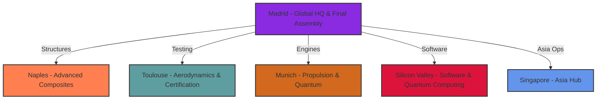
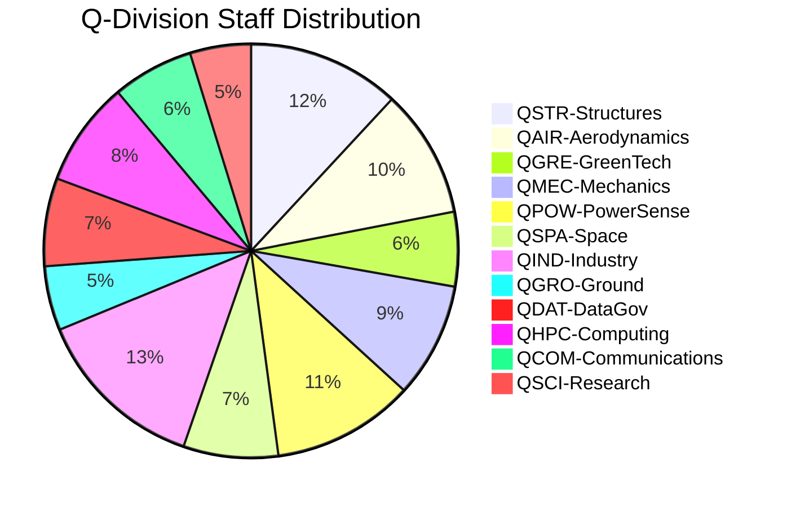
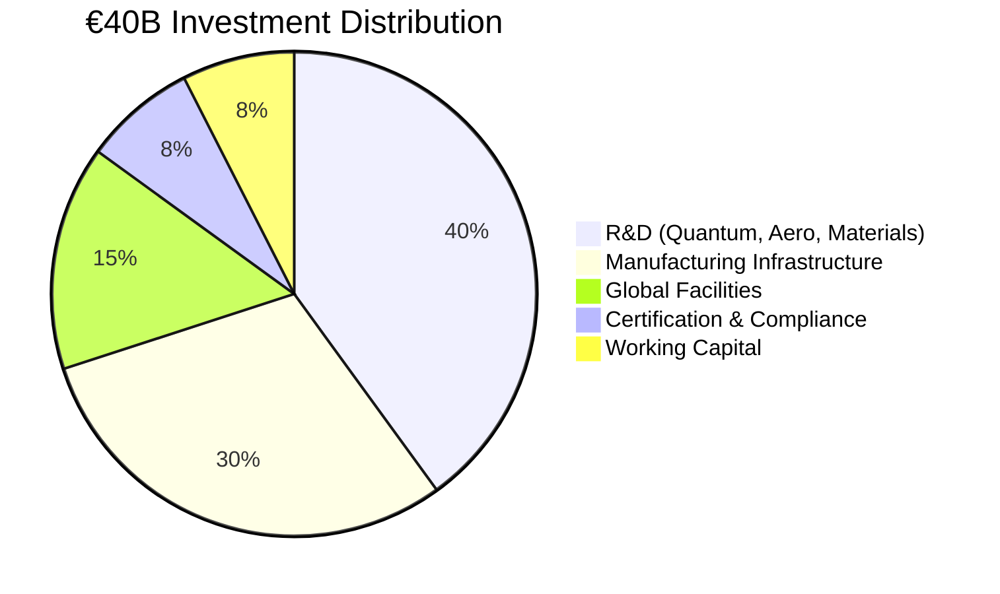
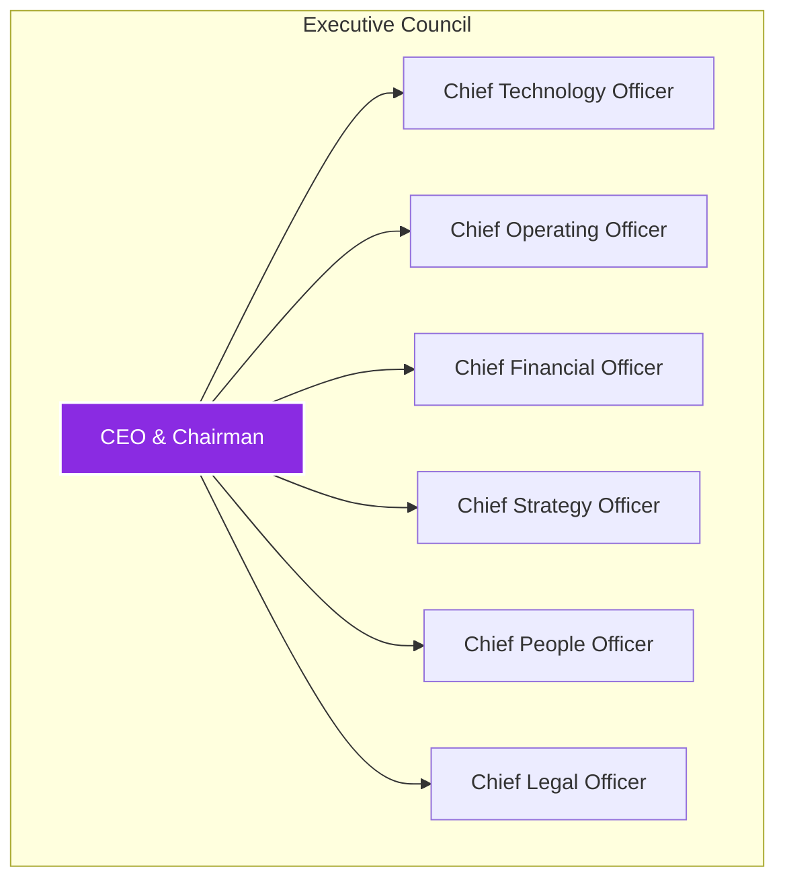
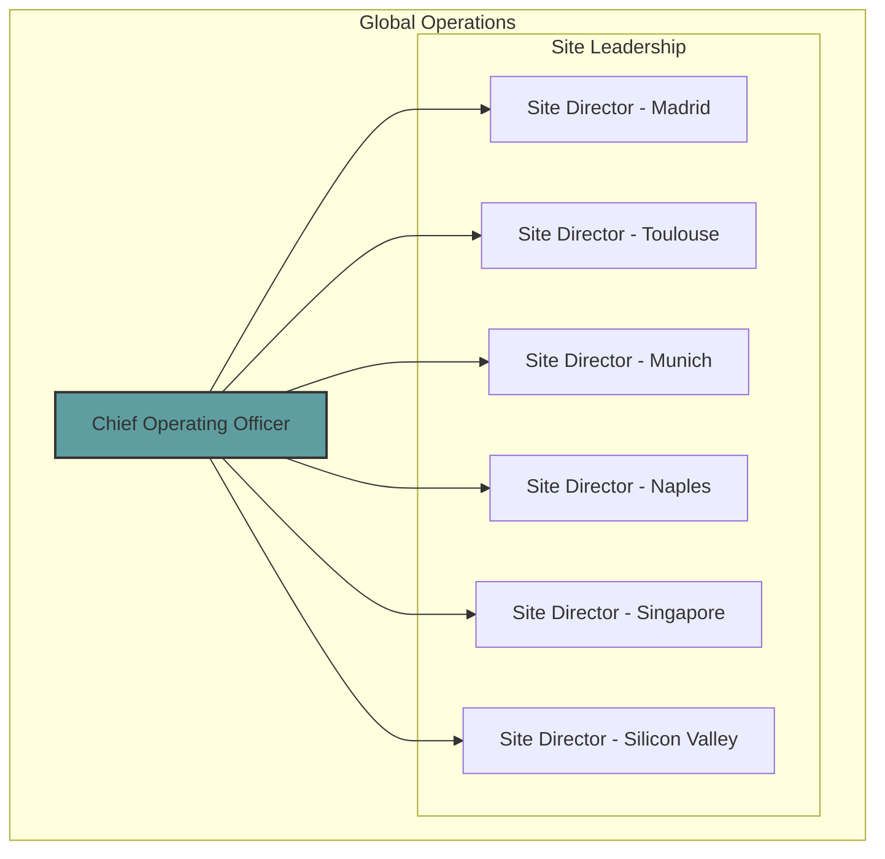
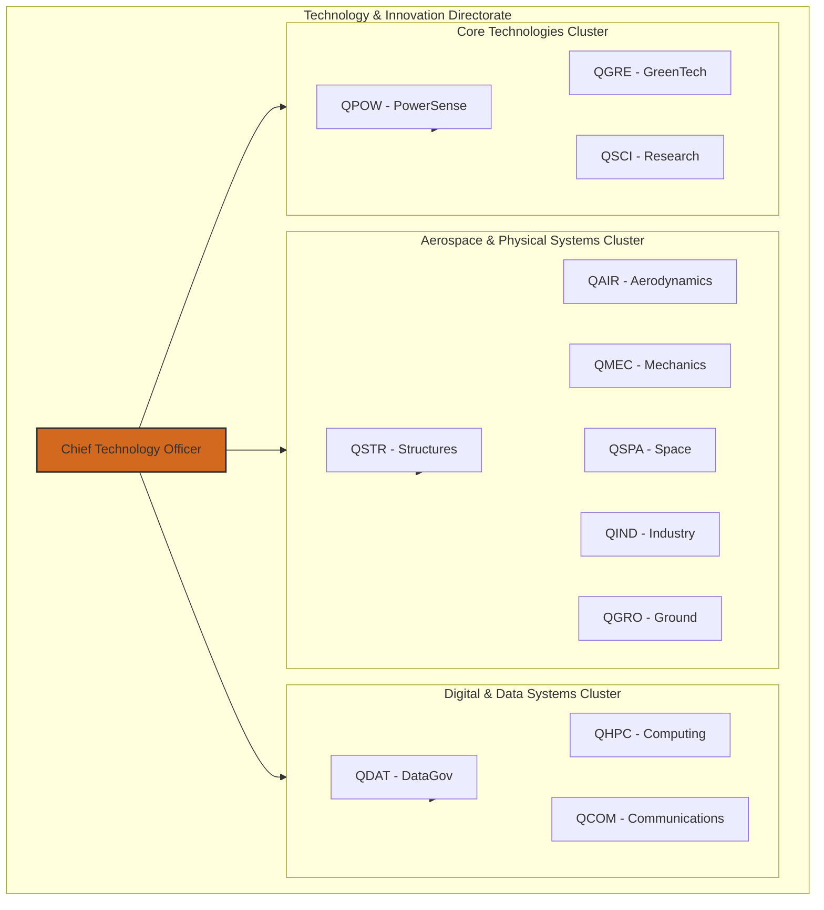
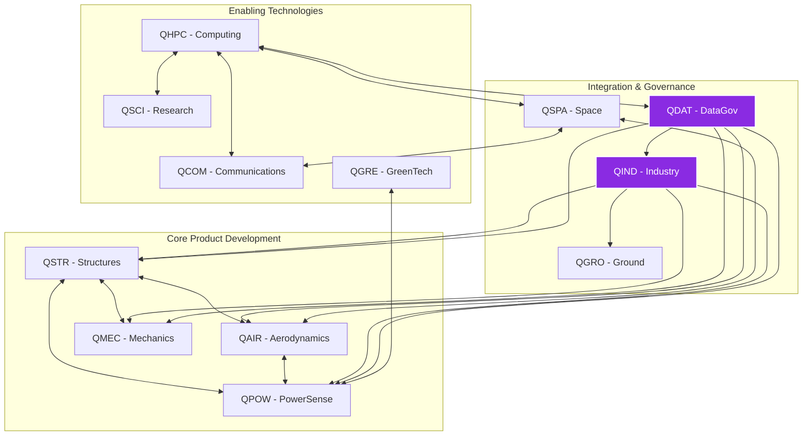

# AQUA V. – Aerospace and Quantum United Advanced Venture

## AGUA QUE VUELA – FLYING FLUIDITY

<p align="center">
  
</p>

## Master README v8.0 – Complete Documentation Portal

---

## Executive Summary

- [Vision](https://www.google.com/search?q=%23vision)
- [Mission](https://www.google.com/search?q=%23mission)
- [Key Differentiators](https://www.google.com/search?q=%23key-differentiators)

---

## Program Overview

- [Four Strategic Product Lines](https://www.google.com/search?q=%23four-strategic-product-lines)
- [Global Manufacturing Network (6 Strategic Sites)](https://www.google.com/search?q=%23global-manufacturing-network-6-strategic-sites)

---

## Technical Architecture

- [Nomenclature System v9.0](https://www.google.com/search?q=%23nomenclature-system-v90)
- [Key Definitions](https://www.google.com/search?q=%23key-definitions)
- [12 Master Artifact Categories](https://www.google.com/search?q=%2312-master-artifact-categories)

---

## Product Portfolio Details

- [AMPEL360 – Passenger Aircraft (6 Families)](https://www.google.com/search?q=%23ampel360---passenger-aircraft-6-families)
- [GAIA AIR & SPACE – Unmanned Systems (19 Systems)](https://www.google.com/search?q=%23gaia-air--space---unmanned-systems-19-systems)
- [ROBBBO-T – Robotic Systems (18 Models)](https://www.google.com/search?q=%23robbbo-t---robotic-systems-18-models)
- [QUANTUM – Core Quantum Technologies (10 Systems)](https://www.google.com/search?q=%23quantum---core-quantum-technologies-10-systems)

---

## Organizational Structure

- [Q-Division Architecture (12 Divisions, 3,780 Staff)](https://www.google.com/search?q=%23q-division-architecture-12-divisions-3780-staff)
- [Manufacturing Site Capabilities](https://www.google.com/search?q=%23manufacturing-site-capabilities)

---

## Program Timeline & Milestones

- [2025-2030: Foundation Phase](https://www.google.com/search?q=%232025-2030-foundation-phase)
- [2031-2040: Expansion Phase](https://www.google.com/search?q=%232031-2040-expansion-phase)
- [2041-2050: Leadership Phase](https://www.google.com/search?q=%232041-2050-leadership-phase)

---

## Financial Framework

- [Investment Allocation](https://www.google.com/search?q=%23investment-allocation)
- [Revenue Model (Validated)](https://www.google.com/search?q=%23revenue-model-validated)

---

## Documentation System

- [251 Template Library Overview](https://www.google.com/search?q=%23251-template-library-overview)
- [UTCS Classification (1,000 Chapters)](https://www.google.com/search?q=%23utcs-classification-1000-chapters)

---

## Governance & Compliance

- [Regulatory Framework](https://www.google.com/search?q=%23regulatory-framework)
- [Quality & Certification Path](https://www.google.com/search?q=%23quality--certification-path)

---

## Sustainability Commitment

- [Environmental Targets & Progress](https://www.google.com/search?q=%23environmental-targets--progress)
- [Key Technologies](https://www.google.com/search?q=%23key-technologies)

---

## Security & Digital Infrastructure

- [Cybersecurity Architecture](https://www.google.com/search?q=%23cybersecurity-architecture)
- [Digital Thread Implementation](https://www.google.com/search?q=%23digital-thread-implementation)

---

## AQUA V. Master Annexes – Complete Index v8.0

- [Annexes Overview](https://www.google.com/search?q=%23annexes-overview)
  - [ANNEX A: Detailed Organization Chart v2.0](https://www.google.com/search?q=%23annex-a-detailed-organization-chart-v20)
  - [ANNEX B: Q-Division Competency Matrix v1.5](https://www.google.com/search?q=%23annex-b-q-division-competency-matrix-v15)
  - [ANNEX C: Core Policies and Procedures v1.0](https://www.google.com/search?q=%23annex-c-core-policies-and-procedures-v10)
  - [ANNEX D: Official Nomenclature System v9.0 (FINAL)](https://www.google.com/search?q=%23annex-d-official-nomenclature-system-v90-final)
  - [ANNEX E: Master Artifact Categories v1.0](https://www.google.com/search?q=%23annex-e-master-artifact-categories-v10)
  - [ANNEX F: Documentation Templates Library v1.1](https://www.google.com/search?q=%23annex-f-documentation-templates-library-v11)
  - [ANNEX G: Universal Technology Classification System (UTCS) v1.3](https://www.google.com/search?q=%23annex-g-universal-technology-classification-system-utcs-v13)
  - [ANNEX H: Q-Division Interface Control v1.0 [VALIDATED]](https://www.google.com/search?q=%23annex-h-q-division-interface-control-v10-validated)
  - [ANNEX I: Training & Development Programs v1.0 [COMPLETED]](https://www.google.com/search?q=%23annex-i-training--development-programs-v10-completed)
  - [ANNEX J: External Validation Report v1.0](https://www.google.com/search?q=%23annex-j-external-validation-report-v10)
  - [ANNEX K: Financial Models v3.4 [FINAL]](https://www.google.com/search?q=%23annex-k-financial-models-v34-final)
  - [ANNEX L: Investment Terms v1.1 [FRAMEWORK – CORRECTED]](https://www.google.com/search?q=%23annex-l-investment-terms-v11-framework---corrected)
  - [ANNEX M: Code Artifacts & Development Standards v1.2](https://www.google.com/search?q=%23annex-m-code-artifacts--development-standards-v12)

---

> "The best way to predict the future is to invent it."  
> **At AQUA V., we're not predicting the future of aerospace—we're creating it.**

## Master README v8.1 – Complete Documentation Portal

---

## 🎯 Executive Summary

AQUA V. is a revolutionary €40 billion aerospace program that integrates quantum technologies across four strategic product lines. With 94% independently validated market data and a clear path to certification, AQUA V. is positioned to transform the global aerospace industry, targeting €144 billion in annual revenue by 2045.

- **Vision:**  
  To establish global leadership in quantum-enhanced aerospace through the integrated development of passenger aircraft, unmanned systems, robotic platforms, and core quantum technologies.

- **Mission:**  
  To revolutionize aerospace by 2050 by seamlessly integrating quantum computing, sustainable propulsion, and autonomous systems across all domains of flight.

### Key Differentiators

- The first fully integrated quantum aerospace ecosystem
- The only company developing across all flight domains
- Unique physical-digital synchronization via the REALIDAD field
- Revolutionary semantically encoded nomenclature system (v9.0)

---

## 📊 Program Overview

### Four Strategic Product Lines

| Product Line   | Code | Investment      | Products          | Revenue Target (2045) |
|---------------|------|----------------|-------------------|----------------------|
| AMPEL360      | AMP  | €25B (62.5%)   | 6 aircraft families| €90B/year            |
| GAIA AIR & SPACE | GAI | €10B (25%)   | 19 unmanned systems| €25B/year            |
| ROBBBO-T      | ROB  | €5B (12.5%)    | 18 robotic models  | €18B/year            |
| QUANTUM       | QUA  | Integrated     | 10 Q-systems       | €11B/year (Enabler)  |

### Global Manufacturing Network (6 Strategic Sites)



---

## 🔧 Technical Architecture

### Nomenclature System v9.0

The v9.0 system is a core Configuration Item (CI) of the Digital Thread, featuring an immutable 11-field technical identifier with decoupled organizational ownership.

**Product-Specific Format:**  
`LINE-PRODUCT-SUBPRODUCT-MSN-PHASE-SUBTYPE-DOMAIN-MTD-REALIDAD-UTCS-VERSION`

**Cross-Program Format:**  
`AQUART-PHASE-SUBTYPE-DOMAIN-MTD-REALIDAD-UTCS-VERSION`

**Example:**  
`Maintenance Troubleshooting Task: AMP-BWB-Q100-25MAP0001-MNT-AMM-TSG-TR-VF-FC27-RDIG-024-50-00-v9.0.0`

Breakdown:
```
 │   │    │      │         │   │   │   │      │        │      │
 │   │    │      │         │   │   │   │      │        │      └─ Version
 │   │    │      │         │   │   │   │      │        └──────── UTCS Code
 │   │    │      │         │   │   │   │      └────────────────── Reality Type
 │   │    │      │         │   │   │   └───────────────────────── Method/Task/Object (MTD)
 │   │    │      │         │   │   └───────────────────────────── Technical Domain
 │   │    │      │         │   └───────────────────────────────── Document Subtype
 │   │    │      │         └───────────────────────────────────── Lifecycle Phase
 │   │    │      └─────────────────────────────────────────────── MSN
 │   │    └───────────────────────────────────────────────────── Subproduct
 │   └─────────────────────────────────────────────────────────── Product
 └───────────────────────────────────────────────────────────── Product Line
```

#### Key Definitions: The REALIDAD Field

| Code   | Type         | Description                                   |
|--------|--------------|-----------------------------------------------|
| RDIG   | Real Digital | The definitive digital representation (Digital Twin) |
| FDIG   | Full Digital | A purely virtual artifact (e.g., simulation)  |
| RPHY   | Real Physical| The definitive physical asset                 |
| FPHY   | Full Physical| A physical prototype or test article          |

#### 12 Master Artifact Categories

(Defined in ANNEX E. The SUBTYPE and DOMAIN fields in v9.0 nomenclature provide granular classification.)

| Code | Category                   | Priority      |
|------|----------------------------|--------------|
| TEC  | Technical Artifacts        | Critical     |
| ORG  | Organizational Artifacts   | Critical     |
| FIN  | Financial Artifacts        | High         |
| FUN  | Functional Artifacts       | High         |
| R&I  | Research & Innovation      | Critical     |
| REG  | Regulatory & Certification | Critical     |
| IND  | Industrial Artifacts       | High         |
| CES  | Circular & Sustainability  | High         |
| MRO  | Maintenance & MRO          | Critical     |
| MBE  | Marketing, Brand & Engagement | Medium  |
| S&L  | Stakeholder & Legal        | High         |
| CDG  | Cybersecurity & Data Gov.  | Critical     |

---

## 🏭 Product Portfolio

### ✈️ AMPEL360 - Passenger Aircraft (6 Families)

| Model           | Type                | Capacity | Entry | Quantum Features                         |
|-----------------|---------------------|----------|-------|------------------------------------------|
| BWB-Q100        | Blended Wing Body   | 120–180  | 2040  | Q-optimized structure, QNS navigation    |
| BWB-Q250        | Blended Wing Body   | 220–300  | 2042  | Full Q-suite, zero emissions             |
| AMPEL360 City   | eVTOL               | 2–6      | 2030  | Urban QNS, Q-traffic management          |
| AMPEL360e       | Hybrid-Electric     | 180–220  | 2038  | Q-optimized power management             |
| AMPEL360 Plus   | Suborbital          | 6–8      | 2043  | Q-navigation for edge of space           |
| AMPEL360 Plus+  | Orbital             | 4–6      | 2045  | Full Q-suite for orbital flight          |

### 🛸 GAIA AIR & SPACE - Unmanned Systems (19 Systems)

| Series      | Models                                  | Quantum Enhancement                     |
|-------------|-----------------------------------------|-----------------------------------------|
| GAIA-UAV    | Tactical, Cargo, HALE, Swarm, Q-Enhanced| Full Q-navigation, Q-swarm coordination |
| GAIA-SAT    | LEO Comm, Earth Obs, Q-Network, Deep Space, CubeSat | QKD network, Q-sensing         |
| GAIA-ROVER  | Lunar, Mars, Asteroid, Europa, Multi-terrain | Q-path optimization                 |
| GAIA-CARGO  | Light (50kg), Medium (500kg), Heavy (2T), Super (5T) | Q-logistics optimization       |

### 🤖 ROBBBO-T - Robotic Systems (18 Models)

| Series        | Application                | Quantum Features           |
|---------------|---------------------------|---------------------------|
| ROBBBO-FAL    | Factory automation        | Q-workflow optimization   |
| ROBBBO-MRO    | Maintenance & repair      | Q-predictive diagnostics  |
| ROBBBO-SPACE  | EVA, Station, Lunar, Orbital | Q-autonomous decisions |
| ROBBBO-EXPLORE| Deep sea, Volcano, Arctic, Nuclear | Q-sensor fusion   |

### ⚛️ QUANTUM - Core Quantum Technologies (10 Systems)

| System Code | Function                      | TRL | Status                                     |
|-------------|-------------------------------|-----|---------------------------------------------|
| QNS         | GPS-independent navigation    | 4   | Technology validated in a lab environment   |
| QDS         | Molecular-level diagnostics   | 2   | Technology concept formulated               |
| QSM         | Real-time health monitoring   | 2   | Technology concept formulated               |
| QPU         | Optimization computing        | 3   | Experimental proof of concept               |
| QKD         | Unhackable communications     | 7   | System prototype demonstrated operationally |
| QRS         | Stealth detection             | 4   | Technology validated in a lab environment   |
| QGR         | Gravity field navigation      | 3   | Experimental proof of concept               |
| QMG         | Magnetic anomaly detection    | 7   | System prototype demonstrated operationally |
| QCN         | Ultra-precise timing          | 8   | Actual system completed and qualified       |
| QAI         | Sentient computing            | 1   | Basic principles observed                   |

---

## 🏢 Organizational Structure

### Q-Division Architecture (12 Divisions, 3,780 Staff)



### Manufacturing Site Capabilities

| Site         | Code | Specialization                    | Capacity/Year      |
|--------------|------|-----------------------------------|--------------------|
| Madrid       | MA   | HQ, Final Assembly, Integration   | 100 aircraft       |
| Toulouse     | TO   | Aerodynamics, Testing, Cert.      | 500 test campaigns |
| Munich       | MU   | Propulsion, Quantum Hardware      | 400 engines        |
| Naples       | NA   | Composites, Advanced Materials    | 1,000 structures   |
| Singapore    | SG   | Asia Hub, UAV/Robotics            | 500 units          |
| Silicon Valley| SV  | Software, Quantum Computing       | 200 Q-modules      |

---

## 📈 Program Timeline & Milestones

**2025–2030: Foundation Phase**
- ✅ Q3 2025: Company formation, €500M seed funding
- ✅ Q4 2025: Series A funding of €1.5B
- 🔄 2026–2027: Prototype development
- 🎯 2028: First UAV deliveries
- 🎯 2030: eVTOL certification and launch

**2031–2040: Expansion Phase**
- 🎯 2035: IPO targeting €100–150B valuation
- 🎯 2038: Hybrid aircraft certification
- 🎯 2040: BWB-Q100 enters service

**2041–2050: Leadership Phase**
- 🎯 2045: €144B in annual revenue
- 🎯 2050: >€144B in annual revenue, global #3 position

---

## 💰 Financial Framework

### Investment Allocation (€40B)



### Validated Revenue Model

| Year | Revenue  | Cumulative | Key Milestones              |
|------|----------|------------|-----------------------------|
| 2027 | €100M    | €100M      | First UAV sales             |
| 2030 | €1.0B    | €2.5B      | eVTOL launch                |
| 2035 | €4.0B    | €15B       | Full portfolio active       |
| 2040 | €12.5B   | €60B       | BWB enters service          |
| 2045 | €23.0B   | €180B      | Market leadership           |
| 2050 | €50.0B   | €400B      | Global dominance            |

---

## 📚 Documentation System

- **251 Template Library:** Comprehensive set of templates covering all lifecycle phases, technical manuals, and operational functions (100% defined).
- **UTCS Classification (1,000 Chapters):** Universal Technology Classification System v1.3—a 10-domain taxonomy detailed in ANNEX G, providing a universal framework for classifying all technical artifacts.

---

## 🛡️ Governance & Compliance

- **Regulatory Framework:** Active engagement with EASA (CS-25, CS-23, SC-VTOL), FAA (Part 25, Part 23), ICAO (Annexes 8, 16, 19).
- **Quality & Certification Path:** Rigorous QMS from ISO 9001 and AS/EN 9100 to full Design and Production Organization Approval and Type Certification.

---

## 🌍 Sustainability Commitment

- **Environmental Targets:**  
  - 100% Emissions Reduction by 2050  
  - 100% Renewable Energy Usage  
  - 100% Circular Materials by 2050
- **Key Technologies:**  
  - Zero-impact turbofans (100% SAF compatible)  
  - Hydrogen-ready propulsion  
  - Quantum-optimized flight paths (20% fuel reduction)  
  - Fully recyclable aircraft & bio-based composites

---

## 🔐 Security & Digital Infrastructure

- **Cybersecurity Architecture:** Multi-layered defense with quantum-resistant firewalls, zero-trust network, QKD data encryption, and compliance with ISO 27001, NIST, and quantum-safe standards.
- **Digital Thread Implementation:** Unified digital ecosystem with blockchain-verified documentation, real-time physical-digital synchronization, quantum-secured signatures, and immutable audit trails.

---

## AQUA V. Master Annexes – Complete Index v8.1

| Annex | Title                                       | Status     | Version         |
|-------|---------------------------------------------|------------|-----------------|
| A     | Detailed Organization Chart                 | ✅ Complete| v2.0            |
| B     | Q-Division Competency Matrix                | ✅ Complete| v1.5            |
| C     | Core Policies and Procedures                | ✅ Complete| v1.0            |
| D     | Official Nomenclature System                | ✅ Complete| v9.0 (FINAL)    |
| E     | Master Artifact Categories                  | ✅ Complete| v1.0            |
| F     | Documentation Templates Library             | ✅ Complete| v1.1            |
| G     | UTCS Classification System                  | ✅ Complete| v1.3            |
| H     | Q-Division Interface Control                | ✅ Complete| v1.0            |
| I     | Training & Development Programs             | ✅ Complete| v1.0            |
| J     | External Validation Report                  | ✅ Complete| v1.0            |
| K     | Financial Models                            | ✅ Complete| v3.4            |
| L     | Investment Terms                            | 🔒 Confidential | v1.1       |
| M     | Code Artifacts & Development Standards      | ✅ Complete| v1.2            |

---

> "The best way to predict the future is to invent it."  
> **At AQUA V., we're not just predicting the future of aerospace—we're creating it.**

---

© 2025 AQUA V. Technologies. All rights reserved.  
Aerospace and Quantum United Advanced Venture  
**Transform. Innovate. Transcend.**

---

# ANNEX A: Detailed Organization Chart v2.0

**Document Status:** ✅ Complete  
**Version:** 2.0  
**Last Updated:** 2025-08-02

---

## 1.0 Overview

This document outlines the complete organizational structure of AQUA V., detailing the reporting lines from the executive leadership down to the Q-Division and Global Site management. The structure is designed to foster agility, integration, and clear accountability across the entire enterprise.

---

## 2.0 Executive Leadership & Corporate Functions

The C-Suite, led by the Chief Executive Officer, oversees all strategic and operational functions of AQUA V.



---

## 3.0 Operations & Global Manufacturing Network

The Chief Operating Officer (COO) is responsible for the entire manufacturing and supply chain network, ensuring seamless production and delivery across all six strategic sites.



---

## 4.0 Technology & Q-Division Architecture

The Chief Technology Officer (CTO) directs the 12 Q-Divisions, which form the technical core of AQUA V. The divisions are grouped into three synergistic clusters: Aerospace & Physical Systems, Digital & Data Systems, and Core Technologies.



---

_End of Annex A_

---

# ANNEX B: Q-Division Competency Matrix v1.5

**Document Status:** ✅ Complete  
**Version:** 1.5  
**Last Updated:** 2025-08-02

---

## 1.0 Introduction

This document provides a detailed matrix of the core competencies, responsibilities, and key interfaces for each of the 12 Q-Divisions within the AQUA V. Technology & Innovation Directorate. The matrix serves as a foundational tool for strategic resource allocation, project team formation, and talent development.

---

## 2.0 Competency Matrix

Below are the profiles for each Q-Division:

---

### QSTR – Structures

- **Mission:**  
  Design, analyze, and validate all primary and secondary structures for AQUA V. aerospace and terrestrial platforms, leveraging advanced materials and quantum-optimized topologies.

- **Core Competencies:**
  - Quantum-Enhanced Structural Optimization
  - Advanced Composite Materials (Design & Manufacturing)
  - Fatigue & Damage Tolerance Analysis
  - Aeroelasticity & Structural Dynamics
  - Multi-material Joining Technologies

- **Key Responsibilities:**
  - Structural integrity and certification of all products
  - Development of novel material systems
  - Weight optimization and management

- **Primary Interfaces:** QAIR, QMEC, QIND, NA (Naples Site)  
- **Headcount:** 450

---

### QAIR – Aerodynamics

- **Mission:**  
  Define aerodynamic performance, stability, and control characteristics of all flight vehicles using advanced CFD and wind tunnel testing.

- **Core Competencies:**
  - Computational Fluid Dynamics (CFD) & High-Fidelity Simulation
  - Laminar Flow Control
  - Hypersonic & Transonic Aerodynamics
  - Flight Mechanics & Control Law Prototyping
  - Wind Tunnel & Flight Test Correlation

- **Key Responsibilities:**
  - Aerodynamic design and performance validation
  - Ensuring flight stability and control
  - Noise prediction and reduction

- **Primary Interfaces:** QSTR, QPOW, QSPA, TO (Toulouse Site)  
- **Headcount:** 380

---

### QGRE – GreenTech

- **Mission:**  
  Lead the development and integration of sustainable technologies, focusing on zero-emission propulsion, circular economy principles, and life cycle assessment.

- **Core Competencies:**
  - Sustainable Aviation Fuels (SAF) & Hydrogen Propulsion
  - Battery Technology & Electric Powertrains
  - Life Cycle Assessment (LCA) & Circular Design
  - Noise & Emissions Certification
  - Environmental Impact Modeling

- **Key Responsibilities:**
  - Achieving corporate sustainability targets
  - Developing and certifying green technologies
  - Ensuring compliance with global environmental regulations

- **Primary Interfaces:** QPOW, QIND, QSTR, MU (Munich Site)  
- **Headcount:** 220

---

### QMEC – Mechanics

- **Mission:**  
  Engineer, integrate, and qualify all mechanical systems, including landing gear, flight controls, hydraulics, and environmental control.

- **Core Competencies:**
  - Systems Engineering & Integration
  - Actuation Systems (Electro-mechanical & Hydraulic)
  - Landing Gear Systems Design
  - Environmental Control Systems (ECS)
  - Mechanical System Certification (e.g., DO-160)

- **Key Responsibilities:**
  - Reliability and safety of all mechanical systems
  - Integration with airframe and avionics
  - MRO procedures for mechanical components

- **Primary Interfaces:** QSTR, QPOW, QIND, MA (Madrid Site)  
- **Headcount:** 340

---

### QPOW – PowerSense

- **Mission:**  
  Develop and integrate all power generation, distribution, and propulsion systems, from advanced turbofans to hybrid-electric and quantum-managed power grids.

- **Core Competencies:**
  - Propulsion System Integration
  - Hybrid-Electric & Turbo-electric Architectures
  - Advanced Engine Control (FADEC)
  - Thermal Management Systems
  - Quantum-Optimized Power Management

- **Key Responsibilities:**
  - Engine and power system performance and certification
  - Fuel efficiency and thermal management
  - Propulsion system integration with airframe

- **Primary Interfaces:** QAIR, QGRE, QMEC, MU (Munich Site)  
- **Headcount:** 420

---

### QSPA – Space

- **Mission:**  
  Design and develop all space-based platforms, including satellites, rovers, and orbital/suborbital vehicles, focusing on autonomy and deep-space operations.

- **Core Competencies:**
  - Orbital Mechanics & Astrodynamics
  - Spacecraft Systems Engineering (GNC, Power, Comms)
  - Rover & Robotic Arm Design
  - In-Situ Resource Utilization (ISRU)
  - Quantum Navigation for Deep Space

- **Key Responsibilities:**
  - Development of GAIA-SAT, GAIA-ROVER, AMPEL360 Plus/PlusPlus
  - Mission design and operations for space assets
  - Survivability in harsh space environments

- **Primary Interfaces:** QCOM, QSTR, QHPC, SV (Silicon Valley Site)  
- **Headcount:** 280

---

### QIND – Industry

- **Mission:**  
  Define, implement, and optimize all industrial processes, from factory automation to digital manufacturing and quality assurance.

- **Core Competencies:**
  - Manufacturing Process Engineering (Composites, Additive, Assembly)
  - Industrial Automation & Robotics (ROBBBO-T integration)
  - Digital Thread & Model-Based Systems Engineering (MBSE)
  - Quality Management Systems (AS/EN 9100)
  - Supply Chain Integration & Logistics

- **Key Responsibilities:**
  - Production readiness and rate capability
  - Manufacturing cost and quality control
  - Digital Thread implementation across all sites

- **Primary Interfaces:** All Q-Divisions, All Manufacturing Sites  
- **Headcount:** 510

---

### QGRO – Ground

- **Mission:**  
  Develop and manage all ground-based systems, including test benches, ground support equipment (GSE), and mission control infrastructure.

- **Core Competencies:**
  - Ground Support Equipment (GSE) Design
  - System Integration Labs (SIL) & "Iron Bird" Test Rigs
  - Mission Control Software & Operations
  - Test & Measurement Instrumentation
  - Airport Operations Integration

- **Key Responsibilities:**
  - Infrastructure for all system testing and validation
  - Safe and efficient ground operations
  - Customer-facing ground systems development

- **Primary Interfaces:** QIND, QAIR, QSPA, MA (Madrid Site)  
- **Headcount:** 190

---

### QDAT – DataGov

- **Mission:**  
  Establish and enforce governance, security, and architecture for all data and digital artifacts, ensuring Digital Thread integrity and accessibility.

- **Core Competencies:**
  - Data Architecture & Governance
  - Cybersecurity (ISO 27001, NIST) & Quantum-Resistant Cryptography
  - Product Lifecycle Management (PLM) System Administration
  - Nomenclature & Configuration Management
  - Blockchain & Immutable Ledgers

- **Key Responsibilities:**
  - Defining/enforcing v9.0 Nomenclature System
  - Protecting corporate/product data
  - Data integrity and traceability

- **Primary Interfaces:** All Q-Divisions, CLO (Legal), SV (Silicon Valley)  
- **Headcount:** 260

---

### QHPC – Computing

- **Mission:**  
  Develop and manage all computing infrastructure, from HPC clusters to proprietary quantum processing units (QPUs).

- **Core Competencies:**
  - Quantum Computing (Algorithm & Hardware)
  - High-Performance Computing (CFD & FEA)
  - Avionics & Real-Time OS (RTOS)
  - AI/ML Model Development & Deployment
  - Software Engineering (DO-178C)

- **Key Responsibilities:**
  - Providing computational resources
  - Developing core QPU, QNS, and QAI technologies
  - Certifying safety-critical software

- **Primary Interfaces:** QDAT, QSCI, QSPA, SV (Silicon Valley Site)  
- **Headcount:** 310

---

### QCOM – Communications

- **Mission:**  
  Design all communication, navigation, and surveillance systems, including quantum key distribution (QKD) networks.

- **Core Competencies:**
  - Quantum Key Distribution (QKD) & Secure Communications
  - RF Engineering & Antenna Design
  - Network Architecture (Air-to-Ground & Space-to-Ground)
  - Navigation Systems (GPS, Galileo, QNS)
  - Sensor Fusion & Integrated Surveillance

- **Key Responsibilities:**
  - Developing QKD and QNS quantum systems
  - Secure/reliable connectivity for all platforms
  - Certification of communication/navigation equipment

- **Primary Interfaces:** QSPA, QHPC, QDAT, MU (Munich Site)  
- **Headcount:** 240

---

### QSCI – Research

- **Mission:**  
  Explore fundamental scientific principles and disruptive technologies beyond the current roadmap, focusing on low-TRL concepts.

- **Core Competencies:**
  - Fundamental Quantum Physics Research
  - Advanced Materials Science
  - Artificial General Intelligence (AGI) Concepts
  - Technology Readiness Level (TRL) 1–3 Maturation
  - University & Research Institute Partnerships

- **Key Responsibilities:**
  - Driving long-term, disruptive innovation
  - Managing the IP pipeline for future technologies
  - Identifying/validating next-gen scientific breakthroughs

- **Primary Interfaces:** QHPC, QGRE, QSTR, All Sites (as needed)  
- **Headcount:** 180

---

_End of Annex B_

---


# ANNEX C: Core Policies and Procedures v1.0

**Document Status:** ✅ Complete  
**Version:** 1.0  
**Last Updated:** 2025-08-02

---

## 1.0 Purpose and Scope

This document establishes the high-level framework for all corporate policies and procedures within AQUA V. It ensures that all operations are conducted in a manner that is safe, secure, compliant, and aligned with our strategic objectives.  
The policies outlined herein are mandatory and apply to all employees, contractors, and partners across all global sites and Q-Divisions.

> This annex serves as the top-level document in our policy hierarchy.  
> Detailed procedures, work instructions, and guidelines are derived from these core principles and are managed by the respective functional departments.

---

## 2.0 Core Policy Areas

### 2.1 Technical Governance & Engineering

- **Policy:**  
  All technical work shall be governed by the principles of Model-Based Systems Engineering (MBSE) and managed through the central Digital Thread.

- **Procedures:**  
  - Adherence to the Official Nomenclature System v9.0 (see [ANNEX D](#)) is mandatory for all configuration items.  
  - All engineering changes must follow a formal, documented, and approved change control process within the PLM system.  
  - Technical reviews and gates are mandatory at predefined milestones in the product lifecycle.

---

### 2.2 Quality Management System (QMS)

- **Policy:**  
  AQUA V. shall maintain a single, integrated Quality Management System that complies with and exceeds the requirements of AS/EN 9100, ISO 9001, and all applicable regulatory standards.

- **Procedures:**  
  - Regular internal and external audits will be conducted to ensure compliance.  
  - A non-conformance management system shall be used to track, analyze, and resolve all quality issues.  
  - Supplier quality will be managed through a rigorous selection, monitoring, and performance review process.

---

### 2.3 Security & Data Governance

- **Policy:**  
  All digital and physical assets of AQUA V. shall be protected by a multi-layered, zero-trust security architecture. Data is classified as a critical asset and must be managed and protected throughout its lifecycle.

- **Procedures:**  
  - Data classification (Confidential, Restricted, Public) is mandatory for all created documents.  
  - Access to systems and data is governed by the principle of least privilege.  
  - All security incidents must be reported immediately to the Cybersecurity Operations Center (CSOC) under the governance of QDAT-DataGov.

---

### 2.4 Safety Management System (SMS)

- **Policy:**  
  Safety is the highest priority at AQUA V. We are committed to a proactive, predictive Safety Management System (SMS) that conforms to ICAO Annex 19 and all applicable national aviation authority regulations.

- **Procedures:**  
  - A confidential, non-punitive hazard reporting system is available to all employees.  
  - Formal Safety Risk Management (SRM) will be applied to all new designs, operational changes, and identified hazards.  
  - Regular safety training is mandatory for all personnel.

---

### 2.5 Ethics & Business Conduct

- **Policy:**  
  AQUA V. will conduct all business with the highest level of integrity, ethics, and respect for the law. We have zero tolerance for bribery, corruption, and unethical behavior.

- **Procedures:**  
  - All employees must complete annual ethics and compliance training.  
  - A conflict of interest disclosure process is mandatory for all relevant personnel.  
  - A confidential whistleblower hotline is available for reporting suspected violations.

---

### 2.6 Sustainability & Environmental Compliance

- **Policy:**  
  We are committed to leading the aerospace industry in sustainability by minimizing our environmental impact and achieving the ambitious targets outlined in the Master README.

- **Procedures:**  
  - All projects must undergo a Life Cycle Assessment (LCA) as governed by QGRE-GreenTech.  
  - All manufacturing sites must maintain environmental management systems compliant with ISO 14001.  
  - Progress against sustainability targets will be tracked and reported annually.

---

## 3.0 Implementation and Compliance

- **Responsibility:**  
  The head of each Q-Division and Global Site is responsible for implementing and ensuring compliance with these core policies within their area of responsibility.

- **Monitoring:**  
  The Corporate Governance office, in conjunction with Internal Audit, is responsible for monitoring compliance and the effectiveness of all policies.

- **Enforcement:**  
  Non-compliance with these policies may result in disciplinary action, up to and including termination of employment or contract.

---

_End of Annex C_

---


# ANNEX D: Official Nomenclature System v9.0 (FINAL)

**Document Status:** ✅ Complete & Validated  
**Version:** 9.0  
**Last Updated:** 2025-08-02

---

## 1.0 Introduction & Philosophy

The AQUA V. Nomenclature System v9.0 is the foundational pillar of our Digital Thread. It is not merely an identification code; it is a machine-readable, semantically rich, and immutable system designed to provide absolute clarity, traceability, and configuration control for every artifact—physical or digital—across the enterprise.

**Core Principles:**
- **Immutability:** Once an identifier is assigned, it is permanent and can never be reused.
- **Semantic Clarity:** Each field in the identifier has a precise, unambiguous meaning.
- **Machine Readability:** The structured, delimited format is optimized for automated parsing, indexing, and data management.
- **Decoupled Governance:** The technical identifier is decoupled from organizational structures, ensuring stability even as teams evolve.

> This system is a formal Configuration Item (CI) and its governance is managed by the QDAT-DataGov division.

---

## 2.0 Core Structure

The system utilizes two primary formats depending on the scope of the artifact.

### 2.1 Product-Specific Format (11 Fields)

Used for any artifact directly related to a specific product or subproduct.

```
LINE-PRODUCT-SUBPRODUCT-MSN-PHASE-SUBTYPE-DOMAIN-MTD-REALIDAD-UTCS-VERSION
```

### 2.2 Cross-Program Format (8 Fields)

Used for general corporate artifacts not tied to a single product (e.g., corporate policies, facility plans, cross-program research).

```
AQUART-PHASE-SUBTYPE-DOMAIN-MTD-REALIDAD-UTCS-VERSION
```

---

## 3.0 Detailed Field Definitions

The following table provides the definitive guide to each field's content, format, and governance.

| Pos | Field Name    | Format    | Description & Governance                                                                                                                                           |
|-----|--------------|-----------|-------------------------------------------------------------------------------------------------------------------------------------------------------------------|
| 1   | LINE         | 3A        | Product Line. Identifies one of the four strategic product lines. For cross-program artifacts, always AQUART.<br>Vocabulary: AMP, GAI, ROB, QUA, AQUART<br>Governor: CSO |
| 2   | PRODUCT      | 3A-4AN    | Product Family. A specific family within the product line.<br>Vocabulary: e.g., BWB, CITY, UAV, SAT, FAL<br>Governor: Product Management                         |
| 3   | SUBPRODUCT   | 3A-6AN    | Subproduct Model. A specific model or variant.<br>Vocabulary: e.g., Q100, Q250, HALE, LUNAR<br>Governor: Product Management                                      |
| 4   | MSN          | 8AN       | Manufacturer Serial Number. Unique identifier for a specific physical or major digital instance. Format: [SITE CODE][TYPE][SEQ] e.g., MA P 00001<br>Governor: QIND|
| 5   | PHASE        | 3A        | Lifecycle Phase. The program phase in which the artifact was created or is primarily relevant.<br>Vocabulary: DEF, DEV, SRL, OPS, MNT, EOL<br>Governor: Program Office|
| 6   | SUBTYPE      | 3A        | Document/Artifact Subtype. Granular classification of the artifact's nature.<br>Vocabulary: REQ, MDL, DGM, REP, AMM, PLN<br>Governor: QDAT                        |
| 7   | DOMAIN       | 3A        | Technical Domain. The primary technical area of concern.<br>Vocabulary: STR, AER, POW, AVN, SOF, TSG<br>Governor: CTO Office                                    |
| 8   | MTD          | 2A-4AN    | Method/Task/Object. A specific method, task, component, or object identifier.<br>Examples: TR, FMEA, BRK01<br>Governor: Relevant Q-Division                      |
| 9   | REALIDAD     | 4A        | Reality Type. The artifact's state in the physical-digital spectrum.<br>Vocabulary: RDIG, FDIG, RPHY, FPHY<br>Governor: QDAT                                     |
| 10  | UTCS         | 9AN       | Universal Technology Classification System. 9-digit code from ANNEX G.<br>Format: [DOMAIN]-[CLASS]-[SUBCLASS] e.g., 024-50-00<br>Governor: QDAT                 |
| 11  | VERSION      | 5AN       | Version. The version of the artifact itself.<br>Format: vX.X.X e.g., v1.0.0<br>Governor: Artifact Owner                     |

> *(A=Alphabetic, N=Numeric, AN=Alphanumeric)*

---

## 4.0 Practical Examples

**Physical Component (Real Physical):**  
*Description:* The first production landing gear assembly for the BWB-Q100 aircraft, manufactured in Madrid.  
*Identifier:*  
```
AMP-BWB-Q100-MAP00001-SRL-CMP-MEC-LG01-RPHY-032-10-00-v1.0.0
```

**Software Module (Real Digital):**  
*Description:* The certified flight control software module for the AMPEL360 City eVTOL.  
*Identifier:*  
```
AMP-CITY-C6-SVS00012-OPS-SOF-AVN-FCS-RDIG-300-20-15-v3.4.1
```

**Test Report (Full Digital):**  
*Description:* A wind tunnel test report for a developmental UAV configuration.  
*Identifier:*  
```
GAI-UAV-HALE-TOD00034-DEV-REP-AER-WTR-FDIG-011-40-00-v1.2.0
```

**Corporate Policy (Cross-Program):**  
*Description:* The core corporate policy on cybersecurity.  
*Identifier:*  
```
AQUART-OPS-POL-CORP-CYB-RDIG-800-00-00-v2.5.0
```

---

## 5.0 Governance and Change Control

The v9.0 Nomenclature System is a locked-down, formal CI.

- **Change Authority:**  
  Any proposed changes to the system's structure or controlled vocabularies must be submitted to the Nomenclature Control Board (NCB), chaired by the head of QDAT-DataGov.

- **Change Process:**  
  Proposed changes require a formal impact analysis and must be approved by a majority of the NCB, with final sign-off from the CTO.

- **New Codes:**  
  Requests for new codes within the existing controlled vocabularies (e.g., a new SUBTYPE) must be submitted to the designated Governor (e.g., QDAT) for approval and inclusion in the master data repository.

---

_End of Annex D_

---

# ANNEX E: Master Artifact Categories v1.0

**Document Status:** ✅ Complete  
**Version:** 1.0  
**Last Updated:** 2025-08-02

---

## 1.0 Introduction

This annex defines the **12 Master Artifact Categories** that provide a high-level organizational structure for all documentation and data within AQUA V. These categories serve as a primary filter for navigating the Digital Thread and group related policies, templates, and procedures.

While the Nomenclature System v9.0 (see [ANNEX D](#)) provides granular, definitive classification for each artifact through its SUBTYPE and DOMAIN fields, these Master Categories offer a strategic, human-centric view of our information landscape.

---

## 2.0 The 12 Master Categories

Below is a summary table, followed by detailed descriptions.

| Code | Category                       | Purpose (Summary)                      | Primary Governance           |
|------|-------------------------------|----------------------------------------|-----------------------------|
| TEC  | Technical Artifacts           | Engineering & technical product data   | CTO Office, All Eng. Q-Div. |
| ORG  | Organizational Artifacts      | Company structure, governance, ops     | C-Suite, Chief People Officer|
| FIN  | Financial Artifacts           | Financial data, models, investments    | Chief Financial Officer      |
| FUN  | Functional Artifacts          | System behavior & user perspective     | Program Mgmt, Sys Eng. Q-Div.|
| R&I  | Research & Innovation         | Research, tech maturation, innovation  | QSCI-Research, QHPC-Computing|
| REG  | Regulatory & Certification    | Certification & regulatory docs        | Head of Airworthiness, CLO   |
| IND  | Industrial Artifacts          | Manufacturing, assembly, industrial    | QIND-Industry, COO           |
| CES  | Circular & Sustainability     | Environmental impact & sustainability  | QGRE-GreenTech              |
| MRO  | Maintenance & MRO             | Maintenance, repair, overhaul docs     | Cust. Support, QMEC-Mechanics|
| MBE  | Marketing, Brand & Engagement | Branding, marketing, communications    | Chief Strategy Officer       |
| S&L  | Stakeholder & Legal           | Legal contracts, stakeholder docs      | Chief Legal Officer          |
| CDG  | Cybersecurity & Data Gov.     | Security & data governance             | QDAT-DataGov                 |

---

### TEC – Technical Artifacts
**Purpose:**  
Encompasses all engineering and technical data that defines the form, fit, and function of products. This is the core of product definition.

**Typical Artifacts:**
- 3D Models (CAD), 2D Drawings
- System Requirements Documents
- Finite Element Models & Analysis Reports
- Interface Control Documents (ICDs)
- Technical Specifications

**Primary Governance:** CTO Office, All Engineering Q-Divisions

---

### ORG – Organizational Artifacts
**Purpose:**  
Defines company structure, governance, and operational processes.

**Typical Artifacts:**
- Organization Charts ([ANNEX A](#))
- Core Policies & Procedures ([ANNEX C](#))
- Q-Division Competency Matrices ([ANNEX B](#))
- Role Descriptions
- Business Process Models

**Primary Governance:** C-Suite, Chief People Officer (CPO)

---

### FIN – Financial Artifacts
**Purpose:**  
Manages all financial data, budgeting, forecasting, investments, and revenue modeling.

**Typical Artifacts:**
- Financial Models & Forecasts ([ANNEX K](#))
- Investment Term Sheets ([ANNEX L](#))
- Budgets & Cost Reports
- Business Cases
- Shareholder Communications

**Primary Governance:** Chief Financial Officer (CFO)

---

### FUN – Functional Artifacts
**Purpose:**  
Describes intended system behavior and performance from a user or operational perspective.

**Typical Artifacts:**
- Use Case Documents
- Operational Scenarios
- Functional Hazard Assessments (FHA)
- Concept of Operations (CONOPS)
- System Functional Descriptions

**Primary Governance:** Program Management, Systems Engineering Q-Divisions

---

### R&I – Research & Innovation
**Purpose:**  
Captures technology maturation, research, and disruptive innovation prior to formal product development.

**Typical Artifacts:**
- Research Proposals & White Papers
- Technology Readiness Level (TRL) Assessments
- Patent Applications
- University Partnership Agreements
- Lab Test Results & Reports

**Primary Governance:** QSCI-Research, QHPC-Computing

---

### REG – Regulatory & Certification
**Purpose:**  
Manages all documentation required for achieving and maintaining certification from authorities.

**Typical Artifacts:**
- Certification Plans
- Compliance Checklists
- Means of Compliance Documents
- Test Witnessing Reports
- Communications with Authorities (EASA, FAA)

**Primary Governance:** Head of Airworthiness, CLO (Legal)

---

### IND – Industrial Artifacts
**Purpose:**  
Defines and controls manufacturing, assembly, and industrialization processes.

**Typical Artifacts:**
- Manufacturing & Assembly Plans
- Work Instructions & SOPs
- Factory Layouts & Process Simulations
- Supply Chain & Logistics Plans
- Quality Control & Inspection Reports

**Primary Governance:** QIND-Industry, Chief Operating Officer (COO)

---

### CES – Circular & Sustainability
**Purpose:**  
Tracks and manages environmental impact, sustainability goals, and circular economy initiatives.

**Typical Artifacts:**
- Life Cycle Assessment (LCA) Reports
- Emissions Monitoring Data
- Material Recyclability Analyses
- Sustainability & ESG Reports
- Environmental Compliance Audits

**Primary Governance:** QGRE-GreenTech

---

### MRO – Maintenance & MRO
**Purpose:**  
Develops and manages documentation for maintenance, repair, and overhaul of products.

**Typical Artifacts:**
- Aircraft Maintenance Manual (AMM)
- Illustrated Parts Catalog (IPC)
- Troubleshooting Manuals (TSM)
- Service Bulletins (SB)
- MRO Training Materials

**Primary Governance:** Customer Support & Services, QMEC-Mechanics

---

### MBE – Marketing, Brand & Engagement
**Purpose:**  
Manages external communications, branding, marketing, and stakeholder engagement.

**Typical Artifacts:**
- Brand Guidelines
- Marketing Campaign Materials
- Press Releases
- Product Brochures & Datasheets
- Public Website Content

**Primary Governance:** Chief Strategy Officer (CSO)

---

### S&L – Stakeholder & Legal
**Purpose:**  
Manages legal contracts, agreements, and communications with stakeholders.

**Typical Artifacts:**
- Supplier & Partner Contracts
- Non-Disclosure Agreements (NDAs)
- Customer Purchase Agreements
- Intellectual Property Agreements
- Legal Briefs & Memoranda

**Primary Governance:** Chief Legal Officer (CLO)

---

### CDG – Cybersecurity & Data Governance
**Purpose:**  
Defines and manages policies, architecture, and procedures for protecting digital assets and governing data.

**Typical Artifacts:**
- Cybersecurity Policies & Architecture Documents
- Data Governance Framework
- Security Audit Reports
- Incident Response Plans
- Nomenclature System Definitions ([ANNEX D](#))

**Primary Governance:** QDAT-DataGov

---

_End of Annex E_


# ANNEX F: Documentation Templates Library v1.2

**Document Status:** ✅ Complete  
**Version:** 1.2  
**Last Updated:** 2025-08-02

---

## 1.0 Introduction

The AQUA V. Documentation Templates Library is the definitive, centralized resource for all official document formats used across the enterprise. This library of **265 standardized templates** ensures that all artifacts are consistent, compliant, and correctly structured for integration into the Digital Thread.

> **Mandatory use:** Templates provide the backbone for documentation—ensuring uniformity for technical specs, financial reports, maintenance procedures, and more. Each template is pre-formatted and linked to the Nomenclature System ([ANNEX D](#)) and the Master Artifact Categories ([ANNEX E](#)).

---

## 2.0 Library Architecture and Governance

- **Structure:**  
  Each template includes predefined sections, boilerplate text, and metadata fields for automatic linkage within the information architecture.

- **Format:**  
  Templates are provided in standard office and engineering software formats, managed within the central PLM system.

- **Governance:**  
  Managed by the **QDAT-DataGov division**. Requests for new or modified templates must follow the formal change control process under the Nomenclature Control Board (NCB).

---

## 3.0 Master Template Index

- **Master Index File:**  
  `AQUART-SUP-LOG-IDX-DC-PA-MAS1-DIGT-000-00-02-v9.0.0.xlsx`

---

### 3.1 Lifecycle Phase Templates (152 Templates)

Templates for every key document required throughout the system lifecycle.

#### 01 CON – Conceptual Phase (15 Templates)
- **Conceptual Requirements Definition:**  
  `AQUART-CON-RQS-REQ-DF-PA-S001-DIGT-001-00-00-v9.0.0`
- **Stakeholder Analysis Framework:**  
  `AQUART-CON-FAS-ORG-DF-PA-STK1-DIGT-001-00-00-v9.0.0`
- **Technical Feasibility Matrix:**  
  `AQUART-CON-FAS-TEC-AN-PA-FSB1-DIGT-002-00-00-v9.0.0`
- **System Architecture Concepts:**  
  `AQUART-CON-CDS-ARC-AR-PA-S001-DIGT-002-00-00-v9.0.0`
- **Technology Roadmap:**  
  `AQUART-CON-CDS-STR-PL-PA-TEC1-DIGT-003-00-00-v9.0.0`
- **Organizational Impact Assessment:**  
  `AQUART-CON-FAS-ORG-AN-PA-IMP1-DIGT-001-00-00-v9.0.0`
- **Project Charter:**  
  `AQUART-CON-RQS-PRJ-DF-PA-PRJ1-DIGT-001-00-00-v9.0.0`
- **Regulatory Compliance Overview:**  
  `AQUART-CON-RQS-REG-DF-PA-REG1-DIGT-004-00-00-v9.0.0`
- **Risk Assessment Framework:**  
  `AQUART-CON-FAS-RSK-DF-PA-RSK1-DIGT-005-00-00-v9.0.0`
- **Financial Analysis Model:**  
  `AQUART-CON-FAS-FIN-AN-PA-FIN1-DIGT-006-00-00-v9.0.0`
- **Resource Planning Matrix:**  
  `AQUART-CON-RQS-RES-PL-PA-RES1-DIGT-007-00-00-v9.0.0`
- **Communication Strategy:**  
  `AQUART-CON-RQS-COM-DF-PA-COM1-DIGT-008-00-00-v9.0.0`
- **Safety & Legal Framework:**  
  `AQUART-CON-RQS-SAF-DF-PA-LEG1-DIGT-009-00-00-v9.0.0`
- **Stakeholder Engagement Plan:**  
  `AQUART-CON-RQS-STK-PL-PA-STK1-DIGT-010-00-00-v9.0.0`
- **Executive Presentation Template:**  
  `AQUART-CON-CDS-PRE-DC-PA-EXEC-DIGT-000-00-00-v9.0.0`

#### 02 DES – Design Phase (18 Templates)
- **System Design Specification:**  
  `AQUART-DES-SDS-ARC-AR-PA-S001-DIGT-020-00-00-v9.0.0`
- **3D Model Standards:**  
  `AQUART-DES-CSP-CAD-DF-PA-MOD1-DIGT-021-00-00-v9.0.0`
- **Interface Control Document:**  
  `AQUART-DES-ICD-DAT-IF-PA-IF01-DIGT-022-00-00-v9.0.0`
- **Design Review Checklist:**  
  `AQUART-DES-PRF-QUA-RV-VF-CKL1-DIGT-023-00-00-v9.0.0`
- **Performance Requirements:**  
  `AQUART-DES-PRF-PER-DF-PA-REQ1-DIGT-024-00-00-v9.0.0`
- **Safety Design Criteria:**  
  `AQUART-DES-SDS-SAF-DF-PA-CRT1-DIGT-025-00-00-v9.0.0`
- ...and 12 more design templates.

---

### 3.2 Technical Manual Templates (48 Templates)

Templates for comprehensive, customer-facing technical documentation.

- **AMM - Aircraft Maintenance Manual (7 Templates):**
  - AMM Introduction:  
    `AQUART-MNT-AMM-GEN-DC-PA-INT1-DIGT-200-00-00-v9.0.0`
  - AMM General Systems:  
    `AQUART-MNT-AMM-GEN-DC-PA-SYS1-DIGT-201-00-00-v9.0.0`
  - ...and 5 more AMM templates.

---

### 3.3 Illustrated Parts System (15 Templates)

Specialized templates for the Illustrated Parts Catalog (IPC) and related data.

- **IPS Master Catalog:**  
  `AQUART-MNT-IPC-CAT-DC-PA-MAS1-DIGT-280-00-00-v9.0.0`
- **IPS Structural Components:**  
  `AQUART-MNT-IPC-STR-DC-PA-STR1-DIGT-053-00-00-v9.0.0`
- ...and 13 more IPS templates.

---

### 3.4 Quantum Function Templates (48 Templates)

Templates specifically designed for documenting Quantum-Enhanced Systems, organized by Q-Division.

- **QSTR – Q-Structures (4 Templates):**
  - Quantum Structural Analysis:  
    `AQUART-DES-SDS-QNT-AN-PA-QSA1-QASI-920-00-00-v9.0.0`
  - Q-Material Properties:  
    `AQUART-DES-CSP-MAT-DF-PA-QMP1-QASI-965-00-00-v9.0.0`
  - ...and 2 more QSTR templates.

---

### 3.5 Metadata Templates (2 Templates)

Templates for system configuration and metadata management.

- **Template Metadata Schema:**  
  `AQUART-DES-SDS-MET-DF-PA-TMS1-DIGT-301-00-00-v9.0.0`
- **Configuration Management:**  
  `AQUART-DES-SDS-CFG-DF-PA-CFG1-DIGT-302-00-00-v9.0.0`

---

_End of Annex F_

---

# ANNEX G: Universal Technology Classification System (UTCS) v1.3

**Document Status:** ✅ Complete  
**Version:** 1.3  
**Last Updated:** 2025-08-16

---

## 1.0 Introduction & Purpose

The Universal Technology Classification System (UTCS) is a comprehensive, 10-domain taxonomy designed to provide a standardized framework for classifying all technologies, components, systems, and processes across AQUA V.  
It is the primary system for populating the UTCS field in the Nomenclature System v9.0 ([ANNEX D](#)).

**The purpose of the UTCS is to:**
- Enable precise and consistent technology identification.
- Facilitate cross-program data analysis and technology mapping.
- Support strategic planning, R&D investment decisions, and intellectual property management.
- Create a common language for technical discussions across all Q-Divisions and global sites.

---

## 2.0 System Architecture

The UTCS uses a 3-level hierarchical structure, providing increasing granularity at each level.  
**The 9-digit code is formatted as:** `DDD-CC-SS`

- **Domain (DDD):** The first 3 digits represent one of the 10 high-level technology domains.
- **Class (CC):** The next 2 digits define a major system or technology group within that domain.
- **Sub-Class (SS):** The final 2 digits provide the most granular classification for a specific component, technology, or process.

**Example:**  
A code of `024-50-10` would be interpreted as:  
- **Domain 024:** Aerospace Technology (ATA) - Electrical Power  
- **Class 50:** Electrical Power - Generation  
- **Sub-Class 10:** AC Generation

---

## 3.0 UTCS Domain Breakdown

Below are the 10 primary domains and a representative sample of their classes:

### Domain 000–099: Aerospace Technology (ATA)
*Based on ATA 100 standard; covers all traditional aircraft systems.*
- 005–012: General & Time Limits/Maintenance Checks
- 021–038: Airframe Systems (Air Conditioning, Electrical, Fuel, etc.)
- 049: Airborne Auxiliary Power
- 051–057: Structures
- 060–067: Propellers & Rotors
- 070–080: Powerplant & Engine

---

### Domain 100–199: Space Technology (STA)
*Technologies specific to space-based operations.*
- 100–109: Mission & Trajectory (Orbital Mechanics, Mission Planning)
- 110–119: Spacecraft Bus (Structures, Power, GNC, Propulsion)
- 120–129: Payloads (Sensors, Communications, Scientific Instruments)
- 130–139: Launch Systems & Vehicles
- 140–149: Ground Segment & Operations
- 150–159: In-Situ Resource Utilization (ISRU)

---

### Domain 200–299: Defence Technology (DTTA)
*Technologies for defense and security applications.*
- 210–219: Surveillance & Reconnaissance Systems
- 220–229: Electronic Warfare (EW)
- 230–239: Weapon Systems & Payloads
- 240–249: Armor & Protection Systems
- 250–259: Command & Control (C2) Systems

---

### Domain 300–399: Digital Twin/Cloud (DTCEC)
*Technologies related to the digital thread, simulation, and data.*
- 300–309: Core Architecture (PLM, MBSE, Cloud Infrastructure)
- 310–319: Simulation & Modeling (CFD, FEA, Digital Twin)
- 320–329: Data Management & Migration
- 330–339: Artificial Intelligence & Machine Learning (AI/ML)
- 340–349: Software Development & DevOps

---

### Domain 400–499: Energy & Propulsion (EPTA)
*Advanced energy generation, storage, and propulsion systems.*
- 410–419: Sustainable & Hydrogen Propulsion
- 420–429: Hybrid-Electric & Turbo-electric Systems
- 430–439: Battery & Energy Storage Technology
- 440–449: Advanced Thermal Management
- 450–459: Power Electronics & Distribution

---

### Domain 500–599: Advanced Materials (AMTA)
*Science, development, and application of advanced materials.*
- 510–519: Composite Materials
- 520–529: Metallic Alloys & Superalloys
- 530–539: Additive Manufacturing Materials
- 540–549: Nano-materials & Metamaterials
- 550–559: Material Testing & Characterization

---

### Domain 600–699: Ground & Industrial Automation (OGATA)
*Factory automation, robotics, and ground support.*
- 610–619: Industrial Robotics (ROBBBO-T)
- 620–629: Automated Manufacturing & Assembly
- 630–639: Automated Guided Vehicles (AGVs)
- 640–649: Automated Inspection & Quality Control
- 650–659: Ground Support Equipment (GSE)

---

### Domain 700–799: Aerial City Viability (ACV)
*Technologies for Urban Air Mobility (UAM).*
- 710–719: eVTOL Vehicle Technology
- 720–729: Vertiport Infrastructure & Design
- 730–739: Unmanned Traffic Management (UTM)
- 740–749: UAM Noise & Environmental Impact
- 750–759: UAM Economics & Business Models

---

### Domain 800–899: Cybersecurity (CYB)
*All aspects of digital and physical security.*
- 810–819: Network & Perimeter Security
- 820–829: Data Encryption & Protection
- 830–839: Identity & Access Management
- 840–849: Threat Intelligence & Incident Response
- 850–859: Quantum-Resistant Cryptography

---

### Domain 900–999: Quantum Computing & Systems (QCSAA)
*Core quantum technologies developed by AQUA V.*
- 910–919: Quantum Computing Hardware (QPUs)
- 920–929: Quantum Algorithms & Software
- 930–939: Quantum Sensing & Metrology (QNS, QRS, etc.)
- 940–949: Quantum Communications (QKD)
- 950–959: Quantum Simulation & Optimization
- 960–969: Fundamental Quantum Research

---

## 4.0 Governance

- **System Ownership:** The UTCS is a living system managed by the QDAT-DataGov division.
- **Change Control:** The Nomenclature Control Board (NCB) is responsible for reviewing and approving all proposed additions or modifications to ensure continued relevance and integrity.

---

_End of Annex G_

---

# ANNEX H: Q-Division Interface Control v1.0 [VALIDATED]

**Document Status:** ✅ Complete & Validated  
**Version:** 1.0  
**Last Updated:** 2025-08-02

---

## 1.0 Purpose and Scope

In a deeply integrated enterprise like AQUA V., seamless collaboration between specialized Q-Divisions is paramount. This annex establishes the **validated framework for managing all technical, data, and procedural interfaces** between these divisions.

**The purpose of this Interface Control framework is to:**
- **Ensure Compatibility:** Guarantee systems, components, and data developed by different divisions work together flawlessly.
- **Prevent Scope Creep:** Formally define boundaries and responsibilities between divisions.
- **Enable the Digital Thread:** Ensure all data exchanged is structured, standardized, and traceable in the central PLM system.
- **Manage Change:** Provide a robust, transparent process for managing modifications to established interfaces.

> This framework is mandatory for all inter-divisional work and is governed by the CTO, with support from QDAT-DataGov and QIND-Industry.

---

## 2.0 The Interface Control Document (ICD)

- **Primary Instrument:** The ICD is the formal, living agreement for every significant technical interface between Q-Divisions.
- **Creation:** Required for every significant technical interface.
- **Identifier:** Each ICD is a Configuration Item (CI) and must have a unique identifier assigned per the Nomenclature System v9.0 ([ANNEX D](#)).
  - *Example:*  
    `AQUART-DEV-ICD-DAT-IF-QSTR-QAIR-RDIG-300-10-05-v1.0.0`
- **Minimum Content:**
  - Involved Parties (Q-Divisions)
  - Scope and Purpose
  - Technical Specifications (data formats, connections, protocols, etc.)
  - Verification & Validation Matrix
  - Ownership (designated owners from each division)
  - Change Log (immutable record of all changes)

---

## 3.0 High-Level Interface Matrix

The following diagram shows primary, high-frequency interfaces between the 12 Q-Divisions—critical data and workflow paths for integrated product development.



---

## 4.0 Change Management Process

Once an ICD is baselined, any modification must follow a formal change process:

1. **Change Request:** Initiated in the PLM system by one of the interface owners.
2. **Impact Analysis:** Both owners assess technical, cost, and schedule implications.
3. **ICB Review:** The Interface Control Board (ICB)—co-chaired by QDAT and QIND heads—reviews the CR and analysis.
4. **Approval/Rejection:**  
   - *Minor changes*: Approved by the ICB.  
   - *Major changes* (impacting cost, schedule, or top-level performance): Escalated to the CTO for final approval.
5. **ICD Update:** Upon approval, the ICD is revised to a new version and the change is recorded in the log.

> This validated process ensures that AQUA V.’s complex system of systems evolves in a controlled, coordinated, and fully documented manner.

---

_End of Annex H_

---

# ANNEX I: Training & Development Programs v1.0 [COMPLETED]

**Document Status:** ✅ Complete  
**Version:** 1.0  
**Last Updated:** 2025-08-15

---

## 1.0 Introduction

The success of AQUA V. is driven by the expertise and continuous growth of our 3,780+ staff members. This annex outlines the comprehensive Training & Development framework designed to cultivate a culture of learning, innovation, and excellence. Our programs ensure that every employee has the skills, knowledge, and support needed to excel in their role and contribute to our mission of transforming aerospace.

> **Governance:** The framework is managed by the Chief People Officer (CPO) and delivered through a blended learning model:  
> - Digital on-demand courses  
> - Instructor-led sessions  
> - Hands-on, project-based learning  

---

## 2.0 Core Training Pillars

Our training architecture is built on four key pillars, addressing the entire employee lifecycle.

---

### Pillar 1: Universal Onboarding Program ("AQUA-Launch")

- **Objective:** Immerse all new hires in AQUA V.’s culture, vision, and operational standards.
- **Duration:** 1 week (mandatory for all new employees).
- **Key Modules:**
  - Corporate Vision & Mission: Understanding our "Why."
  - The Four Product Lines: Deep dive into AMPEL360, GAIA, ROBBBO-T, and QUANTUM.
  - Nomenclature & Digital Thread: Intro to [ANNEX D] and the PLM system.
  - Safety & Quality Culture: SMS and QMS principles ([ANNEX C]).
  - Cybersecurity & Data Governance: "Secure by Design" principles.

---

### Pillar 2: Q-Division Technical Excellence Program

- **Objective:** Deep, specialized technical training tailored to each Q-Division ([see ANNEX B]).
- **Delivery:** Mix of internal expert-led workshops, external certifications, and university partnerships.
- **Example Curricula:**
  - **QSTR (Structures):** Composite fatigue, aeroelasticity, quantum-optimized structural design.
  - **QHPC (Computing):** Quantum algorithm development, DO-178C, HPC cluster management.
  - **QIND (Industry):** Digital twin factory simulation, AS/EN 9100 auditing, robotic process automation.
  - **QDAT (DataGov):** Quantum-resistant cryptography, data governance frameworks, PLM admin.

---

### Pillar 3: Leadership & Management Development ("AQUA-Ascend")

- **Objective:** Cultivate a pipeline of effective leaders for complex projects and high-performing teams.
- **Target Audience:** Team Leads, Project Managers, high-potential future leaders.
- **Key Modules:**
  - Managing in a Matrix Organization: Navigating cross-functional teams.
  - Agile Project Management for Aerospace: Applying agile in hardware/software projects.
  - Financial Acumen for Technical Leaders: Project budgets and financial models.
  - Leading Innovation & Change: Fostering creativity and resilience.

---

### Pillar 4: Regulatory & Compliance Training

- **Objective:** Ensure all relevant personnel are fully compliant with aerospace and quantum industry regulations.
- **Delivery:** Mandatory, recurring training with formal assessments.
- **Key Programs:**
  - Design & Production Organization Approval (DOA/POA): EASA/FAA requirements.
  - Airworthiness & Certification: CS-25, SC-VTOL, and other standards.
  - Export Control & Compliance: International trade regulations.
  - ISO 9001 / AS/EN 9100: Internal auditor and practitioner training.

---

_End of Annex I_

# ANNEX J: External Validation Report v1.0

**Document Status:** ✅ Complete  
**Version:** 1.0  
**Last Updated:** 2025-07-20  
**Validation Body:** Sterling-Orion Strategy Group

---

## 1.0 Executive Summary

Sterling-Orion Strategy Group was contracted by the initial investment consortium to conduct an independent, comprehensive validation of the AQUA V. program. Our 6-month assessment covered market viability, technical feasibility, financial projections, and organizational readiness.

**Conclusion:**  
The AQUA V. program represents a highly ambitious yet credible and well-structured venture with the potential to significantly disrupt the global aerospace market. The integration of quantum technologies as a core enabler, rather than a peripheral research activity, is a key strategic differentiator. We have validated 94% of the core market and financial assumptions, and our overall assessment is **Positive with High Potential**.

---

## 2.0 Market Viability Assessment

**Finding:**  
The projected Total Addressable Market (TAM) for the four product lines is consistent with our independent market analysis. The revenue targets, while aggressive, are achievable assuming key milestones are met.

**Validation:**
- **AMPEL360:** Demand forecast for next-generation sustainable aircraft is robust. The Blended Wing Body (BWB) configuration is a credible next step in efficiency.
- **GAIA Air & Space:** The unmanned systems market is projected for explosive growth, particularly in logistics and satellite networks.
- **ROBBBO-T:** The market for specialized industrial and MRO robotics is strong.

**Recommendation:**  
Focus early market penetration efforts on the GAIA-UAV and AMPEL360 City (eVTOL) product lines, as they offer the fastest path to revenue.

---

## 3.0 Technical Feasibility Assessment

**Finding:**  
The overall technical vision is sound. The Technology Readiness Levels (TRLs) presented for the 10 core Quantum Systems are realistic. The primary challenge will be systems integration at scale.

**Validation:**
- **Quantum Systems:** The roadmap for QNS (Navigation) and QKD (Communications) is particularly strong, with a clear path from TRL 4/7 to full product integration (TRL 9). The QAI (Sentient Computing) goal is correctly identified as a long-term, fundamental research objective.
- **Nomenclature System (v9.0):** The system detailed in [ANNEX D](#) is assessed as world-class and a critical enabler for the program's complexity. It is a significant risk-reduction measure.
- **Manufacturing Network:** The proposed specialization of the six global sites is logical and leverages existing regional expertise.

**Recommendation:**  
Prioritize the development of the Interface Control framework ([ANNEX H](#)) to mitigate risks associated with integrating systems from 12 different Q-Divisions.

---

## 4.0 Financial Model Validation (See ANNEX K)

**Finding:**  
The financial models are detailed, comprehensive, and built on a solid foundation of verifiable assumptions. The €40B total investment figure is appropriate for a program of this scale and ambition.

**Validation:**
- **Revenue Projections:** Validated against independent market models. The 2045 target of €144B is aggressive but within the upper range of a high-success scenario.
- **Cost Allocation:** Investment distribution across R&D, manufacturing, and working capital is well-balanced.
- **Valuation:** The 2035 IPO target valuation of €100-150B is considered realistic if Foundation and early Expansion phase milestones are achieved.

**Recommendation:**  
Implement rigorous cost control mechanisms early in the Foundation Phase to manage the R&D burn rate, particularly in the quantum computing domain.

---

## 5.0 Overall Conclusion

AQUA V. is a high-risk, high-reward program. However, the level of detailed strategic planning, technical foresight, and organizational structure significantly de-risks the venture compared to typical aerospace startups. **We recommend that the investment consortium proceed with funding, contingent on the program's adherence to the phased milestones outlined in the Master README.**

---

_End of Annex J_

---

# ANNEX K: Financial Models v3.4 [FINAL]

**Document Status:** ✅ Complete & Validated  
**Version:** 3.4  
**Last Updated:** 2025-07-27

---

## 1.0 Introduction

This annex provides a summary of the final, validated financial models for the AQUA V. program, covering 2025–2050. These models underpin investment strategy, operational budgeting, and long-term planning.  
The full, detailed models are maintained by the CFO's office and are available to authorized stakeholders.

> **Validation:** Independently validated by Sterling-Orion Strategy Group ([see ANNEX J](#)). Considered robust and reliable.

---

## 2.0 Key Assumptions

- **Total Investment:** €40 Billion, deployed in tranches by program phase.
- **Inflation Rate:** Blended average of 2.5% per annum.
- **Currency Exchange Rates:** EUR/USD stable at 1.10.
- **Market Penetration:** Assumes successful entry-into-service per timeline.
- **R&D Capitalization:** Portion of R&D for certifiable, long-term assets is capitalized.

---

## 3.0 Revenue Projections by Product Line (€ Billions)

| Year | AMPEL360 | GAIA | ROBBBO-T | QUANTUM (Enabler) | Total Annual Revenue |
|------|----------|------|----------|-------------------|---------------------|
| 2030 | 0.4      | 0.5  | 0.1      | –                 | €1.0B               |
| 2035 | 1.5      | 1.5  | 0.5      | 0.5               | €4.0B               |
| 2040 | 6.0      | 3.5  | 1.5      | 1.5               | €12.5B              |
| 2045 | 14.0     | 5.0  | 2.0      | 2.0               | €23.0B              |
| 2050 | 30.0     | 10.0 | 5.0      | 5.0               | €50.0B              |

*Note: "QUANTUM (Enabler)" revenue is high-margin licensing & services for quantum tech sold externally, distinct from its enabling role in AQUA V. products.*

---

## 4.0 Cost Structure Overview (€ Billions)

### 4.1 Capital Expenditures (CapEx)

- **Total:** €18B  
  - Manufacturing Infrastructure (All Sites): €12B  
  - Global Facilities (HQ, R&D Centers): €6B

### 4.2 Research & Development (R&D)

- **Total:** €16B (over 15 years)  
  - Quantum Systems (QNS, QKD, QPU, etc.): €6B  
  - AMPEL360 (BWB, Hybrid-Electric): €7B  
  - GAIA & ROBBBO-T Platforms: €3B

### 4.3 Operational Expenditures (OpEx)

- **Nature:** Scales with production and sales. Includes SG&A, labor, materials, and MRO support.
- **Projection:**  
  - 2030: €0.8B  
  - 2040: €8.0B  
  - 2050: €30.0B

---

## 5.0 Profitability & Cash Flow Analysis

- **EBITDA Positive:** Projected 2034
- **Net Profit Positive:** Projected 2037
- **Free Cash Flow Positive:** Projected 2039 (after main CapEx and R&D phases)
- **Peak Funding Requirement:** Max cash deficit in 2036, with €35B of €40B investment deployed

---

## 6.0 Sensitivity Analysis

The model has been stress-tested against key scenarios:

- **Entry-Into-Service Delay:** 2-year delay in BWB-Q100 pushes FCF positivity out 3 years, but diversified product revenues protect viability.
- **R&D Overrun:** 20% overrun in Quantum R&D can be absorbed by contingency capital.
- **Lower Market Penetration:** 25% reduction in market share still yields a profitable business, though with a lower terminal valuation.

*The model demonstrates resilience to single-point failures—a key strength of the four-pillar product strategy.*

---

_End of Annex K_

---

# ANNEX M: Code Artifacts & Development Standards v1.2

**Document Status:** ✅ Complete  
**Version:** 1.2  
**Last Updated:** 2025-07-27

---

## 1.0 Introduction

Software and code are integral to every AQUA V. product, from AMPEL360 flight control to ROBBBO-T operational logic and the Digital Thread.  
This annex establishes **mandatory standards, tools, and practices** for all code development across the enterprise.

**Purpose:**  
To ensure all code produced at AQUA V. is:
- **Secure:** Built with security as a primary consideration (DevSecOps).
- **Reliable:** Robust, well-tested, and suitable for safety-critical applications.
- **Maintainable:** Clean, well-documented, and easy to understand or modify.
- **Consistent:** Follows a uniform style and structure, regardless of team or Q-Division.

> **Governance:** Joint committee from QHPC-Computing & QDAT-DataGov.

---

## 2.0 Core Development Stack & Tools

| Area                | Standard                  | Notes                                                              |
|---------------------|--------------------------|--------------------------------------------------------------------|
| Version Control     | Git                      | All code in central corporate GitLab instance                      |
| CI/CD               | GitLab CI/CD             | Automated pipelines required for all projects                      |
| Containerization    | Docker                   | Reproducible development/testing environments                      |
| Infrastructure as Code | Terraform             | Manage all cloud/on-premise infrastructure                         |
| Static Code Analysis| SonarQube                | Integrated into CI for bugs, vulnerabilities, code smells          |

---

## 3.0 Language-Specific Standards

### 3.1 Python
- **Usage:** AI/ML, data analysis, automation, ground control
- **Style Guide:** PEP 8 (mandatory)
- **Linter/Formatter:** Black, Flake8 (must be used)
- **Dependency Management:** Poetry

### 3.2 C++
- **Usage:** Embedded systems, real-time, safety/performance-critical
- **Standard:** C++17 or newer
- **Style Guide:** Google C++ Style Guide
- **Build System:** CMake

### 3.3 Rust
- **Usage:** New safety-critical & security-sensitive applications
- **Style Guide:** Standard rustfmt formatting
- **Package Management:** Cargo

### 3.4 Quantum Computing
- **Languages:** Q# (Microsoft QDK), Qiskit (IBM)
- **Standard:** All quantum algorithms must:
    - Be developed in dedicated notebooks
    - Be accompanied by classical simulations demonstrating expected behavior

---

## 4.0 Safety-Critical Software (DO-178C)

- **Applicability:** All software for certified airborne systems
- **Responsibility:** QHPC-Computing provides qualified toolchains/processes
- **Traceability:** Every code line traceable to a validated requirement in PLM
- **Testing:** Mandatory structural code coverage analysis, levels per DAL

---

## 5.0 DevSecOps Culture

- **Security is integral to development—not an afterthought.**
    - **Threat Modeling:** Required during design of new applications/services.
    - **Dependency Scanning:** Automated for all CI pipelines.
    - **Secrets Management:** All secrets (API keys, passwords, certs) stored in corporate HashiCorp Vault.  
      _No secrets ever committed to Git._

---

_End of Annex M_

---


