# AQUA V. – Aerospace and Quantum United Advanced Venture
### An Aspirational, well invented, reality

  
  
  

*Transform. Innovate. Transcend.*

Welcome to the central documentation portal for **AQUA V.**, a €40 billion initiative redefining aerospace through quantum computing, sustainable aviation, robotics, and advanced platforms.

---

## 📖 Table of Contents

- [Executive Summary](#executive-summary)
- [Vision & Mission](#vision--mission)
- [Key Differentiators](#key-differentiators)
- [Program at a Glance](#program-at-a-glance)
- [Program Timeline & Milestones](#program-timeline--milestones)
- [Technical Architecture & Core Concepts](#technical-architecture--core-concepts)
- [Product Portfolio Overview](#product-portfolio-overview)
- [Global Manufacturing Network](#global-manufacturing-network)
- [Annex Index: The Full Story](#annex-index-the-full-story)
- [Feedback & Contribution](#feedback--contribution)

---

## Executive Summary

AQUA V. is a multidisciplinary aerospace program leveraging quantum technologies for a sustainable, secure, and revolutionary future of flight. A €40B investment targets €144B in annual revenue by 2045, powered by four strategic product lines and unified global operations.

---

## Vision & Mission

**Vision:** Establish global leadership in quantum-enhanced aerospace.

**Mission:** Revolutionize aerospace by 2050 through quantum computing, sustainable propulsion, and autonomous systems.

---

## Key Differentiators

- **Integrated Quantum Ecosystem**
- **REALIDAD Field:** Real-time physical-digital synchronization.
- **Well Invented Reality (WIR) Framework:** Strategic and ethical AI/quantum algorithms.
- **Business Simulation Framework:** Optimized decision-making.
- **Immutable Nomenclature v10.0:** End-to-end traceability.

---

## Program at a Glance

```mermaid
graph TD
    AQUA_V(AQUA V. Aerospace & Quantum)
    AQUA_V --> AMPEL360(AMPEL360 - Passenger Aircraft <br/> €90B Target / 62.5% Inv.)
    AQUA_V --> GAIA(GAIA AIR & SPACE <br/> €25B Target / 25.0% Inv.)
    AQUA_V --> ROBBBO-T(ROBBBO-T - Robotics <br/> €18B Target / 12.5% Inv.)
    AQUA_V --> QUANTUM(QUANTUM - Core Tech <br/> €11B Target / Integrated Inv.)
```

> *To view diagrams, use a Markdown viewer with Mermaid support.*

| Product Line        | Investment Share | Focus Area | 2045 Revenue Target  |
|---------------------|-----------------|------------|----------------------|
| AMPEL360 (Passenger) | 62.5%           | 6 aircraft families | €90 B/year |
| GAIA AIR & SPACE     | 25.0%           | 19 unmanned systems | €25 B/year |
| ROBBBO-T            | 12.5%           | 18 robotic models | €18 B/year |
| QUANTUM             | Integrated      | 10 quantum-tech systems | €11 B/year (enabler) |

---

## Program Timeline & Milestones

---

## Technical Architecture & Core Concepts

---

## Product Portfolio Overview

- **AMPEL360:** Six aircraft families, quantum-enhanced.
- **GAIA AIR & SPACE:** 19 unmanned platforms.
- **ROBBBO-T:** 18 robotic models.
- **QUANTUM:** 10 core quantum-tech systems.

---

## Global Manufacturing Network

| Site           | Specialization                         | Capacity           |
|----------------|---------------------------------------|--------------------|
| Madrid (HQ)    | Headquarters & final assembly         | 100 aircraft       |
| Toulouse       | Aerodynamics, testing, certification  | 500 test campaigns |
| Munich         | Propulsion & quantum hardware         | 400 engines        |
| Naples         | Composites & advanced materials       | 1,000 structures   |
| Singapore      | UAVs & robotics                       | 500 units          |
| Silicon Valley | Software & quantum computing          | 200 modules        |

---

## Annex Index: The Full Story

Access detailed annexes below (clickable links to files or directories):

- [Annex A: Organization Chart](annexes/AnnexA_OrganizationChart.md)
- [Annex B: Q-Division Competency Matrix](annexes/AnnexB_QDivisionCompetencyMatrix.md)
- [Annex C: Core Policies & Procedures](annexes/AnnexC_CorePolicies.md)
- [Annex D: Nomenclature System (v10.0)](annexes/AnnexD_NomenclatureSystem_v10.md)
- [Annex E: Master Artifact Categories](annexes/AnnexE_MasterArtifactCategories.md)
- [Annex F: Documentation Templates Library](annexes/AnnexF_DocumentationTemplatesLibrary/)
- [Annex G: UTCS Classification System](annexes/AnnexG_UTCS_ClassificationSystem.md)
- [Annex H: Q-Division Interface Control](annexes/AnnexH_QDivisionInterfaceControl.md)
- [Annex I: Training & Development Programs](annexes/AnnexI_TrainingDevelopmentPrograms.md)
- [Annex J: External Validation Report](annexes/AnnexJ_ExternalValidationReport.md)
- [Annex K: Financial Models](annexes/AnnexK_FinancialModels.md)
- [Annex L: Investment Terms (Confidential)](annexes/AnnexL_InvestmentTerms.md)
- [Annex M: Code Artifacts & Development Standards](annexes/AnnexM_CodeArtifactsDevelopmentStandards.md)
- [Annex N: Business Simulation Framework](annexes/AnnexN_BusinessSimulationFramework.md)
- [Annex O: Well Invented Reality (WIR) Framework](annexes/AnnexO_WellInventedRealityFramework.md)

---

## Feedback & Contribution

- **Raise Issues** using the [Issues](../../issues) tab for documentation or code improvements.
- **Propose Enhancements** via [Pull Requests](../../pulls).
- **Contact Team:** See [Annex A](annexes/AnnexA_OrganizationChart.md) for organization contacts.

---

## Interactive Tips

- Click on any annex link to explore detailed documentation.
- Use the Table of Contents to jump between sections.
- Visual diagrams are powered by Mermaid—try [VS Code Markdown Preview Mermaid Support](https://marketplace.visualstudio.com/items?itemName=vstirbu.vscode-mermaid-preview) for local rendering.
- For further learning, see the [Templates Library](annexes/AnnexF_DocumentationTemplatesLibrary/).

---

