# AQUA V. – Aerospace & Quantum United Advanced Venture

<p align="center">
  
  
  
</p>

<p align="center">
  <span style="font-size:1.5em;"><strong>AQUA V. – Aerospace & Quantum United Advanced Venture</strong></span><br/>
  <i>Flying Fluidity • Agua que Vuela</i><br/>
  <strong>Transform. Innovate. Transcend.</strong>
</p>

---

## 📑 Table of Contents
1. [Getting Started](#getting-started)
2. [Executive Summary](#executive-summary)
3. [Vision & Mission](#vision--mission)
4. [Key Differentiators](#key-differentiators)
5. [Program at a Glance](#program-at-a-glance)
6. [Quick Links & Search](#quick-links--search)
7. [Product Portfolio](#product-portfolio)
8. [Global Manufacturing Network](#global-manufacturing-network)
9. [Program Timeline & Milestones](#program-timeline--milestones)
10. [Technical Architecture](#technical-architecture)
11. [Change Log](#change-log)
12. [FAQ](#faq)
13. [Glossary](#glossary)
14. [Annex Index](#annex-index)
15. [Feedback & Contribute](#feedback--contribute)

---

## 1. Getting Started

```bash
# Clone the repository
git clone https://github.com/aqua-v/central-docs.git
cd central-docs

# View documentation locally
npm install && npm run docs:serve

# Generate a sample product ID
aqua-cli id generate \
  --product AMPEL360 --model BWB --variant Q100 \
  --serial 25MA0001 --phase PRODUCTION --safety CRITICAL \
  --document CERTIFICATE --application QUALITY \
  --method INSTALL-VERIFY-PART-0001 \
  --context OPERATIONAL --technology 02460000000 \
  --approval MULTIPLE --version v1.0.0
```

---

## 2. Executive Summary

AQUA V. is a €40 billion program combining quantum computing, sustainable propulsion, robotics and cloud systems to deliver €144 billion annually by 2045 through four main product lines.

---

## 3. Vision & Mission

* **Vision:** Global leadership in quantum-enhanced aerospace technology.
* **Mission:** By 2050, transform flight through artificial intelligence, quantum computing, and sustainable aviation.

---

## 4. Key Differentiators

* 🧬 **Integrated Quantum Ecosystem** - Quantum computing embedded in all systems
* 🌐 **Reality Awareness** - Real-time connection between physical products and digital models
* 🤖 **WIR Framework** - Ethical AI system called "Well Invented Reality"
* 📊 **Business Simulation** - Data-driven decision making across the organization
* 🔐 **Product ID System v12.0** - Complete tracking of all products and documents

---

## 5. Program at a Glance

```mermaid
graph TD
  AQUA_V[AQUA V.] 
  AQUA_V --> AMPEL360[✈️ AMPEL360]
  AQUA_V --> GAIA[🛰️ GAIA AIR & SPACE]
  AQUA_V --> ROBBBO[🤖 ROBBBO-T]
  AQUA_V --> QUANTUM[⚛️ QUANTUM]
```



| Product Line | Focus | Revenue Target (2045) | Investment |
| ------------ | ------ | -------------------- | ---------- |
| AMPEL360 | Passenger Aircraft (6 models) | €90 billion/year | 62.5% |
| GAIA AIR | Drones & Satellites (19 systems) | €25 billion/year | 25.0% |
| ROBBBO-T | Robotics (18 models) | €18 billion/year | 12.5% |
| QUANTUM | Quantum Technology (10 systems) | Foundation for all | Integrated |

---

## 6. Quick Links & Search

🔍 **Search documentation:** [DocSearch](https://docsearch.algolia.com)

📂 **Key Documents:**
* [Product ID System v12.0](annexes/AnnexD_NomenclatureSystem_v12.md)
* [Technology Classification System](annexes/AnnexG_UTCS_ClassificationSystem.md)

---

## 7. Product Portfolio

### AMPEL360 (Passenger Aircraft)
* **BWB:** Blended Wing Body
  * Q100 (120–180 passengers)
  * Q250 (220–300 passengers)
* **EVT:** Electric Vertical Takeoff and Landing
  * CITY (2–6 passengers)
  * METR (8–12 passengers)
* **HYB:** Hybrid-Electric
  * E180 (180 passengers)
  * E220 (220 passengers)
* **SUB:** Suborbital Space Tourism
  * SB01 (Tourism, 6–8 passengers)
  * SB02 (Research, 4–6 passengers)
* **ORB:** Orbital Spacecraft
  * OR01 (Crew, 4–6 passengers)
  * OR02 (Cargo, 2 tons capacity)

### GAIA AIR & SPACE (Unmanned Systems)
* **UAV:** Unmanned Aerial Vehicles
  * TACT (Military), CARG (Heavy Lift), HALE (High Altitude), SWRM (Swarm)
* **SAT:** Satellites
  * QNET (Quantum Network), EOBS (Earth Observation), COMM (Communications), NAVS (Navigation)
* **ROV:** Rovers for Space Exploration
  * LUNA (Moon), MARS (Mars), ASTE (Asteroids)
* **CRG:** Cargo Drones
  * LGT5 (50kg), MED5 (500kg), HVY2 (2 tons), UHV5 (5 tons)

### ROBBBO-T (Robotics)
* **FAL:** Factory Automation
  * AS01 (Assembly), WL01 (Welding), QC01 (Quality Control), PT01 (Painting)
* **MRO:** Maintenance & Repair
  * AC01 (Aircraft), EN01 (Engine), CM01 (Component), IN01 (Inspection)
* **SPC:** Space Robotics
  * EV01 (Spacewalk), ST01 (Space Station), CN01 (Construction), MN01 (Mining)
* **EXP:** Exploration Robots
  * DP01 (Deep Sea), VL01 (Volcano), AR01 (Arctic), CV01 (Cave)

### QUANTUM (Technology Foundation)
* **QPU:** Quantum Processing Units
  * DESK (Desktop), RACK (Server), DATA (Data Center), MOBL (Mobile)
* **QKD:** Quantum Key Distribution (Security)
  * FIBR (Fiber), SATL (Satellite), PORT (Portable), EMBD (Embedded)
* **QSN:** Quantum Sensors
  * QMAG (Magnetometry), QGRV (Gravity), QCLK (Clock), QRAD (Radar)
* **QSW:** Quantum Software
  * QPS (Processing), QML (Machine Learning), QKS (Key Distribution), QCN (Consulting)

---

## 8. Global Manufacturing Network

```mermaid
mindmap
  root((Global Manufacturing))
    Madrid🛠️
    Toulouse🔬
    Munich⚙️
    Naples🏭
    Singapore🌏
    Silicon Valley💻
```



| Location | Specialization | Capacity |
| -------- | -------------- | -------- |
| Madrid (Spain) | Headquarters & Final Assembly | 100 aircraft/year |
| Toulouse (France) | Aerodynamics & Certification | 500 test campaigns/year |
| Munich (Germany) | Engines & Quantum Hardware | 400 engines/year |
| Naples (Italy) | Composites & Materials | 1000 structures/year |
| Singapore | Drones & Robotics | 500 units/year |
| Silicon Valley (USA) | Software & Quantum Computing | 200 modules/year |

---

## 9. Program Timeline & Milestones


---

## 10. Technical Architecture

```mermaid
graph LR
  subgraph Core Systems
    ID[🔤 Product ID System v12.0]
    TECH[📚 Technology Classification]
    WIR[🤖 AI Framework WIR]
  end
  ID & TECH --> WIR
```



---

## 11. Change Log

| Version | Date | Highlights |
| ------- | ---- | ---------- |
| v12.0 | 2025-08-05 | Complete digital-physical tracking system |
| v11.0 | 2024-11-15 | Technology classification system; hybrid products |
| v10.0 | 2023-07-01 | First unified aerospace-quantum specification |

---

## 12. FAQ

<details>
<summary>Which phase should I use for prototypes?</summary>
Use **DEV** (Development) for early-stage prototypes and test units.
</details>

<details>
<summary>How do I select the right context (REALIDAD)?</summary>
- **PHYSL**: Physical hardware and tangible products
- **VRTUL**: Digital models and simulations
- **AUGMT**: Augmented reality overlays and mixed reality
</details>

<details>
<summary>What's the difference between product lines?</summary>
AMPEL360 focuses on passenger aircraft, GAIA on unmanned systems, ROBBBO-T on robotics, and QUANTUM provides the underlying technology foundation.
</details>

---

## 13. Glossary

| Term | Meaning |
| ---- | ------- |
| UTCS | Universal Technology Classification System - organizes all technologies |
| WIR | Well Invented Reality - ethical AI framework |
| QAUDIT | Blockchain-based record system for tracking changes |
| OPERT | Operational Reality - systems actively in service |
| REALIDAD | Context indicating whether something is physical, digital, or mixed |

---

## 14. Annex Index

Access detailed documentation below:

- [Annex A: Organization Chart](annexes/AnnexA_OrganizationChart.md)
- [Annex B: Team Skills Matrix](annexes/AnnexB_QDivisionCompetencyMatrix.md)
- [Annex C: Core Policies & Procedures](annexes/AnnexC_CorePolicies.md)
- [Annex D: Product ID System (v12.0)](annexes/AnnexD_NomenclatureSystem_v12.md)
- [Annex E: Product Categories](annexes/AnnexE_MasterArtifactCategories.md)
- [Annex F: Document Templates](annexes/AnnexF_DocumentationTemplatesLibrary/)
- [Annex G: Technology Classification System](annexes/AnnexG_UTCS_ClassificationSystem.md)
- [Annex H: Team Interfaces](annexes/AnnexH_QDivisionInterfaceControl.md)
- [Annex I: Training Programs](annexes/AnnexI_TrainingDevelopmentPrograms.md)
- [Annex J: External Validation Report](annexes/AnnexJ_ExternalValidationReport.md)
- [Annex K: Financial Models](annexes/AnnexK_FinancialModels.md)
- [Annex L: Investment Terms (Confidential)](annexes/AnnexL_InvestmentTerms.md)
- [Annex M: Code Standards](annexes/AnnexM_CodeArtifactsDevelopmentStandards.md)
- [Annex N: Business Simulation Framework](annexes/AnnexN_BusinessSimulationFramework.md)
- [Annex O: AI Framework (WIR)](annexes/AnnexO_WellInventedRealityFramework.md)

---

## Feedback & Contribution

- **Report Issues** using the [Issues](../../issues) tab for documentation or code improvements.
- **Suggest Enhancements** via [Pull Requests](../../pulls).
- **Contact the Team:** See [Annex A](annexes/AnnexA_OrganizationChart.md) for contact information.

---

## Interactive Tips

- Click on any annex link to explore detailed documentation.
- Use the Table of Contents to jump between sections.
- Visual diagrams are powered by Mermaid—try [VS Code Markdown Preview Mermaid Support](https://marketplace.visualstudio.com/items?itemName=vstirbu.vscode-mermaid-preview) for local rendering.
- For more learning resources, see the [Templates Library](annexes/AnnexF_DocumentationTemplatesLibrary/).

---

---

