<p align="center">
  
  
  
</p>

<p align="center">
  <span style="font-size:1.5em;">AQUA V. – Aerospace & Quantum United Advanced Venture</span><br/>
  <i>Flying Fluidity • Agua que Vuela</i><br/>
  <strong>Transform. Innovate. Transcend.</strong>
</p>

---

## 📑 Table of Contents

1. [Getting Started](#getting-started)
2. [Executive Summary](#executive-summary)
3. [Vision & Mission](#vision--mission)
4. [Key Differentiators](#key-differentiators)
5. [Program at a Glance](#program-at-a-glance)
6. [Quick Links & Search](#quick-links--search)
7. [Product Portfolio](#product-portfolio)
8. [Global Manufacturing Network](#global-manufacturing-network)
9. [Program Timeline & Milestones](#program-timeline--milestones)
10. [Technical Architecture](#technical-architecture)
11. [Change Log](#change-log)
12. [FAQ](#faq)
13. [Glossary](#glossary)
14. [Annex Index](#annex-index)
15. [Feedback & Contribute](#feedback--contribute)

---

## 1. Getting Started

```bash
# Clone the repo
git clone https://github.com/aqua-v/central-docs.git
cd central-docs

# Render locally (with Mermaid support)
npm install && npm run docs:serve

# Generate & validate a sample nomenclature
aqua-cli nomenclature generate \
  --line AMPEL3 --prod BWB --sub Q100 \
  --msn 25MA0001 --phase PRD --crit SC --doc COC --app QUA \
  --mtd IN-VF-P001-0001 --real OPERT --utcs 02460000000 \
  --reg MUL --env PRD --version v1.0.0 \
| aqua-cli nomenclature validate
````

---

## 2. Executive Summary

A €40 B program fusing quantum computing, sustainable propulsion, robotics and cloud-native systems to deliver €144 B/year by 2045 via four strategic product lines.

---

## 3. Vision & Mission

* **Vision:** Global leadership in quantum-enhanced aerospace.
* **Mission:** By 2050, redefine flight through AI/quantum, sustainability, and autonomy.

---

## 4. Key Differentiators

* 🧬 **Integrated Quantum Ecosystem**
* 🌐 **Reality Awareness:** Real-time physical ↔ digital sync
* 🤖 **WIR Framework:** Ethical AI/quantum “Well Invented Reality”
* 📊 **Business Simulation:** Data-driven decision loops
* 🔐 **Immutable Nomenclature v12.0:** End-to-end traceability

---

## 5. Program at a Glance

```mermaid
graph TD
  AQUA_V[AQUA V.] 
  AQUA_V --> AMPEL360[🛩️ AMPEL360]
  AQUA_V --> GAIAAIR[🌌 GAIA AIR & SPACE]
  AQUA_V --> ROBBBO[🤖 ROBBBO-T]
  AQUA_V --> QUANTUM[⚛️ QUANTUM]
```



| Line     | Focus                       | 2045 Revenue Target | CapEx Share |
| -------- | --------------------------- | ------------------- | ----------- |
| AMPEL360 | Passenger Aircraft (6 fam.) | € 90 B/year         | 62.5 %      |
| GAIA AIR | UAVs/Sats (19 systems)      | € 25 B/year         | 25.0 %      |
| ROBBBO-T | Robotics (18 models)        | € 18 B/year         | 12.5 %      |
| QUANTUM  | Core Quantum Tech (10 sys.) | Enabler             | Integrated  |

---

## 6. Quick Links & Search

🔍 **Search the docs:**  [DocSearch](https://docsearch.algolia.com)

📂 **Jump to Annexes:**

* [Annex D: Nomenclature System v12.0](annexes/AnnexD_NomenclatureSystem_v12.md)
* [Annex G: UTCS Classification](annexes/AnnexG_UTCS_ClassificationSystem.md)

---

## 7. Product Portfolio

### AMPEL360 (Passenger Aircraft)

* **BWB:** Blended Wing Body

  * Q100 (120–180 pax)
  * Q250 (220–300 pax)
* **EVT:** eVTOL

  * CITY (2–6 pax)
  * METR (8–12 pax)
* **HYB:** Hybrid-Electric

  * E180 (180 pax)
  * E220 (220 pax)
* **SUB:** Suborbital

  * SB01 (Tourism, 6–8 pax)
  * SB02 (Research, 4–6 pax)
* **ORB:** Orbital

  * OR01 (Crew, 4–6 pax)
  * OR02 (Cargo, 2 T payload)

### GAIA AIR & SPACE (Unmanned)

* **UAV:**

  * TACT, CARG, HALE, SWRM
* **SAT:**

  * QNET, EOBS, COMM, NAVS
* **ROV:**

  * LUNA, MARS, ASTE
* **CRG:**

  * LGT5, MED5, HVY2, UHV5

### ROBBBO-T (Robotics)

* **FAL:** AS01, WL01, QC01, PT01
* **MRO:** AC01, EN01, CM01, IN01
* **SPC:** EV01, ST01, CN01, MN01
* **EXP:** DP01, VL01, AR01, CV01

### QUANTUM (Core Tech)

* **QPU:** DESK, RACK, DATA, MOBL
* **QKD:** FIBR, SATL, PORT, EMBD
* **QSN:** QMAG, QGRV, QCLK, QRAD
* **QSW:** QPS, QML, QKS, QCN

---

## 8. Global Manufacturing Network

```mermaid
mindmap
  root((Global Mfg. Network))
    Madrid🛠️
    Toulouse🔬
    Munich⚙️
    Naples🏭
    Singapore🌏
    SV 💻
```



| Site           | Role                          | Capacity             |
| -------------- | ----------------------------- | -------------------- |
| Madrid (MA)    | HQ & Final Assembly           | 100 aircraft/year    |
| Toulouse (TO)  | Aerodynamics & Certification  | 500 test campaigns/y |
| Munich (MU)    | Propulsion & Quantum Hardware | 400 engines/year     |
| Naples (NA)    | Composites & Materials        | 1000 structures/year |
| Singapore (SG) | UAVs & Robotics               | 500 units/year       |
| Silicon Valley | Software & Quantum Computing  | 200 modules/year     |

---

## 9. Program Timeline & Milestones

```mermaid
timeline
title AQUA V. Roadmap
2025 : Founded & Seed Funding
2028 : First GAIA Deliveries
2030 : eVTOL Certified
2035 : Public IPO
2040 : BWB-Q100 In Service
2045 : €144 B Revenue
2050 : Top‑3 Leader
```



---

## 10. Technical Architecture

```mermaid
graph LR
  subgraph Core Systems
    NOMS[🔤 Nomenclature v12.0]
    UTCS[📚 UTCS]
    WIR[🤝 WIR Framework]
  end
  NOMS & UTCS --> WIR
```



---

## 11. Change Log

| Version | Date       | Highlights                           |
| ------- | ---------- | ------------------------------------ |
| v12.0   | 2025‑08‑05 | Full digital‑physical schema rollout |
| v11.0   | 2024‑11‑15 | Semantic UTCS; hybrid units          |
| v10.0   | 2023‑07‑01 | First unified aerospace/quantum spec |

---

## 12. FAQ

<details>
<summary>Which PHASE for prototypes?</summary>Use **DEV** for early-stage builds.</details>

<details>
<summary>How select REALIDAD?</summary>
- **PHYSL**: Physical
- **VRTUL**: Digital twin
- **AUGMT**: AR overlays
</details>

---

## 13. Glossary

| Term   | Definition                                 |
| ------ | ------------------------------------------ |
| UTCS   | Universal Technology Classification System |
| WIR    | Well Invented Reality framework            |
| QAUDIT | Blockchain-backed audit registry           |
| OPERT  | Operative Reality (live in-service)        |

---

## 14. Annex Index

## Annex Index: The Full Story

Access detailed annexes below (clickable links to files or directories):

- [Annex A: Organization Chart](annexes/AnnexA_OrganizationChart.md)
- [Annex B: Q-Division Competency Matrix](annexes/AnnexB_QDivisionCompetencyMatrix.md)
- [Annex C: Core Policies & Procedures](annexes/AnnexC_CorePolicies.md)
- [Annex D: Nomenclature System (v10.0)](annexes/AnnexD_NomenclatureSystem_v10.md)
- [Annex E: Master Artifact Categories](annexes/AnnexE_MasterArtifactCategories.md)
- [Annex F: Documentation Templates Library](annexes/AnnexF_DocumentationTemplatesLibrary/)
- [Annex G: UTCS Classification System](annexes/AnnexG_UTCS_ClassificationSystem.md)
- [Annex H: Q-Division Interface Control](annexes/AnnexH_QDivisionInterfaceControl.md)
- [Annex I: Training & Development Programs](annexes/AnnexI_TrainingDevelopmentPrograms.md)
- [Annex J: External Validation Report](annexes/AnnexJ_ExternalValidationReport.md)
- [Annex K: Financial Models](annexes/AnnexK_FinancialModels.md)
- [Annex L: Investment Terms (Confidential)](annexes/AnnexL_InvestmentTerms.md)
- [Annex M: Code Artifacts & Development Standards](annexes/AnnexM_CodeArtifactsDevelopmentStandards.md)
- [Annex N: Business Simulation Framework](annexes/AnnexN_BusinessSimulationFramework.md)
- [Annex O: Well Invented Reality (WIR) Framework](annexes/AnnexO_WellInventedRealityFramework.md)

---

## Feedback & Contribution

- **Raise Issues** using the [Issues](../../issues) tab for documentation or code improvements.
- **Propose Enhancements** via [Pull Requests](../../pulls).
- **Contact Team:** See [Annex A](annexes/AnnexA_OrganizationChart.md) for organization contacts.

---

## Interactive Tips

- Click on any annex link to explore detailed documentation.
- Use the Table of Contents to jump between sections.
- Visual diagrams are powered by Mermaid—try [VS Code Markdown Preview Mermaid Support](https://marketplace.visualstudio.com/items?itemName=vstirbu.vscode-mermaid-preview) for local rendering.
- For further learning, see the [Templates Library](annexes/AnnexF_DocumentationTemplatesLibrary/).

---

